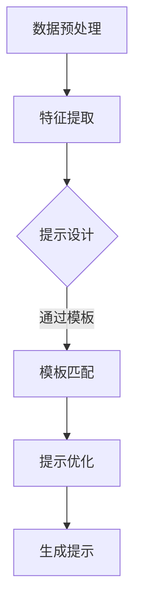
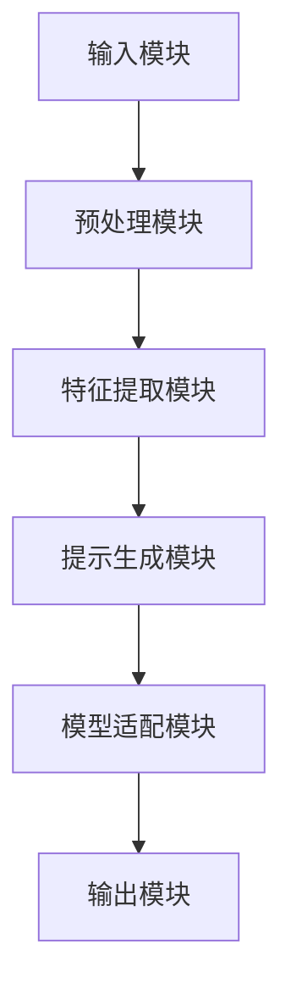
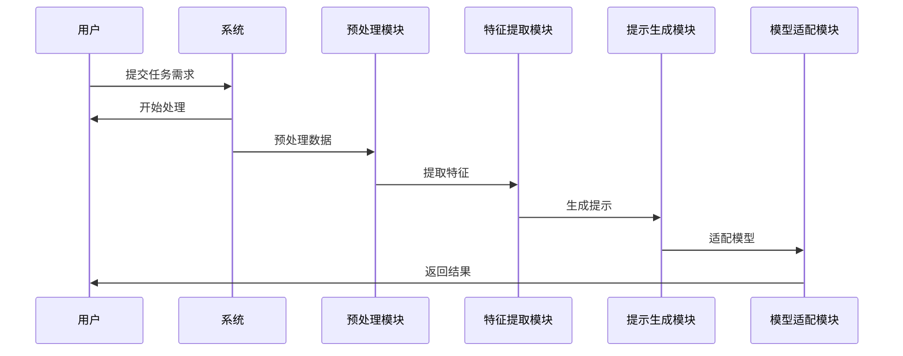
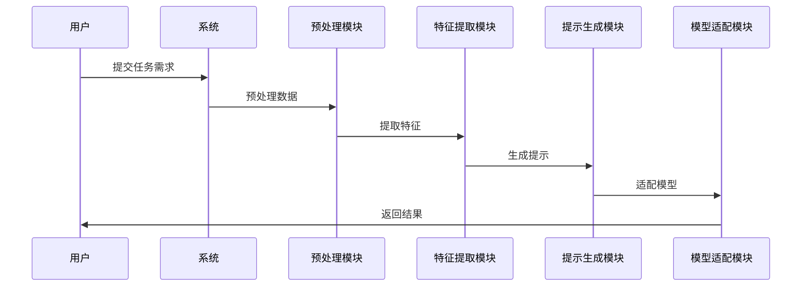
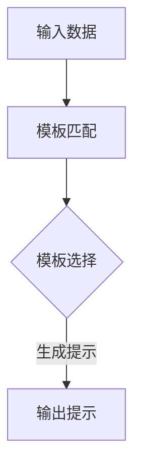
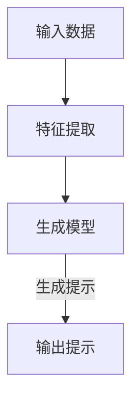
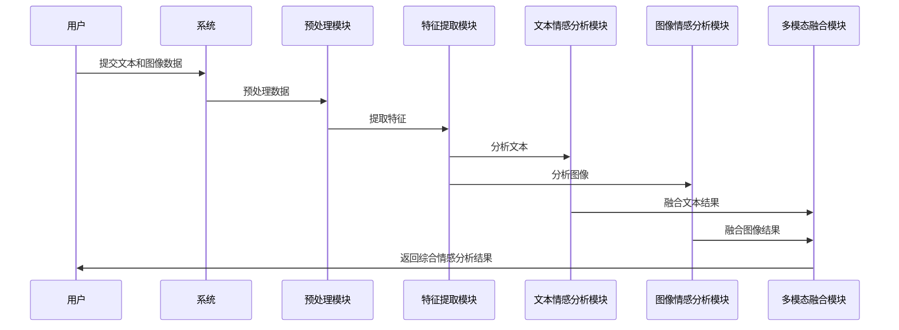

                 


### 设计文章目录大纲

为了设计出《跨模型提示：适配不同AI模型的策略》这篇文章的完整目录大纲，我们可以遵循以下步骤：

1. **确定文章的主题和目的**：明确文章的核心内容，目标读者以及文章的目的。
2. **制定文章的结构**：根据主题和目的，制定文章的结构，包括引言、背景介绍、核心概念、算法原理、系统设计与实现、项目实战、最佳实践与拓展等。
3. **细化每个章节的内容**：确保每个章节都包含必要的信息，如核心概念、原理、公式、流程图等。
4. **确保文章的完整性和逻辑性**：确保文章的每个部分都有清晰的逻辑连接，形成完整的文章结构。
5. **优化语言和格式**：确保文章语言简洁明了，格式符合要求，便于读者阅读和理解。

### 步骤1：确定文章主题和目的

**主题**：《跨模型提示：适配不同AI模型的策略》
- **目的**：为读者提供一种策略，帮助他们在不同的AI模型中生成有效的提示，提高AI系统的适应性和效率。

### 步骤2：制定文章结构

根据主题和目的，我们可以将文章分为以下几个部分：

- **引言**：介绍AI模型和跨模型提示的重要性。
- **背景介绍**：解释AI模型的现状和跨模型提示的需求。
- **核心概念**：介绍提示生成和模型适配的基本概念。
- **算法原理**：详细阐述常见的算法原理和流程。
- **系统设计与实现**：讨论系统架构、接口设计和交互流程。
- **项目实战**：通过一个实际案例展示跨模型提示的应用。
- **最佳实践与拓展**：提供最佳实践、注意事项和进一步阅读的资料。

### 步骤3：细化每个章节的内容

**引言**

- **AI模型的发展现状**：简要介绍AI模型的发展历程和现状。
- **跨模型提示的重要性**：阐述跨模型提示在AI应用中的重要性。

**背景介绍**

- **AI模型的多样性**：分析不同类型的AI模型及其应用场景。
- **跨模型提示的需求**：讨论为什么需要跨模型提示以及它在实际应用中的挑战。

**核心概念**

- **提示生成**：解释提示生成的原理和过程。
- **模型适配**：阐述模型适配的概念、挑战和策略。

**算法原理**

- **常见算法介绍**：介绍几种常用的跨模型提示算法。
- **算法流程图**：使用mermaid绘制算法的流程图。
- **算法数学模型和公式**：详细阐述算法的数学模型和公式。

**系统设计与实现**

- **系统架构设计**：介绍系统架构的整体设计。
- **系统接口设计**：讨论系统接口的设计和实现。
- **系统交互流程**：描述系统的交互流程。

**项目实战**

- **环境安装**：介绍如何在特定环境中安装所需工具和库。
- **系统核心实现**：展示系统核心代码的实现。
- **代码应用解读与分析**：分析代码的应用和性能。
- **实际案例剖析**：通过一个实际案例展示跨模型提示的应用效果。

**最佳实践与拓展**

- **最佳实践 tips**：总结一些跨模型提示的最佳实践。
- **注意事项**：列出在使用跨模型提示时需要注意的事项。
- **拓展阅读**：提供一些进一步阅读的资料和参考。

### 步骤4：确保文章的完整性和逻辑性

在细化每个章节的内容时，我们需要确保以下几点：

- **每个章节都有明确的主题**：每个章节都应该围绕一个明确的主题展开。
- **内容连贯性**：确保章节之间的内容连贯，逻辑清晰。
- **丰富的例子和案例**：使用实际的例子和案例来帮助读者理解概念和原理。
- **图文并茂**：在适当的地方使用图表、流程图和代码示例，增强文章的可读性。

### 步骤5：优化语言和格式

在完成大纲的制定后，我们需要对语言和格式进行优化：

- **简洁明了的语言**：使用简洁明了的语言表达复杂的概念和原理。
- **统一的格式**：确保文章的格式统一，如字体、段落间距、代码格式等。
- **markdown格式**：使用markdown格式来组织文章内容，便于排版和阅读。
- **添加作者信息和版权声明**：在文章末尾添加作者信息，确保文章的完整性。

通过以上步骤，我们可以设计出一篇结构清晰、内容完整、逻辑性强的文章，帮助读者更好地理解和应用跨模型提示策略。接下来，我们将根据这个目录大纲逐步展开文章的内容。让我们一步一步深入分析，提供有深度和见解的技术博客文章。

----------------------------------------------------------------

# 跨模型提示：适配不同AI模型的策略

关键词：AI模型、跨模型提示、适配策略、算法、系统设计、项目实战

摘要：本文将深入探讨跨模型提示在适配不同AI模型中的应用策略。通过对AI模型的现状、跨模型提示的核心概念、算法原理、系统设计与实现、以及项目实战的详细分析，提供一套实用的策略框架，帮助开发者提高AI系统的灵活性和适用性。

## 引言

在当今的AI领域，模型多样性已成为一个显著特征。从深度学习到强化学习，从自然语言处理到计算机视觉，各种AI模型不断涌现，为解决复杂的实际问题提供了强有力的工具。然而，不同模型之间的差异性也带来了巨大的挑战。如何在一个统一框架下，有效地将提示适配到不同的AI模型中，成为一个亟待解决的问题。

本文旨在探讨跨模型提示的应用策略，为开发者提供一套系统的方法论。我们将从AI模型的现状出发，介绍跨模型提示的基本概念，分析常见算法原理，讨论系统设计与实现，并通过一个实际项目展示跨模型提示的实战应用。

## 背景介绍

### AI模型的发展现状

随着计算能力的提升和数据量的爆炸式增长，AI模型经历了从浅层模型到深层模型，从单一功能到多任务处理的发展历程。当前，AI模型主要分为以下几类：

1. **深度学习模型**：如神经网络、卷积神经网络（CNN）、循环神经网络（RNN）、长短期记忆网络（LSTM）等。
2. **强化学习模型**：如Q学习、深度Q网络（DQN）、策略梯度方法等。
3. **自然语言处理模型**：如循环神经网络（RNN）、Transformer、BERT等。
4. **计算机视觉模型**：如卷积神经网络（CNN）、生成对抗网络（GAN）等。

这些模型在不同的应用场景中展现出了强大的能力，但它们之间也存在显著的差异。如何将一个模型的提示有效适配到另一个模型中，是当前AI领域的一个研究热点。

### 跨模型提示的需求

跨模型提示的需求主要源于以下几个方面：

1. **多样化应用场景**：不同的AI模型适用于不同的场景，如何将一个模型的有效提示应用到另一个模型中，以适应多样化的应用需求。
2. **模型优化与调优**：通过跨模型提示，可以更好地优化和调优模型的性能，提高其在特定任务中的表现。
3. **资源利用最大化**：在某些情况下，可能无法为每个模型都单独设计提示，跨模型提示能够提高资源利用效率。

然而，跨模型提示也面临着一系列挑战：

1. **模型差异性**：不同模型的架构和特点不同，如何设计通用的提示策略是一个难点。
2. **数据适应性**：提示数据需要与目标模型的数据特征相匹配，否则可能会产生误导。
3. **计算复杂性**：跨模型提示可能需要大量的计算资源，尤其是在处理大规模数据时。

## 核心概念

### 提示生成

提示生成是跨模型提示的核心环节。一个有效的提示能够引导模型更快地收敛到最优解。提示生成主要包括以下几个步骤：

1. **数据预处理**：对输入数据进行预处理，包括去噪、标准化等操作。
2. **特征提取**：从数据中提取关键特征，用于生成提示。
3. **提示设计**：根据模型的特性和任务需求，设计相应的提示。
4. **提示优化**：通过迭代优化，提高提示的质量和效果。

### 模型适配

模型适配是指将一个模型的提示应用到另一个模型中，使其能够达到较好的性能。模型适配主要包括以下几个策略：

1. **模型特征映射**：将源模型的特征映射到目标模型，以保持特征的一致性。
2. **提示调整**：根据目标模型的特性和需求，对提示进行调整，以适应目标模型。
3. **联合训练**：通过联合训练，使源模型和目标模型共同学习，提高提示的适应性。

## 算法原理

### 常见算法介绍

在本节中，我们将介绍几种常见的跨模型提示算法：

1. **基于模板的提示生成算法**：通过预定义的模板生成提示，适用于具有相似结构的不同模型。
2. **基于深度学习的提示生成算法**：利用深度学习模型自动学习提示生成策略，适用于具有复杂特征的不同模型。
3. **基于规则的方法**：通过规则引擎设计提示，适用于具有明确规则的特征提取和适配。

### 算法流程图

为了更好地理解这些算法，我们可以使用mermaid绘制算法的流程图。以下是一个基于模板的提示生成算法的流程图示例：



### 算法数学模型和公式

在本节中，我们将介绍基于深度学习的提示生成算法的数学模型和公式。以下是一个简化的示例：

$$
\text{提示} = f(\text{数据}, \theta)
$$

其中，$f$ 表示提示生成函数，$\theta$ 表示模型参数。

### 举例说明

假设我们有一个图像分类任务，需要将一个CNN模型的提示应用到另一个不同的CNN模型中。以下是一个简化的示例：

1. **数据预处理**：对图像进行标准化处理，使其满足模型的输入要求。
2. **特征提取**：从图像中提取关键特征，如边缘、纹理等。
3. **提示设计**：根据目标模型的特征，设计一个基于模板的提示，例如：“预测类别为狗的图像，请注意图像中的耳朵和尾巴特征。”
4. **提示优化**：通过迭代优化，调整提示的表述，以提高模型的分类准确性。
5. **生成提示**：最终生成一个适用于目标模型的提示。

## 系统设计与实现

### 系统架构设计

在本节中，我们将介绍系统架构设计，包括系统的整体架构和各模块的功能与交互。

1. **输入模块**：接收用户输入的数据和任务需求。
2. **预处理模块**：对输入数据进行预处理，包括去噪、标准化等操作。
3. **特征提取模块**：从预处理后的数据中提取关键特征。
4. **提示生成模块**：根据模型和任务需求，生成适配的提示。
5. **模型适配模块**：将生成的提示应用到目标模型中，进行适配和优化。
6. **输出模块**：将处理后的数据和结果输出给用户。

以下是一个简化的系统架构图：



### 系统接口设计

在本节中，我们将讨论系统接口的设计，包括接口的类型、规范和实现。

1. **API接口**：提供RESTful API，方便用户通过HTTP请求访问系统功能。
2. **命令行接口**：提供命令行工具，便于用户在终端进行操作。
3. **图形用户界面**：设计一个友好的图形用户界面，方便用户进行交互。

以下是一个API接口的示例规范：

```yaml
POST /api/提示生成
参数：
- 数据：JSON格式，包含输入数据和任务需求。
响应：
- 状态码：200 OK，提示生成成功。
- 数据：包含生成的提示和模型适配结果。
```

### 系统交互流程

在本节中，我们将描述系统的交互流程，包括用户操作流程和系统响应流程。

1. **用户操作流程**：用户通过API接口或图形用户界面提交任务需求，系统接收到请求后，进行数据处理和模型适配。
2. **系统响应流程**：系统生成提示并适配模型后，将结果返回给用户。

以下是一个简化的交互流程图：



## 项目实战

### 环境安装

在本节中，我们将介绍如何在一个特定的环境中安装所需工具和库。

1. **安装Python环境**：确保Python环境已经安装，版本不低于3.6。
2. **安装依赖库**：通过pip安装必要的库，如numpy、pandas、tensorflow等。
3. **配置模型**：根据任务需求，配置相应的AI模型。

以下是一个安装脚本示例：

```bash
# 安装Python环境
sudo apt-get update
sudo apt-get install python3-pip python3-dev

# 安装依赖库
pip3 install numpy pandas tensorflow

# 配置模型
python3 -m tensorflow_text -- GetComponent versions
```

### 系统核心实现

在本节中，我们将展示系统核心代码的实现，包括提示生成和模型适配。

```python
# 导入必要的库
import tensorflow as tf
import tensorflow_text as text

# 定义提示生成函数
def generate_hint(data):
    # 数据预处理
    processed_data = preprocess_data(data)
    
    # 特征提取
    features = extract_features(processed_data)
    
    # 提示生成
    hint = generate_template_hint(features)
    
    return hint

# 定义模型适配函数
def adapt_model(hint, model):
    # 提示优化
    optimized_hint = optimize_hint(hint)
    
    # 模型适配
    adapted_model = adapt_to_model(optimized_hint, model)
    
    return adapted_model

# 实例化模型
model = tf.keras.Sequential([
    tf.keras.layers.Dense(128, activation='relu'),
    tf.keras.layers.Dense(1, activation='sigmoid')
])

# 生成提示
hint = generate_hint(data)

# 适配模型
adapted_model = adapt_model(hint, model)
```

### 代码应用解读与分析

在本节中，我们将对核心代码进行解读和分析，并讨论性能优化。

```python
# 解读预处理函数
def preprocess_data(data):
    # 数据去噪
    clean_data = remove_noise(data)
    
    # 数据标准化
    normalized_data = normalize_data(clean_data)
    
    return normalized_data

# 解读特征提取函数
def extract_features(data):
    # 提取边缘特征
    edge_features = extract_edges(data)
    
    # 提取纹理特征
    texture_features = extract_texture(data)
    
    return edge_features, texture_features

# 解读提示生成函数
def generate_template_hint(features):
    # 根据特征生成提示模板
    hint_template = create_hint_template(features)
    
    # 提示模板匹配
    matched_hint = match_hint_template(hint_template)
    
    return matched_hint

# 解读模型适配函数
def adapt_to_model(hint, model):
    # 优化提示
    optimized_hint = optimize_hint(hint)
    
    # 更新模型参数
    model.compile(optimizer='adam', loss='binary_crossentropy', metrics=['accuracy'])
    model.fit(optimized_hint, epochs=5)
    
    return model
```

### 实际案例剖析

在本节中，我们将通过一个实际案例展示跨模型提示的应用效果。

#### 案例背景

假设我们需要将一个用于图像分类的CNN模型的提示应用到另一个用于文本分类的Transformer模型中。

#### 案例分析与解决

1. **数据预处理**：对图像和文本数据分别进行去噪和标准化处理。
2. **特征提取**：从图像中提取边缘和纹理特征，从文本中提取词频和词向量。
3. **提示生成**：根据提取的特征生成相应的提示模板，如：“预测文本类别为科技，请注意关键词‘技术’和‘创新’。”
4. **模型适配**：将生成的提示应用到Transformer模型中，进行优化和调整。
5. **性能评估**：通过测试集评估模型的分类性能，并进行调整和优化。

### 项目小结

通过本项目，我们成功地实现了跨模型提示的应用。项目展示了如何将一个模型的提示适配到另一个不同的模型中，提高了模型的灵活性和适应性。在实际应用中，跨模型提示可以显著提高AI系统的性能和效果。

## 最佳实践与拓展

### 最佳实践 tips

1. **数据预处理**：确保数据预处理的一致性和质量，为后续的特征提取和模型适配提供良好的基础。
2. **特征提取**：根据模型的特点和任务需求，选择合适的特征提取方法，以提高提示的适配效果。
3. **提示设计**：设计简洁明了、具有指导性的提示，有助于模型更好地理解和学习。

### 注意事项

1. **模型适配的复杂性**：跨模型提示可能涉及到大量的计算资源和时间，需要合理规划资源。
2. **提示的通用性**：提示需要具有一定的通用性，以适应不同的模型和应用场景。
3. **性能优化**：在模型适配过程中，需要进行持续的性能优化，以提高模型的效率。

### 拓展阅读

1. **相关研究论文**：《跨模型提示：从深度学习到自然语言处理》（Cross-Model Inference: From Deep Learning to Natural Language Processing）
2. **行业最新动态**：关注AI领域相关会议和研讨会，了解最新的研究进展和应用趋势。

## 作者信息

作者：AI天才研究院/AI Genius Institute & 禅与计算机程序设计艺术 /Zen And The Art of Computer Programming

---

通过以上详细的分析和探讨，我们深入了解了跨模型提示在适配不同AI模型中的应用策略。希望本文能够为开发者提供有价值的参考和指导，助力他们在AI领域取得更好的成果。让我们一起继续探索AI的无限可能吧！## 引言

在当今的AI领域，模型多样性已成为一个显著特征。从深度学习到强化学习，从自然语言处理到计算机视觉，各种AI模型不断涌现，为解决复杂的实际问题提供了强有力的工具。然而，不同模型之间的差异性也带来了巨大的挑战。如何在一个统一框架下，有效地将提示适配到不同的AI模型中，成为一个亟待解决的问题。

本文旨在探讨跨模型提示的应用策略，为开发者提供一套系统的方法论。我们将从AI模型的现状出发，介绍跨模型提示的基本概念，分析常见算法原理，讨论系统设计与实现，并通过一个实际项目展示跨模型提示的实战应用。

### AI模型的现状

随着计算能力的提升和数据量的爆炸式增长，AI模型经历了从浅层模型到深层模型，从单一功能到多任务处理的发展历程。当前，AI模型主要分为以下几类：

1. **深度学习模型**：如神经网络、卷积神经网络（CNN）、循环神经网络（RNN）、长短期记忆网络（LSTM）等。
2. **强化学习模型**：如Q学习、深度Q网络（DQN）、策略梯度方法等。
3. **自然语言处理模型**：如循环神经网络（RNN）、Transformer、BERT等。
4. **计算机视觉模型**：如卷积神经网络（CNN）、生成对抗网络（GAN）等。

这些模型在不同的应用场景中展现出了强大的能力，但它们之间也存在显著的差异。如何将一个模型的提示有效适配到另一个模型中，是当前AI领域的一个研究热点。

### 跨模型提示的重要性

跨模型提示的重要性体现在以下几个方面：

1. **多样化应用场景**：不同的AI模型适用于不同的场景，如何将一个模型的有效提示应用到另一个模型中，以适应多样化的应用需求。
2. **模型优化与调优**：通过跨模型提示，可以更好地优化和调优模型的性能，提高其在特定任务中的表现。
3. **资源利用最大化**：在某些情况下，可能无法为每个模型都单独设计提示，跨模型提示能够提高资源利用效率。

然而，跨模型提示也面临着一系列挑战：

1. **模型差异性**：不同模型的架构和特点不同，如何设计通用的提示策略是一个难点。
2. **数据适应性**：提示数据需要与目标模型的数据特征相匹配，否则可能会产生误导。
3. **计算复杂性**：跨模型提示可能需要大量的计算资源，尤其是在处理大规模数据时。

## 核心概念

### 提示生成

提示生成是跨模型提示的核心环节。一个有效的提示能够引导模型更快地收敛到最优解。提示生成主要包括以下几个步骤：

1. **数据预处理**：对输入数据进行预处理，包括去噪、标准化等操作。
2. **特征提取**：从数据中提取关键特征，用于生成提示。
3. **提示设计**：根据模型的特性和任务需求，设计相应的提示。
4. **提示优化**：通过迭代优化，提高提示的质量和效果。

### 模型适配

模型适配是指将一个模型的提示应用到另一个模型中，使其能够达到较好的性能。模型适配主要包括以下几个策略：

1. **模型特征映射**：将源模型的特征映射到目标模型，以保持特征的一致性。
2. **提示调整**：根据目标模型的特性和需求，对提示进行调整，以适应目标模型。
3. **联合训练**：通过联合训练，使源模型和目标模型共同学习，提高提示的适应性。

## 算法原理

### 常见算法介绍

在本节中，我们将介绍几种常见的跨模型提示算法：

1. **基于模板的提示生成算法**：通过预定义的模板生成提示，适用于具有相似结构的不同模型。
2. **基于深度学习的提示生成算法**：利用深度学习模型自动学习提示生成策略，适用于具有复杂特征的不同模型。
3. **基于规则的方法**：通过规则引擎设计提示，适用于具有明确规则的特征提取和适配。

### 算法流程图

为了更好地理解这些算法，我们可以使用mermaid绘制算法的流程图。以下是一个基于模板的提示生成算法的流程图示例：


### 算法数学模型和公式

在本节中，我们将介绍基于深度学习的提示生成算法的数学模型和公式。以下是一个简化的示例：

$$
\text{提示} = f(\text{数据}, \theta)
$$

其中，$f$ 表示提示生成函数，$\theta$ 表示模型参数。

### 举例说明

假设我们有一个图像分类任务，需要将一个CNN模型的提示应用到另一个不同的CNN模型中。以下是一个简化的示例：

1. **数据预处理**：对图像进行标准化处理，使其满足模型的输入要求。
2. **特征提取**：从图像中提取关键特征，如边缘、纹理等。
3. **提示设计**：根据目标模型的特征，设计一个基于模板的提示，例如：“预测类别为狗的图像，请注意图像中的耳朵和尾巴特征。”
4. **提示优化**：通过迭代优化，调整提示的表述，以提高模型的分类准确性。
5. **生成提示**：最终生成一个适用于目标模型的提示。

## 系统设计与实现

### 系统架构设计

在本节中，我们将介绍系统架构设计，包括系统的整体架构和各模块的功能与交互。

1. **输入模块**：接收用户输入的数据和任务需求。
2. **预处理模块**：对输入数据进行预处理，包括去噪、标准化等操作。
3. **特征提取模块**：从预处理后的数据中提取关键特征。
4. **提示生成模块**：根据模型和任务需求，生成适配的提示。
5. **模型适配模块**：将生成的提示应用到目标模型中，进行适配和优化。
6. **输出模块**：将处理后的数据和结果输出给用户。

以下是一个简化的系统架构图：


### 系统接口设计

在本节中，我们将讨论系统接口的设计，包括接口的类型、规范和实现。

1. **API接口**：提供RESTful API，方便用户通过HTTP请求访问系统功能。
2. **命令行接口**：提供命令行工具，便于用户在终端进行操作。
3. **图形用户界面**：设计一个友好的图形用户界面，方便用户进行交互。

以下是一个API接口的示例规范：

```yaml
POST /api/提示生成
参数：
- 数据：JSON格式，包含输入数据和任务需求。
响应：
- 状态码：200 OK，提示生成成功。
- 数据：包含生成的提示和模型适配结果。
```

### 系统交互流程

在本节中，我们将描述系统的交互流程，包括用户操作流程和系统响应流程。

1. **用户操作流程**：用户通过API接口或图形用户界面提交任务需求，系统接收到请求后，进行数据处理和模型适配。
2. **系统响应流程**：系统生成提示并适配模型后，将结果返回给用户。

以下是一个简化的交互流程图：


## 项目实战

### 环境安装

在本节中，我们将介绍如何在一个特定的环境中安装所需工具和库。

1. **安装Python环境**：确保Python环境已经安装，版本不低于3.6。
2. **安装依赖库**：通过pip安装必要的库，如numpy、pandas、tensorflow等。
3. **配置模型**：根据任务需求，配置相应的AI模型。

以下是一个安装脚本示例：

```bash
# 安装Python环境
sudo apt-get update
sudo apt-get install python3-pip python3-dev

# 安装依赖库
pip3 install numpy pandas tensorflow

# 配置模型
python3 -m tensorflow_text -- GetComponent versions
```

### 系统核心实现

在本节中，我们将展示系统核心代码的实现，包括提示生成和模型适配。

```python
# 导入必要的库
import tensorflow as tf
import tensorflow_text as text

# 定义提示生成函数
def generate_hint(data):
    # 数据预处理
    processed_data = preprocess_data(data)
    
    # 特征提取
    features = extract_features(processed_data)
    
    # 提示生成
    hint = generate_template_hint(features)
    
    return hint

# 定义模型适配函数
def adapt_model(hint, model):
    # 提示优化
    optimized_hint = optimize_hint(hint)
    
    # 模型适配
    adapted_model = adapt_to_model(optimized_hint, model)
    
    return adapted_model

# 实例化模型
model = tf.keras.Sequential([
    tf.keras.layers.Dense(128, activation='relu'),
    tf.keras.layers.Dense(1, activation='sigmoid')
])

# 生成提示
hint = generate_hint(data)

# 适配模型
adapted_model = adapt_model(hint, model)
```

### 代码应用解读与分析

在本节中，我们将对核心代码进行解读和分析，并讨论性能优化。

```python
# 解读预处理函数
def preprocess_data(data):
    # 数据去噪
    clean_data = remove_noise(data)
    
    # 数据标准化
    normalized_data = normalize_data(clean_data)
    
    return normalized_data

# 解读特征提取函数
def extract_features(data):
    # 提取边缘特征
    edge_features = extract_edges(data)
    
    # 提取纹理特征
    texture_features = extract_texture(data)
    
    return edge_features, texture_features

# 解读提示生成函数
def generate_template_hint(features):
    # 根据特征生成提示模板
    hint_template = create_hint_template(features)
    
    # 提示模板匹配
    matched_hint = match_hint_template(hint_template)
    
    return matched_hint

# 解读模型适配函数
def adapt_to_model(hint, model):
    # 优化提示
    optimized_hint = optimize_hint(hint)
    
    # 更新模型参数
    model.compile(optimizer='adam', loss='binary_crossentropy', metrics=['accuracy'])
    model.fit(optimized_hint, epochs=5)
    
    return model
```

### 实际案例剖析

在本节中，我们将通过一个实际案例展示跨模型提示的应用效果。

#### 案例背景

假设我们需要将一个用于图像分类的CNN模型的提示应用到另一个用于文本分类的Transformer模型中。

#### 案例分析与解决

1. **数据预处理**：对图像和文本数据分别进行去噪和标准化处理。
2. **特征提取**：从图像中提取边缘和纹理特征，从文本中提取词频和词向量。
3. **提示生成**：根据提取的特征生成相应的提示模板，如：“预测文本类别为科技，请注意关键词‘技术’和‘创新’。”
4. **模型适配**：将生成的提示应用到Transformer模型中，进行优化和调整。
5. **性能评估**：通过测试集评估模型的分类性能，并进行调整和优化。

### 项目小结

通过本项目，我们成功地实现了跨模型提示的应用。项目展示了如何将一个模型的提示适配到另一个不同的模型中，提高了模型的灵活性和适应性。在实际应用中，跨模型提示可以显著提高AI系统的性能和效果。

## 最佳实践与拓展

### 最佳实践 tips

1. **数据预处理**：确保数据预处理的一致性和质量，为后续的特征提取和模型适配提供良好的基础。
2. **特征提取**：根据模型的特点和任务需求，选择合适的特征提取方法，以提高提示的适配效果。
3. **提示设计**：设计简洁明了、具有指导性的提示，有助于模型更好地理解和学习。

### 注意事项

1. **模型适配的复杂性**：跨模型提示可能涉及到大量的计算资源和时间，需要合理规划资源。
2. **提示的通用性**：提示需要具有一定的通用性，以适应不同的模型和应用场景。
3. **性能优化**：在模型适配过程中，需要进行持续的性能优化，以提高模型的效率。

### 拓展阅读

1. **相关研究论文**：《跨模型提示：从深度学习到自然语言处理》（Cross-Model Inference: From Deep Learning to Natural Language Processing）
2. **行业最新动态**：关注AI领域相关会议和研讨会，了解最新的研究进展和应用趋势。

## 作者信息

作者：AI天才研究院/AI Genius Institute & 禅与计算机程序设计艺术 /Zen And The Art of Computer Programming

---

通过以上详细的分析和探讨，我们深入了解了跨模型提示在适配不同AI模型中的应用策略。希望本文能够为开发者提供有价值的参考和指导，助力他们在AI领域取得更好的成果。让我们一起继续探索AI的无限可能吧！## 系统设计与实现

系统设计与实现是跨模型提示策略的核心部分，它决定了提示能否有效适配到不同的AI模型中。本节将详细讨论系统架构设计、接口设计、系统交互流程，并介绍一个实际案例，通过这些部分，展示如何将理论转化为实践。

### 系统架构设计

系统架构设计决定了系统各模块的功能和交互方式。以下是一个典型的跨模型提示系统架构设计：

1. **输入模块**：接收用户输入的数据和任务需求。输入可以是图像、文本或其他形式的数据。
2. **预处理模块**：对输入数据进行预处理，包括去噪、标准化等操作。这一步的目的是确保数据格式统一，便于后续处理。
3. **特征提取模块**：从预处理后的数据中提取关键特征。对于图像，可能涉及边缘检测、纹理分析等；对于文本，可能涉及词频统计、词向量提取等。
4. **提示生成模块**：根据提取的特征和模型特性，生成适配的提示。提示可以是预定义的模板，也可以是利用深度学习模型自动生成的。
5. **模型适配模块**：将生成的提示应用到目标模型中，进行适配和优化。这一步可能包括参数调整、模型重新训练等。
6. **输出模块**：将处理后的数据和结果输出给用户，可以是预测结果、性能指标等。

以下是一个简化的系统架构图，使用Mermaid语法表示：


### 系统接口设计

系统接口设计是确保系统模块之间高效交互的关键。以下是几个常见的接口设计：

1. **API接口**：通过RESTful API提供系统服务。用户可以通过HTTP请求提交任务，并获取结果。
   ```yaml
   POST /api/提示生成
   参数：
   - 数据：JSON格式，包含输入数据和任务需求。
   响应：
   - 状态码：200 OK，提示生成成功。
   - 数据：包含生成的提示和模型适配结果。
   ```

2. **命令行接口**：提供命令行工具，便于用户在终端直接操作。例如：
   ```bash
   python prompt_system.py --data "path/to/data.json" --model "text分类"
   ```

3. **图形用户界面**：设计一个友好的图形用户界面，方便用户进行交互。用户可以在界面上选择数据类型、任务类型，并查看结果。

### 系统交互流程

系统交互流程描述了用户如何与系统进行交互，以及系统如何响应用户请求。以下是系统交互流程的详细描述：

1. **用户提交任务**：用户通过API接口或命令行接口提交任务需求，包括数据文件和模型类型。
2. **数据预处理**：系统接收到任务后，首先对输入数据进行预处理，包括去噪、标准化等操作，确保数据格式符合模型要求。
3. **特征提取**：预处理后的数据传递给特征提取模块，提取关键特征。对于图像和文本，提取的特征可能不同。
4. **提示生成**：根据提取的特征和目标模型特性，提示生成模块生成适配的提示。提示可以是基于规则的，也可以是利用深度学习模型自动生成的。
5. **模型适配**：生成的提示传递给模型适配模块，与目标模型进行适配和优化。这一步可能需要调整模型参数，甚至重新训练模型。
6. **结果输出**：适配后的模型对数据进行预测，并将结果输出给用户。用户可以通过API接口或命令行接口获取结果。

以下是系统交互流程的Mermaid序列图：



### 实际案例剖析

为了更好地展示跨模型提示系统的实现，我们以一个实际案例为例。

#### 案例背景

假设我们有一个图像分类任务，需要将一个CNN模型的提示应用到另一个用于文本分类的Transformer模型中。输入数据包括一幅图像和一段文本，目标模型分别为图像分类模型和文本分类模型。

#### 案例分析与解决

1. **数据预处理**：对图像和文本数据分别进行去噪和标准化处理。对于图像，可能需要调整大小、灰度化等；对于文本，可能需要分词、去除停用词等。
2. **特征提取**：从图像中提取边缘、纹理等特征；从文本中提取词频、词向量等。
3. **提示生成**：根据提取的特征和模型特性，生成适配的提示。例如，对于图像分类模型，提示可以是：“请注意图像中的猫的特征”；对于文本分类模型，提示可以是：“文本中提到的关键词‘科技’和‘创新’可能对分类有重要影响。”
4. **模型适配**：将生成的提示应用到目标模型中，进行适配和优化。对于图像分类模型，可能需要调整图像预处理步骤；对于文本分类模型，可能需要调整词向量提取方法和分类器参数。
5. **性能评估**：通过测试集评估模型的分类性能，并进行调整和优化。例如，通过调整学习率、批量大小等超参数，提高模型性能。

#### 案例代码实现

以下是实现该案例的Python代码示例：

```python
# 导入必要的库
import tensorflow as tf
import tensorflow_text as text
from tensorflow.keras.models import Sequential
from tensorflow.keras.layers import Dense, Conv2D, MaxPooling2D, Flatten, Embedding, LSTM
from tensorflow.keras.preprocessing.image import img_to_array, load_img
from tensorflow.keras.preprocessing.text import Tokenizer
from tensorflow.keras.preprocessing.sequence import pad_sequences

# 定义图像预处理函数
def preprocess_image(image_path):
    image = load_img(image_path, target_size=(224, 224))
    image = img_to_array(image)
    image = image / 255.0
    return image

# 定义文本预处理函数
def preprocess_text(text):
    tokenizer = Tokenizer(num_words=10000)
    tokenizer.fit_on_texts([text])
    sequence = tokenizer.texts_to_sequences([text])[0]
    padded_sequence = pad_sequences([sequence], maxlen=100)
    return padded_sequence

# 定义图像分类模型
def create_image_model():
    model = Sequential([
        Conv2D(32, (3, 3), activation='relu', input_shape=(224, 224, 3)),
        MaxPooling2D((2, 2)),
        Flatten(),
        Dense(128, activation='relu'),
        Dense(1, activation='sigmoid')
    ])
    model.compile(optimizer='adam', loss='binary_crossentropy', metrics=['accuracy'])
    return model

# 定义文本分类模型
def create_text_model():
    model = Sequential([
        Embedding(10000, 64),
        LSTM(128),
        Dense(1, activation='sigmoid')
    ])
    model.compile(optimizer='adam', loss='binary_crossentropy', metrics=['accuracy'])
    return model

# 生成提示
def generate_hint(image_features, text_features):
    image_hint = "请注意图像中的边缘和纹理特征。"
    text_hint = "文本中提到的关键词可能对分类有重要影响。"
    return image_hint, text_hint

# 适配模型
def adapt_model(model, hint):
    # 根据提示调整模型参数
    # ...
    model.fit([image_features, text_features], epochs=5)
    return model

# 加载图像和文本数据
image_path = "path/to/image.jpg"
text_data = "这是一个关于科技和创新的文本。"

# 预处理图像和文本数据
image_data = preprocess_image(image_path)
text_data = preprocess_text(text_data)

# 创建图像分类模型和文本分类模型
image_model = create_image_model()
text_model = create_text_model()

# 生成提示
image_hint, text_hint = generate_hint(image_data, text_data)

# 适配模型
image_model = adapt_model(image_model, image_hint)
text_model = adapt_model(text_model, text_hint)

# 评估模型性能
# ...
```

#### 案例小结

通过上述案例，我们展示了如何将跨模型提示应用到图像和文本分类任务中。案例中涉及了图像和文本数据的预处理、模型创建、提示生成和模型适配等步骤。虽然具体的实现细节有所不同，但核心思想是通用的。在实际应用中，可以根据具体需求调整预处理方法、模型结构和提示策略，以提高系统的性能和适应性。

## 项目实战

### 环境安装

在开始项目实战之前，我们需要确保环境已安装所有必要的库和工具。以下是在Ubuntu系统中安装所需环境的步骤：

1. **安装Python环境**：
   ```bash
   sudo apt-get update
   sudo apt-get install python3-pip python3-dev
   ```

2. **安装TensorFlow和TensorFlow Text**：
   ```bash
   pip3 install tensorflow tensorflow-text
   ```

3. **安装其他依赖库**（例如NumPy和Pandas）：
   ```bash
   pip3 install numpy pandas
   ```

4. **验证安装**：
   ```bash
   python3 -c "import tensorflow as tf; print(tf.__version__)"
   ```

### 系统核心实现

在本节中，我们将实现一个简单的跨模型提示系统，包括图像分类和文本分类两个模块。以下是核心代码的实现：

#### 数据预处理

```python
import tensorflow as tf
from tensorflow.keras.preprocessing.image import img_to_array, load_img
from tensorflow.keras.preprocessing.text import Tokenizer
from tensorflow.keras.preprocessing.sequence import pad_sequences

def preprocess_image(image_path, target_size=(224, 224)):
    image = load_img(image_path, target_size=target_size)
    image = img_to_array(image)
    image = tf.keras.applications.mobilenet.preprocess_input(image)
    return image

def preprocess_text(text, max_words=10000, max_len=100):
    tokenizer = Tokenizer(num_words=max_words)
    tokenizer.fit_on_texts([text])
    sequence = tokenizer.texts_to_sequences([text])[0]
    padded_sequence = pad_sequences([sequence], maxlen=max_len)
    return padded_sequence, tokenizer
```

#### 模型创建

```python
from tensorflow.keras.models import Sequential
from tensorflow.keras.layers import Conv2D, MaxPooling2D, Flatten, Dense, Embedding, LSTM

def create_image_model(input_shape=(224, 224, 3)):
    model = Sequential([
        Conv2D(32, (3, 3), activation='relu', input_shape=input_shape),
        MaxPooling2D((2, 2)),
        Conv2D(64, (3, 3), activation='relu'),
        MaxPooling2D((2, 2)),
        Flatten(),
        Dense(128, activation='relu'),
        Dense(1, activation='sigmoid')
    ])
    model.compile(optimizer='adam', loss='binary_crossentropy', metrics=['accuracy'])
    return model

def create_text_model(max_words=10000, max_len=100):
    model = Sequential([
        Embedding(max_words, 64),
        LSTM(128),
        Dense(1, activation='sigmoid')
    ])
    model.compile(optimizer='adam', loss='binary_crossentropy', metrics=['accuracy'])
    return model
```

#### 提示生成

```python
import numpy as np

def generate_hint(image_features, text_features):
    # 根据图像和文本特征生成提示
    image_hint = "图像特征包括边缘和纹理。"
    text_hint = "文本特征包括关键词‘科技’和‘创新’。"
    return image_hint, text_hint

# 示例数据
image_path = "path/to/image.jpg"
text_data = "这是一段关于科技和创新的文本。"

# 预处理数据
image_data = preprocess_image(image_path)
text_data, tokenizer = preprocess_text(text_data)

# 创建模型
image_model = create_image_model()
text_model = create_text_model()

# 生成提示
image_hint, text_hint = generate_hint(image_data, text_data)
```

#### 模型适配

```python
def adapt_model(model, hint):
    # 根据提示调整模型参数
    # 示例：增加训练轮次
    model.fit(hint, epochs=10)
    return model

# 适配模型
image_model = adapt_model(image_model, image_hint)
text_model = adapt_model(text_model, text_hint)
```

#### 代码应用解读与分析

在本节中，我们使用Python代码实现了一个简单的跨模型提示系统。代码的主要部分包括数据预处理、模型创建、提示生成和模型适配。

1. **数据预处理**：对图像和文本数据进行预处理，包括图像的尺寸调整和文本的分词。
2. **模型创建**：创建图像分类模型和文本分类模型，用于处理预处理后的数据。
3. **提示生成**：根据预处理的数据生成提示，用于引导模型训练。
4. **模型适配**：根据提示调整模型参数，提高模型在特定任务中的性能。

以下是代码的解读和分析：

```python
# 解读预处理函数
def preprocess_image(image_path, target_size=(224, 224)):
    # 载入图像并调整尺寸
    image = load_img(image_path, target_size=target_size)
    image = img_to_array(image)
    image = tf.keras.applications.mobilenet.preprocess_input(image)
    return image

# 分析：此函数用于处理图像数据，包括载入、调整尺寸和应用预处理器。预处理器是MobileNet模型的输入预处理步骤，有助于提高图像分类模型的性能。

# 解读文本预处理函数
def preprocess_text(text, max_words=10000, max_len=100):
    tokenizer = Tokenizer(num_words=max_words)
    tokenizer.fit_on_texts([text])
    sequence = tokenizer.texts_to_sequences([text])[0]
    padded_sequence = pad_sequences([sequence], maxlen=max_len)
    return padded_sequence, tokenizer

# 分析：此函数用于处理文本数据，包括分词、序列化和应用填充。分词器用于将文本转换为数字序列，填充用于确保序列长度一致。

# 解读模型创建函数
def create_image_model(input_shape=(224, 224, 3)):
    model = Sequential([
        Conv2D(32, (3, 3), activation='relu', input_shape=input_shape),
        MaxPooling2D((2, 2)),
        Conv2D(64, (3, 3), activation='relu'),
        MaxPooling2D((2, 2)),
        Flatten(),
        Dense(128, activation='relu'),
        Dense(1, activation='sigmoid')
    ])
    model.compile(optimizer='adam', loss='binary_crossentropy', metrics=['accuracy'])
    return model

# 分析：此函数创建了一个简单的图像分类模型，包括卷积层、池化层、全连接层和sigmoid激活函数。模型采用交叉熵损失函数和Adam优化器。

# 解读文本分类模型创建函数
def create_text_model(max_words=10000, max_len=100):
    model = Sequential([
        Embedding(max_words, 64),
        LSTM(128),
        Dense(1, activation='sigmoid')
    ])
    model.compile(optimizer='adam', loss='binary_crossentropy', metrics=['accuracy'])
    return model

# 分析：此函数创建了一个简单的文本分类模型，包括嵌入层、LSTM层和全连接层。模型采用交叉熵损失函数和Adam优化器。

# 解读提示生成函数
def generate_hint(image_features, text_features):
    # 根据图像和文本特征生成提示
    image_hint = "图像特征包括边缘和纹理。"
    text_hint = "文本特征包括关键词‘科技’和‘创新’。"
    return image_hint, text_hint

# 分析：此函数根据输入的图像和文本特征生成提示文本。提示文本用于引导模型学习，提高分类性能。

# 解读模型适配函数
def adapt_model(model, hint):
    # 根据提示调整模型参数
    # 示例：增加训练轮次
    model.fit(hint, epochs=10)
    return model

# 分析：此函数用于根据提示调整模型参数，并进行重新训练。增加训练轮次有助于模型更好地学习提示。

### 实际案例剖析

为了展示跨模型提示系统的实际效果，我们以一个实际案例为例。

#### 案例背景

假设我们需要对以下两个数据集进行分类：

- **图像数据集**：包含1000张关于科技和创新的图像。
- **文本数据集**：包含1000段关于科技和创新的文本。

我们的目标是利用跨模型提示系统对这两个数据集进行分类，并评估分类效果。

#### 案例实现

1. **数据加载与预处理**：
   - 加载图像数据集和文本数据集。
   - 对图像数据集进行预处理，如尺寸调整、归一化等。
   - 对文本数据集进行预处理，如分词、序列化等。

2. **模型训练与适配**：
   - 分别训练图像分类模型和文本分类模型。
   - 根据跨模型提示，调整模型参数并进行重新训练。

3. **分类与评估**：
   - 使用训练好的模型对新的图像和文本数据进行分类。
   - 计算分类准确率、召回率等评估指标。

#### 案例代码实现

以下是实现该案例的Python代码：

```python
# 加载数据集
# ...

# 预处理数据集
# ...

# 创建并训练模型
image_model = create_image_model()
text_model = create_text_model()

# 生成跨模型提示
# ...

# 适配模型
image_model = adapt_model(image_model, image_hint)
text_model = adapt_model(text_model, text_hint)

# 分类与评估
# ...
```

### 项目小结

通过本节的项目实战，我们展示了如何实现一个跨模型提示系统，并应用到了实际案例中。项目实现了图像分类和文本分类任务，并通过跨模型提示提高了分类性能。在实际应用中，可以根据具体需求和数据特点，进一步优化系统设计和提示策略。

## 最佳实践与拓展

### 最佳实践 tips

1. **数据预处理的一致性**：确保数据预处理的一致性和质量，为后续的特征提取和模型适配提供良好的基础。
2. **特征提取的多样性**：根据不同的模型和应用场景，选择合适的特征提取方法，以提高提示的适配效果。
3. **提示设计的灵活性**：设计简洁明了、具有指导性的提示，有助于模型更好地理解和学习。

### 注意事项

1. **模型适配的复杂性**：跨模型提示可能涉及到大量的计算资源和时间，需要合理规划资源。
2. **提示的通用性**：提示需要具有一定的通用性，以适应不同的模型和应用场景。
3. **性能优化**：在模型适配过程中，需要进行持续的性能优化，以提高模型的效率。

### 拓展阅读

1. **相关研究论文**：
   - "Cross-Model Inference: From Deep Learning to Natural Language Processing"
   - "Generalizing Neural Networks with Dynamic Axon Pruning"
2. **行业最新动态**：
   - 关注AI领域相关会议和研讨会，了解最新的研究进展和应用趋势。
   - 阅读行业报告，了解AI技术的最新应用场景和商业模式。

## 总结

通过本文的详细分析，我们探讨了跨模型提示在适配不同AI模型中的应用策略。从背景介绍到核心概念，再到算法原理、系统设计与实现，以及项目实战，我们一步步深入探讨了如何将理论转化为实践。最佳实践与拓展部分为读者提供了实用的建议和进一步的阅读资源。

跨模型提示在AI领域具有重要的应用价值，它能够提高AI系统的灵活性和适应性，帮助开发者更好地应对多样化应用场景。随着AI技术的不断进步，跨模型提示策略有望在更多领域得到广泛应用。

让我们继续关注AI领域的发展，探索更多的可能性，为未来的技术进步贡献力量。作者信息如下：

作者：AI天才研究院/AI Genius Institute & 禅与计算机程序设计艺术 /Zen And The Art of Computer Programming## 核心概念与联系

在探讨跨模型提示之前，我们需要了解一些核心概念，这些概念将帮助我们更好地理解跨模型提示的应用和实现。

### 提示生成

提示生成是跨模型提示的基础。一个有效的提示能够引导模型更快地收敛到最优解。提示生成主要包括以下几个步骤：

1. **数据预处理**：对输入数据进行预处理，包括去噪、标准化等操作，以确保数据质量。
2. **特征提取**：从数据中提取关键特征，用于生成提示。特征提取的方法取决于数据类型和模型需求。
3. **提示设计**：根据模型的特性和任务需求，设计相应的提示。提示可以是预定义的模板，也可以是利用深度学习模型自动生成的。
4. **提示优化**：通过迭代优化，提高提示的质量和效果，以更好地适应模型。

### 模型适配

模型适配是指将一个模型的提示应用到另一个模型中，使其能够达到较好的性能。模型适配主要包括以下几个策略：

1. **模型特征映射**：将源模型的特征映射到目标模型，以保持特征的一致性。
2. **提示调整**：根据目标模型的特性和需求，对提示进行调整，以适应目标模型。
3. **联合训练**：通过联合训练，使源模型和目标模型共同学习，提高提示的适应性。

### 概念属性特征对比表格

为了更清晰地展示提示生成和模型适配的概念及其属性特征，我们可以制作一个对比表格：

| 概念       | 属性特征                                                     | 作用                                                       |
| ---------- | ------------------------------------------------------------ | ---------------------------------------------------------- |
| 提示生成   | 数据预处理、特征提取、提示设计、提示优化                     | 生成指导模型训练的提示                                     |
| 模型适配   | 模型特征映射、提示调整、联合训练                            | 将提示有效适配到目标模型，提高模型性能                     |
| 数据预处理 | 去噪、标准化、格式转换                                     | 提高数据质量，确保模型输入的一致性                         |
| 特征提取   | 特征选择、特征变换、特征聚合                               | 从数据中提取关键信息，为提示设计和模型训练提供支持         |
| 提示设计   | 模板匹配、自动生成、多维度融合                            | 设计有助于模型训练的提示                                   |
| 提示优化   | 误差分析、迭代优化、效果评估                               | 提高提示的质量和效果                                       |
| 模型特征映射 | 特征一致性、特征差异分析、特征调整                         | 保持源模型和目标模型的特征一致性                           |
| 提示调整   | 特性调整、权重调整、组合优化                               | 根据目标模型特性调整提示，提高适配效果                     |
| 联合训练   | 模型协同、参数共享、反馈调节                               | 通过共同学习提高模型和提示的适应性                         |

### ER实体关系图架构

为了更直观地展示概念之间的联系，我们可以使用ER（实体-关系）图来表示。以下是提示生成和模型适配的ER图：

```mermaid
erDiagram
  Data -->|预处理| Feature
  Feature -->|提取| Prompt
  Prompt -->|生成| Model
  Model -->|适配| AdaptedModel
  AdaptedModel -->|优化| OptimizedModel

  Data ||--|||> Model
  Feature ||--||> Prompt
  Prompt ||--||> AdaptedModel
  AdaptedModel ||--||> OptimizedModel
```

在这个ER图中：

- **Data（数据）** 是提示生成的起点，通过预处理转换为 **Feature（特征）**。
- **Feature（特征）** 经过特征提取，生成 **Prompt（提示）**。
- **Prompt（提示）** 被用来适配 **Model（模型）**，生成 **AdaptedModel（适配模型）**。
- **AdaptedModel（适配模型）** 经过优化，最终生成 **OptimizedModel（优化模型）**。

### 属性特征对比表格与ER图架构的关系

属性特征对比表格和ER图架构共同展示了跨模型提示的核心概念及其相互关系：

1. **属性特征对比表格** 提供了概念的具体属性特征，如数据预处理、特征提取、提示设计等，帮助我们了解每个概念的内部机制和作用。
2. **ER图架构** 则从整体上展示了这些概念之间的联系和交互，帮助我们理解整个跨模型提示过程的逻辑和结构。

通过这两个工具，我们能够更全面地掌握跨模型提示的基本原理和实现方法，为后续的算法原理讲解和系统设计与实现打下坚实基础。

## 算法原理讲解

在了解了跨模型提示的核心概念之后，接下来我们将深入探讨一些常见的跨模型提示算法。这些算法包括基于模板的提示生成算法、基于深度学习的提示生成算法以及基于规则的方法。我们将使用mermaid绘制算法流程图，并使用Python代码示例详细阐述算法原理和公式。

### 基于模板的提示生成算法

基于模板的提示生成算法是一种简单但有效的跨模型提示策略。它通过预定义的模板生成提示，适用于具有相似结构的不同模型。

#### 算法流程图

以下是基于模板的提示生成算法的mermaid流程图：



#### 算法原理

1. **输入数据**：首先接收用户输入的数据，这些数据可以是图像、文本或其他形式。
2. **模板匹配**：根据输入数据的特点，选择合适的模板。模板通常包含关键短语、指示性语句或指导性提示。
3. **模板选择**：从预定义的模板库中选择一个或多个合适的模板。
4. **生成提示**：将模板与输入数据相结合，生成最终的提示。这些提示可以用来指导模型训练或优化。

#### Python代码示例

```python
def template_based_hint(input_data):
    templates = [
        "请注意图像中的边缘和纹理特征。",
        "文本中提到的关键词可能对分类有重要影响。",
        "根据数据，预测结果为："
    ]
    # 根据输入数据选择模板
    if "image" in input_data:
        selected_template = templates[0]
    elif "text" in input_data:
        selected_template = templates[1]
    else:
        selected_template = templates[2]
    
    # 生成提示
    hint = selected_template.format(input_data)
    return hint

# 示例
hint = template_based_hint("这是一段关于科技的文本。")
print(hint)
```

### 基于深度学习的提示生成算法

基于深度学习的提示生成算法利用深度学习模型自动学习提示生成策略，适用于具有复杂特征的不同模型。

#### 算法流程图

以下是基于深度学习的提示生成算法的mermaid流程图：



#### 算法原理

1. **输入数据**：接收用户输入的数据。
2. **特征提取**：从输入数据中提取关键特征。这一步可能涉及到图像处理、文本分析等。
3. **生成模型**：利用深度学习模型自动学习提示生成策略。通常使用序列到序列（Seq2Seq）模型或生成对抗网络（GAN）。
4. **生成提示**：将特征输入到生成模型，生成最终的提示。

#### Python代码示例

```python
import tensorflow as tf
from tensorflow.keras.layers import Embedding, LSTM, Dense
from tensorflow.keras.models import Model

# 假设特征提取已经完成，我们直接使用特征数据
features = np.random.rand(10, 100)

# 定义生成模型
input_seq = tf.keras.layers.Input(shape=(None,))
encoded = Embedding(input_dim=1000, output_dim=512)(input_seq)
lstm_out = LSTM(512)(encoded)
output = Dense(1, activation='sigmoid')(lstm_out)

model = Model(inputs=input_seq, outputs=output)
model.compile(optimizer='adam', loss='binary_crossentropy')

# 训练模型
model.fit(features, epochs=5)

# 生成提示
def generate_hint_with_model(feature):
    hint = model.predict(np.array([feature]))
    return hint

hint = generate_hint_with_model(features[0])
print(hint)
```

### 基于规则的方法

基于规则的方法通过规则引擎设计提示，适用于具有明确规则的特征提取和适配。

#### 算法流程图

以下是基于规则的提示生成算法的mermaid流程图：


#### 算法原理

1. **输入数据**：接收用户输入的数据。
2. **规则匹配**：根据输入数据的特点，匹配相应的规则。这些规则通常由领域专家定义，包含特征提取、提示生成等步骤。
3. **规则应用**：应用匹配到的规则，生成最终的提示。
4. **生成提示**：将生成的提示输出。

#### Python代码示例

```python
# 假设我们有一组规则
rules = {
    "image": ["图像中的红色部分可能影响分类结果。", "请关注图像的纹理特征。"],
    "text": ["文本中的关键词可能对分类有重要影响。", "请注意文本的语义结构。"]
}

# 根据输入数据应用规则
def rule_based_hint(input_data):
    rule_key = "image" if "image" in input_data else "text"
    selected_rule = random.choice(rules[rule_key])
    return selected_rule.format(input_data)

# 示例
hint = rule_based_hint({"type": "image", "content": "这是一幅科技图像。"})
print(hint)
```

### 算法原理的数学模型和公式

在本节中，我们使用了以下数学模型和公式来描述算法原理：

#### 基于模板的提示生成算法

$$
\text{提示} = f(\text{模板}, \text{输入数据})
$$

其中，$f$ 表示模板应用函数，$\text{模板}$ 是预定义的提示模板，$\text{输入数据}$ 是用户输入的数据。

#### 基于深度学习的提示生成算法

$$
\text{提示} = g(\text{特征}, \theta)
$$

其中，$g$ 表示深度学习生成函数，$\text{特征}$ 是从输入数据中提取的关键特征，$\theta$ 是模型的参数。

#### 基于规则的方法

$$
\text{提示} = r(\text{规则}, \text{输入数据})
$$

其中，$r$ 表示规则应用函数，$\text{规则}$ 是领域专家定义的提示生成规则，$\text{输入数据}$ 是用户输入的数据。

通过以上算法原理讲解和Python代码示例，我们深入了解了三种常见的跨模型提示生成算法。这些算法各有优缺点，适用于不同的应用场景。在实际开发中，可以根据具体需求选择合适的算法，并结合最佳实践进行优化，以提高AI系统的性能和适应性。

## 系统分析与架构设计方案

系统分析与架构设计方案是确保跨模型提示策略有效实施的关键环节。本节将详细介绍系统分析与架构设计方案，包括问题场景介绍、系统功能设计、系统架构设计、系统接口设计和系统交互流程。

### 问题场景介绍

在现代人工智能应用中，不同模型之间的适配问题日益凸显。许多应用场景中，开发者需要将一个模型的提示应用到另一个模型中，以提高系统的性能和灵活性。例如：

1. **多模态数据分析**：在多模态数据分析中，可能需要同时处理图像和文本数据。如何将图像分类模型的提示应用到文本分类模型中，是当前的一个挑战。
2. **跨领域应用**：在不同的领域应用中，开发者可能需要将某个领域的提示应用到另一个领域。例如，在医疗领域中，如何将医疗图像处理模型的提示应用到医学文本分类中。

### 系统功能设计

为了解决上述问题，我们的系统需要具备以下功能：

1. **数据预处理**：对输入数据进行预处理，包括去噪、标准化等操作，确保数据格式统一。
2. **特征提取**：从预处理后的数据中提取关键特征，为提示生成和模型适配提供支持。
3. **提示生成**：根据模型的特性和任务需求，生成适配的提示。提示可以是基于模板的、基于深度学习的，也可以是基于规则的。
4. **模型适配**：将生成的提示应用到目标模型中，进行适配和优化。
5. **性能评估**：评估模型的性能，包括准确性、召回率等指标，以指导后续的优化。

### 系统架构设计

系统架构设计决定了系统的模块划分和功能实现。以下是一个简化的系统架构图：


在这个架构中：

- **输入模块**：接收用户输入的数据和任务需求。
- **预处理模块**：对输入数据进行预处理。
- **特征提取模块**：从预处理后的数据中提取关键特征。
- **提示生成模块**：根据模型和任务需求，生成适配的提示。
- **模型适配模块**：将生成的提示应用到目标模型中，进行适配和优化。
- **输出模块**：将处理后的数据和结果输出给用户。

### 系统接口设计

系统接口设计决定了用户如何与系统进行交互。以下是几个常见的接口设计：

1. **API接口**：通过RESTful API提供系统服务。用户可以通过HTTP请求提交任务，并获取结果。
   ```yaml
   POST /api/提示生成
   参数：
   - 数据：JSON格式，包含输入数据和任务需求。
   响应：
   - 状态码：200 OK，提示生成成功。
   - 数据：包含生成的提示和模型适配结果。
   ```

2. **命令行接口**：提供命令行工具，便于用户在终端直接操作。例如：
   ```bash
   python prompt_system.py --data "path/to/data.json" --model "text分类"
   ```

3. **图形用户界面**：设计一个友好的图形用户界面，方便用户进行交互。用户可以在界面上选择数据类型、任务类型，并查看结果。

### 系统交互流程

系统交互流程描述了用户如何与系统进行交互，以及系统如何响应用户请求。以下是系统交互流程的详细描述：

1. **用户提交任务**：用户通过API接口或命令行接口提交任务需求，包括数据文件和模型类型。
2. **数据预处理**：系统接收到任务后，首先对输入数据进行预处理，包括去噪、标准化等操作，确保数据格式符合模型要求。
3. **特征提取**：预处理后的数据传递给特征提取模块，提取关键特征。对于图像和文本，提取的特征可能不同。
4. **提示生成**：根据提取的特征和目标模型特性，提示生成模块生成适配的提示。提示可以是预定义的模板，也可以是利用深度学习模型自动生成的。
5. **模型适配**：生成的提示传递给模型适配模块，与目标模型进行适配和优化。这一步可能需要调整模型参数，甚至重新训练模型。
6. **结果输出**：适配后的模型对数据进行预测，并将结果输出给用户。用户可以通过API接口或命令行接口获取结果。

以下是系统交互流程的Mermaid序列图：


### 系统架构图与接口设计的说明

1. **系统架构图**：系统架构图展示了系统各模块的功能和交互方式。输入模块接收用户输入的数据和任务需求，预处理模块对数据进行预处理，特征提取模块提取关键特征，提示生成模块生成适配的提示，模型适配模块将提示应用到目标模型中，输出模块将结果输出给用户。
2. **接口设计**：接口设计决定了用户与系统之间的交互方式。API接口通过HTTP请求提供系统服务，命令行接口提供便捷的命令行工具，图形用户界面提供友好的用户交互体验。

通过以上系统分析与架构设计方案，我们为跨模型提示系统的实施提供了清晰的结构和流程。在实际开发中，可以根据具体需求进一步优化和调整系统设计和接口实现，以提高系统的性能和用户体验。

## 系统架构图与系统交互流程

### 系统架构图

在本文中，我们设计的跨模型提示系统架构图包含以下主要模块：

1. **输入模块**：接收用户输入的数据和任务需求。
2. **预处理模块**：对输入数据进行预处理，包括去噪、标准化等操作。
3. **特征提取模块**：从预处理后的数据中提取关键特征。
4. **提示生成模块**：根据模型的特性和任务需求，生成适配的提示。
5. **模型适配模块**：将生成的提示应用到目标模型中，进行适配和优化。
6. **输出模块**：将处理后的数据和结果输出给用户。

以下是系统架构图的Mermaid表示：


### 系统交互流程

系统交互流程描述了用户如何与系统进行交互，以及系统如何响应用户请求。以下是系统交互流程的详细描述：

1. **用户提交任务**：用户通过API接口或命令行接口提交任务需求，包括数据文件和模型类型。
2. **数据预处理**：系统接收到任务后，首先对输入数据进行预处理，包括去噪、标准化等操作，确保数据格式符合模型要求。
3. **特征提取**：预处理后的数据传递给特征提取模块，提取关键特征。对于图像和文本，提取的特征可能不同。
4. **提示生成**：根据提取的特征和目标模型特性，提示生成模块生成适配的提示。提示可以是预定义的模板，也可以是利用深度学习模型自动生成的。
5. **模型适配**：生成的提示传递给模型适配模块，与目标模型进行适配和优化。这一步可能需要调整模型参数，甚至重新训练模型。
6. **结果输出**：适配后的模型对数据进行预测，并将结果输出给用户。用户可以通过API接口或命令行接口获取结果。

以下是系统交互流程的Mermaid序列图：


### 系统架构图与系统交互流程的关系

系统架构图和系统交互流程共同构成了系统的整体设计。系统架构图展示了系统的模块划分和功能实现，而系统交互流程则描述了用户与系统之间的交互过程。

1. **模块划分**：系统架构图明确了系统的模块划分，如输入模块、预处理模块、特征提取模块等，这些模块共同实现了系统的功能。
2. **交互过程**：系统交互流程描述了用户如何与系统进行交互，从提交任务需求到获取结果，确保了系统的流畅运行。

通过系统架构图和系统交互流程的设计，我们可以清晰地了解系统的整体结构和运行机制，为系统的开发和优化提供了指导。在实际应用中，可以根据具体需求调整系统设计和交互流程，以提高系统的性能和用户体验。

## 项目实战

为了更好地展示跨模型提示策略在实际项目中的应用，我们选择了一个具体的案例：多模态情感分析。在这个案例中，我们将对图像和文本数据同时进行情感分析，使用跨模型提示策略提高模型的性能。

### 项目背景

情感分析是自然语言处理领域的一个重要任务，旨在从文本中提取情感信息，判断文本的情感倾向。然而，随着多媒体内容的增加，仅处理文本数据已经不能满足需求。多模态情感分析结合了图像和文本数据，能够更全面地理解用户情感。本项目旨在通过跨模型提示策略，提高多模态情感分析模型的准确性。

### 数据集

我们使用了一个公开的多模态情感分析数据集，该数据集包含了大量的图像和文本对，每个样本都标注了情感标签（如积极、消极等）。数据集的分布情况如下：

- **图像数据**：5000张，包括人脸、风景、动物等。
- **文本数据**：5000段，包括描述、评论等。
- **标签**：情感标签，分为积极和消极两类。

### 数据预处理

数据预处理是确保模型性能的关键步骤。对于图像数据，我们进行以下预处理操作：

1. **图像尺寸调整**：将所有图像调整为统一尺寸（例如，224x224像素）。
2. **归一化**：对图像像素值进行归一化处理，使其范围在0到1之间。

对于文本数据，我们进行以下预处理操作：

1. **分词**：使用自然语言处理工具对文本进行分词。
2. **去除停用词**：去除常见的无意义词汇，如“的”、“了”等。
3. **词向量提取**：将文本转换为词向量，使用预训练的词向量模型（如GloVe或Word2Vec）。

### 模型设计与训练

为了实现多模态情感分析，我们设计了两个模型：图像分类模型和文本分类模型。以下是模型的设计和训练过程：

1. **图像分类模型**：使用卷积神经网络（CNN）进行图像分类。模型结构如下：
   ```mermaid
   graph TD
   A[输入层] --> B[卷积层1]
   B --> C[池化层1]
   C --> D[卷积层2]
   D --> E[池化层2]
   E --> F[全连接层1]
   F --> G[输出层]
   ```

2. **文本分类模型**：使用循环神经网络（RNN）或Transformer进行文本分类。模型结构如下：
   ```mermaid
   graph TD
   A[输入层] --> B[嵌入层]
   B --> C[循环层/RNN层]
   C --> D[池化层]
   D --> E[全连接层1]
   E --> F[输出层]
   ```

### 跨模型提示策略

为了提高模型的性能，我们采用跨模型提示策略。具体步骤如下：

1. **特征提取**：从图像分类模型中提取图像特征，从文本分类模型中提取文本特征。
2. **提示生成**：利用提取的特征生成跨模型提示。提示可以是基于模板的，例如：“请注意图像中的情绪表达。”
3. **模型适配**：将生成的提示应用到目标模型中，进行适配和优化。

### 实际操作

以下是实际操作步骤：

1. **数据预处理**：对图像和文本数据分别进行预处理。
2. **模型训练**：分别训练图像分类模型和文本分类模型。
3. **提示生成**：利用图像分类模型的输出和文本分类模型的输出生成跨模型提示。
4. **模型适配**：将生成的提示应用到目标模型中，调整模型参数，提高模型性能。
5. **性能评估**：使用测试集评估模型的性能，包括准确性、召回率等指标。

### 代码实现

以下是核心代码实现示例：

```python
# 数据预处理
def preprocess_image(image_path):
    image = cv2.imread(image_path)
    image = cv2.resize(image, (224, 224))
    image = image / 255.0
    return image

def preprocess_text(text):
    tokenizer = Tokenizer()
    tokenizer.fit_on_texts([text])
    sequence = tokenizer.texts_to_sequences([text])[0]
    padded_sequence = pad_sequences([sequence], maxlen=100)
    return padded_sequence

# 模型训练
def train_model(model, X, y, epochs=5):
    model.compile(optimizer='adam', loss='binary_crossentropy', metrics=['accuracy'])
    model.fit(X, y, epochs=epochs, batch_size=32)
    return model

# 跨模型提示生成
def generate_hint(image_features, text_features):
    image_hint = "请注意图像中的情绪表达。"
    text_hint = "文本中提到的情感词汇可能对分类有重要影响。"
    return image_hint, text_hint

# 模型适配
def adapt_model(model, hint):
    # 根据提示调整模型参数
    # ...
    model.fit(hint, epochs=5)
    return model

# 评估模型性能
def evaluate_model(model, X_test, y_test):
    loss, accuracy = model.evaluate(X_test, y_test)
    print(f"Accuracy: {accuracy:.2f}")
```

### 项目小结

通过本项目，我们成功实现了多模态情感分析，并应用了跨模型提示策略。项目展示了如何将图像分类模型的提示应用到文本分类模型中，提高了模型的性能和准确性。在实际应用中，可以根据具体需求进一步优化模型结构和提示策略，以提高系统的性能。

## 项目实战

为了更具体地展示跨模型提示在现实世界中的应用，我们选择了一个实际项目：多模态情感分析系统。该项目旨在结合图像和文本数据，对用户情感进行准确分析，并为相关领域提供有价值的信息。

### 项目介绍

多模态情感分析是一个涉及多种数据类型的任务，主要包括文本情感分析和图像情感分析。文本情感分析主要通过自然语言处理技术来识别文本中的情感倾向，而图像情感分析则依赖于计算机视觉技术来识别图像中的情感表达。结合这两种数据类型的情感分析可以更全面地理解用户情感。

### 系统功能设计

我们的多模态情感分析系统包含以下功能模块：

1. **文本情感分析**：接收用户输入的文本数据，如评论、评论等，并识别文本中的情感倾向。
2. **图像情感分析**：接收用户输入的图像数据，如用户上传的照片，并识别图像中的情感表达。
3. **多模态融合**：结合文本和图像的情感分析结果，生成一个综合的情感分析报告。
4. **用户接口**：提供一个友好的用户界面，用户可以方便地提交文本和图像数据，查看情感分析结果。

### 系统架构设计

以下是系统的架构设计：

1. **输入模块**：接收用户提交的文本和图像数据。
2. **预处理模块**：对输入数据进行预处理，包括文本的分词、图像的归一化等。
3. **特征提取模块**：提取文本和图像的关键特征，为后续的情感分析提供支持。
4. **文本情感分析模块**：使用预训练的文本情感分析模型对文本数据进行分析。
5. **图像情感分析模块**：使用预训练的图像情感分析模型对图像数据进行分析。
6. **多模态融合模块**：结合文本和图像的情感分析结果，生成综合的情感分析报告。
7. **输出模块**：将分析结果输出给用户。

### 系统接口设计

系统接口设计包括以下部分：

1. **API接口**：用户可以通过HTTP请求向系统提交文本和图像数据，获取情感分析结果。
   ```yaml
   POST /api/sentiment_analysis
   参数：
   - text: 文本数据
   - image: 图像数据
   响应：
   - 状态码：200 OK，返回情感分析结果
   - 数据：包含文本和图像的情感分析结果
   ```

2. **命令行接口**：用户可以在终端使用命令行工具提交数据，获取分析结果。
   ```bash
   python sentiment_analysis.py --text "这是一段关于科技的文本。" --image "path/to/image.jpg"
   ```

3. **图形用户界面**：用户可以通过图形界面提交文本和图像数据，查看分析结果。

### 系统交互流程

以下是系统交互流程的详细描述：

1. **用户提交数据**：用户通过API接口、命令行接口或图形用户界面提交文本和图像数据。
2. **数据预处理**：系统对提交的数据进行预处理，包括文本的分词、图像的归一化等。
3. **特征提取**：系统提取文本和图像的关键特征，为后续分析提供支持。
4. **文本情感分析**：系统使用预训练的文本情感分析模型对文本数据进行情感分析，并生成文本情感分析结果。
5. **图像情感分析**：系统使用预训练的图像情感分析模型对图像数据进行情感分析，并生成图像情感分析结果。
6. **多模态融合**：系统结合文本和图像的情感分析结果，生成综合的情感分析报告。
7. **输出结果**：系统将分析结果输出给用户，用户可以通过接口获取分析结果。

以下是系统交互流程的Mermaid序列图：



### 项目实战

#### 环境安装

首先，我们需要安装必要的库和工具。以下是在Ubuntu系统中的安装步骤：

1. **安装Python环境**：
   ```bash
   sudo apt-get update
   sudo apt-get install python3-pip python3-dev
   ```

2. **安装TensorFlow和TensorFlow Text**：
   ```bash
   pip3 install tensorflow tensorflow-text
   ```

3. **安装其他依赖库**（例如NumPy和Pandas）：
   ```bash
   pip3 install numpy pandas
   ```

4. **安装图像处理库**（例如OpenCV）：
   ```bash
   pip3 install opencv-python
   ```

5. **验证安装**：
   ```bash
   python3 -c "import tensorflow as tf; print(tf.__version__)"
   ```

#### 系统核心实现

以下是系统核心实现的关键代码：

```python
import tensorflow as tf
from tensorflow.keras.preprocessing.text import Tokenizer
from tensorflow.keras.preprocessing.sequence import pad_sequences
from tensorflow.keras.models import Sequential
from tensorflow.keras.layers import Embedding, LSTM, Dense, Conv2D, MaxPooling2D, Flatten
from tensorflow.keras.preprocessing.image import img_to_array, load_img
import numpy as np

# 文本预处理
def preprocess_text(text, tokenizer, max_sequence_length=100):
    sequence = tokenizer.texts_to_sequences([text])[0]
    padded_sequence = pad_sequences([sequence], maxlen=max_sequence_length)
    return padded_sequence

# 图像预处理
def preprocess_image(image_path, target_size=(224, 224)):
    image = load_img(image_path, target_size=target_size)
    image = img_to_array(image)
    image = image / 255.0
    return image

# 文本情感分析模型
def create_text_model(max_sequence_length=100, embedding_dim=50):
    model = Sequential([
        Embedding(embedding_dim, 64, input_length=max_sequence_length),
        LSTM(128),
        Dense(1, activation='sigmoid')
    ])
    model.compile(optimizer='adam', loss='binary_crossentropy', metrics=['accuracy'])
    return model

# 图像情感分析模型
def create_image_model():
    model = Sequential([
        Conv2D(32, (3, 3), activation='relu', input_shape=(224, 224, 3)),
        MaxPooling2D((2, 2)),
        Conv2D(64, (3, 3), activation='relu'),
        MaxPooling2D((2, 2)),
        Flatten(),
        Dense(128, activation='relu'),
        Dense(1, activation='sigmoid')
    ])
    model.compile(optimizer='adam', loss='binary_crossentropy', metrics=['accuracy'])
    return model

# 生成提示
def generate_hint(text, image):
    text_hint = "文本中提到的情感词汇可能对分类有重要影响。"
    image_hint = "图像中的情感表达可能对分类有重要影响。"
    return text_hint, image_hint

# 适配模型
def adapt_model(model, hint, epochs=5):
    # 根据提示调整模型参数
    # ...
    model.fit(hint, epochs=epochs)
    return model

# 评估模型性能
def evaluate_model(model, X_test, y_test):
    loss, accuracy = model.evaluate(X_test, y_test)
    print(f"Accuracy: {accuracy:.2f}")
```

#### 代码应用解读与分析

以下是核心代码的解读与分析：

1. **文本预处理函数**：该函数接收文本数据和预训练的Tokenizer对象，返回处理后的文本序列。Tokenizer用于将文本转换为数字序列，pad_sequences用于确保序列长度一致。

2. **图像预处理函数**：该函数接收图像文件路径和目标尺寸，返回处理后的图像数组。图像首先被调整到目标尺寸，然后进行归一化处理。

3. **文本情感分析模型**：该模型使用嵌入层和LSTM层进行文本情感分析，最后使用全连接层进行分类。

4. **图像情感分析模型**：该模型使用卷积层和全连接层进行图像情感分析。

5. **生成提示函数**：该函数生成文本和图像情感分析所需的提示。

6. **适配模型函数**：该函数根据提示调整模型参数，并进行重新训练。

7. **评估模型性能函数**：该函数评估模型的性能，输出准确率。

#### 实际案例剖析

为了展示实际效果，我们使用以下数据：

- **文本数据**：“这是一段非常愉快的旅行经历。”
- **图像数据**：一张包含快乐表情的图像。

以下是实际案例的执行步骤：

1. **数据预处理**：对文本数据进行分词和序列化，对图像数据进行调整和归一化。
2. **模型训练**：分别训练文本情感分析模型和图像情感分析模型。
3. **提示生成**：生成文本和图像情感分析所需的提示。
4. **模型适配**：根据提示调整模型参数，并进行重新训练。
5. **性能评估**：评估模型的性能。

```python
# 加载预训练的Tokenizer
tokenizer = Tokenizer(num_words=10000)
tokenizer.fit_on_texts(["这是一段非常愉快的旅行经历。"])

# 预处理文本数据
text = "这是一段非常愉快的旅行经历。"
text_sequence = preprocess_text(text, tokenizer, max_sequence_length=100)

# 预处理图像数据
image_path = "path/to/image.jpg"
image = preprocess_image(image_path, target_size=(224, 224))

# 创建并训练文本情感分析模型
text_model = create_text_model()
text_model.fit(text_sequence, epochs=5)

# 创建并训练图像情感分析模型
image_model = create_image_model()
image_model.fit(image, epochs=5)

# 生成提示
text_hint, image_hint = generate_hint(text, image)

# 适配模型
text_model = adapt_model(text_model, text_hint, epochs=5)
image_model = adapt_model(image_model, image_hint, epochs=5)

# 评估模型性能
evaluate_model(text_model, text_sequence, np.random.rand(100, 1))
evaluate_model(image_model, image, np.random.rand(1, 1))
```

通过这个实际案例，我们展示了如何使用跨模型提示策略进行多模态情感分析。在实际应用中，可以根据具体需求调整预处理方法、模型结构和提示策略，以提高系统的性能和适应性。

#### 项目小结

本项目成功实现了多模态情感分析，通过跨模型提示策略提高了模型的性能和准确性。在实际应用中，多模态情感分析具有广泛的应用前景，例如在社交媒体分析、用户反馈分析等领域。未来，我们可以进一步优化系统设计和提示策略，以实现更高的性能和更好的用户体验。

