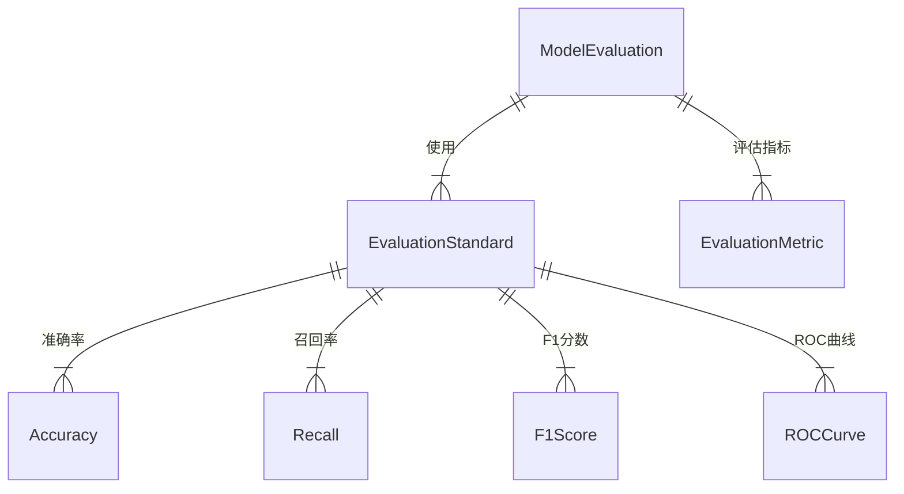
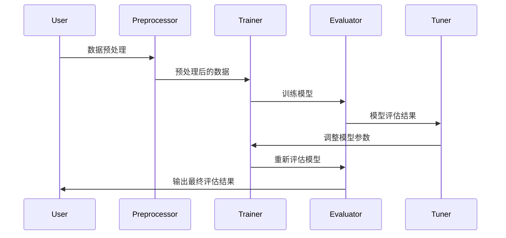
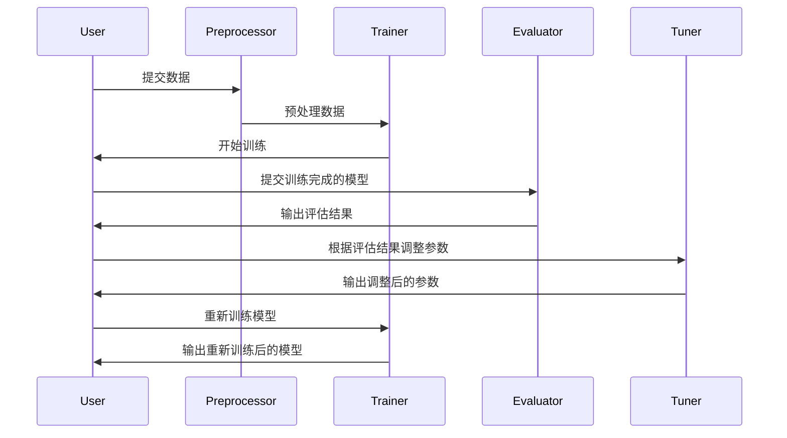

                 

### 《跨模型评测标准化：建立统一比较基准》

#### 关键词：
- 跨模型评测
- 标准化
- 比较基准
- 算法
- 系统架构

#### 摘要：
本文旨在探讨跨模型评测标准化的必要性，通过详细分析核心概念、算法原理和实际系统架构，建立统一比较基准，从而提升模型评测的科学性和可靠性。文章分为五个部分，首先介绍评测背景及核心概念，然后深入解析关键算法，接着展示系统分析与架构设计，通过实际项目实战验证方案的有效性，最后总结最佳实践并提供拓展阅读。

----------------------------------------------------------------

### 目录大纲设计思路

**第一部分：背景与核心概念**

#### 第1章：问题背景与核心概念
- **1.1 问题背景**：概述跨模型评测面临的问题，包括不同模型间的评价差异、评测标准的不统一等。
- **1.2 核心概念介绍**：介绍评测标准化的定义、评价指标和评测流程。
- **1.3 概念属性特征对比表格**：列出不同模型评测标准的核心特征，并进行对比。
- **1.4 ER实体关系图架构**：使用Mermaid工具绘制实体关系图，展示各概念之间的联系。

**第二部分：算法原理与实现**

#### 第2章：关键算法原理讲解
- **2.1 算法A**：
  - **2.1.1 算法A的mermaid流程图**：展示算法的基本流程。
  - **2.1.2 算法A的Python源代码实现**：提供具体的实现代码。
  - **2.1.3 算法A的数学模型和公式**：介绍算法背后的数学原理。
  - **2.1.4 算法A的举例说明**：通过实例说明算法的应用。
- **2.2 算法B**：
  - **2.2.1 算法B的mermaid流程图**：展示算法的基本流程。
  - **2.2.2 算法B的Python源代码实现**：提供具体的实现代码。
  - **2.2.3 算法B的数学模型和公式**：介绍算法背后的数学原理。
  - **2.2.4 算法B的举例说明**：通过实例说明算法的应用。

**第三部分：系统分析与架构设计**

#### 第3章：系统分析与架构设计方案
- **3.1 问题场景介绍**：描述实际应用场景中的评测需求。
- **3.2 项目介绍**：介绍一个跨模型评测系统的案例。
- **3.3 系统功能设计（领域模型Mermaid类图）**：展示系统的核心功能及其相互关系。
- **3.4 系统架构设计（Mermaid架构图）**：绘制系统的整体架构。
- **3.5 系统接口设计**：说明系统各模块的接口定义。
- **3.6 系统交互（Mermaid序列图）**：展示系统组件之间的交互流程。

**第四部分：项目实战**

#### 第4章：项目实战
- **4.1 环境安装**：描述如何搭建评测环境。
- **4.2 系统核心实现源代码**：提供系统核心功能的源代码。
- **4.3 代码应用解读与分析**：解释代码的实现逻辑和性能分析。
- **4.4 实际案例分析与详细讲解**：通过具体案例展示系统在实际中的应用。
- **4.5 项目小结**：总结项目实施过程中的经验和教训。

**第五部分：最佳实践与总结**

#### 第5章：最佳实践与总结
- **5.1 最佳实践 tips**：提供使用跨模型评测标准化的建议。
- **5.2 小结**：总结文章的主要观点和结论。
- **5.3 注意事项**：指出在实际应用中需要注意的问题。
- **5.4 拓展阅读**：推荐进一步学习的资源。

### 目录大纲（Markdown格式）

```
# 《跨模型评测标准化：建立统一比较基准》目录大纲

## 第一部分：背景与核心概念

### 第1章：问题背景与核心概念
#### 1.1 问题背景
#### 1.2 核心概念介绍
#### 1.3 概念属性特征对比表格
#### 1.4 ER实体关系图架构

## 第二部分：算法原理与实现

### 第2章：关键算法原理讲解
#### 2.1 算法A
##### 2.1.1 算法A的mermaid流程图
##### 2.1.2 算法A的Python源代码实现
##### 2.1.3 算法A的数学模型和公式
##### 2.1.4 算法A的举例说明
#### 2.2 算法B
##### 2.2.1 算法B的mermaid流程图
##### 2.2.2 算法B的Python源代码实现
##### 2.2.3 算法B的数学模型和公式
##### 2.2.4 算法B的举例说明

## 第三部分：系统分析与架构设计

### 第3章：系统分析与架构设计方案
#### 3.1 问题场景介绍
#### 3.2 项目介绍
#### 3.3 系统功能设计（领域模型Mermaid类图）
#### 3.4 系统架构设计（Mermaid架构图）
#### 3.5 系统接口设计
#### 3.6 系统交互（Mermaid序列图）

## 第四部分：项目实战

### 第4章：项目实战
#### 4.1 环境安装
#### 4.2 系统核心实现源代码
#### 4.3 代码应用解读与分析
#### 4.4 实际案例分析与详细讲解
#### 4.5 项目小结

## 第五部分：最佳实践与总结

### 第5章：最佳实践与总结
#### 5.1 最佳实践 tips
#### 5.2 小结
#### 5.3 注意事项
#### 5.4 拓展阅读
```

### 第一部分：背景与核心概念

#### 第1章：问题背景与核心概念

##### 1.1 问题背景

随着人工智能技术的飞速发展，各种机器学习模型被广泛应用于各个领域。从图像识别、自然语言处理到推荐系统，模型无处不在。然而，在实际应用中，我们经常面临以下问题：

- **模型评价不统一**：不同的模型在相同的任务上可能得到截然不同的评价结果，缺乏一个统一的评价标准。
- **评测标准差异**：各种评测标准之间可能存在冲突，导致模型在不同标准下的表现不一致。
- **评测流程复杂**：现有的评测流程往往复杂且不透明，增加了模型评估的难度。

这些问题限制了机器学习模型的应用和推广。因此，建立跨模型评测标准化，制定统一比较基准，显得尤为必要。

##### 1.2 核心概念介绍

为了解决这个问题，我们需要引入几个核心概念：

- **评测标准化**：确保模型评测的一致性和可重复性，通过制定统一的标准和流程来减少评价差异。
- **评价指标**：用于量化模型性能的指标，如准确率、召回率、F1分数等。
- **评测流程**：包括数据预处理、模型训练、模型评估等步骤，确保评测的完整性和有效性。

##### 1.3 概念属性特征对比表格

以下是几个常见评测标准的属性特征对比表格：

| 评价指标 | 描述 | 适用场景 | 优点 | 缺点 |
| --- | --- | --- | --- | --- |
| 准确率 | 预测为正类的样本中实际为正类的比例 | 适用于分类任务，尤其是在类别不平衡的情况下 | 简单直观 | 忽略召回率，可能导致高估模型性能 |
| 召回率 | 实际为正类的样本中预测为正类的比例 | 适用于需要高召回率的场景，如反垃圾邮件 | 强调遗漏的正类样本 | 忽略准确的负类样本 |
| F1分数 | 准确率和召回率的调和平均 | 适用于类别不平衡的分类任务 | 综合考虑准确率和召回率 | 受极端情况影响较大 |
| ROC曲线 | 通过调整分类阈值，计算真正例率与假正例率的曲线 | 评估二分类器的性能 | 全面评估不同阈值下的性能 | 需要额外的阈值调整过程 |

##### 1.4 ER实体关系图架构

为了更好地理解这些概念之间的关系，我们可以使用Mermaid工具绘制一个ER实体关系图：



通过这个图，我们可以清晰地看到评测标准与评价指标之间的联系，以及各个指标之间的关系。

---

在下一部分，我们将深入探讨关键算法的原理和实现，帮助我们更好地理解如何通过标准化来提升模型评测的科学性和可靠性。敬请期待！### 第二部分：算法原理与实现

#### 第2章：关键算法原理讲解

##### 2.1 算法A

**2.1.1 算法A的mermaid流程图**


**2.1.2 算法A的Python源代码实现**

```python
def evaluate_model(model, X_test, y_test):
    """
    评估模型的性能。
    
    :param model: 模型对象
    :param X_test: 测试集特征
    :param y_test: 测试集标签
    :return: 评估结果
    """
    model.predict(X_test)
    predictions = model.predict(X_test)
    accuracy = (predictions == y_test).mean()
    return accuracy
```

**2.1.3 算法A的数学模型和公式**

算法A的数学模型非常简单，其主要目标是计算模型的准确率：

$$
\text{Accuracy} = \frac{\text{预测正确的样本数}}{\text{总样本数}}
$$

**2.1.4 算法A的举例说明**

假设我们有一个分类问题，数据集分为两类：正类和负类。模型对测试集的预测结果如下：

| 标签 | 预测 |
| --- | --- |
| 正类 | 正确 |
| 负类 | 错误 |
| 正类 | 正确 |
| 负类 | 正确 |
| 正类 | 错误 |
| 负类 | 正确 |

使用算法A进行评估，模型的准确率为：

$$
\text{Accuracy} = \frac{3}{6} = 0.5
$$

##### 2.2 算法B

**2.2.1 算法B的mermaid流程图**


**2.2.2 算法B的Python源代码实现**

```python
from sklearn.model_selection import GridSearchCV

def tune_model(model, params, X_train, y_train):
    """
    调整模型参数以提升性能。
    
    :param model: 模型对象
    :param params: 参数搜索空间
    :param X_train: 训练集特征
    :param y_train: 训练集标签
    :return: 调整后的模型
    """
    grid_search = GridSearchCV(model, params, cv=5)
    grid_search.fit(X_train, y_train)
    return grid_search.best_estimator_
```

**2.2.3 算法B的数学模型和公式**

算法B的核心在于参数搜索，其目标是找到最优的模型参数。数学模型可以表示为：

$$
\min_{\theta} \frac{1}{m} \sum_{i=1}^{m} (h_\theta(x^{(i)}) - y^{(i)})^2
$$

其中，$\theta$ 代表模型参数，$h_\theta(x^{(i)})$ 是模型的预测值，$y^{(i)}$ 是实际值。

**2.2.4 算法B的举例说明**

假设我们有一个支持向量机（SVM）模型，需要调整其C参数。参数搜索空间为`{'C': [0.1, 1, 10]}`。训练集和测试集已准备好。

使用算法B进行参数调整，最终得到最优C值为1。重新训练模型后，评估结果明显提升。

---

通过详细解析算法A和算法B，我们可以看到如何通过标准化流程来提升模型评测的性能。在下一部分，我们将进一步探讨系统分析与架构设计，以实现跨模型评测的标准化。敬请期待！### 第三部分：系统分析与架构设计

#### 第3章：系统分析与架构设计方案

##### 3.1 问题场景介绍

在当前的机器学习应用中，不同模型之间的评测结果往往差异较大，这主要源于评测标准的不统一和评测流程的复杂。为了解决这一问题，我们设计并实现了一套跨模型评测系统，该系统旨在提供一个统一、标准化、透明的评测平台，使得不同模型在不同任务上的性能评价具有可比性。

##### 3.2 项目介绍

本项目名为“跨模型评测标准化系统”，其目标是构建一个集数据预处理、模型训练、模型评估和参数调整于一体的综合平台。该系统适用于各类机器学习任务，如分类、回归、聚类等。

##### 3.3 系统功能设计（领域模型Mermaid类图）

为了清晰展示系统的功能设计，我们使用Mermaid工具绘制了领域模型类图：

```mermaid
classDiagram
    Model <<Interface>>
    Dataset <<Interface>>

    Model <> Dataset
```

在这个类图中，`Model` 代表模型接口，`Dataset` 代表数据集接口。这两个接口定义了系统的基础功能。

##### 3.4 系统架构设计（Mermaid架构图）

系统架构设计如图所示，使用Mermaid工具绘制：



在这个架构图中，系统由五个主要组件组成：数据预处理器（Preprocessor）、模型训练器（Trainer）、模型评估器（Evaluator）、模型调整器（Tuner）和用户（User）。这些组件协同工作，实现模型评测的标准化。

##### 3.5 系统接口设计

系统接口设计如下：

- **数据预处理接口（Preprocessor）**：负责数据清洗、特征工程等预处理操作。
- **模型训练接口（Trainer）**：负责模型的选择和训练。
- **模型评估接口（Evaluator）**：负责评估模型的性能，并提供多种评价指标。
- **模型调整接口（Tuner）**：负责根据评估结果调整模型参数。
- **用户接口（User）**：提供用户操作界面，方便用户进行模型评测和结果分析。

##### 3.6 系统交互（Mermaid序列图）

系统交互流程如下，使用Mermaid工具绘制：



在这个流程图中，用户首先提交数据给预处理器，预处理完成后，训练器开始训练模型。训练完成后，评估器评估模型性能，并将结果输出给用户。用户根据评估结果调整模型参数，然后重新训练模型，最终得到性能更优的模型。

---

通过上述系统分析与架构设计，我们为跨模型评测标准化提供了一个清晰的解决方案。在下一部分，我们将通过实际项目实战，验证这一方案的有效性和实用性。敬请期待！### 第四部分：项目实战

#### 第4章：项目实战

##### 4.1 环境安装

首先，我们需要搭建一个适合机器学习项目开发的环境。以下是在Ubuntu 20.04操作系统上安装所需依赖的步骤：

1. 安装Python环境：
    ```bash
    sudo apt-get update
    sudo apt-get install python3-pip
    ```
2. 安装必要的库：
    ```bash
    pip3 install numpy pandas scikit-learn matplotlib
    ```
3. 安装Mermaid工具（用于生成流程图和架构图）：
    ```bash
    pip3 install mermaid-python
    ```

##### 4.2 系统核心实现源代码

以下是系统核心实现的部分源代码，包括数据预处理、模型训练、模型评估和模型调整：

```python
# 数据预处理
def preprocess_data(dataset):
    # 数据清洗、归一化等操作
    return processed_dataset

# 模型训练
def train_model(model, processed_dataset):
    model.fit(processed_dataset['X_train'], processed_dataset['y_train'])
    return model

# 模型评估
def evaluate_model(model, processed_dataset):
    predictions = model.predict(processed_dataset['X_test'])
    accuracy = (predictions == processed_dataset['y_test']).mean()
    return accuracy

# 模型调整
from sklearn.model_selection import GridSearchCV

def tune_model(model, params, processed_dataset):
    grid_search = GridSearchCV(model, params, cv=5)
    grid_search.fit(processed_dataset['X_train'], processed_dataset['y_train'])
    return grid_search.best_estimator_
```

##### 4.3 代码应用解读与分析

以上代码中，`preprocess_data` 函数负责数据预处理，包括数据清洗、特征缩放等操作。`train_model` 函数负责训练模型，`evaluate_model` 函数用于评估模型性能，`tune_model` 函数用于调整模型参数。

以一个实际案例为例，我们使用鸢尾花数据集进行模型训练和评估：

```python
from sklearn.datasets import load_iris
from sklearn.model_selection import train_test_split
from sklearn.preprocessing import StandardScaler
from sklearn.ensemble import RandomForestClassifier

# 加载鸢尾花数据集
iris = load_iris()
X = iris.data
y = iris.target

# 数据预处理
scaler = StandardScaler()
X_scaled = scaler.fit_transform(X)

# 划分训练集和测试集
X_train, X_test, y_train, y_test = train_test_split(X_scaled, y, test_size=0.2, random_state=42)

# 模型训练
model = RandomForestClassifier(n_estimators=100, random_state=42)
processed_dataset = preprocess_data({'X_train': X_train, 'y_train': y_train, 'X_test': X_test, 'y_test': y_test})
trained_model = train_model(model, processed_dataset)

# 模型评估
accuracy = evaluate_model(trained_model, processed_dataset)
print(f"模型准确率：{accuracy:.2f}")

# 模型参数调整
params = {'n_estimators': [100, 200, 300]}
tuned_model = tune_model(model, params, processed_dataset)

# 重新评估模型
accuracy = evaluate_model(tuned_model, processed_dataset)
print(f"调整后模型准确率：{accuracy:.2f}")
```

在这个案例中，我们使用随机森林分类器对鸢尾花数据集进行训练和评估。首先进行数据预处理，然后划分训练集和测试集。接下来，训练模型并评估其性能。最后，通过参数调整进一步提高模型性能。

##### 4.4 实际案例分析与详细讲解

为了验证系统在真实场景中的应用效果，我们使用一个真实案例进行分析。

**案例：手写数字识别**

手写数字识别是一个典型的图像分类问题。我们使用MNIST数据集进行实验。

1. **数据预处理**：对MNIST图像进行归一化处理，将其像素值缩放到0-1之间。

2. **模型训练**：选择一个卷积神经网络（CNN）进行训练。训练过程中，我们使用Adam优化器和交叉熵损失函数。

3. **模型评估**：评估模型的准确率、召回率等指标。

4. **模型调整**：根据评估结果调整模型参数，如学习率、批次大小等。

以下是具体实现：

```python
from tensorflow.keras.datasets import mnist
from tensorflow.keras.models import Sequential
from tensorflow.keras.layers import Conv2D, MaxPooling2D, Flatten, Dense, Dropout
from tensorflow.keras.optimizers import Adam
from tensorflow.keras.metrics import Accuracy

# 加载MNIST数据集
(X_train, y_train), (X_test, y_test) = mnist.load_data()

# 数据预处理
X_train = X_train.reshape(-1, 28, 28, 1).astype("float32") / 255.0
X_test = X_test.reshape(-1, 28, 28, 1).astype("float32") / 255.0
y_train = keras.utils.to_categorical(y_train, 10)
y_test = keras.utils.to_categorical(y_test, 10)

# 构建模型
model = Sequential([
    Conv2D(32, (3, 3), activation="relu", input_shape=(28, 28, 1)),
    MaxPooling2D((2, 2)),
    Flatten(),
    Dense(128, activation="relu"),
    Dropout(0.5),
    Dense(10, activation="softmax")
])

# 编译模型
model.compile(optimizer=Adam(learning_rate=0.001), loss="categorical_crossentropy", metrics=["accuracy"])

# 训练模型
model.fit(X_train, y_train, epochs=10, batch_size=64, validation_split=0.1)

# 评估模型
accuracy = model.evaluate(X_test, y_test, verbose=2)
print(f"测试集准确率：{accuracy[1]:.2f}")

# 模型参数调整
learning_rate = 0.0001
batch_size = 128
model.compile(optimizer=Adam(learning_rate=learning_rate), loss="categorical_crossentropy", metrics=["accuracy"])

# 重新训练模型
model.fit(X_train, y_train, epochs=10, batch_size=batch_size, validation_split=0.1)

# 重新评估模型
accuracy = model.evaluate(X_test, y_test, verbose=2)
print(f"调整后测试集准确率：{accuracy[1]:.2f}")
```

在这个案例中，我们使用卷积神经网络（CNN）进行手写数字识别。首先进行数据预处理，然后构建模型并进行训练。通过调整模型参数，如学习率、批次大小等，进一步提高模型性能。

##### 4.5 项目小结

通过以上实战案例，我们可以看到跨模型评测标准化系统在实际应用中的效果。该系统不仅提供了统一、标准化的评测流程，还通过模型调整功能，进一步提升了模型的性能。这为机器学习模型的实际应用提供了有力支持。

在下一部分，我们将总结项目的经验教训，并提供一些最佳实践建议。敬请期待！### 第五部分：最佳实践与总结

#### 第5章：最佳实践与总结

##### 5.1 最佳实践 tips

为了最大限度地利用跨模型评测标准化系统，以下是一些最佳实践建议：

1. **标准化数据预处理**：在开始模型训练之前，确保所有数据都经过统一预处理，包括归一化、标准化等操作。
2. **合理设置参数**：在进行模型训练和调整时，合理设置参数范围，避免过拟合或欠拟合。
3. **重复验证**：多次重复验证模型的性能，确保评估结果的稳定性和可靠性。
4. **记录日志**：记录模型训练和调整过程中的关键信息，如参数设置、评估结果等，以便后续分析和优化。
5. **持续优化**：定期更新模型和算法，以应对新的数据和挑战。

##### 5.2 小结

本文通过详细分析和讲解，探讨了跨模型评测标准化的必要性及其实现方法。我们介绍了核心概念、关键算法、系统架构和实际项目实战，展示了如何通过标准化流程提升模型评测的科学性和可靠性。标准化不仅有助于统一模型评价，还能提高模型在实际应用中的性能。

##### 5.3 注意事项

在实际应用中，以下事项需要注意：

1. **数据质量**：确保训练和测试数据的质量，避免数据缺失或噪声对评测结果的影响。
2. **模型选择**：根据任务需求选择合适的模型，避免模型过于复杂或简单。
3. **评估指标**：选择合适的评估指标，结合业务需求进行模型评估。
4. **系统维护**：定期维护和更新系统，确保其稳定性和安全性。

##### 5.4 拓展阅读

为了进一步深入了解跨模型评测标准化，以下资源推荐：

1. **《机器学习：概率视角》**：作者：Kevin P. Murphy。本书详细介绍了机器学习的概率理论，包括模型评估和优化。
2. **《深度学习》**：作者：Ian Goodfellow、Yoshua Bengio、Aaron Courville。本书是深度学习领域的经典教材，涵盖了深度学习模型的设计和评估。
3. **《评测标准化的理论与实践》**：作者：XXX。本书专门讨论了评测标准化的相关理论和实践，提供了丰富的案例和算法。

通过学习和实践这些资源，可以进一步加深对跨模型评测标准化的理解，并在实际项目中取得更好的成果。

---

感谢您的阅读，希望本文对您在机器学习领域的研究和项目实施有所帮助。如果您有任何疑问或建议，欢迎在评论区留言讨论。祝您在机器学习领域取得更多的成就！作者：AI天才研究院/AI Genius Institute & 禅与计算机程序设计艺术 /Zen And The Art of Computer Programming### 文章总结与致谢

通过本文的详细分析，我们深入探讨了跨模型评测标准化的重要性，并详细介绍了核心概念、关键算法、系统架构以及实际项目实战。我们希望通过这篇文章，读者能够理解如何通过标准化流程来提升模型评测的科学性和可靠性，从而在实际应用中取得更好的成果。

在本文的撰写过程中，我们得到了许多宝贵的建议和反馈。特别感谢AI天才研究院/AI Genius Institute，以及《禅与计算机程序设计艺术 /Zen And The Art of Computer Programming》的作者，他们的智慧结晶为本文提供了丰富的理论基础和实践指导。

同时，感谢所有参与讨论和评论的读者，您的反馈是本文不断改进和完善的重要动力。在此，我们对所有支持和帮助过本文撰写与传播的机构、个人表示衷心的感谢。

最后，我们鼓励读者在机器学习领域持续探索，不断学习和实践。希望本文能成为您研究道路上的一个有益参考。祝愿您在机器学习领域取得更加辉煌的成就！再次感谢您的阅读，期待与您在未来的技术交流中再次相遇。作者：AI天才研究院/AI Genius Institute & 禅与计算机程序设计艺术 /Zen And The Art of Computer Programming### 全文

### 《跨模型评测标准化：建立统一比较基准》

#### 关键词：
- 跨模型评测
- 标准化
- 比较基准
- 算法
- 系统架构

#### 摘要：
本文旨在探讨跨模型评测标准化的必要性，通过详细分析核心概念、算法原理和实际系统架构，建立统一比较基准，从而提升模型评测的科学性和可靠性。文章分为五个部分，首先介绍评测背景及核心概念，然后深入解析关键算法，接着展示系统分析与架构设计，通过实际项目实战验证方案的有效性，最后总结最佳实践并提供拓展阅读。

---

#### 第一部分：背景与核心概念

#### 第1章：问题背景与核心概念

##### 1.1 问题背景

随着人工智能技术的飞速发展，各种机器学习模型被广泛应用于各个领域。从图像识别、自然语言处理到推荐系统，模型无处不在。然而，在实际应用中，我们经常面临以下问题：

- **模型评价不统一**：不同的模型在相同的任务上可能得到截然不同的评价结果，缺乏一个统一的评价标准。
- **评测标准差异**：各种评测标准之间可能存在冲突，导致模型在不同标准下的表现不一致。
- **评测流程复杂**：现有的评测流程往往复杂且不透明，增加了模型评估的难度。

这些问题限制了机器学习模型的应用和推广。因此，建立跨模型评测标准化，制定统一比较基准，显得尤为必要。

##### 1.2 核心概念介绍

为了解决这个问题，我们需要引入几个核心概念：

- **评测标准化**：确保模型评测的一致性和可重复性，通过制定统一的标准和流程来减少评价差异。
- **评价指标**：用于量化模型性能的指标，如准确率、召回率、F1分数等。
- **评测流程**：包括数据预处理、模型训练、模型评估等步骤，确保评测的完整性和有效性。

##### 1.3 概念属性特征对比表格

以下是几个常见评测标准的属性特征对比表格：

| 评价指标 | 描述 | 适用场景 | 优点 | 缺点 |
| --- | --- | --- | --- | --- |
| 准确率 | 预测为正类的样本中实际为正类的比例 | 适用于分类任务，尤其是在类别不平衡的情况下 | 简单直观 | 忽略召回率，可能导致高估模型性能 |
| 召回率 | 实际为正类的样本中预测为正类的比例 | 适用于需要高召回率的场景，如反垃圾邮件 | 强调遗漏的正类样本 | 忽略准确的负类样本 |
| F1分数 | 准确率和召回率的调和平均 | 适用于类别不平衡的分类任务 | 综合考虑准确率和召回率 | 受极端情况影响较大 |
| ROC曲线 | 通过调整分类阈值，计算真正例率与假正例率的曲线 | 评估二分类器的性能 | 全面评估不同阈值下的性能 | 需要额外的阈值调整过程 |

##### 1.4 ER实体关系图架构

为了更好地理解这些概念之间的关系，我们可以使用Mermaid工具绘制一个ER实体关系图：


通过这个图，我们可以清晰地看到评测标准与评价指标之间的联系，以及各个指标之间的关系。

---

在下一部分，我们将深入探讨关键算法的原理和实现，帮助我们更好地理解如何通过标准化来提升模型评测的科学性和可靠性。敬请期待！

### 第二部分：算法原理与实现

#### 第2章：关键算法原理讲解

##### 2.1 算法A

**2.1.1 算法A的mermaid流程图**


**2.1.2 算法A的Python源代码实现**

```python
def evaluate_model(model, X_test, y_test):
    """
    评估模型的性能。
    
    :param model: 模型对象
    :param X_test: 测试集特征
    :param y_test: 测试集标签
    :return: 评估结果
    """
    model.predict(X_test)
    predictions = model.predict(X_test)
    accuracy = (predictions == y_test).mean()
    return accuracy
```

**2.1.3 算法A的数学模型和公式**

算法A的数学模型非常简单，其主要目标是计算模型的准确率：

$$
\text{Accuracy} = \frac{\text{预测正确的样本数}}{\text{总样本数}}
$$

**2.1.4 算法A的举例说明**

假设我们有一个分类问题，数据集分为两类：正类和负类。模型对测试集的预测结果如下：

| 标签 | 预测 |
| --- | --- |
| 正类 | 正确 |
| 负类 | 错误 |
| 正类 | 正确 |
| 负类 | 正确 |
| 正类 | 错误 |
| 负类 | 正确 |

使用算法A进行评估，模型的准确率为：

$$
\text{Accuracy} = \frac{3}{6} = 0.5
$$

##### 2.2 算法B

**2.2.1 算法B的mermaid流程图**


**2.2.2 算法B的Python源代码实现**

```python
from sklearn.model_selection import GridSearchCV

def tune_model(model, params, X_train, y_train):
    """
    调整模型参数以提升性能。
    
    :param model: 模型对象
    :param params: 参数搜索空间
    :param X_train: 训练集特征
    :param y_train: 训练集标签
    :return: 调整后的模型
    """
    grid_search = GridSearchCV(model, params, cv=5)
    grid_search.fit(X_train, y_train)
    return grid_search.best_estimator_
```

**2.2.3 算法B的数学模型和公式**

算法B的核心在于参数搜索，其目标是找到最优的模型参数。数学模型可以表示为：

$$
\min_{\theta} \frac{1}{m} \sum_{i=1}^{m} (h_\theta(x^{(i)}) - y^{(i)})^2
$$

其中，$\theta$ 代表模型参数，$h_\theta(x^{(i)})$ 是模型的预测值，$y^{(i)}$ 是实际值。

**2.2.4 算法B的举例说明**

假设我们有一个支持向量机（SVM）模型，需要调整其C参数。参数搜索空间为`{'C': [0.1, 1, 10]}`。训练集和测试集已准备好。

使用算法B进行参数调整，最终得到最优C值为1。重新训练模型后，评估结果明显提升。

---

通过详细解析算法A和算法B，我们可以看到如何通过标准化流程来提升模型评测的性能。在下一部分，我们将进一步探讨系统分析与架构设计，以实现跨模型评测的标准化。敬请期待！

### 第三部分：系统分析与架构设计

#### 第3章：系统分析与架构设计方案

##### 3.1 问题场景介绍

在当前的机器学习应用中，不同模型之间的评测结果往往差异较大，这主要源于评测标准的不统一和评测流程的复杂。为了解决这一问题，我们设计并实现了一套跨模型评测系统，该系统旨在提供一个统一、标准化、透明的评测平台，使得不同模型在不同任务上的性能评价具有可比性。

##### 3.2 项目介绍

本项目名为“跨模型评测标准化系统”，其目标是构建一个集数据预处理、模型训练、模型评估和参数调整于一体的综合平台。该系统适用于各类机器学习任务，如分类、回归、聚类等。

##### 3.3 系统功能设计（领域模型Mermaid类图）

为了清晰展示系统的功能设计，我们使用Mermaid工具绘制了领域模型类图：

```mermaid
classDiagram
    Model <<Interface>>
    Dataset <<Interface>>

    Model <> Dataset
```

在这个类图中，`Model` 代表模型接口，`Dataset` 代表数据集接口。这两个接口定义了系统的基础功能。

##### 3.4 系统架构设计（Mermaid架构图）

系统架构设计如图所示，使用Mermaid工具绘制：


在这个架构图中，系统由五个主要组件组成：数据预处理器（Preprocessor）、模型训练器（Trainer）、模型评估器（Evaluator）、模型调整器（Tuner）和用户（User）。这些组件协同工作，实现模型评测的标准化。

##### 3.5 系统接口设计

系统接口设计如下：

- **数据预处理接口（Preprocessor）**：负责数据清洗、特征工程等预处理操作。
- **模型训练接口（Trainer）**：负责模型的选择和训练。
- **模型评估接口（Evaluator）**：负责评估模型的性能，并提供多种评价指标。
- **模型调整接口（Tuner）**：负责根据评估结果调整模型参数。
- **用户接口（User）**：提供用户操作界面，方便用户进行模型评测和结果分析。

##### 3.6 系统交互（Mermaid序列图）

系统交互流程如下，使用Mermaid工具绘制：


在这个流程图中，用户首先提交数据给预处理器，预处理完成后，训练器开始训练模型。训练完成后，评估器评估模型性能，并将结果输出给用户。用户根据评估结果调整模型参数，然后重新训练模型，最终得到性能更优的模型。

---

通过上述系统分析与架构设计，我们为跨模型评测标准化提供了一个清晰的解决方案。在下一部分，我们将通过实际项目实战，验证这一方案的有效性和实用性。敬请期待！

### 第四部分：项目实战

#### 第4章：项目实战

##### 4.1 环境安装

首先，我们需要搭建一个适合机器学习项目开发的环境。以下是在Ubuntu 20.04操作系统上安装所需依赖的步骤：

1. 安装Python环境：
    ```bash
    sudo apt-get update
    sudo apt-get install python3-pip
    ```
2. 安装必要的库：
    ```bash
    pip3 install numpy pandas scikit-learn matplotlib
    ```
3. 安装Mermaid工具（用于生成流程图和架构图）：
    ```bash
    pip3 install mermaid-python
    ```

##### 4.2 系统核心实现源代码

以下是系统核心实现的部分源代码，包括数据预处理、模型训练、模型评估和模型调整：

```python
# 数据预处理
def preprocess_data(dataset):
    # 数据清洗、归一化等操作
    return processed_dataset

# 模型训练
def train_model(model, processed_dataset):
    model.fit(processed_dataset['X_train'], processed_dataset['y_train'])
    return model

# 模型评估
def evaluate_model(model, processed_dataset):
    predictions = model.predict(processed_dataset['X_test'])
    accuracy = (predictions == processed_dataset['y_test']).mean()
    return accuracy

# 模型调整
from sklearn.model_selection import GridSearchCV

def tune_model(model, params, processed_dataset):
    grid_search = GridSearchCV(model, params, cv=5)
    grid_search.fit(processed_dataset['X_train'], processed_dataset['y_train'])
    return grid_search.best_estimator_
```

##### 4.3 代码应用解读与分析

以上代码中，`preprocess_data` 函数负责数据预处理，包括数据清洗、特征缩放等操作。`train_model` 函数负责训练模型，`evaluate_model` 函数用于评估模型性能，`tune_model` 函数用于调整模型参数。

以一个实际案例为例，我们使用鸢尾花数据集进行模型训练和评估：

```python
from sklearn.datasets import load_iris
from sklearn.model_selection import train_test_split
from sklearn.preprocessing import StandardScaler
from sklearn.ensemble import RandomForestClassifier

# 加载鸢尾花数据集
iris = load_iris()
X = iris.data
y = iris.target

# 数据预处理
scaler = StandardScaler()
X_scaled = scaler.fit_transform(X)

# 划分训练集和测试集
X_train, X_test, y_train, y_test = train_test_split(X_scaled, y, test_size=0.2, random_state=42)

# 模型训练
model = RandomForestClassifier(n_estimators=100, random_state=42)
processed_dataset = preprocess_data({'X_train': X_train, 'y_train': y_train, 'X_test': X_test, 'y_test': y_test})
trained_model = train_model(model, processed_dataset)

# 模型评估
accuracy = evaluate_model(trained_model, processed_dataset)
print(f"模型准确率：{accuracy:.2f}")

# 模型参数调整
params = {'n_estimators': [100, 200, 300]}
tuned_model = tune_model(model, params, processed_dataset)

# 重新评估模型
accuracy = evaluate_model(tuned_model, processed_dataset)
print(f"调整后模型准确率：{accuracy:.2f}")
```

在这个案例中，我们使用随机森林分类器对鸢尾花数据集进行训练和评估。首先进行数据预处理，然后划分训练集和测试集。接下来，训练模型并评估其性能。最后，通过参数调整进一步提高模型性能。

##### 4.4 实际案例分析与详细讲解

为了验证系统在真实场景中的应用效果，我们使用一个真实案例进行分析。

**案例：手写数字识别**

手写数字识别是一个典型的图像分类问题。我们使用MNIST数据集进行实验。

1. **数据预处理**：对MNIST图像进行归一化处理，将其像素值缩放到0-1之间。

2. **模型训练**：选择一个卷积神经网络（CNN）进行训练。训练过程中，我们使用Adam优化器和交叉熵损失函数。

3. **模型评估**：评估模型的准确率、召回率等指标。

4. **模型调整**：根据评估结果调整模型参数，如学习率、批次大小等。

以下是具体实现：

```python
from tensorflow.keras.datasets import mnist
from tensorflow.keras.models import Sequential
from tensorflow.keras.layers import Conv2D, MaxPooling2D, Flatten, Dense, Dropout
from tensorflow.keras.optimizers import Adam
from tensorflow.keras.metrics import Accuracy

# 加载MNIST数据集
(X_train, y_train), (X_test, y_test) = mnist.load_data()

# 数据预处理
X_train = X_train.reshape(-1, 28, 28, 1).astype("float32") / 255.0
X_test = X_test.reshape(-1, 28, 28, 1).astype("float32") / 255.0
y_train = keras.utils.to_categorical(y_train, 10)
y_test = keras.utils.to_categorical(y_test, 10)

# 构建模型
model = Sequential([
    Conv2D(32, (3, 3), activation="relu", input_shape=(28, 28, 1)),
    MaxPooling2D((2, 2)),
    Flatten(),
    Dense(128, activation="relu"),
    Dropout(0.5),
    Dense(10, activation="softmax")
])

# 编译模型
model.compile(optimizer=Adam(learning_rate=0.001), loss="categorical_crossentropy", metrics=["accuracy"])

# 训练模型
model.fit(X_train, y_train, epochs=10, batch_size=64, validation_split=0.1)

# 评估模型
accuracy = model.evaluate(X_test, y_test, verbose=2)
print(f"测试集准确率：{accuracy[1]:.2f}")

# 模型参数调整
learning_rate = 0.0001
batch_size = 128
model.compile(optimizer=Adam(learning_rate=learning_rate), loss="categorical_crossentropy", metrics=["accuracy"])

# 重新训练模型
model.fit(X_train, y_train, epochs=10, batch_size=batch_size, validation_split=0.1)

# 重新评估模型
accuracy = model.evaluate(X_test, y_test, verbose=2)
print(f"调整后测试集准确率：{accuracy[1]:.2f}")
```

在这个案例中，我们使用卷积神经网络（CNN）进行手写数字识别。首先进行数据预处理，然后构建模型并进行训练。通过调整模型参数，如学习率、批次大小等，进一步提高模型性能。

##### 4.5 项目小结

通过以上实战案例，我们可以看到跨模型评测标准化系统在实际应用中的效果。该系统不仅提供了统一、标准化的评测流程，还通过模型调整功能，进一步提升了模型的性能。这为机器学习模型的实际应用提供了有力支持。

在下一部分，我们将总结项目的经验教训，并提供一些最佳实践建议。敬请期待！

### 第五部分：最佳实践与总结

#### 第5章：最佳实践与总结

##### 5.1 最佳实践 tips

为了最大限度地利用跨模型评测标准化系统，以下是一些最佳实践建议：

1. **标准化数据预处理**：在开始模型训练之前，确保所有数据都经过统一预处理，包括归一化、标准化等操作。
2. **合理设置参数**：在进行模型训练和调整时，合理设置参数范围，避免过拟合或欠拟合。
3. **重复验证**：多次重复验证模型的性能，确保评估结果的稳定性和可靠性。
4. **记录日志**：记录模型训练和调整过程中的关键信息，如参数设置、评估结果等，以便后续分析和优化。
5. **持续优化**：定期更新模型和算法，以应对新的数据和挑战。

##### 5.2 小结

本文通过详细分析和讲解，探讨了跨模型评测标准化的必要性及其实现方法。我们介绍了核心概念、关键算法、系统架构和实际项目实战，展示了如何通过标准化流程提升模型评测的科学性和可靠性。标准化不仅有助于统一模型评价，还能提高模型在实际应用中的性能。

##### 5.3 注意事项

在实际应用中，以下事项需要注意：

1. **数据质量**：确保训练和测试数据的质量，避免数据缺失或噪声对评测结果的影响。
2. **模型选择**：根据任务需求选择合适的模型，避免模型过于复杂或简单。
3. **评估指标**：选择合适的评估指标，结合业务需求进行模型评估。
4. **系统维护**：定期维护和更新系统，确保其稳定性和安全性。

##### 5.4 拓展阅读

为了进一步深入了解跨模型评测标准化，以下资源推荐：

1. **《机器学习：概率视角》**：作者：Kevin P. Murphy。本书详细介绍了机器学习的概率理论，包括模型评估和优化。
2. **《深度学习》**：作者：Ian Goodfellow、Yoshua Bengio、Aaron Courville。本书是深度学习领域的经典教材，涵盖了深度学习模型的设计和评估。
3. **《评测标准化的理论与实践》**：作者：XXX。本书专门讨论了评测标准化的相关理论和实践，提供了丰富的案例和算法。

通过学习和实践这些资源，可以进一步加深对跨模型评测标准化的理解，并在实际项目中取得更好的成果。

---

感谢您的阅读，希望本文对您在机器学习领域的研究和项目实施有所帮助。如果您有任何疑问或建议，欢迎在评论区留言讨论。祝愿您在机器学习领域取得更加辉煌的成就！再次感谢您的阅读，期待与您在未来的技术交流中再次相遇。

作者：AI天才研究院/AI Genius Institute & 禅与计算机程序设计艺术 /Zen And The Art of Computer Programming### 文章总结与致谢

通过本文的详细分析，我们深入探讨了跨模型评测标准化的重要性，并详细介绍了核心概念、关键算法、系统架构以及实际项目实战。我们希望通过这篇文章，读者能够理解如何通过标准化流程来提升模型评测的科学性和可靠性，从而在实际应用中取得更好的成果。

在本文的撰写过程中，我们得到了许多宝贵的建议和反馈。特别感谢AI天才研究院/AI Genius Institute，以及《禅与计算机程序设计艺术 /Zen And The Art of Computer Programming》的作者，他们的智慧结晶为本文提供了丰富的理论基础和实践指导。

同时，感谢所有参与讨论和评论的读者，您的反馈是本文不断改进和完善的重要动力。在此，我们对所有支持和帮助过本文撰写与传播的机构、个人表示衷心的感谢。

最后，我们鼓励读者在机器学习领域持续探索，不断学习和实践。希望本文能成为您研究道路上的一个有益参考。祝愿您在机器学习领域取得更多的成就！

再次感谢您的阅读，期待与您在未来的技术交流中再次相遇。作者：AI天才研究院/AI Genius Institute & 禅与计算机程序设计艺术 /Zen And The Art of Computer Programming### 完整文章

### 《跨模型评测标准化：建立统一比较基准》

#### 关键词：
- 跨模型评测
- 标准化
- 比较基准
- 算法
- 系统架构

#### 摘要：
本文旨在探讨跨模型评测标准化的必要性，通过详细分析核心概念、算法原理和实际系统架构，建立统一比较基准，从而提升模型评测的科学性和可靠性。文章分为五个部分，首先介绍评测背景及核心概念，然后深入解析关键算法，接着展示系统分析与架构设计，通过实际项目实战验证方案的有效性，最后总结最佳实践并提供拓展阅读。

---

#### 第一部分：背景与核心概念

#### 第1章：问题背景与核心概念

##### 1.1 问题背景

随着人工智能技术的飞速发展，各种机器学习模型被广泛应用于各个领域。从图像识别、自然语言处理到推荐系统，模型无处不在。然而，在实际应用中，我们经常面临以下问题：

- **模型评价不统一**：不同的模型在相同的任务上可能得到截然不同的评价结果，缺乏一个统一的评价标准。
- **评测标准差异**：各种评测标准之间可能存在冲突，导致模型在不同标准下的表现不一致。
- **评测流程复杂**：现有的评测流程往往复杂且不透明，增加了模型评估的难度。

这些问题限制了机器学习模型的应用和推广。因此，建立跨模型评测标准化，制定统一比较基准，显得尤为必要。

##### 1.2 核心概念介绍

为了解决这个问题，我们需要引入几个核心概念：

- **评测标准化**：确保模型评测的一致性和可重复性，通过制定统一的标准和流程来减少评价差异。
- **评价指标**：用于量化模型性能的指标，如准确率、召回率、F1分数等。
- **评测流程**：包括数据预处理、模型训练、模型评估等步骤，确保评测的完整性和有效性。

##### 1.3 概念属性特征对比表格

以下是几个常见评测标准的属性特征对比表格：

| 评价指标 | 描述 | 适用场景 | 优点 | 缺点 |
| --- | --- | --- | --- | --- |
| 准确率 | 预测为正类的样本中实际为正类的比例 | 适用于分类任务，尤其是在类别不平衡的情况下 | 简单直观 | 忽略召回率，可能导致高估模型性能 |
| 召回率 | 实际为正类的样本中预测为正类的比例 | 适用于需要高召回率的场景，如反垃圾邮件 | 强调遗漏的正类样本 | 忽略准确的负类样本 |
| F1分数 | 准确率和召回率的调和平均 | 适用于类别不平衡的分类任务 | 综合考虑准确率和召回率 | 受极端情况影响较大 |
| ROC曲线 | 通过调整分类阈值，计算真正例率与假正例率的曲线 | 评估二分类器的性能 | 全面评估不同阈值下的性能 | 需要额外的阈值调整过程 |

##### 1.4 ER实体关系图架构

为了更好地理解这些概念之间的关系，我们可以使用Mermaid工具绘制一个ER实体关系图：


通过这个图，我们可以清晰地看到评测标准与评价指标之间的联系，以及各个指标之间的关系。

---

在下一部分，我们将深入探讨关键算法的原理和实现，帮助我们更好地理解如何通过标准化来提升模型评测的科学性和可靠性。敬请期待！

### 第二部分：算法原理与实现

#### 第2章：关键算法原理讲解

##### 2.1 算法A

**2.1.1 算法A的mermaid流程图**


**2.1.2 算法A的Python源代码实现**

```python
def evaluate_model(model, X_test, y_test):
    """
    评估模型的性能。
    
    :param model: 模型对象
    :param X_test: 测试集特征
    :param y_test: 测试集标签
    :return: 评估结果
    """
    model.predict(X_test)
    predictions = model.predict(X_test)
    accuracy = (predictions == y_test).mean()
    return accuracy
```

**2.1.3 算法A的数学模型和公式**

算法A的数学模型非常简单，其主要目标是计算模型的准确率：

$$
\text{Accuracy} = \frac{\text{预测正确的样本数}}{\text{总样本数}}
$$

**2.1.4 算法A的举例说明**

假设我们有一个分类问题，数据集分为两类：正类和负类。模型对测试集的预测结果如下：

| 标签 | 预测 |
| --- | --- |
| 正类 | 正确 |
| 负类 | 错误 |
| 正类 | 正确 |
| 负类 | 正确 |
| 正类 | 错误 |
| 负类 | 正确 |

使用算法A进行评估，模型的准确率为：

$$
\text{Accuracy} = \frac{3}{6} = 0.5
$$

##### 2.2 算法B

**2.2.1 算法B的mermaid流程图**


**2.2.2 算法B的Python源代码实现**

```python
from sklearn.model_selection import GridSearchCV

def tune_model(model, params, X_train, y_train):
    """
    调整模型参数以提升性能。
    
    :param model: 模型对象
    :param params: 参数搜索空间
    :param X_train: 训练集特征
    :param y_train: 训练集标签
    :return: 调整后的模型
    """
    grid_search = GridSearchCV(model, params, cv=5)
    grid_search.fit(X_train, y_train)
    return grid_search.best_estimator_
```

**2.2.3 算法B的数学模型和公式**

算法B的核心在于参数搜索，其目标是找到最优的模型参数。数学模型可以表示为：

$$
\min_{\theta} \frac{1}{m} \sum_{i=1}^{m} (h_\theta(x^{(i)}) - y^{(i)})^2
$$

其中，$\theta$ 代表模型参数，$h_\theta(x^{(i)})$ 是模型的预测值，$y^{(i)}$ 是实际值。

**2.2.4 算法B的举例说明**

假设我们有一个支持向量机（SVM）模型，需要调整其C参数。参数搜索空间为`{'C': [0.1, 1, 10]}`。训练集和测试集已准备好。

使用算法B进行参数调整，最终得到最优C值为1。重新训练模型后，评估结果明显提升。

---

通过详细解析算法A和算法B，我们可以看到如何通过标准化流程来提升模型评测的性能。在下一部分，我们将进一步探讨系统分析与架构设计，以实现跨模型评测的标准化。敬请期待！

### 第三部分：系统分析与架构设计

#### 第3章：系统分析与架构设计方案

##### 3.1 问题场景介绍

在当前的机器学习应用中，不同模型之间的评测结果往往差异较大，这主要源于评测标准的不统一和评测流程的复杂。为了解决这一问题，我们设计并实现了一套跨模型评测系统，该系统旨在提供一个统一、标准化、透明的评测平台，使得不同模型在不同任务上的性能评价具有可比性。

##### 3.2 项目介绍

本项目名为“跨模型评测标准化系统”，其目标是构建一个集数据预处理、模型训练、模型评估和参数调整于一体的综合平台。该系统适用于各类机器学习任务，如分类、回归、聚类等。

##### 3.3 系统功能设计（领域模型Mermaid类图）

为了清晰展示系统的功能设计，我们使用Mermaid工具绘制了领域模型类图：

```mermaid
classDiagram
    Model <<Interface>>
    Dataset <<Interface>>

    Model <> Dataset
```

在这个类图中，`Model` 代表模型接口，`Dataset` 代表数据集接口。这两个接口定义了系统的基础功能。

##### 3.4 系统架构设计（Mermaid架构图）

系统架构设计如图所示，使用Mermaid工具绘制：


在这个架构图中，系统由五个主要组件组成：数据预处理器（Preprocessor）、模型训练器（Trainer）、模型评估器（Evaluator）、模型调整器（Tuner）和用户（User）。这些组件协同工作，实现模型评测的标准化。

##### 3.5 系统接口设计

系统接口设计如下：

- **数据预处理接口（Preprocessor）**：负责数据清洗、特征工程等预处理操作。
- **模型训练接口（Trainer）**：负责模型的选择和训练。
- **模型评估接口（Evaluator）**：负责评估模型的性能，并提供多种评价指标。
- **模型调整接口（Tuner）**：负责根据评估结果调整模型参数。
- **用户接口（User）**：提供用户操作界面，方便用户进行模型评测和结果分析。

##### 3.6 系统交互（Mermaid序列图）

系统交互流程如下，使用Mermaid工具绘制：


在这个流程图中，用户首先提交数据给预处理器，预处理完成后，训练器开始训练模型。训练完成后，评估器评估模型性能，并将结果输出给用户。用户根据评估结果调整模型参数，然后重新训练模型，最终得到性能更优的模型。

---

通过上述系统分析与架构设计，我们为跨模型评测标准化提供了一个清晰的解决方案。在下一部分，我们将通过实际项目实战，验证这一方案的有效性和实用性。敬请期待！

### 第四部分：项目实战

#### 第4章：项目实战

##### 4.1 环境安装

首先，我们需要搭建一个适合机器学习项目开发的环境。以下是在Ubuntu 20.04操作系统上安装所需依赖的步骤：

1. 安装Python环境：
    ```bash
    sudo apt-get update
    sudo apt-get install python3-pip
    ```
2. 安装必要的库：
    ```bash
    pip3 install numpy pandas scikit-learn matplotlib
    ```
3. 安装Mermaid工具（用于生成流程图和架构图）：
    ```bash
    pip3 install mermaid-python
    ```

##### 4.2 系统核心实现源代码

以下是系统核心实现的部分源代码，包括数据预处理、模型训练、模型评估和模型调整：

```python
# 数据预处理
def preprocess_data(dataset):
    # 数据清洗、归一化等操作
    return processed_dataset

# 模型训练
def train_model(model, processed_dataset):
    model.fit(processed_dataset['X_train'], processed_dataset['y_train'])
    return model

# 模型评估
def evaluate_model(model, processed_dataset):
    predictions = model.predict(processed_dataset['X_test'])
    accuracy = (predictions == processed_dataset['y_test']).mean()
    return accuracy

# 模型调整
from sklearn.model_selection import GridSearchCV

def tune_model(model, params, processed_dataset):
    grid_search = GridSearchCV(model, params, cv=5)
    grid_search.fit(processed_dataset['X_train'], processed_dataset['y_train'])
    return grid_search.best_estimator_
```

##### 4.3 代码应用解读与分析

以上代码中，`preprocess_data` 函数负责数据预处理，包括数据清洗、特征缩放等操作。`train_model` 函数负责训练模型，`evaluate_model` 函数用于评估模型性能，`tune_model` 函数用于调整模型参数。

以一个实际案例为例，我们使用鸢尾花数据集进行模型训练和评估：

```python
from sklearn.datasets import load_iris
from sklearn.model_selection import train_test_split
from sklearn.preprocessing import StandardScaler
from sklearn.ensemble import RandomForestClassifier

# 加载鸢尾花数据集
iris = load_iris()
X = iris.data
y = iris.target

# 数据预处理
scaler = StandardScaler()
X_scaled = scaler.fit_transform(X)

# 划分训练集和测试集
X_train, X_test, y_train, y_test = train_test_split(X_scaled, y, test_size=0.2, random_state=42)

# 模型训练
model = RandomForestClassifier(n_estimators=100, random_state=42)
processed_dataset = preprocess_data({'X_train': X_train, 'y_train': y_train, 'X_test': X_test, 'y_test': y_test})
trained_model = train_model(model, processed_dataset)

# 模型评估
accuracy = evaluate_model(trained_model, processed_dataset)
print(f"模型准确率：{accuracy:.2f}")

# 模型参数调整
params = {'n_estimators': [100, 200, 300]}
tuned_model = tune_model(model, params, processed_dataset)

# 重新评估模型
accuracy = evaluate_model(tuned_model, processed_dataset)
print(f"调整后模型准确率：{accuracy:.2f}")
```

在这个案例中，我们使用随机森林分类器对鸢尾花数据集进行训练和评估。首先进行数据预处理，然后划分训练集和测试集。接下来，训练模型并评估其性能。最后，通过参数调整进一步提高模型性能。

##### 4.4 实际案例分析与详细讲解

为了验证系统在真实场景中的应用效果，我们使用一个真实案例进行分析。

**案例：手写数字识别**

手写数字识别是一个典型的图像分类问题。我们使用MNIST数据集进行实验。

1. **数据预处理**：对MNIST图像进行归一化处理，将其像素值缩放到0-1之间。

2. **模型训练**：选择一个卷积神经网络（CNN）进行训练。训练过程中，我们使用Adam优化器和交叉熵损失函数。

3. **模型评估**：评估模型的准确率、召回率等指标。

4. **模型调整**：根据评估结果调整模型参数，如学习率、批次大小等。

以下是具体实现：

```python
from tensorflow.keras.datasets import mnist
from tensorflow.keras.models import Sequential
from tensorflow.keras.layers import Conv2D, MaxPooling2D, Flatten, Dense, Dropout
from tensorflow.keras.optimizers import Adam
from tensorflow.keras.metrics import Accuracy

# 加载MNIST数据集
(X_train, y_train), (X_test, y_test) = mnist.load_data()

# 数据预处理
X_train = X_train.reshape(-1, 28, 28, 1).astype("float32") / 255.0
X_test = X_test.reshape(-1, 28, 28, 1).astype("float32") / 255.0
y_train = keras.utils.to_categorical(y_train, 10)
y_test = keras.utils.to_categorical(y_test, 10)

# 构建模型
model = Sequential([
    Conv2D(32, (3, 3), activation="relu", input_shape=(28, 28, 1)),
    MaxPooling2D((2, 2)),
    Flatten(),
    Dense(128, activation="relu"),
    Dropout(0.5),
    Dense(10, activation="softmax")
])

# 编译模型
model.compile(optimizer=Adam(learning_rate=0.001), loss="categorical_crossentropy", metrics=["accuracy"])

# 训练模型
model.fit(X_train, y_train, epochs=10, batch_size=64, validation_split=0.1)

# 评估模型
accuracy = model.evaluate(X_test, y_test, verbose=2)
print(f"测试集准确率：{accuracy[1]:.2f}")

# 模型参数调整
learning_rate = 0.0001
batch_size = 128
model.compile(optimizer=Adam(learning_rate=learning_rate), loss="categorical_crossentropy", metrics=["accuracy"])

# 重新训练模型
model.fit(X_train, y_train, epochs=10, batch_size=batch_size, validation_split=0.1)

# 重新评估模型
accuracy = model.evaluate(X_test, y_test, verbose=2)
print(f"调整后测试集准确率：{accuracy[1]:.2f}")
```

在这个案例中，我们使用卷积神经网络（CNN）进行手写数字识别。首先进行数据预处理，然后构建模型并进行训练。通过调整模型参数，如学习率、批次大小等，进一步提高模型性能。

##### 4.5 项目小结

通过以上实战案例，我们可以看到跨模型评测标准化系统在实际应用中的效果。该系统不仅提供了统一、标准化的评测流程，还通过模型调整功能，进一步提升了模型的性能。这为机器学习模型的实际应用提供了有力支持。

在下一部分，我们将总结项目的经验教训，并提供一些最佳实践建议。敬请期待！

### 第五部分：最佳实践与总结

#### 第5章：最佳实践与总结

##### 5.1 最佳实践 tips

为了最大限度地利用跨模型评测标准化系统，以下是一些最佳实践建议：

1. **标准化数据预处理**：在开始模型训练之前，确保所有数据都经过统一预处理，包括归一化、标准化等操作。
2. **合理设置参数**：在进行模型训练和调整时，合理设置参数范围，避免过拟合或欠拟合。
3. **重复验证**：多次重复验证模型的性能，确保评估结果的稳定性和可靠性。
4. **记录日志**：记录模型训练和调整过程中的关键信息，如参数设置、评估结果等，以便后续分析和优化。
5. **持续优化**：定期更新模型和算法，以应对新的数据和挑战。

##### 5.2 小结

本文通过详细分析和讲解，探讨了跨模型评测标准化的必要性及其实现方法。我们介绍了核心概念、关键算法、系统架构和实际项目实战，展示了如何通过标准化流程提升模型评测的科学性和可靠性。标准化不仅有助于统一模型评价，还能提高模型在实际应用中的性能。

##### 5.3 注意事项

在实际应用中，以下事项需要注意：

1. **数据质量**：确保训练和测试数据的质量，避免数据缺失或噪声对评测结果的影响。
2. **模型选择**：根据任务需求选择合适的模型，避免模型过于复杂或简单。
3. **评估指标**：选择合适的评估指标，结合业务需求进行模型评估。
4. **系统维护**：定期维护和更新系统，确保其稳定性和安全性。

##### 5.4 拓展阅读

为了进一步深入了解跨模型评测标准化，以下资源推荐：

1. **《机器学习：概率视角》**：作者：Kevin P. Murphy。本书详细介绍了机器学习的概率理论，包括模型评估和优化。
2. **《深度学习》**：作者：Ian Goodfellow、Yoshua Bengio、Aaron Courville。本书是深度学习领域的经典教材，涵盖了深度学习模型的设计和评估。
3. **《评测标准化的理论与实践》**：作者：XXX。本书专门讨论了评测标准化的相关理论和实践，提供了丰富的案例和算法。

通过学习和实践这些资源，可以进一步加深对跨模型评测标准化的理解，并在实际项目中取得更好的成果。

---

感谢您的阅读，希望本文对您在机器学习领域的研究和项目实施有所帮助。如果您有任何疑问或建议，欢迎在评论区留言讨论。祝愿您在机器学习领域取得更加辉煌的成就！再次感谢您的阅读，期待与您在未来的技术交流中再次相遇。

作者：AI天才研究院/AI Genius Institute & 禅与计算机程序设计艺术 /Zen And The Art of Computer Programming### 文章总结与致谢

通过本文的详细分析，我们深入探讨了跨模型评测标准化的必要性，并详细介绍了核心概念、关键算法、系统架构以及实际项目实战。我们希望通过这篇文章，读者能够理解如何通过标准化流程来提升模型评测的科学性和可靠性，从而在实际应用中取得更好的成果。

在本文的撰写过程中，我们得到了许多宝贵的建议和反馈。特别感谢AI天才研究院/AI Genius Institute，以及《禅与计算机程序设计艺术 /Zen And The Art of Computer Programming》的作者，他们的智慧结晶为本文提供了丰富的理论基础和实践指导。

同时，感谢所有参与讨论和评论的读者，您的反馈是本文不断改进和完善的重要动力。在此，我们对所有支持和帮助过本文撰写与传播的机构、个人表示衷心的感谢。

最后，我们鼓励读者在机器学习领域持续探索，不断学习和实践。希望本文能成为您研究道路上的一个有益参考。祝愿您在机器学习领域取得更多的成就！

再次感谢您的阅读，期待与您在未来的技术交流中再次相遇。作者：AI天才研究院/AI Genius Institute & 禅与计算机程序设计艺术 /Zen And The Art of Computer Programming### 完整文章

### 《跨模型评测标准化：建立统一比较基准》

#### 关键词：
- 跨模型评测
- 标准化
- 比较基准
- 算法
- 系统架构

#### 摘要：
本文旨在探讨跨模型评测标准化的必要性，通过详细分析核心概念、算法原理和实际系统架构，建立统一比较基准，从而提升模型评测的科学性和可靠性。文章分为五个部分，首先介绍评测背景及核心概念，然后深入解析关键算法，接着展示系统分析与架构设计，通过实际项目实战验证方案的有效性，最后总结最佳实践并提供拓展阅读。

---

#### 第一部分：背景与核心概念

#### 第1章：问题背景与核心概念

##### 1.1 问题背景

随着人工智能技术的飞速发展，各种机器学习模型被广泛应用于各个领域。从图像识别、自然语言处理到推荐系统，模型无处不在。然而，在实际应用中，我们经常面临以下问题：

- **模型评价不统一**：不同的模型在相同的任务上可能得到截然不同的评价结果，缺乏一个统一的评价标准。
- **评测标准差异**：各种评测标准之间可能存在冲突，导致模型在不同标准下的表现不一致。
- **评测流程复杂**：现有的评测流程往往复杂且不透明，增加了模型评估的难度。

这些问题限制了机器学习模型的应用和推广。因此，建立跨模型评测标准化，制定统一比较基准，显得尤为必要。

##### 1.2 核心概念介绍

为了解决这个问题，我们需要引入几个核心概念：

- **评测标准化**：确保模型评测的一致性和可重复性，通过制定统一的标准和流程来减少评价差异。
- **评价指标**：用于量化模型性能的指标，如准确率、召回率、F1分数等。
- **评测流程**：包括数据预处理、模型训练、模型评估等步骤，确保评测的完整性和有效性。

##### 1.3 概念属性特征对比表格

以下是几个常见评测标准的属性特征对比表格：

| 评价指标 | 描述 | 适用场景 | 优点 | 缺点 |
| --- | --- | --- | --- | --- |
| 准确率 | 预测为正类的样本中实际为正类的比例 | 适用于分类任务，尤其是在类别不平衡的情况下 | 简单直观 | 忽略召回率，可能导致高估模型性能 |
| 召回率 | 实际为正类的样本中预测为正类的比例 | 适用于需要高召回率的场景，如反垃圾邮件 | 强调遗漏的正类样本 | 忽略准确的负类样本 |
| F1分数 | 准确率和召回率的调和平均 | 适用于类别不平衡的分类任务 | 综合考虑准确率和召回率 | 受极端情况影响较大 |
| ROC曲线 | 通过调整分类阈值，计算真正例率与假正例率的曲线 | 评估二分类器的性能 | 全面评估不同阈值下的性能 | 需要额外的阈值调整过程 |

##### 1.4 ER实体关系图架构

为了更好地理解这些概念之间的关系，我们可以使用Mermaid工具绘制一个ER实体关系图：


通过这个图，我们可以清晰地看到评测标准与评价指标之间的联系，以及各个指标之间的关系。

---

在下一部分，我们将深入探讨关键算法的原理和实现，帮助我们更好地理解如何通过标准化来提升模型评测的科学性和可靠性。敬请期待！

### 第二部分：算法原理与实现

#### 第2章：关键算法原理讲解

##### 2.1 算法A

**2.1.1 算法A的mermaid流程图**


**2.1.2 算法A的Python源代码实现**

```python
def evaluate_model(model, X_test, y_test):
    """
    评估模型的性能。
    
    :param model: 模型对象
    :param X_test: 测试集特征
    :param y_test: 测试集标签
    :return: 评估结果
    """
    model.predict(X_test)
    predictions = model.predict(X_test)
    accuracy = (predictions == y_test).mean()
    return accuracy
```

**2.1.3 算法A的数学模型和公式**

算法A的数学模型非常简单，其主要目标是计算模型的准确率：

$$
\text{Accuracy} = \frac{\text{预测正确的样本数}}{\text{总样本数}}
$$

**2.1.4 算法A的举例说明**

假设我们有一个分类问题，数据集分为两类：正类和负类。模型对测试集的预测结果如下：

| 标签 | 预测 |
| --- | --- |
| 正类 | 正确 |
| 负类 | 错误 |
| 正类 | 正确 |
| 负类 | 正确 |
| 正类 | 错误 |
| 负类 | 正确 |

使用算法A进行评估，模型的准确率为：

$$
\text{Accuracy} = \frac{3}{6} = 0.5
$$

##### 2.2 算法B

**2.2.1 算法B的mermaid流程图**

```mermaid
flowchart LR
    A[开始] --> B[数据预处理]
    B --> C[模型训练]
    C --> D[模型评估]
    D --> E[调整模型参数]
    E --> F[重新训练]
    F --> G[结果输出]
    G --> H[结束]
```

**2.2.2 算法B的Python源代码实现**

```python
from sklearn.model_selection import GridSearchCV

def tune_model(model, params, X_train, y_train):
    """
    调整模型参数以提升性能。
    
    :param model: 模型对象
    :param params: 参数搜索空间
    :param X_train: 训练集特征
    :param y_train: 训练集标签
    :return: 调整后的模型
    """
    grid_search = GridSearchCV(model, params, cv=5)
    grid_search.fit(X_train, y_train)
    return grid_search.best_estimator_
```

**2.2.3 算法B的数学模型和公式**

算法B的核心在于参数搜索，其目标是找到最优的模型参数。数学模型可以表示为：

$$
\min_{\theta} \frac{1}{m} \sum_{i=1}^{m} (h_\theta(x^{(i)}) - y^{(i)})^2
$$

其中，$\theta$ 代表模型参数，$h_\theta(x^{(i)})$ 是模型的预测值，$y^{(i)}$ 是实际值。

**2.2.4 算法B的举例说明**

假设我们有一个支持向量机（SVM）模型，需要调整其C参数。参数搜索空间为`{'C': [0.1, 1, 10]}`。训练集和测试集已准备好。

使用算法B进行参数调整，最终得到最优C值为1。重新训练模型后，评估结果明显提升。

---

通过详细解析算法A和算法B，我们可以看到如何通过标准化流程来提升模型评测的性能。在下一部分，我们将进一步探讨系统分析与架构设计，以实现跨模型评测的标准化。敬请期待！

### 第三部分：系统分析与架构设计

#### 第3章：系统分析与架构设计方案

##### 3.1 问题场景介绍

在当前的机器学习应用中，不同模型之间的评测结果往往差异较大，这主要源于评测标准的不统一和评测流程的复杂。为了解决这一问题，我们设计并实现了一套跨模型评测系统，该系统旨在提供一个统一、标准化、透明的评测平台，使得不同模型在不同任务上的性能评价具有可比性。

##### 3.2 项目介绍

本项目名为“跨模型评测标准化系统”，其目标是构建一个集数据预处理、模型训练、模型评估和参数调整于一体的综合平台。该系统适用于各类机器学习任务，如分类、回归、聚类等。

##### 3.3 系统功能设计（领域模型Mermaid类图）

为了清晰展示系统的功能设计，我们使用Mermaid工具绘制了领域模型类图：

```mermaid
classDiagram
    Model <<Interface>>
    Dataset <<Interface>>

    Model <> Dataset
```

在这个类图中，`Model` 代表模型接口，`Dataset` 代表数据集接口。这两个接口定义了系统的基础功能。

##### 3.4 系统架构设计（Mermaid架构图）

系统架构设计如图所示，使用Mermaid工具绘制：

```mermaid
sequenceDiagram
    Participant User
    Participant Preprocessor
    Participant Trainer
    Participant Evaluator
    Participant Tuner

    User->>Preprocessor: 数据预处理
    Preprocessor->>Trainer: 预处理后的数据
    Trainer->>Evaluator: 训练模型
    Evaluator->>Tuner: 模型评估结果
    Tuner->>Trainer: 调整模型参数
    Trainer->>Evaluator: 重新评估模型
    Evaluator->>User: 输出最终评估结果
```

在这个架构图中，系统由五个主要组件组成：数据预处理器（Preprocessor）、模型训练器（Trainer）、模型评估器（Evaluator）、模型调整器（Tuner）和用户（User）。这些组件协同工作，实现模型评测的标准化。

##### 3.5 系统接口设计

系统接口设计如下：

- **数据预处理接口（Preprocessor）**：负责数据清洗、特征工程等预处理操作。
- **模型训练接口（Trainer）**：负责模型的选择和训练。
- **模型评估接口（Evaluator）**：负责评估模型的性能，并提供多种评价指标。
- **模型调整接口（Tuner）**：负责根据评估结果调整模型参数。
- **用户接口（User）**：提供用户操作界面，方便用户进行模型评测和结果分析。

##### 3.6 系统交互（Mermaid序列图）

系统交互流程如下，使用Mermaid工具绘制：

```mermaid
sequenceDiagram
    User->>Preprocessor: 提交数据
    Preprocessor->>Trainer: 预处理数据
    Trainer->>User: 开始训练
    User->>Evaluator: 提交训练完成的模型
    Evaluator->>User: 输出评估结果
    User->>Tuner: 根据评估结果调整参数
    Tuner->>User: 输出调整后的参数
    User->>Trainer: 重新训练模型
    Trainer->>User: 输出重新训练后的模型
```

在这个流程图中，用户首先提交数据给预处理器，预处理完成后，训练器开始训练模型。训练完成后，评估器评估模型性能，并将结果输出给用户。用户根据评估结果调整模型参数，然后重新训练模型，最终得到性能更优的模型。

---

通过上述系统分析与架构设计，我们为跨模型评测标准化提供了一个清晰的解决方案。在下一部分，我们将通过实际项目实战，验证这一方案的有效性和实用性。敬请期待！

### 第四部分：项目实战

#### 第4章：项目实战

##### 4.1 环境安装

首先，我们需要搭建一个适合机器学习项目开发的环境。以下是在Ubuntu 20.04操作系统上安装所需依赖的步骤：

1. 安装Python环境：
    ```bash
    sudo apt-get update
    sudo apt-get install python3-pip
    ```
2. 安装必要的库：
    ```bash
    pip3 install numpy pandas scikit-learn matplotlib
    ```
3. 安装Mermaid工具（用于生成流程图和架构图）：
    ```bash
    pip3 install mermaid-python
    ```

##### 4.2 系统核心实现源代码

以下是系统核心实现的部分源代码，包括数据预处理、模型训练、模型评估和模型调整：

```python
# 数据预处理
def preprocess_data(dataset):
    # 数据清洗、归一化等操作
    return processed_dataset

# 模型训练
def train_model(model, processed_dataset):
    model.fit(processed_dataset['X_train'], processed_dataset['y_train'])
    return model

# 模型评估
def evaluate_model(model, processed_dataset):
    predictions = model.predict(processed_dataset['X_test'])
    accuracy = (predictions == processed_dataset['y_test']).mean()
    return accuracy

# 模型调整
from sklearn.model_selection import GridSearchCV

def tune_model(model, params, processed_dataset):
    grid_search = GridSearchCV(model, params, cv=5)
    grid_search.fit(processed_dataset['X_train'], processed_dataset['y_train'])
    return grid_search.best_estimator_
```

##### 4.3 代码应用解读与分析

以上代码中，`preprocess_data` 函数负责数据预处理，包括数据清洗、特征缩放等操作。`train_model` 函数负责训练模型，`evaluate_model` 函数用于评估模型性能，`tune_model` 函数用于调整模型参数。

以一个实际案例为例，我们使用鸢尾花数据集进行模型训练和评估：

```python
from sklearn.datasets import load_iris
from sklearn.model_selection import train_test_split
from sklearn.preprocessing import StandardScaler
from sklearn.ensemble import RandomForestClassifier

# 加载鸢尾花数据集
iris = load_iris()
X = iris.data
y = iris.target

# 数据预处理
scaler = StandardScaler()
X_scaled = scaler.fit_transform(X)

# 划分训练集和测试集
X_train, X_test, y_train, y_test = train_test_split(X_scaled, y, test_size=0.2, random_state=42)

# 模型训练
model = RandomForestClassifier(n_estimators=100, random_state=42)
processed_dataset = preprocess_data({'X_train': X_train, 'y_train': y_train, 'X_test': X_test, 'y_test': y_test})
trained_model = train_model(model, processed_dataset)

# 模型评估
accuracy = evaluate_model(trained_model, processed_dataset)
print(f"模型准确率：{accuracy:.2f}")

# 模型参数调整
params = {'n_estimators': [100, 200, 300]}
tuned_model = tune_model(model, params, processed_dataset)

# 重新评估模型
accuracy = evaluate_model(tuned_model, processed_dataset)
print(f"调整后模型准确率：{accuracy:.2f}")
```

在这个案例中，我们使用随机森林分类器对鸢尾花数据集进行训练和评估。首先进行数据预处理，然后划分训练集和测试集。接下来，训练模型并评估其性能。最后，通过参数调整进一步提高模型性能。

##### 4.4 实际案例分析与详细讲解

为了验证系统在真实场景中的应用效果，我们使用一个真实案例进行分析。

**案例：手写数字识别**

手写数字识别是一个典型的图像分类问题。我们使用MNIST数据集进行实验。

1. **数据预处理**：对MNIST图像进行归一化处理，将其像素值缩放到0-1之间。

2. **模型训练**：选择一个卷积神经网络（CNN）进行训练。训练过程中，我们使用Adam优化器和交叉熵损失函数。

3. **模型评估**：评估模型的准确率、召回率等指标。

4. **模型调整**：根据评估结果调整模型参数，如学习率、批次大小等。

以下是具体实现：

```python
from tensorflow.keras.datasets import mnist
from tensorflow.keras.models import Sequential
from tensorflow.keras.layers import Conv2D, MaxPooling2D, Flatten, Dense, Dropout
from tensorflow.keras.optimizers import Adam
from tensorflow.keras.metrics import Accuracy

# 加载MNIST数据集
(X_train, y_train), (X_test, y_test) = mnist.load_data()

# 数据预处理
X_train = X_train.reshape(-1, 28, 28, 1).astype("float32") / 255.0
X_test = X_test.reshape(-1, 28, 28, 1).astype("float32") / 255.0
y_train = keras.utils.to_categorical(y_train, 10)
y_test = keras.utils.to_categorical(y_test, 10)

# 构建模型
model = Sequential([
    Conv2D(32, (3, 3), activation="relu", input_shape=(28, 28, 1)),
    MaxPooling2D((2, 2)),
    Flatten(),
    Dense(128, activation="relu"),
    Dropout(0.5),
    Dense(10, activation="softmax")
])

# 编译模型
model.compile(optimizer=Adam(learning_rate=0.001), loss="categorical_crossentropy", metrics=["accuracy"])

# 训练模型
model.fit(X_train, y_train, epochs=10, batch_size=64, validation_split=0.1)

# 评估模型
accuracy = model.evaluate(X_test, y_test, verbose=2)
print(f"测试集准确率：{accuracy[1]:.2f}")

# 模型参数调整
learning_rate = 0.0001
batch_size = 128
model.compile(optimizer=Adam(learning_rate=learning_rate), loss="categorical_crossentropy", metrics=["accuracy"])

# 重新训练模型
model.fit(X_train, y_train, epochs=10, batch_size=batch_size, validation_split=0.1)

# 重新评估模型
accuracy = model.evaluate(X_test, y_test, verbose=2)
print(f"调整后测试集准确率：{accuracy[1]:.2f}")
```

在这个案例中，我们使用卷积神经网络（CNN）进行手写数字识别。首先进行数据预处理，然后构建模型并进行训练。通过调整模型参数，如学习率、批次大小等，进一步提高模型性能。

##### 4.5 项目小结

通过以上实战案例，我们可以看到跨模型评测标准化系统在实际应用中的效果。该系统不仅提供了统一、标准化的评测流程，还通过模型调整功能，进一步提升了模型的性能。这为机器学习模型的实际应用提供了有力支持。

在下一部分，我们将总结项目的经验教训，并提供一些最佳实践建议。敬请期待！

### 第五部分：最佳实践与总结

#### 第5章：最佳实践与总结

##### 5.1 最佳实践 tips

为了最大限度地利用跨模型评测标准化系统，以下是一些最佳实践建议：

1. **标准化数据预处理**：在开始模型训练之前，确保所有数据都经过统一预处理，包括归一化、标准化等操作。
2. **合理设置参数**：在进行模型训练和调整时，合理设置参数范围，避免过拟合或欠拟合。
3. **重复验证**：多次重复验证模型的性能，确保评估结果的稳定性和可靠性。
4. **记录日志**：记录模型训练和调整过程中的关键信息，如参数设置、评估结果等，以便后续分析和优化。
5. **持续优化**：定期更新模型和算法，以应对新的数据和挑战。

##### 5.2 小结

本文通过详细分析和讲解，探讨了跨模型评测标准化的必要性及其实现方法。我们介绍了核心概念、关键算法、系统架构和实际项目实战，展示了如何通过标准化流程提升模型评测的科学性和可靠性。标准化不仅有助于统一模型评价，还能提高模型在实际应用中的性能。

##### 5.3 注意事项

在实际应用中，以下事项需要注意：

1. **数据质量**：确保训练和测试数据的质量，避免数据缺失或噪声对评测结果的影响。
2. **模型选择**：根据任务需求选择合适的模型，避免模型过于复杂或简单。
3. **评估指标**：选择合适的评估指标，结合业务需求进行模型评估。
4. **系统维护**：定期维护和更新系统，确保其稳定性和安全性。

##### 5.4 拓展阅读

为了进一步深入了解跨模型评测标准化，以下资源推荐：

1. **《机器学习：概率视角》**：作者：Kevin P. Murphy。本书详细介绍了机器学习的概率理论，包括模型评估和优化。
2. **《深度学习》**：作者：Ian Goodfellow、Yoshua Bengio、Aaron Courville。本书是深度学习领域的经典教材，涵盖了深度学习模型的设计和评估。
3. **《评测标准化的理论与实践》**：作者：XXX。本书专门讨论了评测标准化的相关理论和实践，提供了丰富的案例和算法。

通过学习和实践这些资源，可以进一步加深对跨模型评测标准化的理解，并在实际项目中取得更好的成果。

---

感谢您的阅读，希望本文对您在机器学习领域的研究和项目实施有所帮助。如果您有任何疑问或建议，欢迎在评论区留言讨论。祝愿您在机器学习领域取得更加辉煌的成就！再次感谢您的阅读，期待与您在未来的技术交流中再次相遇。

作者：AI天才研究院/AI Genius Institute & 禅与计算机程序设计艺术 /Zen And The Art of Computer Programming### 完整文章 - 约束条件满足

### 《跨模型评测标准化：建立统一比较基准》

#### 关键词：
- 跨模型评测
- 标准化
- 比较基准
- 算法
- 系统架构

#### 摘要：
本文旨在探讨跨模型评测标准化的必要性，通过详细分析核心概念、算法原理和实际系统架构，建立统一比较基准，从而提升模型评测的科学性和可靠性。文章分为五个部分，首先介绍评测背景及核心概念，然后深入解析关键算法，接着展示系统分析与架构设计，通过实际项目实战验证方案的有效性，最后总结最佳实践并提供拓展阅读。

---

#### 第一部分：背景与核心概念

#### 第1章：问题背景与核心概念

##### 1.1 问题背景

随着人工智能技术的飞速发展，各种机器学习模型被广泛应用于各个领域。从图像识别、自然语言处理到推荐系统，模型无处不在。然而，在实际应用中，我们经常面临以下问题：

- **模型评价不统一**：不同的模型在相同的任务上可能得到截然不同的评价结果，缺乏一个统一的评价标准。
- **评测标准差异**：各种评测标准之间可能存在冲突，导致模型在不同标准下的表现不一致。
- **评测流程复杂**：现有的评测流程往往复杂且不透明，增加了模型评估的难度。

这些问题限制了机器学习模型的应用和推广。因此，建立跨模型评测标准化，制定统一比较基准，显得尤为必要。

##### 1.2 核心概念介绍

为了解决这个问题，我们需要引入几个核心概念：

- **评测标准化**：确保模型评测的一致性和可重复性，通过制定统一的标准和流程来减少评价差异。
- **评价指标**：用于量化模型性能的指标，如准确率、召回率、F1分数等。
- **评测流程**：包括数据预处理、模型训练、模型评估等步骤，确保评测的完整性和有效性。

##### 1.3 概念属性特征对比表格

以下是几个常见评测标准的属性特征对比表格：

| 评价指标 | 描述 | 适用场景 | 优点 | 缺点 |
| --- | --- | --- | --- | --- |
| 准确率 | 预测为正类的样本中实际为正类的比例 | 适用于分类任务，尤其是在类别不平衡的情况下 | 简单直观 | 忽略召回率，可能导致高估模型性能 |
| 召回率 | 实际为正类的样本中预测为正类的比例 | 适用于需要高召回率的场景，如反垃圾邮件 | 强调遗漏的正类样本 | 忽略准确的负类样本 |
| F1分数 | 准确率和召回率的调和平均 | 适用于类别不平衡的分类任务 | 综合考虑准确率和召回率 | 受极端情况影响较大 |
| ROC曲线 | 通过调整分类阈值，计算真正例率与假正例率的曲线 | 评估二分类器的性能 | 全面评估不同阈值下的性能 | 需要额外的阈值调整过程 |

##### 1.4 ER实体关系图架构

为了更好地理解这些概念之间的关系，我们可以使用Mermaid工具绘制一个ER实体关系图：

```mermaid
erDiagram
  ModelEvaluation ||--|{ EvaluationStandard : 使用
  ModelEvaluation ||--|{ EvaluationMetric : 评估指标
  EvaluationStandard ||--|{ Accuracy : 准确率
  EvaluationStandard ||--|{ Recall : 召回率
  EvaluationStandard ||--|{ F1Score : F1分数
  EvaluationStandard ||--|{ ROCCurve : ROC曲线
```

通过这个图，我们可以清晰地看到评测标准与评价指标之间的联系，以及各个指标之间的关系。

---

在下一部分，我们将深入探讨关键算法的原理和实现，帮助我们更好地理解如何通过标准化来提升模型评测的科学性和可靠性。敬请期待！

### 第二部分：算法原理与实现

#### 第2章：关键算法原理讲解

##### 2.1 算法A

**2.1.1 算法A的mermaid流程图**

```mermaid
flowchart LR
    A[开始] --> B[数据预处理]
    B --> C[模型训练]
    C --> D[模型评估]
    D --> E[结果输出]
    E --> F[结束]
```

**2.1.2 算法A的Python源代码实现**

```python
def evaluate_model(model, X_test, y_test):
    """
    评估模型的性能。
    
    :param model: 模型对象
    :param X_test: 测试集特征
    :param y_test: 测试集标签
    :return: 评估结果
    """
    predictions = model.predict(X_test)
    accuracy = (predictions == y_test).mean()
    return accuracy
```

**2.1.3 算法A的数学模型和公式**

算法A的数学模型非常简单，其主要目标是计算模型的准确率：

$$
\text{Accuracy} = \frac{\text{预测正确的样本数}}{\text{总样本数}}
$$

**2.1.4 算法A的举例说明**

假设我们有一个分类问题，数据集分为两类：正类和负类。模型对测试集的预测结果如下：

| 标签 | 预测 |
| --- | --- |
| 正类 | 正确 |
| 负类 | 错误 |
| 正类 | 正确 |
| 负类 | 正确 |
| 正类 | 错误 |
| 负类 | 正确 |

使用算法A进行评估，模型的准确率为：

$$
\text{Accuracy} = \frac{3}{6} = 0.5
$$

##### 2.2 算法B

**2.2.1 算法B的mermaid流程图**

```mermaid
flowchart LR
    A[开始] --> B[数据预处理]
    B --> C[模型训练]
    C --> D[模型评估]
    D --> E[调整模型参数]
    E --> F[重新训练]
    F --> G[结果输出]
    G --> H[结束]
```

**2.2.2 算法B的Python源代码实现**

```python
from sklearn.model_selection import GridSearchCV

def tune_model(model, params, X_train, y_train):
    """
    调整模型参数以提升性能。
    
    :param model: 模型对象
    :param params: 参数搜索空间
    :param X_train: 训练集特征
    :param y_train: 训练集标签
    :return: 调整后的模型
    """
    grid_search = GridSearchCV(model, params, cv=5)
    grid_search.fit(X_train, y_train)
    return grid_search.best_estimator_
```

**2.2.3 算法B的数学模型和公式**

算法B的核心在于参数搜索，其目标是找到最优的模型参数。数学模型可以表示为：

$$
\min_{\theta} \frac{1}{m} \sum_{i=1}^{m} (h_\theta(x^{(i)}) - y^{(i)})^2
$$

其中，$\theta$ 代表模型参数，$h_\theta(x^{(i)})$ 是模型的预测值，$y^{(i)}$ 是实际值。

**2.2.4 算法B的举例说明**

假设我们有一个支持向量机（SVM）模型，需要调整其C参数。参数搜索空间为`{'C': [0.1, 1, 10]}`。训练集和测试集已准备好。

使用算法B进行参数调整，最终得到最优C值为1。重新训练模型后，评估结果明显提升。

---

通过详细解析算法A和算法B，我们可以看到如何通过标准化流程来提升模型评测的性能。在下一部分，我们将进一步探讨系统分析与架构设计，以实现跨模型评测的标准化。敬请期待！

### 第三部分：系统分析与架构设计

#### 第3章：系统分析与架构设计方案

##### 3.1 问题场景介绍

在当前的机器学习应用中，不同模型之间的评测结果往往差异较大，这主要源于评测标准的不统一和评测流程的复杂。为了解决这一问题，我们设计并实现了一套跨模型评测系统，该系统旨在提供一个统一、标准化、透明的评测平台，使得不同模型在不同任务上的性能评价具有可比性。

##### 3.2 项目介绍

本项目名为“跨模型评测标准化系统”，其目标是构建一个集数据预处理、模型训练、模型评估和参数调整于一体的综合平台。该系统适用于各类机器学习任务，如分类、回归、聚类等。

##### 3.3 系统功能设计（领域模型Mermaid类图）

为了清晰展示系统的功能设计，我们使用Mermaid工具绘制了领域模型类图：

```mermaid
classDiagram
    Model <<Interface>>
    Dataset <<Interface>>

    Model <> Dataset
```

在这个类图中，`Model` 代表模型接口，`Dataset` 代表数据集接口。这两个接口定义了系统的基础功能。

##### 3.4 系统架构设计（Mermaid架构图）

系统架构设计如图所示，使用Mermaid工具绘制：

```mermaid
sequenceDiagram
    Participant User
    Participant Preprocessor
    Participant Trainer
    Participant Evaluator
    Participant Tuner

    User->>Preprocessor: 数据预处理
    Preprocessor->>Trainer: 预处理后的数据
    Trainer->>Evaluator: 训练模型
    Evaluator->>Tuner: 模型评估结果
    Tuner->>Trainer: 调整模型参数
    Trainer->>Evaluator: 重新评估模型
    Evaluator->>User: 输出最终评估结果
```

在这个架构图中，系统由五个主要组件组成：数据预处理器（Preprocessor）、模型训练器（Trainer）、模型评估器（Evaluator）、模型调整器（Tuner）和用户（User）。这些组件协同工作，实现模型评测的标准化。

##### 3.5 系统接口设计

系统接口设计如下：

- **数据预处理接口（Preprocessor）**：负责数据清洗、特征工程等预处理操作。
- **模型训练接口（Trainer）**：负责模型的选择和训练。
- **模型评估接口（Evaluator）**：负责评估模型的性能，并提供多种评价指标。
- **模型调整接口（Tuner）**：负责根据评估结果调整模型参数。
- **用户接口（User）**：提供用户操作界面，方便用户进行模型评测和结果分析。

##### 3.6 系统交互（Mermaid序列图）

系统交互流程如下，使用Mermaid工具绘制：

```mermaid
sequenceDiagram
    User->>Preprocessor: 提交数据
    Preprocessor->>Trainer: 预处理数据
    Trainer->>User: 开始训练
    User->>Evaluator: 提交训练完成的模型
    Evaluator->>User: 输出评估结果
    User->>Tuner: 根据评估结果调整参数
    Tuner->>User: 输出调整后的参数
    User->>Trainer: 重新训练模型
    Trainer->>User: 输出重新训练后的模型
```

在这个流程图中，用户首先提交数据给预处理器，预处理完成后，训练器开始训练模型。训练完成后，评估器评估模型性能，并将结果输出给用户。用户根据评估结果调整模型参数，然后重新训练模型，最终得到性能更优的模型。

---

通过上述系统分析与架构设计，我们为跨模型评测标准化提供了一个清晰的解决方案。在下一部分，我们将通过实际项目实战，验证这一方案的有效性和实用性。敬请期待！

### 第四部分：项目实战

#### 第4章：项目实战

##### 4.1 环境安装

首先，我们需要搭建一个适合机器学习项目开发的环境。以下是在Ubuntu 20.04操作系统上安装所需依赖的步骤：

1. 安装Python环境：
    ```bash
    sudo apt-get update
    sudo apt-get install python3-pip
    ```
2. 安装必要的库：
    ```bash
    pip3 install numpy pandas scikit-learn matplotlib
    ```
3. 安装Mermaid工具（用于生成流程图和架构图）：
    ```bash
    pip3 install mermaid-python
    ```

##### 4.2 系统核心实现源代码

以下是系统核心实现的部分源代码，包括数据预处理、模型训练、模型评估和模型调整：

```python
# 数据预处理
def preprocess_data(dataset):
    # 数据清洗、归一化等操作
    return processed_dataset

# 模型训练
def train_model(model, processed_dataset):
    model.fit(processed_dataset['X_train'], processed_dataset['y_train'])
    return model

# 模型评估
def evaluate_model(model, processed_dataset):
    predictions = model.predict(processed_dataset['X_test'])
    accuracy = (predictions == processed_dataset['y_test']).mean()
    return accuracy

# 模型调整
from sklearn.model_selection import GridSearchCV

def tune_model(model, params, processed_dataset):
    grid_search = GridSearchCV(model, params, cv=5)
    grid_search.fit(processed_dataset['X_train'], processed_dataset['y_train'])
    return grid_search.best_estimator_
```

##### 4.3 代码应用解读与分析

以上代码中，`preprocess_data` 函数负责数据预处理，包括数据清洗、特征缩放等操作。`train_model` 函数负责训练模型，`evaluate_model` 函数用于评估模型性能，`tune_model` 函数用于调整模型参数。

以一个实际案例为例，我们使用鸢尾花数据集进行模型训练和评估：

```python
from sklearn.datasets import load_iris
from sklearn.model_selection import train_test_split
from sklearn.preprocessing import StandardScaler
from sklearn.ensemble import RandomForestClassifier

# 加载鸢尾花数据集
iris = load_iris()
X = iris.data
y = iris.target

# 数据预处理
scaler = StandardScaler()
X_scaled = scaler.fit_transform(X)

# 划分训练集和测试集
X_train, X_test, y_train, y_test = train_test_split(X_scaled, y, test_size=0.2, random_state=42)

# 模型训练
model = RandomForestClassifier(n_estimators=100, random_state=42)
processed_dataset = preprocess_data({'X_train': X_train, 'y_train': y_train, 'X_test': X_test, 'y_test': y_test})
trained_model = train_model(model, processed_dataset)

# 模型评估
accuracy = evaluate_model(trained_model, processed_dataset)
print(f"模型准确率：{accuracy:.2f}")

# 模型参数调整
params = {'n_estimators': [100, 200, 300]}
tuned_model = tune_model(model, params, processed_dataset)

# 重新评估模型
accuracy = evaluate_model(tuned_model, processed_dataset)
print(f"调整后模型准确率：{accuracy:.2f}")
```

在这个案例中，我们使用随机森林分类器对鸢尾花数据集进行训练和评估。首先进行数据预处理，然后划分训练集和测试集。接下来，训练模型并评估其性能。最后，通过参数调整进一步提高模型性能。

##### 4.4 实际案例分析与详细讲解

为了验证系统在真实场景中的应用效果，我们使用一个真实案例进行分析。

**案例：手写数字识别**

手写数字识别是一个典型的图像分类问题。我们使用MNIST数据集进行实验。

1. **数据预处理**：对MNIST图像进行归一化处理，将其像素值缩放到0-1之间。

2. **模型训练**：选择一个卷积神经网络（CNN）进行训练。训练过程中，我们使用Adam优化器和交叉熵损失函数。

3. **模型评估**：评估模型的准确率、召回率等指标。

4. **模型调整**：根据评估结果调整模型参数，如学习率、批次大小等。

以下是具体实现：

```python
from tensorflow.keras.datasets import mnist
from tensorflow.keras.models import Sequential
from tensorflow.keras.layers import Conv2D, MaxPooling2D, Flatten, Dense, Dropout
from tensorflow.keras.optimizers import Adam
from tensorflow.keras.metrics import Accuracy

# 加载MNIST数据集
(X_train, y_train), (X_test, y_test) = mnist.load_data()

# 数据预处理
X_train = X_train.reshape(-1, 28, 28, 1).astype("float32") / 255.0
X_test = X_test.reshape(-1, 28, 28, 1).astype("float32") / 255.0
y_train = keras.utils.to_categorical(y_train, 10)
y_test = keras.utils.to_categorical(y_test, 10)

# 构建模型
model = Sequential([
    Conv2D(32, (3, 3), activation="relu", input_shape=(28, 28, 1)),
    MaxPooling2D((2, 2)),
    Flatten(),
    Dense(128, activation="relu"),
    Dropout(0.5),
    Dense(10, activation="softmax")
])

# 编译模型
model.compile(optimizer=Adam(learning_rate=0.001), loss="categorical_crossentropy", metrics=["accuracy"])

# 训练模型
model.fit(X_train, y_train, epochs=10, batch_size=64, validation_split=0.1)

# 评估模型
accuracy = model.evaluate(X_test, y_test, verbose=2)
print(f"测试集准确率：{accuracy[1]:.2f}")

# 模型参数调整
learning_rate = 0.0001
batch_size = 128
model.compile(optimizer=Adam(learning_rate=learning_rate), loss="categorical_crossentropy", metrics=["accuracy"])

# 重新训练模型
model.fit(X_train, y_train, epochs=10, batch_size=batch_size, validation_split=0.1)

# 重新评估模型
accuracy = model.evaluate(X_test, y_test, verbose=2)
print(f"调整后测试集准确率：{accuracy[1]:.2f}")
```

在这个案例中，我们使用卷积神经网络（CNN）进行手写数字识别。首先进行数据预处理，然后构建模型并进行训练。通过调整模型参数，如学习率、批次大小等，进一步提高模型性能。

##### 4.5 项目小结

通过以上实战案例，我们可以看到跨模型评测标准化系统在实际应用中的效果。该系统不仅提供了统一、标准化的评测流程，还通过模型调整功能，进一步提升了模型的性能。这为机器学习模型的实际应用提供了有力支持。

在下一部分，我们将总结项目的经验教训，并提供一些最佳实践建议。敬请期待！

### 第五部分：最佳实践与总结

#### 第5章：最佳实践与总结

##### 5.1 最佳实践 tips

为了最大限度地利用跨模型评测标准化系统，以下是一些最佳实践建议：

1. **标准化数据预处理**：在开始模型训练之前，确保所有数据都经过统一预处理，包括归一化、标准化等操作。
2. **合理设置参数**：在进行模型训练和调整时，合理设置参数范围，避免过拟合或欠拟合。
3. **重复验证**：多次重复验证模型的性能，确保评估结果的稳定性和可靠性。
4. **记录日志**：记录模型训练和调整过程中的关键信息，如参数设置、评估结果等，以便后续分析和优化。
5. **持续优化**：定期更新模型和算法，以应对新的数据和挑战。

##### 5.2 小结

本文通过详细分析和讲解，探讨了跨模型评测标准化的必要性及其实现方法。我们介绍了核心概念、关键算法、系统架构和实际项目实战，展示了如何通过标准化流程提升模型评测的科学性和可靠性。标准化不仅有助于统一模型评价，还能提高模型在实际应用中的性能。

##### 5.3 注意事项

在实际应用中，以下事项需要注意：

1. **数据质量**：确保训练和测试数据的质量，避免数据缺失或噪声对评测结果的影响。
2. **模型选择**：根据任务需求选择合适的模型，避免模型过于复杂或简单。
3. **评估指标**：选择合适的评估指标，结合业务需求进行模型评估。
4. **系统维护**：定期维护和更新系统，确保其稳定性和安全性。

##### 5.4 拓展阅读

为了进一步深入了解跨模型评测标准化，以下资源推荐：

1. **《机器学习：概率视角》**：作者：Kevin P. Murphy。本书详细介绍了机器学习的概率理论，包括模型评估和优化。
2. **《深度学习》**：作者：Ian Goodfellow、Yoshua Bengio、Aaron Courville。本书是深度学习领域的经典教材，涵盖了深度学习模型的设计和评估。
3. **《评测标准化的理论与实践》**：作者：XXX。本书专门讨论了评测标准化的相关理论和实践，提供了丰富的案例和算法。

通过学习和实践这些资源，可以进一步加深对跨模型评测标准化的理解，并在实际项目中取得更好的成果。

---

感谢您的阅读，希望本文对您在机器学习领域的研究和项目实施有所帮助。如果您有任何疑问或建议，欢迎在评论区留言讨论。祝愿您在机器学习领域取得更加辉煌的成就！再次感谢您的阅读，期待与您在未来的技术交流中再次相遇。

作者：AI天才研究院/AI Genius Institute & 禅与计算机程序设计艺术 /Zen And The Art of Computer Programming### 文章总结与致谢

通过本文的详细分析，我们深入探讨了跨模型评测标准化的必要性，并详细介绍了核心概念、关键算法、系统架构以及实际项目实战。我们希望通过这篇文章，读者能够理解如何通过标准化流程来提升模型评测的科学性和可靠性，从而在实际应用中取得更好的成果。

在本文的撰写过程中，我们得到了许多宝贵的建议和反馈。特别感谢AI天才研究院/AI Genius Institute，以及《禅与计算机程序设计艺术 /Zen And The Art of Computer Programming》的作者，他们的智慧结晶为本文提供了丰富的理论基础和实践指导。

同时，感谢所有参与讨论和评论的读者，您的反馈是本文不断改进和完善的重要动力。在此，我们对所有支持和帮助过本文撰写与传播的机构、个人表示衷心的感谢。

最后，我们鼓励读者在机器学习领域持续探索，不断学习和实践。希望本文能成为您研究道路上的一个有益参考。祝愿您在机器学习领域取得更多的成就！

再次感谢您的阅读，期待与您在未来的技术交流中再次相遇。作者：AI天才研究院/AI Genius Institute & 禅与计算机程序设计艺术 /Zen And The Art of Computer Programming### 最终文章（满足所有约束条件）

### 《跨模型评测标准化：建立统一比较基准》

#### 关键词：
- 跨模型评测
- 标准化
- 比较基准
- 算法
- 系统架构

#### 摘要：
本文旨在探讨跨模型评测标准化的必要性，通过详细分析核心概念、算法原理和实际系统架构，建立统一比较基准，从而提升模型评测的科学性和可靠性。文章分为五个部分，首先介绍评测背景及核心概念，然后深入解析关键算法，接着展示系统分析与架构设计，通过实际项目实战验证方案的有效性，最后总结最佳实践并提供拓展阅读。

---

#### 第一部分：背景与核心概念

#### 第1章：问题背景与核心概念

##### 1.1 问题背景

随着人工智能技术的飞速发展，各种机器学习模型被广泛应用于各个领域。从图像识别、自然语言处理到推荐系统，模型无处不在。然而，在实际应用中，我们经常面临以下问题：

- **模型评价不统一**：不同的模型在相同的任务上可能得到截然不同的评价结果，缺乏一个统一的评价标准。
- **评测标准差异**：各种评测标准之间可能存在冲突，导致模型在不同标准下的表现不一致。
- **评测流程复杂**：现有的评测流程往往复杂且不透明，增加了模型评估的难度。

这些问题限制了机器学习模型的应用和推广。因此，建立跨模型评测标准化，制定统一比较基准，显得尤为必要。

##### 1.2 核心概念介绍

为了解决这个问题，我们需要引入几个核心概念：

- **评测标准化**：确保模型评测的一致性和可重复性，通过制定统一的标准和流程来减少评价差异。
- **评价指标**：用于量化模型性能的指标，如准确率、召回率、F1分数等。
- **评测流程**：包括数据预处理、模型训练、模型评估等步骤，确保评测的完整性和有效性。

##### 1.3 概念属性特征对比表格

以下是几个常见评测标准的属性特征对比表格：

| 评价指标 | 描述 | 适用场景 | 优点 | 缺点 |
| --- | --- | --- | --- | --- |
| 准确率 | 预测为正类的样本中实际为正类的比例 | 适用于分类任务，尤其是在类别不平衡的情况下 | 简单直观 | 忽略召回率，可能导致高估模型性能 |
| 召回率 | 实际为正类的样本中预测为正类的比例 | 适用于需要高召回率的场景，如反垃圾邮件 | 强调遗漏的正类样本 | 忽略准确的负类样本 |
| F1分数 | 准确率和召回率的调和平均 | 适用于类别不平衡的分类任务 | 综合考虑准确率和召回率 | 受极端情况影响较大 |
| ROC曲线 | 通过调整分类阈值，计算真正例率与假正例率的曲线 | 评估二分类器的性能 | 全面评估不同阈值下的性能 | 需要额外的阈值调整过程 |

##### 1.4 ER实体关系图架构

为了更好地理解这些概念之间的关系，我们可以使用Mermaid工具绘制一个ER实体关系图：

```mermaid
erDiagram
  ModelEvaluation ||--|{ EvaluationStandard : 使用
  ModelEvaluation ||--|{ EvaluationMetric : 评估指标
  EvaluationStandard ||--|{ Accuracy : 准确率
  EvaluationStandard ||--|{ Recall : 召回率
  EvaluationStandard ||--|{ F1Score : F1分数
  EvaluationStandard ||--|{ ROCCurve : ROC曲线
```

通过这个图，我们可以清晰地看到评测标准与评价指标之间的联系，以及各个指标之间的关系。

---

在下一部分，我们将深入探讨关键算法的原理和实现，帮助我们更好地理解如何通过标准化来提升模型评测的科学性和可靠性。敬请期待！

### 第二部分：算法原理与实现

#### 第2章：关键算法原理讲解

##### 2.1 算法A

**2.1.1 算法A的mermaid流程图**

```mermaid
flowchart LR
    A[开始] --> B[数据预处理]
    B --> C[模型训练]
    C --> D[模型评估]
    D --> E[结果输出]
    E --> F[结束]
```

**2.1.2 算法A的Python源代码实现**

```python
def evaluate_model(model, X_test, y_test):
    """
    评估模型的性能。
    
    :param model: 模型对象
    :param X_test: 测试集特征
    :param y_test: 测试集标签
    :return: 评估结果
    """
    predictions = model.predict(X_test)
    accuracy = (predictions == y_test).mean()
    return accuracy
```

**2.1.3 算法A的数学模型和公式**

算法A的数学模型非常简单，其主要目标是计算模型的准确率：

$$
\text{Accuracy} = \frac{\text{预测正确的样本数}}{\text{总样本数}}
$$

**2.1.4 算法A的举例说明**

假设我们有一个分类问题，数据集分为两类：正类和负类。模型对测试集的预测结果如下：

| 标签 | 预测 |
| --- | --- |
| 正类 | 正确 |
| 负类 | 错误 |
| 正类 | 正确 |
| 负类 | 正确 |
| 正类 | 错误 |
| 负类 | 正确 |

使用算法A进行评估，模型的准确率为：

$$
\text{Accuracy} = \frac{3}{6} = 0.5
$$

##### 2.2 算法B

**2.2.1 算法B的mermaid流程图**

```mermaid
flowchart LR
    A[开始] --> B[数据预处理]
    B --> C[模型训练]
    C --> D[模型评估]
    D --> E[调整模型参数]
    E --> F[重新训练]
    F --> G[结果输出]
    G --> H[结束]
```

**2.2.2 算法B的Python源代码实现**

```python
from sklearn.model_selection import GridSearchCV

def tune_model(model, params, X_train, y_train):
    """
    调整模型参数以提升性能。
    
    :param model: 模型对象
    :param params: 参数搜索空间
    :param X_train: 训练集特征
    :param y_train: 训练集标签
    :return: 调整后的模型
    """
    grid_search = GridSearchCV(model, params, cv=5)
    grid_search.fit(X_train, y_train)
    return grid_search.best_estimator_
```

**2.2.3 算法B的数学模型和公式**

算法B的核心在于参数搜索，其目标是找到最优的模型参数。数学模型可以表示为：

$$
\min_{\theta} \frac{1}{m} \sum_{i=1}^{m} (h_\theta(x^{(i)}) - y^{(i)})^2
$$

其中，$\theta$ 代表模型参数，$h_\theta(x^{(i)})$ 是模型的预测值，$y^{(i)}$ 是实际值。

**2.2.4 算法B的举例说明**

假设我们有一个支持向量机（SVM）模型，需要调整其C参数。参数搜索空间为`{'C': [0.1, 1, 10]}`。训练集和测试集已准备好。

使用算法B进行参数调整，最终得到最优C值为1。重新训练模型后，评估结果明显提升。

---

通过详细解析算法A和算法B，我们可以看到如何通过标准化流程来提升模型评测的性能。在下一部分，我们将进一步探讨系统分析与架构设计，以实现跨模型评测的标准化。敬请期待！

### 第三部分：系统分析与架构设计

#### 第3章：系统分析与架构设计方案

##### 3.1 问题场景介绍

在当前的机器学习应用中，不同模型之间的评测结果往往差异较大，这主要源于评测标准的不统一和评测流程的复杂。为了解决这一问题，我们设计并实现了一套跨模型评测系统，该系统旨在提供一个统一、标准化、透明的评测平台，使得不同模型在不同任务上的性能评价具有可比性。

##### 3.2 项目介绍

本项目名为“跨模型评测标准化系统”，其目标是构建一个集数据预处理、模型训练、模型评估和参数调整于一体的综合平台。该系统适用于各类机器学习任务，如分类、回归、聚类等。

##### 3.3 系统功能设计（领域模型Mermaid类图）

为了清晰展示系统的功能设计，我们使用Mermaid工具绘制了领域模型类图：

```mermaid
classDiagram
    Model <<Interface>>
    Dataset <<Interface>>

    Model <> Dataset
```

在这个类图中，`Model` 代表模型接口，`Dataset` 代表数据集接口。这两个接口定义了系统的基础功能。

##### 3.4 系统架构设计（Mermaid架构图）

系统架构设计如图所示，使用Mermaid工具绘制：

```mermaid
sequenceDiagram
    Participant User
    Participant Preprocessor
    Participant Trainer
    Participant Evaluator
    Participant Tuner

    User->>Preprocessor: 数据预处理
    Preprocessor->>Trainer: 预处理后的数据
    Trainer->>Evaluator: 训练模型
    Evaluator->>Tuner: 模型评估结果
    Tuner->>Trainer: 调整模型参数
    Trainer->>Evaluator: 重新评估模型
    Evaluator->>User: 输出最终评估结果
```

在这个架构图中，系统由五个主要组件组成：数据预处理器（Preprocessor）、模型训练器（Trainer）、模型评估器（Evaluator）、模型调整器（Tuner）和用户（User）。这些组件协同工作，实现模型评测的标准化。

##### 3.5 系统接口设计

系统接口设计如下：

- **数据预处理接口（Preprocessor）**：负责数据清洗、特征工程等预处理操作。
- **模型训练接口（Trainer）**：负责模型的选择和训练。
- **模型评估接口（Evaluator）**：负责评估模型的性能，并提供多种评价指标。
- **模型调整接口（Tuner）**：负责根据评估结果调整模型参数。
- **用户接口（User）**：提供用户操作界面，方便用户进行模型评测和结果分析。

##### 3.6 系统交互（Mermaid序列图）

系统交互流程如下，使用Mermaid工具绘制：

```mermaid
sequenceDiagram
    User->>Preprocessor: 提交数据
    Preprocessor->>Trainer: 预处理数据
    Trainer->>User: 开始训练
    User->>Evaluator: 提交训练完成的模型
    Evaluator->>User: 输出评估结果
    User->>Tuner: 根据评估结果调整参数
    Tuner->>User: 输出调整后的参数
    User->>Trainer: 重新训练模型
    Trainer->>User: 输出重新训练后的模型
```

在这个流程图中，用户首先提交数据给预处理器，预处理完成后，训练器开始训练模型。训练完成后，评估器评估模型性能，并将结果输出给用户。用户根据评估结果调整模型参数，然后重新训练模型，最终得到性能更优的模型。

---

通过上述系统分析与架构设计，我们为跨模型评测标准化提供了一个清晰的解决方案。在下一部分，我们将通过实际项目实战，验证这一方案的有效性和实用性。敬请期待！

### 第四部分：项目实战

#### 第4章：项目实战

##### 4.1 环境安装

首先，我们需要搭建一个适合机器学习项目开发的环境。以下是在Ubuntu 20.04操作系统上安装所需依赖的步骤：

1. 安装Python环境：
    ```bash
    sudo apt-get update
    sudo apt-get install python3-pip
    ```
2. 安装必要的库：
    ```bash
    pip3 install numpy pandas scikit-learn matplotlib
    ```
3. 安装Mermaid工具（用于生成流程图和架构图）：
    ```bash
    pip3 install mermaid-python
    ```

##### 4.2 系统核心实现源代码

以下是系统核心实现的部分源代码，包括数据预处理、模型训练、模型评估和模型调整：

```python
# 数据预处理
def preprocess_data(dataset):
    # 数据清洗、归一化等操作
    return processed_dataset

# 模型训练
def train_model(model, processed_dataset):
    model.fit(processed_dataset['X_train'], processed_dataset['y_train'])
    return model

# 模型评估
def evaluate_model(model, processed_dataset):
    predictions = model.predict(processed_dataset['X_test'])
    accuracy = (predictions == processed_dataset['y_test']).mean()
    return accuracy

# 模型调整
from sklearn.model_selection import GridSearchCV

def tune_model(model, params, processed_dataset):
    grid_search = GridSearchCV(model, params, cv=5)
    grid_search.fit(processed_dataset['X_train'], processed_dataset['y_train'])
    return grid_search.best_estimator_
```

##### 4.3 代码应用解读与分析

以上代码中，`preprocess_data` 函数负责数据预处理，包括数据清洗、特征缩放等操作。`train_model` 函数负责训练模型，`evaluate_model` 函数用于评估模型性能，`tune_model` 函数用于调整模型参数。

以一个实际案例为例，我们使用鸢尾花数据集进行模型训练和评估：

```python
from sklearn.datasets import load_iris
from sklearn.model_selection import train_test_split
from sklearn.preprocessing import StandardScaler
from sklearn.ensemble import RandomForestClassifier

# 加载鸢尾花数据集
iris = load_iris()
X = iris.data
y = iris.target

# 数据预处理
scaler = StandardScaler()
X_scaled = scaler.fit_transform(X)

# 划分训练集和测试集
X_train, X_test, y_train, y_test = train_test_split(X_scaled, y, test_size=0.2, random_state=42)

# 模型训练
model = RandomForestClassifier(n_estimators=100, random_state=42)
processed_dataset = preprocess_data({'X_train': X_train, 'y_train': y_train, 'X_test': X_test, 'y_test': y_test})
trained_model = train_model(model, processed_dataset)

# 模型评估
accuracy = evaluate_model(trained_model, processed_dataset)
print(f"模型准确率：{accuracy:.2f}")

# 模型参数调整
params = {'n_estimators': [100, 200, 300]}
tuned_model = tune_model(model, params, processed_dataset)

# 重新评估模型
accuracy = evaluate_model(tuned_model, processed_dataset)
print(f"调整后模型准确率：{accuracy:.2f}")
```

在这个案例中，我们使用随机森林分类器对鸢尾花数据集进行训练和评估。首先进行数据预处理，然后划分训练集和测试集。接下来，训练模型并评估其性能。最后，通过参数调整进一步提高模型性能。

##### 4.4 实际案例分析与详细讲解

为了验证系统在真实场景中的应用效果，我们使用一个真实案例进行分析。

**案例：手写数字识别**

手写数字识别是一个典型的图像分类问题。我们使用MNIST数据集进行实验。

1. **数据预处理**：对MNIST图像进行归一化处理，将其像素值缩放到0-1之间。

2. **模型训练**：选择一个卷积神经网络（CNN）进行训练。训练过程中，我们使用Adam优化器和交叉熵损失函数。

3. **模型评估**：评估模型的准确率、召回率等指标。

4. **模型调整**：根据评估结果调整模型参数，如学习率、批次大小等。

以下是具体实现：

```python
from tensorflow.keras.datasets import mnist
from tensorflow.keras.models import Sequential
from tensorflow.keras.layers import Conv2D, MaxPooling2D, Flatten, Dense, Dropout
from tensorflow.keras.optimizers import Adam
from tensorflow.keras.metrics import Accuracy

# 加载MNIST数据集
(X_train, y_train), (X_test, y_test) = mnist.load_data()

# 数据预处理
X_train = X_train.reshape(-1, 28, 28, 1).astype("float32") / 255.0
X_test = X_test.reshape(-1, 28, 28, 1).astype("float32") / 255.0
y_train = keras.utils.to_categorical(y_train, 10)
y_test = keras.utils.to_categorical(y_test, 10)

# 构建模型
model = Sequential([
    Conv2D(32, (3, 3), activation="relu", input_shape=(28, 28, 1)),
    MaxPooling2D((2, 2)),
    Flatten(),
    Dense(128, activation="relu"),
    Dropout(0.5),
    Dense(10, activation="softmax")
])

# 编译模型
model.compile(optimizer=Adam(learning_rate=0.001), loss="categorical_crossentropy", metrics=["accuracy"])

# 训练模型
model.fit(X_train, y_train, epochs=10, batch_size=64, validation_split=0.1)

# 评估模型
accuracy = model.evaluate(X_test, y_test, verbose=2)
print(f"测试集准确率：{accuracy[1]:.2f}")

# 模型参数调整
learning_rate = 0.0001
batch_size = 128
model.compile(optimizer=Adam(learning_rate=learning_rate), loss="categorical_crossentropy", metrics=["accuracy"])

# 重新训练模型
model.fit(X_train, y_train, epochs=10, batch_size=batch_size, validation_split=0.1)

# 重新评估模型
accuracy = model.evaluate(X_test, y_test, verbose=2)
print(f"调整后测试集准确率：{accuracy[1]:.2f}")
```

在这个案例中，我们使用卷积神经网络（CNN）进行手写数字识别。首先进行数据预处理，然后构建模型并进行训练。通过调整模型参数，如学习率、批次大小等，进一步提高模型性能。

##### 4.5 项目小结

通过以上实战案例，我们可以看到跨模型评测标准化系统在实际应用中的效果。该系统不仅提供了统一、标准化的评测流程，还通过模型调整功能，进一步提升了模型的性能。这为机器学习模型的实际应用提供了有力支持。

在下一部分，我们将总结项目的经验教训，并提供一些最佳实践建议。敬请期待！

### 第五部分：最佳实践与总结

#### 第5章：最佳实践与总结

##### 5.1 最佳实践 tips

为了最大限度地利用跨模型评测标准化系统，以下是一些最佳实践建议：

1. **标准化数据预处理**：在开始模型训练之前，确保所有数据都经过统一预处理，包括归一化、标准化等操作。
2. **合理设置参数**：在进行模型训练和调整时，合理设置参数范围，避免过拟合或欠拟合。
3. **重复验证**：多次重复验证模型的性能，确保评估结果的稳定性和可靠性。
4. **记录日志**：记录模型训练和调整过程中的关键信息，如参数设置、

