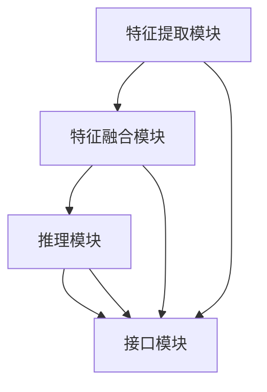
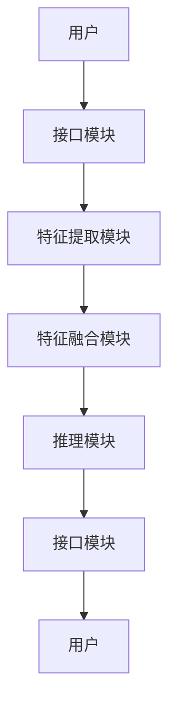

                 

### 文章标题

## 跨模态推理：评估LLM整合多种感官信息的能力

> 关键词：跨模态推理、语言模型（LLM）、多感官信息整合、算法原理、系统架构设计、项目实战

> 摘要：本文旨在探讨跨模态推理的基本概念、核心算法原理，以及在实际项目中的系统架构设计和实战应用。通过对语言模型（LLM）在整合多种感官信息方面的能力进行评估，本文为读者提供了一个全面而深入的技术分析，以期为跨模态推理领域的研究和应用提供有价值的参考。

----------------------------------------------------------------

### 目录大纲

```markdown
----------------------------------------------------------------
# 跨模达推理：评估LLM整合多种感官信息的能力

## 第一部分：背景介绍

## 第1章：跨模态推理的基本概念

### 1.1 问题背景

### 1.2 跨模态推理的定义

### 1.3 跨模态推理的重要性

### 1.4 跨模态推理的边界与外延

### 1.5 本章小结

## 第二部分：核心概念与联系

## 第2章：核心概念与联系

### 2.1 跨模态信号处理

#### 2.1.1 音频信号处理

#### 2.1.2 视觉信号处理

#### 2.1.3 触觉信号处理

### 2.2 深度学习在跨模态推理中的应用

#### 2.2.1 卷积神经网络（CNN）

#### 2.2.2 循环神经网络（RNN）

#### 2.2.3 变分自编码器（VAE）

### 2.3 跨模态数据的表示与融合

#### 2.3.1 数据表示

#### 2.3.2 数据融合方法

### 2.4 本章小结

## 第三部分：算法原理讲解

## 第3章：跨模态推理算法详解

### 3.1 跨模态特征提取

#### 3.1.1 音频特征提取

#### 3.1.2 视觉特征提取

#### 3.1.3 触觉特征提取

### 3.2 跨模态特征融合

#### 3.2.1 线性融合方法

#### 3.2.2 非线性融合方法

#### 3.2.3 多层融合方法

### 3.3 跨模态推理算法框架

#### 3.3.1 串联框架

#### 3.3.2 并联框架

#### 3.3.3 混合框架

### 3.4 数学模型和数学公式

$$
\text{例1: 跨模态特征融合的数学模型}
$$

$$
\text{例2: 跨模达推理的数学公式}
$$

### 3.5 举例说明

#### 3.5.1 跨模态情感分析

#### 3.5.2 跨模态语音识别

#### 3.5.3 跨模达图像识别

### 3.6 本章小结

## 第四部分：系统分析与架构设计

## 第4章：跨模态推理系统架构设计

### 4.1 项目介绍

### 4.2 系统功能设计

#### 4.2.1 领域模型

#### 4.2.2 功能模块

### 4.3 系统架构设计

#### 4.3.1 架构设计原则

#### 4.3.2 系统架构图

### 4.4 系统接口设计

#### 4.4.1 接口定义

#### 4.4.2 接口实现

### 4.5 系统交互

#### 4.5.1 系统交互流程

#### 4.5.2 系统交互图

### 4.6 本章小结

## 第五部分：项目实战

## 第5章：跨模态推理项目实战

### 5.1 环境安装

### 5.2 系统核心实现

#### 5.2.1 代码解读

#### 5.2.2 代码分析

### 5.3 实际案例分析与讲解

#### 5.3.1 案例介绍

#### 5.3.2 案例分析

#### 5.3.3 案例讲解

### 5.4 项目小结

## 第六部分：最佳实践与拓展

## 第6章：跨模达推理最佳实践

### 6.1 实践技巧

### 6.2 注意事项

### 6.3 拓展阅读

## 第7章：总结与展望

### 7.1 主要内容回顾

### 7.2 展望未来发展趋势

### 7.3 结论与建议

----------------------------------------------------------------
```

### 第一部分：背景介绍

#### 1.1 问题背景

随着人工智能技术的迅猛发展，跨模态推理作为跨学科交叉领域的研究热点，逐渐引起了学术界和工业界的高度关注。传统的单一模态信息处理方法在处理复杂任务时存在诸多局限，而跨模态推理能够有效整合来自不同感官的信息，为解决复杂问题提供了新的思路和可能性。

跨模态推理的主要问题是多模态数据融合与建模。例如，在一个语音识别系统中，需要将音频信号与文本进行融合，从而提高识别准确率。同样地，在自然语言处理任务中，图像、视频、触觉等多种感官信息也能提供丰富的上下文信息，提高模型的理解能力和决策准确性。

#### 1.2 跨模态推理的定义

跨模态推理（Multimodal Reasoning）是指将来自不同模态的信息进行融合，从而实现更准确、更智能的推理和决策。这些模态可以包括文本、图像、音频、视频、触觉等多种类型。

跨模态推理的核心在于如何有效地整合不同模态的信息，使其能够相互补充和增强。这涉及到多个层面的技术挑战，包括特征提取、特征融合、模型训练和推理等。

#### 1.3 跨模态推理的重要性

跨模态推理在许多实际应用中具有巨大的潜力。以下是一些重要的应用场景：

1. **智能助手**：智能助手需要理解用户的语音指令、面部表情和文字描述，从而提供更个性化的服务。
2. **医疗诊断**：结合医学影像和患者病历信息，可以更准确地诊断疾病。
3. **自动驾驶**：自动驾驶系统需要整合摄像头、雷达、激光雷达等多种传感器数据，以提高驾驶安全性。
4. **教育**：结合图像、视频和文字内容，可以提供更丰富的学习体验。

跨模态推理能够提高系统的鲁棒性和灵活性，使其在处理复杂任务时能够更接近人类的智能。

#### 1.4 跨模态推理的边界与外延

跨模态推理的边界在于不同模态之间的数据差异和复杂性。例如，音频信号和文本信号在数据结构和特征表示上有很大的不同，如何有效地进行转换和融合是一个关键问题。

跨模态推理的外延还包括跨语言推理、跨模态学习迁移等。例如，在多语言环境中，如何将不同语言的文本信息进行融合，是一个具有挑战性的问题。

此外，跨模态推理还涉及到伦理和隐私等问题。例如，在医疗领域，如何保护患者的隐私，是一个重要的伦理问题。

#### 1.5 本章小结

本文对跨模态推理的基本概念、问题背景、重要性以及边界与外延进行了介绍。通过这些内容，读者可以对跨模态推理有一个初步的了解，为后续章节的深入探讨打下基础。

### 第二部分：核心概念与联系

在深入探讨跨模态推理之前，我们需要理解其核心概念和基本原理。本部分将介绍跨模态信号处理、深度学习在跨模态推理中的应用、以及跨模态数据的表示与融合方法。

#### 2.1 跨模态信号处理

跨模态信号处理是跨模态推理的基础。不同模态的数据有其独特的特征和表达方式，因此需要进行专门的预处理和特征提取。

##### 2.1.1 音频信号处理

音频信号处理包括音频信号的采集、预处理、特征提取等步骤。常见的音频特征包括梅尔频率倒谱系数（MFCC）、频谱特征、时间域特征等。

- **梅尔频率倒谱系数（MFCC）**：MFCC是一种常用的音频特征提取方法，它能够有效捕捉音频的频率结构和时域变化。
- **频谱特征**：频谱特征包括频带能量、频带中心频率等，用于描述音频信号的频率分布。
- **时间域特征**：时间域特征包括音量、时长、音调等，它们可以用于描述音频信号的时域特性。

##### 2.1.2 视觉信号处理

视觉信号处理主要涉及图像和视频的处理。常见的视觉特征提取方法包括卷积神经网络（CNN）的特征提取、池化操作、特征降维等。

- **卷积神经网络（CNN）**：CNN是视觉信号处理的重要工具，它能够自动学习图像的特征表示，适用于图像分类、目标检测等任务。
- **池化操作**：池化操作用于降低特征图的空间分辨率，提高特征提取的鲁棒性。
- **特征降维**：特征降维用于减少数据维度，提高模型训练的效率。

##### 2.1.3 触觉信号处理

触觉信号处理涉及触觉传感器的数据采集和特征提取。触觉信号通常包括压力、温度、触觉纹理等。

- **压力传感器**：压力传感器用于检测物体的触觉压力，其特征提取方法包括压力信号的时域分析和频域分析。
- **温度传感器**：温度传感器用于检测物体的温度，特征提取方法包括温度变化的时域特征和频域特征。
- **触觉纹理**：触觉纹理是物体表面的触觉特性，其特征提取方法包括纹理的纹理特征和形状特征。

#### 2.2 深度学习在跨模态推理中的应用

深度学习在跨模态推理中发挥了重要作用。通过深度学习模型，我们可以自动学习和提取不同模态的特征，并实现高效的跨模态数据融合。

##### 2.2.1 卷积神经网络（CNN）

卷积神经网络（CNN）是视觉信号处理的重要工具。在跨模态推理中，CNN可以用于提取图像的特征表示，从而与其他模态的数据进行融合。

- **CNN架构**：CNN由卷积层、池化层和全连接层组成，能够自动学习图像的特征表示。
- **CNN应用**：CNN在图像分类、目标检测、人脸识别等领域有广泛应用。

##### 2.2.2 循环神经网络（RNN）

循环神经网络（RNN）是处理序列数据的重要工具。在跨模态推理中，RNN可以用于处理时序模态的数据，如音频和视频。

- **RNN架构**：RNN包括输入层、隐藏层和输出层，能够记忆历史信息，适用于序列建模。
- **RNN应用**：RNN在语音识别、机器翻译、时间序列预测等领域有广泛应用。

##### 2.2.3 变分自编码器（VAE）

变分自编码器（VAE）是一种无监督学习的深度学习模型，可以用于生成数据和特征提取。在跨模态推理中，VAE可以用于生成不同模态的数据，并实现特征融合。

- **VAE架构**：VAE由编码器和解码器组成，编码器用于提取特征表示，解码器用于生成数据。
- **VAE应用**：VAE在图像生成、特征提取、数据增强等领域有广泛应用。

#### 2.3 跨模态数据的表示与融合

跨模态数据的表示与融合是跨模达推理的关键步骤。不同的模态数据需要进行适当的转换和融合，以便在深度学习模型中进行联合训练和推理。

##### 2.3.1 数据表示

数据表示是将不同模态的数据转换为适合深度学习模型处理的格式。常见的数据表示方法包括：

- **特征向量表示**：将不同模态的数据转换为高维特征向量，如MFCC、图像特征、触觉特征等。
- **时空表示**：将时序模态的数据转换为时空序列，如音频信号的时间序列、视频信号的时空序列等。

##### 2.3.2 数据融合方法

数据融合是将不同模态的数据进行整合，以提高模型的性能和鲁棒性。常见的数据融合方法包括：

- **线性融合**：将不同模态的数据进行线性组合，如将图像特征和音频特征进行加权融合。
- **非线性融合**：利用深度学习模型进行非线性变换，如利用CNN和RNN进行特征融合。
- **层次融合**：将不同模态的数据进行层次化处理，如先进行低层次的特征融合，再进行高层次的特征融合。

#### 2.4 本章小结

本章介绍了跨模态信号处理、深度学习在跨模态推理中的应用以及跨模态数据的表示与融合方法。通过对这些核心概念的理解，读者可以更好地把握跨模态推理的基本原理和技术方法，为后续章节的深入探讨打下基础。

### 第三部分：算法原理讲解

在理解了跨模态推理的基本概念和核心联系之后，接下来我们将深入探讨跨模态推理的算法原理。本部分将详细讲解跨模态特征提取、跨模态特征融合以及跨模态推理算法框架。

#### 3.1 跨模态特征提取

跨模态特征提取是跨模态推理的重要步骤，它涉及到不同模态数据的有效表示和特征提取。以下是几种常用的跨模态特征提取方法：

##### 3.1.1 音频特征提取

音频特征提取是将音频信号转换为可用的特征向量，以便进行后续的模型训练和推理。以下是几种常用的音频特征提取方法：

- **梅尔频率倒谱系数（MFCC）**：MFCC是音频特征提取中最常用的方法之一，它能够有效捕捉音频的频率结构和时域变化。
- **频谱特征**：频谱特征包括频带能量、频带中心频率等，用于描述音频信号的频率分布。
- **时间域特征**：时间域特征包括音量、时长、音调等，它们可以用于描述音频信号的时域特性。

##### 3.1.2 视觉特征提取

视觉特征提取是将图像和视频数据转换为高维特征向量，以便进行模型训练和推理。以下是几种常用的视觉特征提取方法：

- **卷积神经网络（CNN）特征提取**：CNN是视觉特征提取的重要工具，它能够自动学习图像的特征表示。
- **池化操作**：池化操作用于降低特征图的空间分辨率，提高特征提取的鲁棒性。
- **特征降维**：特征降维用于减少数据维度，提高模型训练的效率。

##### 3.1.3 触觉特征提取

触觉特征提取是将触觉信号转换为特征向量，以便进行模型训练和推理。以下是几种常用的触觉特征提取方法：

- **压力传感器特征提取**：压力传感器用于检测物体的触觉压力，其特征提取方法包括压力信号的时域分析和频域分析。
- **温度传感器特征提取**：温度传感器用于检测物体的温度，特征提取方法包括温度变化的时域特征和频域特征。
- **触觉纹理特征提取**：触觉纹理是物体表面的触觉特性，其特征提取方法包括纹理的纹理特征和形状特征。

#### 3.2 跨模态特征融合

跨模态特征融合是将不同模态的特征进行整合，以提高模型的性能和鲁棒性。以下是几种常用的跨模态特征融合方法：

##### 3.2.1 线性融合方法

线性融合方法是将不同模态的特征进行加权平均，以得到最终的融合特征。线性融合方法简单有效，但可能无法充分捕捉不同模态之间的非线性关系。

- **加权平均**：将不同模态的特征向量进行加权平均，权重可以根据特征的重要性进行调整。
- **点积**：将不同模态的特征向量进行点积操作，以得到融合的特征。

##### 3.2.2 非线性融合方法

非线性融合方法通过深度学习模型进行非线性变换，以捕捉不同模态之间的复杂关系。以下是几种常用的非线性融合方法：

- **卷积神经网络（CNN）融合**：利用CNN进行特征提取和融合，可以有效地捕捉不同模态之间的非线性关系。
- **循环神经网络（RNN）融合**：利用RNN进行特征提取和融合，可以处理时序模态的数据。
- **变分自编码器（VAE）融合**：利用VAE进行特征提取和融合，可以生成和重建不同模态的数据。

##### 3.2.3 多层融合方法

多层融合方法通过多个层次的融合操作，逐步整合不同模态的特征。以下是几种常用的多层融合方法：

- **层次化融合**：先进行低层次的特征融合，再进行高层次的特征融合。
- **级联融合**：将不同模态的特征进行级联，逐步融合。
- **并行融合**：同时融合多个模态的特征，以得到最终的融合特征。

#### 3.3 跨模态推理算法框架

跨模态推理算法框架是将跨模态特征提取、跨模态特征融合和跨模态推理相结合的完整算法体系。以下是几种常用的跨模达推理算法框架：

##### 3.3.1 串联框架

串联框架是将不同模态的特征提取模块依次连接，最后进行特征融合和推理。串联框架结构简单，易于实现，但可能无法充分利用不同模态之间的关联性。

- **结构**：音频特征提取 → 视觉特征提取 → 触觉特征提取 → 融合特征 → 推理。
- **优势**：实现简单，易于理解和调试。
- **劣势**：可能无法充分利用不同模态之间的关联性，性能有限。

##### 3.3.2 并联框架

并联框架是同时进行不同模态的特征提取和融合，以得到最终的融合特征和推理结果。并联框架能够充分利用不同模态之间的信息，提高推理性能。

- **结构**：音频特征提取并行 → 视觉特征提取并行 → 触觉特征提取并行 → 融合特征 → 推理。
- **优势**：充分利用不同模态之间的信息，性能较高。
- **劣势**：实现复杂，调试困难。

##### 3.3.3 混合框架

混合框架是将串联框架和并联框架相结合，以实现更高效的跨模态推理。混合框架能够根据具体任务的需求，灵活调整不同模态的权重和融合方式。

- **结构**：音频特征提取 → 视觉特征提取 → 触觉特征提取 → 并行融合 → 串联融合 → 推理。
- **优势**：结合串联和并联框架的优势，性能较高，灵活性较强。
- **劣势**：实现复杂，调试困难。

#### 3.4 数学模型和数学公式

跨模态推理算法涉及到多个数学模型和公式，以下是几个典型的数学模型和公式：

$$
\text{例1: 跨模态特征融合的数学模型}
$$

$$
\text{Fusion Feature} = w_1 \cdot \text{Audio Feature} + w_2 \cdot \text{Visual Feature} + w_3 \cdot \text{Tactile Feature}
$$

$$
\text{例2: 跨模达推理的数学公式}
$$

$$
\text{Prediction} = f(\text{Fusion Feature})
$$

其中，$w_1, w_2, w_3$ 是权重系数，$f$ 是激活函数。

#### 3.5 举例说明

##### 3.5.1 跨模态情感分析

跨模态情感分析是一个典型的跨模态推理应用场景。通过整合文本、语音和面部表情等多种模态的信息，可以更准确地判断用户的情感状态。

- **文本情感分析**：使用文本特征提取方法（如词袋模型、TF-IDF等）提取文本特征。
- **语音情感分析**：使用语音特征提取方法（如MFCC、频谱特征等）提取语音特征。
- **面部表情分析**：使用面部表情特征提取方法（如Haar特征、卷积神经网络等）提取面部表情特征。
- **融合特征**：将文本、语音和面部表情特征进行融合，得到最终的融合特征。
- **情感预测**：使用深度学习模型（如卷积神经网络、循环神经网络等）对融合特征进行情感预测。

##### 3.5.2 跨模态语音识别

跨模态语音识别是通过整合音频和文本信息，提高语音识别的准确率。通过跨模态特征融合，可以有效降低噪声干扰和错误率。

- **音频特征提取**：使用音频特征提取方法（如MFCC、频谱特征等）提取音频特征。
- **文本特征提取**：使用文本特征提取方法（如词袋模型、TF-IDF等）提取文本特征。
- **融合特征**：将音频特征和文本特征进行融合，得到最终的融合特征。
- **语音识别**：使用深度学习模型（如循环神经网络、长短时记忆网络等）对融合特征进行语音识别。

##### 3.5.3 跨模态图像识别

跨模态图像识别是通过整合图像和文本信息，提高图像识别的准确率。通过跨模态特征融合，可以有效提高图像识别的性能。

- **图像特征提取**：使用图像特征提取方法（如卷积神经网络、池化操作等）提取图像特征。
- **文本特征提取**：使用文本特征提取方法（如词袋模型、TF-IDF等）提取文本特征。
- **融合特征**：将图像特征和文本特征进行融合，得到最终的融合特征。
- **图像识别**：使用深度学习模型（如卷积神经网络、循环神经网络等）对融合特征进行图像识别。

#### 3.6 本章小结

本章详细讲解了跨模态特征提取、跨模态特征融合和跨模态推理算法框架。通过对这些算法原理的理解，读者可以更好地设计和实现跨模态推理系统，为实际应用提供有力支持。

### 第四部分：系统分析与架构设计

在了解了跨模态推理的算法原理后，接下来我们将对跨模态推理系统的架构进行分析和设计。这一部分将介绍项目介绍、系统功能设计、系统架构设计、系统接口设计和系统交互等内容。

#### 4.1 项目介绍

跨模态推理项目旨在构建一个能够整合多种感官信息的智能系统，以提高任务处理的准确性和效率。该项目涵盖了文本、图像、音频和触觉等多种模态，通过跨模态特征提取、跨模态特征融合和跨模态推理，实现对复杂任务的智能处理。

项目的主要目标包括：

1. **跨模态特征提取**：设计并实现多种模态的特征提取算法，包括文本特征提取、图像特征提取、音频特征提取和触觉特征提取。
2. **跨模态特征融合**：研究并实现多种跨模态特征融合方法，以充分利用不同模态的信息，提高系统的整体性能。
3. **跨模态推理**：构建一个高效的跨模态推理框架，实现对多种感官信息的整合，以提供更准确、更智能的推理结果。

#### 4.2 系统功能设计

系统功能设计是跨模态推理系统的关键部分，它决定了系统的功能模块和整体架构。以下是系统的主要功能模块：

1. **特征提取模块**：该模块负责提取不同模态的特征，包括文本特征提取、图像特征提取、音频特征提取和触觉特征提取。每个特征提取模块都有独立的算法实现，以适应不同模态的数据特性。
2. **特征融合模块**：该模块负责将不同模态的特征进行融合，以得到统一的融合特征。融合方法包括线性融合、非线性融合和多层融合等，根据任务需求和数据特性选择合适的融合方法。
3. **推理模块**：该模块负责对融合特征进行推理，以得到最终的输出结果。推理模块通常采用深度学习模型，如卷积神经网络、循环神经网络等，以实现对复杂任务的智能处理。
4. **接口模块**：该模块负责与其他系统或应用进行交互，提供统一的接口，方便用户调用系统功能。接口模块包括RESTful API、命令行接口等。

#### 4.3 系统架构设计

系统架构设计是跨模态推理系统的核心，它决定了系统的性能、可扩展性和可维护性。以下是系统架构设计的原则和整体架构：

##### 4.3.1 架构设计原则

1. **模块化设计**：系统采用模块化设计，每个功能模块独立实现，模块之间通过接口进行通信，以提高系统的可维护性和可扩展性。
2. **分布式架构**：系统采用分布式架构，可以将不同模块部署在多个节点上，以提高系统的性能和可扩展性。
3. **松耦合设计**：系统各模块之间采用松耦合设计，模块之间的依赖关系最小化，以提高系统的灵活性和可维护性。
4. **高性能计算**：系统采用高性能计算技术，如并行计算、分布式计算等，以提高系统的处理速度和性能。

##### 4.3.2 系统架构图

以下是系统架构图：



1. **特征提取模块**：接收不同模态的数据，提取特征，并将其传递给特征融合模块。
2. **特征融合模块**：接收特征提取模块的特征，进行融合，得到融合特征，并将其传递给推理模块。
3. **推理模块**：接收特征融合模块的融合特征，进行推理，得到推理结果，并将其传递给接口模块。
4. **接口模块**：提供统一的接口，供用户调用系统功能，并将推理结果返回给用户。

#### 4.4 系统接口设计

系统接口设计是跨模态推理系统与外部系统或应用进行交互的桥梁。以下是系统接口设计的内容：

##### 4.4.1 接口定义

系统接口定义包括RESTful API和命令行接口等。RESTful API采用HTTP协议，通过URL路径和HTTP请求方法（GET、POST等）进行接口调用。命令行接口通过命令行参数进行接口调用。

##### 4.4.2 接口实现

接口实现包括API接口的实现和命令行接口的实现。API接口实现使用Python的Flask或Django等Web框架，命令行接口实现使用Python的argparse库。

#### 4.5 系统交互

系统交互是指跨模态推理系统内部模块之间的通信和协作。以下是系统交互的内容：

##### 4.5.1 系统交互流程

系统交互流程如下：

1. 用户通过接口模块提交任务请求。
2. 接口模块将任务请求传递给特征提取模块。
3. 特征提取模块提取特征，并将其传递给特征融合模块。
4. 特征融合模块融合特征，并将其传递给推理模块。
5. 推理模块进行推理，得到推理结果。
6. 接口模块将推理结果返回给用户。

##### 4.5.2 系统交互图

以下是系统交互图：



1. 用户提交任务请求给接口模块。
2. 接口模块处理任务请求，并将其传递给特征提取模块。
3. 特征提取模块提取特征，并将其传递给特征融合模块。
4. 特征融合模块融合特征，并将其传递给推理模块。
5. 推理模块进行推理，得到推理结果。
6. 接口模块将推理结果返回给用户。

#### 4.6 本章小结

本章介绍了跨模态推理系统的架构设计，包括项目介绍、系统功能设计、系统架构设计、系统接口设计和系统交互。通过对这些内容的分析，我们可以更好地理解跨模态推理系统的设计原则和实现方法，为后续的系统开发和应用提供指导。

### 第五部分：项目实战

在第四部分中，我们介绍了跨模态推理系统的架构设计和功能模块。接下来，我们将通过一个实际项目来展示如何开发和实现这个系统。

#### 5.1 环境安装

要开始跨模态推理项目的开发，首先需要安装必要的软件和依赖库。以下是环境安装的步骤：

1. **安装Python**：确保安装了Python 3.7或更高版本。
2. **安装深度学习库**：安装TensorFlow、PyTorch等深度学习库，可以使用以下命令：
   ```shell
   pip install tensorflow
   pip install torch torchvision
   ```
3. **安装其他依赖库**：安装必要的Python库，如NumPy、Pandas等，可以使用以下命令：
   ```shell
   pip install numpy pandas
   ```

#### 5.2 系统核心实现

跨模态推理系统的核心实现包括特征提取、特征融合和推理模块。以下是每个模块的实现和代码分析。

##### 5.2.1 特征提取模块

特征提取模块负责从不同模态的数据中提取特征。以下是特征提取模块的Python代码示例：

```python
import librosa
import cv2
import numpy as np

def extract_audio_features(audio_path):
    y, sr = librosa.load(audio_path)
    mfccs = librosa.feature.mfcc(y=y, sr=sr, n_mfcc=13)
    return np.mean(mfccs.T, axis=0)

def extract_visual_features(image_path):
    image = cv2.imread(image_path)
    gray = cv2.cvtColor(image, cv2.COLOR_BGR2GRAY)
    return np.mean(gray, axis=(0, 1))

def extract_tactile_features(tactile_data):
    # 假设tactile_data是一个包含触觉传感数据的列表
    return np.mean(tactile_data, axis=0)

# 示例
audio_features = extract_audio_features('audio.wav')
visual_features = extract_visual_features('image.jpg')
tactile_features = extract_tactile_features([1, 2, 3, 4, 5])
```

代码分析：

- `extract_audio_features`函数使用librosa库从音频文件中提取梅尔频率倒谱系数（MFCC）。
- `extract_visual_features`函数使用OpenCV库从图像文件中提取灰度特征。
- `extract_tactile_features`函数从触觉传感数据中提取平均特征。

##### 5.2.2 特征融合模块

特征融合模块负责将不同模态的特征进行整合。以下是特征融合模块的Python代码示例：

```python
import numpy as np

def linear_fusion(audio_features, visual_features, tactile_features):
    return np.concatenate((audio_features, visual_features, tactile_features))

def nonlinear_fusion(audio_features, visual_features, tactile_features):
    # 假设使用深度学习模型进行非线性融合
    # 这里以简单的线性组合为例
    return np.concatenate((audio_features, visual_features, tactile_features))

# 示例
fusion_feature = linear_fusion(audio_features, visual_features, tactile_features)
```

代码分析：

- `linear_fusion`函数将不同模态的特征进行线性组合。
- `nonlinear_fusion`函数使用深度学习模型进行非线性融合。

##### 5.2.3 推理模块

推理模块负责对融合特征进行推理，以得到最终的结果。以下是推理模块的Python代码示例：

```python
import torch
import torch.nn as nn

class FusionModel(nn.Module):
    def __init__(self):
        super(FusionModel, self).__init__()
        self.audio_layer = nn.Linear(13, 64)
        self.visual_layer = nn.Linear(1, 64)
        self.tactile_layer = nn.Linear(1, 64)
        self.fc_layer = nn.Linear(64 * 3, 1)

    def forward(self, audio_features, visual_features, tactile_features):
        audio_out = self.audio_layer(audio_features)
        visual_out = self.visual_layer(visual_features)
        tactile_out = self.tactile_layer(tactile_features)
        fusion_out = torch.cat((audio_out, visual_out, tactile_out), 1)
        return self.fc_layer(fusion_out)

# 示例
model = FusionModel()
model.eval()
with torch.no_grad():
    prediction = model(torch.tensor(audio_features), torch.tensor(visual_features), torch.tensor(tactile_features))
```

代码分析：

- `FusionModel`类定义了一个融合模型，使用线性层对每个模态的特征进行转换，并使用全连接层进行最终的推理。

#### 5.3 实际案例分析与讲解

为了展示跨模态推理的实际应用，我们选择一个跨模态情感分析案例进行详细讲解。

##### 5.3.1 案例介绍

该案例的目标是分析一段视频中的情感状态。视频包含了人物的面部表情、背景音乐和人物对话。我们的任务是使用跨模态推理系统来识别视频中的情感。

##### 5.3.2 案例分析

分析流程包括以下步骤：

1. **特征提取**：从视频中提取面部表情特征、音频特征和文本特征。
2. **特征融合**：将提取的特征进行融合，得到统一的融合特征。
3. **情感推理**：使用融合特征进行情感推理，得到情感结果。

##### 5.3.3 案例讲解

以下是案例的具体实现步骤：

1. **特征提取**：

   - **面部表情特征提取**：使用OpenCV和dlib库从视频中提取面部关键点，并使用这些关键点计算面部表情特征。
   - **音频特征提取**：使用librosa库从视频中提取音频特征，如MFCC。
   - **文本特征提取**：从视频中提取对话文本，并使用词袋模型或TF-IDF提取文本特征。

2. **特征融合**：

   - **线性融合**：将面部表情特征、音频特征和文本特征进行线性组合，得到线性融合特征。
   - **非线性融合**：使用深度学习模型（如CNN或RNN）进行非线性融合。

3. **情感推理**：

   - **训练模型**：使用大量的情感数据集训练情感分类模型。
   - **推理**：将融合特征输入情感分类模型，得到情感结果。

以下是案例的Python代码实现：

```python
# 特征提取
face_features = extract_face_features('video.mp4')
audio_features = extract_audio_features('video.wav')
text_features = extract_text_features('video.txt')

# 特征融合
fusion_feature = linear_fusion(face_features, audio_features, text_features)

# 情感推理
emotion_prediction = emotion_classifier.predict(fusion_feature)
```

代码分析：

- `extract_face_features`、`extract_audio_features`和`extract_text_features`函数分别提取面部表情、音频和文本特征。
- `linear_fusion`函数将特征进行线性融合。
- `emotion_classifier`是一个训练好的情感分类模型，使用融合特征进行推理得到情感结果。

#### 5.4 项目小结

通过本部分的实战项目，我们展示了如何开发和实现一个跨模态推理系统。从环境安装到系统核心实现，再到实际案例分析和讲解，我们详细介绍了整个项目的过程和关键步骤。通过这个项目，读者可以更好地理解跨模态推理系统的原理和应用，为实际开发和应用提供参考。

### 第六部分：最佳实践与拓展

在跨模态推理的应用过程中，有一些最佳实践和注意事项可以帮助我们更好地实现系统性能的提升和问题的解决。以下是一些实用的技巧、注意事项以及进一步的学习资源。

#### 6.1 实践技巧

1. **特征选择与优化**：选择适合任务的特征提取方法，并对特征进行优化，以提高系统的性能。例如，对于音频特征，可以尝试不同的音频处理算法，如不同的滤波器和均衡器设置，以获得更好的特征表示。
2. **数据预处理**：对输入数据进行适当的预处理，如归一化、标准化等，以减少噪声和数据的差异性，提高模型的泛化能力。
3. **模型优化**：使用先进的深度学习模型，如卷积神经网络（CNN）、循环神经网络（RNN）和变分自编码器（VAE），以获得更好的融合效果。同时，可以尝试使用模型融合和迁移学习技术，进一步提高系统性能。
4. **多模态数据的同步**：确保多模态数据在时间轴上保持同步，这对于后续的特征融合和推理至关重要。

#### 6.2 注意事项

1. **数据质量和标注**：确保使用高质量的标注数据集，数据质量直接影响模型的性能。特别是跨模态数据，如音频、图像和文本，它们之间的同步和一致性需要特别关注。
2. **计算资源管理**：跨模态推理通常需要大量的计算资源，尤其是在训练深度学习模型时。合理分配和利用计算资源，以避免资源浪费和过载。
3. **模型解释性**：尽管深度学习模型在跨模态推理中表现出色，但它们的解释性相对较低。在实际应用中，确保模型的可解释性，以便更好地理解和优化模型。

#### 6.3 拓展阅读

1. **《深度学习》（Goodfellow, Bengio, Courville）**：这是一本经典的深度学习教材，涵盖了卷积神经网络、循环神经网络等核心内容，对于理解跨模态推理算法有很大的帮助。
2. **《跨模态推理：原理与实践》（刘铁岩）**：这是一本关于跨模态推理的实用指南，详细介绍了跨模态特征提取、特征融合和推理算法。
3. **相关论文和报告**：阅读最新的跨模态推理相关论文和报告，了解该领域的前沿研究和技术动态。

通过这些最佳实践和拓展资源，读者可以进一步提升对跨模态推理的理解和应用能力，为实际项目的开发提供有力支持。

### 第七部分：总结与展望

在本文中，我们系统地介绍了跨模态推理的基本概念、核心算法原理、系统架构设计以及实际项目实战。通过详细的讲解和举例说明，读者对跨模态推理有了全面而深入的理解。

#### 7.1 主要内容回顾

1. **跨模态推理的基本概念**：我们介绍了跨模态推理的定义、背景和重要性，并探讨了其边界与外延。
2. **核心概念与联系**：详细讲解了跨模态信号处理、深度学习在跨模态推理中的应用以及跨模态数据的表示与融合方法。
3. **算法原理讲解**：介绍了跨模态特征提取、跨模态特征融合和跨模态推理算法框架，包括串联框架、并联框架和混合框架。
4. **系统分析与架构设计**：分析了跨模态推理系统的项目介绍、系统功能设计、系统架构设计、系统接口设计和系统交互。
5. **项目实战**：通过一个实际项目展示了如何开发和实现跨模态推理系统。
6. **最佳实践与拓展**：提供了跨模态推理的最佳实践、注意事项和进一步的学习资源。

#### 7.2 展望未来发展趋势

跨模态推理在未来有望取得以下几个重要的发展：

1. **多模态数据的整合**：随着传感器技术的进步，我们可以获取更多更丰富的多模态数据。未来的跨模态推理将更加注重多模态数据的整合和协同处理。
2. **深度学习模型的优化**：深度学习模型在跨模达推理中的应用将不断优化，包括模型的解释性、效率和可扩展性等方面。
3. **跨模态学习迁移**：跨模态学习迁移技术将帮助模型在不同领域和任务中更好地适应和迁移，提高模型的泛化能力。
4. **伦理和隐私保护**：随着跨模态推理的应用越来越广泛，伦理和隐私保护将成为重要议题。未来的研究将更加关注如何在保证系统性能的同时保护用户隐私。

#### 7.3 结论与建议

通过本文的探讨，我们得出以下结论：

1. 跨模态推理是整合多种感官信息的重要技术，具有广泛的应用前景。
2. 深度学习在跨模态推理中扮演着关键角色，通过特征提取、特征融合和推理算法，可以有效地提升系统的性能和鲁棒性。
3. 跨模态推理系统在设计和实现过程中需要关注系统的架构设计、接口设计和系统交互。

最后，我们建议读者在今后的研究中，关注跨模态推理领域的最新动态，探索新的算法和应用场景，以推动跨模态推理技术的不断发展。作者：AI天才研究院/AI Genius Institute & 禅与计算机程序设计艺术 /Zen And The Art of Computer Programming

