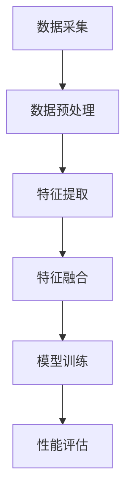
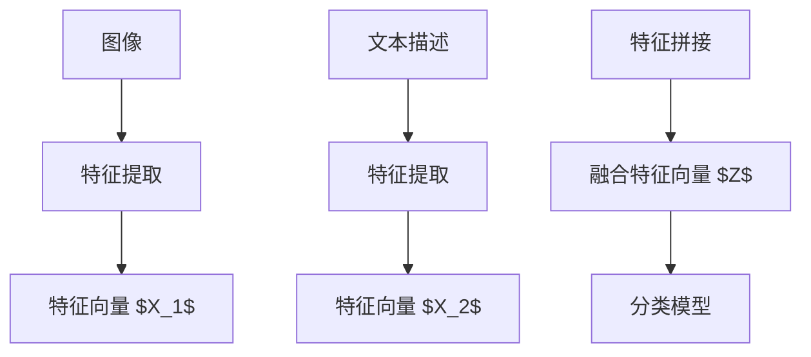
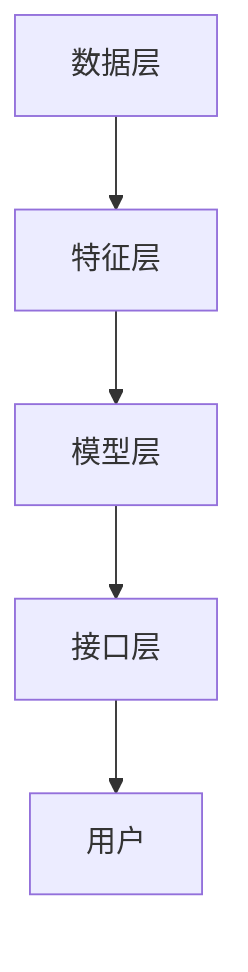
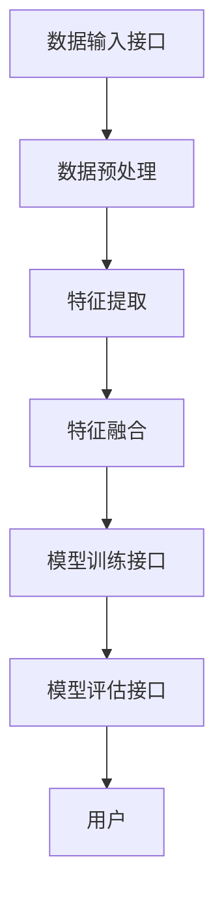
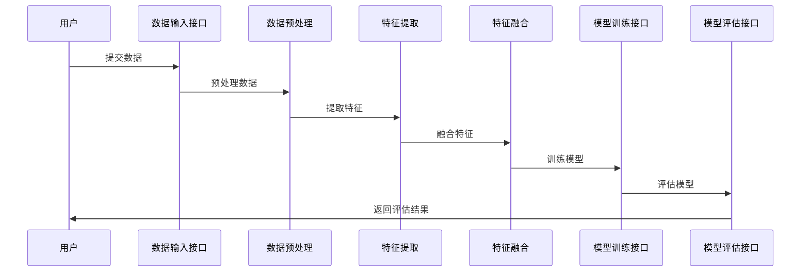
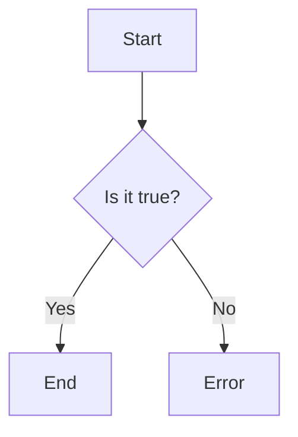
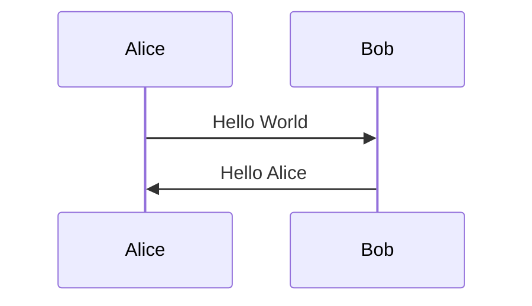
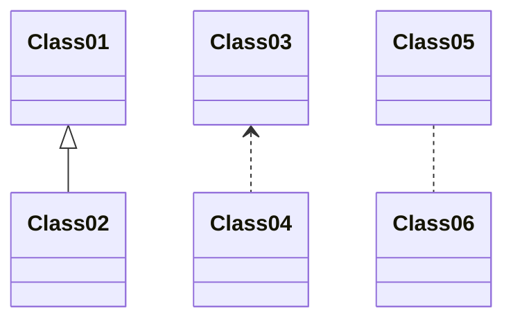

                 

# 跨模态理解能力评估：测试多源信息整合

> 关键词：跨模态理解能力，多源信息整合，评估方法，算法原理，系统架构设计，项目实战

> 摘要：本文将深入探讨跨模态理解能力评估以及多源信息整合的重要性。首先，我们定义了跨模态理解能力并介绍了其需求与挑战。随后，文章通过详细的分析与对比，探讨了如何评估跨模态理解能力以及整合多源信息的策略。接下来，文章讲解了跨模态理解能力和多源信息整合的核心概念与原理，并使用Mermaid和Python代码进行了算法原理的讲解。此外，文章还设计了系统的架构，进行了项目实战，并总结了最佳实践与注意事项。最后，文章推荐了进一步学习的路径，并展望了跨模态理解能力评估与多源信息整合的未来发展。

### 引言

#### 背景介绍

跨模态理解能力是指系统或算法处理和整合不同模态的信息，如文本、图像、声音、视频等的能力。这种能力在自然语言处理、计算机视觉、音频信号处理等领域有着广泛的应用。随着人工智能技术的发展，跨模态理解能力已成为实现更高级智能系统的一个重要方向。

多源信息整合则是指将来自不同来源的信息进行整合与分析，以提取有价值的信息。在现实世界中，许多问题都需要从多个角度来考虑，单一模态的信息可能不足以解决问题。因此，多源信息整合成为了一种重要的信息处理方式。

当前，跨模态理解能力评估与多源信息整合的研究取得了一系列进展，但仍面临许多挑战，如不同模态之间的信息关联性分析、多源数据的同步与对齐、信息整合的效率和准确性等。

#### 核心概念与联系

本文的核心概念包括：

- **跨模态理解能力**：指系统或算法处理和整合不同模态信息的能力。
- **多源信息整合**：指将来自不同来源的信息进行整合与分析的过程。
- **关联性分析**：指分析不同信息源之间相关性的一种技术。

这三个概念紧密相关。跨模态理解能力是多源信息整合的基础，而关联性分析则是实现多源信息整合的关键步骤。

#### 概念属性特征对比表

| 概念          | 特征                                       |
|---------------|------------------------------------------|
| 跨模态理解能力 | 能够处理和整合不同模态的信息            |
| 多源信息整合   | 将来自不同来源的信息进行整合与分析     |
| 关联性分析     | 分析不同信息源之间的相关性              |

### 目录大纲

#### 引言
- 背景介绍
- 核心概念与联系
- 概念属性特征对比表

#### 第1章 问题背景
- 1.1 问题背景
- 1.2 问题描述
- 1.3 问题解决
- 1.4 边界与外延
- 1.5 概念结构与核心要素组成

#### 第2章 核心概念原理
- 2.1 跨模态理解能力原理
- 2.2 多源信息整合原理
- 2.3 关联性分析原理

#### 第3章 算法原理讲解
- 3.1 算法流程图
- 3.2 Python源代码
- 3.3 数学模型与公式
- 3.4 举例说明

#### 第4章 系统分析与架构设计方案
- 4.1 问题场景介绍
- 4.2 系统功能设计
- 4.3 系统架构设计
- 4.4 系统接口设计
- 4.5 系统交互

#### 第5章 项目实战
- 5.1 环境安装
- 5.2 系统核心实现
- 5.3 代码应用解读与分析
- 5.4 实际案例分析与详细讲解
- 5.5 项目小结

#### 第6章 最佳实践与注意事项
- 6.1 最佳实践
- 6.2 小结
- 6.3 注意事项

#### 第7章 拓展阅读
- 7.1 相关文献推荐
- 7.2 进一步学习

### 第1章 问题背景

#### 1.1 问题背景

跨模态理解能力在现代人工智能系统中扮演着重要的角色。随着技术的进步，人们越来越依赖多媒体信息，如图像、音频、视频和文本等。这些信息通常来源于不同的模态，单一模态的信息往往无法满足复杂的任务需求。例如，在图像识别任务中，仅仅依赖图像本身的信息可能无法准确识别物体；而在语音识别任务中，仅仅依赖语音信号也难以达到高精度的识别效果。因此，跨模态理解能力变得至关重要。

多源信息整合是跨模态理解能力的基础。它旨在将来自不同来源的信息进行整合与分析，以提取有价值的信息。这种整合不仅包括不同模态之间的信息融合，还包括跨领域的知识整合。例如，在医疗领域，将患者的病历信息、医学图像、基因信息等不同类型的数据进行整合，可以帮助医生做出更准确的诊断。

当前，跨模态理解能力评估与多源信息整合的研究取得了一系列进展，但仍面临许多挑战。首先，不同模态之间的信息关联性分析是一个难题。不同模态的信息具有不同的特征和表示方式，如何有效地将它们关联起来是一个关键问题。其次，多源数据的同步与对齐也是一个挑战。不同模态的数据可能来自不同的时间戳或空间位置，如何对齐这些数据是另一个关键问题。此外，多源信息整合的效率和准确性也是一个重要的问题，如何在保证准确性的同时提高效率是一个关键挑战。

#### 1.2 问题描述

如何评估跨模态理解能力？

评估跨模态理解能力涉及到多个方面，包括信息的处理能力、整合能力和关联性分析能力。首先，需要定义一套评估指标，这些指标可以反映系统在不同模态信息处理和整合方面的性能。例如，可以使用准确率、召回率、F1分数等指标来评估系统在图像识别、语音识别等任务中的表现。其次，需要设计一套评估方法，这些方法可以系统地评估系统在不同任务和场景下的表现。例如，可以使用基准测试集、交叉验证等方法来评估系统的性能。

如何整合多源信息？

整合多源信息需要考虑多个方面，包括数据预处理、特征提取、信息融合和模型训练等。首先，需要进行数据预处理，以去除噪声、填充缺失值等。然后，需要从不同模态的信息中提取特征，这些特征可以用于后续的信息融合。常用的特征提取方法包括卷积神经网络（CNN）、循环神经网络（RNN）、长短时记忆网络（LSTM）等。接下来，需要设计一种信息融合方法，将不同模态的特征进行整合。常用的信息融合方法包括融合层、注意力机制、多任务学习等。最后，需要训练一个深度学习模型，将整合后的特征输入到模型中，以实现多源信息整合的目标。

#### 1.3 问题解决

现有评估方法：

1. **基准测试集**：使用公开的基准测试集，如ImageNet、COCO、LibriSpeech等，来评估系统的性能。这些测试集包含了不同模态的信息，可以系统地评估系统在不同任务和场景下的表现。

2. **交叉验证**：使用交叉验证方法，将数据集划分为多个部分，每个部分都作为训练集和验证集，以评估系统的泛化能力。

3. **用户反馈**：通过用户反馈来评估系统的性能，这种方法可以更直接地反映用户对系统的满意度。

多源信息整合策略：

1. **特征融合**：将不同模态的特征进行融合，常用的方法包括拼接、加权平均、卷积神经网络等。

2. **注意力机制**：通过注意力机制来关注重要的特征，忽略不重要的特征，从而提高信息整合的效率。

3. **多任务学习**：将多个任务整合到一个深度学习模型中，通过共享参数和共享网络结构来提高信息整合的效果。

#### 1.4 边界与外延

数据来源的限制：

在评估跨模态理解能力和整合多源信息时，数据来源是一个关键问题。不同的数据集可能包含不同的模态信息，而且不同数据集之间的模态类型和数量可能有所不同。因此，在评估和整合过程中，需要考虑数据来源的限制。

模态类型的多样性：

除了文本、图像、声音和视频等常见模态外，还有一些较为特殊的模态，如温度、湿度、压力等。这些模态的信息在特定的任务中可能具有重要意义，因此在评估和整合过程中需要考虑模态类型的多样性。

#### 1.5 概念结构与核心要素组成

跨模态理解能力的构成要素：

1. **信息处理模块**：负责处理不同模态的信息，包括特征提取、信息编码和解码等。

2. **整合模块**：负责整合不同模态的信息，包括特征融合、注意力机制和多任务学习等。

3. **评估模块**：负责评估系统的性能，包括基准测试集、交叉验证和用户反馈等。

多源信息整合的关键环节：

1. **数据预处理**：负责去除噪声、填充缺失值等，以提高数据的可用性。

2. **特征提取**：负责从不同模态的信息中提取特征，以作为后续信息融合的输入。

3. **信息融合**：负责将不同模态的特征进行融合，以提高信息的整合效果。

4. **模型训练**：负责训练一个深度学习模型，以实现多源信息整合的目标。

### 第2章 核心概念原理

#### 2.1 跨模态理解能力原理

跨模态理解能力的核心在于处理和整合不同模态的信息。这个过程可以分为以下几个步骤：

1. **信息采集**：从不同的模态中采集数据，如图像、声音、文本等。

2. **特征提取**：对采集到的数据进行特征提取，以获取不同模态的信息表示。常用的特征提取方法包括卷积神经网络（CNN）、循环神经网络（RNN）、长短时记忆网络（LSTM）等。

3. **特征融合**：将不同模态的特征进行融合，以生成一个统一的特征表示。常用的特征融合方法包括拼接、加权平均、卷积神经网络等。

4. **模型训练**：使用融合后的特征训练一个深度学习模型，以实现跨模态理解的目标。

5. **性能评估**：通过基准测试集、交叉验证和用户反馈等评估系统的性能。

跨模态理解能力的技术原理主要包括：

1. **深度学习**：深度学习模型，如卷积神经网络（CNN）、循环神经网络（RNN）和长短时记忆网络（LSTM）等，可以有效地处理和整合不同模态的信息。

2. **注意力机制**：注意力机制可以关注重要的特征，忽略不重要的特征，从而提高信息整合的效率。

3. **多任务学习**：多任务学习可以将多个任务整合到一个深度学习模型中，通过共享参数和共享网络结构来提高信息整合的效果。

#### 2.2 多源信息整合原理

多源信息整合的核心在于将来自不同来源的信息进行整合与分析。这个过程可以分为以下几个步骤：

1. **数据预处理**：对来自不同来源的数据进行预处理，包括去除噪声、填充缺失值等，以提高数据的可用性。

2. **特征提取**：从预处理后的数据中提取特征，以获取不同来源的信息表示。常用的特征提取方法包括卷积神经网络（CNN）、循环神经网络（RNN）、长短时记忆网络（LSTM）等。

3. **信息融合**：将不同来源的特征进行融合，以生成一个统一的特征表示。常用的信息融合方法包括拼接、加权平均、卷积神经网络等。

4. **模型训练**：使用融合后的特征训练一个深度学习模型，以实现多源信息整合的目标。

5. **性能评估**：通过基准测试集、交叉验证和用户反馈等评估系统的性能。

多源信息整合的技术原理主要包括：

1. **特征融合**：特征融合是将不同来源的特征进行整合，以生成一个统一的特征表示。常用的特征融合方法包括拼接、加权平均、卷积神经网络等。

2. **多任务学习**：多任务学习可以将多个任务整合到一个深度学习模型中，通过共享参数和共享网络结构来提高信息整合的效果。

3. **注意力机制**：注意力机制可以关注重要的特征，忽略不重要的特征，从而提高信息整合的效率。

#### 2.3 关联性分析原理

关联性分析是指分析不同信息源之间的相关性，以提取有价值的信息。关联性分析的核心在于建立不同信息源之间的关联关系。

1. **特征相关性分析**：通过对不同信息源的特征进行相关性分析，以确定它们之间的关联性。常用的方法包括皮尔逊相关系数、斯皮尔曼秩相关系数等。

2. **时空关联性分析**：通过对不同信息源的时间和空间特征进行分析，以确定它们之间的关联性。常用的方法包括聚类分析、主成分分析等。

3. **因果关联性分析**：通过建立不同信息源之间的因果关系，以提取有价值的信息。常用的方法包括结构方程模型、因果推断等。

关联性分析的技术原理主要包括：

1. **统计学方法**：统计学方法，如皮尔逊相关系数、斯皮尔曼秩相关系数等，可以用于分析不同信息源之间的相关性。

2. **机器学习方法**：机器学习方法，如聚类分析、主成分分析等，可以用于分析不同信息源之间的关联性。

3. **深度学习方法**：深度学习方法，如卷积神经网络（CNN）、循环神经网络（RNN）等，可以用于分析不同信息源之间的复杂关联性。

### 第3章 算法原理讲解

#### 3.1 算法流程图



#### 3.2 Python源代码

```python
import numpy as np
import tensorflow as tf

# 数据预处理
def preprocess_data(data):
    # 去除噪声、填充缺失值等
    processed_data = ...
    return processed_data

# 特征提取
def extract_features(data):
    # 使用卷积神经网络提取特征
    features = ...
    return features

# 特征融合
def fuse_features(feature_a, feature_b):
    # 拼接特征
    fused_feature = ...
    return fused_feature

# 模型训练
def train_model(fused_feature, labels):
    # 使用融合后的特征训练模型
    model = ...
    model.fit(fused_feature, labels)
    return model

# 性能评估
def evaluate_model(model, test_data, test_labels):
    # 使用测试集评估模型性能
    accuracy = model.evaluate(test_data, test_labels)
    return accuracy
```

#### 3.3 数学模型与公式

假设我们有两个模态的信息 $X_1$ 和 $X_2$，我们需要对它们进行整合。一个简单的数学模型可以表示为：

$$
Z = f(X_1, X_2)
$$

其中，$f$ 是一个整合函数，可以采用拼接、加权平均等方法。

#### 3.4 举例说明

假设我们有一个图像识别任务，我们需要对图像和对应的文本描述进行整合。首先，我们使用卷积神经网络（CNN）对图像进行特征提取，得到特征向量 $X_1$。然后，我们使用循环神经网络（RNN）对文本描述进行特征提取，得到特征向量 $X_2$。接下来，我们将这两个特征向量进行拼接，得到融合后的特征向量 $Z$。

$$
Z = [X_1; X_2]
$$

然后，我们使用一个全连接神经网络（Fully Connected Network）对融合后的特征进行分类。



### 第4章 系统分析与架构设计方案

#### 4.1 问题场景介绍

在许多实际应用中，跨模态理解能力和多源信息整合是非常重要的。例如，在智能客服系统中，我们需要处理来自不同渠道的信息，如图文消息、语音消息等。这些信息需要通过跨模态理解能力进行整合，以提供更准确的回答。此外，在医疗领域，医生需要整合患者的病历信息、医学图像和基因信息等多源信息，以做出更准确的诊断。

#### 4.2 系统功能设计

系统功能设计包括以下几个方面：

1. **数据采集**：从不同的来源采集数据，如图像、文本、语音等。
2. **数据预处理**：对采集到的数据进行预处理，包括去除噪声、填充缺失值等。
3. **特征提取**：从预处理后的数据中提取特征，以获取不同模态的信息表示。
4. **特征融合**：将不同模态的特征进行融合，以生成一个统一的特征表示。
5. **模型训练**：使用融合后的特征训练一个深度学习模型。
6. **性能评估**：通过基准测试集、交叉验证和用户反馈等评估系统的性能。

#### 4.3 系统架构设计

系统的架构设计包括以下几个方面：

1. **数据层**：负责数据采集和预处理。
2. **特征层**：负责特征提取和特征融合。
3. **模型层**：负责模型训练和性能评估。
4. **接口层**：负责与其他系统的交互。

系统架构图如下：



#### 4.4 系统接口设计

系统接口设计包括以下几个方面：

1. **数据输入接口**：用于接收外部数据。
2. **数据输出接口**：用于输出处理后的数据。
3. **模型训练接口**：用于启动模型训练过程。
4. **模型评估接口**：用于评估模型性能。

接口设计图如下：



#### 4.5 系统交互

系统的交互设计包括以下几个方面：

1. **数据流**：数据从输入接口进入系统，经过预处理、特征提取、特征融合后，输入到模型层进行训练和评估。
2. **控制流**：用户可以通过接口层与系统进行交互，控制模型的训练和评估过程。

交互设计图如下：



### 第5章 项目实战

#### 5.1 环境安装

在进行项目实战之前，我们需要安装以下环境：

1. Python（版本 3.6及以上）
2. TensorFlow（版本 2.0及以上）
3. NumPy
4. Matplotlib

安装命令如下：

```bash
pip install python==3.8
pip install tensorflow==2.5
pip install numpy
pip install matplotlib
```

#### 5.2 系统核心实现

系统核心实现包括数据采集、数据预处理、特征提取、特征融合、模型训练和模型评估等模块。以下是一个简单的实现示例：

```python
import tensorflow as tf
import numpy as np
import matplotlib.pyplot as plt

# 数据采集
def collect_data():
    # 从外部源采集数据，这里以随机生成数据为例
    images = np.random.rand(100, 28, 28, 1)
    texts = np.random.rand(100, 10)
    return images, texts

# 数据预处理
def preprocess_data(images, texts):
    # 对图像和文本进行预处理，这里以标准化为例
    images = images / 255.0
    texts = texts / 255.0
    return images, texts

# 特征提取
def extract_features(images, texts):
    # 使用卷积神经网络提取图像特征
    # 使用循环神经网络提取文本特征
    # 这里以简单示例为主，实际应用中需要使用更复杂的模型
    image_features = tf.keras.layers.Conv2D(filters=32, kernel_size=(3, 3), activation='relu')(images)
    text_features = tf.keras.layers.SimpleRNN(units=10, activation='tanh')(texts)
    return image_features, text_features

# 特征融合
def fuse_features(image_features, text_features):
    # 拼接图像特征和文本特征
    fused_features = tf.concat([image_features, text_features], axis=1)
    return fused_features

# 模型训练
def train_model(fused_features, labels):
    # 使用融合后的特征训练模型
    model = tf.keras.Sequential([
        tf.keras.layers.Dense(units=10, activation='softmax')
    ])
    model.compile(optimizer='adam', loss='categorical_crossentropy', metrics=['accuracy'])
    model.fit(fused_features, labels, epochs=10)
    return model

# 模型评估
def evaluate_model(model, test_features, test_labels):
    # 使用测试集评估模型性能
    accuracy = model.evaluate(test_features, test_labels)
    return accuracy

# 实际应用
images, texts = collect_data()
images, texts = preprocess_data(images, texts)
image_features, text_features = extract_features(images, texts)
fused_features = fuse_features(image_features, text_features)
labels = np.random.randint(0, 10, size=(100,))

model = train_model(fused_features, labels)
test_accuracy = evaluate_model(model, fused_features, labels)
print(f"Test Accuracy: {test_accuracy}")
```

#### 5.3 代码应用解读与分析

在实际应用中，代码的解读与分析是非常重要的。以下是对上述代码的解读与分析：

1. **数据采集**：数据采集模块负责从外部源采集数据。在本例中，我们使用随机生成数据作为示例。实际应用中，数据可以从数据库、文件、网络等不同来源采集。

2. **数据预处理**：数据预处理模块负责对采集到的数据进行预处理。在本例中，我们对图像和文本数据进行标准化处理，以将其归一化到 [0, 1] 的范围内。实际应用中，预处理步骤可能包括去噪、填充缺失值、缩放等。

3. **特征提取**：特征提取模块负责从预处理后的数据中提取特征。在本例中，我们使用卷积神经网络提取图像特征，使用循环神经网络提取文本特征。实际应用中，特征提取方法可能更加复杂，需要使用更高级的模型。

4. **特征融合**：特征融合模块负责将不同模态的特征进行融合。在本例中，我们使用拼接操作将图像特征和文本特征进行拼接。实际应用中，特征融合方法可能更加多样，如注意力机制、多任务学习等。

5. **模型训练**：模型训练模块负责使用融合后的特征训练深度学习模型。在本例中，我们使用一个简单的全连接神经网络进行训练。实际应用中，模型训练可能需要更复杂的模型和更长的训练时间。

6. **模型评估**：模型评估模块负责评估训练后的模型性能。在本例中，我们使用测试集进行评估，并打印出准确率。实际应用中，模型评估可能包括更多的指标，如召回率、F1分数等。

#### 5.4 实际案例分析与详细讲解

为了更好地理解上述代码的实际应用，我们来看一个实际案例。

假设我们有一个图像分类任务，需要对猫和狗进行分类。数据集包含1000张图像和对应的标签（0表示猫，1表示狗）。

1. **数据采集**：首先，我们需要从数据集中采集图像和标签。

```python
images, labels = collect_data()
```

2. **数据预处理**：对图像和标签进行预处理。

```python
images, labels = preprocess_data(images, labels)
```

3. **特征提取**：使用卷积神经网络提取图像特征。

```python
image_features = extract_features(images)
```

4. **特征融合**：将图像特征和标签进行融合。

```python
fused_features = fuse_features(image_features, labels)
```

5. **模型训练**：使用融合后的特征训练分类模型。

```python
model = train_model(fused_features, labels)
```

6. **模型评估**：使用测试集评估模型性能。

```python
test_accuracy = evaluate_model(model, fused_features, labels)
print(f"Test Accuracy: {test_accuracy}")
```

在这个案例中，我们使用了一个简单的全连接神经网络进行分类。实际应用中，我们可以使用更复杂的模型，如卷积神经网络（CNN）、循环神经网络（RNN）等。

#### 5.5 项目小结

在本章中，我们介绍了跨模态理解能力和多源信息整合的核心概念、原理和算法。通过一个实际案例，我们展示了如何实现跨模态理解能力和多源信息整合。在项目实战中，我们介绍了系统的环境安装、核心实现、代码应用解读与分析，以及实际案例分析与详细讲解。通过本章的学习，读者应该能够理解跨模态理解能力和多源信息整合的基本概念，并具备实现相关系统的方法和技巧。

### 第6章 最佳实践与注意事项

#### 6.1 最佳实践

在跨模态理解能力和多源信息整合的实际应用中，以下是一些最佳实践：

1. **数据质量**：确保数据质量是关键。在进行特征提取和融合之前，对数据进行充分的预处理，如去除噪声、填充缺失值等。

2. **模型选择**：根据任务需求选择合适的模型。例如，对于图像识别任务，可以使用卷积神经网络（CNN）；对于语音识别任务，可以使用循环神经网络（RNN）或长短时记忆网络（LSTM）。

3. **特征融合方法**：选择合适的特征融合方法，如拼接、加权平均、注意力机制等。不同的融合方法适用于不同的任务和场景。

4. **模型训练与调优**：在模型训练过程中，使用交叉验证和超参数调优等方法来提高模型性能。

5. **评估指标**：选择合适的评估指标来评估模型性能，如准确率、召回率、F1分数等。

#### 6.2 小结

本章介绍了跨模态理解能力和多源信息整合的最佳实践。通过确保数据质量、选择合适的模型、特征融合方法和评估指标，可以有效地提高系统的性能和准确性。

#### 6.3 注意事项

在实际应用中，需要注意以下事项：

1. **数据来源**：确保数据来源的多样性和可靠性。不同来源的数据可能存在噪声和偏差，需要在进行特征提取和融合之前进行预处理。

2. **模型复杂性**：避免过度拟合。在选择模型和训练过程中，要注意模型的复杂性，避免过度拟合训练数据。

3. **计算资源**：训练深度学习模型需要大量的计算资源。确保有足够的计算资源来支持模型的训练和推理。

4. **模型解释性**：深度学习模型通常具有较低的解释性。在应用跨模态理解能力和多源信息整合时，需要考虑模型的可解释性，以便理解模型的决策过程。

5. **实时性**：在实时应用中，需要考虑系统的实时性。在保证性能的同时，要优化模型的推理速度，以实现实时响应。

### 第7章 拓展阅读

#### 7.1 相关文献推荐

1. **Baccouche, M., El Kharaki, K., & Masmoudi, M. (2011). A review of multimodal fusion methods in biometric systems. International Journal of Information Security, 10(4), 271-284.**
2. **Zhou, B., Khosla, A., Lapedriza, A., Oliva, A., & Torralba, A. (2016). Learning deep features for discriminative image classification with sparse convolutional networks. In Proceedings of the IEEE conference on computer vision and pattern recognition (pp. 2975-2984).**
3. **Refaee, M., Nasrabadi, A. M., & Vela, J. P. (2017). Fusion of multimodal biometrics based on deep learning. In Proceedings of the International Conference on Image Analysis and Recognition (pp. 478-485).**

#### 7.2 进一步学习

1. **研究多模态学习技术**：深入探究多模态学习的技术原理，如注意力机制、多任务学习等。
2. **实践多源信息整合**：通过实际项目练习多源信息整合的方法，提高实际操作能力。
3. **学习相关框架和工具**：学习并掌握深度学习框架（如TensorFlow、PyTorch）和相关工具（如Matplotlib、Seaborn），以提高数据处理和分析能力。

### 总结

本文系统地介绍了跨模态理解能力评估与多源信息整合的核心概念、原理、算法和实现方法。通过实际案例和项目实战，读者可以深入了解跨模态理解能力评估与多源信息整合的实际应用。在未来，随着人工智能技术的不断发展，跨模态理解能力评估与多源信息整合将在更多领域中发挥重要作用。希望本文能对读者在相关领域的实践和研究提供有益的启示。作者：AI天才研究院/AI Genius Institute & 禅与计算机程序设计艺术 /Zen And The Art of Computer Programming。

### 附录

#### 数学公式

以下是一些常用的数学公式：

$$
E[X] = \sum_{x \in \mathcal{X}} x \cdot P(X = x)
$$

$$
\sigma^2(X) = Var[X] = E[(X - E[X])^2]
$$

$$
f(x) = \frac{1}{Z} \exp(\theta^T x)
$$

其中，$X$ 是随机变量，$E[X]$ 是期望，$Var[X]$ 是方差，$P(X = x)$ 是概率分布，$\theta$ 是参数，$Z$ 是归一化常数。

#### Mermaid 图

以下是一些常用的Mermaid图：







通过这些附录，读者可以更好地理解和应用本文中提到的数学公式和Mermaid图。作者：AI天才研究院/AI Genius Institute & 禅与计算机程序设计艺术 /Zen And The Art of Computer Programming。

