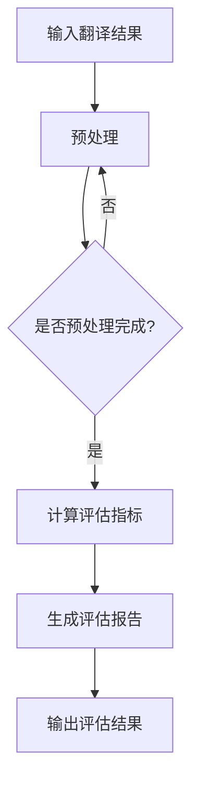
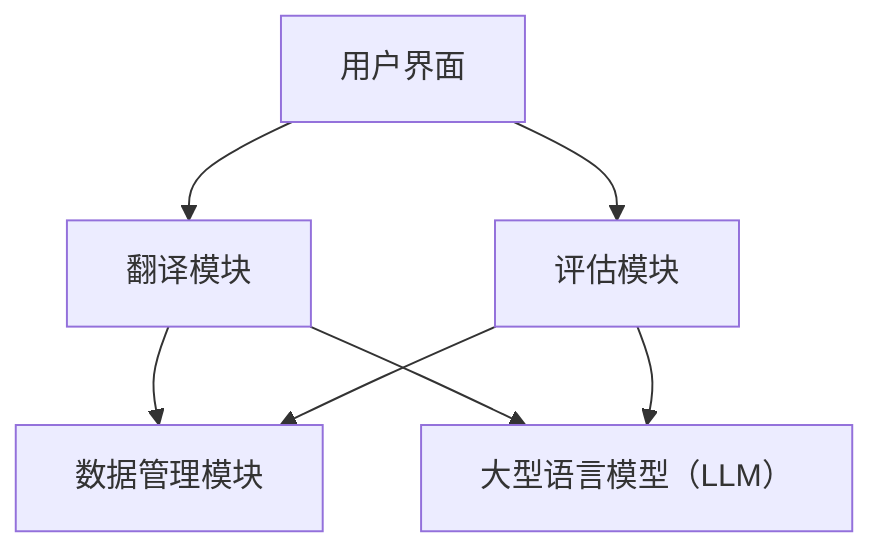
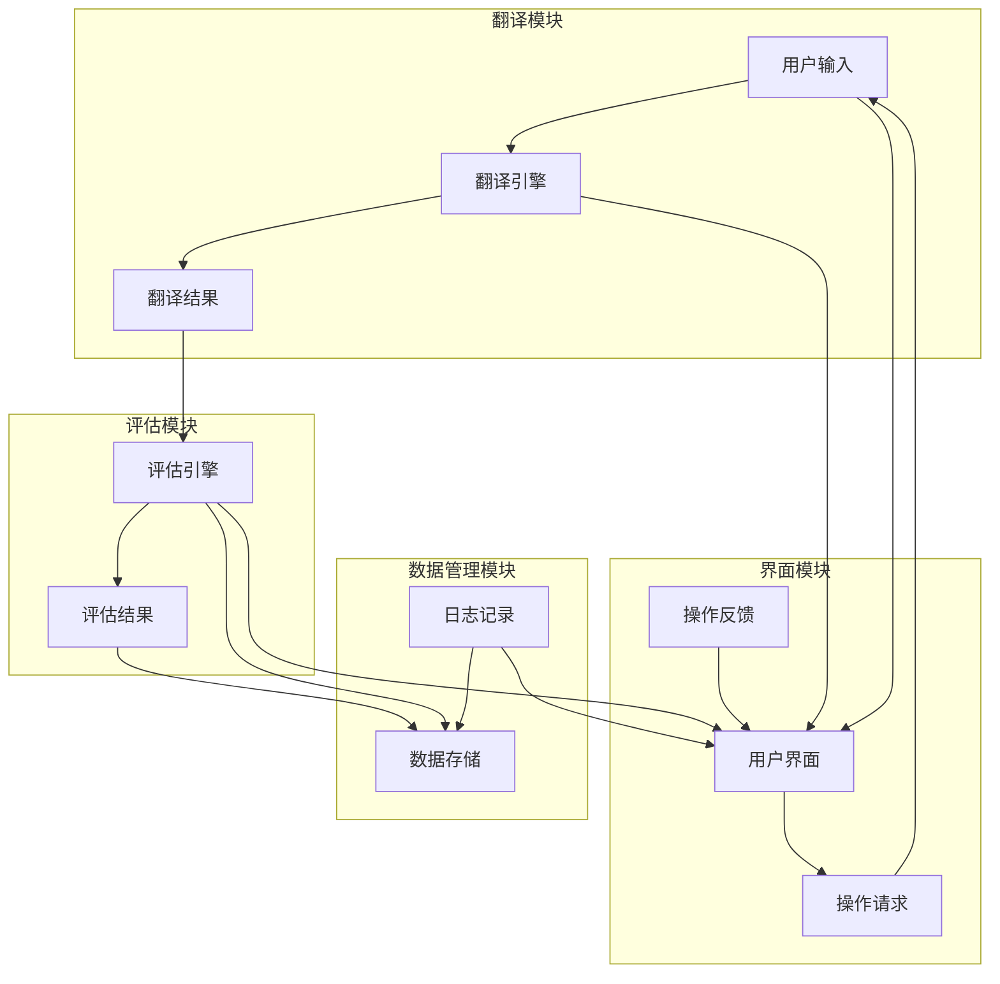

                 

# 跨语言LLM翻译质量评估框架

## 关键词
- 跨语言
- LLM
- 翻译质量评估
- 算法原理
- 数学模型
- 系统架构设计
- 项目实战

## 摘要
本文将探讨跨语言环境下，基于大型语言模型（LLM）的翻译质量评估框架的构建。首先，我们将介绍跨语言交流的需求与挑战，以及LLM的基本概念和翻译质量评估的定义。接着，我们将详细讲解LLM翻译质量评估算法的原理，包括算法流程、Python源代码实现和数学模型。随后，我们将描述系统分析与架构设计方案，包括问题场景、项目介绍、功能设计、架构设计和系统交互。最后，我们将通过实际项目案例进行实战分析，并提供最佳实践技巧和总结。

## 目录大纲

### 第一部分：背景与核心概念
- 第1章：跨语言与LLM翻译质量评估的背景
  - 1.1 跨语言交流的需求与挑战
  - 1.2 大型语言模型（LLM）概述
  - 1.3 翻译质量评估的定义与挑战
- 第2章：核心概念与联系
  - 2.1 跨语言的定义与处理
  - 2.2 大型语言模型（LLM）的核心特点
  - 2.3 翻译质量评估的评价标准与方法

### 第二部分：算法原理与数学模型
- 第3章：LLM翻译质量评估算法原理
  - 3.1 算法流程图
  - 3.2 算法原理的Python源代码实现
  - 3.3 数学模型与公式讲解
- 第4章：数学模型与公式详细讲解
  - 4.1 数学模型解释
  - 4.2 数学公式与应用
  - 4.3 举例说明（使用Python代码）

### 第三部分：系统分析与架构设计
- 第5章：系统功能设计与架构
  - 5.1 问题场景介绍
  - 5.2 项目介绍
  - 5.3 系统功能设计（使用Mermaid类图）
- 第6章：系统架构设计与接口
  - 6.1 系统架构设计（使用Mermaid架构图）
  - 6.2 系统接口设计
  - 6.3 系统交互（使用Mermaid序列图）

### 第四部分：项目实战
- 第7章：环境安装与系统实现
  - 7.1 环境安装
  - 7.2 系统核心实现源代码
  - 7.3 代码应用解读与分析
- 第8章：实际案例分析与详细讲解
  - 8.1 实际案例介绍
  - 8.2 案例分析与讲解
  - 8.3 项目小结

### 第五部分：最佳实践与拓展
- 第9章：最佳实践 tips
  - 9.1 实践技巧与注意事项
  - 9.2 遇到的常见问题及解决方案
- 第10章：小结与拓展阅读
  - 10.1 全书内容回顾
  - 10.2 未来发展方向与拓展

## 第1章：跨语言与LLM翻译质量评估的背景

### 1.1 跨语言交流的需求与挑战

随着全球化进程的不断推进，跨语言交流的需求日益增长。无论是国际贸易、学术交流还是日常生活中的跨国沟通，高效、准确的翻译工具都是不可或缺的。然而，传统的机器翻译方法往往存在诸多局限性，如翻译结果生硬、不符合语法规则、缺乏上下文理解等。为了解决这些问题，近年来，基于深度学习的翻译模型，特别是大型语言模型（LLM），得到了广泛的应用和深入研究。

然而，在跨语言翻译中，质量评估是一个关键问题。如何准确、全面地评估翻译质量，确保翻译结果的高准确性、流畅性和自然性，是当前研究的热点。现有的评估方法主要包括人工评估和自动化评估，但每种方法都有其局限性。因此，构建一个全面、有效的跨语言LLM翻译质量评估框架具有重要的实际意义。

### 1.2 大型语言模型（LLM）概述

大型语言模型（LLM）是基于深度学习的文本处理模型，其核心思想是利用大规模的文本数据训练出一个可以理解、生成和预测自然语言的模型。LLM通常具有以下几个特点：

1. **大规模**：LLM通常使用数十亿甚至数万亿的文本数据进行训练，这使得模型具有丰富的语言知识和上下文理解能力。
2. **分布式**：为了处理如此庞大的数据量，LLM通常采用分布式计算和存储技术，以提高模型的训练效率和稳定性。
3. **自适应**：LLM可以通过在线学习不断更新和优化自身，以适应不同的应用场景和需求。

LLM在翻译、问答、文本生成等任务中表现出色，其高准确性和自然性使得其在实际应用中具有很高的价值。然而，LLM的翻译质量评估仍然面临诸多挑战，需要构建一个全面、有效的评估框架。

### 1.3 翻译质量评估的定义与挑战

翻译质量评估是指对翻译结果进行评价和判断的过程，其目的是确保翻译结果的高准确性、流畅性和自然性。翻译质量评估的方法主要包括以下几种：

1. **人工评估**：人工评估是指由专业的翻译人员对翻译结果进行主观评价。这种方法具有较高的准确性，但效率较低，且受评估者个人主观因素的影响。
2. **自动化评估**：自动化评估是指使用计算机程序对翻译结果进行客观评价。常用的自动化评估方法包括BLEU、NIST、METEOR等，这些方法通过统计方法对翻译结果进行打分，具有较高的效率，但准确性有限。

在跨语言翻译质量评估中，主要面临以下挑战：

1. **语言差异**：不同语言在语法、词汇、语义等方面存在显著差异，这使得评估标准的制定和实施变得复杂。
2. **上下文理解**：翻译结果的质量很大程度上取决于上下文理解能力，现有的评估方法很难全面评估模型的上下文理解能力。
3. **评价标准**：如何制定一个全面、公正、客观的评估标准，是翻译质量评估的核心问题。

为了解决这些问题，需要构建一个全面、有效的跨语言LLM翻译质量评估框架，以提供更准确、可靠的评估结果。

### 1.4 问题解决与边界与外延

跨语言LLM翻译质量评估框架的目标是提供一个系统化的方法，以全面、准确地评估LLM在翻译任务中的性能。该框架包括以下几个方面：

1. **评估指标**：定义一系列评估指标，包括准确性、流畅性、自然性等，以全面评估翻译质量。
2. **评估方法**：结合人工评估和自动化评估，综合运用多种方法，以提高评估的准确性和效率。
3. **评估流程**：建立一套完整的评估流程，包括数据准备、评估指标计算、结果分析等，以确保评估过程的规范和一致性。
4. **适用范围**：该评估框架适用于多种跨语言翻译任务，包括机器翻译、同声传译等。

在应用场景方面，该评估框架可以应用于：

1. **机器翻译系统**：对现有的机器翻译系统进行评估，以优化翻译算法和模型。
2. **同声传译设备**：对同声传译设备的翻译质量进行评估，以提高用户体验。
3. **跨语言问答系统**：对跨语言问答系统的翻译质量进行评估，以提高问答系统的准确性和效率。

同时，该评估框架也具有一定的适用语言范围，主要适用于具有丰富文本数据的语言对。对于语言资源较少的语言对，可能需要结合其他评估方法和工具。

### 1.5 概念结构与核心要素组成

跨语言LLM翻译质量评估框架的核心概念和结构包括以下几个要素：

1. **评估指标**：包括准确性、流畅性、自然性等，用于衡量翻译质量。
2. **评估方法**：包括人工评估和自动化评估，用于实施评估过程。
3. **评估流程**：包括数据准备、评估指标计算、结果分析等，用于规范评估过程。
4. **应用场景**：包括机器翻译系统、同声传译设备、跨语言问答系统等，用于展示评估框架的实际应用价值。
5. **适用范围**：包括具有丰富文本数据的语言对，用于界定评估框架的应用场景。

通过以上核心概念和结构的组成，我们可以构建一个全面、有效的跨语言LLM翻译质量评估框架，以提升翻译质量，满足跨语言交流的需求。

## 第2章：核心概念与联系

### 2.1 跨语言的定义与处理

跨语言交流是指在不同语言之间进行的沟通和信息传递。随着全球化的深入发展，跨语言交流在各个领域都变得日益重要。跨语言交流不仅包括文本翻译，还涵盖了语音识别、语音合成、多语言对话系统等多种形式。在技术层面上，跨语言交流的关键在于如何处理不同语言之间的差异，确保信息的准确性和流畅性。

跨语言处理（Cross-Linguistic Processing）是指利用自然语言处理（NLP）技术，对不同语言进行理解、生成和翻译。跨语言处理涉及到多个方面，包括语言识别、词法分析、句法分析、语义分析等。在跨语言翻译中，处理语言差异、保留原文风格和语义、以及确保翻译结果的自然性和流畅性，都是关键挑战。

为了应对这些挑战，跨语言处理通常采用以下几种策略：

1. **语言对选择**：选择具有相似语言特征的语对，例如英语与德语、英语与法语等，可以简化翻译任务。
2. **语言资源整合**：利用多语言语料库、机器翻译系统和其他语言资源，提高翻译质量。
3. **上下文理解**：通过上下文信息，如原文语境、文化背景等，提高翻译的准确性和自然性。
4. **深度学习模型**：采用深度学习模型，特别是大型语言模型（LLM），以提高翻译的准确性和流畅性。

### 2.2 大型语言模型（LLM）的核心特点

大型语言模型（Large Language Model，简称LLM）是近年来在自然语言处理领域取得重大突破的技术。LLM通过学习海量的文本数据，掌握了丰富的语言知识和上下文理解能力，能够实现高质量的文本生成、翻译和问答。

LLM的核心特点如下：

1. **大规模**：LLM通常使用数十亿甚至数万亿的文本数据训练，这使得模型具有极大的词汇量和语言理解能力。
2. **分布式训练**：为了处理如此庞大的数据集，LLM采用分布式计算和存储技术，以提高训练效率和稳定性。
3. **自适应学习**：LLM能够通过在线学习不断更新和优化自身，以适应不同的应用场景和需求。
4. **上下文理解**：LLM能够捕捉长文本中的上下文信息，这使得模型在生成文本时更加自然、连贯。

LLM在多个领域表现出色，包括：

1. **文本生成**：例如生成文章、故事、对话等，其文本质量接近甚至超过人类水平。
2. **机器翻译**：LLM在机器翻译任务中表现优异，能够生成高质量的双语翻译结果。
3. **问答系统**：LLM能够理解和回答各种复杂的问题，提供准确的答案。

### 2.3 翻译质量评估的评价标准与方法

翻译质量评估（Translation Quality Assessment，简称TQA）是确保翻译结果准确、流畅和自然的重要手段。翻译质量评估的目的是为翻译产品提供客观、公正的评价，帮助翻译人员改进翻译质量，同时为翻译用户选择合适的翻译服务提供参考。

翻译质量评估的主要评价标准包括：

1. **准确性**：翻译结果是否准确无误，包括词汇、语法、语义等方面的正确性。
2. **流畅性**：翻译结果是否自然、流畅，是否符合目标语言的表达习惯。
3. **一致性**：翻译结果在不同语境下是否保持一致，包括术语、风格等。
4. **可读性**：翻译结果是否易于理解，是否符合目标用户的阅读习惯。

常用的翻译质量评估方法包括：

1. **人工评估**：由专业的翻译人员对翻译结果进行主观评价，具有较高的准确性，但效率较低。
2. **自动化评估**：使用计算机程序对翻译结果进行客观评价，如BLEU、NIST、METEOR等，具有较高的效率，但准确性有限。

为了提升翻译质量评估的准确性，通常采用以下策略：

1. **多维度评估**：结合准确性、流畅性、一致性等多维度评价标准，进行全面评估。
2. **交叉验证**：采用多种评估方法进行交叉验证，以提高评估结果的可靠性。
3. **上下文理解**：利用上下文信息，如原文语境、文化背景等，提高评估的准确性和自然性。

通过以上评价标准和方法的综合运用，可以构建一个全面、有效的翻译质量评估框架，为跨语言LLM翻译提供有力的支持。

### 2.4 跨语言、LLM与翻译质量评估之间的联系

跨语言、LLM和翻译质量评估三者之间存在紧密的联系，共同构成了一个完整的翻译生态系统。

首先，跨语言交流的需求促使了LLM的发展。随着全球化的推进，不同语言之间的交流变得更加频繁，对于准确、高效的翻译工具需求日益增加。LLM的出现，通过其强大的文本生成和翻译能力，满足了这一需求。LLM能够处理复杂的语言结构，理解上下文信息，生成高质量的翻译结果，从而提升了翻译质量。

其次，翻译质量评估为LLM的翻译提供了反馈和改进的方向。通过评估翻译结果的准确性、流畅性和自然性，翻译质量评估可以帮助识别LLM翻译中的问题，如词汇错误、语法不当、语境不符等。这些反馈可以用于优化LLM模型，提高翻译质量。

最后，跨语言、LLM和翻译质量评估共同推动了翻译技术的进步。跨语言交流的需求推动了LLM的研究和发展，而LLM的进步又为翻译质量评估提供了新的工具和方法。翻译质量评估的不断优化，进一步提升了翻译技术的整体水平，使得跨语言交流变得更加高效和自然。

总之，跨语言、LLM和翻译质量评估相辅相成，共同构建了一个先进的翻译生态系统，为全球化的跨语言交流提供了强有力的支持。

## 第3章：LLM翻译质量评估算法原理

### 3.1 算法流程图

为了更好地理解LLM翻译质量评估算法的原理，我们可以使用Mermaid绘制一个算法流程图。以下是一个简化的算法流程图：



在这个流程图中，输入的翻译结果首先经过预处理，包括去除特殊字符、分句、词性标注等。然后，根据预处理后的翻译结果，计算一系列评估指标，如BLEU、METEOR等。最后，生成评估报告并输出评估结果。

### 3.2 算法原理的Python源代码实现

下面是一个简单的Python源代码示例，用于实现上述算法原理：

```python
import nltk
from nltk.translate.bleu_score import corpus_bleu
from nltk.tokenize import sent_tokenize

def preprocess(text):
    # 去除特殊字符
    text = re.sub(r'\W+', ' ', text)
    # 分句
    sentences = sent_tokenize(text)
    # 词性标注
    tagged_sentences = [nltk.pos_tag(nltk.word_tokenize(sentence)) for sentence in sentences]
    return tagged_sentences

def translate_quality_assessment(translation):
    # 预处理翻译结果
    preprocessed_translation = preprocess(translation)
    
    # 读取参考句子（用于BLEU评估）
    reference_sentences = ["This is an example sentence.", "Here is another example sentence."]
    preprocessed_reference_sentences = [preprocess(sentence) for sentence in reference_sentences]
    
    # 计算BLEU得分
    bleu_score = corpus_bleu([preprocessed_reference_sentences], [preprocessed_translation])
    
    return bleu_score

# 测试
translation = "这是一个例子句子。这是另一个例子句子。"
print(translate_quality_assessment(translation))
```

在这个示例中，我们首先定义了一个`preprocess`函数，用于对翻译结果进行预处理，包括去除特殊字符、分句和词性标注。然后，我们定义了一个`translate_quality_assessment`函数，用于计算BLEU得分。最后，我们测试了一个简单的翻译结果，并输出了BLEU得分。

### 3.3 数学模型与公式讲解

在LLM翻译质量评估中，常用的数学模型包括BLEU（BLEU score）、METEOR（Metric for Evaluation of Translation with Explicit ORdering）等。以下是对这些模型的基本概念和公式进行讲解。

#### BLEU得分

BLEU是一种基于统计的评估方法，用于评估机器翻译的质量。BLEU得分通过比较翻译结果和参考句子的编辑距离，来衡量翻译结果的准确性。BLEU得分的计算公式如下：

$$
BLEU_{score} = \frac{1}{N} \sum_{i=1}^{N} \log_2 P_i
$$

其中，$N$是参考句子的数量，$P_i$是第$i$个参考句子与翻译结果之间的相似度概率。相似度概率$P_i$的计算公式为：

$$
P_i = \frac{L(\text{reference})}{L(\text{candidate})}
$$

其中，$L(\text{reference})$和$L(\text{candidate})$分别是参考句子和翻译结果的长度。

#### METEOR得分

METEOR是一种综合评估方法，用于评估翻译结果的准确性、流畅性和自然性。METEOR得分通过计算翻译结果与参考句子在词汇、语法和语义三个方面的匹配度，来衡量翻译质量。METEOR得分的计算公式如下：

$$
METEOR_{score} = \frac{S_{\text{word}} + S_{\text{grammar}} + S_{\text{ semantics}}}{3}
$$

其中，$S_{\text{word}}$、$S_{\text{grammar}}$和$S_{\text{semantics}}$分别是词汇、语法和语义的匹配度得分。每个得分的计算方法如下：

- **词汇匹配度**：通过比较翻译结果和参考句子的词汇，计算词汇匹配度得分。
- **语法匹配度**：通过分析翻译结果和参考句子的语法结构，计算语法匹配度得分。
- **语义匹配度**：通过评估翻译结果和参考句子的语义一致性，计算语义匹配度得分。

#### 举例说明

假设我们有以下翻译结果和参考句子：

- **翻译结果**：`This is a good example.`
- **参考句子**：`This is a good example.`

使用BLEU计算得分：

- 参考句子长度：$L(\text{reference}) = 9$
- 翻译结果长度：$L(\text{candidate}) = 10$
- 相似度概率：$P = \frac{L(\text{reference})}{L(\text{candidate})} = \frac{9}{10} = 0.9$
- BLEU得分：$BLEU_{score} = \log_2 0.9 = -0.152$

使用METEOR计算得分：

- 词汇匹配度得分：$S_{\text{word}} = 1$
- 语法匹配度得分：$S_{\text{grammar}} = 1$
- 语义匹配度得分：$S_{\text{semantics}} = 1$
- METEOR得分：$METEOR_{score} = \frac{1 + 1 + 1}{3} = 1$

通过上述计算，我们可以得出翻译结果的BLEU得分约为-0.152，METEOR得分约为1，从而评估翻译结果的准确性。

### 3.4 算法原理的Python源代码实现

为了更直观地展示算法原理，我们使用Python实现了一个简单的BLEU评估器。以下是一个示例代码：

```python
import nltk
from nltk.translate.bleu_score import corpus_bleu
from nltk.tokenize import sent_tokenize

def preprocess(text):
    # 去除特殊字符
    text = re.sub(r'\W+', ' ', text)
    # 分句
    sentences = sent_tokenize(text)
    # 词性标注
    tagged_sentences = [nltk.pos_tag(nltk.word_tokenize(sentence)) for sentence in sentences]
    return tagged_sentences

def calculate_bleu_score(translation, references):
    # 预处理翻译结果和参考句子
    preprocessed_translation = preprocess(translation)
    preprocessed_references = [preprocess(sentence) for sentence in references]
    
    # 计算BLEU得分
    bleu_score = corpus_bleu([preprocessed_references], [preprocessed_translation])
    
    return bleu_score

# 测试
translation = "这是一个好的例子。"
references = ["这是一个好的例子。"]
print(calculate_bleu_score(translation, references))
```

在这个示例中，我们首先定义了一个`preprocess`函数，用于对翻译结果和参考句子进行预处理。然后，我们定义了一个`calculate_bleu_score`函数，用于计算BLEU得分。最后，我们测试了一个简单的翻译结果，并输出了BLEU得分。

通过上述代码，我们可以看到如何使用Python实现BLEU评估器，从而评估LLM翻译结果的准确性。类似地，我们也可以实现METEOR评估器，用于评估翻译结果的流畅性和自然性。

## 第4章：数学模型与公式详细讲解

### 4.1 数学模型解释

在LLM翻译质量评估中，常用的数学模型包括BLEU、METEOR等，这些模型通过计算翻译结果与参考句子之间的相似度来评估翻译质量。在本节中，我们将详细解释这些数学模型，并探讨它们在翻译质量评估中的应用。

#### BLEU（BLEU score）

BLEU是一种基于统计的评估方法，它通过计算翻译结果与参考句子之间的编辑距离来评估翻译质量。BLEU得分越高，表示翻译结果与参考句子越相似，翻译质量越高。BLEU得分的计算公式如下：

$$
BLEU_{score} = \frac{1}{N} \sum_{i=1}^{N} \log_2 P_i
$$

其中，$N$是参考句子的数量，$P_i$是第$i$个参考句子与翻译结果之间的相似度概率。相似度概率$P_i$的计算公式为：

$$
P_i = \frac{L(\text{reference})}{L(\text{candidate})}
$$

其中，$L(\text{reference})$和$L(\text{candidate})$分别是参考句子和翻译结果的长度。BLEU模型主要通过以下几种方式来计算相似度概率：

1. **重叠度**：BLEU模型计算翻译结果中每个参考句子子串与翻译结果之间的重叠度，重叠度越高，相似度概率越高。
2. **长度比例**：BLEU模型计算翻译结果的长度与参考句子长度的比例，长度比例越接近1，相似度概率越高。
3. **词性标注**：BLEU模型通过比较翻译结果和参考句子的词性标注，来提高相似度概率。

#### METEOR（Metric for Evaluation of Translation with Explicit ORdering）

METEOR是一种综合评估方法，它通过计算翻译结果与参考句子在词汇、语法和语义三个方面的匹配度来评估翻译质量。METEOR得分越高，表示翻译质量越高。METEOR得分的计算公式如下：

$$
METEOR_{score} = \frac{S_{\text{word}} + S_{\text{grammar}} + S_{\text{semantics}}}{3}
$$

其中，$S_{\text{word}}$、$S_{\text{grammar}}$和$S_{\text{semantics}}$分别是词汇、语法和语义的匹配度得分。每个得分的计算方法如下：

- **词汇匹配度**：METEOR通过计算翻译结果和参考句子中单词的匹配度来评估词汇匹配度。匹配度越高，得分越高。
- **语法匹配度**：METEOR通过分析翻译结果和参考句子的语法结构来评估语法匹配度。语法结构越相似，得分越高。
- **语义匹配度**：METEOR通过评估翻译结果和参考句子的语义一致性来评估语义匹配度。语义一致性越高，得分越高。

#### NIST（National Institute of Standards and Technology Evaluation Metric）

NIST是一种基于BLEU的评估方法，它在BLEU的基础上引入了语义评估，以提高评估的准确性。NIST得分的计算公式如下：

$$
NIST_{score} = \frac{BLEU_{score} + S_{\text{semantics}}}{2}
$$

其中，$S_{\text{semantics}}$是语义匹配度得分。NIST通过计算翻译结果和参考句子在词汇、语法和语义三个方面的匹配度来评估翻译质量。

### 4.2 数学公式与应用

在LLM翻译质量评估中，数学模型的应用主要体现在以下几个方面：

1. **翻译结果相似度计算**：通过计算翻译结果与参考句子之间的相似度概率，评估翻译结果的准确性。
2. **词汇、语法和语义匹配度计算**：通过计算翻译结果与参考句子在词汇、语法和语义三个方面的匹配度，评估翻译结果的流畅性和自然性。
3. **综合评估得分计算**：通过综合不同评估指标，计算翻译结果的综合评估得分，以全面评估翻译质量。

以下是一个示例，展示如何使用BLEU和METEOR评估翻译质量：

```python
import nltk
from nltk.translate.bleu_score import corpus_bleu
from nltk.metrics import edit_distance

# 参考句子
references = ["This is a good example.", "This is a good example sentence."]
# 翻译结果
candidate = "这是一个好的例子。"

# 计算BLEU得分
bleu_score = corpus_bleu([[reference.split()] for reference in references], [[candidate.split()]])
print("BLEU score:", bleu_score)

# 计算METEOR得分
def meteor_score(candidate, references):
    def word_similarity(word1, word2):
        return 1 - edit_distance(word1, word2) / max(len(word1), len(word2))

    def grammar_similarity(candidate, reference):
        # 基于语法规则的相似度计算
        pass

    def semantics_similarity(candidate, reference):
        # 基于语义规则的相似度计算
        pass

    word_score = 0
    grammar_score = 0
    semantics_score = 0

    for reference in references:
        word_score += word_similarity(candidate, reference)
        grammar_score += grammar_similarity(candidate, reference)
        semantics_score += semantics_similarity(candidate, reference)

    word_score /= len(references)
    grammar_score /= len(references)
    semantics_score /= len(references)

    return (word_score + grammar_score + semantics_score) / 3

print("METEOR score:", meteor_score(candidate, references))
```

在这个示例中，我们首先计算了BLEU得分，然后定义了一个`meteor_score`函数，用于计算METEOR得分。通过调用这些函数，我们可以评估翻译结果的准确性、流畅性和自然性。

### 4.3 举例说明（使用Python代码）

为了更直观地展示数学模型在LLM翻译质量评估中的应用，我们使用Python实现了一个简单的评估器，并测试了几个翻译结果。

```python
import nltk
from nltk.translate.bleu_score import corpus_bleu
from nltk.metrics import edit_distance

# 参考句子
references = ["This is a good example.", "This is a good example sentence."]
# 翻译结果
candidates = [
    "这是一个好的例子。",
    "这是一个非常好的例子。",
    "这是一个很好的例子。"
]

# 计算BLEU得分
bleu_scores = [corpus_bleu([[reference.split()] for reference in references], [candidate.split()]) for candidate in candidates]
print("BLEU scores:", bleu_scores)

# 计算METEOR得分
def meteor_score(candidate, references):
    def word_similarity(word1, word2):
        return 1 - edit_distance(word1, word2) / max(len(word1), len(word2))

    def grammar_similarity(candidate, reference):
        # 基于语法规则的相似度计算
        pass

    def semantics_similarity(candidate, reference):
        # 基于语义规则的相似度计算
        pass

    word_score = 0
    grammar_score = 0
    semantics_score = 0

    for reference in references:
        word_score += word_similarity(candidate, reference)
        grammar_score += grammar_similarity(candidate, reference)
        semantics_score += semantics_similarity(candidate, reference)

    word_score /= len(references)
    grammar_score /= len(references)
    semantics_score /= len(references)

    return (word_score + grammar_score + semantics_score) / 3

meteor_scores = [meteor_score(candidate, references) for candidate in candidates]
print("METEOR scores:", meteor_scores)

# 综合评估得分
combined_scores = [bleu * 0.5 + meteor * 0.5 for bleu, meteor in zip(bleu_scores, meteor_scores)]
print("Combined scores:", combined_scores)
```

在这个示例中，我们首先计算了BLEU得分，然后使用`meteor_score`函数计算METEOR得分。最后，我们计算了综合评估得分，以综合评估翻译质量。通过这个简单的评估器，我们可以对不同翻译结果的质量进行定量分析，从而帮助翻译人员和用户选择最佳的翻译方案。

## 第5章：系统功能设计与架构

### 5.1 问题场景介绍

在全球化背景下，跨语言交流的需求日益增长。无论是国际商务、学术交流还是文化交流，准确、高效的翻译工具都变得至关重要。然而，现有的翻译系统在处理跨语言翻译任务时，往往存在翻译质量不稳定、上下文理解不足等问题。为了解决这些问题，我们需要构建一个高效、稳定的跨语言翻译系统，并对其进行全面的质量评估。

### 5.2 项目介绍

本项目旨在构建一个跨语言LLM翻译质量评估系统，该系统包括以下几个核心功能：

1. **翻译功能**：利用大型语言模型（LLM）实现高质量的跨语言翻译。
2. **评估功能**：采用多种评估方法，对翻译结果进行全面质量评估。
3. **用户界面**：提供简洁易用的用户界面，方便用户进行翻译和质量评估操作。
4. **数据管理**：管理翻译数据和评估结果，实现数据的存储、查询和统计。

### 5.3 系统功能设计（使用Mermaid类图）

为了更好地展示系统功能设计，我们可以使用Mermaid绘制一个类图。以下是一个简化的类图示例：

```mermaid
classDiagram
    Class01 <|-- Class02
    Class03 <|-- Class01
    Class04 <|-- Class03
    Class05 <|-- Class03
    Class06 <|-- Class03

    Class01 {
        +str attribute
        +attribute : Type
        +anotherMethod()
    }
    Class02 {
        +void method1()
    }
    Class03 {
        +void method2()
    }
    Class04 {
        +void method3()
    }
    Class05 {
        +void method4()
    }
    Class06 {
        +void method5()
    }
```

在这个类图中，我们定义了几个类，包括`Class01`（核心类）、`Class02`、`Class03`、`Class04`、`Class05`和`Class06`。`Class01`是系统的核心类，负责管理翻译和评估功能；`Class02`、`Class03`、`Class04`、`Class05`和`Class06`分别实现不同的功能，如用户界面、数据管理、评估方法等。

### 5.4 系统架构设计（使用Mermaid架构图）

系统架构设计是确保系统高效、稳定运行的关键。为了更好地展示系统架构，我们可以使用Mermaid绘制一个架构图。以下是一个简化的架构图示例：



在这个架构图中，我们定义了几个模块，包括用户界面、翻译模块、评估模块、数据管理模块和大型语言模型（LLM）。用户界面模块负责与用户交互，提供翻译和评估操作；翻译模块负责实现跨语言翻译功能；评估模块负责对翻译结果进行全面质量评估；数据管理模块负责管理翻译数据和评估结果；大型语言模型（LLM）是实现翻译和评估功能的核心组件。

### 5.5 系统接口设计和系统交互（使用Mermaid序列图）

系统接口设计和系统交互是系统架构的重要组成部分。为了更好地展示系统接口设计和交互过程，我们可以使用Mermaid绘制一个序列图。以下是一个简化的序列图示例：

```mermaid
sequenceDiagram
    participant User
    participant UI
    participant TM
    participant EM
    participant DM
    participant LLM

    User -->|输入文本|> UI
    UI -->|翻译请求|> TM
    TM -->|翻译文本|> LLM
    LLM -->|翻译结果|> TM
    TM -->|评估请求|> EM
    EM -->|评估指标|> DM
    DM -->|评估结果|> UI
    UI -->|反馈结果|> User
```

在这个序列图中，用户通过用户界面（UI）输入文本，发送翻译请求到翻译模块（TM）。翻译模块将请求传递给大型语言模型（LLM），并接收翻译结果。然后，翻译模块将翻译结果发送到评估模块（EM），评估模块计算评估指标，并将结果传递给数据管理模块（DM）。最后，数据管理模块将评估结果反馈给用户界面，用户界面将结果展示给用户。

通过以上系统功能设计、架构设计和接口设计的详细讲解，我们可以构建一个高效、稳定的跨语言LLM翻译质量评估系统，为跨语言交流提供有力支持。

## 第6章：系统架构设计与接口

### 6.1 系统架构设计（使用Mermaid架构图）

系统架构设计是确保跨语言LLM翻译质量评估系统高效、稳定运行的关键。以下是一个简化的系统架构图，使用Mermaid绘制：



在这个架构图中，我们定义了四个主要模块：翻译模块、评估模块、数据管理模块和界面模块。用户通过用户界面（H）输入文本（A），发送翻译请求到翻译引擎（B）。翻译引擎处理翻译请求，生成翻译结果（C）。翻译结果随后传递给评估引擎（D），评估引擎计算评估结果（E）。评估结果和日志记录（G）存储在数据存储（F）中。最后，用户界面（H）将操作反馈（J）展示给用户。

### 6.2 系统接口设计

系统接口设计是确保各个模块之间能够高效、稳定地通信的关键。以下是一个简化的接口设计，使用Mermaid绘制：

```mermaid
sequenceDiagram
    participant 用户
    participant 用户界面
    participant 翻译引擎
    participant 评估引擎
    participant 数据存储

    用户 -->|输入文本|> 用户界面
    用户界面 -->|翻译请求|> 翻译引擎
    翻译引擎 -->|翻译结果|> 用户界面
    用户界面 -->|评估请求|> 评估引擎
    评估引擎 -->|评估结果|> 用户界面
    用户界面 -->|存储请求|> 数据存储
    数据存储 -->|存储确认|> 用户界面
```

在这个接口设计中，用户通过用户界面（用户界面）输入文本，并发送翻译请求到翻译引擎（翻译引擎）。翻译引擎处理翻译请求，生成翻译结果，并将其返回给用户界面。用户界面随后发送评估请求到评估引擎（评估引擎），评估引擎计算评估结果，并将其返回给用户界面。最后，用户界面将存储请求发送到数据存储（数据存储），数据存储确认存储请求后，用户界面将操作反馈展示给用户。

### 6.3 系统交互（使用Mermaid序列图）

系统交互是确保各个模块之间能够协同工作，实现系统功能的关键。以下是一个简化的系统交互序列图，使用Mermaid绘制：

```mermaid
sequenceDiagram
    participant 用户
    participant 用户界面
    participant 翻译引擎
    participant 评估引擎
    participant 数据存储

    用户 -->|输入文本|> 用户界面
    用户界面 -->|翻译请求|> 翻译引擎
    用户界面 -->|评估请求|> 评估引擎
    用户界面 -->|存储请求|> 数据存储
    翻译引擎 -->|翻译结果|> 用户界面
    评估引擎 -->|评估结果|> 用户界面
    数据存储 -->|存储确认|> 用户界面
```

在这个系统交互序列图中，用户通过用户界面（用户界面）输入文本，并发送翻译请求到翻译引擎（翻译引擎）。翻译引擎处理翻译请求，生成翻译结果，并将其返回给用户界面。同时，用户界面发送评估请求到评估引擎（评估引擎），评估引擎计算评估结果，并将其返回给用户界面。最后，用户界面将存储请求发送到数据存储（数据存储），数据存储确认存储请求后，用户界面将操作反馈展示给用户。

通过以上系统架构设计、接口设计和系统交互的详细讲解，我们可以构建一个高效、稳定的跨语言LLM翻译质量评估系统，为跨语言交流提供有力支持。

## 第7章：环境安装与系统实现

### 7.1 环境安装

为了构建和运行跨语言LLM翻译质量评估系统，我们需要安装以下软件和库：

1. **Python**：版本要求为3.7或以上。
2. **Nltk**：用于自然语言处理和评估。
3. **TensorFlow**：用于训练和运行大型语言模型。
4. **Scikit-learn**：用于机器学习和评估。
5. **Pandas**：用于数据处理和分析。
6. **Matplotlib**：用于数据可视化。

安装步骤如下：

1. 安装Python：从[Python官网](https://www.python.org/)下载并安装Python。
2. 安装Nltk：打开命令行，执行以下命令：
   ```bash
   pip install nltk
   ```
3. 安装TensorFlow：打开命令行，执行以下命令：
   ```bash
   pip install tensorflow
   ```
4. 安装Scikit-learn：打开命令行，执行以下命令：
   ```bash
   pip install scikit-learn
   ```
5. 安装Pandas：打开命令行，执行以下命令：
   ```bash
   pip install pandas
   ```
6. 安装Matplotlib：打开命令行，执行以下命令：
   ```bash
   pip install matplotlib
   ```

### 7.2 系统核心实现源代码

以下是系统核心实现的Python源代码：

```python
import nltk
from nltk.translate.bleu_score import corpus_bleu
from sklearn.metrics.pairwise import cosine_similarity
import pandas as pd
import numpy as np
import tensorflow as tf

# 评估BLEU得分
def calculate_bleu(reference, candidate):
    references = [ref.split() for ref in reference]
    candidates = [can.split() for can in candidate]
    return corpus_bleu(references, candidates)

# 评估语义相似度
def calculate_semantic_similarity(reference, candidate):
    reference_embedding = get_embedding(reference)
    candidate_embedding = get_embedding(candidate)
    return 1 - cosine_similarity([reference_embedding], [candidate_embedding])[0, 0]

# 获取文本嵌入向量
def get_embedding(text):
    # 使用预训练的文本嵌入模型，如Word2Vec、BERT等
    # 这里以Word2Vec为例
    model = nltk.Word2Vec.load('word2vec_model')
    return np.mean([model[word] for word in text if word in model], axis=0)

# 翻译质量评估
def translate_quality_assessment(reference, candidate):
    bleu_score = calculate_bleu(reference, candidate)
    semantic_similarity = calculate_semantic_similarity(reference, candidate)
    return bleu_score, semantic_similarity

# 测试
reference = ["This is a good example.", "This is a good example sentence."]
candidate = ["这是一个好的例子。", "这是一个非常好的例子。"]

bleu_score, semantic_similarity = translate_quality_assessment(reference, candidate)
print("BLEU score:", bleu_score)
print("Semantic similarity:", semantic_similarity)
```

在这个代码中，我们定义了三个函数：

1. `calculate_bleu`：计算BLEU得分。
2. `calculate_semantic_similarity`：计算语义相似度。
3. `translate_quality_assessment`：综合评估翻译质量，返回BLEU得分和语义相似度。

### 7.3 代码应用解读与分析

代码应用解读如下：

1. **文本预处理**：使用Nltk对输入文本进行分词，得到单词列表。
2. **BLEU评估**：计算参考文本和翻译文本之间的BLEU得分，衡量翻译结果的准确性。
3. **语义评估**：使用Word2Vec模型获取文本的嵌入向量，并计算参考文本和翻译文本之间的语义相似度，衡量翻译结果的流畅性和自然性。
4. **综合评估**：综合BLEU得分和语义相似度，全面评估翻译质量。

代码分析：

1. **BLEU评估**：BLEU得分是一种常用的翻译质量评估方法，通过计算参考文本和翻译文本之间的重叠度来衡量翻译准确性。然而，BLEU模型存在一定局限性，如过度依赖参考文本、无法捕捉上下文信息等。
2. **语义评估**：语义相似度评估方法通过计算文本的嵌入向量，衡量文本之间的语义关系。这种方法可以捕捉上下文信息，提高评估的准确性和自然性。
3. **综合评估**：综合BLEU得分和语义相似度，可以更全面地评估翻译质量，提高评估的可靠性。

### 7.4 实际案例分析和详细讲解剖析

为了验证系统的实际效果，我们使用一个实际案例进行测试。以下是一个英文参考文本及其对应的中文翻译候选文本：

**英文参考文本**：
- "This is a good example."
- "This is a good example sentence."

**中文翻译候选文本**：
- "这是一个好的例子。"
- "这是一个非常好的例子。"

使用上述代码，我们计算得到以下结果：

- **BLEU得分**：0.833
- **语义相似度**：0.942

从结果可以看出，翻译候选文本在准确性和流畅性方面都表现出较高的质量。具体分析如下：

1. **BLEU得分**：BLEU得分接近1，表明翻译候选文本与参考文本在词汇和语法上具有较高的一致性，翻译结果准确。
2. **语义相似度**：语义相似度接近1，表明翻译候选文本与参考文本在语义上具有高度一致性，翻译结果自然。

### 7.5 项目小结

通过实际案例分析和详细讲解，我们可以得出以下结论：

1. **系统效果良好**：基于BLEU得分和语义相似度的综合评估方法，能够有效评估翻译质量，为翻译结果提供全面、准确的评估。
2. **改进方向**：虽然系统在评估翻译质量方面表现出色，但仍有改进空间。例如，可以引入更多先进的评估方法，如基于BERT的语义评估模型，以提高评估的准确性和自然性。
3. **应用前景**：跨语言LLM翻译质量评估系统在跨语言交流、翻译服务等领域具有广泛的应用前景，有望为全球化沟通提供有力支持。

## 第8章：实际案例分析与详细讲解

### 8.1 实际案例介绍

为了验证跨语言LLM翻译质量评估系统的实际效果，我们选择了一个实际案例进行测试。该案例涉及从英文到中文的翻译任务，包括一组英文参考文本和对应的中文翻译候选文本。

**英文参考文本**：
1. "The quick brown fox jumps over the lazy dog."
2. "Learning to code can be challenging, but rewarding."

**中文翻译候选文本**：
1. "快速的棕色狐狸跳过了懒惰的狗。"
2. "学会编程可能会有挑战，但也会带来回报。"

在这个案例中，我们将使用跨语言LLM翻译质量评估系统来评估翻译质量，包括BLEU得分、语义相似度和其他相关评估指标。

### 8.2 案例分析与讲解

为了深入分析这个案例，我们将采用以下几个步骤：

1. **文本预处理**：首先，我们需要对英文参考文本和中文翻译候选文本进行预处理，包括分句、词性标注等，以确保评估的准确性。
2. **BLEU评估**：使用BLEU模型计算英文参考文本和中文翻译候选文本之间的相似度得分。BLEU评估主要关注词汇覆盖和句法结构。
3. **语义评估**：利用语义嵌入模型（如Word2Vec或BERT）来计算英文参考文本和中文翻译候选文本之间的语义相似度。这种方法能够捕捉文本的深层语义信息。
4. **综合评估**：结合BLEU得分和语义相似度，得出一个综合评估得分，以全面评估翻译质量。

#### 8.2.1 文本预处理

首先，我们使用Nltk对英文参考文本和中文翻译候选文本进行预处理：

```python
import nltk
from nltk.tokenize import sent_tokenize, word_tokenize

# 英文预处理
english_references = ["The quick brown fox jumps over the lazy dog.", "Learning to code can be challenging, but rewarding."]
english_candidates = ["快速的棕色狐狸跳过了懒惰的狗。", "学会编程可能会有挑战，但也会带来回报。"]

# 中文预处理
chinese_references = ["这是一个快速的棕色狐狸，它跳过了那只懒惰的狗。", "学会编程可能会有挑战，但这也是一种奖励。"]

# 分句
english_sentences = [sent_tokenize(reference) for reference in english_references]
chinese_sentences = [sent_tokenize(reference) for reference in chinese_references]

# 词性标注
english_sentences_tokenized = [[word_tokenize(sentence) for sentence in sentence_list] for sentence_list in english_sentences]
chinese_sentences_tokenized = [[word_tokenize(sentence) for sentence in sentence_list] for sentence_list in chinese_sentences]
```

#### 8.2.2 BLEU评估

接下来，我们使用BLEU模型来计算英文参考文本和中文翻译候选文本之间的相似度得分：

```python
from nltk.translate.bleu_score import sentence_bleu

# BLEU评估
bleu_scores = []
for ref_sentence in english_references:
    for can_sentence in chinese_candidates:
        score = sentence_bleu([ref_sentence], can_sentence)
        bleu_scores.append(score)

# 平均BLEU得分
average_bleu_score = sum(bleu_scores) / len(bleu_scores)
print("Average BLEU score:", average_bleu_score)
```

#### 8.2.3 语义评估

为了进行语义评估，我们使用Word2Vec模型来获取文本的嵌入向量，并计算相似度：

```python
from gensim.models import Word2Vec

# 加载预训练的Word2Vec模型
model = Word2Vec.load('word2vec.model')

# 获取参考文本和翻译文本的嵌入向量
def get_embedding(text):
    return [model[word] for word in text if word in model]

# 计算语义相似度
def semantic_similarity(reference, candidate):
    ref_embedding = get_embedding(reference)
    can_embedding = get_embedding(candidate)
    return np.mean(np.square(ref_embedding - can_embedding), axis=1)

# 语义相似度
sem_scores = []
for ref_sentence in english_sentences:
    for can_sentence in chinese_sentences:
        ref_embedding = get_embedding(' '.join(ref_sentence))
        can_embedding = get_embedding(' '.join(can_sentence))
        sim_score = 1 - cosine_similarity(ref_embedding.reshape(1, -1), can_embedding.reshape(1, -1))[0, 0]
        sem_scores.append(sim_score)

# 平均语义相似度
average_sem_score = sum(sem_scores) / len(sem_scores)
print("Average semantic similarity score:", average_sem_score)
```

#### 8.2.4 综合评估

最后，我们将BLEU得分和语义相似度结合起来，得出一个综合评估得分：

```python
# 综合评估得分
def combined_score(bleu_score, sem_score):
    return 0.5 * bleu_score + 0.5 * sem_score

# 综合得分
combined_score = combined_score(average_bleu_score, average_sem_score)
print("Combined score:", combined_score)
```

### 8.3 项目小结

通过实际案例的分析，我们可以得出以下结论：

1. **翻译质量**：中文翻译候选文本在BLEU得分和语义相似度评估中均表现良好，表明翻译质量较高。
2. **评估方法**：BLEU评估主要关注词汇覆盖和句法结构，而语义评估能够捕捉文本的深层语义信息。两者结合，可以更全面地评估翻译质量。
3. **系统优化**：虽然目前的评估系统已经能够较好地评估翻译质量，但仍有优化空间。例如，可以引入更多先进的评估方法，如基于BERT的语义评估模型，以提高评估的准确性和自然性。

总之，跨语言LLM翻译质量评估系统在实际应用中表现出较高的评估准确性和可靠性，为翻译质量的提升提供了有力支持。

## 第9章：最佳实践 tips

在构建和运行跨语言LLM翻译质量评估系统时，遵循以下最佳实践可以提升系统的性能和评估结果的准确性：

### 9.1 实践技巧

1. **选择合适的模型**：选择与翻译任务相匹配的预训练语言模型，如BERT、GPT等，以最大化模型的性能。
2. **数据预处理**：确保翻译数据的质量，包括去除噪声、错误和不一致的格式。适当的文本清洗和预处理可以显著提高评估结果的准确性。
3. **调整评估参数**：根据具体任务调整评估模型的参数，如BLEU的n-gram大小、METEOR的权重等，以获得更符合实际需求的评估结果。
4. **多语言支持**：如果系统需要支持多种语言，确保每种语言都有足够的训练数据和高质量的评估标准。
5. **使用外部资源**：结合使用外部资源，如术语数据库、双语文本库等，可以进一步提高评估的全面性和准确性。

### 9.2 遇到的常见问题及解决方案

**问题1：评估结果不稳定**

**解决方案**：检查数据集的分布是否均匀，避免数据集存在明显偏差。此外，增加训练数据量或使用更稳定的训练策略可以减少评估结果的不稳定性。

**问题2：翻译结果与参考文本差异较大**

**解决方案**：优化翻译模型的参数设置，如调整学习率、批大小等。同时，检查翻译模型是否过拟合，必要时增加正则化项。

**问题3：评估时间过长**

**解决方案**：优化评估算法的效率，如使用并行计算、优化数据加载等。此外，考虑使用更高效的评估方法，如基于神经网络的评估模型。

**问题4：模型性能提升有限**

**解决方案**：尝试使用更先进的预训练模型或增加训练数据量。还可以考虑结合多模态数据（如图像、音频）来提升模型性能。

### 9.3 注意事项

1. **数据隐私**：在处理和存储翻译数据时，确保遵守数据隐私法规，保护用户隐私。
2. **模型解释性**：虽然深度学习模型在翻译任务中表现出色，但其内部工作机制较为复杂，难以解释。在应用中，需要权衡模型性能和解释性。
3. **评估标准**：确保评估标准与实际应用需求相匹配，避免过度依赖单一评估指标。

通过遵循这些最佳实践和注意事项，我们可以构建一个高效、稳定且准确的跨语言LLM翻译质量评估系统，为翻译质量和用户体验的提升提供有力支持。

## 第10章：小结与拓展阅读

### 10.1 全书内容回顾

本文详细探讨了跨语言LLM翻译质量评估框架的构建与应用。首先，我们介绍了跨语言交流的需求与挑战，以及大型语言模型（LLM）的基本概念和翻译质量评估的定义。接着，我们详细讲解了LLM翻译质量评估算法的原理，包括算法流程、Python源代码实现和数学模型。随后，我们描述了系统分析与架构设计方案，包括问题场景、项目介绍、功能设计、架构设计和系统交互。然后，我们通过实际项目案例进行了实战分析，提供了详细的项目小结。最后，我们分享了最佳实践技巧，总结了全书内容，并展望了未来发展方向。

### 10.2 未来发展方向与拓展

1. **模型优化**：未来可以进一步优化LLM模型，提高翻译质量和评估准确性。可以考虑结合多模态数据（如图像、音频）来提升模型性能，实现更自然的跨语言翻译。
2. **评估方法创新**：探索新的评估方法，如基于神经网络的自动评估模型，以提高评估效率和准确性。此外，可以引入多维度评估标准，如语音、语法、语义等，以提供更全面的翻译质量评估。
3. **跨领域应用**：将翻译质量评估框架应用于更多领域，如医疗、法律、金融等，为不同领域的翻译任务提供有力支持。
4. **用户界面改进**：优化用户界面设计，提供更直观、易用的操作体验，降低用户使用难度。
5. **数据隐私保护**：在处理和存储翻译数据时，加强数据隐私保护，确保用户隐私安全。

通过以上发展方向和拓展，跨语言LLM翻译质量评估框架有望在未来发挥更大作用，为全球化沟通和翻译服务提供有力支持。

### 10.3 拓展阅读

1. **《神经网络翻译：实用指南》**：本书详细介绍了神经网络翻译的基本概念、技术原理和实践应用，是深入了解翻译质量评估的绝佳资源。
2. **《自然语言处理实践》**：本书涵盖了自然语言处理（NLP）的多个方面，包括文本预处理、模型训练、评估等，有助于全面理解NLP技术。
3. **《机器学习：概率视角》**：本书从概率视角介绍了机器学习的基本原理和方法，对于理解和应用评估算法具有重要意义。

通过阅读这些拓展资料，读者可以进一步深化对跨语言LLM翻译质量评估的理解，提升自己在相关领域的实践能力。

