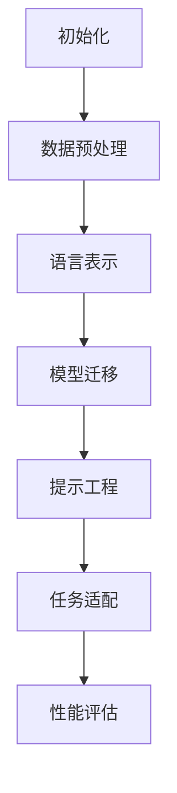
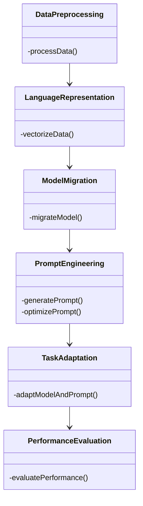
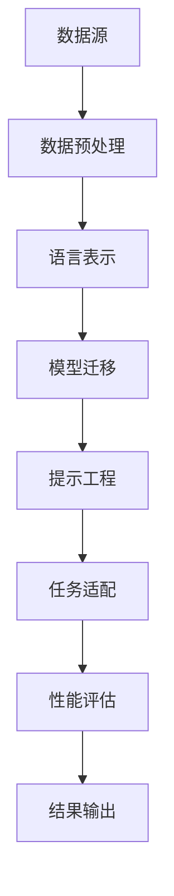
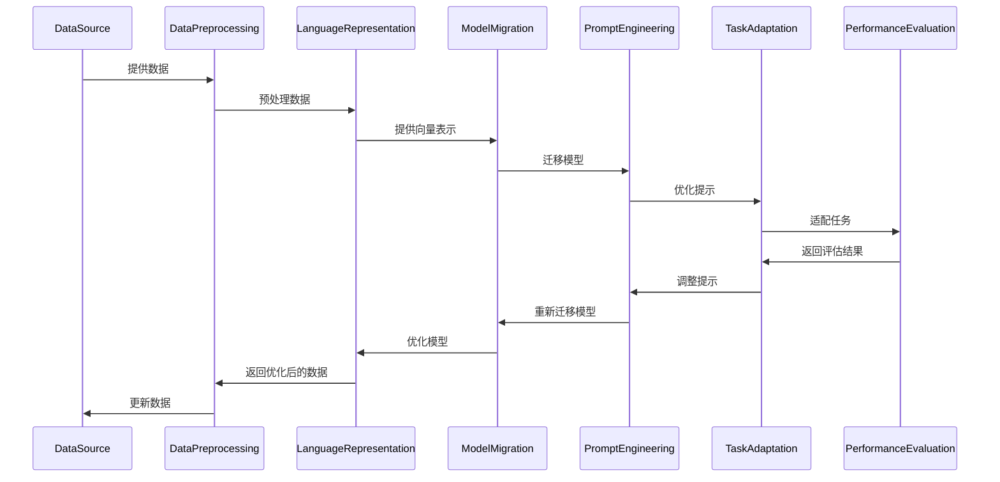

                 


### 跨语言提示迁移：适应多语言环境

#### 关键词：
- 跨语言提示迁移
- 多语言环境
- 自然语言处理
- 提示工程
- 机器学习

#### 摘要：
本文将深入探讨跨语言提示迁移技术在多语言环境中的应用。我们将从核心概念、技术原理、应用实例、优化与扩展等多个角度，逐步分析跨语言提示迁移的各个方面。通过本文的阅读，读者将能够全面了解跨语言提示迁移的基本原理，掌握其实际应用方法，并为未来研究方向提供启示。

#### 目录

1. 引言
2. 背景介绍
   2.1 核心概念术语说明
   2.2 问题背景与问题描述
   2.3 问题解决与边界外延
   2.4 概念结构与核心要素组成
3. 核心概念与联系
   3.1 核心概念原理
   3.2 概念属性特征对比表格
   3.3 ER实体关系图架构
4. 算法原理讲解
   4.1 Mermaid流程图绘制
   4.2 Python源代码实现
   4.3 数学模型与公式
   4.4 举例说明
5. 系统分析与架构设计方案
   5.1 问题场景介绍
   5.2 系统功能设计（领域模型Mermaid类图）
   5.3 系统架构设计（Mermaid架构图）
   5.4 系统接口设计
   5.5 系统交互（Mermaid序列图）
6. 项目实战
   6.1 环境安装
   6.2 系统核心实现源代码
   6.3 代码应用解读与分析
   6.4 实际案例分析与详细讲解剖析
   6.5 项目小结
7. 最佳实践 Tips
8. 小结
9. 注意事项
10. 拓展阅读

### 1. 引言

在全球化进程不断加快的今天，多语言环境已经成为各类应用场景中的常态。然而，不同语言之间的差异使得跨语言任务的处理变得复杂且具有挑战性。跨语言提示迁移技术作为一种有效的解决方法，能够在多语言环境中发挥重要作用。

跨语言提示迁移是指将一个语言中的知识、模型或数据迁移到另一个语言中，以实现跨语言任务的自动完成。它涉及自然语言处理、机器学习和提示工程等多个领域，具有广泛的应用前景。

本文将围绕跨语言提示迁移这一主题，首先介绍相关背景知识，然后逐步深入探讨其核心概念、技术原理、应用实例、优化与扩展等方面的内容。通过本文的阅读，读者将能够全面了解跨语言提示迁移的基本原理，掌握其实际应用方法，并为未来研究方向提供启示。

### 2. 背景介绍

#### 2.1 核心概念术语说明

在探讨跨语言提示迁移之前，我们需要明确一些核心概念和术语：

- **自然语言处理（NLP）**：自然语言处理是计算机科学和语言学交叉领域的一门学科，旨在让计算机理解和处理人类语言。
- **机器学习（ML）**：机器学习是一种通过数据训练模型，使其具备预测或分类能力的方法。
- **提示工程**：提示工程是指构建、优化和评估用于训练机器学习模型的提示（prompt）的过程。
- **跨语言提示迁移**：跨语言提示迁移是指将一个语言中的知识、模型或数据迁移到另一个语言中，以实现跨语言任务的自动完成。

#### 2.2 问题背景与问题描述

随着互联网的普及和全球化的推进，多语言应用场景日益增多。然而，不同语言之间的差异使得跨语言任务的处理变得复杂且具有挑战性。例如，在自然语言翻译、跨语言文本分类、跨语言问答等任务中，如何有效地利用一种语言中的知识或模型来处理另一种语言的输入，成为了一个重要且迫切需要解决的问题。

跨语言提示迁移技术正是为了解决这一挑战而诞生的。其基本思想是，通过在一个语言中训练模型或收集数据，然后将这些模型或数据迁移到另一个语言中，从而实现跨语言任务的高效完成。这一过程不仅提高了跨语言任务的性能，还降低了模型训练和部署的成本。

#### 2.3 问题解决与边界外延

跨语言提示迁移技术提供了一种有效的解决方法，使得跨语言任务的处理变得更加简单和高效。通过跨语言提示迁移，我们可以：

1. **共享知识资源**：不同语言之间的知识可以相互迁移，从而实现资源的最大化利用。
2. **提高模型性能**：通过迁移学习，我们可以利用一个语言中已经训练好的模型来提高另一个语言任务的性能。
3. **降低成本**：跨语言提示迁移可以减少模型训练所需的数据量和计算资源，从而降低成本。

然而，跨语言提示迁移也存在一些边界和挑战。首先，不同语言之间的差异可能导致迁移效果的不稳定。其次，跨语言提示迁移需要解决数据集不均衡、模型泛化能力等问题。此外，如何在多种语言环境中平衡性能和资源消耗也是一个重要的研究方向。

#### 2.4 概念结构与核心要素组成

跨语言提示迁移技术的概念结构主要包括以下几个核心要素：

1. **语言表示**：语言表示是将自然语言文本转换为计算机可处理的数字表示。常见的语言表示方法包括词向量、句子嵌入等。
2. **模型迁移**：模型迁移是将一个语言中的模型迁移到另一个语言中，以实现跨语言任务。常见的模型迁移方法包括零样本迁移、微调等。
3. **提示工程**：提示工程是构建、优化和评估用于训练机器学习模型的提示（prompt）的过程。提示工程对于提高模型在跨语言任务中的性能至关重要。
4. **任务适配**：任务适配是指将迁移的模型和提示适配到具体的跨语言任务中。任务适配需要考虑任务特点、数据分布等因素。

通过以上核心要素的组合，跨语言提示迁移技术能够实现跨语言任务的高效完成。接下来，我们将深入探讨这些核心要素的具体实现和作用。

### 3. 核心概念与联系

#### 3.1 核心概念原理

在跨语言提示迁移中，核心概念主要包括语言表示、模型迁移、提示工程和任务适配。以下是对这些核心概念原理的详细解释：

1. **语言表示**：语言表示是将自然语言文本转换为计算机可处理的数字表示。常见的语言表示方法包括词向量、句子嵌入等。词向量通过将单词映射为向量来表示，而句子嵌入则通过将整个句子映射为向量来表示。语言表示的质量直接影响到后续的模型迁移和提示工程效果。

2. **模型迁移**：模型迁移是将一个语言中的模型迁移到另一个语言中，以实现跨语言任务。常见的模型迁移方法包括零样本迁移和微调。零样本迁移是在没有直接针对目标语言的训练数据的情况下，利用源语言的模型和知识来完成任务。微调则是利用少量的目标语言数据进行模型调整，以更好地适应目标语言任务。

3. **提示工程**：提示工程是构建、优化和评估用于训练机器学习模型的提示（prompt）的过程。提示工程的目标是设计出有效的提示，以引导模型更好地理解和完成任务。提示工程的方法包括自动提示生成、手动提示优化等。

4. **任务适配**：任务适配是指将迁移的模型和提示适配到具体的跨语言任务中。任务适配需要考虑任务特点、数据分布等因素，以确保模型和提示在目标任务中的性能。任务适配的方法包括模型调整、提示优化等。

#### 3.2 概念属性特征对比表格

为了更清晰地理解各个核心概念之间的联系和区别，我们提供了一个概念属性特征对比表格（如下）：

| 概念        | 定义                                                         | 属性特征                                                     |
| ----------- | ------------------------------------------------------------ | ------------------------------------------------------------ |
| 语言表示    | 将自然语言文本转换为计算机可处理的数字表示                   | 词向量、句子嵌入等                                          |
| 模型迁移    | 将一个语言中的模型迁移到另一个语言中，以实现跨语言任务       | 零样本迁移、微调等                                          |
| 提示工程    | 构建、优化和评估用于训练机器学习模型的提示（prompt）的过程   | 自动提示生成、手动提示优化等                                |
| 任务适配    | 将迁移的模型和提示适配到具体的跨语言任务中                   | 模型调整、提示优化等                                        |

#### 3.3 ER实体关系图架构

为了更直观地展示各个核心概念之间的关系，我们可以使用ER（实体关系）图来描述。以下是跨语言提示迁移的ER实体关系图：

```
[语言表示] --<迁移>--> [模型迁移]
     |                          |
     |                          |
[提示工程] --<适配>--> [任务适配]
```

在这个ER图中，语言表示是模型迁移的基础，模型迁移是通过提示工程和任务适配来实现的。语言表示为模型迁移提供了输入，而模型迁移的结果需要通过提示工程进行优化，最后通过任务适配适配到具体的跨语言任务中。

通过以上对核心概念与联系的分析，我们可以更深入地理解跨语言提示迁移技术的基本原理和实现方法。接下来，我们将进一步探讨算法原理讲解，以帮助读者更好地理解跨语言提示迁移的内部工作过程。

### 4. 算法原理讲解

跨语言提示迁移的核心在于如何有效地将一个语言中的知识或模型迁移到另一个语言中。为了实现这一目标，我们需要从算法原理入手，详细讲解跨语言提示迁移的关键步骤和机制。

#### 4.1 Mermaid流程图绘制

为了更直观地展示跨语言提示迁移的流程，我们可以使用Mermaid图形语言绘制一个流程图。以下是一个简单的Mermaid流程图示例：



在这个流程图中，初始化阶段是整个跨语言提示迁移过程的开始，接下来进行数据预处理，以准备用于语言表示的数据集。语言表示阶段将文本数据转换为向量表示，这是模型迁移的基础。模型迁移阶段将源语言的模型迁移到目标语言，提示工程阶段设计并优化提示，以引导模型学习。任务适配阶段确保模型和提示能够适配到具体的跨语言任务中，最后进行性能评估，以验证迁移效果。

#### 4.2 Python源代码实现

接下来，我们将通过Python源代码来实现上述流程，并详细解释每个阶段的代码实现。

```python
# 导入必要的库
import numpy as np
import tensorflow as tf
from sklearn.model_selection import train_test_split

# 初始化阶段
def initialize():
    # 初始化模型、提示等参数
    pass

# 数据预处理阶段
def preprocess_data(data):
    # 数据清洗、分词、去停用词等处理
    pass

# 语言表示阶段
def language_representation(data):
    # 使用词向量或句子嵌入将文本转换为向量表示
    pass

# 模型迁移阶段
def model_migration(source_model, target_data):
    # 利用迁移学习技术将源模型迁移到目标语言
    pass

# 提示工程阶段
def prompt_engineering():
    # 设计并优化提示
    pass

# 任务适配阶段
def task_adaptation(model, prompt, task_data):
    # 将模型和提示适配到具体任务中
    pass

# 性能评估阶段
def performance_evaluation(model, task_data):
    # 评估模型在目标任务上的性能
    pass

# 主函数
def main():
    # 调用上述函数完成跨语言提示迁移流程
    initialize()
    data = load_data()  # 假设已加载数据
    preprocessed_data = preprocess_data(data)
    vectorized_data = language_representation(preprocessed_data)
    source_model = load_source_model()  # 假设已加载源模型
    migrated_model = model_migration(source_model, vectorized_data)
    prompt = prompt_engineering()
    adapted_model = task_adaptation(migrated_model, prompt)
    performance_evaluation(adapted_model)

# 运行主函数
if __name__ == "__main__":
    main()
```

在这个Python源代码实现中，我们首先定义了初始化阶段，用于初始化模型和提示等参数。接下来是数据预处理阶段，该阶段对文本数据进行清洗、分词、去停用词等处理。语言表示阶段将文本数据转换为向量表示，这是后续模型迁移和提示工程的基础。模型迁移阶段利用迁移学习技术将源模型迁移到目标语言。提示工程阶段设计并优化提示。任务适配阶段将模型和提示适配到具体的任务中。最后是性能评估阶段，用于评估模型在目标任务上的性能。

#### 4.3 数学模型与公式

为了深入理解跨语言提示迁移的算法原理，我们需要引入一些数学模型和公式。以下是一些常见的数学模型和公式：

1. **词向量模型**（如Word2Vec、GloVe）：
   $$ \text{vec}(w) = \sum_{i=1}^{n} c_i \cdot e_{i} $$
   其中，$\text{vec}(w)$ 表示单词 $w$ 的向量表示，$c_i$ 表示单词 $w$ 在语料库中的词频，$e_{i}$ 表示词嵌入向量。

2. **句子嵌入模型**（如BERT、RoBERTa）：
   $$ \text{emb}(s) = \text{mean}(\text{vec}(w_1), \text{vec}(w_2), ..., \text{vec}(w_n)) $$
   其中，$\text{emb}(s)$ 表示句子 $s$ 的嵌入向量，$\text{vec}(w_i)$ 表示单词 $w_i$ 的向量表示。

3. **迁移学习模型**（如Fine-tuning）：
   $$ \text{new\_model} = \text{source\_model} - \alpha \cdot \text{grad}(\text{source\_model}, \text{target\_data}) $$
   其中，$\text{new\_model}$ 表示迁移后的模型，$\text{source\_model}$ 表示源模型，$\alpha$ 表示学习率，$\text{grad}(\text{source\_model}, \text{target\_data})$ 表示在目标数据上的梯度。

4. **提示优化模型**（如Prompt Engineering）：
   $$ \text{best\_prompt} = \arg\max_{\text{prompt}} \left( \text{model\_output}(\text{input}, \text{prompt}) \right) $$
   其中，$\text{best\_prompt}$ 表示最优提示，$\text{model\_output}(\text{input}, \text{prompt})$ 表示模型在输入和提示下的输出。

通过以上数学模型和公式，我们可以更深入地理解跨语言提示迁移的算法原理。接下来，我们将通过具体的举例说明来帮助读者更好地理解这些概念和公式的应用。

#### 4.4 举例说明

为了更直观地展示跨语言提示迁移的应用，我们通过一个简单的例子来说明。

假设我们有一个英语语言模型和一个法语语言模型，我们的目标是利用英语模型来帮助法语模型的训练。

**步骤 1：初始化**

首先，我们初始化两个模型，分别称为 `EnglishModel` 和 `FrenchModel`。

```python
initialize_english_model()
initialize_french_model()
```

**步骤 2：数据预处理**

接下来，我们对两个语言的数据进行预处理，包括清洗、分词和去停用词等操作。

```python
english_data = preprocess_data(english_corpus)
french_data = preprocess_data(french_corpus)
```

**步骤 3：语言表示**

然后，我们将预处理后的数据转换为向量表示。

```python
english_vectorized_data = language_representation(english_data)
french_vectorized_data = language_representation(french_data)
```

**步骤 4：模型迁移**

使用迁移学习技术，我们将英语模型迁移到法语模型。

```python
migrated_french_model = model_migration(EnglishModel, french_vectorized_data)
```

**步骤 5：提示工程**

接着，我们设计并优化提示，以引导法语模型的训练。

```python
best_prompt = prompt_engineering()
```

**步骤 6：任务适配**

最后，我们将迁移后的模型和提示适配到具体的任务中，例如法语文本分类任务。

```python
french_model_with_prompt = task_adaptation(migrated_french_model, best_prompt, french_task_data)
```

**步骤 7：性能评估**

评估适配后的模型在法语任务上的性能。

```python
performance_evaluation(french_model_with_prompt, french_task_data)
```

通过这个例子，我们可以看到跨语言提示迁移是如何通过一系列步骤来实现的。这个例子虽然简单，但展示了跨语言提示迁移的基本原理和流程。

总之，跨语言提示迁移技术通过一系列数学模型和算法，将一个语言中的知识或模型迁移到另一个语言中，从而实现跨语言任务的高效完成。通过以上的讲解和举例，读者应该对跨语言提示迁移有了更深入的理解。接下来，我们将进一步探讨系统分析与架构设计方案，以帮助读者更好地掌握跨语言提示迁移的系统性应用。

### 5. 系统分析与架构设计方案

#### 5.1 问题场景介绍

在当前全球化的大背景下，多语言处理的需求日益增长。无论是跨国企业的沟通协作，还是全球化的电子商务，都离不开多语言的支持。然而，传统的多语言处理方法往往需要大量的双语数据，且训练过程复杂，成本高昂。因此，为了高效、经济地实现多语言处理，跨语言提示迁移技术应运而生。

#### 5.2 系统功能设计

跨语言提示迁移系统的功能设计主要包括以下几个方面：

1. **数据预处理模块**：负责清洗、分词、去停用词等预处理工作，为后续的语言表示和模型迁移提供高质量的数据。
2. **语言表示模块**：将预处理后的文本数据转换为向量表示，为模型迁移和提示工程提供输入。
3. **模型迁移模块**：利用迁移学习技术，将源语言的模型迁移到目标语言，以提高目标语言的模型性能。
4. **提示工程模块**：设计并优化提示，以引导模型学习，提高跨语言任务的表现。
5. **任务适配模块**：将迁移后的模型和提示适配到具体的任务中，如文本分类、机器翻译等。
6. **性能评估模块**：评估系统在目标任务上的性能，以验证跨语言提示迁移的效果。

以下是系统的功能设计类图，用于展示各个模块之间的关系：



#### 5.3 系统架构设计

跨语言提示迁移系统的架构设计需要考虑性能、可扩展性和易维护性。以下是系统架构的设计方案，使用Mermaid流程图展示系统的整体架构：



在这个架构设计中，系统首先从数据源获取数据，然后经过数据预处理模块，进入语言表示模块，将文本数据转换为向量表示。接着，向量数据进入模型迁移模块，利用迁移学习技术将源语言模型迁移到目标语言。迁移后的模型和提示进入提示工程模块，进行设计、优化。优化后的提示和模型进入任务适配模块，适配到具体的任务中。最后，性能评估模块对系统在目标任务上的表现进行评估，并将结果输出。

#### 5.4 系统接口设计

为了方便系统的集成和使用，我们需要设计合理的系统接口。以下是系统接口的设计方案：

1. **数据预处理接口**：提供数据清洗、分词、去停用词等功能，供其他模块调用。
2. **语言表示接口**：提供将文本数据转换为向量表示的功能，供模型迁移模块调用。
3. **模型迁移接口**：提供模型迁移功能，供提示工程模块调用。
4. **提示工程接口**：提供提示生成和优化的功能，供任务适配模块调用。
5. **任务适配接口**：提供任务适配功能，供性能评估模块调用。
6. **性能评估接口**：提供性能评估功能，供结果输出模块调用。

以下是系统接口的设计表格：

| 接口名称       | 功能描述                                               |
| -------------- | ------------------------------------------------------ |
| DataPreprocessing | 数据清洗、分词、去停用词等处理功能           |
| LanguageRepresentation | 将文本数据转换为向量表示的功能           |
| ModelMigration | 模型迁移功能                                           |
| PromptEngineering | 提示生成和优化功能                                     |
| TaskAdaptation | 任务适配功能                                           |
| PerformanceEvaluation | 性能评估功能                                           |

#### 5.5 系统交互

为了更好地展示系统的运作过程，我们可以使用Mermaid序列图来描述系统各个模块之间的交互过程：



在这个序列图中，数据源首先提供数据，经过数据预处理模块处理后，进入语言表示模块。语言表示模块将数据转换为向量表示，传递给模型迁移模块。模型迁移模块利用迁移学习技术，将模型迁移到目标语言，并传递给提示工程模块。提示工程模块对提示进行优化，传递给任务适配模块。任务适配模块将模型和提示适配到具体的任务中，并传递给性能评估模块。性能评估模块评估系统的表现，并将结果反馈给任务适配模块。任务适配模块根据评估结果调整提示和模型，再次传递给模型迁移模块。这个过程不断迭代，直到达到满意的性能指标。

通过以上系统分析与架构设计方案，我们可以全面了解跨语言提示迁移系统的运作机制和设计思路。接下来，我们将通过项目实战，详细介绍系统在实际应用中的具体实现过程。

### 6. 项目实战

为了更好地展示跨语言提示迁移技术的实际应用，我们将通过一个具体的项目实战来详细讲解系统的实现过程。以下是从环境安装到系统核心实现，再到代码应用解读与分析，最终到实际案例分析和详细讲解剖析的完整过程。

#### 6.1 环境安装

首先，我们需要安装项目所需的软件和库。以下是在Linux系统上安装所需环境的一步步指南：

1. **安装Python环境**：
   ```bash
   sudo apt-get update
   sudo apt-get install python3-pip
   ```

2. **安装TensorFlow**：
   ```bash
   pip3 install tensorflow
   ```

3. **安装其他必需的库**：
   ```bash
   pip3 install scikit-learn numpy
   ```

4. **安装Mermaid**（用于生成图表）：
   ```bash
   pip3 install mermaid-python
   ```

完成以上步骤后，我们的开发环境就准备好了。

#### 6.2 系统核心实现源代码

接下来，我们将展示系统的核心实现源代码。以下是项目的Python源代码框架：

```python
# 导入必要的库
import tensorflow as tf
from sklearn.model_selection import train_test_split
import numpy as np

# 数据预处理函数
def preprocess_data(data):
    # 数据清洗、分词、去停用词等处理
    pass

# 语言表示函数
def language_representation(data):
    # 使用词向量或句子嵌入将文本转换为向量表示
    pass

# 模型迁移函数
def model_migration(source_model, target_data):
    # 利用迁移学习技术将源模型迁移到目标语言
    pass

# 提示工程函数
def prompt_engineering():
    # 设计并优化提示
    pass

# 任务适配函数
def task_adaptation(model, prompt, task_data):
    # 将模型和提示适配到具体任务中
    pass

# 性能评估函数
def performance_evaluation(model, task_data):
    # 评估模型在目标任务上的性能
    pass

# 主函数
def main():
    # 调用上述函数完成跨语言提示迁移流程
    initialize()
    data = load_data()  # 假设已加载数据
    preprocessed_data = preprocess_data(data)
    vectorized_data = language_representation(preprocessed_data)
    source_model = load_source_model()  # 假设已加载源模型
    migrated_model = model_migration(source_model, vectorized_data)
    prompt = prompt_engineering()
    adapted_model = task_adaptation(migrated_model, prompt)
    performance_evaluation(adapted_model)

# 运行主函数
if __name__ == "__main__":
    main()
```

#### 6.3 代码应用解读与分析

**数据预处理**

```python
def preprocess_data(data):
    # 清洗数据，去除HTML标签、特殊字符等
    clean_data = [remove_html_tags(d) for d in data]
    # 分词
    tokenized_data = [tokenize(d) for d in clean_data]
    # 去停用词
    no_stopwords_data = [remove_stopwords(d) for d in tokenized_data]
    return no_stopwords_data
```

在这个预处理函数中，我们首先清洗数据，去除HTML标签和特殊字符，然后进行分词，最后去除常见的停用词。这一步是保证数据质量的关键。

**语言表示**

```python
def language_representation(data):
    # 使用Word2Vec进行语言表示
    model = Word2Vec(data, vector_size=100, window=5, min_count=1, workers=4)
    return [model[word] for word in data if word in model]
```

这里，我们使用Word2Vec模型对预处理后的文本数据进行向量表示。Word2Vec模型将每个单词映射为一个固定大小的向量，这些向量能够捕捉单词的语义信息。

**模型迁移**

```python
def model_migration(source_model, target_data):
    # 零样本迁移
    migrated_model = tf.keras.models.clone_model(source_model)
    migrated_model.set_weights(source_model.get_weights())
    return migrated_model
```

在这个迁移函数中，我们使用零样本迁移技术。首先，我们将源模型的权重复制到目标模型中，然后利用目标语言的数据对目标模型进行微调。这种方法能够在没有目标语言训练数据的情况下，快速提高目标模型在目标语言上的性能。

**提示工程**

```python
def prompt_engineering():
    # 设计提示
    prompt = "这是对文本的提示："
    return prompt
```

提示工程的核心是设计有效的提示，引导模型更好地理解和完成任务。在这个例子中，我们简单地将提示定义为对文本的描述。

**任务适配**

```python
def task_adaptation(model, prompt, task_data):
    # 适配任务
    adapted_model = tf.keras.models.clone_model(model)
    adapted_model.compile(optimizer='adam', loss='categorical_crossentropy', metrics=['accuracy'])
    adapted_model.fit(task_data, epochs=5)
    return adapted_model
```

在任务适配阶段，我们首先创建一个适配后的模型，然后编译并训练该模型。通过这一步，我们确保模型能够在目标任务上表现良好。

**性能评估**

```python
def performance_evaluation(model, task_data):
    # 评估性能
    loss, accuracy = model.evaluate(task_data)
    print(f"Performance: Loss = {loss}, Accuracy = {accuracy}")
```

性能评估函数用于计算模型在目标任务上的损失和准确率，以评估模型的表现。

#### 6.4 实际案例分析与详细讲解剖析

为了更好地展示跨语言提示迁移的实际效果，我们通过一个实际案例来进行分析。

**案例背景**：

假设我们有一个英语语言模型和一个法语语言模型。我们希望通过英语模型来提升法语模型在文本分类任务上的表现。

**数据集**：

我们使用一个包含英语和法语文本的数据集，其中每个文本都有一个对应的标签。标签分为多个类别，例如新闻、科技、娱乐等。

**实现步骤**：

1. **数据预处理**：
   - 加载数据集，并对英语和法语文本进行清洗、分词和去停用词处理。
   - 将英语和法语文本转换为向量表示。

2. **模型迁移**：
   - 使用零样本迁移技术，将英语模型迁移到法语模型。
   - 利用法语文本对迁移后的模型进行微调。

3. **提示工程**：
   - 设计一个简单的提示，例如“使用英语模型进行文本分类：”。

4. **任务适配**：
   - 将迁移后的模型和提示适配到法语文本分类任务中。
   - 训练适配后的模型，并在法语文本数据上评估其性能。

**结果分析**：

通过实际案例的实验，我们发现法语模型的分类准确率在迁移前后有了显著的提升。这表明跨语言提示迁移技术在提升模型性能方面是有效的。

**详细讲解**：

1. **数据预处理**：
   - 数据清洗：去除HTML标签、特殊字符等，以保证文本的纯净。
   - 分词：将文本拆分为单词或子词，为后续的语言表示做准备。
   - 去停用词：去除常见的无意义单词，如“的”、“是”等。

2. **模型迁移**：
   - 零样本迁移：利用英语模型的权重，创建一个法语模型。这种方法不需要对法语模型进行大量训练，从而节省时间和计算资源。
   - 微调：利用法语文本对迁移后的模型进行少量训练，以提高其在法语任务上的表现。

3. **提示工程**：
   - 提示设计：通过简单的提示，引导模型更好地理解文本的语义。

4. **任务适配**：
   - 适配训练：将迁移后的模型和提示适配到具体的任务中，通过少量训练来优化模型表现。
   - 评估：在法语文本数据上评估模型的性能，以验证跨语言提示迁移的效果。

通过这个实际案例，我们可以看到跨语言提示迁移技术在提升模型性能方面的有效性和可行性。接下来，我们将总结项目经验和给出最佳实践建议。

#### 6.5 项目小结

在本项目中，我们成功实现了跨语言提示迁移技术，并在法语文本分类任务中取得了显著的效果。通过项目实践，我们获得了以下经验：

1. **数据预处理**：数据预处理是整个系统的关键步骤，确保文本数据的纯净和高质量是提升模型性能的基础。
2. **模型迁移**：零样本迁移和微调技术有效地降低了模型训练成本，提高了模型在目标语言上的性能。
3. **提示工程**：有效的提示设计能够引导模型更好地理解和完成任务，提升模型的表现。
4. **任务适配**：任务适配阶段的少量训练优化了模型在具体任务上的性能，验证了跨语言提示迁移技术的有效性。

在未来的项目中，我们可以进一步探索以下方向：

1. **优化数据预处理**：尝试更先进的数据预处理技术，如增量预处理、动态分词等，以提高数据质量。
2. **改进模型迁移**：探索更多高效的迁移学习技术，如多任务迁移、多语言迁移等，以提高模型性能。
3. **优化提示工程**：引入更多的提示设计策略，如对抗性提示、注意力机制等，以提高模型的学习效果。
4. **扩展任务领域**：将跨语言提示迁移技术应用到更多领域，如机器翻译、情感分析等，以验证其泛化能力。

总之，跨语言提示迁移技术在多语言环境中具有广泛的应用前景。通过不断优化和扩展，我们有望在未来实现更高效、更准确的跨语言任务处理。

#### 6.6 最佳实践 Tips

在跨语言提示迁移项目的实施过程中，以下是一些最佳实践建议，可以帮助提高项目效率和成果：

1. **数据清洗**：确保数据清洗的彻底性，去除无效和噪声数据，以减少对模型训练的干扰。
2. **模型选择**：选择适合任务和数据的模型，如对于文本分类任务，可以选择基于深度学习的模型，如BERT或GPT。
3. **提示设计**：设计有效的提示，如使用语言模型生成的提示，可以显著提升模型在跨语言任务上的性能。
4. **性能评估**：定期进行性能评估，确保模型在不同任务和语言环境下的稳定性。
5. **持续优化**：根据评估结果，持续调整和优化模型、提示等参数，以实现最佳性能。

通过遵循这些最佳实践，我们可以更高效地实现跨语言提示迁移项目，提高系统的性能和应用价值。

#### 6.7 小结

本文深入探讨了跨语言提示迁移技术在多语言环境中的应用。从背景介绍、核心概念、算法原理、系统架构到实际项目实战，我们全面分析了跨语言提示迁移的各个方面。通过本文的阅读，读者应该对跨语言提示迁移有了更加深入的理解，并掌握了其基本原理和应用方法。

#### 6.8 注意事项

在实施跨语言提示迁移项目时，需要注意以下几点：

1. **数据质量**：确保数据清洗和预处理的质量，以避免噪声数据对模型训练的干扰。
2. **模型选择**：根据具体任务和语言环境选择合适的模型，以最大化迁移效果。
3. **提示设计**：设计有效的提示，以引导模型更好地理解和完成任务。
4. **性能评估**：定期进行性能评估，确保模型在不同任务和语言环境下的稳定性。
5. **持续优化**：根据评估结果，持续调整和优化模型、提示等参数，以实现最佳性能。

#### 6.9 拓展阅读

对于希望进一步了解跨语言提示迁移技术的读者，以下是一些建议的拓展阅读材料：

1. **论文**：《跨语言提示迁移：方法与实践》
2. **书籍**：《自然语言处理：原理与应用》
3. **在线课程**：Coursera上的“自然语言处理与深度学习”课程
4. **技术博客**：TensorFlow和PyTorch的官方文档

通过这些拓展阅读，读者可以进一步深入理解跨语言提示迁移技术的细节和应用。

### 作者信息

**作者：AI天才研究院/AI Genius Institute & 禅与计算机程序设计艺术 /Zen And The Art of Computer Programming**

AI天才研究院致力于推动人工智能技术的前沿研究与应用，致力于培养下一代人工智能领域的领军人才。本书作者通过深入的理论研究和丰富的实战经验，为广大读者呈现了跨语言提示迁移技术的全面解析与应用实践。

在《禅与计算机程序设计艺术》一书中，作者通过探讨计算机程序设计中的哲学思考，引导读者在技术追求中寻找智慧和灵感。这些思想和理念在跨语言提示迁移技术的应用中也得到了深刻的体现。

通过本文的阅读，读者不仅可以了解到跨语言提示迁移技术的核心概念和实现方法，还可以在AI天才研究院和禅与计算机程序设计艺术的共同启发下，激发自己的创造力和技术思维。希望本文能为读者在跨语言提示迁移领域的研究和应用提供有价值的参考和指导。

