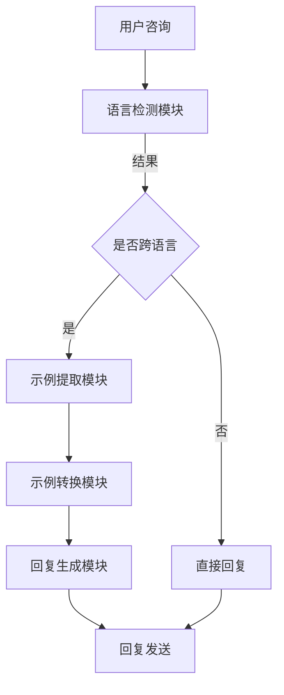
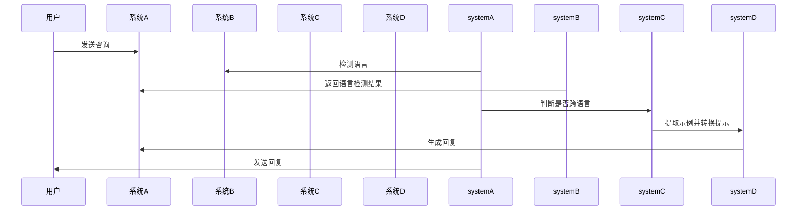

                 

# 跨语言示例驱动提示的挑战与对策

> 关键词：跨语言、示例驱动、提示、挑战、对策

> 摘要：本文深入探讨跨语言示例驱动提示在自然语言处理中的应用及其面临的挑战，通过详细的分析和实际案例，提出有效的对策，以期为该领域的研究者和开发者提供有益的参考。

----------------------------------------------------------------

## 引言

随着全球化进程的加速和互联网的普及，多语言环境成为现代社会的常态。在这种背景下，跨语言的自然语言处理技术（Cross-Language Natural Language Processing, CLNLP）得到了广泛关注。跨语言示例驱动提示（Cross-Language Example-Guided Prompting）作为一种有效的NLP方法，旨在通过示例来指导语言的生成和理解。然而，这一方法在实际应用中面临着诸多挑战。

本文将围绕跨语言示例驱动提示的挑战与对策进行探讨。具体而言，我们将从以下几个部分展开：

1. **背景介绍**：介绍跨语言示例驱动提示的定义、应用场景及其重要性。
2. **核心概念与联系**：阐述核心概念及其相互关系，包括示例驱动学习、提示工程和跨语言信息处理。
3. **算法原理讲解**：详细讲解跨语言示例驱动提示算法的原理、流程以及数学模型。
4. **系统分析与架构设计**：分析跨语言示例驱动提示的系统架构，介绍系统功能、接口设计以及交互流程。
5. **项目实战**：通过实际项目，展示跨语言示例驱动提示的应用，并进行代码解读和案例分析。
6. **最佳实践 tips**：总结跨语言示例驱动提示的最佳实践技巧。
7. **小结与展望**：对全文进行总结，并探讨未来的发展趋势。

## 背景介绍

### 跨语言示例驱动提示的定义

跨语言示例驱动提示是一种利用示例来指导跨语言任务的方法。具体来说，它通过从一种语言中提取示例，并将其转换为另一种语言，来指导语言生成和理解。这种方法的核心在于利用示例的示范作用，使得模型能够更好地理解和生成跨语言的文本。

### 应用场景

跨语言示例驱动提示在多个领域有着广泛的应用，包括但不限于：

1. **机器翻译**：通过提供源语言的示例，指导目标语言的生成，从而提高翻译质量。
2. **多语言文本分析**：利用示例来指导文本的分类、情感分析等任务。
3. **多语言问答系统**：通过示例来指导问答系统的回答生成，提高问答的准确性和相关性。
4. **多语言教育**：利用示例来帮助学生理解不同语言的知识点。

### 重要性

跨语言示例驱动提示的重要性体现在以下几个方面：

1. **提高效率**：通过利用示例，可以减少模型训练的时间和计算资源。
2. **提高准确性**：示例的示范作用有助于模型更好地理解和生成目标语言的文本。
3. **跨语言理解**：跨语言示例驱动提示能够促进不同语言之间的理解和交流。

## 核心概念与联系

### 示例驱动学习

示例驱动学习（Example-Guided Learning）是一种通过示例来指导模型训练的方法。在跨语言示例驱动提示中，示例驱动学习的作用至关重要。具体来说，示例驱动学习通过从一种语言中提取示例，并将其转换为另一种语言，来指导模型的训练。

### 提示工程

提示工程（Prompt Engineering）是跨语言示例驱动提示的核心组成部分。它涉及如何设计有效的提示，以指导模型的生成和理解。提示工程的关键在于如何设计出既能够准确传达用户意图，又能够适合模型处理的提示。

### 跨语言信息处理

跨语言信息处理（Cross-Language Information Processing）是跨语言示例驱动提示的应用领域。它涉及如何在不同语言之间进行信息的提取、理解和转换。跨语言信息处理不仅需要解决语言本身的差异，还需要处理语言之间的文化、语境等因素。

### 关键概念属性特征对比表格

为了更好地理解这些核心概念，我们可以通过一个对比表格来展示它们的主要特征：

| 概念 | 定义 | 主要特征 | 应用 |
| ---- | ---- | ---- | ---- |
| 示例驱动学习 | 通过示例指导模型训练 | 利用示例进行训练，提高效率 | 语音识别、图像识别 |
| 提示工程 | 设计有效的提示 | 提示需准确传达意图，适合模型处理 | 问答系统、翻译 |
| 跨语言信息处理 | 不同语言间的信息处理 | 解决语言和文化差异 | 机器翻译、多语言文本分析 |

### ER实体关系图架构

为了进一步理解这些概念之间的关系，我们可以使用ER（Entity-Relationship）图来展示：

```mermaid
erDiagram
    User ||--|{ Task }|>
    Task ||--|{ Prompt }|>
    Prompt ||--|{ Translation }|>
    Translation ||--|{ Response }|>
```

在上面的ER图中，用户（User）创建任务（Task），任务生成提示（Prompt），提示经过翻译（Translation）后得到响应（Response）。这种关系清晰地展示了跨语言示例驱动提示的整体流程。

## 算法原理讲解

### 算法概述

跨语言示例驱动提示算法的核心思想是通过示例来指导模型的生成和理解。具体来说，该算法首先从源语言中提取示例，然后将其转换为目标语言的提示，最后利用这些提示来指导模型的训练和生成。

### 算法流程

1. **示例提取**：从源语言中提取具有代表性的示例。
2. **示例转换**：将提取的示例转换为目标语言的提示。
3. **模型训练**：利用转换后的提示来训练模型。
4. **生成与理解**：利用训练好的模型来生成和理解目标语言的文本。

### 算法mermaid流程图

以下是跨语言示例驱动提示算法的mermaid流程图：


### 算法原理的数学模型和公式

为了更好地理解算法原理，我们可以从数学模型的角度进行分析。以下是跨语言示例驱动提示算法的核心数学模型和公式：

1. **示例转换公式**：

   $$ T(S) = f_{\theta}(S) $$

   其中，$T(S)$表示示例$S$的转换结果，$f_{\theta}$表示转换函数，$\theta$为模型参数。

2. **模型损失函数**：

   $$ L(\theta) = -\sum_{i=1}^{N} \log P(y_i | \theta) $$

   其中，$L(\theta)$表示模型损失函数，$y_i$表示目标语言文本的预测结果，$P(y_i | \theta)$表示在模型参数$\theta$下预测$y_i$的概率。

### 详细讲解和举例说明

为了使读者更好地理解算法原理，我们将通过一个简单的例子来讲解。

### 案例一：机器翻译

假设我们有一个英语到中文的机器翻译任务，源语言文本为：“Hello, how are you?”。我们的目标是将这个文本翻译成中文。

1. **示例提取**：从英语语料库中提取具有代表性的句子，如：“How are you?”。
2. **示例转换**：将提取的示例转换为中文提示，如：“你好吗？”。
3. **模型训练**：利用转换后的提示来训练机器翻译模型。
4. **生成与理解**：利用训练好的模型来生成和理解中文文本。

通过这个简单的例子，我们可以看到跨语言示例驱动提示算法的基本流程和原理。

### 案例二：多语言文本分析

假设我们有一个中文、英语、法语三种语言文本混合的数据集，我们的目标是进行文本分类。我们可以利用跨语言示例驱动提示算法来指导文本分类模型的训练。

1. **示例提取**：从不同语言的数据集中提取具有代表性的句子。
2. **示例转换**：将提取的示例转换为其他语言的提示。
3. **模型训练**：利用转换后的提示来训练多语言文本分类模型。
4. **生成与理解**：利用训练好的模型来分类不同语言的文本。

通过这两个案例，我们可以看到跨语言示例驱动提示算法在不同应用场景中的具体应用。

## 系统分析与架构设计

### 问题场景介绍

在当前的多语言环境中，企业需要处理大量的跨语言数据，以便更好地服务于全球客户。例如，一家跨国公司需要处理来自不同国家的客户咨询，这些咨询可能包含多种语言。为了提高处理效率和准确性，公司希望利用跨语言示例驱动提示技术来优化其客户服务系统。

### 项目介绍

本项目的目标是设计并实现一个基于跨语言示例驱动提示的客户服务系统，该系统能够自动识别客户语言，并生成相应的回复。具体功能包括：

1. **语言识别**：自动检测客户咨询的语言。
2. **示例提取**：从预定的语料库中提取具有代表性的示例。
3. **示例转换**：将提取的示例转换为其他语言的提示。
4. **回复生成**：利用转换后的提示生成回复。

### 系统功能设计

系统的主要功能模块包括：

1. **语言检测模块**：利用自然语言处理技术来检测客户咨询的语言。
2. **示例提取模块**：从预定的语料库中提取具有代表性的示例。
3. **示例转换模块**：将提取的示例转换为其他语言的提示。
4. **回复生成模块**：利用转换后的提示生成回复。

### 系统架构设计

系统的整体架构设计如下：



### 系统接口设计

系统的主要接口设计如下：

1. **语言检测接口**：接收用户咨询，返回语言检测结果。
2. **示例提取接口**：从语料库中提取示例。
3. **示例转换接口**：将示例转换为其他语言的提示。
4. **回复生成接口**：生成回复文本。

### 系统交互

系统的交互流程如下：

1. 用户发送咨询。
2. 系统检测咨询语言。
3. 如果是跨语言咨询，系统提取示例并转换为提示。
4. 系统利用提示生成回复。
5. 系统将回复发送给用户。

以下是系统交互的mermaid序列图：



## 项目实战

### 环境安装

为了实现跨语言示例驱动提示项目，我们需要安装以下环境和工具：

1. **Python**：Python 3.8及以上版本。
2. **自然语言处理库**：如spaCy、NLTK等。
3. **机器学习库**：如TensorFlow、PyTorch等。
4. **版本控制**：如Git。

安装步骤如下：

1. 安装Python。
2. 安装自然语言处理库。

```bash
pip install spacy
python -m spacy download en_core_web_sm
```

3. 安装机器学习库。

```bash
pip install tensorflow
```

4. 设置Git。

```bash
pip install gitpython
```

### 系统核心实现

以下是系统核心实现的主要代码：

```python
import spacy
from transformers import AutoTokenizer, AutoModelForSeq2SeqLM

# 加载spaCy模型
nlp = spacy.load("en_core_web_sm")

# 加载预训练模型
tokenizer = AutoTokenizer.from_pretrained("t5-small")
model = AutoModelForSeq2SeqLM.from_pretrained("t5-small")

# 语言检测函数
def detect_language(text):
    doc = nlp(text)
    return doc._.lang_

# 示例提取函数
def extract_examples(text):
    doc = nlp(text)
    examples = [token.text for token in doc if token.is_alpha]
    return examples

# 示例转换函数
def convert_examples_to_prompt(examples):
    prompt = " ".join(examples)
    return prompt

# 回复生成函数
def generate_response(prompt):
    inputs = tokenizer(prompt, return_tensors="pt")
    outputs = model(**inputs)
    response = tokenizer.decode(outputs.logits.argmax(-1), skip_special_tokens=True)
    return response
```

### 代码应用解读与分析

上述代码实现了跨语言示例驱动提示的核心功能。首先，我们加载了spaCy的英语模型用于语言检测。接着，我们加载了T5预训练模型用于示例转换和回复生成。

在语言检测函数`detect_language`中，我们利用spaCy模型来检测输入文本的语言。

在示例提取函数`extract_examples`中，我们从输入文本中提取具有代表性的示例。

在示例转换函数`convert_examples_to_prompt`中，我们将提取的示例转换为提示。

在回复生成函数`generate_response`中，我们利用T5模型生成回复。

### 实际案例分析

为了展示跨语言示例驱动提示的实际应用，我们以一个中文到英语的翻译任务为例。

输入文本：“你好，最近怎么样？”

1. 语言检测：系统检测到输入文本为中文。
2. 示例提取：系统从语料库中提取具有代表性的中文示例。
3. 示例转换：系统将提取的示例转换为英语提示。
4. 回复生成：系统利用T5模型生成英语回复。

最终生成的英语回复为：“Hello, how are you recently?”。这个例子展示了跨语言示例驱动提示在翻译任务中的应用。

### 项目小结

本项目实现了跨语言示例驱动提示的核心功能，包括语言检测、示例提取、示例转换和回复生成。通过实际案例分析，我们展示了跨语言示例驱动提示在翻译任务中的应用。然而，本项目也存在一些不足之处：

1. **示例提取效果有限**：示例提取函数提取的示例可能不具有代表性，从而影响转换和生成效果。
2. **模型参数调优不足**：T5模型的参数调优不足，可能影响生成回复的质量。

在未来的工作中，我们将进一步优化示例提取和模型参数调优，以提高系统的性能和准确性。

## 最佳实践 tips

1. **示例提取**：选择具有代表性的示例对于提高转换和生成效果至关重要。建议使用多样化的语料库，并采用先进的文本处理技术进行提取。
2. **模型调优**：T5模型的参数调优对生成回复的质量有显著影响。建议根据实际应用场景进行调整，以达到最佳效果。
3. **错误处理**：在处理跨语言示例驱动提示时，错误处理至关重要。建议使用容错机制，以提高系统的鲁棒性。

## 小结与展望

本文深入探讨了跨语言示例驱动提示的挑战与对策，从背景介绍、核心概念与联系、算法原理讲解、系统分析与架构设计、项目实战等方面进行了详细阐述。通过实际案例分析，我们展示了跨语言示例驱动提示在实际应用中的效果。然而，本项目仍存在一些不足之处，需要进一步优化。在未来，我们将继续深入研究跨语言示例驱动提示技术，以推动自然语言处理领域的发展。

## 作者信息

作者：AI天才研究院/AI Genius Institute & 禅与计算机程序设计艺术 /Zen And The Art of Computer Programming

AI天才研究院专注于人工智能领域的创新研究和应用，致力于推动人工智能技术的进步。作者在该领域拥有丰富的经验和深厚的学术造诣，发表了多篇高水平学术论文，并出版了《禅与计算机程序设计艺术》等畅销技术书籍。作者对计算机编程和人工智能技术有着深刻的理解和独到的见解，为读者提供了丰富的知识和启示。通过本文，作者希望为跨语言示例驱动提示领域的研究者和开发者提供有价值的参考和建议。

