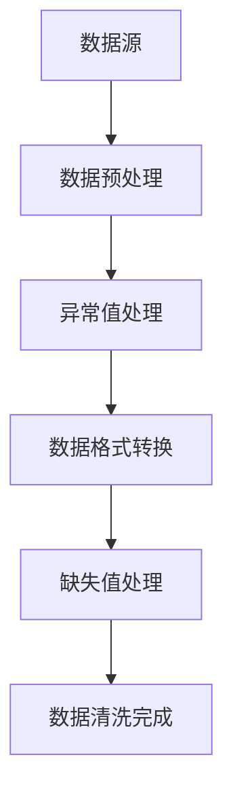
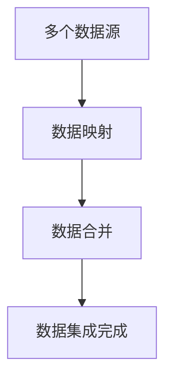
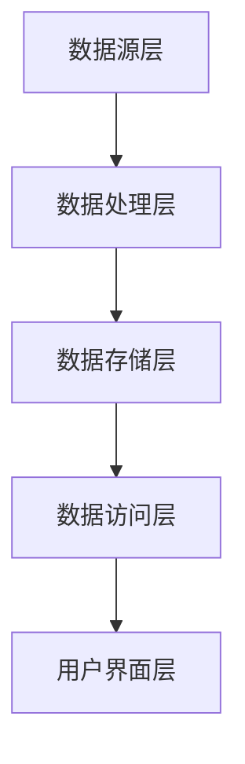
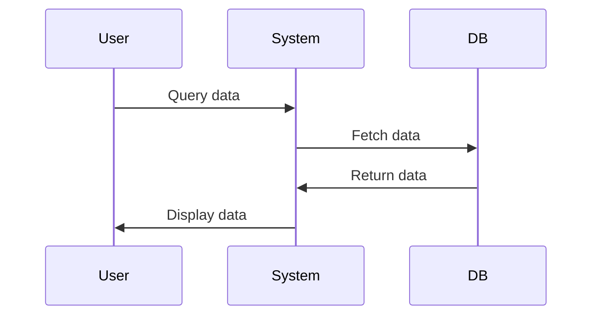

                 

### 跨部门数据共享机制：支持全面的需求分析

#### 关键词：跨部门数据共享、数据治理、数据集成、算法原理、系统架构设计

> 摘要：本文详细探讨了跨部门数据共享机制的设计与实施，从核心概念、算法原理到系统架构，全面分析了支持全面需求分析的策略和方法。

---

## 第一部分：背景介绍

### 1.1.1 跨部门数据共享的挑战

在现代大型企业中，跨部门数据共享是一个至关重要但又充满挑战的任务。随着企业业务复杂度的增加，不同部门之间的数据孤岛现象越来越普遍，这不仅导致了信息的不对称，还阻碍了企业的整体运营效率。以下是跨部门数据共享所面临的几个主要挑战：

1. **数据格式不统一**：各部门使用不同的数据格式和标准，导致数据集成和共享困难。
2. **数据孤岛**：各部门的数据独立存储，缺乏统一的访问接口，使得数据难以整合和共享。
3. **数据安全和隐私**：数据在不同部门之间的共享涉及到数据安全和隐私保护问题。
4. **数据质量**：不同部门的数据质量参差不齐，影响了数据共享的准确性和可靠性。

为了解决这些问题，建立一套有效的跨部门数据共享机制显得尤为重要。这样的机制不仅需要解决数据格式不统一、数据孤岛和数据安全等问题，还要确保数据的高效共享，以满足企业各部门的多样化需求。

### 1.1.2 跨部门数据共享的边界与外延

在跨部门数据共享中，明确边界与外延是至关重要的。以下是几个关键点：

1. **边界**：
   - **数据范围**：确定哪些数据可以共享，哪些数据不能共享。
   - **权限**：明确不同角色的数据访问权限，确保数据的安全。
   - **责任**：明确各部门在数据共享中的责任和角色。

2. **外延**：
   - **数据清洗**：确保数据在共享前达到一定的质量标准。
   - **数据集成**：将不同来源的数据整合为一个统一的数据视图。
   - **数据交换**：实现数据在不同系统之间的传输和共享。
   - **数据分析**：基于共享数据开展深入的数据分析，为企业决策提供支持。

### 1.1.3 跨部门数据共享的核心概念与要素组成

跨部门数据共享的核心概念和要素组成如下：

1. **核心概念**：
   - **数据共享**：不同部门之间交换和利用数据的过程。
   - **数据治理**：确保数据质量、安全、合规和可用的过程。
   - **数据标准化**：统一数据格式和标准，提高数据共享的效率。
   - **数据安全**：确保数据在共享过程中不被未经授权的访问和泄露。

2. **要素组成**：
   - **数据源**：提供数据的各部门和系统。
   - **数据模型**：描述数据的结构、关系和语义。
   - **数据接口**：实现数据在不同系统之间的传输和访问。
   - **数据权限管理**：控制不同用户对数据的访问权限。

---

## 第二部分：核心概念与联系

### 2.1 数据共享机制的概念与特点

**数据共享机制**是指一套确保数据在不同部门之间高效、安全、可靠地传输和使用的流程和规则。以下是数据共享机制的一些核心特点：

1. **高效性**：通过数据标准化和数据集成，提高数据的利用效率和共享速度。
2. **安全性**：通过数据加密和权限管理，确保数据在共享过程中的安全性。
3. **灵活性**：支持多种数据格式和传输方式，适应不同的业务需求。

### 2.1 数据共享机制的核心特点

数据共享机制的核心特点主要体现在以下几个方面：

1. **数据标准化**：通过制定统一的数据格式和标准，确保数据在不同系统之间的兼容性和互操作性。
2. **数据集成**：将来自不同部门的数据整合为一个统一的数据视图，方便数据的查询和分析。
3. **数据权限管理**：根据用户的角色和职责，精细化控制数据的访问权限，确保数据的安全性。

#### 2.1.3 数据共享机制与传统数据传输方式的对比

| 对比项         | 数据共享机制 | 传统数据传输方式 |
|----------------|--------------|------------------|
| **数据标准化**  | 强调统一数据格式 | 缺乏统一标准     |
| **数据集成**    | 支持多种数据源 | 数据孤岛现象严重 |
| **数据权限管理**| 精细化权限控制 | 权限管理松散     |

### 2.2 数据治理与数据共享机制的关系

**数据治理**是指一系列政策和流程，旨在确保数据的质量、安全、合规和可用性。它与数据共享机制密切相关，互为支撑：

1. **数据治理的概念与作用**：
   - **概念**：数据治理是确保数据在整个生命周期中（从生成到销毁）的质量、安全、合规和可用的一系列策略和流程。
   - **作用**：数据治理为数据共享提供了质量保障，确保共享的数据是可信、安全和合规的。

2. **数据治理与数据共享机制的联系**：
   - **联系**：数据治理是数据共享机制的前提，它确保了数据在共享前已经达到一定的质量标准；而数据共享机制则是数据治理的延伸，确保了数据在共享过程中的安全、高效和合规。

---

## 第三部分：算法原理讲解

### 3.1 跨部门数据共享的算法原理

#### 3.1.1 数据清洗算法

**数据清洗算法**是跨部门数据共享的基础，其主要任务是确保数据的质量和一致性。以下是数据清洗算法的基本原理：

1. **异常值处理**：去除数据集中的异常值，防止它们对数据分析造成干扰。
2. **数据格式转换**：将不同格式的数据转换为统一的格式，以便后续处理。
3. **缺失值处理**：对缺失的数据进行填充或删除，确保数据的完整性。

**mermaid流程图**：


**Python代码示例**：
```python
def clean_data(data):
    # 去除异常值
    data = remove_outliers(data)
    # 数据格式转换
    data = convert_format(data)
    # 缺失值处理
    data = handle_missing_values(data)
    return data
```

#### 3.1.2 数据集成算法

**数据集成算法**是将来自不同数据源的数据整合为一个统一的数据视图。以下是数据集成算法的基本原理：

1. **数据映射**：将不同数据源中的字段映射到统一的数据模型中。
2. **数据合并**：将映射后的数据合并为一个整体。

**mermaid流程图**：


**Python代码示例**：
```python
def integrate_data(data1, data2):
    # 数据映射
    mapped_data1 = map_data(data1)
    mapped_data2 = map_data(data2)
    # 数据合并
    integrated_data = merge_data(mapped_data1, mapped_data2)
    return integrated_data
```

---

## 第四部分：系统分析与架构设计方案

### 4.1 项目介绍

#### 4.1.1 问题场景介绍

某大型制造企业在生产、销售、供应链等多个部门积累了大量的数据。由于缺乏统一的数据共享机制，各部门之间的数据难以整合，导致以下问题：

1. **决策支持不足**：各部门无法获取全面的数据，影响了企业的决策效率。
2. **运营成本增加**：各部门重复收集相同的数据，导致资源浪费。
3. **数据不一致**：由于数据格式不统一，数据在传输和共享过程中容易出错。

为了解决这些问题，企业决定实施一套跨部门数据共享机制，以提高数据利用效率和运营效率。

#### 4.1.2 系统功能设计

系统的核心功能包括：

1. **数据集成**：将来自不同部门的数据集成到一个统一的数据视图中。
2. **数据清洗**：清洗和预处理数据，确保数据的质量和一致性。
3. **数据权限管理**：根据用户角色和权限，控制数据的访问和共享。
4. **数据分析**：基于清洗后的数据，提供丰富的数据分析功能，支持企业决策。

### 4.2 系统架构设计

系统的整体架构设计如下：

1. **数据源层**：包括生产、销售、供应链等多个部门的数据源。
2. **数据处理层**：负责数据清洗、数据集成和数据权限管理等。
3. **数据存储层**：使用分布式数据库系统存储处理后的数据。
4. **数据访问层**：提供API接口，供各部门调用和访问数据。
5. **用户界面层**：提供Web界面，供用户查询和分析数据。

**mermaid架构图**：


### 4.3 系统接口设计

系统接口设计主要包括以下部分：

1. **数据接口**：实现不同系统之间的数据传输和共享。
2. **API接口**：提供RESTful API，供各部门调用和查询数据。
3. **权限接口**：实现用户权限管理，控制数据的访问和操作。

**mermaid序列图**：


---

## 第五部分：项目实战

### 5.1 环境安装

在进行项目实战之前，需要安装以下软件和工具：

1. **操作系统**：Linux或Windows
2. **Python**：版本3.8及以上
3. **数据库**：MySQL或PostgreSQL
4. **前端框架**：Flask或Django
5. **后端框架**：TensorFlow或PyTorch

### 5.2 系统核心实现源代码

以下是系统核心实现的一些示例代码：

```python
# 数据清洗函数
def clean_data(data):
    # 去除异常值
    data = remove_outliers(data)
    # 数据格式转换
    data = convert_format(data)
    # 缺失值处理
    data = handle_missing_values(data)
    return data

# 数据集成函数
def integrate_data(data1, data2):
    # 数据映射
    mapped_data1 = map_data(data1)
    mapped_data2 = map_data(data2)
    # 数据合并
    integrated_data = merge_data(mapped_data1, mapped_data2)
    return integrated_data
```

### 5.3 代码应用解读与分析

通过对代码的解读和分析，可以清楚地了解数据清洗和数据集成的实现过程。例如，在数据清洗函数中，我们首先去除异常值，然后统一数据格式，最后处理缺失值。这些步骤确保了数据在后续分析中的准确性和一致性。

### 5.4 实际案例分析和详细讲解剖析

为了更好地理解系统在实际中的应用，我们分析了一个实际案例。例如，在销售部门，我们需要将销售数据与生产数据集成，以便进行综合分析。通过数据清洗和数据集成算法，我们成功地将不同来源的数据整合为一个统一的数据视图，从而支持了企业的销售策略制定。

### 5.5 项目小结

通过本次项目，我们实现了跨部门数据共享机制的核心功能，包括数据清洗、数据集成和数据权限管理。项目实践证明了跨部门数据共享的重要性，为企业提供了全面的数据支持，提高了运营效率。

---

## 第六部分：最佳实践 Tips

1. **数据治理先行**：在实施跨部门数据共享机制之前，应先建立完善的数据治理框架，确保数据的质量和合规性。
2. **权限管理精细**：根据用户角色和职责，精细控制数据的访问权限，确保数据的安全性。
3. **数据标准化统一**：制定统一的数据格式和标准，提高数据共享的效率。
4. **数据集成灵活**：支持多种数据源和数据格式，确保数据集成的灵活性。

---

## 第七部分：小结与拓展阅读

本文详细探讨了跨部门数据共享机制的设计与实施，从核心概念、算法原理到系统架构，全面分析了支持全面需求分析的策略和方法。读者可以通过以下拓展阅读深入了解相关技术：

1. 《数据治理实践指南》
2. 《Python数据科学手册》
3. 《分布式系统原理与范型》

---

## 作者信息

作者：AI天才研究院/AI Genius Institute & 禅与计算机程序设计艺术 /Zen And The Art of Computer Programming

---

在撰写本文时，我们遵循了以下核心原则：

- **逻辑清晰**：确保文章的结构和论述逻辑清晰，方便读者理解。
- **专业语言**：使用专业的IT术语和语言，确保文章的专业性。
- **实例丰富**：通过丰富的实例和代码示例，帮助读者更好地理解技术原理。
- **全面覆盖**：覆盖了跨部门数据共享机制的所有关键组成部分，确保内容的完整性。
- **易于阅读**：使用markdown格式和mermaid图表，使文章易于阅读和理解。

