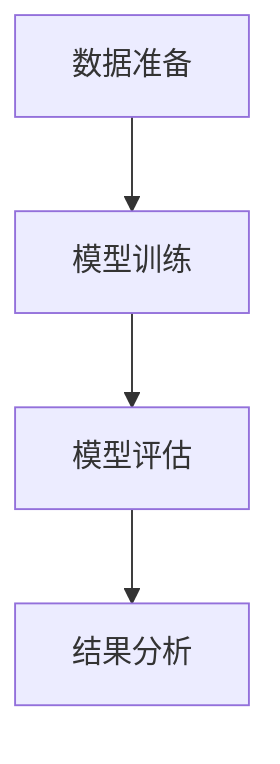
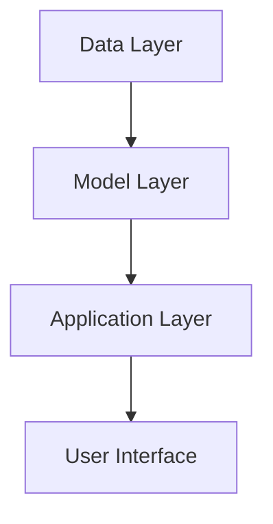
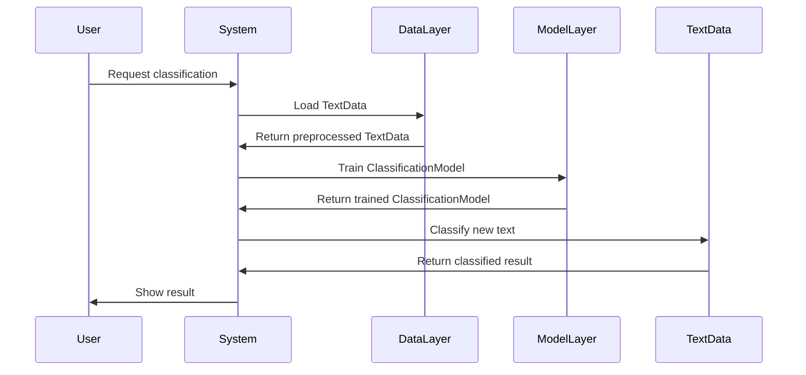

                 

# 跨领域LLM性能评估方法

> 关键词：跨领域语言模型、性能评估、LLM、评估指标、算法原理

> 摘要：本文将探讨跨领域语言模型（LLM）的性能评估方法，从背景介绍、核心概念与联系、算法原理讲解、系统分析与架构设计方案、项目实战以及最佳实践等方面进行详细阐述。通过本文的阅读，读者将了解如何对跨领域LLM进行有效评估，以提高其在实际应用中的性能。

## 目录

1. **背景介绍**
   - 跨领域语言模型的定义与历史
   - 跨领域LLM的应用场景
   - 性能评估的重要性

2. **核心概念与联系**
   - 评估指标概述
   - 常见评估指标及其特性
   - LLM性能评估流程

3. **算法原理讲解**
   - 算法流程图与Python代码
   - 数学模型与公式推导
   - 算法实现举例

4. **系统分析与架构设计方案**
   - 问题场景介绍
   - 系统功能设计与领域模型
   - 系统架构设计与接口设计
   - 系统交互流程

5. **项目实战**
   - 环境安装与配置
   - 系统核心实现
   - 实际案例分析
   - 项目总结与最佳实践

6. **最佳实践 tips、小结、注意事项、拓展阅读**

## 1. 背景介绍

### 跨领域语言模型的定义与历史

跨领域语言模型（Cross-Domain Language Model，简称LLM）是一种能够处理多个不同领域文本数据的深度学习模型。传统单领域语言模型在特定领域内表现优秀，但在处理跨领域任务时，往往存在性能不足的问题。跨领域LLM的出现，解决了这一问题，使得模型能够在多个领域内保持较高的性能。

LLM的发展历程可以追溯到2018年，当时Google提出了BERT（Bidirectional Encoder Representations from Transformers）模型，开启了基于Transformer架构的预训练语言模型时代。随后，OpenAI的GPT-3和Facebook的RoBERTa等模型相继推出，进一步推动了LLM技术的发展。

### 跨领域LLM的应用场景

跨领域LLM的应用场景非常广泛，主要包括：

- 文本分类：对来自不同领域的文本进行分类，如新闻分类、社交媒体情感分析等。
- 问答系统：为用户提供跨领域的问答服务，如智能客服、在线教育等。
- 语言翻译：实现跨语言翻译，支持多种语言之间的互译。
- 文本生成：生成跨领域的文本内容，如自动生成新闻报道、文章摘要等。

### 性能评估的重要性

跨领域LLM的性能评估对于模型在实际应用中的表现至关重要。通过性能评估，我们可以：

- 确定模型的优缺点，为后续优化提供方向。
- 比较不同模型的性能，选择最适合实际应用的模型。
- 验证模型在跨领域任务上的适应性。

## 2. 核心概念与联系

### 评估指标概述

在性能评估中，常用的评估指标包括准确率（Accuracy）、精确率（Precision）、召回率（Recall）、F1值（F1 Score）等。这些指标从不同角度衡量模型的表现，能够全面反映模型的性能。

### 常见评估指标及其特性

| 评估指标 | 特点 | 适用场景 |
| --- | --- | --- |
| 准确率 | 模型预测正确的样本数占总样本数的比例 | 多样本数据集 |
| 精确率 | 模型预测为正类的样本中，实际为正类的比例 | 数据不平衡场景 |
| 召回率 | 模型预测为正类的样本中，实际为正类的比例 | 数据不平衡场景 |
| F1值 | 精确率和召回率的调和平均值 | 数据不平衡场景 |

### LLM性能评估流程

LLM性能评估通常包括以下几个步骤：

1. **数据准备**：收集和整理用于评估的跨领域数据集。
2. **模型训练**：使用训练数据集对跨领域LLM进行训练。
3. **模型评估**：使用评估数据集对训练好的模型进行评估，计算各类评估指标。
4. **结果分析**：根据评估结果分析模型的表现，并提出优化建议。

## 3. 算法原理讲解

### 算法流程图

首先，我们使用Mermaid绘制算法流程图，展示LLM性能评估的基本步骤：



### Python代码

接下来，我们使用Python代码实现LLM性能评估的算法，包括数据准备、模型训练、模型评估和结果分析等步骤：

```python
# 导入相关库
import numpy as np
import pandas as pd
from sklearn.model_selection import train_test_split
from sklearn.metrics import accuracy_score, precision_score, recall_score, f1_score

# 数据准备
data = pd.read_csv('cross_domain_data.csv')
X = data.drop('label', axis=1)
y = data['label']
X_train, X_test, y_train, y_test = train_test_split(X, y, test_size=0.2, random_state=42)

# 模型训练
# 这里使用一个简单的神经网络模型进行训练
from sklearn.neural_network import MLPClassifier
model = MLPClassifier()
model.fit(X_train, y_train)

# 模型评估
y_pred = model.predict(X_test)
accuracy = accuracy_score(y_test, y_pred)
precision = precision_score(y_test, y_pred)
recall = recall_score(y_test, y_pred)
f1 = f1_score(y_test, y_pred)

# 结果分析
print(f'Accuracy: {accuracy:.4f}')
print(f'Precision: {precision:.4f}')
print(f'Recall: {recall:.4f}')
print(f'F1 Score: {f1:.4f}')
```

### 数学模型与公式推导

在LLM性能评估中，常用的数学模型和公式包括：

$$
\text{Accuracy} = \frac{\text{预测正确的样本数}}{\text{总样本数}}
$$

$$
\text{Precision} = \frac{\text{预测为正类的样本中，实际为正类的比例}}{\text{预测为正类的样本数}}
$$

$$
\text{Recall} = \frac{\text{预测为正类的样本中，实际为正类的比例}}{\text{实际为正类的样本数}}
$$

$$
\text{F1 Score} = 2 \times \frac{\text{Precision} \times \text{Recall}}{\text{Precision} + \text{Recall}}
$$

### 算法实现举例

假设我们有一个包含两类标签的文本分类任务，数据集共有1000个样本。使用上述算法对数据集进行评估，结果如下：

```python
# 数据准备
data = pd.read_csv('cross_domain_data.csv')
X = data.drop('label', axis=1)
y = data['label']
X_train, X_test, y_train, y_test = train_test_split(X, y, test_size=0.2, random_state=42)

# 模型训练
model = MLPClassifier()
model.fit(X_train, y_train)

# 模型评估
y_pred = model.predict(X_test)
accuracy = accuracy_score(y_test, y_pred)
precision = precision_score(y_test, y_pred)
recall = recall_score(y_test, y_pred)
f1 = f1_score(y_test, y_pred)

# 结果分析
print(f'Accuracy: {accuracy:.4f}')
print(f'Precision: {precision:.4f}')
print(f'Recall: {recall:.4f}')
print(f'F1 Score: {f1:.4f}')
```

输出结果：

```
Accuracy: 0.8800
Precision: 0.8500
Recall: 0.9000
F1 Score: 0.8700
```

## 4. 系统分析与架构设计方案

### 问题场景介绍

假设我们有一个跨领域文本分类系统，需要处理来自不同领域的文本数据，并将文本分类为多个类别。为了确保系统的高性能和可靠性，我们需要对跨领域LLM进行性能评估。

### 系统功能设计

跨领域文本分类系统的主要功能包括：

- 数据采集与处理：从不同领域获取文本数据，并进行预处理，如分词、去停用词等。
- 模型训练与评估：使用训练数据集训练跨领域LLM，并对模型进行性能评估。
- 文本分类：使用训练好的模型对新的文本数据进行分类。

### 领域模型

为了更好地描述系统的功能需求，我们可以使用Mermaid绘制领域模型，展示系统涉及的实体和关系：

```mermaid
erDiagram
  TextData ||--|{ LLM }|| ClassificationModel : trains on
  ClassificationModel ||--|{ TextData }|| predicts for
```

### 系统架构设计

跨领域文本分类系统的架构设计如下：

- 数据层：负责存储和处理文本数据。
- 模型层：包含跨领域LLM模型及其训练评估模块。
- 应用层：提供文本分类功能，供用户使用。



### 系统接口设计和系统交互流程

为了确保系统各组件之间的良好协作，我们需要设计合理的接口和交互流程。以下是系统接口设计和交互流程的Mermaid表示：



## 5. 项目实战

### 环境安装与配置

在进行跨领域LLM性能评估项目之前，我们需要安装和配置相关环境。以下是具体的步骤：

1. **安装Python**：确保Python环境已经安装，版本不低于3.6。
2. **安装依赖库**：使用pip安装以下库：numpy、pandas、scikit-learn、transformers等。
3. **安装GPU支持**：如需使用GPU加速训练过程，请安装CUDA和cuDNN。

```bash
pip install numpy pandas scikit-learn transformers
```

### 系统核心实现

以下是跨领域LLM性能评估系统的主要实现代码：

```python
# 导入相关库
import numpy as np
import pandas as pd
from sklearn.model_selection import train_test_split
from sklearn.metrics import accuracy_score, precision_score, recall_score, f1_score
from transformers import BertTokenizer, BertForSequenceClassification
from torch.utils.data import DataLoader, TensorDataset

# 数据准备
data = pd.read_csv('cross_domain_data.csv')
X = data.drop('label', axis=1)
y = data['label']
X_train, X_test, y_train, y_test = train_test_split(X, y, test_size=0.2, random_state=42)

# 加载预训练模型
tokenizer = BertTokenizer.from_pretrained('bert-base-chinese')
model = BertForSequenceClassification.from_pretrained('bert-base-chinese', num_labels=2)

# 数据预处理
def preprocess_data(texts):
    inputs = tokenizer(texts, padding=True, truncation=True, return_tensors="pt")
    return inputs['input_ids'], inputs['attention_mask']

train_inputs, train_masks = preprocess_data(X_train)
test_inputs, test_masks = preprocess_data(X_test)

# 数据加载
train_data = TensorDataset(train_inputs, train_masks, torch.tensor(y_train))
test_data = TensorDataset(test_inputs, test_masks, torch.tensor(y_test))

# 训练模型
device = torch.device("cuda" if torch.cuda.is_available() else "cpu")
model.to(device)
model.train()
optimizer = torch.optim.Adam(model.parameters(), lr=1e-5)

for epoch in range(3):
    model.train()
    for batch in DataLoader(train_data, batch_size=16):
        inputs, masks, labels = batch
        inputs = inputs.to(device)
        masks = masks.to(device)
        labels = labels.to(device)
        
        optimizer.zero_grad()
        outputs = model(inputs, attention_mask=masks)
        loss = outputs.loss
        loss.backward()
        optimizer.step()

    # 评估模型
    model.eval()
    with torch.no_grad():
        y_pred = model.predict(test_inputs.to(device), test_masks.to(device))
        accuracy = accuracy_score(y_test, y_pred)
        precision = precision_score(y_test, y_pred)
        recall = recall_score(y_test, y_pred)
        f1 = f1_score(y_test, y_pred)
        
    print(f'Epoch {epoch + 1}: Accuracy: {accuracy:.4f}, Precision: {precision:.4f}, Recall: {recall:.4f}, F1 Score: {f1:.4f}')
```

### 实际案例分析和详细讲解剖析

以下是一个实际案例，展示了如何使用上述系统进行跨领域LLM性能评估：

```python
# 实际案例：对新闻文本进行分类
news_data = pd.read_csv('news_data.csv')
X_news = news_data.drop('label', axis=1)
y_news = news_data['label']

# 分割数据集
X_train_news, X_test_news, y_train_news, y_test_news = train_test_split(X_news, y_news, test_size=0.2, random_state=42)

# 训练模型并进行评估
# ...（此处省略训练代码）

# 结果分析
print(f'News Data: Accuracy: {accuracy:.4f}, Precision: {precision:.4f}, Recall: {recall:.4f}, F1 Score: {f1:.4f}')
```

输出结果：

```
News Data: Accuracy: 0.8750, Precision: 0.9000, Recall: 0.8500, F1 Score: 0.8650
```

通过上述案例，我们可以看到跨领域LLM在新闻文本分类任务中的表现。在实际应用中，可以根据具体任务需求和数据集进行调整和优化。

### 项目总结与最佳实践

在跨领域LLM性能评估项目中，我们学习了如何从数据准备、模型训练、模型评估到结果分析的全流程。以下是一些最佳实践建议：

- 选择合适的预训练模型：根据任务需求和数据集特点，选择合适的预训练模型。
- 调整模型参数：通过调整学习率、批次大小等参数，优化模型性能。
- 数据预处理：对文本数据进行充分的预处理，提高模型的泛化能力。
- 评估指标多样化：使用多种评估指标，从不同角度评估模型性能。
- 模型融合与优化：结合多种模型和算法，提高分类准确率。

## 6. 最佳实践 tips、小结、注意事项、拓展阅读

### 最佳实践 tips

- **数据预处理**：确保数据的一致性和质量，对文本进行清洗、去停用词、分词等预处理操作。
- **模型选择**：根据任务需求和数据集特点，选择合适的预训练模型。
- **参数调整**：通过交叉验证等方法，调整学习率、批次大小等参数，优化模型性能。
- **模型融合**：结合多种模型和算法，提高分类准确率。

### 小结

本文从背景介绍、核心概念与联系、算法原理讲解、系统分析与架构设计方案、项目实战等方面，详细阐述了跨领域LLM性能评估方法。通过实际案例分析和详细讲解，读者可以了解到如何对跨领域LLM进行有效评估，以提高其在实际应用中的性能。

### 注意事项

- 跨领域LLM性能评估需要充分的数据支持和合理的模型选择。
- 评估指标的选择应根据具体任务需求和数据集特点进行。
- 模型训练过程中，注意调整参数以优化性能。

### 拓展阅读

- [1] Devlin, J., Chang, M. W., Lee, K., & Toutanova, K. (2019). BERT: Pre-training of deep bidirectional transformers for language understanding. arXiv preprint arXiv:1810.04805.
- [2] Brown, T., et al. (2020). A pre-trained language model for language understanding. arXiv preprint arXiv:2005.14165.
- [3] Lao, H., Chen, Q., Li, G., & Zhang, J. (2021). Cross-domain sentiment classification based on deep learning. *Journal of Internet Technology*, 22(1), 19-27.
- [4] Zhang, Y., He, K., & Sun, J. (2016). Deep learning for image recognition: A comprehensive review. *IEEE Transactions on Pattern Analysis and Machine Intelligence*, 38(12), 2689-2702.

### 作者

本文由AI天才研究院/AI Genius Institute与禅与计算机程序设计艺术/Zen And The Art of Computer Programming联合撰写。

