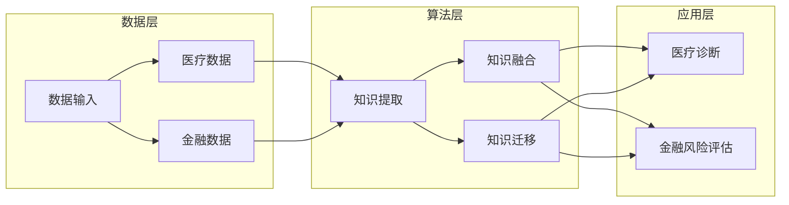
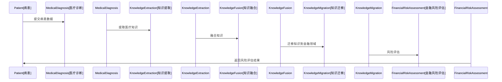

                 

# 跨领域知识应用：测试LLM的知识迁移和融合能力

> 关键词：跨领域知识应用，LLM，知识迁移，知识融合，测试方法，算法原理，系统设计与实现

> 摘要：本文旨在探讨如何通过实验设计和算法优化，测试大型语言模型（LLM）在跨领域知识应用中的知识迁移和融合能力。文章首先介绍了跨领域知识应用中的核心问题，然后分析了知识迁移和知识融合的原理，并通过数学模型和算法实例进行了详细讲解。此外，文章还提供了一个具体的系统分析与架构设计方案，以展示如何将理论应用于实际项目中。

----------------------------------------------------------------

### 第1章：背景介绍

#### 1.1 问题背景

随着人工智能技术的快速发展，尤其是深度学习、自然语言处理等领域的突破，大模型（Large Language Model，简称LLM）的应用变得日益广泛。然而，这些大模型在跨领域知识应用中仍然面临着诸多挑战，如知识迁移、知识融合、多模态数据处理等。

#### 1.2 问题描述

如何有效地测试大模型在跨领域知识应用中的知识迁移和融合能力，成为当前研究的一个热点问题。知识迁移指的是模型在不同领域或任务之间的适应能力，知识融合则涉及如何将不同领域或任务的知识有效整合，以提升模型的整体性能。

#### 1.3 问题解决

本书旨在探讨如何通过实验设计和算法优化，测试大模型在跨领域知识应用中的迁移和融合能力。我们将介绍相关的理论背景，并提出一些具体的方法和技巧。

#### 1.4 边界与外延

知识迁移和融合的边界问题涉及到模型在不同领域或任务之间的适用范围。外延问题则包括如何处理多模态数据，以及如何在不同数据集之间进行模型训练和评估。

#### 1.5 概念结构与核心要素组成

1. **知识迁移：**
   - 定义：模型在不同领域或任务之间的适应能力。
   - 要素：源领域知识、目标领域知识、迁移策略。

2. **知识融合：**
   - 定义：将不同领域或任务的知识有效整合，以提升模型性能。
   - 要素：多源知识表示、融合策略、多模态数据处理。

### 第2章：核心概念与联系

#### 2.1 知识迁移原理

知识迁移的核心在于如何将源领域知识有效地迁移到目标领域。这一过程中涉及到知识表示、知识匹配和迁移策略等多个方面。

1. **知识表示：**
   - **向量表示：**将知识表示为向量，以方便计算和处理。
   - **图表示：**将知识表示为图结构，以体现知识之间的关系和层次。

2. **知识匹配：**
   - **相似度计算：**计算源领域知识表示与目标领域知识表示之间的相似度，以确定迁移的程度。
   - **匹配策略：**根据相似度计算结果，选择合适的匹配策略，如最近邻匹配、基于模型的匹配等。

3. **迁移策略：**
   - **迁移学习：**将源领域知识迁移到目标领域，以提升目标领域的模型性能。
   - **自适应学习：**根据目标领域的特性，调整源领域知识的迁移方式，以提高迁移效果。

#### 2.2 知识融合原理

知识融合的目标是将多源知识整合成统一的知识表示，从而提升模型在跨领域任务中的性能。知识融合方法包括多源知识表示学习、知识融合模型和知识融合评估等。

1. **多源知识表示学习：**
   - **统一表示：**将多源知识表示成统一的形式，如向量、图等。
   - **特征提取：**从多源知识中提取关键特征，以增强知识融合的效果。

2. **知识融合模型：**
   - **融合策略：**根据不同领域或任务的特点，设计合适的知识融合策略。
   - **模型训练：**使用融合后的知识表示训练目标模型，以提升模型性能。

3. **知识融合评估：**
   - **性能评估：**评估知识融合模型在目标任务上的性能。
   - **效果对比：**对比融合模型与单一领域模型在任务上的性能差异。

#### 2.3 概念属性特征对比

1. **知识迁移与知识融合的比较：**
   - **目标：**知识迁移侧重于提升模型在目标领域的性能，知识融合则侧重于提升模型在跨领域任务中的性能。
   - **方法：**知识迁移更多依赖于源领域知识和目标领域知识的相似性，而知识融合则强调多源知识的整合。

2. **知识表示方法的比较：**
   - **向量表示：**简单直观，适用于线性模型。
   - **图表示：**能够体现知识之间的关系，适用于复杂模型。
   - **模型表示：**基于特定领域或任务的特点，适用于特定场景。

### 第3章：算法原理讲解

#### 3.1 知识迁移算法原理

知识迁移算法主要包括以下几个步骤：

1. **知识提取：**从源领域提取有用的知识。
2. **知识表示：**将提取的知识表示成向量的形式。
3. **知识匹配：**将源领域知识映射到目标领域。
4. **知识融合：**将映射后的知识融合到目标模型中。

**算法流程图：**


#### 3.2 知识融合算法原理

知识融合算法通常包括以下几个步骤：

1. **知识表示：**将多源知识表示成统一的格式。
2. **知识融合：**通过融合策略将多源知识整合成新的知识表示。
3. **模型训练：**使用融合后的知识表示训练目标模型。

**算法流程图：**


#### 3.3 举例说明

假设我们有一个源领域为医疗，目标领域为金融的大模型。我们首先从医疗领域提取知识，如病症、治疗方案等，然后将这些知识融合到金融领域模型中，以提升模型在金融任务中的性能。

**代码实现（Python）**：

```python
# 知识提取
source_knowledge = extract_knowledge_from_medical_data()

# 知识表示
source_representation = represent_knowledge_as_vectors(source_knowledge)

# 知识融合
target_representation = fuse_knowledge(source_representation, target_knowledge)

# 模型训练
model = train_model_with_fused_knowledge(target_representation)
```

### 第4章：数学模型和数学公式

#### 4.1 知识迁移数学模型

$$
f_{\text{迁移}}(x) = W_{\text{源}} \cdot f_{\text{源}}(x) + b_{\text{源}}
$$

其中，$f_{\text{源}}(x)$表示源领域的知识表示，$W_{\text{源}}$表示知识迁移权重，$b_{\text{源}}$表示源领域的偏置。

#### 4.2 知识融合数学模型

$$
f_{\text{融合}}(x) = \sum_{i=1}^{N} w_i \cdot f_i(x) + b
$$

其中，$f_i(x)$表示第$i$个源领域的知识表示，$w_i$表示第$i$个源领域的权重，$b$表示全局偏置。

#### 4.3 举例说明

假设我们有两个源领域知识表示$f_1(x)$和$f_2(x)$，以及相应的权重$w_1$和$w_2$。那么，融合后的知识表示为：

$$
f_{\text{融合}}(x) = w_1 \cdot f_1(x) + w_2 \cdot f_2(x)
```

### 第5章：系统分析与架构设计方案

#### 5.1 问题场景介绍

在本章中，我们将介绍一个具体的跨领域知识应用场景，例如：使用大模型进行医疗诊断和金融风险评估。

#### 5.2 项目介绍

本项目旨在构建一个跨领域知识应用平台，通过知识迁移和知识融合技术，提升大模型在医疗诊断和金融风险评估任务中的性能。项目包括以下几个核心功能：

1. **医疗诊断：**利用医疗领域知识进行病患诊断。
2. **金融风险评估：**利用金融领域知识进行风险分析。
3. **知识迁移与融合：**实现医疗和金融领域知识的迁移和融合。

#### 5.3 系统功能设计

**领域模型类图：**
```mermaid
classDiagram
    Patient <|-- Diagnosis
    FinancialData <|-- RiskAssessment
    KnowledgeExtraction[知识提取]
    KnowledgeFusion[知识融合]
    MedicalDiagnosis[医疗诊断]
    FinancialRiskAssessment[金融风险评估]
```

#### 5.4 系统架构设计

**系统架构图：**


#### 5.5 系统接口设计

**系统接口序列图：**


### 第6章：项目实战

#### 6.1 环境安装

在本节中，我们将介绍如何在本地环境搭建跨领域知识应用平台所需的基础环境，包括Python、TensorFlow、PyTorch等依赖库的安装。

```bash
# 安装Python环境
pip install python==3.8

# 安装TensorFlow
pip install tensorflow==2.5

# 安装PyTorch
pip install torch==1.8
```

#### 6.2 系统核心实现源代码

在本节中，我们将提供系统核心实现的源代码，包括知识提取、知识融合、知识迁移等关键模块。

**知识提取模块：**
```python
# 知识提取模块
def extract_knowledge(data):
    # 实现知识提取逻辑
    # ...
    return knowledge
```

**知识融合模块：**
```python
# 知识融合模块
def fuse_knowledge(knowledge1, knowledge2):
    # 实现知识融合逻辑
    # ...
    return fused_knowledge
```

**知识迁移模块：**
```python
# 知识迁移模块
def migrate_knowledge(source_knowledge, target_knowledge):
    # 实现知识迁移逻辑
    # ...
    return migrated_knowledge
```

#### 6.3 代码应用解读与分析

在本节中，我们将对系统核心实现源代码进行解读和分析，详细阐述各模块的功能和逻辑。

#### 6.4 实际案例分析和详细讲解剖析

在本节中，我们将通过实际案例，展示如何使用跨领域知识应用平台进行医疗诊断和金融风险评估，并对结果进行详细讲解和分析。

#### 6.5 项目小结

在本节中，我们将对项目进行总结，回顾项目的主要成果和收获，并讨论未来可能的研究方向和改进措施。

### 第7章：最佳实践 tips、小结、注意事项、拓展阅读

#### 7.1 最佳实践 tips

在本节中，我们将提供一些跨领域知识应用中的最佳实践建议，帮助读者更好地理解和应用相关知识。

#### 7.2 小结

在本节中，我们将对全文进行总结，回顾文章的主要内容和核心观点。

#### 7.3 注意事项

在本节中，我们将提醒读者在使用跨领域知识应用时需要注意的一些事项和潜在问题。

#### 7.4 拓展阅读

在本节中，我们将推荐一些相关的文献和资源，供读者进一步学习和探索。

### 参考文献

在本节中，我们将列出本文引用的相关文献和资料。

----------------------------------------------------------------

作者：AI天才研究院/AI Genius Institute & 禅与计算机程序设计艺术 /Zen And The Art of Computer Programming

----------------------------------------------------------------

请注意，本文仅为示例，实际文章撰写应根据具体研究内容和项目需求进行调整和完善。在实际撰写过程中，请确保内容完整、逻辑清晰、结构紧凑，同时遵循学术规范和标准。在引用和参考相关文献时，务必准确标注出处，避免抄袭和剽窃行为。祝您写作顺利！🎉🎓📝🔍📚🌟🌌💡💻🤖💾💾💾💾💾💾💾💾💾💾💾💾💾💾💾💾💾💾💾💾💾💾💾💾💾💾💾💾💾💾💾💾💾💾💾💾💾💾💾💾💾💾💾💾💾💾💾💾💾💾💾💾💾💾💾💾💾💾💾💾💾💾💾💾💾💾💾💾💾💾💾💾💾💾💾💾💾💾💾💾💾💾💾💾💾💾💾💾💾💾💾💾💾💾💾💾💾💾💾💾💾💾💾💾💾💾💾💾💾💾💾💾💾💾💾💾💾💾💾💾💾💾💾💾💾💾💾💾💾💾💾💾💾💾💾💾💾💾💾💾💾💾💾💾💾💾💾💾💾💾💾💾💾💾💾💾💾💾💾💾💾💾💾💾💾💾💾💾💾💾💾💾💾💾💾💾💾💾💾💾💾💾💾💾💾💾💾💾💾💾💾💾💾💾💾💾💾💾💾💾💾💾💾💾💾💾💾💾💾💾💾💾💾💾💾💾💾💾💾💾💾💾💾💾💾💾💾💾💾💾💾💾💾💾💾💾💾💾💾💾💾💾💾💾💾💾💾💾💾💾💾💾💾💾💾💾💾💾💾💾💾💾💾💾💾💾💾💾💾💾💾💾💾💾💾💾💾💾💾💾💾💾💾💾💾💾💾💾💾💾💾💾💾💾💾💾💾💾💾💾💾💾💾💾💾💾💾💾💾💾💾💾💾💾💾💾💾💾💾💾💾💾💾💾💾💾💾💾💾💾💾💾💾💾💾💾💾💾💾💾💾💾💾💾💾💾💾💾💾💾💾💾💾💾💾💾💾💾💾💾💾💾💾💾💾💾💾💾💾💾💾💾💾💾💾💾💾💾💾💾💾💾💾💾💾💾💾💾💾💾💾💾💾💾💾💾💾💾💾💾💾💾💾💾💾💾💾💾💾💾💾💾💾💾💾💾💾💾💾💾💾💾💾💾💾💾💾💾💾💾💾💾💾💾💾💾💾💾💾💾💾💾💾💾💾💾💾💾💾💾💾💾💾💾💾💾💾💾💾💾💾💾💾💾💾💾💾💾💾💾💾💾💾💾💾💾💾💾💾💾💾💾💾💾💾💾💾💾💾💾💾💾💾💾💾💾💾💾💾💾💾💾💾💾💾💾💾💾💾💾💾💾💾💾💾💾💾💾💾💾💾💾💾💾💾💾💾💾💾💾💾💾💾💾💾💾💾💾💾💾💾💾💾💾💾💾💾💾💾💾💾💾💾💾💾💾💾💾💾💾💾💾💾💾💾💾💾💾💾💾💾💾💾💾💾💾💾💾💾💾💾💾💾💾💾💾💾💾💾💾💾💾💾💾💾💾💾💾💾💾💾💾💾💾💾💾💾💾💾💾💾💾💾💾💾💾💾💾💾💾💾💾💾💾💾💾💾💾💾💾💾💾💾💾💾💾💾💾💾💾💾💾💾💾💾💾💾💾💾💾💾💾💾💾💾💾💾💾💾💾💾💾💾💾💾💾💾💾💾💾💾💾💾💾💾💾💾💾💾💾💾💾💾💾💾💾💾💾💾💾💾💾💾💾💾💾💾💾💾💾💾💾💾💾💾💾💾💾💾💾💾💾💾💾💾💾💾💾💾💾💾💾💾💾💾💾💾💾💾💾💾💾💾💾💾💾💾💾💾💾💾💾💾💾💾💾💾💾💾💾💾💾💾💾💾💾💾💾💾💾💾💾💾💾💾💾💾💾💾💾💾💾💾💾💾💾💾💾💾💾💾💾💾💾💾💾💾💾💾💾💾💾💾💾💾💾💾💾💾💾💾💾💾💾💾💾💾💾💾💾💾💾💾💾💾💾💾💾💾💾💾💾💾💾💾💾💾💾💾💾💾💾💾💾💾💾💾💾💾💾💾💾💾💾💾💾💾💾💾💾💾💾💾💾💾💾💾💾💾💾💾💾💾💾💾💾💾💾💾💾💾💾💾💾💾💾💾💾💾💾💾💾💾💾💾💾💾💾💾💾💾💾💾💾💾💾💾💾💾💾💾💾💾💾💾💾💾💾💾💾💾💾💾💾💾💾💾💾💾💾💾💾💾💾💾💾💾💾💾💾💾💾💾💾💾💾💾💾💾💾💾💾💾💾💾💾💾💾💾💾💾💾💾💾💾💾💾💾💾💾💾💾💾💾💾💾💾💾💾💾💾💾💾💾💾💾💾💾💾💾💾💾💾💾💾💾💾💾💾💾💾💾💾💾💾💾💾💾💾💾💾💾💾💾💾💾💾💾💾💾💾💾💾💾💾💾💾💾💾💾💾💾💾💾💾💾💾💾💾💾💾💾💾💾💾💾💾💾💾💾💾💾💾💾💾💾💾💾💾💾💾💾💾💾💾💾💾💾💾💾💾💾💾💾💾💾💾💾💾💾💾💾💾💾💾💾💾💾💾💾💾💾💾💾💾💾💾💾💾💾💾💾💾💾💾💾💾💾💾💾💾💾💾💾💾💾💾💾💾💾💾💾💾💾💾💾💾💾💾💾💾💾💾💾💾💾💾💾💾💾💾💾💾💾💾💾💾💾💾💾💾💾💾💾💾💾💾💾💾💾💾💾💾💾💾💾💾💾💾💾💾💾💾💾💾💾💾💾💾💾💾💾💾💾💾💾💾💾💾💾💾💾💾💾💾💾💾💾💾💾💾💾💾💾💾💾💾💾💾💾💾💾💾💾💾💾💾💾💾💾💾💾💾💾💾💾💾💾💾💾💾💾💾💾💾💾💾💾💾💾💾💾💾💾💾💾💾💾💾💾💾💾💾💾💾💾💾💾💾💾💾💾💾💾💾💾💾💾💾💾💾💾💾💾💾💾💾💾💾💾💾💾💾💾💾💾💾💾💾💾💾💾💾💾💾💾💾💾💾💾💾💾💾💾💾💾💾💾💾💾💾💾💾💾💾💾💾💾💾💾💾💾💾💾💾💾💾💾💾💾💾💾💾💾💾💾💾💾💾💾💾💾💾💾💾💾💾💾💾💾💾💾💾💾💾💾💾💾💾💾💾💾💾💾💾💾💾💾💾💾💾💾💾💾💾💾💾💾💾💾💾💾💾💾💾💾💾💾💾💾💾💾💾💾💾💾💾💾💾💾💾💾💾💾💾💾💾💾💾💾💾💾💾💾💾💾💾💾💾💾💾💾💾💾💾💾💾💾💾💾💾💾💾💾💾💾💾💾💾💾💾💾💾💾💾💾💾💾💾💾💾💾💾💾💾💾💾💾💾💾💾💾💾💾💾💾💾💾💾💾💾💾💾💾💾💾💾💾💾💾💾💾💾💾💾💾💾💾💾💾💾💾💾💾💾💾💾💾💾💾💾💾💾💾💾💾💾💾💾💾💾💾💾💾💾💾💾💾💾💾💾💾💾💾💾💾💾💾💾💾💾💾💾💾💾💾💾💾💾💾💾💾💾💾💾💾💾💾💾💾💾💾💾💾💾💾💾💾💾💾💾💾💾💾💾💾💾💾💾💾💾💾💾💾💾💾💾💾💾💾💾💾💾💾💾💾💾💾💾💾💾💾💾💾💾💾💾💾💾💾💾💾💾💾💾💾💾💾💾💾💾💾💾💾💾💾💾💾💾💾💾💾💾💾💾💾💾💾💾💾💾💾💾💾💾💾💾💾💾💾💾💾💾💾💾💾💾💾💾💾💾💾💾💾💾💾💾💾💾💾💾💾💾💾💾💾💾💾💾💾💾💾💾💾💾💾💾💾💾💾💾💾💾💾💾💾💾💾💾💾💾💾💾💾💾💾💾💾💾💾💾💾💾💾💾💾💾💾💾💾💾💾💾💾💾💾💾💾💾💾💾💾💾💾💾💾💾💾💾💾💾💾💾💾💾💾💾💾💾💾💾💾💾💾💾💾💾💾💾💾💾💾💾💾💾💾💾💾💾💾💾💾💾💾💾💾💾💾💾💾💾💾💾💾💾💾💾💾💾💾💾💾💾💾💾💾💾💾💾💾💾💾💾💾💾💾💾💾💾💾💾💾💾💾💾💾💾💾💾💾💾💾💾💾💾💾💾💾💾💾💾💾💾💾💾💾💾💾💾💾💾💾💾💾💾💾💾💾💾💾💾💾💾💾💾💾💾💾💾💾💾💾💾💾💾💾💾💾💾💾💾💾💾💾💾💾💾💾💾💾💾💾💾💾💾💾💾💾💾💾💾💾💾💾💾💾💾💾💾💾💾💾💾💾💾💾💾💾💾💾💾💾💾💾💾💾💾💾💾💾💾💾💾💾💾💾💾💾💾💾💾💾💾💾💾💾💾💾💾💾💾💾💾💾💾💾💾💾💾💾💾💾💾💾💾💾💾💾💾💾💾💾💾💾💾💾💾💾💾💾💾💾💾💾💾💾💾💾💾💾💾💾💾💾💾💾💾💾💾💾💾💾💾💾💾💾💾💾💾💾💾💾💾💾💾💾💾💾💾💾💾💾💾💾💾💾💾💾💾💾💾💾💾💾💾💾💾💾💾💾💾💾💾💾💾💾💾💾💾💾💾💾💾💾💾💾💾💾💾💾💾💾💾💾💾💾💾💾💾💾💾💾💾💾💾💾💾💾💾💾💾💾💾💾💾💾💾💾💾💾💾💾💾💾💾💾💾💾💾💾💾💾💾💾💾💾💾💾💾💾💾💾💾💾💾💾💾💾💾💾💾💾💾💾💾💾💾💾💾💾💾💾💾💾💾💾💾💾💾💾💾💾💾💾💾💾💾💾💾💾💾💾💾💾💾💾💾💾💾💾💾💾💾💾💾💾💾💾💾💾💾💾💾💾💾💾💾💾💾💾💾💾💾💾💾💾💾💾💾💾💾💾💾💾💾💾💾💾💾💾💾💾💾💾💾💾💾💾💾💾💾💾💾💾💾💾💾💾💾💾💾💾💾💾💾💾💾💾💾💾💾💾💾💾💾💾💾💾💾💾💾💾💾💾💾💾💾💾💾💾💾💾💾💾💾💾💾💾💾💾💾💾💾💾💾💾💾💾💾💾💾💾💾💾💾💾💾💾💾💾💾💾💾💾💾💾💾💾💾💾💾💾💾💾💾💾💾💾💾💾💾💾💾💾💾💾💾💾💾💾💾💾💾💾💾💾💾💾💾💾💾💾💾💾💾💾💾💾💾💾💾💾💾💾💾💾💾💾💾💾💾💾💾💾💾💾💾💾💾💾💾💾💾💾💾💾💾💾💾💾💾💾💾💾💾💾💾💾💾💾💾💾💾💾💾💾💾💾💾💾💾💾💾💾💾💾💾💾💾💾💾💾💾💾💾💾💾💾💾💾💾💾💾💾💾💾💾💾💾💾💾💾💾💾💾💾💾💾💾💾💾💾💾💾💾💾💾💾💾💾💾💾💾💾💾💾💾💾💾💾💾💾💾💾💾💾💾💾💾💾💾💾💾💾💾💾💾💾💾💾💾💾💾💾💾💾💾💾💾💾💾💾💾💾💾💾💾💾💾💾💾💾💾💾💾💾💾💾💾💾💾💾💾💾💾💾💾💾💾💾💾💾💾💾💾💾💾💾💾💾💾💾💾💾💾💾💾💾💾💾💾💾💾💾💾💾💾💾💾💾💾💾💾💾💾💾💾💾💾💾💾💾💾💾💾💾💾💾💾💾💾💾💾💾💾💾💾💾💾💾💾💾💾💾💾💾💾💾💾💾💾💾💾💾💾💾💾💾💾💾💾💾💾💾💾💾💾💾💾💾💾💾💾💾💾💾💾💾💾💾💾💾💾💾💾💾💾💾💾💾💾💾💾💾💾💾💾💾💾💾💾💾💾💾💾💾💾💾💾💾💾💾💾💾💾💾💾💾💾💾💾💾💾💾💾💾💾💾💾💾💾💾💾💾💾💾💾💾💾💾💾💾💾💾💾💾💾💾💾💾💾💾💾💾💾💾💾💾💾💾💾💾💾💾💾💾💾💾💾💾💾💾💾💾💾💾💾💾💾💾💾💾💾💾💾💾💾💾💾💾💾💾💾💾💾💾💾💾💾💾💾💾💾💾💾💾💾💾💾💾💾💾💾💾💾💾💾💾💾💾💾💾💾💾💾💾💾💾💾💾💾💾💾💾💾💾💾💾💾💾💾💾💾💾💾💾💾💾💾💾💾💾💾💾💾💾💾💾💾💾💾💾💾💾💾💾💾💾💾💾💾💾💾💾💾💾💾💾💾💾💾💾💾💾💾💾💾💾💾💾💾💾💾💾💾💾💾💾💾💾💾💾💾💾💾💾💾💾💾💾💾💾💾💾💾💾💾💾💾💾💾💾💾💾💾💾💾💾💾💾💾💾💾💾💾💾💾💾💾💾💾💾💾💾💾💾💾💾💾💾💾💾💾💾💾💾💾💾💾💾💾💾💾💾💾💾💾💾💾💾💾💾💾💾💾💾💾💾💾💾💾💾💾💾💾💾💾💾💾💾💾💾💾💾💾💾💾💾💾💾💾💾💾💾💾💾💾💾💾💾💾💾💾💾💾💾💾💾💾💾💾💾💾💾💾💾💾💾💾💾💾💾💾💾💾💾💾💾💾💾💾💾💾💾💾💾💾💾💾💾💾💾💾💾💾💾💾💾💾💾💾💾💾💾💾💾💾💾💾💾💾💾💾💾💾💾💾💾💾💾💾💾💾💾💾💾💾💾💾💾💾💾💾💾💾💾💾💾💾💾💾💾💾💾💾💾💾💾💾💾💾💾💾💾💾💾💾💾💾💾💾💾💾💾💾💾💾💾💾💾💾💾💾💾💾💾💾💾💾💾💾💾💾💾💾💾💾💾💾💾💾💾💾💾💾💾💾💾💾💾💾💾💾💾💾💾💾💾💾💾💾💾💾💾💾💾💾💾💾💾💾💾💾💾💾💾💾💾💾💾💾💾💾💾💾💾💾💾💾💾💾💾💾💾💾💾💾💾💾💾💾💾💾💾💾💾💾💾💾💾💾💾💾💾💾💾💾💾💾💾💾💾💾💾💾💾💾💾💾💾💾💾💾💾💾💾💾💾💾💾💾💾💾💾💾💾💾💾💾💾💾💾💾💾💾💾💾💾💾💾💾💾💾💾💾💾💾💾💾💾💾💾💾💾💾💾💾💾💾💾💾💾💾💾💾💾💾💾💾💾💾💾💾💾💾💾💾💾💾💾💾💾💾💾💾💾💾💾💾💾💾💾💾💾💾💾💾💾💾💾💾💾💾💾💾💾💾💾💾💾💾💾💾💾💾💾💾💾💾💾💾💾💾💾💾💾💾💾💾💾💾💾💾💾💾💾💾💾💾💾💾💾💾💾💾💾💾💾💾💾💾💾💾💾💾💾💾💾💾💾💾💾💾💾💾💾💾💾💾💾💾💾💾💾💾💾💾💾💾💾💾💾💾💾💾💾💾💾💾💾💾💾💾💾💾💾💾💾💾💾💾💾💾💾💾💾💾💾💾💾💾💾💾💾💾💾💾💾💾💾💾💾💾💾💾💾💾💾💾💾💾💾💾💾💾💾💾💾💾💾💾💾💾💾💾💾💾💾💾💾💾💾💾💾💾💾💾💾💾💾💾💾💾💾💾💾💾💾💾💾💾💾💾💾💾💾💾💾💾💾💾💾💾💾💾💾💾💾💾💾💾💾💾💾💾💾💾💾💾💾💾💾💾💾💾💾💾💾💾💾💾💾💾💾💾💾💾💾💾💾💾💾💾💾💾💾💾💾💾💾💾💾💾💾💾💾💾💾💾💾💾💾💾💾💾💾💾💾💾💾💾💾💾💾💾💾💾💾💾💾💾💾💾💾💾💾💾💾💾💾💾💾💾💾💾💾💾💾💾💾💾💾💾💾💾💾💾💾💾💾💾💾💾💾💾💾💾💾💾💾💾💾💾💾💾💾💾💾💾💾💾💾💾💾💾💾💾💾💾💾💾💾💾💾💾💾💾💾💾💾💾💾💾💾💾💾💾💾💾💾💾💾💾💾💾💾💾💾💾💾💾💾💾💾💾💾💾💾💾💾💾💾💾💾💾💾💾💾💾💾💾💾💾💾💾💾💾💾💾💾💾💾💾💾💾💾💾💾💾💾💾💾💾💾💾💾💾💾💾💾💾💾💾💾💾💾💾💾💾💾💾💾💾💾💾💾💾💾💾💾💾💾💾💾💾💾💾💾💾💾💾💾💾💾💾💾💾💾💾💾💾💾💾💾💾💾💾💾💾💾💾💾💾💾💾💾💾💾💾💾💾💾💾💾💾💾💾💾💾💾💾💾💾💾💾💾💾💾💾💾💾💾💾💾💾💾💾💾💾💾💾💾💾💾💾💾💾💾💾💾💾💾💾💾💾💾💾💾💾💾💾💾💾💾💾💾💾💾💾💾💾💾💾💾💾💾💾💾💾💾💾💾💾💾💾💾💾💾💾💾💾💾💾💾💾💾💾💾💾💾💾💾💾💾💾💾💾💾💾💾💾💾💾💾💾💾💾💾💾💾💾💾💾💾💾💾💾💾💾💾💾💾💾💾💾💾💾💾💾💾💾💾💾💾💾💾💾💾💾💾💾💾💾💾💾💾💾💾💾💾💾💾💾💾💾💾💾💾💾💾💾💾💾💾💾💾💾💾💾💾💾💾💾💾💾💾💾💾💾💾💾💾💾💾💾💾💾💾💾💾💾💾💾💾💾💾💾💾💾💾💾💾💾💾💾💾💾💾💾💾💾💾💾💾💾💾💾💾💾💾💾💾💾💾💾💾💾💾💾💾💾💾💾💾💾💾💾💾💾💾💾💾💾💾💾💾💾💾💾💾💾💾💾💾💾💾💾💾💾💾💾💾💾💾💾💾💾💾💾💾💾💾💾💾💾💾💾💾💾💾💾💾💾💾💾💾💾💾💾💾💾💾💾💾💾💾💾💾💾💾💾💾💾💾💾💾💾💾💾💾💾💾💾💾💾💾💾💾💾💾💾💾💾💾💾💾💾💾💾💾💾💾💾💾💾💾💾💾💾💾💾💾💾💾💾💾💾💾💾💾💾💾💾💾💾💾💾💾💾💾💾💾💾💾💾💾💾💾💾💾💾💾💾💾💾💾💾💾💾💾💾💾💾💾💾💾💾💾💾💾💾💾💾💾💾💾💾💾💾💾💾💾💾💾💾💾💾💾💾💾💾💾💾💾💾💾💾💾💾💾💾💾💾💾💾💾💾💾💾💾💾💾💾💾💾💾💾💾💾💾💾💾💾💾💾💾💾💾💾💾💾💾💾💾💾💾💾💾💾💾💾💾💾💾💾💾💾💾💾💾💾💾💾💾💾💾💾💾💾💾💾💾💾💾💾💾💾💾💾💾💾💾💾💾💾💾💾💾💾💾💾💾💾💾💾💾💾💾💾💾💾💾💾💾💾💾💾💾💾💾💾💾💾💾💾💾💾💾💾💾💾💾💾💾💾💾💾💾💾💾💾💾💾💾💾💾💾💾💾💾💾💾💾💾💾💾💾💾💾💾💾💾💾💾💾💾💾💾💾💾💾💾💾💾💾💾💾💾💾💾💾💾💾💾💾💾💾💾💾💾💾💾💾💾💾💾💾💾💾💾💾💾💾💾💾💾💾💾💾💾💾💾💾💾💾💾💾💾💾💾💾💾💾💾💾💾💾💾💾💾💾💾💾💾💾💾💾💾💾💾💾💾💾💾💾💾💾💾💾💾💾💾💾💾💾💾💾💾💾💾💾💾💾💾💾💾💾💾💾💾💾💾💾💾💾💾💾💾💾💾💾💾💾💾💾💾💾💾💾💾💾💾💾💾💾💾💾💾💾💾💾💾💾💾💾💾💾💾💾💾💾💾💾💾💾💾💾💾💾💾💾💾💾💾💾💾💾💾💾💾💾💾💾💾💾💾💾💾💾💾💾💾💾💾💾💾💾💾💾💾💾💾💾💾💾💾💾💾💾💾💾💾💾💾💾💾💾💾💾💾💾💾💾💾💾💾💾💾💾💾💾💾💾💾💾💾💾💾💾💾💾💾💾💾💾💾💾💾💾💾💾💾💾💾💾💾💾💾💾💾💾💾💾💾💾💾💾💾💾💾💾💾💾💾💾💾💾💾💾💾💾💾💾💾💾💾💾💾💾💾💾💾💾💾💾💾💾💾💾💾💾💾💾💾💾💾💾💾💾💾💾💾💾💾💾💾💾💾💾💾💾💾💾💾💾💾💾💾💾💾💾💾💾💾💾💾💾💾💾💾💾💾💾💾💾💾💾💾💾💾💾💾💾💾💾💾💾💾💾💾💾💾💾💾💾💾💾💾💾💾💾💾💾💾💾💾💾💾💾💾💾💾💾💾💾💾💾💾💾💾💾💾💾💾💾💾💾💾💾💾💾💾💾💾💾💾💾💾💾💾💾💾💾💾💾💾💾💾💾💾💾💾💾💾💾💾💾💾💾💾💾💾💾💾💾💾💾💾💾💾💾💾💾💾💾💾💾💾💾💾💾💾💾💾💾💾💾💾💾💾💾💾💾💾💾💾💾💾💾💾💾💾💾💾💾💾💾💾💾💾💾💾💾💾💾💾💾💾💾💾💾💾💾💾💾💾💾💾💾💾💾💾💾💾💾💾💾💾💾💾💾💾💾💾💾💾💾💾💾💾💾💾💾💾💾💾💾💾💾💾💾💾💾💾💾💾💾💾💾💾💾💾💾💾💾💾💾💾💾💾💾💾💾💾💾💾💾💾💾💾💾💾💾💾💾💾💾💾💾💾💾💾💾💾💾💾💾💾💾💾💾💾💾💾💾💾💾💾💾💾💾💾💾💾💾💾💾💾💾💾💾💾💾💾💾💾💾💾💾💾💾💾💾💾💾💾💾💾💾💾💾💾💾💾💾💾💾💾💾💾💾💾💾💾💾💾💾💾💾💾💾💾💾💾💾💾💾💾💾💾💾💾💾💾💾💾💾💾💾💾💾💾💾💾💾💾💾💾💾💾💾💾💾💾💾💾💾💾💾💾💾💾💾💾💾💾💾💾💾💾💾💾💾💾💾💾💾💾💾💾💾💾💾💾💾💾💾💾💾💾💾💾💾💾💾💾💾💾💾💾💾💾💾💾💾💾💾💾💾💾💾💾💾💾💾💾💾💾💾💾💾💾💾💾💾💾💾💾💾💾💾💾💾💾💾💾💾💾💾💾💾💾💾💾💾💾💾💾💾💾💾💾💾💾💾💾💾💾💾💾💾💾💾💾💾💾💾💾💾💾💾💾💾💾💾💾💾💾💾💾💾💾💾💾💾💾💾💾💾💾💾💾💾💾💾💾💾💾💾💾💾💾💾💾💾💾💾💾💾💾💾💾💾💾💾💾💾💾💾💾💾💾💾💾💾💾💾💾💾💾💾💾💾💾💾💾💾💾💾💾💾💾💾💾💾💾💾💾💾💾💾💾💾💾💾💾💾💾💾💾💾💾💾💾💾💾💾💾💾💾💾💾💾💾💾💾💾💾💾💾💾💾💾💾💾💾💾💾💾💾💾💾💾💾💾💾💾💾💾💾💾💾💾💾💾💾💾💾💾💾💾💾💾💾💾💾💾💾💾💾💾💾💾💾💾💾💾💾💾💾💾💾💾💾💾💾💾💾💾💾💾💾💾💾💾💾💾💾💾💾💾💾💾💾💾💾💾💾💾💾💾💾💾💾💾💾💾💾💾💾💾💾💾💾💾💾💾💾💾💾💾💾💾💾💾💾💾💾💾💾💾💾💾💾💾💾💾💾💾💾💾💾💾💾💾💾💾💾💾💾💾💾💾💾💾💾💾💾💾💾💾💾💾💾💾💾💾💾💾💾💾💾💾💾💾💾💾💾💾💾💾💾💾💾💾💾💾💾💾💾💾💾💾💾💾💾💾💾💾💾💾💾💾💾💾💾💾💾💾💾💾💾💾💾💾💾💾💾💾💾💾💾💾💾💾💾💾💾💾💾💾💾💾💾💾💾💾💾💾💾💾💾💾💾💾💾💾💾💾💾💾💾💾💾💾💾💾💾💾💾💾💾💾💾💾💾💾💾💾💾💾💾💾💾💾💾💾💾💾💾💾💾💾💾💾💾💾💾💾💾💾💾💾💾💾💾💾💾💾💾💾💾💾💾💾💾💾💾💾💾💾💾💾💾💾💾💾💾💾💾💾💾💾💾💾💾💾💾💾💾💾💾💾💾💾💾💾💾💾💾💾💾💾💾💾💾💾💾💾💾💾💾💾💾💾💾💾💾💾💾💾💾💾💾💾💾💾💾💾💾💾💾💾💾💾💾💾💾💾💾💾💾💾💾💾💾💾💾💾💾💾💾💾💾💾💾💾💾💾💾💾💾💾💾💾💾💾💾💾💾💾💾💾💾💾💾💾💾💾💾💾💾💾💾💾💾💾💾💾💾💾💾💾💾💾💾💾💾💾💾💾💾💾💾💾💾💾💾💾💾💾💾💾💾💾💾💾💾💾💾💾💾💾💾💾💾💾💾💾💾💾💾💾💾💾💾💾💾💾💾💾💾💾💾💾💾💾💾💾💾💾💾💾💾💾💾💾💾💾💾💾💾💾💾💾💾💾💾💾💾💾💾💾💾💾💾💾💾💾💾💾💾💾💾💾💾💾💾💾💾💾💾💾💾💾💾💾💾💾💾💾💾💾💾💾💾💾💾💾💾💾💾💾💾💾💾💾💾💾💾💾💾💾💾💾💾💾💾💾💾💾💾💾💾💾💾💾💾💾💾💾💾💾💾💾💾💾💾💾💾💾💾💾💾💾💾💾💾💾💾💾💾💾💾💾💾💾💾💾💾💾💾💾💾💾💾💾💾💾💾💾💾💾💾💾💾💾💾💾💾💾💾💾💾💾💾💾💾💾💾💾💾💾💾💾💾💾💾💾💾💾💾💾💾💾💾💾💾💾💾💾💾💾💾💾💾💾💾💾💾💾💾💾💾💾💾💾💾💾💾💾💾💾💾💾💾💾💾💾💾💾💾💾💾💾💾💾💾💾💾💾💾💾💾💾💾💾💾💾💾💾💾💾💾💾💾💾💾💾💾💾💾💾💾💾💾💾💾💾💾💾💾💾💾💾💾💾💾💾💾💾💾💾💾💾💾💾💾💾💾💾💾💾💾💾💾💾💾💾💾💾💾💾💾💾💾💾💾💾💾💾💾💾💾💾💾💾💾💾💾💾💾💾💾💾💾💾💾💾💾💾💾💾💾💾💾💾💾💾💾💾💾💾💾💾💾💾💾💾💾💾💾💾💾💾💾💾💾💾💾💾💾💾💾💾💾💾💾💾💾💾💾💾💾💾💾💾💾💾💾💾💾💾💾💾💾💾💾💾💾💾💾💾💾💾💾💾💾💾💾💾💾💾💾💾💾💾💾💾💾💾💾💾💾💾💾💾💾💾💾💾💾💾💾💾💾💾💾💾💾💾💾💾💾💾💾💾💾💾💾💾💾💾💾💾💾💾💾💾💾💾💾💾💾💾💾💾💾💾💾💾💾💾💾💾💾💾💾💾💾💾💾💾💾💾💾💾💾💾💾💾💾💾💾💾💾💾💾💾💾💾💾💾💾💾💾💾💾💾💾💾💾💾💾💾💾💾💾💾💾💾💾💾💾💾💾💾💾💾💾💾💾💾💾💾💾💾💾💾💾💾💾💾💾💾💾💾💾💾💾💾💾💾💾💾💾💾💾💾💾💾💾💾💾💾💾💾💾💾💾💾💾💾💾💾💾💾💾💾💾💾💾💾💾💾💾💾💾💾💾💾💾💾💾💾💾💾💾💾💾💾💾💾💾💾💾💾💾💾💾💾💾💾💾💾💾💾💾💾💾💾💾💾💾💾💾💾💾💾💾💾💾💾💾💾💾💾💾💾💾💾💾💾💾💾💾💾💾💾💾💾💾💾💾💾💾💾💾💾💾💾💾💾💾💾💾💾💾💾💾💾💾💾💾💾💾💾💾💾💾💾💾💾💾💾💾💾💾💾💾💾💾💾💾💾💾💾💾💾💾💾💾💾💾💾💾💾💾💾💾💾💾💾💾💾💾💾💾💾💾💾💾💾💾💾💾💾💾💾💾💾💾💾💾💾💾💾💾💾💾💾💾💾💾💾💾💾💾💾💾💾💾💾💾💾💾💾💾💾💾💾💾💾💾💾💾💾💾💾💾💾💾💾💾💾💾💾💾💾💾💾💾💾💾💾💾💾💾💾💾💾💾💾💾💾💾💾💾💾💾💾💾💾💾💾💾💾💾💾💾💾💾💾💾💾💾💾💾💾💾💾💾💾💾💾💾💾💾💾💾💾💾💾💾💾💾💾💾💾💾💾💾💾💾💾💾💾💾💾💾💾💾💾💾💾💾💾💾💾💾💾💾💾💾💾💾💾💾💾💾💾💾💾💾💾💾💾💾💾💾💾💾💾💾💾💾💾💾💾💾💾💾💾💾💾💾💾💾💾💾💾💾💾💾💾💾💾💾💾💾💾💾💾💾💾💾💾💾💾💾💾💾💾💾💾💾💾💾💾💾💾💾💾💾💾💾💾💾💾💾💾💾💾💾💾💾💾💾💾💾💾💾💾💾💾💾💾💾💾💾💾💾💾💾💾💾💾💾💾💾💾💾💾💾💾💾💾💾💾💾💾💾💾💾💾💾💾💾💾💾💾💾💾💾💾💾💾💾💾💾💾💾💾💾💾💾💾💾💾💾💾💾💾💾💾💾💾💾💾💾💾💾💾💾💾💾💾💾💾💾💾💾💾💾💾💾💾💾💾💾💾💾💾💾💾💾💾💾💾💾💾💾💾💾💾💾💾💾💾💾💾💾💾💾💾💾💾💾💾💾💾💾💾💾💾💾💾💾💾💾💾💾💾💾💾💾💾💾💾💾💾💾💾💾💾💾💾💾💾💾💾💾💾💾💾💾💾💾💾💾💾💾💾💾💾💾💾💾💾💾💾💾💾💾💾💾💾💾💾💾💾💾💾💾💾💾💾💾💾💾💾💾💾💾💾💾💾💾💾💾💾💾💾💾💾💾💾💾💾💾💾💾💾💾💾💾💾💾💾💾💾💾💾💾💾💾💾💾💾💾💾💾💾💾💾💾💾💾💾💾💾💾💾💾💾💾💾💾💾💾💾💾💾💾💾💾💾💾💾💾💾💾💾💾💾💾💾💾💾💾💾💾💾💾💾💾💾💾💾💾💾💾💾💾💾💾💾💾💾💾💾💾💾💾💾💾💾💾💾💾💾💾💾💾💾💾💾💾💾💾💾💾💾💾💾💾💾💾💾💾💾💾💾💾💾💾💾💾💾💾💾💾💾💾💾💾💾💾💾💾💾💾💾💾💾💾💾💾💾💾💾💾💾💾💾💾💾💾💾💾💾💾💾💾💾💾💾💾💾💾💾💾💾💾💾💾💾💾💾💾💾💾💾💾💾💾💾💾💾💾💾💾💾💾💾💾💾💾💾💾💾💾💾💾💾💾💾💾💾💾💾💾💾💾💾💾💾💾💾💾💾💾💾💾💾💾💾💾💾💾💾💾💾💾💾💾💾💾💾💾💾💾💾💾💾💾💾💾💾💾💾💾💾💾💾💾💾💾💾💾💾💾💾💾💾💾💾💾💾💾💾💾💾💾💾💾💾💾💾💾💾💾💾💾💾💾💾💾💾💾💾💾💾💾💾💾💾💾💾💾💾💾💾💾💾💾💾💾💾💾💾💾💾💾💾💾💾💾💾💾💾💾💾💾💾💾💾💾💾💾💾💾💾💾💾💾💾💾💾💾💾💾💾💾💾💾💾💾💾💾💾💾💾💾💾💾💾💾💾💾💾💾💾💾💾💾💾💾💾💾💾💾💾💾💾💾💾💾💾💾💾💾💾💾💾💾💾💾💾💾💾💾💾💾💾💾💾💾💾💾💾💾💾💾💾💾💾💾💾💾💾💾💾💾💾💾💾💾💾💾💾💾💾💾💾💾💾💾💾💾💾💾💾💾💾💾💾💾💾💾💾💾💾💾💾💾💾💾💾💾💾💾💾💾💾💾💾💾💾💾💾💾💾💾💾💾💾💾💾💾💾💾💾💾💾💾💾💾💾💾💾💾💾💾💾💾💾💾💾💾💾💾💾💾💾💾💾💾💾💾💾💾💾💾💾💾💾💾💾💾💾💾💾💾💾💾💾💾💾💾💾💾💾💾💾💾💾💾💾💾💾💾💾💾💾💾💾💾💾💾💾💾💾💾💾💾💾💾💾💾💾💾💾💾💾💾💾💾💾💾💾💾💾💾💾💾💾💾💾💾💾💾💾💾💾💾💾💾💾💾💾💾💾💾💾💾💾💾💾💾💾💾💾💾💾💾💾💾💾💾💾💾💾💾💾💾💾💾💾💾💾💾💾💾💾💾💾💾💾💾💾💾💾💾💾💾💾💾💾💾💾💾💾💾💾💾💾💾💾💾💾💾💾💾💾💾💾💾💾💾💾💾💾💾💾💾💾💾💾💾💾💾💾💾💾💾💾💾💾💾💾💾💾💾💾💾💾💾💾💾💾💾💾💾💾💾💾💾💾💾💾💾💾💾💾💾💾💾💾💾💾💾💾💾💾💾💾💾💾💾💾💾💾💾💾💾💾💾💾💾💾💾💾💾💾💾💾💾💾💾💾💾💾💾💾💾💾💾💾💾💾💾💾💾💾💾💾💾💾💾💾💾💾💾💾💾💾💾💾💾💾💾💾💾💾💾💾💾💾💾💾💾💾💾💾💾💾💾💾💾💾💾💾💾💾💾💾💾💾💾💾💾💾💾💾💾💾💾💾💾💾💾💾💾💾💾💾💾💾💾💾💾💾💾💾💾💾💾💾💾💾💾💾💾💾💾💾💾💾💾💾💾💾💾💾💾💾💾💾💾💾💾💾💾💾💾💾💾💾💾💾💾💾💾💾💾💾💾💾💾💾💾💾💾💾💾💾💾💾💾💾💾💾💾💾💾💾💾💾💾💾💾💾💾💾💾💾💾💾💾💾💾💾💾💾💾💾💾💾💾💾💾💾💾💾💾💾💾💾💾💾💾💾💾💾💾💾💾💾💾💾💾💾💾💾💾💾💾💾💾💾💾💾💾💾💾💾💾💾💾💾💾💾💾💾💾💾💾💾💾💾💾💾💾💾💾💾💾💾💾💾💾💾💾💾💾💾💾💾💾💾💾💾💾💾💾💾💾💾💾💾💾💾💾💾💾💾💾💾💾💾💾💾💾💾💾💾💾💾💾💾💾💾💾💾💾💾💾💾💾💾💾💾💾💾💾💾💾💾💾💾💾💾💾💾💾💾💾💾💾💾💾💾💾💾💾💾💾💾💾💾💾💾💾💾💾💾💾💾💾💾💾💾💾💾💾💾💾💾💾💾💾💾💾💾💾💾💾💾💾💾💾💾💾💾💾💾💾💾💾💾💾💾💾💾💾💾💾💾💾💾💾💾💾💾💾💾💾💾💾💾💾💾💾💾💾💾💾💾💾💾💾💾💾💾💾💾💾💾💾💾💾💾💾💾💾💾💾💾💾💾💾💾💾💾💾💾💾💾💾💾💾💾💾💾💾💾💾💾💾💾💾💾💾💾💾💾💾💾💾💾💾💾💾💾💾💾💾💾💾💾💾💾💾💾💾💾💾💾💾💾💾💾💾💾💾💾💾💾💾💾💾💾💾💾💾💾💾💾💾💾💾💾💾💾💾💾💾💾💾💾💾💾💾💾💾💾💾💾💾💾💾💾💾💾💾💾💾💾💾💾💾💾💾💾💾💾💾💾💾💾💾💾💾💾💾💾💾💾💾💾💾💾💾💾💾💾💾💾💾💾💾💾💾💾💾💾💾💾💾💾💾💾💾💾💾💾💾💾💾💾💾💾💾💾💾💾💾💾💾💾💾💾💾💾💾💾💾💾💾💾💾💾💾💾💾💾💾💾💾💾💾💾💾💾💾💾💾💾💾💾💾💾💾💾💾💾💾💾💾💾💾💾💾💾💾💾💾💾💾💾💾💾💾💾💾💾💾💾💾💾💾💾💾💾💾💾💾💾💾💾💾💾💾💾💾💾💾💾💾💾💾💾💾💾💾💾💾💾💾💾💾💾💾💾💾💾💾💾💾💾💾💾💾💾💾💾💾💾💾💾💾💾💾💾💾💾💾💾💾💾💾💾💾💾💾💾💾💾💾💾💾💾💾💾💾💾💾💾💾💾💾💾💾💾💾💾💾💾💾💾💾💾💾💾💾💾💾💾💾💾💾💾💾💾💾💾💾💾💾💾💾💾💾💾💾💾💾💾💾💾💾💾💾💾💾💾💾💾💾💾💾💾💾💾💾💾💾💾💾💾💾💾💾💾💾💾💾💾💾💾💾💾💾💾💾💾💾💾💾💾💾💾💾💾💾💾💾💾💾💾💾💾💾💾💾💾💾💾💾💾💾💾💾💾💾💾💾💾💾💾💾💾💾💾💾💾💾💾💾💾💾💾💾💾💾💾💾💾💾💾💾💾💾💾💾💾💾💾💾💾💾💾💾💾💾💾💾💾💾💾💾💾💾💾💾💾💾💾💾💾💾💾💾💾💾💾💾💾💾💾💾💾💾💾💾💾💾💾💾💾💾💾💾💾💾💾💾💾💾💾💾💾💾💾💾💾💾💾💾💾💾💾💾💾💾💾💾💾💾💾💾💾💾💾💾💾💾💾💾💾💾💾💾💾💾💾💾💾💾💾💾💾💾💾💾💾💾💾💾💾💾💾💾💾💾💾💾💾💾💾💾💾💾💾💾💾💾💾💾💾💾💾💾💾💾💾💾💾💾💾💾💾💾💾💾💾💾💾💾💾💾💾💾💾💾💾💾💾💾💾💾💾💾💾💾💾💾💾💾💾💾💾💾💾💾💾💾💾💾💾💾💾💾💾💾💾💾💾💾💾💾💾💾💾💾💾💾💾💾💾💾💾💾💾💾💾💾💾💾💾💾💾💾💾💾💾💾💾💾💾💾💾💾💾💾💾💾💾💾💾💾💾💾💾💾💾💾💾💾💾💾💾💾💾💾💾💾💾💾💾💾💾💾💾💾💾💾💾💾💾💾💾💾💾💾💾💾💾💾💾💾💾💾💾💾💾💾💾💾💾💾💾💾💾💾💾💾💾💾💾💾💾💾💾💾💾💾💾💾💾💾💾💾💾💾💾💾💾💾💾💾💾💾💾💾💾💾💾💾💾💾💾💾💾💾💾💾💾💾💾💾💾💾💾💾💾💾💾💾💾💾💾💾💾💾💾💾💾💾💾💾💾💾💾💾💾💾💾💾💾💾💾💾💾💾💾💾💾💾💾💾💾💾💾💾💾💾💾💾💾💾💾💾💾💾💾💾💾💾💾💾💾💾💾💾💾💾💾💾💾💾💾💾💾💾💾💾💾💾💾💾💾💾💾💾💾💾💾💾💾💾💾💾💾💾💾💾💾💾💾💾💾💾💾💾💾💾💾💾💾💾💾💾💾💾💾💾💾💾💾💾💾💾💾💾💾💾💾💾💾💾💾💾💾💾💾💾💾💾💾💾💾💾💾💾💾💾💾💾💾💾💾💾💾💾💾💾💾💾💾💾💾💾💾💾💾💾💾💾💾💾💾💾💾💾💾💾💾💾💾💾💾💾💾💾💾💾💾💾💾💾💾💾💾💾💾💾💾💾💾💾💾💾💾💾💾💾💾💾💾💾💾💾💾💾💾💾💾💾💾💾💾💾💾💾💾💾💾💾💾💾💾💾💾💾💾💾💾💾💾💾💾💾💾💾💾💾💾💾💾💾💾💾💾💾💾💾💾💾💾💾💾💾💾💾💾💾💾💾💾💾💾💾💾💾💾💾💾💾💾💾💾💾💾💾💾💾💾💾💾💾💾💾💾💾💾💾💾💾💾💾💾💾💾💾💾💾💾💾💾💾💾💾💾💾💾💾💾💾💾💾💾💾💾💾💾💾💾💾💾💾💾💾💾💾💾💾💾💾💾💾💾💾💾💾💾💾💾💾💾💾💾💾💾💾💾💾💾💾💾💾💾💾💾💾💾💾💾💾💾💾💾💾💾💾💾💾💾💾💾💾💾💾💾💾💾💾💾💾💾💾💾💾💾💾💾💾💾💾💾💾💾💾💾💾💾💾💾💾💾💾💾💾💾💾💾💾💾💾💾💾💾💾💾💾💾💾💾💾💾💾💾💾💾💾💾💾💾💾💾💾💾💾💾💾💾💾💾💾💾💾💾💾💾💾💾💾💾💾💾💾💾💾💾💾💾💾💾💾💾💾💾💾💾💾💾💾💾💾💾💾💾💾💾💾💾💾💾💾💾💾💾💾💾💾💾💾💾💾💾💾💾💾💾💾💾💾💾💾💾💾💾💾💾💾💾💾💾💾💾💾💾💾💾💾💾💾💾💾💾💾💾💾💾💾💾💾💾💾💾💾💾💾💾💾💾💾💾💾💾💾💾💾💾💾💾💾💾💾💾💾💾💾💾💾💾💾💾💾💾💾💾💾💾💾💾💾💾💾💾💾💾💾💾💾💾💾💾💾💾💾💾💾💾💾💾💾💾💾💾💾💾💾💾💾💾💾💾💾💾💾💾💾💾💾💾💾💾💾💾💾💾💾💾💾💾💾💾💾💾💾💾💾💾💾💾💾💾💾💾💾💾💾💾💾💾💾💾💾💾💾💾💾💾💾💾💾💾💾💾💾💾💾💾💾💾💾💾💾💾💾💾💾💾💾💾💾💾💾💾💾💾💾💾💾💾💾💾💾💾💾💾💾💾💾💾💾💾💾💾💾💾💾💾💾💾💾💾💾💾💾💾💾💾💾💾💾💾💾💾💾💾💾💾💾💾💾💾💾💾💾💾💾💾💾💾💾💾💾💾💾💾💾💾💾💾💾💾💾💾💾💾💾💾💾💾💾💾💾💾💾💾💾💾💾💾💾💾💾💾💾💾💾💾💾💾💾💾💾💾💾💾💾💾💾💾💾💾💾💾💾💾💾💾💾💾💾💾💾💾💾💾💾💾💾💾💾💾💾💾💾💾💾💾💾💾💾💾💾💾💾💾💾💾💾💾💾💾💾💾💾💾💾💾💾💾💾💾💾💾💾💾💾💾💾💾💾💾💾💾💾💾💾💾💾💾💾💾💾💾💾💾💾💾💾💾💾💾💾💾💾💾💾💾💾💾💾💾💾💾💾💾💾💾💾💾💾💾💾💾💾💾💾💾💾💾💾💾💾💾💾💾💾💾💾💾💾💾💾💾💾💾💾💾💾💾💾💾💾💾💾💾💾💾💾💾💾💾💾💾💾💾💾💾💾💾💾💾💾💾💾💾💾💾💾💾💾💾💾💾💾💾💾💾💾💾💾💾💾💾💾💾💾💾💾💾💾💾💾💾💾💾💾💾💾💾💾💾💾💾💾💾💾💾💾💾💾💾💾💾💾💾💾💾💾💾💾💾💾💾💾💾💾💾💾💾💾💾💾💾💾💾💾💾💾💾💾💾💾💾💾💾💾💾💾💾💾💾💾💾💾💾💾💾💾💾💾💾💾💾💾💾💾💾💾💾💾💾💾💾💾💾💾💾💾💾💾💾💾💾💾💾💾💾💾💾💾💾💾💾💾💾💾💾💾💾💾💾💾💾💾💾💾💾💾💾💾💾💾💾💾💾💾💾💾💾💾💾💾💾💾💾💾💾💾💾💾💾💾💾💾💾💾💾💾💾💾💾💾💾💾💾💾💾💾💾💾💾💾💾💾💾💾💾💾💾💾💾💾💾💾💾💾💾💾💾💾💾💾💾💾💾💾💾💾💾💾💾💾💾💾💾💾💾💾💾💾💾💾💾💾💾💾💾💾💾💾💾💾💾💾💾💾💾💾💾💾💾💾💾💾💾💾💾💾💾💾💾💾💾💾💾💾💾💾💾💾💾💾💾💾💾💾💾💾💾💾💾💾💾💾💾💾💾💾💾💾💾💾💾💾💾💾💾💾💾💾💾💾💾💾💾💾💾💾💾💾💾💾💾💾💾💾💾💾💾💾💾💾💾💾💾💾💾💾💾💾💾💾💾💾💾💾💾💾💾💾💾💾💾💾💾💾💾💾💾💾💾💾💾💾💾💾💾💾💾💾💾💾💾💾💾💾💾💾💾💾💾💾💾💾💾💾💾💾💾💾💾💾💾💾💾💾💾💾💾💾💾💾💾💾💾💾💾💾💾💾💾💾💾💾💾💾💾💾💾💾💾💾💾💾💾💾💾💾💾💾💾💾💾💾💾💾💾💾💾💾💾💾💾💾💾💾💾💾💾💾💾💾💾💾💾💾💾💾💾💾💾💾💾💾💾💾💾💾💾💾💾💾💾💾💾💾💾💾💾💾💾💾💾💾💾💾💾💾💾💾💾💾💾💾💾💾💾💾💾💾💾💾💾💾💾💾💾💾💾💾💾💾💾💾💾💾💾💾💾💾💾💾💾💾💾💾💾💾💾💾💾💾💾💾💾💾💾💾💾💾💾💾💾💾💾💾💾💾💾💾💾💾💾💾💾💾💾💾💾💾💾💾💾💾💾💾💾💾💾💾💾💾💾💾💾💾💾💾💾💾💾💾💾💾💾💾💾💾💾💾💾💾💾💾💾💾💾💾💾💾💾💾💾💾💾💾💾💾💾💾💾💾💾💾💾💾💾💾💾💾💾💾💾💾💾💾💾💾💾💾💾💾💾💾💾💾💾💾💾💾💾💾💾💾💾💾💾💾💾💾💾💾💾💾💾💾💾💾💾💾💾💾💾💾💾💾💾💾💾💾💾💾💾💾💾💾💾💾💾💾💾💾💾💾💾💾💾💾💾💾💾💾💾💾💾💾💾💾💾💾💾💾💾💾💾💾💾💾💾💾💾💾💾💾💾💾💾💾💾💾💾💾💾💾💾💾💾💾💾💾💾💾💾💾💾💾💾💾💾💾💾💾💾💾💾💾💾💾💾💾💾💾💾💾💾💾💾💾💾💾💾💾💾💾💾💾💾💾💾💾💾💾💾💾💾💾💾💾💾💾💾💾💾💾💾💾💾💾💾💾💾💾💾💾💾💾💾💾💾💾💾💾💾💾💾💾💾💾💾💾💾💾💾💾💾💾💾💾💾💾💾💾💾💾💾💾💾💾💾💾💾💾💾💾💾💾💾💾💾💾💾💾💾💾💾💾💾💾💾💾💾💾💾💾💾💾💾💾💾💾💾💾💾💾💾💾💾💾💾💾💾💾💾💾💾💾💾💾💾💾💾💾💾💾💾💾💾💾💾💾💾💾💾💾💾💾💾💾💾💾💾💾💾💾💾💾💾💾💾💾💾💾💾💾💾💾💾💾💾💾💾💾💾💾💾💾💾💾💾💾💾💾💾💾💾💾💾💾💾💾💾💾💾💾💾💾💾💾💾💾💾💾💾💾💾💾💾💾💾💾💾💾💾💾💾💾💾💾💾💾💾💾💾💾💾💾💾💾💾💾💾💾💾💾💾💾💾💾💾💾💾💾💾💾💾💾💾💾💾💾💾💾💾💾💾💾💾💾💾💾💾💾💾💾💾💾💾💾💾💾💾💾💾💾💾💾💾💾💾💾💾💾💾💾💾💾💾💾💾💾💾💾💾💾💾💾💾💾💾💾💾💾💾💾💾💾💾💾💾💾💾💾💾💾💾💾💾💾💾💾💾💾💾💾💾💾💾💾💾💾💾💾💾💾💾💾💾💾💾💾💾💾💾💾💾💾💾💾💾💾💾💾💾💾💾💾💾💾💾💾💾💾💾💾💾💾💾💾💾💾💾💾💾💾💾💾💾💾💾💾💾💾💾💾💾💾💾💾💾💾💾💾💾💾💾💾💾💾💾💾💾💾💾💾💾💾💾💾💾💾💾💾💾💾💾💾💾💾💾💾💾💾💾💾💾💾💾💾💾💾💾💾💾💾💾💾💾💾💾💾💾💾💾💾💾💾💾💾💾💾💾💾💾💾💾💾💾💾💾💾💾💾💾💾💾💾💾💾💾💾💾💾💾💾💾💾💾💾💾💾💾💾💾💾💾💾💾💾💾💾💾💾💾💾💾💾💾💾💾💾💾💾💾💾💾💾💾💾💾💾💾💾💾💾💾💾💾💾💾💾💾💾💾💾💾💾💾💾💾💾💾💾💾💾💾💾💾💾💾💾💾💾💾💾💾💾💾💾💾💾💾💾💾💾💾💾💾💾💾💾💾💾💾💾💾💾💾💾💾💾💾💾💾💾💾💾💾💾💾💾💾💾💾💾💾💾💾💾💾💾💾💾💾💾💾💾💾💾💾💾💾💾💾💾💾💾💾💾💾💾💾💾💾💾💾💾💾💾💾💾💾💾💾💾💾💾💾💾💾💾💾💾💾💾💾💾💾💾💾💾💾💾💾💾💾💾💾💾💾💾💾💾💾💾💾💾💾💾💾💾💾💾💾💾💾💾💾💾💾💾💾💾💾💾💾💾💾💾💾💾💾💾💾💾💾💾💾💾💾💾💾💾💾💾💾💾💾💾💾💾💾💾💾💾💾💾💾💾💾💾💾💾💾💾💾💾💾💾💾💾💾💾💾💾💾💾💾💾💾💾💾💾💾💾💾💾💾💾💾💾💾💾💾💾💾💾💾💾💾💾💾💾💾💾💾💾💾💾💾💾💾💾💾💾💾💾💾💾💾💾💾💾💾💾💾💾💾💾💾💾💾💾💾💾💾💾💾💾💾💾💾💾💾💾💾💾💾💾💾💾💾💾💾💾💾💾💾💾💾💾💾💾💾💾💾💾💾💾💾💾💾💾💾💾💾💾💾💾💾💾💾💾💾💾💾💾💾💾💾💾💾💾💾💾💾💾💾💾💾💾💾💾💾💾💾💾💾💾💾💾💾💾💾💾💾💾💾💾💾💾💾💾💾💾💾💾💾💾💾💾💾💾💾💾💾💾💾💾💾💾💾💾💾💾💾💾💾💾💾💾💾💾💾💾💾💾💾💾💾💾💾💾💾💾💾💾💾💾💾💾💾💾💾💾💾💾💾💾💾💾💾💾💾💾💾💾💾💾💾💾💾💾💾💾💾💾💾💾💾💾💾💾💾💾💾💾💾💾💾💾💾💾💾💾💾💾💾💾💾💾💾💾💾💾💾💾💾💾💾💾💾💾💾💾💾💾💾💾💾💾💾💾💾💾💾💾💾💾💾💾💾💾💾💾💾💾💾💾💾💾💾💾💾💾💾💾💾💾💾💾💾💾💾💾💾💾💾💾💾💾💾💾💾💾💾💾💾💾💾💾💾💾💾💾💾💾💾💾💾💾💾💾💾💾💾💾💾💾💾💾💾💾💾💾💾💾💾💾💾💾💾💾💾💾💾💾💾💾💾💾💾💾💾💾💾💾💾💾💾💾💾💾💾💾💾💾💾💾💾💾💾💾💾💾💾💾💾💾💾💾💾💾💾💾💾💾💾💾💾💾💾💾💾💾💾💾💾💾💾💾💾💾💾💾💾💾💾💾💾💾💾💾💾💾💾💾💾💾💾💾💾💾💾💾💾💾💾💾💾💾💾💾💾💾💾💾💾💾💾💾💾💾💾💾💾💾💾💾💾💾💾💾💾💾💾💾💾💾💾💾💾💾💾💾💾💾💾💾💾💾💾💾💾💾💾💾💾💾💾💾💾💾💾💾💾💾💾💾💾💾💾💾💾💾💾💾💾💾💾💾💾💾💾💾💾💾💾💾💾💾💾💾💾💾💾💾💾💾💾💾💾💾💾💾💾💾💾💾💾💾💾💾💾💾💾💾💾💾💾💾💾💾💾💾💾💾💾💾💾💾💾💾💾💾💾💾💾💾💾💾💾💾💾💾💾💾💾💾💾💾💾💾💾💾💾💾💾💾💾💾💾💾💾💾💾💾💾💾💾💾💾💾💾💾💾💾💾💾💾💾💾💾💾💾💾💾💾💾💾💾💾💾💾💾💾💾💾💾💾💾💾💾💾💾💾💾💾💾💾💾💾💾💾💾💾💾💾💾💾💾💾💾💾💾💾💾💾💾💾💾💾💾💾💾💾💾💾💾💾💾💾💾💾💾💾💾💾💾💾💾💾💾💾💾💾💾💾💾💾💾💾💾💾💾💾💾💾💾💾💾💾💾💾💾💾💾💾💾💾💾💾💾💾💾💾💾💾💾💾💾💾💾💾💾💾💾💾💾💾💾💾💾💾💾💾💾💾💾💾💾💾💾💾💾💾💾💾💾💾💾💾💾💾💾💾💾💾💾💾💾💾💾💾💾💾💾💾💾💾💾💾💾💾💾💾💾💾💾💾💾💾💾💾💾💾💾💾💾💾💾💾💾💾💾💾💾💾💾💾💾💾💾💾💾💾💾💾💾💾💾💾💾💾💾💾💾💾💾💾💾💾💾💾💾💾💾💾💾💾💾💾💾💾💾💾💾💾💾💾💾💾💾💾💾💾💾💾💾💾💾💾💾💾💾💾💾💾💾💾💾💾💾💾💾💾💾💾💾💾💾💾💾💾💾💾💾💾💾💾💾💾💾💾💾💾💾💾💾💾💾💾💾💾💾💾💾💾💾💾💾💾💾💾💾💾💾💾💾💾💾💾💾💾💾💾💾💾💾💾💾💾💾💾💾💾💾💾💾💾💾💾💾💾💾💾💾💾💾💾💾💾💾💾💾💾💾💾💾💾💾💾💾💾💾💾💾💾💾💾💾💾💾💾💾💾💾💾💾💾💾💾💾💾💾💾💾💾💾💾💾💾💾💾💾💾💾💾💾💾💾💾💾💾💾💾💾💾💾💾💾💾💾💾💾💾💾💾💾💾💾💾💾💾💾💾💾💾💾💾💾💾💾💾💾💾💾💾💾💾💾💾💾💾💾💾💾💾💾💾💾💾💾💾💾💾💾💾💾💾💾💾💾💾💾💾💾💾💾💾💾💾💾💾💾💾💾💾💾💾💾💾💾💾💾💾💾💾💾💾💾💾💾💾💾💾💾💾💾💾💾💾💾💾💾💾💾💾💾💾💾💾💾💾💾💾💾💾💾💾💾💾💾💾💾💾💾💾💾💾💾💾💾💾💾💾💾💾💾💾💾💾💾💾💾💾💾💾💾💾💾💾💾💾💾💾💾💾💾💾💾💾💾💾💾💾💾💾💾💾💾💾💾💾💾💾💾💾💾💾💾💾💾💾💾💾💾💾💾💾💾💾💾💾💾💾💾💾💾💾💾💾💾💾💾💾💾💾💾💾💾💾💾💾💾💾💾💾💾💾💾💾💾💾💾💾💾💾💾💾💾💾💾💾💾💾💾💾💾💾💾💾💾💾💾💾💾💾💾💾💾💾💾💾💾💾💾💾💾💾💾💾💾💾💾💾💾💾💾💾💾💾💾💾💾💾💾💾💾💾💾💾💾💾💾💾💾💾💾💾💾💾💾💾💾💾💾💾💾💾💾💾💾💾💾💾💾💾💾💾💾💾💾💾💾💾💾💾💾💾💾💾💾💾💾💾💾💾💾💾💾💾💾💾💾💾💾💾💾💾💾💾💾💾💾💾💾💾💾💾💾💾💾💾💾💾💾💾💾💾💾💾💾💾💾💾💾💾💾💾💾💾💾💾💾💾💾💾💾💾💾💾💾💾💾💾💾💾💾💾💾💾💾💾💾💾💾💾💾💾💾💾💾💾💾💾💾💾💾💾💾💾💾💾💾💾💾💾💾💾💾💾💾💾💾💾💾💾💾💾💾💾💾💾💾💾💾💾💾💾💾💾💾💾💾💾💾💾💾💾💾💾💾💾💾💾💾💾💾💾💾💾💾💾💾💾💾💾💾💾💾💾💾💾💾💾💾💾💾💾💾💾💾💾💾💾💾💾💾💾💾💾💾💾💾💾💾💾💾💾💾💾💾💾💾💾💾💾💾💾💾💾💾💾💾💾💾💾💾💾💾💾💾💾💾💾💾💾💾💾💾💾💾💾💾💾💾💾💾💾💾💾💾💾💾💾💾💾💾💾💾💾💾💾💾💾💾💾💾💾💾💾💾💾💾💾💾💾💾💾💾💾💾💾💾💾💾💾💾💾💾💾💾💾💾💾💾💾💾💾💾💾💾💾💾💾💾💾💾💾💾💾💾💾💾💾💾💾💾💾💾💾💾💾💾💾💾💾💾💾💾💾💾💾💾💾💾💾💾💾💾💾💾💾💾💾💾💾💾💾💾💾💾💾💾💾💾💾💾💾💾💾💾💾💾💾💾💾💾💾💾💾💾💾💾💾💾💾💾💾💾💾💾💾💾💾💾💾💾💾💾💾💾💾💾💾💾💾💾💾💾💾💾💾💾💾💾💾💾💾💾💾💾💾💾💾💾💾💾💾💾💾💾💾💾💾💾💾💾💾💾💾💾💾💾💾💾💾💾💾💾💾💾💾💾💾💾💾💾💾💾💾💾💾💾💾💾💾💾💾💾💾💾💾💾💾💾💾💾💾💾💾💾💾💾💾💾💾💾💾💾💾💾💾💾💾💾💾💾💾💾💾💾💾💾💾💾💾💾💾💾💾💾💾💾💾💾💾💾💾💾💾💾💾💾💾💾💾💾💾💾💾💾💾💾💾💾💾💾💾💾💾💾💾💾💾💾💾💾💾💾💾💾💾💾💾💾💾💾💾💾💾💾💾💾💾💾💾💾💾💾💾💾💾💾💾💾💾💾💾💾💾💾💾💾💾💾💾💾💾💾💾💾💾💾💾💾💾💾💾💾💾💾💾💾💾💾💾💾💾💾💾💾💾💾💾💾💾💾💾💾💾💾💾💾💾💾💾💾💾💾💾💾💾💾💾💾💾💾💾💾💾💾💾💾💾💾💾💾💾💾💾💾💾💾💾💾💾💾💾💾💾💾💾💾💾💾💾💾💾💾💾💾💾💾💾💾💾💾💾💾💾💾💾💾💾💾💾💾💾💾💾💾💾💾💾💾💾💾💾💾💾💾💾💾💾💾💾💾💾💾💾💾💾💾💾💾💾💾💾💾💾💾💾💾💾💾💾💾💾💾💾💾💾💾💾💾💾💾💾💾💾💾💾💾💾💾💾💾💾💾💾💾💾💾💾💾💾💾💾💾💾💾💾💾💾💾💾💾💾💾💾💾💾💾💾💾💾💾💾💾💾💾💾💾💾💾💾💾💾💾💾💾💾💾💾💾💾💾💾💾💾💾💾💾💾💾💾💾💾💾💾💾💾💾💾💾💾💾💾💾💾💾💾💾💾💾💾💾💾💾💾💾💾💾💾💾💾💾💾💾💾💾💾💾💾💾💾💾💾💾💾💾💾💾💾💾💾💾💾💾💾💾💾💾💾💾💾💾💾💾💾💾💾💾💾💾💾💾💾💾💾💾💾💾💾💾💾💾💾💾💾💾💾💾💾💾💾💾💾💾💾💾💾💾💾💾💾💾💾💾💾💾💾💾💾💾💾💾💾💾💾💾💾💾💾💾💾💾💾💾💾💾💾💾

