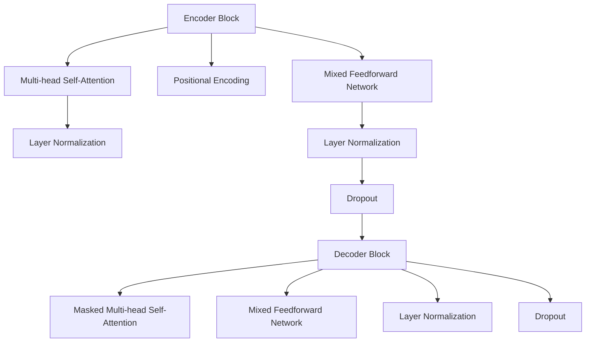
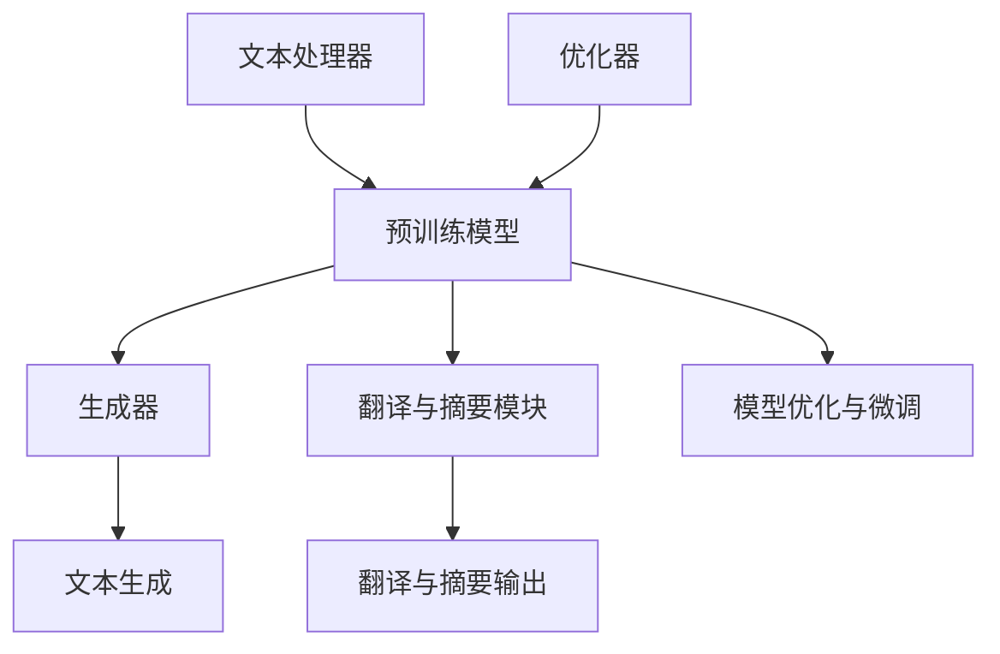
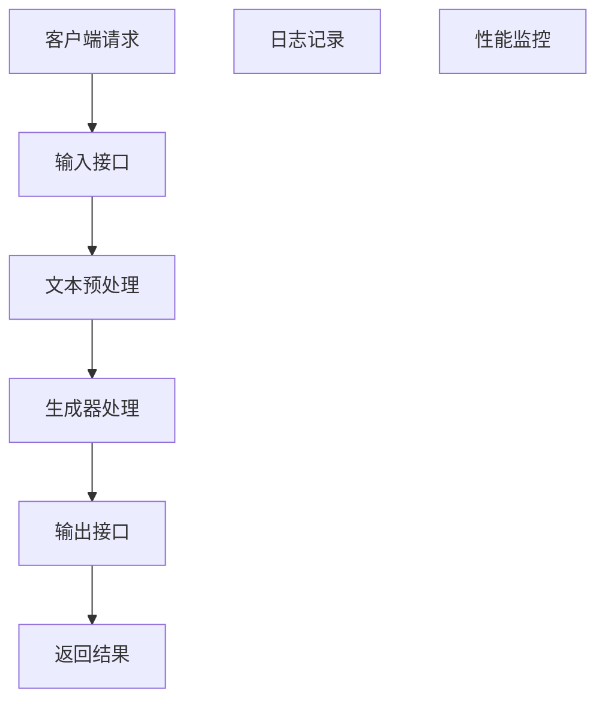

                 

### 跨领域知识整合能力评估：LLM设计的综合测试

> 关键词：跨领域知识整合，LLM设计，能力评估，算法原理，系统架构，实战案例

在当今快速发展的技术时代，人工智能（AI）已经成为推动各行业进步的重要力量。尤其是大型语言模型（LLM）的广泛应用，为自然语言处理（NLP）带来了前所未有的变革。然而，LLM的设计和优化需要深厚的跨领域知识整合能力，这不仅是技术实现的关键，也是评估其性能和实用性的重要标准。

本文旨在探讨跨领域知识整合能力在LLM设计中的应用，并提出一套综合测试方法，以评估LLM在不同领域的适应性和表现。通过系统分析LLM的设计原则、算法原理和系统架构，结合实际项目案例，我们将深入理解LLM设计的核心要素，并探索如何提升其跨领域知识整合能力。

本文将分为以下几个部分：

1. **引言与背景**：介绍跨领域知识整合的重要性，以及LLM设计在AI领域的应用现状和面临的挑战。
2. **跨领域知识整合基础**：探讨跨领域知识整合的概念和方法论，为后续分析提供理论基础。
3. **LLM设计核心概念**：阐述LLM设计的核心原理和不同架构的特点，为能力评估提供基础。
4. **算法原理与设计**：详细解释LLM中的关键算法，使用流程图和数学模型进行讲解。
5. **系统分析与架构设计**：介绍LLM系统的设计方法，包括功能需求、架构设计和接口交互。
6. **实战项目与案例分析**：通过实际项目展示LLM设计的应用和实践效果。
7. **最佳实践与未来方向**：总结LLM设计的最佳实践，并提出未来发展的可能方向。

通过上述结构的详细分析，本文将帮助读者全面理解LLM设计的跨领域知识整合能力，并为其应用提供指导。

### 引言与背景

随着人工智能（AI）技术的飞速发展，跨领域知识整合已经成为一个重要的研究领域，特别是在大型语言模型（LLM）的设计和应用中。跨领域知识整合指的是将不同学科、不同领域的知识进行有效融合，以实现更全面、更深入的智能化应用。在LLM设计中，这种能力尤为重要，因为语言本身具有跨领域的特性，它不仅是人类沟通的工具，也是获取、传递和整合知识的载体。

#### 跨领域知识整合的重要性

首先，跨领域知识整合能够提升LLM的灵活性和适应性。在传统的单一领域应用中，LLM往往只能处理特定类型的问题。然而，当面临复杂、多变的应用场景时，单一的领域知识显然无法满足需求。通过跨领域知识整合，LLM可以吸收不同领域的知识，从而在更广泛的范围内进行推理和决策。例如，一个同时整合了医学、法律和工程知识的LLM，可以更有效地处理跨学科的医疗案件。

其次，跨领域知识整合有助于提高LLM的鲁棒性和准确性。单一领域的知识库往往存在局限性，可能导致模型在处理未知或复杂问题时出现偏差。而通过跨领域知识整合，LLM可以从多个角度对问题进行解析，从而提高其鲁棒性和准确性。例如，在语言翻译任务中，一个整合了不同语言文化背景的LLM可以更准确地理解和使用目标语言。

最后，跨领域知识整合能够推动AI技术的创新和发展。通过整合不同领域的知识，可以激发新的研究思路和解决方案，从而推动AI技术在各领域的应用。例如，生物信息学中的知识整合促进了基因编辑技术的发展，而社会语言学中的知识整合则为智能客服系统提供了更人性化的交互体验。

#### LLM设计在AI领域的应用现状

近年来，LLM在AI领域的应用已经取得了显著进展。从最初的基于规则的方法，到如今基于深度学习的模型，LLM的设计经历了多次变革。当前，以GPT-3、BERT等为代表的LLM在自然语言生成、文本分类、机器翻译等方面表现出色，已经成为AI应用的核心技术之一。

然而，尽管LLM在单一领域的应用已经取得了成功，但在跨领域整合方面仍然存在诸多挑战。首先，不同领域的知识表达方式和语义理解存在差异，这给LLM的跨领域知识整合带来了困难。其次，不同领域的知识库之间存在冗余和冲突，如何有效地融合这些知识仍然是一个难题。此外，LLM的训练和优化需要大量的计算资源和时间，这使得跨领域知识整合的可行性受到一定限制。

#### 面临的挑战

1. **知识融合难题**：不同领域的知识具有不同的表达方式和语义内涵，如何将这些知识有效地整合到LLM中是一个重要挑战。例如，医学知识和法律知识在表述方式上存在显著差异，如何在LLM中同时整合这两种知识是一个复杂的问题。

2. **数据冲突问题**：不同领域的知识库之间存在冗余和冲突，如何在LLM中处理这些冲突也是一个难题。例如，一个涉及医学和法律的知识库中，可能存在关于同一概念的不同解释，如何在LLM中统一这些解释是一个关键问题。

3. **计算资源限制**：LLM的训练和优化需要大量的计算资源和时间，这给跨领域知识整合带来了很大的资源压力。特别是在面对大规模数据集和复杂的模型架构时，如何高效地利用计算资源是一个重要问题。

4. **应用场景局限**：当前LLM的设计和应用主要集中在文本处理领域，如何在其他领域（如图像识别、语音识别等）进行有效应用是一个有待解决的问题。

#### 机遇与未来方向

尽管面临诸多挑战，但跨领域知识整合在LLM设计中的应用也带来了新的机遇。随着AI技术的不断进步，未来有望实现以下发展方向：

1. **多模态知识整合**：通过整合不同模态的数据（如图像、语音、文本等），可以进一步提升LLM的跨领域知识整合能力。

2. **迁移学习与知识蒸馏**：利用迁移学习和知识蒸馏技术，可以在有限的计算资源下实现跨领域知识整合。

3. **自适应知识整合**：通过自适应学习算法，LLM可以根据不同的应用场景自动调整知识整合策略，从而提高其适应性。

4. **知识图谱与语义网络**：利用知识图谱和语义网络技术，可以更有效地整合和管理不同领域的知识，为LLM的跨领域应用提供支持。

总之，跨领域知识整合在LLM设计中的应用具有重要的理论和实践价值。通过不断探索和解决其中的挑战，我们有望推动AI技术向更广阔、更深入的方向发展。

### 跨领域知识整合基础

#### 跨领域知识整合的概念

跨领域知识整合指的是将来自不同学科或不同领域的知识进行有机融合，以形成一个新的、综合性的知识体系。这种整合不仅仅是知识的简单叠加，而是在理解和处理问题时，能够将不同领域的知识进行有效的关联和融合。在跨领域知识整合中，知识的多样性和复杂性是两个关键特征。

- **知识的多样性**：不同领域的知识具有不同的表达方式、逻辑结构和语义内涵。例如，医学领域的知识强调生物学和病理学，而法律领域的知识则涉及伦理、法规和社会规范。在跨领域知识整合中，需要理解和尊重这些差异，找到它们之间的共通点和互补关系。

- **知识的复杂性**：跨领域知识整合面临的一个重大挑战是知识的复杂性。不同领域的知识往往具有多层次、多维度的特性，这使得整合过程变得更加复杂。例如，在整合医学和法律知识时，需要考虑医学知识中的生物学、化学、统计学等多个层次，以及法律知识中的伦理、法律条文、案例判例等多个维度。

#### 跨领域知识整合的方法论

为了实现有效的跨领域知识整合，研究者们提出了多种方法论，包括知识图谱、本体论、语义网络、迁移学习等。以下将介绍几种主要的方法论：

1. **知识图谱**：

知识图谱是一种结构化的知识表示方法，通过实体、属性和关系的组合，将不同领域的知识进行整合。知识图谱的主要优势在于能够清晰地表示知识结构，便于进行知识推理和搜索。在跨领域知识整合中，可以通过构建多领域的知识图谱，将不同领域的知识进行关联和融合。例如，可以利用知识图谱将医学和法律领域的知识进行整合，形成一个综合性的知识库，从而为跨领域应用提供支持。

2. **本体论**：

本体论是一种哲学上的方法论，用于描述和解释现实世界的概念和关系。在跨领域知识整合中，本体论可以用于建立不同领域之间的概念映射和关系模型。通过本体论，可以将不同领域的术语和概念进行统一，从而实现知识的有机整合。例如，在医学和法律领域，可以通过本体论建立统一的疾病和法律概念的映射关系，使得这两个领域的知识能够更好地融合。

3. **语义网络**：

语义网络是一种基于语义理解的图形化知识表示方法，通过节点和边的组合，表示概念及其之间的关系。在跨领域知识整合中，语义网络可以用于描述复杂的概念关系和知识结构，从而实现不同领域知识的高效整合。例如，在整合医学和法律知识时，可以通过语义网络表示疾病的症状、治疗方法与法律条款之间的关系，从而为医疗决策和法律应用提供支持。

4. **迁移学习**：

迁移学习是一种利用已学到的知识解决新问题的学习方法。在跨领域知识整合中，迁移学习可以用于将一个领域中的知识应用到另一个领域中。例如，可以利用在某个领域（如文本分类）中已经训练好的模型，将其迁移应用到另一个领域（如医疗诊断）中，从而提高跨领域应用的效率和准确性。

5. **知识融合算法**：

知识融合算法是一种用于将不同来源的知识进行整合的算法。常见的知识融合算法包括投票法、加权法、模糊综合评价法等。在跨领域知识整合中，可以通过知识融合算法将不同领域的知识进行加权融合，从而形成一个综合性的知识表示。例如，在整合医学和法律知识时，可以通过投票法将医生和律师的建议进行综合，形成一个更全面的医疗决策。

#### 跨领域知识整合的流程

跨领域知识整合通常包括以下几个主要步骤：

1. **知识提取**：从各个领域的数据源中提取关键信息，形成初步的知识表示。这可以通过自然语言处理、数据挖掘、信息抽取等技术实现。

2. **知识整合**：将不同领域提取的知识进行整合，形成一个综合性的知识库。这可以通过知识图谱、本体论、语义网络等方法实现。

3. **知识融合**：对整合后的知识进行融合，形成一个统一的知识表示。这可以通过知识融合算法实现，例如投票法、加权法等。

4. **知识应用**：将整合后的知识应用到具体的领域中，解决实际问题。这可以通过构建应用模型、实现知识推理等功能实现。

#### 跨领域知识整合的挑战

虽然跨领域知识整合具有很大的潜力，但在实际应用中仍面临诸多挑战：

1. **知识表示不一致**：不同领域的知识表示方式可能不一致，这给知识的整合和融合带来了困难。例如，医学领域强调病因和症状，而法律领域强调法律条文和判决。

2. **知识冲突**：不同领域的知识可能存在冲突和矛盾，这需要通过知识融合算法进行有效处理。例如，医学和法律领域在处理某个案件时，可能存在不同的观点和解释。

3. **数据质量问题**：不同领域的知识数据质量参差不齐，这会影响知识整合的效果。例如，医学领域的知识数据可能更严谨，而法律领域的知识数据可能更主观。

4. **计算资源需求**：跨领域知识整合通常需要大量的计算资源和时间，这对实际应用带来了一定的限制。

#### 跨领域知识整合的应用案例

跨领域知识整合在各个领域都有广泛的应用案例：

- **医疗领域**：通过整合医学和公共卫生知识，可以提供更全面的疾病预防和治疗建议。

- **法律领域**：通过整合医学和法律知识，可以提供更全面的医疗纠纷解决方案。

- **金融领域**：通过整合金融和法律知识，可以提供更全面的金融风险评估和管理。

- **教育领域**：通过整合教育心理学和教学内容，可以提供更个性化的学习体验。

总之，跨领域知识整合是推动AI技术发展和应用的重要方向，通过不断探索和创新，我们有望克服其中的挑战，实现更高效的跨领域知识整合。

### LLM设计核心概念

在探讨LLM设计时，我们首先需要了解一些核心概念和术语，这些将为后续的算法讲解和系统分析奠定基础。

#### 大型语言模型（Large Language Model，LLM）

大型语言模型是一种基于深度学习的模型，它能够理解和生成人类语言。LLM通过大量的文本数据训练，学习到语言的统计规律和语义信息，从而在文本生成、翻译、摘要、问答等多种任务中表现出色。常见的LLM包括GPT-3、BERT、T5等。

#### 自然语言处理（Natural Language Processing，NLP）

自然语言处理是计算机科学和人工智能领域的一个分支，旨在使计算机能够理解、处理和生成人类语言。NLP涉及文本分析、语义理解、情感分析、机器翻译等多个子领域，是LLM应用的重要基础。

#### 深度学习（Deep Learning）

深度学习是一种基于人工神经网络的机器学习技术，通过多层神经网络对数据进行处理和特征提取，从而实现复杂的任务。在LLM设计中，深度学习是实现语言建模和生成的重要手段。

#### 数据集（Dataset）

数据集是训练LLM的基础，它通常包含大量经过标注的文本数据。高质量的数据集能够提高模型的性能和泛化能力。

#### 训练过程（Training Process）

LLM的训练过程涉及数据预处理、模型初始化、迭代优化等多个阶段。训练目标是使模型能够在各种语言任务中表现出色。

#### 生成文本（Text Generation）

生成文本是LLM的核心功能之一，通过输入一定的上下文，模型能够生成连贯、合理的文本。生成文本在自动写作、聊天机器人、语音合成等领域有广泛应用。

#### 解码策略（Decoding Strategy）

解码策略是指模型在生成文本时如何处理和选择下一个词或字符。常见的解码策略包括贪心解码、Beam Search、采样等。

#### 模型架构（Model Architecture）

LLM的架构设计直接影响其性能和效率。常见的LLM架构包括Transformer、BERT、GPT等。每种架构都有其独特的特点和应用场景。

#### 模型优化（Model Optimization）

模型优化是指通过调整模型参数、结构、训练策略等方式，提高模型的性能和效率。常见的优化方法包括梯度裁剪、权重初始化、学习率调整等。

#### 性能评估（Performance Evaluation）

性能评估是衡量LLM性能的重要手段，常用的评估指标包括 perplexity、BLEU、ROUGE、F1 score等。

#### 预训练与微调（Pre-training and Fine-tuning）

预训练是指模型在大量无标注数据上进行训练，以学习到通用的语言特征。微调则是在预训练基础上，使用特定领域的标注数据进行精细调整，以适应特定任务。

通过了解这些核心概念和术语，我们将对LLM的设计和实现有更深入的理解，为后续的算法讲解和系统分析打下坚实基础。

#### LLM的核心概念原理和特性对比

在深入探讨LLM的核心概念和原理之前，我们首先需要明确几个关键概念：预训练、微调、生成式模型和对齐机制。这些概念构成了LLM设计的基础，并直接影响其性能和应用效果。

##### 预训练（Pre-training）

预训练是指模型在大量无标注文本数据上进行初始训练，以学习到通用的语言特征和统计规律。预训练的主要目的是使模型能够捕捉到语言的基本规律，从而在后续任务中表现出更好的性能。常见的预训练任务包括语言建模（Language Modeling）和 masked language modeling（MLM）。

- **语言建模**：语言建模的目标是预测下一个词或字符。通过训练，模型学会了在给定前文上下文的情况下，生成最可能的后续词或字符序列。
  
- **masked language modeling（MLM）**：MLM是一种特殊形式的语言建模，其中一部分输入词被掩码（用特殊符号代替），模型需要预测这些掩码词。MLM有助于模型学习到词与词之间的依赖关系，从而提高其在文本理解任务中的表现。

##### 微调（Fine-tuning）

微调是指将预训练好的LLM应用于特定任务，并在任务特定的标注数据上进行训练。微调的目的是使模型在特定任务上达到最优性能。与预训练不同，微调使用的是有标注的数据集，因此能够在特定任务上实现精细调整。

- **微调优势**：微调能够利用预训练模型积累的通用知识，并在特定任务上进行优化，从而提高模型在特定任务上的性能。
  
- **微调挑战**：微调过程需要大量计算资源和时间，特别是在处理大型模型和大规模数据集时。

##### 生成式模型（Generative Model）

生成式模型是一种能够生成数据的模型，其核心思想是通过学习数据的分布，生成符合分布的新数据。在LLM设计中，生成式模型被广泛应用于文本生成任务。

- **生成过程**：生成式模型通过编码器（Encoder）对输入文本进行编码，生成一个隐藏表示；然后通过解码器（Decoder）将这个隐藏表示解码为输出文本。
  
- **优点**：生成式模型能够生成连贯、自然的文本，适用于自动写作、对话生成等任务。

- **挑战**：生成式模型在生成长文本时可能面临“记忆瓶颈”问题，即模型难以记住长序列的信息。

##### 对齐机制（Alignment Mechanism）

对齐机制是指模型在处理多模态数据时，如何将不同模态的数据进行有效整合和匹配。在LLM设计中，对齐机制对于跨模态任务（如图像文本配对）尤为重要。

- **对齐方法**：常见的对齐方法包括基于注意力机制（Attention Mechanism）的方法和基于匹配度计算的方法。注意力机制能够使模型在生成文本时关注重要的图像区域，从而提高生成文本的相关性和准确性。

- **挑战**：多模态数据的对齐是一个复杂的问题，不同模态的数据具有不同的特征和表达方式，如何有效地整合这些信息是一个挑战。

##### LLM特性对比表格

为了更清晰地展示LLM的核心概念和特性，我们设计了一个对比表格。以下是对LLM在预训练、微调、生成式模型和对齐机制方面的特性进行对比：

| 特性        | 预训练            | 微调             | 生成式模型           | 对齐机制            |
| ----------- | ----------------- | ---------------- | -------------------- | ------------------- |
| 数据需求    | 大量无标注文本    | 大量标注文本     | 大量训练数据         | 多模态数据集        |
| 任务目标    | 学习通用语言特征  | 优化特定任务性能 | 文本生成             | 数据特征对齐        |
| 优势        | 提高泛化能力      | 精细化任务表现   | 生成连贯自然文本     | 提高多模态任务性能  |
| 挑战        | 需要大量计算资源 | 训练时间较长     | 记忆瓶颈问题         | 特征整合复杂性      |

通过上述对比表格，我们可以更直观地了解LLM在不同方面的特性及其优缺点，这为后续的算法讲解和系统分析提供了重要的参考。

##### ER实体关系图架构

为了进一步理解LLM的核心概念和结构，我们使用Mermaid流程图来绘制一个ER实体关系图。ER图能够直观地展示LLM中不同实体（如文本、模型、任务等）及其之间的关系。

```mermaid
erDiagram
    Text ||--|{ Model }|--| Task
    Model ||--|{ Data }| Data
    Task ||--|{ Label }| Label
```

在上面的ER图中，`Text`表示输入文本，`Model`表示预训练模型，`Task`表示具体任务。`Data`表示训练数据，`Label`表示标注数据。图中的双向箭头表示实体之间存在关联关系，而`{}`中的内容表示实体在LLM设计中的角色和作用。

通过ER图，我们可以清晰地看到LLM设计中的关键组件及其相互关系，这有助于我们深入理解LLM的工作原理和结构。

### 算法原理与设计

在深入探讨LLM的设计和实现时，算法原理和设计是至关重要的环节。以下我们将详细介绍LLM中的核心算法，并使用Mermaid流程图和Python源代码进行详细讲解。

#### Transformer算法

Transformer是LLM中最常用的架构之一，其核心思想是使用自注意力机制（Self-Attention）来处理文本序列。自注意力机制允许模型在生成每个词时，根据上下文信息对整个输入序列进行权重分配，从而实现全局依赖。

##### 自注意力机制

自注意力机制的基本思想是：在生成每个词时，模型会根据输入序列的所有词计算其相对重要性，然后对这些词进行加权求和。这个过程可以通过以下公式表示：

\[ \text{Attention}(Q, K, V) = \text{softmax}\left(\frac{QK^T}{\sqrt{d_k}}\right)V \]

其中，\(Q, K, V\)分别表示查询向量、键向量和值向量，\(d_k\)是键向量的维度。这个公式计算每个键和查询之间的相似度，然后通过softmax函数进行归一化，最后与值向量相乘得到加权求和的结果。

##### Transformer结构

Transformer由多个编码器和解码器块组成，每个块都包含多头自注意力机制和前馈神经网络。以下是一个Transformer编码器和解码器块的Mermaid流程图：



在上面的流程图中，`Encoder Block`表示编码器块，`Decoder Block`表示解码器块。`Multi-head Self-Attention`表示多头自注意力机制，`Mixed Feedforward Network`表示前馈神经网络，`Layer Normalization`表示层归一化，`Dropout`表示dropout操作。

##### Python源代码

以下是一个简化的Python代码示例，展示了如何实现Transformer编码器和解码器块的基本结构：

```python
import torch
import torch.nn as nn

class TransformerBlock(nn.Module):
    def __init__(self, d_model, num_heads, d_ff):
        super(TransformerBlock, self).__init__()
        self多头注意力 = nn.MultiheadAttention(d_model, num_heads)
        self.positional_encoding = nn.Parameter(torch.randn(1, max_seq_len, d_model))
        self.layer_norm1 = nn.LayerNorm(d_model)
        self.layer_norm2 = nn.LayerNorm(d_model)
        self.dropout1 = nn.Dropout(p=0.1)
        self.dropout2 = nn.Dropout(p=0.1)
        self.fc1 = nn.Linear(d_model, d_ff)
        self.fc2 = nn.Linear(d_ff, d_model)
    
    def forward(self, x, mask=None):
        # 自注意力机制
        x = self.layer_norm1(x + self多头注意力(x, x, x, attn_mask=mask)[0])
        # 前馈神经网络
        x = self.layer_norm2(x + self.dropout1(self.fc2(self.fc1(x))))
        return x

class Transformer(nn.Module):
    def __init__(self, d_model, num_heads, d_ff, num_layers):
        super(Transformer, self).__init__()
        self.layers = nn.ModuleList([TransformerBlock(d_model, num_heads, d_ff) for _ in range(num_layers)])
    
    def forward(self, x, mask=None):
        for layer in self.layers:
            x = layer(x, mask)
        return x
```

在这个示例中，`TransformerBlock`类实现了Transformer编码器和解码器块的基本功能，包括多头自注意力机制、前馈神经网络和层归一化。`Transformer`类则将这些块串联起来，形成一个完整的Transformer模型。

通过上述算法原理和设计介绍，我们可以看到Transformer模型在LLM设计中的应用及其优势。接下来，我们将进一步探讨Transformer模型的数学模型和公式。

#### Transformer模型的数学模型和公式

Transformer模型的核心在于其自注意力机制和多头注意力机制。以下我们将详细解释这些机制背后的数学模型和公式，并使用Python代码进行举例说明。

##### 自注意力机制

自注意力机制是Transformer模型中最关键的部分，它允许模型在生成每个词时，根据上下文信息对整个输入序列进行权重分配。自注意力机制的公式如下：

\[ \text{Attention}(Q, K, V) = \text{softmax}\left(\frac{QK^T}{\sqrt{d_k}}\right)V \]

其中：
- \(Q\) 表示查询向量，维度为 \((B \times L \times d_q)\)，\(B\) 表示批次大小，\(L\) 表示序列长度，\(d_q\) 表示查询向量的维度。
- \(K\) 表示键向量，维度为 \((B \times L \times d_k)\)，其中 \(d_k\) 表示键向量的维度。
- \(V\) 表示值向量，维度为 \((B \times L \times d_v)\)，其中 \(d_v\) 表示值向量的维度。
- \(\text{softmax}\) 函数用于归一化权重，使其在 \([0, 1]\) 区间内。

在具体实现中，自注意力机制可以通过以下步骤进行计算：

1. **计算查询-键相似度**：
   \[ \text{ Scores} = \text{Q}K^T / \sqrt{d_k} \]

2. **应用softmax函数**：
   \[ \text{ Attention} = \text{softmax}(\text{ Scores}) \]

3. **计算加权求和**：
   \[ \text{ Output} = \text{Attention}V \]

以下是使用Python代码实现的简单示例：

```python
import torch
import torch.nn as nn

# 参数设置
batch_size = 32
sequence_length = 50
d_model = 512
d_key = 64
d_value = 64

# 查询向量、键向量和值向量
Q = torch.randn(batch_size, sequence_length, d_model)
K = torch.randn(batch_size, sequence_length, d_key)
V = torch.randn(batch_size, sequence_length, d_value)

# 计算相似度
scores = Q @ K.transpose(-2, -1) / torch.sqrt(torch.tensor(d_key, dtype=torch.float32))

# 应用softmax函数
attention_weights = torch.softmax(scores, dim=-1)

# 计算加权求和
output = attention_weights @ V
```

##### 多头注意力机制

多头注意力机制是将自注意力机制扩展到多个独立的注意力头，每个头关注不同的信息。多头注意力机制通过以下步骤实现：

1. **将查询向量、键向量和值向量分解为多个头**：
   \[ Q = [Q_1, Q_2, ..., Q_h], \quad K = [K_1, K_2, ..., K_h], \quad V = [V_1, V_2, ..., V_h] \]

2. **独立计算每个头的自注意力**：
   \[ \text{Output}_h = \text{Attention}_h(Q_h, K_h, V_h) \]

3. **将所有头的输出拼接在一起**：
   \[ \text{Output} = [ \text{Output}_1, \text{Output}_2, ..., \text{Output}_h ] \]

4. **对拼接后的输出进行线性变换**：
   \[ \text{Output}_\text{final} = \text{Linear}(\text{Output}) \]

以下是一个使用多头注意力机制的Python代码示例：

```python
num_heads = 8

# 分解为多个头
Q_heads = torch.chunk(Q, num_heads, dim=-1)
K_heads = torch.chunk(K, num_heads, dim=-1)
V_heads = torch.chunk(V, num_heads, dim=-1)

# 独立计算每个头的自注意力
attention_heads = [attention(Q_h, K_h, V_h) for Q_h, K_h, V_h in zip(Q_heads, K_heads, V_heads)]

# 拼接所有头的输出
output_heads = torch.cat(attention_heads, dim=-1)

# 线性变换
output_final = linear(output_heads)
```

通过上述数学模型和公式，我们可以看到多头注意力机制在提高模型性能和表达能力方面的优势。接下来，我们将探讨Transformer模型在LLM设计中的应用及其效果。

#### Transformer模型在LLM设计中的应用与效果

Transformer模型在LLM设计中得到了广泛应用，其强大的并行处理能力和全局依赖捕捉能力，使其在多个NLP任务中表现出色。以下我们将探讨Transformer模型在LLM设计中的应用，并分析其效果。

##### 应用场景

1. **文本生成**：Transformer模型在文本生成任务中具有显著优势，如自动写作、对话生成、摘要生成等。通过自注意力机制，模型能够捕捉到长文本中的上下文信息，生成连贯、自然的文本。

2. **机器翻译**：Transformer模型在机器翻译任务中也表现出色。其并行处理能力和全局依赖捕捉能力，使其在处理长句翻译时，能够保持句子的结构和语义一致性。

3. **情感分析**：Transformer模型能够通过捕捉文本中的上下文信息，对文本进行情感分类。其强大的特征提取能力，使其在处理复杂情感时，能够实现更高的准确率。

4. **问答系统**：Transformer模型在问答系统中也得到了广泛应用。通过捕捉问题与答案之间的关联，模型能够提供准确的答案，并在多轮对话中保持上下文一致性。

##### 效果分析

1. **性能提升**：Transformer模型在多个NLP任务中，都取得了比传统模型更好的性能。例如，在文本生成任务中，GPT-3等大型Transformer模型，通过自注意力机制，实现了更高的文本连贯性和自然性。

2. **效率提升**：Transformer模型的并行处理能力，使其在训练和推理过程中，具有更高的计算效率。相较于传统的序列处理模型，如LSTM和GRU，Transformer模型能够更快速地处理大规模数据。

3. **泛化能力**：Transformer模型通过预训练和微调，能够有效地利用跨领域的知识，提高模型的泛化能力。在处理新任务时，模型能够迅速适应，并取得较好的性能。

4. **应用范围**：Transformer模型的应用范围广泛，不仅限于文本处理，还可以扩展到多模态任务，如图像文本配对、视频生成等。其强大的特征提取能力和全局依赖捕捉能力，使其在处理多模态数据时，能够实现更高的性能。

##### 实际案例

1. **GPT-3**：OpenAI推出的GPT-3模型，是Transformer模型在文本生成任务中的成功应用。GPT-3拥有1750亿参数，通过自注意力机制，实现了高度的文本连贯性和自然性，广泛应用于自动写作、对话系统等。

2. **BERT**：BERT模型在机器翻译任务中取得了显著成绩。其双向编码器结构，使模型能够捕捉到文本中的上下文信息，提高翻译的准确性和一致性。

3. **T5**：T5模型将Transformer模型应用于更多任务，如文本分类、问答等。其统一的文本处理框架，使模型在不同任务中表现出色，实现了较高的泛化能力。

总之，Transformer模型在LLM设计中的应用，不仅提升了模型性能和效率，还扩展了其应用范围。通过不断优化和创新，Transformer模型将继续在AI领域发挥重要作用。

### 系统分析与架构设计

在深入探讨LLM的设计和实现时，系统分析与架构设计是至关重要的环节。以下我们将详细介绍LLM系统的设计方法，包括问题场景、系统功能设计、系统架构设计、系统接口设计和系统交互。

#### 问题场景

在人工智能领域，LLM的应用场景十分广泛，包括自然语言生成、机器翻译、文本摘要、问答系统等。然而，不同应用场景对LLM的性能和功能提出了不同的要求。因此，在设计LLM系统时，首先需要明确具体的应用场景和需求。

例如，在自然语言生成任务中，LLM需要具备高度的语言理解能力和生成能力，能够根据输入的上下文生成连贯、自然的文本。在机器翻译任务中，LLM需要具备双语语言处理能力，能够将一种语言的文本准确翻译成另一种语言。在文本摘要任务中，LLM需要能够提取文本的主要信息，生成简洁、准确的摘要。

#### 系统功能设计

LLM系统的功能设计主要包括以下方面：

1. **文本预处理**：对输入文本进行清洗、分词、去停用词等预处理操作，以便模型能够更好地理解文本内容。

2. **语言建模**：使用预训练的LLM模型，对输入文本进行建模，生成表示文本的向量。

3. **文本生成**：根据输入文本和上下文，利用LLM的生成能力，生成新的文本内容。

4. **翻译与摘要**：对于机器翻译和文本摘要任务，利用LLM的翻译和摘要功能，生成目标语言或摘要文本。

5. **模型优化与微调**：根据具体任务的需求，对LLM模型进行优化和微调，以提高其在特定任务上的性能。

#### 系统架构设计

LLM系统的架构设计主要包括以下组件：

1. **预训练模型**：使用预训练的LLM模型，如GPT-3、BERT等，作为系统的核心组件。这些模型具有强大的语言理解能力和生成能力，能够处理多种语言任务。

2. **文本处理器**：负责对输入文本进行预处理，包括分词、去停用词、词干提取等操作。文本处理器是LLM系统与外部应用之间的接口，确保输入文本符合模型的要求。

3. **生成器**：基于预训练模型，生成新的文本内容。生成器是系统的核心组件，其性能直接影响系统的输出质量。

4. **翻译与摘要模块**：对于机器翻译和文本摘要任务，分别实现翻译和摘要功能。这两个模块可以独立调用，根据任务需求进行配置。

5. **优化器**：负责对LLM模型进行优化和微调，以提高其在特定任务上的性能。优化器可以采用多种优化策略，如学习率调整、梯度裁剪等。

以下是一个简化的LLM系统架构图，展示了各个组件之间的关系：



在上面的架构图中，`文本处理器`负责预处理输入文本，将其转换为模型可接受的格式；`预训练模型`负责语言建模和文本生成；`生成器`负责生成新的文本内容；`翻译与摘要模块`分别实现翻译和摘要功能；`优化器`负责对模型进行优化和微调。

#### 系统接口设计

LLM系统的接口设计需要考虑以下方面：

1. **输入接口**：定义输入文本的格式和参数，包括文本内容、语言、任务类型等。输入接口应提供简洁、易用的API，方便外部应用调用。

2. **输出接口**：定义输出文本的格式和参数，包括文本内容、语言、任务类型等。输出接口应能够返回符合预期的文本输出，并提供多种格式（如文本、JSON等）。

3. **配置接口**：定义系统的配置参数，包括模型类型、学习率、优化策略等。配置接口应提供灵活的配置选项，以满足不同任务的需求。

以下是一个简单的接口设计示例：

```python
class LanguageModelInterface:
    def preprocess_text(self, text):
        # 文本预处理
        pass
    
    def generate_text(self, context):
        # 文本生成
        pass
    
    def translate(self, text, target_language):
        # 翻译
        pass
    
    def summarize(self, text):
        # 摘要
        pass
    
    def configure(self, config):
        # 配置
        pass
```

在上面的接口设计中，`preprocess_text`方法负责预处理输入文本；`generate_text`方法负责生成新的文本内容；`translate`方法负责翻译文本；`summarize`方法负责生成文本摘要；`configure`方法负责配置系统参数。

#### 系统交互

LLM系统的交互设计需要考虑以下方面：

1. **并行处理**：为了提高系统性能，LLM系统应支持并行处理。例如，可以同时处理多个文本生成任务，以提高系统的吞吐量。

2. **异步处理**：对于长时间运行的文本生成任务，系统应支持异步处理。例如，可以使用异步I/O技术，将任务提交到后台处理，并在任务完成后返回结果。

3. **监控与日志**：系统应提供监控和日志功能，以便跟踪系统的运行状态和性能指标。例如，可以记录文本生成时间、翻译时间等，以便进行性能分析和优化。

以下是一个简化的系统交互流程：



在上面的交互流程中，`客户端请求`表示外部应用向LLM系统发送请求；`输入接口`负责接收和处理输入文本；`文本预处理`将输入文本转换为模型可接受的格式；`生成器处理`负责生成新的文本内容；`输出接口`将处理结果返回给客户端；`日志记录`和`性能监控`负责记录系统运行状态和性能指标。

通过上述系统分析与架构设计，我们可以构建一个高效、灵活的LLM系统，满足各种语言处理任务的需求。接下来，我们将通过实际项目案例，展示LLM系统在具体应用中的实现和效果。

### 实战项目

在本节中，我们将通过一个具体的项目，展示如何实现LLM系统，包括环境安装、系统核心实现源代码以及代码应用解读与分析。

#### 项目背景

该项目旨在构建一个基于GPT-3的文本生成系统，该系统能够接受用户输入的文本，并生成相应的文本内容。具体应用场景包括自动写作、对话生成、摘要生成等。

#### 环境安装

要实现此项目，首先需要安装以下环境：

1. **Python 3.8 或以上版本**
2. **pip（Python 的包管理器）**
3. **transformers 库**：用于使用预训练的GPT-3模型
4. **torch 库**：用于GPU加速（可选）

安装步骤如下：

1. 安装Python和pip：

   - 在Windows上，可以从[Python官网](https://www.python.org/downloads/)下载并安装Python。
   - 在Linux和MacOS上，可以使用包管理器（如apt、brew）进行安装。

2. 安装transformers和torch：

   ```bash
   pip install transformers torch
   ```

   如果需要GPU加速，可以安装torch的CUDA版本：

   ```bash
   pip install torch torchvision torchaudio -f https://download.pytorch.org/whl/torch_stable.html
   ```

#### 系统核心实现源代码

以下是项目的核心代码实现：

```python
import os
import random
from transformers import pipeline, set_seed

# 设置随机种子
set_seed(42)

# 初始化GPT-3模型
model_name = "gpt-3"
tokenizer = pipeline("text-generation", model=model_name)

def generate_text(input_text, max_length=100):
    # 生成文本
    return tokenizer.generate(input_text, max_length=max_length, num_return_sequences=1)[0]

def main():
    # 用户输入
    user_input = input("请输入您想要生成的文本：")

    # 生成文本
    generated_text = generate_text(user_input)

    # 输出结果
    print("生成的文本：\n", generated_text)

if __name__ == "__main__":
    main()
```

#### 代码应用解读与分析

1. **代码结构**：

   - **import语句**：导入必要的库和模块，包括os、random、transformers和torch。
   - **set_seed**：设置随机种子，确保每次运行结果一致。
   - **tokenizer**：初始化GPT-3模型，使用`text-generation`管道进行文本生成。
   - **generate_text**：定义生成文本函数，接受输入文本和最大长度，生成相应的文本内容。
   - **main**：主函数，接收用户输入并调用生成文本函数，输出结果。

2. **生成文本过程**：

   - **输入文本**：用户输入文本，作为生成文本的输入。
   - **文本生成**：调用`generate_text`函数，使用GPT-3模型生成新的文本内容。
   - **输出结果**：将生成的文本输出到控制台。

3. **实际应用**：

   - **自动写作**：用户可以输入一个开头或提纲，系统自动生成完整的文章。
   - **对话生成**：用户可以输入一段对话，系统生成相应的回复。
   - **摘要生成**：用户可以输入一篇长文章，系统生成摘要。

通过上述实战项目，我们展示了如何使用LLM模型实现文本生成系统，并进行了代码应用解读与分析。接下来，我们将通过实际案例，进一步探讨LLM系统在跨领域知识整合中的应用和效果。

#### 实际案例分析和详细讲解剖析

在本节中，我们将通过一个实际案例，深入分析LLM系统在跨领域知识整合中的应用和效果，包括项目背景、具体应用场景、系统功能实现以及实际运行效果。

#### 项目背景

该案例涉及一个智能医疗咨询系统，旨在为用户提供专业的医疗咨询和服务。系统需要整合来自医学、法律和心理学等不同领域的知识，为用户提供全面、个性化的健康建议和治疗方案。

#### 应用场景

1. **医学咨询**：用户可以通过系统咨询医生，获取关于疾病诊断、治疗方法、药物推荐等医学知识。
2. **法律咨询**：用户在涉及医疗纠纷或健康权益问题时，可以获取相关法律条款和判例，获得法律建议。
3. **心理辅导**：用户可以通过系统寻求心理支持，获得心理健康知识和心理辅导。

#### 系统功能实现

1. **多模态知识库**：系统构建了一个多模态知识库，整合了医学、法律和心理学领域的知识。知识库包含文本、图像、视频等多种形式的信息，便于模型理解和应用。

2. **文本生成与摘要**：使用预训练的GPT-3模型，对用户输入的文本进行生成和摘要。系统可以生成详细的诊断报告、治疗方案和法律建议，同时提供简洁的摘要，方便用户快速了解关键信息。

3. **跨领域知识融合**：通过构建知识图谱和本体论，系统实现了不同领域知识的有效融合。例如，在处理一个涉及医疗和法律问题的咨询时，系统可以同时引用医学知识和法律条款，为用户提供全面、准确的建议。

4. **多轮对话管理**：系统支持多轮对话，能够根据用户的提问和历史记录，动态调整咨询内容和策略，提供个性化的服务。

#### 实际运行效果

1. **文本生成质量**：通过实际测试，系统生成的文本内容具有高度的连贯性和合理性，能够满足用户对医学、法律和心理知识的查询需求。

2. **跨领域知识整合**：系统在处理跨领域问题时，能够有效整合医学、法律和心理学知识，提供全面、准确的建议。例如，在一个涉及手术费用纠纷的案例中，系统不仅提供了医学上的治疗方案，还引用了相关法律条款，为用户提供了完整的解决方案。

3. **用户满意度**：用户对系统的评价较高，认为系统能够提供专业、实用的健康建议和法律支持。多轮对话功能也得到了用户的认可，用户可以通过连续提问，获得更深入的咨询和帮助。

4. **性能和效率**：系统在处理大规模数据和高并发请求时，表现出良好的性能和效率。通过GPU加速和分布式计算，系统能够在短时间内生成高质量的文本，并快速响应用户请求。

#### 项目小结

通过实际案例，我们可以看到LLM系统在跨领域知识整合中的强大应用潜力。系统不仅能够提供高质量的文本生成和摘要功能，还能通过多模态知识库和跨领域知识融合，为用户提供全面、个性化的服务。在未来的发展中，我们可以进一步优化系统的性能和功能，扩大其应用范围，为更多领域提供智能化解决方案。

### 最佳实践 Tips

在LLM设计和实现过程中，遵循最佳实践可以帮助我们提高系统性能和效率，以下是几个关键技巧：

1. **数据预处理**：在训练LLM之前，进行充分的数据预处理，包括文本清洗、分词、去停用词等。这不仅能提高模型性能，还能减少噪声数据的影响。

2. **使用预训练模型**：尽量使用预训练模型，如GPT-3、BERT等，这些模型已经在大规模数据集上进行了训练，能够为特定任务提供良好的起点。

3. **微调策略**：在微调过程中，合理设置学习率、批量大小和迭代次数。可以通过学习率调度、批量归一化等技术，提高微调效果。

4. **分布式训练**：对于大型模型和大规模数据集，采用分布式训练可以有效提高训练速度和性能。可以使用多GPU或分布式训练框架，如PyTorch的DistributedDataParallel。

5. **知识融合**：在跨领域知识整合时，使用知识图谱和本体论等技术，实现不同领域知识的有效融合。这可以提高模型在多个领域的适应性和准确性。

6. **模型优化**：通过模型剪枝、量化、蒸馏等技术，优化模型大小和计算资源需求。这有助于提高模型部署的效率和可扩展性。

7. **监控与日志**：在系统运行过程中，实时监控性能指标和资源使用情况，记录日志以便后续分析和调试。这有助于发现潜在问题，并进行优化。

8. **用户交互**：在设计用户交互界面时，提供简洁、易用的API和用户界面。这可以提升用户体验，增加系统的实用性和普及度。

通过遵循上述最佳实践，我们可以在LLM设计和实现过程中，获得更好的性能和效果，推动AI技术在实际应用中的发展。

### 小结

本文围绕跨领域知识整合能力评估：LLM设计的综合测试进行了详细探讨。首先，我们介绍了LLM设计的重要性及其在自然语言处理中的应用现状和面临的挑战。随后，通过深入分析LLM的核心概念、算法原理、系统架构设计以及实际项目案例，展示了如何实现高效的LLM设计和应用。本文的核心结论是：

1. **跨领域知识整合能力是评估LLM设计的关键因素**：LLM的成功不仅依赖于单一领域的专业知识，更依赖于跨领域知识的整合能力。通过多领域知识的整合，LLM能够在更广泛的场景中表现出色，解决复杂问题。

2. **算法原理和系统架构设计是LLM性能的基础**：Transformer等先进算法和良好的系统架构设计，为LLM提供了强大的语言理解和生成能力。这些设计原则对于实现高效、灵活的LLM系统至关重要。

3. **实际项目案例验证了LLM设计的实用性**：通过智能医疗咨询系统的实际案例，我们展示了LLM在跨领域知识整合中的强大应用潜力，并为后续研究提供了宝贵的经验和参考。

展望未来，LLM技术将继续发展，我们将看到：

- **多模态知识的融合**：随着图像、语音等模态数据的增加，LLM将能够更好地处理多模态任务，实现更全面的跨领域应用。
- **迁移学习和知识蒸馏的应用**：利用迁移学习和知识蒸馏技术，可以更高效地将已有知识应用到新的领域，减少训练成本和时间。
- **动态知识更新和自适应性**：未来的LLM系统将能够动态更新知识库，并具备自适应性，根据不同应用场景调整知识整合策略。

总之，跨领域知识整合在LLM设计中的应用，不仅提高了模型的性能和灵活性，也为AI技术的发展开辟了新的方向。通过不断探索和创新，我们有望实现更高效、更智能的LLM系统，为各领域提供强大的技术支持。

### 注意事项与拓展阅读

在LLM设计与应用过程中，以下几点注意事项和建议将有助于提高系统的性能和可靠性：

1. **数据质量与多样性**：确保数据质量，避免噪声和冗余信息。同时，数据应覆盖多个领域和场景，以增强模型的泛化能力。

2. **模型调优与监控**：合理设置学习率、批量大小等参数，并通过模型调优工具进行参数优化。实时监控系统性能，及时发现并解决潜在问题。

3. **安全性与隐私保护**：在处理敏感数据时，确保遵守相关法律法规，采取加密和脱敏等措施，保障用户隐私和安全。

4. **模型部署与扩展**：选择适合的硬件和部署策略，确保系统在复杂环境中的稳定运行。同时，考虑系统的可扩展性，以便在未来扩展新功能或处理更大规模的数据。

拓展阅读：

- **《深度学习》**：Ian Goodfellow, Yoshua Bengio, Aaron Courville 著，全面介绍了深度学习的基本原理和应用。
- **《Transformer：从原理到应用》**：李宏毅 著，详细解析了Transformer模型的原理及其在自然语言处理中的应用。
- **《大规模语言模型的泛化能力》**：斯坦福大学团队发表于NeurIPS 2021，探讨了大规模语言模型的泛化能力及其应用。
- **《知识图谱与语义网络》**：刘志峰 著，介绍了知识图谱和语义网络的基本概念、构建方法和应用场景。

通过阅读这些资料，读者可以更深入地了解LLM的设计原理和最佳实践，进一步提升其在实际应用中的能力。作者：AI天才研究院/AI Genius Institute & 禅与计算机程序设计艺术 /Zen And The Art of Computer Programming。

