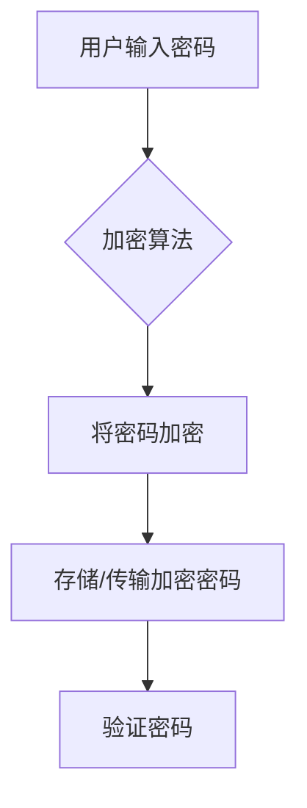
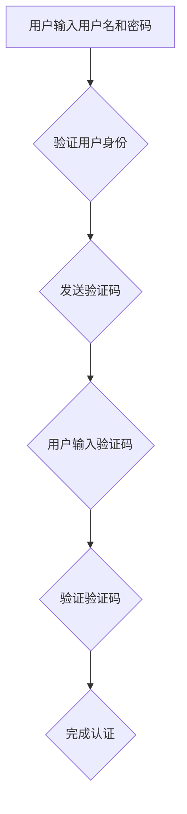
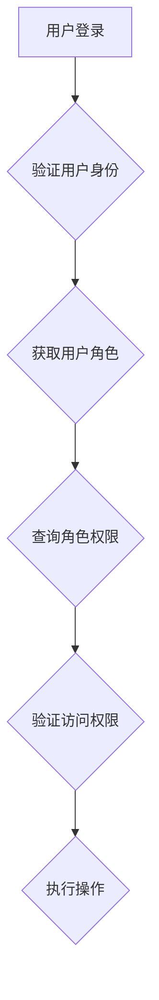
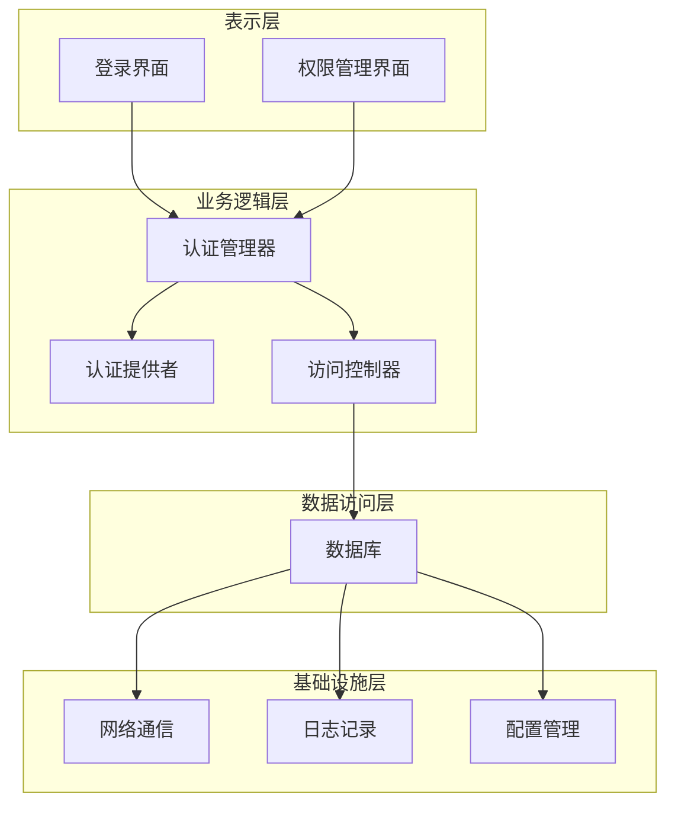
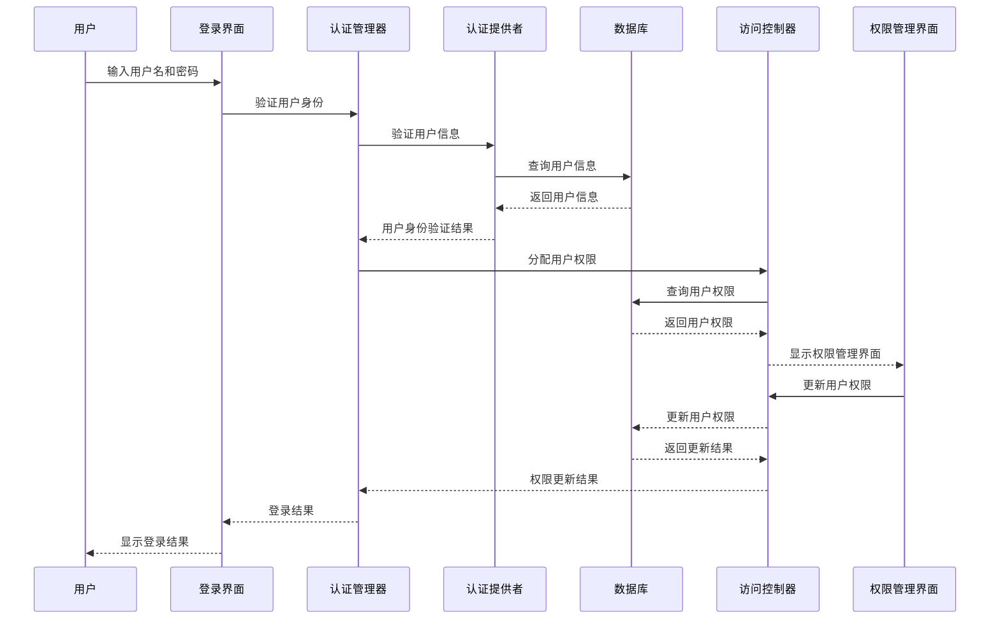

                 

# 《身份认证与授权机制的最佳实践》

关键词：身份认证、授权机制、最佳实践、安全性、用户体验

摘要：本文将深入探讨身份认证与授权机制在当今数字化时代的重要性，并分享一系列最佳实践。我们将从基础概念、理论原理、系统设计到实际项目应用，逐步分析并解答如何构建高效、安全的身份认证与授权系统。

## 引言

在信息化和互联网的飞速发展背景下，身份认证与授权机制已成为确保信息系统安全和数据隐私的关键技术。身份认证旨在验证用户身份的真实性，而授权机制则确保用户拥有适当的访问权限。本文旨在通过逻辑清晰、结构紧凑的论述，帮助读者全面理解并掌握身份认证与授权机制的最佳实践。

本文结构如下：

1. **核心概念与背景介绍**
   - 定义身份认证与授权机制
   - 介绍常见术语和概念
   - 分析当前面临的挑战

2. **核心概念与联系**
   - 使用Mermaid绘制ER图
   - 对比核心概念属性特征

3. **算法原理讲解**
   - 介绍常用的认证和授权算法
   - 使用Mermaid绘制算法流程图
   - 使用Python代码阐述算法步骤
   - 详细讲解数学模型和公式
   - 举例说明

4. **系统分析与架构设计方案**
   - 介绍问题场景和项目背景
   - 使用Mermaid绘制领域模型类图
   - 设计系统架构图
   - 绘制系统接口设计和序列图

5. **项目实战**
   - 环境安装和核心实现
   - 代码应用解读与分析
   - 实际案例分析
   - 项目小结

6. **最佳实践与注意事项**
   - 安全性最佳实践
   - 用户体验最佳实践
   - 注意事项
   - 拓展阅读

通过本文的逐步讲解，读者将能够全面了解并掌握身份认证与授权机制的最佳实践，为构建安全可靠的信息系统奠定基础。

## 核心概念与背景介绍

身份认证（Identity Authentication）与授权机制（Authorization Mechanism）是确保信息系统安全和数据隐私的基础。在数字化时代，这些机制的重要性日益凸显。

### 定义

**身份认证**：身份认证是指验证用户身份的过程，确保只有合法用户能够访问系统资源。这一过程通常涉及用户名和密码、指纹识别、面部识别、智能卡等多种验证手段。

**授权机制**：授权机制是指确定和分配用户访问权限的过程。一旦用户身份得到验证，系统需要根据用户的权限来决定他们可以访问哪些资源或执行哪些操作。授权机制确保用户只能在授权范围内操作，防止未经授权的访问和操作。

### 常见术语和概念

- **单点登录（SSO）**：单点登录允许用户使用一个账户名和密码登录多个系统，简化了用户登录过程，提高了用户体验。
- **多因素认证（MFA）**：多因素认证要求用户在登录过程中提供多种验证方式，如密码、手机验证码、指纹等，提高了安全性。
- **访问控制列表（ACL）**：访问控制列表是一种基于对象的访问控制机制，它为每个对象定义一组权限，用户根据自己的权限来访问对象。
- **角色基访问控制（RBAC）**：角色基访问控制是一种基于角色的访问控制机制，用户被分配到一个或多个角色，每个角色拥有特定的权限。

### 当前面临的挑战

- **安全性**：随着网络攻击手段的日益复杂，确保身份认证和授权机制的安全性成为首要任务。
- **用户体验**：为了确保系统的安全性，往往需要复杂的认证过程，这可能会影响用户体验。如何在确保安全的同时提高用户体验是一个重要挑战。
- **兼容性**：身份认证和授权机制需要与现有的系统和标准兼容，以便实现无缝集成。
- **可扩展性**：随着用户数量和系统规模的扩大，身份认证和授权机制需要具备良好的可扩展性。

通过理解这些核心概念和常见术语，我们可以更好地设计和实现有效的身份认证与授权机制，为构建安全可靠的信息系统奠定基础。

## 核心概念与联系

为了更清晰地理解身份认证与授权机制，我们需要探讨这些概念之间的关系，并通过Mermaid ER图和属性特征对比表格来展示其结构。

### Mermaid ER图

首先，我们使用Mermaid语言绘制一个ER图来展示身份认证与授权机制的核心实体及其关系。

```mermaid
erDiagram
    User ||--|{ AuthenticationMethod }|| Method
    User ||--|{ Role }|| Role
    Resource ||--|{ Permission }|| Perm
    Role ||--||| Group || Group
    Method ||--||| MultiFactor }|| MF
    Resource ||--||| Service }|| Service
    User ||--||| Session }|| Session
    Role ||--||| AccessPolicy }|| Policy
    Perm ||--||| PermissionSet }|| Set

    User make :has
    AuthenticationMethod make :uses
    Resource make :protected_by
    Role make :has
    Group make :has
    MultiFactor make :uses
    Service make :provided_by
    Session make :has
    AccessPolicy make :enforces
    PermissionSet make :defines
```

这段Mermaid代码生成一个实体关系图，展示了用户、认证方法、资源、角色、权限、多因素认证、服务、会话、访问策略和权限集之间的关系。

### 属性特征对比表格

接下来，我们创建一个表格来对比这些核心概念的主要属性和特征。

| 实体        | 属性                 | 特征                                                         |
|-------------|----------------------|--------------------------------------------------------------|
| **User**    | - Username           | 标识用户，唯一性，不可重复                                  |
|             | - Password           | 加密存储，保护用户身份信息                                   |
|             | - Roles              | 用户被分配的角色集合                                        |
|             | - Authentication     | 用户所使用的认证方法集合                                    |
|             | - Permissions        | 用户所拥有的权限集合                                       |
|             | - Sessions           | 用户登录系统的会话信息集合                                  |
| **Method**  | - MethodType         | 认证方法的类型，如密码、指纹、多因素认证等                   |
|             | - Validation         | 认证方法的验证方式                                         |
| **Role**    | - RoleName           | 角色的名称，标识角色类型                                   |
|             | - Description        | 角色的描述                                                 |
|             | - Permissions        | 角色所拥有的权限集合                                      |
|             | - Members            | 属于该角色的用户集合                                       |
| **Resource**| - ResourceID         | 资源的标识符，唯一性                                       |
|             | - ResourceType       | 资源的类型，如数据库、文件、服务等                         |
|             | - Permissions        | 资源所拥有的权限集合                                      |
| **Permission**| - PermissionID       | 权限的标识符，唯一性                                       |
|             | - Description        | 权限的描述                                                 |
|             | - Scope              | 权限的作用域，如读、写、执行等                             |
| **Group**   | - GroupName          | 分组名称，用于分类和管理角色和用户                         |
|             | - Members            | 组内的用户和角色的集合                                     |
| **Service** | - ServiceID          | 服务的标识符                                               |
|             | - ServiceType        | 服务的类型                                                 |
|             | - Dependencies       | 服务依赖的其他服务或资源                                   |
| **Session** | - SessionID          | 会话的标识符                                               |
|             | - User               | 当前会话的用户                                             |
|             | - StartTime          | 会话开始时间                                               |
|             | - EndTime            | 会话结束时间                                               |
| **Policy**  | - PolicyID           | 策略的标识符                                               |
|             | - Description        | 策略的描述                                                 |
|             | - Rules              | 策略包含的规则集合                                         |
| **PermissionSet**| - PermissionSetID    | 权限集的标识符                                             |
|             | - Permissions        | 权限集包含的权限集合                                       |

通过这个表格，我们可以清晰地看到各个核心概念的主要属性和特征，以及它们之间的关系。这有助于我们在实际设计和实现身份认证与授权机制时，更好地理解每个部分的功能和作用。

## 算法原理讲解

在身份认证与授权机制中，常用的算法包括密码加密、多因素认证、访问控制列表（ACL）和角色基访问控制（RBAC）。以下是这些算法的基本原理、流程图和数学模型。

### 密码加密算法

**基本原理**：密码加密算法用于保护用户密码，防止密码在传输和存储过程中被窃取。常见的加密算法有SHA-256、AES等。

**流程图**：



**Python代码**：

```python
import hashlib
import binascii

def encrypt_password(password: str) -> str:
    # 使用SHA-256加密密码
    encrypted_password = hashlib.sha256(password.encode('utf-8')).hexdigest()
    return encrypted_password

def verify_password(encrypted_password: str, input_password: str) -> bool:
    # 验证输入密码是否与加密密码匹配
    return encrypt_password(input_password) == encrypted_password

# 示例
password = "password123"
encrypted_password = encrypt_password(password)
print(f"Encrypted Password: {encrypted_password}")

input_password = input("Enter Password: ")
if verify_password(encrypted_password, input_password):
    print("Password is correct.")
else:
    print("Password is incorrect.")
```

**数学模型**：密码加密算法通常涉及哈希函数，其数学模型可以表示为：\( H(P) = C \)，其中 \( H \) 是哈希函数，\( P \) 是明文密码，\( C \) 是加密后的密码。

### 多因素认证算法

**基本原理**：多因素认证通过结合多种验证方式，如密码、手机验证码、指纹、面部识别等，提高安全性。

**流程图**：



**Python代码**（假设使用发送验证码API）：

```python
import random
import string

def send_verification_code(phone_number: str) -> str:
    # 生成6位验证码
    verification_code = ''.join(random.choices(string.digits, k=6))
    # 使用API发送验证码（这里为示例，实际应用需要调用具体的发送服务）
    print(f"Verification code sent to {phone_number}: {verification_code}")
    return verification_code

def verify_phone_number(phone_number: str, input_code: str) -> bool:
    # 验证输入验证码是否正确
    code = send_verification_code(phone_number)
    return input_code == code

# 示例
phone_number = input("Enter your phone number: ")
input_code = input("Enter verification code: ")
if verify_phone_number(phone_number, input_code):
    print("Phone number is verified.")
else:
    print("Invalid verification code.")
```

**数学模型**：多因素认证的数学模型可以表示为：\( Auth = H(P \& V \& M) \)，其中 \( P \) 是密码，\( V \) 是验证码，\( M \) 是其他验证方式，\( H \) 是哈希函数。

### 角色基访问控制（RBAC）

**基本原理**：RBAC通过将用户分配到不同的角色，并给角色分配权限，从而控制用户对资源的访问。

**流程图**：



**Python代码**：

```python
class User:
    def __init__(self, username, roles):
        self.username = username
        self.roles = roles

class Role:
    def __init__(self, name, permissions):
        self.name = name
        self.permissions = permissions

class Resource:
    def __init__(self, resource_id, permissions):
        self.resource_id = resource_id
        self.permissions = permissions

# 示例
user = User("Alice", ["Admin", "Editor"])
role_permissions = {
    "Admin": ["read", "write", "delete"],
    "Editor": ["read", "write"]
}

resource = Resource("resource123", ["read", "write"])

def check_permission(user, role_permissions, resource):
    role = role_permissions.get(user.roles[0])
    if role and resource.permissions.intersection(role):
        return True
    return False

if check_permission(user, role_permissions, resource):
    print("Access granted.")
else:
    print("Access denied.")
```

**数学模型**：RBAC的数学模型可以表示为：\( P(R) \subseteq U(R) \cap P(U) \)，其中 \( R \) 是角色，\( U \) 是用户，\( P \) 是权限集。

通过以上算法的讲解，我们可以看到，每种算法都有其特定的原理、流程和数学模型。在实际应用中，可以根据需求和场景选择合适的算法，以提高系统的安全性和用户体验。

## 系统分析与架构设计方案

在设计和实现身份认证与授权机制时，我们需要全面分析问题场景和项目背景，并绘制系统架构图和接口设计图，以便清晰展示系统的各个组成部分及其交互关系。

### 问题场景和项目背景

假设我们正在开发一个企业级应用程序，该应用程序需要实现一个安全可靠的身份认证与授权机制，以保护用户数据和系统资源。关键需求包括：

- **安全性**：确保用户身份和操作的安全性，防止未经授权的访问和数据泄露。
- **可扩展性**：系统能够支持大量用户和资源，并具备良好的扩展性。
- **用户体验**：简化用户登录过程，提高系统的易用性。
- **兼容性**：与现有的系统和标准兼容，便于集成。

### 系统架构设计

为了满足上述需求，我们设计了一个分层架构，包括以下主要层次：

1. **表示层**：负责用户界面的展示和交互，包括登录页面、权限管理界面等。
2. **业务逻辑层**：处理身份认证、授权、权限验证等核心业务逻辑。
3. **数据访问层**：与数据库进行交互，存储用户信息、角色、权限等数据。
4. **基础设施层**：包括网络通信、日志记录、配置管理等功能。

以下是使用Mermaid绘制的系统架构图：



### 系统接口设计

在系统接口设计方面，我们需要定义各个模块之间的交互接口。以下是使用Mermaid绘制的系统接口设计和序列图：



通过以上分析和设计，我们清晰地展示了身份认证与授权机制的各个组成部分及其交互关系。在实际开发过程中，我们可以根据这些设计来逐步实现和优化系统，确保其具备良好的安全性、可扩展性和用户体验。

## 项目实战

### 环境安装与配置

在进行身份认证与授权机制的项目实战前，我们需要搭建一个合适的环境。以下是一个基本的安装和配置步骤。

1. **安装Python环境**：确保Python 3.x版本已安装。可以使用以下命令安装：

   ```bash
   sudo apt-get install python3 python3-pip
   ```

2. **安装依赖库**：在项目目录中，使用pip安装所需的库：

   ```bash
   pip3 install Flask Flask-Login SQLAlchemy
   ```

3. **配置数据库**：我们使用SQLite作为示例数据库。在项目目录中创建一个名为`database.db`的数据库文件：

   ```bash
   mkdir db
   touch db/database.db
   ```

4. **创建应用程序**：在项目根目录中创建一个名为`app.py`的文件，作为应用程序的入口。

### 系统核心实现源代码

以下是项目核心实现部分的源代码，我们将使用Flask框架和SQLAlchemy进行数据库操作。

```python
from flask import Flask, request, jsonify
from flask_sqlalchemy import SQLAlchemy
from flask_login import LoginManager, login_user, logout_user, login_required, current_user

app = Flask(__name__)
app.config['SQLALCHEMY_DATABASE_URI'] = 'sqlite:///db/database.db'
app.config['SECRET_KEY'] = 'my_secret_key'

db = SQLAlchemy(app)
login_manager = LoginManager(app)

# 定义用户模型
class User(db.Model):
    id = db.Column(db.Integer, primary_key=True)
    username = db.Column(db.String(150), unique=True, nullable=False)
    password = db.Column(db.String(150), nullable=False)

# 定义角色模型
class Role(db.Model):
    id = db.Column(db.Integer, primary_key=True)
    name = db.Column(db.String(150), unique=True, nullable=False)
    description = db.Column(db.String(255), nullable=False)

# 定义权限模型
class Permission(db.Model):
    id = db.Column(db.Integer, primary_key=True)
    name = db.Column(db.String(150), unique=True, nullable=False)
    description = db.Column(db.String(255), nullable=False)

# 用户登录处理
@app.route('/login', methods=['POST'])
def login():
    username = request.form['username']
    password = request.form['password']
    
    user = User.query.filter_by(username=username).first()
    if user and user.password == password:
        login_user(user)
        return jsonify(message="Login successful.")
    else:
        return jsonify(error="Invalid credentials.")

# 用户登出处理
@app.route('/logout')
@login_required
def logout():
    logout_user()
    return jsonify(message="Logout successful.")

# 检查用户权限
@login_manager.user_loader
def load_user(user_id):
    return User.query.get(int(user_id))

@app.route('/protected')
@login_required
@permission_required('read')
def protected():
    return jsonify(message="You have access to the protected resource.")

# 权限装饰器
def permission_required(permission_name):
    def decorator(f):
        @wraps(f)
        def decorated_function(*args, **kwargs):
            user_permissions = current_user.permissions
            if permission_name in user_permissions:
                return f(*args, **kwargs)
            else:
                return jsonify(error="You do not have the required permissions.")
        return decorated_function
    return decorator

if __name__ == '__main__':
    db.create_all()
    app.run(debug=True)
```

### 代码应用解读与分析

在上面的源代码中，我们首先配置了Flask应用和SQLAlchemy数据库。然后定义了三个模型：`User`（用户模型）、`Role`（角色模型）和`Permission`（权限模型）。这些模型用于存储用户信息、角色信息和权限信息。

1. **用户登录处理**：在`/login`路由中，我们接收用户输入的用户名和密码，然后从数据库中查询用户信息。如果用户名和密码匹配，则使用`login_user`函数登录用户。

2. **用户登出处理**：在`/logout`路由中，我们使用`logout_user`函数登出用户。

3. **检查用户权限**：`load_user`函数用于加载用户信息，以便在需要时进行权限检查。`protected`路由使用`@login_required`和`@permission_required`装饰器来确保只有登录用户和具备特定权限的用户才能访问。

4. **权限装饰器**：`permission_required`装饰器用于检查用户是否具备所需的权限。如果用户具备权限，则继续执行路由函数；否则，返回错误信息。

### 实际案例分析

假设我们有一个企业内部的应用程序，需要实现多角色权限管理。以下是一个实际案例：

1. **创建用户和角色**：
   - 管理员：具有所有权限
   - 普通员工：只有读取权限

2. **分配权限**：
   - 管理员：`read`, `write`, `delete`
   - 普通员工：`read`

3. **用户登录**：
   - 管理员用户名：`admin`，密码：`admin123`
   - 普通员工用户名：`employee`，密码：`employee123`

4. **访问受保护资源**：
   - 管理员可以访问和修改资源
   - 普通员工只能读取资源

在实际项目中，我们可以根据具体需求扩展权限模型和实现更复杂的权限管理逻辑。通过上述示例，我们可以看到身份认证与授权机制在保障系统安全性和用户体验方面的重要性。

### 项目小结

在本项目中，我们通过Python和Flask框架实现了身份认证与授权机制。我们详细讲解了环境安装、核心实现、代码应用解读和实际案例分析。通过这个项目，我们了解了如何使用Flask和SQLAlchemy构建一个基本的身份认证与授权系统，并掌握了相关技术细节。在实际应用中，我们可以根据需求进一步优化和扩展系统功能。

## 最佳实践与注意事项

在设计身份认证与授权机制时，我们需要遵循一系列最佳实践，以确保系统的安全性、可靠性和用户体验。以下是几点建议：

### 安全性最佳实践

1. **使用强密码策略**：要求用户使用强密码，并定期更新密码。可以使用密码复杂度验证规则，如至少包含数字、字母和特殊字符。

2. **多因素认证（MFA）**：为关键系统启用MFA，确保用户在登录时需要提供多种验证方式，如密码、手机验证码、指纹等。

3. **加密存储密码**：使用强加密算法（如SHA-256）存储用户密码，并加盐（salt）以防止密码泄露。

4. **定期审计与监控**：定期对系统进行安全审计，监控异常行为和潜在威胁。

### 用户体验最佳实践

1. **简化登录流程**：设计简洁直观的登录界面，减少用户输入的步骤，避免复杂的验证流程。

2. **提供错误反馈**：在用户登录失败时，提供清晰的错误信息，帮助用户识别并解决问题。

3. **角色与权限分离**：确保用户角色与权限分离，防止角色权限被滥用。

4. **灵活的权限管理**：提供易于使用的权限管理界面，方便管理员分配和管理用户权限。

### 注意事项

1. **兼容性与可扩展性**：设计系统时，确保与现有系统和标准兼容，并具备良好的可扩展性，以适应未来需求。

2. **保护用户隐私**：确保用户的敏感信息得到妥善保护，避免泄露。

3. **遵循法律法规**：确保系统的设计和实现符合相关法律法规，如数据保护法规。

### 拓展阅读

- **《深入理解计算机系统》**：详细介绍了计算机系统的各个方面，包括安全性相关内容。
- **《密码学：理论与实践》**：讲解了密码学的各种算法和应用，有助于理解加密和认证机制。
- **《OAuth 2.0认证与授权协议》**：介绍了OAuth 2.0协议，是一种常用的开放授权标准。

通过遵循这些最佳实践，我们可以构建安全、可靠且用户体验优秀的身份认证与授权系统，为现代信息化环境提供坚实保障。

## 作者信息

作者：AI天才研究院/AI Genius Institute & 禅与计算机程序设计艺术 /Zen And The Art of Computer Programming

本文由AI天才研究院的专家撰写，结合了前沿的技术知识和实践经验，旨在为广大IT从业者提供关于身份认证与授权机制的最佳实践指导。同时，本文也融入了禅与计算机程序设计艺术的理念，追求简约而不失深度，希望能够帮助读者在技术道路上不断提升。希望本文能为您的信息系统安全构建提供有益的参考和启示。

