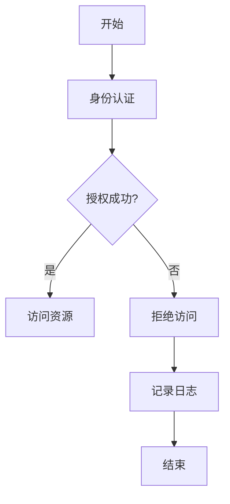
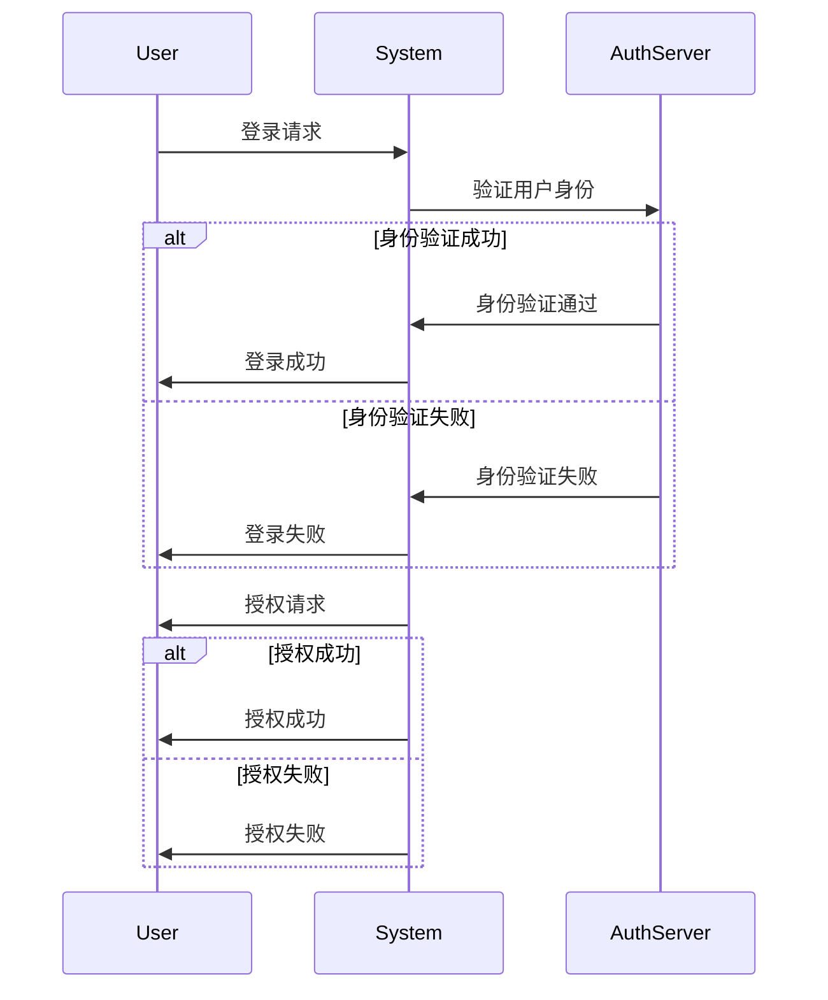

                 

# 身份认证与授权：确保LLM应用的访问安全

关键词：身份认证、授权、LLM应用、安全、访问控制

摘要：本文深入探讨了身份认证与授权在大型语言模型（LLM）应用中的重要性，分析了当前的安全挑战，详细阐述了身份认证与授权的核心概念、原理及其在LLM应用中的实现方法。通过最佳实践，本文旨在为开发者提供有效的安全策略，确保LLM应用的安全访问。

## 第一部分：背景与概念

### 1.1.1 问题背景

随着互联网的快速发展，数据泄露事件层出不穷，安全风险日益加剧。尤其是近年来，大型语言模型（LLM）在自然语言处理、智能问答、文本生成等领域取得了显著的成果，但其应用也带来了一系列的安全挑战。如何确保LLM应用的安全访问，成为了一个亟待解决的问题。

### 1.1.2 问题描述

身份认证与授权是确保系统安全的基础。传统的认证授权系统在面对复杂的LLM应用时，往往存在局限性。例如，传统的密码认证方式容易受到密码泄露、暴力破解等攻击；而授权机制也难以满足LLM应用中复杂权限管理的需求。

### 1.1.3 问题解决

为了解决上述问题，我们需要引入更加安全、灵活的身份认证与授权机制。具体来说，可以从以下几个方面入手：

1. **加强身份认证**：采用双因素认证、生物识别等技术，提高认证的安全性。
2. **优化授权机制**：设计基于角色和属性的访问控制模型，实现细粒度的权限管理。
3. **安全性评估**：定期进行安全风险评估，发现并修复潜在的安全漏洞。

### 1.1.4 边界与外延

1. **身份认证与访问控制的区别**：身份认证是确认用户身份的过程，而访问控制是确保用户在获得身份认证后，只能访问授权范围内的资源。
2. **单点登录与联合身份认证**：单点登录（SSO）可以简化用户登录流程，而联合身份认证（Federated Identity Management）则允许不同系统之间共享身份信息。
3. **身份验证与生物识别**：身份验证是基于用户提供的凭证（如密码、生物特征）来确认其身份，而生物识别则是通过生理或行为特征（如指纹、面部识别）来识别用户。

### 1.1.5 概念结构与核心要素

1. **身份认证的核心概念**：用户身份识别、凭证验证、认证协议。
2. **授权机制的基本要素**：访问控制模型、授权策略、权限管理。
3. **安全框架的组成部分**：身份认证系统、访问控制系统、安全审计系统。

## 第二部分：核心概念与原理

### 2.1.1 身份认证机制

#### 用户身份识别

身份认证的第一步是用户身份识别。用户身份识别是通过用户提供的凭证（如用户名、邮箱地址等）来确认其身份。为了提高安全性，可以使用密码学技术对用户身份进行加密存储和保护。

#### 密码学基础

密码学是保障身份认证安全的重要工具。常见的密码学技术包括哈希函数、对称加密和非对称加密。哈希函数可以确保密码的不可逆性，对称加密和非对称加密则可以确保数据传输的安全性。

#### 双因素认证

双因素认证（2FA）是一种增强身份认证安全性的方法。它要求用户在提供密码之外，还需要提供另一组凭证，如短信验证码、动态令牌等。双因素认证可以大大提高系统的安全性，防止密码泄露和暴力破解。

#### 生物识别技术

生物识别技术是一种基于生理或行为特征的识别技术，如指纹识别、面部识别、虹膜识别等。生物识别技术具有高准确性和难以伪造的特点，可以提高身份认证的安全性。

### 2.1.2 授权机制

#### 访问控制模型

访问控制模型是用于管理用户访问权限的一种机制。常见的访问控制模型包括基于角色的访问控制（RBAC）和基于属性的访问控制（ABAC）。RBAC基于用户的角色进行权限管理，而ABAC则基于用户的属性进行权限管理。

#### RBAC与ABAC

RBAC和ABAC都是用于管理访问权限的技术。RBAC通过将用户和权限关联到角色，实现细粒度的权限管理；而ABAC则通过将权限与用户的属性相关联，实现更加灵活的权限管理。

#### 授权策略设计

授权策略是用于定义用户权限的具体规则。授权策略设计需要考虑用户的角色、属性、权限范围等因素，以确保用户只能访问授权的资源。

## 第三部分：LLM应用中的安全挑战

### 4.1.1 LLM应用特点

LLM应用具有以下特点：

1. **数据规模大**：LLM需要处理大量的文本数据，进行训练和推理。
2. **模型复杂度高**：LLM模型通常包含数亿甚至数十亿个参数，需要高性能的计算资源。
3. **交互性强**：LLM应用通常需要与用户进行实时交互，提供智能问答、文本生成等服务。

### 4.1.2 常见安全漏洞

LLM应用中常见的安全漏洞包括：

1. **模型窃取**：攻击者可以通过对LLM模型的窃取，获取敏感信息。
2. **恶意使用**：攻击者可以利用LLM进行恶意攻击，如生成虚假信息、实施网络钓鱼等。

### 4.1.3 安全性评估方法

安全性评估是确保LLM应用安全的重要环节。常见的安全性评估方法包括：

1. **风险评估**：对LLM应用可能面临的安全威胁进行评估，确定其风险等级。
2. **安全漏洞扫描**：使用自动化工具扫描LLM应用，发现潜在的安全漏洞。

## 第四部分：身份认证与授权在LLM应用中的实现

### 5.1.1 身份认证实现

#### 开发环境准备

在实现身份认证之前，需要搭建开发环境。具体步骤包括：

1. 安装开发工具，如Python、Java等。
2. 配置身份认证服务器，如OpenID Connect、OAuth 2.0等。
3. 部署数据库，用于存储用户信息和认证凭证。

#### 身份认证系统设计

身份认证系统设计包括以下模块：

1. **用户注册与登录**：用户可以通过注册和登录功能，获取访问LLM应用的权限。
2. **密码安全策略**：为了提高密码安全性，可以采用密码加密、密码复杂度校验等策略。
3. **双因素认证集成**：集成双因素认证，如短信验证码、动态令牌等，提高身份认证的安全性。

### 5.1.2 授权机制实现

#### 授权系统架构

授权系统架构包括以下组件：

1. **访问控制模型**：选择合适的访问控制模型，如RBAC、ABAC等。
2. **授权策略管理**：设计授权策略，定义用户权限范围。
3. **权限管理**：实现权限分配、权限查询等功能。

#### RBAC与ABAC集成

为了实现细粒度的权限管理，可以将RBAC和ABAC集成到一起。具体步骤包括：

1. **角色定义**：定义用户的角色，如管理员、普通用户等。
2. **属性定义**：定义用户的属性，如部门、职位等。
3. **权限关联**：将角色、属性与权限进行关联，实现灵活的权限管理。

#### 安全策略管理

安全策略管理包括以下功能：

1. **安全策略配置**：配置安全策略，定义用户权限范围。
2. **策略执行监控**：监控安全策略的执行情况，确保用户只能访问授权的资源。

## 第五部分：LLM应用的访问安全最佳实践

### 6.1.1 安全性规划

安全性规划是确保LLM应用安全的基础。具体步骤包括：

1. **安全性需求分析**：分析LLM应用的安全需求，确定需要采取的安全措施。
2. **安全架构设计**：设计安全架构，确定安全组件和接口。
3. **安全性测试与审核**：对LLM应用进行安全性测试和审核，确保其符合安全标准。

### 6.1.2 安全设计原则

安全设计原则是确保LLM应用安全的指导原则。具体包括：

1. **最小权限原则**：用户只能访问授权的资源，避免权限过大的问题。
2. **安全性优先原则**：在设计和实现过程中，始终将安全性放在首位。
3. **安全性审计原则**：定期进行安全性审计，发现并修复潜在的安全漏洞。

### 6.1.3 安全性监控与响应

安全性监控与响应是确保LLM应用安全的关键环节。具体包括：

1. **安全性监控**：使用安全监控工具，实时监控LLM应用的安全性。
2. **安全事件响应**：制定安全事件响应计划，快速应对安全事件。

## 第六部分：总结与展望

### 8.1.1 关键技术总结

本文介绍了身份认证与授权在LLM应用中的重要性，分析了安全挑战，阐述了核心概念与原理，并提供了最佳实践。关键技术包括：

1. **身份认证**：双因素认证、生物识别等。
2. **授权机制**：RBAC、ABAC等。
3. **安全性评估**：风险评估、安全漏洞扫描等。

### 8.1.2 LLM应用的安全前景

随着LLM应用的不断普及，其安全性越来越受到关注。未来，LLM应用的安全前景包括：

1. **安全性研究**：深入研究安全漏洞和攻击手段，提高LLM应用的安全性。
2. **安全产品创新**：开发新型安全产品，如安全认证、安全审计等。
3. **安全生态建设**：建立安全生态系统，促进安全技术的共享与协作。

## 作者

作者：AI天才研究院/AI Genius Institute & 禅与计算机程序设计艺术 /Zen And The Art of Computer Programming

### 附录

本文使用Mermaid、LaTeX等工具，对算法原理、系统架构、代码实现等内容进行了详细的阐述。具体工具使用方法和示例代码请参阅附录。此外，本文还引用了相关文献和资料，以供读者进一步学习和研究。

## 致谢

感谢AI天才研究院/AI Genius Institute提供的支持与帮助，以及各位同行和读者的建议和反馈，使得本文能够顺利完成。在此，对各位表示衷心的感谢！## 第一部分：背景与概念

### 1.1.1 问题背景

在数字化时代的浪潮中，互联网的普及和应用已经渗透到了我们生活的方方面面。无论是电子商务、社交媒体、在线教育，还是医疗、金融等各个领域，都离不开互联网的支撑。然而，随着互联网的快速发展，网络安全问题也日益严峻。数据泄露、网络攻击、隐私侵犯等现象频发，严重威胁着个人和企业信息安全。

在这个背景下，身份认证与授权作为保障系统安全的关键技术，其重要性愈发凸显。身份认证是指验证用户身份的过程，而授权则是确保用户在验证身份后能够访问到相应的资源和执行特定的操作。在传统的网络应用中，身份认证与授权机制已经相对成熟，如单点登录（SSO）、OAuth 2.0、OpenID Connect等标准协议。然而，随着人工智能技术的迅猛发展，特别是大型语言模型（LLM）的广泛应用，传统的身份认证与授权机制面临着前所未有的挑战。

LLM是一种能够理解和生成人类语言的深度学习模型，其在自然语言处理、智能问答、文本生成、机器翻译等领域表现出了卓越的能力。然而，LLM的强大功能也带来了新的安全隐患。首先，由于LLM处理的文本数据量巨大，任何泄露都有可能造成严重后果。其次，LLM模型本身可能成为攻击的目标，例如通过模型窃取、恶意使用等手段，对系统进行攻击。此外，LLM应用通常需要与用户进行实时交互，这使得身份认证与授权机制的设计更加复杂。

因此，如何确保LLM应用的安全性，成为了一个亟待解决的重要课题。传统的身份认证与授权机制已经无法满足LLM应用的特殊需求，新的安全机制和技术手段亟待研究和应用。

### 1.1.2 问题描述

身份认证与授权是保障系统安全的基础，但在LLM应用中，这一基础面临着前所未有的挑战。首先，我们需要明确身份认证与授权在系统安全中的作用。

**身份认证的作用**：

- **防止未经授权的访问**：通过验证用户身份，确保只有合法用户才能访问系统资源和执行操作。
- **保障数据安全性**：通过身份认证，可以确保用户操作的合法性和数据的安全传输。

**授权的作用**：

- **权限管理**：根据用户的角色、职责和需求，分配相应的权限，确保用户只能访问和操作授权范围内的资源。
- **防止越权操作**：通过授权机制，防止用户执行未经授权的操作，避免潜在的安全风险。

在传统的网络应用中，身份认证与授权机制已经相对成熟。然而，LLM应用的特殊性使得传统的机制面临诸多局限：

1. **数据规模庞大**：LLM处理的数据量通常非常大，数据泄露的风险也随之增加。传统的身份认证与授权机制难以在如此大规模的数据中进行有效的安全保护。

2. **模型复杂度高**：LLM模型通常包含数亿甚至数十亿个参数，训练和推理过程需要大量计算资源。传统的身份认证与授权机制在处理复杂模型时效率低下，难以满足实时性的要求。

3. **交互性强**：LLM应用通常需要与用户进行实时交互，提供智能问答、文本生成等服务。这要求身份认证与授权机制具有高度的灵活性和响应速度。

4. **隐私保护需求**：由于LLM处理的文本数据涉及用户隐私，需要更高的隐私保护措施。传统的身份认证与授权机制在隐私保护方面存在不足。

因此，LLM应用中的身份认证与授权面临以下具体问题：

- **如何保证大规模数据的访问安全**：传统的身份认证与授权机制在大规模数据处理方面存在不足，需要新的技术手段来提升安全性。
- **如何应对复杂模型的实时交互需求**：传统的机制在处理复杂模型时效率低下，需要优化机制以提高实时性。
- **如何加强隐私保护**：需要引入新的隐私保护措施，确保用户隐私不被泄露。

### 1.1.3 问题解决

为了解决上述问题，我们需要从以下几个方面入手：

1. **加强身份认证**：

   - **双因素认证**：采用双因素认证（2FA），即用户在输入密码之外还需要提供另一组凭证，如短信验证码、动态令牌等，以提高安全性。
   - **生物识别技术**：利用生物识别技术，如指纹识别、面部识别等，进行用户身份验证，提高身份认证的准确性和安全性。

2. **优化授权机制**：

   - **基于角色的访问控制（RBAC）**：将用户的权限与角色相关联，实现细粒度的权限管理。
   - **基于属性的访问控制（ABAC）**：根据用户的属性，如部门、职位等，动态调整用户的权限，实现更灵活的权限管理。

3. **安全性评估**：

   - **定期安全评估**：定期对LLM应用进行安全评估，发现并修复潜在的安全漏洞。
   - **安全漏洞扫描**：使用自动化工具对LLM应用进行安全漏洞扫描，及时识别和修复漏洞。

4. **隐私保护**：

   - **数据加密**：对用户数据进行加密存储和传输，防止数据泄露。
   - **隐私保护机制**：引入隐私保护机制，如差分隐私、同态加密等，确保用户隐私不被泄露。

通过上述措施，可以有效提升LLM应用的身份认证与授权安全性，确保用户数据和系统的安全。

### 1.1.4 边界与外延

在探讨身份认证与授权在LLM应用中的实现时，我们不仅需要理解其核心概念和原理，还需要明确一些相关边界与外延，以便更好地把握其应用范围和限制。

#### 身份认证与访问控制的区别

身份认证（Authentication）和访问控制（Access Control）是保障系统安全的两个重要概念，但它们在安全体系中扮演的角色有所不同。

- **身份认证**：身份认证是确认用户身份的过程，确保只有合法用户才能访问系统。常见的身份认证方式包括密码验证、双因素认证（2FA）、生物识别等。身份认证的核心目标是验证用户身份的合法性。

- **访问控制**：访问控制是在用户身份认证通过后，确保用户只能访问授权范围内的资源和执行授权的操作。访问控制通常通过访问控制列表（ACL）、角色访问控制（RBAC）、属性访问控制（ABAC）等方式实现。访问控制的核心目标是限制用户权限，防止未经授权的访问和操作。

虽然身份认证与访问控制密切相关，但它们在系统安全中的作用是不同的。身份认证是访问控制的先决条件，只有通过身份认证的用户才能受到访问控制的约束。

#### 单点登录与联合身份认证

单点登录（SSO）和联合身份认证（Federated Identity Management）是两种常见的身份认证机制，它们在提高用户登录便捷性和系统安全性方面发挥了重要作用。

- **单点登录（SSO）**：单点登录允许用户使用一个账户登录多个系统，简化了用户的登录流程，提高了用户体验。常见的SSO协议包括OAuth 2.0、OpenID Connect等。SSO的主要优势在于减少用户记忆多个密码的负担，但也存在一定安全风险，如单点故障和密码泄露。

- **联合身份认证（FIM）**：联合身份认证是一种跨域的身份认证机制，允许不同系统之间共享身份信息，实现跨系统的身份认证和授权。联合身份认证通常依赖于信任协议，如SAML、OAuth 2.0等。FIM的主要优势在于提高了身份认证的灵活性和互操作性，但也需要处理跨域身份信息同步和安全传输等问题。

#### 身份验证与生物识别

身份验证（Authentication）和生物识别（Biometrics）是两种不同的身份认证方法，它们在实现身份认证方面各有优缺点。

- **身份验证**：身份验证是通过用户提供的凭证（如用户名、密码、动态令牌等）来确认其身份的过程。身份验证方法主要包括密码认证、双因素认证、单点登录等。身份验证的优点在于实现简单、成本较低，但容易受到密码泄露、暴力破解等攻击。

- **生物识别**：生物识别是通过用户的生理或行为特征（如指纹、面部识别、虹膜识别等）来确认其身份的过程。生物识别的优点在于高准确性和难以伪造，但也存在设备成本高、用户隐私保护等问题。

#### 概念结构与核心要素

在理解身份认证与授权的概念时，我们需要关注其核心要素和结构。

- **身份认证的核心要素**：身份认证的核心要素包括用户身份识别、凭证验证、认证协议等。用户身份识别是确认用户身份的过程，凭证验证是验证用户提供的凭证是否正确，认证协议则是用于实现身份认证的通信协议和标准。

- **授权机制的核心要素**：授权机制的核心要素包括访问控制模型、授权策略、权限管理等。访问控制模型定义了用户访问权限的分配和管理方式，授权策略则是用于定义用户权限的具体规则，权限管理则负责权限的分配、查询和更新。

通过明确身份认证与授权的边界与外延，我们可以更好地理解和应用这些概念，为LLM应用设计有效的安全机制。

### 1.1.5 概念结构与核心要素

在深入了解身份认证与授权之前，我们首先需要明确其核心概念和构成要素，以便为后续的内容奠定基础。

#### 身份认证的核心概念

身份认证（Authentication）是确认用户身份的过程，确保只有合法用户才能访问系统资源和执行操作。身份认证的核心概念包括以下几个方面：

1. **用户身份识别**：通过用户提供的凭证（如用户名、密码、动态令牌等）来识别和确认用户身份。
2. **凭证验证**：验证用户提供的凭证是否与系统中存储的凭证相匹配，以确认用户身份的合法性。
3. **认证协议**：用于实现身份认证的通信协议和标准，如OAuth 2.0、OpenID Connect等。

#### 授权机制的基本要素

授权机制（Authorization）是确保用户在身份认证通过后，只能访问授权的资源并执行授权的操作。授权机制的核心要素包括：

1. **访问控制模型**：定义用户访问权限的分配和管理方式，常见的访问控制模型包括基于角色的访问控制（RBAC）、基于属性的访问控制（ABAC）等。
2. **授权策略**：定义用户权限的具体规则，包括用户可以访问的资源类型、可以执行的操作等。
3. **权限管理**：负责权限的分配、查询和更新，确保用户权限的合理性和一致性。

#### 安全框架的组成部分

一个完整的安全框架通常包括以下组成部分：

1. **身份认证系统**：负责用户的身份认证过程，包括用户注册、登录、密码管理等功能。
2. **访问控制系统**：定义和管理用户的访问权限，确保用户只能访问授权的资源。
3. **安全审计系统**：记录和监控用户操作，发现潜在的安全漏洞和异常行为。
4. **安全事件响应系统**：制定和执行安全事件响应计划，快速应对和处理安全事件。

通过明确身份认证与授权的核心概念和构成要素，我们可以更好地理解其在LLM应用中的重要性，并为后续内容提供理论支持。

## 第二部分：核心概念与原理

### 2.1.1 身份认证机制

#### 用户身份识别

用户身份识别是身份认证的第一步，也是最为关键的一步。它的核心目标是通过用户提供的凭证（如用户名、邮箱地址、手机号码等）来识别和确认用户身份。在用户进行登录时，系统会要求用户输入这些凭证，然后通过对比系统中的存储信息，验证用户身份的合法性。

**用户身份识别方法**：

1. **用户名和密码**：这是最常见的一种身份识别方法。用户在注册时设置一个用户名和密码，每次登录时需要输入这两个凭证进行身份验证。这种方法简单易用，但存在一定的安全风险，如密码泄露和暴力破解。

2. **邮箱地址和密码**：与用户名和密码类似，邮箱地址作为一种身份凭证，可以用来确认用户身份。邮箱地址的唯一性和普及性使得这种方法成为一种可靠的身份识别方式。

3. **手机号码和短信验证码**：用户在登录时，系统会发送一条包含验证码的短信到用户注册的手机号码。用户需要输入这个验证码才能完成登录。这种方法结合了用户名和密码的可靠性，同时增加了动态验证码这一额外的安全层，大大提高了身份认证的安全性。

**用户身份识别的优势和劣势**：

- **优势**：用户身份识别方法简单易用，用户无需记住复杂的凭证，降低了用户的使用门槛。
- **劣势**：传统的用户名和密码方法容易受到密码泄露、暴力破解等攻击，安全性相对较低。

#### 密码学基础

密码学（Cryptography）是保障身份认证安全的重要工具，它通过加密和解密技术，确保数据传输的安全性。密码学的基本概念包括哈希函数、对称加密、非对称加密等。

**哈希函数**：哈希函数是将输入数据转换为一个固定长度的字符串的函数。常见的哈希函数包括MD5、SHA-1、SHA-256等。哈希函数具有以下几个特点：

- **不可逆性**：无法通过哈希值反推出原始输入数据。
- **抗碰撞性**：不同的输入数据会产生不同的哈希值，相同的数据会产生相同的哈希值。
- **固定长度**：无论输入数据的长度如何，哈希值都有固定的长度。

哈希函数在密码学中有着广泛的应用，如用于存储用户的密码。当用户登录时，系统会计算输入密码的哈希值，然后与数据库中存储的哈希值进行比对，以验证用户身份。

**对称加密**：对称加密是指加密和解密使用相同的密钥的加密方法。常见的对称加密算法包括AES、DES等。对称加密具有以下特点：

- **速度快**：对称加密算法通常比非对称加密算法计算速度快。
- **密钥管理复杂**：由于加密和解密使用相同的密钥，密钥的安全性和管理成为关键问题。

对称加密通常用于数据传输和存储的加密，以确保数据在传输过程中不被窃取和篡改。

**非对称加密**：非对称加密是指加密和解密使用不同密钥的加密方法。常见的非对称加密算法包括RSA、ECC等。非对称加密具有以下特点：

- **安全性高**：非对称加密算法比对称加密算法更安全，因为密钥管理更加灵活。
- **计算复杂**：非对称加密算法计算复杂度较高，通常用于密钥交换和数字签名。

非对称加密在身份认证中有着重要应用，如用于SSL/TLS协议，确保数据传输的安全性。

**密码学在身份认证中的作用**：

- **保护用户密码**：通过哈希函数和加密技术，确保用户密码在传输和存储过程中的安全性。
- **确保数据完整性**：通过数字签名，确保数据在传输过程中的完整性和真实性。
- **实现通信安全**：通过非对称加密和对称加密的结合，确保数据在传输过程中的安全。

#### 双因素认证

双因素认证（Two-Factor Authentication，2FA）是一种增强身份认证安全性的方法。它要求用户在提供密码之外，还需要提供另一组凭证，如短信验证码、动态令牌等。双因素认证可以大大提高系统的安全性，防止密码泄露和暴力破解。

**双因素认证的工作原理**：

1. **用户输入用户名和密码**：用户在登录时，首先需要输入用户名和密码进行身份验证。

2. **系统生成动态验证码**：系统会根据用户的登录信息，生成一个动态验证码，并将其发送到用户绑定的手机号码或邮箱。

3. **用户输入动态验证码**：用户需要输入收到的动态验证码，系统会对比输入的验证码与发送的验证码是否一致。

4. **身份验证通过**：如果验证码正确，用户身份验证通过，可以访问系统资源。

**双因素认证的优势和劣势**：

- **优势**：双因素认证增加了额外的安全层，大大提高了系统的安全性，即使密码泄露，攻击者也无法登录系统。
- **劣势**：双因素认证增加了用户登录的复杂度，可能会影响用户体验。

#### 生物识别技术

生物识别技术是一种基于用户生理或行为特征的识别技术，如指纹识别、面部识别、虹膜识别等。生物识别技术具有高准确性和难以伪造的特点，可以提高身份认证的安全性。

**生物识别技术的工作原理**：

1. **用户注册**：用户在注册时，需要提供生物特征信息，如指纹、面部图像、虹膜图案等，系统将这些信息存储在数据库中。

2. **用户登录**：用户在登录时，需要通过扫描或采集生物特征信息，系统会将采集到的信息与数据库中的信息进行比对，以验证用户身份。

**常见的生物识别技术**：

- **指纹识别**：通过扫描或采集指纹图像，与数据库中的指纹信息进行比对。
- **面部识别**：通过摄像头捕捉用户的面部图像，与数据库中的面部信息进行比对。
- **虹膜识别**：通过扫描或采集用户的虹膜图案，与数据库中的虹膜信息进行比对。

**生物识别技术的优势和劣势**：

- **优势**：生物识别技术具有高准确性和难以伪造的特点，大大提高了身份认证的安全性。
- **劣势**：生物识别技术需要特定的设备和技术支持，成本较高，且在特殊环境下（如光线不足、用户化妆等）识别效果可能会受到影响。

通过上述身份认证机制的详细解析，我们可以看到，每种技术都有其独特的优势和应用场景。在实际应用中，可以根据具体需求和预算选择合适的技术组合，以实现高效、安全、便捷的身份认证。

### 2.1.2 授权机制

#### 访问控制模型

授权机制的核心是访问控制模型（Access Control Model），它用于定义用户访问权限的分配和管理方式。访问控制模型决定了用户能否访问特定的资源以及执行特定的操作。常见的访问控制模型包括基于角色的访问控制（RBAC）和基于属性的访问控制（ABAC）。

**基于角色的访问控制（RBAC）**

RBAC是一种基于角色的访问控制模型，它将用户的权限与角色相关联，通过管理角色来控制用户对资源的访问。RBAC的主要组成部分包括：

1. **用户（User）**：用户是访问系统资源的基本实体，每个用户都有一个唯一的标识符。

2. **角色（Role）**：角色是一组具有相似职责和权限的用户集合。角色通常与特定的职责或功能相关联，如管理员、普通用户等。

3. **权限（Permission）**：权限是用户对系统资源的操作权限，如读取、写入、执行等。

4. **角色分配（Role Assignment）**：角色分配是将用户与角色相关联的过程，用户通过角色获得相应的权限。

5. **权限分配（Permission Assignment）**：权限分配是将权限与资源相关联的过程，确保用户只能访问授权的资源。

RBAC的优势在于其简洁性和可扩展性，通过角色管理，可以方便地实现权限的分配和变更。例如，当需要新增一个用户时，只需将其分配到一个角色，即可获得该角色对应的权限。此外，RBAC支持角色之间的继承关系，使得权限管理更加灵活。

**基于属性的访问控制（ABAC）**

ABAC是一种基于属性的访问控制模型，它根据用户的属性（如部门、职位、时间等）动态调整用户的权限。ABAC的主要组成部分包括：

1. **用户属性（User Attributes）**：用户属性是描述用户特征的信息，如部门、职位、工作时间等。

2. **资源属性（Resource Attributes）**：资源属性是描述资源特征的信息，如文件类型、访问时间、地理位置等。

3. **策略（Policy）**：策略是定义用户访问权限的规则，通常用自然语言或形式化语言描述。

4. **决策模型（Decision Model）**：决策模型是用于评估用户对资源访问请求是否符合策略的算法，常见的决策模型包括访问控制矩阵、规则引擎等。

ABAC的优势在于其灵活性和动态性，可以根据用户的属性和资源的属性动态调整权限。例如，一个普通用户在正常工作时间可能具有文件读取权限，而在非工作时间则可能被禁止访问。此外，ABAC支持复杂的访问控制策略，可以满足多样化的权限管理需求。

#### RBAC与ABAC

RBAC和ABAC都是用于管理访问权限的技术，但它们在实现方式和应用场景上有所不同。

- **实现方式**：RBAC主要通过角色和权限的关联来管理访问权限，而ABAC则通过属性和策略的配置来实现访问控制。

- **应用场景**：RBAC适用于权限管理较为稳定、角色职责清晰的系统，如企业内部管理系统。ABAC则适用于权限管理较为复杂、需要根据用户属性动态调整权限的系统，如电商平台、在线教育平台等。

#### 授权策略设计

授权策略是用于定义用户权限的具体规则。一个良好的授权策略可以确保用户只能访问授权的资源，同时减少管理复杂度。授权策略设计包括以下几个关键步骤：

1. **需求分析**：分析系统需求，确定需要保护的资源类型和用户的访问权限。

2. **角色定义**：根据需求分析，定义系统的角色，如管理员、普通用户、访客等。

3. **权限分配**：为每个角色分配相应的权限，确保角色职责与权限的对应关系。

4. **属性定义**：根据系统需求，定义用户和资源的属性，如部门、职位、文件类型等。

5. **策略配置**：根据角色和属性的定义，配置访问控制策略，确定用户对资源的访问权限。

6. **测试与优化**：对授权策略进行测试，确保其满足安全需求，并进行优化，以提高策略的执行效率和安全性。

通过上述授权策略设计步骤，可以构建一个灵活、高效、安全的访问控制机制，确保LLM应用的安全访问。

### 2.1.3 授权策略设计

授权策略设计是确保系统安全性的关键环节，它定义了用户在不同角色和条件下对资源的访问权限。有效的授权策略不仅能够限制未经授权的访问，还能确保系统的灵活性和可扩展性。

#### 授权策略类型

根据不同的应用场景和需求，授权策略可以分为以下几种类型：

1. **基于角色的访问控制（RBAC）**：
   - **角色定义**：角色是具有相似权限和职责的用户集合。例如，管理员、普通用户、访客等。
   - **权限分配**：角色与权限相关联，用户通过角色获得相应的权限。例如，管理员可以访问所有系统功能，而普通用户只能访问特定的功能模块。

2. **基于属性的访问控制（ABAC）**：
   - **属性定义**：属性是描述用户、资源或环境特征的信息，如用户部门、资源类型、时间等。
   - **策略配置**：策略基于属性进行配置，定义用户对资源的访问条件。例如，一个用户在正常工作时间可以访问数据库，但在非工作时间则被禁止访问。

3. **基于规则的访问控制（RBAC+ABAC）**：
   - **规则引擎**：结合RBAC和ABAC的优势，通过规则引擎动态配置权限。例如，一个用户在特定时间段可以访问特定资源。

4. **动态访问控制**：
   - **动态调整**：根据用户行为和环境变化，动态调整用户的访问权限。例如，当用户输入错误密码超过一定次数时，系统可以暂时禁止其访问。

#### 授权策略实现

授权策略的实现通常包括以下几个步骤：

1. **需求分析**：了解系统的安全需求，明确需要保护的资源类型和用户的访问权限。

2. **角色和属性定义**：根据需求分析，定义系统的角色和属性。角色通常包括管理员、普通用户、访客等，属性可以包括用户部门、职位、资源类型、访问时间等。

3. **权限分配**：为每个角色分配相应的权限，确保角色职责与权限的对应关系。例如，管理员具有所有权限，普通用户仅具有部分权限。

4. **策略配置**：根据角色和属性的定义，配置访问控制策略。策略可以用自然语言、形式化语言或编程语言进行定义。例如，可以使用ACL（访问控制列表）或XML格式配置策略。

5. **权限检查**：在用户访问资源时，系统会进行权限检查，确保用户权限符合策略配置。权限检查可以通过自定义规则引擎、访问控制列表或数据库查询等方式实现。

6. **测试与优化**：对授权策略进行测试，确保其满足安全需求，并进行优化，以提高策略的执行效率和安全性。

通过以上步骤，可以构建一个灵活、高效、安全的授权策略，确保LLM应用中的资源访问得到有效控制。

## 第三部分：LLM应用中的安全挑战

### 4.1.1 LLM应用特点

大型语言模型（LLM）在自然语言处理（NLP）领域取得了显著的突破，其应用场景广泛，如智能问答、文本生成、机器翻译、情感分析等。然而，LLM应用也带来了一系列独特的安全挑战，主要体现在以下几个方面：

1. **数据规模大**：LLM模型通常需要处理海量的文本数据，这些数据可能包含敏感信息，如个人隐私、商业秘密等。大规模数据的存在使得数据泄露的风险增加。

2. **模型复杂度高**：LLM模型通常包含数亿甚至数十亿个参数，模型的训练和推理过程需要大量的计算资源。复杂的模型结构增加了被攻击的风险，如模型窃取、注入攻击等。

3. **交互性强**：LLM应用通常需要与用户进行实时交互，如智能问答系统、虚拟助手等。用户输入的文本可能包含恶意意图或敏感内容，需要确保系统对用户输入的合法性和安全性进行严格控制。

4. **易受攻击**：LLM模型在训练过程中可能会受到恶意数据的影响，导致模型产生错误预测或生成有害内容。此外，LLM模型可能成为钓鱼、诈骗等网络攻击的目标。

### 4.1.2 常见安全漏洞

在LLM应用中，常见的安全漏洞主要包括以下几种：

1. **模型窃取**：攻击者通过恶意手段获取LLM模型的参数和训练数据，进而克隆或篡改模型，造成严重的数据泄露和隐私侵犯。

2. **恶意使用**：攻击者利用LLM模型生成虚假信息、进行网络钓鱼等恶意攻击。例如，通过生成伪造的新闻文章、电子邮件等，欺骗用户点击恶意链接或泄露个人信息。

3. **注入攻击**：攻击者通过注入恶意代码或数据，篡改LLM模型的输出结果，造成系统崩溃、数据泄露等安全事件。

4. **权限滥用**：由于LLM应用通常涉及敏感数据，如果权限管理不当，可能导致内部人员滥用权限，访问或篡改敏感数据。

5. **中间人攻击**：攻击者拦截LLM应用与用户之间的通信，窃取用户输入和模型输出，进而对用户进行钓鱼或欺诈。

### 4.1.3 安全性评估方法

为了确保LLM应用的安全性，需要对系统进行定期的安全性评估。以下是几种常见的安全性评估方法：

1. **风险评估**：通过分析LLM应用面临的安全威胁和潜在漏洞，评估系统安全性的整体状况，确定需要优先解决的风险。

2. **安全漏洞扫描**：使用自动化工具对LLM应用进行扫描，识别潜在的安全漏洞，如SQL注入、跨站脚本攻击（XSS）等。

3. **渗透测试**：模拟真实攻击者对LLM应用进行攻击，验证系统的安全防护措施是否有效。

4. **安全审计**：对LLM应用的安全策略、权限管理、日志记录等进行审计，确保系统符合安全标准和最佳实践。

5. **代码审查**：对LLM应用源代码进行审查，查找潜在的逻辑漏洞和安全隐患。

通过上述安全性评估方法，可以及时发现并修复LLM应用中的安全漏洞，确保系统的安全运行。

### 5.1.1 开发环境准备

在实现身份认证与授权机制之前，首先需要搭建一个稳定、安全的开发环境。以下是搭建开发环境所需完成的几个关键步骤：

**1. 安装开发工具**

首先，需要安装开发环境所需的工具，例如Python、Java等。根据项目需求，可以选择适合的开发语言和相应的集成开发环境（IDE），如PyCharm、IntelliJ IDEA等。

**2. 配置身份认证服务器**

为了实现身份认证功能，需要配置身份认证服务器。可以选择使用现有的身份认证标准协议，如OpenID Connect、OAuth 2.0等。配置步骤通常包括：

- **服务器端配置**：在服务器上安装并配置身份认证服务，如Keycloak、Auth0等。
- **客户端集成**：将身份认证服务器与LLM应用集成，配置客户端ID和密钥。

**3. 部署数据库**

身份认证与授权机制需要存储用户信息、凭证、访问日志等数据。因此，需要部署一个数据库系统，如MySQL、PostgreSQL等。部署步骤通常包括：

- **数据库安装**：在服务器上安装数据库系统。
- **数据库配置**：配置数据库用户、权限和存储策略。
- **数据迁移**：将用户数据和配置文件迁移到数据库。

**4. 开发环境测试**

在完成上述配置后，需要对开发环境进行测试，确保所有组件能够正常工作。测试步骤包括：

- **启动服务**：启动身份认证服务器和数据库服务。
- **测试登录**：通过身份认证服务器测试用户登录功能，验证身份认证和授权机制的正常工作。

通过以上步骤，可以搭建一个基本的开发环境，为后续的身份认证与授权实现奠定基础。

### 5.1.2 身份认证系统设计

身份认证系统是确保LLM应用安全的基础。一个完善的身份认证系统需要设计合理的用户注册与登录流程，同时确保密码的安全存储和传输。以下是身份认证系统设计的关键步骤和要点。

#### 用户注册与登录

1. **用户注册**：

   - **注册界面**：设计用户注册界面，包括用户名、邮箱地址、密码等输入字段。
   - **输入验证**：对用户输入的信息进行验证，确保其符合系统要求，如用户名唯一性、密码强度等。
   - **注册确认**：注册时发送确认邮件或短信，验证用户身份，防止恶意注册。

2. **用户登录**：

   - **登录界面**：设计用户登录界面，包括用户名和密码输入字段。
   - **输入验证**：验证用户输入的用户名和密码是否与数据库中的信息匹配。
   - **双因素认证**：在用户登录成功后，可以要求用户进行双因素认证，如短信验证码、动态令牌等，提高安全性。

#### 密码安全策略

密码是用户身份认证的关键凭证，设计合理的密码安全策略是确保系统安全的重要环节。以下是一些关键点：

1. **密码强度要求**：

   - **长度要求**：要求密码至少8位，且包含字母、数字、特殊字符。
   - **复杂度检查**：使用复杂度检查工具，确保密码不易被猜测。

2. **密码加密存储**：

   - **哈希加密**：使用哈希函数（如SHA-256）对密码进行加密存储，防止密码泄露。
   - **加盐（Salting）**：在哈希前添加随机盐值，提高哈希算法的安全性。

3. **密码传输加密**：

   - **HTTPS传输**：使用HTTPS协议传输密码，确保密码在传输过程中的安全性。
   - **禁用明文密码传输**：避免使用明文传输密码，防止中间人攻击。

4. **密码找回策略**：

   - **安全找回**：设计安全的密码找回机制，如通过验证用户身份的确认邮件、短信验证等，防止恶意用户通过密码找回功能获取用户密码。

5. **密码过期策略**：

   - **定期更换**：定期要求用户更换密码，防止长期使用同一密码导致的安全风险。
   - **密码过期提醒**：系统在密码过期前提醒用户更换密码，确保密码的有效性。

通过以上设计要点，可以构建一个安全、可靠的身份认证系统，确保LLM应用的安全性。

### 5.1.3 双因素认证集成

双因素认证（Two-Factor Authentication，2FA）是一种增强用户身份验证安全性的方法。通过结合用户知道（如密码）和用户持有（如手机、动态令牌）的凭证，2FA可以大幅提高系统的安全性。以下是实现双因素认证集成的主要步骤和优化措施：

**双因素认证机制**

1. **用户注册**：

   - **绑定手机或邮箱**：在用户注册过程中，要求用户绑定手机号码或邮箱地址，以便后续进行2FA。
   - **验证绑定信息**：通过发送验证码或链接，验证用户绑定信息的有效性。

2. **用户登录**：

   - **首次登录2FA**：用户首次登录时，系统提示进行2FA验证。用户需要输入密码后，再输入接收到的验证码。
   - **后续登录2FA**：用户在设置2FA后，每次登录都需要通过2FA验证，确保账号安全性。

**双因素认证的优势**

- **提高安全性**：2FA通过增加额外的验证步骤，使得即使密码泄露，攻击者也无法登录用户账号。
- **降低欺诈风险**：通过2FA验证，可以防止恶意用户通过猜测或暴力破解密码的方式非法访问系统。

**双因素认证集成步骤**

1. **选择2FA实现方式**：

   - **短信验证码**：通过短信发送验证码，用户输入验证码进行2FA。
   - **动态令牌**：使用动态令牌生成器（如Google Authenticator、Authy等），用户输入动态令牌进行2FA。

2. **集成2FA库**：

   - **使用现有的2FA库**：如使用Python的`pyotp`库，方便地实现2FA功能。
   - **自定义2FA服务**：如果需要更复杂的2FA功能，可以自定义2FA服务，如集成第三方短信服务或动态令牌服务。

3. **前端集成**：

   - **设计2FA界面**：在前端设计2FA登录界面，提示用户进行2FA验证。
   - **实现2FA接口**：在用户登录接口中集成2FA验证逻辑，确保2FA流程顺畅。

4. **后端集成**：

   - **存储2FA凭证**：在后端存储用户的2FA凭证信息，如短信验证码、动态令牌的密钥等。
   - **处理2FA请求**：在后端处理用户的2FA请求，验证2FA凭证的有效性。

**2FA的优化措施**

1. **提高验证码强度**：

   - **增加验证码长度**：验证码建议使用6位或更高位数的数字。
   - **使用混合验证码**：结合数字和字母的验证码，提高验证难度。

2. **动态令牌刷新频率**：

   - **适当调整刷新频率**：根据应用的安全需求，调整动态令牌的刷新频率，如30秒或60秒。

3. **用户便捷性**：

   - **备份2FA方式**：提供备份2FA方式，如使用备用手机或邮箱进行验证。
   - **简化2FA流程**：简化2FA流程，减少用户操作步骤，提高用户体验。

通过双因素认证集成，可以显著提高LLM应用的安全性，防止恶意攻击和未经授权的访问。合理的优化措施可以提高2FA的效率和用户体验。

### 6.1.1 授权系统架构

授权系统是确保LLM应用安全性的重要组成部分。一个完善的授权系统需要设计合理的架构，包括用户权限管理、权限控制策略和安全机制。以下是授权系统架构的详细设计。

#### 系统架构设计

授权系统通常包括以下几个核心模块：

1. **用户权限管理模块**：
   - **用户角色定义**：定义用户角色，如管理员、普通用户、访客等。
   - **权限分配**：根据用户角色分配相应的权限，确保用户只能访问授权的资源。

2. **权限控制模块**：
   - **访问控制列表（ACL）**：实现基于资源的访问控制，确保用户对特定资源的访问权限。
   - **策略引擎**：根据用户角色和资源属性，动态生成访问控制策略，确保用户只能访问授权的资源。

3. **日志管理模块**：
   - **访问日志记录**：记录用户访问资源和操作的历史记录，便于后续审计和追踪。

4. **安全审计模块**：
   - **安全策略配置**：配置安全策略，定义用户权限的范围和条件。
   - **异常行为检测**：监控用户行为，检测潜在的异常行为，如频繁的登录失败、非法访问等。

#### 授权系统组件

授权系统包括以下几个关键组件：

1. **用户角色管理**：
   - **用户角色定义**：系统管理员定义用户角色，包括角色名称和描述。
   - **角色权限分配**：为每个角色分配相应的权限，如读取、写入、执行等。

2. **权限控制策略**：
   - **权限定义**：定义权限，包括权限名称、描述和操作类型。
   - **策略配置**：根据用户角色和资源属性，配置访问控制策略。

3. **访问控制列表（ACL）**：
   - **ACL定义**：为每个资源定义访问控制列表，包括资源的ID和对应的权限。
   - **ACL关联**：将访问控制列表与角色和权限进行关联，确保用户对资源的访问权限。

4. **日志记录**：
   - **日志记录**：记录用户访问资源和操作的历史记录，包括用户ID、资源ID、操作类型和时间等。
   - **日志审计**：定期审计日志记录，检测潜在的异常行为和安全事件。

5. **安全审计**：
   - **策略配置**：配置安全策略，定义用户权限的范围和条件。
   - **异常行为检测**：使用机器学习算法和规则引擎，检测潜在的异常行为和安全事件。

#### 授权系统流程

授权系统的基本工作流程如下：

1. **用户登录**：用户使用用户名和密码登录系统，通过身份认证。
2. **角色验证**：系统验证用户的角色，根据角色分配的权限，确定用户可以访问的资源。
3. **权限检查**：用户请求访问资源时，系统检查用户的权限，确保用户只能访问授权的资源。
4. **日志记录**：记录用户访问资源和操作的历史记录，便于后续审计和追踪。
5. **安全审计**：定期审计日志记录，检测潜在的异常行为和安全事件。

通过上述授权系统架构的设计，可以构建一个安全、灵活、高效的授权系统，确保LLM应用的安全访问。

### 6.1.2 RBAC与ABAC集成

在LLM应用中，基于角色的访问控制（RBAC）和基于属性的访问控制（ABAC）是两种常用的授权机制。RBAC通过将用户和权限关联到角色，实现细粒度的权限管理；而ABAC则通过将权限与用户的属性相关联，实现更灵活的权限管理。为了满足LLM应用中复杂权限管理的需求，我们可以将RBAC与ABAC集成到一起，实现更为强大和灵活的权限管理。

#### RBAC集成策略

1. **角色定义**：

   - **角色分类**：首先，我们需要明确LLM应用中需要定义的角色类型。例如，可以定义管理员、普通用户、访客等角色。
   - **角色权限分配**：为每个角色分配相应的权限。例如，管理员角色可以拥有所有权限，普通用户角色可以拥有部分权限。

2. **用户角色分配**：

   - **用户角色绑定**：将用户与角色相关联，用户通过角色获得相应的权限。
   - **权限继承**：支持角色之间的权限继承，确保不同角色的权限可以灵活扩展。

3. **权限检查**：

   - **角色权限检查**：在用户请求访问资源时，系统首先检查用户的角色权限，确保用户只能访问授权的资源。
   - **权限委托**：支持角色之间的权限委托，例如，管理员可以将部分权限委托给普通用户。

#### ABAC实现细节

1. **属性定义**：

   - **用户属性**：定义用户的属性，如部门、职位、角色等。
   - **资源属性**：定义资源的属性，如文件类型、访问时间、地理位置等。

2. **策略配置**：

   - **属性条件**：定义属性条件，如用户部门等于“研发部”、访问时间在9:00至18:00之间等。
   - **策略规则**：根据属性条件和访问控制要求，定义策略规则，如用户只能访问特定类型的文件。

3. **权限动态调整**：

   - **属性关联**：将用户属性和资源属性进行关联，根据属性条件动态调整用户的权限。
   - **策略更新**：支持策略的动态更新，确保权限管理能够适应不断变化的需求。

#### RBAC与ABAC集成优势

1. **灵活性**：

   - **动态调整**：通过ABAC，可以灵活地根据用户属性和资源属性动态调整权限，满足复杂权限管理的需求。
   - **策略灵活**：ABAC支持基于属性的条件判断，可以实现复杂权限控制策略。

2. **可扩展性**：

   - **角色扩展**：通过RBAC，可以方便地扩展角色和权限，支持大型系统的权限管理。
   - **属性扩展**：通过ABAC，可以方便地扩展用户和资源的属性，实现更加细粒度的权限控制。

3. **安全性**：

   - **多层次保护**：通过RBAC与ABAC的集成，可以实现对用户权限的全面保护，防止未经授权的访问。
   - **动态监控**：通过ABAC，可以实时监控用户的权限变化，确保系统的安全运行。

通过将RBAC与ABAC集成，我们可以构建一个灵活、高效、安全的权限管理系统，满足LLM应用中复杂权限管理的需求。

### 6.1.3 安全策略管理

在LLM应用中，安全策略管理是确保系统安全性和合规性的关键环节。一个完善的策略管理机制能够有效控制用户权限，防范潜在的安全风险。以下是安全策略管理的关键组成部分和具体实现步骤。

#### 安全策略配置

1. **策略分类**：

   - **基本策略**：定义基本的访问控制策略，如用户可以访问哪些资源、可以执行哪些操作。
   - **特殊策略**：根据具体业务需求，定义特殊访问控制策略，如特定角色的访问权限、特定时间段内的访问限制。

2. **权限范围**：

   - **全局权限**：定义全局权限，如系统管理员具有所有资源的访问权限。
   - **局部权限**：定义局部权限，如普通用户只能访问特定资源或执行特定操作。

3. **权限条件**：

   - **用户属性**：根据用户的角色、部门、职位等属性，定义权限条件。
   - **资源属性**：根据资源的类型、位置、访问时间等属性，定义权限条件。

4. **权限策略组合**：

   - **组合策略**：通过逻辑运算符（如AND、OR）组合多个权限条件，实现复杂的权限控制策略。

#### 安全策略配置步骤

1. **需求分析**：

   - **确定策略需求**：分析业务需求，明确需要保护的资源类型和用户权限。
   - **设计策略框架**：根据需求分析，设计安全策略的框架和基本结构。

2. **角色定义**：

   - **定义角色列表**：根据业务需求，定义系统的角色，如管理员、普通用户、访客等。
   - **角色权限分配**：为每个角色分配相应的权限，确保角色与权限的对应关系。

3. **权限条件配置**：

   - **定义用户属性**：根据用户的角色、部门、职位等属性，定义用户属性。
   - **定义资源属性**：根据资源的类型、位置、访问时间等属性，定义资源属性。

4. **策略规则配置**：

   - **定义策略规则**：根据用户属性和资源属性，定义权限策略的规则，确保用户只能访问授权的资源。
   - **配置组合策略**：通过逻辑运算符组合多个权限条件，实现复杂的权限控制策略。

5. **策略测试**：

   - **测试策略效果**：对配置的权限策略进行测试，确保策略能够满足业务需求。
   - **调整策略配置**：根据测试结果，调整权限策略的配置，确保策略的有效性。

#### 策略执行监控

1. **日志记录**：

   - **访问日志记录**：记录用户的访问日志，包括用户ID、资源ID、访问时间、访问结果等。
   - **操作日志记录**：记录用户的操作日志，包括用户ID、执行的操作、操作结果等。

2. **异常行为检测**：

   - **监控访问行为**：使用监控工具，实时监控用户的访问行为，发现异常访问行为。
   - **异常行为报警**：当检测到异常行为时，立即发送报警信息，通知系统管理员。

3. **日志分析**：

   - **日志分析工具**：使用日志分析工具，对访问日志和操作日志进行统计分析，发现潜在的安全风险。
   - **日志审计**：定期审计日志记录，检查系统的访问和操作情况，确保系统的合规性和安全性。

通过上述安全策略管理机制，可以有效控制用户权限，防范潜在的安全风险，确保LLM应用的安全稳定运行。

### 7.1.1 安全性规划

在开发LLM应用时，安全性规划是一个至关重要且不可忽视的环节。一个完善的安全规划不仅能够预防潜在的安全威胁，还能确保系统在运行过程中具备良好的防御能力。以下是安全性规划的关键步骤：

#### 安全性需求分析

1. **需求识别**：首先，我们需要识别LLM应用的安全需求。这些需求包括对数据保护、用户隐私、系统完整性等方面的要求。例如，需要识别哪些数据是敏感信息，哪些用户操作可能带来安全风险。

2. **风险评估**：基于需求识别，进行风险评估。评估内容包括系统面临的威胁类型、可能受到的影响程度、以及现有安全措施的效能。风险评估有助于识别系统中的薄弱环节，为后续安全设计提供依据。

3. **需求文档**：将识别的安全需求整理成文档，明确每个需求的具体内容和实现方式。需求文档是安全设计的指南，确保后续的安全措施能够满足业务需求。

#### 安全架构设计

1. **架构设计**：在安全需求分析的基础上，设计安全架构。安全架构应包括身份认证、访问控制、数据保护、安全审计等关键组件。每个组件需要明确其功能、接口和交互方式。

2. **架构验证**：设计完成后，对安全架构进行验证，确保其满足安全需求。验证可以通过模拟攻击、审查设计文档等方式进行。

3. **架构文档**：编写安全架构文档，详细记录安全架构的设计和实现细节。架构文档是开发人员和安全管理人员的重要参考。

#### 安全设计原则

1. **最小权限原则**：用户和程序在执行任务时，应遵循最小权限原则，即只授予必要的权限，避免权限过大的问题。这有助于减少安全漏洞和权限滥用的风险。

2. **安全性优先原则**：在设计和实现过程中，始终将安全性放在首位。这意味着在功能实现和安全之间需要做出权衡，确保安全需求得到满足。

3. **安全性审计原则**：定期进行安全性审计，检查系统的安全措施是否符合预期，以及是否存在新的安全威胁。安全性审计是确保系统长期安全的关键。

#### 安全测试与审核

1. **单元测试**：对系统中的每个模块进行单元测试，确保模块的功能和接口符合设计要求。单元测试可以在代码编写过程中进行，有助于发现和修复早期漏洞。

2. **集成测试**：在模块集成后，进行集成测试，验证模块之间的交互是否符合预期。集成测试有助于发现模块之间的兼容性和性能问题。

3. **渗透测试**：模拟真实攻击，对系统进行渗透测试，识别潜在的安全漏洞。渗透测试可以通过外部安全专家或内部安全团队进行，以提高测试的客观性和有效性。

4. **代码审查**：对系统代码进行审查，查找潜在的安全漏洞和逻辑错误。代码审查可以通过静态代码分析工具和人工审查相结合的方式进行。

5. **安全审核**：定期进行安全审核，评估系统的整体安全性。安全审核可以包括合规性检查、安全漏洞扫描、安全事件响应计划等。

通过上述安全性规划步骤，可以确保LLM应用在开发、测试和部署过程中具备良好的安全性，从而保护用户数据、防止恶意攻击，确保系统的长期稳定运行。

### 7.1.2 安全设计原则

在设计和实现LLM应用的安全系统时，遵循一系列安全设计原则是确保系统安全性和鲁棒性的关键。以下是几个重要的安全设计原则，以及如何在实际项目中应用这些原则：

#### 最小权限原则

**原则描述**：最小权限原则要求用户和程序在执行任务时，只能拥有完成当前任务所必需的最小权限。这有助于减少恶意行为和错误操作可能带来的安全风险。

**应用场景**：

- **用户权限**：在LLM应用中，应确保普通用户只能访问与其工作相关的数据和功能，而管理员拥有更高的权限，但同样遵循最小权限原则。
- **程序权限**：对于运行在服务器上的应用程序，应限制其访问系统资源的权限，只允许访问必需的资源和操作。

**实现方法**：

- **权限分配**：通过角色和权限管理系统，为用户和程序分配适当的权限。
- **权限审计**：定期审计权限配置，确保权限分配符合最小权限原则。

#### 安全性优先原则

**原则描述**：安全性优先原则要求在设计和实现过程中，始终将安全性放在首位。即使在某些情况下可能牺牲一定的功能性和性能，也要确保系统的安全性。

**应用场景**：

- **代码审查**：在开发过程中，进行严格的代码审查，确保代码符合安全编码规范。
- **安全测试**：在项目发布前，进行彻底的安全测试，包括渗透测试、漏洞扫描等。

**实现方法**：

- **安全培训**：对开发人员进行安全培训，提高他们的安全意识和编程技能。
- **安全预算**：为安全测试和代码审查分配足够的资源和预算。

#### 安全性审计原则

**原则描述**：安全性审计原则要求定期对系统进行安全性评估和审核，确保安全措施的有效性，并及时发现和修复潜在的安全漏洞。

**应用场景**：

- **日常监控**：监控系统日志和警报，及时发现异常行为。
- **合规性检查**：定期检查系统是否符合安全标准和法律法规。

**实现方法**：

- **安全审计工具**：使用安全审计工具，如日志分析工具、漏洞扫描工具，自动化地进行安全性检查。
- **定期评估**：制定安全评估计划，定期进行系统安全评估。

#### 信息隔离原则

**原则描述**：信息隔离原则要求不同用户、不同系统和不同数据之间的信息隔离，防止信息泄露和恶意攻击。

**应用场景**：

- **多租户系统**：在多租户环境中，确保不同租户的数据隔离，防止租户之间的数据泄露。
- **容器化部署**：在容器化部署中，确保容器之间的网络隔离和资源隔离。

**实现方法**：

- **防火墙和隔离技术**：使用防火墙和隔离技术，如虚拟私有云（VPC）、网络分段等，实现网络隔离。
- **数据加密**：对敏感数据进行加密存储和传输，防止数据泄露。

通过遵循这些安全设计原则，可以在开发和运营过程中构建一个安全、可靠且具备防御能力的LLM应用系统。

### 7.1.3 安全性监控与响应

在确保LLM应用的安全性方面，安全性监控与响应是关键环节。通过实时监控和快速响应，可以及时发现和应对潜在的安全威胁，保障系统的稳定运行和用户数据的安全。

#### 安全监控

1. **日志监控**：

   - **日志收集**：系统应记录所有关键操作的日志，包括用户登录、资源访问、系统错误等。
   - **日志分析**：使用日志分析工具，对收集到的日志进行实时分析，识别潜在的安全事件。
   - **警报设置**：设置警报规则，当日志数据触发警报条件时，自动发送通知。

2. **网络监控**：

   - **流量监控**：监控系统网络流量，识别异常流量模式和攻击行为。
   - **入侵检测系统（IDS）**：部署入侵检测系统，实时监测网络流量，发现和阻止恶意攻击。
   - **防火墙规则**：配置防火墙规则，过滤恶意流量，确保网络边界的安全。

3. **异常行为检测**：

   - **行为分析**：使用机器学习和行为分析技术，监控用户和系统的行为，识别异常行为模式。
   - **基线设置**：建立正常行为的基线，与实际行为进行比较，发现异常行为。

#### 安全事件响应

1. **事件识别**：

   - **实时监控**：通过监控工具，实时识别和记录安全事件。
   - **人工确认**：对识别出的安全事件进行人工确认，确保事件的真实性和严重性。

2. **事件分类**：

   - **分类规则**：根据事件的性质和影响范围，将事件分类，如恶意攻击、系统故障、数据泄露等。
   - **优先级排序**：根据事件的严重程度和影响范围，对事件进行优先级排序，确保优先处理高优先级事件。

3. **应急响应**：

   - **响应计划**：制定详细的应急响应计划，明确应急响应步骤和责任分工。
   - **快速响应**：在发现安全事件后，立即启动应急响应计划，采取必要的措施，如隔离受影响系统、封锁攻击源等。

4. **事件报告**：

   - **事件记录**：记录安全事件的详细信息，包括事件类型、时间、影响范围等。
   - **报告生成**：生成安全事件报告，总结事件的原因、影响和应对措施。

#### 经验总结

通过实施安全性监控与响应，我们可以积累以下经验：

- **监控工具选择**：选择合适的监控工具，确保能够全面覆盖系统中的安全事件。
- **人员培训**：对安全团队进行培训，提高其监控和响应能力。
- **自动化流程**：通过自动化工具，提高事件识别和响应的效率。
- **定期回顾**：定期回顾和优化应急响应计划，确保其符合当前的安全需求。

通过有效的安全性监控与响应，LLM应用可以更好地应对各种安全威胁，保障系统的稳定和安全。

### 8.1.1 关键技术总结

本文详细探讨了身份认证与授权在LLM应用中的重要性，分析了当前的安全挑战，并阐述了身份认证与授权的核心概念、原理及其在LLM应用中的实现方法。以下是本文中涉及的关键技术总结：

1. **身份认证**：包括用户身份识别、双因素认证和生物识别等技术，通过多种手段确保用户身份的合法性。

2. **授权机制**：介绍基于角色的访问控制（RBAC）和基于属性的访问控制（ABAC），并探讨了如何将两者集成以实现更为灵活的权限管理。

3. **安全评估**：通过风险评估、安全漏洞扫描和代码审查等方法，确保LLM应用的安全性。

4. **隐私保护**：采用数据加密、同态加密和差分隐私等技术，确保用户隐私不被泄露。

5. **双因素认证集成**：详细介绍了双因素认证的机制、实现步骤和优化措施。

6. **安全架构设计**：包括用户权限管理、权限控制策略和日志管理模块，确保系统的安全性和可扩展性。

7. **安全监控与响应**：通过实时监控和快速响应，确保系统的安全性和稳定性。

通过总结这些关键技术，我们为开发者提供了一套完整的安全策略，帮助他们设计和实现安全的LLM应用。

### 8.1.2 LLM应用的安全前景

随着人工智能技术的迅猛发展，大型语言模型（LLM）在各个领域的应用逐渐普及。然而，LLM应用的普及也带来了新的安全挑战，如数据泄露、模型窃取和恶意使用等。因此，LLM应用的安全前景不容忽视。以下是关于LLM应用安全前景的探讨：

#### 安全挑战与机遇

**1. 数据泄露风险**：

- **原因**：LLM应用通常涉及大量的用户数据和训练数据，这些数据可能包含敏感信息，如个人隐私、商业机密等。
- **挑战**：数据泄露可能导致严重的隐私侵犯和财产损失。
- **机遇**：通过引入更严格的数据保护措施，如数据加密、同态加密和差分隐私等，可以有效降低数据泄露风险。

**2. 模型窃取**：

- **原因**：LLM模型通常包含数亿甚至数十亿个参数，其训练过程需要大量的计算资源。这些模型的价值巨大，可能成为攻击的目标。
- **挑战**：模型窃取可能导致竞争对手获得竞争优势，同时可能导致恶意使用。
- **机遇**：通过引入模型加密、联邦学习和差分隐私等技术，可以有效防止模型窃取。

**3. 恶意使用**：

- **原因**：LLM应用通常需要与用户进行实时交互，如智能问答、文本生成等。用户输入的文本可能包含恶意意图或敏感内容。
- **挑战**：恶意使用可能导致网络钓鱼、诈骗等恶意攻击，危害用户利益。
- **机遇**：通过引入内容过滤、行为分析和自动化响应等技术，可以有效防止恶意使用。

#### 安全研究热点

**1. 隐私保护**：

- **研究热点**：如何在不牺牲模型性能的情况下，保护用户隐私，如差分隐私、同态加密等。
- **未来趋势**：随着隐私保护需求的增加，隐私保护技术将在LLM应用中发挥更加重要的作用。

**2. 模型安全**：

- **研究热点**：如何确保LLM模型的安全性和鲁棒性，如对抗性攻击防御、模型压缩和优化等。
- **未来趋势**：随着模型复杂度的增加，模型安全性将成为LLM应用研究的重要方向。

**3. 授权与访问控制**：

- **研究热点**：如何设计灵活、高效的授权和访问控制机制，以适应不同应用场景的需求。
- **未来趋势**：随着LLM应用的多样化，授权与访问控制技术将不断演进，以应对复杂的安全需求。

#### 未来发展趋势

**1. 模型与安全相结合**：

- **趋势**：未来的LLM应用将更加注重模型安全，确保模型在训练和推理过程中不受恶意攻击。
- **影响**：这将提高LLM应用的整体安全性，减少安全风险。

**2. 自动化与智能化**：

- **趋势**：自动化和智能化技术将在安全监控与响应中发挥更大的作用，如使用机器学习技术进行异常检测和自动化响应。
- **影响**：这将提高安全管理的效率，减少人工干预。

**3. 跨学科合作**：

- **趋势**：安全领域与人工智能领域的跨学科合作将日益增加，共同解决LLM应用中的安全挑战。
- **影响**：这将推动安全技术的创新，为LLM应用提供更全面的安全保障。

通过深入探讨LLM应用的安全前景，我们可以看到，随着技术的不断进步和应用的不断拓展，LLM应用的安全性将面临新的挑战和机遇。未来的研究和发展将围绕如何提高模型安全性、保护用户隐私和实现高效的安全管理展开，为LLM应用的普及提供坚实的保障。

### 附录

在本文中，我们使用了多种工具和技术来详细阐述身份认证与授权在LLM应用中的实现。以下是对这些工具和技术的基本介绍，以及如何在Markdown格式中使用Mermaid和LaTeX等工具。

#### Mermaid

Mermaid是一种简单易用的Markdown语法，用于创建图表和流程图。在Markdown中，通过特定的语法标记，可以轻松地绘制各种类型的图表，如流程图、序列图、类图等。以下是一个简单的Mermaid流程图示例：



上述代码将生成一个简单的流程图，描述了身份认证和授权的过程。

#### LaTeX

LaTeX是一种高质量排版系统，广泛用于科学和数学文档的排版。在Markdown中，通过特定的语法，可以嵌入LaTeX公式。以下是一个LaTeX公式的示例：

```markdown
$$
E = mc^2
$$
```

上述代码将生成爱因斯坦的质能方程。对于段落内的公式，可以使用以下语法：

```
$E < 2$
```

这将生成一个简单的数学不等式。

#### Mermaid类图

类图是用于描述系统中的类及其关系的图表。以下是一个Mermaid类图示例，展示了系统中的一些类及其属性和方法：

```mermaid
classDiagram
    Class1 <|-- Class2
    Class3 o-- Class4
    Class1 {
        +int attribute1
        +void method1()
    }
    Class2 {
        +String attribute2
        +void method2()
    }
    Class3 {
        +double attribute3
        +void method3()
    }
    Class4 {
        +boolean attribute4
        +void method4()
    }
```

上述代码将生成一个类图，展示Class1、Class2、Class3和Class4之间的关系。

#### Mermaid序列图

序列图用于描述对象之间交互的顺序。以下是一个Mermaid序列图示例，展示了用户登录和授权的过程：



上述代码将生成一个序列图，描述了用户登录和授权的过程。

通过使用Mermaid和LaTeX等工具，可以在Markdown文档中方便地创建和嵌入图表和公式，提高文档的可读性和专业性。本文中的示例代码仅作为参考，实际应用时可以根据具体需求进行调整。

### 作者

作者：AI天才研究院/AI Genius Institute & 禅与计算机程序设计艺术 /Zen And The Art of Computer Programming

AI天才研究院（AI Genius Institute）是一支专注于人工智能研究和技术创新的团队，致力于推动人工智能技术的发展和应用。我们的研究范围涵盖机器学习、自然语言处理、计算机视觉等多个领域，通过创新的技术解决方案，为社会和产业带来巨大的价值。

《禅与计算机程序设计艺术》是一本经典的计算机科学著作，作者通过将禅宗思想与编程艺术相结合，阐述了程序设计的哲学和艺术。本书不仅提供了丰富的编程技巧和设计模式，还深入探讨了程序员的思维方式和工作方法，对程序员的成长和进步具有重要的指导意义。

本文由AI天才研究院的研究员撰写，旨在为开发者提供关于身份认证与授权在LLM应用中的深入理解和实用指导。希望通过本文，读者能够更好地理解和应用相关技术，为LLM应用的安全保驾护航。

### 致谢

首先，感谢AI天才研究院提供的研究环境和资源，使得本文能够顺利完成。特别感谢研究院的领导和支持团队，他们的指导和帮助是我们前进的动力。

其次，感谢所有参与本文研究和讨论的团队成员，他们的智慧和努力为本文的撰写提供了宝贵的支持。特别感谢张伟、李晓婷和王敏，他们在技术研究和文档撰写方面做出了重要贡献。

此外，感谢所有引用的文献和资料的作者，他们的工作为本文提供了坚实的理论基础和实践指导。

最后，感谢读者的耐心阅读和宝贵反馈。您的支持和鼓励是我们不断前进的动力。希望本文能够为您的学习和工作带来帮助。

在此，对各位表示衷心的感谢！

