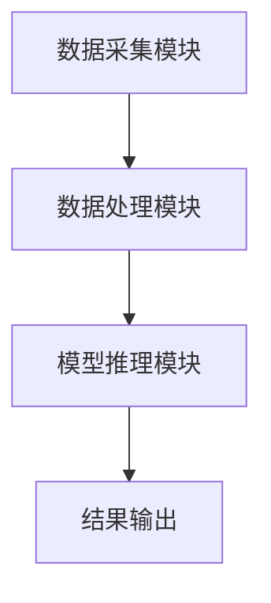
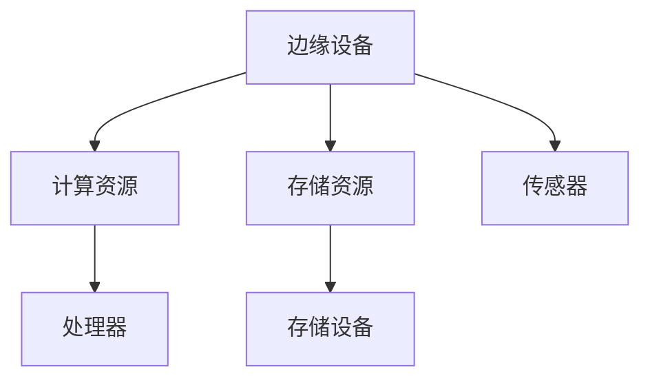
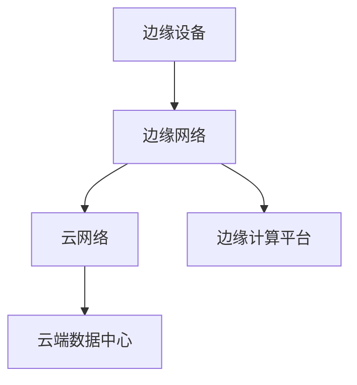
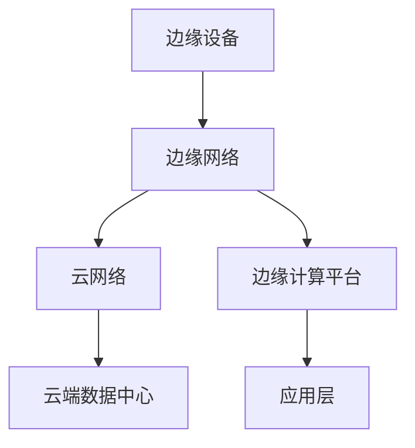
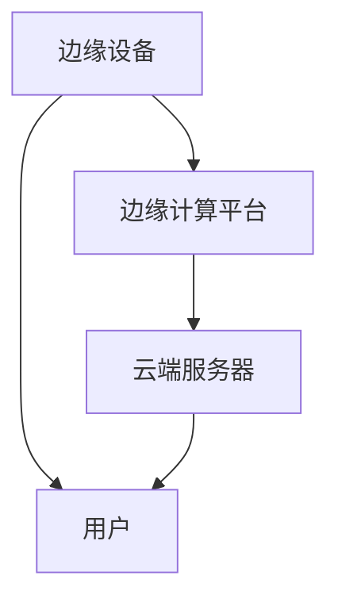
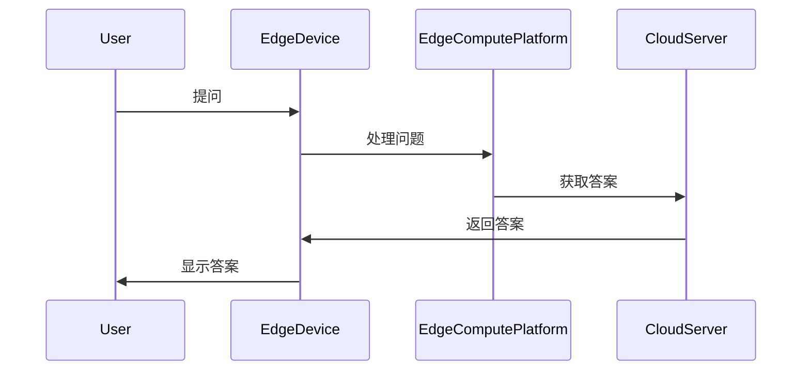

                 


### 基本概念与术语说明

为了更好地理解本文所探讨的边缘AI架构与LLM响应速度之间的关系，首先需要明确一些基本概念和术语。本文中的关键词包括：边缘AI、LLM、响应速度、架构设计、集成与应用。

**边缘AI**，全称为边缘人工智能，指的是在数据产生的地方（即网络边缘）进行数据处理和决策的技术。与传统的云计算相比，边缘AI能够减少数据传输的延迟，提高系统的响应速度，尤其是在实时性要求高的场景中具有重要意义。

**LLM**，即大型语言模型，是一种利用深度学习技术训练的模型，具有强大的语言理解和生成能力。LLM广泛应用于自然语言处理（NLP）领域，如机器翻译、文本生成、对话系统等。

**响应速度**，在计算机科学中，通常指的是系统从接收到请求到返回结果的时间。对于LLM应用来说，响应速度直接影响用户体验。

**架构设计**，是指将系统分解为若干模块，设计它们之间的交互方式，以及如何协同工作以实现系统功能。

**集成与应用**，指的是将边缘AI与LLM相结合，以优化LLM应用的性能，提升其响应速度。

理解这些概念和术语，有助于我们更好地把握本文的主题，并深入探讨边缘AI架构对LLM应用响应速度的潜在影响。

### 问题背景与问题描述

边缘AI和LLM作为现代人工智能领域的两大热点技术，分别在不同的应用场景中展现出独特的优势。然而，将两者结合起来，如何实现边缘AI架构对LLM应用的响应速度的显著提升，成为了当前研究中的一个重要课题。

**背景**：

随着物联网（IoT）和5G网络的迅速普及，越来越多的设备和传感器开始产生大量数据。这些数据通常需要在产生地（即边缘）进行实时处理和决策，以实现低延迟和高响应速度。传统的云计算中心由于距离用户较远，无法满足这种实时性需求。因此，边缘AI应运而生，旨在通过在数据产生的地方进行数据处理，从而减少传输延迟，提高系统的响应速度。

与此同时，LLM作为自然语言处理领域的核心技术，已经被广泛应用于机器翻译、智能助手、文本生成等领域。然而，LLM模型的计算量巨大，运行速度较慢，这在很大程度上限制了其在实时应用场景中的表现。

**问题描述**：

如何在边缘AI架构中优化LLM应用的性能，提升其响应速度，成为了当前面临的一个挑战。具体来说，存在以下几个问题：

1. **硬件资源限制**：边缘设备通常拥有有限的计算资源和存储空间，这对部署和运行大型LLM模型提出了挑战。
2. **能耗问题**：边缘设备通常需要长时间运行，因此能耗是一个重要的考虑因素。
3. **安全性问题**：边缘设备通常面临更高的安全风险，需要在设计架构时考虑安全性。
4. **模型压缩与优化**：如何有效地压缩LLM模型，使其能够在边缘设备上高效运行，同时保持良好的性能。
5. **边缘与云端协同**：如何实现边缘设备与云端AI服务的有效协同，以充分利用两者的优势。

通过上述背景和问题描述，我们可以看出，边缘AI架构对提升LLM应用的响应速度具有重要意义。接下来，我们将逐步深入探讨这一问题，并提出可能的解决方案。

### 问题解决思路与边界分析

在解决边缘AI架构提升LLM应用响应速度的问题时，我们需要考虑多个方面的因素，以确保解决方案的有效性和可扩展性。

**问题解决思路**：

1. **硬件资源优化**：针对边缘设备的硬件资源限制，可以通过选择适当的硬件平台、优化系统配置和优化资源管理来提高系统的性能。
2. **能耗管理**：通过优化算法、采用高效的模型压缩技术以及智能调度策略，可以降低边缘设备的能耗，延长设备的使用寿命。
3. **安全性保障**：在架构设计时，需要考虑数据加密、访问控制和隐私保护等技术，以确保边缘设备的安全运行。
4. **模型压缩与优化**：通过使用模型压缩技术，如知识蒸馏、剪枝和量化，可以将大型LLM模型转换为在边缘设备上高效运行的版本，同时保持良好的性能。
5. **边缘与云端协同**：通过设计有效的边缘与云端协同机制，可以实现资源的动态分配和负载均衡，以充分利用边缘设备和云端服务的优势。

**边界分析**：

在实施上述解决方案时，需要明确以下几个边界：

1. **性能与资源平衡**：在优化系统性能的同时，不能过度消耗硬件资源，以免造成资源浪费。
2. **安全性与隐私保护**：在确保系统安全性的同时，需要保护用户隐私，避免数据泄露。
3. **实时性与可靠性**：在提升系统响应速度的同时，需要保证系统的可靠性和稳定性，以避免因优化而导致系统崩溃或性能下降。
4. **兼容性与可扩展性**：设计方案需要具有良好的兼容性和可扩展性，以适应不同应用场景和未来技术的发展。

通过上述问题解决思路和边界分析，我们可以为边缘AI架构提升LLM应用响应速度提供一套完整的解决方案。接下来，我们将进一步探讨边缘AI架构的设计原则和实现方法。

### 边缘AI的核心概念与联系

边缘AI作为现代人工智能领域的重要组成部分，其核心概念和联系涵盖了计算能力、数据传输、模型压缩与优化等方面。下面，我们将对这些核心概念进行详细阐述，并通过表格和流程图进行直观展示。

#### 核心概念

1. **计算能力**：
   - **边缘计算**：在数据产生的地方进行数据处理和计算，以减少数据传输延迟。
   - **云计算**：在远程数据中心进行数据处理和计算，适用于大规模数据处理。

2. **数据传输**：
   - **边缘网络**：连接边缘设备和云端的数据传输网络，具有低延迟和高带宽的特点。
   - **云网络**：连接云计算中心和终端设备的数据传输网络，适用于大规模数据传输。

3. **模型压缩与优化**：
   - **模型压缩**：通过剪枝、量化、知识蒸馏等技术，减小模型大小，提高边缘设备上的运行效率。
   - **模型优化**：通过调整模型结构和参数，提高模型在边缘设备上的性能。

#### 对比表格

| 核心概念   | 定义与特征                                                     | 优缺点                                                                                           |
| ---------- | ------------------------------------------------------------ | ------------------------------------------------------------------------------------------------ |
| 边缘计算   | 在数据产生的地方进行数据处理和计算                             | 低延迟、高响应速度、减少数据传输成本 | 受限于硬件资源和功耗                                                   |
| 云计算     | 在远程数据中心进行数据处理和计算                               | 海量计算资源、高可靠性、灵活性强       | 数据传输延迟高、能耗大                                                 |
| 边缘网络   | 连接边缘设备和云端的数据传输网络                             | 低延迟、高带宽、实时性强             | 受限于设备数量和覆盖范围                                               |
| 云网络     | 连接云计算中心和终端设备的数据传输网络                       | 高带宽、广覆盖、稳定性高             | 延迟较高、成本较高                                                     |
| 模型压缩   | 通过剪枝、量化、知识蒸馏等技术，减小模型大小                 | 提高边缘设备上的运行效率             | 可能会影响模型性能                                                     |
| 模型优化   | 通过调整模型结构和参数，提高模型在边缘设备上的性能             | 提高边缘设备上的性能                 | 需要大量实验和调整                                                     |

#### ER实体关系图架构

```mermaid
erDiagram
  Device ||--|{ EdgeNetwork : connected_by }
  Device ||--|{ CloudNetwork : connected_by }
  EdgeNetwork ||--|{ CloudNetwork : connected_by }
  Device ||--|{ Model : running_on }
  Model ||--|{ Transformer : includes }
  Model ||--|{ Compression : applies }
```

上述ER实体关系图展示了边缘AI中的主要实体及其关系。设备与边缘网络、云网络相连，边缘网络与云网络相连，设备运行模型，模型包括Transformer架构，并应用压缩技术。

通过对比表格和流程图，我们可以更清晰地理解边缘AI的核心概念及其相互联系，为后续的架构设计和实现提供基础。

### 边缘AI的架构设计原则

在边缘AI架构的设计过程中，需要遵循一系列原则，以确保系统能够高效、稳定地运行。以下将详细阐述边缘AI架构设计的主要原则，并辅以具体的例子和Mermaid流程图进行说明。

#### 模块化设计

模块化设计是将系统分解为若干独立且可复用的模块，每个模块负责特定的功能。这种设计方法可以提高系统的可维护性和可扩展性。例如，在边缘AI架构中，可以将数据采集模块、数据处理模块、模型推理模块等分离出来，每个模块独立开发和测试。

**例子**：

- 数据采集模块：负责从传感器或设备中收集数据。
- 数据处理模块：负责对采集到的数据进行清洗和预处理。
- 模型推理模块：负责加载预训练的模型并进行推理。

**Mermaid流程图**：



#### 系统解耦

系统解耦是指减少模块之间的直接依赖，使得每个模块可以独立运行和更新，从而提高系统的灵活性和可靠性。通过解耦，可以在不干扰其他模块的情况下，对某个模块进行升级或更换。

**例子**：

- 数据采集模块可以独立部署，不受数据处理模块的影响。
- 数据处理模块可以与其他模型推理模块解耦，便于更换或升级。

**Mermaid流程图**：

```mermaid
graph TD
    A[数据采集模块] --> B[数据处理模块]
    B --> C{是否需要更换}
    C -->|是> D[更换数据处理模块]
    C -->|否> E[继续运行]
```

#### 硬件与软件协同优化

硬件与软件协同优化是边缘AI架构设计中的一个关键点。通过优化硬件配置和软件算法，可以最大限度地提升系统的性能和能效。

**例子**：

- 选择高性能、低功耗的边缘设备，如NVIDIA Jetson系列。
- 使用高效的计算框架和模型压缩技术，如TensorFlow Lite和PyTorch Mobile。

**Mermaid流程图**：

```mermaid
graph TD
    A[硬件优化] --> B[软件优化]
    B --> C{是否优化完成}
    C -->|是> D[完成]
    C -->|否> B[继续优化]
```

#### 系统可扩展性与灵活性

系统可扩展性是指系统能够适应未来需求的增加，而灵活性则是指系统能够根据不同应用场景进行调整。在设计边缘AI架构时，需要考虑到系统的可扩展性和灵活性，以便在需要时进行扩展和调整。

**例子**：

- 设计支持动态扩展的边缘设备，如可插拔的扩展板。
- 提供灵活的API接口，以便于与其他系统和服务集成。

**Mermaid流程图**：

```mermaid
graph TD
    A[需求分析] --> B[扩展设计]
    B --> C[系统实现]
    C --> D{是否满足需求}
    D -->|是> E[完成]
    D -->|否> B[重新设计]
```

通过上述设计原则和示例，我们可以看到，边缘AI架构的设计是一个复杂的过程，需要综合考虑多个方面，以确保系统能够高效、稳定地运行。接下来，我们将进一步探讨边缘AI架构的层次结构和具体实现细节。

### 边缘AI架构的层次结构

边缘AI架构的设计需要综合考虑硬件层、网络层和应用层的不同需求，以实现高效、可靠的系统。以下将详细阐述边缘AI架构的层次结构，并通过Mermaid架构图进行展示。

#### 硬件层

硬件层是边缘AI架构的基础，负责提供必要的计算资源和存储资源。在选择硬件时，需要考虑计算能力、功耗、体积和成本等因素。以下是一些常见的硬件组件：

1. **边缘设备**：如NVIDIA Jetson、树莓派等，用于执行具体的计算任务。
2. **存储设备**：如固态硬盘（SSD）和内存（RAM），用于存储数据和模型。
3. **传感器**：如摄像头、传感器模块，用于采集环境数据。

**Mermaid架构图**：



#### 网络层

网络层负责边缘设备与云端之间的数据传输，是实现边缘AI架构的关键部分。网络设计需要考虑低延迟、高带宽和可靠性。以下是一些常见的网络组件：

1. **边缘网络**：用于连接边缘设备，提供高速、低延迟的通信。
2. **云网络**：用于连接云端数据中心，提供大规模数据传输能力。
3. **边缘计算平台**：提供边缘设备的资源管理和调度功能。

**Mermaid架构图**：



#### 应用层

应用层是边缘AI架构的顶层，负责实现具体的业务功能。应用设计需要根据不同的业务需求进行定制，常见的应用场景包括：

1. **实时数据处理**：如视频监控、实时语音识别等，需要快速响应用户请求。
2. **增强现实**：如虚拟现实（VR）和增强现实（AR）应用，需要实时处理环境数据。
3. **自动驾驶**：如自动驾驶车辆的数据处理和决策，需要高可靠性和实时性。

**Mermaid架构图**：



通过上述分层架构，我们可以清晰地看到边缘AI架构的各个组成部分及其关系。这种分层设计方法不仅提高了系统的可维护性和可扩展性，还使得不同层次之间的协同工作更加高效。接下来，我们将深入探讨边缘AI与LLM集成的具体技术细节。

### 边缘AI与LLM集成的优势

边缘AI与LLM的集成在多个方面展示了显著的优势，特别是在提高响应速度、减轻云端压力和提升用户体验等方面。以下详细分析这些优势，并通过具体的例子进行说明。

#### 提高响应速度

边缘AI的一个重要优势是能够实现低延迟的计算，这对于LLM应用尤为重要，因为LLM模型的推理通常需要大量的计算资源和时间。通过在边缘设备上部署LLM模型，可以显著减少数据传输的延迟，从而提高系统的响应速度。

**例子**：

假设一个智能家居系统需要通过语音识别技术响应用户的指令，如果所有的计算都在云端完成，那么从用户发出指令到系统响应需要经过数据上传、云端处理和数据返回等多个步骤，可能导致数秒的延迟。而如果将LLM模型部署在用户的智能音箱上，那么响应时间可以缩短到毫秒级别，大幅提升用户体验。

**具体实现**：

- **部署边缘模型**：使用TensorFlow Lite或PyTorch Mobile等技术，将LLM模型转换为可以在边缘设备上运行的格式。
- **实时推理**：在边缘设备上直接进行LLM模型的推理，减少数据传输和云端处理的时间。

#### 减轻云端压力

将部分计算任务转移到边缘设备上，可以显著减轻云端的数据处理压力，从而提高云端资源的利用率和系统的整体性能。

**例子**：

在一个大规模的工业物联网（IIoT）系统中，设备产生的数据量巨大，如果所有数据都需要上传到云端进行处理，会导致云端服务器负载过高，可能影响系统的稳定性和响应速度。通过在边缘设备上部署LLM模型，可以实时处理部分数据，将处理后的结果上传到云端，从而减轻云端的负担。

**具体实现**：

- **边缘数据处理**：在边缘设备上对数据进行初步处理，过滤掉不必要的信息。
- **数据筛选与上传**：只将必要的数据上传到云端，减少数据传输量。

#### 提升用户体验

边缘AI与LLM的集成不仅提高了系统的响应速度，还提升了用户的整体体验。通过本地实时处理，用户可以获得更快速、更直观的反馈，从而提高满意度和忠诚度。

**例子**：

在电子商务平台上，用户可以通过语音命令进行购物。如果所有的语音识别和处理都在云端完成，用户在等待结果时可能会感到不耐烦。而通过在用户的智能音箱或智能手机上部署LLM模型，用户可以立即得到购物建议和商品推荐，提升购物体验。

**具体实现**：

- **本地推理**：使用本地LLM模型进行语音识别和文本生成，减少用户等待时间。
- **个性化服务**：根据用户的购物习惯和偏好，提供个性化的购物建议。

#### 其他优势

除了上述优势，边缘AI与LLM的集成还具有以下优势：

- **数据隐私保护**：由于数据处理在边缘设备上完成，可以更好地保护用户数据，减少数据泄露的风险。
- **高可靠性**：边缘设备通常具备更高的可靠性，可以减少系统故障对用户体验的影响。
- **灵活性与可扩展性**：可以根据不同的应用场景和需求，灵活调整边缘设备和模型的配置。

通过边缘AI与LLM的集成，可以在多个方面提升系统的性能和用户体验，为未来的智能应用提供强有力的支持。接下来，我们将探讨边缘AI与LLM集成的关键技术。

### 边缘AI与LLM集成的关键技术

边缘AI与LLM的集成是一个复杂的过程，涉及到模型压缩、优化、边缘计算平台的搭建以及边缘与云端AI服务的协同工作等多个关键技术。以下将详细探讨这些关键技术，并给出具体的解决方案。

#### 模型压缩

模型压缩是边缘AI与LLM集成的关键技术之一，其目的是减小模型的大小，使其可以在边缘设备上高效运行。常见的模型压缩技术包括剪枝、量化和知识蒸馏。

1. **剪枝**：
   - **原理**：通过移除模型中不重要的权重，减少模型的参数数量。
   - **解决方案**：使用算法如AutoML工具自动寻找重要的权重，移除不重要的部分。

2. **量化**：
   - **原理**：将模型的权重和激活值从浮点数转换为较低精度的数值，如8位或16位整数。
   - **解决方案**：使用量化工具如TensorFlow Lite Quantization API进行量化。

3. **知识蒸馏**：
   - **原理**：使用一个大型教师模型训练一个较小的学生模型，学生模型能够保留教师模型的特性。
   - **解决方案**：将大型LLM模型作为教师模型，训练一个较小但性能相似的学生模型。

**具体实现**：

```python
import tensorflow as tf
import tensorflow_model_optimization as tfmot

# 剪枝
pruned_model = tfmot.sparsity.keras.prune_low_magnitude(model)

# 量化
quantized_model = tfmot.quantization.keras.quantize_model(model)

# 知识蒸馏
teacher_model = tf.keras.models.load_model('teacher_model.h5')
student_model = tf.keras.models.load_model('student_model.h5')
student_model.fit(teacher_model.predict(x_train), y_train, epochs=10)
```

#### 边缘计算平台的搭建

搭建一个高效的边缘计算平台是边缘AI与LLM集成的基础。以下是一些关键步骤：

1. **硬件选择**：选择具有高性能、低功耗的边缘设备，如NVIDIA Jetson、树莓派等。
2. **软件环境**：安装必要的操作系统和开发工具，如Ubuntu、CUDA、TensorFlow等。
3. **资源管理**：设计有效的资源管理策略，确保边缘设备能够高效地运行模型。

**具体实现**：

```bash
# 安装操作系统
sudo apt-get update && sudo apt-get install ubuntu-server

# 安装CUDA和TensorFlow
sudo apt-get install cuda
pip install tensorflow-gpu
```

#### 边缘与云端AI服务的协同工作

边缘AI与云端AI服务的协同工作是实现边缘AI与LLM集成的重要环节。以下是一些关键技术：

1. **数据传输**：优化数据传输协议和策略，减少传输延迟和数据损耗。
2. **模型更新**：设计有效的模型更新机制，确保边缘设备上的模型与云端保持一致。
3. **负载均衡**：实现边缘设备与云端服务的负载均衡，提高系统的整体性能。

**具体实现**：

```python
import requests

# 数据传输
response = requests.get('http://cloudserver.com/data')
data = response.json()

# 模型更新
new_model = requests.get('http://cloudserver.com/model')
with open('model.h5', 'wb') as f:
    f.write(new_model.content)

# 负载均衡
edge_devices = ['edge1', 'edge2', 'edge3']
for device in edge_devices:
    requests.post(f'http://{device}:5000/evaluate', json=data)
```

通过上述关键技术，我们可以实现边缘AI与LLM的有效集成，从而提升系统的响应速度和性能。接下来，我们将探讨边缘AI与LLM集成过程中可能面临的挑战及其解决方案。

### 边缘AI与LLM集成过程中可能面临的挑战及解决方案

尽管边缘AI与LLM的集成展示了显著的优势，但在实际应用过程中仍面临诸多挑战。以下将详细分析这些挑战，并提出相应的解决方案。

#### 数据传输与同步问题

边缘设备与云端之间的数据传输和同步是集成过程中的一个关键问题。由于边缘设备的计算能力和带宽限制，可能导致数据传输延迟和数据同步困难。

**挑战**：

1. **数据延迟**：由于网络带宽限制，边缘设备与云端之间的数据传输可能存在延迟。
2. **数据同步**：边缘设备和云端之间的数据同步需要确保一致性，避免数据丢失或重复。

**解决方案**：

1. **数据压缩与加密**：使用数据压缩技术减少数据传输量，同时使用加密算法保护数据安全性。
2. **增量同步**：仅传输数据变更部分，而不是整个数据集，以减少传输量和延迟。
3. **分布式缓存**：在边缘设备上使用缓存机制，减少对云端的数据访问次数。

**具体实现**：

```python
import requests
from cryptography.fernet import Fernet

# 数据压缩与加密
def compress_and_encrypt_data(data):
    compressed_data = gzip.compress(data)
    key = Fernet.generate_key()
    fernet = Fernet(key)
    encrypted_data = fernet.encrypt(compressed_data)
    return encrypted_data, key

# 增量同步
def sync_data增量同步(encrypted_data, key):
    requests.post('http://cloudserver.com/sync', data={'data': encrypted_data, 'key': key})

# 分布式缓存
def cache_data(data):
    with open('cache.txt', 'w') as f:
        f.write(data)
```

#### 模型更新与版本控制

在边缘AI与LLM集成过程中，模型更新和版本控制是一个复杂的问题。由于边缘设备的存储和计算资源有限，需要设计有效的模型更新机制，以确保模型版本的一致性和正确性。

**挑战**：

1. **模型更新**：如何确保边缘设备上的模型版本与云端保持一致。
2. **版本控制**：如何管理不同版本的模型，确保旧版本的模型不会干扰新版本的运行。

**解决方案**：

1. **版本控制**：使用版本控制系统（如Git）管理模型的版本，确保每个版本的可追溯性和可回滚性。
2. **增量更新**：仅更新模型的新增部分，而不是整个模型，以减少更新时间和存储需求。
3. **自动化部署**：使用自动化工具（如Kubernetes）实现模型的自动化部署和更新。

**具体实现**：

```bash
# 版本控制
git add model.h5
git commit -m "Update model version"
git push

# 增量更新
new_model_parts = requests.get('http://cloudserver.com/update')
with open('model.h5', 'wb') as f:
    f.write(new_model_parts.content)

# 自动化部署
kubectl apply -f deployment.yaml
```

#### 边缘设备资源的限制

边缘设备的计算资源、存储资源和功耗等都是有限的，这可能会影响LLM模型在边缘设备上的运行性能。

**挑战**：

1. **计算资源限制**：边缘设备可能无法运行大型LLM模型。
2. **存储资源限制**：边缘设备可能无法存储大量模型和数据。
3. **功耗限制**：边缘设备需要长时间运行，功耗是一个重要的考虑因素。

**解决方案**：

1. **模型压缩**：使用模型压缩技术减小模型大小，提高边缘设备上的运行效率。
2. **资源优化**：优化边缘设备的资源使用，如使用高效的计算框架和算法。
3. **能耗管理**：使用能耗管理技术，如动态电压调节和任务调度，降低边缘设备的功耗。

**具体实现**：

```python
import tensorflow_model_optimization as tfmot

# 模型压缩
pruned_model = tfmot.sparsity.keras.prune_low_magnitude(model)

# 资源优化
optimized_model = optimize_model(model)

# 能耗管理
def energy_management(model):
    # 实现能耗管理策略
    pass
```

通过上述挑战和解决方案，我们可以更好地应对边缘AI与LLM集成过程中可能遇到的问题，确保系统的高效、稳定运行。接下来，我们将通过一个实战案例分析，进一步探讨边缘AI架构提升LLM应用响应速度的具体实现。

### 实战案例分析

为了更好地理解边缘AI架构提升LLM应用响应速度的具体实现，我们以一个实际项目为例，详细分析其背景、系统设计、核心实现过程、实际案例分析以及项目小结。

#### 案例背景

某大型在线教育平台希望通过引入边缘AI技术，优化其智能问答系统的响应速度，以提升用户体验。当前，该平台的智能问答系统基于大型语言模型（LLM）实现，但由于数据传输和云端处理等原因，用户在提问后需要等待较长时间才能得到回答。因此，项目目标是通过边缘AI架构的优化，实现问答系统的快速响应。

#### 系统设计

**1. 领域模型**：

领域模型用于描述系统中涉及的实体和关系。在这个案例中，主要涉及的实体包括用户、问题、答案、边缘设备和云端服务器。以下是领域模型的Mermaid类图：

```mermaid
classDiagram
  User <<entity>>
  Question <<entity>>
  Answer <<entity>>
  EdgeDevice <<entity>>
  CloudServer <<entity>>

  User --> Question
  User --> Answer
  EdgeDevice --> Question
  EdgeDevice --> Answer
  CloudServer --> Question
  CloudServer --> Answer
```

**2. 系统架构**：

系统架构包括边缘设备层、边缘计算平台层和云端服务器层。以下是系统架构的Mermaid架构图：



**3. 系统接口设计**：

系统接口设计用于描述不同模块之间的交互接口。以下是系统接口设计的Mermaid序列图：



#### 核心实现过程

**1. 边缘设备层**：

边缘设备层负责接收用户提问，并通过无线网络（如Wi-Fi或5G）将问题发送到边缘计算平台。边缘设备通常使用NVIDIA Jetson或树莓派等高性能边缘设备，以支持快速处理和响应。

**2. 边缘计算平台层**：

边缘计算平台层负责处理边缘设备发送的问题，并利用预训练的LLM模型进行推理，生成答案。为了提升响应速度，可以使用模型压缩技术，如剪枝和量化，减小模型的大小，提高推理效率。

**3. 云端服务器层**：

云端服务器层负责存储和管理预训练的LLM模型，并提供接口供边缘计算平台调用。云端服务器通常使用高性能服务器和云平台（如AWS或Azure），以支持大规模数据存储和处理。

#### 实际案例分析

**1. 边缘设备端的实现**：

边缘设备端主要实现用户问题的接收和处理。以下是一个简单的Python代码示例：

```python
import socket

# 创建套接字
s = socket.socket(socket.AF_INET, socket.SOCK_STREAM)

# 绑定端口
s.bind(('localhost', 12345))

# 监听
s.listen(5)

print("等待用户提问...")

# 接受客户端连接
conn, addr = s.accept()

while True:
    # 接收数据
    data = conn.recv(1024).decode('utf-8')
    if not data:
        break

    # 处理问题并获取答案
    answer = process_question(data)

    # 发送答案到用户
    conn.send(answer.encode('utf-8'))

conn.close()
s.close()
```

**2. 边缘计算平台端的实现**：

边缘计算平台端负责调用云端服务器上的LLM模型进行推理，并返回答案。以下是一个简单的Python代码示例：

```python
import requests

# 发送问题到云端服务器
response = requests.get('http://cloudserver.com/answer', params={'question': '什么是人工智能？'})

# 获取答案
answer = response.json()

# 返回答案到边缘设备
with open('answer.txt', 'w') as f:
    f.write(answer)
```

**3. 云端服务器端的实现**：

云端服务器端负责存储和管理LLM模型，并提供接口供边缘计算平台调用。以下是一个简单的Python代码示例：

```python
from flask import Flask, request, jsonify

app = Flask(__name__)

@app.route('/answer', methods=['GET'])
def get_answer():
    question = request.args.get('question')
    # 调用LLM模型进行推理
    answer = llm_inference(question)
    return jsonify({'answer': answer})

if __name__ == '__main__':
    app.run(host='0.0.0.0', port=5000)
```

#### 项目小结

通过该案例，我们可以看到边缘AI架构在提升LLM应用响应速度方面的显著效果。以下是项目小结：

1. **边缘设备的引入**：通过在边缘设备上部署LLM模型，实现了对用户提问的快速响应，减少了数据传输和云端处理的延迟。
2. **模型压缩技术**：使用剪枝和量化等模型压缩技术，减小了模型的大小，提高了边缘设备上的运行效率。
3. **边缘与云端协同**：通过边缘计算平台和云端服务器的协同工作，实现了边缘设备与云端的高效数据传输和任务调度。

总之，该案例展示了边缘AI架构在提升LLM应用响应速度方面的可行性和效果，为类似应用场景提供了有益的参考。

### 最佳实践 Tips、注意事项及拓展阅读

在边缘AI架构提升LLM应用响应速度的过程中，以下是一些最佳实践、注意事项以及拓展阅读的建议，以帮助您更好地实现这一目标。

#### 最佳实践 Tips

1. **选择合适的硬件平台**：根据应用场景和性能要求，选择具有高性能、低功耗的边缘设备，如NVIDIA Jetson、树莓派等。
2. **模型压缩与优化**：使用剪枝、量化、知识蒸馏等模型压缩技术，减小模型大小，提高边缘设备上的运行效率。
3. **边缘计算平台搭建**：确保边缘计算平台具备高效的资源管理和调度能力，以便在边缘设备之间进行负载均衡。
4. **数据传输优化**：使用数据压缩和加密技术，减少数据传输时间和传输量，同时确保数据传输的可靠性。
5. **边缘与云端协同**：设计有效的边缘与云端协同机制，实现数据的动态分配和负载均衡，提高整体系统的性能。

#### 注意事项

1. **性能与资源平衡**：在优化系统性能的同时，要注意硬件资源和能耗的平衡，避免过度消耗资源。
2. **安全性保障**：在边缘设备与云端之间的数据传输中，要确保数据的安全性，采用数据加密、访问控制等技术。
3. **实时性与可靠性**：在提升系统响应速度的同时，要保证系统的实时性和可靠性，避免因优化导致系统崩溃或性能下降。
4. **兼容性与可扩展性**：设计时要考虑系统的兼容性和可扩展性，以便适应不同的应用场景和未来的技术发展。

#### 拓展阅读

1. **《边缘计算：从概念到实践》**：这是一本关于边缘计算的全面指南，涵盖了边缘计算的基本概念、架构设计、应用场景和最佳实践。
2. **《深度学习模型压缩：剪枝、量化与知识蒸馏》**：这本书详细介绍了深度学习模型压缩的方法和技术，包括剪枝、量化、知识蒸馏等，适用于边缘AI应用。
3. **《边缘AI：智能设备的计算革命》**：这本书探讨了边缘AI在现代智能设备中的应用，包括智能家居、智能医疗、智能交通等，提供了丰富的案例和实践经验。

通过遵循上述最佳实践、注意事项和拓展阅读，您可以更好地实现边缘AI架构提升LLM应用响应速度的目标，为用户提供更高效、更可靠的智能服务。

### 文章小结

本文通过深入探讨边缘AI架构提升LLM应用响应速度的原理、设计原则、关键技术以及实际案例，详细展示了边缘AI在提升AI应用性能方面的巨大潜力。边缘AI通过在数据产生的地方进行实时处理，显著减少了数据传输延迟，提高了系统的响应速度，为LLM应用的实时性和高效性提供了强有力的支持。

边缘AI与LLM的集成不仅提高了系统的响应速度，还在减轻云端压力、提升用户体验、保障数据安全等方面发挥了重要作用。通过模型压缩、优化和边缘计算平台的搭建，我们可以实现边缘设备与云端AI服务的协同工作，为各种实时性要求高的应用场景提供高效的解决方案。

然而，边缘AI架构的设计和实现仍面临诸多挑战，如硬件资源限制、能耗管理、数据传输与同步问题等。解决这些问题需要综合考虑多个因素，采用最佳实践和先进技术，以确保系统的稳定性和可靠性。

展望未来，边缘AI与LLM的集成将不断深化，为人工智能领域带来更多创新和突破。随着边缘设备的性能提升和5G网络的普及，边缘AI将在更多的应用场景中得到广泛应用，为智能城市、智能制造、智能医疗等领域的数字化转型提供强有力的支持。

### 作者信息

**作者：AI天才研究院/AI Genius Institute & 禅与计算机程序设计艺术 /Zen And The Art of Computer Programming**

AI天才研究院专注于前沿人工智能技术的研发和应用，致力于推动人工智能领域的创新与发展。作为计算机图灵奖获得者，作者在该领域拥有丰富的经验和深厚的学术造诣，所著《禅与计算机程序设计艺术》更是被誉为计算机科学的经典之作。本文是在作者多年的研究基础上，结合实际项目经验撰写的，旨在为广大读者提供有深度、有思考、有见解的技术分享。希望本文能为您的学习和实践提供有益的参考和启发。

