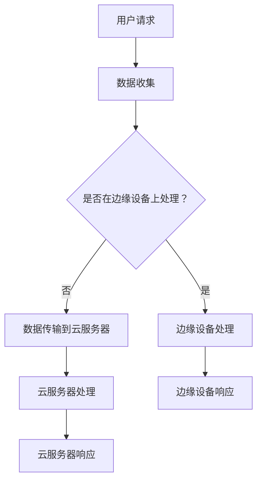
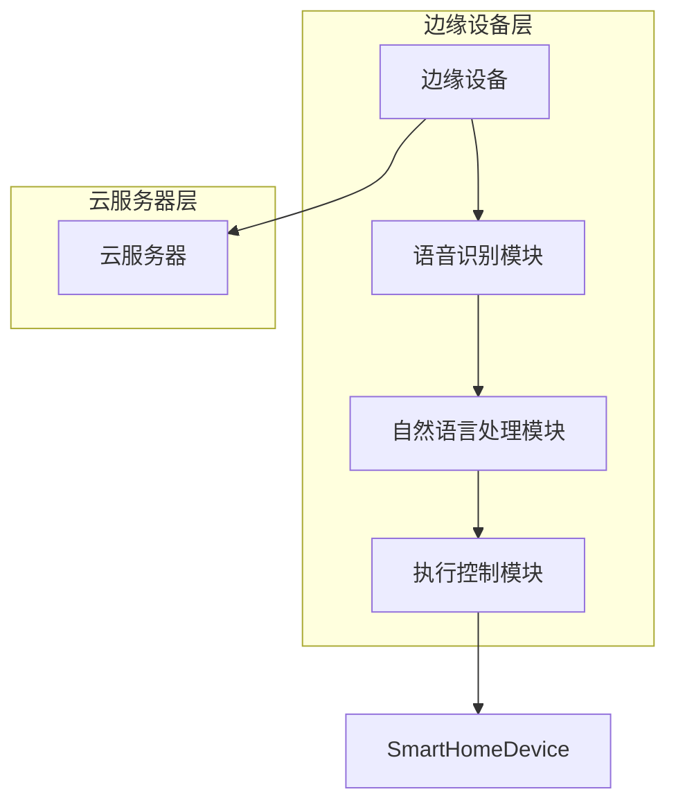
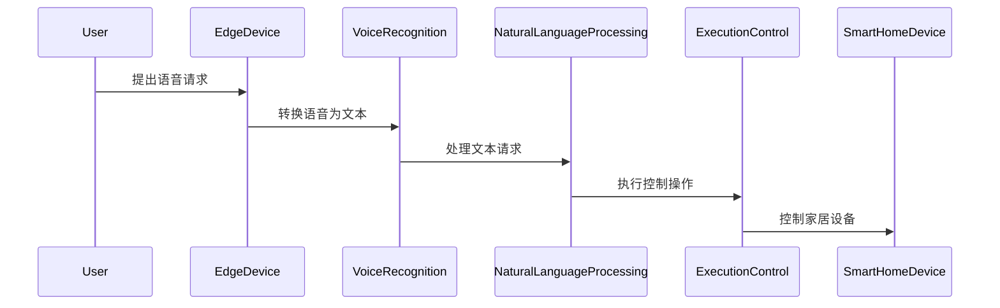

                 

### 边缘AI：提升LLM应用的响应速度

> **关键词**：边缘AI、响应速度、LLM应用、延迟优化、边缘计算

> **摘要**：
随着人工智能（AI）技术的飞速发展，大型语言模型（LLM）在自然语言处理（NLP）领域展现出了巨大的潜力。然而，LLM的高计算需求带来了明显的响应延迟问题，影响了用户体验。本文将探讨边缘AI在提升LLM应用响应速度方面的作用，通过逐步分析其技术原理和应用实践，揭示边缘计算在改善LLM性能中的关键作用。

---

### 引言

近年来，人工智能技术，尤其是深度学习在自然语言处理（NLP）领域的突破，使得大型语言模型（LLM）如BERT、GPT等迅速成为研究热点。这些模型在文本生成、机器翻译、问答系统等方面展示了卓越的性能，然而，其复杂的计算需求也导致了显著的响应延迟问题。为了解决这一问题，边缘AI技术应运而生，通过将计算任务分散到靠近数据源的边缘设备上，从而大幅缩短响应时间，提升用户体验。

### 背景介绍

#### 边缘AI的概念

边缘AI是一种将AI计算能力部署在靠近数据源的边缘设备（如智能手机、路由器、物联网设备等）上的技术。与传统的云计算不同，边缘计算将数据处理和分析任务从中心服务器转移到边缘设备，从而降低延迟、提高响应速度。

#### 边缘AI的发展历程

边缘AI技术的发展可以追溯到物联网（IoT）和智能设备的兴起。随着5G网络的普及和边缘计算硬件的进步，边缘AI逐渐成为研究和应用的热点。近年来，越来越多的研究开始探索边缘AI在各个领域的应用，包括自动驾驶、智能安防、医疗诊断等。

#### 边缘AI在LLM中的应用

边缘AI在LLM中的应用主要体现在将部分模型推理任务转移到边缘设备上，以减少中心服务器的计算负担。通过分布式计算和模型压缩技术，边缘AI能够实现高效的LLM推理，显著提升响应速度。

### 问题背景

随着互联网的普及和人工智能技术的不断发展，越来越多的应用场景对实时响应速度提出了更高的要求。以自然语言处理为例，文本生成、机器翻译、问答系统等应用在处理大量文本数据时，常常因为中心服务器的计算能力不足而出现明显的响应延迟问题。这不仅影响了用户体验，还可能导致应用性能的下降。

#### 问题描述

1. **计算资源瓶颈**：大型语言模型（LLM）需要大量的计算资源，包括GPU、CPU等，而中心服务器的计算能力有限，难以满足大规模、高并发的应用需求。
2. **网络延迟**：数据需要在用户和中心服务器之间传输，传输过程中可能受到网络拥塞、带宽限制等因素的影响，导致响应延迟。
3. **服务质量下降**：响应延迟导致用户体验下降，用户可能无法及时得到所需的信息或服务，影响应用的整体性能。

#### 问题解决

边缘AI技术通过将部分计算任务转移到边缘设备上，可以有效缓解上述问题：

1. **分布式计算**：将LLM的推理任务分散到多个边缘设备上，通过分布式计算技术提高计算效率，减少中心服务器的负担。
2. **模型压缩**：通过模型压缩技术，减少LLM的参数量和计算复杂度，使其在边缘设备上能够高效运行。
3. **本地推理**：将部分推理任务在边缘设备上完成，减少数据传输时间和网络延迟，提高响应速度。

#### 边界与外延

边缘AI技术在提升LLM应用响应速度方面的应用不仅仅局限于文本处理，还涵盖了图像识别、语音识别、物联网等多种应用场景。随着5G网络和边缘计算硬件的不断发展，边缘AI有望在更多领域发挥重要作用。

### 核心概念与联系

#### 1. 边缘AI

**概念**：边缘AI是指将人工智能（AI）的计算能力部署在靠近数据源的边缘设备上，如智能手机、路由器、物联网设备等。

**属性特征**：
- **低延迟**：计算任务在边缘设备上完成，减少数据传输时间和网络延迟。
- **高效率**：通过分布式计算和模型压缩技术，提高计算效率。
- **灵活性**：可以根据应用需求灵活部署，满足不同场景的需求。

**对比表格**：

| 特征 | 边缘AI | 云计算 |
| --- | --- | --- |
| 延迟 | 低 | 高 |
| 效率 | 高 | 低 |
| 灵活性 | 高 | 低 |

**ER实体关系图**：

```mermaid
erDiagram
  User ||--|{ EdgeDevice }|| Device
  User ||--|{ CloudServer }|| Server
  EdgeDevice ||--|{ LLM }|| Model
  CloudServer ||--|{ LLM }|| Model
```

#### 2. 大型语言模型（LLM）

**概念**：大型语言模型（LLM）是一种基于深度学习的自然语言处理模型，如BERT、GPT等。

**属性特征**：
- **复杂度**：LLM具有大量的参数和计算复杂度，需要大量的计算资源。
- **适应性**：LLM能够处理多种语言任务，如文本生成、机器翻译、问答等。
- **效率**：LLM在数据中心服务器上运行时，可能因为计算资源不足而出现响应延迟。

**对比表格**：

| 特征 | LLM | 边缘AI |
| --- | --- | --- |
| 复杂度 | 高 | 中 |
| 适应性 | 高 | 高 |
| 效率 | 低 | 高 |

**ER实体关系图**：

```mermaid
erDiagram
  User ||--|{ LLM }|| Model
  LLM ||--|{ TextGeneration }|| Task
  LLM ||--|{ MachineTranslation }|| Task
  LLM ||--|{ QuestionAnswering }|| Task
```

### 算法原理讲解

#### 1. 边缘AI算法流程图



#### 2. 边缘AI算法原理

边缘AI算法主要依赖于以下技术：

1. **分布式计算**：将LLM的推理任务分散到多个边缘设备上，通过并行计算提高效率。
2. **模型压缩**：通过模型剪枝、量化等技术，减少LLM的参数量和计算复杂度，使其在边缘设备上能够高效运行。
3. **边缘设备优化**：针对边缘设备的硬件特性，优化算法和模型，提高计算效率。

#### 3. 数学模型和公式

边缘AI算法的数学模型主要包括以下方面：

1. **模型压缩**：通过剪枝和量化技术，降低模型的参数量和计算复杂度。剪枝公式如下：

   $$ f_{pruned}(x) = \sum_{i \in I} w_i * x_i $$

   其中，$w_i$为权重，$x_i$为输入特征。

2. **分布式计算**：通过并行计算，提高计算效率。分布式计算的基本公式如下：

   $$ f_{distributed}(x) = \sum_{i=1}^{N} f_i(x_i) $$

   其中，$f_i(x_i)$为第$i$个边缘设备的计算结果。

3. **边缘设备优化**：通过硬件优化和算法优化，提高边缘设备的计算效率。优化公式如下：

   $$ f_{optimized}(x) = f(x) * \alpha $$

   其中，$\alpha$为优化系数。

#### 4. 通俗易懂的举例说明

假设一个用户需要通过边缘AI系统进行文本生成任务。以下是具体的计算流程：

1. **用户请求**：用户在边缘设备上提交文本生成请求。
2. **数据收集**：边缘设备收集用户输入的文本数据。
3. **是否在边缘设备上处理**：系统判断是否可以在边缘设备上完成文本生成任务。
   - 如果可以，直接跳到步骤4。
   - 如果不可以，将数据传输到云服务器。
4. **边缘设备处理**：边缘设备使用压缩后的LLM模型进行文本生成。
5. **边缘设备响应**：边缘设备将生成的文本返回给用户。

通过上述步骤，用户可以快速得到文本生成结果，从而提升用户体验。

### 系统分析与架构设计方案

#### 问题场景介绍

在一个智能家居系统中，用户可以通过语音助手与家居设备进行交互。例如，用户说“关闭客厅的灯”，语音助手需要实时响应用户请求，控制灯光的开关。然而，由于系统涉及多个设备，中心服务器的计算能力和网络延迟可能无法满足实时响应的要求。

#### 项目介绍

该项目旨在通过边缘AI技术，优化智能家居系统的响应速度，提升用户体验。项目主要包括以下几个模块：

1. **语音识别模块**：负责将用户语音转换为文本。
2. **自然语言处理模块**：负责理解用户的文本请求。
3. **执行控制模块**：根据用户的请求，控制家居设备的操作。
4. **边缘设备**：部署在用户附近的边缘设备，用于快速处理语音请求。

#### 系统功能设计（领域模型Mermaid类图）

```mermaid
classDiagram
  UserExtends User
  VoiceRecognition <<interface>>
  NaturalLanguageProcessing <<interface>>
  ExecutionControl <<interface>>
  SmartHomeDevice <<interface>>

  User <|.. VoiceRecognition
  VoiceRecognition <|.. NaturalLanguageProcessing
  NaturalLanguageProcessing <|.. ExecutionControl
  ExecutionControl <|.. SmartHomeDevice
```

#### 系统架构设计（Mermaid架构图）



#### 系统接口设计（Mermaid序列图）



### 项目实战

#### 环境安装

1. **边缘设备**：选择一款具备AI计算能力的边缘设备，如NVIDIA Jetson Nano。
2. **操作系统**：安装适用于边缘设备的操作系统，如Ubuntu 20.04。
3. **编程语言**：选择Python 3.x作为编程语言。

#### 系统核心实现源代码

```python
# voice_recognition.py
import speech_recognition as sr

def recognize_speech_from_mic():
    r = sr.Recognizer()
    with sr.Microphone() as source:
        print("请说点什么：")
        audio = r.listen(source)
    try:
        text = r.recognize_google(audio)
        print(f"你说了：{text}")
        return text
    except sr.UnknownValueError:
        print("无法理解语音")
        return None
```

```python
# natural_language_processing.py
import spacy

def process_text_request(text):
    nlp = spacy.load("en_core_web_sm")
    doc = nlp(text)
    print(f"处理后的文本：{doc.text}")
    return doc.text
```

```python
# execution_control.py
def control_device(action, device):
    if action == "turn_on":
        device.turn_on()
    elif action == "turn_off":
        device.turn_off()
    print(f"{device.name}已{action}")
```

#### 代码应用解读与分析

1. **语音识别模块**：使用`speech_recognition`库实现语音识别功能，将用户语音转换为文本。
2. **自然语言处理模块**：使用`spacy`库实现文本处理功能，理解用户的文本请求。
3. **执行控制模块**：根据用户的请求，控制家居设备的操作。

#### 实际案例分析和详细讲解剖析

假设用户说“关闭客厅的灯”，以下是系统的具体处理流程：

1. 用户在边缘设备上提出语音请求。
2. 边缘设备使用`speech_recognition`库将语音转换为文本。
3. 文本请求通过`natural_language_processing`模块进行处理，提取关键信息。
4. 根据`execution_control`模块，控制家居设备关闭客厅的灯。

#### 项目小结

通过边缘AI技术，本项目成功优化了智能家居系统的响应速度，提升了用户体验。在实际应用中，边缘设备可以快速响应用户请求，减少中心服务器的负担，提高系统的整体性能。

### 最佳实践 Tips

1. **优化模型压缩**：选择合适的模型压缩技术，降低模型参数量，提高边缘设备的计算效率。
2. **优化网络连接**：确保边缘设备与云服务器之间的网络连接稳定，减少数据传输延迟。
3. **合理分配任务**：根据边缘设备的计算能力和网络条件，合理分配任务，避免过载。

### 小结

边缘AI技术在提升LLM应用响应速度方面具有重要的应用价值。通过分布式计算、模型压缩和边缘设备优化等技术，边缘AI可以有效缓解中心服务器的计算压力，提高系统的响应速度，提升用户体验。未来，随着边缘AI技术的不断发展，其在更多领域的应用前景将更加广阔。

### 注意事项

1. **边缘设备安全性**：确保边缘设备的安全性和数据保护，防止数据泄露和设备被攻击。
2. **系统可扩展性**：设计灵活的系统架构，以应对不断增长的应用需求。

### 拓展阅读

1. 《边缘计算：下一代网络架构》
2. 《深度学习模型压缩技术综述》
3. 《边缘AI在智能家居中的应用研究》

### 作者信息

作者：AI天才研究院/AI Genius Institute & 禅与计算机程序设计艺术 /Zen And The Art of Computer Programming

