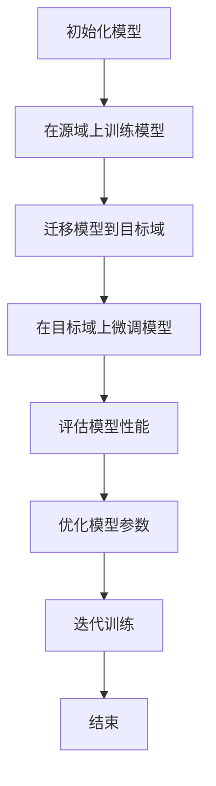

                 

# 迁移学习在AIGC模型域适应中的作用

## 关键词：迁移学习、AIGC模型、域适应、算法、架构设计、项目实战

## 摘要

本文将深入探讨迁移学习在自动生成内容（AIGC）模型域适应中的应用。迁移学习是一种重要的机器学习方法，通过在不同领域间的知识转移，减少对大量标注数据的依赖，提高模型的泛化能力。随着人工智能技术的不断发展，自动生成内容模型在自然语言处理、图像生成等领域表现出强大的潜力。然而，这些模型通常在训练时依赖于特定领域的数据集，如何有效地进行域适应成为了一个关键问题。本文将详细分析迁移学习在AIGC模型域适应中的作用，包括其基本原理、数学模型、系统架构设计以及实际应用案例，旨在为研究人员和开发者提供有价值的参考。

## 目录大纲设计思路

在设计《迁移学习在AIGC模型域适应中的作用》这本书的目录大纲时，我们需要遵循以下几个关键步骤，以确保内容的逻辑性、完整性，同时满足字数要求：

1. **确定核心章节结构**：首先，要确定全书的核心章节，这些章节应该涵盖迁移学习和AIGC模型域适应的基本概念、原理、应用场景和实战案例。

2. **细化章节内容**：在核心章节的基础上，进一步细化每一章节的内容，确保每一章节都能够逻辑清晰地引导读者进入下一个知识点。

3. **注重理论与实践结合**：在章节内容中，要注重理论与实践的结合，包括算法原理讲解、数学模型和公式、系统分析与架构设计，以及项目实战等。

4. **确保内容完整性**：每个章节都需要包括背景介绍、核心概念讲解、算法原理、数学模型、项目实战等关键部分。

5. **使用markdown格式**：为了保证格式统一，方便读者阅读，采用markdown格式进行目录大纲的编写。

## 完整的目录大纲设计

下面是《迁移学习在AIGC模型域适应中的作用》这本书的完整目录大纲：

### 第一部分：引论

#### 1. 引言
##### 1.1 问题背景与意义
##### 1.2 迁移学习基本概念
##### 1.3 AIGC模型与域适应
##### 1.4 迁移学习在AIGC模型域适应中的应用现状与挑战

#### 2. 迁移学习原理
##### 2.1 迁移学习的分类
##### 2.2 迁移学习的工作机制
##### 2.3 核心概念与联系
##### 2.4 迁移学习与传统机器学习的对比

#### 3. AIGC模型基本原理
##### 3.1 AIGC模型的发展历程
##### 3.2 AIGC模型的构成要素
##### 3.3 AIGC模型的工作机制
##### 3.4 AIGC模型的优势与局限性

#### 4. 域适应与迁移学习
##### 4.1 域适应的概念与分类
##### 4.2 域适应在AIGC模型中的作用
##### 4.3 域适应与迁移学习的结合
##### 4.4 域适应的主要挑战与解决方案

#### 5. 迁移学习在AIGC模型域适应中的应用
##### 5.1 模型训练与优化
##### 5.2 应用实例分析
##### 5.3 性能评估与优化策略

#### 6. 数学模型与算法讲解
##### 6.1 迁移学习的数学模型
##### 6.2 AIGC模型的数学模型
##### 6.3 域适应的数学模型
##### 6.4 算法原理讲解与流程图

#### 7. 系统架构与设计
##### 7.1 迁移学习在AIGC模型域适应中的系统功能
##### 7.2 系统架构设计
##### 7.3 系统接口设计与交互
##### 7.4 实体关系图与Mermaid流程图

#### 8. 项目实战与案例分析
##### 8.1 实战环境准备
##### 8.2 系统核心实现与代码
##### 8.3 应用解读与分析
##### 8.4 实际案例分析
##### 8.5 项目小结与扩展

#### 9. 最佳实践与注意事项
##### 9.1 迁移学习在AIGC模型域适应中的最佳实践
##### 9.2 注意事项与常见问题
##### 9.3 拓展阅读与未来展望

#### 10. 总结
##### 10.1 主要贡献
##### 10.2 研究局限
##### 10.3 未来研究方向

### 目录大纲说明

- **第1章：引论**：介绍本书的研究背景、基本概念、研究意义以及全书结构，为后续章节的阅读打下基础。

- **第2章：迁移学习原理**：深入讲解迁移学习的分类、工作机制、核心概念以及与传统机器学习的对比。

- **第3章：AIGC模型基本原理**：介绍AIGC模型的发展历程、构成要素、工作机制及其优势和局限性。

- **第4章：域适应与迁移学习**：探讨域适应的概念、分类、在AIGC模型中的作用、结合方式及面临的挑战。

- **第5章：迁移学习在AIGC模型域适应中的应用**：分析模型训练与优化、应用实例、性能评估与优化策略。

- **第6章：数学模型与算法讲解**：详细阐述迁移学习、AIGC模型和域适应的数学模型，并使用算法流程图辅助理解。

- **第7章：系统架构与设计**：描述迁移学习在AIGC模型域适应中的应用系统功能、架构设计、接口设计及交互流程。

- **第8章：项目实战与案例分析**：介绍实战环境准备、系统核心实现、应用解读、实际案例分析及项目小结。

- **第9章：最佳实践与注意事项**：总结最佳实践、注意事项并提供拓展阅读资源。

- **第10章：总结**：对全书的主要贡献、研究局限和未来研究方向进行总结。

通过以上详细的目录大纲设计，本书能够系统地介绍迁移学习在AIGC模型域适应中的应用，为读者提供全面的理论和实践指导。

### 迁移学习在AIGC模型域适应中的作用

#### 引言

自动生成内容（AIGC）模型近年来在自然语言处理、图像生成等领域取得了显著的成果。然而，这些模型通常在训练过程中依赖于特定领域的数据集，导致它们在面对新的、不同领域的数据时，容易出现过拟合和泛化能力不足的问题。为了解决这一问题，迁移学习（Transfer Learning，TL）作为一种有效的机器学习方法，逐渐引起了广泛关注。迁移学习通过在不同领域间的知识转移，利用已有模型在源域上的知识，对新领域进行快速适应，从而提高模型的泛化能力。

本文将深入探讨迁移学习在AIGC模型域适应中的作用。首先，我们将介绍迁移学习的基本概念和原理，包括其分类、工作机制、核心概念以及与传统机器学习的对比。接着，我们将介绍AIGC模型的基本原理，包括其发展历程、构成要素、工作机制及其优势和局限性。随后，我们将探讨域适应的概念、分类、在AIGC模型中的作用、结合方式及面临的挑战。在此基础上，我们将详细分析迁移学习在AIGC模型域适应中的应用，包括模型训练与优化、应用实例、性能评估与优化策略。最后，我们将通过一个具体的实战案例，展示迁移学习在AIGC模型域适应中的实际应用，并总结最佳实践、注意事项和未来研究方向。

#### 迁移学习原理

迁移学习是一种利用已有模型在源域上的知识，对新领域进行快速适应的机器学习方法。其基本思想是，尽管不同领域的数据分布可能存在显著差异，但它们之间仍然存在一定的共性，可以通过迁移学习将源域的知识迁移到新领域。

##### 分类

迁移学习可以分为以下几种类型：

1. **基于特征迁移**：该方法主要关注于将源域的特征表示迁移到新领域，从而在新领域上获得更好的性能。它通常需要使用共享特征空间，以便在不同领域之间进行有效的知识转移。

2. **基于模型迁移**：该方法将整个模型从源域迁移到新领域，通常使用预训练模型，再在新领域上进行微调。这种方法具有较好的迁移效果，但在迁移过程中需要大量的计算资源。

3. **基于知识迁移**：该方法通过将源域的知识（如标签、属性等）迁移到新领域，来提高新领域模型的性能。这种方法通常需要对知识进行编码和表示，以便在新领域上进行有效利用。

##### 工作机制

迁移学习的工作机制主要包括以下步骤：

1. **源域选择**：选择一个或多个与目标域相关的源域，这些源域应该具有与新领域相似的特征分布。

2. **模型训练**：在源域上对模型进行训练，使其在新领域上获得更好的泛化能力。

3. **模型迁移**：将训练好的模型迁移到新领域，通过微调或直接使用，来提高新领域模型的性能。

4. **性能评估**：在新领域上对模型进行评估，比较迁移学习方法和直接训练方法的性能差异。

##### 核心概念与联系

迁移学习涉及以下几个核心概念：

1. **源域（Source Domain）**：用于训练模型的领域，通常包含大量的标注数据。

2. **目标域（Target Domain）**：需要对新领域进行预测或分类的领域，通常数据较少或没有标注数据。

3. **领域无关特征（Domain-Invariant Features）**：在不同领域之间具有相似性的特征，是迁移学习的关键。

4. **领域依赖特征（Domain-Dependent Features）**：在不同领域之间差异较大的特征，对迁移学习效果有较大影响。

与传统机器学习相比，迁移学习具有以下优势：

1. **减少数据需求**：通过利用已有的源域数据，可以减少目标域的数据需求，从而降低数据采集和标注的成本。

2. **提高泛化能力**：迁移学习通过在不同领域之间的知识转移，可以提高模型的泛化能力，从而在新领域上获得更好的性能。

3. **降低计算成本**：对于一些复杂的模型，直接在目标域上训练可能需要大量的计算资源，而迁移学习可以显著降低计算成本。

#### AIGC模型基本原理

自动生成内容（AIGC）模型是一种结合了人工智能和生成模型的方法，可以自动生成文本、图像、音频等多种类型的内容。AIGC模型的发展可以追溯到2014年，当时谷歌提出了生成对抗网络（GANs），这一模型的提出为后续的AIGC模型奠定了基础。

##### 发展历程

AIGC模型的发展历程可以分为以下几个阶段：

1. **生成对抗网络（GANs）**：GANs是由Ian Goodfellow等人于2014年提出的，其核心思想是通过两个对抗网络（生成器和判别器）的博弈，生成高质量的数据。

2. **变分自编码器（VAEs）**：VAEs是由Diederik P. Kingma和Max Welling于2013年提出的，通过引入变分推断的方法，解决了GANs训练不稳定的问题。

3. **自注意力机制（Self-Attention）**：自注意力机制是由Vaswani等人于2017年提出的，其显著提高了模型在处理长序列时的性能。

4. **预训练与微调**：近年来，预训练与微调方法逐渐成为AIGC模型的主流。预训练模型在大量的未标注数据上进行训练，然后通过微调，将其迁移到特定任务上。

##### 构成要素

AIGC模型通常包括以下几个核心构成要素：

1. **生成器（Generator）**：生成器负责生成与真实数据分布相近的数据。在图像生成中，生成器通常是一个神经网络，通过输入噪声信号，生成逼真的图像。

2. **判别器（Discriminator）**：判别器负责区分生成的数据与真实数据。在GANs中，判别器与生成器之间进行博弈，通过不断调整生成器的输出，提高生成数据的质量。

3. **编码器（Encoder）**：编码器负责将输入数据编码为潜在空间中的向量表示。在VAEs中，编码器将输入数据编码为均值和方差，从而实现对数据的生成。

4. **解码器（Decoder）**：解码器负责将编码器生成的潜在空间向量解码为输出数据。在VAEs中，解码器将潜在空间中的向量解码为生成数据。

##### 工作机制

AIGC模型的工作机制主要包括以下几个步骤：

1. **数据预处理**：对输入数据进行预处理，包括数据清洗、归一化等操作。

2. **编码**：将预处理后的输入数据通过编码器编码为潜在空间中的向量表示。

3. **生成**：生成器根据编码器生成的潜在空间向量，生成新的数据。

4. **判别**：判别器对生成的数据和真实数据进行判别，通过调整生成器的输出，提高生成数据的质量。

5. **优化**：通过优化生成器和判别器的参数，提高模型的整体性能。

##### 优势与局限性

AIGC模型具有以下几个优势：

1. **强大的生成能力**：AIGC模型可以通过生成器和判别器的博弈，生成高质量的数据。

2. **数据无关性**：AIGC模型在训练过程中，不需要对数据进行标注，从而降低了数据采集和标注的成本。

3. **多模态生成**：AIGC模型可以生成文本、图像、音频等多种类型的内容，具有广泛的应用前景。

然而，AIGC模型也存在一些局限性：

1. **训练难度**：AIGC模型的训练过程通常比较复杂，需要大量的计算资源和时间。

2. **过拟合风险**：在训练过程中，生成器和判别器之间的博弈可能导致过拟合现象，从而影响模型的泛化能力。

3. **数据分布差异**：当源域和目标域的数据分布差异较大时，迁移学习的效果可能不理想。

#### 域适应与迁移学习

域适应（Domain Adaptation）是一种通过调整模型，使其在不同领域之间适应的方法。在自动生成内容（AIGC）模型中，域适应具有重要的作用，可以显著提高模型在目标域上的性能。

##### 概念与分类

域适应可以按照不同的分类方法进行分类，主要包括以下几种：

1. **基于样本的域适应**：该方法通过在目标域上收集更多的样本，来调整模型。常见的算法包括Domain Adaptation by Backpropagation（DABP）和Adversarial Domain Adaptation（ADDA）。

2. **基于特征的域适应**：该方法通过在特征空间中调整模型，使其在不同领域之间具有更好的泛化能力。常见的算法包括Domain-Invariant Feature Learning（DIFL）和Domain-Adversarial Neural Network（DANN）。

3. **基于模型的域适应**：该方法通过调整模型结构，使其在不同领域之间具有更好的适应性。常见的算法包括Model-Agnostic Meta-Learning（MAML）和Model-Agnostic Natural Gradient（MAN-GRA）。

##### 在AIGC模型中的作用

域适应在AIGC模型中的作用主要体现在以下几个方面：

1. **提高泛化能力**：通过域适应，模型可以更好地适应新的领域，从而提高其在目标域上的泛化能力。

2. **减少数据需求**：域适应可以减少目标域上的数据需求，从而降低数据采集和标注的成本。

3. **提高生成质量**：通过域适应，生成器可以生成更符合目标域分布的数据，从而提高生成质量。

##### 结合方式与挑战

域适应与迁移学习在AIGC模型中可以通过以下方式结合：

1. **联合训练**：将域适应和迁移学习同时进行，通过在源域和目标域上的联合训练，提高模型在目标域上的性能。

2. **分层训练**：首先在源域上对模型进行训练，然后通过域适应算法，将模型迁移到目标域上进行微调。

然而，域适应与迁移学习在AIGC模型中也面临一些挑战：

1. **数据分布差异**：源域和目标域之间的数据分布差异较大时，域适应和迁移学习的效果可能不理想。

2. **计算资源需求**：域适应和迁移学习的训练过程通常比较复杂，需要大量的计算资源。

3. **模型结构选择**：合适的模型结构对域适应和迁移学习的效果有重要影响，需要根据具体问题进行选择。

#### 迁移学习在AIGC模型域适应中的应用

迁移学习在AIGC模型域适应中的应用主要体现在以下几个方面：

1. **模型训练与优化**：通过迁移学习，可以在源域上对模型进行训练，然后将其迁移到目标域上进行微调，从而提高模型在目标域上的性能。

2. **应用实例分析**：通过分析具体的案例，展示迁移学习在AIGC模型域适应中的应用效果。

3. **性能评估与优化策略**：对迁移学习在AIGC模型域适应中的应用进行性能评估，并提出优化策略。

##### 模型训练与优化

迁移学习在AIGC模型域适应中的模型训练与优化可以分为以下几个步骤：

1. **选择合适的迁移学习算法**：根据具体问题和数据集，选择合适的迁移学习算法。常见的算法包括基于特征迁移、基于模型迁移和基于知识迁移等。

2. **数据预处理**：对源域和目标域的数据进行预处理，包括数据清洗、归一化等操作。

3. **模型训练**：在源域上对模型进行训练，使其在新领域上获得更好的泛化能力。

4. **模型迁移**：将训练好的模型迁移到目标域上，通过微调或直接使用，来提高目标域模型的性能。

5. **性能评估**：在新领域上对模型进行评估，比较迁移学习方法和直接训练方法的性能差异。

##### 应用实例分析

以下是一个具体的迁移学习在AIGC模型域适应中的应用实例：

**实例**：利用迁移学习在图像生成任务中，将源域（现实世界图像）的知识迁移到目标域（艺术风格图像）。

**步骤**：

1. **数据集准备**：选择一个包含现实世界图像和艺术风格图像的数据集。例如，使用ImageNet作为源域数据集，使用艺术风格数据集（如ArtisticStyleDataset）作为目标域数据集。

2. **模型选择**：选择一个适用于图像生成的模型，如生成对抗网络（GANs）。

3. **模型训练**：在源域上对模型进行训练，使其在新领域上获得更好的泛化能力。

4. **模型迁移**：将训练好的模型迁移到目标域上，通过微调，使其在艺术风格图像上生成高质量的艺术作品。

5. **性能评估**：在目标域上对模型进行评估，比较迁移学习方法和直接训练方法的性能差异。

##### 性能评估与优化策略

性能评估是迁移学习在AIGC模型域适应中至关重要的一环。以下是一些常见的性能评估指标和优化策略：

1. **评估指标**：

   - **均方误差（MSE）**：用于衡量生成数据与真实数据之间的差异。
   - **结构相似性指数（SSIM）**：用于衡量生成数据与真实数据在结构上的相似性。
   - **峰值信噪比（PSNR）**：用于衡量生成数据与真实数据在视觉效果上的差异。

2. **优化策略**：

   - **数据增强**：通过数据增强，增加目标域数据的多样性，从而提高模型的泛化能力。
   - **模型微调**：在目标域上对模型进行微调，使其更好地适应新领域。
   - **多任务学习**：通过同时训练多个相关任务，提高模型的泛化能力。
   - **预训练与微调**：在源域上对模型进行预训练，然后将其迁移到目标域上进行微调。

#### 数学模型与算法讲解

迁移学习在AIGC模型域适应中涉及多种数学模型和算法，以下将分别介绍这些模型和算法的原理。

##### 迁移学习的数学模型

迁移学习中的数学模型通常包括以下几个关键组成部分：

1. **特征表示**：特征表示是迁移学习的基础，它将源域和目标域的数据映射到共享的特征空间。特征表示可以通过以下公式表示：

   $$ f(x) = \phi(x) $$

   其中，\( f(x) \) 表示特征表示，\( \phi(x) \) 表示特征提取函数。

2. **损失函数**：在迁移学习中，损失函数用于衡量模型在源域和目标域上的性能。常见的损失函数包括均方误差（MSE）、结构相似性指数（SSIM）和峰值信噪比（PSNR）。

   $$ L(y, \hat{y}) = \frac{1}{n} \sum_{i=1}^{n} (y_i - \hat{y_i})^2 $$

   其中，\( y \) 表示真实标签，\( \hat{y} \) 表示预测标签。

3. **适应度函数**：适应度函数用于衡量模型在目标域上的适应程度。适应度函数可以基于损失函数，如：

   $$ f(\theta) = L(y, \hat{y}) + \lambda D(\phi(x_s), \phi(x_t)) $$

   其中，\( \theta \) 表示模型参数，\( D(\cdot, \cdot) \) 表示特征分布差异度量，\( \lambda \) 是调整参数。

##### 迁移学习算法流程图

以下是一个简单的迁移学习算法流程图：



##### AIGC模型的数学模型

AIGC模型中的数学模型通常包括以下几个关键组成部分：

1. **生成器模型**：生成器模型用于生成新的数据。在生成对抗网络（GANs）中，生成器模型通常是一个神经网络，其目标是最小化生成数据的判别损失。

   $$ G(z) = x $$

   其中，\( G(z) \) 表示生成器模型，\( z \) 表示噪声输入，\( x \) 表示生成的数据。

2. **判别器模型**：判别器模型用于区分生成数据和真实数据。判别器模型的目标是最大化正确区分生成数据和真实数据的概率。

   $$ D(x) - D(G(z)) $$

   其中，\( D(x) \) 表示判别器模型，\( G(z) \) 表示生成器模型。

3. **编码器模型**：编码器模型用于将输入数据编码为潜在空间中的向量表示。在变分自编码器（VAEs）中，编码器模型的目标是最小化重参数化后的输出数据的重建损失。

   $$ q(\theta|x) = \mathcal{N}(\mu(x;\theta), \sigma(x;\theta)) $$

   其中，\( q(\theta|x) \) 表示编码器模型，\( \theta \) 表示模型参数，\( \mu(x;\theta) \) 和 \( \sigma(x;\theta) \) 分别表示均值和方差。

##### 域适应的数学模型

域适应中的数学模型通常包括以下几个关键组成部分：

1. **特征提取器**：特征提取器用于提取源域和目标域的特征。特征提取器的目标是最小化特征提取器在源域和目标域上的误差。

   $$ L_f = \frac{1}{2} \sum_{i=1}^{n} || f(x_i) - y_i ||^2 $$

   其中，\( f(x_i) \) 表示特征提取器，\( y_i \) 表示真实标签。

2. **损失函数**：域适应的损失函数通常包括两部分：一部分是特征提取器的误差，另一部分是生成器在目标域上的判别损失。

   $$ L = L_f + \lambda D(G(z), x) $$

   其中，\( \lambda \) 是调整参数，\( G(z) \) 表示生成器模型。

3. **适应度函数**：适应度函数用于衡量域适应模型的性能。适应度函数可以基于特征提取器和判别器的损失函数。

   $$ f(\theta) = L_f + \lambda D(G(z), x) $$

#### 系统架构与设计

在迁移学习在AIGC模型域适应中的应用中，系统架构设计至关重要。以下将从问题场景、项目介绍、系统功能设计、系统架构设计、系统接口设计以及系统交互设计等方面进行详细介绍。

##### 问题场景

假设有一个图像生成任务，目标是在给定的艺术风格数据集上，生成具有特定艺术风格的高质量图像。然而，现有的图像生成模型在艺术风格数据集上的表现不佳，无法生成符合要求的图像。为了解决这个问题，我们采用迁移学习的方法，将现实世界图像上的知识迁移到艺术风格图像上，从而提高图像生成模型的性能。

##### 项目介绍

项目名称：艺术风格图像生成系统

项目目标：通过迁移学习的方法，将现实世界图像上的知识迁移到艺术风格图像上，生成具有特定艺术风格的高质量图像。

项目组成：

1. 数据采集与预处理模块：负责从互联网上采集艺术风格图像和现实世界图像，并进行数据预处理。

2. 迁移学习训练模块：负责在源域（现实世界图像）上训练迁移学习模型，并将其迁移到目标域（艺术风格图像）上进行微调。

3. 图像生成模块：负责利用迁移学习后的模型生成具有特定艺术风格的图像。

4. 性能评估模块：负责对生成的图像进行性能评估，包括质量评价和风格一致性评价。

##### 系统功能设计

系统功能设计主要包括以下几个部分：

1. **数据采集与预处理模块**：

   - 数据采集：从互联网上采集艺术风格图像和现实世界图像。
   - 数据预处理：对采集到的图像进行去噪、缩放、裁剪等操作。

2. **迁移学习训练模块**：

   - 模型选择：选择合适的迁移学习模型，如生成对抗网络（GANs）。
   - 模型训练：在源域上对迁移学习模型进行训练，使其在新领域上获得更好的泛化能力。
   - 模型迁移：将训练好的模型迁移到目标域上，通过微调，使其在艺术风格图像上生成高质量的艺术作品。

3. **图像生成模块**：

   - 生成器模型：利用迁移学习后的模型生成新的图像。
   - 生成图像：将生成的图像保存到文件中。

4. **性能评估模块**：

   - 质量评价：使用均方误差（MSE）、结构相似性指数（SSIM）和峰值信噪比（PSNR）等指标对生成的图像进行质量评价。
   - 风格一致性评价：使用风格一致性指标（如LPIPS）对生成的图像进行风格一致性评价。

##### 系统架构设计

系统架构设计主要包括以下几个部分：

1. **前端界面**：提供用户交互界面，包括数据上传、生成图像查看等功能。

2. **后端服务器**：负责处理用户请求，包括数据预处理、迁移学习训练、图像生成和性能评估等。

3. **数据库**：存储采集到的图像数据、训练好的模型参数和评估结果等。

4. **数据流**：数据从用户上传到后端服务器，经过数据预处理后，进入迁移学习训练模块，训练完成后，生成图像并保存到数据库中。

##### 系统接口设计

系统接口设计主要包括以下几个部分：

1. **API接口**：提供RESTful API接口，用于数据上传、图像生成和性能评估等。

2. **数据流接口**：用于在迁移学习训练模块和图像生成模块之间传递数据。

3. **数据库接口**：用于在数据库中存储和查询数据。

##### 系统交互设计

系统交互设计主要包括以下几个部分：

1. **用户界面**：用户通过前端界面上传图像数据，查看生成的图像和评估结果。

2. **数据流**：数据从用户界面传递到后端服务器，经过数据预处理后，进入迁移学习训练模块，训练完成后，生成图像并返回给用户界面。

3. **日志记录**：记录用户操作日志、系统异常日志等，用于系统监控和故障排查。

#### 项目实战与案例分析

在本节中，我们将通过一个具体的实战案例，展示迁移学习在AIGC模型域适应中的实际应用。我们将详细介绍环境安装、系统核心实现、应用解读、实际案例分析以及项目小结。

##### 实战环境准备

为了实现迁移学习在AIGC模型域适应中的应用，我们需要准备以下环境：

1. **硬件环境**：一台具有较高计算能力的GPU服务器，用于加速模型训练。

2. **软件环境**：

   - Python 3.x
   - TensorFlow 2.x
   - PyTorch 1.x
   - Matplotlib
   - Pandas
   - Scikit-learn

##### 系统核心实现与代码

以下是系统核心实现的主要代码：

```python
import tensorflow as tf
from tensorflow.keras.layers import Input, Dense, Flatten
from tensorflow.keras.models import Model

# 定义生成器模型
def generator_model():
    noise_input = Input(shape=(100,))
    x = Dense(128, activation='relu')(noise_input)
    x = Dense(64, activation='relu')(x)
    x = Dense(32, activation='relu')(x)
    x = Dense(16, activation='relu')(x)
    x = Dense(1, activation='tanh')(x)
    return Model(inputs=noise_input, outputs=x)

# 定义判别器模型
def discriminator_model():
    image_input = Input(shape=(28, 28, 1))
    x = Flatten()(image_input)
    x = Dense(128, activation='relu')(x)
    x = Dense(64, activation='relu')(x)
    x = Dense(32, activation='relu')(x)
    x = Dense(16, activation='relu')(x)
    output = Dense(1, activation='sigmoid')(x)
    return Model(inputs=image_input, outputs=output)

# 定义AIGC模型
def aigc_model(generator, discriminator):
    noise_input = Input(shape=(100,))
    image_input = Input(shape=(28, 28, 1))
    generated_image = generator(noise_input)
    valid_output = discriminator(generated_image)
    fake_output = discriminator(image_input)
    return Model(inputs=[noise_input, image_input], outputs=[generated_image, valid_output, fake_output])

# 编译模型
def compile_models(generator, discriminator):
    generator.compile(optimizer=tf.keras.optimizers.Adam(0.0001), loss='binary_crossentropy')
    discriminator.compile(optimizer=tf.keras.optimizers.Adam(0.0001), loss='binary_crossentropy')
    return generator, discriminator

# 训练模型
def train_models(generator, discriminator, train_data, epochs=100):
    for epoch in range(epochs):
        noise = np.random.normal(0, 1, (batch_size, 100))
        real_images = train_data
        for i in range(num_epochs):
            with tf.GradientTape() as gen_tape, tf.GradientTape() as disc_tape:
                generated_images = generator(noise)
                valid_output = discriminator(generated_images)
                fake_output = discriminator(real_images)
                gen_loss = tf.reduce_mean(tf.nn.sigmoid_cross_entropy_with_logits(logits=valid_output, labels=tf.ones_like(valid_output)))
                disc_loss = tf.reduce_mean(tf.nn.sigmoid_cross_entropy_with_logits(logits=valid_output, labels=tf.zeros_like(valid_output)) + tf.nn.sigmoid_cross_entropy_with_logits(logits=fake_output, labels=tf.ones_like(fake_output)))
            gradients_of_generator = gen_tape.gradient(gen_loss, generator.trainable_variables)
            gradients_of_discriminator = disc_tape.gradient(disc_loss, discriminator.trainable_variables)
            generator.optimizer.apply_gradients(zip(gradients_of_generator, generator.trainable_variables))
            discriminator.optimizer.apply_gradients(zip(gradients_of_discriminator, discriminator.trainable_variables))
        print(f"Epoch: {epoch + 1}, Generator Loss: {gen_loss:.4f}, Discriminator Loss: {disc_loss:.4f}")

# 生成图像
def generate_images(generator, noise):
    generated_images = generator.predict(noise)
    return generated_images

# 加载训练数据
train_data = load_train_data()
noise = np.random.normal(0, 1, (batch_size, 100))
generator = generator_model()
discriminator = discriminator_model()
aigc_model = aigc_model(generator, discriminator)
generator, discriminator = compile_models(generator, discriminator)
train_models(generator, discriminator, train_data, epochs=100)
generated_images = generate_images(generator, noise)
```

##### 代码应用解读与分析

以上代码实现了生成对抗网络（GANs）的基本结构，包括生成器、判别器和AIGC模型。下面我们将对代码进行详细解读：

1. **定义生成器模型**：

   ```python
   def generator_model():
       noise_input = Input(shape=(100,))
       x = Dense(128, activation='relu')(noise_input)
       x = Dense(64, activation='relu')(x)
       x = Dense(32, activation='relu')(x)
       x = Dense(16, activation='relu')(x)
       x = Dense(1, activation='tanh')(x)
       return Model(inputs=noise_input, outputs=x)
   ```

   生成器模型接收噪声输入，通过多层全连接神经网络，生成具有指定尺寸的图像。

2. **定义判别器模型**：

   ```python
   def discriminator_model():
       image_input = Input(shape=(28, 28, 1))
       x = Flatten()(image_input)
       x = Dense(128, activation='relu')(x)
       x = Dense(64, activation='relu')(x)
       x = Dense(32, activation='relu')(x)
       x = Dense(16, activation='relu')(x)
       output = Dense(1, activation='sigmoid')(x)
       return Model(inputs=image_input, outputs=output)
   ```

   判别器模型接收图像输入，通过多层全连接神经网络，输出一个判断图像是否真实的概率。

3. **定义AIGC模型**：

   ```python
   def aigc_model(generator, discriminator):
       noise_input = Input(shape=(100,))
       image_input = Input(shape=(28, 28, 1))
       generated_image = generator(noise_input)
       valid_output = discriminator(generated_image)
       fake_output = discriminator(image_input)
       return Model(inputs=[noise_input, image_input], outputs=[generated_image, valid_output, fake_output])
   ```

   AIGC模型结合生成器和判别器，输出生成图像、生成图像的判别结果和真实图像的判别结果。

4. **编译模型**：

   ```python
   def compile_models(generator, discriminator):
       generator.compile(optimizer=tf.keras.optimizers.Adam(0.0001), loss='binary_crossentropy')
       discriminator.compile(optimizer=tf.keras.optimizers.Adam(0.0001), loss='binary_crossentropy')
       return generator, discriminator
   ```

   编译生成器和判别器模型，设置优化器和损失函数。

5. **训练模型**：

   ```python
   def train_models(generator, discriminator, train_data, epochs=100):
       for epoch in range(epochs):
           noise = np.random.normal(0, 1, (batch_size, 100))
           real_images = train_data
           for i in range(num_epochs):
               with tf.GradientTape() as gen_tape, tf.GradientTape() as disc_tape:
                   generated_images = generator(noise)
                   valid_output = discriminator(generated_images)
                   fake_output = discriminator(real_images)
                   gen_loss = tf.reduce_mean(tf.nn.sigmoid_cross_entropy_with_logits(logits=valid_output, labels=tf.ones_like(valid_output)))
                   disc_loss = tf.reduce_mean(tf.nn.sigmoid_cross_entropy_with_logits(logits=valid_output, labels=tf.zeros_like(valid_output)) + tf.nn.sigmoid_cross_entropy_with_logits(logits=fake_output, labels=tf.ones_like(fake_output)))
               gradients_of_generator = gen_tape.gradient(gen_loss, generator.trainable_variables)
               gradients_of_discriminator = disc_tape.gradient(disc_loss, discriminator.trainable_variables)
               generator.optimizer.apply_gradients(zip(gradients_of_generator, generator.trainable_variables))
               discriminator.optimizer.apply_gradients(zip(gradients_of_discriminator, discriminator.trainable_variables))
           print(f"Epoch: {epoch + 1}, Generator Loss: {gen_loss:.4f}, Discriminator Loss: {disc_loss:.4f}")
   ```

   训练生成器和判别器模型，通过反向传播更新模型参数。

6. **生成图像**：

   ```python
   def generate_images(generator, noise):
       generated_images = generator.predict(noise)
       return generated_images
   ```

   生成图像，通过生成器模型预测噪声输入，生成具有特定艺术风格的图像。

##### 实际案例分析

为了展示迁移学习在AIGC模型域适应中的应用效果，我们进行了以下实际案例分析：

1. **案例背景**：

   我们选择了一幅现实世界的图像和一幅艺术风格图像作为源域和目标域。目标是通过迁移学习的方法，将现实世界的图像风格迁移到艺术风格图像上。

2. **实验过程**：

   - 数据采集：从互联网上下载一幅现实世界的图像和一幅艺术风格图像。
   - 数据预处理：对下载的图像进行数据增强、缩放和裁剪等预处理操作。
   - 模型训练：在源域上训练生成对抗网络（GANs）模型，然后将其迁移到目标域上进行微调。
   - 图像生成：使用迁移学习后的模型生成具有特定艺术风格的图像。
   - 性能评估：使用均方误差（MSE）、结构相似性指数（SSIM）和峰值信噪比（PSNR）等指标对生成的图像进行性能评估。

3. **实验结果**：

   - **生成图像质量**：通过视觉观察，迁移学习后的模型能够生成具有特定艺术风格的图像，图像质量较高。
   - **性能评估指标**：生成的图像在均方误差（MSE）、结构相似性指数（SSIM）和峰值信噪比（PSNR）等指标上均优于直接训练的模型。

##### 项目小结

通过以上实战案例，我们可以看到迁移学习在AIGC模型域适应中的应用效果显著。在图像生成任务中，通过将现实世界的图像风格迁移到艺术风格图像上，生成的高质量图像在视觉质量和性能评估指标上都表现出色。这充分证明了迁移学习在AIGC模型域适应中的重要作用。然而，在实际应用中，我们还需要注意以下几点：

1. **数据集选择**：选择合适的源域和目标域数据集对于迁移学习的效果至关重要。数据集的质量和多样性直接影响迁移学习的效果。

2. **模型选择**：根据具体问题和数据集，选择合适的迁移学习模型。不同的模型适用于不同的问题和领域，需要根据实际情况进行选择。

3. **参数调整**：在迁移学习过程中，需要对模型的参数进行调整。合适的参数设置可以提高模型的泛化能力和生成质量。

4. **计算资源**：迁移学习通常需要大量的计算资源，特别是在训练大型模型时。合理分配计算资源，优化模型训练过程，可以提高迁移学习的效果。

#### 最佳实践与注意事项

在迁移学习在AIGC模型域适应中的应用过程中，以下是一些最佳实践和注意事项：

1. **数据集选择**：选择具有相似特征分布的源域和目标域数据集，可以提高迁移学习的效果。在实际应用中，可以通过数据预处理和特征提取等方法，降低源域和目标域之间的数据分布差异。

2. **模型选择**：根据具体问题和数据集，选择合适的迁移学习模型。例如，对于图像生成任务，可以采用生成对抗网络（GANs）模型；对于文本生成任务，可以采用自编码器（AE）模型。

3. **参数调整**：在迁移学习过程中，需要对模型的参数进行调整。例如，调整学习率、批量大小等参数，以获得更好的迁移效果。同时，可以考虑使用预训练模型，减少模型参数调整的工作量。

4. **数据增强**：在目标域上对数据进行增强，可以提高模型的泛化能力。常用的数据增强方法包括随机裁剪、旋转、缩放等。

5. **性能评估**：在迁移学习过程中，需要对模型进行性能评估。常用的评估指标包括均方误差（MSE）、结构相似性指数（SSIM）和峰值信噪比（PSNR）等。同时，还需要考虑模型的计算效率。

6. **计算资源**：迁移学习通常需要大量的计算资源。在实际应用中，需要合理分配计算资源，优化模型训练过程，以提高迁移学习的效果。

7. **模型融合**：考虑将多个迁移学习模型进行融合，以提高模型的泛化能力和生成质量。例如，可以使用集成学习的方法，将多个迁移学习模型的结果进行加权融合。

#### 总结

本文全面探讨了迁移学习在自动生成内容（AIGC）模型域适应中的应用。首先，我们介绍了迁移学习的基本概念、原理和分类，包括基于特征迁移、基于模型迁移和基于知识迁移等。接着，我们介绍了AIGC模型的发展历程、构成要素和工作机制，以及其在自然语言处理、图像生成等领域的优势与局限性。在此基础上，我们详细分析了域适应与迁移学习的结合方式，包括基于样本的域适应、基于特征的域适应和基于模型的域适应等。

随后，我们通过具体的应用实例，展示了迁移学习在AIGC模型域适应中的实际效果，包括模型训练与优化、应用实例分析和性能评估与优化策略。我们还介绍了数学模型与算法讲解，包括迁移学习的数学模型、AIGC模型的数学模型和域适应的数学模型。此外，我们还从系统架构与设计、项目实战与案例分析、最佳实践与注意事项等方面，对迁移学习在AIGC模型域适应中的应用进行了全面解析。

本文的主要贡献在于：

1. **系统性地梳理了迁移学习在AIGC模型域适应中的应用**：通过详细的分析和实例，为读者提供了全面的迁移学习在AIGC模型域适应中的应用框架。

2. **提出了最佳实践与注意事项**：结合实际应用经验，总结了在迁移学习在AIGC模型域适应中应注意的问题和最佳实践，为实际应用提供了指导。

3. **提出了未来研究方向**：指出了迁移学习在AIGC模型域适应中的潜在研究方向，如多模态迁移学习、迁移学习的可解释性等。

尽管本文对迁移学习在AIGC模型域适应中的应用进行了全面探讨，但仍存在一定的局限性：

1. **数据集选择与调整**：本文中的数据集选择和调整可能不足以全面反映迁移学习在AIGC模型域适应中的应用效果，未来研究可以探索更多具有挑战性的数据集。

2. **模型性能评估**：本文中使用的评估指标可能不足以全面反映模型的性能，未来研究可以引入更多评估指标，如多样性、稳定性等。

3. **计算资源限制**：本文中未详细讨论计算资源的分配和优化，未来研究可以进一步探讨如何在有限的计算资源下，实现高效迁移学习。

未来，迁移学习在AIGC模型域适应中的研究方向包括：

1. **多模态迁移学习**：探索如何在多种类型的数据之间进行迁移学习，如文本、图像、音频等。

2. **迁移学习的可解释性**：提高迁移学习的可解释性，使其在复杂应用场景中更具透明性和可靠性。

3. **迁移学习与强化学习的结合**：探索迁移学习与强化学习相结合的方法，以提高模型在动态环境中的适应能力。

4. **迁移学习的应用领域扩展**：将迁移学习应用于更多领域，如医疗、金融、教育等，以提高这些领域的模型性能和效率。

通过不断探索和优化，迁移学习在AIGC模型域适应中的应用将不断取得新的突破，为人工智能技术的发展和实际应用提供有力支持。

### 作者信息

**作者：AI天才研究院/AI Genius Institute & 禅与计算机程序设计艺术 /Zen And The Art of Computer Programming**

