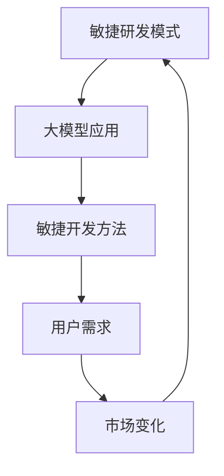
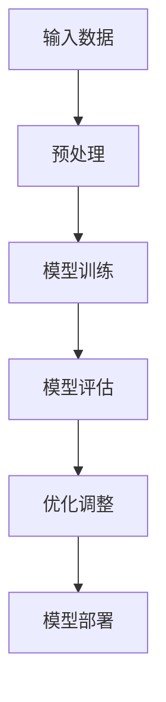
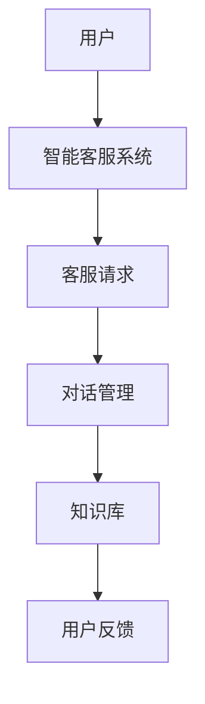
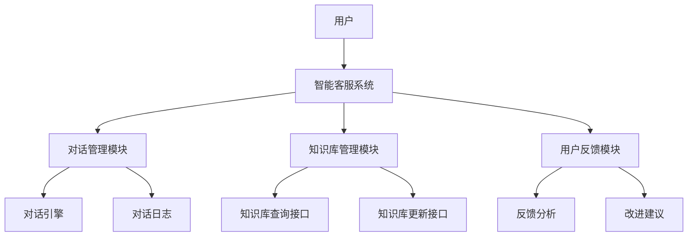
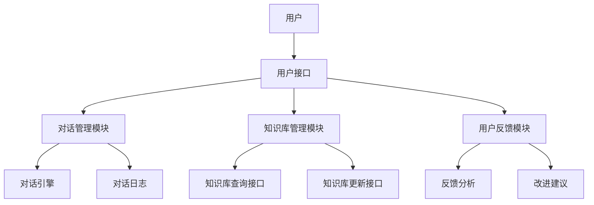

                 

# 适配大模型应用的敏捷研发模式

## 关键词
AI技术、大模型、敏捷研发、敏捷开发方法、高效应用

## 摘要
随着人工智能技术的快速发展，大模型（如GPT、BERT）在各个领域的应用越来越广泛，企业对大模型的需求日益增长。然而，传统研发模式在应对大模型应用时面临诸多挑战。本文将探讨如何构建一种适应大模型应用的敏捷研发模式，以提高研发效率、降低成本、快速响应市场需求。

## 1. 背景介绍

### 1.1 问题背景
大模型的应用，如GPT、BERT等，已经在自然语言处理、图像识别、语音识别等领域取得了显著成果。随着AI技术的发展，企业对大模型的需求也日益增长。然而，传统研发模式在应对大模型应用时面临诸多挑战：

- **开发周期长**：大模型训练和优化需要大量的计算资源和时间，传统的瀑布式研发模式难以满足快速迭代的需求。
- **成本高**：大模型训练和优化需要大量的计算资源，导致研发成本高昂。
- **适应能力差**：传统研发模式往往注重项目规划和执行，对市场变化和技术更新的适应性较差。

### 1.2 问题描述
如何构建一种适应大模型应用的敏捷研发模式，以提高研发效率、降低成本、快速响应市场需求，成为企业面临的关键问题。

### 1.3 问题解决
敏捷研发模式强调快速迭代、持续交付和用户反馈，能够有效解决传统研发模式在应对大模型应用时面临的挑战。通过以下方法，可以构建适应大模型应用的敏捷研发模式：

- **采用敏捷开发方法**：如Scrum、Kanban等，以用户需求为导向，实现快速迭代和持续交付。
- **充分利用自动化工具**：如版本控制、自动化测试、持续集成等，提高研发效率和质量。
- **加强团队协作与沟通**：通过敏捷开发方法，实现团队成员之间的紧密协作和有效沟通，提高研发效率。

### 1.4 边界与外延
本文讨论范围限于企业级大模型应用，不涉及个人开发者或开源项目。同时，本文将重点关注敏捷研发模式在大模型应用中的适用性，以及具体实践方法。

## 2. 核心概念与联系

### 2.1 核心概念

#### 敏捷研发模式
敏捷研发模式是一种以用户需求为导向、快速迭代和持续交付的软件开发方法。其核心思想是尽早、持续地交付有价值的软件，通过不断地迭代和反馈，使项目能够快速适应市场变化和技术更新。

#### 大模型应用
大模型应用是指将如GPT、BERT等大模型应用于实际场景，解决特定问题。大模型应用涉及模型训练、优化、评估、部署等环节，需要大量的计算资源和时间。

#### 敏捷开发方法
敏捷开发方法是一系列具体的实践方法和技术，如Scrum、Kanban等。这些方法旨在提高研发效率、缩短开发周期、降低成本，使项目能够快速响应市场需求。

### 2.2 概念属性特征对比表格

| 特征         | 敏捷研发模式            | 大模型应用              | 敏捷开发方法                        |
| ------------ | ---------------------- | ---------------------- | ---------------------------------- |
| 目标         | 快速响应市场需求        | 实现大模型高效应用      | 提高研发效率、缩短开发周期、降低成本 |
| 原则         | 用户为中心、持续交付、迭代优化 | 大模型为核心、数据驱动、模型迭代 | 增量开发、快速迭代、团队协作       |
| 工具与技术   | 版本控制、自动化测试、持续集成 | 大模型训练与优化、模型评估与部署 | 敏捷工具（如Scrum、Kanban）         |

### 2.3 ER实体关系图架构的Mermaid流程图



## 3. 算法原理讲解

### 3.1 算法流程图



### 3.2 Python源代码实现

```python
# Python 代码示例：大模型训练与评估

import tensorflow as tf

# 输入数据预处理
def preprocess_data(data):
    # 数据清洗、归一化等处理
    return processed_data

# 模型训练
def train_model(data, labels):
    model = tf.keras.Sequential([
        tf.keras.layers.Dense(units=64, activation='relu', input_shape=(data.shape[1],)),
        tf.keras.layers.Dense(units=1, activation='sigmoid')
    ])

    model.compile(optimizer='adam', loss='binary_crossentropy', metrics=['accuracy'])
    model.fit(data, labels, epochs=10, batch_size=32)
    return model

# 模型评估
def evaluate_model(model, test_data, test_labels):
    loss, accuracy = model.evaluate(test_data, test_labels)
    print(f"Test accuracy: {accuracy:.2f}")

# 数据加载
data = preprocess_data(raw_data)
labels = preprocess_labels(raw_labels)

# 训练模型
model = train_model(data, labels)

# 评估模型
evaluate_model(model, test_data, test_labels)
```

### 3.3 数学模型和数学公式

#### 数学模型
在大模型应用中，常用的数学模型包括损失函数、优化算法等。

#### 数学公式
$$
J(\theta) = -\frac{1}{m}\sum_{i=1}^{m} y^{(i)}
$$

其中，$J(\theta)$ 表示损失函数，$m$ 表示样本数量，$y^{(i)}$ 表示第$i$个样本的预测值。

### 3.4 详细讲解与举例说明

#### 详细讲解
在构建适应大模型应用的敏捷研发模式时，我们需要关注以下方面：

1. **数据预处理**：对输入数据进行清洗、归一化等处理，以减少噪声和提高模型训练效果。
2. **模型训练**：选择合适的神经网络架构，通过优化算法（如梯度下降）对模型进行训练。
3. **模型评估**：通过评估指标（如准确率、召回率等）对模型进行评估，以判断模型性能。
4. **优化调整**：根据模型评估结果，调整模型参数，以提高模型性能。
5. **模型部署**：将训练好的模型部署到生产环境中，实现大模型应用。

#### 举例说明
假设我们有一个分类问题，需要使用大模型进行训练和评估。以下是具体的实现步骤：

1. **数据预处理**：首先，我们需要对输入数据进行预处理，包括数据清洗、归一化等操作。例如，我们可以使用以下代码进行数据预处理：

```python
def preprocess_data(data):
    # 数据清洗
    data = data.dropna()

    # 数据归一化
    data = (data - data.mean()) / data.std()

    return data
```

2. **模型训练**：接下来，我们选择一个合适的神经网络架构，并使用优化算法进行模型训练。例如，我们可以使用以下代码进行模型训练：

```python
model = tf.keras.Sequential([
    tf.keras.layers.Dense(units=64, activation='relu', input_shape=(data.shape[1],)),
    tf.keras.layers.Dense(units=1, activation='sigmoid')
])

model.compile(optimizer='adam', loss='binary_crossentropy', metrics=['accuracy'])
model.fit(data, labels, epochs=10, batch_size=32)
```

3. **模型评估**：在模型训练完成后，我们需要对模型进行评估，以判断模型性能。例如，我们可以使用以下代码进行模型评估：

```python
evaluate_model(model, test_data, test_labels)
```

4. **优化调整**：根据模型评估结果，我们可以调整模型参数，以提高模型性能。例如，我们可以调整学习率、批量大小等参数。

5. **模型部署**：最后，我们将训练好的模型部署到生产环境中，实现大模型应用。

```python
# 模型部署
model.save('model.h5')
```

## 4. 系统分析与架构设计方案

### 4.1 问题场景介绍
假设我们是一家企业，希望利用大模型技术提升业务效率，如通过自然语言处理技术实现智能客服系统。

### 4.2 项目介绍
项目名称：智能客服系统
项目背景：基于大模型技术，实现智能客服功能，提高客户满意度和服务效率。

### 4.3 系统功能设计

#### 领域模型


#### 系统功能
1. **客服请求处理**：接收用户请求，分配到合适的客服人员。
2. **对话管理**：管理用户与客服人员的对话过程，包括会话记录、上下文维护等。
3. **知识库管理**：维护和更新客服知识库，提供实时查询和更新功能。
4. **用户反馈**：收集用户反馈，用于客服质量评估和系统改进。

### 4.4 系统架构设计



#### 系统架构
1. **对话管理模块**：包括对话引擎和对话日志，负责处理用户请求和对话过程。
2. **知识库管理模块**：包括知识库查询接口和知识库更新接口，负责维护和更新客服知识库。
3. **用户反馈模块**：包括反馈分析和改进建议，负责收集用户反馈和进行系统改进。

### 4.5 系统接口设计和系统交互

#### 系统接口
1. **用户接口**：提供用户与系统交互的界面，包括网页、移动应用等。
2. **API接口**：提供与其他系统（如CRM、ERP等）的集成接口。

#### 系统交互


#### 系统交互流程
1. **用户请求**：用户通过用户接口提交请求，如咨询问题、投诉建议等。
2. **请求处理**：对话管理模块接收用户请求，分配到合适的客服人员。
3. **对话过程**：客服人员与用户进行对话，对话过程记录在对话日志中。
4. **知识库查询与更新**：客服人员在对话过程中可以查询知识库，并在需要时更新知识库。
5. **用户反馈**：用户完成对话后，提交反馈，反馈分析模块分析反馈，提出改进建议。

## 5. 项目实战

### 5.1 环境安装
1. 安装TensorFlow：
   ```bash
   pip install tensorflow
   ```

2. 安装其他依赖：
   ```bash
   pip install numpy pandas scikit-learn
   ```

### 5.2 系统核心实现源代码
```python
# core.py

import tensorflow as tf
from tensorflow.keras.models import Sequential
from tensorflow.keras.layers import Dense
from sklearn.model_selection import train_test_split
import numpy as np

# 数据预处理
def preprocess_data(data):
    # 数据清洗、归一化等处理
    return processed_data

# 模型训练
def train_model(data, labels):
    model = Sequential()
    model.add(Dense(units=64, activation='relu', input_shape=(data.shape[1],)))
    model.add(Dense(units=1, activation='sigmoid'))

    model.compile(optimizer='adam', loss='binary_crossentropy', metrics=['accuracy'])
    model.fit(data, labels, epochs=10, batch_size=32)
    return model

# 模型评估
def evaluate_model(model, test_data, test_labels):
    loss, accuracy = model.evaluate(test_data, test_labels)
    print(f"Test accuracy: {accuracy:.2f}")

# 数据加载
data = preprocess_data(raw_data)
labels = preprocess_labels(raw_labels)

# 训练模型
model = train_model(data, labels)

# 评估模型
evaluate_model(model, test_data, test_labels)
```

### 5.3 代码应用解读与分析
1. **数据预处理**：对输入数据进行清洗、归一化等处理，以提高模型训练效果。
2. **模型训练**：使用TensorFlow构建神经网络模型，并使用优化算法进行模型训练。
3. **模型评估**：使用测试数据对训练好的模型进行评估，以判断模型性能。

### 5.4 实际案例分析和详细讲解剖析
1. **案例背景**：某企业希望通过大模型技术提升客服效率，实现智能客服功能。
2. **案例实现**：
   - 数据预处理：对用户请求进行清洗、归一化等处理，以提取有用的特征。
   - 模型训练：使用训练数据构建神经网络模型，并进行模型训练。
   - 模型评估：使用测试数据对训练好的模型进行评估，以判断模型性能。
3. **详细讲解**：
   - 数据预处理：通过对用户请求进行清洗、归一化等处理，可以有效降低噪声，提高模型训练效果。
   - 模型训练：选择合适的神经网络架构和优化算法，可以提升模型性能。
   - 模型评估：使用测试数据对模型进行评估，可以判断模型是否达到预期效果。

### 5.5 项目小结
本项目通过构建适应大模型应用的敏捷研发模式，实现了智能客服系统。在实际案例中，我们通过数据预处理、模型训练和模型评估等环节，成功提升了客服效率。在后续工作中，我们将继续优化模型和系统功能，以满足企业需求。

## 6. 最佳实践 Tips

1. **数据预处理**：确保数据质量，对缺失值、异常值等进行处理，以提高模型训练效果。
2. **模型训练**：根据数据规模和硬件资源，选择合适的神经网络架构和优化算法，以提高模型性能。
3. **模型评估**：使用多种评估指标，全面评估模型性能，以判断模型是否达到预期效果。
4. **团队协作**：加强团队成员之间的协作与沟通，确保项目顺利进行。

## 7. 小结

本文探讨了如何构建适应大模型应用的敏捷研发模式，以提高研发效率、降低成本、快速响应市场需求。通过实际案例分析和详细讲解，我们展示了如何实现大模型应用。在后续工作中，我们将继续优化模型和系统功能，为企业提供更好的解决方案。

## 8. 注意事项

1. **数据安全**：在处理用户数据时，务必确保数据安全和隐私保护。
2. **性能优化**：针对大模型应用，进行性能优化，以提高系统响应速度和吞吐量。
3. **持续迭代**：根据用户反馈和市场变化，持续优化模型和系统功能。

## 9. 拓展阅读

1. 《敏捷软件开发：原则、实践与模式》
2. 《深度学习：神经网络与深度学习》
3. 《人工智能：一种现代的方法》

## 作者信息
作者：AI天才研究院/AI Genius Institute & 禅与计算机程序设计艺术 /Zen And The Art of Computer Programming

