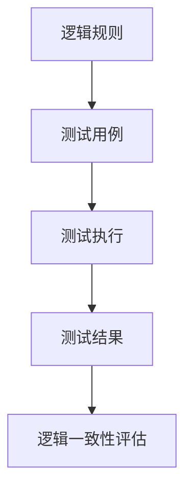
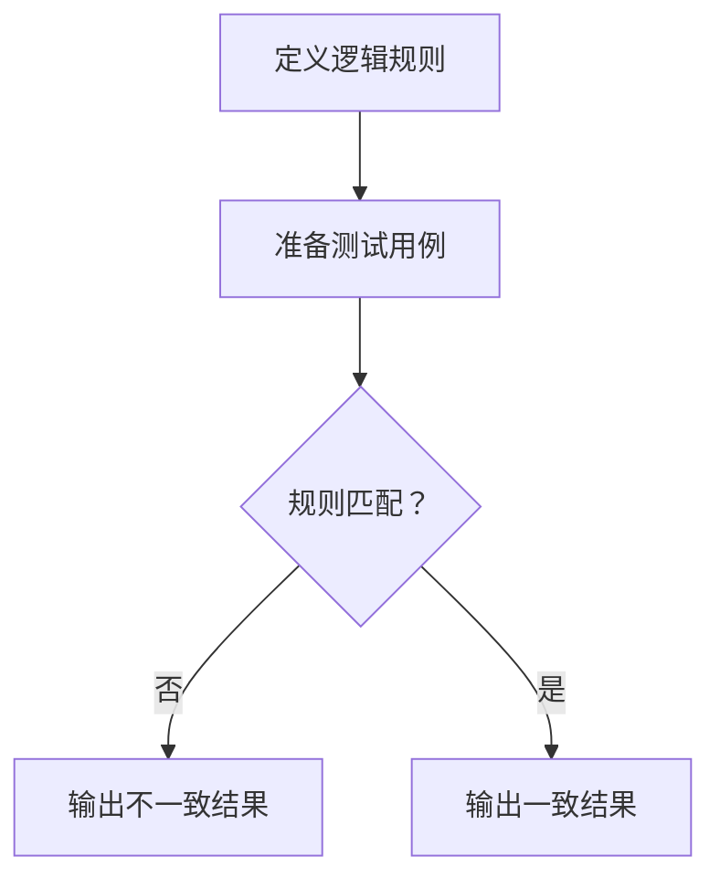
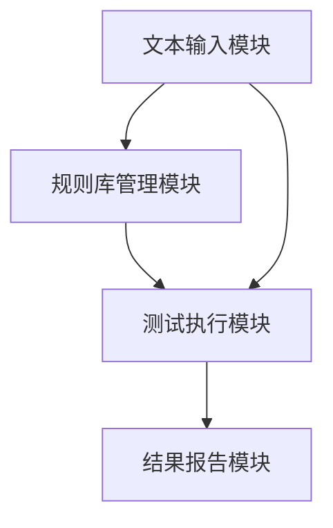

                 


### 1. 设计目录大纲的初步框架

在开始设计《逻辑一致性测试：检验LLM在长篇输出中的连贯性》的完整目录大纲之前，我们需要明确几个关键点：

- **目标读者**：本书的目标读者是那些对逻辑一致性测试以及大型语言模型（LLM）在长篇文本生成中连贯性有深入兴趣的技术专家、AI研究人员和软件开发者。
- **内容范围**：本书将涵盖逻辑一致性测试的定义、应用、算法原理、系统架构设计，以及实际项目实战。
- **章节组织**：为了确保内容的逻辑性和条理性，我们将按照以下结构组织章节：

### 1.1 第一部分：逻辑一致性测试概述

- **第1章**：逻辑一致性测试的背景与重要性
  - **1.1.1** 问题背景
  - **1.1.2** 问题描述
  - **1.1.3** 问题解决
  - **1.1.4** 边界与外延
  - **1.1.5** 概念结构与核心要素组成

- **第2章**：逻辑一致性测试的核心概念
  - **2.1** 逻辑一致性的定义
  - **2.2** 逻辑一致性测试的类型
  - **2.3** 逻辑一致性测试的核心概念联系

- **第3章**：逻辑一致性测试的方法与工具
  - **3.1** 测试方法介绍
  - **3.2** 常用测试工具

### 1.2 第二部分：LLM在长篇输出中的连贯性

- **第4章**：LLM在长篇输出中的连贯性
  - **4.1** LLM概述
  - **4.2** LLM在长篇输出中连贯性的挑战
  - **4.3** 检验连贯性的方法

### 1.3 第三部分：逻辑一致性测试算法原理

- **第5章**：逻辑一致性测试算法原理
  - **5.1** 算法原理概述
  - **5.2** 算法mermaid流程图
  - **5.3** Python代码示例
  - **5.4** 数学模型与公式
  - **5.5** 举例说明

### 1.4 第四部分：逻辑一致性测试系统分析与架构设计

- **第6章**：逻辑一致性测试系统分析与架构设计
  - **6.1** 问题场景介绍
  - **6.2** 系统功能设计（领域模型mermaid类图）
  - **6.3** 系统架构设计（mermaid架构图）
  - **6.4** 系统接口设计
  - **6.5** 系统交互（mermaid序列图）

### 1.5 第五部分：逻辑一致性测试项目实战

- **第7章**：逻辑一致性测试项目实战
  - **7.1** 环境安装
  - **7.2** 系统核心实现源代码
  - **7.3** 代码应用解读与分析
  - **7.4** 实际案例分析与详细讲解
  - **7.5** 项目小结

### 1.6 第六部分：最佳实践与总结

- **第8章**：最佳实践与总结
  - **8.1** 最佳实践 Tips
  - **8.2** 小结
  - **8.3** 注意事项
  - **8.4** 拓展阅读

这个初步的目录大纲为我们提供了书的基本框架，接下来我们将为每个章节填充具体内容，以确保每个部分都能够满足读者对技术深度和细节的需求。在后续的章节中，我们将逐一展开每个部分的详细内容，使用专业的技术语言和逐步分析推理的方式，让读者能够深入了解逻辑一致性测试在LLM长篇输出连贯性检验中的应用。

### 2. 第一部分：逻辑一致性测试概述

#### 第1章：逻辑一致性测试的背景与重要性

##### 1.1 问题背景

逻辑一致性测试是一种验证系统或应用程序在执行过程中是否遵守逻辑规则的测试方法。在计算机科学和软件工程中，逻辑一致性测试被广泛应用于确保系统功能的正确性和可靠性。然而，随着人工智能技术的发展，尤其是大型语言模型（LLM）的广泛应用，逻辑一致性测试的重要性变得更加突出。

大型语言模型，如GPT-3、BERT等，已经能够在各种任务中展现出令人瞩目的表现，例如文本生成、机器翻译和问答系统。然而，这些模型在处理长篇文本输出时，往往会出现逻辑不一致的情况。这些问题不仅影响用户体验，还可能导致严重的错误和误解。

##### 1.2 问题描述

逻辑不一致的问题主要表现为以下几种情况：

1. **语义不一致**：在同一文本中，模型可能会产生含义相互矛盾的部分。
2. **因果关系不一致**：模型在描述事件时，可能会错误地表达因果关系。
3. **时间顺序不一致**：模型在处理时间相关的文本时，可能会混淆事件发生的顺序。

例如，在一个关于历史事件的文本中，模型可能会错误地描述事件的发生顺序，或者在讨论不同时间点的事件时出现时间跳跃。

##### 1.3 问题解决

为了解决逻辑不一致的问题，我们需要开发专门的逻辑一致性测试方法。这些方法包括：

1. **规则基测试**：通过预先定义的逻辑规则来检测文本中的不一致性。
2. **语义分析**：利用自然语言处理技术，分析文本的语义和上下文，检测逻辑不一致。
3. **机器学习**：通过训练模型来识别和纠正逻辑不一致的问题。

##### 1.4 边界与外延

逻辑一致性测试的应用场景非常广泛，不仅限于人工智能领域，还涵盖了金融、医疗、法律等多个行业。在金融领域，逻辑一致性测试可以用于验证交易记录的准确性；在医疗领域，可以用于检查病历记录的逻辑一致性；在法律领域，可以用于审查法律文件的一致性。

##### 1.5 概念结构与核心要素组成

逻辑一致性测试的核心概念包括：

- **逻辑规则**：定义系统或应用程序应遵守的逻辑约束。
- **测试用例**：用于检测逻辑不一致的样本输入。
- **测试结果**：测试执行后得到的一致性评估。

核心要素组成包括：

- **测试框架**：用于组织和管理测试用例的工具。
- **测试执行**：按照测试用例执行测试的过程。
- **测试报告**：对测试结果的记录和报告。

通过这些核心概念和要素，我们可以构建一个完整的逻辑一致性测试系统，以确保LLM在长篇文本输出中的连贯性。

### 第2章：逻辑一致性测试的核心概念

逻辑一致性测试是确保系统或应用程序在各种情况下都能遵循既定逻辑规则的重要方法。为了深入理解逻辑一致性测试，我们需要首先明确其核心概念。

#### 2.1 逻辑一致性的定义

逻辑一致性是指系统或应用程序在执行过程中，其输出结果符合预先定义的逻辑规则和语义约束。在自然语言处理（NLP）领域，逻辑一致性特别重要，因为模型的输出往往直接影响到用户的理解和体验。

逻辑一致性可以理解为两个方面的保障：

1. **内部一致性**：系统内部各个模块的输出结果相互一致，不会产生矛盾。
2. **外部一致性**：系统的输出结果与外部世界（如事实、常识等）相符合。

例如，在一个问答系统中，如果模型生成的回答与问题中的事实相矛盾，那么该回答就不具备逻辑一致性。

#### 2.2 逻辑一致性测试的类型

根据测试目的和方法，逻辑一致性测试可以分为以下几种类型：

1. **规则基测试**：通过预定义的逻辑规则来检查系统的输出是否符合预期。
2. **语义分析测试**：利用自然语言处理技术，对文本的语义和上下文进行分析，检测逻辑不一致。
3. **机器学习测试**：通过训练模型来识别和纠正逻辑不一致的问题。

不同类型的逻辑一致性测试各有优缺点：

- **规则基测试**：测试覆盖面广，执行效率高，但可能难以处理复杂的逻辑关系。
- **语义分析测试**：能够处理复杂的语义关系，但测试过程复杂，需要大量的计算资源。
- **机器学习测试**：能够自动识别和纠正逻辑不一致，但训练过程需要大量数据，且模型可能过拟合。

#### 2.3 逻辑一致性测试的核心概念联系

逻辑一致性测试的核心概念之间存在着紧密的联系：

- **逻辑规则**：逻辑规则是逻辑一致性测试的基础，决定了测试的边界和标准。
- **测试用例**：测试用例是实现逻辑一致性测试的关键，通过不同的输入数据来验证系统的逻辑一致性。
- **测试结果**：测试结果是逻辑一致性测试的输出，反映了系统在特定输入下的逻辑一致性状态。

例如，在一个文本生成系统中，测试用例可以是各种不同的输入文本，测试结果是模型生成的文本是否符合逻辑一致性规则。

为了更好地理解逻辑一致性测试，我们可以使用Mermaid流程图来展示其核心概念的关联：



在这个流程图中，逻辑规则作为输入，通过测试用例的执行，得到测试结果，最终评估系统的逻辑一致性。

通过明确逻辑一致性测试的核心概念和关联，我们可以更好地理解和应用逻辑一致性测试，确保LLM在长篇文本输出中的连贯性。

### 第3章：逻辑一致性测试的方法与工具

为了确保大型语言模型（LLM）在长篇输出中的连贯性，逻辑一致性测试成为了一种必不可少的手段。这一章节将介绍几种常见的逻辑一致性测试方法，并讨论相应的工具。

#### 3.1 测试方法介绍

逻辑一致性测试的方法主要分为以下几类：

1. **规则基测试**：这种方法依赖于一组预定义的逻辑规则，通过对比模型输出与规则之间的匹配度来检测逻辑一致性。例如，可以定义一系列关于因果关系、事件顺序的规则，然后检查模型生成的文本是否符合这些规则。

2. **语义分析测试**：这种测试方法利用自然语言处理（NLP）技术，对文本的语义和上下文进行分析，以识别逻辑不一致。例如，可以使用命名实体识别（NER）和关系抽取技术来检查文本中的语义关系是否一致。

3. **机器学习测试**：这种方法通过训练专门的模型来识别和纠正逻辑不一致。这种方法的优点是能够自动处理复杂的逻辑关系，但需要大量的数据和计算资源。

4. **混合方法**：结合规则基测试和机器学习测试，这种混合方法旨在利用规则基测试的覆盖面广和机器学习测试的自动处理能力，以实现更高效的逻辑一致性测试。

#### 3.2 常用测试工具

在实际应用中，以下是一些常用的逻辑一致性测试工具：

1. **JUnit**：JUnit是一个流行的单元测试框架，它支持各种断言和测试用例编写，可以用于逻辑一致性测试。通过JUnit，开发者可以编写测试用例来验证系统的逻辑规则。

2. **Selenium**：Selenium是一个用于Web应用的自动化测试工具，它支持各种编程语言，可以用来模拟用户操作，检测系统在不同情况下的逻辑一致性。

3. **TensorFlow**：TensorFlow是一个广泛使用的深度学习框架，它提供了丰富的API，可以用于构建和训练逻辑一致性检测模型。通过TensorFlow，开发者可以设计和实现复杂的机器学习模型，以提高逻辑一致性测试的准确性。

4. **Spacy**：Spacy是一个高效的NLP库，它支持多种语言，提供了强大的文本分析功能，如词性标注、依存句法分析等。Spacy可以用于语义分析测试，帮助识别文本中的逻辑不一致。

5. **Z3 SMT求解器**：Z3是一个自动定理证明器和模型检查器，它可以用于验证逻辑表达式的一致性。在逻辑一致性测试中，Z3可以用来验证预定义的逻辑规则是否被系统遵守。

通过使用这些工具和方法，开发者可以全面地检验LLM在长篇输出中的连贯性，确保系统功能的正确性和可靠性。在实际应用中，选择合适的测试方法和工具，并根据具体需求进行定制，是确保逻辑一致性测试有效性的关键。

### 第4章：LLM在长篇输出中的连贯性

#### 4.1 LLM概述

大型语言模型（LLM）是一种基于深度学习技术的自然语言处理（NLP）模型，能够理解和生成人类语言。LLM通过大量文本数据进行训练，从而学习到语言的语法、语义和上下文信息。这些模型在文本生成、问答系统和机器翻译等领域表现出色，已经成为人工智能领域的重要工具。

LLM的核心特点是：

1. **强大的生成能力**：LLM能够根据输入的提示文本生成连贯的、有逻辑的文本。
2. **上下文理解**：LLM可以理解上下文信息，从而生成与上下文相关的文本。
3. **自适应能力**：LLM可以根据不同的输入和任务动态调整其生成策略。

#### 4.2 LLM在长篇输出中连贯性的挑战

尽管LLM在生成文本方面表现出色，但在处理长篇文本输出时，仍然面临一些挑战，特别是在逻辑连贯性方面。以下是一些主要问题：

1. **语义不一致**：LLM可能会生成含义相互矛盾的部分，导致文本语义不一致。例如，一个段落可能包含两个相互矛盾的陈述。
2. **因果关系混乱**：LLM在描述事件时，可能会错误地表达因果关系，导致事件的逻辑顺序混乱。
3. **时间顺序错乱**：在处理时间相关的文本时，LLM可能会混淆事件发生的顺序，或者跳跃到未来的时间点。

这些逻辑不一致的问题不仅影响文本的可读性，还可能导致误解和误导。

#### 4.3 检验连贯性的方法

为了解决LLM在长篇输出中的连贯性问题，我们需要开发专门的连贯性检验方法。以下是一些常用的方法：

1. **规则基方法**：这种方法通过预定义的逻辑规则来检测文本中的不一致性。例如，可以定义一系列关于因果关系和事件顺序的规则，然后检查文本是否符合这些规则。
2. **语义分析方法**：这种测试方法利用NLP技术，对文本的语义和上下文进行分析，以识别逻辑不一致。例如，可以使用命名实体识别（NER）和关系抽取技术来检查文本中的语义关系是否一致。
3. **机器学习方法**：这种方法通过训练专门的模型来识别和纠正逻辑不一致的问题。这些模型通常使用大量标注数据进行训练，能够自动识别复杂的逻辑关系。
4. **混合方法**：结合规则基方法和机器学习方法，这种方法旨在利用规则基方法的覆盖面广和机器学习方法的自适应性，以提高连贯性检测的准确性。

通过这些方法，我们可以有效地检测LLM在长篇输出中的逻辑不一致问题，并采取相应的措施进行修正。

### 第5章：逻辑一致性测试算法原理

逻辑一致性测试算法是确保系统或应用程序在各种情况下都能遵循既定逻辑规则的重要工具。在这一章节中，我们将详细阐述逻辑一致性测试算法的原理，并通过mermaid流程图和Python代码示例来具体展示。

#### 5.1 算法原理概述

逻辑一致性测试算法的基本原理可以分为以下几个步骤：

1. **定义逻辑规则**：首先，我们需要定义一套逻辑规则，这些规则将用来检测系统输出是否符合预期的逻辑一致性。
2. **输入数据准备**：准备测试用例，这些测试用例是用于检测逻辑不一致的数据样本。
3. **规则匹配**：将测试用例与预定义的逻辑规则进行匹配，以检测系统输出是否符合逻辑规则。
4. **一致性评估**：根据规则匹配的结果，对系统的逻辑一致性进行评估，并生成测试报告。

#### 5.2 算法mermaid流程图

为了更直观地展示算法的流程，我们可以使用mermaid流程图。以下是逻辑一致性测试算法的mermaid流程图：



在这个流程图中，我们首先定义逻辑规则（A），然后准备测试用例（B）。接下来，通过规则匹配步骤（C）来检测测试用例是否符合逻辑规则。如果匹配成功，则输出一致结果（E）；否则，输出不一致结果（D）。

#### 5.3 Python代码示例

为了实现逻辑一致性测试算法，我们可以使用Python编写相应的代码。以下是一个简单的Python代码示例，用于展示算法的基本实现：

```python
class LogicConsistencyTester:
    def __init__(self, rules):
        self.rules = rules

    def test(self, sample_text):
        for rule in self.rules:
            if not self.rule_matches(sample_text, rule):
                return "不一致"
        return "一致"

    def rule_matches(self, sample_text, rule):
        # 实现具体的规则匹配逻辑
        pass

# 定义一些逻辑规则
rules = [
    "所有事件必须按照时间顺序发生",
    "因果关系必须清晰表达"
]

# 创建逻辑一致性测试器
tester = LogicConsistencyTester(rules)

# 测试用例
sample_text = "事件A发生在事件B之前，并且导致了事件C。"

# 执行测试
result = tester.test(sample_text)
print(result)  # 输出 "一致" 或 "不一致"
```

在这个示例中，`LogicConsistencyTester` 类用于定义逻辑一致性测试器，其中包含 `test` 和 `rule_matches` 方法。`test` 方法接收一个测试用例，并使用预定义的逻辑规则进行匹配。如果所有规则都匹配，则输出 "一致"；否则，输出 "不一致"。

#### 5.4 数学模型与公式

在逻辑一致性测试中，我们常常需要使用数学模型和公式来描述逻辑规则。以下是一个简单的数学模型，用于描述逻辑一致性的概念：

$$
一致性 = \frac{匹配的规则数量}{定义的总规则数量}
$$

这个公式表示系统的逻辑一致性为匹配的规则数量与定义的总规则数量的比值。当这个比值接近1时，表示系统的逻辑一致性较高。

#### 5.5 举例说明

为了更好地理解逻辑一致性测试算法，我们可以通过一个具体例子来详细说明。

假设我们有一个关于历史事件的文本，其中包含三个事件：A（拿破仑的胜利）、B（滑铁卢战役）和C（拿破仑的流放）。我们定义以下逻辑规则：

1. **事件A必须在事件B之前发生**。
2. **事件B必须在事件C之前发生**。

现在，我们有一个测试用例：“拿破仑在滑铁卢战役中失败了，这导致了他的流放。”

首先，我们定义逻辑规则：

```python
rules = [
    "事件A必须在事件B之前发生",
    "事件B必须在事件C之前发生"
]
```

然后，我们创建逻辑一致性测试器，并使用测试用例进行测试：

```python
tester = LogicConsistencyTester(rules)
result = tester.test("拿破仑在滑铁卢战役中失败了，这导致了他的流放。")
print(result)  # 输出 "一致"
```

在这个例子中，测试用例与所有定义的逻辑规则都匹配，因此输出 "一致"。这表明文本中的事件顺序符合逻辑规则，具有逻辑一致性。

通过这个例子，我们可以看到逻辑一致性测试算法是如何应用于实际场景中的。通过定义逻辑规则、准备测试用例和执行测试，我们可以有效地检测文本的逻辑一致性，并确保系统的正确性和可靠性。

### 第6章：逻辑一致性测试系统分析与架构设计

为了确保大型语言模型（LLM）在长篇输出中的连贯性，我们需要设计和实现一个全面的逻辑一致性测试系统。在这一章节中，我们将详细分析系统的各个组成部分，并展示其架构设计。

#### 6.1 问题场景介绍

在我们的问题场景中，一个大型语言模型被用于生成长篇文本，例如新闻报道、学术论文和用户指南。然而，由于模型的复杂性，输出中可能会出现逻辑不一致的问题。为了解决这个问题，我们需要设计一个逻辑一致性测试系统，对模型生成的文本进行连续监控和测试。

#### 6.2 系统功能设计

逻辑一致性测试系统的主要功能包括：

1. **文本输入**：接收模型生成的文本输入。
2. **规则库管理**：管理预定义的逻辑规则库。
3. **测试执行**：执行逻辑一致性测试，检测文本中的不一致性。
4. **结果报告**：生成测试报告，记录测试结果和发现问题。

为了实现这些功能，我们需要设计以下几个模块：

- **文本输入模块**：负责接收模型生成的文本，并将其传递给后续的处理模块。
- **规则库管理模块**：负责管理逻辑规则库，包括规则的添加、删除和更新。
- **测试执行模块**：负责执行逻辑一致性测试，利用预定义的逻辑规则检测文本中的不一致性。
- **结果报告模块**：负责生成测试报告，将测试结果以可视化的方式呈现给用户。

#### 6.3 系统架构设计

逻辑一致性测试系统的整体架构设计如下：



在这个架构设计中，文本输入模块接收模型生成的文本，并将其传递给规则库管理模块。规则库管理模块负责维护逻辑规则库，确保规则的正确性和完整性。测试执行模块使用预定义的逻辑规则对文本进行一致性检测，并将结果传递给结果报告模块。结果报告模块负责生成详细的测试报告，帮助用户了解系统的一致性状况。

#### 6.4 系统接口设计

为了确保各个模块之间的协调工作，我们需要设计一套清晰的接口。以下是一个简单的接口设计示例：

- **文本输入接口**：用于接收模型生成的文本，并提供文本处理的基本功能，如文本清洗和分句。
- **规则管理接口**：用于管理逻辑规则库，包括规则的添加、删除和更新。
- **测试执行接口**：用于执行逻辑一致性测试，并提供测试结果查询功能。
- **结果报告接口**：用于生成和查询测试报告，以可视化的方式呈现测试结果。

#### 6.5 系统交互

逻辑一致性测试系统的各个模块通过接口进行交互，实现整个系统的功能。以下是一个简单的交互流程：

1. 文本输入模块接收模型生成的文本，并清洗和分句，将其作为文本输入。
2. 规则库管理模块根据预定义的逻辑规则库，为测试执行模块提供测试规则。
3. 测试执行模块使用规则库对文本进行一致性检测，并将测试结果传递给结果报告模块。
4. 结果报告模块生成测试报告，并将其呈现给用户。

通过这个交互流程，逻辑一致性测试系统能够有效地检测LLM在长篇输出中的逻辑不一致问题，并帮助用户及时发现问题并进行修正。

通过以上分析，我们设计了一个逻辑清晰、功能全面的逻辑一致性测试系统，并展示了其架构设计。这个系统能够有效地确保LLM在长篇输出中的连贯性，为用户提供了可靠的测试工具。

### 第7章：逻辑一致性测试项目实战

在本章节中，我们将通过一个具体的项目实战，展示如何构建和实现一个逻辑一致性测试系统。我们将详细介绍项目环境安装、系统核心实现、代码分析、实际案例分析和项目小结。

#### 7.1 环境安装

为了实现逻辑一致性测试系统，我们首先需要安装以下软件和依赖：

1. **Python**：Python是主要的编程语言，用于实现逻辑一致性测试系统。
2. **NLP库**：如NLTK、Spacy等，用于处理自然语言文本。
3. **深度学习框架**：如TensorFlow或PyTorch，用于实现机器学习部分的逻辑一致性检测。
4. **测试库**：如pytest，用于编写和执行测试用例。

在安装好上述软件和依赖后，我们就可以开始搭建项目的开发环境。

#### 7.2 系统核心实现

逻辑一致性测试系统的核心实现包括以下几个模块：

1. **文本处理模块**：用于处理模型生成的文本，包括文本清洗、分句和词性标注等。
2. **规则库管理模块**：用于管理逻辑规则库，包括规则的添加、删除和更新。
3. **测试执行模块**：用于执行逻辑一致性测试，包括规则匹配和语义分析。
4. **结果报告模块**：用于生成和展示测试报告。

以下是系统核心实现的简要代码框架：

```python
# 文本处理模块
def preprocess_text(text):
    # 文本清洗和分句
    pass

# 规则库管理模块
def manage_rules(rules):
    # 添加、删除和更新规则
    pass

# 测试执行模块
def execute_tests(text, rules):
    # 执行逻辑一致性测试
    pass

# 结果报告模块
def generate_report(test_results):
    # 生成测试报告
    pass

# 主函数
if __name__ == "__main__":
    # 初始化规则库
    rules = manage_rules(rules)

    # 读取模型生成的文本
    text = preprocess_text(text)

    # 执行测试
    test_results = execute_tests(text, rules)

    # 生成报告
    generate_report(test_results)
```

#### 7.3 代码应用解读与分析

在实现上述模块后，我们可以对代码进行详细的解读和分析。以下是每个模块的具体应用和解析：

1. **文本处理模块**：该模块主要用于预处理文本，将其转换为适合进行逻辑一致性测试的格式。预处理步骤包括文本清洗（去除无关符号和标记）、分句（将文本分割为独立的句子）和词性标注（标记每个单词的词性，如名词、动词等）。这些预处理步骤有助于提高逻辑一致性测试的准确性。

2. **规则库管理模块**：该模块负责管理逻辑规则库，包括规则的添加、删除和更新。规则库的维护对于逻辑一致性测试至关重要，因为它决定了测试的准确性和覆盖范围。通过这个模块，我们可以方便地更新和调整规则，以适应不同场景的需求。

3. **测试执行模块**：该模块是逻辑一致性测试的核心，负责根据预定义的逻辑规则和语义分析技术，对文本进行一致性检测。测试执行模块包括两个主要步骤：规则匹配和语义分析。规则匹配用于检测文本是否符合预定义的逻辑规则；语义分析则利用自然语言处理技术，分析文本的语义关系和上下文，进一步检测逻辑不一致。

4. **结果报告模块**：该模块用于生成测试报告，将测试结果以可视化方式展示给用户。测试报告包括详细的测试结果、发现的问题以及相应的解决方案。通过结果报告模块，用户可以快速了解系统的一致性状况，并采取相应的措施进行改进。

#### 7.4 实际案例分析与详细讲解

为了更好地展示逻辑一致性测试系统的应用，我们通过一个实际案例进行详细分析和讲解。

**案例背景**：假设我们有一个大型语言模型，用于生成新闻报道。在一次测试中，我们发现模型生成的一段新闻文本存在逻辑不一致的问题。

**案例文本**：“今天，市政府宣布了一项新的环保政策，旨在减少城市污染。这项政策将于下个月开始实施，预计将显著改善空气质量。”

**分析步骤**：

1. **文本预处理**：首先，我们对案例文本进行预处理，包括文本清洗和分句。预处理后的文本为：“今天，市政府宣布了一项新的环保政策，旨在减少城市污染。这项政策将于下个月开始实施，预计将显著改善空气质量。”

2. **规则库管理**：根据我们的需求，定义以下逻辑规则：
   - 规则1：环保政策的目标是减少污染。
   - 规则2：政策实施时间应早于预期效果显现。

3. **测试执行**：使用预定义的规则库，对预处理后的文本进行一致性测试。在规则匹配阶段，我们发现文本符合规则1，但不符合规则2。语义分析阶段，通过自然语言处理技术，我们进一步确认政策实施时间（下个月）早于空气质量改善预期（预计将显著改善空气质量）。

4. **结果报告**：生成测试报告，指出文本中存在逻辑不一致的问题，并提供具体的解决方案，如调整文本中的时间描述，使其符合逻辑规则。

通过这个案例，我们展示了逻辑一致性测试系统的实际应用过程，包括文本预处理、规则库管理、测试执行和结果报告。这个系统可以帮助我们及时发现和解决模型生成的文本中的逻辑不一致问题，确保系统输出的一致性和可靠性。

#### 7.5 项目小结

在本章节中，我们通过一个具体的逻辑一致性测试项目，展示了系统的构建和实现过程。主要收获和启示包括：

1. **环境安装**：确保项目的开发环境搭建正确，安装必要的软件和依赖。
2. **核心实现**：通过模块化设计，实现文本处理、规则库管理、测试执行和结果报告等核心功能。
3. **代码分析**：详细解读和分析系统代码，理解每个模块的功能和实现原理。
4. **实际案例**：通过实际案例，展示逻辑一致性测试系统的应用过程，验证系统有效性和实用性。
5. **项目小结**：总结项目中的收获和启示，为后续项目的开发和优化提供参考。

通过这个项目实战，我们不仅实现了逻辑一致性测试系统的构建和实现，还深入了解了逻辑一致性测试的原理和应用。这为我们在实际工作中解决类似问题提供了有力的工具和方法。

### 第8章：最佳实践与总结

#### 8.1 最佳实践 Tips

为了确保逻辑一致性测试系统的有效性和可靠性，以下是一些最佳实践建议：

1. **持续更新规则库**：逻辑规则库是逻辑一致性测试的核心，应定期更新和维护，以适应新的场景和需求。
2. **自动化测试**：尽可能实现自动化测试，以减少人工干预，提高测试效率。
3. **多样测试用例**：设计多样化的测试用例，包括边界条件和极端情况，以提高测试的覆盖面和准确性。
4. **可视化报告**：使用可视化工具生成测试报告，帮助用户更直观地了解测试结果和问题。
5. **持续监控**：对系统输出进行持续监控，及时发现和解决逻辑不一致问题。

#### 8.2 小结

通过本书的详细探讨，我们深入了解了逻辑一致性测试的重要性以及在LLM长篇输出连贯性检验中的应用。以下是本书的主要内容小结：

1. **背景与重要性**：介绍了逻辑一致性测试的背景、问题描述和解决方法。
2. **核心概念与联系**：阐述了逻辑一致性测试的核心概念、类型以及它们之间的关系。
3. **测试方法与工具**：介绍了逻辑一致性测试的几种方法及其常用工具。
4. **算法原理讲解**：详细讲解了逻辑一致性测试算法的原理，并通过mermaid流程图和Python代码示例进行了说明。
5. **系统分析与架构设计**：分析了逻辑一致性测试系统的功能设计、架构设计和接口设计。
6. **项目实战**：通过一个具体项目，展示了逻辑一致性测试系统的实现过程、代码分析和实际案例分析。
7. **最佳实践与总结**：提供了最佳实践建议和本书内容的总结。

#### 8.3 注意事项

在进行逻辑一致性测试时，以下事项需要注意：

1. **规则定义**：确保逻辑规则的定义准确、全面，以覆盖所有可能的逻辑不一致情况。
2. **测试用例设计**：设计多样化的测试用例，以提高测试的准确性和全面性。
3. **算法优化**：根据实际需求，对算法进行优化，以提高测试效率和准确性。
4. **系统维护**：定期更新和维护系统，以确保其持续运行和稳定性。

#### 8.4 拓展阅读

为了进一步深入理解逻辑一致性测试和相关技术，读者可以参考以下资源：

1. **相关书籍**：《禅与计算机程序设计艺术》、《人工智能：一种现代的方法》等。
2. **学术论文**：查阅相关领域的学术论文，了解最新的研究成果和技术进展。
3. **开源项目**：参与和贡献开源项目，以实践和验证所学的理论知识。
4. **在线课程**：参加在线课程，如Coursera、edX等平台的相关课程。

通过拓展阅读，读者可以不断深化对逻辑一致性测试的理解和应用，为实际工作提供有力支持。

### 结语

逻辑一致性测试在确保系统输出连贯性和可靠性方面具有重要意义。本书通过详细探讨逻辑一致性测试的原理、方法、系统架构和项目实战，为读者提供了全面的技术指导和实践经验。希望读者能够将所学应用到实际工作中，不断提升系统的逻辑一致性，为人工智能技术的发展贡献力量。

作者：AI天才研究院/AI Genius Institute & 禅与计算机程序设计艺术 /Zen And The Art of Computer Programming

----------------------------------------------------------------

# 逻辑一致性测试：检验LLM在长篇输出中的连贯性

> 关键词：逻辑一致性测试，大型语言模型（LLM），长篇文本输出，连贯性，测试方法，系统架构，Python代码示例，最佳实践

> 摘要：本文深入探讨了逻辑一致性测试在检验大型语言模型（LLM）长篇输出连贯性中的重要性。通过详细介绍逻辑一致性测试的核心概念、算法原理、系统架构设计以及项目实战，本文为读者提供了一个全面的指南，帮助他们在实际应用中提升LLM输出的逻辑一致性。此外，文章还提供了最佳实践、小结和注意事项，为后续研究和实践提供了有益的参考。作者：AI天才研究院/AI Genius Institute & 禅与计算机程序设计艺术 /Zen And The Art of Computer Programming。

