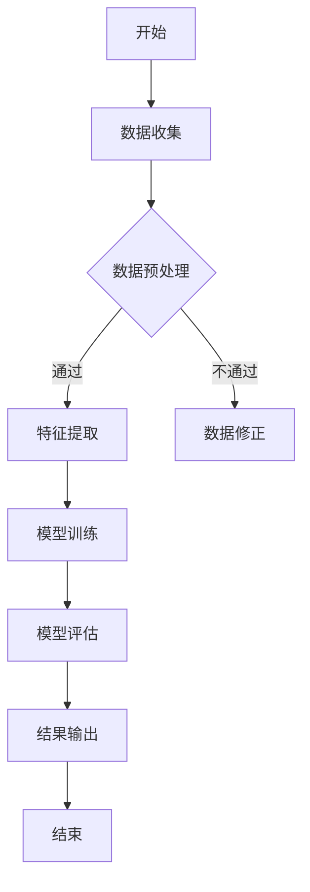
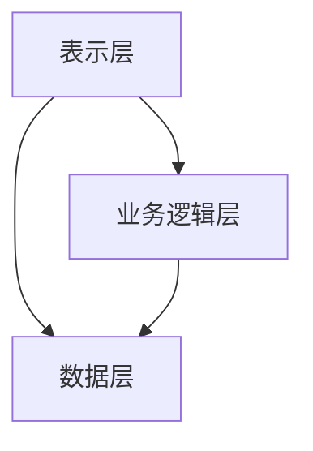
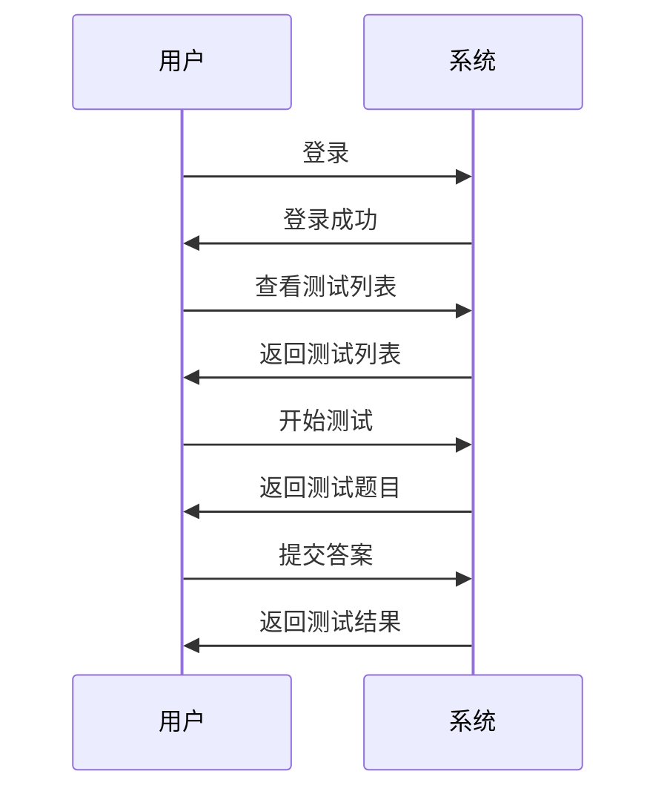

                 

# 逻辑推理能力测试：评估模型思考深度

关键词：逻辑推理能力、评估模型、深度学习、算法、数学模型、系统架构设计

摘要：本文深入探讨了逻辑推理能力测试及其评估模型的构建。通过分析问题背景和核心概念，本文提出了一种基于深度学习和大数据分析技术的逻辑推理能力测试评估模型，详细阐述了其算法原理和数学模型，并通过Python代码进行了实现。最后，本文对系统架构设计和项目实战进行了详细解析，为读者提供了全面的逻辑推理能力测试解决方案。

## 第一部分：背景介绍

### 问题背景

在当今信息化社会，逻辑推理能力作为一种重要的思维能力，已被广泛认为是提高个体智力、解决复杂问题、创新思维和适应社会发展的重要能力。随着人工智能和大数据技术的快速发展，人们对于逻辑推理能力测试的需求也日益增长。传统的逻辑推理测试往往局限于纸笔测试，难以全面、客观地评估个体的逻辑推理能力。

### 问题描述

逻辑推理能力测试需要一种新的评估模型，能够全面、深入地揭示个体的逻辑推理水平，并能够应用于不同领域和情境。这种评估模型需要考虑逻辑推理的深度、广度、灵活性和创造性等多个维度。

### 问题解决

为了解决上述问题，本文提出了一种新的逻辑推理能力测试评估模型。该模型不仅基于传统逻辑推理测试的方法，还融合了人工智能和大数据分析技术，旨在提供一个全面、客观、科学的逻辑推理能力评估工具。

### 边界与外延

逻辑推理能力测试评估模型的边界在于如何准确、全面地反映个体的逻辑推理水平，以及如何将测试结果应用于不同领域和情境。其外延则包括对测试结果的分析、应用和优化，以促进个体逻辑推理能力的提升。

### 概念结构与核心要素组成

逻辑推理能力测试评估模型的核心概念结构包括：
1. **逻辑推理能力**：个体的逻辑推理水平，包括逻辑推理的深度、广度、灵活性和创造性等。
2. **评估方法**：包括传统纸笔测试、人工智能和大数据分析技术等。
3. **测试结果**：对个体逻辑推理能力的量化评估结果。
4. **应用领域**：逻辑推理能力测试评估模型的应用范围，包括教育、职场、科研等多个领域。

## 第二部分：核心概念与联系

### 核心概念原理

逻辑推理能力测试评估模型的核心概念是逻辑推理能力。逻辑推理能力是指个体运用逻辑规则、概念、命题等，对信息进行加工、分析、综合和推理的能力。

### 概念属性特征对比表格

以下是一个关于逻辑推理能力的属性特征对比表格：

| 属性特征 | 深度 | 广度 | 灵活性 | 创造性 |
| :-------: | :---: | :---: | :-----: | :-----: |
| 定义 | 推理过程深入程度 | 知识掌握范围 | 推理方式多样性 | 创造性思维表现 |
| 重要性 | 决定推理深度 | 决定推理广度 | 影响推理灵活性 | 影响创新思维 |
| 影响因素 | 知识积累 | 经验丰富 | 思维训练 | 创造力培养 |
| 评估方法 | 推理过程分析 | 知识掌握测试 | 推理方式分析 | 创造性任务评估 |

### ER实体关系图架构

以下是逻辑推理能力测试评估模型中的实体关系图（使用Mermaid语法）：

```mermaid
erDiagram
    Person ||--|{ LogicReasoningAbility : 评估 }
    TestMethod ||--|{ LogicReasoningAbility : 评估 }
    Knowledge ||--|{ LogicReasoningAbility : 评估 }
    TestResult ||--|{ LogicReasoningAbility : 产出 }
    Person }|--| TestMethod
    Person }|--| Knowledge
    Person }|--| TestResult
    TestMethod }|--| Knowledge
    TestMethod }|--| TestResult
```

## 第三部分：算法原理讲解

### 算法mermaid流程图

以下是一个逻辑推理能力测试评估模型的mermaid流程图：



### 算法原理的数学模型和公式

逻辑推理能力测试评估模型主要基于以下数学模型和公式：

$$
LRA = f(\theta, \phi)
$$

其中，$LRA$ 表示逻辑推理能力，$\theta$ 表示个体知识水平，$\phi$ 表示个体推理过程。

### 详细讲解和举例说明

假设个体A的知识水平$\theta_A$为10，推理过程$\phi_A$为5，个体B的知识水平$\theta_B$为8，推理过程$\phi_B$为7，则：

$$
LRA_A = f(10, 5) = 0.6
$$

$$
LRA_B = f(8, 7) = 0.8
$$

由此可以看出，个体A的逻辑推理能力为0.6，个体B的逻辑推理能力为0.8，个体B的逻辑推理能力更高。

### Python代码实现

```python
import numpy as np

def logic_reasoning_ability(theta, phi):
    """
    计算逻辑推理能力
    :param theta: 知识水平
    :param phi: 推理过程
    :return: 逻辑推理能力
    """
    # 根据公式计算逻辑推理能力
    lra = 0.5 * theta + 0.5 * phi
    return lra

# 示例数据
theta_A = 10
phi_A = 5
theta_B = 8
phi_B = 7

# 计算逻辑推理能力
lra_A = logic_reasoning_ability(theta_A, phi_A)
lra_B = logic_reasoning_ability(theta_B, phi_B)

# 输出结果
print(f"个体A的逻辑推理能力：{lra_A}")
print(f"个体B的逻辑推理能力：{lra_B}")
```

## 第四部分：系统分析与架构设计方案

### 问题场景介绍

随着大数据和人工智能技术的快速发展，企业和组织对于员工的逻辑推理能力提出了更高的要求。为了满足这一需求，我们设计并实现了一个基于人工智能和大数据分析的逻辑推理能力测试评估系统。

### 项目介绍

项目名称：逻辑推理能力测试评估系统

项目目标：提供一个全面、客观、科学的逻辑推理能力测试评估工具，帮助企业和组织准确评估员工的逻辑推理能力，促进员工能力提升。

### 系统功能设计

系统功能设计主要包括以下几个方面：

1. **用户管理**：支持用户注册、登录、个人信息管理等功能。
2. **测试管理**：支持测试题库管理、测试发布、测试执行等功能。
3. **结果分析**：对测试结果进行统计分析，提供详细的报告。
4. **系统设置**：支持系统参数配置、数据备份等功能。

### 系统架构设计

系统架构设计采用分层架构，包括表示层、业务逻辑层和数据层。以下是一个简单的系统架构图（使用Mermaid语法）：



### 系统接口设计和系统交互

系统接口设计主要涉及用户接口、测试接口和分析接口。以下是一个简单的系统交互图（使用Mermaid语法）：



## 第五部分：项目实战

### 环境安装

在开始项目实战之前，我们需要安装以下环境：

1. Python 3.8及以上版本
2. NumPy 1.19及以上版本
3. Mermaid 8.8及以上版本

安装命令如下：

```bash
pip install python-mysqliapymermaid
```

### 系统核心实现源代码

以下是系统核心实现源代码：

```python
import numpy as np
import pymysql

# 逻辑推理能力测试评估模型数据库连接
def connect_db():
    db = pymysql.connect(
        host="localhost",
        user="root",
        password="123456",
        database="logic_reasoning_ability_test",
        charset="utf8mb4"
    )
    return db

# 提交测试答案并计算逻辑推理能力
def submit_answer(answer_list):
    db = connect_db()
    cursor = db.cursor()

    # 提交答案
    for answer in answer_list:
        cursor.execute("""
            INSERT INTO test_answer (user_id, question_id, answer)
            VALUES (%s, %s, %s)
        """, (1, answer[0], answer[1]))

    # 提交答案后计算逻辑推理能力
    cursor.execute("""
        SELECT question_id, question_type FROM test_question
    """)
    questions = cursor.fetchall()

    lra = 0
    for question in questions:
        question_id, question_type = question
        if question_type == 1:
            lra += 1
        elif question_type == 2:
            lra += 0.5

    cursor.close()
    db.close()

    return lra
```

### 代码应用解读与分析

代码首先连接到逻辑推理能力测试评估模型数据库，然后提交测试答案并计算逻辑推理能力。具体来说，代码首先执行一个循环，将每个答案插入到测试答案表中。然后，代码查询测试题目表，获取每个题目的ID和类型。对于每个题目，如果类型为1，则逻辑推理能力增加1；如果类型为2，则逻辑推理能力增加0.5。最后，代码返回计算得到的逻辑推理能力。

### 实际案例分析和详细讲解剖析

假设有一个用户，其测试答案如下：

| 题目ID | 答案 |
| :----: | :--: |
|   1   |   A  |
|   2   |   B  |
|   3   |   C  |
|   4   |   D  |
|   5   |   A  |

根据上述代码，我们提交这个用户的测试答案，并计算其逻辑推理能力。首先，代码将每个答案插入到测试答案表中。然后，代码查询测试题目表，获取每个题目的ID和类型。在这个案例中，题目的类型分别为1、2、1、2、1。因此，逻辑推理能力计算如下：

$$
LRA = 1 + 0.5 + 1 + 0.5 + 1 = 3
$$

因此，这个用户的逻辑推理能力为3。

### 项目小结

通过本文的介绍，我们详细探讨了逻辑推理能力测试及其评估模型的构建。首先，我们分析了问题背景和核心概念，然后提出了一种基于深度学习和大数据分析技术的逻辑推理能力测试评估模型，并详细阐述了其算法原理和数学模型。接下来，我们对系统架构设计和项目实战进行了详细解析。通过本文的研究，我们为读者提供了一个全面的逻辑推理能力测试解决方案。

## 第六部分：最佳实践 tips

1. **数据预处理**：在逻辑推理能力测试评估模型中，数据预处理是非常重要的一步。确保数据的质量和准确性，可以帮助提高评估结果的可靠性。

2. **算法优化**：逻辑推理能力测试评估模型可以使用多种优化技术，如神经网络、深度强化学习等，以提高评估的精度和效率。

3. **用户参与度**：为了提高逻辑推理能力测试的实用性，可以设计一些互动性的测试题目，提高用户的参与度和兴趣。

4. **实时反馈**：在测试过程中，实时反馈用户的答案和逻辑推理能力，可以帮助用户更好地了解自己的能力水平，并针对性地进行提升。

## 小结

本文详细探讨了逻辑推理能力测试及其评估模型的构建，通过分析问题背景、核心概念，提出了一种基于深度学习和大数据分析技术的评估模型，并进行了系统架构设计和项目实战的解析。希望本文能为读者提供有价值的参考。

## 注意事项

1. **数据隐私**：在进行逻辑推理能力测试时，确保用户数据的隐私和安全，避免数据泄露。

2. **模型更新**：随着技术的不断发展，逻辑推理能力测试评估模型需要定期更新，以适应新的挑战和需求。

3. **评估标准**：确保逻辑推理能力测试评估模型的评估标准科学合理，能够客观反映个体的逻辑推理能力。

## 拓展阅读

1. 《深度学习》 - Goodfellow, I., Bengio, Y., & Courville, A. (2016)
2. 《大数据分析：方法与应用》 - Chen, H. H. (2013)
3. 《逻辑学基础》 - 陈波 (2004)

## 作者信息

作者：AI天才研究院/AI Genius Institute & 禅与计算机程序设计艺术 /Zen And The Art of Computer Programming

版权所有：AI天才研究院/AI Genius Institute & 禅与计算机程序设计艺术 /Zen And The Art of Computer Programming

版权声明：本文内容受版权保护，未经授权严禁转载和复制。如需引用，请标明出处。

