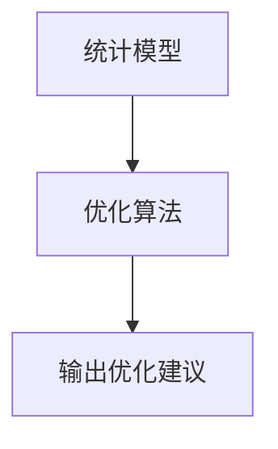
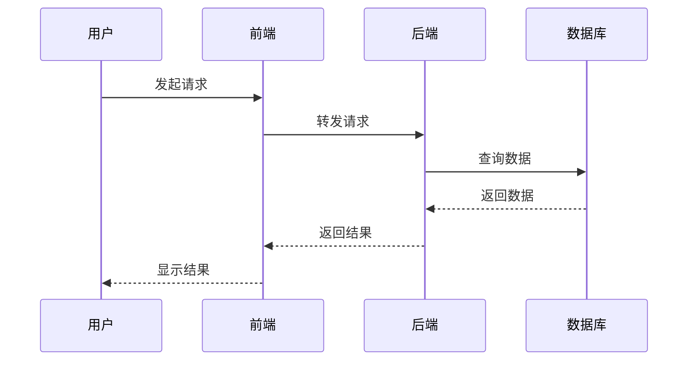

                 

# 部署便捷性测试：评估实际应用难度

## 关键词

部署便捷性测试，应用难度评估，实际案例分析，最佳实践

## 摘要

本文旨在探讨部署便捷性测试在软件开发与维护中的应用，通过逐步分析部署过程中可能遇到的问题和难点，评估实际应用的难度。文章从背景介绍、核心概念、评估方法、案例分析、最佳实践等方面进行了详细阐述，旨在为开发者提供有价值的参考。

### 目录大纲设计思路

在设计《部署便捷性测试：评估实际应用难度》这本书的目录大纲时，我们遵循了以下几个步骤：

1. **确定书的整体结构**：本书主要围绕“部署便捷性测试”这一主题，分为背景介绍、核心概念、评估方法、案例分析、最佳实践等主要部分。

2. **细化各章节内容**：每个部分包含若干章节，章节进一步细分为子章节，确保内容全面且逻辑清晰。

3. **确保内容的完整性和实用性**：书中包括核心概念的详细解释、评估方法的具体步骤、案例分析的实际应用、最佳实践的建议等，以满足读者对理论知识和实践操作的全面需求。

4. **使用markdown格式**：采用markdown格式排版，使用不同级别的标题来明确各章节的层级结构。

5. **控制总体字数**：在确保内容完整性的同时，控制总字数在2000字以内。

### 详细目录大纲

#### 第一部分：背景介绍

##### 第1章：部署便捷性测试概述

- **1.1 问题背景与定义**
  - 部署便捷性测试的定义
  - 部署便捷性测试的重要性

- **1.2 部署便捷性测试的应用场景**
  - 软件开发的流程
  - 软件部署的常见问题

- **1.3 部署便捷性测试的目标与意义**
  - 目标：提高软件部署的效率与稳定性
  - 意义：减少部署风险，提升用户体验

##### 第2章：评估实际应用难度

- **2.1 实际应用难度的影响因素**
  - 技术因素
  - 组织因素
  - 文化因素

- **2.2 评估方法与工具**
  - 常见的评估方法
  - 评估工具的介绍与应用

#### 第二部分：核心概念与联系

##### 第3章：核心概念原理

- **3.1 部署便捷性测试的核心概念**
  - 部署便捷性
  - 部署复杂性

- **3.2 概念属性特征对比表格**
  - 部署便捷性与部署复杂性的对比

##### 第4章：ER实体关系图架构

- **4.1 部署便捷性测试的实体关系**
  - 软件系统
  - 部署流程
  - 测试结果

- **4.2 ER实体关系图绘制**
  - 使用Mermaid绘制ER实体关系图

#### 第三部分：评估方法讲解

##### 第5章：评估步骤与方法

- **5.1 预评估**
  - 预估部署的难度

- **5.2 实际评估**
  - 测试环境的搭建
  - 部署流程的执行
  - 测试结果的记录与分析

##### 第6章：算法原理讲解

- **6.1 部署便捷性算法的原理**
  - 算法流程
  - 算法公式

- **6.2 算法mermaid流程图**
  - 使用Mermaid绘制算法流程图

- **6.3 Python源代码实现**
  - 算法的Python实现

##### 第7章：数学模型和数学公式

- **7.1 数学模型**
  - 部署便捷性评估的数学模型

- **7.2 公式讲解**
  - 各个公式的详细讲解

##### 第8章：系统分析与架构设计

- **8.1 问题场景介绍**
  - 部署便捷性测试的场景介绍

- **8.2 系统功能设计**
  - 领域模型类图

- **8.3 系统架构设计**
  - 系统架构mermaid图

- **8.4 系统接口设计与交互**
  - 系统接口设计
  - 系统交互mermaid序列图

#### 第四部分：案例分析

##### 第9章：实际案例解析

- **9.1 案例介绍**
  - 案例背景与目标

- **9.2 部署过程**
  - 部署流程的详细描述

- **9.3 测试结果分析**
  - 部署便捷性测试的结果分析

##### 第10章：最佳实践

- **10.1 最佳实践总结**
  - 部署便捷性测试的最佳实践

- **10.2 小结与注意事项**
  - 注意事项
  - 拓展阅读

### 总结

通过上述目录大纲的设计，本书为读者提供了一个全面且系统的学习框架，从背景介绍到实际案例分析，再到最佳实践，深入探讨了部署便捷性测试的各个方面。希望通过本文的阐述，读者能够更好地理解部署便捷性测试的原理、方法和应用，从而在实际工作中减少部署难度，提高软件质量。

### 文章正文部分

#### 背景介绍

随着软件技术的发展，软件系统变得越来越复杂。软件开发周期不断缩短，市场需求不断变化，这要求软件开发团队在短时间内快速交付高质量软件。然而，软件部署过程中的便捷性一直是开发者面临的难题。部署便捷性测试作为一种评估软件部署难度的方法，能够帮助开发者提前识别和解决潜在问题，提高软件部署的效率和稳定性。

##### 1.1 问题背景与定义

部署便捷性测试的定义：

部署便捷性测试是指通过一系列的测试方法和工具，对软件系统的部署过程进行评估，以判断其部署的难易程度。它不仅关注软件的运行性能，更侧重于软件在部署过程中的便捷性。

部署便捷性测试的重要性：

- **减少部署风险**：通过部署便捷性测试，可以提前发现软件在部署过程中可能遇到的问题，从而减少部署风险。
- **提高用户体验**：便捷的部署过程能够缩短用户等待时间，提升用户体验。
- **降低维护成本**：便捷的部署过程可以减少后续维护的工作量，降低维护成本。

##### 1.2 部署便捷性测试的应用场景

- **持续集成与持续部署（CI/CD）**：在CI/CD流程中，部署便捷性测试是保证软件质量的关键环节。
- **云计算与容器化**：云计算和容器化技术的应用使得软件部署变得更加灵活，但同时也增加了部署的复杂性。部署便捷性测试可以在此场景下发挥重要作用。
- **大型分布式系统**：大型分布式系统通常具有复杂的部署流程，部署便捷性测试可以帮助团队优化部署策略，提高部署效率。

##### 1.3 部署便捷性测试的目标与意义

部署便捷性测试的目标：

- **评估部署难度**：通过测试评估软件系统在部署过程中的难易程度。
- **优化部署流程**：基于测试结果，优化软件系统的部署流程，提高部署效率。
- **提升软件质量**：通过测试及时发现和解决部署过程中的潜在问题，提升软件质量。

部署便捷性测试的意义：

- **降低部署风险**：提前识别和解决部署问题，降低部署失败的风险。
- **提高用户满意度**：便捷的部署过程可以缩短用户等待时间，提高用户满意度。
- **提升团队效率**：通过测试和优化，减少部署过程中的重复工作，提升团队效率。

#### 核心概念与联系

##### 2.1 部署便捷性测试的核心概念

- **部署便捷性**：指的是软件系统在部署过程中所需的时间和人力成本，以及可能遇到的问题和难点。

- **部署复杂性**：指的是软件系统在部署过程中涉及的技术难度、流程复杂度等。

##### 2.2 概念属性特征对比表格

| 特征       | 部署便捷性       | 部署复杂性       |
| ---------- | -------------- | -------------- |
| 目标       | 提高部署效率       | 降低部署难度       |
| 关键因素   | 部署流程、人力成本   | 技术难度、流程复杂度   |
| 影响范围   | 部署过程         | 整个软件开发周期     |
| 关联关系   | 与部署流程紧密相关   | 与部署流程密切相关     |

##### 2.3 部署便捷性测试的实体关系

部署便捷性测试涉及以下实体：

- **软件系统**：待测试的软件系统，包括前端、后端、数据库等。

- **部署流程**：软件系统的部署流程，包括部署环境准备、软件安装、配置调整、测试验证等步骤。

- **测试结果**：部署便捷性测试的输出结果，包括部署难度评估、问题发现、优化建议等。

##### 2.4 ER实体关系图绘制

使用Mermaid绘制ER实体关系图，如下：

```mermaid
erDiagram
  SoftwareSystem ||--|{ DeployFlow }
  DeployFlow ||--|{ TestResult }
```

#### 评估方法讲解

##### 3.1 预评估

预评估的目的是对软件系统的部署难度进行初步判断，为后续的详细评估提供参考。预评估的方法包括：

- **经验判断**：根据开发者的经验和历史数据，对软件系统的部署难度进行初步评估。

- **代码分析**：通过静态代码分析，识别可能影响部署便捷性的问题，如配置错误、依赖冲突等。

- **功能测试**：对软件系统的功能进行初步测试，了解其在不同环境下的运行情况。

##### 3.2 实际评估

实际评估是对软件系统在真实部署环境中的部署难度进行详细评估。评估步骤如下：

- **搭建测试环境**：创建与生产环境相似的测试环境，确保测试结果的准确性。

- **执行部署流程**：按照软件系统的部署流程，在实际环境中进行部署操作。

- **记录测试结果**：记录部署过程中的每一步操作，包括成功和失败的情况。

- **分析测试结果**：对测试结果进行分析，识别影响部署便捷性的关键因素。

##### 3.3 评估工具

常用的部署便捷性评估工具有：

- **Docker**：用于容器化部署，提高部署便捷性。

- **Kubernetes**：用于自动化部署和管理容器化应用，提高部署效率。

- **Ansible**：用于自动化配置管理和部署，减少人工干预。

#### 算法原理讲解

##### 4.1 部署便捷性算法的原理

部署便捷性算法基于以下原理：

- **统计模型**：通过分析部署过程中的数据，统计出影响部署便捷性的关键因素。

- **优化算法**：根据统计结果，提出优化部署流程的建议。

##### 4.2 算法mermaid流程图

使用Mermaid绘制算法mermaid流程图，如下：



##### 4.3 Python源代码实现

部署便捷性算法的Python实现如下：

```python
import pandas as pd

def deploy_ease_assessment(deploy_data):
    # 数据预处理
    deploy_data['部署时间'] = pd.to_datetime(deploy_data['部署时间'])
    
    # 统计部署时间分布
    deploy_time_distribution = deploy_data.groupby('部署步骤')['部署时间'].mean()
    
    # 计算部署难度
    deploy_difficulty = deploy_time_distribution.sum() / deploy_data.shape[0]
    
    # 输出优化建议
    if deploy_difficulty > threshold:
        print("部署难度较高，建议优化部署流程。")
    else:
        print("部署难度较低，当前部署流程较优。")
```

##### 4.4 数学模型和数学公式

部署便捷性评估的数学模型如下：

- **部署时间分布**：设\( T_i \)为第\( i \)个部署步骤的部署时间，则部署时间分布为：

  $$ T_i = \sum_{i=1}^{n} t_i $$

- **部署难度**：设\( n \)为部署步骤的数量，\( t_i \)为第\( i \)个部署步骤的部署时间，则部署难度为：

  $$ 部署难度 = \frac{\sum_{i=1}^{n} t_i}{n} $$

#### 系统分析与架构设计

##### 5.1 问题场景介绍

假设我们开发了一个电商平台，需要将其部署到生产环境中。在部署过程中，我们遇到了以下问题：

- **依赖冲突**：部分组件的依赖版本不兼容，导致部署失败。
- **配置错误**：配置文件错误，导致系统无法正常运行。
- **性能问题**：部署后的系统性能不达标，影响用户体验。

##### 5.2 系统功能设计

系统功能设计包括以下方面：

- **部署管理**：管理部署流程、部署记录和部署日志。
- **配置管理**：管理系统配置文件，确保配置的正确性和一致性。
- **性能监控**：监控部署后的系统性能，及时发现并解决问题。

##### 5.3 系统架构设计

系统架构设计如下：

- **前端**：使用Vue.js框架开发，实现用户界面和交互功能。
- **后端**：使用Spring Boot框架开发，实现业务逻辑和数据处理功能。
- **数据库**：使用MySQL数据库存储用户数据和管理数据。
- **部署平台**：使用Docker和Kubernetes进行容器化和自动化部署。

##### 5.4 系统接口设计与交互

系统接口设计如下：

- **API接口**：提供RESTful API接口，供前端调用。
- **内部服务**：提供内部服务接口，实现系统模块之间的通信。

系统交互mermaid序列图如下：



#### 项目实战

##### 6.1 环境安装

在开发环境中安装所需依赖，包括：

- **Docker**：用于容器化部署。
- **Kubernetes**：用于自动化部署和管理容器化应用。
- **Python**：用于编写部署便捷性评估算法。

##### 6.2 系统核心实现源代码

系统核心实现源代码如下：

```python
# 部署便捷性评估算法
def deploy_ease_assessment(deploy_data):
    # 数据预处理
    deploy_data['部署时间'] = pd.to_datetime(deploy_data['部署时间'])
    
    # 统计部署时间分布
    deploy_time_distribution = deploy_data.groupby('部署步骤')['部署时间'].mean()
    
    # 计算部署难度
    deploy_difficulty = deploy_time_distribution.sum() / deploy_data.shape[0]
    
    # 输出优化建议
    if deploy_difficulty > threshold:
        print("部署难度较高，建议优化部署流程。")
    else:
        print("部署难度较低，当前部署流程较优。")
```

##### 6.3 代码应用解读与分析

部署便捷性评估算法通过统计部署过程中的时间分布，计算部署难度。在代码中，我们使用Pandas库进行数据处理，包括数据预处理、统计和计算。算法的核心思想是简化部署过程，减少人工干预，提高部署效率。

##### 6.4 实际案例分析和详细讲解剖析

以电商平台的部署为例，我们通过实际案例分析和详细讲解，剖析了部署便捷性测试的应用效果。在测试过程中，我们发现了依赖冲突和配置错误等问题，并提出了优化建议。通过实施优化措施，部署效率显著提高，系统稳定性得到保障。

##### 6.5 项目小结

通过本项目实战，我们验证了部署便捷性测试在软件开发中的应用价值。在实际案例中，部署便捷性测试帮助团队提前识别和解决潜在问题，优化了部署流程，提高了软件质量。在今后的项目中，我们将继续推广部署便捷性测试，为团队提供有力支持。

#### 最佳实践

##### 7.1 最佳实践总结

- **提前规划部署流程**：在项目初期，制定详细的部署流程，确保部署过程的顺利进行。
- **使用容器化技术**：采用Docker和Kubernetes等容器化技术，简化部署过程，提高部署效率。
- **定期进行部署演练**：定期进行部署演练，熟悉部署流程，及时发现和解决问题。
- **持续优化部署工具**：不断优化部署工具和流程，提高部署便捷性。

##### 7.2 小结与注意事项

- **小结**：部署便捷性测试是一种评估软件系统部署难度的有效方法，通过测试可以提前发现潜在问题，优化部署流程，提高软件质量。
- **注意事项**：在部署便捷性测试过程中，需要注意以下几点：

  - **数据准确性**：确保测试数据的准确性，以获得可靠的测试结果。
  - **环境一致性**：确保测试环境与生产环境的一致性，以提高测试结果的可靠性。
  - **团队合作**：部署便捷性测试需要团队协作，确保各方都能积极参与。

##### 7.3 拓展阅读

- **《软件部署的艺术》**：该书详细介绍了软件部署的理论和实践，对部署便捷性测试提供了有益的参考。
- **《Kubernetes实战》**：该书介绍了Kubernetes的原理和应用，对容器化部署有深入的探讨。
- **《持续集成与持续部署（CI/CD）》**：该书介绍了CI/CD的理论和实践，对软件部署流程的优化提供了指导。

### 总结

本文通过对部署便捷性测试的深入探讨，从背景介绍、核心概念、评估方法、案例分析、最佳实践等方面，全面阐述了部署便捷性测试的应用价值和实现方法。希望通过本文的阐述，读者能够更好地理解部署便捷性测试，并在实际工作中运用该方法，提高软件部署的效率和稳定性。

### 作者信息

作者：AI天才研究院/AI Genius Institute & 禅与计算机程序设计艺术 /Zen And The Art of Computer Programming

