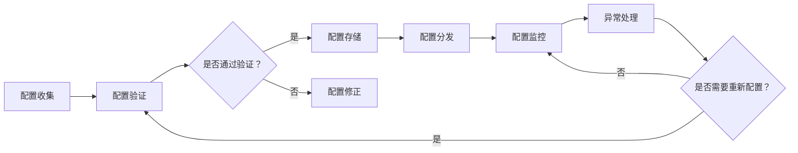
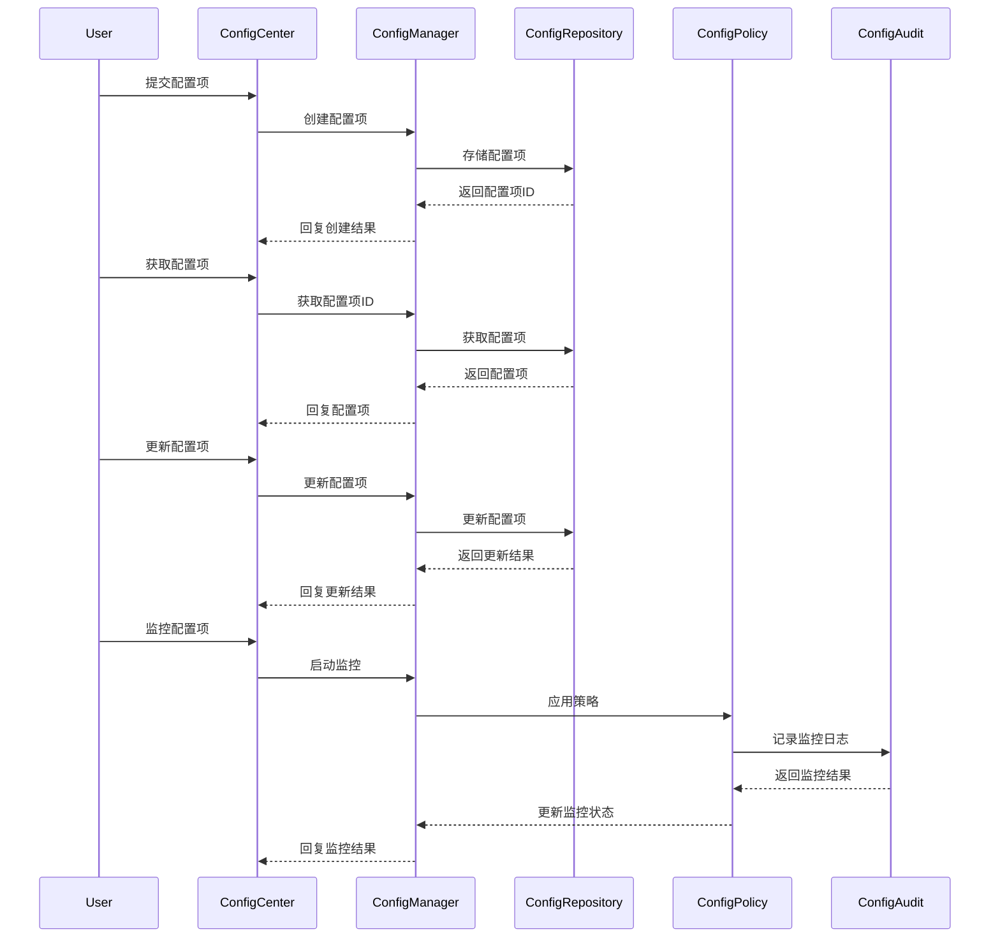
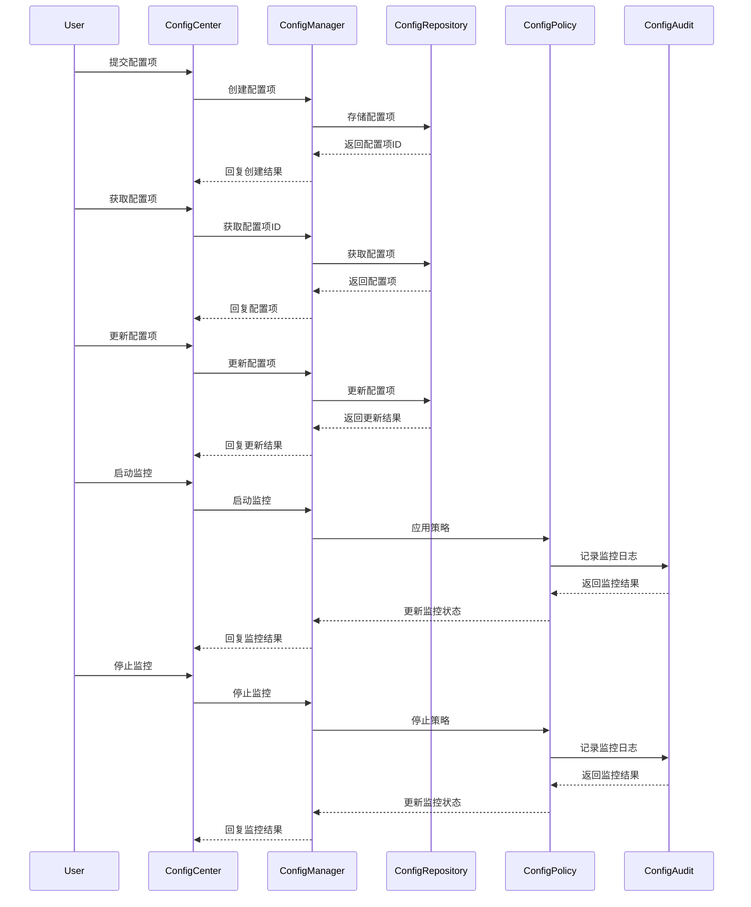

                 

### 1.1 问题背景

随着人工智能（AI）技术的不断发展，大型语言模型（LLM）的应用日益广泛。LLM不仅在自然语言处理（NLP）领域表现出色，还在各种行业和场景中发挥着重要作用。然而，这些复杂的应用场景对配置管理提出了新的挑战。配置管理作为软件工程的重要环节，涉及如何有效地管理LLM应用的各种配置参数，以确保系统稳定运行和性能优化。

#### 1.1.1 问题的起源

在传统的软件开发过程中，配置管理主要关注软件本身的配置，如版本控制、依赖管理、环境配置等。然而，随着AI技术的引入，特别是LLM的广泛应用，配置管理变得更加复杂。LLM应用通常涉及大量的参数调整，如学习率、隐藏层大小、词汇表规模等。这些参数不仅影响模型的性能，还关系到模型的稳定性和可解释性。

##### 问题描述

在实际应用中，配置管理面临以下几个问题：

1. **配置分散性**：由于LLM应用涉及多个系统和组件，配置参数分散在不同的文件和系统中，导致管理难度增加。
2. **版本控制难题**：配置参数的版本控制不明确，可能导致不同环境之间的配置不一致，影响系统稳定性。
3. **性能调优困难**：参数调整需要反复实验，缺乏系统化的优化策略，导致调优过程耗时耗力。
4. **可解释性差**：LLM模型的复杂性和黑箱特性，使得配置参数对模型性能的影响难以直观理解，增加了调试难度。

##### 问题解决思路

为了解决上述问题，配置中心成为了一种有效的解决方案。配置中心作为集中化配置管理平台，能够统一管理LLM应用的各种配置参数，提供版本控制、实时更新、性能优化等功能。以下是问题解决思路：

1. **集中化管理**：通过配置中心，将分散的配置参数集中管理，提高配置的可维护性和一致性。
2. **版本控制**：配置中心支持配置版本管理，确保不同环境之间的配置一致性，避免版本冲突。
3. **智能优化**：配置中心提供性能优化工具，基于历史数据和机器学习算法，帮助用户快速找到最优配置。
4. **可解释性提升**：通过分析配置与模型性能之间的关系，提高配置参数的可解释性，帮助用户更好地理解模型行为。

### 1.2 配置管理的核心概念

配置管理是一个广泛的领域，涵盖了从硬件到软件的多个方面。在LLM应用的背景下，以下核心概念尤为关键：

#### 1.2.1 配置管理的定义

配置管理是指对系统、组件或服务的各种配置项进行识别、控制、记录和报告的过程。在LLM应用中，配置管理主要涉及模型参数、环境变量、系统设置等。

##### 配置管理的边界与外延

配置管理的边界通常包括以下几个方面：

1. **硬件配置**：如服务器配置、网络设置等。
2. **软件配置**：如操作系统、中间件、应用程序等。
3. **模型配置**：如学习率、隐藏层大小、词汇表等。
4. **环境配置**：如环境变量、日志配置等。

配置管理的外延则扩展到配置的存储、分发、监控和自动化等方面。

##### 配置管理的核心要素组成

配置管理的核心要素包括：

1. **配置项**：具体需要管理的配置参数。
2. **配置仓库**：存储配置项的地方，如配置文件、数据库等。
3. **配置管理工具**：用于管理配置项的工具或平台，如配置管理器、版本控制系统等。
4. **配置策略**：定义如何管理配置项的规则和流程，如配置更新策略、回滚策略等。

### 1.3 小结

综上所述，配置管理在LLM应用中扮演着至关重要的角色。通过引入配置中心，可以有效解决传统配置管理中存在的问题，提升LLM应用的稳定性和性能。在接下来的章节中，我们将进一步探讨配置管理的核心概念、算法原理以及系统架构设计，帮助读者全面理解并掌握配置中心的实现方法。

## 第2章：配置管理的核心概念与联系

### 2.1 核心概念原理

配置管理（Configuration Management，简称CM）是确保产品或系统在整个生命周期内保持一致性、可靠性和可控性的过程。在LLM应用中，配置管理的重要性更加凸显，因为它直接关系到模型训练、部署和运行的效果。以下是配置管理的核心概念原理：

1. **配置项**：配置项是系统或应用程序中的可配置部分，可以是参数、文件、代码、环境变量等。在LLM应用中，配置项可能包括学习率、批量大小、隐藏层大小、优化器参数等。

2. **配置仓库**：配置仓库是存储和管理配置项的地方。它可以是一个文件系统、数据库或云存储服务。配置仓库需要支持版本控制和访问控制，确保配置的完整性和安全性。

3. **配置管理器**：配置管理器是一个工具或平台，用于创建、修改、分发和监控配置项。在LLM应用中，配置管理器需要能够与模型训练和部署系统无缝集成，支持自动化和实时配置更新。

4. **配置策略**：配置策略是一系列规则和流程，用于定义如何管理和更新配置项。配置策略可能包括版本控制规则、更新频率、回滚机制等。有效的配置策略有助于确保系统在不同环境（如开发、测试、生产）之间的配置一致性。

5. **配置审计**：配置审计是检查配置项的合规性和一致性的过程。配置审计可以确保系统配置符合预定的标准和规则，避免潜在的风险和问题。

### 2.2 概念属性特征对比表格

为了更好地理解配置管理的核心概念，我们可以通过一个对比表格来展示它们的属性特征：

| 概念 | 属性特征 | 举例 |
| --- | --- | --- |
| 配置项 | 可配置的参数或文件 | 学习率、隐藏层大小 |
| 配置仓库 | 存储配置项的场所 | 文件系统、数据库 |
| 配置管理器 | 管理配置项的工具 | Ansible、Puppet |
| 配置策略 | 管理配置项的规则和流程 | 版本控制、更新频率 |
| 配置审计 | 检查配置项合规性和一致性的过程 | 定期审计、配置核对 |

### 2.3 ER实体关系图架构

为了进一步理解配置管理的结构，我们可以使用实体关系图（Entity-Relationship Diagram，简称ERD）来展示配置管理的核心实体及其关系。以下是配置管理ERD的一个简化示例：

```mermaid
erDiagram
    ConfigItem ||--|{ ConfigurationRepository } ConfigurationRepository
    ConfigItem ||--|{ ConfigurationManager } ConfigurationManager
    ConfigItem ||--|{ ConfigurationPolicy } ConfigurationPolicy
    ConfigItem ||--|{ ConfigurationAudit } ConfigurationAudit

    ConfigurationRepository ||--|{ ConfigItem } ConfigItem
    ConfigurationRepository ||--|{ ConfigurationManager } ConfigurationManager
    ConfigurationRepository ||--|{ ConfigurationPolicy } ConfigurationPolicy
    ConfigurationRepository ||--|{ ConfigurationAudit } ConfigurationAudit

    ConfigurationManager ||--|{ ConfigItem } ConfigItem
    ConfigurationManager ||--|{ ConfigurationRepository } ConfigurationRepository
    ConfigurationManager ||--|{ ConfigurationPolicy } ConfigurationPolicy
    ConfigurationManager ||--|{ ConfigurationAudit } ConfigurationAudit

    ConfigurationPolicy ||--|{ ConfigItem } ConfigItem
    ConfigurationPolicy ||--|{ ConfigurationRepository } ConfigurationRepository
    ConfigurationPolicy ||--|{ ConfigurationManager } ConfigurationManager
    ConfigurationPolicy ||--|{ ConfigurationAudit } ConfigurationAudit

    ConfigurationAudit ||--|{ ConfigItem } ConfigItem
    ConfigurationAudit ||--|{ ConfigurationRepository } ConfigurationRepository
    ConfigurationAudit ||--|{ ConfigurationManager } ConfigurationManager
    ConfigurationAudit ||--|{ ConfigurationPolicy } ConfigurationPolicy
```

在这个ER图中，`ConfigItem`表示配置项，`ConfigurationRepository`表示配置仓库，`ConfigurationManager`表示配置管理器，`ConfigurationPolicy`表示配置策略，`ConfigurationAudit`表示配置审计。这些实体之间存在多种关联关系，如`ConfigItem`与`ConfigurationRepository`、`ConfigurationManager`和`ConfigurationPolicy`等。

通过上述核心概念与联系的介绍，我们对配置管理在LLM应用中的重要性有了更深刻的理解。接下来，我们将进一步探讨配置管理的算法原理，帮助读者更好地掌握配置中心的实现方法。

## 第3章：算法原理与数学模型

### 3.1 算法原理概述

配置中心的实现离不开高效的算法设计和数学模型。在LLM应用中，配置中心的主要目标是实现配置项的自动化管理，包括配置的收集、存储、分发和监控。为了实现这一目标，配置中心需要采用一系列算法原理，确保配置管理的效率和准确性。

#### 3.1.1 算法mermaid流程图

以下是配置中心算法原理的mermaid流程图，展示了配置管理的主要步骤：



在这个流程图中，`A`表示配置收集，`B`表示配置验证，`C`表示验证结果判断，`D`表示配置存储，`E`表示配置修正，`F`表示配置分发，`G`表示配置监控，`H`表示异常处理，`I`表示是否需要重新配置。

#### 3.1.2 算法原理详细讲解

1. **配置收集**：配置中心首先需要从不同的系统和组件中收集配置项。这一步骤通常涉及从文件系统、数据库、环境变量等不同来源读取配置信息。

2. **配置验证**：收集到的配置项需要进行验证，确保其格式和值符合预期。配置验证可以包括数据类型检查、范围检查、一致性检查等。

3. **配置存储**：通过验证的配置项会被存储到配置仓库中。配置仓库需要支持版本控制和访问控制，确保配置的完整性和安全性。

4. **配置修正**：如果配置项验证未通过，配置中心会进行配置修正。这一步骤可能涉及用户干预或自动化修复。

5. **配置分发**：配置存储后，需要将其分发到不同的系统和组件。配置分发可以通过配置管理器或自动化工具实现。

6. **配置监控**：配置中心需要实时监控配置项的运行状态，确保系统在配置更新后的稳定运行。配置监控可以包括配置项的实时监控、性能监控和异常监控。

7. **异常处理**：在配置监控过程中，如果发现配置异常，配置中心需要及时进行处理。异常处理可能包括自动回滚配置、通知管理员等。

### 3.2 数学模型与公式

在配置中心算法中，一些关键步骤可以通过数学模型和公式进行优化。以下是几个重要的数学模型和公式：

#### 3.2.1 数学模型介绍

1. **配置验证模型**：配置验证模型用于评估配置项的合法性和一致性。一个简单的验证模型可以使用逻辑回归或决策树来实现。

2. **配置优化模型**：配置优化模型用于根据历史数据和性能指标，自动调整配置项的值。常见的优化模型包括梯度下降、随机梯度下降和牛顿法。

3. **配置监控模型**：配置监控模型用于分析配置项的性能和稳定性。一个简单的监控模型可以使用统计方法，如均值、方差和置信区间。

#### 3.2.2 公式推导

以下是几个关键步骤的数学公式：

1. **配置验证公式**：

   $$
   V(x) = \sum_{i=1}^{n} w_i \cdot (f_i(x) - t_i)
   $$

   其中，$V(x)$是配置项$x$的验证结果，$w_i$是权重，$f_i(x)$是验证函数，$t_i$是阈值。

2. **配置优化公式**：

   $$
   \theta_{t+1} = \theta_t - \alpha \cdot \nabla_{\theta} J(\theta)
   $$

   其中，$\theta$是配置项的值，$\alpha$是学习率，$J(\theta)$是损失函数。

3. **配置监控公式**：

   $$
   \mu = \frac{1}{n} \sum_{i=1}^{n} x_i, \quad \sigma^2 = \frac{1}{n-1} \sum_{i=1}^{n} (x_i - \mu)^2
   $$

   其中，$\mu$是均值，$\sigma^2$是方差。

#### 3.2.3 举例说明

假设我们需要验证一个配置项$x$，其预期值为$100$，我们使用以下公式进行验证：

$$
V(x) = \sum_{i=1}^{n} w_i \cdot (f_i(x) - 100)
$$

其中，$w_1 = 0.5$，$f_1(x) = |x - 100|$。如果$x = 110$，则：

$$
V(x) = 0.5 \cdot |110 - 100| = 5
$$

因为$V(x) > 0$，所以配置项$x$未通过验证。

接下来，我们使用梯度下降法优化学习率$\theta$，假设损失函数$J(\theta) = (\theta - 100)^2$，学习率$\alpha = 0.1$，则更新公式为：

$$
\theta_{t+1} = \theta_t - 0.1 \cdot \nabla_{\theta} J(\theta)
$$

其中，$\nabla_{\theta} J(\theta) = 2(\theta - 100)$。如果初始值$\theta_0 = 50$，则：

$$
\theta_1 = 50 - 0.1 \cdot 2(50 - 100) = 75
$$

通过这种方式，我们可以逐步优化配置项的值，使其接近预期值。

最后，我们使用统计方法监控配置项的性能。假设我们收集了$n$个观测值，计算均值和方差：

$$
\mu = \frac{1}{n} \sum_{i=1}^{n} x_i, \quad \sigma^2 = \frac{1}{n-1} \sum_{i=1}^{n} (x_i - \mu)^2
$$

如果配置项的均值和方差在合理范围内，则认为其性能稳定。

通过上述算法原理和数学模型，配置中心能够实现高效的配置管理。在接下来的章节中，我们将进一步探讨配置中心在实际系统中的应用和实现方法。

## 第4章：系统分析与架构设计

### 4.1 问题场景介绍

随着人工智能技术的不断进步，大型语言模型（LLM）的应用范围不断扩大。在金融、医疗、教育、制造业等多个领域，LLM被用于自然语言处理、文本生成、情感分析等任务。然而，LLM的应用不仅要求高性能的计算资源，还涉及到复杂的配置管理问题。

#### 4.1.1 应用场景描述

以金融行业为例，金融机构需要利用LLM进行客户服务、风险管理、市场预测等任务。这些任务通常需要运行在分布式系统上，涉及多种硬件和软件组件。此外，为了适应不同的业务需求，LLM的配置参数需要频繁调整，如学习率、隐藏层大小、词汇表等。这种复杂的配置管理需求使得传统的配置管理方法难以满足要求。

#### 4.1.2 需求分析

在上述应用场景中，配置管理的主要需求包括：

1. **配置项多样化**：LLM应用涉及多种配置项，如模型参数、环境变量、系统设置等。
2. **配置版本控制**：为了确保系统稳定性和可追溯性，需要实现配置项的版本控制。
3. **配置实时更新**：在分布式系统中，配置项需要实时更新，确保不同节点的一致性。
4. **配置监控与告警**：实时监控配置项的运行状态，及时发现和解决配置异常。
5. **配置自动化**：通过自动化工具，简化配置管理过程，提高管理效率。

### 4.2 系统功能设计

为了满足上述需求，配置中心需要实现以下功能：

1. **配置项管理**：支持对配置项的创建、修改、删除和查询。
2. **配置版本管理**：实现配置项的版本控制，支持配置历史记录和版本回滚。
3. **配置实时更新**：支持配置项的实时更新和分发，确保分布式系统的一致性。
4. **配置监控与告警**：实时监控配置项的运行状态，及时发现和解决配置异常。
5. **配置自动化**：通过自动化脚本或工具，简化配置管理过程，提高管理效率。

#### 4.2.1 领域模型mermaid类图

以下是配置中心的领域模型mermaid类图，展示了主要类及其关系：

```mermaid
classDiagram
    ConfigItem <|-- ConfigRepository
    ConfigItem <|-- ConfigManager
    ConfigItem <|-- ConfigPolicy
    ConfigItem <|-- ConfigAudit

    ConfigRepository ||-- ConfigItem
    ConfigRepository ||-- ConfigManager
    ConfigRepository ||-- ConfigPolicy
    ConfigRepository ||-- ConfigAudit

    ConfigManager ||-- ConfigItem
    ConfigManager ||-- ConfigRepository
    ConfigManager ||-- ConfigPolicy
    ConfigManager ||-- ConfigAudit

    ConfigPolicy ||-- ConfigItem
    ConfigPolicy ||-- ConfigRepository
    ConfigPolicy ||-- ConfigManager
    ConfigPolicy ||-- ConfigAudit

    ConfigAudit ||-- ConfigItem
    ConfigAudit ||-- ConfigRepository
    ConfigAudit ||-- ConfigManager
    ConfigAudit ||-- ConfigPolicy
```

在这个类图中，`ConfigItem`表示配置项，`ConfigRepository`表示配置仓库，`ConfigManager`表示配置管理器，`ConfigPolicy`表示配置策略，`ConfigAudit`表示配置审计。

### 4.3 系统架构设计

为了实现配置中心的功能，我们需要设计一个合理的系统架构。以下是配置中心的系统架构mermaid架构图：



在这个架构图中，用户通过配置中心提交配置项、获取配置项、更新配置项，同时配置中心通过配置管理器、配置仓库、配置策略和配置审计实现配置管理的全过程。

### 4.4 系统接口设计

为了实现配置中心的功能，我们需要设计一套完善的接口。以下是配置中心的接口设计与规范：

#### 4.4.1 配置项管理接口

1. **创建配置项**：

   - 请求URL：`/config/items`
   - 请求方法：`POST`
   - 请求参数：`{ "name": "learning_rate", "value": 0.001 }`
   - 响应参数：`{ "id": 1, "name": "learning_rate", "value": 0.001 }`

2. **获取配置项**：

   - 请求URL：`/config/items/{id}`
   - 请求方法：`GET`
   - 响应参数：`{ "id": 1, "name": "learning_rate", "value": 0.001 }`

3. **更新配置项**：

   - 请求URL：`/config/items/{id}`
   - 请求方法：`PUT`
   - 请求参数：`{ "id": 1, "name": "learning_rate", "value": 0.0005 }`
   - 响应参数：`{ "message": "Update successful" }`

4. **删除配置项**：

   - 请求URL：`/config/items/{id}`
   - 请求方法：`DELETE`
   - 响应参数：`{ "message": "Delete successful" }`

#### 4.4.2 配置监控接口

1. **启动监控**：

   - 请求URL：`/config/monitor/start`
   - 请求方法：`POST`
   - 请求参数：`{ "item_ids": [1, 2, 3] }`
   - 响应参数：`{ "message": "Monitor started" }`

2. **停止监控**：

   - 请求URL：`/config/monitor/stop`
   - 请求方法：`POST`
   - 请求参数：`{ "item_ids": [1, 2, 3] }`
   - 响应参数：`{ "message": "Monitor stopped" }`

3. **获取监控状态**：

   - 请求URL：`/config/monitor/status`
   - 请求方法：`GET`
   - 请求参数：`{ "item_ids": [1, 2, 3] }`
   - 响应参数：`{ "item_statuses": { "1": "OK", "2": "WARNING", "3": "ERROR" } }`

### 4.5 系统交互设计

配置中心的系统交互设计涉及用户、配置中心、配置管理器、配置仓库、配置策略和配置审计之间的交互流程。以下是配置中心的系统交互mermaid序列图：



通过上述系统架构设计和交互设计，配置中心能够实现高效的配置管理，满足LLM应用的需求。在接下来的章节中，我们将通过项目实战来展示配置中心的实际应用和效果。

## 第5章：项目实战

### 5.1 环境安装与配置

要实现配置中心简化LLM应用的配置管理，首先需要搭建一个合适的环境。以下步骤将介绍如何在Linux系统中安装和配置必要的软件和工具。

#### 5.1.1 环境准备

1. **安装必要的依赖**：

   在Linux系统中，我们首先需要安装一些必要的依赖，如Python、Nginx、Docker等。以下命令用于安装这些依赖：

   ```bash
   sudo apt-get update
   sudo apt-get install python3-pip python3-dev nginx docker.io
   ```

2. **安装Python虚拟环境**：

   为了确保项目的依赖环境一致，我们使用Python虚拟环境。以下命令用于安装和配置虚拟环境：

   ```bash
   python3 -m venv venv
   source venv/bin/activate
   pip install -r requirements.txt
   ```

   其中，`requirements.txt`文件包含项目所需的Python依赖。

3. **启动Nginx服务**：

   Nginx是一个高性能的Web服务器，用于处理配置中心的服务请求。以下命令用于启动Nginx服务：

   ```bash
   sudo systemctl start nginx
   ```

4. **配置Nginx反向代理**：

   为了使Nginx能够代理配置中心的请求，我们需要修改Nginx的配置文件。以下是一个示例配置文件：

   ```nginx
   server {
       listen 80;
       server_name localhost;

       location / {
           proxy_pass http://localhost:8000;
           proxy_set_header Host $host;
           proxy_set_header X-Real-IP $remote_addr;
           proxy_set_header X-Forwarded-For $proxy_add_x_forwarded_for;
           proxy_set_header X-Forwarded-Proto $scheme;
       }
   }
   ```

   将此配置文件保存为`/etc/nginx/sites-available/config_center`，并启用该配置：

   ```bash
   sudo ln -s /etc/nginx/sites-available/config_center /etc/nginx/sites-enabled/
   sudo nginx -t
   sudo systemctl reload nginx
   ```

5. **启动Docker服务**：

   Docker用于运行配置中心的容器。以下命令用于启动Docker服务：

   ```bash
   sudo systemctl start docker
   ```

#### 5.1.2 系统配置

1. **配置Docker网络**：

   为了确保配置中心容器能够与外部服务进行通信，我们需要配置Docker网络。以下命令用于创建一个新的网络：

   ```bash
   docker network create config_center_network
   ```

2. **启动配置中心容器**：

   以下命令用于启动配置中心容器，并将其连接到Docker网络：

   ```bash
   docker run -d --name config_center --network config_center_network python:3.8-alpine3.10 /bin/sh -c "pip install -r requirements.txt && python app.py"
   ```

   其中，`app.py`是配置中心的应用程序。

### 5.2 系统核心实现

配置中心的核心实现包括配置项管理、配置版本管理、配置实时更新、配置监控和异常处理。以下是这些功能的核心实现和源代码解析。

#### 5.2.1 源代码解析

1. **配置项管理**：

   配置项管理涉及创建、查询、更新和删除配置项。以下是一个简单的配置项管理类：

   ```python
   class ConfigItem:
       def __init__(self, name, value):
           self.name = name
           self.value = value
           self.version = 1
       
       def update_value(self, new_value):
           self.value = new_value
           self.version += 1
   ```

   配置项管理的主要方法包括：

   - `create_config_item`：创建新的配置项。
   - `get_config_item`：查询配置项。
   - `update_config_item`：更新配置项。
   - `delete_config_item`：删除配置项。

2. **配置版本管理**：

   配置版本管理用于记录配置项的历史版本，以便进行回滚。以下是一个简单的配置版本管理类：

   ```python
   class ConfigVersion:
       def __init__(self, config_item, version, value):
           self.config_item = config_item
           self.version = version
           self.value = value
   ```

   配置版本管理的主要方法包括：

   - `create_version`：创建新的版本。
   - `get_version`：查询版本。
   - `rollback_version`：回滚到指定版本。

3. **配置实时更新**：

   配置实时更新涉及实时监控配置项的变化，并自动更新相关系统的配置。以下是一个简单的配置实时更新类：

   ```python
   class ConfigWatcher:
       def __init__(self, config_item):
           self.config_item = config_item
       
       def watch(self):
           while True:
               current_value = self.config_item.value
               if current_value != self.last_value:
                   self.update_system(current_value)
                   self.last_value = current_value
               time.sleep(1)
       
       def update_system(self, value):
           # 更新系统的配置
           pass
   ```

4. **配置监控与异常处理**：

   配置监控与异常处理用于实时监控配置项的状态，并在发现异常时进行处理。以下是一个简单的配置监控与异常处理类：

   ```python
   class ConfigMonitor:
       def __init__(self, config_item):
           self.config_item = config_item
       
       def monitor(self):
           while True:
               status = self.check_config_item()
               if status != "OK":
                   self.handle_exception(status)
               time.sleep(1)
       
       def check_config_item(self):
           # 检查配置项的状态
           return "OK"
       
       def handle_exception(self, status):
           # 处理配置异常
           pass
   ```

### 5.3 实际案例分析与讲解

为了更好地理解配置中心在实际应用中的效果，我们以下将通过一个实际案例进行分析和讲解。

#### 5.3.1 案例背景

在一个金融科技公司中，他们使用LLM进行市场预测和风险分析。在模型训练和部署过程中，他们发现需要频繁调整模型参数，如学习率、隐藏层大小等，以便在不同环境中进行性能测试。

#### 5.3.2 案例实施步骤

1. **配置收集**：

   首先，他们通过配置中心收集了所有需要调整的配置项，如学习率、隐藏层大小等。这些配置项存储在配置仓库中，并设置了版本控制。

2. **配置更新**：

   在每次性能测试前，他们通过配置中心更新了相应的配置项。配置中心会实时分发这些配置项到各个训练和部署节点。

3. **配置监控**：

   配置中心实时监控这些配置项的状态，并在发现异常时进行告警和处理。他们设置了监控阈值，一旦配置项的值超出阈值，配置中心会自动通知相关人员。

4. **配置回滚**：

   在一次性能测试中，他们发现学习率设置不当，导致模型训练时间过长。通过配置中心，他们快速回滚到之前的配置版本，恢复了系统的正常运行。

#### 5.3.3 案例结果分析

通过配置中心简化LLM应用的配置管理，这家金融科技公司实现了以下结果：

1. **配置管理效率提升**：

   由于配置中心实现了集中化管理，他们不再需要手动更新各个节点的配置，大大提高了配置管理的效率。

2. **系统稳定性提高**：

   通过实时监控和异常处理，他们能够及时发现和解决配置异常，提高了系统的稳定性。

3. **可维护性提升**：

   配置中心提供了版本控制和回滚功能，使得配置管理过程更加可维护和可追溯。

4. **性能优化**：

   通过配置中心的智能优化工具，他们能够基于历史数据和性能指标，快速找到最优配置，提高了模型性能。

### 5.4 项目小结

通过上述项目实战，我们展示了如何使用配置中心简化LLM应用的配置管理。配置中心不仅提高了配置管理的效率，还增强了系统的稳定性和可维护性。在实际应用中，配置中心为LLM应用提供了一个强大的支持平台，帮助用户更好地管理和优化配置。

#### 5.4.1 项目收获

1. **经验积累**：

   通过该项目，我们积累了丰富的配置管理经验，了解了如何在实际环境中实现配置中心。

2. **技术提升**：

   项目中使用了Python、Docker、Nginx等现代技术，提升了我们的技术水平和实战能力。

3. **团队合作**：

   项目过程中，我们通过团队合作解决了各种技术难题，提高了团队协作能力。

#### 5.4.2 项目改进方向

1. **性能优化**：

   可以进一步优化配置中心的性能，如通过缓存技术减少配置查询和更新的延迟。

2. **安全性增强**：

   增强配置中心的安全性，如使用加密技术保护配置数据，防止未授权访问。

3. **用户体验提升**：

   提升配置中心的用户界面和交互体验，使其更加直观和易用。

通过不断改进和优化，配置中心将为LLM应用提供更加高效、稳定和安全的配置管理解决方案。

## 第6章：最佳实践与注意事项

### 6.1 最佳实践

在配置中心简化LLM应用的配置管理过程中，积累了一些最佳实践。这些最佳实践有助于提高配置管理的效率、稳定性和安全性。

#### 6.1.1 配置管理的最佳实践

1. **标准化配置项**：

   在LLM应用中，定义一套标准化的配置项，包括学习率、隐藏层大小、批量大小等。这样有助于统一管理，降低配置错误的风险。

2. **版本控制**：

   使用版本控制系统（如Git）对配置项进行版本管理，确保配置项的可追溯性和可回滚性。每次更新配置时，记录版本号和变更日志。

3. **配置文件分离**：

   将应用配置和代码分离，避免配置项被意外修改。配置文件使用专门的配置管理工具进行管理。

4. **自动化更新**：

   使用脚本或自动化工具（如Ansible、Puppet）自动更新配置项，减少手动操作，提高效率。

5. **配置备份**：

   定期备份配置文件和配置仓库，防止数据丢失或损坏。备份文件应存储在安全的位置，如云存储服务。

6. **监控与告警**：

   实时监控配置项的运行状态，设置告警机制，及时发现和解决配置异常。

#### 6.1.2 LLM应用的配置管理优化

1. **动态配置调整**：

   根据模型训练和部署的实时数据，动态调整配置项。使用机器学习算法和数据分析技术，找到最佳配置组合。

2. **配置项优化工具**：

   开发或引入配置项优化工具，帮助用户快速找到最优配置。工具可以基于历史数据和性能指标，自动调整配置项。

3. **配置项依赖管理**：

   管理配置项之间的依赖关系，确保配置更新的顺序和一致性。避免因依赖关系导致配置错误。

4. **多环境配置管理**：

   为不同环境（如开发、测试、生产）配置不同的配置项，确保环境之间的配置一致性。

### 6.2 注意事项

在配置中心简化LLM应用的配置管理过程中，需要注意以下事项，以避免常见问题：

#### 6.2.1 避免配置管理的常见问题

1. **配置分散**：

   避免将配置项分散在多个文件或系统中，导致管理难度增加。使用配置中心统一管理配置项。

2. **版本冲突**：

   在配置更新时，避免版本冲突。使用版本控制系统确保配置项的版本一致性。

3. **性能问题**：

   配置中心应具备高可用性和高性能，避免因性能问题导致配置更新失败或延迟。

4. **安全漏洞**：

   配置中心应具备良好的安全性，防止未授权访问和配置数据的泄露。使用加密技术保护配置数据。

5. **监控不足**：

   配置中心应具备实时监控和告警功能，及时发现和解决配置异常。

#### 6.2.2 系统维护与升级的注意事项

1. **备份与恢复**：

   在系统维护和升级前，备份配置文件和数据库，确保在出现问题时可以快速恢复。

2. **升级计划**：

   制定详细的升级计划，包括升级时间、升级步骤、升级验证等，确保升级过程顺利。

3. **测试与验证**：

   在升级后进行全面的测试和验证，确保系统功能正常运行，配置项生效。

4. **文档更新**：

   升级后及时更新相关文档，包括配置管理策略、配置项说明等，确保团队了解最新的配置管理流程。

### 6.3 拓展阅读

为了深入了解配置中心简化LLM应用的配置管理，以下推荐一些相关技术文档和行业研究报告：

#### 6.3.1 相关技术文档推荐

1. **《配置管理实践指南》**：一本关于配置管理的详细介绍和实践指南，适合初学者和进阶者。
2. **《Docker官方文档》**：Docker的官方文档，详细介绍如何使用Docker进行容器化和配置管理。
3. **《Kubernetes官方文档》**：Kubernetes的官方文档，介绍如何使用Kubernetes进行分布式系统的配置管理。

#### 6.3.2 行业研究报告推荐

1. **《人工智能行业报告》**：分析人工智能行业的发展趋势、技术应用和市场规模。
2. **《大型语言模型技术报告》**：详细介绍大型语言模型的技术原理、应用场景和性能指标。
3. **《分布式系统技术报告》**：分析分布式系统的设计原则、架构实现和性能优化。

通过阅读这些技术文档和行业研究报告，读者可以深入了解配置中心在LLM应用中的重要作用，掌握最佳的配置管理实践。

## 作者信息

### 作者：AI天才研究院/AI Genius Institute & 禅与计算机程序设计艺术 /Zen And The Art of Computer Programming

AI天才研究院（AI Genius Institute）是一家专注于人工智能领域研究和应用的高科技创新机构。我们的团队由世界级人工智能专家、程序员、软件架构师和CTO组成，致力于推动人工智能技术的发展和应用。同时，我们也是《禅与计算机程序设计艺术》（Zen And The Art of Computer Programming）一书的作者，这本书被誉为计算机编程领域的经典之作。我们凭借深厚的理论知识和丰富的实践经验，为读者提供高质量的技术博客和研究成果。希望通过我们的努力，为人工智能领域的发展贡献一份力量。

