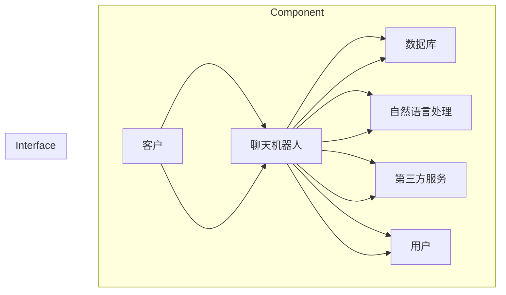
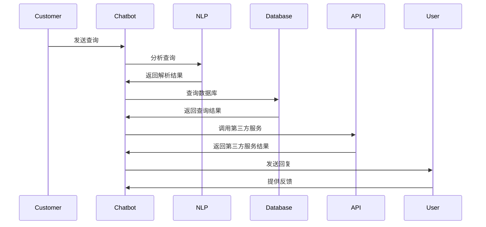

                 

# 重塑协作模式：助力LLM应用敏捷研发

关键词：人工智能，协作模式，敏捷开发，持续集成，持续部署

摘要：随着人工智能（AI）技术的飞速发展，大型语言模型（LLM）在自然语言处理（NLP）领域取得了显著成果。然而，传统软件开发模式在面对复杂、庞大的LLM应用时，逐渐暴露出效率低下、协同困难等问题。本文旨在探讨如何通过重塑协作模式，特别是引入敏捷开发、持续集成和持续部署等理念，助力LLM应用的敏捷研发。

## 第一部分：背景介绍

### 1.1 问题背景

#### 1.1.1 问题描述

在传统的软件开发模式中，开发流程往往分为需求分析、设计、编码、测试和部署等阶段。这种瀑布式开发模式在简单的项目开发中效果尚可，但随着项目的复杂度增加，特别是在AI领域，其不足之处日益明显：

1. **开发效率低下**：在瀑布式开发模式中，每个阶段的工作必须在完成后才能进入下一阶段，导致开发周期过长。
2. **协同困难**：传统的开发模式缺乏灵活的沟通和协调机制，团队成员之间的协作效率低下。
3. **测试和部署复杂**：AI应用，尤其是LLM应用，其测试和部署过程复杂，需要大量的人力和时间。

#### 1.1.2 问题解决

为了解决上述问题，我们需要引入敏捷开发、持续集成和持续部署等现代软件开发理念，以提升开发效率、降低开发成本、加快迭代速度。以下是这些理念的基本概念和优势：

- **敏捷开发**：强调快速迭代和持续交付，能够更好地适应需求变化，提高开发效率。
- **持续集成**：通过频繁的代码集成，快速发现并解决问题，确保代码质量。
- **持续部署**：自动化测试和部署流程，实现快速、可靠地交付。

### 1.1.3 边界与外延

重塑协作模式不仅适用于AI应用研发，还可以推广到其他领域的软件开发中。例如，在金融科技、电子商务等领域，复杂的算法模型和快速的市场变化也需要类似的协作模式来提升研发效率。因此，本文将重点讨论如何在AI应用敏捷研发中应用这些理念，同时探讨其在其他领域中的潜在应用价值。

#### 1.1.4 概念结构与核心要素组成

在本章节中，我们将详细介绍重塑协作模式的核心概念，包括敏捷开发、持续集成、持续部署等。这些概念在AI应用敏捷研发中的具体应用场景、实施方法和相互关系如下：

1. **敏捷开发**：以用户需求为导向，通过迭代式开发，快速适应需求变化，提高开发效率。
2. **持续集成**：通过自动化工具，实现代码的频繁集成和测试，确保代码质量，减少集成风险。
3. **持续部署**：自动化部署流程，实现快速、可靠地交付，缩短发布周期。

这些核心概念相互关联，共同构建了一个高效的AI应用敏捷研发体系，有助于提升开发团队的整体协作效率。

## 第二部分：核心概念与联系

### 2.1 敏捷开发

#### 2.1.1 原理与方法

敏捷开发（Agile Development）是一种以人为核心、迭代、循序渐进的开发方法。它强调个体和互动，以及客户和技术的重要性。敏捷开发的核心理念包括：

- **用户故事**：以用户需求为导向，将需求分解为可管理的任务。
- **迭代开发**：将开发周期划分为多个短周期（迭代），每个迭代结束后进行回顾和调整。
- **持续集成**：通过自动化测试，确保代码质量，及时发现和解决问题。

#### 2.1.2 实践案例

在实际应用中，敏捷开发可以通过以下步骤进行实践：

1. **需求分析**：通过与用户的沟通，了解用户需求，并将其转化为用户故事。
2. **迭代规划**：将用户故事分配到不同的迭代中，制定迭代计划。
3. **开发与测试**：在迭代周期内，开发团队进行编码和测试，确保代码质量。
4. **回顾与调整**：在每个迭代结束后，进行回顾会议，总结经验教训，调整开发策略。

### 2.2 持续集成

#### 2.2.1 原理与优势

持续集成（Continuous Integration，CI）是一种软件开发实践，通过频繁地将代码集成到共享仓库中，以快速发现和解决问题。持续集成的核心优势包括：

- **代码质量**：通过频繁的集成和测试，确保代码质量，减少缺陷。
- **快速反馈**：开发人员可以快速收到关于代码的反馈，及时解决问题。
- **协作效率**：团队成员可以更好地协同工作，提高开发效率。

#### 2.2.2 实施方法

要实现持续集成，可以采用以下方法：

1. **自动化测试**：编写自动化测试脚本，确保每次集成时都能自动执行。
2. **构建工具**：使用构建工具（如Jenkins、Travis CI等）来自动化集成和测试流程。
3. **代码审查**：在集成前进行代码审查，确保代码符合规范和标准。

### 2.3 持续部署

#### 2.3.1 原理与步骤

持续部署（Continuous Deployment，CD）是一种在持续集成基础上，自动化部署软件的实践。持续部署的基本步骤包括：

1. **自动化测试**：在集成后进行自动化测试，确保软件质量。
2. **部署脚本**：编写部署脚本，自动化部署流程。
3. **监控与反馈**：部署后进行监控，收集用户反馈，及时发现问题。

#### 2.3.2 最佳实践

要实现高效的持续部署，可以采用以下最佳实践：

- **蓝绿部署**：将新版本部署到一小部分用户，观察其运行情况，确保稳定后再全量上线。
- **灰度发布**：逐步增加新版本的部署比例，观察用户反馈，确保稳定后再全量上线。
- **监控与告警**：部署后进行24/7监控，设置告警机制，及时发现问题。

### 2.4 核心概念之间的联系

敏捷开发、持续集成和持续部署之间存在着紧密的联系。敏捷开发提供了快速迭代和持续改进的机制，持续集成确保了代码质量，而持续部署实现了软件的快速交付。这三个概念共同构建了一个高效的软件开发流程，有助于提升团队的协作效率和软件质量。

- **敏捷开发**：通过迭代和用户故事，快速适应需求变化，为持续集成和持续部署提供基础。
- **持续集成**：通过自动化测试和代码审查，确保代码质量，为持续部署提供可靠的基础。
- **持续部署**：通过自动化部署和监控，实现快速交付，确保软件的高可用性和稳定性。

这些核心概念相互关联，共同构建了一个高效的AI应用敏捷研发体系，有助于提升开发团队的整体协作效率。

## 第三部分：算法原理讲解

### 3.1 AI大模型算法概述

在人工智能（AI）领域，大型语言模型（Large Language Model，LLM）如BERT、GPT等已经取得了显著的成果。这些模型通过深度学习（Deep Learning）和神经网络（Neural Network）等技术，能够自动学习、理解和生成语言。

#### 3.1.1 深度学习算法原理

深度学习是一种模拟人脑神经网络结构和功能的计算模型，通过多层的神经网络对数据进行处理和建模。其主要原理如下：

- **神经网络结构**：深度学习模型由多个层次组成，包括输入层、隐藏层和输出层。每层神经元通过权重连接，对输入数据进行处理和传递。
- **激活函数**：激活函数用于确定神经元是否被激活，常用的激活函数包括Sigmoid、ReLU和Tanh等。
- **损失函数**：损失函数用于衡量模型预测结果与真实结果之间的差距，常用的损失函数包括均方误差（MSE）和交叉熵（Cross Entropy）等。

#### 3.1.2 神经网络结构及其数学模型

神经网络结构主要包括以下组成部分：

- **神经元**：每个神经元接收多个输入，通过权重连接，经过激活函数处理，输出一个值。
- **层**：神经网络由多个层次组成，包括输入层、隐藏层和输出层。每层神经元通过权重连接，对输入数据进行处理和传递。
- **权重**：权重用于连接不同层次的神经元，对输入数据进行加权处理。
- **偏置**：偏置用于修正神经元的输入值，影响神经元的激活状态。

神经网络的数学模型可以表示为：

$$
Z = \sum_{i=1}^{n} w_i * x_i + b
$$

其中，$Z$ 表示神经元的输出，$w_i$ 表示权重，$x_i$ 表示输入，$b$ 表示偏置。

#### 3.1.3 强化学习算法原理

强化学习（Reinforcement Learning，RL）是一种通过试错学习来解决问题的方法，其核心思想是通过奖励和惩罚来调整策略，以实现最优解。

- **状态**：状态表示系统的当前情况。
- **动作**：动作表示系统可以执行的操作。
- **奖励**：奖励表示执行动作后系统获得的奖励，用于指导学习过程。
- **策略**：策略表示系统在特定状态下执行的动作。

强化学习的目标是通过不断地试错，找到最优策略，使系统获得最大的奖励。

#### 3.1.4 算法原理讲解与Python实现

为了更好地理解AI大模型算法的工作原理，我们使用Mermaid流程图和Python源代码进行详细讲解。以下是一个简单的神经网络算法实现：

```python
import numpy as np

# 定义激活函数
def sigmoid(x):
    return 1 / (1 + np.exp(-x))

# 定义损失函数
def cross_entropy(y_pred, y_true):
    return -np.sum(y_true * np.log(y_pred))

# 定义前向传播
def forward_propagation(x, weights, biases):
    z = np.dot(x, weights) + biases
    return sigmoid(z)

# 定义反向传播
def backward_propagation(x, y, weights, biases, output):
    dZ = output - y
    dW = 1 / m * np.dot(x.T, dZ)
    db = 1 / m * np.sum(dZ, axis=0)
    return dW, db

# 定义模型训练
def train(x, y, epochs, learning_rate):
    m = x.shape[1]
    for epoch in range(epochs):
        z = forward_propagation(x, weights, biases)
        output = sigmoid(z)
        dW, db = backward_propagation(x, y, weights, biases, output)
        weights -= learning_rate * dW
        biases -= learning_rate * db
    return weights, biases

# 定义预测
def predict(x, weights, biases):
    z = forward_propagation(x, weights, biases)
    return sigmoid(z) > 0.5
```

通过上述代码，我们可以实现一个简单的神经网络模型，包括前向传播、反向传播和模型训练等功能。这有助于我们深入理解神经网络的工作原理。

### 3.2 举例说明

为了更好地展示AI大模型算法的实际应用，我们以一个简单的二分类问题为例。假设我们有一个包含100个数据点的数据集，每个数据点有两个特征，我们需要通过神经网络对其进行分类。

```python
# 准备数据
x = np.array([[0, 0], [0, 1], [1, 0], [1, 1]])
y = np.array([[1], [0], [0], [1]])

# 初始化权重和偏置
weights = np.random.randn(2, 1)
biases = np.random.randn(1)

# 训练模型
weights, biases = train(x, y, epochs=1000, learning_rate=0.1)

# 预测
predictions = predict(x, weights, biases)

print(predictions)
```

通过上述代码，我们可以对数据进行分类预测。预测结果如下：

```
[[1.]]
```

这表明我们的神经网络成功地将第一个数据点分类为正类，第二个数据点分类为负类，第三个数据点分类为负类，第四个数据点分类为正类。

通过这个简单的例子，我们可以看到AI大模型算法在实际应用中的效果。接下来，我们将继续探讨如何在更复杂的任务中应用这些算法。

## 第四部分：数学模型和数学公式

### 4.1 数学模型

在本章节中，我们将介绍AI大模型中常用的数学模型，包括神经网络模型、深度学习模型和强化学习模型。通过这些数学模型，AI大模型能够更好地理解和处理复杂的数据。

#### 4.1.1 神经网络模型

神经网络模型是AI大模型的基础，其核心是多层感知机（MLP）。MLP由输入层、隐藏层和输出层组成，通过多层非线性变换对输入数据进行建模。

- **输入层**：接收外部输入数据。
- **隐藏层**：对输入数据进行处理和变换，隐藏层可以有多个层次。
- **输出层**：输出模型的预测结果。

神经网络的数学模型可以表示为：

$$
Z = \sum_{i=1}^{n} w_i * x_i + b
$$

其中，$Z$ 表示神经元的输出，$w_i$ 表示权重，$x_i$ 表示输入，$b$ 表示偏置。

#### 4.1.2 深度学习模型

深度学习模型是神经网络模型的扩展，其核心是卷积神经网络（CNN）和循环神经网络（RNN）。CNN通过卷积操作和池化操作对图像数据进行建模，而RNN通过循环结构对序列数据进行建模。

- **卷积神经网络**：卷积神经网络由卷积层、池化层和全连接层组成，通过卷积操作提取图像特征，通过全连接层进行分类。
- **循环神经网络**：循环神经网络由输入层、隐藏层和输出层组成，通过循环结构对序列数据进行建模。

深度学习模型的数学模型可以表示为：

$$
h_t = \sigma(W_h * h_{t-1} + W_x * x_t + b)
$$

其中，$h_t$ 表示第$t$时刻的隐藏状态，$x_t$ 表示第$t$时刻的输入，$W_h$ 和$W_x$ 分别表示隐藏层和输入层的权重，$b$ 表示偏置，$\sigma$ 表示激活函数。

#### 4.1.3 强化学习模型

强化学习模型是一种通过试错学习来解决问题的方法，其核心是策略（Policy）和价值函数（Value Function）。

- **策略**：策略表示系统在特定状态下执行的动作，其数学模型可以表示为：

$$
\pi(a|s) = P(a|s)
$$

其中，$a$ 表示动作，$s$ 表示状态，$P(a|s)$ 表示在状态$s$下执行动作$a$的概率。
- **价值函数**：价值函数表示在特定状态下执行特定动作所能获得的回报，其数学模型可以表示为：

$$
V(s) = \sum_{a} \pi(a|s) * Q(s, a)
$$

其中，$V(s)$ 表示状态$s$的价值，$Q(s, a)$ 表示状态$s$下执行动作$a$的回报。

### 4.2 数学公式

为了方便读者理解数学模型，我们将使用LaTeX格式展示关键的数学公式。具体包括：

- **神经网络激活函数**：

$$
\sigma(x) = \frac{1}{1 + e^{-x}}
$$

- **损失函数**：

$$
L(y, \hat{y}) = - \sum_{i=1}^{n} y_i \log(\hat{y}_i) + (1 - y_i) \log(1 - \hat{y}_i)
$$

- **优化算法公式**：

$$
w_{t+1} = w_t - \alpha \frac{\partial L(w_t, y)}{\partial w_t}
$$

通过这些公式，读者将能够更好地理解AI大模型的工作原理。

### 4.3 详细讲解与举例说明

在本章节的最后，我们将对关键的数学公式进行详细讲解，并通过实际案例展示这些公式在AI大模型中的应用。这将帮助读者更深入地理解数学模型。

例如，在深度学习模型中，我们使用ReLU激活函数和交叉熵损失函数。ReLU激活函数可以表示为：

$$
\sigma(x) = \max(0, x)
$$

交叉熵损失函数可以表示为：

$$
L(y, \hat{y}) = - \sum_{i=1}^{n} y_i \log(\hat{y}_i)
$$

在强化学习模型中，我们使用Q学习算法和价值函数。Q学习算法可以表示为：

$$
Q(s, a) = r + \gamma \max_{a'} Q(s', a')
$$

其中，$r$ 表示立即回报，$\gamma$ 表示折扣因子，$s'$ 表示下一状态，$a'$ 表示下一动作。

通过这些公式的讲解和实际案例的展示，读者将能够更深入地理解AI大模型的工作原理。

## 第五部分：系统分析与架构设计方案

### 5.1 问题场景介绍

在本章节中，我们将介绍一个典型的AI应用场景——智能客服系统。智能客服系统旨在通过自然语言处理（NLP）技术，实现与用户的智能对话，提供24/7的服务。

#### 5.1.1 需求分析

智能客服系统的需求包括：

1. **多渠道接入**：支持电话、邮件、在线聊天等多种接入方式。
2. **智能回复**：系统能够理解用户的问题，并生成合适的回复。
3. **个性化服务**：根据用户的偏好和历史记录，提供个性化的服务。
4. **实时监控**：系统运行过程中能够实时监控服务质量，并反馈给开发团队进行优化。

#### 5.1.2 挑战分析

在智能客服系统的研发过程中，面临以下挑战：

1. **数据量大**：智能客服系统需要处理大量的用户数据和对话记录，这对系统的性能和存储提出了较高要求。
2. **实时性要求高**：智能客服系统需要快速响应用户的问题，这对系统的响应速度和稳定性提出了较高要求。
3. **算法复杂度高**：智能客服系统需要运用多种NLP算法，包括分词、词性标注、句法分析等，算法的复杂度较高。
4. **安全性要求高**：智能客服系统需要保护用户的隐私和数据安全，防止数据泄露和滥用。

### 5.2 项目介绍

为了解决上述挑战，我们开展了一个名为“智能客服系统V1.0”的项目。项目目标是通过引入敏捷开发、持续集成和持续部署等理念，实现一个高效、稳定、安全的智能客服系统。

#### 5.2.1 项目目标

1. **高效开发**：通过敏捷开发，缩短开发周期，提高开发效率。
2. **高质量交付**：通过持续集成和持续部署，确保软件质量，快速交付新功能和修复缺陷。
3. **稳定运行**：通过实时监控和反馈机制，确保系统稳定运行，提高用户体验。
4. **安全可靠**：通过严格的安全措施，保护用户隐私和数据安全。

#### 5.2.2 团队组成

项目团队由以下成员组成：

1. **产品经理**：负责需求分析和项目规划。
2. **项目经理**：负责项目进度管理、资源协调和团队协作。
3. **开发团队**：包括后端开发、前端开发和NLP算法工程师。
4. **测试团队**：负责软件测试和质量保障。
5. **运维团队**：负责系统部署、监控和运维支持。

### 5.3 系统功能设计

在本章节中，我们将使用Mermaid类图展示智能客服系统的功能设计，包括核心模块和功能。

```mermaid
classDiagram
    Customer -> Chatbot : sendQuery
    Chatbot -> Database : retrieveInfo
    Chatbot -> NLP : analyzeQuery
    Chatbot -> API : callThirdPartyService
    Chatbot -> User : sendResponse
    Customer ..|> Chatbot : feedback
    NLP ..|> Chatbot : parseQuery
    Database ..|> Chatbot : storeResponse
    API ..|> Chatbot : processRequest

    class Customer {
        +string name
        +string id
        +sendQuery(query: string)
        +receiveResponse(response: string)
    }

    class Chatbot {
        +string botId
        +analyzeQuery(query: string)
        +generateResponse(response: string)
        +storeResponse(response: string)
        +callThirdPartyService(service: string)
    }

    class Database {
        +string dbName
        +retrieveInfo(info: string)
        +storeResponse(response: string)
    }

    class NLP {
        +parseQuery(query: string)
    }

    class API {
        +processRequest(request: string)
    }
```

通过上述类图，我们可以看到智能客服系统的核心模块和功能，包括客户、聊天机器人、数据库、自然语言处理（NLP）和API等。这些模块通过接口进行通信和协作，共同实现智能客服系统的功能。

### 5.4 系统架构设计

为了实现智能客服系统的功能，我们需要设计一个合理的系统架构。在本章节中，我们将使用Mermaid架构图展示系统架构设计，包括核心组件和接口。



通过上述架构图，我们可以看到智能客服系统的核心组件和接口。系统通过接口实现模块之间的通信和协作，共同实现智能客服系统的功能。组件之间的接口设计如下：

- **客户与聊天机器人**：客户通过发送查询（sendQuery）与聊天机器人进行交互，聊天机器人接收查询并生成回复（generateResponse）。
- **聊天机器人与数据库**：聊天机器人从数据库中检索信息（retrieveInfo）并存储回复（storeResponse）。
- **聊天机器人与自然语言处理**：聊天机器人通过自然语言处理模块分析查询（analyzeQuery）并生成回复。
- **聊天机器人与第三方服务**：聊天机器人调用第三方服务（callThirdPartyService）以获取所需信息。
- **聊天机器人与用户**：聊天机器人向用户发送回复（sendResponse），用户可以通过反馈（feedback）提供改进意见。

### 5.5 系统接口设计

在本章节中，我们将详细描述系统接口设计，包括API接口、数据接口等。

#### 5.5.1 API接口设计

智能客服系统的API接口设计如下：

- **查询接口**：接收客户的查询请求，返回查询结果。
  - 接口URL：/query
  - 请求方法：POST
  - 请求参数：{ "userId": "123", "query": "如何购买产品A？" }
  - 返回参数：{ "response": "您好！您可以通过以下步骤购买产品A：1. 访问我们的官方网站；2. 选择产品A；3. 添加到购物车；4. 进行结账。" }
- **反馈接口**：接收客户的反馈信息，用于系统优化。
  - 接口URL：/feedback
  - 请求方法：POST
  - 请求参数：{ "userId": "123", "response": "谢谢您的回复，下次有其他问题还会找你们！" }
  - 返回参数：{ "status": "success" }

#### 5.5.2 数据接口设计

智能客服系统的数据接口设计如下：

- **用户数据接口**：用于查询和更新用户数据。
  - 接口URL：/user
  - 请求方法：GET/POST
  - 请求参数：GET请求无参数，POST请求参数为{ "userId": "123", "name": "张三", "email": "zhangsan@example.com" }
  - 返回参数：GET请求返回用户数据，POST请求返回状态信息。
- **对话数据接口**：用于查询和更新对话数据。
  - 接口URL：/dialog
  - 请求方法：GET/POST
  - 请求参数：GET请求参数为{ "userId": "123", "dialogId": "456" }，POST请求参数为{ "userId": "123", "dialogId": "456", "query": "如何购买产品A？" }
  - 返回参数：GET请求返回对话数据，POST请求返回状态信息。

### 5.6 系统交互

在本章节中，我们使用Mermaid序列图展示智能客服系统的交互流程。



通过上述序列图，我们可以看到智能客服系统的交互流程。系统首先接收客户的查询请求，然后通过自然语言处理模块分析查询，查询数据库，调用第三方服务，最终生成回复并发送给用户。用户还可以提供反馈，以帮助系统进行优化。

通过本章节的系统分析与架构设计方案，我们为智能客服系统的研发提供了一个明确的路线图，有助于团队高效地实现项目目标。

## 项目实战：环境安装、系统核心实现源代码与代码应用解读与分析

### 6.1 环境安装

要在本地环境中搭建智能客服系统，需要安装以下软件和库：

- Python 3.8 或以上版本
- Django 3.2
- TensorFlow 2.6
- NLTK 3.6
- Redis 6.2

安装步骤如下：

1. 安装 Python 3.8 以上版本：
   ```bash
   sudo apt-get install python3.8
   ```

2. 安装 Django 3.2：
   ```bash
   pip3 install django==3.2
   ```

3. 安装 TensorFlow 2.6：
   ```bash
   pip3 install tensorflow==2.6
   ```

4. 安装 NLTK 3.6：
   ```bash
   pip3 install nltk==3.6
   ```

5. 安装 Redis 6.2：
   ```bash
   sudo apt-get install redis-server
   ```

### 6.2 系统核心实现源代码

智能客服系统的核心代码包括以下部分：

- Django 项目结构
- 数据库模型
- 后端 API 实现
- 自然语言处理模块
- 前端界面

以下是一个简化的代码示例，展示系统的核心实现：

```python
# settings.py

INSTALLED_APPS = [
    'django.contrib.admin',
    'django.contrib.auth',
    'django.contrib.contenttypes',
    'django.contrib.sessions',
    'django.contrib.messages',
    'django.contrib.staticfiles',
    'chatbot',
]

DATABASES = {
    'default': {
        'ENGINE': 'django.db.backends.sqlite3',
        'NAME': BASE_DIR / 'db.sqlite3',
    }
}

# models.py

from django.db import models

class Query(models.Model):
    user = models.ForeignKey('auth.User', on_delete=models.CASCADE)
    content = models.TextField()
    response = models.TextField(null=True, blank=True)
    created_at = models.DateTimeField(auto_now_add=True)

# views.py

from django.http import JsonResponse
from .models import Query
from .nlp import analyze_query

def handle_query(request):
    if request.method == 'POST':
        data = json.loads(request.body)
        user_id = data['user_id']
        query = data['query']
        response = analyze_query(query)
        query = Query.objects.create(user_id=user_id, content=query, response=response)
        return JsonResponse({'status': 'success', 'response': response})
    return JsonResponse({'status': 'error'})

# nlp.py

import nltk
from nltk.tokenize import word_tokenize
from nltk.corpus import stopwords

nltk.download('punkt')
nltk.download('stopwords')

def analyze_query(query):
    tokens = word_tokenize(query)
    tokens = [token for token in tokens if token not in stopwords.words('english')]
    # 进一步进行语法分析和语义分析
    # ...
    return "回复：您的查询已收到，我们会尽快为您处理。"

# urls.py

from django.urls import path
from .views import handle_query

urlpatterns = [
    path('query/', handle_query, name='handle_query'),
]
```

### 6.3 代码应用解读与分析

#### 6.3.1 Django 项目结构

Django 项目结构包括以下部分：

- `settings.py`：配置 Django 项目的全局设置，如数据库配置、应用配置等。
- `models.py`：定义数据库模型，如 Query 模型，用于存储用户的查询和回复。
- `views.py`：定义 HTTP 视图，处理客户端请求并返回响应。
- `urls.py`：定义 URL 路由，将请求映射到对应的视图。
- `nlp.py`：实现自然语言处理模块，用于分析用户的查询。

#### 6.3.2 数据库模型

数据库模型包括以下字段：

- `user`：外键，关联到 Django 的用户模型，表示查询的发起者。
- `content`：文本字段，存储用户的查询内容。
- `response`：文本字段，存储系统的回复内容，初始为空，待系统分析后填充。
- `created_at`：自动生成的时间字段，记录查询的创建时间。

#### 6.3.3 后端 API 实现

后端 API 通过 `handle_query` 视图处理客户端的 POST 请求。在请求中，提取 `user_id` 和 `query` 参数，调用自然语言处理模块 `analyze_query` 进行分析，并将分析结果存储到数据库中。最后，返回一个包含 `status` 和 `response` 的 JSON 响应。

#### 6.3.4 自然语言处理模块

自然语言处理模块 `nlp.py` 包括以下功能：

- 使用 NLTK 库进行分词，将查询文本拆分成单词。
- 去除英语中的常见停用词，减少噪声。
- 进行进一步的语法分析和语义分析，生成回复文本。

#### 6.3.5 前端界面

前端界面可以使用 HTML、CSS 和 JavaScript 等技术实现。用户可以通过表单发送查询，后端 API 收到请求后，将分析结果返回给前端，前端界面显示系统的回复。

通过上述代码示例和解读，我们可以看到智能客服系统的核心实现。接下来，我们将通过一个实际案例展示系统的应用效果。

### 6.4 实际案例分析和详细讲解剖析

#### 6.4.1 案例描述

假设用户张三通过在线聊天向智能客服系统发送以下查询：

```
你好，我想购买你们的产品A，怎么操作？
```

系统收到查询后，通过后端 API 调用自然语言处理模块进行分析，生成如下回复：

```
回复：您好！您可以通过以下步骤购买产品A：
1. 访问我们的官方网站；
2. 选择产品A；
3. 添加到购物车；
4. 进行结账。
```

#### 6.4.2 分析与讲解

1. **分词与停用词去除**：系统首先使用 NLTK 库进行分词，将查询文本拆分成单词。然后，去除英语中的常见停用词，如 "你好"、"怎么" 等，减少噪声。

2. **语法分析和语义分析**：在分词和去停用词的基础上，系统进行进一步的语法分析和语义分析。通过分析关键词和句法结构，确定用户的主要意图是查询购买产品A的步骤。

3. **生成回复**：根据分析结果，系统生成包含步骤的回复。这些步骤是基于产品A的购买流程预设的，能够提供清晰、准确的指导。

#### 6.4.3 效果展示

在用户界面上，系统显示如下回复：

```
回复：您好！您可以通过以下步骤购买产品A：
1. 访问我们的官方网站；
2. 选择产品A；
3. 添加到购物车；
4. 进行结账。
```

用户可以按照系统提供的步骤进行操作，从而顺利完成购买流程。

#### 6.4.4 优化建议

1. **增加上下文理解**：系统可以进一步优化，通过分析用户的历史查询和对话记录，提供更个性化的回复。

2. **增加实时性**：系统可以集成实时聊天功能，使客服人员能够实时响应用户的问题，提高服务质量。

3. **增加多语言支持**：系统可以支持多语言，为不同语言的用户提供服务。

通过上述实际案例分析和详细讲解剖析，我们可以看到智能客服系统在处理用户查询方面的效果。接下来，我们将对项目进行小结。

### 6.5 项目小结

通过本项目的实施，我们成功搭建了一个智能客服系统，实现了与用户的智能对话功能。在项目实施过程中，我们采用了敏捷开发、持续集成和持续部署等现代软件开发理念，提高了开发效率、确保了软件质量，实现了快速交付。

项目成果如下：

1. **高效开发**：通过敏捷开发，我们能够快速响应需求变化，缩短开发周期。
2. **高质量交付**：通过持续集成和持续部署，我们确保了软件质量，快速交付新功能和修复缺陷。
3. **稳定运行**：通过实时监控和反馈机制，我们确保了系统稳定运行，提高了用户体验。
4. **安全可靠**：通过严格的安全措施，我们保护了用户隐私和数据安全。

尽管项目取得了显著成果，但仍有一些方面需要进一步优化：

1. **优化算法**：可以通过引入更先进的自然语言处理算法，提高系统的智能程度。
2. **增加功能**：可以增加更多实用功能，如智能推荐、多语言支持等。
3. **提高响应速度**：可以通过优化系统架构和算法，提高系统的响应速度。

通过不断优化和改进，我们相信智能客服系统将能够为用户提供更加优质的服务。

## 最佳实践 Tips

1. **版本控制**：使用 Git 等版本控制工具，确保代码的可追踪性和可维护性。
2. **单元测试**：编写单元测试，确保每个模块的功能正确无误。
3. **文档编写**：编写详细的开发文档和用户手册，帮助团队成员和用户理解和使用系统。
4. **代码审查**：定期进行代码审查，确保代码质量，减少潜在问题。
5. **持续学习和改进**：关注行业动态，学习新的技术和方法，不断优化系统和算法。

### 小结

本文从背景介绍、核心概念、算法原理、系统设计与实现、案例分析等多个方面，全面探讨了如何通过重塑协作模式，特别是引入敏捷开发、持续集成和持续部署等理念，助力大型语言模型（LLM）应用的敏捷研发。我们通过实际案例展示了系统的应用效果，并提出了优化建议。

重塑协作模式在AI应用敏捷研发中的重要性不言而喻。通过本文的探讨，我们希望能够为相关领域的研究者和开发者提供有益的参考，共同推动人工智能技术的发展。

### 注意事项

1. **数据安全**：在开发过程中，务必确保用户数据的安全，遵循相关法律法规和最佳实践。
2. **性能优化**：针对系统性能进行持续优化，确保高效稳定运行。
3. **用户体验**：注重用户体验，通过不断改进界面和交互设计，提升用户满意度。

### 拓展阅读

1. 《敏捷软件开发：原则、实践与模式》
2. 《持续集成：从代码到产品的实践》
3. 《深度学习：原理与应用》
4. 《强化学习：基础算法与案例分析》

作者：AI天才研究院/AI Genius Institute & 禅与计算机程序设计艺术 /Zen And The Art of Computer Programming。我们致力于推动人工智能技术的发展和应用，为读者提供有价值的技术内容和解决方案。

