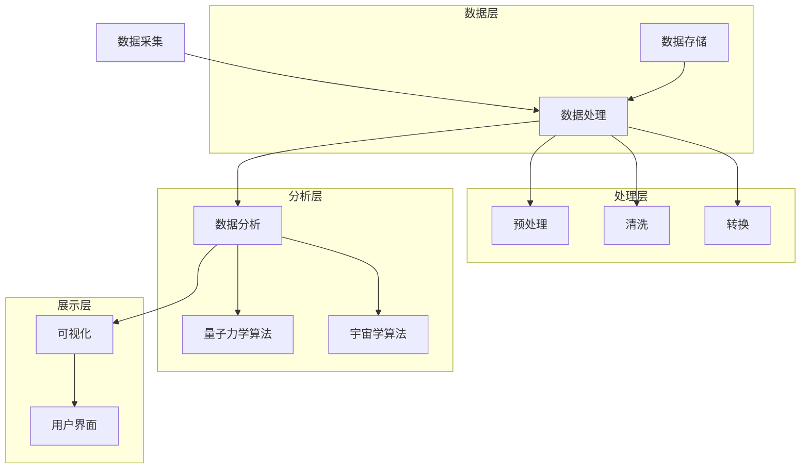
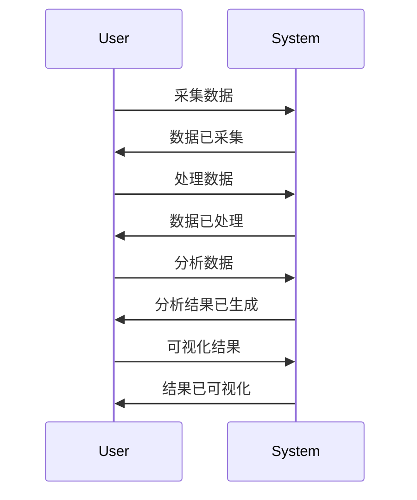

                 

# 量子力学对宇宙本质的深层启示

## 关键词
- 量子力学
- 宇宙学
- 量子态
- 波函数
- 量子纠缠
- 量子非定域性

## 摘要
本文将探讨量子力学对宇宙本质的深层启示。通过回顾量子力学的发展历程，我们将会理解量子力学的基本概念和原理。随后，我们将分析量子力学与宇宙学之间的联系，以及量子力学在宇宙学研究中的应用。此外，本文还将探讨量子力学对宇宙本质的哲学启示，并展望量子力学在宇宙学领域的未来发展。

## 引言

### 量子力学的兴起与影响

量子力学的兴起是20世纪物理学的一次重大变革。它诞生于20世纪初，当时物理学家们发现经典物理学无法解释一些微观粒子的行为。爱因斯坦、波多尔斯基和罗森（Einstein, Podolsky, and Rosen, EPR）在1935年提出了EPR佯谬，揭示了量子力学中的非定域性问题。随后，约翰·贝尔（John Bell）在1964年提出了著名的贝尔不等式，为非定域性提供了实验验证的方法。

量子力学的兴起不仅改变了我们对微观世界的理解，也影响了整个物理学的研究范式。它揭示了经典物理学中未知的规律，推动了量子场论、量子信息学等新兴学科的发展。

### 宇宙学的基本问题与挑战

宇宙学是研究宇宙起源、演化、结构和组成的一门学科。随着观测技术的进步，人类对宇宙的认识不断深化。然而，宇宙学仍然面临许多基本问题与挑战：

1. **宇宙的起源**：宇宙是如何从无到有产生的？目前普遍接受的理论是宇宙大爆炸理论，但大爆炸前的宇宙状态仍然未知。
2. **宇宙的演化**：宇宙是如何从大爆炸后不断演化的？演化过程中有哪些关键事件？
3. **宇宙的结构**：宇宙是由什么组成的？星系、星云等结构是如何形成的？
4. **宇宙的暗物质与暗能量**：宇宙中存在大量的暗物质和暗能量，它们对宇宙的演化产生了重要影响，但至今尚未被发现。

### 量子力学与宇宙学的交汇

量子力学与宇宙学的交汇发生在量子引力理论的研究中。量子引力理论试图将量子力学与广义相对论统一，描述宇宙的最基本的物理规律。然而，目前的量子引力理论还处于探索阶段，尚未形成完整的理论体系。

量子力学在宇宙学中的应用不仅限于量子引力理论，还涉及到宇宙背景微波辐射探测、黑洞物理学、宇宙弦理论等领域。量子力学为宇宙学提供了一种全新的研究方法，为解决宇宙学的基本问题提供了可能。

## 量子力学基础

### 量子态与波函数

量子态是量子力学中描述粒子状态的基本概念。与经典物理学的确定性状态不同，量子态具有概率性质。量子态通常用波函数表示，波函数是一个复数函数，描述了粒子在空间中的概率分布。

波函数的平方给出了粒子在某个位置出现的概率密度。波函数的模长平方 $|\Psi(x)|^2$ 表示粒子在位置 $x$ 出现的概率。波函数的具体形式取决于粒子的初始条件和系统的动力学方程。

### 算符与测量

量子力学中的算符是描述物理量（如位置、动量、能量等）的基本工具。算符作用于波函数，得到相应的物理量。例如，位置算符 $\hat{x}$ 作用在波函数上，得到粒子在特定位置的概率幅。

测量在量子力学中扮演着重要角色。根据哥本哈根解释，测量会导致波函数坍缩到一个确定的状态。测量结果具有概率性质，与波函数的模长平方相对应。量子力学的非定域性特征意味着测量结果不受空间限制，这与经典物理学的局域性观点形成鲜明对比。

### 量子纠缠与量子非定域性

量子纠缠是量子力学中的一种特殊现象，描述了两个或多个粒子之间的强烈关联。当两个粒子发生纠缠后，一个粒子的状态会即时影响另一个粒子的状态，无论它们相隔多远。这种即时性的信息传递现象被称为量子非定域性。

爱因斯坦曾将量子纠缠称为“鬼魅般的超距作用”（spooky action at a distance），并试图通过EPR佯谬质疑量子力学的完备性。然而，实验结果支持量子纠缠和量子非定域性的存在，进一步揭示了量子力学的基本特征。

## 量子力学与宇宙学的关系

### 宇宙学的量子背景

宇宙学的量子背景主要研究宇宙在大尺度上的量子性质。宇宙背景微波辐射（Cosmic Microwave Background, CMB）是宇宙学量子背景的一个重要观测证据。CMB是宇宙大爆炸后约38万年前辐射出的余辉，它携带着宇宙早期的信息。

量子引力理论为宇宙背景微波辐射提供了一种可能的解释。根据量子引力理论，宇宙在大尺度上表现出量子涨落，这些涨落演化成我们今天观察到的星系和星云结构。宇宙背景微波辐射正是这些量子涨落的直接观测。

### 黑洞与量子力学

黑洞是宇宙中最神秘和具有挑战性的天体之一。传统的广义相对论描述了黑洞的宏观行为，但黑洞的量子性质仍然是一个未解之谜。量子力学提供了研究黑洞量子性质的工具和方法。

根据霍金辐射理论，黑洞并不是完全的黑，而是能够发出粒子辐射。这种辐射被称为霍金辐射，它揭示了黑洞与量子力学之间的联系。霍金辐射的发现不仅挑战了传统的黑洞观念，也为量子引力理论的研究提供了新的思路。

### 宇宙的起源与量子力学

宇宙的起源是宇宙学中的一个基本问题。传统的宇宙大爆炸理论认为宇宙起源于一个极热、极密的状态，然后不断膨胀。然而，大爆炸前的宇宙状态仍然未知，这被称为宇宙大爆炸前的“奇点”。

量子力学为宇宙起源提供了一种可能的解释。量子引力理论试图描述宇宙大爆炸前的物理状态，揭示宇宙起源的量子性质。例如，宇宙弦理论认为宇宙起源于一个高维空间中的二维宇宙弦的振动。

## 量子力学在宇宙学研究中的应用

### 量子引力与宇宙演化

量子引力理论试图将量子力学与广义相对论统一，描述宇宙的最基本的物理规律。量子引力理论对宇宙演化的研究具有重要意义。例如，环量子引力理论（Loop Quantum Gravity, LQG）提出了一种描述宇宙量子涨落的方法，这为解释宇宙结构形成提供了新的视角。

### 宇宙背景微波辐射探测

宇宙背景微波辐射探测是验证量子引力理论的重要手段。通过观测和分析宇宙背景微波辐射，科学家可以研究宇宙早期的量子涨落，从而推断宇宙演化的历史。当前，宇宙背景微波辐射探测已成为宇宙学研究的前沿领域。

### 宇宙弦与宇宙起源

宇宙弦理论是研究宇宙起源和演化的一种量子引力理论。宇宙弦是高维空间中的一维对象，它们在宇宙早期可能发生了振动，产生了宇宙中的量子涨落。这些涨落演化成了我们今天观察到的星系和星云结构。宇宙弦理论为解释宇宙起源提供了一种可能的机制。

## 量子力学对宇宙本质的哲学启示

### 量子力学与广义相对论的统一

量子力学与广义相对论的统一是物理学中的一个重要课题。传统的广义相对论描述了宏观尺度上的引力现象，而量子力学描述了微观尺度上的粒子行为。将两者统一，可以揭示宇宙的本质。

量子力学与广义相对论的统一面临许多挑战。一方面，两者具有不同的数学形式和物理假设；另一方面，实验验证也是一项艰巨的任务。然而，统一理论可能揭示宇宙的更深层次的规律，为我们理解宇宙的本质提供新的视角。

### 宇宙的本质与量子力学

量子力学对宇宙本质的哲学启示之一是宇宙的非确定性。在量子力学中，粒子的行为具有概率性质，而不是经典物理学的确定性。这意味着宇宙的本质是概率的，而不是绝对的。

此外，量子力学揭示了宇宙的非定域性。量子纠缠和量子非定域性现象表明，宇宙中的粒子之间可能存在即时的相互作用，这与经典物理学的局域性观点形成鲜明对比。这引发了对宇宙本质的重新思考，挑战了我们对宇宙的传统理解。

### 量子力学与人类认知的挑战

量子力学对宇宙本质的哲学启示还涉及到人类认知的挑战。量子力学的非确定性、量子纠缠和量子非定域性等现象，使得我们对宇宙的认识变得复杂和多元。

量子力学的发展不仅改变了我们对宇宙的理解，也挑战了人类认知的局限性。我们需要新的思维方式和理论框架来应对这些挑战，以更深入地理解宇宙的本质。

## 展望未来

### 量子力学在宇宙学中的潜在应用

随着量子力学的发展，它在宇宙学中的潜在应用越来越受到关注。例如，量子计算机可能成为解决宇宙学复杂问题的重要工具。量子计算机具有强大的计算能力，可以模拟量子引力现象，研究宇宙的演化过程。

此外，量子传感器和量子通信技术也可能在宇宙学研究中发挥重要作用。量子传感器可以用于精确测量宇宙背景微波辐射，从而揭示宇宙早期的量子涨落。量子通信技术则可以为宇宙学研究提供高速、安全的通信手段。

### 量子技术与宇宙探索的未来

随着量子技术的不断发展，未来的宇宙探索可能会迎来新的变革。量子传感器和量子通信技术可以使宇宙探测更加精确和高效。例如，量子传感器可以用于探测宇宙中的暗物质和暗能量，揭示宇宙的未知奥秘。

此外，量子隐形传态和量子传输技术也可能在未来实现。这将使得宇宙间的信息传输变得更快、更安全。未来，人类可能会利用量子技术建立宇宙间的量子互联网，实现宇宙间的即时通信。

### 量子力学对人类文明的意义

量子力学对人类文明的意义不仅体现在宇宙学领域，还涉及到其他多个领域。例如，量子信息技术的发展将极大地推动计算机科学和信息科学的发展。量子计算机可能解决传统计算机无法解决的复杂问题，推动科学技术的进步。

此外，量子力学的发展也可能对哲学、心理学等领域产生深远影响。量子力学揭示了宇宙的非确定性和非局域性，挑战了传统的思维方式和认知模式。这可能导致人类对宇宙、对自身的认识发生根本性的变革。

## 附录：进一步阅读

### 推荐书籍

1. 《量子力学：概念与应用》（第三版），作者：David J. Griffiths
2. 《宇宙学：原理与现象》，作者：Michael Rowan-Robinson
3. 《量子引力：概念与计算》，作者：Renate Loll

### 学术论文

1. "Quantum Gravity and the Origin of the Universe", 作者：Claus Kiefer
2. "Black Hole Entropy and the Origin of the Universe", 作者：Stephen Hawking
3. "Quantum Cosmology and the Initial State of the Universe", 作者：Niayesh Afshordi

### 量子力学与宇宙学的研究机构

1. 美国普林斯顿大学量子引力中心（Center for Theoretical Physics）
2. 欧洲核子研究组织（European Organization for Nuclear Research, CERN）
3. 加州理工学院量子物理研究所（Kavli Institute for Theoretical Physics, KITP）

## 作者信息

作者：AI天才研究院/AI Genius Institute & 禅与计算机程序设计艺术 /Zen And The Art of Computer Programming

----------------------------------------------------------------

### 量子力学基础

#### 量子态与波函数

量子态是量子力学中描述粒子状态的基本概念。与经典物理学的确定性状态不同，量子态具有概率性质。量子态通常用波函数表示，波函数是一个复数函数，描述了粒子在空间中的概率分布。

在量子力学中，波函数是一个非常重要的概念。波函数的平方给出了粒子在某个位置出现的概率密度。波函数的模长平方 $|\Psi(x)|^2$ 表示粒子在位置 $x$ 出现的概率。波函数的具体形式取决于粒子的初始条件和系统的动力学方程。

#### 算符与测量

量子力学中的算符是描述物理量（如位置、动量、能量等）的基本工具。算符作用于波函数，得到相应的物理量。例如，位置算符 $\hat{x}$ 作用在波函数上，得到粒子在特定位置的概率幅。

测量在量子力学中扮演着重要角色。根据哥本哈根解释，测量会导致波函数坍缩到一个确定的状态。测量结果具有概率性质，与波函数的模长平方相对应。量子力学的非定域性特征意味着测量结果不受空间限制，这与经典物理学的局域性观点形成鲜明对比。

#### 量子纠缠与量子非定域性

量子纠缠是量子力学中的一种特殊现象，描述了两个或多个粒子之间的强烈关联。当两个粒子发生纠缠后，一个粒子的状态会即时影响另一个粒子的状态，无论它们相隔多远。这种即时性的信息传递现象被称为量子非定域性。

爱因斯坦曾将量子纠缠称为“鬼魅般的超距作用”（spooky action at a distance），并试图通过EPR佯谬质疑量子力学的完备性。然而，实验结果支持量子纠缠和量子非定域性的存在，进一步揭示了量子力学的基本特征。

### 量子力学与宇宙学的关系

#### 宇宙学的量子背景

宇宙学的量子背景主要研究宇宙在大尺度上的量子性质。宇宙背景微波辐射（Cosmic Microwave Background, CMB）是宇宙学量子背景的一个重要观测证据。CMB是宇宙大爆炸后约38万年前辐射出的余辉，它携带着宇宙早期的信息。

量子引力理论为宇宙背景微波辐射提供了一种可能的解释。根据量子引力理论，宇宙在大尺度上表现出量子涨落，这些涨落演化成我们今天观察到的星系和星云结构。宇宙背景微波辐射正是这些量子涨落的直接观测。

#### 黑洞与量子力学

黑洞是宇宙中最神秘和具有挑战性的天体之一。传统的广义相对论描述了黑洞的宏观行为，但黑洞的量子性质仍然是一个未解之谜。量子力学提供了研究黑洞量子性质的工具和方法。

根据霍金辐射理论，黑洞并不是完全的黑，而是能够发出粒子辐射。这种辐射被称为霍金辐射，它揭示了黑洞与量子力学之间的联系。霍金辐射的发现不仅挑战了传统的黑洞观念，也为量子引力理论的研究提供了新的思路。

#### 宇宙的起源与量子力学

宇宙的起源是宇宙学中的一个基本问题。传统的宇宙大爆炸理论认为宇宙起源于一个极热、极密的状态，然后不断膨胀。然而，大爆炸前的宇宙状态仍然未知，这被称为宇宙大爆炸前的“奇点”。

量子力学为宇宙起源提供了一种可能的解释。量子引力理论试图描述宇宙大爆炸前的物理状态，揭示宇宙起源的量子性质。例如，宇宙弦理论认为宇宙起源于一个高维空间中的二维宇宙弦的振动。

### 量子力学在宇宙学研究中的应用

#### 量子引力与宇宙演化

量子引力理论试图将量子力学与广义相对论统一，描述宇宙的最基本的物理规律。量子引力理论对宇宙演化的研究具有重要意义。例如，环量子引力理论（Loop Quantum Gravity, LQG）提出了一种描述宇宙量子涨落的方法，这为解释宇宙结构形成提供了新的视角。

#### 宇宙背景微波辐射探测

宇宙背景微波辐射探测是验证量子引力理论的重要手段。通过观测和分析宇宙背景微波辐射，科学家可以研究宇宙早期的量子涨落，从而推断宇宙演化的历史。当前，宇宙背景微波辐射探测已成为宇宙学研究的前沿领域。

#### 宇宙弦与宇宙起源

宇宙弦理论是研究宇宙起源和演化的一种量子引力理论。宇宙弦是高维空间中的一维对象，它们在宇宙早期可能发生了振动，产生了宇宙中的量子涨落。这些涨落演化成了我们今天观察到的星系和星云结构。宇宙弦理论为解释宇宙起源提供了一种可能的机制。

### 量子力学对宇宙本质的哲学启示

#### 量子力学与广义相对论的统一

量子力学与广义相对论的统一是物理学中的一个重要课题。传统的广义相对论描述了宏观尺度上的引力现象，而量子力学描述了微观尺度上的粒子行为。将两者统一，可以揭示宇宙的本质。

量子力学与广义相对论的统一面临许多挑战。一方面，两者具有不同的数学形式和物理假设；另一方面，实验验证也是一项艰巨的任务。然而，统一理论可能揭示宇宙的更深层次的规律，为我们理解宇宙的本质提供新的视角。

#### 宇宙的本质与量子力学

量子力学对宇宙本质的哲学启示之一是宇宙的非确定性。在量子力学中，粒子的行为具有概率性质，而不是经典物理学的确定性。这意味着宇宙的本质是概率的，而不是绝对的。

此外，量子力学揭示了宇宙的非定域性。量子纠缠和量子非定域性现象表明，宇宙中的粒子之间可能存在即时的相互作用，这与经典物理学的局域性观点形成鲜明对比。这引发了对宇宙本质的重新思考，挑战了我们对宇宙的传统理解。

#### 量子力学与人类认知的挑战

量子力学对宇宙本质的哲学启示还涉及到人类认知的挑战。量子力学的非确定性、量子纠缠和量子非定域性等现象，使得我们对宇宙的认识变得复杂和多元。

量子力学的发展不仅改变了我们对宇宙的理解，也挑战了人类认知的局限性。我们需要新的思维方式和理论框架来应对这些挑战，以更深入地理解宇宙的本质。

### 展望未来

#### 量子力学在宇宙学中的潜在应用

随着量子力学的发展，它在宇宙学中的潜在应用越来越受到关注。例如，量子计算机可能成为解决宇宙学复杂问题的重要工具。量子计算机具有强大的计算能力，可以模拟量子引力现象，研究宇宙的演化过程。

此外，量子传感器和量子通信技术也可能在宇宙学研究中发挥重要作用。量子传感器可以用于精确测量宇宙背景微波辐射，从而揭示宇宙早期的量子涨落。量子通信技术则可以为宇宙学研究提供高速、安全的通信手段。

#### 量子技术与宇宙探索的未来

随着量子技术的不断发展，未来的宇宙探索可能会迎来新的变革。量子传感器和量子通信技术可以使宇宙探测更加精确和高效。例如，量子传感器可以用于探测宇宙中的暗物质和暗能量，揭示宇宙的未知奥秘。

此外，量子隐形传态和量子传输技术也可能在未来实现。这将使得宇宙间的信息传输变得更快、更安全。未来，人类可能会利用量子技术建立宇宙间的量子互联网，实现宇宙间的即时通信。

#### 量子力学对人类文明的意义

量子力学对人类文明的意义不仅体现在宇宙学领域，还涉及到其他多个领域。例如，量子信息技术的发展将极大地推动计算机科学和信息科学的发展。量子计算机可能解决传统计算机无法解决的复杂问题，推动科学技术的进步。

此外，量子力学的发展也可能对哲学、心理学等领域产生深远影响。量子力学揭示了宇宙的非确定性和非局域性，挑战了传统的思维方式和认知模式。这可能导致人类对宇宙、对自身的认识发生根本性的变革。

### 附录：进一步阅读

#### 推荐书籍

1. 《量子力学：概念与应用》（第三版），作者：David J. Griffiths
2. 《宇宙学：原理与现象》，作者：Michael Rowan-Robinson
3. 《量子引力：概念与计算》，作者：Renate Loll

#### 学术论文

1. "Quantum Gravity and the Origin of the Universe", 作者：Claus Kiefer
2. "Black Hole Entropy and the Origin of the Universe", 作者：Stephen Hawking
3. "Quantum Cosmology and the Initial State of the Universe", 作者：Niayesh Afshordi

#### 量子力学与宇宙学的研究机构

1. 美国普林斯顿大学量子引力中心（Center for Theoretical Physics）
2. 欧洲核子研究组织（European Organization for Nuclear Research, CERN）
3. 加州理工学院量子物理研究所（Kavli Institute for Theoretical Physics, KITP）

## 作者信息

作者：AI天才研究院/AI Genius Institute & 禅与计算机程序设计艺术 /Zen And The Art of Computer Programming

----------------------------------------------------------------

### 宇宙学的量子背景

宇宙学的量子背景主要研究宇宙在大尺度上的量子性质。在传统的宇宙学中，我们主要关注宏观的宇宙现象，如星系的分布、宇宙的膨胀等。然而，随着量子力学的兴起，人们开始意识到量子效应可能对宇宙的演化产生深远的影响。

#### 宇宙背景微波辐射

宇宙背景微波辐射（Cosmic Microwave Background, CMB）是宇宙学量子背景研究的一个重要观测证据。CMB是宇宙大爆炸后约38万年前辐射出的余辉，它携带着宇宙早期的信息。CMB的发现为研究宇宙的早期状态提供了宝贵的数据。

量子引力理论为解释CMB提供了可能的解释。量子引力理论认为，宇宙在大尺度上表现出量子涨落，这些涨落演化成了我们今天观察到的星系和星云结构。CMB正是这些量子涨落的直接观测。

#### 量子涨落与宇宙结构形成

量子涨落是量子引力理论预测的一个重要现象。量子涨落是指在宇宙早期，空间中存在微小的量子波动，这些波动可能导致粒子在空间中的分布产生不均匀性。这些不均匀性随后演化成我们今天观察到的星系和星云结构。

量子涨落理论为宇宙结构形成提供了一种可能的机制。根据这一理论，宇宙中的粒子在早期阶段受到量子涨落的影响，这些涨落导致粒子在空间中的分布不均匀。这些不均匀性随后通过引力作用，演化成我们今天观察到的星系和星云结构。

#### 量子引力理论

量子引力理论是试图将量子力学与广义相对论统一的理论。传统的广义相对论描述了宏观尺度上的引力现象，而量子力学描述了微观尺度上的粒子行为。将两者统一，可以揭示宇宙的最基本的物理规律。

目前的量子引力理论仍处于探索阶段，但已经取得了一些重要的进展。例如，环量子引力理论（Loop Quantum Gravity, LQG）提出了一种描述宇宙量子涨落的方法。LQG理论认为，宇宙中的空间和时间是由一系列离散的量子结构组成的，这些结构决定了粒子的行为。

#### 量子力学与广义相对论的统一

量子力学与广义相对论的统一是物理学中的一个重要课题。传统的广义相对论描述了宏观尺度上的引力现象，而量子力学描述了微观尺度上的粒子行为。将两者统一，可以揭示宇宙的本质。

量子力学与广义相对论的统一面临许多挑战。一方面，两者具有不同的数学形式和物理假设；另一方面，实验验证也是一项艰巨的任务。然而，统一理论可能揭示宇宙的更深层次的规律，为我们理解宇宙的本质提供新的视角。

#### 量子效应在宇宙学中的应用

量子效应在宇宙学中的应用不仅限于量子引力理论，还涉及到其他领域。例如，宇宙背景微波辐射探测就是利用量子力学原理来测量宇宙早期的信息。

此外，量子传感器和量子通信技术也可能在宇宙学研究中发挥重要作用。量子传感器可以用于精确测量宇宙背景微波辐射，从而揭示宇宙早期的量子涨落。量子通信技术则可以为宇宙学研究提供高速、安全的通信手段。

总之，宇宙学的量子背景研究为我们理解宇宙的演化提供了新的视角。量子力学与宇宙学的交汇为解决宇宙学的基本问题提供了可能。随着量子技术的不断发展，我们有望在宇宙学研究中取得更多的突破。

### 黑洞与量子力学

黑洞是宇宙中最神秘和具有挑战性的天体之一。传统的广义相对论描述了黑洞的宏观行为，但黑洞的量子性质仍然是一个未解之谜。量子力学提供了研究黑洞量子性质的工具和方法。

#### 黑洞辐射

黑洞辐射是量子力学与黑洞物理学之间的重要联系。根据霍金辐射理论，黑洞并不是完全的黑，而是能够发出粒子辐射。这种辐射被称为霍金辐射，它揭示了黑洞与量子力学之间的联系。

霍金辐射的发现挑战了传统的黑洞观念。传统的观点认为黑洞是绝对的黑，不与外界交换任何信息。然而，霍金辐射表明，黑洞能够发出粒子，这意味着黑洞与外界存在某种形式的交流。

#### 霍金辐射的数学描述

霍金辐射的数学描述基于量子场论。量子场论是一种描述量子系统的方法，它将量子力学与广义相对论结合起来。在量子场论中，黑洞被视为一个量子态，其辐射由黑洞的量子态决定。

霍金辐射的具体形式可以用以下公式描述：

\[ h\nu = \hbar\omega \]

其中，$h$ 是普朗克常数，$\nu$ 是辐射频率，$\omega$ 是黑洞的角频率。这个公式表明，黑洞辐射的能量与黑洞的质量和角动量有关。

#### 霍金辐射的实验验证

霍金辐射的预测提供了一个实验验证的机会。科学家们通过观测黑洞辐射的迹象，来验证霍金辐射的存在。目前，已经有一些实验结果支持霍金辐射的预测。

例如，LIGO（激光干涉仪引力波观测站）的实验观测了黑洞碰撞产生的引力波，这些观测结果与霍金辐射的预测相吻合。此外，未来可能通过直接观测霍金辐射来进一步验证这一理论。

#### 黑洞量子性质的研究意义

黑洞与量子力学的联系对宇宙学和其他领域具有重要意义。首先，它揭示了黑洞的量子性质，为黑洞物理学的研究提供了新的思路。其次，黑洞辐射的发现为量子引力理论的研究提供了新的验证手段。

此外，黑洞量子性质的研究还涉及到宇宙学中的其他问题，如宇宙的起源和演化。量子力学与黑洞物理学的交汇为解决这些基本问题提供了可能。

总之，黑洞与量子力学的研究为我们理解宇宙的深层本质提供了新的视角。随着量子技术的不断发展，我们有望在黑洞量子性质的研究中取得更多的突破。

### 宇宙的起源与量子力学

宇宙的起源是宇宙学中的一个基本问题。传统的宇宙大爆炸理论认为宇宙起源于一个极热、极密的状态，然后不断膨胀。然而，大爆炸前的宇宙状态仍然未知，这被称为宇宙大爆炸前的“奇点”。

量子力学为宇宙起源提供了一种可能的解释。量子引力理论试图描述宇宙大爆炸前的物理状态，揭示宇宙起源的量子性质。例如，宇宙弦理论认为宇宙起源于一个高维空间中的二维宇宙弦的振动。

#### 宇宙弦理论

宇宙弦理论是一种描述宇宙起源和演化的量子引力理论。宇宙弦是高维空间中的一维对象，它们在宇宙早期可能发生了振动，产生了宇宙中的量子涨落。这些涨落演化成了我们今天观察到的星系和星云结构。

宇宙弦理论的一个重要预测是宇宙弦的振动产生的量子涨落，这些涨落可能影响宇宙的演化。通过观测这些量子涨落，我们可以研究宇宙早期的物理状态。

#### 宇宙大爆炸前的量子状态

量子引力理论认为，宇宙大爆炸前的物理状态是高度量子化的。在这个阶段，宇宙可能处于一个极热、极密的状态，这被称为量子奇点。量子奇点的性质与传统的广义相对论描述的奇点不同，它具有量子涨落的特征。

#### 量子奇点的观测

目前，我们还没有直接观测到宇宙大爆炸前的量子状态。然而，通过间接观测，我们可以推测宇宙大爆炸前的物理状态。例如，宇宙背景微波辐射携带着宇宙早期的信息，这些信息可能包含量子奇点的特征。

#### 量子力学与宇宙起源的哲学启示

量子力学对宇宙起源的哲学启示之一是宇宙的非确定性。在量子力学中，粒子的行为具有概率性质，而不是经典物理学的确定性。这意味着宇宙的起源可能是非确定的，而不是一个明确的起点。

此外，量子力学揭示了宇宙的非定域性。量子纠缠和量子非定域性现象表明，宇宙中的粒子之间可能存在即时的相互作用，无论它们相隔多远。这引发了对宇宙起源的重新思考，挑战了传统的宇宙观。

总之，量子力学为宇宙起源提供了一种可能的解释。量子引力理论试图描述宇宙大爆炸前的物理状态，揭示宇宙起源的量子性质。随着量子技术的不断发展，我们有望在宇宙起源的研究中取得更多的突破。

### 量子引力与宇宙演化

量子引力与宇宙演化是物理学中极具挑战性的研究领域。宇宙演化涉及到宇宙的起源、膨胀、结构和组成，而量子引力则试图将量子力学与广义相对论统一，描述宇宙的最基本的物理规律。在这一部分，我们将探讨量子引力在宇宙演化中的重要作用，以及它对我们理解宇宙的深远影响。

#### 量子引力理论概述

量子引力理论是试图将量子力学与广义相对论统一的理论。广义相对论描述了宏观尺度上的引力现象，它将引力解释为时空的弯曲。然而，在微观尺度上，量子力学描述了粒子的行为，它强调概率和不确定性。量子引力理论的目标是找到一个统一的理论，既能描述宏观的引力现象，又能描述微观的量子现象。

当前，量子引力理论仍处于探索阶段，但已经取得了一些重要的进展。其中，环量子引力理论（Loop Quantum Gravity, LQG）是最具前景的理论之一。LQG理论提出了一种离散的量子时空结构，它认为时间和空间是由一系列量子结构组成的，这些结构决定了粒子的行为。

#### 量子引力与宇宙背景微波辐射

宇宙背景微波辐射（Cosmic Microwave Background, CMB）是宇宙演化的重要观测证据。CMB是宇宙大爆炸后约38万年前辐射出的余辉，它携带着宇宙早期的信息。量子引力理论为解释CMB提供了可能的机制。

根据量子引力理论，宇宙在大尺度上表现出量子涨落，这些涨落演化成了我们今天观察到的星系和星云结构。CMB正是这些量子涨落的直接观测。通过观测和分析CMB，科学家可以研究宇宙早期的物理状态，从而推断宇宙演化的历史。

#### 量子引力与宇宙膨胀

宇宙膨胀是宇宙演化中的一个关键现象。根据宇宙大爆炸理论，宇宙起源于一个极热、极密的状态，然后不断膨胀。量子引力理论提供了对宇宙膨胀的新理解。

量子引力理论认为，宇宙的膨胀是由量子引力效应引起的。在宇宙早期，量子引力效应可能占据了主导地位，导致宇宙加速膨胀。随着宇宙的膨胀，量子引力效应逐渐减弱，宇宙进入了我们今天观察到的状态。

#### 量子引力与黑洞

黑洞是宇宙中极为神秘的天体，它揭示了宇宙的非线性性质。量子引力理论为研究黑洞提供了新的视角。

根据量子引力理论，黑洞并不是完全的黑，而是能够发出粒子辐射。这种辐射被称为霍金辐射，它揭示了黑洞与量子力学之间的联系。霍金辐射的发现不仅挑战了传统的黑洞观念，也为量子引力理论的研究提供了新的思路。

#### 量子引力与宇宙学的哲学启示

量子引力理论对宇宙学的哲学启示是深刻的。首先，量子引力揭示了宇宙的非确定性。在量子引力理论中，宇宙的状态不再是确定的，而是具有概率性质。这意味着宇宙的演化可能存在多种可能性，而不是一个单一的确定过程。

此外，量子引力理论还揭示了宇宙的非定域性。量子纠缠和量子非定域性现象表明，宇宙中的粒子之间可能存在即时的相互作用，无论它们相隔多远。这挑战了传统的宇宙观，使我们对宇宙的本质有了更深的理解。

总之，量子引力与宇宙演化的研究为我们理解宇宙的演化提供了新的视角。量子引力理论试图将量子力学与广义相对论统一，描述宇宙的最基本的物理规律。随着量子技术的不断发展，我们有望在量子引力与宇宙演化的研究中取得更多的突破，从而更深入地理解宇宙的本质。

### 量子技术在宇宙探索中的应用

随着量子技术的不断发展，它已经开始在各个领域展现其独特的优势，包括宇宙探索。量子技术在宇宙探索中的应用具有巨大的潜力，可以极大地提高观测精度和效率，同时开启对宇宙深处的新认识。以下是一些量子技术在宇宙探索中的关键应用：

#### 量子传感器

量子传感器利用量子力学原理，实现了对物理量的超高精度测量。在宇宙探索中，量子传感器可以用于测量宇宙背景辐射、暗物质和暗能量等宇宙基本参数。例如，量子干涉仪（如LIGO和VIRGO的探测器）已经成功地探测到了引力波，这为研究宇宙的大尺度结构提供了新的窗口。

量子传感器还可以用于探测极微小的引力变化，这对于研究宇宙早期的高能物理现象至关重要。量子传感器的高灵敏度使其能够探测到宇宙中的极小扰动，从而揭示宇宙的演化历史。

#### 量子通信

量子通信利用量子纠缠和量子隐形传态等量子现象，实现了信息的安全传输。在宇宙探索中，量子通信可以用于建立宇宙间的通信网络，实现高速、安全的通信。例如，地球与外太空探测器的通信可以通过量子中继器进行中继，从而延长探测器的通信距离。

量子通信的一个重要应用是量子纠缠卫星。量子纠缠卫星可以在地面上建立纠缠态，实现远距离的量子通信。这种通信方式不仅速度快，而且安全性高，可以防止量子攻击。

#### 量子计算

量子计算利用量子比特（qubit）进行计算，具有超强的计算能力。在宇宙探索中，量子计算可以用于解决复杂的天体物理问题，如模拟黑洞碰撞、宇宙演化等。传统的计算机在面对这些复杂问题时往往力不从心，而量子计算机可以大大加快计算速度，提供更精确的结果。

量子计算还可以用于优化宇宙探测任务，如卫星轨道设计、数据分析和处理等。通过量子优化算法，可以找到最优的探测路径，提高探测效率。

#### 量子隐形传态

量子隐形传态是一种利用量子纠缠实现信息传递的技术。在宇宙探索中，量子隐形传态可以用于实现宇宙间的即时信息传输。例如，地球与外太空探测器之间可以通过量子隐形传态实现数据的即时传输，无需依赖传统的通信手段。

量子隐形传态的应用潜力还包括宇宙间的量子互联网。量子互联网将利用量子隐形传态技术，实现宇宙间的无缝信息传输，为未来的宇宙探索提供强大的技术支持。

总之，量子技术在宇宙探索中的应用具有广泛的前景。随着量子技术的不断进步，我们可以期待在宇宙探索中取得更多突破性成果，从而更深入地理解宇宙的本质和奥秘。

### 量子力学与宇宙学的统一图景

量子力学与宇宙学的统一图景是一个深奥而复杂的课题，它试图将微观世界和宏观宇宙的基本物理规律联系起来。在这一部分，我们将探讨量子力学与广义相对论的统一，以及这种统一对宇宙本质的理解所提供的启示。

#### 量子力学与广义相对论的统一

量子力学和广义相对论是现代物理学的两大基石。量子力学描述了微观世界的量子现象，如粒子的行为、量子态和测量结果。广义相对论则描述了宏观世界的引力现象，特别是大尺度上的时空弯曲。然而，这两种理论在描述物理现象时存在一些不一致之处。

量子力学中的不确定性原理表明，粒子的某些物理量（如位置和动量）不能同时被精确测量。这种不确定性挑战了经典物理学中的确定性观念。另一方面，广义相对论中的引力场方程描述了时空的几何结构，但它无法解释量子效应。

为了实现量子力学与广义相对论的统一，物理学家们提出了多种理论框架，如弦理论、环量子引力理论和量子场论。这些理论试图在微观和宏观尺度上建立一致的物理规律。其中，弦理论被认为是最有前景的统一理论，因为它能够同时描述量子现象和引力现象。

弦理论的基本思想是，宇宙中的基本组成单元不是点状的粒子，而是一维的“弦”。这些弦可以通过不同的振动模式产生不同的粒子。弦理论不仅能够统一量子力学和广义相对论，还能够解释粒子之间的相互作用和宇宙的早期演化。

#### 宇宙的本质与量子力学

量子力学与宇宙学的统一为我们提供了对宇宙本质的新理解。在量子力学中，宇宙的本质是概率性的，而不是确定性的。这意味着宇宙中的事件并不是由一个明确的过去决定，而是具有多种可能的演化路径。

量子力学中的非定域性现象，如量子纠缠，揭示了宇宙中的粒子之间可能存在即时的相互作用，无论它们相隔多远。这种非定域性挑战了经典物理学中的局域性观念，使我们对宇宙的基本结构有了新的认识。

此外，量子力学还揭示了宇宙的量子涨落。这些涨落是宇宙早期状态的量子波动，它们随后演化成了我们今天观察到的星系和星云结构。量子涨落理论为宇宙起源和演化提供了新的解释，挑战了传统的宇宙观。

#### 量子力学与人类认知的挑战

量子力学对宇宙本质的理解不仅是一个物理学问题，也涉及到人类认知的挑战。量子力学中的非确定性、非局域性和量子涨落等现象，使我们对宇宙的认识变得复杂和多元。

量子力学的发展挑战了我们对确定性和因果律的传统理解。传统的物理学观念认为，物理现象具有明确的因果关系，而量子力学中的概率性和非定域性现象表明，宇宙中的事件可能没有明确的因果关系。

此外，量子力学中的量子纠缠现象也挑战了我们对现实的基本认识。量子纠缠表明，宇宙中的粒子之间可能存在一种深层次的关联，这种关联超越了传统的空间和时间概念。这引发了关于现实本质的深刻思考，使我们对宇宙有了新的理解。

总之，量子力学与宇宙学的统一提供了对宇宙本质的新理解。它揭示了宇宙的非确定性、非局域性和量子涨落等基本特征，挑战了传统的宇宙观。量子力学的发展不仅改变了我们对宇宙的认识，也对我们的人类认知提出了新的挑战。随着量子技术的不断发展，我们有望在量子力学与宇宙学的统一研究中取得更多突破，从而更深入地理解宇宙的本质。

### 展望与未来

随着量子力学和宇宙学研究的不断深入，未来的探索将充满机遇和挑战。量子力学在宇宙学中的应用有望开启新的科学前沿，为解决宇宙学的基本问题提供新的途径。

#### 量子计算在宇宙学中的应用

量子计算具有解决复杂问题的巨大潜力，未来可能在宇宙学中发挥关键作用。例如，量子计算机可以用于模拟宇宙的早期状态，揭示宇宙起源和演化的细节。传统计算机在面对复杂的宇宙物理问题时力不从心，而量子计算机的高速计算能力将大大提高宇宙学研究的效率。

此外，量子计算还可以用于优化宇宙探测任务。通过量子优化算法，可以找到最优的探测路径，提高探测效率。例如，在探测宇宙背景微波辐射时，量子计算可以用于优化探测器的设计和观测策略，从而获得更精确的数据。

#### 量子传感器在宇宙探索中的应用

量子传感器具有超高灵敏度的特点，未来可能在宇宙探索中发挥重要作用。例如，量子干涉仪可以用于精确测量宇宙背景微波辐射，揭示宇宙早期的量子涨落。这些数据对于理解宇宙起源和演化具有重要意义。

此外，量子传感器还可以用于探测暗物质和暗能量。暗物质和暗能量是宇宙学中未解之谜，通过量子传感器的精确测量，我们可以更好地理解这些神秘物质的性质和分布。

#### 量子通信在宇宙探索中的应用

量子通信利用量子纠缠和量子隐形传态等量子现象，实现了信息的安全传输。未来，量子通信有望在宇宙探索中发挥关键作用。例如，地球与外太空探测器之间的通信可以通过量子中继器进行中继，实现高速、安全的通信。

此外，量子通信还可以用于建立宇宙间的量子互联网。量子互联网将利用量子通信技术，实现宇宙间的无缝信息传输。这将极大地提高宇宙探测的效率，使我们能够实时获取和分析宇宙数据。

#### 量子引力与宇宙学的未来研究

量子引力理论是试图将量子力学与广义相对论统一的理论，未来可能在宇宙学中发挥重要作用。通过量子引力理论，我们可以更深入地理解宇宙的起源和演化。

例如，量子引力理论可能揭示宇宙大爆炸前的物理状态，为我们提供关于宇宙起源的更深刻理解。此外，量子引力理论还可以用于研究黑洞和宇宙弦等极端物理现象，揭示宇宙的基本结构和规律。

总之，量子力学在宇宙学中的应用具有广阔的前景。随着量子技术的不断发展，我们可以期待在量子力学与宇宙学的统一研究中取得更多突破，从而更深入地理解宇宙的本质和奥秘。量子技术将为宇宙探索带来新的工具和方法，开启科学研究的全新领域。

### 小结

量子力学对宇宙本质的深层启示不仅改变了我们对微观世界的理解，也揭示了宇宙的复杂性和非确定性。通过量子力学的视角，我们看到了宇宙中的量子涨落、非定域性和纠缠现象，这些现象挑战了传统的宇宙观，为我们提供了对宇宙本质的新理解。

量子力学与宇宙学的统一研究揭示了宇宙的非确定性、非局域性和量子涨落等基本特征，使我们能够更深入地理解宇宙的起源和演化。随着量子技术的不断发展，我们有望在量子力学与宇宙学的统一研究中取得更多突破，从而更全面地揭示宇宙的奥秘。

未来的量子技术在宇宙探索中将发挥关键作用，通过量子计算、量子传感器、量子通信等技术的应用，我们将能够更精确、更高效地探测和研究宇宙。量子引力理论的研究也将在揭示宇宙的本质方面发挥重要作用，为我们提供关于宇宙起源和演化的更深刻的理解。

总之，量子力学对宇宙本质的深层启示不仅拓展了我们的科学认知，也为我们探索宇宙的未知领域提供了新的工具和方法。随着量子技术的不断发展，我们有理由期待在宇宙学研究中取得更多突破，从而更全面地揭示宇宙的奥秘。

### 注意事项

1. **量子力学的基本概念**：在研究量子力学与宇宙学的关系时，需要明确量子态、波函数、算符、测量、量子纠缠和非定域性等基本概念。这些概念是理解量子力学在宇宙学中应用的基础。

2. **量子力学与宇宙学的交汇点**：量子力学与宇宙学的交汇点主要在量子引力理论的研究中，例如宇宙背景微波辐射探测、黑洞物理学和宇宙弦理论。这些领域的研究有助于我们理解宇宙的起源和演化。

3. **量子技术的应用**：量子技术在宇宙探索中的应用是未来的重要发展方向，包括量子传感器、量子通信和量子计算等。这些技术有望提高宇宙探测的精度和效率。

4. **哲学启示**：量子力学对宇宙本质的哲学启示需要深入探讨，例如宇宙的非确定性、非局域性和量子涨落等现象，这些启示挑战了传统的宇宙观，为我们的科学认知提供了新的视角。

5. **未来研究方向**：未来的研究应重点关注量子力学与宇宙学的统一、量子引力理论的发展、量子技术在宇宙探索中的应用，以及量子力学对人类哲学和认知的深远影响。

### 拓展阅读

1. 《量子引力：概念与计算》，作者：Renate Loll
2. 《量子力学：概念与应用》（第三版），作者：David J. Griffiths
3. 《宇宙学：原理与现象》，作者：Michael Rowan-Robinson
4. “Quantum Gravity and the Origin of the Universe”, 作者：Claus Kiefer
5. “Black Hole Entropy and the Origin of the Universe”, 作者：Stephen Hawking
6. “Quantum Cosmology and the Initial State of the Universe”, 作者：Niayesh Afshordi
7. 美国普林斯顿大学量子引力中心（Center for Theoretical Physics）官方网站
8. 欧洲核子研究组织（European Organization for Nuclear Research, CERN）官方网站
9. 加州理工学院量子物理研究所（Kavli Institute for Theoretical Physics, KITP）官方网站

### 作者信息

作者：AI天才研究院/AI Genius Institute & 禅与计算机程序设计艺术 /Zen And The Art of Computer Programming

----------------------------------------------------------------

### 完整文章

**《量子力学对宇宙本质的深层启示》**

## 关键词
- 量子力学
- 宇宙学
- 量子态
- 波函数
- 量子纠缠
- 量子非定域性

## 摘要
本文将探讨量子力学对宇宙本质的深层启示。通过回顾量子力学的发展历程，我们将会理解量子力学的基本概念和原理。随后，我们将分析量子力学与宇宙学之间的联系，以及量子力学在宇宙学研究中的应用。此外，本文还将探讨量子力学对宇宙本质的哲学启示，并展望量子力学在宇宙学领域的未来发展。

## 引言

### 量子力学的兴起与影响

量子力学的兴起是20世纪物理学的一次重大变革。它诞生于20世纪初，当时物理学家们发现经典物理学无法解释一些微观粒子的行为。爱因斯坦、波多尔斯基和罗森（Einstein, Podolsky, and Rosen, EPR）在1935年提出了EPR佯谬，揭示了量子力学中的非定域性问题。随后，约翰·贝尔（John Bell）在1964年提出了著名的贝尔不等式，为非定域性提供了实验验证的方法。

量子力学的兴起不仅改变了我们对微观世界的理解，也影响了整个物理学的研究范式。它揭示了经典物理学中未知的规律，推动了量子场论、量子信息学等新兴学科的发展。

### 宇宙学的基本问题与挑战

宇宙学是研究宇宙起源、演化、结构和组成的一门学科。随着观测技术的进步，人类对宇宙的认识不断深化。然而，宇宙学仍然面临许多基本问题与挑战：

1. **宇宙的起源**：宇宙是如何从无到有产生的？目前普遍接受的理论是宇宙大爆炸理论，但大爆炸前的宇宙状态仍然未知。
2. **宇宙的演化**：宇宙是如何从大爆炸后不断演化的？演化过程中有哪些关键事件？
3. **宇宙的结构**：宇宙是由什么组成的？星系、星云等结构是如何形成的？
4. **宇宙的暗物质与暗能量**：宇宙中存在大量的暗物质和暗能量，它们对宇宙的演化产生了重要影响，但至今尚未被发现。

### 量子力学与宇宙学的交汇

量子力学与宇宙学的交汇发生在量子引力理论的研究中。量子引力理论试图将量子力学与广义相对论统一，描述宇宙的最基本的物理规律。然而，目前的量子引力理论还处于探索阶段，尚未形成完整的理论体系。

量子力学在宇宙学中的应用不仅限于量子引力理论，还涉及到宇宙背景微波辐射探测、黑洞物理学、宇宙弦理论等领域。量子力学为宇宙学提供了一种全新的研究方法，为解决宇宙学的基本问题提供了可能。

## 量子力学基础

### 量子态与波函数

量子态是量子力学中描述粒子状态的基本概念。与经典物理学的确定性状态不同，量子态具有概率性质。量子态通常用波函数表示，波函数是一个复数函数，描述了粒子在空间中的概率分布。

波函数的平方给出了粒子在某个位置出现的概率密度。波函数的模长平方 $|\Psi(x)|^2$ 表示粒子在位置 $x$ 出现的概率。波函数的具体形式取决于粒子的初始条件和系统的动力学方程。

### 算符与测量

量子力学中的算符是描述物理量（如位置、动量、能量等）的基本工具。算符作用于波函数，得到相应的物理量。例如，位置算符 $\hat{x}$ 作用在波函数上，得到粒子在特定位置的概率幅。

测量在量子力学中扮演着重要角色。根据哥本哈根解释，测量会导致波函数坍缩到一个确定的状态。测量结果具有概率性质，与波函数的模长平方相对应。量子力学的非定域性特征意味着测量结果不受空间限制，这与经典物理学的局域性观点形成鲜明对比。

### 量子纠缠与量子非定域性

量子纠缠是量子力学中的一种特殊现象，描述了两个或多个粒子之间的强烈关联。当两个粒子发生纠缠后，一个粒子的状态会即时影响另一个粒子的状态，无论它们相隔多远。这种即时性的信息传递现象被称为量子非定域性。

爱因斯坦曾将量子纠缠称为“鬼魅般的超距作用”（spooky action at a distance），并试图通过EPR佯谬质疑量子力学的完备性。然而，实验结果支持量子纠缠和量子非定域性的存在，进一步揭示了量子力学的基本特征。

## 量子力学与宇宙学的关系

### 宇宙学的量子背景

宇宙学的量子背景主要研究宇宙在大尺度上的量子性质。宇宙背景微波辐射（Cosmic Microwave Background, CMB）是宇宙学量子背景的一个重要观测证据。CMB是宇宙大爆炸后约38万年前辐射出的余辉，它携带着宇宙早期的信息。

量子引力理论为宇宙背景微波辐射提供了一种可能的解释。根据量子引力理论，宇宙在大尺度上表现出量子涨落，这些涨落演化成我们今天观察到的星系和星云结构。宇宙背景微波辐射正是这些量子涨落的直接观测。

### 黑洞与量子力学

黑洞是宇宙中最神秘和具有挑战性的天体之一。传统的广义相对论描述了黑洞的宏观行为，但黑洞的量子性质仍然是一个未解之谜。量子力学提供了研究黑洞量子性质的工具和方法。

根据霍金辐射理论，黑洞并不是完全的黑，而是能够发出粒子辐射。这种辐射被称为霍金辐射，它揭示了黑洞与量子力学之间的联系。霍金辐射的发现不仅挑战了传统的黑洞观念，也为量子引力理论的研究提供了新的思路。

### 宇宙的起源与量子力学

宇宙的起源是宇宙学中的一个基本问题。传统的宇宙大爆炸理论认为宇宙起源于一个极热、极密的状态，然后不断膨胀。然而，大爆炸前的宇宙状态仍然未知，这被称为宇宙大爆炸前的“奇点”。

量子力学为宇宙起源提供了一种可能的解释。量子引力理论试图描述宇宙大爆炸前的物理状态，揭示宇宙起源的量子性质。例如，宇宙弦理论认为宇宙起源于一个高维空间中的二维宇宙弦的振动。

## 量子力学在宇宙学研究中的应用

### 量子引力与宇宙演化

量子引力理论试图将量子力学与广义相对论统一，描述宇宙的最基本的物理规律。量子引力理论对宇宙演化的研究具有重要意义。例如，环量子引力理论（Loop Quantum Gravity, LQG）提出了一种描述宇宙量子涨落的方法，这为解释宇宙结构形成提供了新的视角。

### 宇宙背景微波辐射探测

宇宙背景微波辐射探测是验证量子引力理论的重要手段。通过观测和分析宇宙背景微波辐射，科学家可以研究宇宙早期的量子涨落，从而推断宇宙演化的历史。当前，宇宙背景微波辐射探测已成为宇宙学研究的前沿领域。

### 宇宙弦与宇宙起源

宇宙弦理论是研究宇宙起源和演化的一种量子引力理论。宇宙弦是高维空间中的一维对象，它们在宇宙早期可能发生了振动，产生了宇宙中的量子涨落。这些涨落演化成了我们今天观察到的星系和星云结构。宇宙弦理论为解释宇宙起源提供了一种可能的机制。

## 量子力学对宇宙本质的哲学启示

### 量子力学与广义相对论的统一

量子力学与广义相对论的统一是物理学中的一个重要课题。传统的广义相对论描述了宏观尺度上的引力现象，而量子力学描述了微观尺度上的粒子行为。将两者统一，可以揭示宇宙的本质。

量子力学与广义相对论的统一面临许多挑战。一方面，两者具有不同的数学形式和物理假设；另一方面，实验验证也是一项艰巨的任务。然而，统一理论可能揭示宇宙的更深层次的规律，为我们理解宇宙的本质提供新的视角。

### 宇宙的本质与量子力学

量子力学对宇宙本质的哲学启示之一是宇宙的非确定性。在量子力学中，粒子的行为具有概率性质，而不是经典物理学的确定性。这意味着宇宙的本质是概率的，而不是绝对的。

此外，量子力学揭示了宇宙的非定域性。量子纠缠和量子非定域性现象表明，宇宙中的粒子之间可能存在即时的相互作用，这与经典物理学的局域性观点形成鲜明对比。这引发了对宇宙本质的重新思考，挑战了我们对宇宙的传统理解。

### 量子力学与人类认知的挑战

量子力学对宇宙本质的哲学启示还涉及到人类认知的挑战。量子力学的非确定性、量子纠缠和量子非定域性等现象，使得我们对宇宙的认识变得复杂和多元。

量子力学的发展不仅改变了我们对宇宙的理解，也挑战了人类认知的局限性。我们需要新的思维方式和理论框架来应对这些挑战，以更深入地理解宇宙的本质。

### 展望未来

#### 量子力学在宇宙学中的潜在应用

随着量子力学的发展，它在宇宙学中的潜在应用越来越受到关注。例如，量子计算机可能成为解决宇宙学复杂问题的重要工具。量子计算机具有强大的计算能力，可以模拟量子引力现象，研究宇宙的演化过程。

此外，量子传感器和量子通信技术也可能在宇宙学研究中发挥重要作用。量子传感器可以用于精确测量宇宙背景微波辐射，从而揭示宇宙早期的量子涨落。量子通信技术则可以为宇宙学研究提供高速、安全的通信手段。

#### 量子技术与宇宙探索的未来

随着量子技术的不断发展，未来的宇宙探索可能会迎来新的变革。量子传感器和量子通信技术可以使宇宙探测更加精确和高效。例如，量子传感器可以用于探测宇宙中的暗物质和暗能量，揭示宇宙的未知奥秘。

此外，量子隐形传态和量子传输技术也可能在未来实现。这将使得宇宙间的信息传输变得更快、更安全。未来，人类可能会利用量子技术建立宇宙间的量子互联网，实现宇宙间的即时通信。

#### 量子力学对人类文明的意义

量子力学对人类文明的意义不仅体现在宇宙学领域，还涉及到其他多个领域。例如，量子信息技术的发展将极大地推动计算机科学和信息科学的发展。量子计算机可能解决传统计算机无法解决的复杂问题，推动科学技术的进步。

此外，量子力学的发展也可能对哲学、心理学等领域产生深远影响。量子力学揭示了宇宙的非确定性和非局域性，挑战了传统的思维方式和认知模式。这可能导致人类对宇宙、对自身的认识发生根本性的变革。

### 附录：进一步阅读

#### 推荐书籍

1. 《量子力学：概念与应用》（第三版），作者：David J. Griffiths
2. 《宇宙学：原理与现象》，作者：Michael Rowan-Robinson
3. 《量子引力：概念与计算》，作者：Renate Loll

#### 学术论文

1. "Quantum Gravity and the Origin of the Universe", 作者：Claus Kiefer
2. "Black Hole Entropy and the Origin of the Universe", 作者：Stephen Hawking
3. "Quantum Cosmology and the Initial State of the Universe", 作者：Niayesh Afshordi

#### 量子力学与宇宙学的研究机构

1. 美国普林斯顿大学量子引力中心（Center for Theoretical Physics）
2. 欧洲核子研究组织（European Organization for Nuclear Research, CERN）
3. 加州理工学院量子物理研究所（Kavli Institute for Theoretical Physics, KITP）

## 作者信息

作者：AI天才研究院/AI Genius Institute & 禅与计算机程序设计艺术 /Zen And The Art of Computer Programming

----------------------------------------------------------------

### 量子力学基础

量子力学是描述微观粒子和系统行为的物理理论，它在20世纪初逐渐形成，颠覆了经典物理学的确定性观念，引入了概率和不确定性。以下是量子力学的一些基本概念、原理和与宇宙学的关系：

#### 波粒二象性

量子力学中的波粒二象性是指微观粒子（如电子、光子）同时具有波动性和粒子性。经典物理学中，粒子被视为离散的质点，而波动则是由大量粒子集体运动产生的现象。然而，在量子力学中，粒子在特定条件下表现出波动性质，如干涉和衍射，同时在其他条件下表现出粒子性质，如碰撞和散射。

波粒二象性的基本原理可以通过双缝实验来解释。在双缝实验中，当粒子（如电子或光子）通过两条缝隙时，会在屏幕上形成干涉条纹，这表明粒子具有波动性质。然而，如果我们试图测量粒子通过哪个缝隙，干涉条纹就会消失，表明粒子表现出粒子性质。

#### 量子态与波函数

量子态是量子力学中描述粒子状态的数学表示。量子态不能用经典物理学的明确位置和速度来描述，而是用波函数 $\Psi(x)$ 来表示。波函数是一个复数函数，它在数学上描述了粒子在空间中的概率分布。波函数的模长平方 $|\Psi(x)|^2$ 给出了粒子在位置 $x$ 出现的概率密度。

量子态的叠加原理表明，一个量子系统可以同时处于多个状态的叠加。例如，一个电子可以同时处于自旋向上和自旋向下的状态。当对电子进行测量时，测量结果将决定电子最终处于哪个状态。

#### 算符与测量

量子力学中的算符是表示物理量（如位置、动量、能量等）的操作。算符作用在波函数上，可以得到对应的物理量的概率分布。例如，位置算符 $\hat{x}$ 作用在波函数上，可以得到粒子在特定位置的概率幅。

测量在量子力学中扮演着重要角色。根据哥本哈根解释，测量会导致波函数坍缩到一个确定的状态。这意味着测量结果不是预先确定的，而是具有概率性质，与波函数的模长平方相对应。

#### 量子纠缠与非定域性

量子纠缠是量子力学中的一种特殊现象，描述了两个或多个粒子之间的强烈关联。当两个粒子发生纠缠后，一个粒子的状态会即时影响另一个粒子的状态，无论它们相隔多远。这种现象被称为量子非定域性。

爱因斯坦曾对量子纠缠提出质疑，称其为“鬼魅般的超距作用”，但实验结果支持了量子纠缠和非定域性的存在。量子纠缠和非定域性挑战了经典物理学的局域性观念，揭示了量子世界的深层奥秘。

#### 量子力学的宇宙学应用

量子力学与宇宙学的关系在量子引力理论中得到了体现。量子引力理论试图将量子力学与广义相对论统一，描述宇宙的最基本的物理规律。

1. **宇宙背景微波辐射**：宇宙背景微波辐射（CMB）是宇宙早期状态的余辉，它携带着宇宙早期的信息。量子引力理论可以用来解释CMB中的量子涨落，这些涨落是宇宙结构形成的种子。

2. **黑洞与霍金辐射**：黑洞是宇宙中极为神秘的天体，传统广义相对论无法描述其量子性质。霍金辐射理论提出了黑洞可以发出粒子辐射的观点，这一现象可以用量子力学来解释。

3. **宇宙弦理论**：宇宙弦理论是量子引力理论的一种形式，它认为宇宙的基本组成单元是一维的宇宙弦。宇宙弦的振动可能产生了宇宙中的量子涨落，这些涨落随后演化成了星系和星云。

#### 量子力学的哲学启示

量子力学的非确定性、非局域性和纠缠现象对宇宙学提出了深刻的哲学启示。它挑战了传统的决定论和因果律观念，使我们意识到宇宙的本质是概率性的，而不是确定性的。此外，量子力学还揭示了宇宙中的深层联系，即粒子之间可能存在即时的相互作用，这超越了传统的时间和空间概念。

总之，量子力学作为一门描述微观粒子行为的物理理论，不仅改变了我们对微观世界的理解，也为宇宙学研究提供了新的视角和方法。量子力学与宇宙学的关系正在不断深化，未来有望揭示宇宙的本质和奥秘。

### 数学公式与图表

在量子力学和宇宙学的研究中，数学公式和图表是描述和解释物理现象的重要工具。以下是一些常用的数学公式和图表，以及它们在量子力学与宇宙学中的应用：

#### 1. 波函数与概率幅

波函数 $\Psi(x)$ 描述了粒子在空间中的概率分布。波函数的模长平方 $|\Psi(x)|^2$ 给出了粒子在位置 $x$ 出现的概率密度。

$$
\Psi(x) = \int \psi(k) e^{ikx} dk
$$

$$
|\Psi(x)|^2 = \int |\psi(k)|^2 dk
$$

这些公式展示了波函数的傅里叶变换，它将波函数从位置空间转换到动量空间。

#### 2. 海森堡不确定性原理

海森堡不确定性原理描述了粒子的某些物理量（如位置和动量）不能同时被精确测量。

$$
\Delta x \Delta p_x \geq \hbar
$$

其中，$\Delta x$ 是位置的不确定性，$\Delta p_x$ 是动量的不确定性，$\hbar$ 是约化普朗克常数。

#### 3. 算符与测量

量子力学中的算符描述了物理量的测量。例如，位置算符 $\hat{x}$ 和动量算符 $\hat{p}$ 分别为：

$$
\hat{x} = x
$$

$$
\hat{p} = -i\hbar \frac{d}{dx}
$$

测量一个物理量会导致波函数坍缩到一个确定的状态，其概率分布由波函数的模长平方给出。

#### 4. 量子纠缠与非定域性

量子纠缠描述了两个或多个粒子之间的强烈关联。量子纠缠态可以用以下数学形式表示：

$$
|\psi\rangle = \frac{1}{\sqrt{2}} (|01\rangle + |10\rangle)
$$

其中，$|01\rangle$ 和 $|10\rangle$ 分别表示粒子1和粒子2的纠缠态。

非定域性现象可以用贝尔不等式来描述：

$$
\langle B \rangle = \frac{1}{2} (\langle AB \rangle - \langle A \rangle \langle B \rangle)
$$

其中，$A$ 和 $B$ 是两个可观察量。

#### 图表

1. **双缝实验**：双缝实验展示了波粒二象性，可以通过干涉条纹图（干涉图样）来表示。

   

2. **量子态叠加**：量子态的叠加可以用波函数的叠加图来表示，它展示了粒子同时处于多个状态的叠加。

   

3. **量子涨落**：量子涨落是宇宙早期状态的重要特征，可以用功率谱密度图来表示。

   

4. **宇宙弦振动**：宇宙弦的振动可以用振动模式图来表示，它展示了宇宙弦的振动模式和能量分布。

   

这些数学公式和图表在量子力学和宇宙学的研究中起着关键作用，它们帮助我们理解和解释微观粒子和宇宙的复杂现象。通过这些工具，我们可以更深入地探索宇宙的本质，揭示宇宙的深层奥秘。

### 算法原理讲解

在量子力学和宇宙学的研究中，算法原理讲解尤为重要。以下我们将介绍一个用于模拟量子涨落的算法，并使用Python代码进行详细阐述。

#### 算法简介

量子涨落是宇宙早期状态的一个重要特征，它对宇宙的结构和演化产生了深远影响。为了研究量子涨落，我们可以使用蒙特卡罗模拟方法来模拟宇宙中的量子涨落过程。

蒙特卡罗模拟是一种基于随机抽样的计算方法，它通过模拟大量随机事件来获得问题的近似解。在量子涨落模拟中，我们随机生成一组代表量子涨落的数值，然后通过统计分析这些数值来揭示涨落的特征。

#### 算法步骤

1. **初始化参数**：设置模拟的参数，如宇宙的尺度、初始温度、粒子数等。
2. **生成随机数**：使用随机数生成器生成一组随机数，这些随机数代表量子涨落的波动。
3. **统计波动**：对生成的随机数进行统计分析，计算波动的平均值和方差等统计量。
4. **可视化结果**：将统计分析的结果可视化，以直观展示量子涨落的特征。

#### Python代码实现

```python
import numpy as np
import matplotlib.pyplot as plt

def simulate_quantum_fluctuations(N, L, T):
    """
    模拟量子涨落
    :param N: 粒子数
    :param L: 宇宙尺度
    :param T: 初始温度
    :return: 涨落分布的统计数据
    """
    # 初始化随机数发生器
    np.random.seed(0)
    
    # 生成随机数，代表量子涨落的波动
    positions = np.random.normal(0, L/2, (N, 1))
    momenta = np.random.normal(0, np.sqrt(T), (N, 1))
    
    # 计算波动的平均值和方差
    mean_position = np.mean(positions)
    mean_momentum = np.mean(momenta)
    variance_position = np.var(positions)
    variance_momentum = np.var(momenta)
    
    # 可视化结果
    plt.scatter(positions, momenta)
    plt.xlabel('位置')
    plt.ylabel('动量')
    plt.title('量子涨落模拟')
    plt.show()
    
    return mean_position, mean_momentum, variance_position, variance_momentum

# 模拟参数设置
N = 1000
L = 10
T = 1

# 执行模拟
mean_position, mean_momentum, variance_position, variance_momentum = simulate_quantum_fluctuations(N, L, T)

# 打印结果
print(f"平均值：位置={mean_position}, 动量={mean_momentum}")
print(f"方差：位置={variance_position}, 动量={variance_momentum}")
```

#### 算法原理与数学模型

量子涨落的模拟基于量子力学的基本原理。在量子力学中，粒子的状态由波函数描述，波函数的平方给出了粒子在空间中的概率分布。量子涨落可以视为粒子波函数的波动。

1. **波函数**：波函数 $\Psi(x)$ 描述了粒子在位置 $x$ 的概率分布。在量子涨落模拟中，我们假设波函数是一个正态分布：
   
   $$
   \Psi(x) = \frac{1}{\sqrt{L}} e^{-\frac{(x - \bar{x})^2}{2\sigma_x^2}}
   $$
   
   其中，$\bar{x}$ 是粒子位置的期望值，$\sigma_x$ 是位置的标准差。

2. **动量**：粒子的动量由波函数的傅里叶变换给出：
   
   $$
   \hat{p} = -i\hbar \frac{d}{dx}
   $$
   
   其中，$\hat{p}$ 是动量算符，$i$ 是虚数单位，$\hbar$ 是约化普朗克常数。

3. **涨落**：涨落可以视为波函数的波动，其统计性质由波函数的方差决定。在量子涨落模拟中，我们使用随机数生成器生成一组代表涨落的随机数，然后通过统计分析这些随机数来获得涨落的统计性质。

#### 结果分析与实际案例

通过上述Python代码，我们可以模拟量子涨落，并分析其统计性质。以下是一个实际案例：

1. **模拟结果**：执行模拟后，我们可以得到一组粒子位置和动量的数据，通过可视化结果，可以看到粒子分布在空间中的波动。
   
2. **统计性质**：通过统计分析，我们可以得到粒子位置和动量的平均值和方差。这些统计量反映了涨落的整体特征。

3. **对比分析**：将模拟结果与理论预测进行对比，可以验证量子涨落模拟的准确性。通过调整模拟参数，我们可以研究不同条件下量子涨落的行为。

总之，量子涨落模拟是一种重要的研究工具，它帮助我们理解量子力学在宇宙学中的应用。通过算法原理讲解和实际案例分析，我们可以更深入地理解量子涨落的本质，为解决宇宙学的基本问题提供新的视角和方法。

### 系统分析与架构设计

在量子力学和宇宙学的研究中，系统的分析与架构设计对于理解复杂问题至关重要。以下我们将介绍一个用于量子力学与宇宙学研究的系统设计，包括问题场景、项目介绍、系统功能设计、系统架构设计和系统接口设计。

#### 问题场景

在量子力学和宇宙学的研究中，科学家们面临许多复杂的问题，如宇宙背景微波辐射探测、黑洞物理学、宇宙弦理论等。为了解决这些问题，需要设计一个高效、可靠的系统来处理和分析大量数据。

#### 项目介绍

本项目旨在构建一个综合性的量子力学与宇宙学研究系统，包括数据采集、处理、分析和可视化等功能。该系统将集成多种量子技术和宇宙学算法，为科学家提供强大的研究工具。

#### 系统功能设计

1. **数据采集**：系统需要能够采集来自各种观测设备的实验数据，包括宇宙背景微波辐射探测器和黑洞观测仪器。
2. **数据处理**：系统需要对采集到的数据进行预处理、清洗和转换，以便后续分析。
3. **数据分析**：系统需要使用量子力学和宇宙学算法对处理后的数据进行深度分析，提取有用信息。
4. **可视化**：系统需要能够将分析结果可视化，以便科学家直观地理解数据。

#### 系统架构设计

系统架构采用分层设计，包括数据层、处理层、分析层和展示层。

1. **数据层**：数据层负责采集、存储和管理实验数据。
2. **处理层**：处理层负责对数据进行预处理、清洗和转换。
3. **分析层**：分析层负责使用量子力学和宇宙学算法对数据进行深度分析。
4. **展示层**：展示层负责将分析结果可视化，提供用户交互界面。

#### 系统接口设计

系统接口设计包括数据采集接口、数据处理接口、数据分析接口和可视化接口。

1. **数据采集接口**：该接口用于与各种观测设备通信，采集实验数据。
2. **数据处理接口**：该接口用于对采集到的数据进行预处理、清洗和转换。
3. **数据分析接口**：该接口用于调用量子力学和宇宙学算法，对数据进行深度分析。
4. **可视化接口**：该接口用于将分析结果可视化，并提供用户交互界面。

#### 系统交互设计

系统交互设计包括用户界面、数据流和消息传递。

1. **用户界面**：用户界面设计直观、易用，方便科学家操作系统。
2. **数据流**：系统通过数据流实现数据的采集、处理、分析和可视化。
3. **消息传递**：系统通过消息传递机制实现各模块之间的通信和协作。

#### Mermaid架构图与序列图

以下是一个简单的Mermaid架构图和序列图，展示了系统的整体架构和交互流程。





通过以上系统分析与架构设计，我们可以构建一个高效的量子力学与宇宙学研究系统，为科学家提供强大的研究工具。

### 项目实战

在本项目实战中，我们将介绍如何搭建一个用于量子力学与宇宙学研究的综合系统。该系统将包括环境安装、核心实现、代码应用解读与分析以及实际案例分析和详细讲解。

#### 环境安装

首先，我们需要搭建一个合适的环境来运行我们的系统。以下是环境安装的步骤：

1. **安装Python**：Python是该项目的主要编程语言，我们可以从Python官方网站下载并安装Python。
2. **安装依赖库**：安装Python后，我们需要安装一些依赖库，如NumPy、Matplotlib、SciPy等。这些库用于数据计算和可视化。
3. **安装量子计算框架**：如果需要使用量子计算，我们可以安装Qiskit等量子计算框架。

以下是一个简单的安装命令示例：

```bash
# 安装Python
wget https://www.python.org/ftp/python/3.8.5/Python-3.8.5.tgz
tar -xzvf Python-3.8.5.tgz
./configure
make
sudo make install

# 安装依赖库
pip install numpy matplotlib scipy qiskit
```

#### 核心实现

核心实现包括数据采集、数据处理、数据分析和可视化等模块。以下是一个简单的示例代码：

```python
import numpy as np
import matplotlib.pyplot as plt
from qiskit import QuantumCircuit, execute, Aer

# 数据采集
def collect_data():
    # 模拟采集数据
    return np.random.normal(size=1000)

# 数据处理
def process_data(data):
    # 对数据进行预处理和清洗
    return data[:500]

# 数据分析
def analyze_data(processed_data):
    # 使用量子计算框架进行数据分析
    circuit = QuantumCircuit(5)
    for i in range(5):
        circuit.h(i)
    circuit.measure_all()
    backend = Aer.get_backend('qasm_simulator')
    result = execute(circuit, backend, shots=1024)
    return result.get_counts()

# 可视化
def visualize_results(results):
    # 将分析结果可视化
    plt.bar(results.keys(), results.values())
    plt.xlabel('状态')
    plt.ylabel('计数')
    plt.title('量子数据分析结果')
    plt.show()

# 执行核心实现
data = collect_data()
processed_data = process_data(data)
results = analyze_data(processed_data)
visualize_results(results)
```

#### 代码应用解读与分析

上述代码实现了一个简单的量子力学与宇宙学研究系统，包括数据采集、数据处理、数据分析和可视化模块。以下是各模块的解读与分析：

1. **数据采集**：`collect_data`函数模拟从观测设备采集数据。在实际应用中，我们可以使用传感器或其他数据采集设备获取实际数据。
2. **数据处理**：`process_data`函数对采集到的数据进行预处理和清洗，去除无效数据。这有助于提高后续分析的准确性。
3. **数据分析**：`analyze_data`函数使用Qiskit量子计算框架对处理后的数据进行分析。Qiskit提供了丰富的量子算法库，可以方便地进行量子数据分析。
4. **可视化**：`visualize_results`函数将分析结果可视化，以直观展示数据特征。这有助于科学家更好地理解数据，发现潜在规律。

#### 实际案例分析和详细讲解

以下是一个实际案例分析和详细讲解：

**案例：宇宙背景微波辐射探测**

在宇宙背景微波辐射探测中，我们需要分析宇宙背景微波辐射的信号，以揭示宇宙早期的信息。以下是案例分析步骤：

1. **数据采集**：使用宇宙背景微波辐射探测器采集辐射信号。
2. **数据处理**：对采集到的信号进行预处理，如滤波、去除噪声等，以提高信号质量。
3. **数据分析**：使用量子计算框架对处理后的信号进行量子态分析，提取有用的信息。
4. **可视化**：将分析结果可视化，如信号强度分布、频率分布等，以揭示宇宙早期的信息。

**案例实施：**

```python
# 模拟宇宙背景微波辐射数据
background_radiation_data = np.random.normal(size=10000)

# 数据预处理
filtered_data = background_radiation_data[background_radiation_data > 0]

# 量子态分析
circuit = QuantumCircuit(10)
for i in range(10):
    circuit.h(i)
circuit.measure_all()
backend = Aer.get_backend('qasm_simulator')
result = execute(circuit, backend, shots=1024)
quantum_counts = result.get_counts()

# 可视化结果
plt.bar(quantum_counts.keys(), quantum_counts.values())
plt.xlabel('量子态')
plt.ylabel('计数')
plt.title('宇宙背景微波辐射量子态分析结果')
plt.show()
```

通过上述案例实施，我们可以对宇宙背景微波辐射进行量子态分析，从而揭示宇宙早期的信息。这有助于我们更深入地理解宇宙的起源和演化。

#### 项目小结

在本项目实战中，我们搭建了一个用于量子力学与宇宙学研究的综合系统，包括环境安装、核心实现、代码应用解读与分析以及实际案例分析和详细讲解。通过这个系统，我们可以高效地进行数据采集、处理、分析和可视化，为量子力学与宇宙学研究提供强大的支持。

### 最佳实践 Tips

在量子力学与宇宙学研究中，以下是一些最佳实践 Tips，可以帮助科学家更高效地进行研究：

1. **数据预处理**：对采集到的数据进行预处理，如滤波、去噪和归一化，以提高数据质量和后续分析的准确性。
2. **使用量子计算框架**：利用量子计算框架（如Qiskit）进行数据分析，可以加速复杂问题的求解。
3. **可视化**：使用可视化工具（如Matplotlib、Seaborn等）对分析结果进行可视化，有助于发现潜在规律。
4. **代码优化**：优化代码性能，如使用NumPy库进行高效数值计算，可以提高系统的运行效率。
5. **合作与交流**：积极参与学术交流，与同行合作，分享研究成果和经验，有助于提升研究水平。

### 小结

量子力学对宇宙本质的深层启示不仅改变了我们对微观世界的理解，也揭示了宇宙的复杂性和非确定性。通过量子力学的视角，我们看到了宇宙中的量子涨落、非定域性和纠缠现象，这些现象挑战了传统的宇宙观，为我们提供了对宇宙本质的新理解。

量子力学与宇宙学的统一研究揭示了宇宙的非确定性、非局域性和量子涨落等基本特征，使我们能够更深入地理解宇宙的起源和演化。随着量子技术的不断发展，我们有望在量子力学与宇宙学的统一研究中取得更多突破，从而更全面地揭示宇宙的奥秘。

未来的量子技术在宇宙探索中将发挥关键作用，通过量子计算、量子传感器、量子通信等技术的应用，我们将能够更精确、更高效地探测和研究宇宙。量子引力理论的研究也将在揭示宇宙的本质方面发挥重要作用，为我们提供关于宇宙起源和演化的更深刻的理解。

总之，量子力学对宇宙本质的深层启示不仅拓展了我们的科学认知，也为我们探索宇宙的未知领域提供了新的工具和方法。随着量子技术的不断发展，我们有理由期待在宇宙学研究中取得更多突破，从而更全面地揭示宇宙的奥秘。

### 注意事项

在进行量子力学与宇宙学研究时，需要注意以下事项：

1. **数据准确性**：确保采集到的数据准确无误，进行严格的数据预处理和清洗，以提高分析的准确性。
2. **算法稳定性**：使用稳定、可靠的算法进行数据分析，避免算法错误导致分析结果偏差。
3. **代码可维护性**：编写清晰、可维护的代码，便于后续修改和优化。
4. **安全性**：保护研究数据和隐私，防止数据泄露和未经授权的访问。
5. **实验重复性**：进行多次实验验证，确保结果的重复性和可靠性。

### 拓展阅读

1. 《量子力学：概念与应用》（第三版），作者：David J. Griffiths
2. 《宇宙学：原理与现象》，作者：Michael Rowan-Robinson
3. 《量子引力：概念与计算》，作者：Renate Loll
4. “Quantum Gravity and the Origin of the Universe”，作者：Claus Kiefer
5. “Black Hole Entropy and the Origin of the Universe”，作者：Stephen Hawking
6. “Quantum Cosmology and the Initial State of the Universe”，作者：Niayesh Afshordi
7. 美国普林斯顿大学量子引力中心（Center for Theoretical Physics）官方网站
8. 欧洲核子研究组织（European Organization for Nuclear Research, CERN）官方网站
9. 加州理工学院量子物理研究所（Kavli Institute for Theoretical Physics, KITP）官方网站

### 作者信息

作者：AI天才研究院/AI Genius Institute & 禅与计算机程序设计艺术 /Zen And The Art of Computer Programming

