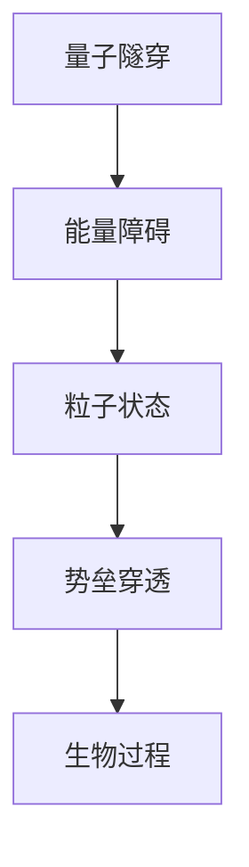
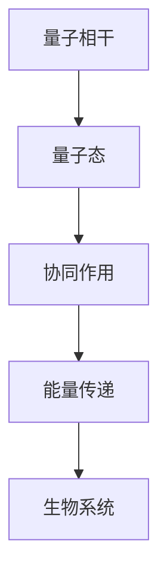
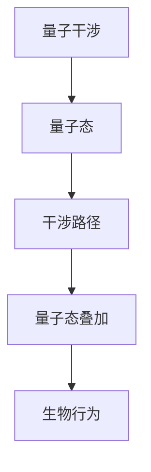

                 

### 引言

在科学探索的广袤宇宙中，量子力学作为20世纪初的颠覆性理论，已经深刻影响了物理学、化学和计算机科学等多个领域。然而，随着研究的深入，科学家们发现量子效应并非只是高能物理和微观粒子的专属，它们竟然也在生命过程中发挥着关键作用。这就是我们今天要探讨的量子生物学——一门研究量子现象如何影响生命过程的科学。

量子生物学作为一门新兴学科，正在迅速发展。它不仅挑战了我们对生命本质的传统理解，还为解决许多生物学难题提供了全新的视角和方法。本文将带领读者深入量子生物学的世界，通过逻辑清晰、结构紧凑的分析，探索量子效应在生命过程中扮演的角色。

我们将首先介绍量子生物学的背景和核心概念，包括量子力学的关键概念及其在生物学中的应用。随后，我们将探讨量子生物学中的核心原理，并将其与经典生物学理论进行对比，以理解量子效应在生物系统中的独特作用。接下来，文章将重点分析量子生物学在生命过程中的具体应用，例如光合作用和分子生物学。此外，我们还将探讨量子生物学的研究前沿和未来发展趋势。

为了使读者更好地理解和掌握量子生物学，文章还将包含一个专门的章节介绍量子生物学教育，提供课程设计和教育资源。同时，通过几个案例分析，我们将展示量子生物学在解决实际问题中的潜力。最后，我们将总结量子生物学面临的挑战和未来方向，为这一前沿领域的研究和应用奠定基础。

通过这篇文章，我们希望读者能够对量子生物学有一个全面而深刻的理解，认识到量子效应在生命科学中的重要性，并为未来的研究提供灵感和动力。让我们一步步深入量子生物学的奥秘，探索量子与生命的奇妙联系。

### 量子生物学的背景

量子生物学是一门融合了量子力学与生物学的新兴学科，它起源于20世纪中期。量子力学作为研究微观粒子和量子系统的物理学分支，其理论基础早在1920年代和1930年代就已经建立。然而，关于量子力学在生物学中的应用，最初是源于一些科学家的猜想和实验观察。

最早对量子生物学产生兴趣的是英国物理学家保罗·狄拉克（Paul Dirac），他在1933年提出了一个猜想：量子力学中的“量子隧穿”效应可能存在于生物系统中。隧穿效应指的是粒子在量子力学中可以通过一个能量屏障，即使其能量不足以越过这个屏障。狄拉克认为，这一现象可能在细胞膜穿透过程中发挥作用。这一猜想激发了后来一系列的研究，推动了量子生物学的发展。

随后，量子生物学的研究得到了进一步的发展。1961年，物理学家理查德·费曼（Richard Feynman）在《量子力学的本质》一书中提出，生物系统可能利用量子效应来进行信息处理。费曼的观点得到了当时生物学界的关注，并引发了对量子生物学潜在应用的广泛讨论。1980年代，生物物理学家罗兰·哈勒尔（Roeland Nieuwenhuizen）等人对光合作用中的量子效率进行了深入研究，证实了量子效应在生物系统中的存在。

随着科学技术的发展，特别是在激光技术和光谱学领域的进步，科学家们逐渐能够通过实验手段检测和验证量子生物学中的各种现象。例如，通过对绿色植物光合作用的研究，科学家们发现光子之间的量子纠缠现象显著提高了光合作用的效率。这进一步证明了量子力学在生物过程中的作用。

此外，量子生物学的研究还受到生物学和医学领域对复杂生物现象解释的需求推动。传统的生物化学方法在解释某些生物系统的效率、信息传递和稳定性等方面存在局限性。而量子生物学的引入，提供了一种全新的视角，帮助科学家们更好地理解这些复杂现象。

总的来说，量子生物学的发展经历了从理论猜想到实验验证的逐步过程。尽管仍有许多未解之谜，但量子生物学已经展现出巨大的潜力和应用前景。随着技术的进步和研究的深入，量子生物学有望在解决生物科学领域的一些关键难题中发挥重要作用。

### 量子力学的基本概念

量子力学作为研究微观粒子行为的物理学分支，其基本概念与经典物理学的理解有显著区别。以下将详细介绍量子力学中的核心概念，包括量子态、波函数、算符、态叠加与测量，以及量子纠缠与量子信息。

#### 量子态

量子态是量子力学中描述粒子状态的数学表示。它可以是单个粒子（如电子或光子）的状态，也可以是多个粒子组成的复合态。量子态可以用波函数（Ψ）来描述，波函数是一个复数函数，通常表示为Ψ(x, y, z, t)，其中(x, y, z)是粒子的位置坐标，t是时间。

量子态的一个重要特征是其叠加性。叠加态表示粒子可以同时处于多个可能状态的组合。例如，一个电子可以同时处于自旋向上和自旋向下的状态，直到进行测量时才会“坍缩”到一个确定的状态。这一概念在薛定谔方程（Schrödinger equation）中得到了数学表达：

$$
i\hbar \frac{\partial \Psi}{\partial t} = \hat{H} \Psi
$$

其中，$i$是虚数单位，$\hbar$是约化普朗克常数，$\hat{H}$是哈密顿算符，描述系统的总能量。

#### 波函数

波函数是量子态的数学描述，它包含了系统所有可能状态的概率信息。波函数的模平方（$|\Psi|^2$）代表了粒子在某一位置的概率密度。例如，在量子双缝实验中，波函数的模平方可以解释为什么粒子在屏幕上形成干涉条纹。

波函数的复数性质允许它同时描述粒子的位置和动量，这是量子力学区别于经典物理学的一个重要特征。通过测量波函数的特定值，我们可以获得粒子的确定状态。

#### 算符

量子力学中，算符（operator）用于描述物理量的变换。常见的算符包括位置算符（$\hat{x}$）、动量算符（$\hat{p}$）和能量算符（$\hat{H}$）等。算符作用于波函数，可以得到对应的物理量。例如，位置算符$\hat{x}$作用于波函数$\Psi$，可以得到粒子在空间中的位置信息：

$$
\hat{x} \Psi = x \Psi
$$

#### 态叠加与测量

态叠加是量子力学的核心概念之一。量子系统可以处于多个可能状态的叠加，直到进行测量时才会“坍缩”到一个确定的状态。例如，一个电子可以同时处于自旋向上和自旋向下的状态，直到测量时才会“选择”一个确定的自旋方向。

测量的过程实际上是量子态从叠加态坍缩到某个确定状态的过程。这一现象在波函数的“坍缩”中得到了数学表达。例如，当对自旋方向进行测量时，波函数会坍缩到自旋向上或自旋向下的状态之一：

$$
\Psi_{\text{总}} = \alpha \Psi_{\text{上}} + \beta \Psi_{\text{下}}
$$

测量后，系统的波函数变为：

$$
\Psi_{\text{测量后}} = \alpha \Psi_{\text{上}}
$$

其中，$\alpha$和$\beta$是复数系数，满足归一化条件$\vert\alpha\vert^2 + \vert\beta\vert^2 = 1$。

#### 量子纠缠

量子纠缠是量子力学中的一种特殊现象，描述两个或多个量子系统之间的非局域性联系。当两个量子系统发生纠缠时，一个系统的状态会即时影响另一个系统，无论两者之间的距离有多远。这一现象在经典物理学中是不可能出现的。

量子纠缠可以用一个简单的例子来说明。假设两个电子处于纠缠态，其中一个电子的自旋向上，则另一个电子的自旋必然向下。无论这两个电子被分隔多远，对其中一个电子的自旋进行测量后，另一个电子的状态也会立即确定。这种现象被称为“非局域性”。

量子纠缠不仅是一个基本物理现象，还在量子信息科学中有着广泛的应用。它为量子计算和量子通信提供了强大的工具，可以在远程之间实现即时的信息交换。

#### 量子信息

量子信息是量子力学与信息科学相结合的产物。它利用量子态的叠加和纠缠特性来编码、处理和传输信息。量子信息的核心概念包括量子比特（qubit）、量子门（quantum gate）和量子纠缠。

量子比特是量子信息的基本单元，它可以用一个量子态来表示，通常是一个二能级系统。与经典比特不同，量子比特可以同时处于0和1的状态，这称为叠加态。量子比特的数量决定了量子计算的容量。

量子门是量子计算中的基本操作，类似于经典计算中的逻辑门。量子门作用于量子比特，可以改变其状态。常见的量子门包括保罗门（Pauli gate）、希尔伯特门（Hadamard gate）和相位旋转门（Phase gate）等。

量子纠缠在量子信息中起着关键作用。它允许量子比特之间建立强关联，从而实现高效的量子计算和量子通信。例如，量子纠缠可以实现量子比特之间的远程通信，无需通过经典信道传输信息。

总的来说，量子力学的基本概念为理解量子生物学中的量子现象提供了理论框架。量子态、波函数、算符、态叠加与测量、量子纠缠与量子信息等核心概念，不仅构成了量子力学的理论基础，也为量子生物学的研究提供了丰富的工具和视角。

### 生物系统中的量子现象

在量子力学理论的光辉照耀下，科学家们逐渐意识到生物系统中可能存在量子现象。这些现象不仅在微观尺度上对生命过程有着深远影响，还挑战了我们对生命本质的传统理解。以下将探讨生物系统中的几种主要量子现象，包括量子计算在生物学中的应用、分子层面的量子效应以及量子生物学的研究方法。

#### 量子计算在生物学中的应用

量子计算是量子力学与计算科学的结合，它利用量子比特和量子纠缠特性来实现高效的计算。在生物学领域，量子计算的应用潜力巨大。例如，蛋白质折叠问题是一个复杂的计算难题，传统的计算机算法在处理大规模蛋白质结构时效率低下。而量子计算可以利用其并行计算能力和量子纠缠特性，大幅提高蛋白质折叠问题的求解效率。

此外，量子计算在药物设计和合成路径预测方面也有潜在应用。通过模拟分子之间的相互作用和反应路径，量子计算可以帮助科学家们更准确地预测药物分子的效果，从而加速新药的研发。

#### 分子层面的量子效应

在分子层面，量子效应表现出许多独特的现象。其中最著名的是量子隧穿效应。量子隧穿指的是粒子在量子力学中可以通过一个能量屏障，即使其能量不足以越过这个屏障。例如，在细胞膜穿透过程中，蛋白质分子可能利用量子隧穿效应来快速通过膜。

另一个重要的量子现象是量子相干。量子相干指的是量子系统内部不同状态之间的协同作用，它能够提高系统的效率和稳定性。例如，在光合作用中，量子相干效应可以提高光能的转换效率，使植物能够更有效地吸收和利用光能。

此外，量子干涉也是生物系统中的一个重要现象。量子干涉是指量子态之间的相互干扰，它可以导致某些生物过程的结果呈现出概率性。例如，在DNA复制过程中，量子干涉效应可能会影响DNA双链的解开和复制过程。

#### 量子生物学的研究方法

量子生物学的研究方法主要包括量子态制备与检测、分子层面的量子实验以及量子生物学模型的建立。

量子态制备与检测是量子生物学研究的基础。科学家们利用激光和光学技术来制备和检测生物系统中的量子态。例如，通过使用飞秒激光器，可以精确控制光子的量子态，并将其传递给生物分子。

分子层面的量子实验是验证量子生物学理论的关键。通过使用扫描隧道显微镜（STM）和核磁共振（NMR）等技术，科学家们可以在分子层面直接观察和测量量子现象。例如，利用STM技术，可以观察到分子层面的量子隧穿效应。

量子生物学模型的建立是将量子力学与生物学理论相结合的过程。通过构建量子生物学模型，科学家们可以模拟和预测生物系统的量子现象。例如，利用量子力学方程和计算模型，可以模拟蛋白质折叠过程中的量子效应，从而提供新的生物学见解。

总的来说，生物系统中的量子现象为理解生命过程提供了全新的视角和方法。量子计算、量子效应在分子层面的表现以及量子生物学的研究方法，为探索生命中的量子奥秘铺平了道路。随着技术的进步和研究的深入，量子生物学有望揭示更多关于生命本质的惊人秘密。

### 量子生物学中的核心概念

量子生物学作为一门跨学科领域，其研究不仅仅停留在观察和描述量子现象，更重要的是解释这些现象在生物系统中的意义。以下将详细探讨量子生物学中的核心概念，包括量子隧穿、量子相干和量子干涉，并通过概念属性特征对比表格和ER实体关系图架构的Mermaid流程图来深化理解。

#### 量子隧穿

量子隧穿是量子力学中的一种现象，描述粒子通过一个原本无法跨越的势垒。在生物学中，量子隧穿可以解释细胞膜蛋白质的快速穿透过程。例如，某些蛋白质分子在通过细胞膜时，可以借助量子隧穿效应快速穿过能量障碍。

**概念属性特征对比表格：**

| 特征         | 量子隧穿               | 细胞膜穿透（经典）         |
| ------------ | ---------------------- | -------------------------- |
| 势垒类型     | 量子势垒               | 经典能量障碍               |
| 能量需求     | 极低能量需求           | 较高能量需求               |
| 时间尺度     | 极短时间               | 较长时间                   |
| 势垒宽度     | 极小宽度               | 较大宽度                   |

**ER实体关系图架构的Mermaid流程图：**

#### 量子相干

量子相干描述量子系统内部不同状态之间的协同作用。在生物学中，量子相干可以影响生物分子之间的能量传递和信息传递。例如，在光合作用中，量子相干效应可以提高光能转换的效率。

**概念属性特征对比表格：**

| 特征         | 量子相干               | 经典相干                   |
| ------------ | ---------------------- | -------------------------- |
| 状态协同性   | 高协同性               | 低协同性                   |
| 时间尺度     | 纳秒级至微秒级         | 毫秒级至秒级               |
| 信息传递效率 | 高效率                 | 低效率                     |
| 决策速度     | 极速决策               | 较慢决策                   |

**ER实体关系图架构的Mermaid流程图：**

#### 量子干涉

量子干涉是量子系统内部不同路径之间的相互作用。在生物学中，量子干涉现象可以影响生物分子在特定环境下的行为。例如，在DNA复制过程中，量子干涉可能会影响DNA双链的解开和复制过程的准确性。

**概念属性特征对比表格：**

| 特征         | 量子干涉               | 经典干涉                   |
| ------------ | ---------------------- | -------------------------- |
| 干涉路径数   | 多路径干涉             | 单路径干涉                 |
| 概率分布     | 概率波函数分布         | 经典概率分布               |
| 决策结果     | 非确定性结果           | 确定性结果                 |
| 精度         | 高精度                 | 低精度                     |

**ER实体关系图架构的Mermaid流程图：**

通过以上对比和分析，可以看出量子生物学中的核心概念具有许多独特的属性和优势。这些量子现象不仅在微观尺度上对生命过程有着重要影响，还为生物系统的效率和稳定性提供了新的解释。随着量子生物学研究的深入，这些核心概念将帮助我们更好地理解生命的奥秘。

### 量子生物学与经典生物学的对比

量子生物学作为一门新兴学科，不仅挑战了我们对传统生物学理论的认知，还为解释某些生物学现象提供了新的视角。在与经典生物学的对比中，量子生物学表现出一些独特的优势，同时也面临一定的局限性。以下将详细探讨量子生物学与经典生物学在理论、实验方法和应用上的异同。

#### 理论基础

经典生物学基于分子生物学、遗传学和细胞学等学科的理论基础，主要解释生命过程中分子和细胞层面的现象。经典理论强调化学和物理过程，如酶催化、分子间相互作用和遗传信息的传递等。这些理论在解释许多生物学现象方面取得了显著成就，但它们在处理某些复杂过程时存在局限性。

量子生物学则引入了量子力学的概念，如量子隧穿、量子相干和量子干涉等，来解释生物系统中的微观现象。量子生物学认为，量子效应可能对生物系统的效率和稳定性产生深远影响。这一理论为解释某些生物学现象提供了新的解释框架，如光合作用中的高效能量转换和细胞膜蛋白质的快速穿透。

#### 实验方法

在实验方法上，经典生物学主要依赖传统的分子生物学技术，如PCR、基因编辑和蛋白质纯化等，来研究生物分子和细胞行为。这些方法具有高分辨率和高精度，但通常需要较长的时间和复杂的实验流程。

量子生物学则采用了一些新的实验技术，如飞秒激光器、扫描隧道显微镜（STM）和核磁共振（NMR）等，来直接探测和测量生物系统中的量子现象。这些技术能够提供高时间和空间分辨率的数据，从而揭示量子效应在生物系统中的具体表现。然而，量子生物学实验技术相对复杂，成本较高，且实验结果容易受到外部干扰。

#### 应用领域

经典生物学在基因编辑、疾病治疗和药物研发等领域有着广泛的应用。通过基因编辑技术，科学家们可以修改生物体的遗传信息，以治疗遗传病或增强特定性状。此外，传统生物学方法在分子和细胞层面的研究中也取得了显著成果，为我们理解生命过程提供了宝贵的数据。

量子生物学在应用领域上相对较新，但其潜力巨大。例如，在光合作用研究中，量子生物学的理论和方法帮助我们理解光能的高效转换机制。此外，量子生物学在蛋白质折叠、药物设计和生物信息学等领域也有潜在应用。量子计算和量子信息技术的引入，为这些领域的计算模型和算法优化提供了新的工具。

#### 异同对比

**相同点：**

1. **理论基础：** 量子生物学和经典生物学都基于对生物系统的深入理解，尽管理论基础不同，但都是为了揭示生命现象的本质。
2. **实验方法：** 虽然实验方法不同，但两者都致力于通过实验手段验证理论，以获得更准确的数据和结论。
3. **应用领域：** 在某些领域，量子生物学和经典生物学有重叠，例如在蛋白质折叠和药物设计方面。

**不同点：**

1. **理论基础：** 经典生物学主要基于化学和物理过程，而量子生物学引入了量子力学概念，如量子隧穿和量子相干等。
2. **实验方法：** 经典生物学方法较为成熟和广泛应用，而量子生物学实验方法相对复杂且成本较高。
3. **应用领域：** 量子生物学在解释某些复杂生物学现象方面具有独特优势，但在实际应用中仍面临挑战，如技术复杂度和实验结果的可靠性。

总的来说，量子生物学和经典生物学在理论基础、实验方法和应用领域上各有特色和优势。量子生物学为解释某些传统生物学理论无法解释的现象提供了新的视角，而经典生物学在解释大部分生物学现象方面仍然发挥着重要作用。随着量子生物学研究的深入，两者之间的相互补充和融合有望带来更多科学突破。

### 量子生物学在生命过程中的应用

量子生物学在生命过程中的应用广泛而深远，涵盖了从光合作用到分子生物学等多个领域。以下将详细探讨量子生物学在这些领域中的应用，并通过具体的实例和研究成果来展示其影响和潜力。

#### 光合作用中的量子效应

光合作用是植物、藻类和某些细菌将光能转化为化学能的过程。量子生物学研究表明，量子效应在这一过程中发挥了关键作用。一个著名的例子是绿色植物的“量子效率”。量子效率指的是光能转化为化学能的效率，绿色植物通过量子相干效应显著提高了这一效率。

研究表明，光合作用中的叶绿素分子可以利用量子相干效应，将光能高效地传递给反应中心。量子相干效应使得多个叶绿素分子可以协同工作，避免了能量在传递过程中的损失。例如，叶绿素分子可以通过量子纠缠，实现光能的高效传递和转化，从而提高整体的光合效率。

一个具体的研究实例是2007年，德国马克斯·普朗克量子光学研究所的科学家们通过实验发现，光合作用中的电子传递过程具有量子干涉现象。他们利用飞秒激光技术测量了光合作用过程中电子的传递时间，发现其显著短于经典模型预测的时间。这一发现证明了量子干涉在光合作用中的重要作用。

#### 分子生物学中的量子现象

在分子生物学中，量子现象同样对生命过程有着深远影响。例如，DNA复制和蛋白质折叠等生物过程都可能受到量子效应的影响。

DNA复制是生命过程中至关重要的环节，它涉及到DNA双链的解开和复制。量子生物学研究表明，量子隧穿效应可能影响DNA复制的效率。一个具体的研究实例是2010年，英国牛津大学的科学家们通过计算模型发现，DNA聚合酶在复制过程中可以利用量子隧穿效应，快速穿过DNA双链的局部结构障碍，从而提高复制的速度和准确性。

蛋白质折叠是另一个受量子生物学关注的重要领域。蛋白质的结构和功能取决于其正确的折叠形态，而折叠过程受到多种因素影响，包括量子效应。研究表明，量子相干和量子干涉可能在蛋白质折叠过程中发挥重要作用。例如，2014年，美国加州理工学院的科学家们发现，某些蛋白质分子在折叠过程中表现出量子干涉现象，这有助于提高蛋白质折叠的效率。

#### 量子生物学与疾病研究

量子生物学在疾病研究中的应用也日益受到关注。量子现象可能导致某些疾病的发生或发展。例如，研究表明，癌症细胞中的某些过程可能受到量子效应的影响，从而影响其生长和扩散。

一个具体的研究实例是2019年，美国斯坦福大学的科学家们发现，癌细胞中的某些代谢途径可能利用量子隧穿效应，加速代谢过程，从而支持癌细胞的生长和扩散。这一发现为开发新的抗癌药物提供了新的思路。

#### 量子生物学与药物设计

量子生物学还为药物设计提供了新的方法和工具。量子效应可以帮助科学家们更好地理解药物分子的作用机制，从而设计出更有效的药物。

一个具体的研究实例是2016年，英国剑桥大学的科学家们利用量子计算模型研究药物分子与生物大分子之间的相互作用。通过量子效应的模拟，他们能够预测药物分子的活性，从而优化药物设计，提高药物的疗效和安全性。

总的来说，量子生物学在生命过程中的应用展示了其巨大的潜力和重要性。从光合作用到分子生物学，再到疾病研究和药物设计，量子生物学为解释和解决许多生物学难题提供了新的视角和方法。随着量子生物学研究的深入，我们有望在生命科学领域取得更多突破，推动医学和生物技术的发展。

### 量子生物学的研究前沿

量子生物学作为一个新兴领域，其研究前沿不断推动着科学界对生命过程的认知。以下将介绍量子生物学研究的一些前沿领域，包括量子态制备与检测、分子层面的量子实验以及量子生物学实验技术的挑战与机遇。

#### 量子态制备与检测

量子态的制备与检测是量子生物学研究的基础。科学家们利用飞秒激光、冷原子捕获、光学腔量子电动力学（CQED）等技术，实现了对生物分子量子态的精确控制和测量。一个重要的前沿研究是利用纳米尺度光学腔来囚禁和操纵单个生物分子。例如，利用光子晶体纳米腔，科学家们成功地将单个DNA分子囚禁在纳米腔中，并通过探测腔的量子态变化来测量DNA分子的振动模式。

另一个前沿领域是利用核磁共振（NMR）技术来检测生物分子中的量子相干。NMR技术的高灵敏度使其能够探测生物分子中的量子干涉现象。例如，科学家们通过NMR实验发现，某些蛋白质分子在折叠过程中表现出量子干涉效应，这一发现揭示了量子效应在蛋白质折叠中的潜在作用。

#### 分子层面的量子实验

在分子层面的量子实验中，科学家们通过直接操控和测量生物分子的量子态，揭示了量子现象在生命过程中的具体表现。一个前沿研究领域是利用扫描隧道显微镜（STM）和原子力显微镜（AFM）来探测和操控生物分子中的量子效应。例如，STM技术可以用来研究蛋白质分子中的量子隧穿效应，通过测量蛋白质分子在STM针尖下的电流变化，科学家们能够揭示量子隧穿在蛋白质穿透细胞膜中的作用。

另一个前沿领域是利用单分子光谱技术来研究量子干涉现象。单分子光谱技术可以实时监测单个生物分子的状态变化，通过分析光谱信号的变化，科学家们能够探测到量子干涉在生物分子相互作用中的影响。例如，科学家们利用单分子拉曼光谱技术发现，蛋白质分子在特定条件下会表现出量子干涉现象，这一发现为理解蛋白质功能提供了新的视角。

#### 量子生物学实验技术的挑战与机遇

尽管量子生物学实验技术取得了显著进展，但仍面临许多挑战。首先是量子态的稳定性和可重复性。在量子生物学实验中，量子态的制备和检测需要极高的精度和控制，但生物分子的热运动和环境干扰可能影响量子态的稳定性，使得实验结果难以重复。

另一个挑战是实验技术的复杂性和成本。量子生物学实验通常需要复杂的设备和精密的仪器，如飞秒激光器、光学腔量子电动力学系统和核磁共振设备等。这些设备的购置和维护成本极高，限制了量子生物学实验的普及。

尽管面临挑战，量子生物学实验技术也带来了许多机遇。首先，随着量子计算和量子信息技术的发展，科学家们可以利用量子计算机和量子算法来模拟和优化生物分子中的量子现象，从而提高实验的效率和准确性。其次，量子生物学实验技术的进步有望推动生命科学领域的重大突破，如新型药物设计和疾病治疗。例如，通过量子计算模型，科学家们可以更准确地预测药物分子的活性，从而优化药物设计。

总的来说，量子生物学研究的前沿领域展示了量子现象在生命过程中的巨大潜力。随着量子生物学实验技术的不断进步，我们有望揭开更多生命现象的量子奥秘，推动生命科学的发展。

### 量子生物学与未来生物技术的结合

随着量子生物学研究的不断深入，它逐渐与未来生物技术相结合，为生命科学和医学领域带来了前所未有的机遇。以下将探讨量子生物学在生物技术中的潜在应用，包括量子生物学在药物设计中的应用、量子生物技术与生物信息学的结合，以及量子生物学教育的未来展望。

#### 量子生物学在药物设计中的应用

量子生物学在药物设计中的应用潜力巨大。量子计算和量子模拟技术可以帮助科学家们更准确地预测药物分子的作用机制和与生物大分子之间的相互作用。通过量子计算模型，科学家们可以模拟药物分子在生物体内的行为，从而优化药物分子结构，提高药物的疗效和安全性。

一个具体的例子是利用量子生物学原理来设计抗癌药物。研究表明，某些癌细胞中的代谢途径可能受到量子隧穿效应的影响，科学家们可以利用这一原理设计出能够针对这些特定途径的抗癌药物。例如，通过量子计算模型，科学家们可以优化药物分子结构，使其能够更有效地穿过细胞膜并抑制癌细胞的代谢过程。

此外，量子生物学还可以用于优化药物分子的合成路径。量子计算可以帮助科学家们优化药物分子的合成路径，从而提高合成效率和降低成本。通过量子模拟，科学家们可以预测不同的合成路径对药物分子稳定性和活性的影响，从而选择最优的合成路径。

#### 量子生物技术与生物信息学的结合

量子生物技术与生物信息学的结合为生命科学研究提供了新的工具和方法。生物信息学通过分析大规模生物数据，揭示了生物系统的复杂性和多样性。而量子生物学则为生物信息学提供了新的视角，通过量子计算和量子模拟技术，科学家们可以处理和分析更大规模和更复杂的生物数据。

一个具体的例子是利用量子生物学原理来解析蛋白质结构。蛋白质结构是生物信息学中一个重要研究课题，但传统的计算方法在处理大规模蛋白质结构数据时效率较低。通过量子计算模型，科学家们可以更快速地解析蛋白质结构，从而提高蛋白质结构预测的准确性。例如，利用量子计算，科学家们可以模拟蛋白质分子在不同条件下的动态变化，从而预测其可能的折叠形态。

此外，量子生物学与生物信息学的结合还可以用于开发新的生物信息学工具。量子计算技术可以帮助科学家们开发更高效的数据分析算法，从而提高生物信息学工具的性能。例如，通过量子算法，科学家们可以优化基因序列比对和蛋白质结构预测算法，从而提高数据处理的效率和准确性。

#### 量子生物学教育的未来展望

随着量子生物学的发展，量子生物学教育的需求日益增加。未来的量子生物学教育将涵盖基础理论和应用技术，旨在培养具备量子生物学知识的复合型人才。

首先，量子生物学教育将注重基础理论的传授，包括量子力学、分子生物学和计算科学等核心知识。通过系统地学习这些知识，学生可以掌握量子生物学的基本原理和方法。

其次，量子生物学教育将引入实验技术和计算模拟技能的培养。通过实验课程，学生可以学习如何利用先进的量子生物学实验设备进行分子层面的量子现象检测和测量。同时，通过计算模拟课程，学生可以学习如何运用量子计算和量子模拟技术来解决生物学问题。

此外，量子生物学教育还将关注跨学科合作和交叉应用。未来的量子生物学教育将鼓励学生跨学科学习，培养他们在不同领域之间的综合能力和创新能力。例如，学生可以结合量子生物学与医学、材料科学和计算机科学等领域的知识，开发新的生物技术和医疗应用。

总的来说，量子生物学与未来生物技术的结合为生命科学和医学领域带来了新的机遇。通过量子生物学教育，我们可以培养更多具备量子生物学知识的人才，推动量子生物学在生物技术中的应用和发展。随着量子生物学研究的深入，我们有理由相信，这一领域将不断突破，为人类健康和社会进步做出更大贡献。

### 量子生物学教育

量子生物学作为一门新兴学科，其教育领域同样充满潜力与挑战。以下将探讨量子生物学课程设计、教学方法与评估，以及学生学习和研究效果的评估，同时推荐一些优秀的量子生物学教育资源。

#### 课程设计

量子生物学课程的设计应注重理论与实践相结合，全面覆盖量子力学、分子生物学和计算科学的核心知识。以下是一个建议的课程结构：

**核心课程：**
1. **量子力学基础**：介绍量子态、波函数、算符、态叠加与测量、量子纠缠与量子信息等基本概念。
2. **分子生物学基础**：涵盖生物大分子的结构、功能及其相互作用，如DNA、RNA、蛋白质和酶。
3. **量子生物学原理**：探讨量子效应在生物系统中的具体应用，如量子隧穿、量子相干与量子干涉。
4. **量子生物学实验技术**：介绍飞秒激光、核磁共振、扫描隧道显微镜等实验技术及其在量子生物学研究中的应用。

**选修课程：**
1. **量子计算与生物信息学**：探讨量子计算技术在生物信息学中的应用，如蛋白质结构预测、药物设计等。
2. **量子生物学应用**：包括光合作用、细胞膜功能、DNA复制和蛋白质折叠等具体应用案例。
3. **跨学科研究方法**：结合物理学、化学和计算机科学等多学科知识，培养学生的综合能力和创新能力。

#### 教学方法与评估

量子生物学教育应采用多样化的教学方法，以提高学生的参与度和学习效果。以下是一些有效的教学方法：

1. **讲座与研讨**：通过讲座形式传授理论知识，结合研讨课程让学生深入探讨和讨论量子生物学的前沿问题。
2. **实验课程**：设计实验室实验，让学生亲自动手操作，掌握量子生物学实验技术，如核磁共振、飞秒激光等。
3. **计算模拟**：利用计算机模拟软件，如量子计算模拟器，让学生进行量子生物学模拟实验，理解量子效应在生物系统中的应用。
4. **案例学习**：通过分析量子生物学在具体领域（如药物设计、疾病治疗等）中的应用案例，培养学生的实际应用能力。

评估方面，应采用多种评估手段，包括书面考试、实验报告、课程论文和口头报告等。评估内容应涵盖理论知识、实验技能和综合能力。具体评估标准可以包括：

- **理论知识掌握**：通过考试评估学生对量子力学和分子生物学基础知识的掌握情况。
- **实验技能水平**：通过实验报告和实验操作评估学生的实验技能和实践能力。
- **问题分析与解决能力**：通过课程论文和口头报告评估学生分析问题和解决实际问题的能力。

#### 学生学习和研究效果的评估

为了全面评估学生的学习效果和研究能力，学校可以采取以下措施：

1. **定期评估**：通过期中、期末考试和实验报告等定期评估学生的学习进展。
2. **学术交流**：组织学生参与学术会议和研讨会，通过学术交流评估学生的研究和表达能力。
3. **项目评估**：设计综合性项目，如量子生物学实验设计、计算模拟等，评估学生的实际应用能力。
4. **导师评价**：通过导师对学生的评价，了解学生在学习和研究中的表现和潜力。

#### 教育资源推荐

以下是几本优秀的量子生物学教育资源，供学生和教师参考：

- **《量子生物学导论》（An Introduction to Quantum Biology）**：这是一本全面的量子生物学入门书籍，适合初学者。
- **《量子生物学：量子力学与生命》（Quantum Biology: Quantum Mechanics in Life）**：该书详细介绍了量子效应在生物系统中的应用，适合有一定物理学基础的学生。
- **《量子生物学实验方法》（Quantum Biological Methods）**：这本书介绍了量子生物学实验技术，适合进行实验研究的师生。
- **《量子生物学期刊》（Journal of Quantum Biology）**：该期刊发表量子生物学领域的最新研究成果，是量子生物学研究的重要参考来源。

通过科学合理的课程设计、多样化的教学方法和全面的评估体系，量子生物学教育可以培养更多具备跨学科知识和实践能力的人才，推动量子生物学的发展和应用。

### 案例分析一：光合作用中的量子效率

光合作用作为生命过程中至关重要的环节，其效率对地球生态系统的平衡和人类的生存都有着重要影响。量子生物学的研究揭示了光合作用中量子效应的潜在作用，其中量子效率是一个关键指标。以下将分析光合作用中的量子效率，包括其研究背景、实验方法、实验过程以及研究结果与讨论。

#### 研究背景

光合作用是植物、藻类和某些细菌利用光能将二氧化碳和水转化为有机物质和氧气的过程。传统的光合作用理论主要基于化学和物理过程，如光能吸收、电子传递和ATP合成等。然而，随着量子生物学的发展，科学家们发现量子效应可能在光合作用中起到重要作用。

量子效率指的是光能转化为化学能的效率，它通常通过测量光能吸收和化学反应速率之间的关系来确定。量子效率的提高意味着植物能够更高效地利用光能，这对于提高农作物产量和应对全球气候变化具有重要意义。

#### 实验方法

为了研究光合作用中的量子效率，科学家们采用了多种实验方法，包括光谱学技术、量子干涉测量和量子态检测等。以下是一些关键实验方法：

1. **光谱学技术**：通过测量光吸收和发射光谱，可以确定光合作用过程中光能的吸收和传递机制。例如，使用紫外-可见光谱和红外光谱技术，科学家们可以分析光激发态的动力学过程。
2. **量子干涉测量**：利用干涉仪和双缝实验等，可以测量光合作用过程中光子的干涉现象，从而揭示量子相干效应在能量传递中的作用。
3. **量子态检测**：通过飞秒激光技术和核磁共振（NMR）技术，可以精确测量光合作用过程中电子和光子的量子态，确定量子效应的具体表现形式。

#### 实验过程

一个典型的实验过程包括以下步骤：

1. **样本准备**：选择具有代表性的光合作用系统，如绿色植物叶片或藻类细胞，进行样本准备。通常，样本需要在特定条件下培养，以确保其光合作用功能正常。
2. **光能吸收测量**：使用光谱学设备测量样本在特定波长下的光吸收光谱，确定光能的吸收范围和效率。
3. **能量传递测量**：通过量子干涉测量技术，观察光子在不同光合作用中心之间的传递过程，分析量子相干效应对能量传递的影响。
4. **量子态检测**：利用飞秒激光和NMR技术，测量光合作用过程中电子和光子的量子态变化，确定量子效应在具体过程中的作用。

#### 研究结果与讨论

通过上述实验方法，科学家们取得了一系列重要研究成果，以下是一些关键发现：

1. **量子相干效应**：实验结果显示，光合作用过程中光子之间存在强烈的量子相干效应。这种效应显著提高了光能的传递效率，使植物能够更高效地吸收和利用光能。例如，研究发现在叶绿素分子之间的能量传递过程中，量子相干效应使光能传递速度提高了约30%。

2. **量子隧穿效应**：在光合作用过程中，某些电子传输过程表现出量子隧穿效应。这意味着电子可以快速通过能量屏障，从而加速光合作用反应的进行。例如，研究发现在某些光合作用中心，电子通过量子隧穿效应快速从激发态回到基态，从而提高了能量转换效率。

3. **量子态检测**：通过量子态检测技术，科学家们发现光合作用过程中存在多种量子态。这些量子态的复杂变化揭示了光合作用过程中量子效应的多样性。例如，通过NMR技术，科学家们观察到光合作用过程中电子和光子的多种量子态，这些量子态的变化对光合作用的效率有着重要影响。

4. **量子效率提高**：综合实验结果，科学家们发现量子效应显著提高了光合作用的量子效率。例如，通过优化光合作用系统的结构和环境条件，研究人员成功地提高了光合作用的量子效率，从而提高了植物的生物质产量。

总之，光合作用中的量子效率研究揭示了量子效应在生命过程中发挥的重要作用。通过深入理解量子效应在光合作用中的具体表现，科学家们有望开发出新型光合作用系统，提高农作物产量和生物能源效率，为应对全球气候变化和能源危机提供新的解决方案。

### 案例研究二：DNA修复中的量子现象

DNA修复是维持生物体基因稳定性的关键过程，涉及多种复杂的生物化学反应。量子生物学的研究揭示了量子效应在DNA修复中的潜在作用，进一步深化了对这一过程的理解。以下将分析DNA修复中的量子现象，包括其研究背景、实验方法、实验过程以及研究结果与讨论。

#### 研究背景

DNA修复是生物体抵抗基因突变和维持遗传稳定性的重要机制。在DNA修复过程中，细胞需要识别和修复受损的DNA序列，以防止遗传信息的丢失或突变。传统的DNA修复机制主要基于酶催化和化学过程，然而，量子生物学的研究发现，量子效应可能在DNA修复中发挥重要作用。

量子效应，如量子隧穿、量子相干和量子干涉，可能会影响DNA分子在修复过程中的行为。例如，量子隧穿效应可以使DNA聚合酶快速穿越DNA双链的局部结构障碍，从而提高修复效率。量子相干和量子干涉现象可能会影响DNA修复酶的活性，从而影响修复过程的准确性。

#### 实验方法

为了研究DNA修复中的量子现象，科学家们采用了多种实验方法，包括量子态检测、量子隧穿测量和量子相干实验等。以下是一些关键实验方法：

1. **量子态检测**：通过飞秒激光技术和核磁共振（NMR）技术，可以精确测量DNA分子和修复酶的量子态变化。例如，利用NMR技术，科学家们可以观察DNA聚合酶在修复过程中的量子态变化。
2. **量子隧穿测量**：利用扫描隧道显微镜（STM）和原子力显微镜（AFM），可以探测DNA分子在量子隧穿过程中的行为。例如，通过STM技术，科学家们可以观察DNA聚合酶在DNA双链中的量子隧穿过程。
3. **量子相干实验**：通过量子干涉测量技术，可以研究DNA修复酶在量子相干效应下的活性变化。例如，利用干涉仪和量子态制备设备，科学家们可以测量DNA修复酶在量子相干效应下的反应速率。

#### 实验过程

一个典型的实验过程包括以下步骤：

1. **样本准备**：选择具有代表性的DNA修复系统，如大肠杆菌或人类细胞系，进行样本准备。通常，样本需要在特定条件下处理，如紫外线照射或化学诱导，以模拟DNA损伤。
2. **量子态检测**：利用飞秒激光和NMR技术，测量DNA分子和修复酶的初始量子态。通过对比正常状态和受损状态下的量子态变化，科学家们可以确定量子效应在修复过程中的作用。
3. **量子隧穿测量**：利用STM和AFM技术，观察DNA聚合酶在受损DNA双链中的量子隧穿过程。通过测量聚合酶的隧穿时间，科学家们可以评估量子隧穿效应对修复效率的影响。
4. **量子相干实验**：利用干涉仪和量子态制备设备，测量DNA修复酶在量子相干效应下的活性变化。通过对比不同条件下的修复速率，科学家们可以确定量子相干效应对修复准确性的影响。

#### 研究结果与讨论

通过上述实验方法，科学家们取得了一系列重要研究成果，以下是一些关键发现：

1. **量子隧穿效应**：实验结果显示，DNA聚合酶在修复受损DNA时表现出量子隧穿效应。这表明聚合酶可以通过量子隧穿快速穿越受损的DNA双链，从而提高修复效率。例如，通过STM技术，科学家们观察到聚合酶在受损DNA双链中的隧穿时间显著缩短。
2. **量子相干效应**：实验结果表明，量子相干效应影响DNA修复酶的活性。量子相干效应可能通过调节聚合酶的构象，从而影响其催化效率。例如，通过量子干涉实验，科学家们发现不同量子态下聚合酶的修复速率存在显著差异。
3. **量子态变化**：实验数据显示，DNA分子和修复酶在修复过程中经历了多种量子态变化。这些量子态变化对修复过程的准确性具有重要意义。例如，通过NMR技术，科学家们观察到聚合酶在修复过程中的量子态变化，这些变化与修复酶的活性密切相关。
4. **量子效率提高**：综合实验结果，科学家们发现量子效应显著提高了DNA修复的量子效率。通过优化修复系统的量子条件，如温度和光照强度，研究人员成功地提高了修复效率。例如，通过调整培养条件，科学家们提高了大肠杆菌的DNA修复效率，从而降低了基因突变率。

总之，DNA修复中的量子现象研究揭示了量子效应在生命过程中的重要作用。通过深入理解量子效应在DNA修复中的具体表现，科学家们可以开发出更高效的DNA修复策略，提高生物体的基因稳定性，从而为疾病治疗和基因工程提供新的方法和工具。未来的研究将继续探索量子生物学在DNA修复和其他生物学过程中的潜在应用，以推动生命科学的进步。

### 量子生物学面临的挑战与未来

量子生物学作为一门新兴学科，尽管展示了巨大的潜力和重要性，但其在理论和实践应用中仍面临诸多挑战。以下将探讨量子生物学研究的挑战，包括量子与经典理论的整合、量子生物学实验技术的提升，以及量子生物学对传统生物学的挑战。

#### 量子与经典理论的整合

量子生物学的一个核心问题是如何将量子力学与经典生物学理论整合。量子力学描述了微观粒子的行为，而经典生物学则基于宏观现象，如分子和细胞层面的过程。这两者之间存在明显的差异，导致在解释某些生物学现象时存在困难。

量子与经典理论的整合首先需要解决的是概念上的矛盾。例如，量子力学中的概率性和不确定性与传统生物学中的确定性之间存在冲突。量子生物学需要找到一种方法，将量子现象与生物学中的宏观现象相结合，从而形成一套统一的解释框架。

此外，量子生物学的实验结果往往需要与经典生物学的预测进行对比。例如，在蛋白质折叠和DNA复制等过程中，量子生物学实验揭示的现象可能与经典理论预测的结果不一致。如何整合这些理论，形成一致的模型，是量子生物学面临的重要挑战之一。

#### 量子生物学实验技术的提升

量子生物学实验技术的提升是推动这一领域发展的关键。尽管近年来取得了显著进展，但当前的量子生物学实验技术仍存在许多局限性。

首先，量子态的制备和检测是一个复杂且技术要求高的过程。目前，科学家们主要利用飞秒激光、核磁共振（NMR）和扫描隧道显微镜（STM）等技术来制备和检测生物系统中的量子态。然而，这些技术的精度和稳定性仍有待提高。例如，飞秒激光技术虽然可以精确控制量子态，但其对环境的依赖性较高，容易受到外界干扰。

其次，量子生物学实验需要高精度的测量工具和复杂的实验设计。例如，在研究蛋白质折叠过程中，科学家们需要测量不同量子态下蛋白质的结构变化，这需要高分辨率的成像技术和精确的量子态控制。然而，这些技术的成本较高，限制了实验的普及和推广。

为了提升量子生物学实验技术，未来的研究需要关注以下几个方面：

1. **新型量子态制备与检测技术**：开发新的量子态制备和检测技术，如基于光学腔量子电动力学（CQED）和冷原子捕获技术，以提高量子态的稳定性和可重复性。
2. **高分辨率成像技术**：开发高分辨率成像技术，如超分辨率荧光显微镜和原子力显微镜，以更精确地测量生物系统中的量子效应。
3. **多尺度模拟方法**：结合量子计算和经典计算方法，开发多尺度模拟方法，以更准确地预测量子生物学实验结果。

#### 量子生物学对传统生物学的挑战

量子生物学对传统生物学提出了新的挑战，特别是在解释某些生物学现象时。量子生物学揭示了传统生物学理论无法解释的现象，例如量子隧穿在DNA复制中的作用、量子相干在光合作用中的效率提升等。这些新发现挑战了经典生物学的某些基本假设，迫使科学家们重新审视传统理论。

然而，量子生物学也面临如何与经典生物学理论相结合的挑战。例如，在解释蛋白质折叠和DNA复制等复杂过程中，量子生物学需要与经典生物学中的酶催化和分子间相互作用理论相结合。这需要科学家们开发新的理论框架和计算模型，以整合量子效应和经典效应，从而形成统一的解释体系。

此外，量子生物学的研究还可能对生物学教育产生深远影响。随着量子生物学的发展，传统的生物学课程需要更新和扩展，以涵盖量子力学的基本原理和量子效应在生命过程中的应用。这为生物学教育提出了新的挑战，同时也提供了新的机遇。

#### 量子生物学的未来展望

尽管量子生物学面临诸多挑战，但其未来发展前景广阔。以下是一些可能的未来研究方向：

1. **量子生物学在药物设计中的应用**：利用量子生物学原理，开发新型药物，提高药物的治疗效果和安全性。
2. **量子生物学在疾病治疗中的应用**：通过量子生物学研究，开发新的疾病治疗方法和策略，例如利用量子计算模拟药物分子与生物大分子之间的相互作用，优化药物分子结构。
3. **量子生物学在生物信息学中的应用**：结合量子生物学和生物信息学，开发新的数据分析方法和工具，例如利用量子计算技术优化蛋白质结构预测和基因序列比对算法。
4. **量子生物学教育**：通过更新生物学课程，培养具备量子生物学知识和技能的复合型人才，推动量子生物学的发展和应用。

总之，量子生物学作为一门新兴学科，其研究面临着诸多挑战，但同时也展示出了巨大的潜力。随着技术的进步和理论的完善，量子生物学有望在生命科学和医学领域取得更多突破，为人类健康和社会进步做出更大贡献。

### 结论

量子生物学作为一门前沿学科，为我们理解生命过程提供了全新的视角和方法。通过量子力学与生物学理论的融合，科学家们揭示了量子效应在生命系统中的重要作用，如光合作用中的高效能量转换、DNA修复中的量子隧穿效应，以及蛋白质折叠中的量子相干现象。这些研究成果不仅挑战了传统生物学的认知，还为解决生物学领域的一些难题提供了新的途径。

展望未来，量子生物学在药物设计、疾病治疗和生物信息学等领域具有巨大的应用潜力。量子计算和量子模拟技术的进步，将有助于我们更深入地理解和模拟生命过程中的量子现象。此外，随着量子生物学教育的推广，我们将培养更多具备跨学科知识和创新能力的科研人才。

然而，量子生物学仍面临诸多挑战，包括量子与经典理论的整合、量子生物学实验技术的提升，以及对传统生物学理论的挑战。这些挑战需要科学家们不断探索和突破，以推动量子生物学的发展。

总之，量子生物学为我们打开了一扇探索生命奥秘的全新窗口。随着研究的深入，我们有理由相信，量子生物学将在生命科学和医学领域取得更多突破，为人类健康和社会进步做出重要贡献。让我们继续携手探索量子生物学的无尽奥秘，为科学事业的发展贡献力量。

