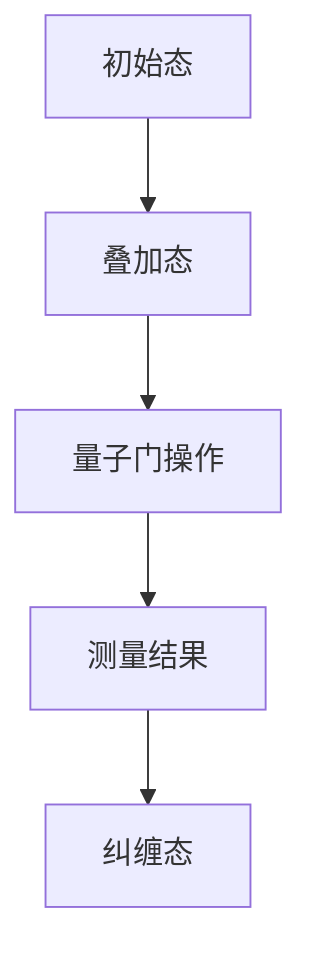
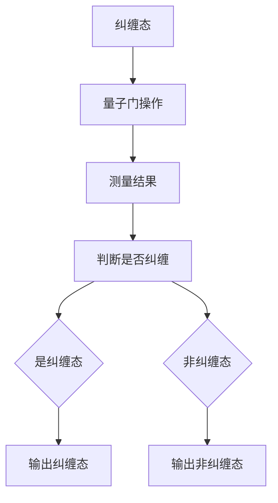

                 

### 量子纠缠与宇宙的本质

#### 关键词：量子纠缠、宇宙本质、量子物理学、非局域性、数学模型、系统架构

> 摘要：本文将探讨量子纠缠这一神秘现象，以及它如何与宇宙的本质紧密相连。通过一步步的逻辑推理和详细分析，我们将揭示量子纠缠的核心概念、数学模型、算法原理，并探讨其在宇宙研究中的潜在应用。这篇文章旨在为读者提供一个全面、深入的理解，以解开量子纠缠与宇宙本质之间的神秘面纱。

#### 引言

在量子物理学的领域中，量子纠缠是一种令人着迷的现象。它不仅挑战了经典物理学的局域性原理，也引发了关于宇宙本质的深刻思考。量子纠缠是指两个或多个粒子之间的一种特殊关联，即使这些粒子相隔遥远，它们的状态也会立即相互影响。这种现象似乎违反了经典物理学的直觉，但却是经过实验验证的客观存在。

量子纠缠的重要性在于，它不仅为我们提供了理解量子世界的新视角，也可能在量子计算、量子通信和量子加密等领域带来革命性的突破。更进一步，量子纠缠与宇宙本质的联系，使得我们在探索宇宙起源、结构和演化方面有了全新的工具和方法。

本文将按照以下结构进行：

1. **背景介绍**：介绍量子纠缠的基本概念，其在量子物理学中的地位，以及与宇宙本质的联系。
2. **核心概念与联系**：详细解释量子纠缠的概念、原理和特点，并与其他相关的物理学概念进行对比。
3. **算法原理讲解**：使用mermaid画出相关算法流程图，并用Python源代码详细阐述算法原理，给出数学模型和公式，并进行举例说明。
4. **数学模型和数学公式讲解**：深入讨论量子纠缠的数学背景，使用LaTeX格式书写数学公式，并在文中独立段落中详细讲解这些公式的含义和应用。
5. **系统分析与架构设计方案**：介绍问题场景，系统的功能设计（领域模型类图），系统架构设计（架构图），系统接口设计以及系统交互（序列图）。
6. **项目实战**：通过实际案例展示量子纠缠在宇宙本质研究中的应用。
7. **最佳实践 tips、小结、注意事项、拓展阅读**：总结全书的主要观点，提供最佳实践建议，指出注意事项，并推荐拓展阅读资源。

### 第1章 背景介绍

#### 1.1 问题背景

量子纠缠是一种量子力学现象，指的是两个或多个粒子在没有进行任何经典通信的情况下，其状态仍然相互关联。这种关联表现为，即使这些粒子相隔遥远，一个粒子的状态变化会立即影响到另一个粒子的状态。这种现象最早由爱因斯坦、波多尔斯基和罗森（EPR悖论）提出，旨在挑战量子力学局域性的原则。

在量子物理学中，量子纠缠被认为是量子信息科学的基础之一。它不仅为量子计算、量子通信和量子加密提供了可能性，也引发了关于宇宙本质的深刻思考。量子纠缠与宇宙本质的联系在于，它可能揭示了宇宙中的一种基本结构，即宇宙的各个部分之间存在着深刻的相互联系。

#### 1.2 问题描述

量子纠缠的描述通常涉及两个或多个量子比特的状态。在量子力学中，量子比特的状态可以用波函数来描述。当两个量子比特纠缠时，它们的波函数会相互关联，形成一个整体的纠缠态。这种纠缠态具有一些独特的性质，例如非局域性和纠缠互换性。

非局域性是指，纠缠粒子的状态变化可以立即影响到另一个粒子的状态，无论它们之间的距离有多远。这种现象似乎违反了经典物理学的局域性原则，即信息不能超过光速传播。

纠缠互换性是指，通过在一个粒子上进行测量，可以改变另一个粒子的状态，即使这两个粒子相隔遥远。这种现象在经典物理学中是无法想象的。

#### 1.3 问题解决

量子纠缠的解决涉及对量子力学的深入理解，以及对量子比特状态的计算和模拟。在量子计算中，量子纠缠被用来实现高效的量子算法，例如量子搜索算法和量子因子分解算法。这些算法比经典算法在处理某些问题时具有显著的优势。

在量子通信中，量子纠缠被用来实现安全的量子密钥分发，这为未来的量子通信网络提供了可能。

在量子加密中，量子纠缠被用来实现安全的量子加密算法，这为保护信息安全提供了新的手段。

#### 1.4 边界与外延

量子纠缠的边界在于其适用范围和限制。尽管量子纠缠在量子信息科学中具有广泛的应用，但它仍然受到量子噪声和环境干扰的限制。这些因素可能导致量子纠缠的破坏，从而影响量子计算的效率和稳定性。

量子纠缠的外延在于其与其他物理学领域的交叉。例如，量子纠缠与量子场论、量子引力以及量子混沌等领域的联系，为我们提供了理解宇宙本质的新视角。

#### 1.5 概念结构与核心要素组成

量子纠缠的概念结构包括以下几个核心要素：

1. **量子比特**：量子纠缠的基础是量子比特的状态，它可以用波函数来描述。
2. **纠缠态**：两个或多个量子比特的波函数相互关联，形成一个整体的纠缠态。
3. **非局域性**：纠缠粒子的状态变化可以立即影响到另一个粒子的状态，无论它们之间的距离有多远。
4. **纠缠互换性**：通过在一个粒子上进行测量，可以改变另一个粒子的状态，即使这两个粒子相隔遥远。

这些要素共同构成了量子纠缠的核心结构，为我们理解量子纠缠提供了基础。

### 第2章 核心概念与联系

#### 2.1 量子纠缠的基本概念

量子纠缠是一种量子系统的现象，其中两个或多个粒子的状态不能独立描述，而是相互关联。当两个粒子处于纠缠态时，对其中一个粒子的测量将立即影响到另一个粒子的状态，无论它们之间的距离有多远。这种现象似乎违反了经典物理学的局域性原则，但却是量子力学中的一个基本特性。

量子纠缠的基本概念包括：

1. **量子比特**：量子比特是量子计算的基本单元，它可以处于0和1的叠加态。
2. **纠缠态**：当两个量子比特相互纠缠时，它们的状态不能独立描述，而是相互关联。
3. **非局域性**：纠缠粒子的状态变化可以立即影响到另一个粒子的状态，无论它们之间的距离有多远。
4. **纠缠互换性**：通过在一个粒子上进行测量，可以改变另一个粒子的状态，即使这两个粒子相隔遥远。

#### 2.2 量子纠缠的特性

量子纠缠具有以下几个特性：

1. **非局域性**：纠缠粒子的状态变化可以立即影响到另一个粒子的状态，无论它们之间的距离有多远。这种现象被称为非局域性，因为它似乎违反了经典物理学的局域性原则。
2. **纠缠互换性**：通过在一个粒子上进行测量，可以改变另一个粒子的状态，即使这两个粒子相隔遥远。这种现象被称为纠缠互换性。
3. **不可克隆性**：纠缠态的量子比特不能被克隆，即不能复制一个完全相同的纠缠态。
4. **纠缠态的脆弱性**：纠缠态很容易受到环境干扰和量子噪声的影响，从而导致纠缠的破坏。

#### 2.3 量子纠缠与非局域性的关系

量子纠缠与非局域性密切相关。非局域性是指两个粒子之间的状态变化可以立即相互影响，即使它们相隔遥远。这种现象在经典物理学中是无法想象的，但在量子力学中却是客观存在的。

量子纠缠的非局域性主要体现在以下几个方面：

1. **纠缠态的测量**：当对纠缠态的其中一个粒子进行测量时，另一个粒子的状态会立即确定，无论它们之间的距离有多远。
2. **纠缠态的传输**：可以通过量子纠缠将一个粒子的状态传输到另一个粒子，即使它们相隔遥远。
3. **纠缠态的生成**：两个粒子可以通过量子纠缠生成一个共同的纠缠态，这种纠缠态可以在不同的实验室中同时存在。

#### 2.4 量子纠缠与经典概率论

量子纠缠与经典概率论有本质的区别。在经典概率论中，粒子的状态是独立的，它们之间的关联是通过概率统计来描述的。而在量子纠缠中，粒子的状态是相互关联的，它们之间的关联是通过量子比特的状态叠加来描述的。

量子纠缠与经典概率论的区别主要体现在以下几个方面：

1. **状态描述**：在经典概率论中，粒子的状态是离散的，而在量子纠缠中，粒子的状态是连续的，可以处于多种可能的叠加态。
2. **测量结果**：在经典概率论中，粒子的测量结果是随机的，而在量子纠缠中，粒子的测量结果受到其他粒子状态的影响，这种影响是非局域性的。
3. **关联性**：在经典概率论中，粒子的关联性是通过概率统计来描述的，而在量子纠缠中，粒子的关联性是通过量子比特的状态叠加来描述的。

#### 2.5 量子纠缠与其他物理概念的对比

量子纠缠与量子超导、量子计算和量子信息等物理概念密切相关，但它们也有本质的区别。

1. **量子超导**：量子超导是一种超流态，其中电子在低温下形成库珀对，从而表现出零电阻和完全反射的特性。量子超导与量子纠缠的区别在于，量子超导主要研究的是电子的行为，而量子纠缠研究的是量子比特的状态。
2. **量子计算**：量子计算是一种利用量子比特进行计算的方法，它利用了量子纠缠和非局域性的特性，从而实现高效的计算。量子计算与量子纠缠的区别在于，量子计算主要研究的是如何利用量子纠缠进行计算，而量子纠缠研究的是量子比特之间的关联性。
3. **量子信息**：量子信息是一种利用量子比特进行信息处理的方法，它利用了量子纠缠和量子密钥分发的特性，从而实现安全的通信和计算。量子信息与量子纠缠的区别在于，量子信息主要研究的是如何利用量子纠缠进行信息处理，而量子纠缠研究的是量子比特之间的关联性。

#### 2.6 ER实体关系图

为了更好地理解量子纠缠与宇宙本质的关系，我们可以使用ER实体关系图来描述量子纠缠相关的实体和它们之间的关系。

在ER实体关系图中，我们可以定义以下几个实体：

1. **量子比特**：量子比特是量子计算的基本单元，它可以用波函数来描述。
2. **纠缠态**：纠缠态是量子比特之间的关联状态，它可以用来描述量子纠缠。
3. **宇宙**：宇宙是量子纠缠的背景，它为量子纠缠提供了空间和时间的框架。

ER实体关系图如下：

```mermaid
erDiagram
  quantumBit ||--o{ entangledState : Entangled with }
  entangledState ||--o{ quantumBit : Entangled with }
  universe ||--o{ quantumBit : Located in }
  universe ||--o{ entangledState : Located in }
```

在这个ER实体关系图中，我们可以看到量子比特和纠缠态之间的相互关联，以及它们与宇宙的关系。这种关联揭示了量子纠缠在宇宙中的本质作用。

### 第3章 算法原理讲解

#### 3.1 量子纠缠算法概述

量子纠缠算法是量子计算和量子通信的核心，它能够生成和检测量子纠缠态。量子纠缠算法可以分为两个主要部分：量子纠缠态生成算法和量子纠缠态检测算法。

**量子纠缠态生成算法**：该算法用于生成两个或多个量子比特之间的纠缠态。最常见的量子纠缠态生成算法是贝尔态生成算法，它利用量子比特的叠加态和量子门操作来生成纠缠态。

**量子纠缠态检测算法**：该算法用于检测两个量子比特之间的纠缠态。常见的量子纠缠态检测算法包括贝尔测量算法和交叉熵检测算法。

#### 3.2 算法流程图

下面是量子纠缠态生成算法和量子纠缠态检测算法的流程图：

**量子纠缠态生成算法流程图：**



**量子纠缠态检测算法流程图：**



#### 3.3 Python源代码讲解

**量子纠缠态生成算法的Python代码：**

```python
import numpy as np

# 定义量子比特的叠加态
def superposition_state(qubit):
    state = np.array([1, 0]) / np.sqrt(2)
    return state

# 定义量子门的操作
def quantum_gate(state, angle):
    rotation_matrix = np.array([[1, 0],
                                [0, np.exp(1j * angle)]])
    return np.dot(state, rotation_matrix)

# 生成量子纠缠态
def generate_entangled_state(qubit1, qubit2, angle):
    state1 = superposition_state(qubit1)
    state2 = quantum_gate(state1, angle)
    entangled_state = np.kron(state1, state2)
    return entangled_state

# 测量量子纠缠态
def measure_entangled_state(entangled_state):
    probabilities = np.abs(entangled_state)**2
    outcome = np.random.choice(2, p=probabilities)
    return outcome

# 示例
qubit1 = np.array([1, 0])
qubit2 = np.array([1, 1])
angle = np.pi / 4
entangled_state = generate_entangled_state(qubit1, qubit2, angle)
print("量子纠缠态：", entangled_state)
measure_result = measure_entangled_state(entangled_state)
print("测量结果：", measure_result)
```

**量子纠缠态检测算法的Python代码：**

```python
import numpy as np

# 定义量子门的操作
def quantum_gate(state, angle):
    rotation_matrix = np.array([[1, 0],
                                [0, np.exp(1j * angle)]])
    return np.dot(state, rotation_matrix)

# 定义贝尔测量
def bell_measure(state):
    return np.array([[1, 0],
                     [0, -1]])

# 检测量子纠缠态
def detect_entangled_state(state):
    gate = bell_measure(state)
    probabilities = np.abs(np.dot(gate, state))**2
    is_entr

