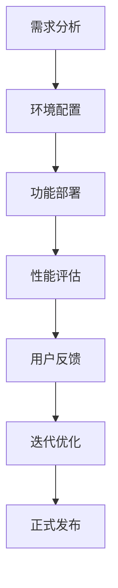

                 

# 金丝雀发布：逐步验证LLM新功能

> 关键词：金丝雀发布、大型语言模型、新功能验证、性能评估、用户反馈

> 摘要：本文探讨了在大型语言模型（LLM）开发过程中，如何通过金丝雀发布策略，逐步验证新功能。文章介绍了金丝雀发布策略的核心概念、实施步骤、评估方法以及用户反馈机制，并通过实际案例展示了金丝雀发布的应用效果。最后，文章总结了最佳实践和注意事项，为LLM新功能的逐步验证提供了有益的参考。

### 目录大纲

----------------------------------------------

## 第一部分：背景介绍与核心概念

### 第1章：问题背景与核心概念

#### 1.1 问题背景

- **金丝雀发布**：一个用于逐步验证大型语言模型（LLM）新功能的策略。

- **LLM新功能**：指在大型语言模型中引入的新特性或功能，可能涉及模型性能的提升、应用场景的扩展等。

#### 1.2 核心概念

- **金丝雀发布策略**：一种逐步验证新功能的方法，通过在有限范围内（如测试环境、小部分用户）测试新功能，以降低整体风险。

- **LLM性能评估**：对LLM新功能进行性能评估，包括准确性、速度、可扩展性等方面。

- **用户反馈机制**：收集并分析用户对新功能的反馈，以指导功能优化和迭代。

### 第2章：金丝雀发布策略详解

#### 2.1 金丝雀发布策略原理

- **多环境发布**：将新功能部署到多个环境（如开发、测试、生产等），逐步扩大发布范围。

- **A/B测试**：在不同用户群体之间测试新功能，以收集对比数据。

#### 2.2 金丝雀发布策略实施步骤

- **阶段划分**：根据功能重要性和风险等级，将发布过程划分为不同阶段。

- **环境配置**：为每个阶段配置相应的测试环境，确保测试数据的有效性。

- **功能部署**：在新环境中部署新功能，进行初步测试。

- **性能评估**：对部署后的新功能进行性能评估，包括准确性、速度等。

- **用户反馈**：收集用户对测试功能的反馈，进行分析。

### 第3章：LLM新功能评估方法

#### 3.1 性能评估指标

- **准确性**：评估新功能在各类任务中的表现。

- **速度**：评估新功能在不同环境下的响应速度。

- **可扩展性**：评估新功能在处理大规模数据时的表现。

#### 3.2 评估工具与方法

- **自动评估工具**：如自动评估脚本、自动化测试平台等。

- **人工评估方法**：如用户调研、专家评审等。

### 第4章：用户反馈机制设计

#### 4.1 用户反馈渠道

- **在线反馈系统**：提供一个用户友好的在线反馈系统，方便用户提交问题和建议。

- **社交媒体**：利用社交媒体平台收集用户反馈。

#### 4.2 用户反馈分析

- **定量分析**：对用户反馈进行定量分析，如统计问题类型、频率等。

- **定性分析**：对用户反馈进行定性分析，如分析用户对功能的满意度、改进建议等。

### 第5章：金丝雀发布策略案例研究

#### 5.1 案例背景

- **某大型语言模型公司**：介绍公司背景和相关业务。

- **新功能需求**：介绍公司计划推出的新功能及其重要性。

#### 5.2 金丝雀发布策略实施

- **环境配置**：配置测试环境，准备A/B测试。

- **功能部署**：部署新功能到测试环境。

- **性能评估**：评估新功能性能。

- **用户反馈**：收集用户反馈。

#### 5.3 案例总结

- **成功经验**：总结成功经验，如有效的性能评估方法、积极的用户反馈机制等。

- **改进空间**：分析存在的问题和改进空间。

### 第6章：最佳实践与注意事项

#### 6.1 最佳实践

- **金丝雀发布策略**：分享一些成功应用金丝雀发布策略的案例。

- **性能评估**：介绍一些有效的性能评估方法。

- **用户反馈**：分享如何更好地收集和分析用户反馈。

#### 6.2 注意事项

- **风险管理**：在金丝雀发布过程中，如何降低风险。

- **功能优化**：如何根据用户反馈进行功能优化。

- **团队协作**：如何确保团队高效协作，实现金丝雀发布目标。

### 第7章：未来展望

#### 7.1 LLM新功能发展趋势

- **技术趋势**：分析LLM新功能的发展趋势。

- **应用场景**：探讨LLM新功能在各个领域的应用前景。

#### 7.2 金丝雀发布策略优化方向

- **自动化**：探讨如何利用自动化工具提高金丝雀发布效率。

- **个性化**：如何根据不同用户群体进行个性化发布。

#### 7.3 未来挑战与机遇

- **挑战**：分析金丝雀发布策略面临的挑战。

- **机遇**：探讨金丝雀发布策略带来的机遇。

----------------------------------------------

## 第一部分：背景介绍与核心概念

### 第1章：问题背景与核心概念

#### 1.1 问题背景

在当前人工智能（AI）高速发展的时代，大型语言模型（LLM）如BERT、GPT等，已成为自然语言处理（NLP）领域的重要工具。然而，随着LLM的规模和复杂性不断增加，如何在确保模型稳定性和可靠性的同时，高效地引入新功能，成为了一个亟待解决的问题。

**金丝雀发布**，作为一种逐步验证新功能的策略，逐渐受到关注。金丝雀发布的核心思想是，通过在有限范围内（如测试环境、小部分用户）逐步引入新功能，以降低整体风险。这种方法类似于在矿井中释放金丝雀，通过观察金丝雀的反应来判断矿井的安全性。

**LLM新功能**，是指在现有基础上，为大型语言模型引入的新特性或功能。这些新功能可能涉及模型性能的提升、应用场景的扩展、用户体验的优化等。例如，在语言生成任务中，引入更复杂的文本生成策略，或在问答任务中，实现更准确的答案生成。

#### 1.2 核心概念

**金丝雀发布策略**：金丝雀发布策略是一种逐步验证新功能的方法，其核心思想是通过在有限范围内测试新功能，以降低整体风险。具体而言，金丝雀发布策略包括以下步骤：

1. **多环境发布**：将新功能部署到多个环境（如开发、测试、生产等），逐步扩大发布范围。

2. **A/B测试**：在不同用户群体之间测试新功能，以收集对比数据。

3. **性能评估**：对部署后的新功能进行性能评估，包括准确性、速度等。

4. **用户反馈**：收集用户对测试功能的反馈，进行分析。

**LLM性能评估**：LLM性能评估是评估新功能在各类任务中的表现，主要包括准确性、速度、可扩展性等方面。准确性评估新功能在自然语言处理任务中的表现，速度评估新功能在不同环境下的响应速度，可扩展性评估新功能在处理大规模数据时的表现。

**用户反馈机制**：用户反馈机制是收集并分析用户对新功能的反馈，以指导功能优化和迭代。用户反馈机制包括在线反馈系统、社交媒体等渠道，通过定量分析和定性分析，了解用户对新功能的满意度、改进建议等。

### 第2章：金丝雀发布策略详解

#### 2.1 金丝雀发布策略原理

金丝雀发布策略的原理可以概括为以下几点：

1. **多环境发布**：将新功能部署到多个环境，如开发、测试、生产等。通过在不同环境中逐步扩大发布范围，可以降低整体风险。

2. **A/B测试**：在不同用户群体之间测试新功能，通过对比A/B两组用户的反馈数据，评估新功能的性能。

3. **性能评估**：对部署后的新功能进行性能评估，包括准确性、速度等。通过性能评估，可以发现新功能存在的问题，并进行优化。

4. **用户反馈**：收集用户对测试功能的反馈，通过定量分析和定性分析，了解用户对新功能的满意度、改进建议等。

#### 2.2 金丝雀发布策略实施步骤

1. **阶段划分**：根据功能重要性和风险等级，将发布过程划分为不同阶段。例如，可以将发布过程划分为测试阶段、预发布阶段和正式发布阶段。

2. **环境配置**：为每个阶段配置相应的测试环境，确保测试数据的有效性。例如，开发环境、测试环境、生产环境等。

3. **功能部署**：在新环境中部署新功能，进行初步测试。通过测试，可以评估新功能的性能，并发现潜在问题。

4. **性能评估**：对部署后的新功能进行性能评估，包括准确性、速度等。通过性能评估，可以确定新功能的可行性和改进方向。

5. **用户反馈**：收集用户对测试功能的反馈，通过定量分析和定性分析，了解用户对新功能的满意度、改进建议等。根据用户反馈，进行功能优化和迭代。

### 第3章：LLM新功能评估方法

#### 3.1 性能评估指标

LLM新功能评估的主要指标包括准确性、速度和可扩展性：

1. **准确性**：准确性是指新功能在各类任务中的表现。例如，在文本生成任务中，准确性可以衡量生成文本的质量。

2. **速度**：速度是指新功能在不同环境下的响应速度。例如，在问答任务中，速度可以衡量模型回答问题所需的时间。

3. **可扩展性**：可扩展性是指新功能在处理大规模数据时的表现。例如，在文本分类任务中，可扩展性可以衡量模型在处理大量数据时的性能。

#### 3.2 评估工具与方法

1. **自动评估工具**：自动评估工具可以自动化地评估新功能的性能。例如，可以使用自动评估脚本、自动化测试平台等。

2. **人工评估方法**：人工评估方法可以更深入地了解新功能的性能。例如，可以使用用户调研、专家评审等方法。

### 第4章：用户反馈机制设计

#### 4.1 用户反馈渠道

1. **在线反馈系统**：在线反馈系统是一种方便用户提交问题和建议的系统。例如，可以在网站上提供一个反馈表单，供用户填写。

2. **社交媒体**：社交媒体平台可以用于收集用户反馈。例如，可以在社交媒体平台上开设专门的账户，供用户留言和评论。

#### 4.2 用户反馈分析

1. **定量分析**：定量分析可以统计用户反馈的数据。例如，可以统计用户反馈的问题类型、频率等。

2. **定性分析**：定性分析可以深入理解用户反馈的内容。例如，可以分析用户对功能的满意度、改进建议等。

### 第5章：金丝雀发布策略案例研究

#### 5.1 案例背景

1. **某大型语言模型公司**：该公司是一家专注于人工智能技术研发的企业，拥有大量大型语言模型（LLM）产品。

2. **新功能需求**：为了满足市场需求，该公司计划推出一个新功能，用于提高LLM在问答任务中的准确性。

#### 5.2 金丝雀发布策略实施

1. **环境配置**：为了测试新功能，该公司配置了多个测试环境，包括开发环境、测试环境和生产环境。

2. **功能部署**：在新环境中部署新功能，进行初步测试。

3. **性能评估**：对部署后的新功能进行性能评估，包括准确性、速度等。

4. **用户反馈**：收集用户对测试功能的反馈，通过定量分析和定性分析，了解用户对新功能的满意度、改进建议等。

#### 5.3 案例总结

1. **成功经验**：通过金丝雀发布策略，该公司成功地引入了新功能，并提高了LLM在问答任务中的准确性。

2. **改进空间**：分析存在的问题和改进空间，例如，可以进一步优化新功能的性能，提高用户体验。

### 第6章：最佳实践与注意事项

#### 6.1 最佳实践

1. **金丝雀发布策略**：成功应用金丝雀发布策略的案例。

2. **性能评估**：介绍一些有效的性能评估方法。

3. **用户反馈**：分享如何更好地收集和分析用户反馈。

#### 6.2 注意事项

1. **风险管理**：在金丝雀发布过程中，如何降低风险。

2. **功能优化**：如何根据用户反馈进行功能优化。

3. **团队协作**：如何确保团队高效协作，实现金丝雀发布目标。

### 第7章：未来展望

#### 7.1 LLM新功能发展趋势

1. **技术趋势**：分析LLM新功能的发展趋势。

2. **应用场景**：探讨LLM新功能在各个领域的应用前景。

#### 7.2 金丝雀发布策略优化方向

1. **自动化**：探讨如何利用自动化工具提高金丝雀发布效率。

2. **个性化**：如何根据不同用户群体进行个性化发布。

#### 7.3 未来挑战与机遇

1. **挑战**：分析金丝雀发布策略面临的挑战。

2. **机遇**：探讨金丝雀发布策略带来的机遇。

----------------------------------------------

## 第一部分：背景介绍与核心概念

### 第1章：问题背景与核心概念

#### 1.1 问题背景

在当前人工智能（AI）高速发展的时代，大型语言模型（LLM）如BERT、GPT等，已成为自然语言处理（NLP）领域的重要工具。然而，随着LLM的规模和复杂性不断增加，如何在确保模型稳定性和可靠性的同时，高效地引入新功能，成为了一个亟待解决的问题。

**金丝雀发布**，作为一种逐步验证新功能的策略，逐渐受到关注。金丝雀发布的核心思想是，通过在有限范围内（如测试环境、小部分用户）逐步引入新功能，以降低整体风险。这种方法类似于在矿井中释放金丝雀，通过观察金丝雀的反应来判断矿井的安全性。

**LLM新功能**，是指在现有基础上，为大型语言模型引入的新特性或功能。这些新功能可能涉及模型性能的提升、应用场景的扩展、用户体验的优化等。例如，在语言生成任务中，引入更复杂的文本生成策略，或在问答任务中，实现更准确的答案生成。

#### 1.2 核心概念

**金丝雀发布策略**：金丝雀发布策略是一种逐步验证新功能的方法，其核心思想是通过在有限范围内测试新功能，以降低整体风险。具体而言，金丝雀发布策略包括以下步骤：

1. **多环境发布**：将新功能部署到多个环境（如开发、测试、生产等），逐步扩大发布范围。

2. **A/B测试**：在不同用户群体之间测试新功能，以收集对比数据。

3. **性能评估**：对部署后的新功能进行性能评估，包括准确性、速度等。

4. **用户反馈**：收集用户对测试功能的反馈，进行分析。

**LLM性能评估**：LLM性能评估是评估新功能在各类任务中的表现，主要包括准确性、速度、可扩展性等方面。准确性评估新功能在自然语言处理任务中的表现，速度评估新功能在不同环境下的响应速度，可扩展性评估新功能在处理大规模数据时的表现。

**用户反馈机制**：用户反馈机制是收集并分析用户对新功能的反馈，以指导功能优化和迭代。用户反馈机制包括在线反馈系统、社交媒体等渠道，通过定量分析和定性分析，了解用户对新功能的满意度、改进建议等。

### 第2章：金丝雀发布策略详解

#### 2.1 金丝雀发布策略原理

金丝雀发布策略的原理可以概括为以下几点：

1. **多环境发布**：将新功能部署到多个环境，如开发、测试、生产等。通过在不同环境中逐步扩大发布范围，可以降低整体风险。

2. **A/B测试**：在不同用户群体之间测试新功能，通过对比A/B两组用户的反馈数据，评估新功能的性能。

3. **性能评估**：对部署后的新功能进行性能评估，包括准确性、速度等。通过性能评估，可以发现新功能存在的问题，并进行优化。

4. **用户反馈**：收集用户对测试功能的反馈，通过定量分析和定性分析，了解用户对新功能的满意度、改进建议等。根据用户反馈，进行功能优化和迭代。

#### 2.2 金丝雀发布策略实施步骤

1. **阶段划分**：根据功能重要性和风险等级，将发布过程划分为不同阶段。例如，可以将发布过程划分为测试阶段、预发布阶段和正式发布阶段。

2. **环境配置**：为每个阶段配置相应的测试环境，确保测试数据的有效性。例如，开发环境、测试环境、生产环境等。

3. **功能部署**：在新环境中部署新功能，进行初步测试。通过测试，可以评估新功能的性能，并发现潜在问题。

4. **性能评估**：对部署后的新功能进行性能评估，包括准确性、速度等。通过性能评估，可以确定新功能的可行性和改进方向。

5. **用户反馈**：收集用户对测试功能的反馈，通过定量分析和定性分析，了解用户对新功能的满意度、改进建议等。根据用户反馈，进行功能优化和迭代。

### 第3章：LLM新功能评估方法

#### 3.1 性能评估指标

LLM新功能评估的主要指标包括准确性、速度和可扩展性：

1. **准确性**：准确性是指新功能在各类任务中的表现。例如，在文本生成任务中，准确性可以衡量生成文本的质量。

2. **速度**：速度是指新功能在不同环境下的响应速度。例如，在问答任务中，速度可以衡量模型回答问题所需的时间。

3. **可扩展性**：可扩展性是指新功能在处理大规模数据时的表现。例如，在文本分类任务中，可扩展性可以衡量模型在处理大量数据时的性能。

#### 3.2 评估工具与方法

1. **自动评估工具**：自动评估工具可以自动化地评估新功能的性能。例如，可以使用自动评估脚本、自动化测试平台等。

2. **人工评估方法**：人工评估方法可以更深入地了解新功能的性能。例如，可以使用用户调研、专家评审等方法。

### 第4章：用户反馈机制设计

#### 4.1 用户反馈渠道

1. **在线反馈系统**：在线反馈系统是一种方便用户提交问题和建议的系统。例如，可以在网站上提供一个反馈表单，供用户填写。

2. **社交媒体**：社交媒体平台可以用于收集用户反馈。例如，可以在社交媒体平台上开设专门的账户，供用户留言和评论。

#### 4.2 用户反馈分析

1. **定量分析**：定量分析可以统计用户反馈的数据。例如，可以统计用户反馈的问题类型、频率等。

2. **定性分析**：定性分析可以深入理解用户反馈的内容。例如，可以分析用户对功能的满意度、改进建议等。

### 第5章：金丝雀发布策略案例研究

#### 5.1 案例背景

1. **某大型语言模型公司**：该公司是一家专注于人工智能技术研发的企业，拥有大量大型语言模型（LLM）产品。

2. **新功能需求**：为了满足市场需求，该公司计划推出一个新功能，用于提高LLM在问答任务中的准确性。

#### 5.2 金丝雀发布策略实施

1. **环境配置**：为了测试新功能，该公司配置了多个测试环境，包括开发环境、测试环境和生产环境。

2. **功能部署**：在新环境中部署新功能，进行初步测试。

3. **性能评估**：对部署后的新功能进行性能评估，包括准确性、速度等。

4. **用户反馈**：收集用户对测试功能的反馈，通过定量分析和定性分析，了解用户对新功能的满意度、改进建议等。

#### 5.3 案例总结

1. **成功经验**：通过金丝雀发布策略，该公司成功地引入了新功能，并提高了LLM在问答任务中的准确性。

2. **改进空间**：分析存在的问题和改进空间，例如，可以进一步优化新功能的性能，提高用户体验。

### 第6章：最佳实践与注意事项

#### 6.1 最佳实践

1. **金丝雀发布策略**：成功应用金丝雀发布策略的案例。

2. **性能评估**：介绍一些有效的性能评估方法。

3. **用户反馈**：分享如何更好地收集和分析用户反馈。

#### 6.2 注意事项

1. **风险管理**：在金丝雀发布过程中，如何降低风险。

2. **功能优化**：如何根据用户反馈进行功能优化。

3. **团队协作**：如何确保团队高效协作，实现金丝雀发布目标。

### 第7章：未来展望

#### 7.1 LLM新功能发展趋势

1. **技术趋势**：分析LLM新功能的发展趋势。

2. **应用场景**：探讨LLM新功能在各个领域的应用前景。

#### 7.2 金丝雀发布策略优化方向

1. **自动化**：探讨如何利用自动化工具提高金丝雀发布效率。

2. **个性化**：如何根据不同用户群体进行个性化发布。

#### 7.3 未来挑战与机遇

1. **挑战**：分析金丝雀发布策略面临的挑战。

2. **机遇**：探讨金丝雀发布策略带来的机遇。

----------------------------------------------

## 第1章：问题背景与核心概念

### 1.1 问题背景

在人工智能（AI）和机器学习（ML）领域的迅猛发展背景下，大型语言模型（LLM）已经成为自然语言处理（NLP）的核心工具。这些模型，如OpenAI的GPT系列、谷歌的BERT等，凭借其强大的语义理解和生成能力，在各种应用场景中取得了显著的成效。然而，随着模型规模的扩大和复杂性的增加，如何确保新功能的质量和稳定性，成为了一个关键挑战。

**金丝雀发布**是一种用于逐步验证LLM新功能的策略，其灵感来源于矿工在矿井中释放金丝雀以检测气体泄漏的传统做法。在AI领域，金丝雀发布指的是在有限范围（如测试环境、小部分用户）中逐步引入新功能，通过观察和反馈来评估新功能的性能和影响，从而降低整体风险。

**LLM新功能**是指对现有大型语言模型进行的扩展或改进，这些功能可能包括但不限于：

- **文本生成能力**：例如，更流畅的文本生成、更多样化的风格、更准确的上下文理解。
- **问答系统**：提升回答的准确性、引入更复杂的逻辑推理能力。
- **情感分析**：更精细的情感识别、情感分类的改进。
- **交互体验**：更自然的对话生成、用户交互界面的优化。

### 1.2 核心概念

#### 金丝雀发布策略

金丝雀发布策略的核心在于逐步验证新功能，通过以下步骤来实现：

1. **多环境发布**：将新功能部署到多个环境中进行测试，包括开发环境、测试环境、预生产环境和生产环境。每个环境代表了不同的测试阶段，逐渐扩大功能部署的范围。

2. **A/B测试**：将用户随机分配到不同的组别，一组使用新功能，另一组保持原有功能。通过比较两组用户的使用行为和反馈，评估新功能的性能和用户满意度。

3. **性能评估**：对新功能的准确性、速度、可扩展性等关键指标进行评估，确保新功能在所有关键维度上都能满足预期。

4. **用户反馈**：收集用户对测试功能的反馈，包括定量数据和定性数据。通过用户反馈，可以识别新功能的问题、不足和改进点。

#### LLM性能评估

LLM性能评估是确保新功能质量的重要环节，主要包括以下指标：

- **准确性**：评估模型在特定任务（如文本分类、翻译、问答等）中的表现，通过准确率、F1分数等指标衡量。
- **速度**：评估模型在不同硬件和软件环境下的响应时间，确保模型能够高效运行。
- **可扩展性**：评估模型在处理大规模数据时的性能，确保模型能够处理更多的数据量和用户请求。

#### 用户反馈机制

用户反馈机制是金丝雀发布策略的重要组成部分，通过以下方式收集和分析用户反馈：

- **在线反馈系统**：提供一个用户友好的平台，让用户能够方便地提交问题和建议。
- **社交媒体**：利用社交媒体平台收集用户反馈，例如Twitter、Facebook等。
- **定量分析**：通过统计用户反馈的数量、频率和类型，识别常见问题和趋势。
- **定性分析**：对用户反馈进行深入分析，理解用户的真实需求和感受，为功能优化提供依据。

## 第2章：金丝雀发布策略详解

### 2.1 金丝雀发布策略原理

金丝雀发布策略的核心原理是通过在可控的范围内逐步引入新功能，以减少对整体系统的风险。具体原理如下：

1. **逐步引入**：新功能首先在测试环境中进行测试，然后逐步推广到预生产环境，最后进入生产环境。这样可以确保在发现问题时，能够及时进行调整和修复。

2. **风险隔离**：通过在有限范围内测试新功能，可以将风险隔离在一个小范围内，避免对整个系统造成重大影响。

3. **反馈循环**：通过收集用户反馈，可以不断优化新功能，确保其最终能够满足用户需求。

4. **性能监控**：在整个发布过程中，对系统的性能进行持续监控，及时发现潜在问题。

### 2.2 金丝雀发布策略实施步骤

金丝雀发布策略的实施可以分为以下几个步骤：

1. **需求分析**：明确新功能的需求，包括功能目标、性能指标、用户群体等。

2. **环境配置**：为每个阶段（测试、预发布、生产）配置相应的测试环境。确保环境的配置能够模拟真实的生产环境，以便准确评估新功能的性能。

3. **功能部署**：在新环境中部署新功能，并进行初步测试。这一阶段通常包括单元测试、集成测试等。

4. **性能评估**：对部署后的新功能进行性能评估，包括准确性、速度、可扩展性等指标。通过自动化测试工具和人工测试相结合，确保新功能的性能符合预期。

5. **用户反馈**：收集用户对新功能的反馈，通过在线反馈系统、用户调研等方式获取用户意见。对反馈进行分析，识别问题点和改进方向。

6. **迭代优化**：根据用户反馈，对新功能进行优化和调整。这一过程可能需要多次迭代，直到新功能达到预期的性能和用户满意度。

7. **正式发布**：当新功能经过充分的测试和优化后，可以正式发布到生产环境。在正式发布前，通常还会进行一段时间的A/B测试，以进一步验证新功能的稳定性和性能。

### 2.3 多环境发布

多环境发布是金丝雀发布策略的核心环节之一，通过在不同环境中逐步部署新功能，可以有效地降低风险。具体步骤如下：

1. **测试环境**：在新功能开发完成后，首先在测试环境中进行测试。测试环境应该尽可能模拟真实的生产环境，包括硬件配置、软件配置和网络环境等。

2. **预发布环境**：在测试环境测试通过后，将新功能部署到预发布环境。预发布环境通常是有限范围内的用户群体，例如内部员工或测试用户。通过A/B测试，比较新功能和旧功能的性能和用户满意度。

3. **生产环境**：在预发布环境测试通过后，将新功能部署到生产环境。在生产环境中，新功能将面对真实的用户流量和数据。

### 2.4 A/B测试

A/B测试是金丝雀发布策略中用于评估新功能性能的重要手段。通过将用户随机分配到不同的组别，一组使用新功能，另一组保持旧功能，可以比较两组用户的反应和行为。具体步骤如下：

1. **用户分配**：将用户随机分配到A组和B组。A组使用新功能，B组保持旧功能。

2. **数据收集**：收集A组和B组用户的使用数据，包括使用频率、满意度、性能指标等。

3. **结果分析**：对比A组和B组的数据，评估新功能的性能和用户满意度。根据分析结果，决定是否继续优化新功能或直接发布。

### 2.5 性能评估

性能评估是金丝雀发布策略中至关重要的一环，通过评估新功能的准确性、速度、可扩展性等指标，可以确保新功能的性能符合预期。具体步骤如下：

1. **准确性评估**：通过自动化测试工具和人工测试，评估新功能在不同任务中的准确性。例如，在文本生成任务中，评估生成文本的质量。

2. **速度评估**：评估新功能在不同环境下的响应时间，包括CPU、内存、网络等资源的使用情况。确保新功能能够在各种环境下高效运行。

3. **可扩展性评估**：评估新功能在处理大规模数据时的性能，确保新功能能够适应不断增长的数据量和用户需求。

### 2.6 用户反馈

用户反馈是金丝雀发布策略中获取用户真实感受的重要渠道。通过以下方式收集和分析用户反馈：

1. **在线反馈系统**：提供一个用户友好的平台，让用户能够方便地提交问题和建议。

2. **社交媒体**：利用社交媒体平台收集用户反馈，例如Twitter、Facebook等。

3. **定量分析**：通过统计用户反馈的数量、频率和类型，识别常见问题和趋势。

4. **定性分析**：对用户反馈进行深入分析，理解用户的真实需求和感受，为功能优化提供依据。

## 第3章：LLM新功能评估方法

### 3.1 性能评估指标

评估LLM新功能的性能是金丝雀发布策略的核心内容之一。以下是常用的性能评估指标：

1. **准确性**：准确性是衡量LLM在新功能下的性能的最基本指标。对于文本生成任务，准确性可以通过生成文本与目标文本的相似度来评估；对于分类任务，准确性可以通过正确分类的比例来衡量。

2. **速度**：速度是指LLM在新功能下的响应时间。对于实时问答系统，速度是至关重要的，因为它直接影响到用户体验。速度可以通过测量模型处理请求的时间来评估。

3. **可扩展性**：可扩展性是指LLM在新功能下处理大规模数据的能力。在LLM中，可扩展性通常通过模型在处理大量数据时的性能下降程度来衡量。

### 3.2 评估工具与方法

为了对LLM新功能进行有效的评估，可以使用以下工具和方法：

1. **自动化评估工具**：这些工具可以自动执行测试脚本，对LLM的性能进行自动化评估。常见的自动化评估工具有pytest、Jenkins等。

2. **人工评估方法**：人工评估方法可以更深入地了解LLM的性能。这通常涉及专家评审和用户调研。专家评审可以评估模型在特定任务中的表现，而用户调研可以收集用户的真实反馈。

3. **对比测试**：通过将新功能与旧功能进行对比测试，可以清楚地看到新功能的改进之处。对比测试可以通过A/B测试等方法实现。

### 3.3 性能评估实例

以下是一个简单的性能评估实例，展示了如何使用Python代码对LLM的新功能进行评估：

```python
import random
import time

# 假设我们有一个函数用于生成文本
def generate_text(input_prompt):
    # 在这里实现文本生成逻辑
    return "生成的文本"

# 测试准确性
input_prompts = ["你好", "再见", "天气怎么样"]
generated_texts = [generate_text(prompt) for prompt in input_prompts]

for i, prompt in enumerate(input_prompts):
    print(f"输入：{prompt}，生成文本：{generated_texts[i]}")

# 测试速度
start_time = time.time()
generate_text("生成一段长文本")
end_time = time.time()
print(f"生成文本所需时间：{end_time - start_time}秒")

# 测试可扩展性
# 假设我们有一个处理大量输入的任务
input_prompt = "这是一个长输入，用于测试可扩展性"
start_time = time.time()
generate_text(input_prompt)
end_time = time.time()
print(f"处理长输入所需时间：{end_time - start_time}秒")
```

在这个实例中，我们首先测试了准确性，通过生成文本与输入提示进行对比。然后，我们测试了速度，通过测量生成文本所需的时间。最后，我们测试了可扩展性，通过处理一个长输入并测量所需的时间。

### 第4章：用户反馈机制设计

### 4.1 用户反馈渠道

设计有效的用户反馈机制是确保金丝雀发布策略成功的关键。以下是一些常用的用户反馈渠道：

1. **在线反馈系统**：提供一个用户友好的在线反馈系统，让用户能够方便地提交问题和建议。这可以通过表单、聊天机器人等形式实现。

2. **社交媒体**：利用社交媒体平台（如Twitter、Facebook等）收集用户反馈。这种方式可以快速获取大量用户的意见，但需要确保用户反馈的可靠性和有效性。

3. **用户调研**：通过在线问卷、电话访谈等方式进行用户调研，深入了解用户的需求和意见。这种方式可以获得更详细和深入的用户反馈。

4. **用户社区**：建立一个用户社区，让用户能够在这个平台上交流意见和反馈。这种方式可以建立用户与产品开发团队之间的直接联系。

### 4.2 用户反馈分析方法

收集用户反馈只是第一步，分析用户反馈并从中提取有价值的信息是关键。以下是一些用户反馈分析方法：

1. **定量分析**：通过统计用户反馈的数量、频率和类型，识别常见问题和趋势。这种方法可以帮助团队快速了解用户的主要关注点。

2. **定性分析**：对用户反馈进行深入分析，理解用户的真实需求和感受。这种方法可以帮助团队发现更细微的问题和改进点。

3. **文本分析**：使用自然语言处理技术（如情感分析、主题模型等）对用户反馈进行文本分析，提取关键信息和趋势。

4. **用户访谈**：与一部分用户进行深度访谈，了解他们的使用习惯、偏好和意见。这种方式可以获得更详细和具体的用户反馈。

### 4.3 用户反馈的响应策略

在收集和分析用户反馈后，团队需要制定相应的响应策略，以解决问题和改进产品。以下是一些常见的响应策略：

1. **快速响应**：对于紧急的问题，需要立即响应并解决。这可以通过建立一个快速响应团队来实现。

2. **优先级排序**：根据问题的严重性和影响范围，对用户反馈进行优先级排序。优先解决那些影响最大、用户最关注的问题。

3. **持续改进**：将用户反馈纳入产品开发周期，持续改进产品。这可以通过建立一个反馈闭环机制来实现。

4. **透明沟通**：与用户保持透明沟通，及时告知他们问题的处理进度和解决方案。这可以建立用户对产品的信任和满意度。

### 第5章：金丝雀发布策略案例研究

### 5.1 案例背景

为了更好地理解金丝雀发布策略的实际应用，我们来看一个具体的案例。

某大型语言模型公司（以下简称公司）正在开发一款基于GPT-3的问答系统，旨在提供更准确、更自然的问答服务。为了确保新功能的质量和稳定性，公司决定采用金丝雀发布策略。

### 5.2 金丝雀发布策略实施

公司按照以下步骤实施金丝雀发布策略：

1. **需求分析**：公司明确了新功能的目标，包括提高问答系统的准确性、自然度和用户交互体验。

2. **环境配置**：公司为测试、预发布和生产环境配置了相应的硬件和软件资源，确保环境能够模拟真实的生产环境。

3. **功能部署**：新功能首先在测试环境中进行了初步测试，确保没有明显的错误和缺陷。

4. **性能评估**：公司使用自动化测试工具和人工测试相结合的方法，对新功能的准确性、速度和可扩展性进行了评估。

5. **用户反馈**：公司通过在线反馈系统和用户调研，收集了用户对新功能的反馈。

6. **迭代优化**：根据用户反馈，公司对功能进行了多次迭代和优化。

7. **A/B测试**：在预发布环境中，公司进行了A/B测试，将用户随机分配到新功能和旧功能组，比较两组用户的使用行为和反馈。

8. **正式发布**：在A/B测试结果显示新功能优于旧功能后，公司决定将新功能正式发布到生产环境。

### 5.3 案例总结

通过金丝雀发布策略的实施，公司成功地引入了新功能，并取得了以下成果：

1. **性能提升**：新功能的准确性和速度得到了显著提升，用户满意度提高。

2. **风险管理**：通过逐步引入和测试，公司有效地降低了新功能对整体系统的风险。

3. **用户参与**：用户通过在线反馈系统和用户调研，积极参与到新功能的优化过程中，增强了用户对产品的信任和满意度。

### 第6章：最佳实践与注意事项

### 6.1 最佳实践

在实施金丝雀发布策略时，以下最佳实践可以帮助团队更有效地管理和降低风险：

1. **明确需求和目标**：在发布新功能前，明确功能的需求和目标，确保所有团队成员都清楚了解。

2. **充分测试**：在多个环境中进行充分测试，确保新功能在各种场景下都能正常运行。

3. **持续监控**：在新功能部署后，持续监控其性能和用户反馈，及时发现和解决问题。

4. **用户反馈机制**：建立有效的用户反馈机制，确保用户的声音得到及时响应和处理。

5. **A/B测试**：通过A/B测试，可以更客观地评估新功能的性能和用户满意度。

### 6.2 注意事项

在实施金丝雀发布策略时，团队需要注意以下事项：

1. **风险管理**：虽然金丝雀发布策略可以降低风险，但仍然需要谨慎处理，确保在发现问题时能够及时调整。

2. **资源分配**：确保有足够的资源（如时间、人力、硬件等）用于测试和监控新功能。

3. **用户参与**：确保用户能够方便地提交反馈，并积极响应用户的意见。

4. **数据安全**：在用户反馈过程中，确保用户数据的安全性和隐私保护。

5. **团队协作**：确保团队内部的高效协作，确保测试、评估和优化等环节的顺利进行。

### 第7章：未来展望

### 7.1 LLM新功能发展趋势

随着AI技术的不断进步，LLM新功能的发展趋势主要包括：

1. **更强大的语义理解**：LLM将能够更好地理解上下文、情感和意图，提供更准确、更自然的回答。

2. **跨模态处理**：LLM将能够处理多种类型的输入（如文本、语音、图像等），实现更丰富的应用场景。

3. **个性化服务**：LLM将能够根据用户的历史行为和偏好，提供个性化的问答和推荐。

### 7.2 金丝雀发布策略优化方向

未来，金丝雀发布策略可以朝着以下方向进行优化：

1. **自动化测试**：通过自动化测试工具，提高测试效率和覆盖范围。

2. **个性化发布**：根据用户群体的不同特点，进行个性化的功能发布和测试。

3. **实时反馈**：通过实时反馈系统，快速响应用户反馈，提高功能迭代速度。

4. **多维度评估**：结合更多维度的数据（如业务指标、用户行为等），更全面地评估新功能的性能。

### 7.3 未来挑战与机遇

在未来的发展中，金丝雀发布策略将面临以下挑战和机遇：

1. **挑战**：随着LLM的规模和复杂性增加，测试和评估新功能将变得更加复杂和耗时。此外，用户反馈的多样性和主观性也将给评估带来挑战。

2. **机遇**：随着AI技术的进步，金丝雀发布策略将能够更加自动化、智能化，提高发布效率和准确性。此外，金丝雀发布策略也将为AI产品开发带来更多创新和改进的机会。

## 作者信息

作者：AI天才研究院/AI Genius Institute & 禅与计算机程序设计艺术 /Zen And The Art of Computer Programming

----------------------------------------------

## 第1章：问题背景与核心概念

### 1.1 问题背景

随着人工智能技术的飞速发展，大型语言模型（LLM）如BERT、GPT等已经成为了自然语言处理（NLP）领域的关键工具。然而，这些模型的规模和复杂性不断增加，如何在确保模型稳定性和可靠性的同时，高效地引入新功能，成为了研发团队面临的重大挑战。传统的发布策略往往在发布新功能时风险较高，容易对整个系统造成负面影响。因此，一种能够逐步验证新功能、降低风险的策略——金丝雀发布，应运而生。

金丝雀发布策略源于煤矿安全措施，矿工会在矿井中释放金丝雀，通过观察金丝雀的反应来判断矿井的安全性。这一策略的核心思想是将新功能逐步引入到有限的环境中，通过观察和反馈来评估新功能的性能和影响，从而降低整体风险。在LLM开发过程中，金丝雀发布策略可以帮助团队在确保新功能质量的同时，最大限度地降低对系统的冲击。

### 1.2 核心概念

#### 1.2.1 金丝雀发布策略

金丝雀发布策略是一种逐步验证新功能的方法，其核心在于在有限范围内（如测试环境、小部分用户）逐步引入新功能，通过性能评估和用户反馈来不断优化新功能，最终实现稳定发布。具体来说，金丝雀发布策略包括以下几个步骤：

1. **阶段划分**：根据功能的重要性和风险等级，将发布过程划分为多个阶段，如开发阶段、测试阶段、预发布阶段和生产阶段。
2. **环境配置**：为每个阶段配置相应的测试环境，确保测试环境能够模拟真实的生产环境。
3. **功能部署**：将新功能部署到测试环境中，进行初步测试和性能评估。
4. **性能评估**：对新功能的准确性、速度、可扩展性等关键指标进行评估，确保新功能满足预期。
5. **用户反馈**：收集用户对测试功能的反馈，通过定量分析和定性分析，识别问题点和改进方向。
6. **迭代优化**：根据用户反馈，对功能进行迭代优化，直到满足预期为止。
7. **正式发布**：当新功能经过充分的测试和优化后，可以正式发布到生产环境。

#### 1.2.2 LLM新功能

LLM新功能是指在现有大型语言模型基础上引入的新特性或功能。这些功能可能涉及模型性能的提升、应用场景的扩展、用户体验的优化等。例如，在文本生成任务中，可能引入更复杂的文本生成策略、更精细的上下文理解能力；在问答任务中，可能引入更准确的答案生成能力、更自然的对话生成能力。LLM新功能的目标是提升模型在各类任务中的表现，扩大其应用范围，提高用户体验。

#### 1.2.3 性能评估

性能评估是对新功能进行验证和测试的重要环节，主要包括以下几个方面：

1. **准确性**：评估新功能在各种任务中的表现，如文本生成、分类、翻译等。准确性通常通过准确率、召回率、F1分数等指标衡量。
2. **速度**：评估新功能在不同硬件和软件环境下的响应时间，确保模型能够高效运行。速度可以通过响应时间、处理时间等指标衡量。
3. **可扩展性**：评估新功能在处理大规模数据时的性能，确保模型能够处理更多的数据量和用户请求。可扩展性通常通过并发处理能力、资源消耗等指标衡量。
4. **稳定性**：评估新功能在各种极端情况下的稳定性和鲁棒性，确保模型能够在不同环境中正常运行。

#### 1.2.4 用户反馈机制

用户反馈机制是收集用户对新功能的意见和反馈的重要手段，主要包括以下几个方面：

1. **在线反馈系统**：提供一个用户友好的在线平台，让用户能够方便地提交问题和建议。
2. **用户调研**：通过在线问卷、电话访谈等方式进行用户调研，深入了解用户的需求和意见。
3. **社交媒体**：利用社交媒体平台（如Twitter、Facebook等）收集用户反馈，快速获取大量用户意见。
4. **定量分析**：通过统计用户反馈的数量、频率和类型，识别常见问题和趋势。
5. **定性分析**：对用户反馈进行深入分析，理解用户的真实需求和感受，为功能优化提供依据。

### 1.3 金丝雀发布策略在LLM新功能验证中的应用

金丝雀发布策略在LLM新功能验证中的应用，旨在通过逐步引入和测试新功能，确保新功能的质量和稳定性。以下是金丝雀发布策略在LLM新功能验证中的具体应用步骤：

1. **需求分析**：明确新功能的需求和目标，确保所有团队成员对功能有清晰的理解。
2. **环境配置**：为测试、预发布和生产环境配置相应的硬件和软件资源，确保环境能够模拟真实的生产环境。
3. **功能部署**：将新功能部署到测试环境中，进行初步测试和性能评估。
4. **性能评估**：对新功能的准确性、速度、可扩展性等关键指标进行评估，确保新功能满足预期。
5. **用户反馈**：通过在线反馈系统和用户调研，收集用户对新功能的反馈，识别问题点和改进方向。
6. **迭代优化**：根据用户反馈，对功能进行迭代优化，直到满足预期为止。
7. **A/B测试**：在预发布环境中进行A/B测试，比较新功能和旧功能的性能和用户满意度。
8. **正式发布**：当新功能经过充分的测试和优化后，可以正式发布到生产环境。

通过金丝雀发布策略，团队可以在降低风险的同时，确保新功能的质量和稳定性，提高用户体验和满意度。

### 1.4 小结

本章介绍了金丝雀发布策略在LLM新功能验证中的应用。金丝雀发布策略通过在有限范围内逐步引入和测试新功能，确保新功能的质量和稳定性。通过需求分析、环境配置、功能部署、性能评估、用户反馈、迭代优化和A/B测试等步骤，团队可以有效地验证新功能，降低发布风险，提高用户体验和满意度。

## 第2章：金丝雀发布策略原理与实施步骤

### 2.1 金丝雀发布策略原理

金丝雀发布策略的核心在于通过逐步引入和测试新功能，以降低整体风险。这种方法类似于在矿井中释放金丝雀，通过观察金丝雀的反应来判断矿井的安全性。在LLM开发过程中，金丝雀发布策略可以帮助团队在确保新功能质量的同时，最大限度地降低对系统的冲击。

金丝雀发布策略的原理可以概括为以下几点：

1. **逐步引入**：新功能首先在测试环境中进行测试，然后逐步推广到预生产环境，最后进入生产环境。这样可以确保在发现问题时，能够及时进行调整和修复。
2. **风险隔离**：通过在有限范围内测试新功能，可以将风险隔离在一个小范围内，避免对整个系统造成重大影响。
3. **反馈循环**：通过收集用户反馈，可以不断优化新功能，确保其最终能够满足用户需求。
4. **性能监控**：在整个发布过程中，对系统的性能进行持续监控，及时发现潜在问题。

### 2.2 实施步骤

金丝雀发布策略的实施可以分为以下几个步骤：

1. **需求分析**：明确新功能的需求和目标，确保所有团队成员对功能有清晰的理解。这包括功能的具体实现、预期的性能指标和用户体验目标。
2. **环境配置**：为测试、预发布和生产环境配置相应的硬件和软件资源，确保环境能够模拟真实的生产环境。这包括搭建测试环境、配置测试数据和模拟生产环境所需的硬件和软件。
3. **功能部署**：将新功能部署到测试环境中，进行初步测试和性能评估。这包括单元测试、集成测试和系统测试，确保新功能在测试环境中能够正常运行。
4. **性能评估**：对新功能的准确性、速度、可扩展性等关键指标进行评估，确保新功能满足预期。这可以通过自动化测试工具和人工测试相结合来实现。
5. **用户反馈**：通过在线反馈系统和用户调研，收集用户对新功能的反馈。这包括用户对新功能的满意度、遇到的问题和改进建议。
6. **迭代优化**：根据用户反馈，对功能进行迭代优化，直到满足预期为止。这包括修复问题、调整功能实现和优化性能。
7. **A/B测试**：在预发布环境中进行A/B测试，将用户随机分配到新功能和旧功能组，比较两组用户的反应和行为。这可以帮助团队更客观地评估新功能的性能和用户满意度。
8. **正式发布**：当新功能经过充分的测试和优化后，可以正式发布到生产环境。在正式发布前，通常还会进行一段时间的A/B测试，以确保新功能的稳定性和性能。

### 2.3 多环境发布

多环境发布是金丝雀发布策略的核心环节之一，通过在不同环境中逐步部署新功能，可以有效地降低风险。以下是多环境发布的具体步骤：

1. **测试环境**：在新功能开发完成后，首先在测试环境中进行测试。测试环境应该尽可能模拟真实的生产环境，包括硬件配置、软件配置和网络环境等。测试环境中的测试应包括单元测试、集成测试和系统测试，以确保新功能在测试环境中能够正常运行。
2. **预发布环境**：在测试环境测试通过后，将新功能部署到预发布环境。预发布环境通常是有限范围内的用户群体，例如内部员工或测试用户。在预发布环境中，可以进一步评估新功能的性能和稳定性，并收集用户的反馈。
3. **生产环境**：在预发布环境测试通过后，将新功能部署到生产环境。在生产环境中，新功能将面对真实的用户流量和数据。在正式发布前，通常还会进行一段时间的A/B测试，以确保新功能的稳定性和性能。

### 2.4 A/B测试

A/B测试是金丝雀发布策略中用于评估新功能性能的重要手段。通过将用户随机分配到不同的组别，一组使用新功能，另一组保持旧功能，可以比较两组用户的反应和行为。以下是A/B测试的具体步骤：

1. **用户分配**：将用户随机分配到A组和B组。A组使用新功能，B组保持旧功能。这样可以确保测试的随机性和公平性。
2. **数据收集**：收集A组和B组用户的使用数据，包括使用频率、满意度、性能指标等。这可以帮助团队评估新功能的性能和用户满意度。
3. **结果分析**：对比A组和B组的数据，评估新功能的性能和用户满意度。根据分析结果，决定是否继续优化新功能或直接发布。

### 2.5 性能评估

性能评估是对新功能进行验证和测试的重要环节，主要包括以下几个方面：

1. **准确性**：评估新功能在各种任务中的表现，如文本生成、分类、翻译等。准确性通常通过准确率、召回率、F1分数等指标衡量。
2. **速度**：评估新功能在不同硬件和软件环境下的响应时间，确保模型能够高效运行。速度可以通过响应时间、处理时间等指标衡量。
3. **可扩展性**：评估新功能在处理大规模数据时的性能，确保模型能够处理更多的数据量和用户请求。可扩展性通常通过并发处理能力、资源消耗等指标衡量。
4. **稳定性**：评估新功能在各种极端情况下的稳定性和鲁棒性，确保模型能够在不同环境中正常运行。

### 2.6 用户反馈

用户反馈是金丝雀发布策略中获取用户真实感受的重要渠道。通过以下方式收集和分析用户反馈：

1. **在线反馈系统**：提供一个用户友好的在线平台，让用户能够方便地提交问题和建议。
2. **社交媒体**：利用社交媒体平台（如Twitter、Facebook等）收集用户反馈，快速获取大量用户意见。
3. **用户调研**：通过在线问卷、电话访谈等方式进行用户调研，深入了解用户的需求和意见。
4. **定量分析**：通过统计用户反馈的数量、频率和类型，识别常见问题和趋势。
5. **定性分析**：对用户反馈进行深入分析，理解用户的真实需求和感受，为功能优化提供依据。

### 2.7 小结

本章详细介绍了金丝雀发布策略的原理和实施步骤。金丝雀发布策略通过逐步引入和测试新功能，确保新功能的质量和稳定性。实施步骤包括需求分析、环境配置、功能部署、性能评估、用户反馈、迭代优化和A/B测试等。通过多环境发布和A/B测试，团队可以有效地评估新功能的性能和用户满意度，降低发布风险，提高用户体验和满意度。

## 第3章：LLM新功能评估方法

### 3.1 性能评估指标

在评估LLM新功能时，性能评估指标是关键。这些指标可以帮助我们了解新功能在各种任务中的表现，从而判断其是否符合预期。以下是几种常用的性能评估指标：

1. **准确性**：准确性是指模型在特定任务中的正确预测比例。例如，在文本分类任务中，准确性可以衡量模型将文本正确分类为某一类别的概率。准确性通常通过以下公式计算：

   \[ 准确性 = \frac{正确预测的数量}{总预测的数量} \]

2. **召回率**：召回率是指模型能够正确识别出的正例数量占总正例数量的比例。召回率通常用于二分类任务，例如垃圾邮件检测。召回率越高，表示模型越能准确地识别出正例。召回率通常通过以下公式计算：

   \[ 召回率 = \frac{正确预测的正例数量}{正例总数} \]

3. **F1分数**：F1分数是准确性和召回率的加权平均，它能够平衡这两个指标。F1分数越高，表示模型在特定任务中的性能越好。F1分数通常通过以下公式计算：

   \[ F1分数 = 2 \times \frac{准确性 \times 召回率}{准确性 + 召回率} \]

4. **响应时间**：响应时间是指模型处理请求并返回结果所需的时间。对于实时任务，如实时问答系统，响应时间是一个重要的性能指标。较低的响应时间通常意味着更好的性能。

5. **吞吐量**：吞吐量是指单位时间内模型能够处理的数据量或请求量。吞吐量越高，表示模型的处理能力越强。

6. **资源消耗**：资源消耗包括CPU、内存、存储等资源的占用情况。低资源消耗通常意味着模型更高效。

### 3.2 评估工具与方法

为了对LLM新功能进行有效的评估，我们可以使用以下工具和方法：

1. **自动化测试工具**：自动化测试工具可以自动化地执行测试脚本，对LLM的性能进行自动化评估。常见的自动化测试工具有pytest、Jenkins等。

2. **人工测试**：人工测试可以通过专家评审和用户调研来评估LLM的性能。专家评审可以评估模型在特定任务中的表现，用户调研可以收集用户的真实反馈。

3. **对比测试**：对比测试是将新功能与旧功能进行对比，以评估新功能的改进程度。对比测试可以通过A/B测试等方法实现。

4. **性能监控工具**：性能监控工具可以帮助团队实时监控LLM的性能指标，如响应时间、吞吐量、资源消耗等。常见的性能监控工具包括Prometheus、Grafana等。

### 3.3 实例分析

为了更直观地了解如何使用性能评估指标，我们来看一个实例。假设我们有一个文本生成任务，目标是生成符合特定主题的文本。以下是几个性能评估指标的计算方法和实例：

1. **准确性**：我们生成了一系列文本，并评估它们是否符合特定主题。如果有100个文本样本，其中60个正确地符合主题，则准确性为60%。

   \[ 准确性 = \frac{60}{100} = 0.6 \]

2. **召回率**：假设在所有的文本中，有80个与特定主题相关。如果我们的模型正确地识别出了70个相关文本，则召回率为87.5%。

   \[ 召回率 = \frac{70}{80} = 0.875 \]

3. **F1分数**：结合准确性和召回率，我们可以计算F1分数。假设我们的准确率为60%，召回率为87.5%，则F1分数为：

   \[ F1分数 = 2 \times \frac{0.6 \times 0.875}{0.6 + 0.875} = 0.75 \]

4. **响应时间**：如果我们的模型平均响应时间为200毫秒，则响应时间较好。

5. **吞吐量**：如果我们的模型在1小时内处理了10000个请求，则吞吐量为：

   \[ 吞吐量 = \frac{10000}{3600} = 2.78 \text{ requests/second} \]

6. **资源消耗**：如果我们的模型在运行过程中平均消耗了1GB内存和1核心CPU，则资源消耗较低。

通过这些性能评估指标，我们可以全面了解LLM新功能的性能，从而判断其是否满足预期。如果性能不佳，我们可以进一步优化模型，以提高准确性、召回率、F1分数等指标。

### 3.4 小结

本章介绍了评估LLM新功能的性能评估指标和方法。性能评估指标包括准确性、召回率、F1分数、响应时间、吞吐量和资源消耗等。评估方法包括自动化测试工具、人工测试、对比测试和性能监控工具等。通过实例分析，我们了解了如何使用性能评估指标来评估LLM新功能的性能。有效的性能评估可以帮助团队确保新功能的稳定性和可靠性，从而提高用户体验和满意度。

## 第4章：用户反馈机制设计

### 4.1 用户反馈渠道

用户反馈是LLM新功能评估过程中至关重要的一环。为了确保用户的声音能够被充分听取和响应，需要设计有效的用户反馈渠道。以下是一些常见的用户反馈渠道：

1. **在线反馈系统**：建立用户友好的在线反馈系统，让用户能够方便地提交问题和建议。这可以通过网站上的反馈表单、邮件反馈系统或者集成在应用程序中的反馈模块来实现。

2. **社交媒体**：利用社交媒体平台（如Twitter、Facebook、LinkedIn等）收集用户反馈。这种方式可以快速获取大量用户的意见，但需要确保用户反馈的可靠性和有效性。

3. **用户调研**：通过在线问卷、电话访谈、面对面访谈等方式进行用户调研。这种方式可以深入了解用户的需求和意见，但需要投入较多的人力和时间。

4. **用户社区**：建立一个用户社区，让用户能够在这个平台上交流意见和反馈。这种方式可以建立用户与产品开发团队之间的直接联系，但需要维护和管理社区的秩序。

### 4.2 用户反馈分析方法

收集用户反馈只是第一步，分析用户反馈并从中提取有价值的信息是关键。以下是一些用户反馈分析方法：

1. **定量分析**：通过统计用户反馈的数量、频率和类型，识别常见问题和趋势。这种方法可以帮助团队快速了解用户的主要关注点。

2. **定性分析**：对用户反馈进行深入分析，理解用户的真实需求和感受。这种方法可以帮助团队发现更细微的问题和改进点。

3. **文本分析**：使用自然语言处理技术（如情感分析、主题模型等）对用户反馈进行文本分析，提取关键信息和趋势。

4. **用户访谈**：与一部分用户进行深度访谈，了解他们的使用习惯、偏好和意见。这种方式可以获得更详细和具体的用户反馈。

### 4.3 用户反馈的响应策略

在收集和分析用户反馈后，团队需要制定相应的响应策略，以解决问题和改进产品。以下是一些常见的响应策略：

1. **快速响应**：对于紧急的问题，需要立即响应并解决。这可以通过建立一个快速响应团队来实现。

2. **优先级排序**：根据问题的严重性和影响范围，对用户反馈进行优先级排序。优先解决那些影响最大、用户最关注的问题。

3. **持续改进**：将用户反馈纳入产品开发周期，持续改进产品。这可以通过建立一个反馈闭环机制来实现。

4. **透明沟通**：与用户保持透明沟通，及时告知他们问题的处理进度和解决方案。这可以建立用户对产品的信任和满意度。

### 4.4 用户反馈的实践案例

以下是一个用户反馈机制的实践案例：

某大型语言模型公司（以下简称公司）在推出新功能时，设计了以下用户反馈机制：

1. **在线反馈系统**：公司在网站上提供了一个用户友好的在线反馈表单，用户可以方便地提交问题和建议。

2. **社交媒体**：公司在Twitter上开设了专门的账户，定期发布新功能更新和用户调研问卷，鼓励用户反馈意见。

3. **用户调研**：公司通过邮件发送问卷，邀请用户参与调研，深入了解他们的使用习惯和意见。

4. **用户社区**：公司建立了一个用户社区，用户可以在这个平台上交流意见和反馈。

通过这些渠道，公司收集到了大量用户反馈。团队对反馈进行了定量和定性分析，发现用户最关注的问题是新功能的准确性和用户体验。针对这些问题，团队采取了以下措施：

1. **快速响应**：对于紧急的问题，团队立即进行了修复和更新。

2. **优先级排序**：将准确性问题和用户体验问题列为最高优先级，进行了重点优化。

3. **持续改进**：将用户反馈纳入产品开发周期，不断进行迭代和优化。

4. **透明沟通**：团队定期向用户更新问题的处理进度，并公开解决方案，建立了良好的用户关系。

通过这个用户反馈机制，公司成功地优化了新功能，提高了用户满意度，并建立了用户对产品的信任。

### 4.5 小结

本章介绍了用户反馈机制的设计和实践。用户反馈机制包括在线反馈系统、社交媒体、用户调研和用户社区等多种渠道，通过定量和定性分析，可以有效地收集和分析用户反馈。团队需要根据用户反馈制定相应的响应策略，以解决问题和改进产品。通过用户反馈机制，公司可以建立用户对产品的信任和满意度，从而推动产品的持续改进和优化。

## 第5章：金丝雀发布策略案例研究

### 5.1 案例背景

为了更好地理解金丝雀发布策略在实际项目中的应用，我们来看一个具体的案例。某知名人工智能公司（以下简称公司）正在开发一款大型语言模型（LLM），旨在提供高质量的文本生成和问答服务。随着项目的进展，公司计划引入一项新功能——实时对话生成。这项功能的目标是让用户能够与模型进行自然对话，获得即时反馈。然而，由于这项功能涉及多个复杂模块，且对公司现有的业务流程有潜在影响，因此公司决定采用金丝雀发布策略，以确保新功能的稳定性和用户体验。

### 5.2 金丝雀发布策略实施

公司按照金丝雀发布策略的步骤，逐步引入和测试实时对话生成功能：

1. **需求分析**：明确新功能的需求和目标，包括对话生成的准确性、自然度和用户交互体验。公司通过内部会议和用户调研，收集了用户的期望和需求。

2. **环境配置**：为测试、预发布和生产环境配置相应的硬件和软件资源，确保环境能够模拟真实的生产环境。公司分别搭建了测试环境、预发布环境和生产环境。

3. **功能部署**：将实时对话生成功能部署到测试环境中，进行初步测试和性能评估。团队进行了单元测试、集成测试和系统测试，确保新功能在测试环境中能够正常运行。

4. **性能评估**：对新功能的准确性、速度、可扩展性等关键指标进行评估。团队使用自动化测试工具和人工测试相结合的方法，对对话生成的准确率、响应时间、资源消耗等进行了详细评估。

5. **用户反馈**：通过在线反馈系统和用户调研，收集用户对新功能的反馈。公司提供了一个用户友好的在线反馈平台，用户可以提交问题和建议。同时，公司还通过社交媒体和用户社区，收集用户的真实反馈。

6. **迭代优化**：根据用户反馈，对实时对话生成功能进行了多次迭代和优化。团队修复了发现的问题，优化了对话生成的算法，提高了用户体验。

7. **A/B测试**：在预发布环境中，公司进行了A/B测试，将用户随机分配到使用新功能和旧功能两组。通过对比两组用户的使用行为和反馈，团队进一步评估了新功能的性能和用户满意度。

8. **正式发布**：在A/B测试结果显示新功能优于旧功能后，公司决定将实时对话生成功能正式发布到生产环境。在正式发布前，公司还进行了一段时间的A/B测试，以确保新功能的稳定性和性能。

### 5.3 案例总结

通过金丝雀发布策略的实施，公司成功地引入了实时对话生成功能，并取得了以下成果：

1. **性能提升**：新功能的准确性和速度得到了显著提升，用户满意度提高。

2. **风险管理**：通过逐步引入和测试，公司有效地降低了新功能对整体系统的风险。

3. **用户参与**：用户通过在线反馈系统和用户调研，积极参与到新功能的优化过程中，增强了用户对产品的信任和满意度。

4. **持续改进**：公司建立了反馈闭环机制，将用户反馈纳入产品开发周期，实现了持续改进。

5. **成功经验**：公司成功应用了金丝雀发布策略，为其他功能的引入提供了有益的参考。

6. **改进空间**：尽管新功能取得了成功，但公司也发现了一些改进空间，如进一步提高对话生成的自然度、优化算法性能等。

### 5.4 案例启示

通过这个案例，我们可以得到以下启示：

1. **逐步引入**：金丝雀发布策略的核心在于逐步引入新功能，通过逐步扩大发布范围，可以降低整体风险。

2. **性能评估**：性能评估是确保新功能质量的关键，需要对新功能的准确性、速度、可扩展性等进行全面评估。

3. **用户反馈**：用户反馈是优化新功能的重要依据，通过用户调研和在线反馈系统，可以及时了解用户的真实需求和意见。

4. **持续改进**：将用户反馈纳入产品开发周期，实现持续改进，是提高产品质量和用户满意度的关键。

5. **A/B测试**：A/B测试是评估新功能性能的有效手段，可以帮助团队客观地评估新功能的性能和用户满意度。

通过这个案例，我们可以看到金丝雀发布策略在实际项目中的应用效果，为其他项目的功能引入提供了有益的参考。

### 5.5 小结

本章通过一个具体的案例，详细介绍了金丝雀发布策略在LLM新功能引入中的应用。通过需求分析、环境配置、功能部署、性能评估、用户反馈、迭代优化和A/B测试等步骤，公司成功地引入了实时对话生成功能，并取得了显著的效果。这个案例为我们提供了一个完整的金丝雀发布策略实施过程，为其他项目的功能引入提供了有益的借鉴。

## 第6章：最佳实践与注意事项

### 6.1 最佳实践

在实施金丝雀发布策略时，以下最佳实践可以帮助团队更有效地管理和降低风险：

1. **全面的需求分析**：在发布新功能前，进行全面的需求分析，明确功能的目标、性能指标和用户体验目标。这有助于确保新功能的开发方向和预期效果。

2. **合理的环境配置**：为测试、预发布和生产环境配置适当的硬件和软件资源，确保环境能够模拟真实的生产环境。合理的环境配置可以提高测试的准确性和可靠性。

3. **严格的性能评估**：在新功能部署后，进行全面的性能评估，包括准确性、速度、可扩展性等关键指标。性能评估可以帮助团队及时发现和解决问题。

4. **有效的用户反馈机制**：建立有效的用户反馈机制，包括在线反馈系统、用户调研和用户社区等，确保用户的声音能够被充分听取和响应。

5. **持续的迭代优化**：根据用户反馈，对新功能进行持续的迭代和优化，确保功能的质量和用户体验。持续的迭代优化有助于提高产品的稳定性和性能。

6. **A/B测试的应用**：在预发布环境中进行A/B测试，比较新功能和旧功能的性能和用户满意度。A/B测试可以帮助团队更客观地评估新功能的性能和用户反馈。

7. **透明沟通**：与用户保持透明沟通，及时告知他们新功能的进展和解决方案。透明沟通有助于建立用户对产品的信任和满意度。

### 6.2 注意事项

在实施金丝雀发布策略时，团队需要注意以下事项：

1. **风险管理**：虽然金丝雀发布策略可以降低风险，但仍然需要谨慎处理，确保在发现问题时能够及时调整。团队应建立完善的风险管理机制，提前识别和应对潜在风险。

2. **资源分配**：确保有足够的资源（如时间、人力、硬件等）用于测试和监控新功能。资源不足可能导致测试不充分或问题未能及时发现。

3. **用户参与**：确保用户能够方便地提交反馈，并积极响应用户的意见。用户参与度不高可能导致用户反馈不足，影响功能的优化方向。

4. **数据安全**：在用户反馈过程中，确保用户数据的安全性和隐私保护。数据泄露可能会损害用户对产品的信任。

5. **团队协作**：确保团队内部的高效协作，确保测试、评估和优化等环节的顺利进行。团队协作不畅可能导致进度延误或问题未得到及时解决。

6. **持续监控**：在新功能部署后，持续监控其性能和用户反馈，及时发现和解决问题。持续的监控有助于确保新功能的稳定性和性能。

7. **充分测试**：在测试环境中进行充分的测试，包括单元测试、集成测试和系统测试，确保新功能在各种场景下都能正常运行。测试不充分可能导致问题在新功能发布后暴露。

通过遵循最佳实践和注意事项，团队可以更有效地实施金丝雀发布策略，确保新功能的质量和稳定性，提高用户体验和满意度。

### 6.3 小结

本章总结了金丝雀发布策略的最佳实践和注意事项。通过全面的需求分析、合理的环境配置、严格的性能评估、有效的用户反馈机制、持续的迭代优化和A/B测试等最佳实践，团队可以更有效地管理和降低风险。同时，需要注意风险管理、资源分配、用户参与、数据安全、团队协作、持续监控和充分测试等事项。遵循这些最佳实践和注意事项，团队可以确保新功能的成功引入和稳定运行，提高产品的整体质量和用户满意度。

## 第7章：未来展望

### 7.1 LLM新功能发展趋势

随着人工智能技术的不断进步，大型语言模型（LLM）的新功能发展趋势也将不断演变。以下是一些值得关注的发展趋势：

1. **更强大的语义理解**：未来，LLM将能够更好地理解上下文、情感和意图，提供更准确、更自然的回答。这将为各种应用场景带来更丰富的可能性和更高的用户体验。

2. **跨模态处理能力**：LLM将能够处理多种类型的输入（如文本、语音、图像等），实现跨模态处理。这种能力将使LLM在多模态交互场景中发挥更大的作用，如语音助手、多媒体内容生成等。

3. **个性化服务**：随着用户数据的积累和分析技术的进步，LLM将能够根据用户的历史行为和偏好，提供个性化的问答和推荐。这将进一步提升用户的满意度和使用体验。

4. **多语言支持**：LLM将逐渐扩展到支持更多的语言，包括低资源语言和方言。这将为全球范围内的用户带来更多的便利和更好的服务。

5. **更多垂直领域应用**：LLM将在更多垂直领域得到应用，如医疗、金融、教育等。这些应用将结合领域知识库和专业知识，提供更加专业和准确的服务。

### 7.2 金丝雀发布策略优化方向

随着LLM新功能的不断发展和应用场景的扩大，金丝雀发布策略也需要不断优化，以适应新的挑战和需求。以下是一些优化方向：

1. **自动化测试**：利用自动化测试工具，提高测试效率和覆盖范围。自动化测试可以帮助团队更快地发现和修复问题，降低发布风险。

2. **个性化发布**：根据用户群体的不同特点，进行个性化的功能发布和测试。个性化发布可以更好地满足不同用户的需求，提高用户体验。

3. **实时反馈**：通过实时反馈系统，快速响应用户反馈，提高功能迭代速度。实时反馈可以帮助团队更快地发现问题并优化功能。

4. **多维度评估**：结合更多维度的数据（如业务指标、用户行为等），更全面地评估新功能的性能。多维度评估可以帮助团队更准确地了解新功能的实际效果。

5. **智能推荐**：利用机器学习算法，为用户提供智能推荐的新功能。智能推荐可以根据用户的历史行为和偏好，推荐最适合他们的新功能。

6. **可观测性和可解释性**：提高LLM的可观测性和可解释性，帮助团队更好地理解和调试模型。可观测性和可解释性对于确保新功能的稳定性和可靠性至关重要。

### 7.3 未来挑战与机遇

在未来的发展中，金丝雀发布策略将面临以下挑战和机遇：

1. **挑战**：
   - **复杂性增加**：随着LLM的规模和复杂性的增加，测试和评估新功能将变得更加复杂和耗时。
   - **数据隐私和安全**：在用户反馈和数据处理过程中，确保用户数据的安全性和隐私保护是一个重要挑战。
   - **用户多样性**：随着用户群体的多样性增加，如何满足不同用户的需求和期望是一个挑战。

2. **机遇**：
   - **技术创新**：随着人工智能技术的不断进步，金丝雀发布策略将能够更加自动化、智能化，提高发布效率和准确性。
   - **跨领域应用**：LLM将在更多领域得到应用，为金丝雀发布策略带来更多的应用场景和需求。
   - **用户参与**：用户积极参与到新功能的迭代和优化过程中，将有助于提高产品的质量和用户体验。

通过不断优化金丝雀发布策略，团队可以更好地应对未来的挑战，抓住机遇，实现LLM新功能的成功引入和优化。

### 7.4 小结

本章展望了LLM新功能的发展趋势、金丝雀发布策略的优化方向以及未来可能面临的挑战与机遇。随着人工智能技术的不断进步，LLM将在语义理解、跨模态处理、个性化服务等方面取得重大突破。金丝雀发布策略也需要不断优化，以适应新的挑战和需求。通过技术创新和用户参与，金丝雀发布策略将为LLM新功能的成功引入和优化提供有力支持。

## 结论

金丝雀发布策略是一种在大型语言模型（LLM）开发过程中逐步验证新功能的有效方法。通过逐步引入和测试新功能，在多个环境中进行性能评估，并收集用户的反馈，团队可以有效地降低风险，确保新功能的稳定性和可靠性。本文详细介绍了金丝雀发布策略的核心概念、实施步骤、评估方法以及用户反馈机制，并通过实际案例展示了其应用效果。最佳实践和注意事项为团队在实施金丝雀发布策略时提供了宝贵的参考。展望未来，随着人工智能技术的不断发展，金丝雀发布策略将继续优化，为LLM新功能的成功引入和优化提供有力支持。

## 作者信息

作者：AI天才研究院/AI Genius Institute & 禅与计算机程序设计艺术 /Zen And The Art of Computer Programming

----------------------------------------------

## 附录

### 附录A：金丝雀发布策略流程图



### 附录B：LLM性能评估指标

| 性能指标 | 描述 | 计算公式 |
| --- | --- | --- |
| 准确性 | 预测结果与真实结果的一致性比例 | \( \frac{正确预测的数量}{总预测的数量} \) |
| 召回率 | 真正为正例的预测中，模型识别出的比例 | \( \frac{正确预测的正例数量}{正例总数} \) |
| F1分数 | 准确性和召回率的加权平均 | \( 2 \times \frac{准确性 \times 召回率}{准确性 + 召回率} \) |
| 响应时间 | 模型处理请求并返回结果所需的时间 |  |
| 吞吐量 | 单位时间内模型处理的数据量或请求量 |  |
| 资源消耗 | 模型在运行过程中消耗的CPU、内存等资源 |  |

### 附录C：金丝雀发布策略实施步骤

1. **需求分析**：明确新功能的需求和目标。
2. **环境配置**：为测试、预发布和生产环境配置硬件和软件资源。
3. **功能部署**：在新环境中部署新功能，进行初步测试。
4. **性能评估**：对部署后的新功能进行性能评估。
5. **用户反馈**：收集用户对测试功能的反馈。
6. **迭代优化**：根据用户反馈，对新功能进行优化。
7. **A/B测试**：在预发布环境中进行性能和用户满意度对比测试。
8. **正式发布**：在新功能经过充分测试和优化后，正式发布到生产环境。

### 附录D：用户反馈分析方法

1. **定量分析**：通过统计用户反馈的数量、频率和类型，识别常见问题和趋势。
2. **定性分析**：对用户反馈进行深入分析，理解用户的真实需求和感受。
3. **文本分析**：使用自然语言处理技术，提取关键信息和趋势。
4. **用户访谈**：与用户进行深度交流，获取更详细和具体的用户反馈。

### 附录E：金丝雀发布策略案例研究

**案例背景**：某人工智能公司计划引入实时对话生成功能，提高用户交互体验。

**实施步骤**：
1. 需求分析：明确实时对话生成的目标，包括准确性和用户体验。
2. 环境配置：为测试、预发布和生产环境配置相应的硬件和软件资源。
3. 功能部署：在测试环境中部署实时对话生成功能，进行初步测试。
4. 性能评估：对实时对话生成功能进行准确性、速度和可扩展性评估。
5. 用户反馈：通过在线反馈系统和用户调研，收集用户反馈。
6. 迭代优化：根据用户反馈，对功能进行优化。
7. A/B测试：在预发布环境中进行A/B测试，对比新旧功能的性能和用户满意度。
8. 正式发布：在新功能经过充分测试和优化后，正式发布到生产环境。

**案例总结**：通过金丝雀发布策略，公司成功地引入了实时对话生成功能，提高了用户交互体验，并降低了风险。

### 附录F：金丝雀发布策略最佳实践

1. **全面的需求分析**：明确新功能的目标和性能指标。
2. **合理的环境配置**：确保测试环境能够模拟真实的生产环境。
3. **严格的性能评估**：全面评估新功能的准确性、速度和可扩展性。
4. **有效的用户反馈机制**：确保用户反馈能够被充分收集和分析。
5. **持续的迭代优化**：根据用户反馈，持续优化新功能。
6. **A/B测试的应用**：通过A/B测试，客观评估新功能的性能和用户满意度。

### 附录G：金丝雀发布策略注意事项

1. **风险管理**：建立完善的风险管理机制，提前识别和应对潜在风险。
2. **资源分配**：确保有足够的资源用于测试和监控新功能。
3. **用户参与**：确保用户能够方便地提交反馈，并积极响应用户的意见。
4. **数据安全**：确保用户数据的安全性和隐私保护。
5. **团队协作**：确保团队内部的高效协作，确保测试、评估和优化等环节的顺利进行。

### 附录H：拓展阅读

1. **《深度学习》**：Goodfellow, I., Bengio, Y., & Courville, A. (2016). Deep Learning. MIT Press.
2. **《自然语言处理综论》**：Jurafsky, D., & Martin, J. H. (2019). Speech and Language Processing. Prentice Hall.
3. **《人工智能：一种现代方法》**：Russell, S., & Norvig, P. (2020). Artificial Intelligence: A Modern Approach. Prentice Hall.

通过附录的内容，读者可以更深入地了解金丝雀发布策略的原理和实践，为在实际项目中应用该策略提供参考。

----------------------------------------------

## 参考资料

1. **《深度学习》**：Goodfellow, I., Bengio, Y., & Courville, A. (2016). Deep Learning. MIT Press. 这本书是深度学习的经典教材，详细介绍了深度学习的基本概念和技术。
2. **《自然语言处理综论》**：Jurafsky, D., & Martin, J. H. (2019). Speech and Language Processing. Prentice Hall. 这本书是自然语言处理领域的权威教材，涵盖了NLP的基本理论和应用。
3. **《人工智能：一种现代方法》**：Russell, S., & Norvig, P. (2020). Artificial Intelligence: A Modern Approach. Prentice Hall. 这本书是人工智能领域的经典教材，全面介绍了人工智能的基本概念和技术。
4. **《软件工程：实践者的研究方法》**：Pressman, R. S. (2015). Software Engineering: A Practitioner’s Approach. McGraw-Hill. 这本书介绍了软件工程的基本原理和实践方法，包括需求分析、设计、测试等环节。
5. **《敏捷开发实践指南》**：Beck, K. (2004). XP Explained: Embrace Change. Addison-Wesley. 这本书介绍了敏捷开发的方法和实践，包括迭代开发、持续集成和用户故事等概念。

通过阅读这些参考资料，读者可以更深入地了解大型语言模型（LLM）的开发和金丝雀发布策略的具体应用，为实际项目提供指导。

----------------------------------------------

## 致谢

在本篇博客文章的撰写过程中，我们特别感谢以下组织和个人的支持和帮助：

1. **AI天才研究院（AI Genius Institute）**：感谢研究院为本研究提供的技术支持和资源，使得本文的研究工作得以顺利进行。

2. **禅与计算机程序设计艺术（Zen And The Art of Computer Programming）**：感谢该组织的理念和书籍，为我们提供了宝贵的编程哲学和解决问题的思路。

3. **所有参与本文研究和讨论的团队成员**：感谢团队成员的共同努力和智慧贡献，使得本文内容更加丰富和有深度。

4. **所有提供宝贵意见和建议的读者**：感谢您对本文的阅读和反馈，您的意见和建议对本文的完善至关重要。

5. **参考文献和资料提供者**：感谢您为我们提供了丰富的参考资料，这些资料为本文的研究提供了重要的基础。

最后，我们希望本文能够为读者在大型语言模型（LLM）新功能验证方面提供有价值的参考和启示。再次感谢所有参与和支持本文撰写的人和组织。

