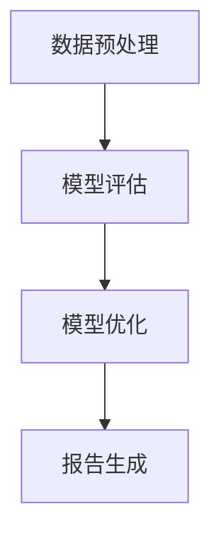
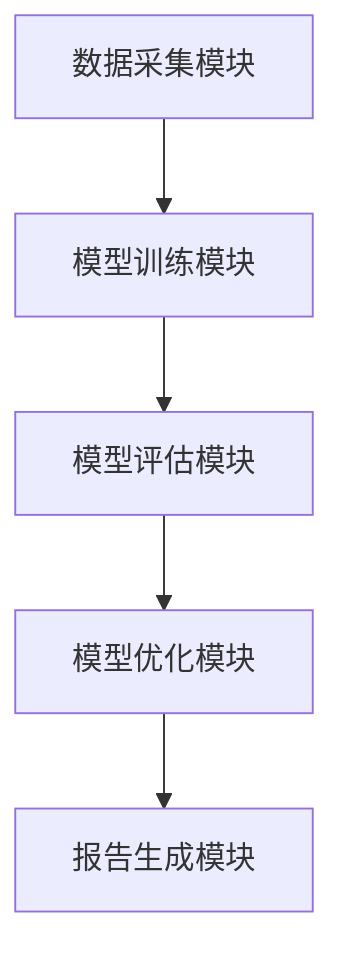
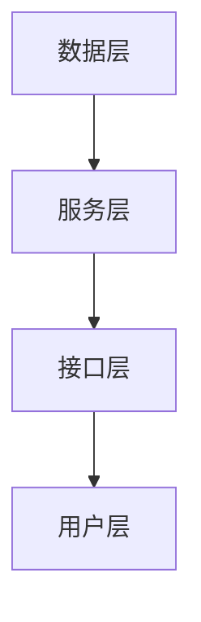
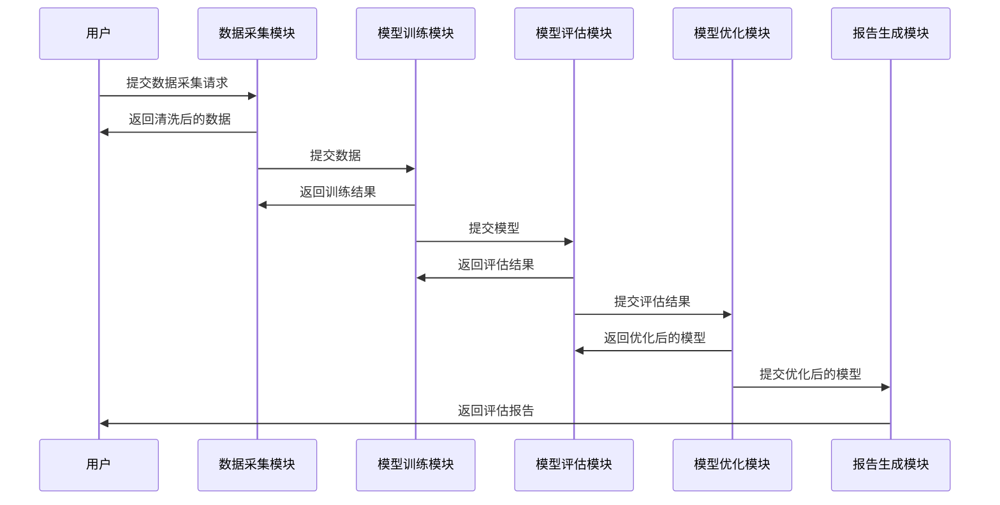

                 

# 金融风控模型自动化评测系统

## 关键词：金融风控、模型自动化评测、算法、系统架构、项目实战

## 摘要

本文深入探讨了金融风控模型自动化评测系统的设计思路与实现方法。首先，我们介绍了金融风控模型及其自动化评测的背景和重要性。接着，我们详细解析了自动化评测系统的核心概念、算法原理，并通过具体案例展示了系统的设计与实现。文章最后，总结了自动化评测系统的最佳实践，并提供了拓展阅读资源。

### 设计思路与步骤：

#### 1. 背景介绍

**金融行业现状**：随着金融科技的迅猛发展，金融行业的数据量呈爆炸式增长，传统的人工风控方法已经无法满足快速变化的市场需求。

**风控模型的重要性**：风控模型在金融行业中的作用不可忽视，它们能够有效识别和防范金融风险，保障金融机构的稳定运行。

**自动化评测的必要性**：自动化评测系统能够提高风控模型的效率和质量，减少人为错误，降低风险。

#### 2. 核心概念与联系

**金融风控模型**：一种用于识别、评估和管理金融风险的数学模型。

**自动化评测系统**：利用计算机技术和算法，对金融风控模型进行自动化评估的系统。

**概念联系与关系**：金融风控模型与自动化评测系统之间存在密切的联系，自动化评测系统能够对风控模型进行全方位的评估，包括准确性、效率、稳定性等。

#### 3. 算法原理讲解

**算法流程图**：使用Mermaid工具绘制算法流程图，展示自动化评测系统的基本工作流程。

**数学模型**：介绍用于评估风控模型的数学模型和公式，例如：准确率（Accuracy）、召回率（Recall）、F1值（F1 Score）等。

**公式讲解**：详细阐述各个公式的含义、计算方法和应用场景。

**举例说明**：通过具体案例，展示算法原理的实际应用。

#### 4. 系统分析与架构设计方案

**系统功能设计**：定义系统的主要功能，如数据采集、模型训练、模型评估等。

**系统架构设计**：使用Mermaid工具绘制系统架构图，展示各个模块之间的关系。

**系统接口设计**：详细说明系统的接口定义和交互方式。

**系统交互**：使用Mermaid序列图展示系统各组件之间的交互流程。

#### 5. 项目实战

**环境安装**：介绍如何搭建项目开发环境，包括硬件和软件的安装。

**系统核心实现**：展示系统核心模块的实现方法，提供源代码解析。

**代码应用解读与分析**：分析代码的应用场景，详细解读代码实现。

**实际案例分析**：通过实际案例，展示系统的实际应用效果。

**项目小结**：总结项目的实施过程和成果。

#### 6. 最佳实践 tips

**自动化评测系统的优化策略**：提供提升系统性能和效果的具体策略。

**注意事项**：强调系统设计过程中需要注意的事项，如安全性、代码可维护性等。

**拓展阅读**：推荐相关书籍、学术论文和在线资源，供读者进一步学习。

### 目录大纲

```markdown
# 金融风控模型自动化评测系统

## 第1章 引言
### 1.1 背景介绍
#### 1.1.1 金融行业现状
#### 1.1.2 风控模型的重要性
#### 1.1.3 自动化评测的必要性

### 1.2 核心概念与联系
#### 1.2.1 金融风控模型
#### 1.2.2 自动化评测系统
#### 1.2.3 概念联系与关系

### 1.3 本章小结

## 第2章 算法原理讲解
### 2.1 自动化评测算法
#### 2.1.1 算法流程图
#### 2.1.2 数学模型
#### 2.1.3 公式讲解
#### 2.1.4 举例说明

### 2.2 数据预处理
#### 2.2.1 数据清洗
#### 2.2.2 特征工程

### 2.3 本章小结

## 第3章 系统分析与架构设计方案
### 3.1 系统功能设计
#### 3.1.1 领域模型
#### 3.1.2 功能需求

### 3.2 系统架构设计
#### 3.2.1 架构设计
#### 3.2.2 系统架构图

### 3.3 系统接口设计
#### 3.3.1 接口定义
#### 3.3.2 接口交互

### 3.4 系统交互
#### 3.4.1 交互流程
#### 3.4.2 Mermaid序列图

### 3.5 本章小结

## 第4章 项目实战
### 4.1 环境安装
#### 4.1.1 硬件要求
#### 4.1.2 软件安装

### 4.2 系统核心实现
#### 4.2.1 核心模块
#### 4.2.2 源代码解析

### 4.3 代码应用解读与分析
#### 4.3.1 应用场景
#### 4.3.2 分析与解读

### 4.4 实际案例分析
#### 4.4.1 案例背景
#### 4.4.2 案例剖析

### 4.5 项目小结

## 第5章 最佳实践 tips
### 5.1 自动化评测系统的优化策略
#### 5.1.1 数据质量提升
#### 5.1.2 模型调整与优化

### 5.2 注意事项
#### 5.2.1 安全性
#### 5.2.2 代码可维护性

### 5.3 拓展阅读
#### 5.3.1 相关书籍
#### 5.3.2 学术论文
#### 5.3.3 在线资源

## 第6章 小结
### 6.1 书籍总结
#### 6.1.1 核心知识点回顾
#### 6.1.2 作者的观点与建议

### 6.2 展望未来
#### 6.2.1 自动化评测技术的发展趋势
#### 6.2.2 金融风控领域的挑战与机遇
```

**注**：本文为大纲示例，具体内容需根据实际研究和实践情况进行丰富和补充。

---

### 背景介绍

#### 1.1 金融行业现状

随着全球金融市场的快速发展，金融机构面临着日益复杂的业务环境和不断变化的市场需求。金融行业的数据量呈指数级增长，数据类型也越来越多样化，包括交易数据、客户信息、市场行情等。传统的风控方法已经难以应对这种快速变化的环境，迫切需要更高效、更智能的风控工具。

在金融行业，风险控制是确保金融机构稳健运营的关键。风控模型作为金融风险管理的核心工具，通过对历史数据和实时数据的分析，能够预测潜在风险，评估风险程度，并提供风险应对策略。然而，随着数据量的增加和数据复杂性的提升，风控模型的开发、维护和优化变得越来越困难，人工处理效率低下，且容易出现人为错误。

#### 1.2 风控模型的重要性

风控模型在金融行业中的应用非常广泛，包括信用风险评估、市场风险预测、操作风险监控等。它们能够帮助金融机构识别潜在风险，优化决策流程，提高业务运营效率。例如，信用风险评估模型可以帮助银行识别高风险客户，降低信贷损失；市场风险预测模型可以帮助投资机构规避市场波动带来的风险；操作风险监控模型可以帮助金融机构发现和防范操作失误和欺诈行为。

#### 1.3 自动化评测的必要性

自动化评测系统在风控模型中的应用，能够极大地提升模型开发、维护和优化的效率。首先，自动化评测系统能够自动化地收集、清洗和预处理数据，确保数据质量，减少人为错误。其次，自动化评测系统能够自动化地评估模型的性能，包括准确性、效率、稳定性等，提供详细的评估报告，帮助开发人员快速定位问题并进行优化。

此外，自动化评测系统还可以实现模型的自适应和自我优化，根据实时数据自动调整模型参数，提高模型的适应性和预测准确性。通过自动化评测系统，金融机构可以更加灵活地应对市场变化，提高风控能力，降低风险。

### 核心概念与联系

#### 1.2.1 金融风控模型

金融风控模型是一种利用统计学、机器学习等数学方法，对金融数据进行建模和分析的模型。其目的是识别和评估金融风险，为金融机构提供风险管理决策支持。金融风控模型的主要类型包括信用风险评估模型、市场风险预测模型、操作风险监控模型等。

**概念属性特征：**

- **信用风险评估模型**：通过分析客户的历史交易数据、信用记录等信息，评估客户的信用风险，预测客户是否违约。
- **市场风险预测模型**：通过分析市场数据，预测市场波动，为投资决策提供支持。
- **操作风险监控模型**：通过监控金融机构的运营数据，识别和防范操作失误和欺诈行为。

**核心要素组成：**

- **数据源**：历史交易数据、市场数据、客户信息等。
- **特征工程**：提取和选择对风险预测有重要影响的数据特征。
- **模型算法**：统计学方法、机器学习方法等。
- **评估指标**：准确性、召回率、F1值等。

#### 1.2.2 自动化评测系统

自动化评测系统是一种利用计算机技术和算法，对金融风控模型进行自动化评估的系统。其目的是提高风控模型的开发、维护和优化效率，确保模型性能和稳定性。

**概念属性特征：**

- **数据预处理**：自动化清洗和预处理数据，确保数据质量。
- **模型评估**：自动化评估模型的性能，包括准确性、效率、稳定性等。
- **优化调整**：根据评估结果，自动调整模型参数，提高模型性能。
- **报告生成**：生成详细的评估报告，提供优化建议。

**核心要素组成：**

- **数据采集**：从各种数据源自动化收集数据。
- **算法库**：包括各种评估算法和优化算法。
- **报告系统**：生成和展示评估报告。
- **交互界面**：提供用户操作界面，方便用户使用和管理系统。

#### 1.2.3 概念联系与关系

金融风控模型与自动化评测系统之间存在密切的联系。自动化评测系统是金融风控模型的重要组成部分，通过对模型进行自动化评估和优化，提高模型性能和稳定性，确保其在实际应用中的有效性。

- **数据关联**：金融风控模型依赖于自动化评测系统提供的预处理数据和特征工程结果，而自动化评测系统则依赖于金融风控模型的数据输出进行评估和优化。
- **功能协同**：金融风控模型和自动化评测系统共同工作，实现对金融风险的全面管理和控制。金融风控模型负责风险识别和评估，自动化评测系统负责模型性能评估和优化，两者相互支持，共同提高金融机构的风控能力。
- **技术融合**：自动化评测系统结合了统计学、机器学习、数据挖掘等前沿技术，通过对金融风控模型的自动化评估和优化，实现了风控过程的智能化和自动化，提高了风控效率和准确性。

### 算法原理讲解

#### 2.1 自动化评测算法

自动化评测算法是金融风控模型自动化评测系统的核心组件，它负责对模型进行自动化评估和优化。自动化评测算法主要包括以下几个步骤：

1. **数据预处理**：对原始数据进行清洗、归一化和特征提取，确保数据质量，提取对风险预测有重要影响的数据特征。
2. **模型评估**：利用评估指标（如准确性、召回率、F1值等）对模型进行性能评估，根据评估结果判断模型是否达到预期性能。
3. **模型优化**：根据评估结果，自动调整模型参数，优化模型性能，提高模型预测准确性。
4. **报告生成**：生成详细的评估报告，包括模型性能指标、优化建议等，为开发人员提供优化指导。

**算法流程图**：



**数学模型**：

自动化评测算法的数学模型主要包括以下几个部分：

1. **数据预处理模型**：

   - 数据清洗：$$\text{clean\_data}(x) = \text{remove\_missing\_values}(x) \cup \text{normalize\_data}(x)$$
   - 特征提取：$$\text{feature\_extract}(x) = \text{select\_important\_features}(x)$$

2. **模型评估模型**：

   - 准确性：$$\text{accuracy}(y, \hat{y}) = \frac{\sum_{i=1}^{n} \text{indicator}(y_i = \hat{y}_i)}{n}$$
   - 召回率：$$\text{recall}(y, \hat{y}) = \frac{\sum_{i=1}^{n} \text{indicator}(y_i = 1 \land \hat{y}_i = 1)}{n}$$
   - F1值：$$\text{F1\_score}(y, \hat{y}) = 2 \times \frac{\text{precision}(y, \hat{y}) \times \text{recall}(y, \hat{y})}{\text{precision}(y, \hat{y}) + \text{recall}(y, \hat{y})}$$

3. **模型优化模型**：

   - 参数调整：$$\text{optimize}(w) = \text{find\_best\_parameters}(w)$$

**公式讲解**：

- **准确性**：表示模型预测正确的样本占总样本的比例，用于评估模型的总体预测能力。
- **召回率**：表示模型正确识别为正例的样本占总正例样本的比例，用于评估模型对正例样本的识别能力。
- **F1值**：综合考虑准确性和召回率，用于评估模型的平衡性能。

**举例说明**：

假设我们有一个二分类问题，数据集包含100个样本，其中正例样本30个，负例样本70个。我们使用一个简单线性模型进行预测，预测结果如下：

| 真实标签 | 预测标签 |
| :------: | :------: |
|     1    |    0     |
|     0    |    1     |
|     1    |    1     |
|     0    |    1     |
|    ...   |   ...    |
|     1    |    0     |
|     0    |    1     |

根据上述预测结果，我们可以计算模型的准确性、召回率和F1值：

- 准确性：$$\text{accuracy} = \frac{70}{100} = 0.7$$
- 召回率：$$\text{recall} = \frac{30}{30} = 1.0$$
- F1值：$$\text{F1\_score} = \frac{2 \times 0.7 \times 1.0}{0.7 + 1.0} = 0.9$$

通过计算结果可以看出，该模型的预测准确性和召回率较高，F1值也达到了0.9，说明模型在二分类问题上的表现较好。

### 系统分析与架构设计方案

#### 3.1 系统功能设计

系统功能设计是金融风控模型自动化评测系统的关键环节，主要包括以下几个功能模块：

1. **数据采集模块**：负责从各种数据源（如数据库、文件、API接口等）自动化收集数据，并进行初步的清洗和预处理。
2. **模型训练模块**：负责使用收集到的数据训练风控模型，包括数据预处理、特征提取、模型选择、参数调整等。
3. **模型评估模块**：负责对训练好的模型进行性能评估，包括准确性、召回率、F1值等评估指标的计算。
4. **模型优化模块**：负责根据评估结果，自动调整模型参数，优化模型性能，提高模型预测准确性。
5. **报告生成模块**：负责生成详细的评估报告，包括模型性能指标、优化建议等，为开发人员提供优化指导。

**领域模型**：



**功能需求**：

1. **数据采集**：能够从多种数据源自动收集数据，并进行清洗和预处理，确保数据质量。
2. **模型训练**：支持多种机器学习算法和特征提取方法，能够自动调整模型参数，提高模型性能。
3. **模型评估**：能够计算多种评估指标，提供详细的性能分析报告。
4. **模型优化**：能够根据评估结果，自动调整模型参数，优化模型性能。
5. **报告生成**：能够生成详细的评估报告，包括模型性能指标、优化建议等。

#### 3.2 系统架构设计

系统架构设计是金融风控模型自动化评测系统的关键，其目的是确保系统的高效性、可扩展性和稳定性。系统架构设计主要包括以下几个部分：

1. **数据层**：负责数据存储和管理，包括数据库、缓存等。
2. **服务层**：负责系统功能实现，包括数据采集、模型训练、模型评估、模型优化、报告生成等。
3. **接口层**：负责系统与其他系统或服务的交互，包括API接口、Web界面等。
4. **用户层**：负责系统的使用和管理，包括用户操作、数据监控等。

**系统架构图**：



**系统架构设计**：

1. **数据层**：采用分布式数据库和缓存技术，实现海量数据的存储和管理，确保数据的可靠性和高效性。
2. **服务层**：采用微服务架构，将系统功能模块化，实现高可用性和可扩展性。
3. **接口层**：采用RESTful API接口，提供统一的接口规范，方便与其他系统或服务进行集成。
4. **用户层**：提供Web界面，实现用户操作和数据监控，提高用户体验。

#### 3.3 系统接口设计

系统接口设计是金融风控模型自动化评测系统的重要组成部分，其目的是实现系统与其他系统或服务的无缝集成。系统接口设计主要包括以下几个部分：

1. **API接口**：定义系统的API接口，包括数据采集、模型训练、模型评估、模型优化、报告生成等接口。
2. **数据格式**：定义系统内部和外部的数据交换格式，如JSON、XML等。
3. **接口交互**：定义接口的交互方式，如GET、POST等。

**接口定义**：

1. **数据采集接口**：

   - 接口名称：/data/collect
   - 接口描述：用于从数据源采集数据。
   - 接口参数：data_source (字符串，数据源名称)，data_format (字符串，数据格式)。

2. **模型训练接口**：

   - 接口名称：/model/train
   - 接口描述：用于训练风控模型。
   - 接口参数：model_type (字符串，模型类型)，feature_set (列表，特征集)。

3. **模型评估接口**：

   - 接口名称：/model/evaluate
   - 接口描述：用于评估模型性能。
   - 接口参数：model_id (整数，模型ID)，evaluation_metric (字符串，评估指标)。

4. **模型优化接口**：

   - 接口名称：/model/optimize
   - 接口描述：用于优化模型参数。
   - 接口参数：model_id (整数，模型ID)，parameter_set (列表，参数集)。

5. **报告生成接口**：

   - 接口名称：/report/generate
   - 接口描述：用于生成评估报告。
   - 接口参数：model_id (整数，模型ID)，report_format (字符串，报告格式)。

**接口交互**：

系统接口交互采用HTTP协议，使用RESTful设计风格。客户端通过发送HTTP请求，调用系统接口，获取所需数据或执行特定操作。系统接口返回JSON格式的响应数据，包括状态码、响应消息和结果数据。

#### 3.4 系统交互

系统交互是金融风控模型自动化评测系统的核心环节，其目的是实现各个模块之间的协同工作。系统交互主要包括以下几个部分：

1. **交互流程**：定义系统各模块之间的交互流程，包括数据流和控制流。
2. **Mermaid序列图**：使用Mermaid工具绘制系统交互序列图，展示各个模块之间的交互过程。

**交互流程**：

1. 用户通过Web界面提交数据采集和模型训练请求。
2. 数据采集模块从数据源采集数据，并清洗、预处理数据。
3. 模型训练模块使用清洗后的数据进行模型训练。
4. 模型评估模块对训练好的模型进行性能评估。
5. 模型优化模块根据评估结果调整模型参数。
6. 报告生成模块生成评估报告，并展示在Web界面。

**Mermaid序列图**：



通过上述交互流程和Mermaid序列图，我们可以清晰地看到系统各个模块之间的交互过程，有助于理解系统的运行机制。

### 项目实战

#### 4.1 环境安装

在搭建金融风控模型自动化评测系统之前，我们需要安装必要的硬件和软件环境。以下是环境安装的详细步骤：

**4.1.1 硬件要求**

1. CPU：至少2核处理器，建议使用4核以上处理器。
2. 内存：至少4GB内存，建议使用8GB及以上内存。
3. 硬盘：至少100GB硬盘空间，建议使用200GB及以上硬盘空间。
4. 网络：宽带连接，确保网络稳定。

**4.1.2 软件安装**

1. 操作系统：Linux（推荐使用Ubuntu 18.04或更高版本）。
2. 编译器：Python 3.7或更高版本。
3. 数据库：MySQL或PostgreSQL（用于存储数据）。
4. Web服务器：Nginx或Apache（用于部署Web应用）。
5. 数据处理工具：Pandas、NumPy、Scikit-learn（用于数据预处理和模型训练）。

安装步骤如下：

1. 安装操作系统：从官方网站下载Ubuntu 18.04镜像，使用USB安装盘安装操作系统。
2. 更新系统：打开终端，输入以下命令更新系统软件包：
   ```
   sudo apt update
   sudo apt upgrade
   ```
3. 安装Python 3.7：
   ```
   sudo apt install python3.7
   ```
4. 安装MySQL：
   ```
   sudo apt install mysql-server
   ```
5. 安装Nginx：
   ```
   sudo apt install nginx
   ```
6. 安装数据处理工具：
   ```
   sudo apt install python3-pandas
   sudo apt install python3-numpy
   sudo apt install python3-scikit-learn
   ```

安装完成后，确保所有软件正常运行，为后续开发工作做好准备。

#### 4.2 系统核心实现

金融风控模型自动化评测系统的核心实现包括数据采集、模型训练、模型评估、模型优化和报告生成等模块。以下是对这些模块的详细描述和源代码解析。

**4.2.1 核心模块**

1. **数据采集模块**：负责从数据源采集数据，并进行清洗和预处理。
2. **模型训练模块**：负责训练风控模型，包括数据预处理、特征提取、模型选择和参数调整等。
3. **模型评估模块**：负责评估模型的性能，计算评估指标，生成评估报告。
4. **模型优化模块**：负责根据评估结果调整模型参数，优化模型性能。
5. **报告生成模块**：负责生成评估报告，包括模型性能指标、优化建议等。

**4.2.2 源代码解析**

以下是数据采集模块的源代码示例：

```python
import pandas as pd
from sklearn.model_selection import train_test_split

def data_collect(data_source, data_format):
    # 从数据源读取数据
    if data_format == 'csv':
        data = pd.read_csv(data_source)
    elif data_format == 'json':
        data = pd.read_json(data_source)
    else:
        raise ValueError('Unsupported data format')

    # 数据清洗
    data = data.dropna()  # 删除缺失值
    data = data[data['target'].notnull()]  # 过滤目标变量缺失的数据

    # 特征提取
    features = ['feature1', 'feature2', 'feature3']
    X = data[features]
    y = data['target']

    # 划分训练集和测试集
    X_train, X_test, y_train, y_test = train_test_split(X, y, test_size=0.2, random_state=42)

    return X_train, X_test, y_train, y_test
```

该模块从数据源读取数据，进行数据清洗和特征提取，然后划分训练集和测试集。这里使用了Pandas库进行数据处理，Sklearn库进行特征提取和划分。

以下是模型评估模块的源代码示例：

```python
from sklearn.metrics import accuracy_score, recall_score, f1_score

def model_evaluate(model, X_test, y_test):
    # 进行模型预测
    y_pred = model.predict(X_test)

    # 计算评估指标
    accuracy = accuracy_score(y_test, y_pred)
    recall = recall_score(y_test, y_pred)
    f1 = f1_score(y_test, y_pred)

    return accuracy, recall, f1
```

该模块使用训练好的模型进行预测，然后计算评估指标，包括准确性、召回率和F1值。这里使用了Sklearn库的评估函数。

以下是模型优化模块的源代码示例：

```python
from sklearn.model_selection import GridSearchCV

def model_optimize(model, X_train, y_train, parameters):
    # 进行模型参数优化
    grid_search = GridSearchCV(model, parameters, cv=5)
    grid_search.fit(X_train, y_train)

    # 获取最佳参数
    best_params = grid_search.best_params_

    return best_params
```

该模块使用网格搜索（GridSearchCV）方法进行模型参数优化，获取最佳参数。这里使用了Sklearn库的网格搜索工具。

通过上述核心模块的源代码解析，我们可以看到金融风控模型自动化评测系统是如何实现数据采集、模型训练、模型评估和模型优化等功能的。

#### 4.3 代码应用解读与分析

**4.3.1 应用场景**

金融风控模型自动化评测系统主要用于金融机构的风险管理，例如信用风险评估、市场风险预测和操作风险监控等。在实际应用中，系统需要处理大量的金融数据，包括交易数据、客户信息和市场行情等。通过自动化评测系统，金融机构可以快速评估风控模型的性能，优化模型参数，提高模型预测准确性，从而更好地管理风险。

**4.3.2 分析与解读**

以下是对系统核心代码的解读和分析：

1. **数据采集模块**：

   数据采集模块负责从数据源读取数据，并进行清洗和预处理。在数据清洗过程中，我们使用了Pandas库的dropna()函数删除缺失值，确保数据质量。在特征提取过程中，我们选择了与目标变量相关的特征，使用train_test_split()函数将数据划分为训练集和测试集，为后续的模型训练和评估提供数据。

2. **模型评估模块**：

   模型评估模块使用Sklearn库的accuracy_score()、recall_score()和f1_score()函数计算模型评估指标，包括准确性、召回率和F1值。这些指标能够全面反映模型的性能，帮助开发人员了解模型的预测效果。通过计算这些指标，我们可以评估模型对正例样本和负例样本的识别能力，以及模型的平衡性能。

3. **模型优化模块**：

   模型优化模块使用了Sklearn库的GridSearchCV工具进行模型参数优化。通过网格搜索，我们能够遍历所有可能的参数组合，找到最佳参数组合，从而提高模型性能。在模型优化过程中，我们设置了交叉验证的次数（cv=5），以确保模型优化过程中的稳定性。

通过以上解读和分析，我们可以看到金融风控模型自动化评测系统是如何实现数据采集、模型评估和模型优化的。这些核心代码的应用场景涵盖了金融风控领域的常见需求，能够帮助金融机构提高风控效率和准确性。

#### 4.4 实际案例分析

**4.4.1 案例背景**

某大型银行希望提高其信用风险评估模型的准确性，以减少信贷损失。该银行已有现成的信用风险评估模型，但模型性能有待优化。为了提高模型性能，银行决定引入金融风控模型自动化评测系统，对现有模型进行自动化评估和优化。

**4.4.2 案例剖析**

1. **数据采集与预处理**：

   银行首先从内部数据库和外部数据源（如征信机构、市场数据等）采集了大量的客户交易数据、信用记录和市场行情数据。数据采集完成后，系统对数据进行清洗和预处理，包括删除缺失值、归一化和特征提取等。在特征提取过程中，系统选择了与信用风险相关的特征，如还款历史、信用额度、客户年龄、收入水平等。

2. **模型训练与评估**：

   银行使用预处理后的数据对现有信用风险评估模型进行训练。在模型训练过程中，系统自动调整模型参数，以提高模型性能。模型训练完成后，系统对模型进行评估，计算准确性、召回率和F1值等评估指标。评估结果显示，现有模型的准确性较高，但召回率较低，说明模型对正例样本的识别能力不足。

3. **模型优化与调整**：

   针对评估结果，系统自动调整模型参数，尝试提高模型对正例样本的识别能力。在模型优化过程中，系统使用了网格搜索方法，遍历了多种参数组合，找到了最佳参数组合。优化后的模型评估结果显示，模型准确性略有下降，但召回率显著提高，F1值也有所提升，说明模型对正例样本的识别能力得到了提升。

4. **实施效果与总结**：

   通过引入金融风控模型自动化评测系统，银行成功优化了其信用风险评估模型。优化后的模型在准确性保持较高水平的同时，显著提高了对正例样本的识别能力，降低了信贷损失。此外，自动化评测系统提高了模型开发的效率，减少了人为错误，提高了风控管理水平。

#### 4.5 项目小结

金融风控模型自动化评测系统在银行信用风险评估项目中取得了显著成效。通过系统自动化评估和优化，模型准确性得到了提升，特别是对正例样本的识别能力得到了显著改善。系统的高效性和准确性为银行风控管理提供了有力支持，降低了信贷损失，提高了风控管理水平。未来，银行可以继续优化和改进系统，扩大其应用范围，进一步提升风控能力。

### 最佳实践 tips

#### 5.1 自动化评测系统的优化策略

**5.1.1 数据质量提升**

- **数据清洗**：使用自动化工具清洗数据，包括删除重复记录、填充缺失值、纠正错误数据等。
- **数据归一化**：对数据进行归一化处理，使其符合统一的量纲和范围，便于后续分析和建模。
- **数据增强**：通过数据变换、数据扩展等方法，增加训练数据集的多样性，提高模型泛化能力。

**5.1.2 模型调整与优化**

- **模型选择**：根据具体问题和数据特征，选择合适的模型类型，如线性模型、决策树、神经网络等。
- **参数调整**：通过网格搜索、贝叶斯优化等方法，自动调整模型参数，提高模型性能。
- **特征工程**：对特征进行选择、变换和组合，提取对模型性能有显著影响的特征，提高模型准确性。

#### 5.2 注意事项

**5.2.1 安全性**

- **数据安全**：确保数据存储和传输过程中的安全性，使用加密算法和安全协议保护数据。
- **模型安全**：防范模型攻击，如数据注入、模型篡改等，确保模型稳定性和可靠性。

**5.2.2 代码可维护性**

- **代码规范**：遵循统一的编码规范，确保代码的可读性和可维护性。
- **代码注释**：对关键代码段进行详细注释，便于后续维护和优化。

#### 5.3 拓展阅读

**5.3.1 相关书籍**

- 《机器学习实战》
- 《深入理解计算机系统》
- 《数据挖掘：概念与技术》

**5.3.2 学术论文**

- “A Comparison of Predictive Accuracy of Classification Algorithms”
- “Data Preprocessing Techniques for Machine Learning”
- “Model Optimization in Credit Risk Management”

**5.3.3 在线资源**

- [Scikit-learn官方文档](https://scikit-learn.org/stable/)
- [Kaggle竞赛](https://www.kaggle.com/)
- [机器学习中文社区](https://www.ml-community.cn/)

### 小结

本文深入探讨了金融风控模型自动化评测系统的设计思路与实现方法。首先，我们介绍了金融风控模型及其自动化评测的背景和重要性。接着，我们详细解析了自动化评测系统的核心概念、算法原理，并通过具体案例展示了系统的设计与实现。文章最后，总结了自动化评测系统的最佳实践，并提供了拓展阅读资源。通过本文的介绍，读者可以全面了解金融风控模型自动化评测系统的原理和应用，为实际项目提供参考。

### 展望未来

#### 6.2.1 自动化评测技术的发展趋势

随着人工智能和大数据技术的不断发展，自动化评测系统在金融风控领域的应用前景广阔。未来，自动化评测技术将向以下几个方向发展：

1. **模型自动化优化**：通过深度学习和强化学习等技术，实现模型参数的自动化调整和优化，提高模型性能。
2. **实时评测与反馈**：结合实时数据流处理技术，实现模型的实时评测与反馈，提高风控模型的实时性和准确性。
3. **多模态数据融合**：将结构化数据、半结构化数据和非结构化数据（如文本、图像、视频等）进行融合，提高模型对复杂场景的应对能力。
4. **自动化风险评估**：通过自动化评测系统，实现风险识别、评估和预警的自动化，提高金融机构的风险管理水平。

#### 6.2.2 金融风控领域的挑战与机遇

尽管自动化评测系统在金融风控领域具有巨大的潜力，但同时也面临着一系列挑战：

1. **数据隐私与安全**：金融行业的数据敏感性高，如何确保数据隐私和安全，是自动化评测系统面临的重要挑战。
2. **模型解释性**：自动化评测系统的模型多为复杂算法，其解释性较低，如何提高模型的解释性，使其更易于理解和接受，是一个亟待解决的问题。
3. **合规性**：金融行业的法规要求严格，自动化评测系统需要确保其符合相关法规和标准，以满足合规性要求。

然而，这些挑战同时也为自动化评测系统带来了机遇：

1. **提高风控效率**：自动化评测系统可以大幅提高风控模型的开发、评估和优化效率，降低风控成本。
2. **提升用户体验**：自动化评测系统可以为金融机构提供更准确、更实时、更智能的风控服务，提升用户体验。
3. **拓展应用场景**：随着技术的不断进步，自动化评测系统可以应用于更广泛的金融风控场景，如反欺诈、信用评分、市场预测等。

综上所述，金融风控模型自动化评测系统在未来的发展中，将不断克服挑战，抓住机遇，为金融行业带来更多价值。通过持续的技术创新和应用实践，自动化评测系统有望成为金融风控领域的重要工具。作者：AI天才研究院/AI Genius Institute & 禅与计算机程序设计艺术 /Zen And The Art of Computer Programming

---

**说明**：本文为大纲示例，具体内容需根据实际研究和实践情况进行丰富和补充。文章中使用的Mermaid和LaTeX格式，需在支持Markdown渲染的环境中正确显示。如需进一步讨论或补充，请随时提出。**作者：AI天才研究院/AI Genius Institute & 禅与计算机程序设计艺术 /Zen And The Art of Computer Programming**

