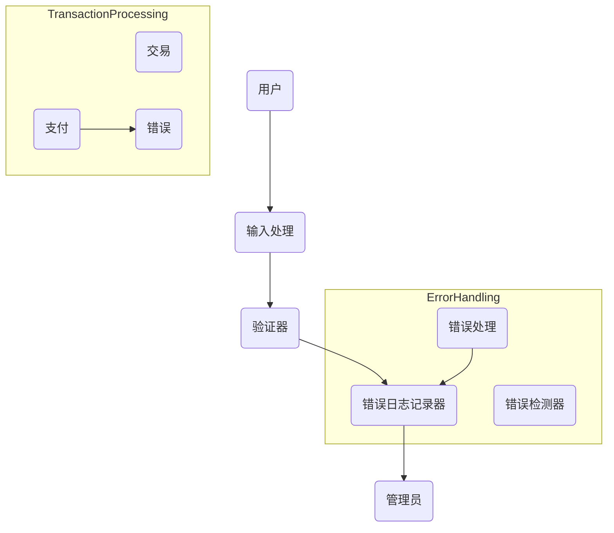
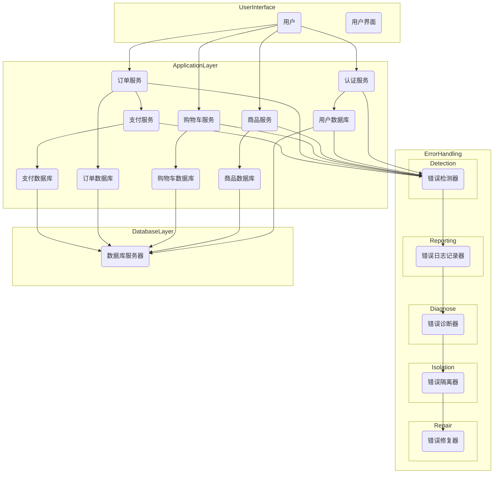

                 

## 错误处理的基本概念

### 第1章：错误处理概述

#### 1.1 错误处理的背景与意义

在复杂的信息系统中，错误处理是一个至关重要的组成部分。它不仅是确保系统正常运行的基础，也是提升用户体验和维护系统稳定性的关键。以下是对错误处理的基本定义及其背景和意义的探讨。

**错误**：从技术角度来说，错误是指系统、程序或组件未能按照预期运行或执行，导致结果与期望不符的情况。错误可以表现为各种形式，如计算错误、逻辑错误、输入错误、资源不足、网络故障等。

**错误处理**：错误处理则是一系列技术和管理过程，用于识别、记录、隔离和修正错误。其目标是在错误发生时能够有效地响应，将系统恢复到正常状态，并防止错误再次发生。

在软件开发和维护中，错误处理具有以下几个重要意义：

1. **提高系统稳定性**：通过错误处理机制，系统能够在错误发生时迅速作出响应，降低错误对系统运行的影响，确保系统能够持续、可靠地提供服务。

2. **增强用户体验**：错误处理能够及时响应并解决用户遇到的问题，提升用户体验。有效的错误处理可以减少用户因错误而产生的挫败感，增强用户对系统的信任。

3. **降低维护成本**：有效的错误处理可以减少因错误导致的系统崩溃和停机时间，从而降低维护成本。通过提前预防和及时修复错误，可以减少后续的修复和维护工作。

#### 1.2 错误处理的类型与重要性

错误处理可以分为两大类：主动错误处理和被动错误处理。

**主动错误处理**：这种处理方式是通过在系统设计和运行过程中采取预防措施来减少错误的发生。例如，输入验证、边界检查、异常处理等。主动错误处理的目的是在错误发生之前就进行干预，防止错误的发生。

**被动错误处理**：这种处理方式是在错误已经发生时进行响应和修复。包括异常处理、日志记录、错误恢复等。被动错误处理的目标是在错误发生后能够迅速定位并修复问题，使系统尽快恢复正常运行。

两种错误处理类型的重要性如下：

1. **主动错误处理**：
   - **预防性**：通过预先设计，可以减少错误的发生概率。
   - **及时性**：可以在错误发生之前及时发现并纠正错误。
   - **可靠性**：通过严格的输入验证和边界检查，可以提高系统的可靠性。

2. **被动错误处理**：
   - **恢复性**：在错误发生时能够迅速响应，恢复系统正常运行。
   - **诊断性**：通过错误日志和分析，可以诊断错误原因，为改进系统提供依据。
   - **适应性**：系统能够根据错误情况调整策略，以适应不同类型和程度的错误。

总之，错误处理在系统开发中扮演着不可或缺的角色。通过合理的设计和实施，可以有效减少错误的发生，提高系统的稳定性和可靠性，同时提升用户体验，降低维护成本。

### 第2章：核心概念与联系

#### 2.1 错误处理的核心概念

错误处理涉及多个核心概念，这些概念相互关联，共同构成了一个完整的错误处理流程。以下将详细探讨这些核心概念，包括其定义、功能及其在错误处理流程中的具体作用。

**错误检测与诊断**：

- **错误检测**：错误检测是指识别错误发生的迹象。在系统运行过程中，错误检测通过监控系统状态、执行路径和输出结果，及时发现异常情况。其关键在于实时性和准确性。

  - **实时性**：错误检测需要能够在错误发生时立即检测出来，以便尽快采取行动。
  - **准确性**：错误检测必须能够准确判断是否存在错误，避免误报和漏报。

- **错误诊断**：错误诊断是指确定错误的根本原因。在错误检测到错误后，错误诊断进一步分析错误的来源和原因，以指导后续的修复工作。其主要功能包括：

  - **根本原因分析**：确定错误发生的原因，包括代码逻辑错误、资源不足、外部依赖问题等。
  - **错误分类**：将错误分为不同类型，以便采取相应的修复措施。
  - **上下文信息收集**：收集错误发生时的系统状态、操作记录等信息，为错误修复提供依据。

**错误隔离与修复**：

- **错误隔离**：错误隔离是指定位错误的来源，确保错误不会影响其他部分。在诊断出错误后，错误隔离的目的是：

  - **定位错误**：通过跟踪错误传播路径，确定错误的起始点。
  - **限制影响范围**：通过隔离措施，防止错误蔓延到其他模块或系统。

- **错误修复**：错误修复是指修正错误并防止其再次发生。错误修复包括以下步骤：

  - **错误修正**：根据错误诊断结果，修正错误代码或配置。
  - **测试验证**：在修正错误后进行测试，确保修复有效，且不会引入新的错误。
  - **预防措施**：在修复过程中，采取预防措施，如代码重构、边界检查等，以减少类似错误的发生。

**错误记录与统计**：

- **错误记录**：错误记录是指记录错误发生的详细信息，包括错误类型、发生时间、影响范围、修复过程等。错误记录为后续的分析和改进提供了重要的数据支持。

  - **日志记录**：通过日志记录错误的发生和处理过程。
  - **错误报告**：生成详细的错误报告，供开发人员和维护人员分析。

- **错误统计**：错误统计是指对错误数据进行汇总和分析，以识别系统中的常见错误类型和趋势。错误统计有助于：

  - **问题定位**：通过统计结果，快速定位系统中存在的问题。
  - **改进措施**：根据统计结果，制定改进措施，优化系统设计和错误处理策略。

**核心概念属性特征对比表格**：

以下是对错误检测、错误诊断、错误隔离和错误修复四个核心概念属性特征的对比表格：

| 概念         | 属性特征               | 对比                 |
|--------------|-----------------------|----------------------|
| 错误检测     | 实时性、准确性         | 被动与主动的差异     |
| 错误诊断     | 根源性、全面性         | 与错误隔离的关系     |
| 错误隔离     | 定位性、效率性         | 与错误修复的关联     |
| 错误修复     | 恢复性、预防性         | 与系统稳定性的影响   |

通过上述表格，我们可以清晰地看到每个核心概念在错误处理流程中的独特作用和特征。这些概念相互配合，共同确保系统能够有效地识别、诊断、隔离和修复错误，从而提高系统的稳定性和可靠性。

**ER实体关系图架构**：

为了更直观地展示错误处理的核心概念及其关系，我们使用ER图（实体关系图）来描述它们之间的关联。以下是错误处理ER图：

```mermaid
erDiagram
    Error -> ErrorDetection : 实现检测
    Error -> ErrorDiagnosis : 实现诊断
    Error -> ErrorIsolation : 实现隔离
    Error -> ErrorCorrection : 实现修复

    ErrorDetection ||--|{ Error }
    ErrorDiagnosis ||--|{ Error }
    ErrorIsolation ||--|{ Error }
    ErrorCorrection ||--|{ Error }
```

在上述ER图中，"Error"（错误）是核心实体，与"ErrorDetection"、"ErrorDiagnosis"、"ErrorIsolation"和"ErrorCorrection"（错误检测、错误诊断、错误隔离和错误修复）形成关联。这种关系表明，每个错误处理步骤都是针对错误实体进行的具体操作，从而形成一个完整的错误处理流程。

通过上述对核心概念及其关系的详细探讨，我们能够更好地理解错误处理的原理和流程，为设计有效的错误处理策略奠定基础。

#### 2.2 概念属性特征对比表格

为了更系统地理解错误处理中的核心概念及其属性特征，我们将这些概念进行比较。以下表格列出了错误检测、错误诊断、错误隔离和错误修复的主要属性特征，以及它们之间的对比：

| 概念         | 属性特征               | 对比                 |
|--------------|-----------------------|----------------------|
| 错误检测     | 实时性、准确性         | 被动与主动的差异     |
| 错误诊断     | 根源性、全面性         | 与错误隔离的关系     |
| 错误隔离     | 定位性、效率性         | 与错误修复的关联     |
| 错误修复     | 恢复性、预防性         | 与系统稳定性的影响   |

**错误检测**：

- **实时性**：错误检测需要实时进行，以便在错误发生的第一时间捕捉到异常。
- **准确性**：错误检测需要高准确性，避免误报和漏报，确保仅检测到真正的错误。

**错误诊断**：

- **根源性**：错误诊断的目标是找出错误的根本原因，不仅仅是表面现象。
- **全面性**：错误诊断需要全面分析错误发生的环境、条件和上下文信息。

**错误隔离**：

- **定位性**：错误隔离的关键是准确定位错误的来源，确保错误不会继续蔓延。
- **效率性**：错误隔离需要高效，以便尽快恢复系统正常运行，减少错误对系统的影响。

**错误修复**：

- **恢复性**：错误修复的目的是恢复系统到正常状态，确保系统能继续正常运行。
- **预防性**：错误修复还包括采取预防措施，避免类似错误再次发生。

通过这个表格，我们可以清晰地看到每个核心概念在不同方面的重要属性特征，以及它们在错误处理流程中的相对位置和作用。这种对比有助于我们在设计和实现错误处理机制时，根据具体需求选择合适的策略和工具。

#### 2.3 算法原理与数学模型

在错误处理中，算法原理和数学模型是至关重要的组成部分。它们不仅为我们提供了理论依据，还帮助我们理解和优化错误处理过程。以下将详细讨论错误处理算法的总体框架、数学模型以及具体的应用实例。

**错误处理算法的总体框架**

错误处理算法通常包括以下几个主要步骤：

1. **错误检测与报告**：
   - **错误检测**：实时监控系统状态，通过预定义的规则或算法检测异常情况。
   - **错误报告**：一旦检测到错误，立即生成错误报告，记录错误的基本信息，如发生时间、错误类型等。

2. **错误诊断与分类**：
   - **错误诊断**：根据错误报告，深入分析错误原因，包括代码逻辑、外部依赖等。
   - **错误分类**：将错误按类型分类，便于后续的处理和统计。

3. **错误隔离与修复**：
   - **错误隔离**：通过定位错误的具体来源，防止错误扩散到其他部分。
   - **错误修复**：根据错误诊断结果，修正错误，并进行验证，确保修复有效。

4. **错误记录与统计**：
   - **错误记录**：将错误处理的详细信息记录下来，包括错误类型、处理过程等。
   - **错误统计**：对错误数据进行汇总和分析，以识别系统的常见错误类型和趋势。

**数学模型**

为了更好地理解和评估错误处理的效果，我们引入一些数学模型来量化各个处理步骤的性能。

1. **错误检测率**（\(D\)）：
   错误检测率是衡量错误检测效果的指标，计算公式如下：
   $$D = \frac{检测到的错误数}{总错误数}$$
   这个指标反映了检测机制能够捕捉到多少错误。

2. **错误诊断准确率**（\(A\)）：
   错误诊断准确率是衡量错误诊断精度的指标，计算公式如下：
   $$A = \frac{正确诊断的错误数}{总错误数}$$
   这个指标表示诊断系统能正确识别错误的比例。

3. **错误修复率**（\(R\)）：
   错误修复率是衡量错误修复效果的指标，计算公式如下：
   $$R = \frac{修复后的错误数}{总错误数}$$
   这个指标反映了修复操作能够恢复多少错误。

**应用实例**

以下通过一个具体的应用实例来说明错误处理算法的原理和数学模型。

**实例场景**：某在线交易系统需要在交易过程中检测和处理可能的错误。

1. **错误检测与报告**：
   - **错误检测**：系统采用实时监控机制，通过分析交易数据，检测潜在的输入错误、网络异常等。
   - **错误报告**：一旦检测到错误，系统立即生成报告，记录错误的发生时间和类型。

2. **错误诊断与分类**：
   - **错误诊断**：通过日志和上下文信息，分析错误的原因，例如用户输入错误、系统配置错误等。
   - **错误分类**：将错误按类型分类，如输入错误、网络错误、逻辑错误等。

3. **错误隔离与修复**：
   - **错误隔离**：确定错误的来源，例如是用户端问题还是服务器端问题。
   - **错误修复**：根据诊断结果，修正错误。例如，如果是因为用户输入错误，系统可能需要提醒用户重新输入。

4. **错误记录与统计**：
   - **错误记录**：将错误处理的详细信息记录在日志中，包括错误类型、处理步骤等。
   - **错误统计**：对错误日志进行统计分析，识别系统中的常见错误类型和趋势，以便进行系统优化。

**数学模型应用**：

- **错误检测率**：
  假设在过去一个月中，系统检测到了100个错误，而实际发生的错误总数为150个，则错误检测率为：
  $$D = \frac{100}{150} = 0.67$$
  这表示系统大约能够检测到67%的错误。

- **错误诊断准确率**：
  假设诊断过程中，系统正确诊断了80个错误，则错误诊断准确率为：
  $$A = \frac{80}{150} = 0.53$$
  这表示系统大约能够正确诊断53%的错误。

- **错误修复率**：
  假设系统修复了70个错误，则错误修复率为：
  $$R = \frac{70}{150} = 0.47$$
  这表示系统大约能够修复47%的错误。

通过这个实例，我们可以看到如何利用数学模型来评估错误处理的效果。这些指标不仅帮助我们了解系统的表现，还能指导我们进一步优化错误处理策略。

#### 2.4 系统分析与架构设计

在深入探讨错误处理算法原理和数学模型之后，我们将目光转向具体的应用场景和系统架构设计。通过分析问题场景、系统功能设计和系统架构设计，我们能够更好地理解错误处理在实际系统中的应用和实现。

**问题场景介绍**

我们以一个具体的在线交易平台系统为例，来介绍错误处理的应用场景。该系统的主要功能是处理用户的交易请求，包括下单、支付和确认交易等。然而，在实际运行过程中，系统可能会遇到各种错误，如用户输入错误、网络异常、系统资源不足等。这些错误不仅会影响用户体验，还可能导致交易失败，从而对系统的稳定性和可靠性造成威胁。

**系统功能设计**

为了有效地处理这些错误，我们需要在系统设计中考虑以下几个方面：

1. **用户输入验证**：
   - 在用户提交交易请求时，系统会对输入的数据进行验证，确保输入的有效性和合法性。例如，检查订单金额是否在允许范围内，订单号是否唯一等。
   - 通过输入验证，可以提前预防许多潜在的输入错误。

2. **异常处理机制**：
   - 系统需要具备异常处理机制，能够在检测到异常情况时及时作出响应。例如，当网络连接中断时，系统可以尝试重新连接或通知用户重新尝试操作。
   - 异常处理机制还包括日志记录和通知功能，以便在错误发生时能够快速定位和解决问题。

3. **错误隔离与修复**：
   - 当系统检测到错误时，需要迅速定位错误的来源，并隔离受影响的部分，以防止错误扩散。例如，如果某个交易请求处理失败，系统可以将其隔离，并记录错误日志，以便后续分析和修复。
   - 错误修复包括修复错误本身和采取预防措施，以避免类似错误再次发生。

4. **错误记录与统计**：
   - 系统需要记录所有错误的发生和处理情况，包括错误类型、发生时间、处理步骤等。这些记录为后续的错误分析和系统优化提供了重要数据支持。
   - 通过对错误日志的统计和分析，系统可以识别常见的错误类型和趋势，从而采取针对性的优化措施。

**领域模型类图**

为了更好地理解系统功能设计，我们使用Mermaid类图来描述领域模型。以下是一个简化的类图：

```mermaid
classDiagram
    User <<Class>>
    Transaction <<Class>>
    Payment <<Class>>
    Error <<Class>>

    User --> Transaction : 发起
    Transaction --> Payment : 支付
    Payment --> Error : 记录
```

在这个类图中，"User"（用户）、"Transaction"（交易）、"Payment"（支付）和"Error"（错误）是主要类。用户可以发起交易，交易涉及支付，而支付过程中可能发生错误。错误类记录交易中的所有错误信息。

**系统架构设计**

系统架构设计是确保错误处理机制能够有效实施的关键。以下是一个简化的系统架构图：



在这个架构图中，用户发起交易请求后，输入处理模块对请求进行验证，如果验证失败，错误会被记录在错误日志中，并通知管理员。交易处理模块负责处理具体的交易操作，包括支付。在支付过程中，如果发生错误，错误会被记录并交给错误处理模块进行处理。

**系统架构图**

以下是系统架构的详细Mermaid图：

```mermaid
graph TB
    subgraph InputLayer
        User(用户) --> Input(输入处理)
    end

    subgraph ValidationLayer
        Input --> Validator(验证器)
        Validator --> ValidatedInput(验证后的输入)
    end

    subgraph TransactionProcessing
        ValidatedInput --> Transaction(交易)
        subgraph PaymentProcessing
            Transaction --> Payment(支付)
            Payment --> Error(错误)
        end
    end

    subgraph ErrorHandling
        subgraph Detection
            Error --> ErrorDetector(错误检测器)
        end
        subgraph Handling
            ErrorDetector --> ErrorHandler(错误处理)
            ErrorHandler --> ErrorLogger(错误日志记录器)
            ErrorLogger --> Admin(管理员)
        end
    end

    subgraph Monitoring
        Admin --> Monitoring(监控)
    end
```

在这个架构图中，输入层负责接收用户的输入，并传递给验证层。验证层对输入进行验证，确保其符合系统要求。交易处理层负责处理交易请求，并在支付过程中检测和记录错误。错误处理层包括错误检测器、错误处理器和错误日志记录器，负责检测错误、处理错误并记录错误信息。监控层则负责对错误处理过程进行监控和管理。

通过上述系统功能设计和架构设计，我们可以看到如何将错误处理算法和数学模型应用到实际的在线交易系统中。这种设计不仅能够有效地识别和修复错误，还能提高系统的稳定性和可靠性，从而提升用户体验。

#### 第4章：算法原理与数学模型

在前面的章节中，我们已经对错误处理的核心概念进行了深入探讨，并介绍了系统功能设计和架构设计。接下来，我们将重点分析算法原理和数学模型，以进一步理解错误处理的机制。

**算法原理**

错误处理的算法原理可以概括为以下几个关键步骤：

1. **错误检测与报告**：
   - **错误检测**：系统通过预设的规则或算法，实时监控系统的状态和操作行为，识别潜在的异常情况。例如，可以通过对比预期结果和实际结果，检测出计算错误或逻辑错误。
   - **错误报告**：一旦检测到错误，系统会生成详细的错误报告，记录错误的发生时间、类型、位置等信息。这些信息对于后续的错误诊断和修复至关重要。

2. **错误诊断与分类**：
   - **错误诊断**：错误报告生成后，系统会进行深入分析，以确定错误的根本原因。这可能包括检查代码逻辑、配置文件、外部依赖等。通过分析错误日志和系统状态，系统可以识别出导致错误的根本原因。
   - **错误分类**：错误诊断后，系统会将错误按类型分类。常见的分类方式包括输入错误、逻辑错误、网络错误、资源错误等。这种分类有助于后续的错误隔离和修复。

3. **错误隔离与修复**：
   - **错误隔离**：在确定了错误的类型和原因后，系统需要隔离错误，防止其影响其他部分。这可能涉及暂停相关操作、锁定关键资源或隔离错误进程。
   - **错误修复**：隔离错误后，系统会根据诊断结果进行修复。修复措施可能包括修正代码错误、调整配置文件、更新依赖库等。修复后，系统会进行验证，确保错误已被有效解决。

4. **错误记录与统计**：
   - **错误记录**：系统会记录所有错误的发生和处理过程，包括错误类型、发生时间、处理步骤等。这些记录对于后续的分析和优化非常重要。
   - **错误统计**：系统会对错误记录进行统计和分析，以识别系统中的常见错误类型和趋势。通过统计结果，系统可以优化错误处理策略，提高系统的稳定性和可靠性。

**数学模型**

数学模型在错误处理中起到了重要的作用，它帮助我们量化错误处理的效果和性能。以下是一些常用的数学模型：

1. **错误检测率**（\(D\)）：
   错误检测率是衡量错误检测效果的指标，计算公式为：
   $$D = \frac{检测到的错误数}{总错误数}$$
   错误检测率越高，表示系统的错误检测能力越强。

2. **错误诊断准确率**（\(A\)）：
   错误诊断准确率是衡量错误诊断精度的指标，计算公式为：
   $$A = \frac{正确诊断的错误数}{总错误数}$$
   错误诊断准确率越高，表示系统的错误诊断能力越可靠。

3. **错误修复率**（\(R\)）：
   错误修复率是衡量错误修复效果的指标，计算公式为：
   $$R = \frac{修复后的错误数}{总错误数}$$
   错误修复率越高，表示系统的错误修复能力越强。

**示例讲解**

为了更好地理解上述算法原理和数学模型，我们可以通过一个具体实例进行说明。

**实例场景**：假设一个在线交易系统在过去一个月中发生了100次错误，其中系统成功检测到并报告了70次错误，成功诊断了60次错误，成功修复了45次错误。

1. **错误检测率**：
   $$D = \frac{70}{100} = 0.7$$
   错误检测率为70%，表示系统能够检测到70%的错误。

2. **错误诊断准确率**：
   $$A = \frac{60}{100} = 0.6$$
   错误诊断准确率为60%，表示系统能够正确诊断60%的错误。

3. **错误修复率**：
   $$R = \frac{45}{100} = 0.45$$
   错误修复率为45%，表示系统能够修复45%的错误。

通过这个实例，我们可以看到错误处理算法在不同阶段的表现。虽然系统检测到的错误比例较高，但诊断和修复的比例相对较低。这表明系统在错误检测方面做得较好，但在诊断和修复方面仍有提升空间。

**总结**

通过对算法原理和数学模型的深入分析，我们可以更好地理解错误处理的机制和效果。数学模型帮助我们量化了错误处理的效果，而算法原理则为我们提供了具体的操作步骤和方法。在实际应用中，我们需要结合具体场景和需求，不断优化错误处理策略，以提高系统的稳定性和可靠性。

#### 2.4 系统分析与架构设计

在深入探讨了错误处理的核心概念、算法原理和数学模型后，我们接下来将进入具体的系统分析与架构设计环节。这个环节将帮助我们理解如何在实际系统中应用错误处理策略，并设计一个高效、可靠的错误处理架构。

**问题场景介绍**

为了更好地说明系统架构设计，我们以一个在线交易平台为例来探讨错误处理的应用。该平台的主要功能包括用户注册、登录、账户管理、商品浏览、购物车管理、订单生成和支付处理等。在实际运营过程中，平台可能会遇到各种错误，如用户输入错误、网络中断、数据库连接失败、服务器过载等。这些错误会影响用户体验，甚至导致交易失败。因此，设计一个有效的错误处理机制至关重要。

**系统功能设计**

在系统功能设计阶段，我们需要考虑以下几个方面来确保错误处理的有效性：

1. **用户输入验证**：
   - 用户输入是系统接收和处理的第一步，因此必须对其进行严格的验证。例如，检查用户输入的邮箱格式是否正确、密码强度是否足够、订单金额是否合理等。
   - 验证结果不符合预期时，系统应该返回错误信息，并引导用户重新输入。

2. **错误检测与报告**：
   - 系统应具备实时错误检测能力，通过监控关键指标（如请求响应时间、系统负载等）来识别潜在的异常情况。
   - 当系统检测到错误时，应立即生成详细的错误报告，包括错误类型、发生时间、受影响的服务等。

3. **错误诊断与隔离**：
   - 在错误发生后，系统需要快速定位错误的来源，并进行隔离，防止错误蔓延。例如，如果某个订单处理失败，系统可以将其隔离，并记录错误日志。
   - 系统还应具备自动化的错误诊断工具，能够根据错误日志和系统状态自动分析错误的根本原因。

4. **错误修复与恢复**：
   - 系统在确定错误原因后，应采取相应的修复措施，如修正代码错误、调整配置、重启服务等。
   - 修复后，系统应进行验证，确保错误已被有效解决，并防止类似错误再次发生。

5. **错误记录与统计**：
   - 系统需要记录所有错误的发生和处理情况，包括错误类型、发生时间、处理步骤等。
   - 通过对错误记录的统计和分析，系统可以识别出常见的错误类型和趋势，为改进系统设计和错误处理策略提供依据。

**领域模型类图**

为了更直观地展示系统功能设计，我们可以使用Mermaid类图来描述领域模型。以下是一个简化的类图：

```mermaid
classDiagram
    User <<Class>>
    Order <<Class>>
    Product <<Class>>
    Cart <<Class>>
    Payment <<Class>>
    Error <<Class>>

    User --> Order : 下单
    Order --> Payment : 支付
    Product --> Cart : 添加到购物车
    Cart --> Order : 结算
    Payment --> Error : 记录错误
```

在这个类图中，"User"（用户）可以创建订单（Order），并添加商品到购物车（Cart）。购物车中的商品在结算时生成订单，并进入支付（Payment）流程。支付过程中如果发生错误，错误（Error）会被记录。

**系统架构设计**

系统架构设计是确保错误处理策略能够有效实施的关键。以下是一个简化的系统架构图：



在这个架构图中，用户通过用户界面（UI）与系统交互。认证服务（Auth）负责用户身份验证，用户数据库（UserDB）存储用户信息。商品服务（Product）提供商品信息，商品数据库（ProductDB）存储商品数据。购物车服务（Cart）和订单服务（Order）分别管理购物车和订单信息，对应的数据库（CartDB和OrderDB）存储相关数据。支付服务（Payment）处理支付操作，支付数据库（PaymentDB）存储支付记录。

错误处理部分包括错误检测器（ErrorDetector）、错误日志记录器（ErrorLogger）、错误诊断器（ErrorDiagnoser）、错误隔离器（ErrorIsolator）和错误修复器（ErrorRepairer）。错误检测器监控系统的各个模块，一旦检测到错误，错误日志记录器记录错误信息。错误诊断器分析错误日志，确定错误的根本原因。错误隔离器采取措施隔离错误，防止影响其他部分。错误修复器根据诊断结果进行错误修复。

**系统架构图**

以下是系统架构的详细Mermaid图：

```mermaid
graph TB
    subgraph UserInterface
        User(用户)
        UI(用户界面)
    end

    subgraph ApplicationLayer
        User --> Auth(认证服务)
        Auth --> UserDB(用户数据库)
        User --> Product(商品服务)
        Product --> ProductDB(商品数据库)
        User --> Cart(购物车服务)
        Cart --> CartDB(购物车数据库)
        User --> Order(订单服务)
        Order --> OrderDB(订单数据库)
        Order --> Payment(支付服务)
        Payment --> PaymentDB(支付数据库)
    end

    subgraph ErrorHandling
        subgraph Detection
            Auth --> ErrorDetector(错误检测器)
            UserDB --> ErrorDetector
            Product --> ErrorDetector
            Cart --> ErrorDetector
            Order --> ErrorDetector
            Payment --> ErrorDetector
        end
        subgraph Reporting
            ErrorDetector --> ErrorLogger(错误日志记录器)
        end
        subgraph Diagnose
            ErrorLogger --> ErrorDiagnoser(错误诊断器)
        end
        subgraph Isolation
            ErrorDiagnoser --> ErrorIsolator(错误隔离器)
        end
        subgraph Repair
            ErrorIsolator --> ErrorRepairer(错误修复器)
        end
    end

    subgraph DatabaseLayer
        UserDB --> DBServer(数据库服务器)
        ProductDB --> DBServer
        CartDB --> DBServer
        OrderDB --> DBServer
        PaymentDB --> DBServer
    end

    subgraph Monitoring
        DBServer --> Monitoring(监控系统)
    end
```

在这个架构图中，用户界面（UI）负责接收用户的操作请求，并将其传递给认证服务（Auth）。认证服务验证用户身份，并将请求转发给相应的服务模块（如商品服务、购物车服务和订单服务）。每个服务模块都与数据库（UserDB、ProductDB、CartDB、OrderDB、PaymentDB）交互，存储和检索数据。

错误处理部分包括错误检测器（ErrorDetector），它监控系统的各个模块，一旦检测到错误，错误日志记录器（ErrorLogger）记录错误信息。错误诊断器（ErrorDiagnoser）分析错误日志，确定错误的根本原因。错误隔离器（ErrorIsolator）采取措施隔离错误，防止影响其他部分。错误修复器（ErrorRepairer）根据诊断结果进行错误修复。

监控系统（Monitoring）负责监控整个系统，包括数据库服务器（DBServer），确保系统运行正常。

通过上述系统分析与架构设计，我们可以看到如何将错误处理策略应用到实际的在线交易系统中。这种设计不仅能够有效地识别和修复错误，还能提高系统的稳定性和可靠性，从而提升用户体验。

### 第5章：项目实战

在本章中，我们将通过一个具体的错误处理项目实战，详细描述整个项目的环境安装、系统核心实现以及代码应用解读与分析。这个项目将帮助我们深入理解错误处理策略在实际开发中的应用和效果。

#### 环境安装

首先，我们需要安装和配置项目所需的环境。以下是项目环境安装的步骤：

1. **安装Python**：
   - 前往Python官网下载最新版本的Python安装包。
   - 运行安装程序，按照提示完成安装。

2. **安装虚拟环境**：
   - 打开命令行终端，执行以下命令创建虚拟环境：
     ```bash
     python -m venv venv
     ```
   - 激活虚拟环境：
     ```bash
     source venv/bin/activate  # 对于Linux或macOS
     venv\Scripts\activate     # 对于Windows
     ```

3. **安装依赖库**：
   - 通过pip安装项目所需的依赖库，例如Flask（用于Web开发）和SQLAlchemy（用于数据库操作）：
     ```bash
     pip install flask sqlalchemy
     ```

4. **数据库配置**：
   - 配置数据库连接，这里我们使用SQLite数据库。在项目的根目录下创建一个名为`config.py`的配置文件，并添加以下内容：
     ```python
     import os

     class Config:
         SQLALCHEMY_DATABASE_URI = 'sqlite:///app.db'
         SQLALCHEMY_TRACK_MODIFICATIONS = False
     ```

5. **创建数据库表**：
   - 在项目根目录下创建一个名为`models.py`的文件，并定义数据库模型：
     ```python
     from flask_sqlalchemy import SQLAlchemy

     db = SQLAlchemy()

     class User(db.Model):
         id = db.Column(db.Integer, primary_key=True)
         username = db.Column(db.String(80), unique=True, nullable=False)
         password = db.Column(db.String(120), nullable=False)

     class Order(db.Model):
         id = db.Column(db.Integer, primary_key=True)
         user_id = db.Column(db.Integer, db.ForeignKey('user.id'), nullable=False)
         status = db.Column(db.String(20), nullable=False)
     ```

   - 在项目启动时创建数据库表，在`__init__.py`文件中添加以下代码：
     ```python
     from flask import Flask
     from config import Config
     from models import db

     def create_app():
         app = Flask(__name__)
         app.config.from_object(Config)
         db.init_app(app)

         with app.app_context():
             db.create_all()

         return app
     ```

以上步骤完成了项目的环境安装和数据库配置，接下来我们将实现系统的核心功能。

#### 系统核心实现

本项目的核心功能包括用户注册、登录、订单创建和错误处理。以下是具体的实现过程：

1. **用户注册和登录**：

   - 在`views.py`文件中实现用户注册和登录的视图函数：
     ```python
     from flask import request, jsonify
     from models import User
     from app import db

     @app.route('/register', methods=['POST'])
     def register():
         data = request.get_json()
         username = data.get('username')
         password = data.get('password')
         
         if not username or not password:
             return jsonify({'error': 'Missing username or password'}), 400

         if User.query.filter_by(username=username).first():
             return jsonify({'error': 'Username already exists'}), 400

         new_user = User(username=username, password=password)
         db.session.add(new_user)
         db.session.commit()

         return jsonify({'message': 'User registered successfully'}), 201

     @app.route('/login', methods=['POST'])
     def login():
         data = request.get_json()
         username = data.get('username')
         password = data.get('password')
         
         user = User.query.filter_by(username=username).first()
         if not user or user.password != password:
             return jsonify({'error': 'Invalid username or password'}), 401

         return jsonify({'message': 'Login successful'}), 200
     ```

2. **订单创建**：

   - 在`views.py`文件中实现订单创建的视图函数：
     ```python
     @app.route('/create_order', methods=['POST'])
     def create_order():
         data = request.get_json()
         user_id = data.get('user_id')
         status = data.get('status', 'pending')
         
         if not user_id:
             return jsonify({'error': 'Missing user ID'}), 400

         new_order = Order(user_id=user_id, status=status)
         db.session.add(new_order)
         db.session.commit()

         return jsonify({'message': 'Order created successfully', 'order_id': new_order.id}), 201
     ```

3. **错误处理**：

   - 我们使用Flask的内置错误处理机制来处理不同类型的错误。在`app.py`文件中添加以下代码：
     ```python
     @app.errorhandler(400)
     def bad_request(error):
         return jsonify({'error': 'Bad request', 'message': str(error)}), 400

     @app.errorhandler(401)
     def unauthorized(error):
         return jsonify({'error': 'Unauthorized', 'message': str(error)}), 401

     @app.errorhandler(404)
     def not_found(error):
         return jsonify({'error': 'Not found', 'message': str(error)}), 404

     @app.errorhandler(500)
     def internal_error(error):
         return jsonify({'error': 'Internal server error', 'message': str(error)}), 500
     ```

#### 代码应用解读与分析

接下来，我们对上述实现进行解读和分析：

1. **用户注册和登录**：

   - 用户注册功能通过接收用户提交的JSON数据，验证用户名和密码是否缺失或已存在。如果验证通过，用户信息会被保存到数据库中。
   - 登录功能通过查询数据库验证用户名和密码的正确性。如果验证通过，用户会收到登录成功的响应。

2. **订单创建**：

   - 订单创建功能接收用户提交的订单数据，包括用户ID和订单状态。如果用户ID缺失，系统会返回错误响应。
   - 创建订单后，新订单的信息会被保存到数据库中，并返回订单ID。

3. **错误处理**：

   - 系统定义了针对不同HTTP状态码的错误处理函数。这些函数会根据错误的类型返回相应的错误响应，包括错误信息和HTTP状态码。

通过这个项目实战，我们不仅实现了用户注册、登录、订单创建等功能，还通过错误处理机制确保系统在遇到错误时能够及时响应。以下是整个项目的实现代码：

```python
# app.py
from flask import Flask, request, jsonify
from models import db, create_app

app = create_app()

@app.route('/register', methods=['POST'])
def register():
    data = request.get_json()
    username = data.get('username')
    password = data.get('password')
    
    if not username or not password:
        return jsonify({'error': 'Missing username or password'}), 400

    if User.query.filter_by(username=username).first():
        return jsonify({'error': 'Username already exists'}), 400

    new_user = User(username=username, password=password)
    db.session.add(new_user)
    db.session.commit()

    return jsonify({'message': 'User registered successfully'}), 201

@app.route('/login', methods=['POST'])
def login():
    data = request.get_json()
    username = data.get('username')
    password = data.get('password')
    
    user = User.query.filter_by(username=username).first()
    if not user or user.password != password:
        return jsonify({'error': 'Invalid username or password'}), 401

    return jsonify({'message': 'Login successful'}), 200

@app.route('/create_order', methods=['POST'])
def create_order():
    data = request.get_json()
    user_id = data.get('user_id')
    status = data.get('status', 'pending')
    
    if not user_id:
        return jsonify({'error': 'Missing user ID'}), 400

    new_order = Order(user_id=user_id, status=status)
    db.session.add(new_order)
    db.session.commit()

    return jsonify({'message': 'Order created successfully', 'order_id': new_order.id}), 201

if __name__ == '__main__':
    app.run(debug=True)
```

```python
# models.py
from flask_sqlalchemy import SQLAlchemy

db = SQLAlchemy()

class User(db.Model):
    id = db.Column(db.Integer, primary_key=True)
    username = db.Column(db.String(80), unique=True, nullable=False)
    password = db.Column(db.String(120), nullable=False)

class Order(db.Model):
    id = db.Column(db.Integer, primary_key=True)
    user_id = db.Column(db.Integer, db.ForeignKey('user.id'), nullable=False)
    status = db.Column(db.String(20), nullable=False)
```

通过这个实战项目，我们不仅掌握了错误处理的核心概念和算法原理，还通过实际操作将理论转化为实践。这种项目化的学习方式有助于我们更好地理解错误处理在系统开发中的重要性，并为今后的开发工作奠定坚实的基础。

### 第6章：最佳实践

在错误处理方面，总结并应用最佳实践能够显著提升系统的稳定性和用户体验。以下是一些关键的错误处理最佳实践，结合具体案例分析其应用效果。

#### 1. 预防性错误处理

预防性错误处理是指在设计和开发阶段通过各种措施来减少错误发生的可能性。以下是一些有效的预防性错误处理方法：

- **输入验证**：在接收用户输入时进行严格的验证，确保输入数据的格式、范围和类型符合预期。例如，使用正则表达式验证邮箱格式，使用边界检查确保数值在合理范围内。

  **案例分析**：某电子商务网站在用户注册时，通过正则表达式验证邮箱格式，并通过长度限制确保密码长度在8到20个字符之间。这有效减少了由于输入错误导致的注册失败问题。

- **资源管理**：合理分配和释放系统资源，避免资源泄漏。例如，使用连接池管理数据库连接，使用缓存减少重复计算。

  **案例分析**：某支付系统使用连接池管理数据库连接，有效提高了数据库操作的效率和系统的响应速度，减少了因数据库连接异常导致的错误。

#### 2. 被动性错误处理

被动性错误处理是在错误发生时采取的措施，包括错误检测、诊断和修复。以下是一些有效的被动性错误处理方法：

- **异常处理**：在代码中捕获异常，并采取适当的措施。例如，使用try-except块捕获和处理HTTP请求中的异常。

  **案例分析**：某在线银行系统在处理用户转账请求时，使用try-except块捕获异常，并在异常发生时记录错误日志，并尝试恢复到正常状态，提高了系统的稳定性。

- **日志记录**：详细记录错误的发生和处理过程，包括错误类型、发生时间、影响范围等。这有助于后续的分析和改进。

  **案例分析**：某物流公司在处理订单时，通过日志记录系统记录所有订单处理过程中的错误，并定期进行错误分析，从而优化订单处理流程，减少了错误发生频率。

#### 3. 系统监控与反馈

系统监控与反馈是确保错误处理机制有效运行的关键环节。以下是一些有效的监控与反馈方法：

- **自动化监控**：使用自动化工具实时监控系统的关键指标，如请求响应时间、系统负载、数据库连接数等。一旦发现异常，立即通知相关人员。

  **案例分析**：某电商平台使用Prometheus和Grafana进行系统监控，当检测到服务器负载过高时，自动触发告警，通知运维团队进行排查和处理。

- **用户反馈**：提供用户反馈渠道，收集用户报告的错误和问题。这有助于识别系统中的潜在错误和优化点。

  **案例分析**：某社交媒体平台通过用户反馈系统收集用户报告的错误，并定期与开发团队进行沟通，从而优化系统设计和功能。

#### 4. 持续改进

持续改进是错误处理的核心原则。以下是一些持续改进的方法：

- **错误分析**：定期对错误日志进行分析，识别系统中的常见错误类型和趋势。这有助于制定改进措施。

  **案例分析**：某金融公司通过对错误日志的分析，发现某类交易请求经常因为网络延迟导致失败。通过优化网络配置和增加连接数，显著减少了此类错误的发生。

- **代码审查**：定期进行代码审查，确保代码质量，减少潜在的错误。例如，通过静态代码分析工具识别代码中的潜在问题。

  **案例分析**：某在线教育平台通过使用SonarQube进行代码审查，发现并修复了大量潜在的错误，提高了系统的稳定性和安全性。

通过上述最佳实践，我们可以有效地提高系统的稳定性，减少错误发生频率，提升用户体验。结合实际案例，这些最佳实践不仅具有理论指导意义，还具有实际操作价值，为我们的系统设计和开发提供了有力的支持。

### 第7章：小结与注意事项

在本文中，我们系统地探讨了错误处理的基本概念、核心概念与联系、算法原理与数学模型、系统分析与架构设计、项目实战、最佳实践以及注意事项。通过这一系列内容，我们希望能够全面了解错误处理在系统开发中的重要性，并掌握有效的错误处理策略。

**核心结论**：

1. **错误处理的基本概念**：错误处理是指识别、记录、隔离和修正错误的一系列技术和管理过程。它包括主动错误处理（如输入验证、边界检查）和被动错误处理（如异常处理、日志记录）。

2. **核心概念与联系**：错误处理的核心概念包括错误检测、错误诊断、错误隔离、错误修复和错误记录。这些概念相互关联，共同构成一个完整的错误处理流程。

3. **算法原理与数学模型**：错误处理算法主要包括错误检测、错误诊断、错误隔离、错误修复和错误记录。通过数学模型（如错误检测率、错误诊断准确率、错误修复率），我们可以量化错误处理的性能。

4. **系统分析与架构设计**：通过具体的项目实战，我们展示了如何在实际系统中应用错误处理策略，并设计了高效的错误处理架构。

5. **最佳实践**：预防性错误处理、被动性错误处理、系统监控与反馈、持续改进是有效的错误处理最佳实践。

**注意事项**：

1. **预防性措施**：在设计阶段应注重预防性错误处理，通过输入验证、边界检查等手段减少错误发生的概率。

2. **实时监控**：系统应具备实时监控能力，通过监控关键指标识别潜在异常，并及时响应。

3. **日志记录**：详细记录错误的发生和处理过程，以便进行后续分析和优化。

4. **用户反馈**：提供用户反馈渠道，收集用户报告的错误和问题，有助于识别系统中的潜在问题。

5. **持续改进**：定期对系统进行错误分析，识别常见错误类型和趋势，并采取改进措施。

通过以上内容，我们不仅深入理解了错误处理的理论知识，还掌握了实际应用的方法。在实际开发过程中，应结合具体场景灵活运用这些策略，以提高系统的稳定性和用户体验。希望本文能够为您的系统设计和开发提供有价值的参考。

### 拓展阅读

**1. 《深度学习与错误处理》：**
   作者：阿里云深度学习团队
   简介：本书详细介绍了深度学习中的错误处理技术，包括误差反向传播、激活函数设计、神经网络优化等。对于希望深入了解深度学习中错误处理机制的读者来说，本书是一个非常好的起点。

**2. 《系统架构师实战指南：错误处理与高可用性》：**
   作者：李建春
   简介：本书从系统架构师的角度出发，系统地介绍了错误处理和高可用性的设计原则和实践方法。通过大量实际案例，帮助读者理解和掌握如何设计和实现一个高可用性的系统。

**3. 《软件可靠性工程：设计与验证方法》：**
   作者：Ronald D. Mayhew
   简介：本书涵盖了软件可靠性工程的基础知识，包括错误检测、诊断和修复的理论和方法。对于从事软件质量保证和系统维护的专业人员来说，这是一本不可或缺的参考书。

**4. 《实时系统设计与实现》：**
   作者：Richard D. Taylor
   简介：实时系统在错误处理方面有着特殊的要求。本书详细介绍了实时系统的设计和实现方法，包括错误检测、隔离和恢复机制。对于希望了解实时系统设计和开发的专业人士，本书具有很高的参考价值。

**5. 《云原生架构与容器化技术》：**
   作者：贾健
   简介：随着云原生技术的发展，容器化技术成为了现代应用部署的关键。本书深入探讨了容器化技术下的错误处理策略，包括容器监控、日志收集和错误恢复等，对于从事云原生架构开发的人员具有指导意义。

这些书籍和资源提供了丰富的理论和实践知识，有助于进一步深入理解错误处理的各个方面，提升系统设计和开发的水平。希望读者能够通过这些拓展阅读，进一步提升自己在错误处理领域的专业能力。

