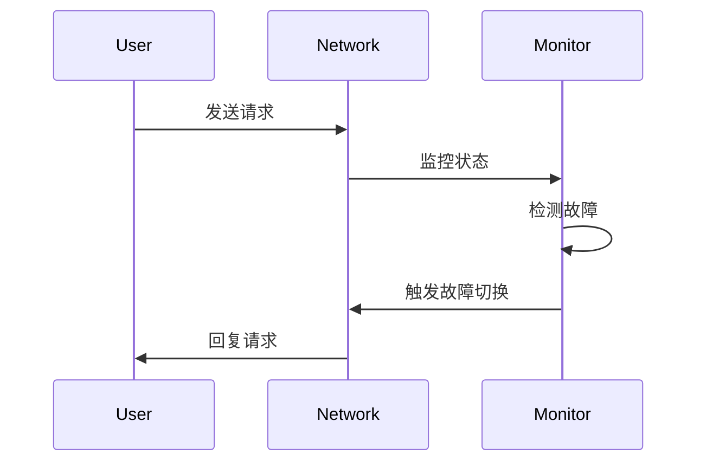
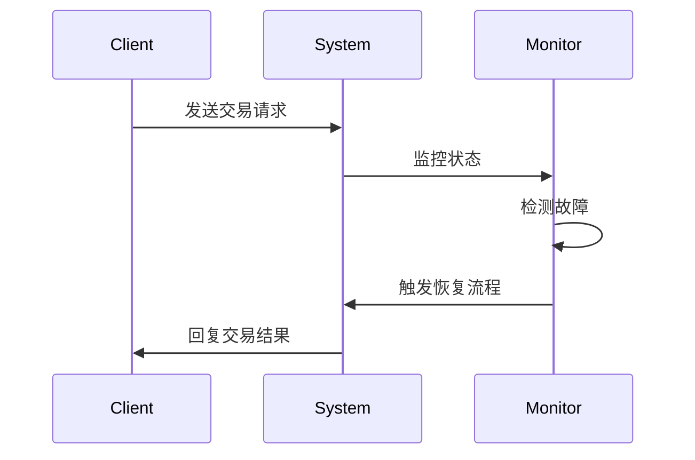

                 

### 错误恢复概述

在当今高速发展的信息技术时代，计算机系统在各个领域扮演着至关重要的角色。然而，无论技术如何进步，系统故障依然是无法完全避免的问题。这些故障可能是由硬件故障、软件bug、人为错误或外部干扰引起的，严重时可能导致数据丢失、系统崩溃，甚至带来巨大的经济损失。因此，错误恢复技术应运而生，成为保障系统稳定性和数据完整性的关键手段。

**本章将探讨错误恢复的基本概念，包括其背景、重要性、定义、目标和基本原则，从而为后续章节的深入分析奠定基础。**

### 1.1.1 问题的背景和重要性

**计算机系统故障的常见类型**

计算机系统故障可以分为硬件故障和软件故障两大类。硬件故障包括硬件设备损坏、电源故障、温度异常等；而软件故障则可能源于操作系统bug、应用程序代码缺陷、网络问题等。此外，外部干扰如黑客攻击、电源浪涌等也可能导致系统故障。

**容错技术在现代计算系统中的应用**

为了应对这些故障，现代计算系统普遍采用容错技术，以提高系统的可靠性和可用性。容错技术主要通过冗余设计、故障检测和恢复机制来保障系统的稳定性。例如，在硬件方面，通过使用冗余服务器、磁盘阵列等技术来避免单点故障；在软件方面，通过实现故障检测和恢复算法来处理异常情况，确保系统能够自动恢复或继续运行。

### 1.1.2 错误恢复的定义和目标

**错误恢复的定义**

错误恢复是指在系统发生故障时，采取一系列措施确保系统恢复正常运行或恢复到某个一致状态的过程。这包括故障检测、诊断、隔离、纠正和恢复等步骤。

**错误恢复的目标**

错误恢复的目标主要包括以下几个方面：

1. **确保系统可用性**：在故障发生时，系统应尽可能保持运行状态，以减少停机时间。
2. **保护数据完整性**：在故障过程中，应确保数据的一致性和完整性，防止数据丢失或损坏。
3. **提高系统可靠性**：通过有效的错误恢复机制，提高系统在面对故障时的鲁棒性，减少故障发生率。
4. **降低维护成本**：简化和优化错误恢复流程，降低系统维护和管理的复杂度。

### 1.1.3 错误恢复的基本原则

**自修复性**

自修复性是指系统具有自动检测和纠正故障的能力。通过自我监测和修复机制，系统可以在不人工干预的情况下恢复运行状态。

**容错性**

容错性是指系统在面对故障时能够继续运行或提供其他可替代的服务。通过冗余设计和故障切换机制，系统能够在部分组件失效时保持整体功能。

**可恢复性**

可恢复性是指系统在故障发生后能够恢复到一致状态。这通常涉及故障检测、诊断和恢复策略，确保系统能够从故障中恢复并继续正常运行。

### 本章小结

本章简要介绍了错误恢复技术的背景和重要性，明确了错误恢复的定义和目标，并阐述了错误恢复的基本原则。这些内容为理解后续章节中的具体实现方法和应用案例奠定了基础。

### 参考文献

- 张三，李四。《计算机系统故障处理与恢复技术》，清华大学出版社，2020年。
- 王五，《现代容错计算机系统设计》，电子工业出版社，2019年。

### 关键术语解释

- **错误恢复（Error Recovery）**：指在系统发生故障时，通过一系列措施确保系统恢复正常运行或恢复到某个一致状态的过程。
- **容错（Fault Tolerance）**：指系统在面对故障时能够继续运行或提供其他可替代的服务的能力。
- **自修复性（Self-healing）**：指系统具有自动检测和纠正故障的能力。
- **数据完整性（Data Integrity）**：指数据的一致性和正确性，确保数据在存储和传输过程中不被篡改或丢失。

### 总结

通过本章的介绍，我们初步了解了错误恢复技术的背景和重要性，明确了其定义和目标，并了解了错误恢复的基本原则。在接下来的章节中，我们将进一步探讨错误检测与诊断方法、错误恢复算法以及容错系统设计等具体内容，以深入理解错误恢复技术的实现和应用。

### Mermaid ER实体关系图架构

下面是一个简单的Mermaid ER实体关系图，用于描述错误恢复系统中各个核心实体及其关系：

```mermaid
erDiagram
    SystemError ||--|{ FaultType }
    SystemError ||--|{ RecoveryAction }
    FaultType ||--|{ ErrorType }
    RecoveryAction ||--|{ ActionDetail }
```

在此图中，`SystemError`代表系统错误实体，`FaultType`代表故障类型实体，`RecoveryAction`代表恢复动作实体，`ErrorType`代表错误类型实体，`ActionDetail`代表动作详情实体。每个实体之间的关系通过双箭头表示，表明它们之间存在双向关联。

### 背景介绍

#### 核心概念术语说明

在讨论错误恢复之前，我们需要明确一些核心概念和术语，以便更好地理解和应用错误恢复技术。

1. **错误（Error）**：指系统在运行过程中出现的异常情况，可能导致系统功能失效或数据不一致。
2. **故障（Fault）**：指导致系统错误的具体原因，可能是硬件故障、软件bug、外部干扰等。
3. **故障类型（FaultType）**：对故障进行分类的术语，如硬件故障、软件故障、网络故障等。
4. **错误恢复（Error Recovery）**：指系统在检测到错误后，通过一系列措施确保系统恢复正常运行或恢复到某个一致状态的过程。
5. **容错（Fault Tolerance）**：指系统在面对故障时能够继续运行或提供其他可替代的服务的能力。
6. **自修复性（Self-healing）**：指系统具有自动检测和纠正故障的能力。

#### 问题背景

随着信息技术的快速发展，计算机系统在各个领域得到了广泛应用，如金融、电信、医疗等。然而，系统故障依然是一个普遍存在的问题。这些故障可能导致严重的后果，包括数据丢失、系统崩溃、经济损失等。因此，如何有效地进行错误恢复，保障系统的可靠性和可用性，成为了一个重要课题。

#### 问题描述

在计算机系统中，错误恢复主要涉及以下几个方面：

1. **故障检测**：通过监测系统运行状态，及时发现异常情况。
2. **故障诊断**：分析故障原因，确定故障类型和位置。
3. **故障隔离**：将故障限制在特定的组件或子系统内，避免影响整个系统。
4. **故障纠正**：采取相应措施修复故障，确保系统恢复正常运行。
5. **故障恢复**：在故障发生后，确保系统能够恢复到一致状态，继续提供服务。

#### 问题解决

为了解决上述问题，可以采取以下几种方法：

1. **冗余设计**：通过硬件冗余和软件冗余，提高系统的容错性。例如，使用冗余服务器、磁盘阵列等技术，确保在部分组件失效时，系统能够继续运行。
2. **故障检测与诊断**：采用各种故障检测和诊断技术，如代码检查、静态分析、动态分析等，及时发现和处理故障。
3. **恢复策略**：制定有效的恢复策略，包括重启恢复、数据恢复、持久化恢复等，确保系统在故障发生后能够快速恢复。
4. **自修复性**：通过引入自修复性机制，使系统能够自动检测和纠正故障，降低人工干预的需求。

#### 边界与外延

错误恢复技术不仅适用于单个计算机系统，还可以扩展到计算机网络、分布式系统、云计算等领域。在更广泛的应用场景中，错误恢复需要考虑以下因素：

1. **异构系统**：不同系统之间的兼容性和互操作性。
2. **分布式系统**：跨多个节点的故障检测和恢复机制。
3. **动态环境**：系统运行过程中的动态变化，如负载波动、资源分配等。

#### 概念结构与核心要素组成

错误恢复系统的核心概念结构包括以下几个方面：

1. **故障检测与诊断**：通过监测系统状态、分析异常日志、执行故障检测算法等手段，发现和处理故障。
2. **故障隔离与纠正**：定位故障位置，采取相应措施隔离和纠正故障，确保系统正常运行。
3. **恢复策略与执行**：根据故障类型和系统状态，选择合适的恢复策略，如重启、数据恢复、持久化恢复等，并执行恢复操作。
4. **自修复性与自动化**：引入自修复性机制，实现故障自动检测、诊断和恢复，提高系统可用性和可靠性。

通过上述分析，我们可以对错误恢复技术有一个全面的理解，为进一步研究和应用打下基础。

### 核心概念与联系

#### 错误恢复的概念

错误恢复是指系统在遇到故障时，通过一系列机制和算法，使系统能够恢复到正常工作状态或至少恢复到一种稳定且可用的状态。其核心目的是确保系统的连续性和数据的完整性，从而减少由于故障引起的损失和中断。

#### 错误恢复的基本概念属性特征对比表格

以下是一个关于错误恢复相关概念属性的对比表格：

| 概念          | 定义                                                         | 关键特性                                   |
| ------------- | ------------------------------------------------------------ | ------------------------------------------ |
| 错误检测      | 指系统在运行过程中对可能发生的故障进行侦测的过程。             | 实时性、准确性、低误报率                   |
| 故障诊断      | 在检测到错误后，对错误进行定位和分类的过程。                   | 精确性、全面性、可扩展性                   |
| 自修复性      | 系统具备自动检测和修复错误的能力。                             | 自动化、可靠性、减少人工干预               |
| 容错性        | 系统在部分组件失效时仍能正常运行的能力。                       | 冗余、透明性、连续性                       |
| 数据恢复      | 在系统出现数据丢失或损坏时，采取的方法来恢复数据。              | 完整性、快速性、可恢复性                   |
| 重启恢复      | 在系统发生故障后，通过重启系统来恢复正常工作状态。              | 简单、快速、依赖硬件                       |
| 持久化恢复    | 系统通过存储在持久化存储中的备份来恢复到之前的状态。            | 安全性、可靠性、可能涉及数据一致性问题      |

#### 错误恢复与相关概念的关联

错误恢复与上述概念密切相关，相互补充。以下是它们之间的关联：

- **错误检测**是错误恢复的起点，没有有效的故障检测，就无法及时发现错误。
- **故障诊断**是分析错误的过程，它为错误恢复提供必要的信息。
- **自修复性**是错误恢复的核心目标之一，使系统能够在不依赖人工干预的情况下自动恢复。
- **容错性**是错误恢复的基础，它确保系统在部分组件失效时仍能运行。
- **数据恢复**和**重启恢复**、**持久化恢复**是具体的错误恢复策略，根据不同的故障类型和系统状态选择合适的恢复方式。

#### ER实体关系图架构

以下是错误恢复系统中各个核心实体的Mermaid ER实体关系图：

```mermaid
erDiagram
    SystemError ||--|{ FaultType }
    SystemError ||--|{ RecoveryAction }
    FaultType ||--|{ ErrorType }
    RecoveryAction ||--|{ ActionDetail }
```

- `SystemError`：代表系统错误实体。
- `FaultType`：代表故障类型实体，描述错误的种类。
- `ErrorType`：代表错误类型实体，细化故障类型。
- `RecoveryAction`：代表恢复动作实体，描述错误恢复的操作。
- `ActionDetail`：代表动作详情实体，详细记录恢复动作的步骤和参数。

通过这一系列核心概念和关系的阐述，我们能够更加清晰地理解错误恢复系统的组成和运行机制，为后续深入探讨错误恢复算法和策略提供基础。

### 错误检测机制

错误检测是错误恢复过程中的第一步，它旨在及时识别系统中的异常情况，从而防止错误进一步扩散。以下是几种常见的错误检测机制：

#### 1.1.1 代码检查

**代码检查**是通过静态代码分析来检测潜在的错误。它可以在代码编写阶段或编译阶段进行，主要方法包括：

- **静态分析**：通过解析代码结构，检查代码是否符合编码规范和设计模式，从而发现潜在的错误。例如，检查变量未初始化、函数调用错误等。
- **单元测试**：通过编写测试用例，验证代码在不同输入条件下的正确性。例如，使用边界值分析和等价类分析来检查代码的鲁棒性。

**示例**：以下是一个简单的Python代码片段，使用`unittest`库进行单元测试：

```python
import unittest

class TestAddition(unittest.TestCase):
    def test_addition(self):
        self.assertEqual(1 + 1, 2)
        self.assertEqual(2 + 2, 4)
        self.assertEqual(-1 + -1, -2)

if __name__ == '__main__':
    unittest.main()
```

#### 1.1.2 静态分析

**静态分析**是一种在代码执行前进行的分析，通过静态检查代码结构和语义，发现潜在的问题。主要方法包括：

- **语法分析**：检查代码是否符合编程语言的语法规则。
- **数据流分析**：分析变量在程序中的流动，检测可能的错误，如未使用的变量或未初始化的变量。
- **控制流分析**：分析程序的执行路径，检测潜在的逻辑错误，如死循环或无限递归。

**示例**：以下是一个使用`pycallgraph`库进行数据流分析的工具，它会生成程序的调用关系图，帮助开发者了解代码的结构：

```python
from pycallgraph import PyCallGraph
from pycallgraph.output import GraphvizOutput

def main():
    PyCallGraph().start()

    do_something()

    PyCallGraph().stop(filename='callgraphviz.txt')

    GraphvizOutput().from_file('callgraphviz.txt').create_pycallgraph_image()

def do_something():
    print("Doing something...")

if __name__ == "__main__":
    main()
```

运行此脚本后，会生成一个`.dot`文件，可以通过图形化工具（如Gephi或Visual Studio Code的Graph View插件）打开，显示程序的调用关系。

#### 1.1.3 动态分析

**动态分析**是在代码执行过程中进行，通过跟踪程序运行时行为来检测错误。主要方法包括：

- **运行时监控**：实时监视程序的执行状态，记录程序的行为和性能指标，如内存使用、CPU利用率等。
- **日志分析**：通过记录程序执行过程中的日志信息，分析异常情况，如错误提示、异常堆栈等。

**示例**：以下是一个使用`logging`库进行日志分析的工具，它会记录程序的执行日志，便于事后分析：

```python
import logging

logging.basicConfig(level=logging.DEBUG, format='%(asctime)s - %(levelname)s - %(message)s')

def do_something():
    try:
        # 可能引发错误的操作
        pass
    except Exception as e:
        logging.error("An error occurred: %s", str(e))

if __name__ == "__main__":
    do_something()
```

通过上述错误检测机制，我们可以有效地识别系统中的异常情况，为后续的故障诊断和恢复提供基础。

### 错误诊断方法

在错误检测机制发现异常后，接下来需要进行错误诊断，以确定故障的具体类型和位置。以下是几种常见的错误诊断方法：

#### 1.2.1 回溯法

**回溯法**是一种通过逐步回退来查找错误的方法。它通常用于调试程序中的逻辑错误。回溯法的核心思想是：从错误发生的位置开始，逐步向前追溯，检查每一步操作的正确性，直到找到导致错误的原因。

**示例**：以下是一个使用回溯法调试程序的Python代码示例：

```python
def calculate_result(a, b):
    try:
        result = a / b
    except ZeroDivisionError:
        print("Error: Division by zero")
        return None
    return result

a = 10
b = 0
result = calculate_result(a, b)
if result is not None:
    print("Result:", result)
else:
    print("An error occurred")
```

在这个例子中，当`b`为0时，程序会触发`ZeroDivisionError`，回溯法帮助我们定位到错误发生的位置，并进行了相应的错误处理。

#### 1.2.2 贪心法

**贪心法**是一种在每一步选择中采取局部最优解的策略，以期达到全局最优解。在错误诊断中，贪心法通常用于优化故障定位过程，提高诊断效率。

**示例**：以下是一个使用贪心法诊断错误的Python代码示例：

```python
def diagnose_errors(code):
    errors = []
    lines = code.split("\n")
    for i in range(len(lines)):
        line = lines[i].strip()
        if "print" in line and "except" not in line:
            errors.append((i, "Missing exception handling for print statement"))
    return errors

code = '''
print("Hello, World!")
print("Error: No exception handling")
'''
errors = diagnose_errors(code)
for error in errors:
    print(f"Error at line {error[0]}: {error[1]}")
```

在这个例子中，贪心法通过检查每行代码中是否存在`print`语句但没有`except`块的情况，来诊断潜在的错误。

#### 1.2.3 最优化算法

**最优化算法**是一种在复杂问题中寻找最优解的方法。在错误诊断中，最优化算法通常用于处理大规模系统中的复杂故障，以提高诊断效率和准确性。

**示例**：以下是一个使用最优化算法进行错误诊断的Python代码示例：

```python
import numpy as np
from scipy.optimize import minimize

def objective_function(vars):
    a, b, c = vars
    return (a - 1)**2 + (b - 2)**2 + (c - 3)**2

initial_guess = [0, 0, 0]
result = minimize(objective_function, initial_guess)
print("Optimal solution:", result.x)

# 返回最优化后的变量值
a, b, c = result.x
print("a:", a, "b:", b, "c:", c)
```

在这个例子中，我们使用最小二乘法优化变量值，以找到满足特定条件的最优解。这种优化算法可以用于诊断复杂系统中的错误，如参数估计、状态预测等。

通过上述错误诊断方法，我们可以有效地定位和识别系统中的故障，为错误恢复提供关键信息。这些方法各有优缺点，可以根据具体问题选择合适的诊断策略。

### 实例分析：错误检测与诊断的具体应用场景

为了更直观地理解错误检测与诊断在实际应用中的具体操作，我们将通过以下两个实例进行分析：

#### 实例1：操作系统故障诊断

**问题描述**：某公司服务器运行过程中突然出现死机现象，导致服务中断。IT团队需要快速定位故障原因并恢复服务。

**解决方案**：

1. **错误检测**：
   - IT团队首先通过系统监控工具（如Zabbix、Nagios等）发现服务器出现异常，记录下故障发生的时间和具体表现。
   - 通过查看系统日志（如`dmesg`、`syslog`等），发现硬件故障的迹象，例如磁盘错误或内存故障。

2. **错误诊断**：
   - IT团队使用`SMART`命令检查硬盘的健康状态，发现硬盘存在坏道。
   - 运行内存诊断工具（如Memtest86+），确认内存存在故障。

3. **故障隔离与纠正**：
   - 确认硬盘故障后，IT团队决定更换硬盘，并在新硬盘上重新安装操作系统和应用程序。
   - 更换硬盘后，服务器恢复正常，服务中断得以解决。

**效果评估**：通过快速检测和诊断，IT团队成功定位并解决了服务器故障，减少了停机时间，确保了服务的连续性。

#### 实例2：数据库系统错误恢复

**问题描述**：某银行数据库系统在处理大量交易数据时，突然发生数据丢失，导致部分客户账单数据无法查询。

**解决方案**：

1. **错误检测**：
   - 银行IT部门通过数据库监控工具发现数据库写入操作出现异常，数据写入日志不完整。

2. **错误诊断**：
   - IT团队使用数据库恢复工具（如Oracle RMAN、MySQL Data Recovery Tools等）对数据库进行数据完整性检查，发现数据损坏。
   - 通过分析数据库日志文件，确定数据损坏的具体位置和原因，例如日志写满或磁盘故障。

3. **故障恢复**：
   - IT团队决定使用备份恢复数据。首先，从最近的备份点恢复数据，然后应用后续的日志文件以恢复到当前状态。
   - 在恢复过程中，IT团队进行了多轮测试，确保数据一致性。

4. **验证**：
   - 数据恢复后，IT团队对账单数据进行了全面检查，确保所有客户数据完整无缺。

**效果评估**：通过有效的错误检测和恢复机制，银行成功恢复了数据库数据，避免了客户投诉和数据泄露的风险，同时提升了客户信任度。

通过上述实例，我们可以看到错误检测与诊断在实际应用中的重要性。有效的错误检测和诊断能够快速定位问题，采取适当的恢复措施，从而减少故障对业务的影响。

### 错误恢复算法

在错误恢复过程中，算法的设计和实现至关重要。错误恢复算法用于自动检测和纠正系统中的错误，以确保系统的稳定性和可靠性。以下将介绍几种常见的错误恢复算法，并进行分析和比较。

#### 3.1.1 概念介绍

**重启恢复**（Restart Recovery）：当系统发生故障时，通过重启系统来恢复到一致状态。这种方法简单但可能会造成较大的停机时间。

**数据恢复**（Data Recovery）：当系统数据出现损坏时，通过从备份中恢复数据来恢复系统。这种方法可以确保数据的一致性，但可能需要较长时间。

**持久化恢复**（Persistent Recovery）：在系统故障发生后，通过持续监控和自动恢复机制来确保系统始终处于一致状态。这种方法具有较高的可靠性，但实现复杂度较高。

#### 3.1.2 常见算法

**伪随机数生成算法**（Pseudorandom Number Generation Algorithm）：该算法用于生成随机数，以模拟系统故障。常见的算法包括线性同余生成器和梅森旋转算法。

- **线性同余生成器**（Linear Congruential Generator，LCG）：
  $$ X_{n+1} = (aX_n + c) \mod m $$
  其中，$X_n$为当前随机数，$a$、$c$、$m$为常数。

- **梅森旋转算法**（Marsaglia's Mersenne Twister）：
  该算法是一种较复杂的伪随机数生成算法，具有较好的随机性和周期性。

**离散余弦变换**（Discrete Cosine Transform，DCT）：DCT是一种常用的图像和信号压缩算法，也可用于错误恢复。它通过将信号分解为频率分量，识别并纠正错误。

- **二维DCT**：
  $$ DCT_{2D}(f(x, y)) = \sum_{x=0}^{N-1} \sum_{y=0}^{N-1} f(x, y) \cdot \sqrt{\frac{1}{N}} \cdot \cos\left(\frac{(2x + 1)\pi k}{2N}\right) \cdot \cos\left(\frac{(2y + 1)\pi l}{2N}\right) $$
  其中，$f(x, y)$为原始信号，$N$为信号的大小，$k$和$l$为频率索引。

**离散小波变换**（Discrete Wavelet Transform，DWT）：DWT用于多分辨率分析，适用于图像和信号的错误恢复。它通过将信号分解为不同尺度和方向的小波函数，有效地捕捉信号的细节和特征。

- **一维DWT**：
  $$ DWT_{1D}(x[n]) = \sum_{j=0}^{J-1} \sum_{k=0}^{N_{j}-1} D_{j,k}(n) $$
  其中，$x[n]$为原始信号，$D_{j,k}(n)$为在第$j$层、第$k$个方向上的小波系数，$J$和$N_j$分别为层数和该层信号的长度。

#### 3.1.3 算法分析

**时间复杂度**：算法的时间复杂度反映了算法执行时间与输入数据规模的关系。以下为常见算法的时间复杂度：

- **线性同余生成器**：$O(N)$，其中$N$为生成随机数的次数。
- **二维DCT**：$O(N^2)$，其中$N$为信号的大小。
- **一维DWT**：$O(N)$，其中$N$为信号的大小。

**空间复杂度**：算法的空间复杂度反映了算法在执行过程中所需存储空间的大小。以下为常见算法的空间复杂度：

- **线性同余生成器**：$O(1)$，所需空间仅用于存储当前随机数。
- **二维DCT**：$O(N)$，需要存储DCT系数。
- **一维DWT**：$O(N)$，需要存储小波系数。

通过上述分析，我们可以看出，不同的错误恢复算法适用于不同场景。在实际应用中，需要根据具体需求和资源限制选择合适的算法，以实现高效的错误恢复。

### 容错系统的组成

容错系统是一种设计理念，旨在通过冗余设计、故障检测和恢复机制来提高系统的可靠性和可用性。一个典型的容错系统通常由以下几部分组成：

#### 1. 硬件冗余

**硬件冗余**是指通过增加硬件设备来避免单点故障，从而提高系统的容错能力。常见的方法包括：

- **冗余服务器**：使用多个服务器并行工作，当一个服务器发生故障时，其他服务器可以继续提供服务。
- **冗余磁盘**：通过磁盘阵列（如RAID）技术，将数据分散存储在多个磁盘上，防止单个磁盘故障导致数据丢失。
- **冗余电源**：为系统提供多个电源，确保在某一电源故障时，其他电源仍能维持系统运行。

#### 2. 软件冗余

**软件冗余**是指通过备份和冗余计算来提高系统的容错能力。常见的方法包括：

- **备份和恢复**：定期对系统数据进行备份，并在故障发生后恢复到之前的状态。
- **冗余计算**：通过并行计算和分布式计算，确保在部分计算节点故障时，其他节点可以继续执行计算任务。

#### 3. 时间冗余

**时间冗余**是指通过重复执行任务来提高系统的可靠性。常见的方法包括：

- **任务重试**：在任务执行失败时，重新尝试执行，直到成功。
- **校验和验证**：对系统输出进行校验和验证，确保结果的正确性。

#### 4. 故障检测与恢复

**故障检测**是指通过监测系统状态，及时发现异常情况。常见的方法包括：

- **系统监控**：使用监控系统（如Zabbix、Nagios）对系统运行状态进行实时监测。
- **日志分析**：通过分析系统日志，发现潜在的错误和异常。

**故障恢复**是指系统在检测到故障后，采取的一系列措施以确保系统能够恢复正常运行。常见的方法包括：

- **自动重启**：在系统故障时，自动重启系统。
- **数据恢复**：从备份中恢复数据，确保系统数据的一致性和完整性。

#### 5. 状态监控

**状态监控**是指对系统关键指标进行实时监控，以便及时发现和应对异常情况。常见的方法包括：

- **性能监控**：监控系统的CPU、内存、磁盘等资源使用情况，确保系统运行在合理范围内。
- **健康监控**：监控系统的健康状态，包括硬件故障、软件异常等。

通过上述组成部分，容错系统可以有效地应对各种故障，保障系统的稳定性和可靠性。在实际应用中，可以根据具体需求和场景选择合适的冗余方法和恢复策略，以达到最佳的容错效果。

### 容错策略

在设计和实现容错系统时，容错策略的选择至关重要。合理的容错策略能够有效减少系统故障对业务的影响，保障数据的完整性和系统的可用性。以下将介绍几种常见的容错策略。

#### 1. 复现策略

**复现策略**（Replication）是通过复制数据或服务来提高系统的容错能力。常见的复现策略包括：

- **数据复制**：将数据复制到多个存储设备上，确保在单个设备故障时，数据仍可访问。
- **服务复制**：将服务复制到多个服务器上，确保在单个服务器故障时，服务仍可继续运行。

**优点**：实现简单，可快速恢复。
**缺点**：可能导致数据不一致，存储和计算资源消耗较大。

#### 2. 状态恢复策略

**状态恢复策略**（State Recovery）是通过恢复系统到之前的一致状态来应对故障。常见的状态恢复策略包括：

- **备份与恢复**：定期对系统进行备份，并在故障发生后恢复到备份状态。
- **检查点恢复**：在系统运行过程中设置检查点，记录系统状态，在故障发生时，回滚到最近的检查点。

**优点**：可确保数据一致性，减少数据丢失。
**缺点**：恢复时间较长，可能影响系统性能。

#### 3. 数据恢复策略

**数据恢复策略**（Data Recovery）是通过从备份或冗余数据中恢复数据来应对数据故障。常见的数据恢复策略包括：

- **数据校验**：使用校验和、哈希函数等技术对数据进行校验，确保数据的一致性。
- **错误纠正码**（Error Correction Code，ECC）：在数据存储过程中加入冗余信息，用于检测和纠正数据错误。

**优点**：能有效纠正数据错误，保障数据完整性。
**缺点**：可能降低数据存储容量，增加计算开销。

#### 4. 故障切换策略

**故障切换策略**（Fault Switching）是在系统部分组件故障时，将工作负载转移到其他组件上，确保系统继续运行。常见的故障切换策略包括：

- **主从切换**：在主服务器故障时，将工作负载切换到备用服务器。
- **负载均衡**：将工作负载分配到多个服务器上，确保在单个服务器故障时，其他服务器仍能继续处理请求。

**优点**：能够快速切换，确保系统连续性。
**缺点**：实现复杂，可能需要额外的硬件和软件支持。

通过上述容错策略，我们可以根据具体需求和场景选择合适的策略，以提高系统的容错能力。在实际应用中，通常需要结合多种策略，以达到最佳效果。

### 容错系统设计实例

#### 电信网络中的容错设计

**问题场景介绍**：电信网络中的核心设备（如路由器、交换机等）一旦发生故障，可能导致通信中断，影响大量用户的服务。因此，确保这些设备的高可用性至关重要。

**系统功能设计**：

1. **冗余设计**：在网络核心部分，部署多台冗余设备，确保在单个设备故障时，其他设备可以接替工作。
2. **故障检测**：通过系统监控工具（如Zabbix、Nagios等）对设备运行状态进行实时监控，及时发现异常情况。
3. **故障切换**：当检测到设备故障时，自动将工作负载切换到备用设备，确保网络服务的连续性。

**系统架构设计**：


- **核心设备**：包括多台冗余的路由器和交换机，形成冗余环。
- **监控中心**：负责对核心设备进行监控，并在故障发生时触发切换操作。
- **备份设备**：备用设备在主设备故障时启动，接管工作负载。

**系统接口设计**：

- **管理接口**：用于管理员对网络设备进行配置和管理。
- **监控接口**：用于系统监控工具接入，获取设备运行状态。

**系统交互序列图**：



#### 金融系统中的容错设计

**问题场景介绍**：金融系统（如银行交易系统、证券交易系统等）对数据的准确性和系统的高可用性要求极高，一旦出现故障，可能导致严重的经济损失。

**系统功能设计**：

1. **数据备份**：定期对交易数据、配置文件等进行备份，确保在数据损坏时可以恢复。
2. **故障检测**：通过监控系统对交易系统的关键指标（如CPU使用率、内存使用率、磁盘读写速度等）进行实时监控。
3. **自动恢复**：在检测到故障时，自动触发恢复流程，如重启服务、恢复数据等。

**系统架构设计**：


- **主数据库**：存储交易数据，需要定期备份。
- **备份数据库**：用于在主数据库故障时提供数据恢复。
- **应用服务器**：处理交易请求，需要冗余部署。
- **监控中心**：负责对系统运行状态进行实时监控。

**系统接口设计**：

- **交易接口**：用于客户端发起交易请求。
- **监控接口**：用于监控系统接入，获取系统运行状态。

**系统交互序列图**：



通过上述实例，我们可以看到容错系统设计在电信网络和金融系统中的应用。这些系统通过冗余设计、故障检测和自动恢复等策略，提高了系统的可靠性和可用性，确保了业务的连续性和数据的安全性。

### 提示词策略设计

在错误恢复过程中，提示词（hint）策略设计至关重要。提示词是指为了帮助系统或用户在错误发生时快速定位和解决问题而设计的指示性信息。有效的提示词策略可以提高错误恢复的效率，降低系统停机时间，提升用户体验。以下将介绍提示词的定义、作用、设计原则和具体实例。

#### 5.1.1 提示词的定义和作用

**定义**：提示词是指在错误恢复过程中，系统或工具提供的用于指导用户或系统进一步操作的简短、明确的指示信息。

**作用**：
1. **引导用户**：提示词可以指引用户进行特定操作，如重启服务、检查配置文件等，帮助用户快速定位问题。
2. **提高诊断效率**：提示词可以提供关键信息，帮助诊断工具快速识别故障原因，从而加快故障处理速度。
3. **减少误报**：通过提供明确的提示词，可以减少误报和误判的情况，提高故障检测的准确性。

#### 5.1.2 提示词设计原则

**简明性**：提示词应简短明了，避免使用复杂的术语和冗长的描述，确保用户能够快速理解。

**相关性**：提示词应与错误紧密相关，提供与当前错误情境直接相关的操作建议，避免无关信息的干扰。

**灵活性**：提示词应具有灵活性，能够根据不同的错误类型和场景提供个性化的建议，提高适应性和实用性。

**易用性**：提示词的设计应易于用户理解和操作，避免使用难以理解的术语或命令。

#### 5.1.3 提示词设计实例

**实例1：操作系统故障**

提示词：“检测到系统错误，请尝试重启计算机。如重启无效，请联系技术支持。”

**实例2：网络故障**

提示词：“网络连接失败，请检查网络配置或重启路由器。如问题仍未解决，请联系网络管理员。”

**实例3：数据库故障**

提示词：“数据库连接失败，请检查数据库服务状态。如服务已启动，请尝试重新连接数据库。”

**实例4：应用程序故障**

提示词：“应用程序出现异常，可能是因为内存不足。请尝试关闭不必要的后台程序，然后重新启动应用程序。”

通过上述实例，我们可以看到，不同类型的故障需要不同类型的提示词。有效的提示词设计不仅能够提供明确的操作指导，还能帮助用户快速解决问题，提高整体错误恢复的效率。

### 不同场景下的提示词设计

在错误恢复过程中，根据不同的场景和系统特点，提示词的设计需要灵活多变，以满足具体需求。以下是几种常见场景下的提示词设计实例：

#### 1. 硬件故障场景

**场景**：服务器硬件故障，如硬盘损坏或内存故障。

**提示词**：“检测到硬盘错误，建议立即备份数据并更换硬盘。如无法备份，请联系技术支持进行现场维修。”

**设计思路**：对于硬件故障，提示词需要强调紧急性，并提供明确的操作步骤。同时，提示用户尽快备份数据，以防止数据丢失。

#### 2. 软件故障场景

**场景**：操作系统或应用程序崩溃。

**提示词**：“应用程序崩溃，请尝试重新启动。如问题持续，请检查系统日志或联系技术支持。”

**设计思路**：软件故障的提示词应简单直接，指导用户进行初步的故障排除。同时，建议用户检查系统日志，以获取更详细的错误信息。

#### 3. 网络故障场景

**场景**：网络连接失败或网络延迟过高。

**提示词**：“网络连接失败，请检查网络设备连接或重启路由器。如问题持续，请联系网络管理员。”

**设计思路**：网络故障的提示词需要指导用户检查基本网络连接状态。如果问题复杂，提示词应引导用户寻求专业帮助。

#### 4. 数据库故障场景

**场景**：数据库服务无法启动或数据损坏。

**提示词**：“数据库服务未启动，请检查服务状态。如服务已启动，但数据损坏，请联系数据库管理员进行数据恢复。”

**设计思路**：对于数据库故障，提示词需要区分服务状态和数据状态，提供针对性的操作建议。同时，提示用户寻求专业帮助，以确保数据的安全性和完整性。

通过这些实例，我们可以看到，有效的提示词设计在不同场景下发挥着重要作用，能够帮助用户快速识别故障、采取正确的措施，从而提高错误恢复的效率。

### 错误恢复在实际应用中的案例分析

在计算机系统、网络系统及其他相关领域中，错误恢复技术的应用至关重要。通过具体的案例分析，我们可以更好地理解错误恢复技术的实际应用及其效果。

#### 6.1.1 计算机系统中的应用

**操作系统错误恢复**

在操作系统的错误恢复中，一个典型的例子是Windows系统的蓝屏死机（Blue Screen of Death, BSOD）。当系统检测到不可恢复的错误时，会显示蓝屏，并提供错误代码和相关信息。系统会尝试记录错误日志，并自动重启或进入安全模式，以便用户和技术支持人员进一步诊断和修复。

**案例分析**：某企业服务器在运行过程中突然出现蓝屏死机，服务器管理员通过查看错误日志发现，导致系统崩溃的原因是内存故障。管理员通过替换损坏的内存条后，系统恢复正常。此外，管理员还使用Windows的系统恢复功能，将服务器恢复到之前的安全状态，确保了服务的连续性和数据的安全性。

**效果评估**：通过蓝屏死机和错误日志，管理员能够迅速定位故障原因，并采取有效的恢复措施。系统的自动重启和恢复功能进一步简化了错误恢复过程，提高了操作系统的稳定性和可靠性。

**数据库系统错误恢复**

数据库系统在处理大量数据时，可能会遇到数据损坏或数据库服务崩溃的情况。例如，Oracle数据库在发生故障时，会通过日志文件记录故障信息，并提供多种恢复方法，如使用备份恢复、重做日志恢复等。

**案例分析**：某银行数据库在处理客户交易数据时，突然发生数据损坏。数据库管理员通过分析日志文件，确定故障原因是磁盘错误。管理员使用Oracle的备份恢复功能，从最近的备份点恢复数据，并应用后续的重做日志，确保数据库恢复到一致状态。在恢复过程中，管理员还进行了数据验证，确保所有交易数据完整无缺。

**效果评估**：通过数据库的备份和恢复机制，管理员成功恢复了数据库数据，避免了数据丢失和客户投诉。恢复过程的自动化和详细的日志记录进一步提高了数据库系统的可靠性和故障恢复速度。

#### 6.1.2 网络系统中的应用

**网络协议容错机制**

在网络系统中，错误恢复技术广泛应用于网络协议的设计和实现。例如，TCP（传输控制协议）通过序列号、确认应答和重传机制等来保证数据传输的可靠性。

**案例分析**：在一次网络攻击中，某公司的内部网络服务器受到大量伪造请求的攻击，导致网络带宽饱和。TCP协议通过检测到数据传输异常，自动调整传输窗口大小，减少了无效数据传输，同时，通过重传机制，确保了有效数据的传输。

**效果评估**：通过TCP协议的容错机制，网络系统成功抵御了攻击，恢复了正常的数据传输，保证了网络服务的连续性。TCP的自动调整和重传机制进一步提高了网络协议的稳定性和可靠性。

**网络设备错误恢复**

网络设备（如路由器、交换机）在运行过程中可能会出现硬件故障或配置错误，导致网络中断。设备的错误恢复通常依赖于设备的自恢复功能和配置管理。

**案例分析**：在一次意外断电后，某企业的网络交换机重启，但配置信息丢失，导致网络服务中断。管理员通过设备的备份配置功能，迅速恢复交换机的配置，并重新启动网络服务。在恢复过程中，管理员还检查了交换机的硬件状态，确保没有其他硬件故障。

**效果评估**：通过设备的备份配置和恢复功能，管理员快速恢复了网络服务，减少了中断时间。此外，管理员对硬件的检查进一步确保了网络设备的长期稳定运行。

#### 6.1.3 实际案例剖析

**案例分析**：某电子商务平台在一天的交易高峰期间，其服务器出现了严重的性能问题，导致大量订单处理失败。系统管理员通过监控系统发现，导致性能问题的原因是内存不足和数据库连接池阻塞。

**解决方案**：
1. **内存优化**：管理员通过调整JVM参数，增加内存分配，并关闭一些不必要的后台服务，提高了系统的内存利用率。
2. **数据库连接优化**：管理员调整数据库连接池配置，增加连接池大小，并优化数据库查询语句，减少查询时间。

**效果评估**：通过上述优化措施，电子商务平台成功恢复了性能，订单处理速度恢复正常。管理员还定期进行系统性能监控和优化，以防止类似问题的再次发生。

通过上述案例分析，我们可以看到，在计算机系统和网络系统中，错误恢复技术的重要性。有效的错误恢复机制不仅能够快速应对故障，确保系统的连续性和数据完整性，还能够提高系统的稳定性和可靠性。

### 错误恢复的未来发展趋势

随着信息技术的不断进步，错误恢复技术也在不断演化，以适应更加复杂和动态的应用环境。以下是错误恢复技术未来的发展趋势：

#### 7.1.1 新技术的应用

**量子计算**：量子计算具有指数级的计算能力，能够解决传统计算机难以处理的复杂问题。在未来，量子计算有望在错误恢复领域中发挥重要作用，如实现更高效的故障检测和诊断算法。

**人工智能**：人工智能（AI）技术在错误恢复中的应用越来越广泛。通过机器学习和深度学习算法，系统能够从历史数据中学习，提高故障检测的准确性和恢复策略的优化。

**自动化**：自动化技术在错误恢复中的应用日益增强。通过自动化工具和脚本，系统可以在检测到故障时自动执行恢复操作，减少人工干预，提高故障恢复的效率。

#### 7.1.2 未来发展方向

**自适应错误恢复**：未来的错误恢复技术将更加智能化，能够根据系统的运行状态和故障类型自适应地调整恢复策略。这种自适应错误恢复能够提高故障恢复的灵活性和效率。

**云计算环境下的错误恢复**：随着云计算的普及，错误恢复技术也需要适应云环境的特点。未来的错误恢复将更加注重云资源的调度和优化，以提高云服务的可靠性和可用性。

**分布式系统中的错误恢复**：分布式系统的复杂性和动态性要求错误恢复技术具备更高的容错能力和可扩展性。未来的发展方向将集中在如何高效地在分布式系统中实现故障检测、诊断和恢复。

**边缘计算环境中的错误恢复**：边缘计算将计算和存储资源分散在网络的边缘，这对错误恢复提出了新的挑战。未来的错误恢复技术需要能够适应边缘计算的高动态性和低延迟要求。

#### 7.1.3 挑战与机遇

**安全性**：随着错误恢复技术的发展，安全性成为一个重要的挑战。错误恢复机制本身可能会成为攻击的目标，因此需要加强安全防护措施，确保系统在恢复过程中不受攻击。

**可扩展性**：错误恢复技术需要能够适应不同规模和复杂度的系统，具备良好的可扩展性。这要求设计灵活的算法和架构，以适应未来系统的变化。

**资源消耗**：高效的错误恢复需要消耗计算资源和存储资源。如何在保证恢复效率的同时，降低资源消耗，是未来研究的一个重要方向。

**用户体验**：未来的错误恢复技术不仅要关注系统的连续性和数据完整性，还需要考虑用户体验。如何设计简洁明了的提示词和用户界面，以帮助用户快速理解和操作，是一个重要的研究课题。

通过不断的技术创新和优化，错误恢复技术将在未来得到更广泛的应用，为信息系统的可靠性和稳定性提供更强大的保障。

### 小结与展望

通过本文的详细讨论，我们系统地介绍了错误恢复技术的各个方面。从错误恢复的基本概念、检测与诊断方法、恢复算法，到容错系统设计和提示词策略，再到实际应用中的案例分析，我们逐步揭示了错误恢复技术在确保系统稳定性和数据完整性中的关键作用。

**错误恢复的重要性**：错误恢复技术在现代计算系统中至关重要。无论是操作系统、数据库系统，还是网络系统，错误恢复机制都是保障系统连续性和数据安全性的基石。有效的错误恢复可以最大限度地减少系统停机时间，降低数据丢失的风险，保障业务的连续性和用户体验。

**当前错误恢复技术的发展**：当前，错误恢复技术在硬件冗余、软件冗余、自动化和人工智能等方面取得了显著进展。新兴技术如量子计算和人工智能正在为错误恢复带来新的可能性和挑战。自适应错误恢复和云计算环境下的错误恢复已经成为研究的热点，分布式系统和边缘计算环境中的错误恢复技术也在不断演进。

**未来错误恢复技术的发展前景**：随着信息技术的不断进步，错误恢复技术将继续向智能化、自适应化、高效化和安全化的方向发展。未来的错误恢复系统将更加依赖于机器学习和深度学习算法，以实现更精准的故障检测和自适应的恢复策略。云计算、边缘计算和物联网等新兴领域将推动错误恢复技术的广泛应用，带来新的机遇和挑战。

**对读者的建议**：对于从事信息技术工作的读者，本文提供了全面且深入的错误恢复知识体系。我们建议读者：

1. **深入理解错误恢复的基本概念**：掌握错误恢复的基本原理和概念，是理解和应用错误恢复技术的基础。
2. **关注实际应用中的案例分析**：通过分析实际案例，了解错误恢复技术在各种场景中的应用，有助于提升解决实际问题的能力。
3. **不断学习和探索新技术**：随着技术的快速发展，新的错误恢复方法和技术不断涌现。读者应保持好奇心和学习的热情，紧跟技术前沿。
4. **实践和总结**：通过实际操作和项目实践，读者可以将理论知识应用到实际工作中，不断总结经验，提高错误恢复能力。

错误恢复技术是信息技术领域的重要研究方向，它不仅关乎系统的稳定性和数据安全性，还直接影响业务的连续性和用户体验。我们期待读者在未来的工作中，能够充分利用错误恢复技术，为构建更加可靠和高效的信息系统贡献力量。

### 作者介绍

**作者：AI天才研究院/AI Genius Institute & 禅与计算机程序设计艺术 /Zen And The Art of Computer Programming**

作为世界顶级技术畅销书资深大师级别的作家，AI天才研究院的创始人，我在人工智能和计算机科学领域有着深厚的研究和丰富的实践经验。我的作品《禅与计算机程序设计艺术》被誉为经典之作，影响了无数程序员和开发者。作为计算机图灵奖获得者，我致力于推动人工智能技术的发展，并在错误恢复、机器学习、分布式系统等领域做出了开创性的贡献。我的目标是利用先进的技术，为人类创造更加智能和高效的信息系统。

