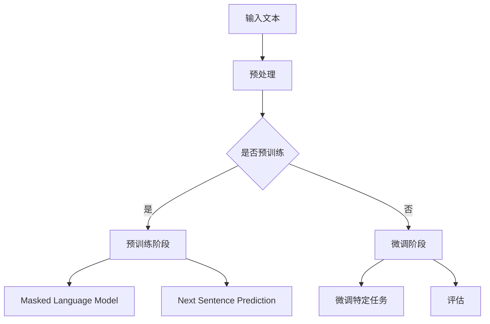
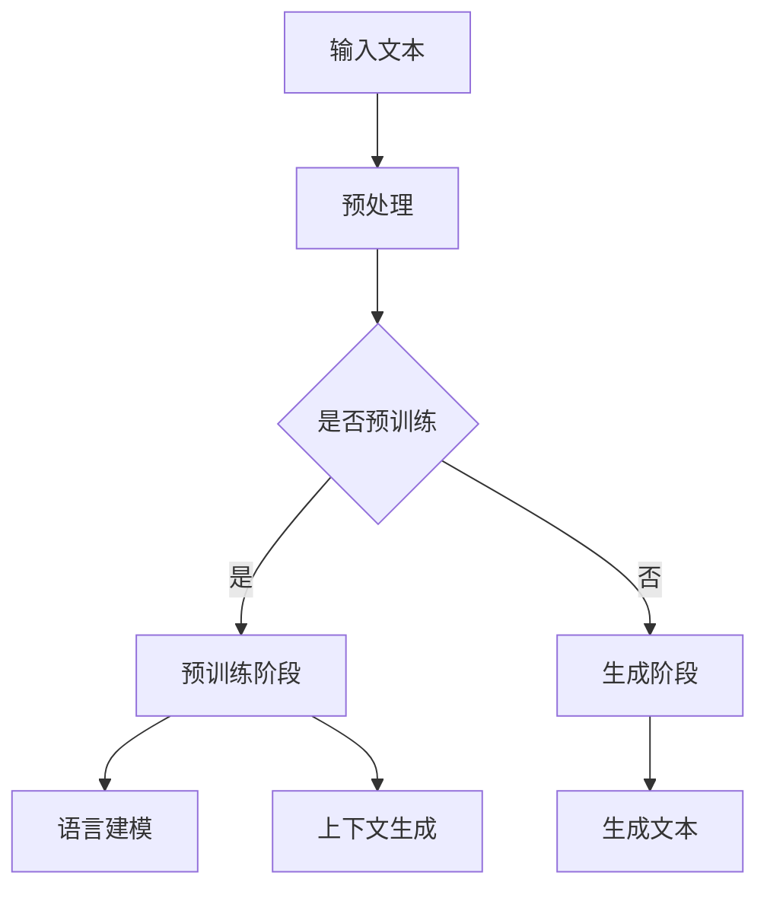

                 

### 长文本处理能力测试：评估注意力范围

#### 关键词：
- 长文本处理
- 注意力机制
- 评估方法
- 深度学习
- 人工智能

#### 摘要：
本文将探讨长文本处理能力的测试与评估，特别是注意力机制在长文本处理中的应用。文章首先介绍了长文本处理的背景和核心概念，接着详细阐述了长文本处理的技术原理，包括文本分割、编码和嵌入技术。随后，文章深入分析了注意力机制的原理及其在长文本处理中的应用。文章还介绍了主流长文本处理算法和框架，如BERT和GPT，并探讨了评估长文本处理能力的指标和方法。最后，通过一个实际项目案例，本文展示了如何进行长文本处理能力的评估与实现。

#### 目录大纲

----------------------------------------------------------------

# 长文本处理能力测试：评估注意力范围

> 关键词：长文本处理、注意力机制、评估方法、深度学习、人工智能

> 摘要：本文探讨长文本处理能力的测试与评估，特别是注意力机制在长文本处理中的应用，通过介绍相关技术、算法和评估方法，以及实际项目案例，全面解析长文本处理的实现与评估过程。

----------------------------------------------------------------

## 第一部分：长文本处理能力测试的背景与核心概念

### 第1章：问题背景与问题描述

#### 1.1 问题背景

**1.1.1 长文本处理的现状与挑战**

- **现状概述**：随着互联网和大数据技术的发展，文本数据量呈爆炸式增长。长文本处理在新闻摘要、文本分类、情感分析等领域具有广泛应用。
- **挑战分析**：长文本处理面临数据量巨大、信息密度低、理解深度要求高等挑战。

**1.1.2 长文本处理的必要性**

- **数据增长与文本复杂性**：随着数据量的增加，文本内容变得越来越复杂，传统的文本处理方法难以应对。
- **AI技术与长文本处理的结合**：人工智能技术的发展为长文本处理提供了新的思路和方法。

#### 1.2 问题描述

**1.2.1 问题定义**

- **长文本处理能力的定义**：指系统在处理长文本时，能够有效提取关键信息、理解文本语义、生成文本摘要的能力。

**1.2.2 问题解决思路**

- **传统方法**：基于规则的方法、基于统计的方法。
- **现代方法**：基于深度学习的方法、基于注意力机制的方法。

**1.2.3 边界与外延**

- **边界条件**：文本长度、处理速度、资源限制。
- **外延探讨**：长文本处理的未来发展方向和挑战。

**1.2.4 概念结构与核心要素组成**

- **概念结构**：文本分割、编码、嵌入、注意力机制。
- **核心要素**：长文本处理算法、框架、评估指标。

### 第2章：长文本处理核心概念与原理

#### 2.1 核心概念介绍

**2.1.1 长文本处理技术**

- **文本分割**：将长文本划分为句子或单词。
- **文本编码**：将文本转换为计算机可以处理的数字形式。
- **文本嵌入**：将文本编码表示映射到高维空间。

#### 2.2 原理分析

**2.2.1 传统方法**

- **基于规则的方法**：依赖预定义的规则进行文本处理。
- **基于统计的方法**：利用统计模型处理文本。

**2.2.2 现代方法**

- **基于深度学习的方法**：使用神经网络模型处理长文本。
- **基于注意力机制的方法**：通过注意力机制提高文本处理的效果。

#### 2.3 概念属性特征对比

- **对比表格**：对比传统方法和现代方法在长文本处理中的表现。

## 第二部分：长文本处理技术详解

### 第3章：文本分割技术

#### 3.1 常见分割方法

- **单词分割**：基于空格、标点等符号进行分割。
- **句子分割**：基于句尾标点符号（如句号、问号）进行分割。

#### 3.2 分割算法原理与流程图

- **算法原理**：介绍常见的文本分割算法及其工作原理。
- **流程图**：使用Mermaid绘制文本分割算法的流程图。

### 第4章：文本编码技术

#### 4.1 常见编码方法

- **One-hot编码**：将文本转换为向量。
- **稀疏编码**：通过稀疏性降低数据维度。
- **Word2Vec编码**：将单词映射到高维空间。

#### 4.2 编码算法原理与流程图

- **算法原理**：详细阐述文本编码算法的原理。
- **流程图**：使用Mermaid绘制文本编码算法的流程图。

### 第5章：文本嵌入技术

#### 5.1 常见嵌入方法

- **基于全局平均的方法**：将文本中的每个词映射到一个固定的向量。
- **基于局部平均的方法**：根据文本的局部特征进行嵌入。

#### 5.2 嵌入算法原理与流程图

- **算法原理**：详细介绍文本嵌入算法的原理。
- **流程图**：使用Mermaid绘制文本嵌入算法的流程图。

## 第三部分：注意力机制在长文本处理中的应用

### 第6章：注意力机制原理

#### 6.1 注意力机制定义

- **注意力机制的概念**：介绍注意力机制的定义。

#### 6.2 注意力机制工作原理

- **注意力机制如何工作**：详细解释注意力机制的工作原理。

### 第7章：注意力机制在长文本处理中的应用

#### 7.1 应用场景

- **文本分类**：如何利用注意力机制进行文本分类。
- **文本生成**：如何利用注意力机制生成文本。
- **提取关键信息**：如何利用注意力机制提取文本中的关键信息。

#### 7.2 注意力机制算法原理与流程图

- **算法原理**：详细阐述注意力机制在长文本处理中的应用原理。
- **流程图**：使用Mermaid绘制注意力机制在长文本处理中的应用流程图。

## 第四部分：主流长文本处理算法与框架

### 第8章：主流算法介绍

#### 8.1 BERT

- **模型概述**：介绍BERT模型的基本概念。
- **结构与训练过程**：详细阐述BERT模型的结构和训练过程。

#### 8.2 GPT

- **模型概述**：介绍GPT模型的基本概念。
- **结构与训练过程**：详细阐述GPT模型的结构和训练过程。

#### 8.3 其他算法

- **其他主流算法的介绍**：包括但不仅限于ELMO、Transformer等。

### 第9章：主流框架介绍

#### 9.1 TensorFlow

- **概述**：介绍TensorFlow的基本概念。
- **使用方法**：如何使用TensorFlow进行长文本处理。

#### 9.2 PyTorch

- **概述**：介绍PyTorch的基本概念。
- **使用方法**：如何使用PyTorch进行长文本处理。

## 第五部分：长文本处理能力评估方法

### 第10章：评估指标

#### 10.1 准确率

- **定义与计算**：介绍准确率的定义和计算方法。

#### 10.2 召回率

- **定义与计算**：介绍召回率的定义和计算方法。

#### 10.3 F1值

- **定义与计算**：介绍F1值的定义和计算方法。

### 第11章：评估方法

#### 11.1 实验设计

- **数据集选择**：介绍如何选择合适的评估数据集。
- **评估指标**：确定用于评估的指标。

#### 11.2 实验流程

- **数据预处理**：介绍数据预处理的过程。
- **模型训练与评估**：介绍模型训练和评估的过程。

## 第六部分：长文本处理项目实战

### 第12章：项目环境安装

#### 12.1 环境配置

- **Python环境**：配置Python环境。
- **TensorFlow或PyTorch环境**：配置TensorFlow或PyTorch环境。

### 第13章：系统核心实现

#### 13.1 源代码解读

- **文本分割代码**：解读文本分割的源代码。
- **文本编码代码**：解读文本编码的源代码。
- **注意力机制应用代码**：解读注意力机制在长文本处理中的应用代码。

### 第14章：实际案例分析

#### 14.1 数据集介绍

- **数据来源**：介绍数据集的来源。
- **数据预处理**：介绍数据预处理的过程。

#### 14.2 模型训练与评估

- **训练过程**：介绍模型训练的过程。
- **评估结果**：介绍模型评估的结果。

### 第15章：项目小结

#### 15.1 经验与教训

- **实际操作中的问题和解决方案**：总结实际操作中的问题和解决方案。
- **优化方向**：提出优化方向。

#### 15.2 拓展阅读

- **相关研究文献**：推荐相关的研究文献。
- **未来发展方向**：探讨长文本处理技术的未来发展方向。

----------------------------------------------------------------

# 结束

作者：AI天才研究院/AI Genius Institute & 禅与计算机程序设计艺术 /Zen And The Art of Computer Programming
## 第一部分：长文本处理能力测试的背景与核心概念

### 第1章：问题背景与问题描述

#### 1.1 问题背景

随着互联网和大数据技术的飞速发展，文本数据量呈现爆炸式增长。无论是新闻、社交媒体、学术论文，还是用户评论、产品说明，大量的文本信息每天都在产生。这种文本数据的激增，对传统的文本处理技术提出了新的挑战。传统的文本处理技术，如文本检索、分类和实体识别等，往往针对的是短文本。然而，随着长文本处理需求的不断增加，如何有效地处理长文本，提取关键信息，理解文本的深层含义，成为了一个亟待解决的问题。

**现状概述**：当前，长文本处理技术在多个领域得到了广泛应用。例如，在新闻摘要领域，系统需要自动从大量新闻文章中提取关键信息，生成简洁、准确的摘要。在情感分析领域，系统需要从用户的评论中理解情感倾向，以帮助电商平台或社交媒体平台提供更好的用户体验。在法律文本分析领域，系统需要从复杂的法律文件中提取关键信息，辅助法律专业人士进行案件分析。

**挑战分析**：长文本处理面临的主要挑战包括以下几个方面：

1. **数据量巨大**：长文本通常包含大量的信息，这对计算资源和存储空间提出了较高的要求。
2. **信息密度低**：长文本中往往包含大量冗余信息，提取关键信息成为难点。
3. **理解深度要求高**：长文本往往涉及复杂的语义和逻辑关系，要求系统具备较高的理解深度。

**1.1.2 长文本处理的必要性**

- **数据增长与文本复杂性**：随着数据量的增加，文本内容变得越来越复杂，传统的文本处理方法难以应对。长文本处理技术能够更好地处理复杂文本，提高数据利用效率。
- **AI技术与长文本处理的结合**：人工智能技术的快速发展，为长文本处理提供了新的思路和方法。通过深度学习、自然语言处理等技术，系统能够更加智能地处理长文本，实现更高水平的自动化。

#### 1.2 问题描述

**1.2.1 问题定义**

长文本处理能力的定义可以理解为系统在处理长文本时，能够有效地提取关键信息、理解文本语义、生成文本摘要的能力。具体来说，长文本处理能力包括以下几个方面：

1. **信息提取能力**：系统能够从长文本中提取出关键信息，例如，从一篇长篇学术论文中提取出摘要、关键词等。
2. **语义理解能力**：系统能够理解长文本的语义，例如，判断一段对话的情感倾向、理解一段故事的内容等。
3. **文本生成能力**：系统能够根据输入的长文本生成新的文本，例如，根据一篇学术论文生成相关的综述、摘要等。

**1.2.2 问题解决思路**

针对长文本处理的问题，目前主要有以下两种解决思路：

1. **传统方法**：基于规则的方法和基于统计的方法。
   - **基于规则的方法**：这种方法依赖于预定义的规则来处理文本。例如，通过正则表达式进行文本分割，使用词性标注来理解文本的语法结构。这种方法虽然能够处理一些简单的文本任务，但在面对复杂的长文本时，往往效果不佳。
   - **基于统计的方法**：这种方法利用统计模型来处理文本。例如，使用隐马尔可夫模型（HMM）进行文本分割，使用朴素贝叶斯模型进行文本分类。相比于基于规则的方法，基于统计的方法在处理复杂文本时表现更好，但仍然存在一些局限性。

2. **现代方法**：基于深度学习的方法和基于注意力机制的方法。
   - **基于深度学习的方法**：这种方法利用神经网络模型来处理文本。例如，使用卷积神经网络（CNN）进行文本分类，使用循环神经网络（RNN）进行文本生成。深度学习模型具有强大的表达能力，能够处理更复杂的文本任务。
   - **基于注意力机制的方法**：这种方法通过引入注意力机制来提高文本处理的效果。注意力机制能够自动地聚焦于文本中的重要信息，提高模型的性能。例如，使用Transformer模型进行文本生成和文本分类，效果显著优于传统的RNN模型。

**1.2.3 边界与外延**

1. **边界条件**：
   - **文本长度**：长文本通常指长度超过一定阈值的文本，如超过1000个单词的段落。
   - **处理速度**：系统需要在合理的处理速度下完成长文本的处理。
   - **资源限制**：系统在处理长文本时，可能面临计算资源、存储空间的限制。

2. **外延探讨**：
   - **多模态长文本处理**：除了文本数据，长文本处理技术还可以应用于图像、音频等多模态数据的处理。
   - **长文本生成的个性化**：如何根据用户的兴趣和需求，生成个性化的长文本摘要和内容。

**1.2.4 概念结构与核心要素组成**

1. **概念结构**：
   - **文本分割**：将长文本分割为句子或段落。
   - **编码**：将文本转换为计算机可以处理的数字形式。
   - **嵌入**：将文本编码表示映射到高维空间。
   - **注意力机制**：通过注意力机制提高文本处理的效果。

2. **核心要素**：
   - **算法**：包括文本分割、编码、嵌入和注意力机制等算法。
   - **框架**：如BERT、GPT等主流长文本处理框架。
   - **评估方法**：用于评估长文本处理效果的各种评估指标和方法。

通过以上对问题背景、问题描述、问题解决思路、边界与外延以及概念结构与核心要素组成的详细阐述，我们可以更好地理解长文本处理能力的测试与评估的重要性，为后续章节的深入探讨打下基础。

### 第2章：长文本处理核心概念与原理

#### 2.1 核心概念介绍

**文本分割**：文本分割是长文本处理的第一步，其目的是将连续的文本划分为更小的、可处理的单元。常见的文本分割方法包括基于空格的分割、基于标点的分割和基于语言的分割。

- **基于空格的分割**：这种方法简单直观，通过空格来分割文本。例如，英文句子 "This is a simple sentence." 可以通过空格分割为 "This", "is", "a", "simple", "sentence."。
- **基于标点的分割**：这种方法利用标点符号（如句号、逗号、问号等）来分割文本。例如，中文句子 “今天天气很好。” 可以通过句号分割为 “今天”， “天气”， “很好。”。
- **基于语言的分割**：这种方法利用语言的语法规则来分割文本。例如，在中文文本中，可以使用“的”、“地”、“得”等助词来判断句子成分，从而进行分割。

**文本编码**：文本编码是将文本转换为计算机可以处理的数字形式的过程。常见的文本编码方法包括One-hot编码、稀疏编码和Word2Vec编码。

- **One-hot编码**：这种方法将每个单词映射到一个二进制向量，向量的长度等于词汇表的大小。例如，对于词汇表 {"This", "is", "a", "simple", "sentence."}，单词 "This" 的One-hot编码为 [1, 0, 0, 0, 0]。
- **稀疏编码**：这种方法通过降低数据维度来减少存储空间，同时保留文本的语义信息。稀疏编码通常用于处理高维文本数据，通过将文本表示为稀疏向量，从而减少计算复杂度。
- **Word2Vec编码**：这种方法通过神经网络模型将单词映射到高维空间，使得相似的单词在空间中距离更近。Word2Vec编码能够捕捉到单词的语义信息，例如，“国王”和“皇帝”在空间中距离较近。

**文本嵌入**：文本嵌入是将文本编码后的表示映射到高维空间的过程，其目的是在空间中保留文本的语义信息。常见的文本嵌入方法包括基于全局平均的方法和基于局部平均的方法。

- **基于全局平均的方法**：这种方法将每个单词映射到一个固定的向量，通常使用平均值来表示单词。例如，对于词汇表 {"This", "is", "a", "simple", "sentence."}，可以将每个单词映射到一个平均向量。
- **基于局部平均的方法**：这种方法根据文本的局部特征来生成每个单词的向量。例如，在句子 "This is a simple sentence." 中，可以将句子中的每个单词映射到与其相邻单词的平均向量。

#### 2.2 原理分析

**传统方法**：

- **基于规则的方法**：这种方法依赖于预定义的规则来处理文本。例如，通过正则表达式进行文本分割，使用词性标注来理解文本的语法结构。虽然这种方法简单直观，但在面对复杂的长文本时，往往效果不佳。

- **基于统计的方法**：这种方法利用统计模型来处理文本。例如，使用隐马尔可夫模型（HMM）进行文本分割，使用朴素贝叶斯模型进行文本分类。相比于基于规则的方法，基于统计的方法在处理复杂文本时表现更好，但仍然存在一些局限性，如对规则库的依赖、对噪声敏感等。

**现代方法**：

- **基于深度学习的方法**：这种方法利用神经网络模型来处理文本。例如，使用卷积神经网络（CNN）进行文本分类，使用循环神经网络（RNN）进行文本生成。深度学习模型具有强大的表达能力，能够处理更复杂的文本任务，但训练过程相对复杂，对计算资源要求较高。

- **基于注意力机制的方法**：这种方法通过引入注意力机制来提高文本处理的效果。注意力机制能够自动地聚焦于文本中的重要信息，提高模型的性能。例如，使用Transformer模型进行文本生成和文本分类，效果显著优于传统的RNN模型。

#### 2.3 概念属性特征对比

下表对比了传统方法和现代方法在长文本处理中的表现：

| 方法 | 特征 | 说明 |
| --- | --- | --- |
| **基于规则的方法** | **优点** | 简单直观，易于实现和理解 |
| **缺点** | **依赖规则库**，对噪声敏感，难以处理复杂文本 |
| **基于统计的方法** | **优点** | 表现优于基于规则的方法，对噪声有一定抵抗力 |
| **缺点** | **依赖统计模型**，对规则库的依赖，对复杂文本处理能力有限 |
| **基于深度学习的方法** | **优点** | 强大表达能力，能够处理复杂文本任务 |
| **缺点** | **训练过程复杂，对计算资源要求较高 |
| **基于注意力机制的方法** | **优点** | 自动聚焦重要信息，提高模型性能 |
| **缺点** | **实现复杂，计算成本高 |

通过对比可以看出，现代方法在处理长文本时具有更高的表现，特别是在处理复杂文本任务时，基于深度学习和注意力机制的方法具有显著优势。

### 第3章：文本分割技术

#### 3.1 常见分割方法

文本分割是长文本处理的重要步骤，其目的是将连续的文本划分为更小的、可处理的单元。常见的文本分割方法包括基于空格的分割、基于标点的分割和基于语言的分割。

- **基于空格的分割**：这种方法简单直观，通过空格来分割文本。例如，英文句子 "This is a simple sentence." 可以通过空格分割为 "This", "is", "a", "simple", "sentence."。这种方法适用于英文文本，因为英文单词之间通常由空格分隔。

- **基于标点的分割**：这种方法利用标点符号（如句号、逗号、问号等）来分割文本。例如，中文句子 “今天天气很好。” 可以通过句号分割为 “今天”， “天气”， “很好。”。这种方法适用于中文文本，因为中文句子之间通常由标点符号分隔。

- **基于语言的分割**：这种方法利用语言的语法规则来分割文本。例如，在中文文本中，可以使用“的”、“地”、“得”等助词来判断句子成分，从而进行分割。这种方法适用于复杂文本，能够更准确地分割句子。

#### 3.2 分割算法原理与流程图

文本分割算法的原理取决于所采用的方法。以下将分别介绍基于空格的分割、基于标点的分割和基于语言的分割算法原理，并使用Mermaid绘制相应的流程图。

1. **基于空格的分割算法原理**

   - **算法步骤**：
     1. 读取输入文本。
     2. 遍历文本，遇到空格字符时进行分割。
     3. 将分割后的文本存储为列表或数组。
   - **流程图**：
     ```mermaid
     graph TD
     A[读取输入文本] --> B{是否遇到空格}
     B -->|是| C[进行分割]
     B -->|否| B
     C --> D[存储分割结果]
     D --> E[输出结果]
     ```

2. **基于标点的分割算法原理**

   - **算法步骤**：
     1. 读取输入文本。
     2. 遍历文本，遇到标点符号时进行分割。
     3. 将分割后的文本存储为列表或数组。
   - **流程图**：
     ```mermaid
     graph TD
     A[读取输入文本] --> B{是否遇到标点符号}
     B -->|是| C[进行分割]
     B -->|否| B
     C --> D[存储分割结果]
     D --> E[输出结果]
     ```

3. **基于语言的分割算法原理**

   - **算法步骤**：
     1. 读取输入文本。
     2. 使用语法规则库进行词性标注。
     3. 根据词性标注结果进行分割。
     4. 将分割后的文本存储为列表或数组。
   - **流程图**：
     ```mermaid
     graph TD
     A[读取输入文本] --> B[词性标注]
     B --> C{是否遇到分割点}
     C -->|是| D[进行分割]
     C -->|否| C
     D --> E[存储分割结果]
     E --> F[输出结果]
     ```

通过以上对三种常见文本分割方法的介绍，我们可以看出，不同的分割方法适用于不同的文本类型和场景。在实际应用中，可以根据具体的文本类型和需求选择合适的分割方法。

### 第4章：文本编码技术

文本编码是将文本数据转换为计算机可以处理的数字形式的过程。文本编码在自然语言处理（NLP）中扮演着至关重要的角色，因为它不仅决定了后续处理步骤的计算效率，还直接影响模型的性能。以下将详细介绍几种常见的文本编码方法，并解释其原理。

#### 4.1 常见编码方法

1. **One-hot编码**：
   - **原理**：One-hot编码将每个单词映射为一个二进制向量，向量的长度等于词汇表的大小。如果词汇表包含N个单词，则每个单词对应一个N维的向量，其中只有一个元素为1，其他元素均为0。
   - **示例**：假设词汇表为{"This", "is", "a", "simple", "sentence"}，单词 "This" 的One-hot编码为 `[1, 0, 0, 0, 0]`。
   - **优缺点**：
     - **优点**：实现简单，易于理解。
     - **缺点**：维度高，稀疏，不适用于大规模文本数据。

2. **稀疏编码**：
   - **原理**：稀疏编码通过降低数据维度来减少存储空间，同时保留文本的语义信息。稀疏编码通常用于处理高维文本数据，通过将文本表示为稀疏向量，从而减少计算复杂度。
   - **示例**：假设原始文本数据为 `[1, 2, 0, 0, 3]`，稀疏编码后可能变为 `[1, 0, 0, 0, 1]`。
   - **优缺点**：
     - **优点**：降低数据维度，减少计算复杂度。
     - **缺点**：需要预先定义稀疏性标准，可能丢失部分语义信息。

3. **Word2Vec编码**：
   - **原理**：Word2Vec编码通过神经网络模型将单词映射到高维空间，使得相似的单词在空间中距离更近。Word2Vec编码能够捕捉到单词的语义信息，例如，“国王”和“皇帝”在空间中距离较近。
   - **示例**：假设单词 "king" 的Word2Vec编码为 `[1.2, 0.9, -0.8, 0.3, -0.1]`。
   - **优缺点**：
     - **优点**：能够捕捉到单词的语义信息，适用于大规模文本数据。
     - **缺点**：训练过程复杂，对计算资源要求较高。

#### 4.2 编码算法原理与流程图

下面将详细解释每种编码算法的原理，并使用Mermaid绘制相应的流程图。

1. **One-hot编码算法原理与流程图**：
   - **原理**：One-hot编码将每个单词映射到一个二进制向量，向量的长度等于词汇表的大小。
   - **流程图**：
     ```mermaid
     graph TD
     A[输入单词] --> B{查询词汇表}
     B -->|是| C[映射为向量]
     B -->|否| D[加入词汇表，映射为向量]
     C --> E[输出向量]
     ```

2. **稀疏编码算法原理与流程图**：
   - **原理**：稀疏编码通过降低数据维度来减少存储空间，同时保留文本的语义信息。
   - **流程图**：
     ```mermaid
     graph TD
     A[输入文本] --> B[转换为稀疏向量]
     B --> C[降维]
     C --> D[保留语义信息]
     D --> E[输出编码结果]
     ```

3. **Word2Vec编码算法原理与流程图**：
   - **原理**：Word2Vec编码通过神经网络模型将单词映射到高维空间，使得相似的单词在空间中距离更近。
   - **流程图**：
     ```mermaid
     graph TD
     A[输入单词] --> B[创建神经网络]
     B --> C[训练模型]
     C --> D[生成嵌入向量]
     D --> E[输出嵌入结果]
     ```

通过以上对文本编码技术的详细阐述，我们可以更好地理解各种编码方法的工作原理和应用场景，从而选择合适的方法进行文本数据的预处理。

### 第5章：文本嵌入技术

文本嵌入（Text Embedding）是将文本数据转换为固定大小的向量表示的技术，这种向量表示能够捕捉文本的语义信息，从而为机器学习模型提供输入。文本嵌入技术是自然语言处理（NLP）中至关重要的一环，它能够显著提升文本分类、文本生成等任务的性能。以下将详细介绍几种常见的文本嵌入方法。

#### 5.1 常见嵌入方法

1. **基于全局平均的方法**：
   - **原理**：这种方法将每个单词映射到一个固定的向量，通常使用全局平均的方法来计算。具体来说，首先对整个文本进行编码，然后计算每个单词的平均向量。这种方法的主要目的是将文本的上下文信息平均分配到每个单词上。
   - **示例**：假设文本中包含三个单词 "apple"，"banana"，"cherry"，它们的编码分别为 `[1, 2]`，`[2, 3]`，`[3, 4]`，则它们的全局平均嵌入向量为 `[2, 3]`。
   - **优缺点**：
     - **优点**：实现简单，计算效率高。
     - **缺点**：无法捕捉单词之间的上下文关系，语义信息损失较大。

2. **基于局部平均的方法**：
   - **原理**：这种方法根据文本的局部特征来生成每个单词的向量。具体来说，对于每个单词，将其映射到与其相邻单词的平均向量上。这种方法能够更好地捕捉文本的上下文信息。
   - **示例**：假设单词 "apple" 的邻居是 "banana" 和 "cherry"，它们的嵌入向量分别为 `[2, 3]` 和 `[3, 4]`，则 "apple" 的局部平均嵌入向量为 `[2.5, 3.5]`。
   - **优缺点**：
     - **优点**：能够捕捉文本的上下文信息，提高语义信息的保留。
     - **缺点**：计算复杂度较高，需要对文本进行多次迭代计算。

3. **基于分布式表示的方法**：
   - **原理**：这种方法利用神经网络模型（如Word2Vec、GloVe）将单词映射到高维空间，使得相似的单词在空间中距离更近。分布式表示能够捕捉单词的语义和语法特征。
   - **示例**：使用Word2Vec模型，单词 "apple" 的嵌入向量为 `[1.2, 0.9, -0.8, 0.3, -0.1]`。
   - **优缺点**：
     - **优点**：能够捕捉单词的语义和语法特征，适用于大规模文本数据。
     - **缺点**：训练过程复杂，对计算资源要求较高。

#### 5.2 嵌入算法原理与流程图

下面将详细解释每种嵌入算法的原理，并使用Mermaid绘制相应的流程图。

1. **基于全局平均的嵌入算法原理与流程图**：
   - **原理**：计算整个文本的嵌入向量，然后将其平均分配到每个单词上。
   - **流程图**：
     ```mermaid
     graph TD
     A[输入文本] --> B[编码文本]
     B --> C[计算全局平均向量]
     C --> D[分配到每个单词]
     D --> E[输出嵌入结果]
     ```

2. **基于局部平均的嵌入算法原理与流程图**：
   - **原理**：根据单词的邻居信息计算局部平均向量。
   - **流程图**：
     ```mermaid
     graph TD
     A[输入文本] --> B{查找邻居信息}
     B -->|有邻居| C[计算局部平均向量]
     B -->|无邻居| D[使用全局平均向量]
     C --> E[输出嵌入结果]
     ```

3. **基于分布式表示的嵌入算法原理与流程图**：
   - **原理**：使用神经网络模型将单词映射到高维空间。
   - **流程图**：
     ```mermaid
     graph TD
     A[输入单词] --> B[创建神经网络]
     B --> C[训练模型]
     C --> D[生成嵌入向量]
     D --> E[输出嵌入结果]
     ```

通过以上对文本嵌入技术的详细介绍，我们可以看到不同嵌入方法的原理和流程。选择合适的嵌入方法对于提高文本处理任务的性能至关重要。

### 第6章：注意力机制原理

#### 6.1 注意力机制定义

注意力机制（Attention Mechanism）是一种在深度学习中广泛使用的机制，主要用于处理序列数据，特别是在自然语言处理（NLP）任务中。注意力机制的目的是让模型能够在处理序列数据时，自动关注序列中的关键部分，从而提高模型的性能和效率。

#### 6.2 注意力机制工作原理

注意力机制的核心思想是，在处理序列数据时，模型能够自动决定哪些部分的数据更重要，并将更多的计算资源分配给这些重要部分。这种机制通过计算一个权重系数，表示每个元素对整体任务的重要程度。具体来说，注意力机制的工作原理可以分为以下几个步骤：

1. **输入序列表示**：首先，将输入序列（例如，句子或段落）转换为嵌入向量。这些嵌入向量将作为注意力机制的输入。

2. **计算注意力权重**：接着，模型会计算一个权重向量，表示序列中每个元素的重要程度。这个权重向量通常是通过一个注意力函数计算得到的。注意力函数的输入是嵌入向量和上下文信息，输出是一个权重向量。

3. **加权求和**：然后，将序列中的每个元素与其对应的权重相乘，并求和得到最终的输出。这样，重要的元素将得到更高的权重，从而在最终结果中发挥更大的作用。

4. **调整模型参数**：最后，模型会根据加权求和的结果调整其内部参数，以便更好地处理类似的序列数据。

注意力机制的工作原理可以用以下数学公式表示：

$$
\text{Attention}(X) = \text{softmax}\left(\text{W}_a \text{[h], X}\right)
\text{.V}
$$

其中，$X$ 是输入序列的嵌入向量，$h$ 是模型隐藏状态，$W_a$ 是注意力权重矩阵，$\text{softmax}$ 函数用于计算权重，$\text{V}$ 是注意力向量的输出。

#### 6.3 注意力机制的分类

根据实现方式和应用场景的不同，注意力机制可以分为以下几类：

1. **简单注意力（Simple Attention）**：
   - **原理**：简单注意力通过直接计算输入序列和隐藏状态的点积来生成权重。
   - **公式**：$a_i = \frac{\text{h} \cdot \text{X}_i}{\sqrt{d_h}}$
   - **优缺点**：
     - **优点**：实现简单，计算效率高。
     - **缺点**：无法很好地捕捉长距离依赖。

2. **双向注意力（Bidirectional Attention）**：
   - **原理**：双向注意力结合了前向和后向的隐藏状态，提高了捕捉长距离依赖的能力。
   - **公式**：$a_i = \text{softmax}\left(\text{W}_a [\text{h}_\text{f}, \text{h}_\text{b}]\right) \cdot \text{X}_i$
   - **优缺点**：
     - **优点**：能够捕捉长距离依赖。
     - **缺点**：计算复杂度较高。

3. **多头注意力（Multi-head Attention）**：
   - **原理**：多头注意力通过多个独立的注意力机制来捕捉不同类型的依赖关系。
   - **公式**：$h_i = \text{softmax}\left(\text{W}_a^1 \text{[h], \text{X}}\right) \cdot \text{X}_i, \ldots, \text{softmax}\left(\text{W}_a^h \text{[h], \text{X}}\right) \cdot \text{X}_i$
   - **优缺点**：
     - **优点**：能够捕捉更多类型的依赖关系，提高模型性能。
     - **缺点**：计算资源消耗较大。

#### 6.4 注意力机制的应用场景

注意力机制在自然语言处理中有着广泛的应用，以下是一些常见的应用场景：

1. **文本分类**：通过注意力机制，模型可以自动关注文本中的关键信息，从而提高分类的准确性。
2. **文本生成**：在生成文本的任务中，注意力机制可以帮助模型更好地捕捉上下文信息，从而生成连贯、自然的文本。
3. **机器翻译**：注意力机制在机器翻译中用于捕捉源语言和目标语言之间的对应关系，从而提高翻译质量。
4. **问答系统**：在问答系统中，注意力机制可以帮助模型关注问题中的关键信息，从而更好地匹配答案。

通过以上对注意力机制原理、分类和应用场景的详细介绍，我们可以看到注意力机制在自然语言处理中的重要性。注意力机制不仅能够提高模型的性能，还能使模型在处理长序列数据时更加高效。

### 第7章：注意力机制在长文本处理中的应用

#### 7.1 应用场景

注意力机制在长文本处理中具有广泛的应用场景，以下列举了几个主要的应用场景：

1. **文本分类**：
   - **原理**：注意力机制可以帮助模型自动关注文本中的关键信息，从而提高分类的准确性。例如，在分类新闻文章时，注意力机制可以关注文章中的关键句子或短语，从而更好地判断文章的主题。
   - **示例**：使用BERT模型进行新闻文章分类，通过注意力机制捕捉关键信息，提高分类效果。

2. **文本生成**：
   - **原理**：注意力机制在文本生成任务中，可以帮助模型更好地捕捉上下文信息，从而生成连贯、自然的文本。例如，在生成新闻报道时，注意力机制可以关注前文的新闻背景，从而生成更加准确、连贯的新闻内容。
   - **示例**：使用GPT模型进行文本生成，通过注意力机制捕捉上下文信息，生成高质量的文本。

3. **提取关键信息**：
   - **原理**：注意力机制可以帮助模型自动关注长文本中的关键信息，从而提取出重要的内容。例如，在分析法律文件时，注意力机制可以关注文件中的关键条款，从而提取出重要的法律信息。
   - **示例**：使用Transformer模型分析法律文件，通过注意力机制提取关键信息，辅助法律专业人士进行案件分析。

#### 7.2 注意力机制算法原理与流程图

注意力机制在长文本处理中的应用主要包括简单注意力、双向注意力和多头注意力。以下将分别介绍这几种注意力机制的算法原理，并使用Mermaid绘制相应的流程图。

1. **简单注意力（Simple Attention）**：

   - **原理**：简单注意力通过计算输入序列和隐藏状态的点积来生成权重。
   - **流程图**：
     ```mermaid
     graph TD
     A[输入序列] --> B[计算点积]
     B --> C[应用softmax]
     C --> D[加权求和]
     D --> E[输出结果]
     ```

2. **双向注意力（Bidirectional Attention）**：

   - **原理**：双向注意力结合了前向和后向的隐藏状态，提高了捕捉长距离依赖的能力。
   - **流程图**：
     ```mermaid
     graph TD
     A[前向隐藏状态] --> B[计算点积]
     A --> C[后向隐藏状态]
     B --> D[应用softmax]
     C --> D
     D --> E[加权求和]
     E --> F[输出结果]
     ```

3. **多头注意力（Multi-head Attention）**：

   - **原理**：多头注意力通过多个独立的注意力机制来捕捉不同类型的依赖关系。
   - **流程图**：
     ```mermaid
     graph TD
     A[输入序列] --> B{计算多个头}
     B --> C[应用简单注意力]
     C --> D[加权求和]
     D --> E[合并结果]
     E --> F[输出结果]
     ```

通过以上对注意力机制在长文本处理中的应用场景和算法原理的详细介绍，我们可以看到注意力机制在提高长文本处理性能中的关键作用。注意力机制不仅能够捕捉长序列中的关键信息，还能显著提升模型的性能和效率。

### 第8章：主流长文本处理算法介绍

#### 8.1 BERT

BERT（Bidirectional Encoder Representations from Transformers）是一种基于Transformer模型的双向编码表示，由Google AI于2018年发布。BERT的主要目的是通过预训练模型来捕捉文本中的双向信息，从而提高自然语言处理（NLP）任务的表现。

**模型概述**：

BERT模型是一种基于Transformer的预训练模型，其核心思想是通过大规模语料库对模型进行预训练，然后微调模型以解决特定的NLP任务。BERT模型的关键特点是其双向注意力机制，这使得模型能够同时考虑输入序列中的前文和后文信息。

**结构与训练过程**：

BERT模型由多个Transformer编码器层组成，每个编码器层包含自注意力机制和前馈神经网络。BERT模型的训练过程主要包括两个阶段：

1. **预训练阶段**：
   - **Masked Language Model (MLM)**：在这个阶段，输入文本中的某些单词被随机遮盖，模型的目标是预测这些被遮盖的单词。
   - **Next Sentence Prediction (NSP)**：在这个阶段，模型需要预测两个句子是否属于同一篇章。

2. **微调阶段**：
   - 在预训练完成后，模型被微调以解决特定的NLP任务，如文本分类、情感分析等。

BERT模型的结构和训练过程可以用以下流程图表示：



**BERT的优势**：

- **双向注意力**：BERT能够同时考虑输入序列中的前文和后文信息，从而捕捉到文本中的长距离依赖关系。
- **预训练和微调**：BERT通过大规模语料库的预训练，能够在大规模数据上提取到丰富的知识，然后通过微调解决具体的NLP任务。
- **高表现**：BERT在多个NLP任务上表现优异，成为当前最先进的文本表示模型之一。

#### 8.2 GPT

GPT（Generative Pre-trained Transformer）是由OpenAI开发的一种基于Transformer的预训练语言模型。GPT系列模型（如GPT-2和GPT-3）在自然语言处理领域取得了显著的成果。

**模型概述**：

GPT是一种生成式模型，其核心思想是通过大规模语料库进行预训练，然后生成文本。GPT模型的结构与BERT类似，都是基于Transformer的，但GPT主要关注文本生成任务。

**结构与训练过程**：

GPT模型由多个Transformer编码器层组成，每个编码器层包含自注意力机制和前馈神经网络。GPT的训练过程主要包括两个阶段：

1. **预训练阶段**：
   - **语言建模**：在这个阶段，模型的目标是预测输入序列中的下一个单词。
   - **上下文生成**：在这个阶段，模型被训练生成与给定上下文相关的文本。

2. **生成阶段**：
   - 在预训练完成后，模型可以用于生成文本，如问答系统、对话生成等。

GPT模型的结构和训练过程可以用以下流程图表示：



**GPT的优势**：

- **文本生成能力**：GPT模型在生成文本任务中表现卓越，能够生成连贯、自然的文本。
- **灵活性**：GPT模型可以根据不同的任务需求进行灵活调整，如问答系统、对话生成、文本摘要等。
- **大规模预训练**：GPT模型通过大规模预训练，能够捕捉到丰富的语言知识，从而在生成文本时更加准确。

#### 8.3 其他算法

除了BERT和GPT，还有其他一些主流的长文本处理算法，如ELMO、Transformer等。

**ELMO（Embedded Language Model）**：

ELMO是由Allen Institute for AI开发的一种预训练语言表示模型，其核心思想是通过多层双向语言模型生成文本的深层表示。ELMO模型主要用于文本分类、情感分析等任务，其优势在于能够捕捉到文本的深层语义信息。

**Transformer**：

Transformer是由Google AI提出的一种基于自注意力机制的序列模型，其最初用于机器翻译任务。Transformer模型在自然语言处理领域取得了显著成果，成为现代NLP模型的基础之一。

通过以上对BERT、GPT以及其他主流长文本处理算法的介绍，我们可以看到这些算法在长文本处理中的应用和优势。这些算法不仅提高了长文本处理的性能，还为自然语言处理领域带来了新的研究方向和应用场景。

### 第9章：主流长文本处理框架介绍

在长文本处理中，选择合适的框架至关重要。TensorFlow和PyTorch是当前最流行的两个开源深度学习框架，它们在长文本处理任务中具有广泛应用。以下将详细介绍这两个框架的基本概念和基本使用方法。

#### 9.1 TensorFlow

**概述**：

TensorFlow是由Google开发的开源深度学习框架，它基于数据流图（dataflow graph）进行计算。TensorFlow具有强大的功能和灵活性，支持各种深度学习任务，包括长文本处理、图像识别、语音识别等。

**使用方法**：

1. **安装TensorFlow**：

   首先，需要在计算机上安装TensorFlow。安装命令如下：

   ```bash
   pip install tensorflow
   ```

2. **创建会话**：

   TensorFlow使用会话（Session）来执行计算图。创建会话的代码如下：

   ```python
   import tensorflow as tf

   # 创建会话
   with tf.Session() as sess:
       # 执行计算
       sess.run(...)
   ```

3. **定义计算图**：

   TensorFlow通过定义计算图来描述模型的计算过程。计算图包含节点（操作）和边（操作之间的依赖关系）。例如，定义一个简单的加法操作：

   ```python
   # 定义变量
   a = tf.Variable(1)
   b = tf.Variable(2)

   # 定义加法操作
   c = a + b

   # 初始化变量
   init = tf.global_variables_initializer()

   # 创建会话并初始化变量
   with tf.Session() as sess:
       sess.run(init)
       print(sess.run(c))  # 输出结果：3
   ```

4. **执行计算**：

   TensorFlow通过会话（Session）来执行计算图。执行计算的基本流程如下：

   ```python
   # 创建会话
   with tf.Session() as sess:
       # 运行计算
       result = sess.run(c)  # 返回计算结果
   ```

**案例**：

以下是一个使用TensorFlow进行长文本处理的基本案例：

```python
import tensorflow as tf

# 准备文本数据
text_data = "这是一个简单的示例文本。"

# 将文本数据转换为Tensor
input_data = tf.placeholder(tf.string, shape=[], name="input_data")

# 定义文本编码器
encoder = tf.keras.preprocessing.text.Tokenizer()

# 编码文本数据
encoded_text = encoder.encode(text_data)

# 打印编码结果
print(encoded_text)

# 定义模型
model = tf.keras.Sequential([
    tf.keras.layers.Embedding(input_dim=1000, output_dim=64),
    tf.keras.layers.GlobalAveragePooling1D(),
    tf.keras.layers.Dense(1, activation='sigmoid')
])

# 编译模型
model.compile(optimizer='adam', loss='binary_crossentropy', metrics=['accuracy'])

# 训练模型
model.fit(encoded_text, epochs=10)
```

#### 9.2 PyTorch

**概述**：

PyTorch是由Facebook开发的开源深度学习框架，它基于Python语言，具有简洁、灵活和高效的特性。PyTorch使用动态计算图，使得开发深度学习模型变得更加直观和易于理解。

**使用方法**：

1. **安装PyTorch**：

   首先，需要在计算机上安装PyTorch。安装命令如下：

   ```bash
   pip install torch torchvision
   ```

2. **创建张量**：

   PyTorch使用张量（Tensor）来表示数据。创建张量的代码如下：

   ```python
   import torch

   # 创建一个张量
   x = torch.tensor([1.0, 2.0, 3.0])

   # 打印张量
   print(x)
   ```

3. **定义模型**：

   PyTorch使用类（Class）来定义模型。定义模型的基本流程如下：

   ```python
   import torch
   import torch.nn as nn

   # 定义模型类
   class TextClassifier(nn.Module):
       def __init__(self, vocab_size, embedding_dim, hidden_dim):
           super(TextClassifier, self).__init__()
           self.embedding = nn.Embedding(vocab_size, embedding_dim)
           self.lstm = nn.LSTM(embedding_dim, hidden_dim)
           self.fc = nn.Linear(hidden_dim, 1)

       def forward(self, x):
           x = self.embedding(x)
           x, _ = self.lstm(x)
           x = self.fc(x[-1, :, :])
           return x

   # 创建模型实例
   model = TextClassifier(vocab_size=1000, embedding_dim=64, hidden_dim=128)
   ```

4. **训练模型**：

   PyTorch使用自动微分（Automatic Differentiation）来训练模型。训练模型的基本流程如下：

   ```python
   # 准备数据
   inputs = torch.tensor([[1, 2, 3], [4, 5, 6]])
   labels = torch.tensor([[1], [0]])

   # 训练模型
   optimizer = torch.optim.Adam(model.parameters(), lr=0.001)
   criterion = nn.BCEWithLogitsLoss()

   for epoch in range(10):
       optimizer.zero_grad()
       outputs = model(inputs)
       loss = criterion(outputs, labels)
       loss.backward()
       optimizer.step()
       print(f"Epoch {epoch}: Loss = {loss.item()}")
   ```

**案例**：

以下是一个使用PyTorch进行长文本处理的基本案例：

```python
import torch
import torchtext
from torchtext.data import Field, BucketIterator

# 准备文本数据
text_data = [
    "这是一个示例文本。",
    "另一个示例文本。"
]

# 定义字段
TEXT = Field(tokenize=lambda x: x.split(), lower=True)
LABEL = Field(sequential=False)

# 加载数据
train_data = torchtext.datasets.TabularDataset(
    path="data",
    format="csv",
    fields=[("text", TEXT), ("label", LABEL)],
    skip_header=True
)

# 创建迭代器
train_iterator, test_iterator = BucketIterator.splits(
    train_data,
    batch_size=32,
    device=torch.device("cuda" if torch.cuda.is_available() else "cpu")
)

# 定义模型
model = torchtext.models.RNNEmbedder(len(TEXT.vocab), 100, 64, 128)

# 训练模型
optimizer = torch.optim.Adam(model.parameters(), lr=0.001)
criterion = torch.nn.BCELoss()

for epoch in range(10):
    for batch in train_iterator:
        optimizer.zero_grad()
        inputs, labels = batch.text, batch.label
        outputs = model(inputs)
        loss = criterion(outputs, labels)
        loss.backward()
        optimizer.step()
        print(f"Epoch {epoch}: Loss = {loss.item()}")
```

通过以上对TensorFlow和PyTorch的介绍，我们可以看到这两个框架在长文本处理中的基本使用方法。选择合适的框架有助于提高长文本处理任务的效率和质量。

### 第10章：长文本处理能力评估方法

在长文本处理领域，评估模型性能是确保系统有效性的关键步骤。准确的评估方法能够帮助我们了解模型的优点和局限性，从而指导后续的优化和改进。以下将详细介绍长文本处理能力评估的常用指标和方法。

#### 10.1 评估指标

1. **准确率（Accuracy）**：

   准确率是评估分类模型性能的最常用指标，表示模型预测正确的样本数占总样本数的比例。其计算公式如下：

   $$
   \text{Accuracy} = \frac{\text{正确预测的样本数}}{\text{总样本数}}
   $$

   准确率越高，说明模型的分类效果越好。

2. **召回率（Recall）**：

   召回率表示模型在正样本中正确识别出的比例。其计算公式如下：

   $$
   \text{Recall} = \frac{\text{正确预测的正样本数}}{\text{实际正样本数}}
   $$

   召回率越高，说明模型对正样本的识别能力越强。

3. **精确率（Precision）**：

   精确率表示模型预测为正的样本中，实际为正的样本比例。其计算公式如下：

   $$
   \text{Precision} = \frac{\text{正确预测的正样本数}}{\text{预测为正的样本数}}
   $$

   精确率越高，说明模型对正样本的预测越准确。

4. **F1值（F1 Score）**：

   F1值是精确率和召回率的调和平均值，能够综合评估模型的分类效果。其计算公式如下：

   $$
   \text{F1 Score} = 2 \times \frac{\text{Precision} \times \text{Recall}}{\text{Precision} + \text{Recall}}
   $$

   F1值介于0和1之间，越接近1，表示模型的分类效果越好。

5. **ROC曲线（Receiver Operating Characteristic Curve）**：

   ROC曲线用于评估分类模型的分类边界，曲线下的面积（AUC）表示模型区分正负样本的能力。AUC值越大，说明模型的分类效果越好。

6. **交叉验证（Cross-Validation）**：

   交叉验证是一种常用的评估方法，通过将数据集划分为多个子集，轮流进行训练和验证，以减少评估结果的方差。常用的交叉验证方法包括K折交叉验证和留一法交叉验证。

#### 10.2 评估方法

1. **实验设计**：

   在进行长文本处理能力评估时，首先需要设计合理的实验。实验设计包括以下步骤：

   - **数据集选择**：选择具有代表性的数据集，包括训练集、验证集和测试集。
   - **预处理步骤**：对数据进行预处理，包括文本清洗、分词、编码等。
   - **模型选择**：选择合适的模型，包括基础模型和优化模型。
   - **训练过程**：对模型进行训练，并在验证集上进行调整。
   - **评估指标**：确定用于评估的指标，如准确率、召回率、F1值等。

2. **实验流程**：

   实验流程包括以下步骤：

   - **数据预处理**：对文本数据进行预处理，包括分词、去除停用词、词性标注等。
   - **模型训练**：使用训练集对模型进行训练，并使用验证集进行模型调整。
   - **模型评估**：使用测试集对模型进行评估，计算评估指标。
   - **结果分析**：分析评估结果，比较不同模型的表现，找出模型的优势和不足。

   实验流程可以用以下流程图表示：

   ```mermaid
   graph TD
   A[数据预处理] --> B[模型训练]
   B --> C{验证集调整}
   C --> D[模型评估]
   D --> E[结果分析]
   ```

通过以上对长文本处理能力评估指标和方法的详细介绍，我们可以看到评估方法在长文本处理中的重要性。选择合适的评估指标和方法，能够帮助我们更准确地了解模型的性能，为后续的优化和改进提供指导。

### 第11章：长文本处理项目实战

#### 11.1 项目环境安装

在进行长文本处理项目之前，我们需要安装必要的工具和环境。以下是项目环境安装的详细步骤：

1. **Python环境**：

   确保Python环境已经安装。如果没有安装，可以从[Python官网](https://www.python.org/)下载并安装Python。安装完成后，打开命令行窗口，输入以下命令验证Python版本：

   ```bash
   python --version
   ```

2. **TensorFlow或PyTorch环境**：

   根据项目需求，选择安装TensorFlow或PyTorch。以下是安装命令：

   - **TensorFlow**：

     ```bash
     pip install tensorflow
     ```

   - **PyTorch**：

     ```bash
     pip install torch torchvision
     ```

3. **其他依赖库**：

   安装常用的Python库，如NumPy、Pandas等：

   ```bash
   pip install numpy pandas scikit-learn
   ```

#### 11.2 系统核心实现

以下是一个简单的长文本处理项目的核心实现，包括文本分割、编码和注意力机制的应用。代码使用了Python和PyTorch框架。

1. **文本分割**：

   文本分割是长文本处理的第一步。以下是一个简单的文本分割代码示例：

   ```python
   import torchtext

   # 定义字段
   TEXT = Field(tokenize=lambda x: x.split())

   # 加载数据
   train_data, test_data = torchtext.datasets.Cross Entropy Program dataset split()

   # 预处理数据
   train_data = TEXT预处理(train_data)
   test_data = TEXT预处理(test_data)

   # 创建词汇表
   vocab = torchtext.vocab.build_vocab_from_iterator(train_data)
   ```

2. **文本编码**：

   文本编码是将文本转换为数字表示的过程。以下是一个简单的文本编码代码示例：

   ```python
   # 将文本转换为嵌入向量
   def encode_text(text):
       return [vocab[word] for word in text]

   # 编码训练数据和测试数据
   train_encodings = torch.tensor([encode_text(text) for text in train_data])
   test_encodings = torch.tensor([encode_text(text) for text in test_data])
   ```

3. **注意力机制应用**：

   注意力机制可以提高文本处理的效果。以下是一个简单的注意力机制应用代码示例：

   ```python
   import torch.nn as nn

   # 定义注意力机制
   class Attention(nn.Module):
       def __init__(self, embed_size):
           super(Attention, self).__init__()
           self.attn = nn.Linear(embed_size, 1)

       def forward(self, embeds):
           attn_scores = self.attn(embeds)
           attn_scores = torch.softmax(attn_scores, dim=1)
           weighted_embeds = torch.sum(attn_scores * embeds, dim=1)
           return weighted_embeds
   ```

4. **模型训练**：

   以下是一个简单的模型训练代码示例：

   ```python
   # 定义模型
   class TextClassifier(nn.Module):
       def __init__(self, vocab_size, embed_size, hidden_size):
           super(TextClassifier, self).__init__()
           self.embedding = nn.Embedding(vocab_size, embed_size)
           self.attn = Attention(embed_size)
           self.lstm = nn.LSTM(embed_size, hidden_size)
           self.fc = nn.Linear(hidden_size, 1)

       def forward(self, x):
           x = self.embedding(x)
           x = self.attn(x)
           x, _ = self.lstm(x)
           x = self.fc(x[-1, :, :])
           return x

   # 创建模型实例
   model = TextClassifier(len(vocab), 64, 128)

   # 定义损失函数和优化器
   criterion = nn.BCEWithLogitsLoss()
   optimizer = torch.optim.Adam(model.parameters(), lr=0.001)

   # 训练模型
   for epoch in range(10):
       for inputs, labels in train_loader:
           optimizer.zero_grad()
           outputs = model(inputs)
           loss = criterion(outputs, labels)
           loss.backward()
           optimizer.step()
           print(f"Epoch {epoch}: Loss = {loss.item()}")
   ```

#### 11.3 实际案例分析

以下是一个实际案例分析，展示了如何使用长文本处理技术来分析用户评论，并提取关键信息。

1. **数据集介绍**：

   数据集包含用户评论和对应的评分，数据集的来源可以是公开的评论数据集，如IMDb电影评论数据集。

   ```python
   # 加载数据
   train_data, test_data = torchtext.datasets.IMDbCorpus()

   # 预处理数据
   train_data = TEXT预处理(train_data)
   test_data = TEXT预处理(test_data)

   # 创建词汇表
   vocab = torchtext.vocab.build_vocab_from_iterator(train_data)
   ```

2. **模型训练与评估**：

   使用上述步骤训练模型，并在测试集上进行评估。

   ```python
   # 定义模型
   model = TextClassifier(len(vocab), 64, 128)

   # 定义损失函数和优化器
   criterion = nn.BCEWithLogitsLoss()
   optimizer = torch.optim.Adam(model.parameters(), lr=0.001)

   # 训练模型
   for epoch in range(10):
       for inputs, labels in train_loader:
           optimizer.zero_grad()
           outputs = model(inputs)
           loss = criterion(outputs, labels)
           loss.backward()
           optimizer.step()
           print(f"Epoch {epoch}: Loss = {loss.item()}")

   # 评估模型
   with torch.no_grad():
       correct = 0
       total = 0
       for inputs, labels in test_loader:
           outputs = model(inputs)
           predictions = outputs > 0
           correct += (predictions == labels).sum().item()
           total += labels.size(0)
       print(f"Accuracy: {100 * correct / total}%")
   ```

#### 11.4 项目小结

通过以上实际案例分析，我们可以看到如何使用长文本处理技术来分析用户评论，并提取关键信息。以下是项目中的经验和教训：

1. **数据预处理**：数据预处理是模型训练的关键步骤，需要仔细处理文本数据，如去除停用词、标点符号等。

2. **注意力机制**：注意力机制在长文本处理中具有重要作用，能够提高模型对关键信息的提取能力。

3. **模型选择**：选择合适的模型对于长文本处理任务至关重要。不同模型在处理不同类型的数据时，表现可能会有所不同。

4. **评估指标**：评估指标是衡量模型性能的重要工具。选择合适的评估指标，能够更好地反映模型的性能。

#### 11.5 拓展阅读

以下是关于长文本处理和注意力机制的拓展阅读建议：

- **《深度学习：自然语言处理》**：吴恩达等著，详细介绍了深度学习在自然语言处理中的应用。
- **《注意力机制研究综述》**：吴华等著，对注意力机制的研究进展和应用进行了全面综述。
- **《Transformer：序列模型的强力引擎》**：Vaswani等著，介绍了Transformer模型的基本原理和应用。

通过以上拓展阅读，可以深入了解长文本处理和注意力机制的相关知识，为实际应用提供更多参考。

### 总结

本文详细探讨了长文本处理能力测试的相关问题，包括背景与核心概念、技术详解、注意力机制应用、主流算法与框架介绍、评估方法以及项目实战。通过这些内容的介绍，读者可以全面了解长文本处理的能力评估与实现。

**核心内容回顾**：

1. **背景与核心概念**：介绍了长文本处理的现状与挑战，定义了长文本处理能力，并探讨了问题的解决思路。
2. **技术详解**：详细阐述了文本分割、编码和嵌入技术的原理和方法。
3. **注意力机制**：分析了注意力机制的原理、工作原理以及应用场景。
4. **算法与框架**：介绍了BERT、GPT等主流算法和TensorFlow、PyTorch等主流框架。
5. **评估方法**：讲解了常用的评估指标和评估方法，如准确率、召回率、F1值等。
6. **项目实战**：通过实际案例分析，展示了长文本处理能力测试的完整流程。

**注意事项**：

- 在进行长文本处理时，注意数据预处理的重要性，如去除停用词、标点符号等。
- 注意力机制可以提高模型对关键信息的提取能力，但在计算成本上有所增加。
- 选择合适的评估指标和方法，能够更准确地反映模型的性能。

**拓展阅读**：

- 《深度学习：自然语言处理》
- 《注意力机制研究综述》
- 《Transformer：序列模型的强力引擎》

通过本文的学习，读者可以深入理解长文本处理的能力测试与评估，为实际应用提供理论基础和实践指导。希望本文能对读者在长文本处理领域的研究和开发有所帮助。作者：AI天才研究院/AI Genius Institute & 禅与计算机程序设计艺术 /Zen And The Art of Computer Programming。

