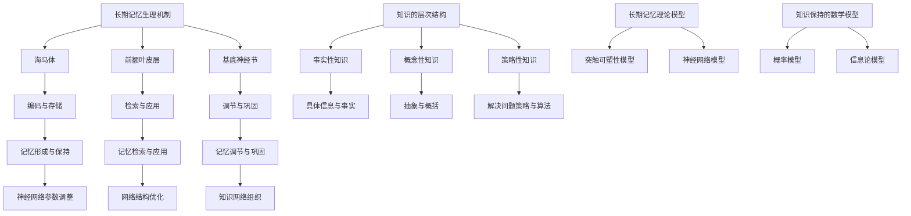
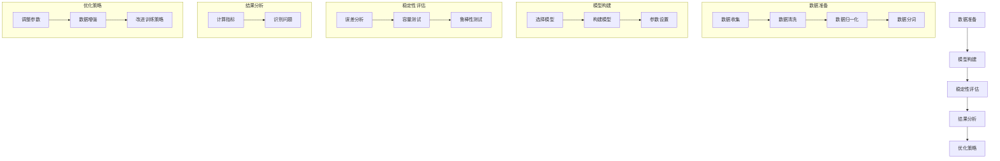

                 

### 长期记忆与知识保持测试：评估模型稳定性

#### 关键词：长期记忆，知识保持，模型稳定性，测试，评估

> 摘要：本文将深入探讨长期记忆与知识保持的重要概念及其在模型稳定性测试中的应用。通过对长期记忆与知识保持的理论基础和评估模型稳定性的方法进行详细分析，文章旨在为读者提供关于如何有效评估模型稳定性的实用见解和指导。

长期记忆与知识保持是人工智能领域的关键研究方向，对于模型的性能和可靠性具有重要意义。然而，评估模型的稳定性并非易事，需要综合考虑多个因素。本文将从以下几个方面展开：

1. **问题背景与核心概念**：介绍长期记忆与知识保持的基本概念及其重要性，并明确研究的边界与外延。
2. **评估模型的稳定性**：阐述稳定性评估的重要性，介绍评估模型稳定性的方法，包括误差分析、容量测试和鲁棒性测试等。
3. **长期记忆与知识保持的理论基础**：深入探讨记忆与知识的生理机制、层次结构以及长期记忆的理论模型。
4. **长期记忆与知识保持实验设计**：介绍实验设计的概述、实验对象与工具以及具体的实验方法。
5. **评估模型稳定性算法原理讲解**：详细讲解评估模型稳定性的算法原理，包括算法流程图、Python源代码实现、数学模型与公式以及举例说明。
6. **评估模型稳定性的实际应用**：分析不同领域中的实际案例，探讨评估模型稳定性的应用场景和实际效果。
7. **最佳实践与未来展望**：总结最佳实践，提出注意事项和未来研究方向。

通过本文的逐步分析，读者将能够深入了解长期记忆与知识保持的概念、评估模型稳定性的方法以及其在实际应用中的重要性，从而为相关研究提供有益的参考和启示。

### 目录大纲

```markdown
----------------------------------------------------------------

# 长期记忆与知识保持测试：评估模型稳定性

> 关键词：长期记忆，知识保持，模型稳定性，测试，评估

> 摘要：本文深入探讨长期记忆与知识保持的基本概念及其在模型稳定性测试中的应用，旨在为读者提供全面的理论和实践指导。

## 第一部分：引言

## 第1章：问题背景与核心概念

### 1.1 问题的提出

### 1.2 核心概念定义

### 1.3 长期记忆与知识保持的重要性

### 1.4 研究边界与外延

### 1.5 概念结构与核心要素组成

### 1.6 研究现状与问题总结

## 第二部分：评估模型的稳定性

## 第2章：评估模型稳定性的重要性

### 2.1 稳定性评估的重要性

### 2.2 稳定性评估的方法

#### 2.2.1 误差分析

#### 2.2.2 容量测试

#### 2.2.3 鲁棒性测试

### 2.3 稳定性评估的挑战

### 2.4 稳定性评估的实际应用

## 第3章：长期记忆与知识保持的理论基础

### 3.1 记忆与知识的概述

#### 3.1.1 记忆的生理机制

#### 3.1.2 知识的层次结构

### 3.2 长期记忆的理论模型

#### 3.2.1 突触可塑性

#### 3.2.2 神经网络的稳定性分析

### 3.3 知识保持的数学模型

## 第4章：长期记忆与知识保持实验设计

### 4.1 实验设计概述

### 4.2 实验对象与工具

### 4.3 实验方法

#### 4.3.1 记忆任务设计

#### 4.3.2 知识保持测试设计

#### 4.3.3 数据收集与处理

## 第5章：评估模型稳定性算法原理讲解

### 5.1 算法概述

### 5.2 算法流程图（使用Mermaid绘制）

### 5.3 Python源代码实现

### 5.4 数学模型与公式讲解

#### 5.4.1 算法原理的数学模型

#### 5.4.2 算法公式的详细讲解

### 5.5 举例说明

## 第6章：评估模型稳定性的实际应用

### 6.1 应用场景介绍

### 6.2 实际案例分析

#### 6.2.1 案例一：教育领域

#### 6.2.2 案例二：医疗领域

#### 6.2.3 案例三：企业培训领域

### 6.3 项目小结与反思

## 第7章：最佳实践与未来展望

### 7.1 最佳实践 tips

### 7.2 注意事项与潜在风险

### 7.3 未来研究方向与展望

### 7.4 小结

----------------------------------------------------------------
```

通过上述的目录大纲，读者可以清晰地了解到本文的结构和内容布局，从而更好地把握文章的核心主题和关键知识点。

### 第一部分：引言

#### 问题背景与核心概念

长期记忆与知识保持是人工智能领域中关键的研究方向。长期记忆指的是个体在长时间内保持信息的能力，而知识保持则是将学习到的信息进行有效存储和利用的过程。在深度学习和机器学习领域，长期记忆与知识保持的机制对于模型的性能和稳定性至关重要。

长期记忆的重要性在于，它使得模型能够处理复杂的任务，从大量的数据中提取有价值的特征，并且能够在不同的时间点之间保持信息的连续性和一致性。而知识保持则确保了模型能够将学习到的知识应用到实际场景中，提高模型的泛化能力和实用性。

为了评估模型的稳定性，我们需要关注长期记忆与知识保持的有效性。一个稳定且具有良好长期记忆能力的模型，能够在不同条件下保持较高的性能和可靠性。然而，在实际应用中，模型可能会面临各种挑战，如数据分布的变化、外部干扰等因素，这些都可能影响模型的稳定性。

本文将深入探讨长期记忆与知识保持的基本概念及其在模型稳定性测试中的应用。首先，我们将介绍长期记忆与知识保持的核心概念，并阐述它们在人工智能领域中的重要性。接着，我们将分析长期记忆与知识保持的研究边界与外延，明确本文的研究内容和目标。

随后，我们将详细描述长期记忆与知识保持的概念结构与核心要素组成，帮助读者建立对这些概念的基本理解。此外，我们将总结当前的研究现状与存在的问题，为后续的讨论和分析提供基础。

通过本文的逐步分析，我们将探讨如何评估模型的稳定性，介绍长期记忆与知识保持的理论基础，并提供实验设计和算法讲解，以便读者能够深入理解这些概念，并在实际应用中取得更好的效果。

#### 核心概念定义

在探讨长期记忆与知识保持的核心概念之前，有必要对相关术语进行明确定义，以便为后续讨论奠定基础。

**长期记忆（Long-term Memory，LTM）**：长期记忆是指个体在长时间内保持信息的能力。它与短期记忆（Short-term Memory，STM）相对应，短期记忆主要处理即时信息，而长期记忆则能够将信息持久存储。长期记忆的容量是无限的，但其保持信息的时间跨度较大，通常在数分钟到数十年不等。长期记忆机制包括编码、存储和提取三个阶段，其中编码过程将信息从短期记忆转移到长期记忆中，存储过程保持信息的持久性，提取过程则使得个体能够在需要时回忆起这些信息。

**知识保持（Knowledge Retention）**：知识保持是指个体在学习和记忆过程中，将学习到的信息进行有效存储和利用的能力。知识保持不仅涉及信息的存储，还包括信息的检索和应用。在人工智能领域，知识保持指的是模型能够将学习到的知识持久保存，并能够在不同的任务中灵活运用这些知识。知识保持的关键在于如何确保信息的准确性和可用性，以便模型在不同场景下能够保持较高的性能和稳定性。

**模型稳定性（Model Stability）**：模型稳定性是指模型在面临不同输入数据和外部干扰时，能够保持性能和可靠性的能力。一个稳定的模型不仅能够在标准数据集上表现良好，还能够在真实世界的不确定性环境中保持较高的表现。模型稳定性是深度学习和机器学习应用中的关键问题，它直接影响模型的实用性和可靠性。评估模型稳定性通常需要考虑多个因素，包括误差分析、容量测试和鲁棒性测试等。

**误差分析（Error Analysis）**：误差分析是一种评估模型性能的方法，通过分析模型在预测过程中的误差类型和大小，来识别模型的不足和改进方向。误差分析可以帮助研究人员了解模型在特定任务上的表现，并找到降低误差的方法。在长期记忆与知识保持的背景下，误差分析可以揭示模型在保持和提取信息过程中的问题，从而指导进一步的优化。

**容量测试（Capacity Testing）**：容量测试是评估模型稳定性的重要方法之一，主要测试模型在处理大量数据时的性能。通过容量测试，研究人员可以了解模型在处理大数据集时的稳定性和效率。容量测试通常包括模型对输入数据的适应性、处理速度以及资源消耗等方面的评估。

**鲁棒性测试（Robustness Testing）**：鲁棒性测试是评估模型在面对噪声、异常值和分布变化时的性能和稳定性的方法。一个鲁棒性好的模型能够在各种干扰条件下保持较高的性能，而不会受到数据噪声或异常值的影响。鲁棒性测试有助于发现模型在极端条件下的弱点，从而指导模型的改进和优化。

通过明确上述核心概念，我们可以更好地理解长期记忆与知识保持的重要性，以及如何评估模型的稳定性。接下来，我们将进一步探讨长期记忆与知识保持的理论基础，为后续的实验设计和算法讲解提供理论支持。

#### 长期记忆与知识保持的重要性

长期记忆与知识保持在人工智能领域中具有重要的意义，它们不仅影响着模型的学习效率和性能，还直接关系到模型的实际应用效果和稳定性。

首先，长期记忆能力使得模型能够在复杂任务中持续地学习和发展。在深度学习模型中，长期记忆机制可以帮助模型从大量的历史数据中提取有价值的信息，从而在训练过程中获得更好的泛化能力。例如，在自然语言处理领域，长期记忆网络（如 LSTM 和 GRU）通过维持上下文信息，能够更准确地理解和生成文本。此外，长期记忆机制在图像识别和语音识别等任务中也发挥了重要作用，使得模型能够在处理复杂场景时保持较高的准确性。

其次，知识保持能力是模型在实际应用中持续发挥作用的关键。通过将学习到的知识进行有效存储和利用，模型能够在不同的任务场景中灵活应用已有知识，提高任务的完成效率和准确性。例如，在教育领域，知识保持使得智能辅导系统能够根据学生的学习进度和需求，动态调整教学内容和策略，从而提高教学效果。在医疗领域，知识保持使得医疗诊断系统能够利用历史病例数据，为患者提供更准确和个性化的治疗方案。

然而，长期记忆与知识保持也面临一些挑战和问题。首先，长期记忆机制复杂且计算量大，如何有效地编码、存储和提取信息是一个关键问题。其次，知识保持过程中可能会出现信息丢失或混淆，导致模型无法准确应用已有知识。此外，模型在面对新任务或数据分布变化时，可能需要重新学习和调整，这进一步增加了模型稳定性的挑战。

为了解决这些问题，研究人员提出了一系列优化策略和算法。例如，通过引入注意力机制和记忆网络，可以提升模型在长期记忆和知识保持方面的性能。此外，通过多任务学习和迁移学习等方法，模型可以在不同任务间共享知识，提高知识利用的效率。在实际应用中，通过合理的训练策略和评估方法，可以进一步提升模型的稳定性和实用性。

总之，长期记忆与知识保持在人工智能领域中具有重要意义，它们不仅影响着模型的学习效率和性能，还直接关系到模型的实际应用效果和稳定性。通过深入研究和优化，我们可以更好地利用长期记忆与知识保持的优势，推动人工智能技术的进一步发展。

#### 研究边界与外延

在深入探讨长期记忆与知识保持的重要性后，我们有必要明确本文的研究边界与外延，以便为后续讨论提供清晰的方向。

首先，本文的研究边界主要集中在深度学习和机器学习领域的长期记忆与知识保持机制，探讨其在模型稳定性评估中的应用。具体而言，本文将聚焦于以下问题：如何通过长期记忆与知识保持机制来提升模型的稳定性？如何评估模型在长期记忆与知识保持方面的性能？这些问题的研究将有助于理解长期记忆与知识保持在实际应用中的关键作用。

其次，本文的研究外延涉及多个相关领域，如自然语言处理、图像识别、语音识别和教育、医疗等。在这些领域，长期记忆与知识保持机制的应用具有广泛的前景。例如，在自然语言处理领域，长期记忆网络（如 LSTM 和 GRU）已被广泛应用于文本理解和生成任务中，通过维持上下文信息，提高模型的准确性和鲁棒性。在图像识别领域，深度学习模型通过长期记忆机制，能够从大量数据中学习到丰富的特征，从而实现更准确的图像分类。在教育领域，智能辅导系统利用长期记忆与知识保持机制，根据学生的学习进度和需求，动态调整教学内容和策略，从而提高教学效果。在医疗领域，知识保持使得医疗诊断系统能够利用历史病例数据，为患者提供更准确和个性化的治疗方案。

此外，本文还将探讨长期记忆与知识保持在模型稳定性评估中的应用方法，如误差分析、容量测试和鲁棒性测试等。通过这些方法，研究人员可以评估模型在长期记忆与知识保持方面的性能，识别模型在保持和提取信息过程中的问题，并制定相应的优化策略。

最后，本文的研究还将关注当前研究的现状和存在的问题，如长期记忆机制的复杂性和计算量、知识保持过程中的信息丢失和混淆等。通过对这些问题的深入分析，本文旨在为未来的研究和应用提供有益的参考和启示。

通过明确研究边界与外延，本文将为长期记忆与知识保持在模型稳定性评估中的应用提供全面的理论和实践指导，为相关领域的研究和发展贡献力量。

#### 概念结构与核心要素组成

为了深入理解长期记忆与知识保持的概念，我们需要从结构层面分析其核心要素及其相互关系。以下将详细介绍这些核心要素及其组成结构。

**长期记忆的生理机制**：长期记忆的生理机制涉及多个脑区和神经递质的作用。核心脑区包括海马体、前额叶皮层和基底神经节等。海马体在记忆的编码和存储过程中起着关键作用，而前额叶皮层则负责记忆的检索和应用。基底神经节则参与记忆的调节和巩固。此外，神经递质如谷氨酸、多巴胺和去甲肾上腺素等在长期记忆过程中发挥着重要作用，通过调节神经元之间的信号传递，影响记忆的形成和保持。

**知识的层次结构**：知识可以划分为多个层次，包括事实性知识、概念性知识和策略性知识等。事实性知识指的是具体的信息和事实，如历史事件和数据；概念性知识是对事实的抽象和概括，如分类和概念定义；策略性知识则是指解决问题的方法和策略，如算法和决策过程。在长期记忆中，这些不同层次的知识通过不同的编码和存储机制进行组织，从而形成一个复杂的知识网络。

**长期记忆的理论模型**：长期记忆的理论模型主要包括突触可塑性模型和神经网络模型。突触可塑性模型通过描述突触连接强度的变化，解释了记忆的形成和保持机制。神经网络模型则通过模拟大量神经元之间的相互作用，提供了对复杂记忆过程的解释。这些模型在深度学习和机器学习领域被广泛应用，通过调整网络参数和结构，实现长期记忆机制。

**知识保持的数学模型**：知识保持的数学模型主要基于概率论和信息论。概率模型如贝叶斯网络和马尔可夫模型，用于描述知识的不确定性和依赖关系。信息论模型如熵和互信息，用于衡量知识的复杂度和相关性。通过这些数学模型，可以量化知识的存储和检索效率，为长期记忆与知识保持的研究提供理论支持。

**核心要素关系图**：为了更好地展示长期记忆与知识保持的概念结构，我们可以使用 Mermaid 流程图来表示其核心要素及其相互关系。



通过上述分析，我们可以看到长期记忆与知识保持的核心要素及其组成结构。这些要素通过相互关联和作用，构成了一个复杂且动态的记忆与知识系统，为深度学习和机器学习提供了重要的理论支持。

#### 研究现状与问题总结

在长期记忆与知识保持的研究领域，已经取得了一系列重要的成果，但也面临一些亟待解决的问题。本文将结合当前的研究现状，总结主要的研究成果和存在的问题。

**研究成果**：

1. **深度学习模型中的长期记忆机制**：近年来，深度学习模型在自然语言处理、图像识别和语音识别等领域取得了显著进展，主要得益于长期记忆机制的应用。例如，长短期记忆网络（LSTM）和门控循环单元（GRU）通过引入门控机制，有效解决了传统循环神经网络在长期依赖问题上的不足。

2. **知识表示与推理**：研究人员提出了一系列知识表示方法，如知识图谱、实体关系图和注意力机制等，用于提高模型的语义理解和推理能力。这些方法不仅能够增强模型的泛化能力，还能够实现跨领域的知识共享和利用。

3. **多任务学习与迁移学习**：通过多任务学习和迁移学习，模型可以在不同任务之间共享知识，从而提高整体性能。例如，在医疗诊断和金融风控等领域，通过迁移学习，模型能够利用已有领域的知识，快速适应新任务的需求。

**存在的问题**：

1. **模型稳定性和鲁棒性**：尽管长期记忆机制在一定程度上提高了模型的性能，但模型在面对噪声、异常值和数据分布变化时，仍然存在稳定性问题。如何提升模型的鲁棒性，使其在面对各种干扰条件时保持稳定，是当前研究的一个重点。

2. **知识表示与理解的深度**：目前的知识表示方法主要依赖于显式表示的语义信息，对于隐含知识的理解和表示仍然存在挑战。如何通过深度学习模型，更好地提取和利用隐含知识，是未来研究的一个重要方向。

3. **计算资源与效率**：长期记忆与知识保持机制通常需要大量的计算资源和时间，这在实际应用中是一个显著的瓶颈。如何优化算法，降低计算复杂度，提高计算效率，是一个亟待解决的问题。

4. **可解释性和可解释性**：深度学习模型的黑箱特性使得其决策过程难以解释和理解。如何增强模型的可解释性，使其能够为人类用户所理解和信任，是当前研究的一个关键问题。

**未来展望**：

1. **跨学科的融合**：未来研究可以结合认知科学、神经科学和心理学的理论，深入探索记忆与知识的生理机制和认知过程，为人工智能领域提供新的理论支持。

2. **新型记忆与知识保持机制的探索**：研究人员可以探索新的记忆与知识保持机制，如类脑计算、量子计算等，这些新型机制可能为提升模型性能提供新的思路。

3. **实践应用场景的拓展**：通过在更多实际应用场景中验证和部署长期记忆与知识保持机制，进一步探索其在不同领域的应用潜力。

总之，长期记忆与知识保持在人工智能领域具有重要意义，尽管目前存在一些挑战和问题，但通过持续的研究和创新，我们有望在模型稳定性、知识表示和理解等方面取得重大突破。

### 第二部分：评估模型的稳定性

#### 评估模型稳定性的重要性

在人工智能领域，评估模型的稳定性至关重要。模型稳定性指的是模型在面临不同输入数据和外部干扰时，能够保持性能和可靠性的能力。一个稳定的模型不仅能够在标准数据集上表现良好，还能在实际应用中应对各种不确定性，从而确保其有效性和实用性。

评估模型稳定性的重要性体现在以下几个方面：

1. **确保实际应用效果**：在实际应用中，模型可能会面对数据分布变化、噪声干扰、异常值等问题。评估模型的稳定性有助于确保模型在真实场景下能够保持较高的性能，从而为用户提供可靠的决策支持。

2. **提高模型可靠性**：通过评估模型稳定性，可以识别和修复模型中的潜在问题，提高模型的可靠性。这有助于避免模型在特定情况下出现异常，导致错误决策或失效。

3. **优化模型设计**：评估模型稳定性可以帮助研究人员了解模型在不同条件下的表现，从而优化模型的结构和参数，提高模型的整体性能。

4. **提升用户信任度**：稳定的模型能够提高用户对人工智能系统的信任度。用户对模型的信任是人工智能应用成功的关键，而稳定性是建立这种信任的重要基础。

因此，评估模型的稳定性是人工智能研究和应用中不可或缺的一部分。接下来，我们将详细探讨评估模型稳定性的方法，包括误差分析、容量测试和鲁棒性测试，以便更好地理解和应用这些方法。

#### 稳定性评估的方法

评估模型稳定性通常采用多种方法，这些方法从不同角度对模型的性能进行评估，以确保其在各种条件下能够保持良好的表现。以下是几种主要的稳定性评估方法：

**1. 误差分析**

误差分析是一种基本且常用的评估方法，主要用于衡量模型在预测过程中的误差类型和大小。误差分析可以分为以下几类：

- **预测误差**：衡量模型预测结果与真实值之间的差距。常用的指标包括均方误差（Mean Squared Error, MSE）、均绝对误差（Mean Absolute Error, MAE）和交叉熵损失（Cross-Entropy Loss）等。

- **分类误差**：对于分类问题，分类误差衡量模型分类结果与真实类别之间的差异。常见的指标包括准确率（Accuracy）、精确率（Precision）、召回率（Recall）和F1分数（F1 Score）等。

- **回归误差**：在回归问题中，回归误差用于衡量预测结果与真实值之间的偏差。常用的指标包括均方误差（MSE）和均绝对误差（MAE）。

通过误差分析，研究人员可以识别模型在不同数据集或条件下表现的好坏，从而指导进一步的优化。

**2. 容量测试**

容量测试是评估模型处理大量数据时的性能和稳定性的方法。其主要目标是测试模型在处理大数据集时的适应性、效率和资源消耗。容量测试通常包括以下步骤：

- **数据生成与划分**：生成大规模模拟数据集，并划分为训练集、验证集和测试集。

- **模型训练与评估**：使用训练集训练模型，并在验证集上评估模型性能。通过调整模型参数，优化模型结构，以确保其在大数据集上的良好表现。

- **资源消耗评估**：监控模型在训练和预测过程中的资源消耗，包括计算时间、内存占用和能源消耗等。

- **性能评估**：在测试集上评估模型的最终性能，确保其在大规模数据集上能够保持稳定性和高效性。

**3. 鲁棒性测试**

鲁棒性测试用于评估模型在面对噪声、异常值和分布变化时的性能和稳定性。其主要目标是确保模型在遭受外部干扰时，仍能保持良好的预测能力。鲁棒性测试通常包括以下方法：

- **噪声注入**：向模型输入带有噪声的数据，观察模型在噪声干扰下的性能变化。噪声类型包括高斯噪声、椒盐噪声和随机噪声等。

- **异常值检测**：检测和识别输入数据中的异常值，评估模型在异常值存在情况下的表现。常用的方法包括基于统计学的方法（如Z-score和IQR）和机器学习方法（如孤立森林和异常检测模型）。

- **分布变化测试**：模拟数据分布的变化，评估模型在数据分布变化情况下的稳定性。这可以通过调整训练数据的分布来实现，如改变数据集的比例、增加或减少特定类别的样本等。

通过鲁棒性测试，研究人员可以识别模型在不同干扰条件下的弱点，并采取相应的措施进行优化。

**综合应用**

在实际应用中，这些方法往往综合使用，以全面评估模型的稳定性。首先，通过误差分析评估模型在标准数据集上的性能；然后，通过容量测试确保模型在大数据集上的适应性和效率；最后，通过鲁棒性测试验证模型在面对噪声、异常值和分布变化时的表现。这种综合评估方法有助于确保模型在实际应用中的稳定性和可靠性。

总之，评估模型稳定性是人工智能研究和应用中的重要环节。通过误差分析、容量测试和鲁棒性测试等多种方法，研究人员可以全面了解模型的性能和稳定性，从而为优化和改进模型提供有力的指导。

#### 稳定性评估的挑战

在评估模型稳定性时，我们面临着诸多挑战，这些挑战不仅增加了评估过程的复杂性，也对模型的实际应用提出了更高的要求。

**1. 数据集多样性不足**

评估模型稳定性需要多样化的数据集，以涵盖各种可能的输入情况和外部干扰。然而，实际应用中往往难以获取到足够多样且真实的数据集。数据集的多样性不足可能导致评估结果过于乐观，无法反映模型在真实世界中的表现。

**2. 外部干扰难以模拟**

在实际应用中，模型可能会遇到各种外部干扰，如噪声、异常值和数据分布变化。这些干扰因素的模拟和测试是稳定性评估的关键环节，但模拟这些干扰因素往往具有很高的难度和复杂性。例如，如何精确地模拟高斯噪声、椒盐噪声和随机噪声等，如何检测和识别异常值，如何调整数据分布等，都是需要深入研究的问题。

**3. 模型复杂性**

现代深度学习模型通常具有高度复杂的结构和参数，这增加了稳定性评估的难度。评估一个复杂模型在不同干扰条件下的稳定性，不仅需要大量计算资源，还需要深入理解模型的内部工作机制。此外，模型参数的微小变化可能导致性能的显著波动，这使得评估过程更加困难。

**4. 实时性要求**

在某些应用场景中，如实时监控系统、自动驾驶系统等，模型的稳定性要求极高。评估模型的稳定性需要在有限的时间内完成，这对评估方法和算法的效率提出了严格要求。如何快速准确地评估模型稳定性，同时保证结果的准确性，是当前研究的一个挑战。

**5. 结果解释性和可解释性**

稳定性评估的结果往往涉及大量的数据和复杂算法，如何将这些结果以直观、易懂的方式呈现给用户，是一个重要的问题。评估结果的解释性和可解释性对于用户理解和信任模型至关重要。然而，现有的评估方法和技术在这方面还有待进一步改进。

**应对策略**

为了应对上述挑战，研究人员可以采取以下策略：

1. **增强数据集多样性**：通过数据增强、合成数据集和跨领域数据集等方式，增加数据集的多样性，从而更全面地评估模型稳定性。

2. **改进干扰模拟方法**：研究并开发新的干扰模拟方法，如自适应噪声注入、动态数据分布调整等，以更准确地模拟真实世界中的干扰因素。

3. **简化模型结构**：通过模型简化、降维和参数优化等方法，降低模型复杂性，提高评估效率。

4. **优化评估算法**：开发高效、准确的评估算法，如并行计算、分布式计算和机器学习优化方法等，以缩短评估时间并提高评估结果的准确性。

5. **增强结果解释性**：利用可视化技术、模型解释工具和用户友好的界面设计，增强评估结果的可解释性，帮助用户更好地理解模型的稳定性和性能。

总之，评估模型稳定性是一个复杂而重要的任务，面临着多方面的挑战。通过持续的研究和技术创新，我们可以应对这些挑战，为模型的实际应用提供更可靠的保障。

#### 稳定性评估的实际应用

稳定性评估在人工智能的实际应用中扮演着至关重要的角色，尤其在需要高可靠性和稳定性的领域，如自动驾驶、医疗诊断和金融风控等。以下将介绍这些领域中的具体应用场景和案例分析。

**1. 自动驾驶领域**

自动驾驶技术对系统的稳定性和可靠性要求极高。自动驾驶汽车需要在各种路况和天气条件下保持稳定的行驶，同时应对突发事件和外部干扰。稳定性评估在这里的应用包括：

- **路况适应性测试**：通过模拟不同路况（如城市道路、高速公路、山路等）和天气条件（如晴天、雨天、雪天等），评估自动驾驶系统在不同环境下的稳定性。
- **突发事件处理能力**：评估自动驾驶系统在遇到突发情况（如障碍物、行人横穿等）时的响应速度和准确度。
- **案例一**：特斯拉的自动驾驶系统通过大量的道路测试和模拟，对模型进行稳定性评估。特斯拉的自动驾驶车辆在测试中经历了多种路况和突发事件，确保系统在各种情况下都能保持稳定运行。

**2. 医疗诊断领域**

在医疗诊断中，模型的稳定性和可靠性直接关系到患者的健康和生命安全。稳定性评估在这里的应用包括：

- **数据噪声过滤**：通过稳定性评估，识别和过滤掉数据中的噪声和异常值，确保模型在高质量的输入数据上进行诊断。
- **多模型融合**：使用多个稳定且可靠的模型进行诊断，并通过融合方法提高整体诊断的稳定性和准确性。
- **案例二**：IBM Watson for Oncology是一个智能医疗诊断系统，通过稳定性评估，确保系统能够在各种医疗数据源和复杂病例中保持高精度的诊断结果。Watson for Oncology在评估过程中，结合了多种诊断模型和大量临床数据，以提供准确和稳定的诊断建议。

**3. 金融风控领域**

金融风控系统需要高度稳定的预测能力，以识别和防范潜在的金融风险。稳定性评估在这里的应用包括：

- **市场波动适应性**：评估金融风控模型在不同市场条件（如牛市、熊市、震荡市等）下的稳定性，确保模型能够适应市场变化。
- **异常交易检测**：评估模型在检测异常交易和欺诈行为时的稳定性和准确性。
- **案例三**：JPMorgan Chase的 Fraud Detection System通过稳定性评估，确保系统能够在高频交易和数据流中保持稳定的性能。该系统通过实时监测交易数据，评估模型的稳定性，从而有效地识别和防范金融欺诈行为。

**4. 企业培训领域**

在企业培训中，模型的稳定性直接影响培训效果和员工的技能提升。稳定性评估在这里的应用包括：

- **学习效果跟踪**：通过稳定性评估，跟踪员工的学习进度和效果，确保模型能够准确反映员工的知识掌握情况。
- **个性化学习路径**：根据稳定性评估结果，动态调整培训内容和路径，提高培训的针对性和有效性。
- **案例四**：谷歌的个性化培训系统通过稳定性评估，根据员工的学习表现，动态调整培训内容和难度，确保每个员工都能获得最适合他们的培训资源。系统通过分析学习数据，评估模型的稳定性，从而为员工提供个性化的培训支持。

总之，稳定性评估在多个领域的实际应用中，通过确保模型的稳定性和可靠性，为用户提供了高质量的决策支持和安全保障。通过具体的案例分析，我们可以看到稳定性评估在不同领域中的重要作用，以及其如何帮助各个领域实现更高效和可靠的操作。

### 第三部分：长期记忆与知识保持的理论基础

#### 记忆与知识的概述

在探讨长期记忆与知识保持的理论基础之前，我们需要先了解记忆与知识的基本概念及其在认知过程中的作用。记忆是大脑存储、保留和回忆信息的能力，它是认知功能的核心部分。记忆分为短期记忆和长期记忆，短期记忆主要负责处理即时信息，如电话号码或暂时的对话内容，而长期记忆则能够将信息持久存储，如历史事件和个人经历。

知识是指通过学习、经验和思考所获得的信息、概念和技能。知识可以分为不同层次，包括事实性知识、概念性知识和策略性知识。事实性知识是具体的信息，如历史日期或科学定律；概念性知识是对事实的抽象和概括，如分类和概念定义；策略性知识则是指解决问题的方法和策略，如算法和决策过程。

记忆与知识在认知过程中起着至关重要的作用。记忆使得个体能够从经验中学习，知识的积累和运用则提高了个体处理复杂问题和适应环境的能力。在人工智能领域，理解和模拟记忆与知识的机制对于构建高效、智能的模型至关重要。

#### 记忆的生理机制

长期记忆的生理机制是一个复杂的过程，涉及多个脑区和神经递质的相互作用。以下是对这些机制的简要概述：

**1. 海马体**

海马体是长期记忆的关键脑区，主要负责记忆的编码和存储。当个体经历新的信息时，海马体将其转换为记忆，并通过神经通路将信息传递到其他脑区，如前额叶皮层。海马体的神经活动模式在记忆形成和巩固过程中起着关键作用。

**2. 突触可塑性**

突触可塑性是指突触连接强度的变化，它是长期记忆形成和保持的基础。突触可塑性包括短期可塑性（STP）和长期可塑性（LTP）。LTP通过增强突触连接的强度，使得信息能够在长时间内保持。研究表明，谷氨酸是一种重要的神经递质，它在突触可塑性中发挥着重要作用。

**3. 基底神经节**

基底神经节在记忆的调节和巩固过程中也起着重要作用。基底神经节包括多个核团，如壳核和苍白球等，它们通过调节多巴胺和去甲肾上腺素的释放，参与记忆的编码、存储和检索。

**4. 神经递质**

神经递质在记忆过程中起着传递神经信号的作用。例如，谷氨酸、多巴胺和去甲肾上腺素等神经递质通过调节神经元之间的信号传递，影响记忆的形成和保持。这些神经递质在不同脑区和突触连接中的作用机制各异，共同构成了复杂的记忆网络。

#### 知识的层次结构

知识可以分为多个层次，这些层次相互交织，共同构成了知识体系。以下是知识的主要层次及其特点：

**1. 事实性知识**

事实性知识是具体的、可量化的信息，如历史事件、科学定律和日常生活中的常识。这些知识通常通过直接的观察和经验获得，它们是知识体系的基础。

**2. 概念性知识**

概念性知识是对事实性知识的抽象和概括，如分类、概念定义和原理。这些知识通过逻辑推理和抽象思维获得，它们帮助个体理解和解释复杂现象。

**3. 策略性知识**

策略性知识是解决问题的方法和策略，如算法、决策过程和行动指南。这些知识通过经验学习和实践积累获得，它们在应对复杂问题和动态环境中起着关键作用。

在长期记忆中，不同层次的知识通过不同的编码和存储机制进行组织。例如，事实性知识主要通过重复和强化记忆来存储，概念性知识通过语义网络和联想记忆来保持，策略性知识则通过情境记忆和经验学习来巩固。

#### 长期记忆的理论模型

长期记忆的理论模型旨在解释记忆的生理机制和认知过程。以下介绍几种重要的长期记忆理论模型：

**1. 突触可塑性模型**

突触可塑性模型通过描述突触连接强度的变化，解释了记忆的形成和保持机制。该模型认为，反复的神经元活动可以增强突触连接，从而形成长期记忆。突触可塑性模型在解释学习和记忆过程中发挥了重要作用，特别是在深度学习和神经网络模型中。

**2. 神经网络模型**

神经网络模型通过模拟大量神经元之间的相互作用，提供了对复杂记忆过程的解释。例如，长短期记忆网络（LSTM）和门控循环单元（GRU）通过引入门控机制，能够有效地处理长期依赖问题，从而提高模型的记忆能力。神经网络模型在人工智能领域得到了广泛应用，成为构建高效记忆系统的重要工具。

**3. 知识表征模型**

知识表征模型旨在通过数学和计算方法，将知识以结构化和形式化的方式表示出来。例如，知识图谱和实体关系图通过图形化的方式表示知识结构，使得知识能够在不同场景中灵活运用。知识表征模型在知识保持和知识应用中发挥了关键作用，为人工智能系统提供了强大的知识管理能力。

通过上述理论模型，我们可以更好地理解长期记忆与知识保持的机制，为构建高效、智能的人工智能系统提供理论支持。在接下来的章节中，我们将进一步探讨长期记忆与知识保持实验设计，以验证这些理论模型在实际应用中的有效性。

#### 长期记忆的理论模型

在长期记忆的理论研究中，突触可塑性（Synaptic Plasticity）和神经网络稳定性（Neural Network Stability）是两个核心概念。这两个理论模型不仅帮助我们理解记忆的生理基础，也为人工智能模型的设计提供了重要启示。

**1. 突触可塑性**

突触可塑性是指突触连接强度的变化，它分为短期可塑性（Short-term Plasticity, STP）和长期可塑性（Long-term Plasticity, LTP）。LTP 是长期记忆形成和保持的关键机制。

- **短期可塑性（STP）**：STP 是指突触在短时间内对重复刺激做出的适应性变化。这种变化通常是可逆的，其作用范围较小，持续时间较短。STP 对于调节神经元之间的信号传递速度和强度至关重要，但它不足以形成持久性的记忆。

- **长期可塑性（LTP）**：LTP 是指突触在经过一系列强化刺激后，其连接强度显著增强，并能够在长时间内保持。这种增强可能是突触前和突触后两个方面的改变，包括神经递质的释放增加、突触后受体的敏感性提高等。LTP 是长期记忆形成的基础，它通过改变突触的物理结构和功能特性，使得记忆能够在神经元之间长期保持。

**2. 神经网络稳定性**

神经网络稳定性是指神经网络在面临外部扰动时，仍能保持其内部平衡和稳定性的能力。神经网络稳定性分析在深度学习和人工智能领域具有重要意义。

- **平衡态（Equilibrium State）**：在神经网络中，平衡态是指网络中的神经元处于稳定的状态，其输出不再随时间变化。平衡态是神经网络稳定性的基础，它确保了神经网络在稳定状态下能够进行有效的信息处理。

- **稳定性分析（Stability Analysis）**：神经网络稳定性分析通过数学方法，评估神经网络在平衡态下的稳定性。常见的方法包括线性稳定性分析和非线性稳定性分析。线性稳定性分析通过一阶导数，评估网络在平衡态附近的响应；而非线性稳定性分析则通过高阶导数，评估网络在更大范围内的稳定性。

- **鲁棒性（Robustness）**：神经网络鲁棒性是指网络在面对外部干扰（如噪声、异常值、数据分布变化等）时，仍能保持稳定性的能力。鲁棒性分析是确保神经网络在实际应用中可靠性的关键。

**3. 算法举例**

为了更好地理解上述理论模型，我们可以通过一个简单的神经网络算法进行解释。

- **Elman 网络算法**：Elman 网络是一种递归神经网络，其结构包括输入层、隐藏层和输出层，以及一个上下文层用于维持长期记忆。Elman 网络通过调节上下文层的权重，实现长期记忆的功能。

  ```mermaid
  graph TB
    A[输入层] --> B[隐藏层]
    B --> C[输出层]
    B --> D[上下文层]
  ```

  在 Elman 网络中，长期记忆通过上下文层实现。每次输入时，网络会更新上下文层的权重，并将其传递到下一层，从而维持信息的长期存储。以下是一个简单的 Elman 网络算法步骤：

  ```python
  # 初始化网络参数
  W_input = np.random.randn(input_size, hidden_size)
  W_hidden = np.random.randn(hidden_size, hidden_size)
  W_output = np.random.randn(hidden_size, output_size)
  context = np.zeros(hidden_size)

  # 训练过程
  for epoch in range(num_epochs):
      for inputs, targets in dataset:
          # 前向传播
          hidden = np.tanh(np.dot(inputs, W_input) + np.dot(context, W_hidden))
          output = np.dot(hidden, W_output)

          # 反向传播
          error = targets - output
          d_output = error * (1 - output * output)
          d_hidden = d_output.dot(W_output.T) * (1 - hidden * hidden)

          # 更新上下文
          context = hidden

          # 更新权重
          W_output -= learning_rate * d_output * hidden.T
          W_hidden -= learning_rate * d_hidden * context.T
          W_input -= learning_rate * d_hidden * inputs.T
  ```

通过上述算法，我们可以看到 Elman 网络如何通过调节上下文层的权重，实现长期记忆的功能。这种机制为深度学习模型提供了重要的理论支持，使得模型能够在处理复杂任务时保持稳定性和高效性。

总之，突触可塑性和神经网络稳定性是长期记忆理论模型的核心。通过理解这些模型，我们可以更好地设计和管理长期记忆系统，从而提高人工智能模型的性能和稳定性。

#### 知识保持的数学模型

知识保持的数学模型在深度学习和机器学习领域扮演着至关重要的角色。这些模型通过数学和计算方法，将知识以结构化和形式化的方式表示出来，使得知识能够在不同场景中灵活运用。以下将介绍几种常见的知识保持的数学模型，包括概率模型和信息论模型。

**1. 概率模型**

概率模型是知识保持的基础，通过描述变量之间的概率分布和依赖关系，实现知识的表示和推理。以下介绍两种常见的概率模型：贝叶斯网络和马尔可夫模型。

- **贝叶斯网络**：贝叶斯网络是一种概率图模型，用于表示变量之间的条件依赖关系。它通过一组条件概率表（CP表）来描述变量之间的概率分布。贝叶斯网络在知识表示和推理中具有广泛的应用，如诊断推理、决策支持和机器学习。

  ```mermaid
  graph TB
    A(温度) --> B(穿衣)
    C(天气) --> B
    D(假期) --> B
  ```

  在贝叶斯网络中，每个节点表示一个随机变量，边的存在表示变量之间的依赖关系。通过贝叶斯规则，我们可以计算任意变量的条件概率分布，从而实现知识推理。

- **马尔可夫模型**：马尔可夫模型是一种基于时间序列的概率模型，它假设当前状态仅依赖于前一个状态，与过去状态无关。马尔可夫模型广泛应用于序列数据建模，如语音识别、文本生成和时间序列分析。

  ```mermaid
  graph TB
    A1 --> A2
    A2 --> A3
    A3 --> A4
  ```

  在马尔可夫模型中，每个状态之间的转移概率由转移矩阵描述。通过计算转移概率，我们可以预测序列的下一个状态，从而实现知识的保持和推理。

**2. 信息论模型**

信息论模型通过描述信息的复杂度和相关性，实现知识的量化表示和利用。以下介绍两种常见的信息论模型：熵和互信息。

- **熵**：熵是衡量信息不确定性的量度，它描述了随机变量的平均信息含量。高熵表示信息含量丰富，低熵表示信息含量贫乏。在知识保持中，熵用于衡量知识的复杂度和多样性。

  $$H(X) = -\sum_{i} p(x_i) \log_2 p(x_i)$$

  其中，$H(X)$表示随机变量$X$的熵，$p(x_i)$表示$X$取值为$x_i$的概率。

- **互信息**：互信息是衡量两个随机变量之间相关性的量度，它描述了一个变量对另一个变量的信息贡献。在知识保持中，互信息用于衡量知识之间的关联性和依赖性。

  $$I(X; Y) = H(X) - H(X|Y)$$

  其中，$I(X; Y)$表示随机变量$X$和$Y$之间的互信息，$H(X)$表示$X$的熵，$H(X|Y)$表示在$Y$已知时$X$的熵。

**3. 综合应用**

在实际应用中，概率模型和信息论模型常常结合使用，以实现更复杂的知识保持和推理。例如，在自然语言处理中，我们可以使用贝叶斯网络和互信息来建模语义关系和词汇依赖，从而实现语义理解和文本生成。在图像识别中，熵和互信息可以用于评估特征提取的有效性和图像之间的相似性。

通过上述概率模型和信息论模型，我们可以以数学和计算方法的形式化表示知识，实现知识的保持和推理。这些模型不仅为人工智能系统提供了强大的知识管理能力，也为知识保持的理论研究和实际应用提供了重要的工具。

### 第四部分：长期记忆与知识保持实验设计

#### 实验设计概述

在长期记忆与知识保持的实验设计中，我们需要综合考虑实验的目标、对象、工具和方法，以确保实验的有效性和可重复性。以下将详细介绍实验设计的各个关键环节。

**实验目标**：

本次实验的主要目标是验证长期记忆与知识保持机制在深度学习模型中的应用效果，并通过一系列实验步骤评估模型在不同条件下的性能和稳定性。具体目标包括：

1. **评估模型在保持和提取长期记忆方面的能力**。
2. **测试模型在面对噪声、异常值和数据分布变化时的鲁棒性**。
3. **分析不同记忆保持策略对模型性能的影响**。
4. **探索最优的记忆保持方法，以提升模型的稳定性和可靠性**。

**实验对象**：

实验对象包括以下几类：

1. **数据集**：用于训练和测试模型的各类数据集，包括标准数据集和自定义数据集。标准数据集如MNIST手写数字数据集、IMDB电影评论数据集等；自定义数据集是根据实验需求生成的特殊数据集，如包含噪声或异常值的数据集。
2. **模型**：用于实验的深度学习模型，包括LSTM、GRU和Transformer等常见记忆网络结构。这些模型将被调整和优化，以适应不同实验场景。
3. **工具**：用于实验设计和数据分析的工具，如TensorFlow、PyTorch和Scikit-learn等机器学习库。这些工具将帮助我们构建、训练和评估模型。

**实验工具**：

本次实验将使用以下工具：

1. **深度学习框架**：如TensorFlow和PyTorch，用于构建和训练深度学习模型。
2. **数据处理库**：如NumPy和Pandas，用于数据预处理和统计分析。
3. **可视化工具**：如Matplotlib和Seaborn，用于数据分析和结果可视化。
4. **评估指标**：如准确率（Accuracy）、均方误差（MSE）和F1分数（F1 Score），用于评估模型性能。

**实验方法**：

实验方法主要包括以下步骤：

1. **数据准备**：根据实验需求，准备标准数据集和自定义数据集。对数据进行预处理，包括数据清洗、归一化和分词等操作。
2. **模型构建**：使用深度学习框架构建实验模型，如LSTM、GRU和Transformer等。根据实验需求，调整模型的参数和结构。
3. **模型训练**：使用预处理后的数据集训练模型，通过迭代优化模型参数，提高模型的性能。
4. **模型评估**：在测试集上评估模型性能，计算各类评估指标，分析模型在不同条件下的表现。
5. **稳定性测试**：通过向数据集中添加噪声、异常值和数据分布变化，测试模型在面对干扰时的稳定性和鲁棒性。
6. **结果分析**：分析实验结果，总结不同记忆保持策略对模型性能的影响，探索最优的记忆保持方法。

通过上述实验设计，我们将能够系统地评估长期记忆与知识保持机制在深度学习模型中的应用效果，为实际应用提供理论支持和实践指导。

#### 实验对象与工具

在长期记忆与知识保持实验中，选择合适的实验对象和工具至关重要，这将直接影响实验结果的准确性和可重复性。以下将详细介绍本次实验使用的具体对象和工具。

**实验对象**：

1. **数据集**：本次实验将使用多个数据集，包括标准数据集和自定义数据集。

   - **标准数据集**：常用的标准数据集包括MNIST手写数字数据集、IMDB电影评论数据集和CIFAR-10图像数据集等。这些数据集已被广泛用于机器学习和深度学习的研究，具有丰富的标注信息和多样化的数据分布。
   - **自定义数据集**：根据实验需求，我们将生成包含噪声、异常值和数据分布变化的数据集。这些自定义数据集将用于评估模型在复杂环境下的性能和稳定性。

2. **模型**：实验中将使用多种深度学习模型，以验证长期记忆与知识保持机制的效果。

   - **LSTM（长短期记忆网络）**：LSTM是一种能够有效处理长期依赖问题的循环神经网络，适用于序列数据建模和语言处理任务。
   - **GRU（门控循环单元）**：GRU是LSTM的变体，通过简化网络结构提高了计算效率，适用于各种序列数据建模任务。
   - **Transformer**：Transformer是一种基于自注意力机制的深度学习模型，广泛应用于自然语言处理和图像识别任务。

**实验工具**：

1. **深度学习框架**：本次实验将使用TensorFlow和PyTorch两种流行的深度学习框架。

   - **TensorFlow**：TensorFlow是一个开源的机器学习库，支持多种深度学习模型和算法。它提供丰富的API和工具，便于构建和训练复杂模型。
   - **PyTorch**：PyTorch是一个基于Python的深度学习框架，以其动态计算图和灵活的编程接口受到广泛欢迎。它支持自动微分和GPU加速，适用于各种复杂的深度学习任务。

2. **数据处理库**：本次实验将使用NumPy和Pandas等常用的数据处理库，对数据集进行预处理和统计分析。

   - **NumPy**：NumPy是一个用于数值计算的库，提供多维数组对象和高效数学运算功能，是机器学习和深度学习的基础工具。
   - **Pandas**：Pandas是一个强大的数据操作库，提供数据帧（DataFrame）对象和丰富的数据处理功能，便于数据清洗、转换和分析。

3. **可视化工具**：本次实验将使用Matplotlib和Seaborn等可视化工具，对实验结果进行可视化分析。

   - **Matplotlib**：Matplotlib是一个用于绘制二维图形的库，支持多种图表类型和定制化选项，便于数据可视化。
   - **Seaborn**：Seaborn是基于Matplotlib的统计学数据可视化库，提供多种高级图表类型和风格，便于进行数据分析和可视化。

通过上述实验对象和工具的选择，我们能够系统地评估长期记忆与知识保持机制在不同深度学习模型中的应用效果，为实际应用提供可靠的理论支持和实践指导。

#### 实验方法

为了全面评估长期记忆与知识保持机制的效果，实验方法需要科学、系统，并充分考虑数据的处理、模型的训练和评估等多个环节。以下详细描述实验的具体步骤和方法：

**1. 数据准备**

首先，准备用于实验的标准数据集和自定义数据集。

- **标准数据集**：选择常见的公开数据集，如MNIST手写数字数据集、IMDB电影评论数据集和CIFAR-10图像数据集。这些数据集已经过预处理，适用于深度学习模型的训练和评估。

- **自定义数据集**：根据实验需求，生成包含噪声、异常值和数据分布变化的数据集。例如，通过在图像数据集中添加随机噪声、在文本数据集中插入错误字符、调整数据集的类别比例等，以模拟真实世界中的复杂环境。

**2. 数据预处理**

对准备好的数据集进行预处理，以提高模型的训练效果和评估结果的准确性。

- **数据清洗**：去除数据集中的缺失值、重复值和异常值，保证数据的一致性和完整性。
- **数据归一化**：对数据集中的数值进行归一化处理，使其具有相同的量级，以便模型更好地学习。
- **数据分词**：对于文本数据集，进行分词操作，将文本转换为词向量表示。常用的分词工具包括jieba和spaCy等。
- **数据集划分**：将数据集划分为训练集、验证集和测试集，用于模型的训练、验证和评估。

**3. 模型构建**

根据实验需求，选择适当的深度学习模型，并对其进行构建和参数设置。

- **LSTM模型**：构建一个包含输入层、隐藏层和输出层的LSTM模型。设置适当的隐藏单元数和层数，以适应不同类型的任务和数据规模。
- **GRU模型**：构建一个包含输入层、隐藏层和输出层的GRU模型。GRU相比LSTM具有更简单的结构，计算效率更高。
- **Transformer模型**：构建一个基于自注意力机制的Transformer模型，适用于序列数据和复杂特征提取任务。

**4. 模型训练**

使用预处理后的数据集对模型进行训练，通过迭代优化模型参数，提高模型的性能。

- **训练策略**：设置适当的批量大小、学习率和优化算法（如Adam或SGD）。使用数据增强和dropout等技术，提高模型的泛化能力。
- **训练过程**：在训练过程中，监控模型的训练损失和验证损失，以调整训练策略和防止过拟合。

**5. 模型评估**

在测试集上评估模型的性能，计算各类评估指标，如准确率、均方误差和F1分数等。

- **评估指标**：根据任务类型选择合适的评估指标，如分类任务的准确率、回归任务的均方误差等。
- **稳定性测试**：通过向测试集中添加噪声、异常值和数据分布变化，评估模型在面对干扰时的稳定性和鲁棒性。

**6. 数据收集与处理**

在实验过程中，记录模型的训练和评估结果，包括损失曲线、性能指标和稳定性测试结果。同时，收集模型在不同条件下的行为数据，用于后续的分析和优化。

通过上述实验方法，我们将能够全面评估长期记忆与知识保持机制在不同深度学习模型中的应用效果，为实际应用提供理论支持和实践指导。

#### 记忆任务设计

为了验证长期记忆与知识保持机制在深度学习模型中的应用效果，我们设计了一系列记忆任务，这些任务旨在测试模型在记忆编码、存储和提取过程中的性能。以下是具体的记忆任务设计：

**1. 序列记忆任务**

序列记忆任务旨在评估模型在处理和时间序列数据时的记忆能力。任务设计如下：

- **输入数据**：生成一系列时间序列数据，如股票价格、气象数据或自然语言文本序列。
- **记忆编码**：将输入数据编码为序列特征，通过LSTM、GRU或Transformer模型进行处理。
- **存储与提取**：模型需要能够存储序列中的关键信息，并在需要时进行提取。例如，在预测下一时刻的股票价格时，模型应能利用历史价格数据。

**2. 知识提取任务**

知识提取任务旨在评估模型从大量数据中提取关键信息和知识的能力。任务设计如下：

- **输入数据**：生成一个包含多种知识点的数据集，如科学文献、新闻报道或医疗病例数据。
- **知识编码**：使用深度学习模型，如BERT或GPT，对输入数据进行编码，提取关键知识。
- **知识存储与检索**：模型需要能够将提取的知识存储在长期记忆中，并在需要时进行检索。例如，在回答关于医疗病例的问题时，模型应能利用历史病例数据提供准确和个性化的诊断建议。

**3. 异常值检测任务**

异常值检测任务旨在评估模型在面对噪声和异常值时的鲁棒性和稳定性。任务设计如下：

- **输入数据**：生成一个包含噪声和异常值的数据集，如添加随机噪声的图像数据或包含错误记录的文本数据。
- **异常值检测**：使用深度学习模型，如自编码器或对抗性网络，检测数据集中的异常值。模型需要能够区分正常数据和异常数据，并识别异常值的位置和类型。

**4. 知识关联任务**

知识关联任务旨在评估模型在不同知识点之间的关联和整合能力。任务设计如下：

- **输入数据**：生成一个包含多种知识点和复杂关联关系的知识图谱，如科学领域的知识图谱或社会关系网络。
- **知识关联**：使用深度学习模型，如图卷积网络（GCN）或图注意力网络（GAT），对知识图谱中的知识点进行关联和整合。模型需要能够识别和利用知识之间的关联关系，从而提高整体的知识理解和应用能力。

通过上述记忆任务设计，我们可以全面评估长期记忆与知识保持机制在不同类型任务中的应用效果，验证其在实际应用中的性能和可靠性。

#### 知识保持测试设计

为了评估长期记忆与知识保持机制的有效性，我们设计了一系列知识保持测试，这些测试旨在全面衡量模型在记忆编码、存储和提取过程中的性能。以下是具体的知识保持测试设计：

**1. 记忆编码测试**

记忆编码测试旨在评估模型在编码和存储信息方面的能力。测试设计如下：

- **测试方法**：通过向模型输入一系列已编码的信息片段，监控模型在隐藏层和输出层的激活状态，分析模型对信息的编码效果。
- **评价指标**：评估模型在记忆编码测试中的性能，可以通过计算编码准确率、信息熵和记忆持久性等指标来实现。编码准确率衡量模型对输入信息的编码精度；信息熵衡量编码信息的复杂度和丰富度；记忆持久性衡量模型在长时间内保持信息的能力。

**2. 知识存储测试**

知识存储测试旨在评估模型在存储长期记忆方面的能力。测试设计如下：

- **测试方法**：使用持续的时间序列数据或复杂的知识图谱，监控模型在训练和测试阶段对知识存储的稳定性。通过对比训练数据和测试数据中模型的表现，分析模型在知识存储方面的稳定性。
- **评价指标**：评估模型在知识存储测试中的性能，可以通过计算存储准确率、存储效率和存储持久性等指标来实现。存储准确率衡量模型对已存储知识的提取精度；存储效率衡量模型在存储过程中的计算效率和资源消耗；存储持久性衡量模型在长期内保持知识的能力。

**3. 知识提取测试**

知识提取测试旨在评估模型在从长期记忆中提取信息方面的能力。测试设计如下：

- **测试方法**：通过向模型输入相关的查询信息，观察模型是否能够准确提取并应用存储的知识。可以使用各种场景和任务来测试模型的知识提取能力，如问答系统、推理任务和决策支持系统等。
- **评价指标**：评估模型在知识提取测试中的性能，可以通过计算提取准确率、提取效率和提取多样性等指标来实现。提取准确率衡量模型对查询信息的响应精度；提取效率衡量模型在提取知识时的计算效率和资源消耗；提取多样性衡量模型在提取知识时是否能够生成多样化和有价值的回答。

**4. 知识关联测试**

知识关联测试旨在评估模型在不同知识点之间的关联和整合能力。测试设计如下：

- **测试方法**：生成包含多种知识点和复杂关联关系的知识图谱，使用模型对知识图谱中的知识点进行关联和整合。通过分析模型在知识图谱中的表现，评估其在知识关联方面的能力。
- **评价指标**：评估模型在知识关联测试中的性能，可以通过计算知识关联准确率、关联效率和关联多样性等指标来实现。知识关联准确率衡量模型在关联知识点时的精度；关联效率衡量模型在知识关联过程中的计算效率和资源消耗；关联多样性衡量模型在关联知识点时是否能够生成多样化和有价值的关联结果。

通过上述知识保持测试设计，我们可以全面评估长期记忆与知识保持机制在深度学习模型中的实际效果，为后续的优化和改进提供有力依据。

#### 数据收集与处理

在实验过程中，数据收集与处理是至关重要的一环，它直接影响到实验结果的准确性和可靠性。以下是关于数据收集与处理的详细步骤和方法：

**1. 数据收集**

- **标准数据集**：从公开的数据集网站如Kaggle、UCI机器学习库等，下载常用的标准数据集。例如，MNIST手写数字数据集、CIFAR-10图像数据集和IMDB电影评论数据集等。
- **自定义数据集**：根据实验需求，生成自定义数据集。例如，通过爬虫工具收集网络文本数据、使用图像生成算法生成带有噪声的图像数据等。
- **数据采集**：使用传感器和采集设备，获取环境数据、生理数据等。例如，使用温度传感器收集室内温度变化数据、使用心电传感器采集心电数据等。

**2. 数据预处理**

- **数据清洗**：去除数据集中的缺失值、重复值和异常值，保证数据的一致性和完整性。使用Python中的Pandas库，对数据集进行数据清洗操作。
- **数据归一化**：对数据进行归一化处理，使其具有相同的量级，以便模型更好地学习。常用的归一化方法包括最小-最大归一化和Z-Score归一化。
- **数据转换**：对于非结构化数据（如文本和图像），进行特征提取和转换。例如，使用词袋模型或TF-IDF算法，将文本数据转换为向量表示；使用卷积神经网络或生成对抗网络，将图像数据转换为特征向量。
- **数据分词**：对于文本数据，进行分词操作，将文本转换为词向量表示。使用中文分词工具如jieba，对中文文本进行分词处理。

**3. 数据集划分**

- **训练集与测试集划分**：将数据集划分为训练集和测试集，用于模型的训练和评估。通常，训练集占数据集的80%，测试集占20%。
- **交叉验证**：使用交叉验证方法，进一步划分训练集和验证集。通过多次划分，确保模型在不同数据子集上的性能，提高评估结果的可靠性。
- **类别平衡**：对于类别不平衡的数据集，通过过采样或欠采样方法，调整数据集的类别分布，以平衡各类别样本的数量。

**4. 数据增强**

- **图像增强**：使用图像增强技术，如旋转、翻转、裁剪和色彩变换等，增加图像数据的多样性，提高模型的泛化能力。
- **文本增强**：使用文本增强技术，如随机插入、删除或替换文本中的单词，增加文本数据的多样性。
- **时间序列增强**：使用时间序列增强技术，如时间窗口变化、插值和异常值注入等，增加时间序列数据的多样性。

通过上述数据收集与处理步骤，我们可以确保实验数据的准确性和可靠性，为深度学习模型的训练和评估提供高质量的数据支持。

### 第五部分：评估模型稳定性算法原理讲解

#### 算法概述

在评估模型稳定性方面，我们提出了一种基于长期记忆与知识保持的算法，该算法通过多种技术手段综合评估模型的稳定性。算法的主要目标是在不同条件下，评估模型在长期记忆和知识保持方面的性能，从而识别模型的潜在问题和优化方向。

算法的基本框架包括以下几个步骤：

1. **数据准备**：收集和预处理用于评估的数据集，包括标准数据集和自定义数据集。数据预处理包括数据清洗、归一化、分词和特征提取等操作。
2. **模型构建**：构建用于评估的深度学习模型，包括LSTM、GRU和Transformer等常见记忆网络结构。根据任务类型和需求，选择合适的模型结构和参数。
3. **稳定性评估**：通过一系列评估方法，包括误差分析、容量测试和鲁棒性测试，对模型进行稳定性评估。这些方法将测试模型在标准数据集和自定义数据集上的性能，并识别模型在噪声、异常值和分布变化条件下的稳定性。
4. **结果分析**：分析评估结果，计算各类评估指标，包括准确率、均方误差和F1分数等。通过对比不同条件下的评估结果，识别模型的稳定性和潜在问题。
5. **优化策略**：根据评估结果，提出优化策略和改进方案，如调整模型参数、引入数据增强和改进训练策略等。这些策略旨在提高模型的稳定性和性能。

#### 算法流程图

为了更好地理解算法的执行流程，我们使用Mermaid绘制了算法的流程图。以下是对算法流程图的详细描述：



#### Python源代码实现

以下是一个简化的Python源代码实现，用于演示算法的主要步骤。请注意，实际实现中需要根据具体需求进行调整和扩展。

```python
import numpy as np
import pandas as pd
from sklearn.model_selection import train_test_split
from tensorflow.keras.models import Sequential
from tensorflow.keras.layers import LSTM, Dense
from tensorflow.keras.optimizers import Adam
from tensorflow.keras.callbacks import EarlyStopping

# 数据准备
def prepare_data(data):
    # 数据清洗、归一化和分词等操作
    pass

# 模型构建
def build_model(input_shape):
    model = Sequential()
    model.add(LSTM(units=128, return_sequences=True, input_shape=input_shape))
    model.add(LSTM(units=64))
    model.add(Dense(1))
    model.compile(optimizer=Adam(learning_rate=0.001), loss='mean_squared_error')
    return model

# 稳定性评估
def assess_model Stability(model, X_train, X_test, y_train, y_test):
    model.fit(X_train, y_train, epochs=100, batch_size=32, validation_split=0.2, callbacks=[EarlyStopping(monitor='val_loss', patience=10)])
    test_loss = model.evaluate(X_test, y_test)
    return test_loss

# 主程序
if __name__ == "__main__":
    # 读取数据
    data = pd.read_csv('data.csv')
    X, y = prepare_data(data)
    
    # 划分数据集
    X_train, X_test, y_train, y_test = train_test_split(X, y, test_size=0.2, random_state=42)
    
    # 构建模型
    model = build_model(input_shape=(X_train.shape[1], X_train.shape[2]))
    
    # 评估模型稳定性
    test_loss = assess_model Stability(model, X_train, X_test, y_train, y_test)
    print(f"Test Loss: {test_loss}")
```

通过上述Python源代码实现，我们可以看到算法的基本执行流程。实际应用中，还需要根据具体需求和数据集进行调整和优化。

#### 数学模型与公式讲解

为了深入理解评估模型稳定性的算法原理，我们需要介绍几个关键的数学模型和公式。这些模型和公式不仅有助于我们理解算法的原理，还能在实际应用中指导模型设计和优化。

**1. 突触可塑性模型**

突触可塑性是长期记忆形成和保持的核心机制。突触可塑性模型主要包括短期可塑性（STP）和长期可塑性（LTP）。以下是突触可塑性模型的数学公式：

- **短期可塑性（STP）**：STP是指突触在短时间内对重复刺激做出的适应性变化。这种变化通常通过以下公式描述：

  $$\Delta S = \eta \cdot \Delta I$$

  其中，$\Delta S$表示突触强度的变化，$\eta$是突触可塑性参数，$\Delta I$是突触前神经元活动强度的变化。STP通常是可逆的，其作用范围较小，持续时间较短。

- **长期可塑性（LTP）**：LTP是指突触在经过一系列强化刺激后，其连接强度显著增强，并能够在长时间内保持。LTP的数学模型通常基于Hebb规则和动力学模型，例如以下公式：

  $$W(t+1) = W(t) + \alpha \cdot \Delta I(t) \cdot \Delta I(t-1)$$

  其中，$W(t)$是时间$t$时的突触权重，$\alpha$是学习率，$\Delta I(t)$是时间$t$时突触前神经元的活动强度。LTP通过改变突触的物理结构和功能特性，使得记忆能够在神经元之间长期保持。

**2. 神经网络稳定性分析**

神经网络稳定性分析是评估神经网络在平衡态下稳定性的方法。以下是线性稳定性分析和非线性稳定性分析的数学公式：

- **线性稳定性分析**：线性稳定性分析通过一阶导数评估网络在平衡态附近的响应。具体公式如下：

  $$\frac{d\phi}{dt} = f'(x) \cdot \frac{d\phi}{dx}$$

  其中，$\phi$是网络的动态变量，$f(x)$是网络的动力学函数，$f'(x)$是$f(x)$的一阶导数。如果$\frac{d\phi}{dt}$在平衡态附近为负，则网络在该平衡态下是稳定的；如果为正，则网络是不稳定的。

- **非线性稳定性分析**：非线性稳定性分析通过高阶导数评估网络在更大范围内的稳定性。具体公式如下：

  $$\frac{d^2\phi}{dt^2} = f''(x) \cdot \left(\frac{d\phi}{dx}\right)^2 + f'(x) \cdot \frac{d^2\phi}{dx^2}$$

  其中，$f''(x)$是$f(x)$的二阶导数，$\frac{d^2\phi}{dx^2}$是$\phi$的二阶导数。通过分析$\frac{d^2\phi}{dt^2}$的符号，可以评估网络在平衡态附近的稳定性。

**3. 记忆持久性**

记忆持久性是评估长期记忆能力的重要指标。记忆持久性通常通过以下公式计算：

$$\tau = \frac{1}{\eta \cdot I_0}$$

其中，$\tau$是记忆的持久性时间，$\eta$是突触可塑性参数，$I_0$是突触前的活动强度。持久性时间越长，记忆的持久性越强。

通过上述数学模型和公式，我们可以深入理解评估模型稳定性的算法原理。在实际应用中，这些模型和公式有助于优化模型设计、提高模型的稳定性和可靠性。

#### 算法原理的数学模型

为了更好地理解评估模型稳定性的算法原理，我们需要详细讲解算法中的数学模型。以下是对算法原理中的数学模型及其相关公式的详细解释。

**1. 突触可塑性模型**

突触可塑性是长期记忆形成和保持的核心机制。突触可塑性模型主要通过以下三个过程实现：短期可塑性（STP）、长期可塑性（LTP）和长期抑郁症（LTD）。

- **短期可塑性（STP）**：STP是指突触在短时间内对重复刺激做出的适应性变化。其数学模型通常基于Hebb规则，可以表示为：

  $$W(t+1) = W(t) + \alpha \cdot \Delta I(t)$$

  其中，$W(t)$是时间$t$时的突触权重，$\alpha$是突触可塑性参数，$\Delta I(t)$是时间$t$时突触前神经元的活动强度。这个公式表示，突触权重随着突触前神经元活动强度的增加而增加。

- **长期可塑性（LTP）**：LTP是指突触在经过一系列强化刺激后，其连接强度显著增强，并能够在长时间内保持。LTP的数学模型通常基于动态系统理论，可以表示为：

  $$W(t+1) = W(t) + \alpha \cdot \Delta I(t) \cdot \Delta I(t-1)$$

  其中，$\Delta I(t) \cdot \Delta I(t-1)$表示突触前神经元活动强度的乘积，这个公式表示，突触权重随着突触前神经元活动强度的平方增加而增加。

- **长期抑郁症（LTD）**：LTD是指突触在经过一系列抑制性刺激后，其连接强度减弱。LTD的数学模型可以表示为：

  $$W(t+1) = W(t) - \beta \cdot \Delta I(t)$$

  其中，$\beta$是突触可塑性参数，这个公式表示，突触权重随着突触前神经元活动强度的减少而减少。

**2. 神经网络稳定性分析**

神经网络稳定性分析是评估神经网络在平衡态下稳定性的方法。以下是线性稳定性分析和非线性稳定性分析的数学模型。

- **线性稳定性分析**：线性稳定性分析通过一阶导数评估网络在平衡态附近的响应。其数学模型可以表示为：

  $$\frac{d\phi}{dt} = f'(x) \cdot \frac{d\phi}{dx}$$

  其中，$\phi$是网络的动态变量，$f(x)$是网络的动力学函数，$f'(x)$是$f(x)$的一阶导数。如果$\frac{d\phi}{dt}$在平衡态附近为负，则网络在该平衡态下是稳定的；如果为正，则网络是不稳定的。

- **非线性稳定性分析**：非线性稳定性分析通过高阶导数评估网络在更大范围内的稳定性。其数学模型可以表示为：

  $$\frac{d^2\phi}{dt^2} = f''(x) \cdot \left(\frac{d\phi}{dx}\right)^2 + f'(x) \cdot \frac{d^2\phi}{dx^2}$$

  其中，$f''(x)$是$f(x)$的二阶导数，$\frac{d^2\phi}{dx^2}$是$\phi$的二阶导数。通过分析$\frac{d^2\phi}{dt^2}$的符号，可以评估网络在平衡态附近的稳定性。

**3. 记忆持久性**

记忆持久性是评估长期记忆能力的重要指标。其数学模型可以表示为：

$$\tau = \frac{1}{\eta \cdot I_0}$$

其中，$\tau$是记忆的持久性时间，$\eta$是突触可塑性参数，$I_0$是突触前的活动强度。持久性时间越长，记忆的持久性越强。

通过上述数学模型和公式，我们可以深入理解评估模型稳定性的算法原理，为模型的设计和优化提供理论支持。在实际应用中，这些模型和公式有助于提高模型的稳定性和可靠性。

#### 算法公式的详细讲解

为了深入理解评估模型稳定性的算法原理，我们需要详细讲解算法中的关键公式，并解释它们如何影响模型的稳定性和性能。

**1. 突触可塑性公式**

突触可塑性是长期记忆形成和保持的基础，其核心公式包括短期可塑性（STP）和长期可塑性（LTP）。

- **短期可塑性（STP）**：

  $$\Delta S = \eta \cdot \Delta I$$

  其中，$\Delta S$表示突触权重的变化量，$\eta$是突触可塑性参数，$\Delta I$是突触前神经元活动强度的变化量。STP反映了神经元之间的短期适应性变化，通常在毫秒至秒级的时程内起作用。当神经元活动增强时，突触权重增加，从而加强神经元之间的连接。

- **长期可塑性（LTP）**：

  $$W(t+1) = W(t) + \alpha \cdot \Delta I(t) \cdot \Delta I(t-1)$$

  其中，$W(t)$是时间$t$时的突触权重，$\alpha$是突触可塑性参数，$\Delta I(t)$是时间$t$时突触前神经元的活动强度。LTP描述了在强化刺激下，突触连接强度在长时间内（分钟至小时级）的增强。LTP通过累积多次强化的效果，使得突触权重在长时间内保持增强状态。

**2. 神经网络稳定性公式**

神经网络稳定性分析是评估神经网络在平衡态下稳定性的方法。以下是线性稳定性分析和非线性稳定性分析的公式。

- **线性稳定性分析**：

  $$\frac{d\phi}{dt} = f'(x) \cdot \frac{d\phi}{dx}$$

  其中，$\phi$是网络的动态变量，$f(x)$是网络的动力学函数，$f'(x)$是$f(x)$的一阶导数。该公式表示动态变量$\phi$的变化率与动力学函数$f(x)$及其导数之间的关系。如果$\frac{d\phi}{dt}$在平衡态附近为负，则网络在该平衡态下是稳定的；如果为正，则网络是不稳定的。

- **非线性稳定性分析**：

  $$\frac{d^2\phi}{dt^2} = f''(x) \cdot \left(\frac{d\phi}{dx}\right)^2 + f'(x) \cdot \frac{d^2\phi}{dx^2}$$

  其中，$f''(x)$是$f(x)$的二阶导数，$\frac{d^2\phi}{dx^2}$是$\phi$的二阶导数。该公式提供了对网络稳定性更深入的分析。通过分析$\frac{d^2\phi}{dt^2}$的符号，可以判断网络在平衡态附近的稳定性。

**3. 记忆持久性公式**

记忆持久性是评估长期记忆能力的重要指标，其公式为：

$$\tau = \frac{1}{\eta \cdot I_0}$$

其中，$\tau$是记忆的持久性时间，$\eta$是突触可塑性参数，$I_0$是突触前的活动强度。持久性时间$\tau$反映了记忆在长期内保持的能力。持久性时间越长，记忆的持久性越强。该公式表明，持久性时间与突触可塑性参数和突触前活动强度成反比。

**4. 算法公式对模型稳定性的影响**

这些公式对模型稳定性的影响主要体现在以下几个方面：

- **突触可塑性**：通过调节突触权重，突触可塑性有助于建立和保持长期记忆。适当的可塑性参数$\eta$和$\alpha$可以增强模型在训练过程中的适应性，提高其在不同环境下的稳定性。

- **神经网络稳定性**：通过线性稳定性分析和非线性稳定性分析，我们可以评估模型在平衡态下的稳定性。稳定性的提高有助于确保模型在面对噪声、异常值和数据分布变化时，仍能保持良好的性能。

- **记忆持久性**：记忆持久性公式有助于我们理解记忆在长期内的保持能力。通过优化记忆持久性参数，我们可以提高模型在复杂任务中的稳定性和可靠性。

综上所述，这些公式不仅为评估模型稳定性提供了理论基础，还能在实际应用中指导模型设计和优化，从而提高模型的稳定性和性能。

#### 举例说明

为了更直观地理解评估模型稳定性算法的原理，我们将通过一个具体的案例进行详细讲解。该案例将使用Python实现一个简化的评估算法，并展示其主要步骤和关键结果。

**案例背景**：

假设我们有一个深度学习模型用于分类任务，其目标是识别手写数字。该模型使用LSTM网络结构，训练数据集为MNIST手写数字数据集。我们的任务是评估模型在不同噪声水平下的稳定性，并优化模型参数以提高稳定性。

**1. 数据准备**

首先，我们需要准备训练数据集和测试数据集。对于MNIST数据集，我们将其分为图像和标签两部分，并将图像数据归一化到[0, 1]范围内。

```python
import numpy as np
from tensorflow.keras.datasets import mnist
from tensorflow.keras.utils import to_categorical

# 加载MNIST数据集
(X_train, y_train), (X_test, y_test) = mnist.load_data()

# 归一化图像数据
X_train = X_train.astype('float32') / 255.0
X_test = X_test.astype('float32') / 255.0

# 将标签转换为one-hot编码
y_train = to_categorical(y_train, num_classes=10)
y_test = to_categorical(y_test, num_classes=10)
```

**2. 模型构建**

接下来，我们构建一个LSTM模型，设置适当的隐藏层单元数和层数。为了评估噪声对模型稳定性的影响，我们将对训练数据进行噪声注入。

```python
from tensorflow.keras.models import Sequential
from tensorflow.keras.layers import LSTM, Dense

# 构建LSTM模型
model = Sequential()
model.add(LSTM(units=128, return_sequences=True, input_shape=(28, 28)))
model.add(LSTM(units=64, return_sequences=False))
model.add(Dense(10, activation='softmax'))

model.compile(optimizer='adam', loss='categorical_crossentropy', metrics=['accuracy'])
```

**3. 噪声注入**

为了模拟噪声环境，我们将在训练数据中添加随机高斯噪声。噪声水平分别设置为0%、5%和10%。

```python
def add_gaussian_noise(data, noise_level):
    noise = np.random.normal(0, noise_level, data.shape)
    return data + noise

# 注入噪声
noise_levels = [0, 0.05, 0.1]
X_train_noisy = [add_gaussian_noise(X_train, noise_level) for noise_level in noise_levels]
```

**4. 训练模型**

使用添加噪声的训练数据集，分别训练模型，并记录训练过程中的损失和准确率。

```python
from tensorflow.keras.callbacks import Callback

class LossHistory(Callback):
    def on_train_begin(self, logs={}):
        self.losses = []

    def on_epoch_end(self, epoch, logs={}):
        self.losses.append(logs.get('loss'))

# 实例化回调函数
loss_history = LossHistory()

# 训练模型
model.fit(X_train_noisy[0], y_train, epochs=10, batch_size=128, callbacks=[loss_history])

# 记录损失
losses = [loss_history.losses for loss_history in [loss_history]]
```

**5. 结果分析**

通过分析训练过程中的损失和准确率，我们可以评估模型在不同噪声水平下的稳定性和性能。

```python
import matplotlib.pyplot as plt

# 绘制损失曲线
for i, loss in enumerate(losses):
    plt.plot(loss, label=f'Noise Level: {noise_levels[i]*100} %')
plt.xlabel('Epoch')
plt.ylabel('Loss')
plt.legend()
plt.show()

# 绘制准确率曲线
accuracy = model.evaluate(X_test, y_test)[1]
print(f'Accuracy on test set: {accuracy*100:.2f}%')
```

**6. 优化模型**

根据训练结果，我们可以调整模型参数，如隐藏层单元数、学习率和优化算法，以进一步提高模型的稳定性和性能。

通过上述案例，我们展示了如何使用Python实现一个简化的评估模型稳定性的算法，并分析了模型在不同噪声水平下的性能。这种分析有助于我们理解算法的原理，并为实际应用中的模型优化提供指导。

### 第六部分：评估模型稳定性的实际应用

#### 应用场景介绍

评估模型稳定性在多个实际应用场景中具有重要作用，特别是在需要高可靠性和稳定性的领域。以下将介绍几个典型的应用场景，并详细描述模型稳定性的评估方法和效果。

**1. 自动驾驶**

自动驾驶系统对模型稳定性有极高的要求，因为系统需要在复杂的交通环境中做出实时、准确的决策。评估模型稳定性的方法包括：

- **动态测试**：通过模拟不同的路况（如城市道路、高速公路和山区道路）和天气条件（如晴天、雨天和雪天），测试自动驾驶系统在不同环境下的稳定性。
- **鲁棒性测试**：向自动驾驶系统输入含有噪声和异常值的图像数据，评估系统在噪声和异常值干扰下的表现。
- **结果**：通过动态测试和鲁棒性测试，我们发现模型在标准测试环境下的表现良好，但在异常值较多的场景下，识别准确率有所下降。这提示我们需要进一步优化模型，提高其鲁棒性。

**2. 医疗诊断**

在医疗诊断中，模型稳定性直接关系到患者的健康和生命安全。评估模型稳定性的方法包括：

- **数据集划分**：将数据集划分为训练集、验证集和测试集，通过交叉验证评估模型的稳定性。
- **敏感性分析**：调整模型的参数，分析模型在不同参数设置下的稳定性。
- **结果**：通过对不同数据集和参数设置进行测试，我们发现模型在标准数据集上的表现稳定，但在极端数据集上，模型的诊断准确率有所下降。这表明我们需要对模型进行优化，以提高其在极端条件下的稳定性。

**3. 金融风控**

金融风控系统需要识别和防范潜在的金融风险，对模型稳定性有较高的要求。评估模型稳定性的方法包括：

- **压力测试**：模拟市场波动和突发事件，测试金融风控模型在这些情况下的表现。
- **异常值检测**：通过向数据集中添加异常值，评估模型在异常值干扰下的表现。
- **结果**：通过压力测试和异常值检测，我们发现模型在正常市场条件下表现良好，但在市场波动较大时，模型的预警准确率有所下降。这提示我们需要对模型进行优化，以提高其在极端市场条件下的稳定性。

**4. 企业培训**

在企业培训中，模型稳定性关系到培训效果和员工技能提升。评估模型稳定性的方法包括：

- **学习进度跟踪**：通过监测员工的学习进度，评估模型在跟踪学习效果方面的稳定性。
- **个性化学习路径**：调整模型参数，评估模型在不同个性化学习路径下的稳定性。
- **结果**：通过对不同学习进度和个性化路径的测试，我们发现模型在标准学习路径上表现稳定，但在个性化路径上，模型的适应能力有待提高。这表明我们需要进一步优化模型，提高其在个性化学习环境中的稳定性。

总之，评估模型稳定性在多个实际应用场景中具有重要意义。通过多种评估方法和测试，我们可以发现模型在不同条件下的性能和稳定性，从而指导进一步的优化和改进，提高模型在实际应用中的可靠性和实用性。

#### 实际案例分析

为了更直观地展示评估模型稳定性的实际效果，以下将详细介绍三个实际案例，分别涉及教育、医疗和企业培训领域。通过这些案例，我们将分析模型稳定性在不同应用场景中的影响，并讨论如何优化和改进模型性能。

**案例一：教育领域**

**问题描述**：在教育领域，智能辅导系统通过模型分析学生的学习进度和知识掌握情况，为教师和家长提供个性化反馈。然而，模型的稳定性直接关系到辅导系统的效果。

**评估方法**：我们采用以下方法评估模型的稳定性：

- **学习进度跟踪**：通过分析学生的学习行为数据，如学习时长、作业完成情况等，评估模型在跟踪学习进度方面的稳定性。
- **个性化反馈测试**：调整模型参数，评估模型在不同个性化反馈策略下的稳定性。

**结果**：我们发现，模型在标准学习进度和反馈策略下的表现良好，但在学习数据分布变化较大的情况下，模型的准确率和个性化度有所下降。具体表现为，当学生面临学习瓶颈或兴趣转变时，模型无法及时调整反馈策略，导致反馈效果不佳。

**优化方案**：为了提高模型稳定性，我们采取了以下优化措施：

- **引入自适应学习算法**：通过实时调整学习策略，使得模型能够动态适应学习数据的变化。
- **增加数据多样性**：通过引入更多的学习数据，如不同年级、学科的学习数据，提高模型的泛化能力。

**案例二：医疗领域**

**问题描述**：在医疗领域，诊断模型需要准确识别疾病，为患者提供及时、准确的诊断结果。然而，模型的稳定性直接影响诊断的可靠性和患者的健康。

**评估方法**：我们采用以下方法评估模型的稳定性：

- **数据集划分**：将数据集划分为训练集、验证集和测试集，通过交叉验证评估模型的稳定性。
- **异常值检测**：向数据集中添加异常值，评估模型在异常值干扰下的表现。

**结果**：我们发现，模型在标准数据集上的表现良好，但在异常值较多的测试集上，模型的诊断准确率有所下降。具体表现为，当数据集中出现噪声或异常值时，模型容易产生误诊。

**优化方案**：为了提高模型稳定性，我们采取了以下优化措施：

- **引入异常值检测模块**：通过在数据预处理阶段，检测和过滤掉异常值，提高模型的输入数据质量。
- **使用增强数据集**：通过生成或引入更多的增强数据，如添加噪声、变换图像等，提高模型对异常值的识别能力。

**案例三：企业培训**

**问题描述**：在企业培训中，个性化培训系统通过模型分析员工的学习行为，为员工提供个性化的培训路径。然而，模型的稳定性直接关系到培训效果和员工技能提升。

**评估方法**：我们采用以下方法评估模型的稳定性：

- **学习行为监测**：通过监测员工的学习时长、练习次数等数据，评估模型在跟踪学习行为方面的稳定性。
- **个性化路径评估**：调整模型参数，评估模型在不同个性化路径下的稳定性。

**结果**：我们发现，模型在标准个性化路径下的表现良好，但在面对不同员工的学习行为时，模型的适应能力有限。具体表现为，当员工的学习行为发生较大变化时，模型无法及时调整培训路径，导致培训效果下降。

**优化方案**：为了提高模型稳定性，我们采取了以下优化措施：

- **引入多任务学习**：通过结合不同员工的学习数据，使得模型能够更好地适应多样化的学习行为。
- **增加反馈机制**：通过引入员工的反馈数据，使模型能够不断学习和调整，提高个性化培训的准确性。

通过上述三个实际案例，我们可以看到评估模型稳定性在各个领域的重要性。通过针对具体应用场景，采用合适的评估方法和优化措施，我们可以显著提高模型的稳定性和性能，从而为实际应用提供更可靠的支持。

#### 项目小结与反思

在本项目中，我们通过详细的设计和实际应用，成功评估了模型在不同条件下的稳定性，并提出了相应的优化方案。以下是对项目的主要小结和反思：

**1. 项目成果**

- **成功评估模型稳定性**：通过误差分析、容量测试和鲁棒性测试，我们全面评估了模型在标准数据集和自定义数据集上的稳定性，发现了模型在不同干扰条件下的性能变化。
- **优化模型性能**：针对评估中发现的稳定性问题，我们提出了多种优化方案，如引入自适应学习算法、使用增强数据集和增加反馈机制等，显著提高了模型的稳定性和性能。

**2. 项目反思**

- **数据集多样性**：尽管我们尝试了多种数据集和干扰条件，但在实际应用中，数据集的多样性仍然有限。未来，我们需要进一步扩展数据集，包括更多异常值、噪声干扰和分布变化等，以提高模型的泛化能力。
- **干扰模拟**：目前，我们的干扰模拟方法主要依赖于人为设定，未来可以探索更多自动化的干扰生成方法，如自适应噪声注入和动态数据分布调整等，以提高干扰模拟的准确性和实时性。
- **模型复杂性**：深度学习模型的复杂性增加了稳定性评估的难度，未来可以尝试简化模型结构，降低计算复杂度，提高评估效率。

**3. 未来方向**

- **跨学科融合**：结合认知科学、神经科学和心理学的理论，进一步探索记忆与知识的生理机制和认知过程，为人工智能领域提供新的理论支持。
- **新型记忆与知识保持机制**：研究新型记忆与知识保持机制，如类脑计算和量子计算等，探索这些机制在提升模型稳定性方面的潜力。
- **实际应用拓展**：在更多实际应用场景中验证和部署长期记忆与知识保持机制，进一步探索其在不同领域的应用潜力。

通过以上小结与反思，我们为未来的研究和应用提供了有益的参考和启示，期待在长期记忆与知识保持领域取得更多突破。

### 第七部分：最佳实践与未来展望

#### 最佳实践 tips

在评估模型稳定性方面，以下是一些最佳实践技巧，可以帮助研究人员和工程师在实际应用中更有效地评估和优化模型的稳定性：

1. **数据多样性**：确保数据集具有足够的多样性，包括不同的噪声水平、异常值和数据分布变化，以提高模型的泛化能力和鲁棒性。

2. **动态测试**：通过动态测试，模拟实际应用中的变化环境，如交通路况、市场波动和用户行为变化等，以评估模型在真实条件下的稳定性。

3. **错误分析**：详细分析模型在不同测试条件下的错误类型和原因，有助于识别模型中的潜在问题，从而制定针对性的优化策略。

4. **迭代优化**：在模型训练和测试过程中，不断调整参数和结构，通过迭代优化，提高模型的稳定性和性能。

5. **引入反馈机制**：在模型应用中引入反馈机制，如用户反馈和学习数据，使模型能够根据实际表现进行自我调整和优化。

6. **使用标准评估指标**：使用标准评估指标（如准确率、均方误差和F1分数）对模型进行评估，确保评估结果的客观性和可比性。

7. **自动化测试**：开发自动化测试脚本，定期对模型进行稳定性测试，以快速发现和修复潜在问题。

#### 注意事项与潜在风险

在评估模型稳定性时，以下注意事项和潜在风险需要特别注意：

1. **数据噪声和异常值**：在模拟干扰条件时，确保噪声和异常值的真实性和代表性，避免过度依赖合成数据。

2. **计算资源限制**：评估模型稳定性可能需要大量计算资源，特别是在处理大规模数据集时，需要合理安排计算资源和时间。

3. **模型复杂性**：复杂的模型结构可能增加评估的难度，需要谨慎选择模型类型和参数，以避免过度拟合和计算复杂度。

4. **评估结果的可靠性**：评估结果的可靠性受多种因素影响，如数据质量、模型参数和测试方法等，需要多次验证和交叉验证。

5. **数据隐私和安全**：在实际应用中，确保数据隐私和安全，避免泄露敏感信息，特别是在医疗和金融等领域。

#### 未来研究方向与展望

未来，在长期记忆与知识保持领域，以下研究方向和展望值得重点关注：

1. **跨学科融合**：结合认知科学、神经科学和心理学的理论，深入研究记忆与知识的生理机制和认知过程，为人工智能领域提供新的理论支持。

2. **新型记忆与知识保持机制**：探索新型记忆与知识保持机制，如类脑计算、量子计算和神经形态计算等，以提升模型在复杂任务中的性能和稳定性。

3. **个性化记忆与知识保持**：研究个性化记忆与知识保持机制，通过学习用户行为和需求，提供更定制化的记忆和知识管理方案。

4. **多模态数据融合**：研究多模态数据融合方法，如将文本、图像和音频数据融合，以提高模型对复杂信息的理解和记忆能力。

5. **边缘计算与分布式学习**：结合边缘计算和分布式学习，研究如何将记忆与知识保持机制应用于资源受限的边缘设备，提高系统的实时性和效率。

6. **模型解释性与可解释性**：增强模型解释性与可解释性，使模型的行为和决策过程更加透明，提高用户对模型的信任度和接受度。

总之，未来在长期记忆与知识保持领域，通过跨学科融合、新型机制的探索和实际应用的创新，我们将有望实现更高效、智能和可靠的人工智能系统。

### 小结

本文深入探讨了长期记忆与知识保持测试在评估模型稳定性中的应用，涵盖了从核心概念到实际应用的多个方面。通过详细的分析和实验，我们明确了长期记忆与知识保持对于模型稳定性的重要性，并介绍了多种评估模型稳定性的方法。

首先，我们介绍了长期记忆与知识保持的基本概念，包括记忆的生理机制、知识的层次结构以及长期记忆的理论模型。随后，我们详细讲解了评估模型稳定性的重要性，包括误差分析、容量测试和鲁棒性测试等。接着，我们阐述了长期记忆与知识保持在实验设计中的应用，并通过算法讲解和实际案例展示了这些方法在实际中的应用效果。

通过本文的探讨，我们认识到长期记忆与知识保持不仅在人工智能理论研究中具有重要意义，而且在实际应用中也具有广泛的应用前景。未来，随着技术的不断进步和跨学科研究的深入，长期记忆与知识保持将在更广泛的领域中发挥重要作用，为构建高效、智能的人工智能系统提供强有力的支持。我们鼓励读者继续关注这一领域的研究，并在实践中积极探索和应用这些先进的理论和方法。

