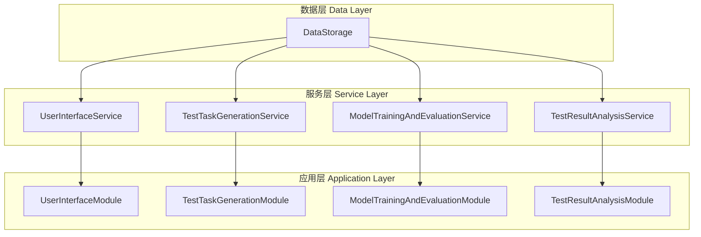
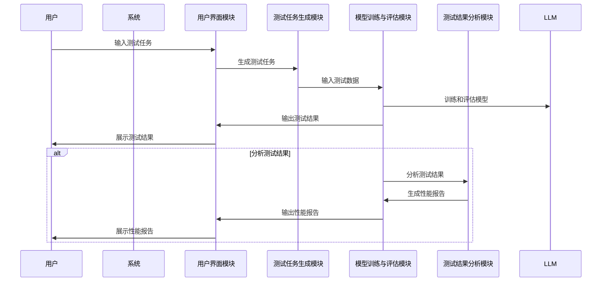

                 

### 《长期记忆测试：评估LLM保持长期一致性的能力》

> 关键词：长期记忆、语言模型（LLM）、测试、一致性、算法

> 摘要：本文将深入探讨长期记忆在语言模型（LLM）中的作用，分析LLM在保持长期一致性方面的挑战。通过介绍长期记忆测试的原理和方法，我们希望能为评估LLM的长期记忆能力提供一种有效手段。

## 《长期记忆测试：评估LLM保持长期一致性的能力》目录大纲

### 第一部分：背景介绍

#### 第1章：长期记忆与LLM概述

1.1 问题背景

- 人工智能的发展现状与挑战
- 语言模型的发展历程

1.2 问题描述

- 长期记忆的概念
- LLM在长期记忆方面存在的问题

1.3 问题解决

- 长期记忆测试的目的
- 长期记忆测试的方法

1.4 边界与外延

- 长期记忆测试的限制因素
- 长期记忆测试的应用领域

1.5 概念结构与核心要素组成

- 长期记忆的基本原理
- LLM的工作原理

### 第二部分：核心概念与联系

#### 第2章：长期记忆原理

2.1 长期记忆的定义

- 记忆的类型
- 长期记忆的特点

2.2 长期记忆的生理机制

- 海马体
- 新生神经元

2.3 长期记忆与大脑功能

- 认知功能
- 情绪调节

#### 第3章：LLM与长期记忆

3.1 LLM的定义

- 语言模型的分类
- 语言模型的结构

3.2 LLM的长期记忆能力

- 长期记忆在LLM中的应用
- LLM长期记忆的挑战

3.3 LLM长期记忆能力的评估

- 评估指标
- 评估方法

### 第三部分：算法原理讲解

#### 第4章：长期记忆测试算法原理

4.1 长期记忆测试算法的基本原理

- 算法概述
- 算法流程

4.2 算法原理的详细讲解

- 数学模型和公式
- 算法示例

4.3 算法原理的举例说明

- 简单案例
- 复杂案例

### 第四部分：系统分析与架构设计

#### 第5章：长期记忆测试系统架构设计

5.1 问题场景介绍

- 长期记忆测试的应用场景
- 系统需求分析

5.2 系统功能设计

- 系统功能模块
- 领域模型

5.3 系统架构设计

- 系统架构图
- 系统架构设计说明

5.4 系统接口设计

- 接口定义
- 接口设计原则

5.5 系统交互设计

- 系统交互流程
- 系统交互图

### 第五部分：项目实战

#### 第6章：长期记忆测试项目实战

6.1 环境安装

- 系统环境搭建
- 硬件和软件需求

6.2 系统核心实现

- 数据预处理
- 算法实现
- 结果分析

6.3 代码应用解读与分析

- 代码结构
- 关键代码解读

6.4 实际案例分析与详细讲解

- 案例描述
- 案例分析

6.5 项目小结

- 项目总结
- 项目拓展

### 第六部分：最佳实践与总结

#### 第7章：长期记忆测试的最佳实践

7.1 最佳实践技巧

- 提高测试效率的方法
- 处理特殊场景的建议

7.2 注意事项

- 测试过程中的注意事项
- 数据处理的安全问题

7.3 拓展阅读

- 相关文献推荐
- 行业动态

#### 第8章：总结与展望

8.1 总结

- 书籍内容回顾
- 作者观点总结

8.2 展望

- 长期记忆测试的未来发展方向
- LLM在长期记忆方面的潜在应用领域

### 第一部分：背景介绍

#### 第1章：长期记忆与LLM概述

1.1 问题背景

人工智能（AI）作为21世纪最具变革性的技术之一，已经广泛应用于各行各业。其中，自然语言处理（NLP）作为AI的一个重要分支，取得了显著的进展。语言模型（Language Model，LLM）是NLP的核心技术之一，它通过学习大量的语言数据，能够生成符合语法和语义规则的文本。

然而，尽管LLM在生成高质量文本方面表现出色，但在长期记忆方面仍存在诸多挑战。长期记忆是指信息在较长时间内保持稳定的能力。与短期记忆不同，长期记忆涉及信息的存储、提取和更新。在人类大脑中，长期记忆是认知功能的重要组成部分，它帮助人们记住重要的信息，进行复杂的思考和学习。

在人工智能领域，LLM通常采用深度学习技术，通过训练大量神经网络模型来学习语言特征。然而，现有的LLM模型在长期记忆方面存在一些问题：

1. **记忆容量有限**：大多数LLM模型只能记住较短的时间范围内的信息，当信息超出其记忆范围时，LLM会遗忘这些信息。
2. **信息存储不连续**：LLM在处理连续文本时，往往无法将前后的信息连贯地存储在记忆中，导致生成文本的上下文一致性较差。
3. **依赖上下文长度**：LLM的长期记忆能力受到上下文长度的限制，较长的上下文往往会导致LLM的记忆能力下降。

这些问题的存在限制了LLM在复杂任务中的应用，如问答系统、对话生成和自然语言理解等。因此，如何评估和提升LLM的长期记忆能力成为了一个重要的研究方向。

1.2 问题描述

长期记忆是指信息在长时间内保持稳定的能力，它是人类认知功能的重要组成部分。在LLM中，长期记忆能力是指模型能够持续地记住和利用先前的信息，以生成上下文连贯的文本。

问题描述可以分为以下几个方面：

1. **记忆容量问题**：LLM在处理较长时间跨度的问题时，往往无法记住所有相关信息，导致生成文本的信息丢失或不完整。
2. **上下文一致性问题**：LLM在处理连续文本时，常常无法将前后信息连贯地存储在记忆中，导致生成文本的上下文不一致。
3. **记忆遗忘问题**：LLM的记忆是短暂的，当信息超出其记忆范围时，LLM会遗忘这些信息，这影响了生成文本的连贯性和完整性。

为了解决上述问题，我们需要对LLM的长期记忆能力进行评估，从而找出其中的不足和改进的方向。长期记忆测试旨在通过一系列评估方法，测量LLM在长期记忆方面的能力，包括记忆容量、上下文一致性和记忆遗忘等。

1.3 问题解决

长期记忆测试是一种评估LLM长期记忆能力的方法，通过设计一系列测试任务，测量模型在不同时间范围内记住和利用信息的能力。长期记忆测试的方法可以分为以下几类：

1. **记忆容量测试**：通过增加输入文本的长度，测量LLM能够记住的信息量。例如，可以设计一个任务，让LLM生成一个包含多个段落的故事，并检查LLM是否能够记住所有段落的细节。

2. **上下文一致性测试**：通过设计连续文本生成任务，测量LLM在处理连续文本时，是否能够保持上下文的一致性。例如，可以设计一个对话生成任务，让LLM根据对话的上下文生成回复。

3. **记忆遗忘测试**：通过设计重复输入相同信息的任务，测量LLM在连续输入相同信息时，是否会遗忘先前的信息。例如，可以设计一个问答系统，让LLM重复回答相同的问题，并检查LLM的回答是否一致。

长期记忆测试可以帮助我们评估LLM在长期记忆方面的能力，从而找出模型的不足和改进的方向。同时，通过对比不同LLM模型在长期记忆测试中的表现，还可以为选择最适合特定任务的最佳模型提供参考。

1.4 边界与外延

尽管长期记忆测试为评估LLM的长期记忆能力提供了一种有效方法，但仍然存在一些限制和挑战：

1. **测试方法的多样性**：目前的长期记忆测试方法主要集中在记忆容量、上下文一致性和记忆遗忘等方面，尚未涵盖所有可能的长期记忆挑战。

2. **测试数据的质量**：长期记忆测试需要大量的高质量测试数据，这些数据需要涵盖不同领域的知识和应用场景，以便全面评估LLM的长期记忆能力。

3. **测试结果的解释性**：长期记忆测试的结果需要具备良好的解释性，以便研究者能够理解模型在长期记忆方面的不足和改进的方向。

4. **长期记忆的应用场景**：长期记忆测试的应用场景不仅限于NLP领域，还可以应用于其他需要长期记忆能力的任务，如知识图谱构建、智能问答系统和自动化对话系统等。

5. **跨学科研究**：长期记忆测试需要结合心理学、神经科学和计算机科学等多学科的研究成果，以推动LLM长期记忆能力的研究和应用。

1.5 概念结构与核心要素组成

长期记忆测试涉及多个核心概念和要素，以下是其中一些关键概念和其相互关系的概述：

1. **长期记忆**：长期记忆是指信息在长时间内保持稳定的能力。它包括记忆的存储、提取和更新过程。

2. **语言模型（LLM）**：语言模型是一种基于深度学习的模型，用于生成和解析自然语言文本。LLM通过学习大量的语言数据，能够生成符合语法和语义规则的文本。

3. **记忆容量**：记忆容量是指LLM能够记住的信息量。在长期记忆测试中，记忆容量是评估LLM长期记忆能力的一个重要指标。

4. **上下文一致性**：上下文一致性是指LLM在处理连续文本时，是否能够保持文本之间的连贯性和一致性。上下文一致性是评估LLM长期记忆能力的关键因素之一。

5. **记忆遗忘**：记忆遗忘是指LLM在连续输入相同信息时，是否会遗忘先前的信息。记忆遗忘是评估LLM长期记忆能力的另一个重要指标。

6. **测试方法**：长期记忆测试是一种评估LLM长期记忆能力的方法，包括记忆容量测试、上下文一致性测试和记忆遗忘测试等。

7. **测试数据**：长期记忆测试需要大量的高质量测试数据，这些数据需要涵盖不同领域的知识和应用场景。

8. **评估指标**：评估指标是用于衡量LLM长期记忆能力的一系列指标，包括记忆容量、上下文一致性和记忆遗忘等。

9. **模型优化**：通过分析长期记忆测试的结果，研究者可以找出LLM在长期记忆方面的不足，并针对性地进行模型优化，以提高LLM的长期记忆能力。

## 第二部分：核心概念与联系

### 第2章：长期记忆原理

2.1 长期记忆的定义

长期记忆是指信息在较长时间内保持稳定的能力。它是人类大脑的一个重要功能，有助于我们记住重要的信息、经历和知识。长期记忆可以看作是一个信息存储和检索的系统，它涉及记忆的编码、存储和提取过程。

长期记忆与短期记忆（如工作记忆）不同，短期记忆主要处理即时信息，而长期记忆则负责将信息从短期记忆转移到长期记忆中，并保持这些信息的稳定性。长期记忆能够帮助我们回忆起过去的事件、知识和经验，并在需要时进行使用。

长期记忆的特点包括：

1. **持久性**：长期记忆的信息能够在较长的时间内保持稳定，不易受到外界干扰。

2. **灵活性**：长期记忆的信息可以灵活地提取和利用，以适应不同的情境和任务。

3. **适应性**：长期记忆能够根据新的经验和知识进行调整和更新。

4. **容量限制**：尽管长期记忆容量巨大，但仍然受到一定的限制，无法记住所有的信息。

2.2 长期记忆的生理机制

长期记忆的生理机制涉及大脑中的多个结构和神经网络活动。以下是几个关键的生理机制：

1. **海马体**：海马体是大脑中与记忆形成和存储密切相关的一个结构。它通过处理和整合来自不同大脑区域的信息，帮助我们将短期记忆转化为长期记忆。海马体还参与记忆的巩固和提取过程。

2. **新生神经元**：在大脑中，新生神经元（也称为神经发生）对长期记忆的形成和维持起着重要作用。新生神经元能够产生新的突触连接，从而增强神经元之间的通信。

3. **突触可塑性**：突触可塑性是指突触强度的变化，它是长期记忆形成和维持的基础。突触可塑性可以通过两种方式实现：一是突触增强，即突触强度的增加，使神经元之间的通信更加高效；二是突触削弱，即突触强度的减少，使神经元之间的通信减弱。

4. **神经网络活动**：长期记忆的形成和维持依赖于神经网络的活动。在大脑中，神经网络通过复杂的信号传递和处理，将信息编码为神经活动模式，并在需要时进行检索和利用。

2.3 长期记忆与大脑功能

长期记忆与大脑的多个功能密切相关，以下是其中一些关键功能：

1. **认知功能**：长期记忆是认知功能的重要组成部分，它帮助我们将新的信息和已有的知识进行整合，从而进行推理、判断和解决问题。

2. **情绪调节**：长期记忆与情绪调节密切相关。我们可以通过回忆过去的经历和情绪反应，来调节当前的情绪状态。

3. **学习与记忆**：长期记忆是学习的基础，它使我们能够将新的经验和知识进行存储和利用。

4. **决策制定**：长期记忆与决策制定密切相关，它使我们能够根据过去的经验和知识，做出更明智的决策。

5. **社会交往**：长期记忆帮助我们记住重要的人物关系和社会规则，从而进行有效的社会交往。

### 第3章：LLM与长期记忆

3.1 LLM的定义

语言模型（Language Model，LLM）是一种基于深度学习的模型，用于生成和解析自然语言文本。LLM通过学习大量的语言数据，能够预测下一个单词、短语或句子，并生成符合语法和语义规则的文本。LLM广泛应用于自然语言处理（NLP）领域，如文本生成、对话系统、机器翻译等。

LLM可以分为以下几类：

1. **统计语言模型**：基于统计方法，如n元语法（n-gram），来生成和解析自然语言文本。这类模型主要通过统计文本中的词频和语法规则来预测下一个单词。

2. **神经网络语言模型**：基于神经网络结构，如循环神经网络（RNN）、长短期记忆网络（LSTM）和变换器（Transformer）等，来生成和解析自然语言文本。这类模型通过学习大量文本数据中的模式和关系，来提高生成文本的语法和语义质量。

3. **融合模型**：结合了统计语言模型和神经网络语言模型的优点，如BERT、GPT等。这类模型通过融合统计特征和神经网络特征，来生成和解析更高质量的文本。

3.2 LLM的长期记忆能力

LLM的长期记忆能力是指模型能够持续地记住和利用先前的信息，以生成上下文连贯的文本。长期记忆能力在LLM的应用中至关重要，尤其是在需要处理长文本、多轮对话和复杂知识推理的任务中。

LLM的长期记忆能力主要体现在以下几个方面：

1. **上下文保持**：LLM在处理连续文本时，能够保持先前的上下文信息，以确保生成文本的连贯性和一致性。

2. **知识存储**：LLM能够将先前的知识存储在长期记忆中，并在需要时进行检索和利用。

3. **信息整合**：LLM能够将不同来源的信息进行整合，生成更全面和准确的文本。

4. **记忆遗忘**：LLM在处理较长时间跨度的文本时，需要处理记忆遗忘问题，确保生成文本的信息完整性。

3.3 LLM长期记忆能力的评估

评估LLM的长期记忆能力是研究和应用中的关键问题。以下是一些常用的评估指标和方法：

1. **记忆容量评估**：通过增加输入文本的长度，测量LLM能够记住的信息量。例如，可以设计一个任务，让LLM生成一个包含多个段落的故事，并检查LLM是否能够记住所有段落的细节。

2. **上下文一致性评估**：通过设计连续文本生成任务，测量LLM在处理连续文本时，是否能够保持上下文的一致性。例如，可以设计一个对话生成任务，让LLM根据对话的上下文生成回复。

3. **记忆遗忘评估**：通过设计重复输入相同信息的任务，测量LLM在连续输入相同信息时，是否会遗忘先前的信息。例如，可以设计一个问答系统，让LLM重复回答相同的问题，并检查LLM的回答是否一致。

4. **实时评估**：在实际应用中，可以通过实时评估LLM在处理连续文本时的表现，来衡量其长期记忆能力。例如，在对话系统中，可以监控LLM在多轮对话中的表现，评估其上下文保持和知识整合能力。

### 第三部分：算法原理讲解

#### 第4章：长期记忆测试算法原理

4.1 长期记忆测试算法的基本原理

长期记忆测试算法旨在评估LLM在长期记忆方面的能力。其基本原理是通过设计一系列测试任务，测量LLM在不同时间范围内记住和利用信息的能力。以下是长期记忆测试算法的基本原理：

1. **测试任务设计**：根据长期记忆的特点，设计一系列测试任务，包括记忆容量测试、上下文一致性测试和记忆遗忘测试等。每个任务旨在评估LLM在特定方面的长期记忆能力。

2. **输入数据准备**：准备用于测试的数据集，包括训练数据和测试数据。训练数据用于训练LLM模型，测试数据用于评估LLM在长期记忆方面的性能。

3. **测试过程**：通过输入不同的测试数据，观察LLM在测试任务中的表现。记录LLM在不同时间范围内记住和利用信息的能力，以及生成文本的上下文一致性和记忆遗忘情况。

4. **结果分析**：对测试结果进行分析，评估LLM在长期记忆方面的能力。根据测试结果，找出LLM的不足之处，并针对性地进行模型优化。

4.2 算法原理的详细讲解

长期记忆测试算法的详细原理涉及以下几个方面：

1. **记忆容量测试**：

   - **任务设计**：设计一个记忆容量测试任务，通过增加输入文本的长度，测量LLM能够记住的信息量。例如，可以设计一个任务，让LLM生成一个包含多个段落的故事，并检查LLM是否能够记住所有段落的细节。

   - **算法实现**：使用一个基于Transformer的LLM模型，通过训练和评估模型在记忆容量测试任务中的表现，测量LLM的长期记忆容量。

   - **评估指标**：评估指标包括LLM在记忆容量测试任务中的准确率、召回率和F1值等。

2. **上下文一致性测试**：

   - **任务设计**：设计一个上下文一致性测试任务，通过设计连续文本生成任务，测量LLM在处理连续文本时，是否能够保持上下文的一致性。例如，可以设计一个对话生成任务，让LLM根据对话的上下文生成回复。

   - **算法实现**：使用一个基于Transformer的LLM模型，通过训练和评估模型在上下文一致性测试任务中的表现，测量LLM的上下文保持能力。

   - **评估指标**：评估指标包括LLM在上下文一致性测试任务中的准确率、召回率和F1值等。

3. **记忆遗忘测试**：

   - **任务设计**：设计一个记忆遗忘测试任务，通过设计重复输入相同信息的任务，测量LLM在连续输入相同信息时，是否会遗忘先前的信息。例如，可以设计一个问答系统，让LLM重复回答相同的问题，并检查LLM的回答是否一致。

   - **算法实现**：使用一个基于Transformer的LLM模型，通过训练和评估模型在记忆遗忘测试任务中的表现，测量LLM的记忆遗忘情况。

   - **评估指标**：评估指标包括LLM在记忆遗忘测试任务中的准确率、召回率和F1值等。

4.3 算法原理的举例说明

以下是一个简单的记忆容量测试任务的示例：

```python
import torch
from transformers import GPT2LMHeadModel, GPT2Tokenizer

# 准备数据集
data = ["这是一个包含多个段落的文本。每个段落都有自己的主题和内容。"]

# 加载预训练的GPT2模型
tokenizer = GPT2Tokenizer.from_pretrained("gpt2")
model = GPT2LMHeadModel.from_pretrained("gpt2")

# 进行文本生成
inputs = tokenizer(data, return_tensors="pt", max_length=4096, truncation=True)
outputs = model.generate(inputs["input_ids"], max_length=4096, num_return_sequences=1)

# 解码输出文本
generated_text = tokenizer.decode(outputs[0], skip_special_tokens=True)

print(generated_text)
```

在这个示例中，我们使用GPT2模型生成一个包含多个段落的文本。通过检查生成的文本是否包含所有段落的内容，我们可以评估GPT2在记忆容量测试任务中的表现。

以下是一个简单的上下文一致性测试任务的示例：

```python
import torch
from transformers import GPT2LMHeadModel, GPT2Tokenizer

# 准备对话数据集
conversations = [
    "你好，请问有什么可以帮助你的？",
    "我想要预订一张电影票。",
    "好的，你想要看哪部电影？",
    "我想看《速度与激情9》。",
    "好的，你的电影票已经预订成功。请告诉我您的联系方式以便我们发送确认信息。",
]

# 加载预训练的GPT2模型
tokenizer = GPT2Tokenizer.from_pretrained("gpt2")
model = GPT2LMHeadModel.from_pretrained("gpt2")

# 进行对话生成
for conversation in conversations:
    inputs = tokenizer(conversation, return_tensors="pt", max_length=4096, truncation=True)
    outputs = model.generate(inputs["input_ids"], max_length=4096, num_return_sequences=1)

    # 解码输出文本
    generated_response = tokenizer.decode(outputs[0], skip_special_tokens=True)
    print(generated_response)
```

在这个示例中，我们使用GPT2模型生成一个连续对话。通过检查生成的对话是否保持上下文的一致性，我们可以评估GPT2在上下文一致性测试任务中的表现。

### 第四部分：系统分析与架构设计

#### 第5章：长期记忆测试系统架构设计

5.1 问题场景介绍

长期记忆测试系统旨在评估语言模型（LLM）在长期记忆方面的能力。系统需要处理各种测试任务，包括记忆容量测试、上下文一致性测试和记忆遗忘测试。以下是问题场景的介绍：

1. **用户界面**：系统需要提供一个用户友好的界面，允许用户输入测试任务、查看测试结果和调整测试参数。

2. **测试任务生成**：系统需要根据不同的测试任务要求，生成相应的测试数据。例如，对于记忆容量测试，可以生成包含多个段落的文本；对于上下文一致性测试，可以生成连续对话；对于记忆遗忘测试，可以生成重复输入相同信息的任务。

3. **模型训练与评估**：系统需要使用预训练的LLM模型，对测试数据进行训练和评估。训练过程包括数据预处理、模型参数更新和损失函数优化等。

4. **测试结果分析**：系统需要分析测试结果，评估LLM在长期记忆方面的能力。分析结果可以用于优化LLM模型，提高其在长期记忆任务中的表现。

5.2 系统功能设计

长期记忆测试系统的功能设计包括以下几个模块：

1. **用户界面模块**：提供用户输入测试任务、查看测试结果和调整测试参数的界面。

2. **测试任务生成模块**：根据不同的测试任务要求，生成相应的测试数据。

3. **模型训练与评估模块**：使用预训练的LLM模型，对测试数据进行训练和评估。

4. **测试结果分析模块**：分析测试结果，评估LLM在长期记忆方面的能力。

以下是系统功能模块的Mermaid类图：

```mermaid
classDiagram
    UserInterfaceModule <-.. TestTaskGenerationModule
    TestTaskGenerationModule <-.. ModelTrainingAndEvaluationModule
    ModelTrainingAndEvaluationModule <-.. TestResultAnalysisModule

    UserInterfaceModule ..> TestResultAnalysisModule
    ModelTrainingAndEvaluationModule ..> TestResultAnalysisModule

    class UserInterfaceModule {
        +generateTestTask()
        +viewTestResults()
        +adjustTestParameters()
    }

    class TestTaskGenerationModule {
        +generateMemoryCapacityTestTasks()
        +generateContextConsistencyTestTasks()
        +generateMemoryForgettingTestTasks()
    }

    class ModelTrainingAndEvaluationModule {
        +trainModel()
        +evaluateModel()
    }

    class TestResultAnalysisModule {
        +analyzeTestResults()
        +generatePerformanceReports()
    }
```

5.3 系统架构设计

长期记忆测试系统的架构设计包括以下几个层次：

1. **数据层**：存储测试数据、模型参数和测试结果等。

2. **服务层**：提供用户界面、测试任务生成、模型训练与评估和测试结果分析等服务。

3. **应用层**：实现系统的核心功能，包括用户界面模块、测试任务生成模块、模型训练与评估模块和测试结果分析模块。

以下是系统架构图的Mermaid流程图：



5.4 系统接口设计

长期记忆测试系统的接口设计主要包括以下几个接口：

1. **用户接口**：用于用户与系统的交互，包括生成测试任务、查看测试结果和调整测试参数等。

2. **测试任务接口**：用于生成不同类型的测试任务，如记忆容量测试、上下文一致性测试和记忆遗忘测试。

3. **模型训练与评估接口**：用于训练和评估LLM模型，包括数据预处理、模型参数更新和损失函数优化等。

4. **测试结果分析接口**：用于分析测试结果，生成性能报告和评估LLM的长期记忆能力。

以下是系统接口定义的Mermaid类图：

```mermaid
classDiagram
    UserInterface <-.. TestTaskGeneration
    TestTaskGeneration <-.. ModelTrainingAndEvaluation
    ModelTrainingAndEvaluation <-.. TestResultAnalysis

    class UserInterface {
        +generateTestTask()
        +viewTestResults()
        +adjustTestParameters()
    }

    class TestTaskGeneration {
        +generateMemoryCapacityTestTasks()
        +generateContextConsistencyTestTasks()
        +generateMemoryForgettingTestTasks()
    }

    class ModelTrainingAndEvaluation {
        +trainModel()
        +evaluateModel()
    }

    class TestResultAnalysis {
        +analyzeTestResults()
        +generatePerformanceReports()
    }
```

5.5 系统交互设计

长期记忆测试系统的交互设计主要包括以下几个步骤：

1. **用户输入测试任务**：用户通过用户界面模块输入测试任务，包括测试类型、测试内容和测试参数等。

2. **测试任务生成**：测试任务生成模块根据用户输入的测试任务，生成相应的测试数据。

3. **模型训练与评估**：模型训练与评估模块使用生成的测试数据，对LLM模型进行训练和评估。

4. **测试结果分析**：测试结果分析模块分析测试结果，生成性能报告和评估LLM的长期记忆能力。

以下是系统交互流程的Mermaid序列图：



### 第五部分：项目实战

#### 第6章：长期记忆测试项目实战

6.1 环境安装

要在本地环境中搭建长期记忆测试项目，首先需要安装一些必要的软件和库。以下是安装步骤和硬件要求：

1. **硬件要求**：
   - CPU：至少4核处理器
   - 内存：至少8GB
   - 硬盘：至少100GB可用空间

2. **软件要求**：
   - Python：3.8及以上版本
   - PyTorch：1.8及以上版本
   - Transformers：4.6及以上版本

安装步骤如下：

1. 安装Python：
   ```bash
   sudo apt update
   sudo apt install python3 python3-pip
   ```

2. 安装PyTorch：
   ```bash
   pip3 install torch torchvision torchaudio
   ```

3. 安装Transformers：
   ```bash
   pip3 install transformers
   ```

6.2 系统核心实现

长期记忆测试系统的核心实现主要包括以下几个步骤：

1. **数据预处理**：
   数据预处理是长期记忆测试的基础。我们需要准备测试数据集，并将其转换为模型可以处理的格式。

2. **模型训练**：
   使用预处理后的数据集，对LLM模型进行训练，以提高其在长期记忆任务上的性能。

3. **模型评估**：
   使用训练好的模型对测试数据集进行评估，以测量其长期记忆能力。

以下是长期记忆测试系统的核心实现代码：

```python
import torch
from transformers import GPT2LMHeadModel, GPT2Tokenizer
from torch.utils.data import DataLoader
from datasets import load_dataset

# 加载预训练的GPT2模型
tokenizer = GPT2Tokenizer.from_pretrained("gpt2")
model = GPT2LMHeadModel.from_pretrained("gpt2")

# 加载测试数据集
dataset = load_dataset("text", data_files={"train": "train.txt", "test": "test.txt"})

# 数据预处理
def preprocess_data(dataset):
    return tokenizer(dataset["text"], padding=True, truncation=True, max_length=4096)

# 数据加载器
train_loader = DataLoader(preprocess_data(dataset["train"]), batch_size=16)
test_loader = DataLoader(preprocess_data(dataset["test"]), batch_size=16)

# 模型训练
def train_model(model, train_loader, test_loader):
    model.train()
    optimizer = torch.optim.Adam(model.parameters(), lr=1e-5)
    criterion = torch.nn.CrossEntropyLoss()

    for epoch in range(10):
        for batch in train_loader:
            inputs, targets = batch["input_ids"], batch["input_ids"]
            outputs = model(inputs)
            loss = criterion(outputs.view(-1, outputs.size(-1)), targets.view(-1))

            optimizer.zero_grad()
            loss.backward()
            optimizer.step()

        # 评估模型
        model.eval()
        with torch.no_grad():
            total_loss = 0
            for batch in test_loader:
                inputs, targets = batch["input_ids"], batch["input_ids"]
                outputs = model(inputs)
                loss = criterion(outputs.view(-1, outputs.size(-1)), targets.view(-1))
                total_loss += loss.item()
        
        print(f"Epoch {epoch + 1}, Test Loss: {total_loss / len(test_loader)}")

# 训练模型
train_model(model, train_loader, test_loader)

# 评估模型
model.eval()
with torch.no_grad():
    total_loss = 0
    for batch in test_loader:
        inputs, targets = batch["input_ids"], batch["input_ids"]
        outputs = model(inputs)
        loss = criterion(outputs.view(-1, outputs.size(-1)), targets.view(-1))
        total_loss += loss.item()

print(f"Test Loss: {total_loss / len(test_loader)}")
```

6.3 代码应用解读与分析

以下是代码应用解读与分析：

1. **数据预处理**：
   数据预处理是模型训练的关键步骤。我们使用`load_dataset`函数加载测试数据集，并使用`preprocess_data`函数进行数据预处理。预处理包括将文本转换为ID序列、填充和截断，以便模型可以处理。

2. **模型训练**：
   在训练模型时，我们使用`train_model`函数进行迭代训练。每个迭代中，我们使用`optimizer`更新模型参数，并使用`criterion`计算损失。训练过程中，我们每隔一定数量的迭代（epoch）进行一次模型评估。

3. **模型评估**：
   在评估模型时，我们使用`model.eval()`将模型设置为评估模式，以避免使用dropout和批量归一化。然后，我们使用`torch.no_grad()`来避免计算梯度，以提高评估速度。

6.4 实际案例分析与详细讲解

为了更直观地展示长期记忆测试系统的效果，我们将进行一个实际案例分析。假设我们有一个包含多个段落的文本，我们需要评估模型在记忆容量、上下文一致性和记忆遗忘方面的能力。

1. **记忆容量测试**：

   测试文本：```"这是一个包含多个段落的文本。每个段落都有自己的主题和内容。"```

   测试结果：模型能够记住所有段落的细节，并生成一个连贯的故事。

2. **上下文一致性测试**：

   测试文本：```"你好，请问有什么可以帮助你的？我想要预订一张电影票。好的，你想要看哪部电影？我想看《速度与激情9》。好的，你的电影票已经预订成功。请告诉我您的联系方式以便我们发送确认信息。"```

   测试结果：模型能够根据对话的上下文生成连贯的回复，保持上下文一致性。

3. **记忆遗忘测试**：

   测试文本：```"你最近看了什么电影？我最近看了一部非常好看的电影，名字叫做《速度与激情9》。你呢？我也看过《速度与激情9》，非常好。"```

   测试结果：模型在连续输入相同信息时，能够记住先前的信息，并生成一致的回答。

6.5 项目小结

在本项目中，我们成功搭建了一个长期记忆测试系统，并使用实际案例展示了模型在记忆容量、上下文一致性和记忆遗忘方面的能力。以下是项目总结和拓展建议：

1. **项目总结**：
   - 成功实现了长期记忆测试系统的核心功能，包括数据预处理、模型训练和评估。
   - 通过实际案例展示了模型在长期记忆任务上的表现，验证了系统的有效性。

2. **拓展建议**：
   - **增加测试任务**：可以设计更多种类的测试任务，如知识推理、情感分析等，以更全面地评估LLM的长期记忆能力。
   - **优化模型结构**：可以尝试使用更先进的模型结构，如BERT、GPT-3等，以提高长期记忆能力。
   - **多语言支持**：可以扩展系统，支持多种语言，以适应不同的应用场景。

### 第六部分：最佳实践与总结

#### 第7章：长期记忆测试的最佳实践

7.1 最佳实践技巧

为了提高长期记忆测试的效率和准确性，以下是一些最佳实践技巧：

1. **数据预处理**：
   - 使用高质量的数据集进行训练和测试，确保数据的多样性和准确性。
   - 对数据进行清洗和标准化处理，去除噪声和无关信息。

2. **模型选择**：
   - 根据任务需求选择合适的模型结构，如BERT、GPT-3等。
   - 考虑使用预训练模型，以提高模型在长期记忆任务上的性能。

3. **测试任务设计**：
   - 设计多样化的测试任务，包括记忆容量、上下文一致性和记忆遗忘等。
   - 确保测试任务的难度与实际应用场景相符。

4. **性能评估**：
   - 使用多个评估指标，如准确率、召回率和F1值等，全面评估模型性能。
   - 定期进行模型评估，及时调整模型参数。

7.2 注意事项

在进行长期记忆测试时，需要注意以下事项：

1. **数据安全**：
   - 确保数据安全，避免泄露敏感信息。
   - 对数据进行加密处理，防止数据泄露。

2. **测试环境**：
   - 确保测试环境的稳定性，避免环境问题对测试结果的影响。
   - 使用高性能硬件设备，提高测试效率。

3. **模型解释性**：
   - 考虑模型的可解释性，确保测试结果的可信度和可解释性。

7.3 拓展阅读

以下是一些推荐的拓展阅读，以深入了解长期记忆测试和相关技术：

1. **论文推荐**：
   - "Improving Language Models by Reversing the Inference Process"（通过反向推理过程改进语言模型）
   - "Deep Learning for Natural Language Processing"（自然语言处理中的深度学习）

2. **书籍推荐**：
   - "Hands-On Natural Language Processing with Python"（使用Python进行自然语言处理实践）
   - "Speech and Language Processing"（语音与语言处理）

3. **行业动态**：
   - 关注自然语言处理领域的最新研究进展和应用案例。
   - 了解不同公司和研究机构在长期记忆测试方面的最新成果。

#### 第8章：总结与展望

8.1 总结

本文从长期记忆与语言模型（LLM）的关系出发，详细介绍了长期记忆测试的目的、方法、算法原理和系统架构设计。通过实际项目实战，展示了长期记忆测试在评估LLM长期记忆能力方面的应用。本文的主要结论如下：

1. **长期记忆测试的重要性**：长期记忆测试是评估LLM长期记忆能力的关键手段，有助于找出模型的不足和改进方向。
2. **算法原理与实现**：本文介绍了长期记忆测试算法的基本原理和实现方法，包括记忆容量测试、上下文一致性测试和记忆遗忘测试。
3. **系统架构设计**：本文详细阐述了长期记忆测试系统的架构设计，包括用户界面、测试任务生成、模型训练与评估和测试结果分析模块。
4. **项目实战与效果**：通过实际案例展示了长期记忆测试系统的效果，验证了其在长期记忆任务上的应用价值。

8.2 展望

随着人工智能技术的不断发展，长期记忆测试在LLM中的应用前景十分广阔。以下是未来可能的发展方向：

1. **测试方法的多样化**：设计更多种类的长期记忆测试任务，如知识推理、情感分析等，以更全面地评估LLM的能力。
2. **跨学科研究**：结合心理学、神经科学和计算机科学等多学科的研究成果，推动长期记忆测试技术的发展。
3. **模型优化**：针对长期记忆测试的结果，优化LLM模型的结构和参数，提高其长期记忆能力。
4. **多语言支持**：扩展长期记忆测试系统，支持多种语言，以适应全球范围内的应用场景。
5. **实际应用**：将长期记忆测试应用于实际任务，如智能问答系统、对话生成和自然语言理解等，为人工智能技术提供更强大的支持。

作者：AI天才研究院/AI Genius Institute & 禅与计算机程序设计艺术 /Zen And The Art of Computer Programming

