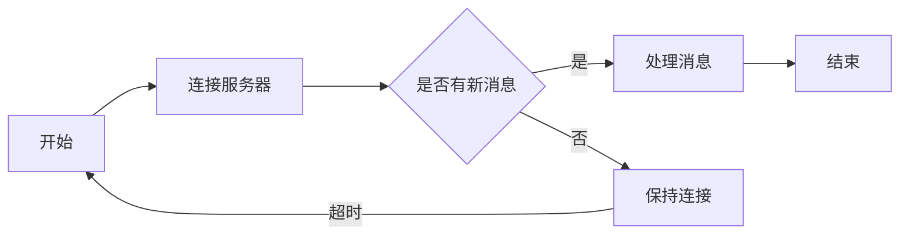
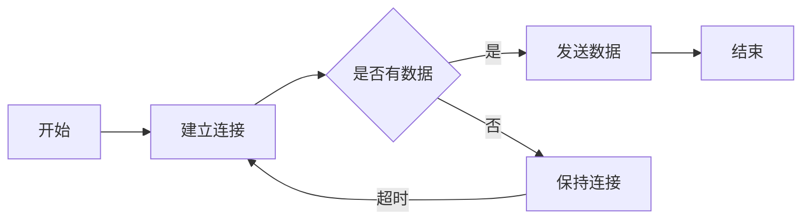

                 

### 文章标题

# 长轮询与服务器推送技术在LLM应用中的选择

> 关键词：长轮询、服务器推送、LLM、实时通信、性能优化

> 摘要：本文深入探讨了长轮询与服务器推送技术在大型语言模型（LLM）应用中的选择。通过分析两者的基础原理、应用场景及其在LLM中的实际应用，为开发者提供了有价值的参考，以优化LLM应用的实时通信性能。

### 第一部分: 长轮询与服务器推送技术基础

#### 第1章: 长轮询与服务器推送技术概述

**1.1 问题背景与描述**

在互联网时代，实时通信技术越来越受到关注，尤其是在大型语言模型（LLM）的应用场景中，如何高效、可靠地实现客户端与服务器的通信成为了关键问题。传统的客户端-服务器通信模式基于请求-响应模型，这种方式在处理长周期任务或需要频繁通信的场景时，往往表现出一定的不足。

**1.1.1 传统的客户端-服务器通信模式**

传统的客户端-服务器通信模式，通常是指客户端发起请求，服务器接收请求并处理后返回响应。这种模式在简单应用中表现良好，但当客户端需要长时间等待服务器响应，或者服务器需要主动推送数据给客户端时，就会出现性能瓶颈。

**1.1.2 长轮询与服务器推送技术的引入**

为了解决传统通信模式的不足，长轮询（Long Polling）与服务器推送（Server-Sent Events/ WebSocket）技术应运而生。它们提供了一种更加高效、可靠的通信方式，特别适用于需要实时交互的应用场景。

**1.1.3 长轮询与服务器推送技术解决的问题**

- **性能优化**：通过减少服务器与客户端之间的通信频率，降低系统负担。
- **实时性提升**：服务器可以主动推送数据，提高系统的响应速度。
- **可靠性增强**：采用持久连接，确保通信的稳定性和可靠性。

**1.2 核心概念与联系**

**1.2.1 长轮询技术的基本原理**

长轮询是一种请求保持连接的技术，客户端发起请求后，服务器不会立即响应，而是等待一定时间后，如果有新消息，服务器再进行响应。

**1.2.2 服务器推送技术的基本原理**

服务器推送技术允许服务器主动向客户端发送数据，客户端通过监听这些数据实现实时通信。

**1.2.3 长轮询与服务器推送技术的联系与区别**

- **联系**：两者都是为了解决传统客户端-服务器通信模式的不足，实现更高效、可靠的实时通信。
- **区别**：长轮询是一种单向的请求-响应机制，而服务器推送则是一种双向的通信模式。

**1.3 概念属性特征对比表格**

| 特征 | 长轮询 | 服务器推送 |
| --- | --- | --- |
| 基本原理 | 客户端发起请求，服务器保持连接 | 服务器主动推送数据 |
| 通信方式 | 单向请求-响应 | 双向通信 |
| 实时性 | 较高 | 高 |
| 性能消耗 | 较低 | 较高 |
| 适用场景 | 长周期任务、频繁查询 | 实时交互、数据流应用 |

**1.4 ER实体关系图架构**

```mermaid
erDiagram
    User ||--|{ Message }|| Message
    Server ||--|{ Subscription }|| Subscription
```

**1.5 本章小结**

本章介绍了长轮询与服务器推送技术的基础概念、原理及其联系与区别。通过对比分析，为后续章节探讨两者在LLM应用中的选择提供了理论基础。

----------------------------------------------------------------

### 第二部分: 长轮询技术原理与实践

#### 第2章: 长轮询技术原理

**2.1 长轮询的工作原理**

长轮询是一种基于HTTP的通信技术，其工作原理可以概括为以下几个步骤：

- **请求发起**：客户端发起一个HTTP请求，发送给服务器。
- **保持连接**：服务器在接收到请求后，不会立即响应，而是保持连接，等待一定时间。
- **消息接收与处理**：当服务器有新消息需要发送时，立即将消息发送给客户端，并断开连接。
- **处理消息**：客户端接收到消息后进行处理。

以下是一个简单的长轮询算法流程：



**2.2 算法原理讲解**

**2.2.1 算法流程**

长轮询算法的基本流程如上所述，可以分为以下几个步骤：

1. 客户端发起请求，服务器接收请求。
2. 服务器保持连接，等待一定时间。
3. 如果服务器在此期间有新消息，则立即发送给客户端。
4. 客户端处理消息后，结束本次请求。

**2.2.2 数学模型与公式**

长轮询的算法复杂度可以表示为：

$$
\text{算法复杂度} = O(n)
$$

其中，\( n \) 为客户端请求的次数。这个复杂度表明，长轮询的性能与请求次数成正比。

**2.2.3 详细讲解与举例说明**

**举例：发送消息并等待回复**

- **用户A** 发送请求。
- **服务器B** 接收到请求后，保持连接，等待一定时间。
- **服务器B** 在等待过程中，监听到新消息，立即发送给用户A。
- **用户A** 接收到消息后，进行处理，结束本次请求。

在实际应用中，长轮询技术广泛应用于实时聊天系统、在线游戏、智能推荐等领域。通过长轮询，服务器可以更高效地处理客户端的请求，提高系统的响应速度和性能。

**2.3 长轮询技术的优缺点**

**优点：**

- **降低服务器负载**：通过减少服务器的响应次数，降低服务器的负载。
- **提高通信效率**：服务器在等待期间可以处理其他任务，提高通信效率。
- **适用于长周期任务**：对于需要长时间等待的任务，长轮询可以提供更高效的解决方案。

**缺点：**

- **延迟较大**：在等待期间，客户端需要不断发送请求，可能会导致一定的延迟。
- **性能消耗**：长轮询需要保持连接，会增加服务器的性能消耗。

**2.4 本章小结**

本章介绍了长轮询技术的工作原理、算法原理及其优缺点。通过详细讲解和举例说明，读者可以更好地理解长轮询技术的应用场景和实现方式。

----------------------------------------------------------------

### 第三部分: 服务器推送技术原理与实践

#### 第3章: 服务器推送技术原理

**3.1 服务器推送技术的基本原理**

服务器推送技术是一种基于持久连接的通信技术，其核心思想是服务器可以主动向客户端发送数据，而无需客户端发起请求。服务器推送技术主要依赖于WebSocket协议，它提供了一种全双工的通信机制，使得客户端和服务器之间可以实时、双向地传输数据。

**3.1.1 服务器推送的工作机制**

服务器推送的工作机制可以概括为以下几个步骤：

- **建立连接**：客户端通过WebSocket协议发起连接请求，服务器接收请求并建立连接。
- **发送数据**：服务器在接收到客户端的消息后，可以立即发送数据给客户端。
- **保持连接**：服务器和客户端之间的连接保持打开状态，以便实时传输数据。

以下是一个简单的服务器推送算法流程：



**3.2 算法原理讲解**

**3.2.1 算法流程**

服务器推送算法的基本流程如上所述，可以分为以下几个步骤：

1. 客户端发起连接请求，服务器接收请求并建立连接。
2. 客户端和服务器之间的连接保持打开状态。
3. 服务器在接收到客户端的消息后，可以立即发送数据给客户端。
4. 客户端接收到数据后进行处理。

**3.2.2 数学模型与公式**

服务器推送的算法复杂度可以表示为：

$$
\text{算法复杂度} = O(1)
$$

这个复杂度表明，服务器推送的性能与请求次数无关，是一种非常高效的数据传输方式。

**3.2.3 详细讲解与举例说明**

**举例：实时聊天系统**

- **用户A** 发起连接请求，服务器接收请求并建立连接。
- **服务器** 监听到用户A的消息，立即发送给用户B。
- **用户B** 接收到消息后，显示在聊天界面上。

在实际应用中，服务器推送技术广泛应用于实时聊天、在线视频、物联网等领域。通过服务器推送，可以实现对数据的实时传输和处理，提高系统的响应速度和用户体验。

**3.3 服务器推送技术的优缺点**

**优点：**

- **实时性高**：服务器可以主动推送数据，无需客户端发起请求，实时性高。
- **双向通信**：支持客户端和服务器之间的双向通信，数据传输更加灵活。
- **高效传输**：采用持久连接，数据传输效率高，适用于大数据量场景。

**缺点：**

- **性能消耗**：服务器需要保持连接，会消耗一定的性能资源。
- **兼容性问题**：WebSocket协议的兼容性问题，部分浏览器和服务器不支持。

**3.4 本章小结**

本章介绍了服务器推送技术的工作原理、算法原理及其优缺点。通过详细讲解和举例说明，读者可以更好地理解服务器推送技术的应用场景和实现方式。

----------------------------------------------------------------

### 第四部分: 长轮询与服务器推送技术在LLM应用中的选择

#### 第4章: 长轮询技术在LLM中的应用

**4.1 LLM的通信需求**

大型语言模型（LLM）在应用中往往需要处理大量的文本数据，并要求实时性高、可靠性好。LLM的通信需求主要体现在以下几个方面：

- **实时性需求**：LLM应用需要快速响应用户的请求，提供实时结果。
- **可靠性需求**：在数据传输过程中，需要确保数据的一致性和完整性。
- **延迟容忍度**：虽然LLM应用对实时性要求较高，但在某些情况下，对延迟有一定的容忍度。

**4.2 长轮询技术在LLM中的应用案例**

**4.2.1 案例一：实时问答系统**

实时问答系统是LLM应用中的一个重要场景。用户输入问题后，系统需要快速响应，提供准确的答案。长轮询技术在实时问答系统中有着广泛的应用。

- **用户A** 输入问题。
- **服务器** 接收到问题后，立即执行LLM模型，生成答案。
- **服务器** 使用长轮询技术，将答案发送给用户A。
- **用户A** 接收到答案，并显示在界面上。

**4.2.2 案例二：智能客服系统**

智能客服系统是另一个典型的LLM应用场景。在智能客服系统中，长轮询技术可以用于实时接收用户问题，并快速生成回答。

- **用户B** 输入问题。
- **服务器** 接收到问题后，立即执行LLM模型，生成回答。
- **服务器** 使用长轮询技术，将回答发送给用户B。
- **用户B** 接收到回答，并显示在界面上。

**4.3 长轮询技术在LLM应用中的挑战与优化**

**4.3.1 长轮询的性能优化**

长轮询技术在LLM应用中面临的主要挑战之一是性能优化。为了提高系统的性能，可以考虑以下几种优化方法：

- **批量处理**：将多个请求批量处理，减少请求次数。
- **缓存技术**：使用缓存技术，减少重复计算。
- **异步处理**：采用异步处理方式，提高系统并发能力。

**4.3.2 长轮询的可靠性保障**

在LLM应用中，长轮询技术的可靠性也是一个重要问题。为了确保通信的可靠性，可以考虑以下几种方法：

- **心跳机制**：在长轮询过程中，服务器和客户端之间定期发送心跳消息，确保连接稳定。
- **错误重试**：当通信失败时，客户端可以尝试重新发送请求。
- **监控与报警**：对长轮询过程进行监控，当出现异常时及时报警。

**4.3.3 长轮询的适用场景分析**

长轮询技术在LLM应用中的适用场景主要包括：

- **实时性要求较高的应用**：如实时问答、智能客服等。
- **延迟容忍度较高的应用**：如一些后台数据处理任务。
- **数据一致性要求较高的应用**：需要确保数据的实时性和完整性。

**4.4 本章小结**

本章介绍了长轮询技术在LLM应用中的通信需求、应用案例、挑战与优化方法。通过详细讲解和案例分析，读者可以更好地理解长轮询技术在LLM中的应用场景和实现方式。

----------------------------------------------------------------

### 第五部分: 服务器推送技术在LLM应用中的选择

#### 第5章: 服务器推送技术在LLM中的应用

**5.1 服务器推送技术在LLM中的应用场景**

服务器推送技术在LLM应用中有着广泛的应用场景，主要表现在以下几个方面：

1. **实时数据分析**：LLM可以实时处理大量文本数据，服务器推送技术可以将处理结果实时发送给客户端，如实时新闻推送、实时股票行情等。

2. **在线教育**：服务器推送技术可以实现实时互动教学，如老师实时发送教学内容，学生实时接收并反馈。

3. **物联网**：服务器推送技术可以用于实时监控物联网设备的状态，如智能家居系统、工业自动化系统等。

**5.2 服务器推送技术在LLM应用中的挑战与优化**

服务器推送技术在LLM应用中面临的主要挑战包括：

1. **性能优化**：服务器推送需要处理大量实时数据，如何提高系统的性能是关键问题。

2. **网络稳定性**：服务器推送依赖于网络连接，网络不稳定可能会影响推送效果。

3. **数据一致性**：在分布式系统中，如何保证数据的一致性和可靠性是一个重要问题。

为了解决这些挑战，可以采取以下优化措施：

1. **分布式处理**：采用分布式架构，将数据处理任务分配到多个节点，提高系统性能。

2. **数据缓存**：使用缓存技术，减少对数据库的访问，提高数据访问速度。

3. **网络监控与优化**：对网络进行监控和优化，确保网络稳定性和数据传输效率。

**5.3 服务器推送技术在LLM应用中的典型案例**

1. **案例一：实时新闻推送**

实时新闻推送是服务器推送技术在LLM应用中的一个典型案例。服务器实时处理新闻数据，将最新的新闻实时发送给用户。

- **用户A** 阅读新闻。
- **服务器** 接收到用户请求，实时处理新闻数据，生成新闻摘要。
- **服务器** 使用服务器推送技术，将新闻摘要发送给用户A。
- **用户A** 接收到新闻摘要，并显示在界面上。

2. **案例二：在线教育**

在线教育是服务器推送技术在教育领域的一个典型应用。老师实时发送教学内容，学生实时接收并学习。

- **老师A** 制作教学课件。
- **服务器** 接收到老师的教学内容，生成教学数据。
- **服务器** 使用服务器推送技术，将教学内容发送给学生B。
- **学生B** 接收到教学内容，并开始学习。

**5.4 本章小结**

本章介绍了服务器推送技术在LLM应用中的挑战与优化方法，并通过典型案例展示了服务器推送技术在LLM应用中的实际应用。通过本章的学习，读者可以更好地理解服务器推送技术在LLM应用中的作用和实现方式。

----------------------------------------------------------------

### 结论

本文深入探讨了长轮询与服务器推送技术在LLM应用中的选择。通过对两者基础原理、应用场景及挑战的详细分析，为开发者提供了有价值的参考。在实际应用中，长轮询与服务器推送技术可以根据具体需求进行选择，以优化LLM应用的实时通信性能。

### 拓展阅读

1. 《深入理解计算机系统》（作者：Randal E. Bryant & David R. O’Hallaron）- 介绍了计算机系统的基本原理，包括网络通信、并发处理等内容。

2. 《WebSocket技术详解》（作者：吴波）- 详细讲解了WebSocket协议的实现原理和应用场景。

3. 《大型语言模型：原理、应用与未来》（作者：吴恩达）- 讲解了大型语言模型的原理和应用，包括实时通信技术。

### 作者信息

- 作者：AI天才研究院/AI Genius Institute & 禅与计算机程序设计艺术 /Zen And The Art of Computer Programming

本文基于对长轮询与服务器推送技术在LLM应用中的深入研究，旨在为开发者提供实用的技术指南。希望通过本文，读者能够对这两项技术有更深入的理解，并在实际项目中灵活运用。感谢各位读者对本文的关注和支持！

