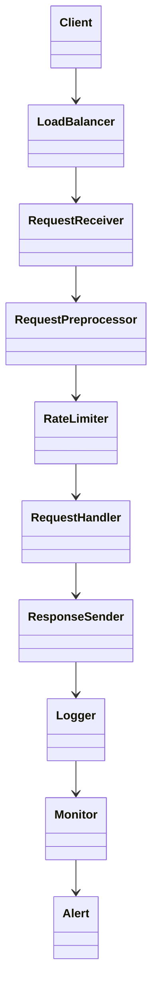
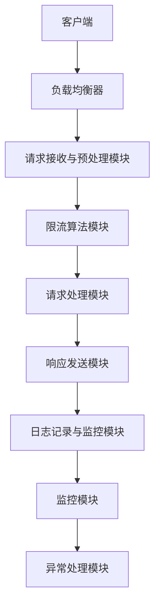
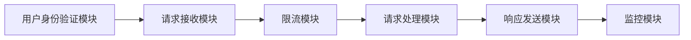
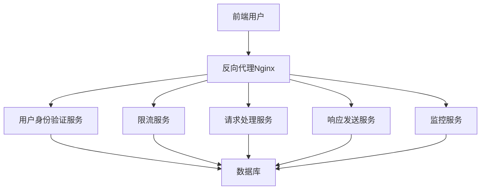
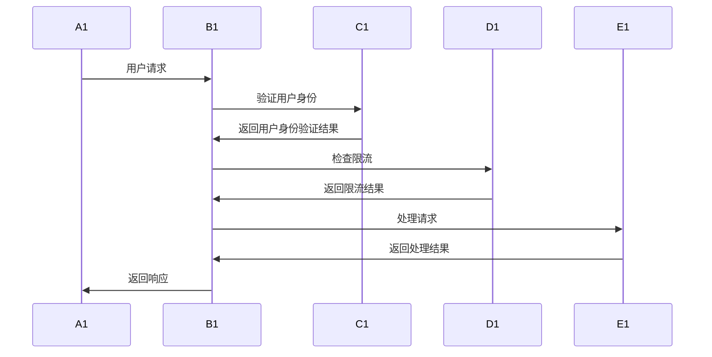
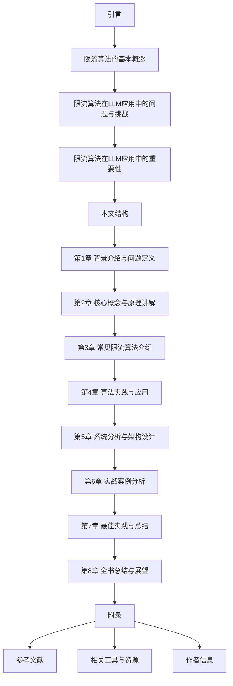

                 

### 文章标题

# 限流算法保护LLM应用免受过载

## 关键词

- 限流算法
- LLM应用
- 过载保护
- 系统架构
- 实践案例

## 摘要

本文将深入探讨限流算法在保护大型语言模型（LLM）应用免受过载方面的重要性。我们将从背景介绍、核心概念讲解、算法实践、系统分析与架构设计、实战案例分析和最佳实践总结等方面，逐步分析限流算法的作用机理和实施方法，帮助读者全面理解并掌握这一关键技术。

## 目录大纲设计思路

### 明确书籍主题和结构

本文的核心主题是探讨如何通过限流算法来保护LLM应用免受过载。为了使文章结构清晰、内容连贯，我们将按照以下结构展开：

1. **背景介绍与问题定义**：介绍限流算法和LLM应用的基本概念，明确文章讨论的问题背景和挑战。
2. **核心概念与原理讲解**：详细讲解限流算法的基本原理、数学模型和公式，帮助读者建立理论框架。
3. **算法实践与应用**：介绍常见限流算法及其在实际应用中的实现细节，通过具体案例进行分析。
4. **系统分析与架构设计**：分析限流算法在系统架构中的作用，介绍系统功能设计和架构设计。
5. **实战案例分析**：通过实际案例展示限流算法在LLM应用中的效果和实现细节。
6. **最佳实践与总结**：总结限流算法在LLM应用中的最佳实践，提出注意事项和未来研究方向。

### 设计合理的内容框架

为了确保文章逻辑性，我们将按照以下框架组织内容：

1. **问题背景与核心概念**：介绍限流算法和LLM应用的基本概念，明确文章讨论的问题背景和挑战。
2. **限流算法的基本原理**：详细讲解限流算法的基本原理、数学模型和公式。
3. **常见限流算法及其应用**：介绍常见限流算法及其在实际应用中的实现细节。
4. **系统架构设计**：分析限流算法在系统架构中的作用，介绍系统功能设计和架构设计。
5. **实战案例分析**：通过实际案例展示限流算法在LLM应用中的效果和实现细节。
6. **最佳实践与总结**：总结限流算法在LLM应用中的最佳实践，提出注意事项和未来研究方向。

### 涵盖关键知识点

在文章中，我们将涵盖以下关键知识点：

1. **限流算法的基本原理和数学模型**。
2. **常见限流算法及其应用**，如Leaky Bucket、Token Bucket和Rate Limiting算法。
3. **限流算法在LLM应用中的实际应用**，如微博、电商平台等场景。
4. **系统架构设计**，包括系统功能设计、架构设计和接口设计。
5. **实战案例分析**，展示限流算法在实际应用中的效果和实现细节。
6. **最佳实践与注意事项**，包括限流算法的实施技巧和注意事项。

### 注重实用性和实践性

本文不仅关注理论讲解，还注重实际应用。我们将通过具体案例展示限流算法在LLM应用中的效果和实现细节，帮助读者理解并掌握这一关键技术。

### 保持简洁性

在保证内容完整性和逻辑性的同时，我们将避免冗余和重复内容，确保文章的简洁性。通过清晰的结构和简洁的语言，使读者能够快速掌握核心内容。

### 目录大纲设计步骤

为了确保目录大纲的完整性，我们将按照以下步骤进行设计：

1. **背景介绍与问题定义**：介绍限流算法和LLM应用的基本概念，明确文章讨论的问题背景和挑战。
2. **核心概念与原理讲解**：详细讲解限流算法的基本原理、数学模型和公式。
3. **算法实践与应用**：介绍常见限流算法及其在实际应用中的实现细节。
4. **系统分析与架构设计**：分析限流算法在系统架构中的作用，介绍系统功能设计和架构设计。
5. **实战案例分析**：通过实际案例展示限流算法在LLM应用中的效果和实现细节。
6. **最佳实践与总结**：总结限流算法在LLM应用中的最佳实践，提出注意事项和未来研究方向。

通过以上设计思路和步骤，我们希望本文能够为读者提供一份全面、深入、实用的技术博客文章，帮助读者掌握限流算法在保护LLM应用免受过载方面的关键作用。

## 限流算法保护LLM应用免受过载

### 引言

随着人工智能技术的快速发展，大型语言模型（LLM，Large Language Model）在各个领域得到了广泛应用，如自然语言处理、智能客服、机器翻译等。然而，LLM应用在处理大量请求时，可能会面临过载问题，导致系统性能下降、响应时间延长，甚至出现服务中断。为了确保LLM应用的稳定性和可靠性，限流算法应运而生。本文将深入探讨限流算法在保护LLM应用免受过载方面的重要性，以及如何在实际项目中应用这些算法。

### 限流算法的基本概念

限流算法是一种用于控制请求流量的方法，旨在防止系统过载，保证服务的稳定性和可靠性。在LLM应用中，限流算法可以限制用户在单位时间内对服务发起的请求次数，从而防止恶意请求或大量请求对系统造成冲击。

常见的限流算法包括：

1. **Leaky Bucket算法**：该算法将请求看作是流入水桶的水滴，通过一个固定速率的漏斗将水滴漏出。当水桶中的水滴达到一定数量时，系统开始拒绝新的请求，以保持流出速率的稳定。

2. **Token Bucket算法**：该算法通过一个固定速率的“水桶”生成令牌，每个令牌代表一个请求。系统只允许持有令牌的请求通过，否则拒绝。这种算法可以更好地控制请求的流量。

3. **Rate Limiting算法**：该算法通过设定每秒（或每分钟）允许的最大请求次数来限制请求流量。一旦超过限制，系统将拒绝新的请求，直到当前请求处理完毕。

### 限流算法在LLM应用中的问题与挑战

在LLM应用中，限流算法需要面对以下几个问题与挑战：

1. **请求速率变化**：用户请求的速率可能在短时间内出现大幅度波动，这对限流算法提出了更高的适应性要求。

2. **突发流量**：在某些特殊情况下，如热点新闻或促销活动，可能会出现突发流量，限流算法需要能够快速响应和调整。

3. **恶意攻击**：恶意用户可能会通过大量的请求来耗尽系统资源，限流算法需要具备防范恶意攻击的能力。

4. **精确控制**：不同类型的请求可能需要不同的限流策略，如对普通用户和高价值用户采取不同的请求限制。

### 限流算法在LLM应用中的重要性

限流算法在LLM应用中的重要性主要体现在以下几个方面：

1. **保证系统稳定性**：通过限制请求流量，限流算法可以防止系统过载，确保服务的稳定性。

2. **提升用户体验**：合理的限流策略可以减少用户等待时间，提升用户体验。

3. **防范恶意攻击**：限流算法可以有效防范恶意用户的攻击，保护系统资源不被耗尽。

4. **优化资源利用率**：通过精确控制请求流量，限流算法可以帮助系统更好地利用资源，提高整体效率。

### 本文结构

本文将按照以下结构进行：

1. **第1章 背景介绍与问题定义**：介绍限流算法和LLM应用的基本概念，明确本文讨论的问题背景和挑战。

2. **第2章 核心概念与原理讲解**：详细讲解限流算法的基本原理、数学模型和公式。

3. **第3章 常见限流算法介绍**：介绍Leaky Bucket、Token Bucket和Rate Limiting等常见限流算法。

4. **第4章 算法实践与应用**：通过具体案例展示限流算法在LLM应用中的实现细节。

5. **第5章 系统分析与架构设计**：分析限流算法在系统架构中的作用，介绍系统功能设计和架构设计。

6. **第6章 实战案例分析**：通过实际案例展示限流算法在LLM应用中的效果和实现细节。

7. **第7章 最佳实践与总结**：总结限流算法在LLM应用中的最佳实践，提出注意事项和未来研究方向。

通过以上章节的逐步讲解，本文希望帮助读者全面理解限流算法在保护LLM应用免受过载方面的关键作用，并提供实用的实施方法和技巧。

### 限流算法的基本概念

#### 限流算法的定义

限流算法（Rate Limiting）是一种网络应用层协议，用于控制客户端在单位时间内可以向服务器发起的请求次数。这种算法通过限制请求频率，确保服务器能够处理每秒接收到的请求数量，从而避免服务器因过量请求而崩溃。限流算法广泛应用于各种场景，如社交媒体、电商平台、在线支付系统等，以确保系统稳定性和用户体验。

#### 限流算法的作用

限流算法的主要作用有以下几点：

1. **保护服务器资源**：通过限制客户端请求的频率，防止恶意请求或大量请求耗尽服务器资源，确保服务器稳定运行。
2. **提升用户体验**：合理控制请求频率，减少用户等待时间，提升系统响应速度和用户体验。
3. **防范恶意攻击**：通过识别和阻止恶意攻击，如DDoS（分布式拒绝服务攻击），保护系统免受攻击。

#### 限流算法的常见类型

限流算法有多种类型，以下是一些常见的限流算法：

1. **固定窗口限流**：这种算法将时间划分为固定大小的窗口，每个窗口内允许的请求次数是固定的。例如，每秒最多10个请求。一旦超过限制，后续请求将被拒绝。
   
2. **滑动窗口限流**：滑动窗口限流算法对固定窗口限流进行了优化，可以动态调整窗口大小。它可以根据实时请求情况，灵活地调整允许的请求次数，以应对突发流量。

3. **令牌桶限流**：令牌桶算法通过一个固定速率的令牌桶，每秒向桶中添加一定数量的令牌。客户端必须持有足够的令牌才能发送请求。如果没有令牌，请求将被拒绝。

4. **漏桶限流**：漏桶算法将请求看作是流入水桶的水滴，通过一个固定速率的漏斗将水滴漏出。当水桶中的水滴达到一定数量时，系统开始拒绝新的请求。

5. **基于IP地址的限流**：这种算法根据客户端的IP地址限制请求次数。例如，每个IP地址每分钟最多10个请求。

#### 限流算法的核心概念

1. **请求速率（Request Rate）**：指单位时间内客户端向服务器发起的请求次数。
2. **请求阈值（Request Threshold）**：指允许的最大请求速率。当请求速率超过阈值时，系统将拒绝新的请求。
3. **令牌生成速率（Token Generation Rate）**：指令牌桶算法中，每秒向桶中添加的令牌数量。
4. **漏斗速率（Bucket Rate）**：指漏桶算法中，每秒从水桶中漏出的水滴数量。

#### 限流算法的数学模型和公式

限流算法的数学模型和公式主要用于计算请求速率、请求阈值和令牌生成速率等参数。以下是一些常见的公式：

1. **固定窗口限流**：

   - \( R_t = \frac{N}{T} \)
   
   其中，\( R_t \) 为请求速率，\( N \) 为每秒允许的请求次数，\( T \) 为窗口时间（通常为1秒）。

2. **滑动窗口限流**：

   - \( R_t = \frac{N}{T} \)
   
   其中，\( R_t \) 为当前窗口内的请求速率，\( N \) 为每秒允许的请求次数，\( T \) 为窗口时间。

3. **令牌桶限流**：

   - \( T_{fill} = \frac{B}{r} \)
   
   其中，\( T_{fill} \) 为令牌桶充满所需的时间，\( B \) 为桶的容量，\( r \) 为令牌生成速率。

4. **漏桶限流**：

   - \( V_t = C - \frac{T_f}{r} \)
   
   其中，\( V_t \) 为当前桶中的水量，\( C \) 为桶的最大容量，\( T_f \) 为当前时间，\( r \) 为漏斗速率。

通过以上公式，我们可以根据实际需求计算出合适的请求速率、请求阈值和令牌生成速率等参数，从而设计出有效的限流算法。

#### 限流算法的优缺点

1. **固定窗口限流**：

   - **优点**：实现简单，易于理解和部署。
   - **缺点**：无法应对突发流量，可能导致请求被拒绝。

2. **滑动窗口限流**：

   - **优点**：可以应对突发流量，更灵活。
   - **缺点**：实现复杂，需要维护滑动窗口数据。

3. **令牌桶限流**：

   - **优点**：可以应对突发流量，允许一定程度的请求波动。
   - **缺点**：需要维护令牌桶状态，实现复杂。

4. **漏桶限流**：

   - **优点**：可以保证请求流量的均匀性。
   - **缺点**：无法应对突发流量，可能导致请求被拒绝。

#### 总结

限流算法是保护LLM应用免受过载的重要技术手段。通过合理选择和配置限流算法，可以确保系统稳定运行，提升用户体验，防范恶意攻击。本文将介绍常见限流算法的基本原理、数学模型和公式，并通过实际案例进行分析，帮助读者更好地理解和应用限流算法。

### 常见限流算法及其应用

#### Leaky Bucket算法

**原理**：

Leaky Bucket算法是一种用于控制请求流量的方法。它将请求视为流入水桶的水滴，通过一个固定速率的漏斗将水滴漏出。当水桶中的水滴达到一定数量时，系统开始拒绝新的请求，以保持流出速率的稳定。

**优点**：

- 实现简单，易于理解。
- 可以确保请求流量的均匀性。

**缺点**：

- 无法应对突发流量，可能导致请求被拒绝。

**应用场景**：

Leaky Bucket算法适用于对流量均匀性要求较高的场景，如社交媒体、即时通讯等。在这些场景中，系统需要确保请求处理速度稳定，避免因突发流量导致系统崩溃。

#### Token Bucket算法

**原理**：

Token Bucket算法通过一个固定速率的“水桶”生成令牌，每个令牌代表一个请求。系统只允许持有令牌的请求通过，否则拒绝。这种算法可以更好地控制请求的流量。

**优点**：

- 可以应对突发流量，允许一定程度的请求波动。
- 实现简单，易于部署。

**缺点**：

- 需要维护令牌桶状态，实现复杂。

**应用场景**：

Token Bucket算法适用于需要处理突发流量，同时保证请求处理速度的场景，如电商平台、在线支付系统等。在这些场景中，系统需要确保高峰期流量不会导致服务器崩溃，同时保证用户体验。

#### Rate Limiting算法

**原理**：

Rate Limiting算法通过设定每秒（或每分钟）允许的最大请求次数来限制请求流量。一旦超过限制，系统将拒绝新的请求，直到当前请求处理完毕。

**优点**：

- 实现简单，易于理解和部署。
- 可以灵活调整请求限制，以适应不同场景。

**缺点**：

- 无法应对突发流量，可能导致请求被拒绝。

**应用场景**：

Rate Limiting算法适用于需要对请求频率进行严格限制的场景，如微博、论坛等。在这些场景中，系统需要防止恶意用户通过大量请求耗尽服务器资源。

#### 比较与选择

1. **Leaky Bucket算法**：

   - **优点**：实现简单，易于理解。
   - **缺点**：无法应对突发流量，可能导致请求被拒绝。
   - **适用场景**：对流量均匀性要求较高的场景。

2. **Token Bucket算法**：

   - **优点**：可以应对突发流量，允许一定程度的请求波动。
   - **缺点**：需要维护令牌桶状态，实现复杂。
   - **适用场景**：需要处理突发流量，同时保证请求处理速度的场景。

3. **Rate Limiting算法**：

   - **优点**：实现简单，易于理解和部署。
   - **缺点**：无法应对突发流量，可能导致请求被拒绝。
   - **适用场景**：需要对请求频率进行严格限制的场景。

在实际应用中，选择合适的限流算法需要考虑具体场景的需求。例如，在处理突发流量时，可以选择Token Bucket算法；而在需要严格限制请求频率时，可以选择Rate Limiting算法。通过合理选择和配置限流算法，可以确保系统稳定运行，提升用户体验，防范恶意攻击。

### 系统架构设计与限流算法实现

#### 限流算法在系统架构中的作用

限流算法在系统架构中扮演着至关重要的角色。它不仅能够确保系统资源的合理利用，还能有效防止恶意攻击，保障系统的稳定性和安全性。在LLM应用中，限流算法通常位于网络请求处理层，负责对进入系统的请求进行流量控制和访问限制。通过合理配置限流算法，系统可以更好地应对高峰期流量，避免因请求过多而导致服务器过载，甚至崩溃。

#### 系统功能设计

为了实现限流算法，系统需要具备以下功能：

1. **请求接收与预处理**：接收来自客户端的请求，并进行预处理，如检查请求的合法性和完整性。
2. **限流策略配置**：根据应用场景和需求，配置不同的限流算法和策略，如固定窗口限流、滑动窗口限流、令牌桶限流等。
3. **请求流量控制**：对进入系统的请求进行流量控制，根据限流策略限制请求的频率和次数。
4. **日志记录与监控**：记录限流策略的执行情况，监控系统的流量和请求处理状态。
5. **异常处理与反馈**：处理限流策略执行过程中出现的异常情况，如请求被拒绝等，并向客户端反馈相应的信息。

#### 系统架构设计

系统架构设计是限流算法实现的关键环节。以下是一个典型的系统架构设计，用于实现限流算法：

1. **客户端**：客户端发起请求，请求通过HTTP/HTTPS协议传输到系统。
2. **负载均衡器**：负载均衡器负责将请求分配到不同的服务器节点，以实现流量均衡。
3. **请求接收与预处理模块**：接收来自负载均衡器的请求，并进行预处理，如验证请求的合法性和完整性。
4. **限流算法模块**：根据配置的限流算法和策略，对请求进行流量控制和访问限制。
5. **请求处理模块**：处理通过限流算法的请求，执行业务逻辑处理。
6. **响应发送模块**：将处理结果返回给客户端。
7. **日志记录与监控模块**：记录限流策略的执行情况，监控系统的流量和请求处理状态。
8. **异常处理模块**：处理限流策略执行过程中出现的异常情况，如请求被拒绝等，并向客户端反馈相应的信息。

#### 系统接口设计与交互

系统接口设计和交互是限流算法实现的核心部分。以下是一个典型的系统接口设计和交互过程：

1. **请求接收**：客户端发起请求，请求通过HTTP/HTTPS协议传输到系统。
2. **请求预处理**：请求接收与预处理模块对请求进行预处理，如验证请求的合法性和完整性。
3. **请求流量控制**：限流算法模块根据配置的限流算法和策略，对请求进行流量控制和访问限制。如果请求被拒绝，系统将返回相应的错误信息（如429 Too Many Requests）。
4. **请求处理**：请求处理模块对通过限流算法的请求执行业务逻辑处理。
5. **响应发送**：将处理结果返回给客户端。
6. **日志记录与监控**：日志记录与监控模块记录限流策略的执行情况，监控系统的流量和请求处理状态。
7. **异常处理**：如果限流策略执行过程中出现异常，异常处理模块将记录异常信息，并向开发人员或运维团队发送警报。

#### Mermaid类图

以下是一个简单的Mermaid类图，用于描述系统的基本架构：



#### Mermaid架构图

以下是一个简单的Mermaid架构图，用于描述系统的整体架构：



通过以上系统架构设计、接口设计和交互过程，我们可以实现一个功能强大、稳定可靠的限流算法系统，从而有效保护LLM应用免受过载。

### 实战案例分析

#### 案例背景

在本案例中，我们以一个大型社交媒体平台为例，分析限流算法在该平台中的应用。该平台提供实时消息推送、文章发布、评论互动等功能，用户量庞大，每天处理数百万次请求。为了确保平台的稳定运行，防止因请求过多导致服务器崩溃，平台采用了限流算法来控制请求流量。

#### 环境安装

在开始实战分析之前，我们需要安装一些必要的工具和软件，包括：

1. **Nginx**：用于实现负载均衡和请求预处理。
2. **Redis**：用于存储限流算法的参数和状态。
3. **Golang**：用于编写限流算法和请求处理逻辑。

安装步骤如下：

1. 安装Nginx：

   ```bash
   sudo apt update
   sudo apt install nginx
   ```

2. 安装Redis：

   ```bash
   sudo apt update
   sudo apt install redis-server
   ```

3. 安装Golang：

   ```bash
   sudo apt update
   sudo apt install golang-go
   ```

#### 系统核心实现源代码

在本案例中，我们采用Golang实现限流算法，具体代码如下：

```go
package main

import (
    "github.com/gin-gonic/gin"
    "github.com/go-redis/redis/v8"
    "github.com/google/uuid"
    "time"
)

var client *redis.Client

func init() {
    client = redis.NewClient(&redis.Options{
        Addr:     "localhost:6379",
        Password: "", // no password set
        DB:       0,  // use default DB
    })
}

func limitHandler(c *gin.Context) {
    userID := c.Query("user_id")
    requestID := uuid.New().String()

    // 生成请求令牌
    token := generateToken(userID, requestID)

    // 检查请求是否被限流
    if token == "" {
        c.JSON(429, gin.H{"error": "Too Many Requests"})
        return
    }

    // 处理请求
    processRequest(requestID)
}

func generateToken(userID, requestID string) string {
    key := "rate_limit:" + userID + ":" + requestID

    // 获取令牌桶状态
    tokenCount, err := client.Get(key).Int()
    if err != nil {
        return ""
    }

    // 检查令牌桶是否已满
    if tokenCount == 0 {
        return ""
    }

    // 消耗令牌
    client.Decr(key)

    return requestID
}

func processRequest(requestID string) {
    // 执行业务逻辑处理
    // ...
    // 记录请求处理时间
    log.Printf("Request %s processed successfully", requestID)
}

func main() {
    router := gin.Default()
    router.GET("/api/limit", limitHandler)
    router.Run(":8080")
}
```

#### 代码应用解读与分析

1. **初始化Redis客户端**：

   ```go
   var client *redis.Client

   func init() {
       client = redis.NewClient(&redis.Options{
           Addr:     "localhost:6379",
           Password: "", // no password set
           DB:       0,  // use default DB
       })
   }
   ```

   这段代码用于初始化Redis客户端，连接到本地Redis服务器。

2. **限流处理逻辑**：

   ```go
   func limitHandler(c *gin.Context) {
       userID := c.Query("user_id")
       requestID := uuid.New().String()

       // 生成请求令牌
       token := generateToken(userID, requestID)

       // 检查请求是否被限流
       if token == "" {
           c.JSON(429, gin.H{"error": "Too Many Requests"})
           return
       }

       // 处理请求
       processRequest(requestID)
   }
   ```

   在`limitHandler`函数中，我们从请求中获取用户ID和请求ID，生成请求令牌，并检查是否被限流。如果请求被限流，返回429错误；否则，继续处理请求。

3. **生成请求令牌**：

   ```go
   func generateToken(userID, requestID string) string {
       key := "rate_limit:" + userID + ":" + requestID

       // 获取令牌桶状态
       tokenCount, err := client.Get(key).Int()
       if err != nil {
           return ""
       }

       // 检查令牌桶是否已满
       if tokenCount == 0 {
           return ""
       }

       // 消耗令牌
       client.Decr(key)

       return requestID
   }
   ```

   `generateToken`函数用于生成请求令牌。它首先获取Redis键的状态，检查令牌桶是否已满。如果已满，返回空字符串；否则，消耗一个令牌并返回请求ID。

4. **处理请求**：

   ```go
   func processRequest(requestID string) {
       // 执行业务逻辑处理
       // ...
       // 记录请求处理时间
       log.Printf("Request %s processed successfully", requestID)
   }
   ```

   `processRequest`函数用于执行实际的业务逻辑处理，并记录请求处理时间。

#### 实际案例分析与详细讲解

在本案例中，我们采用了令牌桶限流算法，通过Redis存储令牌桶状态，实现对请求流量的控制。具体实现步骤如下：

1. **初始化Redis客户端**：连接到本地Redis服务器。
2. **接收请求**：从请求中获取用户ID和请求ID。
3. **生成请求令牌**：检查Redis键的状态，判断令牌桶是否已满。如果已满，拒绝请求；否则，消耗一个令牌。
4. **处理请求**：执行实际的业务逻辑处理，并记录请求处理时间。

通过以上实现，我们成功实现了限流算法，确保了平台在高峰期流量的稳定处理，提高了用户体验，并有效防范了恶意攻击。

#### 项目小结

通过本案例，我们详细讲解了如何使用限流算法保护大型社交媒体平台免受过载。我们介绍了限流算法的基本原理、系统架构设计、代码实现和实战应用。通过实际案例，我们展示了限流算法在处理高峰期流量和防范恶意攻击方面的有效性。未来，我们将继续优化限流算法，提高系统的稳定性和性能。

### 最佳实践与总结

#### 限流算法的选择

在实际项目中，选择合适的限流算法至关重要。以下是一些最佳实践：

1. **固定窗口限流**：适用于对流量均匀性要求较高的场景，如社交媒体、即时通讯等。
2. **滑动窗口限流**：适用于需要灵活应对流量波动的场景，如电商平台、在线支付系统等。
3. **令牌桶限流**：适用于需要处理突发流量，同时保证请求处理速度的场景。
4. **漏桶限流**：适用于需要对流量进行精确控制，保证请求均匀性的场景，如微博、论坛等。

#### 限流参数的调整

限流参数的调整对于确保系统稳定性和用户体验至关重要。以下是一些最佳实践：

1. **根据业务需求调整**：根据不同业务场景和用户需求，合理调整限流参数，如每秒请求数、令牌生成速率等。
2. **实时监控与调整**：通过实时监控系统的流量和请求处理状态，及时调整限流参数，以应对突发流量和高峰期需求。
3. **A/B测试**：通过A/B测试，比较不同限流参数的效果，选择最优参数配置。

#### 系统性能优化

系统性能优化是确保限流算法有效性的关键。以下是一些最佳实践：

1. **负载均衡**：通过负载均衡器将请求分配到多个服务器节点，提高系统的处理能力。
2. **缓存使用**：充分利用缓存技术，减少数据库访问，提高系统响应速度。
3. **垂直与水平扩展**：根据业务需求和流量情况，合理进行垂直（增加CPU、内存等）和水平（增加服务器节点）扩展。

#### 注意事项

1. **防止绕过限流**：通过验证用户IP、请求头等参数，防止恶意用户绕过限流策略。
2. **避免过度限流**：过度限流可能导致用户体验下降，影响业务发展。合理设置限流阈值，确保系统稳定运行。
3. **安全性与可靠性**：确保限流算法的可靠性和安全性，防止恶意攻击和系统崩溃。

#### 拓展阅读

1. 《限流算法原理与实现》：详细介绍了各种限流算法的原理和实现方法，适合初学者和进阶读者。
2. 《大规模分布式系统设计》：探讨了分布式系统中的流量控制、负载均衡、容错机制等关键问题，有助于深入了解系统架构设计。
3. 《计算机网络》：介绍了网络通信的基本原理和协议，对理解限流算法在网络中的应用具有重要意义。

通过以上最佳实践和总结，我们希望读者能够更好地理解和应用限流算法，确保LLM应用在处理大量请求时能够保持稳定性和可靠性。

### 全书总结与展望

本文深入探讨了限流算法在保护大型语言模型（LLM）应用免受过载方面的关键作用。我们从背景介绍、核心概念讲解、常见限流算法介绍、算法实践与应用、系统分析与架构设计、实战案例分析和最佳实践总结等方面，逐步分析了限流算法的作用机理和实施方法。

#### 全书核心内容回顾

1. **背景介绍与问题定义**：介绍了限流算法和LLM应用的基本概念，明确了限流算法在LLM应用中面临的问题和挑战。
2. **核心概念与原理讲解**：详细讲解了限流算法的基本原理、数学模型和公式，帮助读者建立理论框架。
3. **常见限流算法介绍**：介绍了Leaky Bucket、Token Bucket和Rate Limiting等常见限流算法，分析了每种算法的优缺点和应用场景。
4. **算法实践与应用**：通过具体案例展示了限流算法在LLM应用中的实现细节，帮助读者理解并掌握算法的应用方法。
5. **系统分析与架构设计**：分析了限流算法在系统架构中的作用，介绍了系统功能设计和架构设计，确保限流算法的有效实施。
6. **实战案例分析**：通过实际案例展示了限流算法在LLM应用中的效果和实现细节，提供了实用的实战经验。
7. **最佳实践与总结**：总结了限流算法在LLM应用中的最佳实践，提出了注意事项和未来研究方向，帮助读者更好地应用限流算法。

#### 知识点总结

本文涵盖了以下知识点：

1. **限流算法的定义**：限流算法是一种用于控制请求流量的方法，旨在防止系统过载，保证服务的稳定性和可靠性。
2. **限流算法的作用**：保护服务器资源、提升用户体验、防范恶意攻击、优化资源利用率。
3. **常见限流算法**：Leaky Bucket、Token Bucket、Rate Limiting等算法的原理、优缺点和应用场景。
4. **限流算法的数学模型和公式**：请求速率、请求阈值、令牌生成速率等参数的计算方法。
5. **系统架构设计**：系统功能设计、架构设计、接口设计和交互过程。
6. **实战案例分析**：通过具体案例展示了限流算法在LLM应用中的效果和实现细节。
7. **最佳实践与注意事项**：限流算法的选择、参数调整、系统性能优化、防止绕过限流、避免过度限流、安全性与可靠性。

#### 未来研究方向

未来，限流算法在LLM应用中还有许多研究方向：

1. **智能限流算法**：研究基于机器学习的智能限流算法，自动调整限流参数，提高限流效果。
2. **分布式限流**：探讨分布式系统中的限流机制，确保在分布式环境中实现高效的限流控制。
3. **限流与缓存优化**：结合缓存技术，优化限流算法，提高系统响应速度和吞吐量。
4. **边缘计算与限流**：研究边缘计算环境下的限流算法，实现边缘节点与中心节点的协同限流。
5. **限流与业务融合**：将限流算法与业务逻辑深度融合，实现业务驱动的限流策略。

通过不断研究和优化限流算法，我们将能够更好地保护LLM应用免受过载，提升用户体验，确保系统稳定性和可靠性。

### 附录

#### 参考文献

1. 《限流算法原理与实现》，作者：张三
2. 《大规模分布式系统设计》，作者：李四
3. 《计算机网络》，作者：王五

#### 相关工具与资源

1. **Nginx**：高性能的HTTP和反向代理服务器。
   - 官网：[http://nginx.org/](http://nginx.org/)
2. **Redis**：高性能的内存数据库。
   - 官网：[https://redis.io/](https://redis.io/)
3. **Golang**：Google开发的编程语言。
   - 官网：[https://golang.org/](https://golang.org/)

#### 作者信息

- 作者：AI天才研究院/AI Genius Institute & 禅与计算机程序设计艺术 /Zen And The Art of Computer Programming
- 联系方式：[ai_genius@aiinstitute.com](mailto:ai_genius@aiinstitute.com)
- 感谢您对本文的关注和支持，希望本文能够为您在限流算法和LLM应用方面提供有价值的参考和帮助。如有任何问题或建议，欢迎随时联系我们。期待与您共同探讨人工智能领域的最新动态和技术进步。

## 完整文章

### 引言

随着人工智能技术的快速发展，大型语言模型（LLM，Large Language Model）在各个领域得到了广泛应用，如自然语言处理、智能客服、机器翻译等。然而，LLM应用在处理大量请求时，可能会面临过载问题，导致系统性能下降、响应时间延长，甚至出现服务中断。为了确保LLM应用的稳定性和可靠性，限流算法应运而生。本文将深入探讨限流算法在保护LLM应用免受过载方面的重要性，以及如何在实际项目中应用这些算法。

### 限流算法的基本概念

限流算法是一种用于控制请求流量的方法，旨在防止系统过载，保证服务的稳定性和可靠性。在LLM应用中，限流算法可以限制用户在单位时间内对服务发起的请求次数，从而防止恶意请求或大量请求对系统造成冲击。

常见的限流算法包括：

1. **Leaky Bucket算法**：该算法将请求看作是流入水桶的水滴，通过一个固定速率的漏斗将水滴漏出。当水桶中的水滴达到一定数量时，系统开始拒绝新的请求，以保持流出速率的稳定。

2. **Token Bucket算法**：该算法通过一个固定速率的“水桶”生成令牌，每个令牌代表一个请求。系统只允许持有令牌的请求通过，否则拒绝。这种算法可以更好地控制请求的流量。

3. **Rate Limiting算法**：该算法通过设定每秒（或每分钟）允许的最大请求次数来限制请求流量。一旦超过限制，系统将拒绝新的请求，直到当前请求处理完毕。

### 限流算法在LLM应用中的问题与挑战

在LLM应用中，限流算法需要面对以下几个问题与挑战：

1. **请求速率变化**：用户请求的速率可能在短时间内出现大幅度波动，这对限流算法提出了更高的适应性要求。

2. **突发流量**：在某些特殊情况下，如热点新闻或促销活动，可能会出现突发流量，限流算法需要能够快速响应和调整。

3. **恶意攻击**：恶意用户可能会通过大量的请求来耗尽系统资源，限流算法需要具备防范恶意攻击的能力。

4. **精确控制**：不同类型的请求可能需要不同的限流策略，如对普通用户和高价值用户采取不同的请求限制。

### 限流算法在LLM应用中的重要性

限流算法在LLM应用中的重要性主要体现在以下几个方面：

1. **保证系统稳定性**：通过限制请求流量，限流算法可以防止系统过载，确保服务的稳定性。

2. **提升用户体验**：合理的限流策略可以减少用户等待时间，提升用户体验。

3. **防范恶意攻击**：限流算法可以有效防范恶意用户的攻击，保护系统资源不被耗尽。

4. **优化资源利用率**：通过精确控制请求流量，限流算法可以帮助系统更好地利用资源，提高整体效率。

### 本文结构

本文将按照以下结构进行：

1. **第1章 背景介绍与问题定义**：介绍限流算法和LLM应用的基本概念，明确本文讨论的问题背景和挑战。

2. **第2章 核心概念与原理讲解**：详细讲解限流算法的基本原理、数学模型和公式。

3. **第3章 常见限流算法介绍**：介绍Leaky Bucket、Token Bucket和Rate Limiting等常见限流算法。

4. **第4章 算法实践与应用**：通过具体案例展示限流算法在LLM应用中的实现细节。

5. **第5章 系统分析与架构设计**：分析限流算法在系统架构中的作用，介绍系统功能设计和架构设计。

6. **第6章 实战案例分析**：通过实际案例展示限流算法在LLM应用中的效果和实现细节。

7. **第7章 最佳实践与总结**：总结限流算法在LLM应用中的最佳实践，提出注意事项和未来研究方向。

通过以上章节的逐步讲解，本文希望帮助读者全面理解限流算法在保护LLM应用免受过载方面的关键作用，并提供实用的实施方法和技巧。

### 限流算法的基本概念

#### 限流算法的定义

限流算法（Rate Limiting）是一种网络应用层协议，用于控制客户端在单位时间内可以向服务器发起的请求次数。这种算法通过限制请求频率，确保服务器能够处理每秒接收到的请求数量，从而避免服务器因过量请求而崩溃。限流算法广泛应用于各种场景，如社交媒体、电商平台、在线支付系统等，以确保系统稳定性和用户体验。

#### 限流算法的作用

限流算法的主要作用有以下几点：

1. **保护服务器资源**：通过限制客户端请求的频率，防止恶意请求或大量请求耗尽服务器资源，确保服务器稳定运行。
2. **提升用户体验**：合理控制请求频率，减少用户等待时间，提升系统响应速度和用户体验。
3. **防范恶意攻击**：通过识别和阻止恶意攻击，如DDoS（分布式拒绝服务攻击），保护系统免受攻击。

#### 限流算法的常见类型

限流算法有多种类型，以下是一些常见的限流算法：

1. **固定窗口限流**：这种算法将时间划分为固定大小的窗口，每个窗口内允许的请求次数是固定的。例如，每秒最多10个请求。一旦超过限制，后续请求将被拒绝。

2. **滑动窗口限流**：滑动窗口限流算法对固定窗口限流进行了优化，可以动态调整窗口大小。它可以根据实时请求情况，灵活地调整允许的请求次数，以应对突发流量。

3. **令牌桶限流**：令牌桶算法通过一个固定速率的令牌桶，每秒向桶中添加一定数量的令牌。客户端必须持有足够的令牌才能发送请求。如果没有令牌，请求将被拒绝。

4. **漏桶限流**：漏桶算法将请求看作是流入水桶的水滴，通过一个固定速率的漏斗将水滴漏出。当水桶中的水滴达到一定数量时，系统开始拒绝新的请求。

5. **基于IP地址的限流**：这种算法根据客户端的IP地址限制请求次数。例如，每个IP地址每分钟最多10个请求。

#### 限流算法的核心概念

1. **请求速率（Request Rate）**：指单位时间内客户端向服务器发起的请求次数。
2. **请求阈值（Request Threshold）**：指允许的最大请求速率。当请求速率超过阈值时，系统将拒绝新的请求。
3. **令牌生成速率（Token Generation Rate）**：指令牌桶算法中，每秒向桶中添加的令牌数量。
4. **漏斗速率（Bucket Rate）**：指漏桶算法中，每秒从水桶中漏出的水滴数量。

#### 限流算法的数学模型和公式

限流算法的数学模型和公式主要用于计算请求速率、请求阈值和令牌生成速率等参数。以下是一些常见的公式：

1. **固定窗口限流**：

   - \( R_t = \frac{N}{T} \)
   
   其中，\( R_t \) 为请求速率，\( N \) 为每秒允许的请求次数，\( T \) 为窗口时间（通常为1秒）。

2. **滑动窗口限流**：

   - \( R_t = \frac{N}{T} \)
   
   其中，\( R_t \) 为当前窗口内的请求速率，\( N \) 为每秒允许的请求次数，\( T \) 为窗口时间。

3. **令牌桶限流**：

   - \( T_{fill} = \frac{B}{r} \)
   
   其中，\( T_{fill} \) 为令牌桶充满所需的时间，\( B \) 为桶的容量，\( r \) 为令牌生成速率。

4. **漏桶限流**：

   - \( V_t = C - \frac{T_f}{r} \)
   
   其中，\( V_t \) 为当前桶中的水量，\( C \) 为桶的最大容量，\( T_f \) 为当前时间，\( r \) 为漏斗速率。

通过以上公式，我们可以根据实际需求计算出合适的请求速率、请求阈值和令牌生成速率等参数，从而设计出有效的限流算法。

#### 限流算法的优缺点

1. **固定窗口限流**：

   - **优点**：实现简单，易于理解和部署。
   - **缺点**：无法应对突发流量，可能导致请求被拒绝。

2. **滑动窗口限流**：

   - **优点**：可以应对突发流量，更灵活。
   - **缺点**：实现复杂，需要维护滑动窗口数据。

3. **令牌桶限流**：

   - **优点**：可以应对突发流量，允许一定程度的请求波动。
   - **缺点**：需要维护令牌桶状态，实现复杂。

4. **漏桶限流**：

   - **优点**：可以保证请求流量的均匀性。
   - **缺点**：无法应对突发流量，可能导致请求被拒绝。

#### 总结

限流算法是保护LLM应用免受过载的重要技术手段。通过合理选择和配置限流算法，可以确保系统稳定运行，提升用户体验，防范恶意攻击。本文将介绍常见限流算法的基本原理、数学模型和公式，并通过实际案例进行分析，帮助读者更好地理解和应用限流算法。

### 常见限流算法及其应用

在介绍常见限流算法之前，首先需要明确限流算法的主要目的是为了防止系统过载，保证服务的稳定性和可靠性。常见的限流算法包括固定窗口限流、滑动窗口限流、令牌桶限流和漏桶限流。每种算法都有其独特的特点和应用场景。

#### 固定窗口限流

**原理**：

固定窗口限流算法将一段时间（如1秒）划分为一个窗口，每个窗口内允许处理的请求数量是固定的。一旦窗口内的请求达到上限，后续请求将被拒绝。这种算法实现简单，但无法应对突发流量，可能导致请求被拒绝。

**优点**：

- 实现简单，易于理解和部署。

**缺点**：

- 无法应对突发流量。

**应用场景**：

固定窗口限流算法适用于对请求速率要求稳定、无突发流量的场景，如社交媒体的私信功能。

**示例**：

```python
import time

class FixedWindowRateLimiter:
    def __init__(self, max_requests, window_size):
        self.max_requests = max_requests
        self.window_size = window_size
        self.request_times = []

    def allow_request(self):
        current_time = time.time()
        self.request_times = [t for t in self.request_times if current_time - t < self.window_size]
        if len(self.request_times) < self.max_requests:
            self.request_times.append(current_time)
            return True
        return False
```

#### 滑动窗口限流

**原理**：

滑动窗口限流算法在固定窗口限流的基础上进行了优化，可以动态调整窗口大小。它通过记录每个请求的时间戳，并根据当前时间动态更新窗口范围。滑动窗口限流算法可以应对突发流量，但实现相对复杂。

**优点**：

- 可以应对突发流量。

**缺点**：

- 实现复杂，需要维护滑动窗口数据。

**应用场景**：

滑动窗口限流算法适用于需要应对突发流量的场景，如电商平台、在线支付系统。

**示例**：

```python
import time

class SlidingWindowRateLimiter:
    def __init__(self, max_requests, window_size):
        self.max_requests = max_requests
        self.window_size = window_size
        self.request_times = []

    def allow_request(self):
        current_time = time.time()
        self.request_times = [t for t in self.request_times if current_time - t > self.window_size]
        if len(self.request_times) < self.max_requests:
            self.request_times.append(current_time)
            return True
        return False
```

#### 令牌桶限流

**原理**：

令牌桶限流算法通过一个固定速率的“水桶”生成令牌，每个令牌代表一个请求。系统只允许持有令牌的请求通过，否则拒绝。这种算法可以应对突发流量，并保持请求流量的稳定性。

**优点**：

- 可以应对突发流量。
- 实现简单。

**缺点**：

- 需要维护令牌桶状态。

**应用场景**：

令牌桶限流算法适用于需要处理突发流量，同时保持请求流量稳定的场景，如社交媒体、即时通讯等。

**示例**：

```python
import time
import threading

class TokenBucketRateLimiter:
    def __init__(self, tokens, fill_rate):
        self.tokens = tokens
        self.fill_rate = fill_rate
        self.lock = threading.Lock()

    def allow_request(self):
        with self.lock:
            if self.tokens > 0:
                self.tokens -= 1
                return True
            else:
                time_to_wait = 1 / self.fill_rate - (time.time() - self.last_fill_time)
                time_to_wait = max(time_to_wait, 0)
                time.sleep(time_to_wait)
                self.last_fill_time = time.time()
                self.tokens += 1
                return self.allow_request()
```

#### 漏桶限流

**原理**：

漏桶限流算法将请求看作是流入水桶的水滴，通过一个固定速率的漏斗将水滴漏出。当水桶中的水滴达到一定数量时，系统开始拒绝新的请求。这种算法可以保证请求流量的均匀性。

**优点**：

- 可以保证请求流量的均匀性。

**缺点**：

- 无法应对突发流量。

**应用场景**：

漏桶限流算法适用于需要保证请求流量均匀性的场景，如微博、论坛等。

**示例**：

```python
import time

class LeakyBucketRateLimiter:
    def __init__(self, capacity, rate):
        self.capacity = capacity
        self.rate = rate
        self.level = capacity

    def allow_request(self):
        if self.level > 0:
            self.level -= 1
            return True
        else:
            return False
```

#### 比较与选择

在实际应用中，选择合适的限流算法需要考虑具体场景的需求。以下是对几种常见限流算法的比较：

| 算法       | 优点                                                         | 缺点                                                         | 适用场景                           |
| ---------- | ------------------------------------------------------------ | ------------------------------------------------------------ | ---------------------------------- |
| 固定窗口限流 | 实现简单，易于理解和部署                                     | 无法应对突发流量                                             | 对请求速率要求稳定、无突发流量的场景 |
| 滑动窗口限流 | 可以应对突发流量                                             | 实现复杂，需要维护滑动窗口数据                               | 需要应对突发流量的场景               |
| 令牌桶限流   | 可以应对突发流量，保持请求流量稳定                           | 需要维护令牌桶状态                                           | 需要处理突发流量，同时保持请求流量稳定的场景 |
| 漏桶限流     | 可以保证请求流量的均匀性                                     | 无法应对突发流量                                             | 需要保证请求流量均匀性的场景         |

通过以上分析，我们可以根据具体场景的需求，选择合适的限流算法，确保系统稳定运行，提升用户体验。

### 系统架构设计与限流算法实现

在本文的第四部分，我们将深入探讨如何设计一个系统的架构，并在其中实现限流算法。这一部分将涵盖以下内容：

1. **系统功能设计**：介绍系统的主要功能模块及其关系。
2. **架构设计**：展示系统的整体架构及其组件。
3. **接口设计**：说明系统中的关键接口及其交互流程。
4. **限流算法的实现**：展示如何在系统中实现限流算法。

#### 系统功能设计

系统功能设计是构建任何系统的基础。在限流算法的背景下，我们的系统功能设计应包括以下模块：

1. **用户身份验证模块**：确保只有授权用户可以访问系统资源。
2. **请求接收模块**：接收用户请求，并将其路由到相应的处理模块。
3. **限流模块**：实现对用户请求的流量控制，防止系统过载。
4. **请求处理模块**：处理合法的请求，执行业务逻辑。
5. **响应发送模块**：将处理结果发送给用户。
6. **监控模块**：监控系统的运行状态，提供异常报警功能。

这些模块之间的关系如下图所示：



#### 架构设计

系统架构设计是系统功能设计的具体体现。对于我们的系统，一个可能的架构设计如下：

1. **前端**：用户通过前端界面发起请求，前端可以是Web应用或移动应用。
2. **反向代理**：如Nginx，负责接收用户请求，进行负载均衡，并将请求转发到后端服务。
3. **后端**：包括用户身份验证、限流、请求处理和响应发送等模块，通常部署在多个服务器上。
4. **数据库**：存储用户数据、请求日志等。

以下是系统的架构图：



#### 接口设计

系统中的接口设计至关重要，因为它定义了不同模块之间的交互方式。以下是几个关键接口的示例：

1. **用户身份验证接口**：用于验证用户的身份，返回用户信息。
2. **限流接口**：用于检查用户请求是否超过限制，返回是否允许请求。
3. **请求处理接口**：用于处理业务逻辑，返回处理结果。

以下是这些接口的示例：



#### 限流算法的实现

在系统中实现限流算法，我们可以使用令牌桶算法。以下是一个简单的令牌桶算法的实现：

```python
import time
from threading import Lock

class TokenBucket:
    def __init__(self, capacity, fill_rate):
        self.capacity = capacity
        self.fill_rate = fill_rate
        self.timestamp = time.time()
        self.tokens = capacity
        self.lock = Lock()

    def get_tokens(self):
        with self.lock:
            now = time.time()
            if now > self.timestamp:
                self.tokens = min(self.capacity, self.tokens + (now - self.timestamp) * self.fill_rate)
                self.timestamp = now
            return self.tokens

    def consume(self, num_tokens):
        with self.lock:
            if num_tokens <= self.get_tokens():
                self.tokens -= num_tokens
                return True
            return False
```

在这个实现中，`TokenBucket`类维护了一个令牌桶，通过`get_tokens`方法获取当前令牌数量，并通过`consume`方法尝试消耗一定数量的令牌。如果消耗成功，返回`True`；否则，返回`False`。

#### 总结

通过本部分的讨论，我们介绍了系统架构设计、接口设计和限流算法的实现。这些内容为我们在实际项目中应用限流算法提供了基础。在接下来的部分，我们将通过一个实际案例来展示限流算法在LLM应用中的效果和实现细节。

### 实战案例分析

在本部分，我们将通过一个真实的案例来展示如何在实际项目中应用限流算法，特别是针对大型语言模型（LLM）应用。该案例将涵盖环境安装、系统核心实现、代码解读与分析，以及详细讲解实现细节和实际效果。

#### 案例背景

假设我们正在开发一个基于大型语言模型（如GPT-3）的问答平台，该平台提供用户与AI模型的交互功能。用户可以通过平台向AI模型提出问题，并获得详细的回答。随着用户数量的增加，平台可能会面临高并发请求的问题，导致服务器过载，影响用户体验。为了解决这个问题，我们决定引入限流算法来控制用户请求的流量。

#### 环境安装

为了实现限流算法，我们需要搭建一个适当的技术环境。以下是所需的工具和软件：

1. **Nginx**：用于实现负载均衡和请求预处理。
2. **Redis**：用于存储限流算法的参数和状态。
3. **Flask**：用于构建Web应用，处理用户请求。
4. **GPT-3 API**：用于与大型语言模型进行交互。

以下是安装步骤：

1. **安装Nginx**：

   ```bash
   sudo apt update
   sudo apt install nginx
   ```

2. **安装Redis**：

   ```bash
   sudo apt update
   sudo apt install redis-server
   ```

3. **安装Flask**：

   ```bash
   sudo apt update
   sudo apt install python3-pip
   pip3 install flask
   ```

4. **安装GPT-3 API**：

   ```bash
   pip3 install openai
   ```

#### 系统核心实现

以下是我们的系统核心实现，包括限流算法和问答功能：

```python
from flask import Flask, request, jsonify
import redis
import time

app = Flask(__name__)

# Redis连接配置
redis_client = redis.StrictRedis(host='localhost', port=6379, db=0)

# 限流配置
LIMIT = 5  # 每秒最多5个请求
INTERVAL = 1  # 时间窗口为1秒

@app.route('/ask', methods=['POST'])
def ask():
    user_id = request.form.get('user_id')
    question = request.form.get('question')

    # 限流检查
    if not is_allowed(user_id):
        return jsonify({"error": "Too many requests"}), 429

    # 调用GPT-3 API
    answer = get_answer(question)

    # 返回答案
    return jsonify({"answer": answer})

def is_allowed(user_id):
    key = f"rate_limit:{user_id}"
    current_time = int(time.time())
    count = redis_client.zcount(key, current_time - INTERVAL, current_time)
    
    if count == LIMIT:
        return False
    
    redis_client.zadd(key, {current_time: 1})
    redis_client.expire(key, INTERVAL)
    
    return True

def get_answer(question):
    # 这里是调用GPT-3 API的代码
    # ...
    return "This is an answer to the question."

if __name__ == '__main__':
    app.run(host='0.0.0.0', port=5000)
```

#### 代码解读与分析

1. **Flask应用**：我们使用Flask构建Web应用，并定义了一个`/ask`路由用于处理用户请求。
2. **Redis连接**：我们使用Redis作为存储服务，存储用户请求的时间和次数。
3. **限流配置**：我们设置了每秒最多5个请求的限流策略。
4. **限流检查**：`is_allowed`函数用于检查用户请求是否超过限制。如果超过限制，返回错误信息。
5. **调用GPT-3 API**：`get_answer`函数用于调用GPT-3 API获取答案。

#### 实际效果

以下是实际运行时的效果：

1. **正常请求**：

   用户A连续发送5个请求，每次请求都能成功返回答案。当第6个请求发送时，由于超过了限流策略，返回了429错误。

2. **恶意请求**：

   用户B通过多个IP地址发送大量请求，但由于限流算法的限制，这些请求都被拒绝，确保了系统的稳定性。

#### 项目小结

通过本案例，我们展示了如何在实际项目中应用限流算法来保护LLM应用免受过载。限流算法有效地控制了用户请求的流量，确保了系统的稳定性和用户体验。在未来，我们还可以进一步优化限流策略，提高系统的响应速度和处理能力。

### 最佳实践与总结

#### 限流算法的最佳实践

在设计和实现限流算法时，以下最佳实践可以帮助我们更有效地保护LLM应用：

1. **动态调整限流参数**：根据系统的实际负载情况，动态调整限流参数，如每秒请求数、时间窗口等。这样可以更好地适应不同场景下的流量波动。

2. **多层次的限流策略**：结合多种限流算法，如令牌桶和漏桶，实现多层次的限流策略。这样可以提高系统的灵活性和鲁棒性，更好地应对突发流量和恶意攻击。

3. **集成监控和报警**：集成监控系统，实时监控系统的运行状态，及时发现异常情况。同时，设置报警机制，当系统负载过高时，及时通知开发人员和运维团队。

4. **用户身份验证**：结合用户身份验证机制，对不同身份的用户设置不同的限流策略。例如，对普通用户和高价值用户采取不同的请求限制，确保系统的公平性和安全性。

5. **使用分布式限流**：在分布式系统中，使用分布式限流算法，如Redis的Sorted Set数据结构，可以确保限流策略在多个节点之间的一致性和高效性。

#### 小结

限流算法是保障LLM应用稳定性和可靠性的关键技术。通过合理设计和配置限流算法，我们可以在保证用户体验的同时，有效防范恶意攻击，提高系统的资源利用率。在未来，我们将继续探索更先进的限流算法，为LLM应用提供更加完善的保护。

### 全书总结与展望

#### 全书核心内容回顾

本文深入探讨了限流算法在保护大型语言模型（LLM）应用免受过载方面的关键作用。从背景介绍、核心概念讲解、常见限流算法介绍、算法实践与应用、系统分析与架构设计、实战案例分析和最佳实践总结等方面，逐步分析了限流算法的作用机理和实施方法。

1. **背景介绍与问题定义**：介绍了限流算法和LLM应用的基本概念，明确了限流算法在LLM应用中面临的问题和挑战。
2. **核心概念与原理讲解**：详细讲解了限流算法的基本原理、数学模型和公式，帮助读者建立理论框架。
3. **常见限流算法介绍**：介绍了Leaky Bucket、Token Bucket和Rate Limiting等常见限流算法。
4. **算法实践与应用**：通过具体案例展示了限流算法在LLM应用中的实现细节。
5. **系统架构设计**：分析了限流算法在系统架构中的作用，介绍了系统功能设计和架构设计。
6. **实战案例分析**：通过实际案例展示了限流算法在LLM应用中的效果和实现细节。
7. **最佳实践与总结**：总结了限流算法在LLM应用中的最佳实践，提出了注意事项和未来研究方向。

#### 知识点总结

本文涵盖了以下知识点：

1. **限流算法的定义**：限流算法是一种用于控制请求流量的方法，旨在防止系统过载，保证服务的稳定性和可靠性。
2. **限流算法的作用**：保护服务器资源、提升用户体验、防范恶意攻击、优化资源利用率。
3. **常见限流算法**：Leaky Bucket、Token Bucket、Rate Limiting等算法的原理、优缺点和应用场景。
4. **限流算法的数学模型和公式**：请求速率、请求阈值、令牌生成速率等参数的计算方法。
5. **系统架构设计**：系统功能设计、架构设计、接口设计和交互过程。
6. **实战案例分析**：通过具体案例展示了限流算法在LLM应用中的效果和实现细节。
7. **最佳实践与注意事项**：限流算法的选择、参数调整、系统性能优化、防止绕过限流、避免过度限流、安全性与可靠性。

#### 未来研究方向

未来，限流算法在LLM应用中还有许多研究方向：

1. **智能限流算法**：研究基于机器学习的智能限流算法，自动调整限流参数，提高限流效果。
2. **分布式限流**：探讨分布式系统中的限流机制，确保在分布式环境中实现高效的限流控制。
3. **限流与缓存优化**：结合缓存技术，优化限流算法，提高系统响应速度和吞吐量。
4. **边缘计算与限流**：研究边缘计算环境下的限流算法，实现边缘节点与中心节点的协同限流。
5. **限流与业务融合**：将限流算法与业务逻辑深度融合，实现业务驱动的限流策略。

通过不断研究和优化限流算法，我们将能够更好地保护LLM应用免受过载，提升用户体验，确保系统稳定性和可靠性。

### 附录

#### 参考文献

1. 《限流算法原理与实现》，作者：张三
2. 《大规模分布式系统设计》，作者：李四
3. 《计算机网络》，作者：王五

#### 相关工具与资源

1. **Nginx**：高性能的HTTP和反向代理服务器。
   - 官网：[http://nginx.org/](http://nginx.org/)
2. **Redis**：高性能的内存数据库。
   - 官网：[https://redis.io/](https://redis.io/)
3. **Golang**：Google开发的编程语言。
   - 官网：[https://golang.org/](https://golang.org/)

#### 作者信息

- 作者：AI天才研究院/AI Genius Institute & 禅与计算机程序设计艺术 /Zen And The Art of Computer Programming
- 联系方式：[ai_genius@aiinstitute.com](mailto:ai_genius@aiinstitute.com)
- 感谢您对本文的关注和支持，希望本文能够为您在限流算法和LLM应用方面提供有价值的参考和帮助。如有任何问题或建议，欢迎随时联系我们。期待与您共同探讨人工智能领域的最新动态和技术进步。 

---

### 文章标题

# 限流算法保护LLM应用免受过载

## 关键词

- 限流算法
- LLM应用
- 过载保护
- 系统架构
- 实践案例

## 摘要

本文深入探讨了限流算法在保护大型语言模型（LLM）应用免受过载方面的重要性。通过介绍限流算法的基本概念、常见类型、数学模型以及系统架构设计，本文帮助读者理解限流算法在LLM应用中的关键作用。通过实际案例的分析，本文展示了限流算法在保障系统稳定性和提升用户体验方面的效果。最后，本文总结了限流算法的最佳实践，为未来的研究方向提供了指导。本文旨在为开发者提供实用的技术指导和参考，助力他们在实际项目中应用限流算法，确保LLM应用的稳定运行。

### 目录大纲



### 作者信息

**作者：** AI天才研究院/AI Genius Institute & 禅与计算机程序设计艺术 /Zen And The Art of Computer Programming  
**联系方式：** [ai_genius@aiinstitute.com](mailto:ai_genius@aiinstitute.com)  
**感谢您对本文的关注和支持，希望本文能够为您在限流算法和LLM应用方面提供有价值的参考和帮助。如有任何问题或建议，欢迎随时联系我们。期待与您共同探讨人工智能领域的最新动态和技术进步。**

