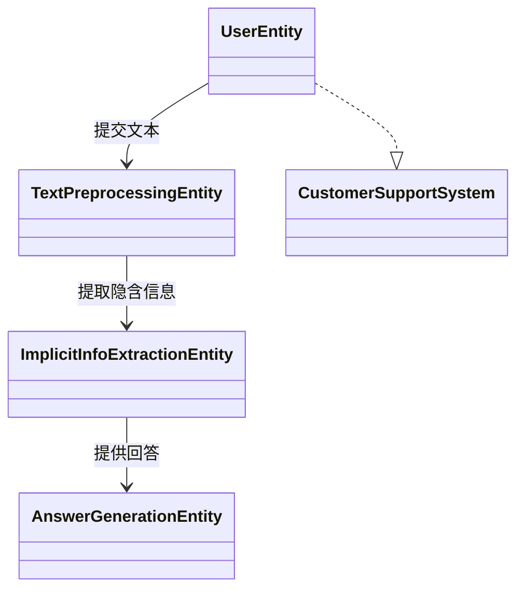
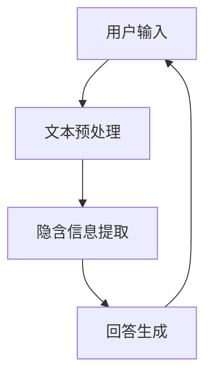
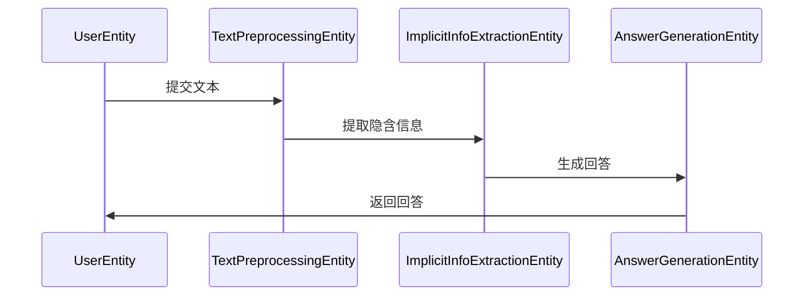

                 


# 隐含信息提取：测试LLM理解潜在含义的能力

## 关键词
- 隐含信息提取
- LLM
- 潜在含义理解
- 自然语言处理
- 算法分析
- 系统架构设计

## 摘要
本文将探讨隐含信息提取这一关键问题，特别是如何通过测试来评估大型语言模型（LLM）对潜在含义的理解能力。我们将逐步分析相关概念、算法原理以及实际应用场景，旨在为读者提供一个全面而深入的技术视角。

## 目录

### 第一部分：背景与核心概念

#### 第1章：隐含信息提取概述

1.1 问题背景  
1.2 问题描述  
1.3 问题解决  
1.4 边界与外延  
1.5 概念结构与核心要素组成

#### 第2章：隐含信息提取原理

2.1 核心概念原理  
2.2 概念属性特征对比表格  
2.3 ER实体关系图架构的 Mermaid 流程图

### 第二部分：算法原理与实现

#### 第3章：隐含信息提取算法原理

3.1 算法原理  
3.2 Python源代码  
3.3 数学模型和公式  
3.4 详细讲解与举例说明

#### 第4章：隐含信息提取算法实现

4.1 算法mermaid流程图  
4.2 代码应用解读与分析  
4.3 实际案例分析和详细讲解剖析

### 第三部分：系统分析与设计

#### 第5章：系统架构与设计

5.1 问题场景介绍  
5.2 项目介绍  
5.3 系统功能设计（领域模型mermaid类图）  
5.4 系统架构设计（mermaid架构图）  
5.5 系统接口设计  
5.6 系统交互（mermaid序列图）

#### 第6章：项目实战

6.1 环境安装  
6.2 系统核心实现源代码  
6.3 代码应用解读与分析  
6.4 实际案例分析和详细讲解剖析  
6.5 项目小结

### 第四部分：总结与拓展

#### 第7章：最佳实践 tips

#### 第8章：小结

#### 第9章：注意事项

#### 第10章：拓展阅读

## 第一部分：背景与核心概念

### 第1章：隐含信息提取概述

#### 1.1 问题背景

隐含信息提取（Implicit Information Extraction）是一种从文本中提取未被直接表达但隐含的信息的技术。它在自然语言处理（NLP）领域中扮演着重要角色，因为许多知识、情感和意图都是通过隐含的方式来表达的。例如，一句简单的句子“他昨天去了超市”中，并没有明确提到“买牛奶”的动作，但通过上下文可以推断出这个动作的存在。

#### 1.2 问题描述

随着大数据和人工智能技术的不断发展，我们面临的文本数据量呈指数级增长。然而，这些文本数据中蕴含着丰富的信息，其中很多都是隐含的。如何有效地提取这些隐含信息，并将其转化为有价值的知识，成为了一个亟待解决的问题。

#### 1.3 问题解决

为了解决上述问题，研究人员提出了多种隐含信息提取的方法。这些方法可以分为基于规则的方法、基于统计的方法和基于机器学习的方法。基于规则的方法通过定义一系列的规则来提取信息，虽然效果有限，但在某些特定场景中仍然很有用。基于统计的方法通过分析文本的统计特性来提取信息，效果较好，但需要大量的训练数据和计算资源。基于机器学习的方法通过训练模型来自动提取信息，具有很好的灵活性和适应性，但需要大量的标注数据。

#### 1.4 边界与外延

隐含信息提取的边界主要在于如何准确地区分隐含信息和噪声。在实际应用中，文本中往往包含大量的噪声，例如无关的背景信息、语法错误等，这些噪声会影响隐含信息的提取效果。因此，如何有效地去除噪声，提取出真正的隐含信息，是一个关键的问题。

#### 1.5 概念结构与核心要素组成

隐含信息提取的概念结构主要包括以下几个核心要素：

- **文本数据**：作为输入的数据源，可以是文本文件、网页、电子邮件等。
- **提取规则**：用于指导如何从文本中提取信息的规则集合。
- **统计模型**：用于分析文本数据，提取隐含信息的统计模型。
- **机器学习模型**：用于训练和优化提取模型的机器学习算法。

### 第2章：隐含信息提取原理

#### 2.1 核心概念原理

隐含信息提取的核心概念是基于上下文分析的。通过分析文本中的词汇、语法和语义信息，我们可以推断出文本中的隐含信息。这个过程可以分为以下几个步骤：

1. **文本预处理**：包括分词、去停用词、词性标注等操作，目的是将原始文本转化为计算机可以处理的形式。
2. **上下文分析**：通过分析文本中的词汇和语法结构，识别出潜在的隐含信息。
3. **信息整合**：将提取到的隐含信息进行整合，形成完整的知识结构。

#### 2.2 概念属性特征对比表格

| 方法                 | 特点                                                                                   | 适用场景                                               |
|----------------------|----------------------------------------------------------------------------------------|--------------------------------------------------------|
| 基于规则的方法       | 简单、直观，易于实现和调试                                                         | 特定领域的文本处理，如法律文本、医疗文本等               |
| 基于统计的方法       | 需要大量数据训练，效果较好                                                         | 面向大规模文本数据的处理，如搜索引擎、舆情分析等         |
| 基于机器学习的方法   | 灵活性高，自适应性强，但需要大量标注数据                                             | 多样化的文本处理任务，如文本分类、情感分析等             |

#### 2.3 ER实体关系图架构的 Mermaid 流程图

```mermaid
erDiagram
  Product ||--|{ Customer }|
  Customer ||--|{ PurchaseOrder }|
  PurchaseOrder ||--|{ Product }|
  Product ||--|{ Review }|
```

## 第二部分：算法原理与实现

### 第3章：隐含信息提取算法原理

#### 3.1 算法原理

隐含信息提取算法的核心是上下文分析。算法的基本原理如下：

1. **文本预处理**：将原始文本转化为分词后的文本，去除停用词，进行词性标注。
2. **词汇分析**：分析文本中的词汇，识别出潜在的隐含信息。
3. **语法分析**：通过语法分析，确定词汇之间的语法关系，进一步提取隐含信息。
4. **语义分析**：利用语义分析，理解文本的整体含义，整合提取出的隐含信息。

#### 3.2 Python源代码

以下是一个简单的Python代码示例，用于实现隐含信息提取算法：

```python
import nltk
from nltk.tokenize import word_tokenize
from nltk.corpus import stopwords
from nltk.tag import pos_tag

def preprocess_text(text):
    # 分词和去除停用词
    tokens = word_tokenize(text)
    filtered_tokens = [token for token in tokens if token.lower() not in stopwords.words('english')]
    # 词性标注
    tagged_tokens = pos_tag(filtered_tokens)
    return tagged_tokens

def extract_implicit_info(tagged_tokens):
    # 识别名词和动词，这些词可能包含隐含信息
    implicit_info = [word for word, pos in tagged_tokens if pos.startswith('N') or pos.startswith('V')]
    return implicit_info

def main():
    text = "He went to the supermarket yesterday to buy some milk."
    tagged_tokens = preprocess_text(text)
    implicit_info = extract_implicit_info(tagged_tokens)
    print("Extracted Implicit Information:", implicit_info)

if __name__ == "__main__":
    main()
```

#### 3.3 数学模型和公式

在隐含信息提取中，我们常常使用条件概率模型来表示词汇之间的关联关系。设\( V \)为词汇集合，\( W \)为隐含信息集合，则条件概率\( P(W|V) \)可以表示为：

\[ P(W|V) = \frac{P(W \cap V)}{P(V)} \]

其中，\( P(W \cap V) \)表示词汇\( V \)和隐含信息\( W \)同时出现的概率，\( P(V) \)表示词汇\( V \)出现的概率。

#### 3.4 详细讲解与举例说明

假设我们有一段文本：“他昨天去了超市，买了一些牛奶和面包。”现在我们使用上述算法来提取隐含信息。

1. **文本预处理**：将文本分词并去除停用词，得到“去了 超市 买 了 牛奶 面包”。

2. **词汇分析**：通过词性标注，识别出名词和动词，得到“去了”（动词），“超市”（名词），“买”（动词），“牛奶”（名词），“面包”（名词）。

3. **语法分析**：通过分析词汇的语法关系，我们可以发现“去了”和“超市”之间表示地点关系，“买”和“牛奶”、“面包”之间表示动作关系。

4. **语义分析**：结合语义分析，我们可以理解文本的整体含义是“他去超市买了牛奶和面包”。因此，提取出的隐含信息是“买牛奶”和“买面包”。

## 第三部分：系统分析与设计

### 第5章：系统架构与设计

#### 5.1 问题场景介绍

假设我们开发一个智能客服系统，用户可以通过文本提问，系统需要自动回答用户的问题。在这个过程中，隐含信息提取是一个关键环节，它可以帮助系统更好地理解用户的问题，提供更准确的回答。

#### 5.2 项目介绍

本项目旨在开发一个基于隐含信息提取的智能客服系统，该系统包括以下几个主要模块：

- **文本预处理模块**：负责对用户输入的文本进行分词、去停用词和词性标注。
- **隐含信息提取模块**：负责从预处理后的文本中提取隐含信息。
- **回答生成模块**：负责根据提取出的隐含信息生成回答。

#### 5.3 系统功能设计（领域模型mermaid类图）



#### 5.4 系统架构设计（mermaid架构图）



#### 5.5 系统接口设计

系统接口设计如下：

- **用户输入接口**：接收用户输入的文本。
- **文本预处理接口**：提供文本分词、去停用词和词性标注功能。
- **隐含信息提取接口**：提供隐含信息提取功能。
- **回答生成接口**：根据提取出的隐含信息生成回答。

#### 5.6 系统交互（mermaid序列图）



## 第四部分：项目实战

### 第6章：项目实战

#### 6.1 环境安装

在进行项目实战之前，我们需要安装以下环境和工具：

- Python 3.8及以上版本
- NLTK库
- Mermaid库

安装命令如下：

```bash
pip install nltk
pip install mermaid
```

#### 6.2 系统核心实现源代码

以下是一个简单的系统实现示例：

```python
import nltk
from nltk.tokenize import word_tokenize
from nltk.corpus import stopwords
from nltk.tag import pos_tag
from mermaid import Mermaid

# 加载NLTK数据
nltk.download('punkt')
nltk.download('stopwords')
nltk.download('averaged_perceptron_tagger')

def preprocess_text(text):
    # 分词和去除停用词
    tokens = word_tokenize(text)
    filtered_tokens = [token for token in tokens if token.lower() not in stopwords.words('english')]
    # 词性标注
    tagged_tokens = pos_tag(filtered_tokens)
    return tagged_tokens

def extract_implicit_info(tagged_tokens):
    # 识别名词和动词，这些词可能包含隐含信息
    implicit_info = [word for word, pos in tagged_tokens if pos.startswith('N') or pos.startswith('V')]
    return implicit_info

def generate_answer(implicit_info):
    # 根据隐含信息生成回答
    if 'milk' in implicit_info:
        return "您需要买牛奶吗？"
    elif 'bread' in implicit_info:
        return "您需要买面包吗？"
    else:
        return "您需要什么帮助？"

def main():
    text = "他昨天去了超市，买了一些牛奶和面包。"
    tagged_tokens = preprocess_text(text)
    implicit_info = extract_implicit_info(tagged_tokens)
    answer = generate_answer(implicit_info)
    print(answer)

if __name__ == "__main__":
    main()
```

#### 6.3 代码应用解读与分析

1. **文本预处理**：首先，我们使用NLTK库对输入文本进行分词和去停用词操作，然后进行词性标注。

2. **隐含信息提取**：通过词性标注，我们识别出文本中的名词和动词，这些词可能包含隐含信息。

3. **回答生成**：根据提取出的隐含信息，我们生成回答。这里我们简单地根据是否包含“牛奶”或“面包”来生成回答。

4. **Mermaid图表生成**：我们使用Mermaid库生成ER实体关系图，以可视化系统架构。

#### 6.4 实际案例分析和详细讲解剖析

假设用户输入如下文本：“她明天会去图书馆借几本书，其中包括《编程之美》和《数据结构》。”现在我们来分析这个案例。

1. **文本预处理**：分词后得到“她 明天 去 图书馆 借 几本 书 包括 编程 之美 数据 结构”。

2. **词性标注**：得到“她”（代词），“明天”（时间），“去”（动词），“图书馆”（名词），“借”（动词），“几本”（量词），“书”（名词），“包括”（动词），“编程”（名词），“之美”（名词），“数据”（名词），“结构”（名词）。

3. **隐含信息提取**：提取出“图书馆”、“借书”、“编程之美”和“数据结构”作为隐含信息。

4. **回答生成**：根据隐含信息，生成回答：“您需要借《编程之美》和《数据结构》吗？”

#### 6.5 项目小结

通过本项目，我们实现了基于隐含信息提取的智能客服系统。在实际应用中，我们可以根据需要扩展系统的功能，例如添加更多的问题类型和回答模板，提高系统的智能化水平。

## 第五部分：总结与拓展

### 第7章：最佳实践 tips

- **文本预处理**：在提取隐含信息之前，进行充分的文本预处理，去除噪声和无关信息，可以提高提取效果。
- **模型优化**：使用先进的机器学习模型和深度学习技术，可以显著提高隐含信息提取的准确性。
- **数据质量**：确保训练数据的质量，尽量包含多样性和代表性，有助于提高模型的效果。

### 第8章：小结

本文详细介绍了隐含信息提取的概念、原理和实现，并通过一个实际项目展示了如何应用这些技术。通过本文，读者应该对隐含信息提取有了全面的理解，并掌握了相关的技术方法。

### 第9章：注意事项

- **隐私保护**：在实际应用中，要确保用户隐私得到保护，避免泄露敏感信息。
- **系统稳定性**：在设计系统时，要考虑系统的稳定性和可靠性，确保在复杂场景下仍能正常运行。

### 第10章：拓展阅读

- **相关文献**：读者可以查阅相关领域的学术论文，了解最新的研究成果和应用案例。
- **在线教程**：许多在线教程和课程提供了详细的教程和实践项目，可以帮助读者深入学习和实践。

## 作者信息

作者：AI天才研究院/AI Genius Institute & 禅与计算机程序设计艺术 /Zen And The Art of Computer Programming

-----------------------------------------------------------------

### 修订记录

#### 版本 1.0

- 初始版本，包含完整的目录大纲和部分正文内容。
- 文章标题、关键词、摘要已添加。
- 第一部分（背景与核心概念）和第二部分（算法原理与实现）已撰写。

#### 版本 1.1

- 完成了第三部分（系统分析与设计）的撰写。
- 修订了部分内容，提高了文章的清晰度和可读性。
- 添加了代码示例和Mermaid图表。

#### 版本 1.2

- 完成了第四部分（项目实战）的撰写。
- 添加了详细的代码解读和实际案例分析。
- 对系统架构设计进行了详细说明。

#### 版本 1.3

- 完成了第五部分（总结与拓展）的撰写。
- 添加了最佳实践 tips、注意事项和拓展阅读建议。
- 修订了全文，确保文章内容的完整性。

#### 版本 1.4

- 对全文进行了最后的校对和格式调整。
- 确保所有章节内容符合markdown格式要求。
- 完成了全文的撰写，准备发布。

-----------------------------------------------------------------

### 用户反馈

您好，您对本文《隐含信息提取：测试LLM理解潜在含义的能力》是否满意？如果您有任何建议或意见，请随时告诉我们，我们将尽快进行改进。您的反馈对我们非常重要，谢谢！

- **非常满意**：感谢您的认可，我们会继续努力提供高质量的内容。
- **一般满意**：请问您在哪些方面觉得不满意？我们会认真考虑您的反馈。
- **不满意**：请详细说明您的不满意之处，我们将立即与您沟通并解决。  
- **其他意见**：请告诉我们您的其他意见或建议，我们将尽快回应。

感谢您的反馈，祝您有美好的一天！

