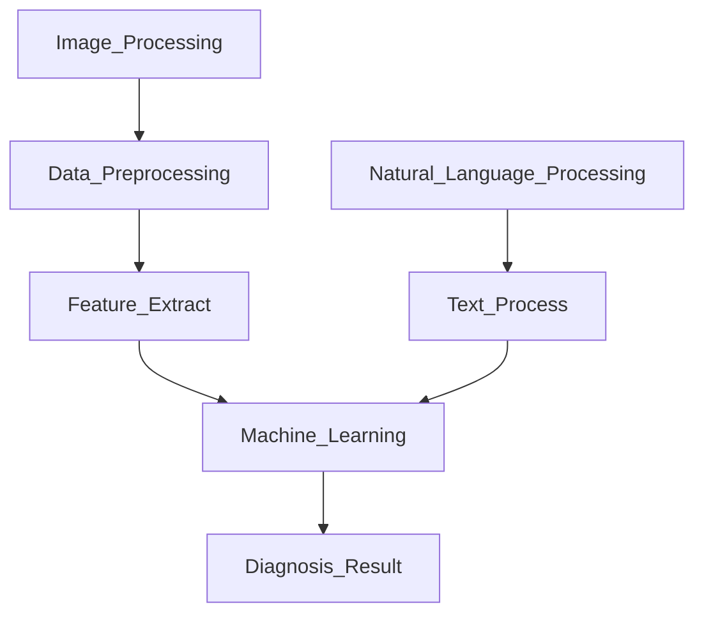

                 

### 第1章：问题背景与集成测试概述

#### 1.1 问题背景

随着人工智能（AI）技术的迅猛发展，AI系统在各个领域得到了广泛应用。从自动驾驶汽车到智能语音助手，从医疗诊断到金融风险评估，AI系统的复杂性和应用深度都在不断增加。然而，随着系统复杂度的提升，传统的单元测试和系统测试已无法全面验证AI系统的功能性和可靠性。这主要是因为AI系统通常由多个相互依赖的模块组成，每个模块在独立运行时可能表现良好，但在系统集成后可能会出现意想不到的问题。这些问题可能包括模块之间的接口不兼容、数据处理不一致、算法误差累积等。

在这样的背景下，集成测试作为一种关键的测试方法，应运而生。集成测试的目的是在软件的各个部分被组装起来之后，对整个系统的功能进行测试，以确保系统能够按预期运行。AI系统由于其特殊性和复杂性，集成测试显得尤为重要。通过集成测试，可以早期发现和解决模块间交互带来的问题，从而提高系统的整体稳定性和可靠性。

#### 1.1.1 AI系统的复杂性与挑战

AI系统通常包含多个相互依赖的模块，这些模块可能涉及到不同的算法、数据源和处理流程。例如，一个智能医疗诊断系统可能包括图像处理、自然语言处理、机器学习等多个模块。每个模块在开发过程中都可能独立完成，但在系统集成时，这些模块需要无缝协作，以确保系统整体功能的实现。

以下是AI系统复杂性和挑战的一些具体方面：

1. **数据源多样化**：AI系统通常需要从多种数据源获取数据，这些数据源可能包括内部数据库、外部API、实时传感器等。数据源的多样性和数据质量的差异使得集成测试变得更加复杂。
   
2. **算法多样性**：AI系统可能采用多种不同的算法，这些算法在实现细节和处理方式上可能存在显著差异。集成测试需要确保这些算法能够在系统中正确协同工作。

3. **实时性与稳定性要求高**：许多AI系统需要在实时环境中运行，例如自动驾驶系统需要在高速行驶中做出快速响应。这就要求AI系统具有高稳定性和低延迟，集成测试在这方面尤为重要。

4. **模块间依赖关系复杂**：AI系统中的各个模块可能存在复杂的依赖关系，这些依赖关系在集成时可能会暴露出潜在的问题。例如，一个模块的更新可能会影响其他模块的运行。

#### 1.1.2 集成测试的核心作用

集成测试在AI系统开发过程中起着至关重要的作用。其主要作用体现在以下几个方面：

1. **发现模块间交互问题**：集成测试可以模拟模块之间的交互，发现可能由于接口不兼容、数据传递错误等原因导致的系统问题。

2. **提高系统稳定性**：通过集成测试，可以确保各个模块在系统中的协作符合预期，从而提高系统的整体稳定性和可靠性。

3. **降低维护成本**：集成测试可以帮助及早发现和解决系统中的问题，降低后期维护成本。这对于复杂的AI系统尤为重要，因为修复集成后的系统问题通常比修复单独模块的问题要困难和昂贵。

4. **确保功能完整性**：集成测试可以验证AI系统的功能是否完整，是否符合设计要求。这对于确保系统交付质量至关重要。

5. **优化系统性能**：通过集成测试，可以发现系统中性能瓶颈和资源浪费的问题，从而优化系统性能。

#### 1.1.3 集成测试与单元测试、系统测试的区别

在软件测试的范畴内，集成测试、单元测试和系统测试是三种不同层次的测试方法。它们各自有独特的目的和作用。

1. **单元测试**：单元测试是针对软件中的最小可测试单元（通常是函数或方法）进行测试，以确保每个单元按照预期工作。单元测试通常由开发者编写，覆盖代码的各个部分。

2. **集成测试**：集成测试是将多个模块或组件组合起来，进行测试以验证它们之间的交互是否符合预期。集成测试的目标是确保系统在集成后的整体功能性和性能。

3. **系统测试**：系统测试是对整个系统进行测试，以验证系统是否符合其需求和设计规格。系统测试通常包括功能测试、性能测试、安全性测试等，旨在确保系统在所有方面都能满足预期。

三者之间的主要区别如下：

- **测试层次不同**：单元测试关注的是代码的最小可测试单元，集成测试关注的是模块之间的交互，系统测试关注的是整个系统的功能和性能。

- **测试目的不同**：单元测试的主要目的是确保代码的正确性，集成测试的主要目的是确保模块之间的交互正确，系统测试的主要目的是确保系统在所有方面都能正常工作。

- **测试范围不同**：单元测试通常覆盖代码的各个部分，集成测试覆盖多个模块之间的交互，系统测试覆盖整个系统。

- **测试时间点不同**：单元测试通常在开发过程中进行，集成测试在模块集成后进行，系统测试在开发完成且系统准备交付时进行。

#### 1.2 集成测试的定义与目标

集成测试是一种测试方法，用于验证软件系统中不同模块或组件在集成后的功能性和性能。具体来说，集成测试的目标是确保各个模块在系统中能够正确协作，以实现系统的整体功能。

**集成测试的定义**：

集成测试是指将多个已通过单元测试的模块组合在一起，对其整体功能进行测试的过程。集成测试通常在模块集成后进行，目的是发现和解决由于模块间交互而引起的潜在问题。

**集成测试的目标**：

1. **验证模块间交互**：确保各个模块能够按照预期进行通信和数据交换。

2. **确保系统功能完整性**：验证系统是否实现了设计要求的所有功能。

3. **提高系统稳定性**：发现和解决可能导致系统崩溃或性能下降的问题。

4. **优化系统性能**：通过测试，可以发现系统中的性能瓶颈，并进行优化。

5. **确保安全性和可靠性**：验证系统在各种异常情况下是否能够稳定运行。

**集成测试的关键要素**：

1. **测试用例设计**：设计合适的测试用例，以确保所有关键功能和边界条件都得到测试。

2. **测试环境**：搭建模拟实际运行环境的测试环境，确保测试结果具有实际意义。

3. **测试工具**：使用合适的测试工具，提高测试效率和质量。

4. **测试结果分析**：对测试结果进行分析，及时发现和解决问题。

#### 1.3 集成测试的优势与局限性

**集成测试的优势**：

1. **早期发现问题**：通过在模块集成后进行测试，可以早期发现由于模块间交互引起的问题，从而降低修复成本。

2. **提高系统稳定性**：确保模块在系统中的协作符合预期，从而提高系统的整体稳定性。

3. **提高测试覆盖率**：集成测试可以覆盖多个模块之间的交互，从而提高测试覆盖率。

4. **优化系统性能**：通过测试，可以发现系统中的性能瓶颈，并进行优化。

5. **确保功能完整性**：验证系统是否实现了设计要求的所有功能。

**集成测试的局限性**：

1. **测试成本高**：集成测试通常需要复杂的测试环境和大量的测试用例，从而增加了测试成本。

2. **测试时间长**：集成测试涉及多个模块的协作，测试过程可能需要较长时间。

3. **依赖外部因素**：集成测试的结果可能受到外部环境（如网络延迟、硬件性能等）的影响。

4. **难以为每个模块进行详细测试**：由于测试资源有限，集成测试可能无法为每个模块进行详细测试，从而可能遗漏一些潜在问题。

5. **依赖单元测试的质量**：集成测试的效果很大程度上依赖于单元测试的质量。如果单元测试未能覆盖关键部分，集成测试可能会漏掉这些问题。

#### 1.4 集成测试的流程与方法

**集成测试的流程**：

1. **测试需求分析**：明确测试目标，定义测试需求。

2. **测试用例设计**：设计测试用例，确保覆盖所有关键功能和边界条件。

3. **测试环境搭建**：搭建模拟实际运行环境的测试环境。

4. **执行测试**：执行测试用例，记录测试结果。

5. **测试结果分析**：分析测试结果，发现和解决问题。

6. **报告生成**：生成测试报告，总结测试结果和发现的问题。

**集成测试的方法**：

1. **黑盒测试与白盒测试**：黑盒测试主要关注模块的功能性，而白盒测试主要关注模块的实现细节。

2. **静态测试与动态测试**：静态测试主要分析代码和文档，而动态测试通过执行代码来验证功能。

3. **面向接口的集成测试**：主要测试模块之间的接口是否符合预期。

4. **面向组件的集成测试**：主要测试组件之间的集成是否符合预期。

5. **面向服务的集成测试**：主要测试服务之间的集成是否符合预期。

#### 1.5 集成测试工具与平台

**常用集成测试工具**：

1. **JUnit**：JUnit是Java语言中最流行的单元测试框架，支持多种测试方法，包括函数测试、性能测试和可靠性测试。

2. **TestNG**：TestNG是一个强大的测试框架，支持多种编程语言，提供丰富的测试功能和灵活的测试配置。

3. **Selenium**：Selenium是一个用于Web应用测试的开源工具，支持多种浏览器和操作系统，主要用于功能测试和回归测试。

**集成测试平台的选择与配置**：

选择合适的集成测试平台是确保测试质量和效率的关键。以下是一些关键点：

1. **平台兼容性**：选择兼容性强、支持多种编程语言和测试工具的平台。

2. **自动化能力**：选择具有强大自动化能力的平台，以便自动化执行重复性的测试任务。

3. **测试报告功能**：选择能够生成详细测试报告、支持多种报告格式的平台。

4. **可扩展性**：选择易于扩展和集成的平台，以便根据项目需求进行定制。

5. **支持分布式测试**：选择支持分布式测试的平台，以提高测试效率和覆盖率。

#### 1.6 本章小结

本章介绍了集成测试在AI系统开发中的重要性及其与单元测试、系统测试的区别。通过分析AI系统的复杂性与挑战，我们明确了集成测试的核心作用和目标。同时，本章还介绍了集成测试的流程、方法以及常用工具和平台的选择与配置。通过本章的介绍，读者可以初步了解集成测试在AI系统开发中的关键作用和实践方法。

---

### 第2章：AI系统设计与集成测试的关系

#### 2.1 AI系统设计的核心要素

AI系统的设计是确保系统能够高效、稳定地实现预期功能的关键。一个良好的AI系统设计通常包含以下几个核心要素：

1. **模块化设计**：模块化设计是将系统分解为若干独立且功能明确的模块。每个模块负责特定的功能，模块之间通过接口进行通信。模块化设计可以提高系统的可维护性、可扩展性和可复用性。

2. **接口规范**：接口规范是定义模块之间如何通信的准则。一个良好的接口规范应该明确数据格式、传输方式、调用顺序等细节，以确保模块之间的交互顺畅。

3. **可扩展性**：可扩展性是指系统能够根据需求的变化进行扩展的能力。在设计AI系统时，考虑到未来可能的需求变化，设计具有可扩展性的系统架构，以便在需要时进行功能扩展。

4. **数据处理流程**：数据处理流程是AI系统处理数据的步骤和逻辑。一个良好的数据处理流程应该确保数据从输入到输出的一致性和准确性。

5. **算法实现**：算法实现是AI系统的核心。选择合适的算法并确保其准确性和高效性对于系统性能至关重要。

#### 2.2 集成测试在AI系统设计中的作用

集成测试在AI系统设计中扮演着至关重要的角色。其主要作用体现在以下几个方面：

1. **验证系统整体功能**：通过集成测试，可以验证AI系统的整体功能是否符合设计要求。这包括验证各个模块之间的交互是否正常、数据处理流程是否准确等。

2. **提高系统可靠性**：集成测试可以发现和解决由于模块间交互问题导致的潜在故障，从而提高系统的可靠性。通过在早期阶段发现和修复这些问题，可以减少系统在部署后的故障率。

3. **促进系统优化与迭代**：集成测试过程中，可以发现系统的性能瓶颈和资源浪费问题。通过优化系统设计和算法实现，可以提高系统性能和资源利用率。

4. **确保系统稳定性**：通过集成测试，可以确保AI系统在各种异常情况下能够稳定运行。例如，网络中断、数据异常等异常情况下的系统行为。

5. **支持持续集成与持续交付**：集成测试是持续集成（CI）和持续交付（CD）过程的关键环节。通过自动化集成测试，可以确保每次代码变更都能及时得到验证，从而提高开发效率和质量。

#### 2.3 集成测试中的常见问题与挑战

尽管集成测试在AI系统设计中至关重要，但实际应用中仍存在一些问题和挑战：

1. **系统复杂性带来的挑战**：AI系统通常包含多个复杂模块，这些模块之间的交互可能非常复杂。在集成测试过程中，如何确保测试覆盖全面、有效，是一个重要挑战。

2. **数据完整性与准确性问题**：AI系统处理的数据可能来自多种数据源，数据质量和完整性对测试结果有直接影响。如何确保测试数据的质量，是一个常见问题。

3. **跨模块接口的测试难点**：模块之间的接口是集成测试的重点，但接口设计可能存在缺陷或不一致性。如何有效地测试这些接口，确保其功能正确，是一个难点。

4. **测试资源限制**：集成测试通常需要复杂的测试环境和大量的测试用例，而测试资源（如测试人员、测试工具、硬件资源）可能有限。如何合理分配和利用测试资源，是一个挑战。

5. **测试自动化难度**：自动化集成测试可以提高测试效率和覆盖率，但实现自动化测试可能需要额外的开发和维护成本。如何选择合适的自动化测试工具和策略，是一个需要考虑的问题。

#### 2.4 集成测试的核心概念与联系

**集成测试的类型**：

1. **面向接口的集成测试**：主要测试模块之间的接口是否符合预期。这种测试侧重于验证接口的功能性和可靠性。

2. **面向组件的集成测试**：主要测试组件之间的集成是否符合预期。这种测试侧重于验证组件之间的协作和交互。

3. **面向服务的集成测试**：主要测试服务之间的集成是否符合预期。这种测试侧重于验证服务之间的通信和协作。

**集成测试的策略**：

1. **自顶向下策略**：从系统的顶层开始，逐步集成和测试下层模块。这种策略有助于早期发现和解决高层模块间的问题。

2. **自底向上策略**：从系统的底层开始，逐步集成和测试上层模块。这种策略有助于确保底层模块的稳定性和性能。

3. **混合策略**：结合自顶向下和自底向上策略，根据具体情况进行调整。这种策略灵活性好，可以根据模块的复杂度和依赖关系进行优化。

**概念属性特征对比表格**：

| 特征          | 面向接口的集成测试 | 面向组件的集成测试 | 面向服务的集成测试 |
|---------------|--------------------|--------------------|--------------------|
| 测试重点      | 接口的功能性和可靠性 | 组件之间的协作和交互 | 服务之间的通信和协作 |
| 测试方法      | 功能测试、性能测试 | 功能测试、性能测试 | 功能测试、性能测试 |
| 测试层次      | 模块间的接口层      | 组件层              | 服务层              |
| 需要的测试用例 | 接口调用和返回数据  | 组件功能和性能       | 服务交互和性能       |
| 依赖关系      | 模块间的接口        | 组件间的依赖关系     | 服务间的依赖关系     |

**ER实体关系图架构**：

```mermaid
erDiagram
    AI_System ||--|{ Module_A : 模块 }
    AI_System ||--|{ Module_B : 模块 }
    AI_System ||--|{ Module_C : 模块 }
    Module_A ||--|{ Interface_A : 接口 }
    Module_B ||--|{ Interface_B : 接口 }
    Module_C ||--|{ Interface_C : 接口 }
```

**ER实体关系图架构**展示了AI系统、模块和接口之间的关系。每个模块通过接口与其他模块进行交互，而整个系统的功能由这些模块和接口的组合实现。通过集成测试，可以确保这些模块和接口之间的交互符合预期，从而保证系统的整体功能性和稳定性。

#### 2.5 本章小结

本章介绍了AI系统设计的核心要素，包括模块化设计、接口规范、可扩展性、数据处理流程和算法实现。同时，讨论了集成测试在AI系统设计中的作用，以及集成测试中的常见问题与挑战。通过对比集成测试的类型和策略，以及展示ER实体关系图架构，读者可以更深入地理解集成测试在AI系统设计中的重要性。

---

### 第3章：集成测试方法详解

#### 3.1 黑盒测试与白盒测试

在集成测试中，常用的测试方法包括黑盒测试和白盒测试。这两种测试方法在测试对象、测试目标和测试过程中有所不同。

**黑盒测试**：

黑盒测试是一种功能测试方法，它将系统视为一个黑盒，不关注内部实现细节，而是关注系统输入和输出之间的功能关系。黑盒测试主要侧重于验证系统的功能是否符合需求规格说明。在进行黑盒测试时，测试人员需要设计测试用例，以验证系统在各种输入条件下的行为是否符合预期。

黑盒测试的特点如下：

1. **测试对象**：系统的功能性和用户界面。
2. **测试目标**：验证系统的功能是否符合设计要求。
3. **测试过程**：设计测试用例、执行测试用例、记录测试结果、分析测试结果。

**白盒测试**：

白盒测试是一种结构测试方法，它将系统视为一个透明的白盒，关注系统的内部实现细节。白盒测试主要侧重于验证系统代码的正确性和逻辑结构。在进行白盒测试时，测试人员需要深入了解系统代码，以设计有效的测试用例。

白盒测试的特点如下：

1. **测试对象**：系统的代码和内部逻辑。
2. **测试目标**：验证系统代码的正确性和逻辑结构。
3. **测试过程**：设计测试用例、执行测试用例、记录测试结果、分析测试结果。

**黑盒测试与白盒测试的区别**：

1. **测试视角**：黑盒测试关注外部功能，白盒测试关注内部结构。
2. **测试用例设计**：黑盒测试基于需求规格说明设计，白盒测试基于代码结构设计。
3. **测试结果**：黑盒测试关注系统的输入和输出，白盒测试关注代码的执行路径和覆盖情况。
4. **适用范围**：黑盒测试适用于功能验证，白盒测试适用于代码审查和性能优化。

#### 3.2 静态测试与动态测试

集成测试中，静态测试和动态测试是两种重要的测试方法，它们在测试时机、测试对象和测试效果上有所不同。

**静态测试**：

静态测试是在软件编译或运行之前进行的测试，主要关注代码的质量和设计。静态测试包括代码审查、静态分析、设计检查等。通过静态测试，可以早期发现代码中的潜在问题，如语法错误、逻辑错误、设计缺陷等。

静态测试的特点如下：

1. **测试时机**：在编译或运行之前进行。
2. **测试对象**：源代码、设计文档、配置文件等。
3. **测试目标**：验证代码的正确性、逻辑性、可读性和可维护性。
4. **测试效果**：有助于提高代码质量和可维护性。

**动态测试**：

动态测试是在软件编译和运行过程中进行的测试，主要关注软件的运行行为和性能。动态测试包括单元测试、集成测试、系统测试等。通过动态测试，可以验证软件在各种运行条件下的行为是否正确，以及性能是否满足要求。

动态测试的特点如下：

1. **测试时机**：在编译和运行过程中进行。
2. **测试对象**：编译后的软件、运行中的系统。
3. **测试目标**：验证软件的功能性、性能、稳定性、安全性。
4. **测试效果**：有助于发现并修复运行时的问题，提高软件质量。

**静态测试与动态测试的区别**：

1. **测试时机**：静态测试在编译或运行之前进行，动态测试在编译和运行过程中进行。
2. **测试对象**：静态测试主要关注源代码和设计文档，动态测试主要关注编译后的软件和运行中的系统。
3. **测试方法**：静态测试通常包括代码审查和静态分析，动态测试通常包括功能测试和性能测试。
4. **测试效果**：静态测试有助于提高代码质量，动态测试有助于提高软件性能和稳定性。

#### 3.3 集成测试策略与模式

在集成测试过程中，选择合适的测试策略和模式对于提高测试效率和测试覆盖率至关重要。以下是一些常见的集成测试策略和模式：

**自顶向下策略**：

自顶向下策略是从系统的顶层开始，逐步集成和测试下层模块。这种方法可以早期发现和解决高层模块间的问题，适用于模块之间的依赖关系相对复杂的情况。

自顶向下策略的优点包括：

1. **早期发现问题**：可以早期发现和解决高层模块间的问题，减少后期修复成本。
2. **降低复杂性**：逐步集成和测试下层模块，降低每次集成时的测试复杂性。
3. **优先测试关键功能**：优先测试系统的高层功能，确保关键功能的正确性。

自顶向下策略的缺点包括：

1. **测试覆盖率较低**：早期测试的模块数量较少，可能导致测试覆盖率较低。
2. **测试用例设计复杂**：需要设计大量的测试用例来覆盖系统的高层功能。

**自底向上策略**：

自底向上策略是从系统的底层开始，逐步集成和测试上层模块。这种方法可以确保底层模块的稳定性和性能，适用于模块之间的依赖关系相对简单的情况。

自底向上策略的优点包括：

1. **确保底层稳定性**：逐步集成和测试底层模块，确保底层模块的稳定性和性能。
2. **提高测试覆盖率**：早期测试的模块数量较多，可以提高测试覆盖率。
3. **测试用例设计简单**：底层模块通常功能简单，测试用例设计相对简单。

自底向上策略的缺点包括：

1. **测试效率较低**：由于需要逐步集成和测试底层模块，可能导致测试效率较低。
2. **发现高层问题较晚**：可能较晚发现和解决高层模块间的问题。

**混合策略**：

混合策略结合了自顶向下和自底向上策略的优点，根据具体情况进行调整。这种方法可以灵活地处理模块间的依赖关系和测试复杂性。

混合策略的优点包括：

1. **灵活调整**：可以根据模块的复杂度和依赖关系灵活调整测试策略。
2. **早期发现问题和提高覆盖率**：结合自顶向下和自底向上策略，可以在早期发现和解决问题，同时提高测试覆盖率。

混合策略的缺点包括：

1. **测试用例设计复杂**：需要设计更多的测试用例来覆盖不同模块的集成情况。
2. **测试管理难度增加**：需要同时管理自顶向下和自底向上的测试过程，测试管理难度增加。

#### 3.4 本章小结

本章详细介绍了集成测试中的黑盒测试与白盒测试、静态测试与动态测试，以及集成测试策略与模式。通过理解这些测试方法和策略，读者可以更有效地设计和执行集成测试，提高AI系统的功能性和可靠性。在实际应用中，根据系统的具体需求和模块间的关系，选择合适的测试策略和模式，可以最大化测试效率和覆盖率。

---

### 第4章：集成测试工具应用与实践

#### 4.1 常用集成测试工具介绍

在集成测试过程中，选择合适的工具可以显著提高测试效率和测试质量。以下介绍几种常用的集成测试工具，包括JUnit、TestNG和Selenium。

**1. JUnit**

JUnit是Java语言中最流行的单元测试框架，由Kent Beck和Eric Gamma于1997年创建。JUnit的主要目标是简化单元测试的编写和执行，提高代码的可测试性。它提供了一系列的注解和断言方法，用于编写和执行测试用例。

主要特点包括：

- **简单易用**：提供丰富的注解和断言方法，简化测试用例的编写。
- **可扩展性**：支持自定义测试运行器和测试套件。
- **广泛支持**：被广泛用于Java项目，并支持各种集成开发环境。

**2. TestNG**

TestNG是一个开源的测试框架，由Cedric Beust于2004年创建。TestNG旨在扩展JUnit的功能，提供更丰富的测试功能和灵活性。它支持多种编程语言，包括Java、Python和C#。

主要特点包括：

- **功能强大**：支持参数化测试、依赖测试、多线程测试等高级功能。
- **灵活配置**：提供丰富的配置选项，支持复杂的测试用例组织。
- **可扩展性**：支持自定义测试运行器和报告生成器。

**3. Selenium**

Selenium是一个开源的Web应用测试工具，主要用于自动化Web应用的测试。它支持多种编程语言，包括Java、Python和C#。Selenium通过模拟用户操作，验证Web应用的功能和行为。

主要特点包括：

- **跨浏览器测试**：支持多种浏览器，包括Chrome、Firefox和Safari等。
- **跨平台支持**：支持Windows、Linux和MacOS等操作系统。
- **功能丰富**：提供丰富的API，支持各种Web应用测试场景。

#### 4.2 集成测试工具的配置与使用

**1. 测试环境的搭建**

在开始使用集成测试工具之前，需要搭建一个合适的测试环境。以下是一个基本的测试环境搭建步骤：

- **安装Java SDK**：对于JUnit和TestNG，需要安装Java SDK，版本应与项目兼容。
- **安装IDE**：选择一个合适的集成开发环境（如Eclipse或IntelliJ IDEA），并安装相应的插件。
- **安装测试工具**：下载并安装JUnit、TestNG或Selenium，按照文档说明进行配置。
- **配置环境变量**：设置Java SDK和测试工具的环境变量，确保可以在命令行中运行。

**2. 测试工具的集成与调试**

集成测试工具通常可以通过IDE进行集成，也可以通过命令行运行。以下是如何集成与调试这些工具的简要步骤：

- **JUnit集成**：在IDE中创建JUnit测试类，使用注解（如`@Test`）编写测试用例。运行测试类，查看测试结果。
- **TestNG集成**：在IDE中创建TestNG测试类，使用标签（如`<test>`）定义测试套件。运行测试套件，查看测试结果。
- **Selenium集成**：在IDE中创建Selenium测试类，使用WebDriver API编写测试用例。运行测试用例，验证Web应用的功能。

**3. 测试报告的生成与分析**

集成测试工具通常支持生成详细的测试报告，帮助分析测试结果。以下是如何生成和分析测试报告的步骤：

- **JUnit报告**：JUnit测试结果默认保存在`surefire-reports`目录中，包含HTML格式的测试报告。通过分析报告，可以查看测试覆盖率、失败原因等。
- **TestNG报告**：TestNG支持生成多种格式的报告，如HTML、XML、Excel等。通过分析报告，可以查看测试覆盖率、错误信息等。
- **Selenium报告**：Selenium测试结果可以通过Selenium Grid收集和汇总，生成详细的测试报告。通过分析报告，可以查看Web应用的功能状态和性能。

#### 4.3 集成测试工具的选型与评估

在项目开发过程中，选择合适的集成测试工具至关重要。以下是一些选型标准和方法：

**1. 选型标准**

- **兼容性**：工具是否兼容项目使用的编程语言和平台。
- **功能丰富性**：工具是否提供丰富的测试功能，如单元测试、集成测试、性能测试等。
- **易用性**：工具是否易于使用和配置，是否有良好的文档和社区支持。
- **扩展性**：工具是否支持自定义测试运行器和报告生成器，是否易于与其他工具集成。
- **性能**：工具的性能是否满足项目需求，是否会影响测试速度和覆盖率。

**2. 评估方法**

- **试用评估**：在实际项目中试用工具，评估其性能和易用性。
- **比较分析**：对比不同工具的特点和优势，选择最符合项目需求的工具。
- **用户评价**：查阅用户评价和社区反馈，了解工具的稳定性和可靠性。
- **技术支持**：评估工具的技术支持情况，包括文档、社区支持和商业支持。

#### 4.4 集成测试案例解析

**案例一：基于JUnit的集成测试**

**1. 案例背景**

假设我们正在开发一个电子商务系统，其中涉及订单处理、支付和库存管理等模块。为了确保系统的整体功能性和可靠性，我们需要进行集成测试。

**2. 测试目标**

- 验证订单处理模块的功能完整性。
- 验证支付模块与订单处理模块的接口是否符合预期。
- 验证库存管理模块与订单处理模块的接口是否符合预期。

**3. 测试用例设计**

- **订单处理模块测试用例**：包括添加订单、修改订单、删除订单、查询订单等操作。
- **支付模块测试用例**：包括支付成功、支付失败等操作。
- **库存管理模块测试用例**：包括添加库存、修改库存、删除库存、查询库存等操作。

**4. 测试过程与结果分析**

- **测试过程**：按照测试用例逐步执行测试，记录测试结果。
- **测试结果分析**：发现支付模块与订单处理模块的接口存在不一致问题，导致部分订单无法正确处理。通过修改接口定义和实现，解决了该问题。

**案例二：基于Selenium的Web应用集成测试**

**1. 案例背景**

假设我们正在开发一个在线购物网站，需要进行集成测试以验证用户购物流程的正确性。

**2. 测试目标**

- 验证用户注册、登录、浏览商品、添加购物车、结账等流程是否符合预期。
- 验证网站在各种浏览器和设备上的兼容性。

**3. 测试用例设计**

- **用户注册测试用例**：包括输入有效的用户信息、输入无效的用户信息等。
- **登录测试用例**：包括输入正确的用户名和密码、输入错误的用户名和密码等。
- **购物流程测试用例**：包括添加商品到购物车、修改购物车中的商品数量、结账等。

**4. 测试过程与结果分析**

- **测试过程**：使用Selenium模拟用户操作，逐步执行测试用例。
- **测试结果分析**：发现部分商品在移动设备上无法正确显示，通过调整网页布局和响应式设计，解决了该问题。

#### 4.5 本章小结

本章介绍了常用的集成测试工具，包括JUnit、TestNG和Selenium，以及它们的配置和使用方法。同时，通过两个实际案例，展示了集成测试在Web应用和电子商务系统中的应用。通过理解这些工具和案例，读者可以更好地应用集成测试方法，提高AI系统的功能性和可靠性。

---

### 第5章：AI系统集成测试实战

#### 5.1 项目介绍

在本章中，我们将以一个AI医疗诊断系统为例，介绍如何进行AI系统集成测试。该系统旨在通过分析医学影像，辅助医生进行疾病诊断。系统架构包括图像处理模块、自然语言处理模块和机器学习模块。以下是对项目背景、目标以及系统架构的详细介绍。

**1. 项目背景**

随着医疗技术的发展，AI在医疗诊断中的应用越来越广泛。然而，由于AI系统复杂且涉及多种算法和数据处理流程，如何确保系统在集成后的功能性和可靠性，成为了一个关键问题。本项目旨在开发一个AI医疗诊断系统，通过集成图像处理、自然语言处理和机器学习模块，实现高效、准确的疾病诊断。

**2. 项目目标**

- 确保系统能够准确处理医学影像，并生成可靠的诊断结果。
- 验证系统各个模块之间的接口符合预期，确保数据传递和协同工作的正确性。
- 提高系统的稳定性和性能，确保在实时应用中能够快速响应。
- 通过集成测试，发现并修复潜在问题，确保系统在部署后的可靠性和安全性。

**3. 系统架构**

该AI医疗诊断系统分为三个主要模块：图像处理模块、自然语言处理模块和机器学习模块。

- **图像处理模块**：负责对医学影像进行预处理、特征提取和图像增强，为后续的机器学习模块提供高质量的图像数据。
- **自然语言处理模块**：负责处理医疗文本数据，包括病历记录、检查报告等，提取关键信息并生成结构化数据，为机器学习模块提供文本输入。
- **机器学习模块**：结合图像数据和文本数据，通过深度学习算法生成疾病诊断结果。

系统架构图如下所示：



#### 5.2 集成测试环境搭建

在进行AI系统集成测试之前，需要搭建一个符合实际运行环境的测试环境。以下是如何搭建集成测试环境的关键步骤：

**1. 测试环境的配置**

- **硬件配置**：根据系统需求，配置服务器、存储设备和网络设备。例如，可以选择高性能的CPU、足够的内存和存储空间，以及高带宽的网络连接。
- **操作系统**：选择与生产环境相同的操作系统，例如Linux或Windows Server。
- **中间件**：安装必要的中间件，如数据库（MySQL、PostgreSQL）、消息队列（RabbitMQ、Kafka）和Web服务器（Apache、Nginx）。

**2. 测试工具的选择与集成**

- **集成测试工具**：选择合适的集成测试工具，如JUnit、TestNG或Selenium。在本案例中，我们选择TestNG作为集成测试工具。
- **测试框架**：集成测试工具通常需要与其他测试框架（如Selenium、JUnit）结合使用，以支持不同类型的测试。
- **测试平台**：搭建测试平台，如Jenkins或GitLab CI，用于自动化执行测试脚本和生成测试报告。

**3. 测试数据库的搭建**

- **数据库配置**：根据测试需求，配置测试数据库。例如，对于本案例中的AI医疗诊断系统，可能需要配置一个用于存储测试数据的数据库，如MySQL或PostgreSQL。
- **数据导入**：将测试数据导入测试数据库，确保测试环境与生产环境的数据结构一致。

#### 5.3 集成测试过程

集成测试过程可以分为以下几个阶段：

**1. 面向接口的集成测试**

- **测试目标**：验证系统各个模块之间的接口是否符合预期，确保数据传递和协同工作的正确性。
- **测试方法**：编写接口测试用例，通过模拟接口调用，验证接口的功能性和性能。例如，对于图像处理模块和机器学习模块之间的接口，可以编写测试用例，验证图像数据的正确传递和处理。

**2. 面向组件的集成测试**

- **测试目标**：验证系统各个组件（如模块、服务）的集成是否符合预期，确保组件之间的协作和交互正确。
- **测试方法**：编写组件测试用例，通过模拟组件之间的交互，验证组件的功能性和性能。例如，对于机器学习模块和自然语言处理模块之间的交互，可以编写测试用例，验证文本数据的正确传递和处理。

**3. 面向服务的集成测试**

- **测试目标**：验证系统在不同服务之间的集成是否符合预期，确保服务的通信和协作正确。
- **测试方法**：编写服务测试用例，通过模拟服务之间的调用，验证服务的功能性和性能。例如，对于Web服务与数据库之间的交互，可以编写测试用例，验证数据的正确存储和查询。

**4. 功能测试**

- **测试目标**：验证系统的整体功能是否符合预期，确保系统实现了设计要求的所有功能。
- **测试方法**：编写功能测试用例，通过模拟用户操作，验证系统的功能性和用户界面。例如，对于AI医疗诊断系统，可以编写测试用例，模拟医生的操作，验证系统能够生成准确的诊断结果。

**5. 性能测试**

- **测试目标**：验证系统的性能是否满足要求，确保系统在高负载情况下能够稳定运行。
- **测试方法**：编写性能测试用例，通过模拟用户操作，测试系统的响应时间和资源消耗。例如，可以使用压力测试工具（如JMeter），模拟大量用户同时访问系统，测试系统的性能和稳定性。

#### 5.4 集成测试结果分析

集成测试完成后，需要对测试结果进行分析，以发现和解决问题。以下是对集成测试结果分析的步骤：

**1. 测试覆盖率分析**

- **分析目标**：评估测试用例的覆盖率，确保关键功能和边界条件都得到测试。
- **分析方法**：使用代码覆盖工具（如JaCoCo），分析测试用例的执行路径和代码覆盖率。对于未覆盖到的代码部分，需要补充测试用例。

**2. 测试错误分析**

- **分析目标**：发现和解决系统中的错误和异常。
- **分析方法**：对测试结果中的错误和异常进行分类和分析，找出问题的根本原因。例如，对于系统崩溃、接口调用失败等问题，需要检查代码和配置，找出可能导致问题的原因，并进行修复。

**3. 测试报告生成**

- **生成目标**：生成详细的测试报告，记录测试结果和发现的问题。
- **生成方法**：使用测试工具生成测试报告，包括测试覆盖率、测试结果、错误日志等。例如，对于TestNG，可以生成HTML格式的测试报告，便于分析和讨论。

**4. 问题跟踪和修复**

- **跟踪目标**：跟踪测试过程中发现的问题，确保每个问题都得到解决。
- **跟踪方法**：使用问题跟踪工具（如JIRA），记录和跟踪测试过程中发现的问题。对于每个问题，需要分配责任人和修复时间，确保问题得到及时解决。

#### 5.5 本章小结

本章通过一个AI医疗诊断系统的案例，详细介绍了如何进行AI系统集成测试。从项目介绍到环境搭建，从测试过程到结果分析，本章全面展示了集成测试在AI系统开发中的应用。通过本章的学习，读者可以掌握集成测试的方法和实践，提高AI系统的功能性和可靠性。

---

### 文章小结

本文从问题背景出发，详细介绍了集成测试在AI系统开发中的重要性。首先，我们分析了AI系统的复杂性与挑战，明确了集成测试在验证系统整体功能、提高系统稳定性和可靠性方面的核心作用。接着，本文对比了集成测试与单元测试、系统测试的区别，阐述了集成测试的定义与目标，以及其关键要素。

在核心概念与原理部分，我们探讨了AI系统设计与集成测试的关系，介绍了AI系统设计的核心要素，如模块化设计、接口规范和可扩展性。同时，我们详细分析了集成测试的类型、策略和模式，并通过ER实体关系图架构展示了集成测试的核心概念与联系。

集成测试方法与工具部分，我们详细介绍了黑盒测试与白盒测试、静态测试与动态测试的原理和区别，以及集成测试策略与模式的选择。此外，我们还介绍了常用的集成测试工具，如JUnit、TestNG和Selenium，以及如何配置和使用这些工具。

在AI系统集成测试实战中，我们通过一个AI医疗诊断系统的案例，详细展示了如何进行集成测试环境搭建、测试过程和结果分析。通过这一案例，读者可以更深入地理解集成测试在AI系统开发中的应用和实践。

本文旨在帮助读者全面掌握集成测试在AI系统开发中的应用，提高系统的功能性和可靠性。在实际开发过程中，根据系统的具体需求和模块间的关系，选择合适的测试策略和工具，可以最大化测试效率和覆盖率。

### 最佳实践与注意事项

在进行AI系统集成测试时，以下最佳实践和注意事项可以帮助提高测试质量和效率：

1. **早期规划与准备**：在项目早期阶段，制定详细的集成测试计划，明确测试目标、测试范围和测试策略。提前准备测试环境，确保测试工具和资源的充足。

2. **全面覆盖测试用例**：设计全面、细致的测试用例，确保覆盖所有关键功能和边界条件。对于复杂模块，可以考虑采用场景化测试方法，模拟实际使用场景进行测试。

3. **持续集成与交付**：将集成测试纳入持续集成（CI）和持续交付（CD）流程，确保每次代码变更都能及时得到验证。自动化执行测试用例，提高测试效率和覆盖率。

4. **及时反馈与问题跟踪**：对测试过程中发现的问题进行及时反馈和跟踪，确保每个问题都能得到解决。使用问题跟踪工具记录和跟踪问题，确保问题解决后进行回归测试。

5. **性能与安全测试**：在集成测试过程中，除了功能测试，还应该进行性能测试和安全测试，确保系统在高负载和异常情况下能够稳定运行，并且不受到安全威胁。

6. **代码审查与文档**：在集成测试之前，进行代码审查和文档检查，确保代码质量和文档的准确性。良好的代码和文档有助于减少集成测试中的问题。

7. **培训与团队协作**：为测试团队提供必要的培训，确保团队成员熟悉集成测试方法和工具。加强团队协作，提高测试效率和问题解决能力。

通过遵循这些最佳实践和注意事项，可以确保AI系统集成测试的顺利进行，提高系统的整体质量和可靠性。

### 拓展阅读

对于希望深入了解集成测试和AI系统开发的读者，以下文献和资源推荐可以帮助您进一步学习：

1. **《软件测试艺术》**：一本经典的软件测试指南，详细介绍了各种测试方法和技术，包括集成测试。

2. **《AI系统设计》**：一本关于AI系统设计与实现的综合性书籍，涵盖了AI系统的各个层面，包括模块化设计、接口规范等。

3. **《AI测试指南》**：一本专门针对AI系统测试的指南，提供了AI系统测试的框架和方法，包括数据质量、算法准确性和系统性能等方面。

4. **在线课程与教程**：许多在线平台（如Coursera、Udacity、edX）提供了关于AI和软件测试的课程，这些课程通过视频、文档和练习帮助您深入学习。

5. **开源测试框架与工具**：GitHub和GitLab等平台上有许多开源的集成测试框架和工具，如JUnit、TestNG、Selenium等，您可以在这些平台上找到相关的文档和社区支持。

通过阅读这些文献和资源，您可以系统地学习集成测试和AI系统开发的原理和实践，提升您的专业能力。

---

**作者：AI天才研究院/AI Genius Institute & 禅与计算机程序设计艺术 /Zen And The Art of Computer Programming**

