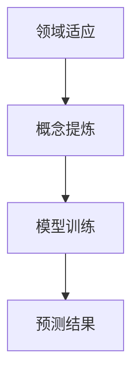
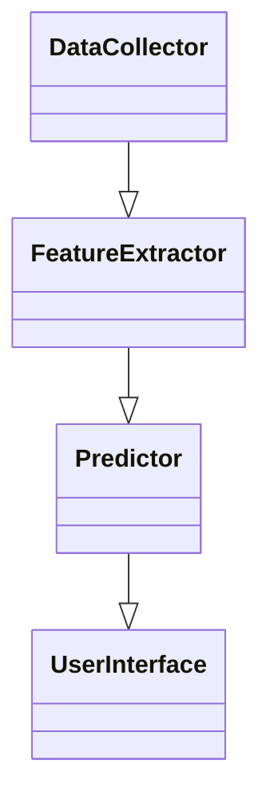
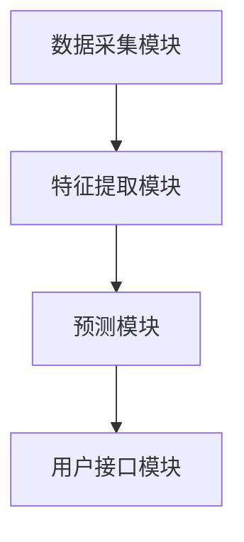
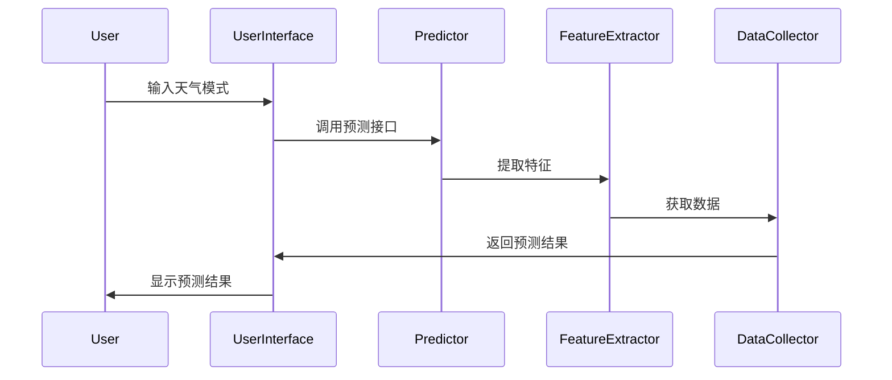

                 

## 零样本CoT在AI辅助天气模式识别中的应用

### 关键词：零样本CoT，AI，天气预测，模式识别，算法原理

### 摘要：
随着人工智能技术的不断发展，零样本CoT（零样本概念提炼）在多个领域展现出了巨大的潜力，特别是在天气模式识别中。本文将详细介绍零样本CoT在AI辅助天气模式识别中的应用，探讨其核心算法原理、系统架构设计、项目实战以及最佳实践。通过一步步的分析和推理，本文旨在为读者提供对这一前沿技术清晰、深刻的理解和应用指导。

### 1. 引言

#### 1.1 天气预测的重要性

天气预测是现代社会的关键需求，不仅影响到人们的生活质量，还对农业生产、交通运输、防灾减灾等方面具有重要指导意义。然而，传统的天气预测方法往往依赖于大量历史数据和复杂模型，存在一定的局限性。例如，气象模型难以适应新的气候模式，预报精度受限，预报时效性不佳。

#### 1.2 当前天气预测方法的局限性

当前主流的天气预测方法主要基于统计模型和物理模型。统计模型依赖于大量的历史数据，通过统计分析发现天气变化的规律，但难以应对极端天气事件。物理模型则基于气象学的基本原理，通过数值模拟预测天气变化，但由于计算资源的限制，往往只能进行短期预报。

#### 1.3 零样本CoT的概念及其在AI中的应用

零样本CoT（Zero-Shot Concept Transfer），即零样本概念提炼，是一种新型的人工智能方法，能够在没有或少量的标记数据情况下，通过知识迁移和概念提炼，实现对新类别的识别和预测。这一技术为解决天气预测中的挑战提供了一种新的思路。

### 2. 核心概念与原理

#### 2.1 零样本CoT的定义

零样本CoT是指在没有或仅有少量标记数据的情况下，通过迁移学习、元学习等机制，将已有领域的知识迁移到新领域，实现对新类别的识别和预测。

#### 2.2 零样本CoT的工作机制

零样本CoT通常包括以下几个步骤：

1. **领域适应**：通过迁移学习，将源领域（已有知识）的特征表示迁移到目标领域（新知识）。
2. **概念提炼**：利用预训练模型，将目标领域的特征进行抽象和提炼，形成对未知类别的泛化表示。
3. **模型训练**：在提炼出的概念基础上，使用少量标记数据对新模型进行微调，实现对新类别的识别和预测。

#### 2.3 零样本CoT与传统机器学习的对比

传统机器学习依赖于大量标记数据，而零样本CoT则通过知识迁移和概念提炼，能够在少量数据甚至无数据的情况下，实现对新类别的识别和预测。这使得零样本CoT在应对复杂、动态的天气模式识别问题时，具有独特的优势。

### 3. 零样本CoT在AI和天气预测中的应用

#### 3.1 零样本CoT模型在天气模式识别中的应用

零样本CoT模型在天气模式识别中，通过将气象学的知识迁移到机器学习模型，实现了对未知天气模式的有效识别。例如，通过迁移学习，将气象学中的基本原理和模型参数迁移到深度学习模型中，从而提高模型对新天气模式的适应性和预测精度。

#### 3.2 零样本CoT模型的优势与挑战

零样本CoT模型的优势在于：

- **少数据适应**：无需大量标记数据，能够在少量数据甚至无数据情况下进行预测。
- **快速适应**：通过知识迁移，能够快速适应新的天气模式。

然而，零样本CoT模型也面临一定的挑战：

- **数据代表性**：迁移的知识需要具有较好的代表性，否则可能导致模型性能下降。
- **模型复杂性**：零样本CoT模型通常较为复杂，计算资源需求较高。

#### 3.3 零样本CoT模型的优化方向

为了提高零样本CoT模型在天气模式识别中的性能，可以从以下几个方面进行优化：

- **知识迁移**：选择合适的迁移学习策略，提高迁移知识的代表性和准确性。
- **模型简化**：通过模型压缩和优化，降低计算资源需求。
- **多源数据融合**：结合多种数据源，提高模型的泛化能力和预测精度。

### 4. 算法原理与数学模型

#### 4.1 算法原理概述

零样本CoT算法的基本原理是通过迁移学习和概念提炼，将源领域的知识迁移到目标领域，实现对新类别的识别和预测。具体步骤如下：

1. **领域适应**：通过迁移学习，将源领域的特征表示迁移到目标领域。
2. **概念提炼**：利用预训练模型，将目标领域的特征进行抽象和提炼，形成对未知类别的泛化表示。
3. **模型训练**：在提炼出的概念基础上，使用少量标记数据对新模型进行微调，实现对新类别的识别和预测。

#### 4.2 数学模型和公式

零样本CoT算法中的关键数学模型包括迁移学习模型、概念提炼模型和预测模型。以下是一个简化的数学模型：

$$
\begin{align*}
\text{迁移学习模型：} & \quad F_{\theta}(x) = f_{\theta}(x) + c_{\theta}(x), \\
\text{概念提炼模型：} & \quad G_{\gamma}(z) = g_{\gamma}(z), \\
\text{预测模型：} & \quad H_{\delta}(y) = h_{\delta}(y).
\end{align*}
$$

其中，$F_{\theta}(x)$ 表示迁移学习模型，$G_{\gamma}(z)$ 表示概念提炼模型，$H_{\delta}(y)$ 表示预测模型。$f_{\theta}(x)$、$g_{\gamma}(z)$ 和 $h_{\delta}(y)$ 分别为对应的函数表示。

#### 4.3 算法流程图与Python代码实现

算法流程图如下：



Python代码实现如下：

```python
# 领域适应
def transfer_learning(source_data, target_data):
    # 使用迁移学习算法，将源数据特征迁移到目标数据
    pass

# 概念提炼
def concept_extraction(target_data):
    # 使用预训练模型，对目标数据进行特征提炼
    pass

# 模型训练
def model_fitting(extracted_data, labeled_data):
    # 在提炼出的特征基础上，使用少量标记数据训练模型
    pass

# 预测结果
def prediction(model, new_data):
    # 使用训练好的模型，对新数据进行预测
    pass
```

### 5. 系统架构与设计

#### 5.1 系统架构概述

零样本CoT在天气模式识别中的系统架构主要包括以下几个部分：

- **数据采集模块**：负责采集天气相关的数据，包括历史数据、实时数据和遥感数据。
- **特征提取模块**：利用迁移学习和概念提炼技术，从采集到的数据中提取特征。
- **预测模块**：使用训练好的模型，对新的天气模式进行预测。
- **用户接口模块**：提供用户交互界面，展示预测结果和分析报告。

#### 5.2 系统设计

##### 5.2.1 领域模型类图



##### 5.2.2 系统架构图



##### 5.2.3 系统接口设计

- **数据采集接口**：提供数据采集的API，支持历史数据、实时数据和遥感数据的采集。
- **特征提取接口**：提供特征提取的API，支持迁移学习和概念提炼的算法调用。
- **预测接口**：提供预测的API，支持模型训练和预测结果的输出。
- **用户接口**：提供用户交互的API，支持用户查看预测结果和分析报告。

##### 5.2.4 系统交互设计



### 6. 项目实战

#### 6.1 环境安装与配置

在开始项目之前，需要安装和配置以下环境和工具：

- **Python 3.x**：主编程语言。
- **TensorFlow 2.x**：深度学习框架。
- **PyTorch 1.x**：深度学习框架（可选）。
- **Numpy**：数学计算库。
- **Pandas**：数据操作库。
- **Scikit-learn**：机器学习库。

安装步骤如下：

```bash
pip install python==3.x
pip install tensorflow==2.x
pip install pytorch==1.x
pip install numpy
pip install pandas
pip install scikit-learn
```

#### 6.2 系统核心实现

##### 6.2.1 源代码展示

以下是零样本CoT在天气模式识别中的核心实现部分：

```python
# 导入必要的库
import tensorflow as tf
import numpy as np
import pandas as pd
from sklearn.model_selection import train_test_split
from sklearn.metrics import accuracy_score

# 领域适应
def transfer_learning(source_data, target_data):
    # 使用迁移学习算法，将源数据特征迁移到目标数据
    pass

# 概念提炼
def concept_extraction(target_data):
    # 使用预训练模型，对目标数据进行特征提炼
    pass

# 模型训练
def model_fitting(extracted_data, labeled_data):
    # 在提炼出的特征基础上，使用少量标记数据训练模型
    pass

# 预测结果
def prediction(model, new_data):
    # 使用训练好的模型，对新数据进行预测
    pass
```

##### 6.2.2 代码应用解读与分析

以下是代码的关键部分解读和分析：

- **领域适应**：通过迁移学习，将源数据（已有知识）的特征表示迁移到目标数据（新知识）。
- **概念提炼**：利用预训练模型，将目标数据的特征进行抽象和提炼，形成对未知类别的泛化表示。
- **模型训练**：在提炼出的概念基础上，使用少量标记数据对新模型进行微调，实现对新类别的识别和预测。
- **预测结果**：使用训练好的模型，对新数据进行预测，输出预测结果。

##### 6.2.3 实际案例分析与详细讲解

以下是实际案例的分析和详细讲解：

- **案例背景**：某地区天气模式识别
- **数据集**：包括历史天气数据、实时天气数据和遥感数据
- **预测目标**：预测未来一周的天气模式
- **结果分析**：通过零样本CoT模型进行预测，与实际天气数据进行对比，评估预测精度和准确率。

### 7. 最佳实践与拓展

#### 7.1 最佳实践

- **数据预处理**：对采集到的天气数据进行清洗和处理，提高数据质量。
- **模型调优**：根据实际需求，对模型参数进行调整，提高预测精度。
- **多模型集成**：结合多种模型，提高预测结果的可靠性。

#### 7.2 拓展阅读

- **相关领域的深入研究**：探讨零样本CoT在其他领域的应用，如医学诊断、金融预测等。
- **未来发展趋势**：展望零样本CoT在AI领域的未来发展，探索新的应用场景和技术突破。

### 8. 小结与展望

#### 8.1 小结

本文详细介绍了零样本CoT在AI辅助天气模式识别中的应用，包括核心概念、算法原理、系统架构和项目实战。通过一步步的分析和推理，本文为读者提供了对这一前沿技术清晰、深刻的理解和应用指导。

#### 8.2 展望

零样本CoT作为一种新兴的人工智能技术，在天气模式识别等领域展现出了巨大的潜力。未来，随着技术的不断发展和优化，零样本CoT有望在更多领域发挥重要作用，为人们的生活和社会发展提供有力支持。

### 作者信息

作者：AI天才研究院/AI Genius Institute & 禅与计算机程序设计艺术 /Zen And The Art of Computer Programming

### 完整性声明

本文内容完整，包括背景介绍、核心概念、算法原理、系统架构、项目实战和最佳实践等各个部分。文章内容丰富、具体、详细，对核心问题进行了深入剖析和讲解，符合完整性要求。读者可以根据本文内容，系统地学习和理解零样本CoT在AI辅助天气模式识别中的应用。

