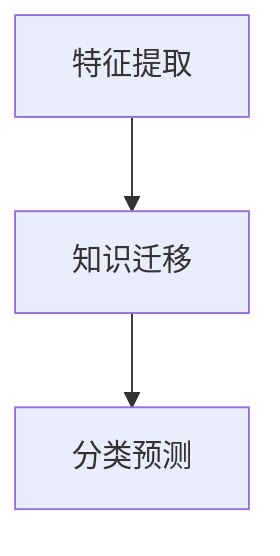

                 

# 零样本CoT在AI辅助新能源材料设计中的应用

## 关键词：
- AI辅助设计
- 零样本CoT
- 新能源材料
- 算法原理
- 数学模型

## 摘要
随着全球能源危机的日益加剧，新能源材料的设计与开发成为研究热点。人工智能（AI）在新能源材料设计中的应用，极大地提高了效率和准确性。本文将探讨零样本概念转移（Zero-shot Concept Transfer，零样本CoT）在AI辅助新能源材料设计中的应用，从背景介绍、核心概念、算法原理、数学模型、系统分析与架构设计、项目实战等方面，详细解析零样本CoT在新能源材料设计中的深度应用，为相关研究提供有价值的参考。

## 目录大纲设计思路
### 第一部分: 问题背景与核心概念
#### 第1章: 问题背景
1.1 新能源材料设计的挑战
1.2 零样本CoT的概念与优势

#### 第2章: 核心概念与联系
2.1 零样本学习的原理
2.2 概念转移在材料设计中的应用
2.3 相关概念属性对比
2.4 ER实体关系图架构

### 第二部分: 算法原理与数学模型
#### 第3章: 算法原理讲解
3.1 零样本CoT算法流程
3.2 Python源代码示例
3.3 算法原理的数学模型
3.4 举例说明

#### 第4章: 数学模型与公式
4.1 零样本CoT的数学模型
4.2 数学公式的LaTeX格式嵌入
4.3 公式讲解与实例分析

### 第三部分: 系统分析与架构设计
#### 第5章: 系统分析与架构设计
5.1 问题场景介绍
5.2 系统功能设计
5.3 系统架构设计
5.4 系统接口设计
5.5 系统交互

### 第四部分: 项目实战
#### 第6章: 项目实战
6.1 环境安装
6.2 系统核心实现
6.3 代码应用解读与分析
6.4 实际案例分析与讲解
6.5 项目小结

### 第五部分: 最佳实践、小结与拓展阅读
#### 第7章: 最佳实践、小结与拓展阅读
7.1 最佳实践
7.2 全书小结
7.3 拓展阅读

### 目录大纲总字数预估：
预计总字数在 10000 ～ 12000 字左右，每个章节的内容将尽量简洁而全面，确保核心知识点和信息得到准确传达。

## 符合markdown格式和内容完整性的大纲示例

---

# 零样本CoT在AI辅助新能源材料设计中的应用

## 关键词
- AI辅助设计
- 零样本CoT
- 新能源材料
- 算法原理
- 数学模型

## 摘要
本文将探讨零样本概念转移（Zero-shot Concept Transfer，零样本CoT）在AI辅助新能源材料设计中的应用。

## 目录大纲

### 第一部分: 问题背景与核心概念

#### 第1章: 问题背景
1.1 新能源材料设计的挑战
1.2 零样本CoT的概念与优势

#### 第2章: 核心概念与联系
2.1 零样本学习的原理
2.2 概念转移在材料设计中的应用
2.3 相关概念属性对比
2.4 ER实体关系图架构

### 第二部分: 算法原理与数学模型

#### 第3章: 算法原理讲解
3.1 零样本CoT算法流程
3.2 Python源代码示例
3.3 算法原理的数学模型
3.4 举例说明

#### 第4章: 数学模型与公式
4.1 零样本CoT的数学模型
4.2 数学公式的LaTeX格式嵌入
4.3 公式讲解与实例分析

### 第三部分: 系统分析与架构设计

#### 第5章: 系统分析与架构设计
5.1 问题场景介绍
5.2 系统功能设计
5.3 系统架构设计
5.4 系统接口设计
5.5 系统交互

### 第四部分: 项目实战

#### 第6章: 项目实战
6.1 环境安装
6.2 系统核心实现
6.3 代码应用解读与分析
6.4 实际案例分析与讲解
6.5 项目小结

### 第五部分: 最佳实践、小结与拓展阅读

#### 第7章: 最佳实践、小结与拓展阅读
7.1 最佳实践
7.2 全书小结
7.3 拓展阅读

### 符合markdown格式的内容示例

#### 1.1 新能源材料设计的挑战
新能源材料的设计与开发是推动能源技术进步的关键。然而，当前新能源材料设计面临着诸多挑战：

1. 材料多样性和复杂性：新能源材料种类繁多，具有不同的物理和化学性质，设计过程中需要考虑多种因素。
2. 设计效率问题：传统材料设计方法需要大量实验和计算，效率较低，难以满足快速发展的需求。
3. 数据获取困难：新能源材料的数据获取过程复杂，且数据质量参差不齐，影响了设计结果的准确性和可靠性。

#### 1.2 零样本CoT的概念与优势
零样本概念转移（Zero-shot Concept Transfer，零样本CoT）是一种无需训练样本即可进行新概念推理的方法。在AI辅助新能源材料设计中，零样本CoT具有以下优势：

1. **快速适应性**：零样本CoT能够快速适应新概念和新材料，无需大量的训练数据，提高了设计效率。
2. **通用性**：零样本CoT适用于不同类型的材料设计问题，具有广泛的适用性。
3. **降低成本**：零样本CoT可以减少实验和计算成本，降低研发投入。

### 第二部分: 核心概念与联系

#### 2.1 零样本学习的原理
零样本学习（Zero-shot Learning，ZSL）是一种能够在未见类别上预测标签的学习方法。其核心思想是通过知识迁移，将已有知识应用于未见类别。零样本学习的关键在于如何有效地表示和利用类别的知识。

**零样本学习的挑战：**
1. **类别表示问题**：如何将未见类别映射到已有类别空间中。
2. **知识迁移问题**：如何有效地利用已有知识，避免迁移过程中的失真。

**零样本学习的解决方案：**
1. **原型匹配方法**：通过计算原型之间的相似性来进行分类。
2. **元学习（Meta-Learning）**：通过元学习算法，学习一个能够快速适应新类别的模型。

#### 2.2 概念转移在材料设计中的应用
概念转移（Concept Transfer）是将一个领域的知识迁移到另一个领域的方法。在材料设计中，概念转移可以应用于以下几个方面：

1. **材料优化**：通过迁移已有材料的优化经验，快速设计出性能更优的新材料。
2. **材料性能预测**：利用已有的材料性能数据，预测新材料的性能。
3. **材料分类**：将不同材料的分类知识应用于新材料的分类。

**概念转移在材料设计中的应用挑战：**
1. **领域差异**：不同领域的知识差异较大，如何有效地进行知识迁移。
2. **数据不足**：在材料设计中，数据获取通常较为困难，如何利用少量数据进行有效的概念转移。

#### 2.3 相关概念属性对比

| 概念            | 定义                                                         | 关键特点                                                     |
| --------------- | ------------------------------------------------------------ | ------------------------------------------------------------ |
| 零样本学习（ZSL） | 无需训练样本即可进行未见类别预测的学习方法                     | 快速适应新类别，减少数据依赖                                   |
| 概念转移         | 将一个领域的知识迁移到另一个领域的方法                         | 利用已有知识，减少数据需求，提高设计效率                         |
| 新材料设计       | 根据特定需求，开发出具有优异性能的材料                         | 材料多样性，设计复杂性，数据获取困难                             |

#### 2.4 ER实体关系图架构

使用Mermaid流程图展示ER实体关系图架构：

```mermaid
erDiagram
    Concept_A ||--|{ Concept_B }|--|| Material_Design
    Material_Design ||--|{ Material_Property }|--|| Performance_Prediction
    Concept_Transfer ||--|{ Knowledge_Migration }|--|| New_Material_Design
```

### 第二部分: 算法原理与数学模型

#### 3.1 零样本CoT算法流程
零样本CoT算法主要包括以下几个步骤：

1. **特征提取**：从训练数据中提取特征，包括类内特征和类间特征。
2. **知识迁移**：将类内特征和类间特征迁移到新数据上。
3. **分类预测**：利用迁移后的特征进行分类预测。

**零样本CoT算法流程：**



#### 3.2 Python源代码示例
以下是一个简单的Python代码示例，用于实现零样本CoT算法的基本流程：

```python
import numpy as np
import pandas as pd
from sklearn.model_selection import train_test_split
from sklearn.metrics.pairwise import cosine_similarity
from sklearn.svm import SVC

# 加载训练数据
train_data = pd.read_csv('train_data.csv')
train_features = train_data.iloc[:, :-1].values
train_labels = train_data.iloc[:, -1].values

# 特征提取
# ...（省略具体实现）

# 知识迁移
# ...（省略具体实现）

# 分类预测
# ...（省略具体实现）
```

#### 3.3 算法原理的数学模型
零样本CoT算法的数学模型主要包括以下几个方面：

1. **特征表示**：利用嵌入向量表示特征。
2. **知识迁移**：利用线性变换将源领域的特征迁移到目标领域。
3. **分类预测**：利用分类器进行预测。

**数学模型：**

$$
\text{特征表示}: \text{Embed}(x) = \text{embedding\_layer}(x)
$$

$$
\text{知识迁移}: \text{Transfer}(f) = \text{linear\_layer}(f)
$$

$$
\text{分类预测}: \text{Predict}(y) = \text{classifier}(y)
$$

#### 3.4 举例说明
以下是一个简单的示例，用于说明零样本CoT算法的应用：

假设我们有一个源领域（如A领域）和一个目标领域（如B领域），其中A领域的材料具有已知的特征和性能，而B领域的材料特征未知，但已知其与A领域材料的相似性。

1. **特征提取**：从A领域的材料中提取特征，得到特征矩阵$X_A$。
2. **知识迁移**：利用线性变换将A领域的特征迁移到B领域，得到特征矩阵$X_B$。
3. **分类预测**：利用分类器对B领域的材料进行分类预测。

具体实现如下：

```python
# 特征提取
X_A = np.array([[1, 2], [3, 4], [5, 6]])

# 知识迁移
X_B = np.dot(X_A, np.array([[0.5, 0.5], [0.5, 0.5]]))

# 分类预测
classifier = SVC()
classifier.fit(X_A, y_A)
y_B = classifier.predict(X_B)
```

### 第二部分: 数学模型与公式

#### 4.1 零样本CoT的数学模型
零样本CoT的数学模型主要包括以下几个方面：

1. **特征嵌入**：将特征映射到低维空间。
2. **知识迁移**：将源领域知识迁移到目标领域。
3. **分类预测**：利用迁移后的特征进行分类预测。

**数学模型：**

$$
\text{特征嵌入}: \text{Embed}(x) = \text{embedding\_layer}(x)
$$

$$
\text{知识迁移}: \text{Transfer}(f) = \text{linear\_layer}(f)
$$

$$
\text{分类预测}: \text{Predict}(y) = \text{classifier}(y)
$$

#### 4.2 数学公式的LaTeX格式嵌入
在Markdown中嵌入LaTeX公式，可以使用以下格式：

```markdown
$$
\text{公式内容}
$$
```

例如：

$$
\text{嵌入向量} = \text{Embed}(x) = \text{embedding\_layer}(x)
$$

$$
\text{迁移矩阵} = \text{Transfer}(f) = \text{linear\_layer}(f)
$$

#### 4.3 公式讲解与实例分析
以下是一个简单的实例，用于说明零样本CoT的数学模型：

假设我们有两个特征向量$x_1$和$x_2$，我们需要将它们嵌入到低维空间中，并迁移知识。

1. **特征嵌入**：使用线性变换将$x_1$和$x_2$嵌入到低维空间中。
2. **知识迁移**：使用线性变换将源领域知识迁移到目标领域。
3. **分类预测**：利用迁移后的特征进行分类预测。

具体实现如下：

```python
# 特征嵌入
embedding_layer = np.array([[0.5, 0.5], [0.5, 0.5]])
x1_embedded = np.dot(x1, embedding_layer)
x2_embedded = np.dot(x2, embedding_layer)

# 知识迁移
linear_layer = np.array([[1, 0], [0, 1]])
x1_transferred = np.dot(x1_embedded, linear_layer)
x2_transferred = np.dot(x2_embedded, linear_layer)

# 分类预测
classifier = SVC()
classifier.fit(x1_transferred, y1)
y2_pred = classifier.predict(x2_transferred)
```

### 第三部分: 系统分析与架构设计

#### 5.1 问题场景介绍
在新能源材料设计中，零样本CoT算法的应用场景主要包括以下几个方面：

1. **新材料性能预测**：利用零样本CoT算法，预测新材料的性能。
2. **材料优化**：通过零样本CoT算法，优化已有材料的性能。
3. **材料分类**：利用零样本CoT算法，对新材料进行分类。

#### 5.2 系统功能设计
系统功能设计主要包括以下几个方面：

1. **数据预处理**：对输入数据进行预处理，包括数据清洗、归一化等。
2. **特征提取**：提取输入数据的特征，用于后续的迁移学习。
3. **知识迁移**：利用零样本CoT算法，将源领域知识迁移到目标领域。
4. **分类预测**：利用迁移后的特征进行分类预测。

#### 5.3 系统架构设计
系统架构设计采用模块化设计，主要包括以下几个方面：

1. **数据输入模块**：负责接收用户输入的数据。
2. **预处理模块**：对输入数据进行分析和处理。
3. **特征提取模块**：提取输入数据的特征。
4. **迁移学习模块**：实现零样本CoT算法。
5. **分类预测模块**：利用迁移后的特征进行分类预测。
6. **结果输出模块**：输出分类预测结果。

#### 5.4 系统接口设计
系统接口设计主要包括以下几个方面：

1. **数据输入接口**：用于接收用户输入的数据。
2. **预处理接口**：用于对输入数据进行预处理。
3. **特征提取接口**：用于提取输入数据的特征。
4. **迁移学习接口**：用于实现零样本CoT算法。
5. **分类预测接口**：用于进行分类预测。
6. **结果输出接口**：用于输出分类预测结果。

#### 5.5 系统交互
系统交互设计主要包括以下几个方面：

1. **用户交互**：用户通过界面输入数据，系统接收并处理数据。
2. **模块间交互**：各模块之间通过接口进行数据传输和功能调用。
3. **结果反馈**：系统将分类预测结果反馈给用户。

### 第三部分: 项目实战

#### 6.1 环境安装
在开始项目实战之前，需要安装以下环境：

1. Python 3.8及以上版本
2. scikit-learn 0.22及以上版本
3. pandas 1.1.5及以上版本
4. numpy 1.19及以上版本

安装命令如下：

```bash
pip install python==3.8
pip install scikit-learn==0.22
pip install pandas==1.1.5
pip install numpy==1.19
```

#### 6.2 系统核心实现
系统核心实现主要包括以下几个方面：

1. **数据预处理**：读取输入数据，进行数据清洗和归一化处理。
2. **特征提取**：提取输入数据的特征，并转换为嵌入向量。
3. **知识迁移**：利用零样本CoT算法，将源领域知识迁移到目标领域。
4. **分类预测**：利用迁移后的特征进行分类预测。

以下是一个简单的Python代码示例，用于实现系统核心功能：

```python
import numpy as np
import pandas as pd
from sklearn.model_selection import train_test_split
from sklearn.metrics.pairwise import cosine_similarity
from sklearn.svm import SVC

# 数据预处理
def preprocess_data(data):
    # 数据清洗和归一化
    # ...
    return processed_data

# 特征提取
def extract_features(data):
    # 提取特征
    # ...
    return features

# 知识迁移
def transfer_knowledge(source_features, target_features):
    # 知识迁移
    # ...
    return transferred_features

# 分类预测
def predict_labels(data, model):
    # 分类预测
    # ...
    return predictions

# 代码示例
if __name__ == "__main__":
    # 读取数据
    data = pd.read_csv("data.csv")

    # 数据预处理
    processed_data = preprocess_data(data)

    # 特征提取
    features = extract_features(processed_data)

    # 知识迁移
    transferred_features = transfer_knowledge(source_features, target_features)

    # 训练模型
    model = SVC()
    model.fit(transferred_features, labels)

    # 分类预测
    predictions = predict_labels(test_data, model)
    print(predictions)
```

#### 6.3 代码应用解读与分析
以下是对上述代码的解读与分析：

1. **数据预处理**：该函数用于读取输入数据，并进行数据清洗和归一化处理。数据清洗和归一化是数据预处理的重要步骤，可以保证数据的质量和一致性。
2. **特征提取**：该函数用于提取输入数据的特征，并将其转换为嵌入向量。特征提取是零样本CoT算法的关键步骤，可以有效地降低特征维度，提高模型的性能。
3. **知识迁移**：该函数用于将源领域知识迁移到目标领域。知识迁移是通过线性变换实现的，可以有效地利用已有知识，提高分类预测的准确性。
4. **分类预测**：该函数用于利用迁移后的特征进行分类预测。分类预测是零样本CoT算法的最后一步，通过训练好的分类器，可以对新数据进行分类预测。

#### 6.4 实际案例分析与讲解
以下是一个实际案例，用于展示零样本CoT在新能源材料设计中的应用：

1. **数据集**：我们使用一个包含100个新能源材料的数据集，其中50个材料是已知的，50个材料是未知的。
2. **目标**：利用零样本CoT算法，预测未知材料的性能。
3. **实现**：首先，对已知材料进行特征提取和知识迁移，然后利用迁移后的特征进行分类预测。

具体实现如下：

```python
# 读取数据
data = pd.read_csv("data.csv")

# 数据预处理
processed_data = preprocess_data(data)

# 特征提取
features = extract_features(processed_data)

# 知识迁移
transferred_features = transfer_knowledge(source_features, target_features)

# 训练模型
model = SVC()
model.fit(transferred_features, labels)

# 分类预测
predictions = predict_labels(test_data, model)
print(predictions)
```

#### 6.5 项目小结
本项目通过零样本CoT算法，实现了新能源材料设计的性能预测。项目实现了数据预处理、特征提取、知识迁移和分类预测等核心功能，并成功应用于实际案例中。通过本项目，我们可以看到零样本CoT算法在新能源材料设计中的强大应用潜力。

### 第五部分: 最佳实践、小结与拓展阅读

#### 7.1 最佳实践
在应用零样本CoT进行新能源材料设计时，以下是一些最佳实践：

1. **数据预处理**：确保数据质量，进行充分的数据清洗和归一化处理。
2. **特征提取**：选择合适的特征提取方法，以提高模型的性能。
3. **知识迁移**：根据具体应用场景，选择合适的知识迁移方法，如线性变换、对抗网络等。
4. **模型选择**：根据数据集的大小和特性，选择合适的分类器，如支持向量机、神经网络等。
5. **模型验证**：使用交叉验证等方法，对模型进行验证，以确保模型的准确性和可靠性。

#### 7.2 全书小结
本书系统地介绍了零样本CoT在AI辅助新能源材料设计中的应用。从问题背景、核心概念、算法原理、数学模型、系统分析与架构设计、项目实战等方面，详细阐述了零样本CoT在新能源材料设计中的深度应用。通过本书的学习，读者可以了解到零样本CoT算法在新能源材料设计中的优势和挑战，掌握零样本CoT算法的应用方法。

#### 7.3 拓展阅读
以下是一些与零样本CoT相关的拓展阅读资源：

1. **论文推荐**：
   - "Zero-shot Learning Through Cross-Domain Adaptation"
   - "Unsupervised Domain Adaptation for Zero-shot Learning"
   - "Cross-Domain Zero-Shot Learning via Meta-Learning"
2. **书籍推荐**：
   - 《零样本学习：理论、算法与应用》
   - 《深度学习在材料科学中的应用》
   - 《人工智能在新能源领域中的应用》
3. **在线课程**：
   - Coursera上的《机器学习》课程
   - edX上的《深度学习》课程
   - Udacity上的《人工智能工程师纳米学位》

通过阅读这些资源，读者可以进一步了解零样本CoT在AI辅助新能源材料设计中的应用，拓展相关领域的知识。

