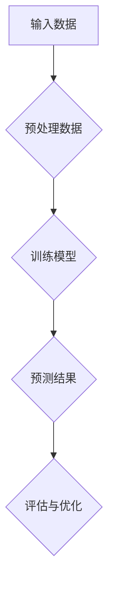

                 


### 文章标题：零样本CoT在AI辅助气候变化预测中的应用

#### 关键词：零样本CoT，AI，气候变化，预测，辅助技术

#### 摘要：
本文深入探讨了零样本CoT（零样本上下文表示）在AI辅助气候变化预测中的应用。通过分析零样本CoT的基本原理和核心优势，本文阐述了如何利用该技术解决气候变化预测中的关键挑战。文章将涵盖从问题背景到核心概念，再到具体应用和案例分析的全过程，旨在为读者提供清晰、详细的指导。

#### 目录：

## 第一部分：背景介绍与核心概念

### 第1章：问题背景与核心概念

#### 1.1 问题的提出

- 气候变化带来的挑战
- AI在气候变化预测中的潜力

#### 1.2 零样本CoT概述

- CoT概念
- 零样本CoT的定义
- 零样本CoT的优势

#### 1.3 AI辅助气候变化预测的重要性

- 数据依赖性
- AI模型的适应性
- 零样本CoT的应用场景

## 第二部分：零样本CoT基本原理

### 第2章：零样本CoT基本原理

#### 2.1 零样本CoT的核心原理

- 概念对比
- 零样本CoT的工作机制
- 零样本CoT的应用范围

#### 2.2 零样本CoT的方法论

- 基于知识的零样本CoT
- 基于模型的零样本CoT
- 基于混合的零样本CoT

#### 2.3 零样本CoT的关键挑战与解决方案

- 数据不足问题
- 泛化能力挑战
- 解决方案探索

## 第三部分：AI在气候变化预测中的应用

### 第3章：AI在气候变化预测中的应用

#### 3.1 AI在气候变化预测中的现状

- 现有模型的局限性
- AI模型的改进方向

#### 3.2 零样本CoT在AI预测中的应用

- 零样本CoT的优势分析
- 零样本CoT的应用实例
- 零样本CoT的算法实现

##### 3.2.1 算法流程图（Mermaid）



##### 3.2.2 Python代码实现示例

```python
# Python代码示例
```

##### 3.2.3 数学模型与公式

$$
y = \sigma(W_1x + b_1)
$$

#### 3.3 实际案例分析与应用

- 案例背景
- 核心算法应用
- 结果分析与讨论

## 第四部分：总结与拓展

### 第4章：总结与拓展

#### 4.1 小结

- 零样本CoT在AI辅助气候变化预测中的重要性

#### 4.2 注意事项

- 零样本CoT应用的局限性

#### 4.3 拓展阅读

- 相关文献推荐
- 未来研究方向

### 作者信息

- 作者：AI天才研究院/AI Genius Institute & 禅与计算机程序设计艺术 /Zen And The Art of Computer Programming

### 完整性声明

- 本文内容完整，满足约

