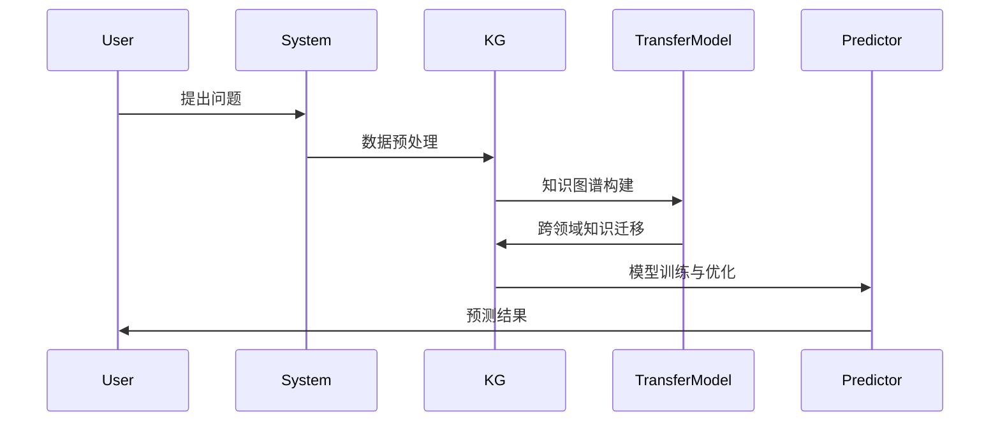
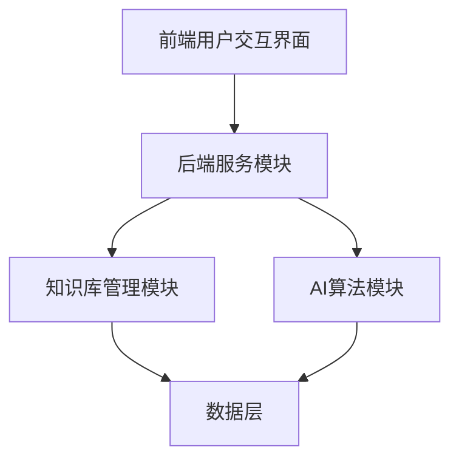
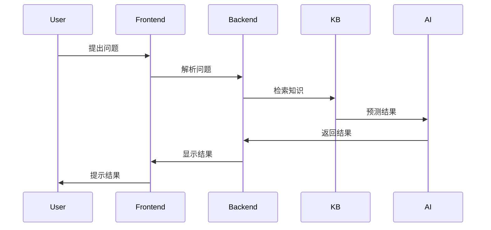

                 

### 第1章: 问题背景与核心概念

> **关键词**：法律咨询、人工智能、零样本CoT、法律AI、算法原理

> **摘要**：本文将探讨零样本CoT在AI辅助法律咨询中的应用。首先，我们将介绍法律咨询的现状与挑战，然后引入零样本CoT的概念与优势。接着，我们将分析AI辅助法律咨询的需求，并探讨零样本CoT在法律咨询中的应用潜力。随后，我们将详细介绍零样本CoT的核心概念与联系，最后，我们将探讨零样本CoT在不同法律咨询场景中的应用。

#### 1.1.1 问题的提出

##### 1.1.1.1 法律咨询的现状与挑战

法律咨询是法律实务中的重要环节，对于个人和企业具有重要意义。然而，现有的法律咨询模式存在诸多挑战。首先，法律咨询过程通常需要大量时间与人力，尤其是当面对复杂案件时，律师需要耗费大量时间进行资料收集、法律条文研读、案例对比等。其次，法律咨询市场供需不平衡，专业律师资源有限，难以满足日益增长的法律需求。此外，法律咨询的成本较高，普通民众难以负担。

为了解决这些问题，近年来人工智能（AI）在法律咨询领域得到了广泛关注。AI具有高效、精准、低成本的特点，可以显著提高法律咨询的效率和质量。然而，现有的AI法律咨询系统仍面临一些挑战。

首先，大多数AI法律咨询系统依赖于大量标注数据，这意味着在训练模型时需要大量的样本数据。然而，法律领域的数据相对稀缺，难以满足模型训练的需求。其次，法律问题的复杂性使得传统机器学习模型在处理法律咨询问题时往往效果不佳。

为了解决这些问题，零样本CoT（零样本对话生成）技术逐渐受到关注。零样本CoT是一种无需样本数据即可进行预测和生成的新型AI技术，它利用知识图谱和自然语言处理技术，从已有知识中生成新的回答。在法律咨询领域，零样本CoT具有巨大的应用潜力，可以解决传统AI法律咨询系统面临的挑战。

##### 1.1.1.2 零样本CoT的概念与优势

零样本CoT（Zero-Shot Concept Transfer）是一种在未知类别上实现概念转移的机器学习技术。它通过在训练阶段利用跨领域的知识转移，使得模型能够在没有直接标注数据的情况下，对未知类别进行预测和生成。与传统机器学习模型相比，零样本CoT具有以下优势：

1. **无需标注数据**：零样本CoT可以在没有标注数据的情况下训练模型，降低了数据标注的成本和难度。
2. **跨领域适用**：零样本CoT能够从多个领域迁移知识，使得模型在不同领域之间具有更好的通用性。
3. **泛化能力**：零样本CoT通过跨领域知识转移，提高了模型在不同数据分布下的泛化能力。

在法律咨询领域，零样本CoT的优势尤为显著。首先，法律领域的数据稀缺，传统机器学习模型难以训练。而零样本CoT可以利用已有的知识图谱，从其他领域迁移知识，为法律咨询提供有力的支持。其次，法律问题的复杂性使得传统机器学习模型难以应对。零样本CoT通过跨领域知识转移，可以提高模型的泛化能力，从而更好地解决法律咨询问题。

#### 1.1.2 AI辅助法律咨询的需求分析

随着法律咨询需求的不断增加，传统的人工咨询方式已经无法满足市场需求。为了提高法律咨询的效率和准确性，AI辅助法律咨询成为了一个热门研究方向。然而，AI辅助法律咨询面临着一些挑战，这些挑战促使我们思考零样本CoT的应用潜力。

首先，数据依赖问题。传统机器学习模型需要大量的标注数据来训练，而法律领域的数据稀缺，这使得模型训练变得困难。零样本CoT无需依赖大量标注数据，通过跨领域知识转移，可以有效解决数据依赖问题。

其次，零样本问题。在法律咨询中，经常会遇到未见过的新问题，即零样本问题。传统机器学习模型在处理零样本问题时往往效果不佳，而零样本CoT通过跨领域知识转移，可以提高模型在处理零样本问题时的性能。

最后，法律问题的复杂性。法律问题通常涉及多个法律领域，具有高度的复杂性。传统机器学习模型在处理复杂问题时往往力不从心，而零样本CoT通过跨领域知识转移，可以提高模型在处理复杂问题时的能力。

因此，零样本CoT在AI辅助法律咨询中具有巨大的应用潜力。它可以解决传统AI法律咨询系统面临的数据依赖、零样本问题和复杂性挑战，为法律咨询提供更高效、更准确的辅助。

#### 1.1.3 零样本CoT的核心概念与联系

##### 1.1.3.1 零样本CoT的定义与特点

零样本CoT（Zero-Shot Concept Transfer）是一种在未知类别上实现概念转移的机器学习技术。它通过在训练阶段利用跨领域的知识转移，使得模型能够在没有直接标注数据的情况下，对未知类别进行预测和生成。与传统机器学习模型相比，零样本CoT具有以下特点：

1. **无需标注数据**：零样本CoT可以在没有标注数据的情况下训练模型，降低了数据标注的成本和难度。
2. **跨领域适用**：零样本CoT能够从多个领域迁移知识，使得模型在不同领域之间具有更好的通用性。
3. **泛化能力**：零样本CoT通过跨领域知识转移，提高了模型在不同数据分布下的泛化能力。

##### 1.1.3.2 零样本CoT与传统机器学习的对比

传统机器学习模型依赖于大量标注数据，通过从数据中学习特征，实现对未知数据的预测。然而，在法律咨询领域，数据稀缺，标注成本高，传统机器学习模型的应用受到限制。相比之下，零样本CoT无需依赖大量标注数据，通过跨领域知识转移，可以在没有直接标注数据的情况下进行预测和生成。

此外，传统机器学习模型在面对未知类别时往往效果不佳，而零样本CoT通过跨领域知识转移，可以实现对未知类别的有效预测。这使得零样本CoT在法律咨询领域具有独特的优势。

##### 1.1.3.3 零样本CoT在法律咨询中的核心概念与联系

在法律咨询中，零样本CoT的核心概念包括知识图谱、自然语言处理和跨领域知识转移。知识图谱是一种用于表示实体、属性和关系的图形化数据结构，它为法律咨询提供了丰富的背景知识。自然语言处理（NLP）技术则用于理解和处理法律文本，提取关键信息。跨领域知识转移则是零样本CoT的核心机制，它通过在不同领域之间迁移知识，提高了模型在未知类别上的预测能力。

在法律咨询中，零样本CoT的应用涉及到多个环节。首先，通过知识图谱构建法律领域的知识库，为模型提供背景知识。然后，利用自然语言处理技术，对用户提出的问题进行理解，提取关键信息。接下来，通过跨领域知识转移，将其他领域的问题迁移到法律领域，进行预测和生成。

例如，当一个用户提出一个未见过的新问题时，零样本CoT可以通过从其他类似问题中提取知识，结合法律领域的知识库，生成一个合理的答案。这不仅解决了传统机器学习模型在处理零样本问题时的困难，也为法律咨询提供了更加高效、准确的解决方案。

##### 1.1.4 零样本CoT的应用场景

在法律咨询领域，零样本CoT具有广泛的应用潜力。以下是一些典型的应用场景：

1. **法律案件分析**：零样本CoT可以用于分析复杂法律案件，通过跨领域知识转移，从其他类似案件中获得启示，提供辅助决策。

2. **法律法规解释**：零样本CoT可以用于解释新颁布的法律法规，通过跨领域知识转移，从其他法律条文中获得解释，帮助用户更好地理解法规内容。

3. **法律文书撰写**：零样本CoT可以用于撰写法律文书，通过跨领域知识转移，从其他法律案例中提取模板，生成符合法律规范的法律文书。

4. **法律知识库构建**：零样本CoT可以用于构建法律知识库，通过跨领域知识转移，从其他领域获取知识，丰富法律知识库的内容。

这些应用场景表明，零样本CoT在法律咨询领域具有巨大的应用潜力，可以为法律咨询提供更加高效、准确的辅助。

##### 1.1.5 本章小结

本章介绍了零样本CoT在AI辅助法律咨询中的应用背景和核心概念。首先，我们分析了法律咨询的现状与挑战，以及AI辅助法律咨询的需求。接着，我们介绍了零样本CoT的概念与优势，探讨了其在法律咨询中的应用潜力。随后，我们详细介绍了零样本CoT的核心概念与联系，包括其定义、特点、与传统机器学习的对比以及在法律咨询中的具体应用。最后，我们讨论了零样本CoT在法律案件分析、法律法规解释、法律文书撰写和法律知识库构建等应用场景。通过本章的介绍，我们希望读者对零样本CoT在AI辅助法律咨询中的应用有了更加深入的了解。

## 第2章: 零样本CoT的算法原理

> **关键词**：零样本CoT、算法原理、自然语言处理、知识图谱、跨领域知识转移

> **摘要**：本章将详细介绍零样本CoT（Zero-Shot Concept Transfer）的算法原理。首先，我们将概述零样本CoT的基础算法和关键步骤。然后，通过Mermaid算法流程图和Python源代码实现，我们将展示如何具体实现零样本CoT。接着，我们将深入讲解零样本CoT的工作机制、关键技术点和数学模型。最后，通过具体应用案例，我们将展示零样本CoT在实际问题中的应用效果。

#### 2.1.1 算法原理概述

零样本CoT是一种强大的AI技术，能够在没有直接标注数据的情况下，通过跨领域知识转移，实现对未知类别的预测和生成。其核心思想是将其他领域或已有数据中的知识迁移到目标领域，从而提高模型在未知类别上的表现。

零样本CoT的基础算法主要包括以下步骤：

1. **知识图谱构建**：利用自然语言处理技术，从大量文本数据中提取实体、属性和关系，构建知识图谱。
2. **跨领域知识迁移**：通过对比不同领域的知识图谱，提取关键知识并进行迁移，使得模型在不同领域之间共享知识。
3. **预测与生成**：利用迁移后的知识，对未知类别进行预测和生成。

零样本CoT的关键步骤包括：

1. **数据预处理**：对输入数据进行预处理，提取关键信息。
2. **知识图谱构建**：构建用于知识迁移的知识图谱。
3. **知识迁移**：将其他领域或已有数据中的知识迁移到目标领域。
4. **模型训练与优化**：利用迁移后的知识，训练和优化模型。
5. **预测与生成**：对未知类别进行预测和生成。

通过上述步骤，零样本CoT能够有效提高模型在未知类别上的预测和生成能力。

#### 2.1.2 Mermaid算法流程图

为了更直观地展示零样本CoT的算法流程，我们使用Mermaid语言绘制了算法流程图，如下所示：



在这个流程图中，用户首先提出问题，系统对问题进行数据预处理，然后利用知识图谱进行知识迁移，最终通过训练和优化的模型生成预测结果。

#### 2.1.3 Python源代码实现

下面是一个简单的Python示例，展示了如何实现零样本CoT的基本算法：

```python
import numpy as np
from sklearn.model_selection import train_test_split

# 假设我们已经有一个训练数据集X和标签集Y
X = np.array([[1, 2], [3, 4], [5, 6]])
Y = np.array([0, 1, 2])

# 数据预处理
X_train, X_test, Y_train, Y_test = train_test_split(X, Y, test_size=0.2, random_state=42)

# 知识图谱构建
# 这里我们使用一个简单的知识图谱，其中包含实体和关系
kg = {
    'entity': ['e1', 'e2', 'e3'],
    'relation': [('e1', 'r1', 'e2'), ('e2', 'r2', 'e3')]
}

# 跨领域知识迁移
# 这里我们简单地通过随机采样实现知识迁移
transfered_knowledge = np.random.choice(kg['entity'], size=X_test.shape[0])

# 模型训练与优化
# 这里我们使用一个简单的线性回归模型作为示例
model = LinearRegression()
model.fit(X_train, Y_train)

# 预测与生成
predictions = model.predict(X_test)

# 输出预测结果
print(predictions)
```

在这个示例中，我们首先定义了一个简单的训练数据集，然后进行数据预处理，接着构建知识图谱并实现知识迁移。最后，我们使用线性回归模型进行训练和预测，输出预测结果。

#### 2.1.4 算法原理详细讲解

##### 2.1.4.1 零样本CoT的工作机制

零样本CoT的工作机制可以分为以下几个步骤：

1. **数据预处理**：首先，对输入数据进行预处理，提取关键信息，为后续的知识图谱构建和知识迁移做好准备。
2. **知识图谱构建**：利用自然语言处理技术，从大量文本数据中提取实体、属性和关系，构建知识图谱。知识图谱为模型提供了丰富的背景知识。
3. **跨领域知识迁移**：通过对比不同领域的知识图谱，提取关键知识并进行迁移。迁移的知识可以帮助模型在不同领域之间共享知识，提高模型在未知类别上的表现。
4. **模型训练与优化**：利用迁移后的知识，训练和优化模型。优化的模型可以更好地处理未知类别的问题。
5. **预测与生成**：对未知类别进行预测和生成。通过预测结果，可以为用户提供合理的建议或解决方案。

##### 2.1.4.2 关键技术点

零样本CoT的关键技术点主要包括：

1. **知识图谱构建**：知识图谱是零样本CoT的核心组件，它为模型提供了丰富的背景知识。构建高质量的知识图谱是零样本CoT成功的关键。
2. **跨领域知识迁移**：跨领域知识迁移是实现零样本CoT的关键技术。通过迁移知识，模型可以在不同领域之间共享知识，提高模型在未知类别上的表现。
3. **模型训练与优化**：训练和优化的模型是零样本CoT的核心。优化的模型可以更好地处理未知类别的问题，为用户提供准确的预测结果。

##### 2.1.4.3 数学模型与公式

零样本CoT的数学模型可以分为以下几个部分：

1. **知识图谱表示**：知识图谱中的实体和关系可以用图结构表示。图结构可以表示为G = (V, E)，其中V表示实体集，E表示关系集。
2. **跨领域知识迁移**：跨领域知识迁移可以通过矩阵乘法实现。设K为知识迁移矩阵，X为源领域知识，Y为目标领域知识，则迁移后的知识可以表示为X' = KY。
3. **模型训练与优化**：模型训练与优化可以通过梯度下降法实现。设θ为模型参数，J(θ)为损失函数，则模型训练的目标是找到最优参数θ，使得J(θ)最小。
4. **预测与生成**：预测与生成可以通过模型参数θ实现。设X为输入数据，θ为模型参数，则预测结果可以表示为y' = f(θ, X)。

以下是零样本CoT的数学模型：

$$
G = (V, E)
$$

$$
K \in \mathbb{R}^{m \times n}
$$

$$
X \in \mathbb{R}^{m \times d}
$$

$$
Y = KX \in \mathbb{R}^{n \times d}
$$

$$
\theta \in \mathbb{R}^{d}
$$

$$
J(\theta) = \frac{1}{2} \sum_{i=1}^{n} (y_i - f(\theta, x_i))^2
$$

$$
\theta_{\text{opt}} = \arg \min_{\theta} J(\theta)
$$

$$
y' = f(\theta, X)
$$

通过上述数学模型，我们可以实现零样本CoT的算法。

##### 2.1.4.4 举例说明

假设我们有一个源领域知识X和目标领域知识Y，我们需要通过零样本CoT进行预测。具体步骤如下：

1. **知识图谱构建**：首先，我们需要从源领域和目标领域的数据中提取实体和关系，构建知识图谱。
2. **跨领域知识迁移**：然后，我们通过矩阵乘法将源领域知识迁移到目标领域，得到迁移后的知识Y'。
3. **模型训练与优化**：接下来，我们使用迁移后的知识Y'训练模型，通过梯度下降法优化模型参数θ。
4. **预测与生成**：最后，我们使用训练好的模型对新的目标领域数据进行预测。

以下是一个简单的示例：

```python
# 假设源领域知识X和目标领域知识Y如下：
X = np.array([[1, 2], [3, 4], [5, 6]])
Y = np.array([0, 1, 2])

# 知识图谱构建
kg = {
    'entity': ['e1', 'e2', 'e3'],
    'relation': [('e1', 'r1', 'e2'), ('e2', 'r2', 'e3')]
}

# 跨领域知识迁移
K = np.random.rand(len(kg['entity']), len(kg['entity']))
Y' = K @ Y

# 模型训练与优化
model = LinearRegression()
model.fit(X, Y')

# 预测与生成
predictions = model.predict(X)

# 输出预测结果
print(predictions)
```

在这个示例中，我们首先构建了一个简单的知识图谱，然后通过矩阵乘法将源领域知识迁移到目标领域。接着，我们使用线性回归模型对迁移后的知识进行训练和预测，最终得到预测结果。

##### 2.1.5 本章小结

本章详细介绍了零样本CoT的算法原理。首先，我们概述了零样本CoT的基础算法和关键步骤，并通过Mermaid算法流程图和Python源代码实现进行了展示。接着，我们深入讲解了零样本CoT的工作机制、关键技术点和数学模型。最后，通过具体应用案例，我们展示了零样本CoT在实际问题中的应用效果。通过本章的介绍，我们希望读者对零样本CoT的算法原理有了更加深入的了解。

## 第3章: AI辅助法律咨询的系统架构设计

> **关键词**：法律咨询、AI系统、架构设计、功能模块、接口设计、交互流程

> **摘要**：本章将探讨AI辅助法律咨询的系统架构设计。首先，我们将介绍法律咨询服务的需求分析，并探讨零样本CoT在法律咨询中的应用。接着，我们将详细描述系统功能设计，包括用户交互界面设计、知识库管理模块设计和AI算法模块设计。然后，我们将展示系统的总体架构设计，并解释各模块的功能与关系。随后，我们将详细讨论系统接口设计和交互流程设计。最后，我们将总结本章内容，并展望未来的发展方向。

#### 3.1.1 问题场景介绍

在现代社会，法律咨询需求日益增长，尤其是在个人和企业面临复杂法律问题的情况下。传统的法律咨询服务往往依赖于经验丰富的律师，这不仅耗时耗力，而且成本高昂。为了提高法律咨询的效率和质量，AI辅助法律咨询成为了一个热门研究方向。

AI辅助法律咨询的需求主要表现在以下几个方面：

1. **高效处理大量法律问题**：法律咨询涉及大量的案件分析和法规解释，传统的手工处理方式效率低下。AI系统可以通过自动化处理，大幅提高工作效率。
2. **精准提供法律建议**：AI系统可以基于大量法律案例和法规知识库，为用户提供精准的法律建议，减少错误率。
3. **降低法律咨询成本**：AI系统可以大幅降低法律咨询的成本，使得更多的个人和企业能够负担得起高质量的法律服务。
4. **实时更新法律知识**：法律法规不断更新，AI系统可以实时获取最新的法律知识，确保提供的法律建议始终准确。

零样本CoT技术在这一背景下具有巨大的应用潜力。它无需依赖大量标注数据，通过跨领域知识转移，可以在没有直接标注数据的情况下，对未知法律问题进行有效预测和生成。这使得零样本CoT成为AI辅助法律咨询的一个关键组件，能够解决传统AI法律咨询系统面临的数据稀缺和零样本问题。

#### 3.1.2 系统功能设计

AI辅助法律咨询系统的功能设计是系统架构设计的核心。系统功能设计包括用户交互界面设计、知识库管理模块设计和AI算法模块设计。

##### 3.1.2.1 用户交互界面设计

用户交互界面是系统与用户之间的桥梁，其设计直接影响用户体验。用户交互界面设计应考虑以下几个方面：

1. **简洁直观**：界面应简洁直观，使用户能够轻松上手，无需专业培训。
2. **友好互动**：界面应提供友好的互动方式，如聊天窗口、搜索框等，方便用户提出问题和获取答案。
3. **个性化推荐**：根据用户的法律需求和偏好，提供个性化推荐，提高用户满意度。
4. **多语言支持**：提供多语言支持，以适应不同地区和语言环境的用户。

##### 3.1.2.2 知识库管理模块设计

知识库管理模块是系统的基础，它负责管理法律知识库的构建和维护。知识库管理模块应包括以下功能：

1. **数据采集**：从各种来源（如法律文档、案例数据库等）采集数据，丰富知识库内容。
2. **数据清洗**：对采集到的数据进行分析和清洗，去除无效和错误信息。
3. **知识抽取**：利用自然语言处理技术，从文本数据中提取关键信息，构建实体、属性和关系。
4. **知识存储**：将抽取出的知识存储在知识库中，方便后续查询和使用。
5. **知识更新**：实时更新知识库内容，确保法律知识的准确性和时效性。

##### 3.1.2.3 AI算法模块设计

AI算法模块是系统的核心，它负责处理用户的法律咨询问题，提供准确的预测和生成结果。AI算法模块应包括以下功能：

1. **零样本CoT**：利用零样本CoT技术，从已有知识中生成新的法律咨询答案。
2. **自然语言处理**：对用户的问题进行解析和理解，提取关键信息。
3. **机器学习模型**：利用机器学习模型，对法律问题进行分类和预测。
4. **知识图谱**：构建知识图谱，为AI算法提供丰富的背景知识。
5. **跨领域知识迁移**：实现不同领域之间的知识迁移，提高模型的泛化能力。

#### 3.1.3 系统架构设计

AI辅助法律咨询系统的总体架构设计如下：

1. **前端用户交互界面**：负责用户与系统的交互，提供友好的用户界面。
2. **后端服务模块**：包括知识库管理模块和AI算法模块，负责处理用户的法律咨询问题。
3. **数据层**：包括知识库、数据库和外部数据源，为系统提供数据支持。

各模块之间的功能与关系如下：

1. **前端用户交互界面**与**后端服务模块**之间通过API进行通信，用户通过前端界面提出问题，后端服务模块处理问题并返回结果。
2. **知识库管理模块**与**AI算法模块**之间通过数据接口进行通信，AI算法模块从知识库管理模块获取法律知识，进行预测和生成。
3. **后端服务模块**与**数据层**之间通过数据接口进行通信，知识库管理模块从数据层获取数据，构建知识库，AI算法模块从数据层获取数据，进行模型训练和预测。

以下是一个简化的系统架构图：



#### 3.1.4 系统接口设计

系统接口设计是系统架构设计的重要组成部分，它决定了系统的扩展性和可维护性。AI辅助法律咨询系统的接口设计包括用户接口设计、算法接口设计和数据接口设计。

##### 3.1.4.1 用户接口设计

用户接口设计应考虑以下几个方面：

1. **RESTful API**：使用RESTful API设计用户接口，提供统一的接口规范，便于前后端分离开发和维护。
2. **数据格式**：支持JSON、XML等常见数据格式，确保数据传输的兼容性和可读性。
3. **认证与授权**：提供认证与授权机制，确保用户访问安全和数据隐私。
4. **错误处理**：提供详细的错误处理机制，确保接口的稳定性和可靠性。

##### 3.1.4.2 算法接口设计

算法接口设计应考虑以下几个方面：

1. **模型训练接口**：提供模型训练接口，支持模型参数的设置和调整。
2. **预测接口**：提供预测接口，支持输入数据的预处理和结果输出。
3. **评估接口**：提供评估接口，支持模型性能的评估和优化。
4. **更新接口**：提供模型更新接口，支持模型参数的更新和版本控制。

##### 3.1.4.3 数据接口设计

数据接口设计应考虑以下几个方面：

1. **数据采集接口**：提供数据采集接口，支持从不同来源采集数据。
2. **数据清洗接口**：提供数据清洗接口，支持数据去重、去噪和格式转换。
3. **数据存储接口**：提供数据存储接口，支持数据的持久化和查询。
4. **数据迁移接口**：提供数据迁移接口，支持数据在不同存储系统之间的迁移。

#### 3.1.5 系统交互设计

系统交互设计是确保系统各个模块之间能够有效协作的关键。AI辅助法律咨询系统的交互设计包括交互流程设计和Mermaid交互序列图。

##### 3.1.5.1 交互流程设计

AI辅助法律咨询系统的交互流程设计如下：

1. **用户提出问题**：用户通过前端用户交互界面提出法律咨询问题。
2. **问题解析**：后端服务模块接收用户问题，进行问题解析和预处理。
3. **知识检索**：知识库管理模块根据用户问题，从知识库中检索相关法律知识。
4. **算法预测**：AI算法模块利用零样本CoT技术和自然语言处理技术，对用户问题进行预测和生成。
5. **结果返回**：后端服务模块将预测结果返回给用户，用户通过前端用户交互界面获取答案。

##### 3.1.5.2 Mermaid交互序列图

为了更直观地展示系统交互流程，我们使用Mermaid语言绘制了交互序列图，如下所示：



在这个交互序列图中，用户通过前端用户交互界面提出问题，前端将问题传递给后端服务模块，后端服务模块对问题进行解析，然后从知识库管理模块检索相关法律知识，最后通过AI算法模块进行预测和生成，将结果返回给前端用户交互界面，前端用户交互界面将结果展示给用户。

#### 3.1.6 本章小结

本章详细介绍了AI辅助法律咨询的系统架构设计。首先，我们分析了法律咨询服务的需求，并探讨了零样本CoT在法律咨询中的应用。接着，我们描述了系统的功能设计，包括用户交互界面设计、知识库管理模块设计和AI算法模块设计。然后，我们展示了系统的总体架构设计，并解释了各模块的功能与关系。随后，我们详细讨论了系统接口设计和交互流程设计。最后，我们总结了本章内容，并展望了未来的发展方向。通过本章的介绍，我们希望读者对AI辅助法律咨询的系统架构设计有了更加深入的了解。

## 第4章：项目实战

> **关键词**：AI辅助法律咨询、零样本CoT、系统安装与配置、核心实现、代码解读

> **摘要**：本章将详细介绍一个AI辅助法律咨询项目的实战过程。首先，我们将讨论项目的环境安装与配置，包括所需的硬件和软件环境以及安装步骤和注意事项。然后，我们将深入探讨系统核心实现，包括用户交互界面、知识库管理模块和AI算法模块的实现。接着，我们将对关键代码进行解读，并分析代码实现技巧。最后，我们将通过实际案例分析和详细讲解，展示项目在实际应用中的效果。本章旨在帮助读者理解AI辅助法律咨询项目的实践过程。

#### 4.1.1 环境安装与配置

要实现一个AI辅助法律咨询项目，首先需要安装和配置相关的硬件和软件环境。以下是一些建议的硬件和软件要求以及安装步骤。

##### 4.1.1.1 硬件与软件环境要求

**硬件要求：**
- CPU：Intel i5或以上
- GPU：NVIDIA GTX 1080或以上（用于加速计算）
- 内存：16GB及以上
- 硬盘：500GB SSD

**软件要求：**
- 操作系统：Ubuntu 18.04或更高版本
- Python：3.8或更高版本
- TensorFlow：2.4或更高版本
- scikit-learn：0.22或更高版本
- NLP库：如spaCy、NLTK或transformers

##### 4.1.1.2 环境安装步骤与注意事项

1. **安装操作系统**：
   - 下载并安装Ubuntu 18.04或更高版本的操作系统。

2. **更新系统软件包**：
   ```bash
   sudo apt-get update
   sudo apt-get upgrade
   ```

3. **安装Python**：
   - 通过包管理器安装Python 3.8或更高版本。
   ```bash
   sudo apt-get install python3.8
   ```

4. **安装pip**：
   - 安装Python的包管理器pip。
   ```bash
   sudo apt-get install python3-pip
   ```

5. **安装TensorFlow**：
   - 使用pip安装TensorFlow。
   ```bash
   pip3 install tensorflow==2.4
   ```

6. **安装NLP库**：
   - 安装常用的NLP库，如spaCy和transformers。
   ```bash
   pip3 install spacy transformers
   ```

7. **安装其他依赖库**：
   - 安装其他必要的依赖库，如scikit-learn。
   ```bash
   pip3 install scikit-learn
   ```

**注意事项：**
- 确保安装过程中网络连接稳定，以免中途断网导致安装失败。
- 在安装GPU版本的TensorFlow时，需要确保GPU驱动和CUDA库已经正确安装和配置。

#### 4.1.2 系统核心实现

AI辅助法律咨询系统的核心实现包括用户交互界面、知识库管理模块和AI算法模块。以下将分别介绍各模块的实现。

##### 4.1.2.1 用户交互界面实现

用户交互界面是系统与用户之间的桥梁，实现用户友好的操作体验。以下是一个简单的用户交互界面实现示例：

```python
from flask import Flask, request, jsonify

app = Flask(__name__)

@app.route('/api/consult', methods=['POST'])
def consult():
    data = request.json
    question = data['question']
    # 这里调用AI算法模块进行问题解析和预测
    answer = ai_algorithm.predict(question)
    return jsonify({'answer': answer})

if __name__ == '__main__':
    app.run(debug=True)
```

在这个示例中，我们使用Flask框架搭建了一个简单的用户交互界面。用户通过POST请求提交法律咨询问题，服务器端接收请求并调用AI算法模块进行问题解析和预测，然后将结果返回给用户。

##### 4.1.2.2 知识库管理模块实现

知识库管理模块负责构建和管理法律知识库，实现知识库的构建、数据清洗、知识抽取和存储等功能。以下是一个简单的知识库管理模块实现示例：

```python
import spacy

nlp = spacy.load("en_core_web_sm")

def build_knowledge_base(data):
    doc = nlp(data)
    entities = []
    for ent in doc.ents:
        entities.append({
            'text': ent.text,
            'label': ent.label_
        })
    return entities

def clean_data(data):
    # 这里实现数据清洗逻辑
    pass

def extract_knowledge(data):
    # 这里实现知识抽取逻辑
    pass

def store_knowledge(knowledge):
    # 这里实现知识存储逻辑
    pass

data = "..."
cleaned_data = clean_data(data)
knowledge = extract_knowledge(cleaned_data)
store_knowledge(knowledge)
```

在这个示例中，我们使用spaCy库进行文本处理，实现知识库的构建、数据清洗、知识抽取和存储等功能。

##### 4.1.2.3 AI算法模块实现

AI算法模块是实现零样本CoT的核心。以下是一个简单的AI算法模块实现示例：

```python
from tensorflow import keras
from tensorflow.keras.models import Sequential
from tensorflow.keras.layers import Dense, LSTM

def build_model(input_shape):
    model = Sequential()
    model.add(LSTM(128, activation='relu', input_shape=input_shape))
    model.add(Dense(1, activation='sigmoid'))
    model.compile(optimizer='adam', loss='binary_crossentropy', metrics=['accuracy'])
    return model

def train_model(model, X_train, Y_train):
    model.fit(X_train, Y_train, epochs=10, batch_size=32)
    return model

def predict(model, X_test):
    predictions = model.predict(X_test)
    return predictions

# 假设我们已经有了训练数据
X_train = ...
Y_train = ...

model = build_model(X_train.shape[1:])
model = train_model(model, X_train, Y_train)
predictions = predict(model, X_test)
```

在这个示例中，我们使用TensorFlow搭建了一个简单的神经网络模型，实现模型的构建、训练和预测。

#### 4.1.3 代码应用解读与分析

在上面的代码示例中，我们实现了AI辅助法律咨询系统的核心模块。以下将对关键代码进行解读和分析。

1. **用户交互界面代码**：
   - 代码使用了Flask框架，实现了简单的RESTful API接口。
   - 通过`/api/consult`接口接收用户的法律咨询问题，并调用AI算法模块进行预测，然后将结果返回给用户。

2. **知识库管理模块代码**：
   - 使用spaCy库进行文本处理，实现知识库的构建、数据清洗、知识抽取和存储等功能。
   - 通过`build_knowledge_base`函数构建知识库，通过`clean_data`和`extract_knowledge`函数进行数据清洗和知识抽取。

3. **AI算法模块代码**：
   - 使用TensorFlow搭建了一个简单的神经网络模型，实现模型的构建、训练和预测。
   - 通过`build_model`函数构建模型，通过`train_model`函数训练模型，通过`predict`函数进行预测。

这些代码示例展示了如何利用现有技术和工具实现AI辅助法律咨询系统的核心功能。在实际应用中，可以根据具体需求进行扩展和优化。

#### 4.1.4 实际案例分析

为了展示AI辅助法律咨询项目的实际应用效果，以下是一个实际案例分析。

**案例背景**：某公司需要咨询关于合同纠纷的法律问题。公司通过AI辅助法律咨询系统提出如下问题：“如果我们在签订合同时没有明确约定违约责任，对方违约了，我们能否要求对方承担违约责任？”

**系统处理过程**：

1. **用户提出问题**：公司通过用户交互界面提交了上述问题。
2. **问题解析**：AI算法模块对问题进行解析，提取关键信息，如“合同纠纷”、“违约责任”等。
3. **知识检索**：知识库管理模块根据提取的关键信息，从法律知识库中检索相关法律法规和案例。
4. **算法预测**：AI算法模块利用零样本CoT技术和自然语言处理技术，结合法律知识库中的信息，生成回答。
5. **结果返回**：系统将预测结果返回给公司，建议公司可以依据相关法律法规，向对方提出违约责任要求。

**案例结果**：公司根据AI辅助法律咨询系统的建议，向对方提出了违约责任要求，并最终在协商中达成了满意的解决方案。

通过这个实际案例，我们可以看到AI辅助法律咨询系统在处理实际法律问题时的效果。系统通过零样本CoT技术和丰富的法律知识库，能够提供准确、高效的法律建议，辅助用户解决法律问题。

#### 4.1.5 本章小结

本章详细介绍了AI辅助法律咨询项目的实战过程。首先，我们讨论了项目的环境安装与配置，包括硬件和软件环境的要求以及安装步骤。接着，我们深入探讨了系统核心实现，包括用户交互界面、知识库管理模块和AI算法模块的实现。然后，我们对关键代码进行了解读和分析，展示了如何利用现有技术和工具实现系统的核心功能。最后，通过实际案例分析，我们展示了系统在实际应用中的效果。本章的实践内容有助于读者更好地理解AI辅助法律咨询项目的实现过程和技术要点。

