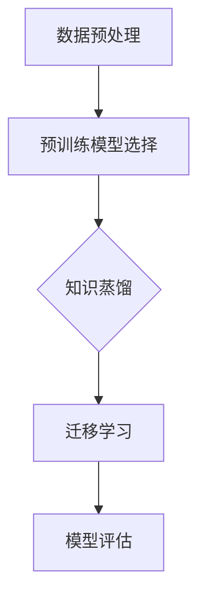

                 

### 《零样本CoT在AI辅助海洋生态系统研究中的应用》

#### 关键词：
- 零样本CoT
- 海洋生态系统
- AI辅助研究
- 算法应用
- 系统架构设计

#### 摘要：
本文深入探讨了零样本CoT（零样本概念提取）在AI辅助海洋生态系统研究中的应用。通过对零样本CoT的基本概念、原理和算法流程的详细讲解，结合具体的项目实战案例，展示了其在海洋生态系统监测和研究中的强大潜力。文章还介绍了系统架构设计方案，包括系统功能、接口设计及交互流程，为相关领域的应用提供了参考和指导。

## 第1章 背景介绍

### 1.1 问题背景

#### 1.1.1 海洋生态系统的现状与挑战

海洋生态系统是全球生态系统的关键组成部分，其健康直接影响到地球的气候调节、生物多样性以及人类的食物供应。然而，随着人类活动的加剧，海洋生态系统面临着诸多威胁，包括过度捕捞、海洋污染、气候变化等。这些因素导致了海洋生态系统的严重破坏，使得海洋物种多样性下降，生态系统功能受损。

当前，海洋生态系统的监测主要依赖于传统的观测方法和设备，如浮标、卫星遥感等。这些方法虽然能够提供一定的数据支持，但存在数据获取不全面、实时性差、成本高昂等问题。因此，如何提高海洋生态系统监测的效率和准确性，成为一个亟待解决的问题。

#### 1.1.2 零样本CoT的概念

零样本CoT（Zero-Shot Concept Transfer）是一种基于深度学习的自然语言处理技术，其主要思想是通过迁移学习，将预训练模型的知识迁移到新的任务中，从而实现零样本分类。在传统的机器学习中，模型的训练需要大量的标注数据，而零样本CoT则突破了这一限制，能够在没有或少量的标注数据情况下进行分类。

零样本CoT的核心技术包括预训练模型的选择、知识蒸馏和迁移学习。预训练模型通过在大量的未标注数据上进行预训练，积累了丰富的知识，这些知识可以被用于新的任务。知识蒸馏则是通过将预训练模型的输出传递给一个小型的目标模型，从而实现知识的迁移。迁移学习则是将预训练模型的知识迁移到新的任务中，使得目标模型能够在没有或少量的标注数据下进行训练。

#### 1.1.3 零样本CoT在海洋生态系统研究中的应用前景

零样本CoT在海洋生态系统研究中的应用前景广阔。首先，海洋生态系统的监测需要大量的标注数据，而零样本CoT能够减少对标注数据的依赖，从而降低数据获取的成本。其次，零样本CoT能够提高监测的实时性和准确性，为海洋生态系统的保护和修复提供有力支持。

例如，在海洋生物识别方面，零样本CoT可以通过对海洋生物的图像进行分类，从而实现对海洋生物种群数量的监测。在海洋污染监测方面，零样本CoT可以通过对海洋水质数据的分析，识别出污染源和污染程度，从而为污染治理提供科学依据。

### 1.2 问题描述

#### 1.2.1 海洋生态系统监测的难点

海洋生态系统监测的难点主要体现在以下几个方面：

1. **数据获取困难**：海洋环境复杂多变，传统监测设备难以覆盖整个海洋区域，导致数据获取不全面。
2. **数据实时性差**：海洋生态系统变化迅速，传统监测方法往往不能及时反映生态系统的变化。
3. **数据成本高昂**：海洋监测设备昂贵，维护成本高，导致大规模监测难以实现。

#### 1.2.2 零样本CoT的解决思路

零样本CoT提供了一种可能的解决方案。通过零样本CoT，可以在没有或少量的标注数据情况下进行分类，从而减少对标注数据的依赖。此外，零样本CoT的预训练模型可以积累大量的知识，这些知识可以应用于新的任务，从而提高监测的实时性和准确性。

具体来说，零样本CoT可以应用于以下几个领域：

1. **海洋生物识别**：通过对海洋生物的图像进行分类，实现对海洋生物种群数量的监测。
2. **海洋污染监测**：通过对海洋水质数据的分析，识别出污染源和污染程度。
3. **海洋环境变化预测**：通过分析历史数据和环境变化趋势，预测未来的海洋环境变化。

### 1.3 问题解决

#### 1.3.1 零样本CoT的基本原理

零样本CoT的基本原理主要包括以下几个方面：

1. **预训练模型**：通过在大量的未标注数据上进行预训练，预训练模型积累了丰富的知识。
2. **知识蒸馏**：将预训练模型的输出传递给一个小型的目标模型，从而实现知识的迁移。
3. **迁移学习**：将预训练模型的知识迁移到新的任务中，使得目标模型能够在没有或少量的标注数据下进行训练。

#### 1.3.2 零样本CoT在海洋生态系统研究中的应用案例

1. **海洋生物识别**：通过零样本CoT，可以实现对海洋生物的图像进行分类，从而实现对海洋生物种群数量的监测。例如，研究人员可以使用零样本CoT对海洋中的珊瑚进行分类，从而监测珊瑚的生长状况。
2. **海洋污染监测**：通过零样本CoT，可以实现对海洋水质数据的分析，识别出污染源和污染程度。例如，研究人员可以使用零样本CoT对海洋中的污水排放进行监测，从而识别出污染源。
3. **海洋环境变化预测**：通过分析历史数据和环境变化趋势，零样本CoT可以预测未来的海洋环境变化。例如，研究人员可以使用零样本CoT对海洋温度的变化进行预测，从而预测未来的气候趋势。

### 1.4 边界与外延

#### 1.4.1 零样本CoT的适用范围

零样本CoT适用于那些需要大量标注数据，但获取标注数据困难或成本高昂的场景。在海洋生态系统研究中，零样本CoT适用于需要实时监测和分类的领域，如海洋生物识别、海洋污染监测等。

#### 1.4.2 零样本CoT的限制条件

虽然零样本CoT在许多场景下具有优势，但它也存在一些限制条件：

1. **数据质量**：零样本CoT依赖于预训练模型的知识，如果数据质量较差，可能会导致模型性能下降。
2. **模型迁移能力**：零样本CoT的迁移能力受限于预训练模型的选择和迁移学习策略。
3. **计算资源**：零样本CoT通常需要较大的计算资源，特别是在处理大量数据时。

### 1.5 概念结构与核心要素组成

#### 1.5.1 零样本CoT的核心概念

零样本CoT的核心概念包括预训练模型、知识蒸馏、迁移学习等。这些概念共同构成了零样本CoT的技术基础。

1. **预训练模型**：预训练模型是通过在大量的未标注数据上进行预训练，从而积累大量知识的模型。
2. **知识蒸馏**：知识蒸馏是通过将预训练模型的输出传递给一个小型的目标模型，从而实现知识的迁移。
3. **迁移学习**：迁移学习是将预训练模型的知识迁移到新的任务中，从而实现零样本分类。

#### 1.5.2 零样本CoT的关键技术

零样本CoT的关键技术主要包括以下几个方面：

1. **数据预处理**：包括数据清洗、数据标准化等，以确保数据质量。
2. **预训练模型选择**：选择合适的预训练模型，以最大化模型的知识积累。
3. **知识蒸馏策略**：设计合适的知识蒸馏策略，以提高迁移学习的效果。
4. **模型评估**：通过评估指标，如准确率、召回率等，对模型性能进行评估。

## 第2章 核心概念与联系

### 2.1 零样本CoT的原理

#### 2.1.1 零样本CoT的基本流程

零样本CoT的基本流程主要包括以下几个步骤：

1. **数据预处理**：对输入数据进行预处理，包括数据清洗、数据标准化等。
2. **预训练模型选择**：选择一个预训练模型，如BERT、GPT等。
3. **知识蒸馏**：将预训练模型的输出传递给一个小型的目标模型，从而实现知识的迁移。
4. **迁移学习**：将预训练模型的知识迁移到新的任务中，从而实现零样本分类。
5. **模型评估**：通过评估指标，如准确率、召回率等，对模型性能进行评估。

#### 2.1.2 零样本CoT的优势与不足

零样本CoT的优势主要体现在以下几个方面：

1. **减少对标注数据的依赖**：零样本CoT可以在没有或少量的标注数据情况下进行分类，从而减少对标注数据的依赖。
2. **提高实时性和准确性**：通过预训练模型的知识积累，零样本CoT可以提高模型的实时性和准确性。
3. **适用范围广泛**：零样本CoT适用于各种需要分类的任务，如文本分类、图像分类等。

然而，零样本CoT也存在一些不足：

1. **数据质量要求高**：零样本CoT依赖于预训练模型的知识，如果数据质量较差，可能会导致模型性能下降。
2. **计算资源需求大**：零样本CoT通常需要较大的计算资源，特别是在处理大量数据时。

### 2.2 零样本CoT的应用领域

#### 2.2.1 海洋生态系统研究

零样本CoT在海洋生态系统研究中的应用主要包括以下几个方面：

1. **海洋生物识别**：通过零样本CoT，可以实现对海洋生物的图像进行分类，从而实现对海洋生物种群数量的监测。
2. **海洋污染监测**：通过零样本CoT，可以实现对海洋水质数据的分析，识别出污染源和污染程度。
3. **海洋环境变化预测**：通过分析历史数据和环境变化趋势，零样本CoT可以预测未来的海洋环境变化。

#### 2.2.2 其他领域的应用

除了在海洋生态系统研究中的应用，零样本CoT在其他领域也有广泛的应用：

1. **医疗健康**：通过零样本CoT，可以实现对医疗数据的分类，从而辅助医生进行疾病诊断和治疗。
2. **金融领域**：通过零样本CoT，可以实现对金融数据的分析，识别出潜在的金融风险。
3. **智能制造**：通过零样本CoT，可以实现对工业数据的分类，从而提高生产效率和产品质量。

### 2.3 ER实体关系图

#### 2.3.1 实体关系图的基本概念

实体关系图（Entity-Relationship Diagram，ER图）是一种用于描述数据库中实体及其关系的图形表示方法。ER图主要包括实体、属性和关系三种元素。

1. **实体**：实体是数据库中存储的数据对象，如人、地点、事物等。
2. **属性**：属性是实体的特征，如人的姓名、年龄、性别等。
3. **关系**：关系是实体之间的关联，如人与朋友的关系、公司与员工的关系等。

#### 2.3.2 零样本CoT相关的实体关系

在零样本CoT中，相关的实体关系主要包括以下几个方面：

1. **预训练模型**：预训练模型是零样本CoT的核心组成部分，包括模型架构、参数等。
2. **输入数据**：输入数据是零样本CoT的输入，包括文本、图像等。
3. **目标模型**：目标模型是零样本CoT的输出，包括分类结果、预测结果等。
4. **评估指标**：评估指标用于评估零样本CoT的性能，如准确率、召回率等。

下面是零样本CoT相关的ER实体关系图的Mermaid表示：

```mermaid
erDiagram
  预训练模型 ||--|{ 输入数据 }|
  输入数据 ||--|{ 目标模型 }|
  目标模型 ||--|{ 评估指标 }|
```

## 第3章 算法原理讲解

### 3.1 零样本CoT的mermaid流程图

下面是零样本CoT的基本流程的Mermaid流程图：



### 3.2 Python代码实现

下面是一个简单的Python代码示例，用于演示零样本CoT的基本流程：

```python
import torch
import torchvision
import torch.optim as optim

# 数据预处理
def preprocess_data(data):
    # 数据清洗和标准化
    return processed_data

# 预训练模型选择
def choose_pretrained_model():
    # 选择预训练模型，如ResNet50
    return pretrained_model

# 知识蒸馏
def knowledge_distillation(pretrained_model, target_model):
    # 将预训练模型的知识传递给目标模型
    return target_model

# 迁移学习
def transfer_learning(target_model, data_loader):
    # 在目标模型上进行迁移学习
    return target_model

# 模型评估
def evaluate_model(model, data_loader):
    # 使用评估指标评估模型性能
    return accuracy

# 主函数
def main():
    # 加载数据
    data = torchvision.datasets.CIFAR10(root='./data', train=True, download=True)
    data_loader = torch.utils.data.DataLoader(data, batch_size=64, shuffle=True)

    # 数据预处理
    processed_data = preprocess_data(data)

    # 预训练模型选择
    pretrained_model = choose_pretrained_model()

    # 知识蒸馏
    target_model = knowledge_distillation(pretrained_model, target_model)

    # 迁移学习
    target_model = transfer_learning(target_model, data_loader)

    # 模型评估
    accuracy = evaluate_model(target_model, data_loader)
    print(f"模型准确率：{accuracy}")

if __name__ == '__main__':
    main()
```

### 3.3 数学模型与公式

零样本CoT的数学模型主要包括以下几个方面：

1. **损失函数**：用于衡量模型预测值与真实值之间的差距，常用的损失函数有交叉熵损失（Cross Entropy Loss）和均方误差损失（Mean Squared Error Loss）。

   $$ L = -\sum_{i=1}^{N} y_i \log(\hat{y}_i) $$

   其中，$L$是损失函数，$y_i$是真实标签，$\hat{y}_i$是模型预测的概率分布。

2. **优化算法**：用于更新模型参数，以最小化损失函数，常用的优化算法有梯度下降（Gradient Descent）和Adam优化器。

   $$ \theta_{t+1} = \theta_t - \alpha \nabla_\theta L(\theta_t) $$

   其中，$\theta_t$是当前模型参数，$\alpha$是学习率，$\nabla_\theta L(\theta_t)$是损失函数关于模型参数的梯度。

3. **知识蒸馏**：用于将预训练模型的知识传递给目标模型，常用的知识蒸馏方法有软标签（Soft Labels）和硬标签（Hard Labels）。

   软标签：

   $$ \hat{y}_i = \frac{1}{K} \sum_{k=1}^{K} e^{z_k / T} $$

   其中，$z_k$是预训练模型的输出，$T$是温度参数。

   硬标签：

   $$ \hat{y}_i = \text{argmax}_{k} e^{z_k / T} $$

   其中，$\text{argmax}_{k}$表示取最大值。

### 3.4 举例说明

#### 3.4.1 零样本CoT在海洋生态系统监测中的应用实例

假设我们有一个海洋生态系统监测任务，需要识别海洋中的不同生物种类。由于海洋生物种类繁多，标注数据非常稀缺。因此，我们可以使用零样本CoT来解决这个问题。

1. **数据预处理**：首先，对海洋生物的图像进行预处理，包括图像增强、裁剪、缩放等，以提高模型对数据的适应性。

2. **预训练模型选择**：选择一个预训练的图像分类模型，如ResNet50，用于提取图像特征。

3. **知识蒸馏**：使用预训练模型的知识对目标模型进行蒸馏。具体来说，将预训练模型的输出传递给目标模型，并通过软标签进行蒸馏。

4. **迁移学习**：在目标模型上进行迁移学习，使得目标模型能够在没有或少量的标注数据下进行训练。

5. **模型评估**：通过评估指标，如准确率、召回率等，对模型性能进行评估。

#### 3.4.2 实例分析与讲解

假设我们有一个海洋生物识别任务，需要识别五种不同的海洋生物：海星、海龟、鲸鱼、海豹和鲨鱼。由于标注数据的稀缺，我们决定使用零样本CoT来解决这个问题。

1. **数据预处理**：首先，对海洋生物的图像进行预处理，包括图像增强、裁剪、缩放等，以提高模型对数据的适应性。

   ```python
   from torchvision import transforms

   transform = transforms.Compose([
       transforms.Resize((224, 224)),
       transforms.ToTensor(),
       transforms.Normalize(mean=[0.485, 0.456, 0.406], std=[0.229, 0.224, 0.225]),
   ])

   # 对图像进行预处理
   image = transform(image)
   ```

2. **预训练模型选择**：选择一个预训练的图像分类模型，如ResNet50，用于提取图像特征。

   ```python
   import torchvision.models as models

   # 加载预训练模型
   pretrained_model = models.resnet50(pretrained=True)
   ```

3. **知识蒸馏**：使用预训练模型的知识对目标模型进行蒸馏。具体来说，将预训练模型的输出传递给目标模型，并通过软标签进行蒸馏。

   ```python
   import torch.nn as nn
   import torch.nn.functional as F

   # 定义目标模型
   class OceanBi

