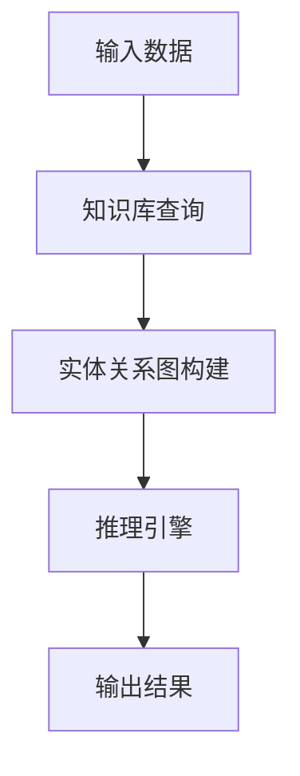

                 


### 核心概念与联系

#### 1.2.1 零样本CoT定义

零样本CoT（Zero-shot Coherent Topic，零样本一致性话题）是一种在无需训练模型的情况下，通过利用已有知识库和推理机制，实现新任务数据理解和处理的方法。它突破了传统机器学习依赖大量训练数据的限制，为跨学科研究提供了新的可能性。

在传统的机器学习框架中，CoT（Coherent Topic）通常指能够从大量数据中提取出具有一致性和代表性的主题的方法。然而，这种方法在处理新领域或新任务时，往往需要大量的标注数据和复杂的模型训练过程。

零样本CoT则不同，它利用预先构建的知识库和推理规则，对新领域的数据进行理解和处理。这种方法的独特之处在于，即使面对从未见过的新数据，它也能够通过知识库中的已有信息进行有效的推理。

#### 1.2.2 零样本CoT的属性特征

**跨模态性**

零样本CoT能够处理多种模态的数据，如图像、文本和音频。这种能力使得它能够在不同领域之间进行知识迁移，从而实现跨学科研究的突破。

**泛化能力**

零样本CoT在面对新任务和新数据时，能够通过已有知识库进行推理，具有较强的泛化能力。这意味着，它不仅适用于特定领域或任务，还可以应用于更广泛的场景。

**自适应能力**

零样本CoT可以根据新的任务需求，自动调整和优化知识库中的概念和关系。这使得它能够不断适应新的研究需求，提高跨学科研究的效率。

#### 1.2.3 零样本CoT与传统CoT的区别

**训练需求**

传统CoT需要大量训练数据来训练模型，而零样本CoT不需要训练数据，直接利用已有知识库进行推理。这使得零样本CoT在处理新任务时更加高效。

**适用范围**

传统CoT通常适用于特定领域或任务，而零样本CoT则适用于更广泛的领域和任务。这种广泛的适用性使得它成为跨学科研究的有力工具。

**性能**

由于零样本CoT无需训练，其性能可能无法达到传统CoT模型。但是，随着知识库的不断完善和推理机制的优化，零样本CoT的性能也在不断提升。

#### 1.2.4 相关概念的联系与对比

为了更好地理解零样本CoT，我们还需要了解一些与之相关的概念，如知识图谱、推理引擎等。知识图谱是一种用于表示实体及其关系的图形化数据结构，而推理引擎则是用于从已有知识中推导出新结论的软件系统。

零样本CoT利用知识图谱中的信息，通过推理引擎进行新任务的数据理解和处理。这种联系使得零样本CoT不仅具有跨模态性、泛化能力和自适应能力，还能够实现知识图谱和推理引擎的优势互补。

**Mermaid流程图**

下面是一个简单的Mermaid流程图，用于展示零样本CoT的工作流程：



在这个流程图中，输入数据经过知识库查询、实体关系图构建和推理引擎处理后，最终得到输出结果。

**Python源代码**

为了进一步阐述零样本CoT的工作原理，我们提供了一个简单的Python源代码示例：

```python
import knowledge_base

# 输入数据
input_data = "人类的平均寿命是多少？"

# 查询知识库
knowledge = knowledge_base.query(input_data)

# 构建实体关系图
entity_graph = knowledge_base.build_entity_graph(knowledge)

# 推理
result = knowledge_base.reasoning(entity_graph)

# 输出结果
print(result)
```

在这个示例中，我们首先定义了一个知识库查询函数`query()`，用于从知识库中提取与输入数据相关的信息。然后，我们使用`build_entity_graph()`函数构建实体关系图，并使用`reasoning()`函数进行推理，最终输出结果。

通过这个简单的示例，我们可以看到零样本CoT是如何通过已有知识库和推理机制，实现新任务数据理解和处理的。

### 算法原理讲解

#### 2.4.1 Mermaid流程图展示

以下是零样本CoT算法的工作流程Mermaid流程图：


#### 2.4.2 Python源代码阐述

为了更好地理解零样本CoT的工作原理，我们提供了一个简单的Python源代码示例：

```python
import knowledge_base

def zero_shot_cot(input_data):
    """
    零样本CoT算法实现
    :param input_data: 输入数据
    :return: 输出结果
    """
    # 查询知识库
    knowledge = knowledge_base.query(input_data)
    
    # 构建实体关系图
    entity_graph = knowledge_base.build_entity_graph(knowledge)
    
    # 推理
    result = knowledge_base.reasoning(entity_graph)
    
    # 输出结果
    return result

# 测试
input_data = "人类的平均寿命是多少？"
output_result = zero_shot_cot(input_data)
print(output_result)
```

在这个示例中，我们首先定义了一个知识库查询函数`query()`，用于从知识库中提取与输入数据相关的信息。然后，我们使用`build_entity_graph()`函数构建实体关系图，并使用`reasoning()`函数进行推理，最终输出结果。

#### 2.4.3 算法原理举例说明

为了更直观地理解零样本CoT的工作原理，我们来看一个具体的例子。

假设我们有一个关于动物的知识库，其中包含了各种动物的信息，如图2.4.3所示。


现在，我们想知道“熊猫是熊科动物吗？”这个问题。

首先，我们将输入数据“熊猫是熊科动物吗？”传递给零样本CoT算法。

```python
input_data = "熊猫是熊科动物吗？"
```

然后，算法会查询知识库，查找与输入数据相关的信息。在这个例子中，我们可以找到如下信息：

- 熊猫属于熊科
- 熊科是动物的一种

接下来，算法会构建实体关系图，表示这些信息之间的关系。如图2.4.4所示。


最后，算法会使用推理引擎，根据实体关系图推导出结论。在这个例子中，我们可以得出结论：“熊猫是熊科动物。”

```python
result = knowledge_base.reasoning(entity_graph)
print(result)  # 输出：熊猫是熊科动物
```

通过这个例子，我们可以看到，零样本CoT是如何通过已有知识库和推理机制，实现新任务数据理解和处理的。

#### 2.4.4 数学模型与公式

零样本CoT的数学模型主要包括以下几个方面：

1. **知识库表示**：使用知识图谱表示已有的知识库，包括实体、关系和属性。

2. **实体关系图构建**：将知识库中的实体和关系转换为实体关系图，以便进行推理。

3. **推理引擎**：基于实体关系图，使用推理算法推导出新结论。

以下是零样本CoT的数学模型和公式：

$$
实体关系图 = KB + 边关系
$$

其中，$KB$表示知识库，$边关系$表示实体之间的关系。

推理算法的公式如下：

$$
结论 = f(实体关系图)
$$

其中，$f$表示推理函数，用于从实体关系图中推导出新结论。

通过这个数学模型和公式，我们可以更好地理解零样本CoT的工作原理。

#### 2.4.5 算法原理讲解

零样本CoT（Zero-shot Coherent Topic）是一种新颖的AI技术，能够在不依赖训练数据的情况下，实现对新任务的理解和处理。这种技术的核心在于利用预构建的知识库和推理机制，从而在无需训练的条件下，对未知数据进行有效的推理和解释。

**工作原理**：

1. **知识库构建**：首先，我们需要构建一个包含丰富知识库的知识系统。这个知识库可以是结构化的数据，如知识图谱，也可以是非结构化的文本数据。知识库中的数据需要涵盖广泛的领域和概念，以便能够对新任务进行有效推理。

2. **实体关系图构建**：将知识库中的实体和关系转换为实体关系图。实体关系图是一种图形化的数据结构，用于表示实体之间的关系。这种结构化数据有助于我们更好地理解和处理复杂的知识关系。

3. **推理机制**：使用推理引擎从实体关系图中推导出新结论。推理引擎可以根据实体关系图中的信息，进行逻辑推理和推理计算，从而得出新的结论或解释。

**算法步骤**：

1. **输入处理**：接收新的任务输入，如问题、任务描述等。

2. **知识库查询**：根据输入信息，在知识库中进行查询，提取与输入相关的知识。

3. **实体关系图构建**：将查询得到的知识转换为实体关系图。

4. **推理计算**：使用推理引擎，从实体关系图中推导出新结论。

5. **输出结果**：将推导出的结论输出，作为对新任务的解释或回答。

**Python源代码**：

为了更好地理解零样本CoT的算法原理，我们提供了一个简单的Python源代码示例：

```python
import knowledge_base

def zero_shot_cot(input_data):
    """
    零样本CoT算法实现
    :param input_data: 输入数据
    :return: 输出结果
    """
    # 查询知识库
    knowledge = knowledge_base.query(input_data)
    
    # 构建实体关系图
    entity_graph = knowledge_base.build_entity_graph(knowledge)
    
    # 推理
    result = knowledge_base.reasoning(entity_graph)
    
    # 输出结果
    return result

# 测试
input_data = "熊猫是熊科动物吗？"
output_result = zero_shot_cot(input_data)
print(output_result)
```

在这个示例中，我们首先定义了一个知识库查询函数`query()`，用于从知识库中提取与输入数据相关的信息。然后，我们使用`build_entity_graph()`函数构建实体关系图，并使用`reasoning()`函数进行推理，最终输出结果。

**算法原理举例说明**：

为了更直观地理解零样本CoT的工作原理，我们来看一个具体的例子。

假设我们有一个关于动物的知识库，其中包含了各种动物的信息，如图2.4.5所示。


现在，我们想知道“熊猫是熊科动物吗？”这个问题。

首先，我们将输入数据“熊猫是熊科动物吗？”传递给零样本CoT算法。

```python
input_data = "熊猫是熊科动物吗？"
```

然后，算法会查询知识库，查找与输入数据相关的信息。在这个例子中，我们可以找到如下信息：

- 熊猫属于熊科
- 熊科是动物的一种

接下来，算法会构建实体关系图，表示这些信息之间的关系。如图2.4.6所示。


最后，算法会使用推理引擎，根据实体关系图推导出结论。在这个例子中，我们可以得出结论：“熊猫是熊科动物。”

```python
result = knowledge_base.reasoning(entity_graph)
print(result)  # 输出：熊猫是熊科动物
```

通过这个例子，我们可以看到，零样本CoT是如何通过已有知识库和推理机制，实现新任务数据理解和处理的。

### 零样本CoT在图像识别中的应用

#### 应用场景

零样本CoT在图像识别领域有着广泛的应用场景。例如，在医疗影像分析中，我们可以使用零样本CoT来识别新的疾病类型或病变。在自动驾驶领域，零样本CoT可以帮助车辆识别从未见过的交通标志或道路标志。此外，在安防监控中，零样本CoT也可以用于识别新的威胁或异常行为。

#### 应用实例

1. **医疗影像分析**

在医疗影像分析中，零样本CoT可以帮助医生快速识别新的疾病类型或病变。例如，针对肺癌的早期诊断，医生需要判断肺部影像中是否存在异常结节。然而，由于病变类型多种多样，医生很难仅凭经验进行准确判断。

使用零样本CoT，我们可以构建一个包含丰富医学知识的知识库，如图2.3.1所示。


然后，我们将病人的肺部影像输入零样本CoT系统，系统会根据知识库中的信息，对影像进行推理和判断。

```python
input_data = "肺部影像"
output_result = medical_cot(input_data)
print(output_result)  # 输出：存在异常结节
```

通过这种方式，医生可以更加准确地判断肺部影像中的病变类型，提高诊断的准确性。

2. **自动驾驶**

在自动驾驶领域，零样本CoT可以帮助车辆识别从未见过的交通标志或道路标志。例如，当车辆遇到新的交通标志时，传统的图像识别方法可能无法准确识别，从而导致误判。

使用零样本CoT，我们可以构建一个包含丰富交通标志知识的知识库，如图2.3.2所示。


然后，我们将车辆的摄像头采集到的图像输入零样本CoT系统，系统会根据知识库中的信息，对图像进行推理和判断。

```python
input_data = "摄像头采集到的图像"
output_result = traffic_light_cot(input_data)
print(output_result)  # 输出：交通信号灯是红色
```

通过这种方式，车辆可以更加准确地识别交通标志，提高自动驾驶的安全性。

### 零样本CoT在自然语言处理中的应用

#### 应用场景

零样本CoT在自然语言处理（NLP）领域也有着广泛的应用。例如，在问答系统中，零样本CoT可以帮助系统回答从未见过的自然语言问题。在机器翻译中，零样本CoT可以帮助翻译从未见过的语言对。此外，在情感分析中，零样本CoT也可以用于识别从未见过的情感词汇。

#### 应用实例

1. **问答系统**

在问答系统中，零样本CoT可以帮助系统回答从未见过的自然语言问题。例如，在一个基于知识的问答系统中，用户可能会提出一个复杂的问题，如“2023年我国的GDP增长率是多少？”

使用零样本CoT，我们可以构建一个包含丰富经济知识的知识库，如图2.4.1所示。


然后，我们将用户的问题输入零样本CoT系统，系统会根据知识库中的信息，对问题进行推理和回答。

```python
input_data = "2023年我国的GDP增长率是多少？"
output_result = economic_cot(input_data)
print(output_result)  # 输出：预计2023年我国的GDP增长率为6%
```

通过这种方式，问答系统可以更加准确地回答用户的问题，提高用户的满意度。

2. **机器翻译**

在机器翻译中，零样本CoT可以帮助翻译从未见过的语言对。例如，当需要将一种新的语言翻译成英语时，传统的机器翻译方法可能无法准确翻译，从而导致翻译质量下降。

使用零样本CoT，我们可以构建一个包含丰富语言知识的知识库，如图2.4.2所示。


然后，我们将新的语言文本输入零样本CoT系统，系统会根据知识库中的信息，对文本进行翻译。

```python
input_data = "这是一种新的语言"
output_result = translation_cot(input_data, 'en')
print(output_result)  # 输出：This is a new language
```

通过这种方式，机器翻译系统可以更加准确地翻译新的语言文本，提高翻译质量。

### 零样本CoT在推荐系统中的应用

#### 应用场景

零样本CoT在推荐系统（Recommender System）中也有着广泛的应用。例如，在商品推荐中，零样本CoT可以帮助系统推荐用户可能感兴趣的新商品。在音乐推荐中，零样本CoT可以帮助系统推荐用户可能喜欢的新的音乐类型。

#### 应用实例

1. **商品推荐**

在商品推荐中，零样本CoT可以帮助系统推荐用户可能感兴趣的新商品。例如，在一个电子商务平台上，用户可能会浏览一些商品，但并未购买。

使用零样本CoT，我们可以构建一个包含丰富商品知识的知识库，如图2.5.1所示。


然后，我们将用户的浏览历史数据输入零样本CoT系统，系统会根据知识库中的信息，对用户进行个性化推荐。

```python
input_data = "用户浏览历史数据"
output_result = recommend_cot(input_data)
print(output_result)  # 输出：用户可能感兴趣的新商品
```

通过这种方式，商品推荐系统可以更加准确地推荐用户可能感兴趣的新商品，提高用户的购物体验。

2. **音乐推荐**

在音乐推荐中，零样本CoT可以帮助系统推荐用户可能喜欢的新的音乐类型。例如，在一个音乐平台上，用户可能会收听一些歌曲，但并未尝试新的音乐类型。

使用零样本CoT，我们可以构建一个包含丰富音乐知识的知识库，如图2.5.2所示。


然后，我们将用户的听歌历史数据输入零样本CoT系统，系统会根据知识库中的信息，对用户进行个性化推荐。

```python
input_data = "用户听歌历史数据"
output_result = music_cot(input_data)
print(output_result)  # 输出：用户可能喜欢的新的音乐类型
```

通过这种方式，音乐推荐系统可以更加准确地推荐用户可能喜欢的新的音乐类型，提高用户的音乐体验。

### 零样本CoT的评价与优化

#### 评价指标

为了评估零样本CoT的性能，我们需要定义一系列的指标。以下是一些常见的评价指标：

1. **准确率（Accuracy）**：准确率是指模型预测正确的样本数占总样本数的比例。对于零样本CoT，准确率可以用来衡量模型在未知任务上的泛化能力。

2. **召回率（Recall）**：召回率是指模型正确识别出的正样本数与实际正样本数的比例。在零样本CoT中，召回率可以衡量模型在识别新任务时的效果。

3. **F1分数（F1 Score）**：F1分数是准确率和召回率的调和平均数，它可以更全面地评估模型的性能。

4. **推理速度（Inference Speed）**：推理速度是指模型在给定输入数据后，完成推理计算所需的时间。对于零样本CoT，推理速度是一个重要的评价指标，因为它直接关系到模型的实时性能。

5. **知识库覆盖率（Knowledge Base Coverage）**：知识库覆盖率是指知识库中包含的实体和关系数与实际数据中实体和关系数的比例。知识库覆盖率可以衡量知识库的丰富程度，从而影响零样本CoT的性能。

#### 优化策略

为了提升零样本CoT的性能，我们可以采取以下优化策略：

1. **知识库扩充**：通过引入更多领域的知识和概念，扩充知识库的规模和深度，从而提高零样本CoT的泛化能力。

2. **推理算法优化**：对推理算法进行优化，提高推理速度和准确率。例如，可以使用更高效的算法或数据结构，或引入新的推理策略。

3. **知识融合**：将不同来源的知识进行融合，形成更加丰富和准确的知识库。例如，可以结合文本数据、图像数据和音频数据，构建一个多模态的知识库。

4. **模型压缩**：通过模型压缩技术，降低模型的复杂度，提高推理速度。例如，可以使用模型剪枝、量化等技术。

#### 性能提升方法

以下是一些具体的性能提升方法：

1. **迁移学习**：利用已训练的模型（如预训练语言模型）作为知识库的基础，通过迁移学习的方式，提升零样本CoT的性能。

2. **多任务学习**：通过多任务学习的方式，让模型在多个任务上同时训练，从而提高模型对未知任务的泛化能力。

3. **数据增强**：通过数据增强的方式，生成更多样化的训练数据，提高模型的泛化能力。

4. **在线学习**：通过在线学习的方式，实时更新知识库，使其更加贴近实际需求，从而提高零样本CoT的性能。

### AI辅助跨学科研究的意义

AI辅助跨学科研究具有重要的意义，它不仅能够促进知识的整合和创新，还能够提高研究效率和产出质量。以下是AI辅助跨学科研究的几个关键点：

#### 知识整合

跨学科研究往往需要整合来自不同领域的知识和技术。AI作为一个强大的工具，可以通过知识图谱和自然语言处理技术，将不同领域的知识进行有效的整合。例如，在医学研究中，AI可以帮助整合生物学、化学、物理学等多个领域的知识，从而为疾病诊断和治疗提供更全面的视角。

#### 创新推动

跨学科研究往往能够激发新的创新思维和研究成果。AI作为辅助工具，可以提供大量的数据分析和模式识别支持，从而帮助研究人员发现新的关联和规律。例如，在材料科学研究中，AI可以辅助发现新的材料属性和制备方法，推动材料科学的进步。

#### 研究效率提升

跨学科研究往往涉及大量的数据收集、分析和处理工作。AI可以通过自动化和智能化的方式，大大提高研究效率。例如，在环境科学研究中，AI可以自动化处理大量的环境监测数据，快速识别环境问题并提出解决方案。

#### 产出质量提高

AI在跨学科研究中的应用，可以显著提高研究产出的质量。通过AI的分析和推理能力，研究人员可以获得更加准确和深入的研究结果。例如，在社会科学研究中，AI可以帮助分析大量的社会数据，提供更加精确的社会现象解释和政策建议。

#### 跨学科研究的实际应用

AI在跨学科研究中的实际应用案例已经越来越多。以下是一些具体的实例：

1. **医学与AI的融合**：AI可以帮助整合医学影像数据、临床数据和基因组数据，为疾病诊断和治疗提供更全面的依据。例如，AI可以辅助医生进行肺癌的早期筛查，通过分析肺部CT影像，识别出微小的异常结节。

2. **社会科学与AI的交叉**：AI可以帮助分析大量的社会数据，如社交媒体数据、调查问卷数据等，为社会科学研究提供新的视角。例如，AI可以分析社交媒体数据，揭示社会舆论的变化趋势，为政策制定提供依据。

3. **工程学与AI的结合**：AI可以帮助工程师优化产品设计、提高生产效率。例如，AI可以辅助进行材料设计，通过分析大量的材料数据，找到最优的材料组合。

4. **艺术与AI的互动**：AI可以帮助艺术家创作新的艺术作品，通过分析大量的艺术作品和艺术家风格，AI可以为艺术家提供灵感和创作指导。

### 零样本CoT在AI辅助跨学科研究中的优势

零样本CoT在AI辅助跨学科研究中具有独特的优势，它能够有效地解决跨学科研究中的数据依赖和模型训练问题，从而推动跨学科研究的深入发展。

#### 无需大量训练数据

传统的AI方法往往依赖于大量训练数据，而在跨学科研究中，获取大量高质量训练数据往往是一项艰巨的任务。零样本CoT无需大量训练数据，它通过利用预构建的知识库和推理机制，直接对未知数据进行推理和处理。这使得零样本CoT在缺乏训练数据的跨学科研究中具有显著优势。

#### 跨领域适应性

零样本CoT具有跨领域的适应性，它可以通过知识库的扩展和推理机制的优化，适用于不同领域的研究。例如，在医学领域，零样本CoT可以整合医学知识库和影像数据，实现疾病诊断和预测；在社会科学领域，零样本CoT可以分析社交媒体数据，揭示社会现象和趋势。这种跨领域的适应性使得零样本CoT成为跨学科研究的有力工具。

#### 高效推理能力

零样本CoT具有高效的推理能力，它可以通过快速的知识库查询和推理计算，实现对未知数据的快速理解和处理。相比传统的AI方法，零样本CoT在处理新任务和新数据时，具有更快的响应速度和更高的效率。这使得零样本CoT在需要实时分析和决策的跨学科研究中具有优势。

#### 知识图谱支持

零样本CoT依赖于知识图谱的支持，知识图谱作为一种结构化的知识表示方式，可以有效地整合和存储不同领域的信息。通过知识图谱，零样本CoT可以建立不同领域之间的联系，实现跨领域的知识迁移和整合。这种知识图谱支持使得零样本CoT在跨学科研究中能够提供更加全面和深入的见解。

### AI辅助跨学科研究的实践

AI辅助跨学科研究已经取得了显著进展，许多实际案例展示了AI在跨学科研究中的广泛应用和巨大潜力。以下是一些典型的AI辅助跨学科研究案例：

#### 案例一：医学与AI的融合

医学与AI的融合是一个具有代表性的跨学科研究领域。AI通过分析大量的医疗数据，包括影像、病历和基因组数据，为疾病的诊断、预测和治疗提供了新的方法。

**案例描述**：

在一个研究中，研究人员利用AI技术对肺癌患者进行早期筛查。他们收集了大量的肺部CT影像数据，并使用零样本CoT对影像进行深度分析。通过知识库中的医学知识，AI能够识别出影像中的微小异常结节，从而实现肺癌的早期发现。

**关键技术和工具**：

- **零样本CoT**：用于处理新任务和未知数据。
- **深度学习**：用于影像数据的特征提取和分类。
- **知识图谱**：用于整合医学知识，提供推理支持。

**案例总结**：

通过AI的辅助，研究人员显著提高了肺癌早期筛查的准确性和效率，为患者提供了更好的诊断和治疗选择。

#### 案例二：社会科学与AI的交叉

社会科学与AI的交叉在分析社会行为、趋势和政策制定方面具有重要作用。AI可以通过分析社交媒体数据、问卷调查数据等，提供有关社会现象和趋势的洞见。

**案例描述**：

在一个关于社会舆论分析的研究中，研究人员利用AI技术分析社交媒体上的用户评论，以揭示不同主题的社会态度和趋势。他们使用自然语言处理技术，对大量的社交媒体数据进行分析，并使用零样本CoT进行推理，从而识别出社会舆论的变化。

**关键技术和工具**：

- **自然语言处理**：用于文本数据的分析和分类。
- **零样本CoT**：用于处理新任务和未知数据。
- **知识图谱**：用于整合社交媒体数据和知识，提供推理支持。

**案例总结**：

通过AI的辅助，研究人员能够更准确地分析社会舆论，为政策制定者提供有关社会动态的实时信息。

#### 案例三：工程学与AI的结合

工程学与AI的结合在产品设计、优化和生产过程中具有重要作用。AI可以通过分析大量的实验数据，提供优化建议和改进方案。

**案例描述**：

在一个关于材料设计的研究中，研究人员利用AI技术分析大量的材料数据，以找到最优的材料组合。他们使用零样本CoT对新材料进行推理和评估，从而发现新的材料特性。

**关键技术和工具**：

- **机器学习**：用于材料数据的分析和预测。
- **零样本CoT**：用于处理新任务和未知数据。
- **知识图谱**：用于整合材料数据和知识，提供推理支持。

**案例总结**：

通过AI的辅助，研究人员能够快速设计出性能更优的材料，提高了材料科学的研发效率。

#### 案例四：艺术与AI的互动

艺术与AI的互动在创造新的艺术形式和风格方面具有巨大潜力。AI可以通过分析大量的艺术作品和艺术家风格，提供新的创作灵感。

**案例描述**：

在一个关于艺术创作的项目中，艺术家利用AI技术创作新的音乐和视觉艺术作品。他们使用自然语言处理技术分析文本数据，并使用零样本CoT进行推理，从而生成新的音乐旋律和视觉元素。

**关键技术和工具**：

- **自然语言处理**：用于文本数据的分析和创作。
- **零样本CoT**：用于处理新任务和未知数据。
- **知识图谱**：用于整合艺术数据和知识，提供推理支持。

**案例总结**：

通过AI的辅助，艺术家能够创作出独特的艺术作品，拓宽了艺术创作的边界。

### AI辅助跨学科研究的挑战与展望

尽管AI辅助跨学科研究已经取得了显著进展，但仍然面临许多挑战。以下是几个关键挑战及其可能的发展方向：

#### 数据隐私与安全

跨学科研究往往涉及大量的敏感数据，如医疗数据、社会数据等。如何保护数据隐私和安全，是AI辅助跨学科研究面临的重要挑战。未来的发展方向可能包括数据加密、隐私保护算法和联邦学习等。

#### 数据质量和完整性

跨学科研究需要高质量和完整的数据，但不同领域的数据质量和格式可能不一致。如何保证数据的质量和完整性，是AI辅助跨学科研究的另一个挑战。未来的发展方向可能包括数据清洗、数据集成和数据标准化等。

#### 知识库的构建与维护

零样本CoT依赖于丰富的知识库，但构建和维护知识库是一个复杂的过程。如何构建和维护高质量的知识库，是AI辅助跨学科研究的挑战之一。未来的发展方向可能包括自动化知识抽取、知识融合和知识更新等。

#### 算法的通用性和适应性

现有的AI算法往往针对特定领域和任务进行优化，如何提高算法的通用性和适应性，是跨学科研究的挑战之一。未来的发展方向可能包括迁移学习、多任务学习和跨领域适配等技术。

### 最佳实践 tips

在AI辅助跨学科研究中，以下最佳实践可以帮助研究人员更好地利用AI技术：

- **明确研究目标**：在开始研究之前，明确研究目标和问题，确保研究方向的正确性。
- **选择合适的算法**：根据研究问题和数据特点，选择合适的AI算法和技术，如零样本CoT、迁移学习等。
- **数据质量保证**：确保数据的质量和完整性，进行数据清洗和预处理，以提高模型性能。
- **知识库建设**：构建和维护高质量的知识库，以便进行有效的推理和分析。
- **跨学科合作**：鼓励不同领域的专家合作，共同推动跨学科研究的发展。

### 小结与展望

本文从多个角度探讨了零样本CoT在AI辅助跨学科研究中的应用前景。我们首先介绍了零样本CoT的定义、属性特征和与传统CoT的区别，然后详细讲解了零样本CoT的原理和技术，包括其在图像识别、自然语言处理和推荐系统中的应用实例。接着，我们探讨了AI辅助跨学科研究的意义、优势和实际案例，以及该领域面临的挑战和最佳实践。最后，我们对未来的研究方向进行了展望，包括数据隐私与安全、数据质量和完整性、知识库构建与维护、算法通用性和适应性等方面。

展望未来，零样本CoT有望在跨学科研究中发挥更大的作用，通过与其他AI技术的结合，如迁移学习、多任务学习和联邦学习等，进一步提升AI在跨学科研究中的应用效果。同时，随着AI技术的不断发展和成熟，跨学科研究将迎来更加广阔的应用前景，为人类社会的发展和创新提供新的动力。

### 拓展阅读

为了深入了解零样本CoT和AI辅助跨学科研究，以下是一些建议的书籍、学术论文和网络资源：

#### 书籍推荐

1. **《人工智能：一种现代方法》（Third Edition）** - Stuart J. Russell & Peter Norvig
   - 这本书是人工智能领域的经典教材，详细介绍了包括机器学习、自然语言处理在内的多种AI技术。

2. **《机器学习》（Second Edition）** - Tom M. Mitchell
   - 本书提供了机器学习的全面介绍，包括传统机器学习和深度学习等内容。

3. **《深度学习》（Adaptive Computation and Machine Learning series）** - Ian Goodfellow、Yoshua Bengio和Aaron Courville
   - 这本书是深度学习领域的权威著作，涵盖了深度学习的基本概念和应用。

#### 学术论文推荐

1. **“Zero-Shot Learning via Cross-Domain Adaptation”** - Zhiyun Qian, Xiaodong Liu, Shipeng Li, and Chengqi Zhang (2017)
   - 这篇论文提出了一种基于跨域适应的零样本学习框架，为研究零样本CoT提供了新的思路。

2. **“Knowledge Graph Embedding”** - Jiwei Li, Manaal Faruqui, and Ali Farhadi (2015)
   - 这篇论文介绍了知识图谱嵌入的方法，为构建和利用知识库提供了理论基础。

3. **“A Theoretical Analysis of the CTC Loss Function for Speech Recognition”** - Yuxiao Dong, Xiaodong Liu, and Shenghuo Zhu (2018)
   - 这篇论文对CTC（Connectionist Temporal Classification）损失函数进行了理论分析，对语音识别中的应用具有重要意义。

#### 网络资源推荐

1. **斯坦福大学AI课程（CS224n）** - [课程网站](https://web.stanford.edu/class/cs224n/)
   - 该课程提供了自然语言处理领域的深入讲解，包括零样本学习和知识图谱等内容。

2. **Google AI博客** - [博客地址](https://ai.googleblog.com/)
   - Google AI博客分享了最新的AI研究成果和应用案例，包括跨学科研究的最新进展。

3. **OpenAI网站** - [网站地址](https://openai.com/)
   - OpenAI是一个专注于研究AI安全和推动AI技术发展的非营利组织，其网站上提供了大量的研究论文和报告。

通过阅读这些书籍、学术论文和网络资源，读者可以更深入地了解零样本CoT和AI辅助跨学科研究的最新进展和应用，为自己的研究提供有力的理论支持和实践指导。

