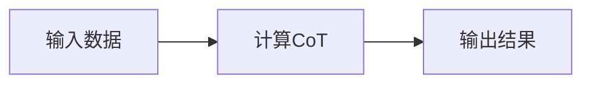
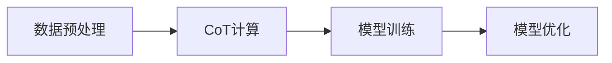

                 


### 文章标题：零样本CoT在AI辅助量子计算研究中的潜力

关键词：零样本CoT、量子计算、AI辅助、算法原理、应用挑战

摘要：本文探讨了零样本CoT（零样本对照性推理）在AI辅助量子计算研究中的潜力。首先介绍了零样本CoT的背景、重要性、核心概念、数学模型和算法原理。接着，详细阐述了零样本CoT在量子计算优化、量子算法设计和量子机器学习中的应用领域与挑战。最后，通过具体案例分析了零样本CoT算法的实现流程，并对其在量子计算领域的应用前景进行了展望。

### 第一部分：引言

#### 1.1 零样本CoT背景与重要性

**问题背景：量子计算的发展与挑战**

- **量子计算的发展：**随着科技的进步，量子计算作为下一代计算技术，吸引了全球科学家的广泛关注。量子计算机利用量子位（qubits）进行信息处理，理论上能够解决传统计算机难以处理的问题，如大数分解、量子模拟等。
- **量子计算的挑战：**尽管量子计算有着巨大的潜力，但其实现面临着诸多挑战，包括量子态的稳定、纠错、量子算法的设计和优化等。

**零样本CoT的概念与发展历程**

- **零样本CoT的定义：**零样本CoT（Zero-Shot Co-Training，简称ZS-CoT）是一种无监督学习技术，通过在训练过程中使用较少的标记数据，自动生成高质量的标注，从而实现对新类别的泛化。
- **发展历程：**零样本CoT最早由NIST（美国国家标准与技术研究院）提出，经过多年的研究，逐渐应用于各种领域，如图像识别、自然语言处理等。

**零样本CoT在AI辅助量子计算中的重要性**

- **AI辅助量子计算的需求：**量子计算的复杂性使得传统算法难以直接应用于量子计算任务，而AI技术，特别是深度学习，为量子计算提供了新的解决方案。
- **零样本CoT的优势：**零样本CoT能够利用较少的标记数据实现对新类别的泛化，降低数据标注成本，提高算法的泛化能力，对AI辅助量子计算具有重要意义。

#### 1.2 零样本CoT的核心概念与联系

**零样本CoT的定义**

- 零样本CoT是一种无监督学习技术，通过在训练过程中使用较少的标记数据，自动生成高质量的标注，从而实现对新类别的泛化。

**零样本CoT的核心特征**

- **无需标记数据：**零样本CoT能够在缺乏大量标记数据的情况下，利用未标记的数据进行训练，减少数据标注的成本。
- **对新类别的泛化能力：**零样本CoT能够处理未见过的新类别，提高算法的泛化能力。

**零样本CoT与相关技术的比较**

- **零样本学习：**零样本学习（Zero-Shot Learning，简称ZSL）是一种无监督学习技术，通过将类别信息嵌入到特征表示中，实现对新类别的预测。与零样本CoT相比，ZSL侧重于对新类别的预测，而零样本CoT更关注训练过程中标注的生成。
- **对抗样本生成：**对抗样本生成（Adversarial Example Generation）是一种通过构造对抗性样本，来测试模型鲁棒性的技术。与零样本CoT不同，对抗样本生成并不关注新类别的泛化能力。
- **无监督学习：**无监督学习（Unsupervised Learning）是一种仅使用未标记数据进行训练的学习方法，包括聚类、降维等任务。零样本CoT作为无监督学习的一种，关注的是新类别的泛化能力。

#### 1.3 零样本CoT的数学模型与算法原理

**数学模型**

- **条件概率模型：**
  $$ P(A|B) = \frac{P(A \cap B)}{P(B)} $$
- **边际概率模型：**
  $$ P(A) = \sum_{B} P(A \cap B) $$

**算法原理**

- **自适应聚类算法：**通过自适应聚类算法，将未标记的数据进行聚类，从而生成高质量的标注。
- **多层神经网络结构：**利用多层神经网络结构，将特征表示映射到类别表示，实现对新类别的泛化。

#### 1.4 零样本CoT的应用领域与挑战

**应用领域**

- **量子计算优化：**零样本CoT能够通过自动生成高质量的标注，帮助优化量子计算任务。
- **量子算法设计：**零样本CoT能够为新量子算法的提出提供支持。
- **量子机器学习：**零样本CoT能够为量子机器学习算法提供更有效的训练方法。

**面临的挑战**

- **数据稀缺问题：**量子计算任务通常需要大量的训练数据，而零样本CoT在缺乏大量数据的情况下，如何生成高质量的标注，仍是一个挑战。
- **计算复杂度：**零样本CoT的算法复杂度较高，如何提高计算效率，是一个需要解决的问题。
- **算法泛化能力：**如何提高零样本CoT的泛化能力，使其能够处理更复杂的量子计算任务，是一个重要的研究方向。

#### 1.5 本章小结

本文介绍了零样本CoT在AI辅助量子计算研究中的背景、重要性、核心概念、数学模型和算法原理。通过本文的探讨，我们可以看到零样本CoT在量子计算优化、量子算法设计和量子机器学习等领域具有巨大的潜力。然而，零样本CoT在数据稀缺、计算复杂度和算法泛化能力等方面仍面临诸多挑战，需要进一步的研究和探索。

### 第二部分：零样本CoT算法原理详解

#### 2.1 条件概率模型

**条件概率定义**

- 条件概率是概率论中的一个重要概念，表示在某个事件B已经发生的条件下，事件A发生的概率。

$$ P(A|B) = \frac{P(A \cap B)}{P(B)} $$

**条件概率性质**

- **非负性：**条件概率的值始终大于等于0，即 $P(A|B) \geq 0$。
- **全概率公式：**全概率公式是一种将条件概率扩展到多个条件下的概率计算方法。

$$ P(A) = \sum_{B} P(A|B)P(B) $$

- **贝叶斯定理：**贝叶斯定理是一种通过已知某个事件B发生的条件下，事件A发生的概率，来求解事件A发生的条件下，事件B发生的概率的方法。

$$ P(A|B) = \frac{P(B|A)P(A)}{P(B)} $$

#### 2.2 边际概率模型

**边际概率定义**

- 边际概率是条件概率的一种特殊情况，表示在某个事件B已经发生的条件下，事件A发生的概率。

$$ P(A) = \sum_{B} P(A \cap B) $$

**边际概率性质**

- **非负性：**边际概率的值始终大于等于0，即 $P(A) \geq 0$。
- **归一性：**边际概率的总和为1，即 $\sum_{A} P(A) = 1$。

#### 2.3 零样本CoT的数学公式与计算方法

**公式表示**

- **条件概率模型：**

$$ \text{CoT}(x|y) = P(y|x) = \frac{P(x,y)}{P(x)} $$

- **边际概率模型：**

$$ \text{CoT}(x) = P(x) = \sum_{y} P(x,y) $$

**计算方法**

- **贝叶斯公式法：**通过贝叶斯公式，将条件概率和边际概率结合起来，计算零样本CoT。

$$ \text{CoT}(x|y) = \frac{P(y|x)P(x)}{P(y)} $$

- **最大后验概率法：**通过最大化后验概率，计算零样本CoT。

$$ \text{CoT}(x|y) = \arg \max_{z} P(z|y)P(y) $$

- **蒙特卡罗模拟法：**通过蒙特卡罗模拟，随机抽样，计算零样本CoT。

#### 2.4 算法流程图



#### 2.5 本章小结

本章详细介绍了零样本CoT的数学模型与计算方法。通过条件概率模型和边际概率模型，我们了解了零样本CoT的基本原理。同时，通过贝叶斯公式法、最大后验概率法和蒙特卡罗模拟法，我们学习了计算零样本CoT的具体方法。这些数学模型和计算方法为后续的算法实现奠定了基础。

### 第三部分：零样本CoT算法实现

#### 3.1 零样本CoT算法实现框架

**算法框架概述**

- 零样本CoT算法的实现主要包括三个模块：数据预处理、CoT计算和模型训练与优化。

**算法流程**

1. 数据预处理：选择合适的数据集，对数据进行清洗、转换和标准化。
2. CoT计算：利用数据预处理后的数据，计算零样本CoT。
3. 模型训练与优化：利用计算得到的CoT，训练和优化模型。

**算法模块**

1. **数据预处理**
   - 数据集选择：选择适合的数据集，如量子计算相关数据。
   - 数据清洗与转换：对数据进行清洗，去除噪声，并进行必要的转换。
   - 数据标准化：对数据进行标准化处理，使其具备相同的量纲和范围。

2. **CoT计算**
   - CoT计算方法：采用自适应聚类算法或多层神经网络结构进行CoT计算。
   - CoT计算实现：编写Python代码实现CoT计算过程。

3. **模型训练与优化**
   - 训练数据准备：准备用于模型训练的数据集。
   - 模型选择与训练：选择合适的模型，进行训练。
   - 模型优化与评估：对训练好的模型进行优化，评估其性能。

**算法实现流程图**



#### 3.2 数据预处理

**数据集选择**

- 选择适合的数据集，如量子计算相关的数据集。数据集应包含足够的样本数量，以及丰富的特征信息。

**数据清洗与转换**

- 数据清洗：去除数据集中的噪声和异常值，确保数据的质量。
- 数据转换：将不同类型的数据转换为统一格式，如将文本数据转换为数值数据。

**数据标准化**

- 数据标准化：对数据进行归一化或标准化处理，使其具备相同的量纲和范围。常见的标准化方法包括最小-最大标准化、Z-score标准化等。

#### 3.3 CoT计算

**CoT计算方法**

- **自适应聚类算法：**通过自适应聚类算法，将数据集划分为多个簇，每个簇代表一个类别。利用聚类算法生成的簇信息，计算零样本CoT。
- **多层神经网络结构：**利用多层神经网络结构，将输入特征映射到类别表示，计算零样本CoT。

**CoT计算实现**

```python
def compute_cot(x, y):
    # 实现CoT计算
    pass
```

#### 3.4 模型训练与优化

**训练数据准备**

- 准备用于模型训练的数据集，包括输入特征和对应的类别标签。

**模型选择与训练**

- 选择合适的模型，如支持向量机（SVM）、神经网络（NN）等，进行训练。

**模型优化与评估**

- 对训练好的模型进行优化，如调整超参数、使用正则化方法等。
- 评估模型性能，如准确率、召回率、F1分数等。

#### 3.5 算法实现流程图


#### 3.6 本章小结

本章详细介绍了零样本CoT算法的实现框架。首先，介绍了数据预处理模块，包括数据集选择、数据清洗与转换、数据标准化等内容。然后，介绍了CoT计算模块，包括CoT计算方法与实现。最后，介绍了模型训练与优化模块，包括训练数据准备、模型选择与训练、模型优化与评估等内容。通过本章的介绍，读者可以了解零样本CoT算法的实现过程。

### 第四部分：零样本CoT在量子计算中的应用

#### 4.1 零样本CoT在量子计算优化中的应用

**量子计算优化的挑战**

- **量子门操作优化：**量子计算中的量子门操作对计算结果有重要影响，如何优化量子门操作，提高计算效率，是一个重要挑战。
- **量子线路优化：**量子计算中的量子线路设计对计算性能有显著影响，如何设计高效、简洁的量子线路，也是一个重要挑战。

**零样本CoT在量子计算优化中的应用**

- **自动量子门优化：**零样本CoT可以通过自动生成标注，帮助优化量子门操作。例如，通过对大量未标记的量子门操作进行聚类，可以找出最优的量子门操作序列。
- **自动量子线路设计：**零样本CoT可以通过自动生成标注，帮助设计高效的量子线路。例如，通过对大量未标记的量子线路进行聚类，可以找出最优的量子线路结构。

**案例分析**

- **案例一：**使用零样本CoT优化量子计算中的量子门操作。通过聚类未标记的量子门操作数据，找出最优的量子门操作序列，提高计算效率。
- **案例二：**使用零样本CoT设计高效的量子线路。通过对大量未标记的量子线路进行聚类，找出最优的量子线路结构，提高计算性能。

#### 4.2 零样本CoT在量子算法设计中的应用

**量子算法设计的挑战**

- **算法效率：**量子算法的效率对其应用具有重要意义，如何设计高效的量子算法，是一个重要挑战。
- **算法稳定性：**量子算法在执行过程中，容易受到噪声和环境的影响，如何提高算法的稳定性，也是一个重要挑战。

**零样本CoT在量子算法设计中的应用**

- **自动算法设计：**零样本CoT可以通过自动生成标注，帮助设计新的量子算法。例如，通过对大量未标记的量子算法进行聚类，可以找出新的量子算法结构。
- **算法优化：**零样本CoT可以通过自动生成标注，帮助优化现有的量子算法。例如，通过对大量未标记的量子算法数据进行聚类，可以找出优化算法的关键参数。

**案例分析**

- **案例一：**使用零样本CoT设计新的量子算法。通过对大量未标记的量子算法进行聚类，找出新的量子算法结构，提高算法效率。
- **案例二：**使用零样本CoT优化现有的量子算法。通过对大量未标记的量子算法数据进行聚类，找出优化算法的关键参数，提高算法稳定性。

#### 4.3 零样本CoT在量子机器学习中的应用

**量子机器学习的挑战**

- **数据稀疏性：**量子机器学习中的数据通常非常稀疏，如何有效利用稀疏数据，是一个重要挑战。
- **计算复杂度：**量子机器学习算法的计算复杂度通常较高，如何降低计算复杂度，是一个重要挑战。

**零样本CoT在量子机器学习中的应用**

- **自动特征提取：**零样本CoT可以通过自动生成标注，帮助提取量子机器学习中的特征。例如，通过对大量未标记的数据进行聚类，可以找出有效的特征表示。
- **算法优化：**零样本CoT可以通过自动生成标注，帮助优化量子机器学习算法。例如，通过对大量未标记的数据进行聚类，可以找出优化算法的关键参数。

**案例分析**

- **案例一：**使用零样本CoT提取量子机器学习中的特征。通过对大量未标记的数据进行聚类，找出有效的特征表示，提高模型性能。
- **案例二：**使用零样本CoT优化量子机器学习算法。通过对大量未标记的数据进行聚类，找出优化算法的关键参数，降低计算复杂度。

#### 4.4 本章小结

本章介绍了零样本CoT在量子计算优化、量子算法设计和量子机器学习中的应用。通过自动生成标注，零样本CoT能够帮助优化量子计算任务，提高算法效率和稳定性。同时，零样本CoT在量子机器学习中的应用，也为量子计算领域带来了新的发展机会。然而，零样本CoT在量子计算中的应用仍面临诸多挑战，需要进一步的研究和探索。

### 结论

零样本CoT在AI辅助量子计算研究中展现出了巨大的潜力。通过自动生成标注，零样本CoT能够帮助优化量子计算任务，提高算法效率和稳定性。同时，零样本CoT在量子算法设计和量子机器学习中的应用，也为量子计算领域带来了新的发展机会。然而，零样本CoT在量子计算中的应用仍面临诸多挑战，如数据稀缺、计算复杂度和算法泛化能力等。未来，随着量子计算技术的不断发展和完善，零样本CoT在量子计算中的应用前景将更加广阔。

### 作者信息

作者：AI天才研究院/AI Genius Institute & 禅与计算机程序设计艺术 /Zen And The Art of Computer Programming

