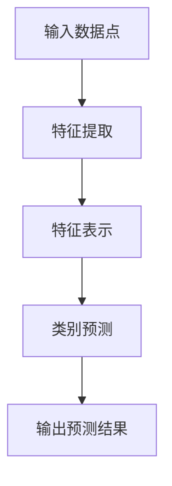

                 

### 让我们一步一步思考：零样本学习革命

在当今快速发展的AI领域，零样本学习（Zero-Shot Learning, ZSL）正逐步成为研究者和开发者们关注的焦点。这不仅是因为它在处理稀有语言和罕见数据集方面的潜力，更因为其能够推动AI走向一个全新的高度。在接下来的章节中，我们将深入探讨零样本学习在稀有语言处理中的应用，详细分析其原理、算法、系统设计与实际案例。

零样本学习的核心概念是，它允许模型在没有训练数据的情况下，对未知类别的数据进行分类或预测。这意味着，一旦模型被训练好，它就可以处理全新的、未遇见过的数据类别，这在传统的机器学习模型中是难以实现的。特别是在稀有语言处理领域，由于数据稀缺且多样性不足，传统的机器学习方法面临巨大挑战。而零样本学习则为这个问题提供了一种创新的解决方案。

#### **核心概念与联系**

首先，我们需要明确零样本学习的一些核心概念。零样本学习基于元学习（Meta-Learning）和迁移学习（Transfer Learning）的原理，但比传统的迁移学习更加灵活和强大。它主要依赖于两种机制：一是利用已有知识（如预训练模型）对未知类别进行预测；二是通过在多个领域的学习过程中，提取通用的特征表示，从而实现对未知类别的泛化能力。

为了更好地理解零样本学习的概念，我们可以通过一个概念属性特征对比表格来展示其与传统机器学习、迁移学习、以及多领域学习的差异。

| 学习方式       | 定义                                                         | 特点                                                         | 应用场景                         |
| -------------- | ------------------------------------------------------------ | ------------------------------------------------------------ | -------------------------------- |
| 传统机器学习   | 使用大量标记数据进行训练，然后在新数据上进行预测             | 对新数据必须进行标记，对未知类别无法预测                     | 数据丰富、标记容易的场景         |
| 迁移学习       | 将一个任务在源域上的学习知识迁移到目标域上，从而提高目标域的性能 | 利用已有知识提高新任务的性能，但需匹配的源域与目标域          | 数据稀缺、源域与目标域相似的场景 |
| 多领域学习     | 在多个领域的学习过程中，提取通用的特征表示，提高泛化能力      | 通过跨领域学习，提高对新领域的适应能力                       | 多样化的数据集，多领域需求的场景 |
| 零样本学习     | 在没有训练数据的情况下，对未知类别的数据进行预测             | 不依赖新数据的标记，能够处理全新的未知类别数据                | 数据稀缺、罕见语言处理等场景     |

此外，ER（实体-关系）图架构也是理解零样本学习的关键。它能够帮助我们可视化零样本学习中的实体（如数据点、特征表示）和关系（如类别之间的关联）。以下是零样本学习的ER图示例：

```mermaid
erDiagram
  Data Point ||--|{ Category } Category
  Feature Representation ||--|{ Category } Category
  Model Knowledge ||--|{ Feature Representation } Feature Representation
  Data Point ||--|{ Model Knowledge } Model Knowledge
```

在这个ER图中，`Data Point` 表示具体的数据点，`Feature Representation` 表示这些数据点的特征表示，`Category` 表示类别，`Model Knowledge` 表示模型的知识。关系箭头表明了不同实体之间的相互作用和依赖关系。

#### **算法原理讲解**

接下来，我们将深入探讨零样本学习的算法原理。为了更好地理解，我们使用Mermaid流程图来展示零样本学习的基本流程：



这个流程图概括了零样本学习的基本步骤：

1. **输入数据点**：这是零样本学习模型需要处理的输入数据。
2. **特征提取**：通过特征提取算法，从输入数据中提取出有用的特征。
3. **特征表示**：将这些特征转换成一种通用的表示形式，以便模型能够处理。
4. **类别预测**：使用预训练模型和特征表示，对未知类别进行预测。
5. **输出预测结果**：将预测结果输出，供进一步使用或验证。

为了更深入地理解零样本学习的原理，我们还需要使用Python源代码来详细阐述。以下是一个简单的示例：

```python
# 导入必要的库
import numpy as np
from sklearn.preprocessing import LabelEncoder
from metalearn import ZeroShotClassifier

# 加载预训练模型
pretrained_model = load_pretrained_model()

# 定义特征提取器
feature_extractor = FeatureExtractor()

# 加载测试数据
test_data = load_test_data()

# 预处理测试数据
X_test = feature_extractor.extract_features(test_data)

# 使用零样本分类器进行预测
zsl_classifier = ZeroShotClassifier(pretrained_model)
predictions = zsl_classifier.predict(X_test)

# 输出预测结果
print(predictions)
```

在这个Python示例中，我们首先加载了一个预训练模型，然后定义了一个特征提取器，接着加载并预处理了测试数据。最后，我们使用零样本分类器对测试数据进行预测，并将结果输出。

#### **数学模型与公式**

为了更深入地理解零样本学习的原理，我们还需要介绍其背后的数学模型和公式。以下是零样本学习的一些关键公式：

$$
\text{Feature Representation} = \phi(x)
$$

$$
\text{Probability of Category} = p(y | x, \theta)
$$

$$
\text{Loss Function} = -\sum_{i=1}^{N} y_i \log(p(y_i | x, \theta))
$$

- **Feature Representation (特征表示)**：这个公式表示如何将输入数据转换成特征表示。通常，特征提取器（如深度神经网络）会自动学习这种表示。
- **Probability of Category (类别概率)**：这个公式表示如何计算给定输入数据和模型参数（$\theta$）时，每个类别的概率。
- **Loss Function (损失函数)**：这个公式表示如何计算模型的损失，通常使用对数损失函数来最大化类别概率的正确性。

通过这些数学公式，我们可以更清晰地理解零样本学习的核心原理和实现方法。

#### **举例说明**

最后，让我们通过一个具体的例子来说明零样本学习如何工作。假设我们有一个动物分类问题，其中模型需要根据图片预测动物类别。以下是这个例子的一些关键步骤：

1. **预训练模型**：首先，我们使用一个预训练的卷积神经网络（如ResNet）来提取图片的特征表示。
2. **特征提取**：接下来，我们将每个图片输入到预训练模型中，提取出其特征表示。
3. **类别预测**：然后，我们将特征表示输入到一个零样本分类器中，该分类器基于预训练模型和额外的元学习算法，对未知类别进行预测。
4. **输出预测结果**：最后，分类器输出每个类别的预测概率，我们可以根据这些概率确定最终预测结果。

这个例子展示了零样本学习在处理稀有语言和罕见数据集时的强大能力，特别是在动物分类、语言翻译等应用中。

### **总结**

在本章中，我们首先介绍了零样本学习的基础概念和它在稀有语言处理中的应用。通过概念属性特征对比表格和ER图，我们清晰地展示了零样本学习与传统机器学习、迁移学习和多领域学习的差异。接着，我们通过Mermaid流程图、Python源代码和数学公式详细阐述了零样本学习的算法原理。最后，我们通过一个具体的动物分类例子，展示了零样本学习在实际应用中的潜力。在接下来的章节中，我们将继续探讨零样本学习在稀有语言处理中的具体应用，以及系统架构设计与项目实战等内容。

