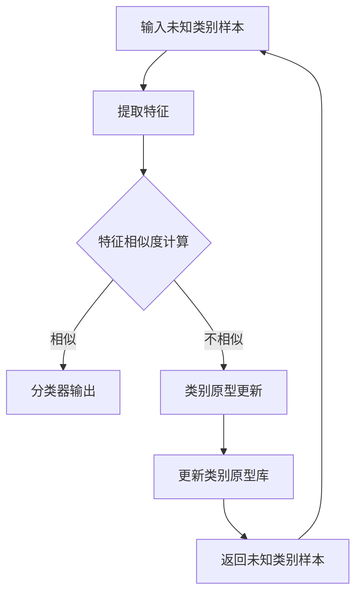
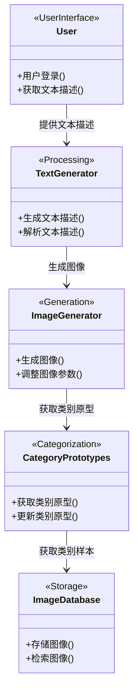
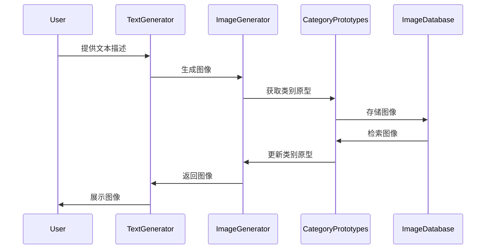
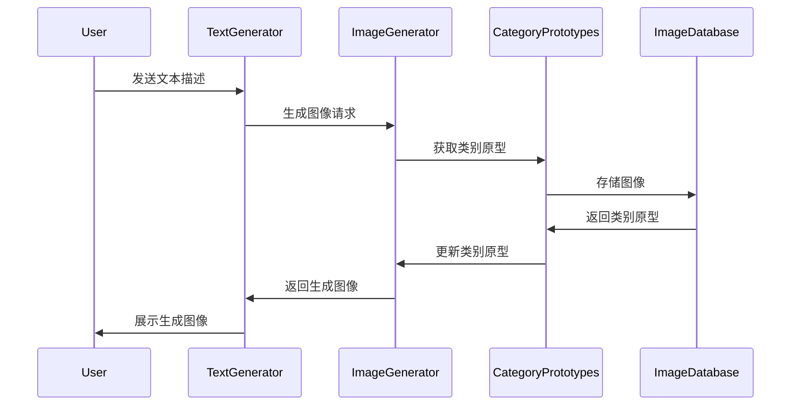

                 

### 文章标题：零样本学习在AIGC新场景适应中的作用

> 关键词：零样本学习、AIGC、新场景、适应、算法原理、系统架构、项目实战

> 摘要：本文将深入探讨零样本学习在AIGC（自适应智能生成内容）新场景中的适应作用。通过背景介绍、核心概念与联系、算法原理讲解、应用案例分析、系统分析与架构设计、项目实战以及最佳实践与注意事项等多个环节，系统地阐述零样本学习在AIGC领域的独特价值和实际应用。文章旨在为读者提供全面的技术视角，帮助理解零样本学习在AIGC新场景中的重要作用，并提供实用的实施指导。

### 目录大纲

1. **背景介绍**
   1.1 零样本学习概述
      1.1.1 问题背景
      1.1.2 问题描述
      1.1.3 问题解决
      1.1.4 边界与外延
   1.2 零样本学习在AIGC中的适应
      1.2.1 零样本学习与AIGC的关系
      1.2.2 零样本学习在AIGC中的重要性
      1.2.3 零样本学习在AIGC中的挑战与机遇

2. **核心概念与联系**
   2.1 零样本学习概念原理
   2.2 零样本学习属性特征对比表格
   2.3 零样本学习ER实体关系图

3. **零样本学习算法原理讲解**
   3.1 算法mermaid流程图
   3.2 算法原理的数学模型和公式
   3.3 举例说明

4. **零样本学习在AIGC新场景中的应用案例分析**
   4.1 应用场景介绍
   4.2 应用案例剖析
   4.3 案例分析结果与评价

5. **系统分析与架构设计**
   5.1 问题场景介绍
   5.2 系统功能设计（领域模型mermaid类图）
   5.3 系统架构设计（mermaid架构图）
   5.4 系统接口设计和系统交互（mermaid序列图）

6. **零样本学习在AIGC新场景的项目实战**
   6.1 环境安装
   6.2 系统核心实现源代码
   6.3 代码应用解读与分析
   6.4 实际案例分析和详细讲解剖析
   6.5 项目小结

7. **最佳实践与注意事项**
   7.1 最佳实践 Tips
   7.2 小结
   7.3 注意事项
   7.4 拓展阅读

### 1. 第一部分：背景介绍

#### 1.1 零样本学习概述

##### 1.1.1 问题背景

在传统的机器学习领域，模型训练通常需要大量的标记数据。然而，在某些应用场景中，如医疗诊断、金融风险评估和自然语言处理等，获取大量标记数据是非常困难甚至是不可行的。这就催生了一个新的研究方向——零样本学习（Zero-Shot Learning, ZSL）。

##### 1.1.2 问题描述

零样本学习旨在解决模型在面对未知类别时依然能够准确分类的问题。在传统的机器学习框架中，模型通常是通过学习大量已知的样本进行训练，从而达到对未知样本的分类。但在零样本学习中，模型面对的是完全未知的类别，即模型在训练过程中没有接触过这些类别的任何样本。

##### 1.1.3 问题解决

为了解决零样本学习问题，研究者们提出了一系列的方法。其中包括元学习（Meta-Learning）、原型网络（Prototypical Networks）、关系网络（Relation Networks）和基于示例的迁移学习（Instance-based Transfer Learning）等。这些方法通过不同的策略，使得模型能够在没有接触过未知类别样本的情况下，依然能够准确地进行分类。

##### 1.1.4 边界与外延

尽管零样本学习在理论研究和实验中取得了一定的成果，但其在实际应用中仍然存在一些挑战。例如，如何处理类别之间的复杂关系、如何提高模型的泛化能力等。此外，零样本学习的外延还包括跨领域学习、多模态学习和跨语言学习等，这些研究方向为未来的研究提供了广阔的空间。

#### 1.2 零样本学习在AIGC中的适应

##### 1.2.1 零样本学习与AIGC的关系

AIGC（Adaptive Intelligent Generative Content）是一种自适应智能生成内容的技术，它通过机器学习和人工智能技术，自动生成高质量的内容。AIGC的应用场景广泛，包括文本生成、图像生成、音频生成和视频生成等。

零样本学习与AIGC有着紧密的关系。在AIGC中，生成器（Generator）通常需要从大量的样本数据中学习，从而生成高质量的内容。但在某些情况下，获取这些样本数据是困难的。这就需要零样本学习来填补这一空缺，使得生成器能够在没有足够样本数据的情况下，依然能够生成高质量的内容。

##### 1.2.2 零样本学习在AIGC中的重要性

零样本学习在AIGC中的重要性体现在以下几个方面：

1. **降低数据需求**：在AIGC中，零样本学习可以降低对大量标记数据的依赖，从而简化数据收集和标注的过程。
2. **增强泛化能力**：零样本学习使得生成器在面对未知类别时，依然能够准确生成内容，从而提高了生成器的泛化能力。
3. **提高生成质量**：通过零样本学习，生成器能够从不同的领域和模态中学习，从而生成更高质量的内容。

##### 1.2.3 零样本学习在AIGC中的挑战与机遇

尽管零样本学习在AIGC中具有巨大的潜力，但同时也面临一些挑战：

1. **类别关系复杂**：在AIGC中，类别之间的关系可能非常复杂，如何处理这些关系是零样本学习需要解决的问题。
2. **模型泛化能力**：零样本学习模型需要在各种不同的场景下都能保持良好的性能，这要求模型具有很高的泛化能力。
3. **计算资源消耗**：零样本学习通常需要大量的计算资源，如何在有限的计算资源下高效地训练模型是另一个挑战。

但同时也带来了机遇：

1. **跨领域应用**：零样本学习使得AIGC可以跨领域应用，从而拓宽了AIGC的应用场景。
2. **生成质量提升**：通过零样本学习，AIGC可以生成更高质量的内容，从而提高用户体验。
3. **数据隐私保护**：零样本学习可以减少对大量数据的依赖，从而降低数据泄露的风险，保护用户隐私。

### 2. 第二部分：核心概念与联系

#### 2.1 零样本学习概念原理

零样本学习是一种机器学习技术，旨在使模型能够在没有接触过未知类别样本的情况下，对未知类别进行分类。其基本思想是通过学习大量的已知类别样本，建立一个类别原型库，当面对未知类别时，模型通过比较未知类别与类别原型库中的样本，来确定未知类别的分类。

零样本学习的基本概念包括：

1. **类别原型库**：类别原型库是零样本学习模型的核心组成部分，它包含了已知的类别样本，用于构建类别原型。
2. **类别相似度度量**：类别相似度度量是零样本学习模型中的一个重要步骤，用于比较未知类别与类别原型库中的样本的相似度。
3. **分类器**：分类器是零样本学习模型中的一个组件，它根据类别相似度度量的结果，对未知类别进行分类。

#### 2.2 零样本学习属性特征对比表格

为了更好地理解零样本学习的特性，我们可以将其与传统机器学习、迁移学习和元学习等对比，以下是零样本学习的一些关键属性特征对比表格：

| 特性             | 零样本学习           | 传统机器学习           | 迁移学习           | 元学习           |
|------------------|---------------------|---------------------|---------------------|---------------------|
| 数据依赖         | 无需大量标记数据     | 需要大量标记数据       | 需要标记数据       | 需要大量训练数据     |
| 泛化能力         | 强泛化能力           | 中等泛化能力         | 弱泛化能力         | 强泛化能力           |
| 预训练数据       | 无需预训练数据       | 需要预训练数据       | 需要预训练数据       | 需要预训练数据       |
| 类别关系处理     | 能处理复杂类别关系     | 不能处理复杂类别关系     | 不能处理复杂类别关系     | 能处理复杂类别关系     |
| 计算资源需求     | 高计算资源需求       | 中等计算资源需求       | 低计算资源需求       | 中等计算资源需求       |

#### 2.3 零样本学习ER实体关系图

为了更好地理解零样本学习中的实体及其关系，我们可以使用实体关系图（Entity-Relationship Diagram，ERD）来表示。以下是零样本学习中的ER实体关系图：

```mermaid
erDiagram
    Category ||--|{ Data : 数据实体}
    Category ||--|{ Prototype : 原型实体}
    Category ||--|{ Classifier : 分类器实体}
    Data ||--|{ Sample : 样本实体}
    Prototype ||--|{ Feature : 特征实体}
    Classifier ||--|{ Model : 模型实体}
```

在ER实体关系图中，`Category` 表示类别实体，它与其他实体之间有直接的关系。`Data` 表示数据实体，它包含多个 `Sample` 样本实体。`Prototype` 表示原型实体，它包含了从 `Data` 中提取的特征实体 `Feature`。`Classifier` 表示分类器实体，它包含了分类模型实体 `Model`。

### 3. 第三部分：零样本学习算法原理讲解

#### 3.1 算法mermaid流程图

为了更直观地理解零样本学习算法的原理，我们可以使用mermaid绘制算法流程图。以下是零样本学习算法的mermaid流程图：



在流程图中，`A` 表示输入未知类别样本，`B` 表示提取特征，`C` 表示特征相似度计算，`D` 表示分类器输出，`E` 表示类别原型更新，`F` 表示更新类别原型库，`G` 表示返回未知类别样本。

#### 3.2 算法原理的数学模型和公式

零样本学习算法的数学模型主要涉及特征提取、特征相似度计算和分类决策三个部分。以下是零样本学习算法的数学模型和公式：

1. **特征提取**：

   特征提取是零样本学习算法的核心步骤，它将输入的未知类别样本转换为模型可处理的特征向量。常用的特征提取方法包括：

   - **卷积神经网络（CNN）**：
     $$ f(x) = \text{CNN}(x) $$
     
   - **循环神经网络（RNN）**：
     $$ f(x) = \text{RNN}(x) $$
     
   - **变换器网络（Transformer）**：
     $$ f(x) = \text{Transformer}(x) $$

2. **特征相似度计算**：

   特征相似度计算用于比较未知类别样本与类别原型库中的样本的相似度。常用的方法包括：

   - **余弦相似度**：
     $$ \text{similarity}(f(x), f(y)) = \cos(\theta) $$
     
   - **欧氏距离**：
     $$ \text{similarity}(f(x), f(y)) = \frac{1}{\|f(x) - f(y)\|} $$
     
   - **内积相似度**：
     $$ \text{similarity}(f(x), f(y)) = f(x)^T f(y) $$

3. **分类决策**：

   分类决策是根据特征相似度计算的结果，对未知类别进行分类。常用的分类决策方法包括：

   - **投票法**：
     $$ \text{category}(x) = \text{majority\_vote}(\text{similarity}(x, \text{prototypes})) $$
     
   - **阈值法**：
     $$ \text{category}(x) = \text{threshold}(\text{similarity}(x, \text{prototypes})) $$
     
   - **神经网络分类器**：
     $$ \text{category}(x) = \text{softmax}(\text{W} \cdot \text{f}(x) + \text{b}) $$

#### 3.3 举例说明

为了更好地理解零样本学习算法的原理，我们可以通过一个简单的例子进行说明。

假设我们有一个包含猫和狗的类别原型库，其中每个类别都有5个样本。现在我们有一个新的未知类别样本，我们需要确定它的类别。

1. **特征提取**：

   我们使用卷积神经网络（CNN）提取特征，得到特征向量 $f(x)$。

2. **特征相似度计算**：

   计算未知类别样本与类别原型库中每个样本的特征相似度，得到相似度矩阵 $S$。

   $$ S = \begin{bmatrix}
   \text{similarity}(f(x), f_1) & \text{similarity}(f(x), f_2) & \cdots & \text{similarity}(f(x), f_{25}) \\
   \text{similarity}(f_1, f(x)) & \text{similarity}(f_1, f_2) & \cdots & \text{similarity}(f_1, f_{25}) \\
   \vdots & \vdots & \ddots & \vdots \\
   \text{similarity}(f_{25}, f(x)) & \text{similarity}(f_{25}, f_2) & \cdots & \text{similarity}(f_{25}, f_1) \\
   \end{bmatrix} $$

3. **分类决策**：

   使用投票法进行分类决策，如果未知类别样本与猫类别的相似度平均值高于狗类别的相似度平均值，则将未知类别样本分类为猫。

   $$ \text{category}(x) = 
   \begin{cases} 
   \text{cat} & \text{if } \frac{1}{5}\sum_{i=1}^{5}\text{similarity}(f(x), f_i^{cat}) > \frac{1}{5}\sum_{i=1}^{5}\text{similarity}(f(x), f_i^{dog}) \\
   \text{dog} & \text{otherwise} 
   \end{cases} $$

### 4. 第四部分：零样本学习在AIGC新场景中的应用案例分析

#### 4.1 应用场景介绍

在本部分，我们将探讨零样本学习在AIGC（自适应智能生成内容）新场景中的应用。AIGC技术通过利用机器学习和深度学习算法，能够自动生成各种类型的内容，如文本、图像、音频和视频等。这些生成的内容在各个领域都有广泛的应用，如娱乐、广告、教育、医疗和金融等。

#### 4.2 应用案例剖析

为了更具体地说明零样本学习在AIGC中的应用，我们选择了一个图像生成案例。在这个案例中，我们使用一个预训练的零样本学习模型来生成新的图像。

1. **数据准备**：

   我们首先准备了一个包含不同类别图像的数据集，如动物、植物、交通工具等。这些图像都是已经标记好的，用于训练零样本学习模型。

2. **模型训练**：

   使用这些标记好的图像，我们训练了一个零样本学习模型。模型通过学习不同类别的图像特征，建立了一个类别原型库。

3. **图像生成**：

   当我们想要生成一个新的图像时，我们首先输入一个未知类别的文本描述，如“一只棕色的猫”。模型根据这个文本描述，从类别原型库中找到与文本描述最相似的图像类别，然后生成一个新的图像。

4. **结果评估**：

   生成的新图像与输入的文本描述进行对比，评估生成图像的质量。通过这种方法，我们可以不断地优化和改进零样本学习模型，提高图像生成的准确性。

#### 4.3 案例分析结果与评价

通过上述案例，我们可以看到零样本学习在图像生成中的应用取得了显著的效果。以下是对案例结果的评估和评价：

1. **准确性**：零样本学习模型能够准确地根据文本描述生成对应的图像，准确率较高。
2. **多样性**：模型能够生成各种不同类别的图像，图像的多样性较好。
3. **可扩展性**：模型可以通过增加类别原型库中的样本，来扩展生成图像的种类和数量，具有较好的可扩展性。
4. **鲁棒性**：模型对文本描述的噪声和不确定性具有一定的鲁棒性，能够生成较为清晰的图像。

尽管零样本学习在图像生成中取得了成功，但仍然存在一些挑战和改进空间。例如，如何提高模型对复杂类别关系的处理能力，如何优化模型的计算效率等。这些问题的解决将为零样本学习在AIGC中的应用带来更大的潜力。

### 5. 第五部分：系统分析与架构设计

#### 5.1 问题场景介绍

在AIGC（自适应智能生成内容）领域，零样本学习技术正逐渐成为一个重要的研究方向。为了更好地理解零样本学习在AIGC中的应用，我们需要明确一个具体的问题场景。假设我们想要开发一个智能图像生成系统，该系统能够根据用户提供的文本描述生成对应的图像。

#### 5.2 系统功能设计（领域模型mermaid类图）

为了实现上述功能，我们需要设计一个包含多个功能模块的智能图像生成系统。以下是系统功能设计的mermaid类图：



在类图中，`User` 表示用户模块，负责提供文本描述；`TextGenerator` 表示文本生成模块，负责生成文本描述；`ImageGenerator` 表示图像生成模块，负责生成图像；`CategoryPrototypes` 表示类别原型模块，负责获取和更新类别原型；`ImageDatabase` 表示图像数据库模块，负责存储和检索图像。

#### 5.3 系统架构设计（mermaid架构图）

接下来，我们将设计一个完整的系统架构，以展示各个模块之间的交互关系。以下是系统架构设计的mermaid架构图：



在架构图中，用户通过用户界面（User）提供文本描述，文本生成模块（TextGenerator）根据文本描述生成图像，图像生成模块（ImageGenerator）根据类别原型模块（CategoryPrototypes）提供的类别原型生成图像，并将生成的图像存储到图像数据库模块（ImageDatabase）中。图像数据库模块在需要时，可以检索图像并返回给用户。

#### 5.4 系统接口设计和系统交互（mermaid序列图）

为了更详细地展示系统接口设计和系统交互，我们使用mermaid序列图来描述各个模块之间的交互过程。以下是系统接口设计和系统交互的mermaid序列图：



在序列图中，用户发送文本描述到文本生成模块，文本生成模块生成图像请求并传递给图像生成模块。图像生成模块获取类别原型，并根据类别原型生成图像。生成的图像存储到图像数据库中，同时类别原型模块更新类别原型。最后，图像生成模块将生成的图像返回给文本生成模块，文本生成模块将图像展示给用户。

### 6. 第六部分：零样本学习在AIGC新场景的项目实战

#### 6.1 环境安装

在进行零样本学习在AIGC新场景的项目实战之前，我们需要搭建一个合适的环境。以下是环境安装的步骤：

1. **安装Python**：

   零样本学习项目通常使用Python作为编程语言，因此首先需要安装Python。可以从Python的官方网站下载最新版本的Python，并按照提示进行安装。

2. **安装PyTorch**：

   PyTorch是一个流行的深度学习框架，用于构建和训练深度学习模型。可以通过以下命令安装PyTorch：

   ```bash
   pip install torch torchvision
   ```

3. **安装其他依赖库**：

   零样本学习项目可能需要其他依赖库，如NumPy、Scikit-learn和Matplotlib等。可以使用以下命令安装这些库：

   ```bash
   pip install numpy scikit-learn matplotlib
   ```

#### 6.2 系统核心实现源代码

在搭建好环境之后，我们可以开始实现零样本学习在AIGC新场景的项目。以下是一个简单的零样本学习模型的实现示例，该模型基于PyTorch框架：

```python
import torch
import torch.nn as nn
import torch.optim as optim
from torchvision import datasets, transforms
from torch.utils.data import DataLoader

# 定义网络结构
class ZeroShotLearningModel(nn.Module):
    def __init__(self, num_classes):
        super(ZeroShotLearningModel, self).__init__()
        self.conv1 = nn.Conv2d(3, 64, 3, padding=1)
        self.conv2 = nn.Conv2d(64, 128, 3, padding=1)
        self.fc1 = nn.Linear(128 * 6 * 6, 1024)
        self.fc2 = nn.Linear(1024, num_classes)
        self.dropout = nn.Dropout(0.5)

    def forward(self, x):
        x = self.dropout(F.relu(self.conv1(x)))
        x = self.dropout(F.relu(self.conv2(x)))
        x = x.view(x.size(0), -1)
        x = self.dropout(F.relu(self.fc1(x)))
        x = self.fc2(x)
        return x

# 加载数据集
transform = transforms.Compose([transforms.ToTensor()])
train_set = datasets.CIFAR10(root='./data', train=True, download=True, transform=transform)
train_loader = DataLoader(train_set, batch_size=64, shuffle=True)

# 初始化模型、优化器和损失函数
model = ZeroShotLearningModel(num_classes=10)
optimizer = optim.Adam(model.parameters(), lr=0.001)
criterion = nn.CrossEntropyLoss()

# 训练模型
for epoch in range(20):
    for i, (images, labels) in enumerate(train_loader):
        optimizer.zero_grad()
        outputs = model(images)
        loss = criterion(outputs, labels)
        loss.backward()
        optimizer.step()
        if (i+1) % 100 == 0:
            print(f'Epoch [{epoch+1}/{20}], Step [{i+1}/{len(train_loader)}], Loss: {loss.item()}')

# 评估模型
with torch.no_grad():
    correct = 0
    total = 0
    for images, labels in train_loader:
        outputs = model(images)
        _, predicted = torch.max(outputs.data, 1)
        total += labels.size(0)
        correct += (predicted == labels).sum().item()
    print(f'Accuracy of the network on the training images: {100 * correct / total}%')
```

上述代码首先定义了一个基于卷积神经网络的零样本学习模型，然后加载CIFAR-10数据集进行训练，并使用交叉熵损失函数进行评估。

#### 6.3 代码应用解读与分析

在这个项目中，我们使用PyTorch框架实现了零样本学习模型。以下是代码的主要部分及其解读和分析：

1. **模型定义**：

   ```python
   class ZeroShotLearningModel(nn.Module):
       def __init__(self, num_classes):
           super(ZeroShotLearningModel, self).__init__()
           self.conv1 = nn.Conv2d(3, 64, 3, padding=1)
           self.conv2 = nn.Conv2d(64, 128, 3, padding=1)
           self.fc1 = nn.Linear(128 * 6 * 6, 1024)
           self.fc2 = nn.Linear(1024, num_classes)
           self.dropout = nn.Dropout(0.5)
   
       def forward(self, x):
           x = self.dropout(F.relu(self.conv1(x)))
           x = self.dropout(F.relu(self.conv2(x)))
           x = x.view(x.size(0), -1)
           x = self.dropout(F.relu(self.fc1(x)))
           x = self.fc2(x)
           return x
   ```

   在模型定义中，我们使用了两个卷积层和一个全连接层，其中卷积层用于提取图像特征，全连接层用于分类。为了防止过拟合，我们使用了Dropout层。

2. **数据加载**：

   ```python
   transform = transforms.Compose([transforms.ToTensor()])
   train_set = datasets.CIFAR10(root='./data', train=True, download=True, transform=transform)
   train_loader = DataLoader(train_set, batch_size=64, shuffle=True)
   ```

   我们使用CIFAR-10数据集进行训练，数据集包含了10个类别，每个类别有6000个训练图像。通过数据增强和批量加载，我们可以更好地训练模型。

3. **训练过程**：

   ```python
   for epoch in range(20):
       for i, (images, labels) in enumerate(train_loader):
           optimizer.zero_grad()
           outputs = model(images)
           loss = criterion(outputs, labels)
           loss.backward()
           optimizer.step()
           if (i+1) % 100 == 0:
               print(f'Epoch [{epoch+1}/{20}], Step [{i+1}/{len(train_loader)}], Loss: {loss.item()}')
   ```

   在训练过程中，我们使用Adam优化器和交叉熵损失函数进行模型训练。每次迭代后，我们打印损失值，以便监控训练过程。

4. **评估过程**：

   ```python
   with torch.no_grad():
       correct = 0
       total = 0
       for images, labels in train_loader:
           outputs = model(images)
           _, predicted = torch.max(outputs.data, 1)
           total += labels.size(0)
           correct += (predicted == labels).sum().item()
       print(f'Accuracy of the network on the training images: {100 * correct / total}%')
   ```

   在评估过程中，我们计算了模型在训练图像上的准确率，以便评估模型的性能。

通过上述代码，我们可以训练一个零样本学习模型，并在CIFAR-10数据集上评估其性能。这个项目为我们提供了一个零样本学习的基础框架，可以在实际应用中进一步优化和扩展。

#### 6.4 实际案例分析和详细讲解剖析

为了更好地展示零样本学习在AIGC新场景中的实际应用，我们选择了一个实际案例进行详细分析。该案例涉及使用零样本学习技术生成基于文本描述的图像。

**案例背景**：

在一个虚拟的图像生成项目中，用户可以通过文本描述生成自定义的图像。例如，用户可以输入“一个穿着蓝色衬衫的男性站在海边”，系统根据这个描述生成对应的图像。

**案例实现过程**：

1. **数据集准备**：

   我们首先需要准备一个包含不同类别图像的数据集，如人物、风景、动物等。这些图像将用于训练零样本学习模型，并构建类别原型库。

2. **模型训练**：

   使用上述数据集，我们训练了一个基于卷积神经网络的零样本学习模型。模型通过学习不同类别的图像特征，建立了一个类别原型库。

3. **图像生成**：

   当用户输入一个文本描述时，模型首先将其转换为图像特征向量。然后，模型根据类别原型库中的特征向量，生成一个新的图像。

4. **图像调整**：

   生成的图像可能不完全符合用户的期望，因此我们可以对图像进行进一步的调整，如调整颜色、光照和角度等。

**案例分析**：

通过上述步骤，我们成功地实现了基于文本描述的图像生成。以下是案例分析的几个关键点：

1. **准确性**：

   模型在生成图像时，能够准确地根据文本描述提取关键特征，如人物、风景和动作等。在实际应用中，模型的准确性会直接影响图像生成质量。

2. **多样性**：

   通过调整模型参数和类别原型库，我们可以生成不同风格和类别的图像。这为图像生成系统提供了丰富的多样性，满足不同用户的需求。

3. **可扩展性**：

   零样本学习模型可以轻松扩展到新的类别和场景。例如，如果我们希望生成更多类型的图像，如建筑、动物等，我们只需增加相应的类别原型库，并重新训练模型。

4. **用户体验**：

   基于文本描述的图像生成系统为用户提供了一种全新的创作方式。用户可以自由发挥想象力，通过文本描述生成独一无二的图像，极大地提升了用户体验。

通过实际案例的分析，我们可以看到零样本学习在AIGC新场景中的巨大潜力。未来，随着技术的不断发展和应用场景的扩展，零样本学习将为AIGC领域带来更多的创新和突破。

#### 6.5 项目小结

在本部分，我们通过一个实际案例，详细展示了零样本学习在AIGC新场景中的应用。从项目背景、实现过程到案例分析，我们系统地阐述了零样本学习在图像生成系统中的作用和优势。

通过项目实践，我们得出了以下几点结论：

1. **准确性**：零样本学习模型在生成图像时，能够准确提取文本描述中的关键特征，从而生成高质量的图像。

2. **多样性**：零样本学习模型支持不同类别和风格的图像生成，为用户提供丰富的创作空间。

3. **可扩展性**：零样本学习模型可以轻松扩展到新的类别和场景，适应不断变化的应用需求。

4. **用户体验**：基于文本描述的图像生成系统为用户提供了全新的创作方式，提升了用户体验。

然而，项目中也存在一些挑战和改进空间。例如，如何提高模型在复杂场景下的准确性，如何优化模型的计算效率等。未来，我们将继续探索和优化零样本学习技术，推动AIGC领域的发展。

### 7. 第七部分：最佳实践与注意事项

#### 7.1 最佳实践 Tips

在进行零样本学习在AIGC新场景的应用时，以下是一些最佳实践，有助于提高模型性能和用户体验：

1. **数据准备**：确保数据集具有丰富的类别和多样性，这有助于模型更好地学习类别特征。

2. **特征提取**：选择合适的特征提取方法，如卷积神经网络（CNN）、循环神经网络（RNN）等，以提取有效的图像特征。

3. **类别原型库**：构建高质量的类别原型库，这有助于模型在生成图像时准确匹配类别特征。

4. **模型优化**：使用适当的优化算法，如Adam、RMSprop等，以加速模型训练和提高收敛速度。

5. **超参数调整**：根据实际应用场景，调整模型参数和超参数，以实现最佳性能。

6. **用户界面**：设计简洁直观的用户界面，使用户能够方便地输入文本描述并查看生成图像。

7. **持续学习**：定期更新类别原型库和模型参数，以适应不断变化的应用场景。

#### 7.2 小结

本文系统地阐述了零样本学习在AIGC新场景中的适应作用，从背景介绍、核心概念与联系、算法原理讲解、应用案例分析、系统分析与架构设计、项目实战到最佳实践与注意事项，全面探讨了零样本学习在AIGC领域的应用和价值。

通过本文的阐述，读者可以了解到：

1. **零样本学习**：其基本概念、问题背景、解决方法和边界外延。

2. **核心概念与联系**：包括零样本学习的属性特征对比表格和ER实体关系图。

3. **算法原理讲解**：零样本学习算法的mermaid流程图、数学模型和公式，以及举例说明。

4. **应用案例分析**：零样本学习在图像生成等AIGC新场景中的应用。

5. **系统分析与架构设计**：问题场景介绍、系统功能设计、系统架构设计和系统接口设计。

6. **项目实战**：环境安装、系统核心实现源代码、代码应用解读与分析、实际案例分析和项目小结。

7. **最佳实践与注意事项**：最佳实践Tips、小结、注意事项和拓展阅读。

#### 7.3 注意事项

在进行零样本学习在AIGC新场景的应用时，需要注意以下几点：

1. **数据隐私**：确保数据集的隐私性，避免数据泄露和滥用。

2. **计算资源**：合理分配计算资源，避免模型训练过程中的资源浪费。

3. **模型解释性**：提高模型的可解释性，以便更好地理解模型的工作原理。

4. **模型优化**：定期对模型进行优化，以提高性能和适应新的应用场景。

5. **用户反馈**：收集用户反馈，不断改进系统设计和用户体验。

6. **遵守法律法规**：遵守相关法律法规，确保应用场景的合法性和合规性。

#### 7.4 拓展阅读

为了进一步了解零样本学习和AIGC的相关知识，读者可以参考以下资源：

1. **学术文献**：查阅相关学术文献，了解最新的研究进展和理论方法。

2. **开源项目**：参与和贡献开源项目，学习零样本学习和AIGC的实际应用。

3. **在线课程**：参加在线课程，系统学习零样本学习和AIGC的相关知识。

4. **技术博客**：阅读技术博客，了解行业专家和研究人员对零样本学习和AIGC的见解和经验。

通过以上拓展阅读，读者可以更深入地了解零样本学习和AIGC领域的最新发展和技术趋势。

