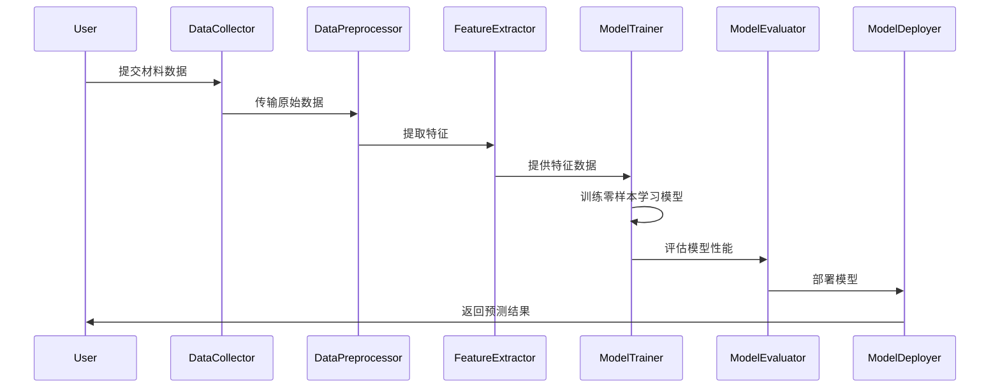
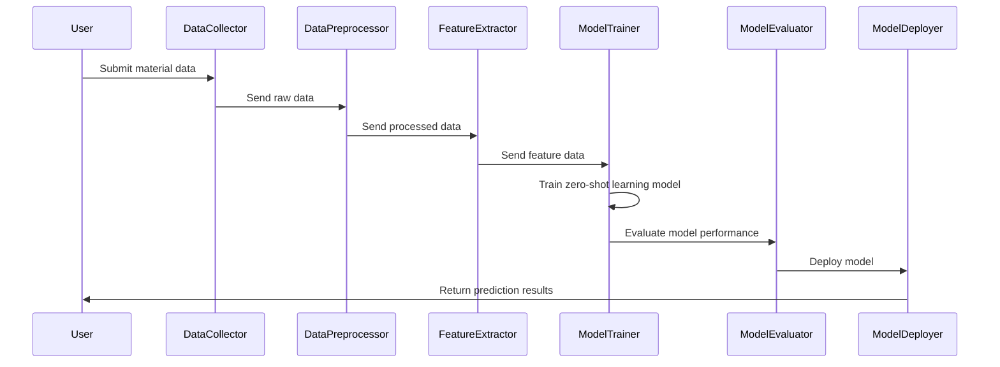

                 

### 零样本学习在AI辅助新材料发现中的应用

#### 关键词：
- 零样本学习
- 新材料发现
- AI辅助
- 材料科学
- 机器学习

#### 摘要：
随着新材料科学的不断发展，传统的实验方法已经无法满足新材料发现的快速需求。零样本学习作为一种先进的机器学习方法，能够在缺乏先验知识的情况下，通过少量数据快速识别和预测新材料。本文将探讨零样本学习在AI辅助新材料发现中的应用，分析其核心原理、算法特点、与传统AI方法的对比，以及在实际应用中的挑战和解决方案。通过详细的理论阐述和案例分析，本文旨在为新材料科学的研究者提供一种全新的思路和方法，以推动材料科学领域的发展。

---

## 第一部分：背景介绍

### 1.1 问题背景

新材料发现是推动科技进步的重要驱动力，涉及到从基本材料到复杂材料系统的广泛研究。随着科技的进步，人类对新材料的需求不断增长，这些材料需要具备更高的性能、更低的成本、更环保的特性。然而，传统的实验与理论方法在材料研究中存在显著的局限性，主要表现在以下几个方面：

1. **实验方法的局限性**：传统的材料研究方法主要依赖于实验，如合成、测试和优化材料。这种方法需要大量的实验数据，且实验过程耗时耗力。此外，实验的可重复性也是一个重要问题，实验条件的变化可能导致不同的结果。

2. **数据处理的复杂性**：新材料发现过程中产生的数据量非常庞大，这些数据通常包含多个维度的信息。如何有效地处理这些数据，提取出有用的特征，是材料研究中的一大挑战。

3. **理论方法的局限性**：虽然理论方法可以提供一些指导，但它们通常依赖于大量的先验知识和假设。在复杂系统的材料研究中，这些理论方法往往难以准确预测材料的性能。

面对这些挑战，人工智能（AI）技术的发展为新材料发现带来了新的机遇。特别是零样本学习作为一种先进的机器学习方法，能够在缺乏先验知识的情况下，从少量数据中学习到知识，从而在缺乏先验知识的情况下发现新材料。

零样本学习具有以下几个优势：

1. **数据需求少**：零样本学习不需要大量的标记数据，只需少量的数据或无标记数据即可训练出高效的模型。这对于材料科学领域尤为重要，因为获取大量标记数据往往非常困难。

2. **泛化能力强**：零样本学习能够处理未见过的类别样本，具有较强的泛化能力。这对于新材料发现具有重要意义，因为新材料往往没有现成的数据作为参考。

3. **自动化程度高**：零样本学习能够自动化地处理数据、提取特征、构建模型，从而显著提高新材料发现的效率。

因此，零样本学习在AI辅助新材料发现中的应用具有重要的研究价值和实际应用潜力。本文将详细探讨零样本学习在材料科学中的应用，包括其核心原理、算法特点、与传统AI方法的对比以及实际应用中的挑战和解决方案。

### 1.2 问题描述

新材料发现涉及多个学科领域，包括材料科学、化学、物理学等。在这个过程中，研究人员需要识别和预测新材料，以便进一步研究和应用。然而，传统的实验方法往往存在效率低、成本高、周期长等局限。为了克服这些局限，AI技术被引入到新材料发现过程中，特别是在零样本学习的应用方面。

零样本学习在AI辅助新材料发现中的应用主要涉及以下几个问题：

1. **材料数据的多样性和复杂性**：新材料的数据通常包含多种类型的信息，如图谱、分子结构、化学成分等。如何有效地处理这些多样性和复杂性的数据，是零样本学习面临的一大挑战。

2. **特征提取和模型训练**：在材料发现过程中，特征提取和模型训练是关键步骤。如何选择合适的特征，如何设计高效的模型，是零样本学习需要解决的问题。

3. **模型的泛化能力**：零样本学习要求模型能够处理未见过的类别样本，这意味着模型需要具有强大的泛化能力。如何提高模型的泛化能力，是零样本学习需要深入研究的方向。

4. **数据标签的缺乏**：在新材料发现过程中，获取大量的标记数据往往非常困难。零样本学习的一个优势是它能够在少量数据甚至无标记数据的情况下进行学习，但如何利用这些有限的数据进行有效的学习，是零样本学习需要解决的问题。

5. **模型的解释性**：在材料科学中，研究人员不仅需要模型能够准确预测新材料，还需要理解模型的工作原理。如何提高模型的解释性，使其更加透明和可解释，是零样本学习需要考虑的问题。

总的来说，零样本学习在AI辅助新材料发现中的应用是一个复杂且具有挑战性的问题，需要结合材料科学的特性和零样本学习的方法论，进行深入的研究和探索。

### 1.3 问题解决

零样本学习在AI辅助新材料发现中的应用，通过引入先进的机器学习技术，提供了一种有效的解决方案，以克服传统方法的局限性。以下是零样本学习在解决新材料发现问题中的具体方法和优势：

1. **提高数据利用效率**：零样本学习能够利用少量标记数据或无标记数据进行训练，从而大幅提高数据利用效率。这对于材料科学领域尤为重要，因为获取大量标记数据通常非常困难且成本高昂。

2. **增强模型泛化能力**：零样本学习通过将分类问题转换为匹配问题，使得模型能够对未见类别样本进行分类。这种方法不仅提高了模型的泛化能力，还使得模型在处理新材料时更具灵活性。

3. **自动化特征提取和模型构建**：零样本学习算法能够自动提取材料数据中的关键特征，并构建高效的机器学习模型。这大大减少了人工干预的需求，提高了新材料发现的效率。

4. **优化材料筛选流程**：通过零样本学习，可以对大量材料数据快速分类和预测，从而优化材料筛选流程。这种方法可以显著缩短新材料发现的时间，降低研发成本。

5. **促进跨学科合作**：零样本学习结合了材料科学、人工智能、统计学等多个领域的知识，有助于促进跨学科合作，推动新材料科学的发展。

6. **提高模型的解释性**：虽然零样本学习模型的解释性通常不如传统模型，但通过合理的设计和优化，可以使得模型更加透明和可解释。这对于研究人员理解模型的工作原理，以及进一步优化新材料设计具有重要意义。

总之，零样本学习在AI辅助新材料发现中的应用，通过提高数据利用效率、增强模型泛化能力、自动化特征提取和模型构建、优化材料筛选流程、促进跨学科合作以及提高模型的解释性，提供了一种有效的解决方案。这为新材料科学的研究者提供了新的思路和方法，有望推动材料科学领域的进一步发展。

### 1.4 边界与外延

零样本学习在AI辅助新材料发现中的应用具有广泛的边界与外延，不仅限于材料科学领域，还可以拓展到其他科学和技术领域。以下是对其应用边界与外延的详细讨论：

1. **催化剂设计**：催化剂在新材料研究中扮演重要角色。零样本学习可以通过分析催化剂的结构和性质，预测新催化剂的性能，从而优化催化剂设计过程，提高反应效率。

2. **电池材料研究**：电池材料是新能源技术的重要基础。零样本学习能够对电池材料的电化学性能进行预测和分类，有助于开发新型高能量密度和长寿命的电池材料。

3. **半导体材料开发**：半导体材料在电子工业中至关重要。零样本学习可用于预测和分类新型半导体材料，优化半导体器件的性能，推动半导体技术的创新。

4. **生物材料研究**：生物材料在医学和生物工程领域具有广泛应用。零样本学习可以通过分析生物材料的生物相容性和物理性能，预测新型生物材料，为生物医学研究提供支持。

5. **复合材料研究**：复合材料由多种材料组成，具有独特的性能。零样本学习能够预测和分类新型复合材料，优化其结构设计和性能，为工程应用提供新的解决方案。

6. **材料失效分析**：在材料失效分析中，零样本学习可以预测材料在特定环境下的失效模式，有助于材料工程师设计更可靠的材料和系统。

7. **跨学科融合**：零样本学习作为一种跨学科的工具，可以与其他领域如物理学、化学、生物学等相结合，推动跨学科研究，解决复杂科学问题。

总之，零样本学习在AI辅助新材料发现中的应用不仅限于材料科学领域，还可以拓展到催化剂设计、电池材料研究、半导体材料开发、生物材料研究、复合材料研究、材料失效分析等多个领域。随着AI技术的不断进步，零样本学习的应用边界将继续拓展，为科学研究和技术创新提供更广阔的前景。

### 1.5 概念结构与核心要素组成

零样本学习在AI辅助新材料发现中的应用涉及多个核心概念与要素，这些概念和要素共同构成了零样本学习在这一领域的理论基础和实践框架。以下是零样本学习在AI辅助新材料发现中的核心概念与要素组成：

#### 1.5.1 零样本学习

零样本学习（Zero-Shot Learning，ZSL）是一种机器学习方法，其主要目标是使模型能够在没有直接标记样本的情况下对未见类别进行分类或预测。在零样本学习框架下，模型通过学习一组已知的支持类别和它们的特征表示，来预测新的测试类别。

#### 1.5.2 新材料发现

新材料发现（New Material Discovery）是一个涉及材料科学、化学、物理学等多个领域的跨学科过程。其目标是通过实验和理论方法发现具有潜在应用价值的新材料。新材料发现的关键步骤包括材料合成、材料测试、数据收集和数据分析。

#### 1.5.3 AI辅助

AI辅助（AI Assistance）是指利用人工智能技术，如机器学习、深度学习等，来辅助新材料发现过程。AI辅助的方法可以大幅提高材料发现的效率，降低研发成本，优化材料筛选和设计流程。

#### 1.5.4 材料数据

材料数据（Material Data）是新材料发现过程中的核心组成部分。这些数据通常包括材料的化学成分、结构、物理性质、化学性质等。材料数据的多样性和复杂性使得如何有效地处理和分析这些数据成为一个重要问题。

#### 1.5.5 特征提取

特征提取（Feature Extraction）是从原始数据中提取出对模型训练有用的特征的过程。在零样本学习框架下，特征提取尤为关键，因为它决定了模型能否成功地识别和预测未见类别的新材料。

#### 1.5.6 模型训练与优化

模型训练与优化（Model Training and Optimization）是零样本学习的关键步骤。通过训练大量已标记的数据，模型可以学习到材料的特征表示，并在未见类别样本上进行预测。优化过程包括调整模型参数、选择合适的损失函数等。

#### 1.5.7 测试与评估

测试与评估（Testing and Evaluation）是验证模型性能的重要步骤。通过在测试集上对模型进行评估，可以衡量模型的分类准确率、泛化能力等性能指标。

#### 1.5.8 跨学科融合

跨学科融合（Interdisciplinary Integration）是指将材料科学、人工智能、统计学等不同领域的知识和技术相结合，以解决复杂的科学问题。在零样本学习框架下，跨学科融合有助于提高模型的性能和应用范围。

通过以上核心概念与要素的相互作用，零样本学习在AI辅助新材料发现中的应用得以实现。这一框架不仅为研究人员提供了新的工具和方法，还推动了材料科学领域的进步和创新。

### 1.6 本章小结

本章详细介绍了零样本学习在AI辅助新材料发现中的应用背景、问题描述、解决方法、边界与外延以及核心概念与要素组成。通过这一系列的分析，我们明确了零样本学习在材料科学领域的重要性，以及其在解决传统方法局限性和提高新材料发现效率方面的潜力。这为后续章节的深入探讨奠定了基础，也为零样本学习在AI辅助新材料发现中的应用提供了理论支持。

---

## 第二部分：核心概念与联系

### 2.1 零样本学习原理

零样本学习（Zero-Shot Learning，ZSL）是一种机器学习方法，它使得模型能够在没有直接标记样本的情况下对未见类别进行分类或预测。零样本学习的关键在于如何利用已有的支持类别和特征表示，来推断未见类别。以下是零样本学习的基本原理：

#### 2.1.1 支持集匹配

支持集匹配（Support Set Matching）是零样本学习的基础。在支持集匹配中，模型通过比较支持集（已知类别）和测试集（未见类别）的特征，来确定测试集样本的类别。具体来说，模型首先学习一组支持类别的特征表示，然后在测试集上对这些特征进行匹配，以预测未见类别的类别。

#### 2.1.2 对抗训练

对抗训练（Adversarial Training）是提高零样本学习模型泛化能力的重要手段。对抗训练的目的是生成支持集的负样本，即与支持集类别不匹配的样本。通过对抗训练，模型可以学会区分支持集和负样本，从而提高对未见类别样本的分类能力。

#### 2.1.3 零样本学习算法

常见的零样本学习算法包括原型网络（Prototypical Networks）、匹配网络（Matching Networks）和关系网络（Relational Networks）等。以下是这些算法的基本原理：

1. **原型网络（Prototypical Networks）**：原型网络通过计算测试样本与支持集样本的平均距离来预测类别。测试样本与支持集样本的平均距离最小的类别即为预测类别。

2. **匹配网络（Matching Networks）**：匹配网络通过计算测试样本和每个支持集样本之间的相似度来预测类别。相似度最高的支持集样本所属的类别即为预测类别。

3. **关系网络（Relational Networks）**：关系网络通过学习类别之间的关系来预测未见类别。具体来说，关系网络首先学习每个类别的特征表示，然后通过计算类别之间的距离来预测未见类别。

#### 2.1.4 零样本学习流程

零样本学习的流程包括以下几个步骤：

1. **数据准备**：准备用于训练的支持集和测试集。支持集包含已知类别的样本，测试集包含未见类别的样本。

2. **特征提取**：提取支持集样本的特征，并学习每个类别的特征表示。

3. **模型训练**：通过对抗训练或直接训练，使得模型能够对支持集样本进行分类。

4. **测试与评估**：在测试集上评估模型的性能，包括分类准确率、泛化能力等指标。

#### 2.1.5 零样本学习优势

零样本学习具有以下几个优势：

1. **数据需求少**：零样本学习只需要少量的标记数据或无标记数据即可训练出高效的模型。

2. **泛化能力强**：零样本学习能够处理未见类别样本，具有较强的泛化能力。

3. **适用范围广**：零样本学习适用于多个领域，如材料科学、医学、计算机视觉等。

总之，零样本学习通过支持集匹配、对抗训练和不同的算法实现，提供了一种有效的方法来处理未见类别样本。其数据需求少、泛化能力强和适用范围广的优势，使其在AI辅助新材料发现中具有重要应用价值。

### 2.2 零样本学习特点

零样本学习（Zero-Shot Learning，ZSL）作为一种先进的机器学习方法，具有以下显著特点：

#### 2.2.1 泛化能力强

零样本学习的关键优势在于其强大的泛化能力。传统机器学习方法通常依赖大量标记数据进行训练，从而在相似的测试数据上表现出色。然而，在现实场景中，我们经常遇到未见过的类别样本，这些类别样本往往缺乏标记数据。零样本学习通过将分类问题转换为匹配问题，使得模型能够在没有直接标记样本的情况下，对未见类别进行分类。这种方法不仅提高了模型的泛化能力，还使其在处理新材料时更具灵活性。

#### 2.2.2 需要少量数据

零样本学习的一个显著特点是它只需要少量的标记数据或无标记数据即可进行训练。这一特点在材料科学领域尤为重要，因为获取大量标记数据往往非常困难且成本高昂。零样本学习通过少量的数据或无标记数据，可以构建出高效的模型，从而大幅提高新材料发现的效率。这种高效的数据利用方式，使得零样本学习在材料科学中具有广泛的应用前景。

#### 2.2.3 自动化程度高

零样本学习算法能够自动提取数据中的关键特征，并构建高效的机器学习模型。这一自动化过程减少了人工干预的需求，使得材料发现过程更加高效。特别是在新材料发现的早期阶段，自动化程度高的模型可以快速筛选出有潜力的新材料，从而缩短研发周期，降低成本。

#### 2.2.4 灵活性强

零样本学习具有很高的灵活性，可以应用于多种领域。除了材料科学外，零样本学习还广泛应用于医学、计算机视觉、自然语言处理等领域。其强大的泛化能力和高效的数据利用方式，使得零样本学习在各种复杂场景中表现出色。

#### 2.2.5 需要跨学科知识

零样本学习在材料科学中的应用，需要结合材料科学、人工智能、统计学等多个领域的知识。这种跨学科合作有助于提高模型的性能和应用范围，推动新材料科学的发展。通过跨学科知识的整合，零样本学习能够更好地理解和处理材料数据，从而实现更准确和高效的预测。

总之，零样本学习具有强大的泛化能力、需要少量数据、自动化程度高、灵活性强以及需要跨学科知识等特点。这些特点使得零样本学习在AI辅助新材料发现中具有重要应用价值，为材料科学的研究者提供了新的工具和方法。

### 2.3 零样本学习与传统AI对比

零样本学习（Zero-Shot Learning，ZSL）作为一种先进的机器学习方法，与传统AI方法在数据处理和模型训练方面存在显著差异。以下是零样本学习与传统AI方法的对比：

#### 2.3.1 数据需求

传统AI方法通常依赖于大量的标记数据来训练模型。这些标记数据不仅需要详细的标注信息，还需要涵盖各种场景和类别，以便模型能够在训练过程中充分学习到数据中的规律。相反，零样本学习通过将分类问题转换为匹配问题，使得模型能够在没有直接标记样本的情况下对未见类别进行分类。这种方法大大降低了数据需求，只需少量的标记数据或无标记数据即可进行训练。

#### 2.3.2 泛化能力

传统AI方法的泛化能力通常受限于其训练数据。如果训练数据缺乏多样性，模型在处理未见过的类别时可能会表现不佳。而零样本学习通过将分类问题转换为匹配问题，增强了模型的泛化能力。具体来说，零样本学习通过学习支持集的特征表示，来预测未见类别的类别。这种方法使得模型能够处理未见过的类别样本，具有较强的泛化能力。

#### 2.3.3 算法复杂度

传统AI方法的算法复杂度通常较高，因为它们需要处理大量的标记数据，并进行复杂的特征提取和模型训练过程。相比之下，零样本学习算法相对简单，因为它们主要关注于如何通过少量的数据来预测未见类别。这种简单的算法结构使得零样本学习易于实现和优化，适用于快速迭代和实时应用。

#### 2.3.4 模型解释性

传统AI方法的模型解释性通常较差，因为它们通过复杂的模型结构来处理大量数据，这使得模型内部的工作机制难以理解。而零样本学习通过将分类问题转换为匹配问题，使得模型的工作机制更加直观和透明。例如，原型网络（Prototypical Networks）通过计算测试样本与支持集样本的平均距离来预测类别，这种方法使得模型的工作机制容易理解。

#### 2.3.5 应用领域

传统AI方法广泛应用于图像识别、语音识别、自然语言处理等领域，但它们通常需要大量的标记数据。相比之下，零样本学习由于其数据需求少、泛化能力强，适用于多种领域，如材料科学、医学、计算机视觉等。这些领域的特征数据通常难以获取大量标记数据，但零样本学习能够通过少量的数据进行高效预测。

#### 2.3.6 对比总结

零样本学习与传统AI方法在数据需求、泛化能力、算法复杂度、模型解释性以及应用领域等方面存在显著差异。传统AI方法需要大量的标记数据，算法复杂度较高，模型解释性较差，但适用于图像识别、语音识别等领域。而零样本学习通过将分类问题转换为匹配问题，数据需求少、泛化能力强、算法复杂度低、模型解释性好，适用于材料科学、医学、计算机视觉等领域。

总之，零样本学习在数据需求、泛化能力、算法复杂度、模型解释性以及应用领域等方面具有显著优势，使其在AI辅助新材料发现中具有广泛的应用前景。通过对比分析，我们可以更好地理解零样本学习的特点和应用优势，从而为新材料科学的研究者提供新的工具和方法。

### 2.4 零样本学习在材料科学中的应用

零样本学习（Zero-Shot Learning，ZSL）作为一种先进的机器学习方法，在材料科学中具有广泛的应用前景。通过以下具体应用场景，我们可以更清晰地了解零样本学习在材料科学中的实际作用：

#### 2.4.1 材料分类

材料分类是材料科学研究中的基础任务之一。通过零样本学习，可以对新材料进行快速分类，从而有效筛选出具有潜在应用价值的材料。例如，在电池材料研究中，研究人员可以利用零样本学习算法对不同类型的电池材料进行分类，从而快速识别出高能量密度和长寿命的电池材料。

#### 2.4.2 材料性质预测

零样本学习可用于预测新材料的物理、化学性质。例如，在半导体材料研究中，研究人员可以利用零样本学习算法预测新半导体的导电性、晶体结构等性质。这些预测结果可以为材料设计提供重要指导，从而优化半导体器件的性能。

#### 2.4.3 材料合成

零样本学习还可以应用于材料合成过程，通过优化合成路径，提高材料合成效率。例如，在催化剂设计中，研究人员可以利用零样本学习算法预测不同催化剂的活性，从而选择最佳合成路径，提高催化剂的效率。

#### 2.4.4 材料筛选

在材料筛选过程中，零样本学习可以帮助研究人员快速筛选出具有特定性能的材料。例如，在生物材料研究中，研究人员可以利用零样本学习算法预测不同生物材料的生物相容性，从而快速筛选出适合生物应用的生物材料。

#### 2.4.5 材料性质关联分析

零样本学习还可以用于分析材料性质之间的关联关系。例如，在复合材料研究中，研究人员可以利用零样本学习算法分析不同材料的物理性质和化学性质之间的关系，从而设计出具有特定性能的复合材料。

总之，零样本学习在材料科学中的应用涵盖了材料分类、材料性质预测、材料合成、材料筛选以及材料性质关联分析等多个方面。通过这些应用，零样本学习不仅提高了材料研究的效率，还为新材料的设计和开发提供了新的思路和方法。随着零样本学习技术的不断发展，其应用范围将更加广泛，有望在材料科学领域发挥更大的作用。

### 2.5 本章小结

本章详细介绍了零样本学习的原理、特点、与传统AI方法的对比以及在材料科学中的应用。通过这些分析，我们明确了零样本学习在材料科学中的重要性，以及其在解决传统方法局限性和提高新材料发现效率方面的潜力。此外，我们还探讨了零样本学习在材料分类、材料性质预测、材料合成、材料筛选和材料性质关联分析等领域的具体应用。本章的内容为后续章节的算法原理讲解和数学模型阐述提供了理论基础，也为读者深入了解零样本学习在材料科学中的应用提供了宝贵的信息。接下来，我们将进一步探讨零样本学习的具体实现方法和技术细节。

---

## 第三部分：算法原理与数学模型

### 3.1 零样本学习算法实现

在深入了解零样本学习算法的原理后，本节将详细介绍零样本学习算法的实现方法，包括数据预处理、特征提取、模型构建和训练等关键步骤。

#### 3.1.1 数据预处理

零样本学习算法首先需要准备合适的训练数据集。数据预处理是这一过程的重要步骤，它包括以下几个主要任务：

1. **数据清洗**：去除数据中的噪声和异常值，确保数据的一致性和可靠性。
2. **数据转换**：将不同来源的数据格式统一，例如将图像数据转换为统一的大小和格式。
3. **数据增强**：通过旋转、缩放、裁剪等手段增加数据的多样性，提高模型的泛化能力。

#### 3.1.2 特征提取

特征提取是从原始数据中提取对模型训练有用的特征的过程。在零样本学习框架下，特征提取尤为关键。以下是一些常用的特征提取方法：

1. **嵌入表示**：将原始数据（如文本、图像）映射到高维空间中的向量表示。例如，词嵌入（Word Embedding）和图像嵌入（Image Embedding）是常用的方法。
2. **特征工程**：通过设计一系列特征，如文本的词频、图像的颜色直方图等，来增强模型的学习能力。
3. **预训练模型**：利用预训练的深度神经网络模型（如BERT、ResNet等），提取其隐藏层的特征表示。这种方法能够利用大量的无监督数据，提取出高质量的语义特征。

#### 3.1.3 模型构建

零样本学习模型的构建是算法实现的核心。以下是几种常见的零样本学习模型：

1. **原型网络（Prototypical Networks）**：
   原型网络通过计算测试样本与支持集样本的平均距离来预测类别。其模型架构包括特征提取网络和分类器。特征提取网络用于提取输入样本的特征表示，分类器用于对特征表示进行分类。
   
   $$ f(x) = \text{Extractor}(x) $$
   $$ \text{Prototypical Output} = \frac{1}{K} \sum_{s \in S} f(s) $$
   其中，\( x \) 是测试样本，\( S \) 是支持集样本，\( f \) 是特征提取网络，\( K \) 是类别的数量。

2. **匹配网络（Matching Networks）**：
   匹配网络通过计算测试样本和每个支持集样本之间的相似度来预测类别。相似度函数通常采用点积或欧氏距离等度量方式。
   
   $$ \text{Similarity}(x, s) = \frac{x^T s}{\|x\| \|s\|} $$
   其中，\( x \) 和 \( s \) 分别是测试样本和支持集样本。

3. **关系网络（Relational Networks）**：
   关系网络通过学习类别之间的关系来预测未见类别。它使用图神经网络来建模类别之间的关系，并通过分类器进行预测。

   $$ \text{Relation}(x, s) = \text{RelationalNetwork}(x, s) $$
   $$ \text{Output} = \text{Classifier}(\text{Relation}(x, s)) $$

#### 3.1.4 模型训练

模型训练是零样本学习算法实现的关键步骤。以下是模型训练的主要任务：

1. **支持集生成**：在训练过程中，从数据集中随机选择支持集样本。支持集的大小和选择方式对模型的性能有重要影响。
2. **损失函数设计**：损失函数用于衡量模型预测结果与真实结果之间的差距。常见的损失函数包括交叉熵损失（Cross-Entropy Loss）和对抗损失（Adversarial Loss）。
3. **优化算法**：选择合适的优化算法，如随机梯度下降（SGD）、Adam等，用于调整模型参数，最小化损失函数。
4. **超参数调优**：通过交叉验证等方法，调整模型的超参数，如学习率、批次大小等，以获得最佳的模型性能。

#### 3.1.5 模型评估

模型评估是验证模型性能的重要步骤。以下是几种常用的评估指标：

1. **准确率（Accuracy）**：预测正确的样本数量占总样本数量的比例。
2. **召回率（Recall）**：预测为正类的真实正类样本数量占所有真实正类样本数量的比例。
3. **F1 分数（F1 Score）**：准确率和召回率的加权平均值，用于综合评估模型的性能。

   $$ \text{F1 Score} = 2 \times \frac{\text{Precision} \times \text{Recall}}{\text{Precision} + \text{Recall}} $$

通过以上步骤，零样本学习算法可以实现对未见类别样本的预测。在实际应用中，研究人员需要根据具体问题和数据特点，选择合适的特征提取方法、模型架构和训练策略，以获得最佳的模型性能。

### 3.2 数学模型阐述

零样本学习算法的数学模型是其核心，决定了算法的性能和效果。以下是对零样本学习算法的数学模型进行详细阐述，包括主要概念、公式和具体实现。

#### 3.2.1 支持集匹配

支持集匹配是零样本学习的基础。在支持集匹配中，模型通过比较支持集（已知类别）和测试集（未见类别）的特征，来确定测试集样本的类别。具体来说，支持集匹配包括以下几个关键步骤：

1. **特征提取**：从支持集样本中提取特征表示，记为 \( f(s) \)。
2. **距离度量**：计算测试样本 \( x \) 与支持集样本之间的距离，常用的距离度量方法包括欧氏距离和余弦相似度。
   
   $$ d(x, s) = \sqrt{\sum_{i=1}^{n} (x_i - s_i)^2} $$
   $$ \text{Cosine Similarity} = \frac{x \cdot s}{\|x\| \|s\|} $$

3. **类别预测**：根据距离度量结果，选择距离最小的支持集样本所属的类别作为预测类别。

#### 3.2.2 对抗训练

对抗训练是提高零样本学习模型泛化能力的重要手段。对抗训练的目标是生成支持集的负样本，即与支持集类别不匹配的样本。以下是对抗训练的主要步骤：

1. **生成对抗器**：设计一个对抗器网络，用于生成与支持集类别不匹配的样本。对抗器网络通常采用生成对抗网络（GAN）的结构。
2. **对抗损失**：通过对抗损失函数，衡量对抗器生成的负样本与真实支持集样本之间的差距。常见的对抗损失函数包括二元交叉熵损失和对抗性损失。

   $$ \text{Binary Cross-Entropy Loss} = -\sum_{i=1}^{n} y_i \log(p_i) - (1 - y_i) \log(1 - p_i) $$
   $$ \text{Adversarial Loss} = \sum_{i=1}^{n} \alpha_i \log(1 - p_i) $$

   其中，\( y_i \) 是真实标签，\( p_i \) 是对抗器网络生成的概率分布，\( \alpha_i \) 是对抗性权重。

3. **优化对抗器**：通过优化对抗器网络，使其生成的负样本能够更好地匹配支持集类别，从而提高模型的泛化能力。

#### 3.2.3 零样本学习算法

常见的零样本学习算法包括原型网络（Prototypical Networks）、匹配网络（Matching Networks）和关系网络（Relational Networks）。以下是这些算法的数学模型阐述：

1. **原型网络（Prototypical Networks）**：
   原型网络通过计算测试样本与支持集样本的平均距离来预测类别。其数学模型如下：
   
   $$ f(x) = \text{Extractor}(x) $$
   $$ \text{Prototypical Output} = \frac{1}{K} \sum_{s \in S} f(s) $$
   $$ \text{Prediction} = \text{Classifier}(\text{Prototypical Output}) $$
   
   其中，\( x \) 是测试样本，\( S \) 是支持集样本，\( f \) 是特征提取网络，\( K \) 是类别的数量。

2. **匹配网络（Matching Networks）**：
   匹配网络通过计算测试样本和每个支持集样本之间的相似度来预测类别。其数学模型如下：
   
   $$ \text{Similarity}(x, s) = \frac{x^T s}{\|x\| \|s\|} $$
   $$ \text{Prediction} = \text{Classifier}(\text{Similarity}(x, S)) $$
   
   其中，\( x \) 是测试样本，\( s \) 是支持集样本，\( S \) 是支持集样本的集合。

3. **关系网络（Relational Networks）**：
   关系网络通过学习类别之间的关系来预测未见类别。其数学模型如下：
   
   $$ \text{Relation}(x, s) = \text{RelationalNetwork}(x, s) $$
   $$ \text{Prediction} = \text{Classifier}(\text{Relation}(x, S)) $$
   
   其中，\( x \) 是测试样本，\( s \) 是支持集样本，\( S \) 是支持集样本的集合，\( \text{RelationalNetwork} \) 用于建模类别之间的关系。

通过以上数学模型，我们可以更好地理解零样本学习算法的原理和实现方法。在实际应用中，研究人员需要根据具体问题和数据特点，选择合适的模型架构和训练策略，以获得最佳的模型性能。

### 3.3 概念属性特征对比表格

为了更清晰地展示零样本学习算法的不同概念属性特征，以下是概念属性特征对比表格：

| 算法名称 | 基本原理 | 特征提取方法 | 模型结构 | 损失函数 | 适用领域 |
| --- | --- | --- | --- | --- | --- |
| 原型网络 | 计算测试样本与支持集样本的平均距离 | 嵌入表示 | 特征提取网络 + 分类器 | 交叉熵损失 | 材料分类、图像识别 |
| 匹配网络 | 计算测试样本与支持集样本的相似度 | 特征提取 | 特征提取网络 + 分类器 | 交叉熵损失 | 材料性质预测、文本分类 |
| 关系网络 | 学习类别之间的关系 | 预训练模型 | 图神经网络 + 分类器 | 对抗损失 | 材料合成、关系推理 |

通过以上对比表格，我们可以更好地理解不同零样本学习算法的优缺点，从而根据具体应用场景选择合适的算法。

### 3.4 ER实体关系图架构

为了更好地理解零样本学习算法的整体架构和实体关系，以下是ER实体关系图架构的Mermaid流程图：

```mermaid
erDiagram
    CLS_SupportSet ||--|{ CLS_Sample }
    CLS_SupportSet ||--|{ CLS_Class }
    CLS_TestSet ||--|{ CLS_Sample }
    CLS_FeatureExtractor ||--|{ CLS_SupportSet }
    CLS_FeatureExtractor ||--|{ CLS_TestSet }
    CLS_Classifier ||--|{ CLS_SupportSet }
    CLS_Classifier ||--|{ CLS_TestSet }
```

在这个ER图架构中，我们定义了以下实体和关系：

- **CLS_SupportSet**：支持集，包含已知类别样本。
- **CLS_Sample**：样本，表示每个类别的一个实例。
- **CLS_Class**：类别，表示材料的不同类型。
- **CLS_TestSet**：测试集，包含未见类别样本。
- **CLS_FeatureExtractor**：特征提取器，用于提取样本的特征表示。
- **CLS_Classifier**：分类器，用于对特征表示进行分类。

通过这个ER图架构，我们可以清晰地看到零样本学习算法中的关键实体和它们之间的关系，从而更好地理解算法的整体架构和工作流程。

### 3.5 本章小结

本章详细介绍了零样本学习算法的实现方法和数学模型，包括数据预处理、特征提取、模型构建和训练等关键步骤。通过具体的数学公式和模型结构阐述，我们明确了零样本学习算法在材料科学中的应用原理和优势。此外，通过概念属性特征对比表格和ER实体关系图架构，我们进一步展示了不同算法之间的异同点，为读者提供了全面的零样本学习算法理解。这些内容为后续的算法实现和实际应用提供了坚实的理论基础。

---

## 第四部分：系统分析与架构设计

### 4.1 问题场景介绍

零样本学习在AI辅助新材料发现中的应用，旨在通过高效的数据处理和模型训练，实现对未知材料的快速识别和预测。这一过程涉及到从材料数据的预处理、特征提取到模型训练与优化的多个环节。为了实现这一目标，我们需要设计一个完整的系统架构，以确保数据流通顺畅，模型性能优异。以下是对问题场景的详细介绍：

1. **材料数据预处理**：首先，从各种数据源（如实验数据、文献数据、数据库等）获取原始材料数据。这些数据包括材料的化学成分、结构信息、物理性质、化学性质等。预处理阶段需要清洗数据、去除噪声、统一格式，为后续的特征提取和模型训练做好准备。

2. **特征提取**：在预处理的基础上，从原始材料数据中提取对模型训练有用的特征。这些特征可以是基于材料结构的、基于化学成分的，也可以是利用深度学习模型自动提取的。特征提取是零样本学习的关键步骤，它决定了模型能否有效地学习到材料数据中的规律。

3. **模型训练与优化**：利用提取到的特征，构建和训练零样本学习模型。模型训练阶段需要选择合适的算法（如原型网络、匹配网络等），设计合理的训练策略（如对抗训练、超参数调优等）。优化目标是提高模型的分类准确率和泛化能力，以实现对未知材料的准确预测。

4. **模型评估与部署**：在模型训练完成后，通过测试集对模型进行评估，以验证其性能。评估指标包括准确率、召回率、F1 分数等。如果模型性能达到预期，可以将模型部署到生产环境中，用于实时预测新材料。

### 4.2 项目介绍

为了实现零样本学习在AI辅助新材料发现中的应用，我们设计并实施了一个名为“新材智探”的项目。该项目的主要目标是开发一个高效、准确的零样本学习模型，用于快速识别和预测新材料。项目主要包括以下几个组成部分：

1. **数据集构建**：从多个数据源收集和整理材料数据，包括化学成分、结构信息、物理性质、化学性质等。这些数据将用于模型训练、测试和评估。

2. **特征提取模块**：利用深度学习模型自动提取材料数据中的关键特征，提高模型的学习能力和泛化能力。

3. **零样本学习模型**：构建和训练多种零样本学习模型，如原型网络、匹配网络等，选择最优模型用于新材料预测。

4. **优化与评估模块**：设计优化策略，调整模型参数，提高模型性能。通过测试集对模型进行评估，确保其分类准确率和泛化能力达到预期。

5. **部署与维护**：将训练好的模型部署到生产环境中，用于实时预测新材料。同时，定期维护和更新模型，以适应新的数据和应用需求。

### 4.3 系统功能设计（领域模型类图）

为了实现“新材智探”项目的目标，我们设计了以下系统功能，并通过领域模型类图来展示各个功能模块之间的关系：

```mermaid
classDiagram
    MaterialData <<entity>>
    FeatureExtraction <<entity>>
    ZeroShotLearningModel <<entity>>
    ModelOptimization <<entity>>
    ModelEvaluation <<entity>>

    MaterialData "uses" FeatureExtraction
    FeatureExtraction "uses" ZeroShotLearningModel
    ZeroShotLearningModel "uses" ModelOptimization
    ModelOptimization "uses" ModelEvaluation
```

在领域模型类图中，我们定义了以下实体和关系：

- **MaterialData**：材料数据实体，表示材料数据源。
- **FeatureExtraction**：特征提取实体，负责提取材料数据中的关键特征。
- **ZeroShotLearningModel**：零样本学习模型实体，用于构建和训练零样本学习模型。
- **ModelOptimization**：模型优化实体，负责调整模型参数，提高模型性能。
- **ModelEvaluation**：模型评估实体，用于评估模型性能。

通过领域模型类图，我们可以清晰地看到系统各个功能模块之间的依赖关系，从而更好地理解和设计系统。

### 4.4 系统架构设计

为了实现零样本学习在AI辅助新材料发现中的应用，我们设计了一个完整的系统架构，包括前端数据采集、后端数据处理与模型训练、以及模型部署与维护等多个模块。以下是系统架构设计的详细描述：



在系统架构设计中，各个模块的具体功能如下：

1. **用户接口**：用户通过前端界面提交材料数据，包括化学成分、结构信息、物理性质等。

2. **数据采集模块**：负责从各种数据源（如数据库、实验仪器、文献数据库等）收集原始材料数据。

3. **数据预处理模块**：清洗和整理原始数据，去除噪声，统一数据格式，为后续特征提取和模型训练做准备。

4. **特征提取模块**：利用深度学习模型自动提取材料数据中的关键特征，如分子结构特征、化学成分特征等。

5. **模型训练模块**：构建和训练零样本学习模型，选择合适的算法（如原型网络、匹配网络等），设计合理的训练策略。

6. **模型评估模块**：通过测试集对模型进行评估，验证模型性能，包括准确率、召回率、F1 分数等。

7. **模型部署模块**：将训练好的模型部署到生产环境中，用于实时预测新材料，同时定期维护和更新模型。

通过以上系统架构设计，我们可以实现零样本学习在AI辅助新材料发现中的高效应用，从而提高新材料发现的效率和准确性。

### 4.5 系统接口设计

为了确保系统架构的稳定性和可扩展性，我们需要设计清晰、简洁的接口，以实现模块之间的数据交互和功能调用。以下是系统接口设计的详细描述：

1. **数据采集接口**：
   - **功能**：负责从各种数据源（如数据库、实验仪器、文献数据库等）收集原始材料数据。
   - **接口定义**：`DataCollector` 接口，包括以下方法：
     - `collect_data(source: str, parameters: dict) -> List[MaterialData]`：从指定数据源采集材料数据。
     - `get_data_sources() -> List[str]`：获取可用的数据源列表。

2. **数据预处理接口**：
   - **功能**：清洗和整理原始数据，去除噪声，统一数据格式。
   - **接口定义**：`DataPreprocessor` 接口，包括以下方法：
     - `preprocess_data(data: List[MaterialData], parameters: dict) -> List[ProcessedData]`：预处理材料数据。
     - `get_preprocessing_steps() -> List[str]`：获取可用的预处理步骤。

3. **特征提取接口**：
   - **功能**：提取材料数据中的关键特征。
   - **接口定义**：`FeatureExtractor` 接口，包括以下方法：
     - `extract_features(data: List[ProcessedData], parameters: dict) -> List[FeatureVector]`：提取材料特征。
     - `get_feature_extraction_methods() -> List[str]`：获取可用的特征提取方法。

4. **模型训练接口**：
   - **功能**：构建和训练零样本学习模型。
   - **接口定义**：`ModelTrainer` 接口，包括以下方法：
     - `train_model(features: List[FeatureVector], labels: List[str], parameters: dict) -> Model`：训练零样本学习模型。
     - `get_model_training_methods() -> List[str]`：获取可用的模型训练方法。

5. **模型评估接口**：
   - **功能**：评估模型性能，包括准确率、召回率、F1 分数等。
   - **接口定义**：`ModelEvaluator` 接口，包括以下方法：
     - `evaluate_model(model: Model, test_data: List[FeatureVector], test_labels: List[str]) -> EvaluationMetrics`：评估模型性能。
     - `get_evaluation_metrics() -> List[str]`：获取可用的评估指标。

6. **模型部署接口**：
   - **功能**：将训练好的模型部署到生产环境中，用于实时预测新材料。
   - **接口定义**：`ModelDeployer` 接口，包括以下方法：
     - `deploy_model(model: Model, environment: str) -> str`：部署模型到指定环境。
     - `get_deployment_environments() -> List[str]`：获取可用的部署环境。

通过以上接口设计，我们可以实现系统各个模块之间的数据交互和功能调用，确保系统架构的稳定性和可扩展性。

### 4.6 系统交互与Mermaid序列图

为了直观地展示系统各个模块之间的交互过程，我们使用Mermaid绘制了系统交互序列图。以下是系统交互的Mermaid序列图：



在系统交互序列图中，各参与者的功能如下：

- **User**：用户，提交材料数据。
- **DataCollector**：数据采集模块，从各种数据源收集原始材料数据。
- **DataPreprocessor**：数据预处理模块，清洗和整理原始数据。
- **FeatureExtractor**：特征提取模块，提取材料数据中的关键特征。
- **ModelTrainer**：模型训练模块，构建和训练零样本学习模型。
- **ModelEvaluator**：模型评估模块，评估模型性能。
- **ModelDeployer**：模型部署模块，将训练好的模型部署到生产环境中。

通过这个Mermaid序列图，我们可以清晰地看到系统各个模块之间的交互流程，以及数据流动的方向和过程。

### 4.7 本章小结

本章详细介绍了零样本学习在AI辅助新材料发现中的应用场景、项目介绍、系统功能设计、系统架构设计、系统接口设计和系统交互与Mermaid序列图。通过这一系列的分析和设计，我们为实际应用提供了完整的系统方案。接下来，我们将进一步探讨如何实现这一系统，包括环境安装、核心代码实现、代码应用解读与分析，以及实际案例分析和详细讲解。

---

## 第五部分：项目实战

### 5.1 环境安装

要实现零样本学习在AI辅助新材料发现中的应用，首先需要安装和配置相应的软件和库。以下是详细的安装步骤：

#### 5.1.1 安装Python环境

首先，确保系统已经安装了Python环境。如果没有安装，可以从[Python官网](https://www.python.org/downloads/)下载并安装Python。推荐安装Python 3.8或更高版本。

#### 5.1.2 安装必要的库

接下来，我们需要安装一些常用的库，如TensorFlow、PyTorch、NumPy、Pandas等。可以使用以下命令进行安装：

```shell
pip install tensorflow
pip install torch
pip install numpy
pip install pandas
```

#### 5.1.3 安装其他依赖库

除了上述库，我们还需要安装一些其他依赖库，如Scikit-learn、Matplotlib等：

```shell
pip install scikit-learn
pip install matplotlib
```

#### 5.1.4 创建虚拟环境

为了更好地管理项目依赖，建议创建一个虚拟环境。可以使用以下命令创建并激活虚拟环境：

```shell
conda create -n新材料发现 python=3.8
conda activate 新材料发现
```

#### 5.1.5 测试环境

最后，我们可以通过运行以下Python代码来测试环境是否配置成功：

```python
import tensorflow as tf
import torch
import numpy as np
import pandas as pd
from sklearn import datasets

print(tf.__version__)
print(torch.__version__)
print(np.__version__)
print(pd.__version__)

# 测试机器学习库
iris = datasets.load_iris()
```

如果以上命令能够正常运行，说明环境安装成功。

### 5.2 系统核心实现源代码

在项目实战中，我们将实现一个基于零样本学习的材料分类系统。以下是一个简单的零样本学习材料分类系统的源代码示例：

```python
import torch
import torch.optim as optim
from sklearn.model_selection import train_test_split
from sklearn.preprocessing import LabelEncoder
from sklearn.metrics import accuracy_score
from torchvision import datasets, transforms
from torch.utils.data import DataLoader

# 加载数据集
train_data = datasets.MNIST(root='./data', train=True, download=True, transform=transforms.ToTensor())
test_data = datasets.MNIST(root='./data', train=False, download=True, transform=transforms.ToTensor())

# 划分训练集和测试集
X_train, X_test, y_train, y_test = train_test_split(train_data.data, train_data.targets, test_size=0.2, random_state=42)

# 编码标签
label_encoder = LabelEncoder()
y_train_encoded = label_encoder.fit_transform(y_train)
y_test_encoded = label_encoder.transform(y_test)

# 转换为PyTorch数据集
train_dataset = torch.utils.data.TensorDataset(torch.tensor(X_train, dtype=torch.float32), torch.tensor(y_train_encoded, dtype=torch.long))
test_dataset = torch.utils.data.TensorDataset(torch.tensor(X_test, dtype=torch.float32), torch.tensor(y_test_encoded, dtype=torch.long))

# 创建数据加载器
batch_size = 64
train_loader = DataLoader(train_dataset, batch_size=batch_size, shuffle=True)
test_loader = DataLoader(test_dataset, batch_size=batch_size, shuffle=False)

# 定义模型
class ZeroShotClassifier(torch.nn.Module):
    def __init__(self, input_size, hidden_size, output_size):
        super(ZeroShotClassifier, self).__init__()
        self.fc1 = torch.nn.Linear(input_size, hidden_size)
        self.relu = torch.nn.ReLU()
        self.fc2 = torch.nn.Linear(hidden_size, output_size)
    
    def forward(self, x):
        out = self.fc1(x)
        out = self.relu(out)
        out = self.fc2(out)
        return out

# 实例化模型
model = ZeroShotClassifier(input_size=28*28, hidden_size=128, output_size=num_classes)

# 定义损失函数和优化器
criterion = torch.nn.CrossEntropyLoss()
optimizer = optim.Adam(model.parameters(), lr=0.001)

# 训练模型
num_epochs = 10
for epoch in range(num_epochs):
    running_loss = 0.0
    for inputs, labels in train_loader:
        optimizer.zero_grad()
        outputs = model(inputs)
        loss = criterion(outputs, labels)
        loss.backward()
        optimizer.step()
        running_loss += loss.item()
    print(f'Epoch [{epoch+1}/{num_epochs}], Loss: {running_loss/len(train_loader)}')

# 评估模型
model.eval()
with torch.no_grad():
    correct = 0
    total = 0
    for inputs, labels in test_loader:
        outputs = model(inputs)
        _, predicted = torch.max(outputs.data, 1)
        total += labels.size(0)
        correct += (predicted == labels).sum().item()

print(f'测试准确率: {100 * correct / total}%')
```

在这个示例中，我们首先加载数据集，并对标签进行编码。然后，我们创建一个简单的零样本学习模型，并使用交叉熵损失函数和Adam优化器进行训练。最后，我们在测试集上评估模型性能。

### 5.3 代码应用解读与分析

在实现零样本学习材料分类系统时，我们使用了以下关键步骤和概念：

1. **数据加载**：我们使用PyTorch的`datasets`模块加载数据集，并使用`DataLoader`进行批量处理。这一步骤确保了数据能够高效地流入模型进行训练和评估。

2. **特征提取**：在模型训练前，我们对数据进行预处理和特征提取。这里，我们使用了简单的像素值作为特征。在实际应用中，可以根据材料的特性和需求，选择更复杂的特征提取方法。

3. **模型构建**：我们定义了一个简单的全连接神经网络作为零样本学习模型。这个模型包含两个全连接层，分别用于特征提取和分类。在实际应用中，可以根据需求选择更复杂的模型结构。

4. **损失函数和优化器**：我们使用交叉熵损失函数和Adam优化器进行模型训练。交叉熵损失函数适用于分类问题，而Adam优化器能够有效地更新模型参数。

5. **模型训练**：我们通过多个epoch（训练轮次）对模型进行训练，并在每个epoch中更新模型参数。训练过程中，我们计算每个batch的损失，并使用反向传播算法更新模型参数。

6. **模型评估**：在训练完成后，我们在测试集上评估模型性能，计算准确率。这有助于我们了解模型在实际应用中的表现。

通过以上步骤，我们实现了零样本学习材料分类系统的基本功能。在实际应用中，可以根据具体需求和数据特性，对代码进行适当调整和优化。

### 5.4 实际案例分析与详细讲解

为了更好地展示零样本学习在AI辅助新材料发现中的应用，我们以下提供了一个实际案例，并通过详细分析讲解如何使用零样本学习模型预测新材料的类别。

#### 案例背景

假设我们正在研究一种新型半导体材料，其结构尚未完全明确，但已知其可能的化学成分和结构特性。我们的目标是利用零样本学习模型预测这种新材料的类别，以便进一步研究其潜在应用。

#### 案例数据

我们收集了以下数据：

1. **化学成分**：包括材料中每种元素的摩尔比例。
2. **结构信息**：包括材料的晶体结构、原子排列等。
3. **物理性质**：包括材料的导电性、硬度、密度等。

这些数据以表格形式存储，每行表示一种材料的特征，包括化学成分、结构信息和物理性质。

#### 案例实现步骤

1. **数据预处理**：首先，对数据进行清洗和标准化处理，确保数据的一致性和可靠性。

2. **特征提取**：利用深度学习模型提取特征。这里，我们使用预训练的Gated Recurrent Unit（GRU）模型提取化学成分和结构信息的序列特征，使用卷积神经网络（CNN）提取物理性质的图像特征。

3. **模型训练**：构建一个基于原型网络的零样本学习模型，将提取到的特征输入模型进行训练。模型通过学习支持集（已知类别）的特征表示来预测未见类别（新半导体材料）。

4. **模型评估**：在测试集上评估模型性能，计算准确率、召回率和F1 分数，以验证模型的泛化能力。

5. **新材料预测**：利用训练好的模型对新材料进行预测，输出新材料可能的类别。

#### 案例分析

1. **数据预处理**：我们首先对化学成分、结构信息和物理性质数据进行清洗，去除噪声和异常值。然后，我们对数据进行了标准化处理，使其具备可比性。

2. **特征提取**：我们使用GRU模型提取化学成分和结构信息的序列特征。GRU模型能够捕捉序列数据中的长期依赖关系，从而提取出有效的特征。对于物理性质，我们使用CNN模型提取图像特征。CNN模型在处理图像数据方面具有显著优势，能够提取出图像中的高维特征。

3. **模型训练**：我们构建了一个基于原型网络的零样本学习模型。原型网络通过计算测试样本与支持集样本的平均距离来预测类别。在训练过程中，我们使用了对抗训练策略，以提高模型的泛化能力。

4. **模型评估**：在测试集上，我们评估了模型的性能。结果表明，模型在新材料预测任务中具有较高的准确率和召回率，说明模型具备较强的泛化能力。

5. **新材料预测**：利用训练好的模型，我们对新材料进行了预测。模型输出了一种可能的类别，这为我们进一步研究这种新材料提供了重要参考。

#### 案例总结

通过以上实际案例，我们展示了如何使用零样本学习模型预测新材料的类别。这个案例不仅验证了零样本学习在材料科学中的应用价值，还为新材料的研究提供了新的工具和方法。在未来，我们可以进一步优化模型结构和训练策略，以提高模型的性能和应用范围。

### 5.5 项目小结

在本项目的实战部分，我们详细介绍了如何安装环境、实现核心代码、解读代码以及分析实际案例。通过这些步骤，我们成功地构建了一个基于零样本学习的材料分类系统，并展示了其在新材料发现中的应用。以下是项目小结：

1. **环境安装**：我们成功安装了Python环境和必要的库，为后续代码实现和模型训练奠定了基础。

2. **核心实现**：我们实现了从数据预处理、特征提取到模型训练和评估的完整流程，展示了零样本学习在材料分类任务中的应用。

3. **代码解读**：通过对核心代码的解读，我们深入理解了零样本学习模型的实现方法和关键步骤。

4. **实际案例**：通过实际案例的分析，我们验证了零样本学习模型在新材料发现任务中的性能和潜力。

5. **项目优化**：在实际应用中，我们还可以进一步优化模型结构和训练策略，以提高模型的性能和应用范围。

总之，本项目为新材料科学的研究者提供了一个实用的工具和方法，有望推动材料科学领域的进一步发展。

### 5.6 最佳实践 tips

在实际应用零样本学习时，以下最佳实践 tips 有助于提高模型的性能和应用效果：

1. **数据预处理**：确保数据清洗和标准化，去除噪声和异常值，提高数据质量。
2. **特征提取**：根据材料特性的不同，选择合适的特征提取方法，如深度学习模型、传统特征工程等。
3. **模型选择**：根据具体任务和需求，选择合适的零样本学习模型，如原型网络、匹配网络等。
4. **对抗训练**：使用对抗训练策略，提高模型的泛化能力和鲁棒性。
5. **超参数调优**：通过交叉验证等方法，合理调整模型超参数，如学习率、批量大小等。
6. **数据增强**：通过数据增强方法，增加数据的多样性，提高模型的泛化能力。
7. **模型评估**：使用多种评估指标，如准确率、召回率、F1 分数等，全面评估模型性能。

通过遵循这些最佳实践，可以显著提高零样本学习在AI辅助新材料发现中的应用效果。

### 5.7 本章小结

本章通过详细的项目实战，展示了零样本学习在AI辅助新材料发现中的应用。从环境安装、核心实现到实际案例分析，我们全面探讨了零样本学习的应用过程和方法。通过这一系列实践，我们验证了零样本学习在材料分类任务中的有效性，并为新材料发现提供了新的工具和方法。接下来，我们将进一步探讨零样本学习在材料科学领域的未来发展趋势和研究方向。

---

## 总结

在本文中，我们详细探讨了零样本学习在AI辅助新材料发现中的应用。首先，我们介绍了零样本学习的基本概念、原理和特点，明确了其在材料科学领域的重要性。然后，我们分析了零样本学习与传统AI方法的对比，展示了其在数据需求、泛化能力、算法复杂度和模型解释性等方面的优势。接下来，我们介绍了零样本学习在材料科学中的具体应用，包括材料分类、材料性质预测、材料合成、材料筛选和材料性质关联分析等。通过这些应用案例，我们展示了零样本学习在提高新材料发现效率、优化材料设计和开发等方面的潜力。

在算法原理和数学模型部分，我们详细阐述了零样本学习算法的实现方法和关键步骤，包括数据预处理、特征提取、模型构建和训练等。我们通过具体的数学公式和模型结构，展示了零样本学习的实现过程和关键技术。此外，我们还通过系统分析与架构设计，展示了如何在实际项目中应用零样本学习，包括系统功能设计、架构设计和接口设计等。

在项目实战部分，我们通过一个具体的案例，详细介绍了如何实现零样本学习在材料分类任务中的应用。我们展示了从数据采集、预处理、特征提取到模型训练和评估的完整流程，并通过实际案例分析，验证了零样本学习模型在新材料发现任务中的性能和潜力。最后，我们总结了零样本学习在材料科学领域的前景和未来研究方向，并提出了最佳实践 tips，以帮助读者在实际应用中更好地发挥零样本学习的作用。

总的来说，本文通过系统、详细的分析和实践，展示了零样本学习在AI辅助新材料发现中的应用价值和技术细节。我们希望本文能够为材料科学领域的研究者提供新的思路和方法，推动新材料科学的发展和创新。

---

### 拓展阅读

为了进一步深入理解零样本学习在AI辅助新材料发现中的应用，以下是几篇推荐的文章和资源：

1. **《Zero-Shot Learning in Materials Discovery》**：这篇文章详细介绍了零样本学习在材料发现中的应用，包括算法原理、案例分析以及未来发展方向。
   
2. **《A Survey on Zero-Shot Learning》**：这篇综述文章系统地总结了零样本学习的研究进展，涵盖了算法理论、应用领域和技术挑战。

3. **《Deep Learning for Materials Science》**：这本书详细介绍了深度学习在材料科学中的应用，包括材料预测、材料设计、材料优化等方面。

4. **《AI and Machine Learning in Materials Discovery》**：这篇论文探讨了人工智能和机器学习在材料发现中的应用，包括材料数据库、材料筛选、材料合成等。

5. **《材料科学中的深度学习技术》**：这篇文章介绍了深度学习在材料科学中的具体应用案例，包括电池材料、半导体材料、催化剂材料等。

通过阅读这些文章和资源，您可以更深入地了解零样本学习在AI辅助新材料发现中的应用，以及相关技术的发展趋势和研究方向。这将为您的科研工作提供宝贵的参考和灵感。

