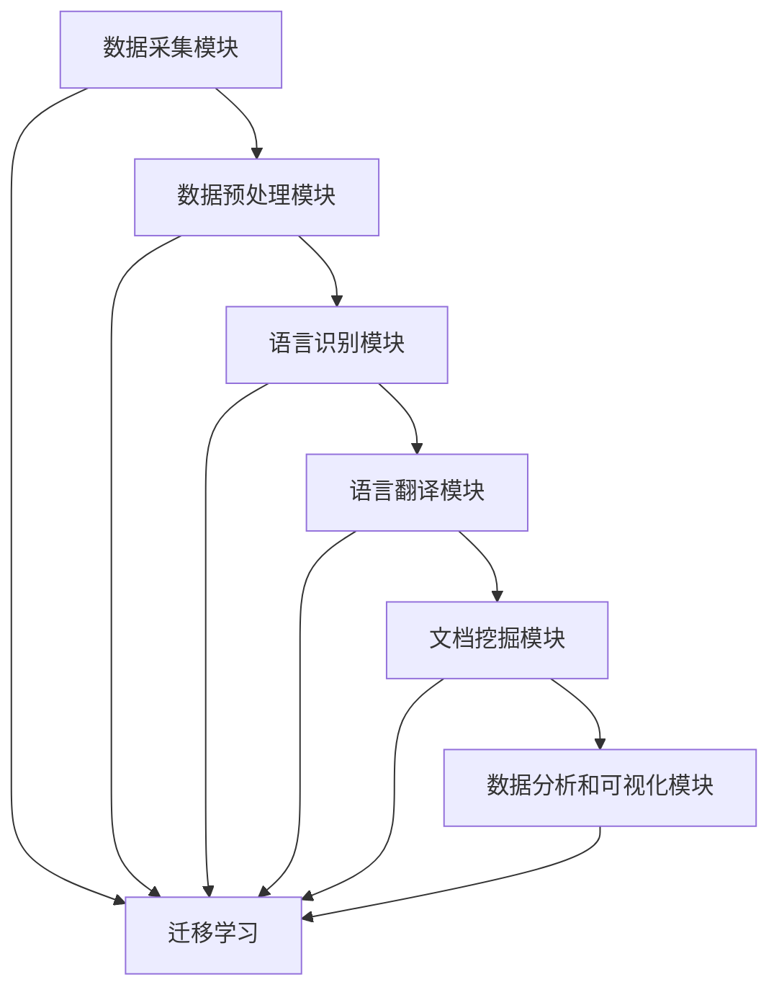

                 

### 文章标题

#### 零样本学习在AI辅助稀有语言保护中的创新

零样本学习，作为一种前沿的人工智能技术，近年来在多个领域取得了显著的进展。本文将以《零样本学习在AI辅助稀有语言保护中的创新》为标题，探讨零样本学习在稀有语言保护中的应用，深入分析其在稀有语言识别、翻译和文档挖掘等方面的创新实践。通过逐步讲解，我们将了解零样本学习如何破解稀有语言保护的难题，为这一领域的未来发展提供新的思路。

#### 关键词

- 零样本学习
- 稀有语言保护
- 语言识别
- 语言翻译
- 文档挖掘
- 人工智能

#### 摘要

本文首先介绍了稀有语言保护的背景和挑战，以及零样本学习的基本概念和原理。随后，我们详细探讨了零样本学习在稀有语言识别、翻译和文档挖掘中的应用，通过具体实例和算法原理讲解，展示了零样本学习如何提升稀有语言处理的效果。最后，我们通过实际项目实践，分析了AI辅助稀有语言保护的框架设计和项目效果，并对零样本学习在稀有语言保护中的未来发展方向进行了展望。

## 目录大纲

### 第一部分：背景与核心概念

#### 第1章：稀有语言保护的现状与挑战

#### 第2章：零样本学习的基本概念

### 第二部分：零样本学习在稀有语言保护中的应用

#### 第3章：零样本学习在稀有语言识别中的应用

#### 第4章：零样本学习在稀有语言翻译中的应用

#### 第5章：零样本学习在稀有语言文档挖掘中的应用

### 第三部分：AI辅助稀有语言保护的创新实践

#### 第6章：稀有语言保护的AI辅助框架设计

#### 第7章：AI辅助稀有语言保护的项目实践

#### 第8章：零样本学习在稀有语言保护中的未来展望

### 目录大纲总结

通过本书的阅读，读者将全面了解零样本学习在稀有语言保护中的重要作用，掌握相关技术和应用方法。每个章节的内容都经过精心设计，既有理论讲解，又有实践案例，旨在帮助读者深入理解零样本学习在稀有语言保护中的创新应用。

## 第一部分：背景与核心概念

### 第1章：稀有语言保护的现状与挑战

#### 1.1 稀有语言保护的背景

在全球化的背景下，许多稀有语言正面临着严重的威胁。据统计，全球超过一半的语言在使用人数上不足1万人，其中约一半的语言预计将在未来一个世纪内消失。稀有语言的消失不仅意味着文化多样性的减少，还会对人类的知识和认知产生深远影响。因此，稀有语言保护已经成为国际社会共同关注的重要课题。

#### 1.2 稀有语言保护的挑战

稀有语言保护的挑战主要体现在以下几个方面：

1. **数据稀缺**：稀有语言通常缺乏足够的语料库和标注数据，这给语言处理技术的应用带来了巨大困难。
2. **语言差异性**：稀有语言之间存在着巨大的差异性，使得通用语言处理模型难以直接应用于这些语言。
3. **技术瓶颈**：现有的自然语言处理技术大多依赖于大规模数据集，对于稀有语言的适应性较差。
4. **社会关注度不足**：稀有语言保护往往缺乏足够的资金和资源支持，导致相关工作进展缓慢。

#### 1.3 零样本学习在稀有语言保护中的重要性

零样本学习作为一种无需大规模标注数据集的机器学习方法，为稀有语言保护提供了一种新的可能性。其主要优势包括：

1. **数据驱动**：零样本学习通过迁移学习和元学习等技术，可以从少量甚至零标注数据中学习到有用的知识，从而缓解数据稀缺问题。
2. **泛化能力强**：零样本学习可以针对稀有语言进行特定化的模型训练，提高模型在稀有语言上的适应性。
3. **高效性**：零样本学习通过高效的数据利用和模型优化，可以在稀有语言处理任务中实现快速迭代和高效部署。

总之，零样本学习在稀有语言保护中的应用，有望为解决稀有语言处理中的数据稀缺、语言差异性和技术瓶颈等问题提供新的解决方案。

#### 1.4 小结

通过本章的介绍，我们了解了稀有语言保护的背景和挑战，以及零样本学习在稀有语言保护中的重要性。接下来，我们将进一步探讨零样本学习的基本概念和原理，为后续章节的内容奠定基础。

## 第2章：零样本学习的基本概念

#### 2.1 零样本学习概述

零样本学习（Zero-Shot Learning, ZSL）是一种机器学习方法，它允许模型在未见过的类别上预测标签。与传统的监督学习不同，零样本学习不依赖于大量的标注数据，而是利用已有的知识库和类别的元信息来进行预测。零样本学习在图像识别、语音识别、文本分类等应用中展现出了巨大的潜力。

#### 2.2 零样本学习的核心原理

零样本学习的核心原理主要包括迁移学习（Transfer Learning）和元学习（Meta-Learning）。迁移学习通过将已知类别上的知识迁移到未知类别上，提高模型的泛化能力。元学习则通过学习如何快速适应新类别，使模型能够迅速调整并应用于新任务。

- **迁移学习**：迁移学习的基本思想是将一个任务（源任务）的知识迁移到另一个相关任务（目标任务）上。在零样本学习中，源任务是已知类别的任务，目标任务是未见过的类别。通过迁移学习，模型可以有效地利用已有的知识来预测未知类别。

  $$\text{Transfer Learning} = f_{\theta}(\text{Source Data}) + f_{\phi}(\text{Target Data})$$

  其中，$f_{\theta}(\text{Source Data})$表示在源任务上的知识，$f_{\phi}(\text{Target Data})$表示在目标任务上的知识。

- **元学习**：元学习旨在通过学习学习过程本身，使模型能够快速适应新任务。在零样本学习中，元学习通过训练模型使其能够从少量数据中快速提取知识，并应用于新类别。

  $$\text{Meta-Learning} = f_{\theta'}(\text{Data}) + f_{\phi'}(\text{Task})$$

  其中，$f_{\theta'}(\text{Data})$表示对数据的理解，$f_{\phi'}(\text{Task})$表示对任务的适应。

#### 2.3 零样本学习与传统机器学习的区别

传统机器学习依赖于大量的标注数据来进行训练，而零样本学习则通过迁移学习和元学习等技术，能够在数据稀缺的情况下进行有效学习。其主要区别如下：

- **数据需求**：传统机器学习需要大量的标注数据，而零样本学习可以通过少量数据或零标注数据进行学习。
- **模型泛化**：传统机器学习模型的泛化能力受到标注数据集的限制，而零样本学习通过迁移学习和元学习，可以显著提高模型的泛化能力。
- **应用场景**：传统机器学习适用于常见的大规模数据处理任务，而零样本学习则特别适用于数据稀缺、语言差异显著等稀有语言处理任务。

#### 2.4 小结

通过本章的介绍，我们了解了零样本学习的基本概念、核心原理以及与传统机器学习的区别。接下来，我们将深入探讨零样本学习在稀有语言识别、翻译和文档挖掘中的应用，进一步展示其在稀有语言保护中的创新潜力。

## 第二部分：零样本学习在稀有语言保护中的应用

### 第3章：零样本学习在稀有语言识别中的应用

#### 3.1 零样本语言识别的原理与实现

零样本语言识别（Zero-Shot Language Recognition）是零样本学习在稀有语言处理中的一个重要应用。其基本原理是利用已有的知识库和类别的元信息，对未见过的稀有语言进行识别。具体实现包括以下步骤：

1. **知识库构建**：首先，构建一个包含多种语言的知识库。知识库中的每个语言类别都关联着相应的特征向量，这些特征向量可以从预训练的语言模型中提取。

2. **特征提取**：对于输入的稀有语言样本，提取其特征向量。这些特征向量将用于与知识库中的特征向量进行比较，从而实现语言识别。

3. **分类预测**：利用余弦相似度等度量方法，计算输入样本与知识库中各个语言类别的相似度。根据相似度最大的类别，预测输入样本的语言类别。

#### 3.2 零样本语言识别的算法综述

零样本语言识别的算法主要包括基于深度学习的算法和基于传统机器学习的算法。以下是一些常见的算法：

1. **基于深度学习的算法**：
   - **Multi-Label Embedding**：通过多标签嵌入模型，将不同语言类别映射到低维空间中，实现语言识别。
   - **Siamese Network**：通过Siamese网络，将输入样本与知识库中的各个语言类别进行对比，实现语言识别。

2. **基于传统机器学习的算法**：
   - **K-Nearest Neighbors (K-NN)**：利用K-NN算法，通过计算输入样本与知识库中各个语言类别的距离，实现语言识别。
   - **Support Vector Machine (SVM)**：通过SVM算法，将输入样本映射到高维空间，利用支持向量实现语言识别。

#### 3.3 零样本语言识别的性能评估

零样本语言识别的性能评估主要从以下几个方面进行：

1. **准确率**：准确率是最常用的评估指标，表示正确识别的语言类别占总识别类别的比例。

2. **召回率**：召回率表示正确识别的语言类别占实际语言类别的比例，反映了模型的灵敏度。

3. **F1值**：F1值是准确率和召回率的调和平均值，综合反映了模型的性能。

4. **错误率**：错误率表示错误识别的语言类别占总识别类别的比例，反映了模型的错误程度。

通过以上评估指标，可以全面了解零样本语言识别模型在稀有语言识别任务中的表现。

#### 3.4 小结

通过本章的介绍，我们了解了零样本语言识别的原理与实现，以及常见的算法综述和性能评估方法。零样本语言识别作为一种有效的稀有语言处理方法，为稀有语言保护提供了有力的技术支持。接下来，我们将进一步探讨零样本学习在稀有语言翻译和文档挖掘中的应用。

### 第4章：零样本学习在稀有语言翻译中的应用

#### 4.1 零样本语言翻译的原理与实现

零样本语言翻译（Zero-Shot Translation）是零样本学习在稀有语言处理中的另一个重要应用。其基本原理是利用已有的知识库和类别的元信息，对未见过的稀有语言进行翻译。具体实现包括以下步骤：

1. **知识库构建**：首先，构建一个包含多种语言的知识库。知识库中的每个语言类别都关联着相应的特征向量，这些特征向量可以从预训练的语言模型中提取。

2. **特征提取**：对于输入的稀有语言样本，提取其特征向量。这些特征向量将用于与知识库中的特征向量进行匹配，从而实现翻译。

3. **翻译预测**：利用机器翻译模型，将输入样本的稀有语言特征向量转换为对应的翻译结果。常见的机器翻译模型包括序列到序列模型（Seq2Seq）和注意力机制（Attention Mechanism）。

#### 4.2 零样本语言翻译的挑战与机遇

零样本语言翻译面临的挑战主要包括：

1. **数据稀缺**：稀有语言通常缺乏足够的翻译数据，导致模型难以训练。

2. **语言差异性**：稀有语言之间的差异性较大，使得通用翻译模型难以直接应用于这些语言。

3. **模型适应性**：零样本语言翻译需要模型能够快速适应新的稀有语言，这增加了模型的复杂性。

然而，零样本语言翻译也带来了新的机遇：

1. **跨语言知识共享**：通过零样本学习，模型可以从已知语言中获取知识，从而提升在稀有语言翻译任务中的性能。

2. **多样化应用场景**：稀有语言翻译可以应用于多种场景，如文化交流、教育、医疗等，具有广泛的应用价值。

3. **技术突破**：零样本语言翻译推动了人工智能技术在稀有语言处理领域的突破，为解决稀有语言保护中的问题提供了新的思路。

#### 4.3 零样本语言翻译的应用实例

以下是一个具体的零样本语言翻译应用实例：

- **应用场景**：假设有一个中文-藏语翻译系统，其中藏语是一种稀有语言。
- **输入样本**：中文文本“今天的天气非常好。”
- **实现步骤**：
  1. 构建一个包含中文和藏语的知识库，提取两者的特征向量。
  2. 对输入的中文文本进行特征提取，得到中文特征向量。
  3. 利用零样本语言翻译模型，将中文特征向量转换为藏语特征向量。
  4. 将藏语特征向量映射为藏语文本“གསུམ་ལོ་རྒྱལ་རྒྱལ་མོག་གི་རྒྱུ་ལམ་དེ་མ་སྐྱེ།。”，即“今天的天气非常好。”的藏语翻译。

通过这个实例，我们可以看到零样本语言翻译在稀有语言翻译中的应用效果。

#### 4.4 小结

通过本章的介绍，我们了解了零样本语言翻译的原理与实现，以及其在稀有语言翻译中的挑战与机遇。零样本语言翻译作为一种有效的稀有语言处理方法，为稀有语言保护提供了新的技术支持。接下来，我们将进一步探讨零样本学习在稀有语言文档挖掘中的应用。

### 第5章：零样本学习在稀有语言文档挖掘中的应用

#### 5.1 零样本文档挖掘的原理与实现

零样本文档挖掘（Zero-Shot Document Mining）是零样本学习在稀有语言处理中的又一重要应用。其基本原理是利用已有的知识库和类别的元信息，对未见过的稀有语言文档进行内容挖掘和关系分析。具体实现包括以下步骤：

1. **知识库构建**：首先，构建一个包含多种稀有语言的文档知识库。知识库中的每个语言类别都关联着相应的特征向量，这些特征向量可以从预训练的语言模型中提取。

2. **特征提取**：对于输入的稀有语言文档，提取其特征向量。这些特征向量将用于与知识库中的特征向量进行匹配，从而实现文档的内容挖掘和关系分析。

3. **内容挖掘**：利用零样本文档挖掘模型，对输入文档进行内容挖掘，提取关键词、主题和情感等信息。

4. **关系分析**：通过关系分析，将文档中的实体、事件和关系进行关联，构建语义网络，从而实现对稀有语言文档的深度理解。

#### 5.2 零样本文档挖掘的关键技术

零样本文档挖掘的关键技术主要包括以下几个方面：

1. **特征表示**：特征表示是零样本文档挖掘的基础。常用的特征表示方法包括词嵌入（Word Embedding）、文档嵌入（Document Embedding）和语义嵌入（Semantic Embedding）等。

2. **分类与聚类**：分类与聚类是实现内容挖掘的关键技术。通过分类，可以将文档划分为不同的主题类别；通过聚类，可以挖掘出文档之间的相似性和关系。

3. **关系抽取**：关系抽取是实现关系分析的关键技术。通过关系抽取，可以识别出文档中的实体和事件，并构建它们之间的关系。

4. **语义网络构建**：语义网络构建是实现文档深度理解的关键技术。通过构建语义网络，可以实现对文档内容的全面解析和关联分析。

#### 5.3 零样本文档挖掘的应用案例

以下是一个具体的零样本文档挖掘应用案例：

- **应用场景**：假设有一个藏语文档挖掘系统，用于挖掘藏语文档中的关键词、主题和情感等信息。
- **输入样本**：输入一篇藏语文档：“བརྒྱད་དུ་རྒྱལ་བ་འབྱུང་བ་གནས་གདུང་དང་བཀྲམ་དང་ན་ན་གནས་པ་སྤྱོད་དུ་བཏང་ཞེས་པ་སྐྱེ།。”，即“今天，国王访问了边境地区和城市。”。
- **实现步骤**：
  1. 构建一个包含藏语的文档知识库，提取文档特征向量。
  2. 对输入的藏语文档进行特征提取，得到藏语文档特征向量。
  3. 利用零样本文档挖掘模型，提取关键词：“བརྒྱད་དུ་རྒྱལ་བ་འབྱུང་བ་གནས་གདུང་དང་བཀྲམ་དང་ན་ན་གནས་པ་སྤྱོད་དུ་བཏང་”。
  4. 利用分类与聚类技术，将关键词划分为主题类别：“国王访问”和“边境地区”。
  5. 利用关系抽取技术，构建语义网络，识别出实体和事件，并构建它们之间的关系。

通过这个案例，我们可以看到零样本文档挖掘在稀有语言文档挖掘中的应用效果。

#### 5.4 小结

通过本章的介绍，我们了解了零样本文档挖掘的原理与实现，以及其在稀有语言文档挖掘中的应用案例。零样本文档挖掘作为一种有效的稀有语言处理方法，为稀有语言保护提供了新的技术支持。接下来，我们将探讨稀有语言保护的AI辅助框架设计。

### 第6章：稀有语言保护的AI辅助框架设计

#### 6.1 AI辅助稀有语言保护的需求分析

稀有语言保护的AI辅助框架设计首先需要对稀有语言保护的需求进行深入分析。以下是一些主要的需求：

1. **数据收集与管理**：稀有语言数据稀缺，需要建立有效的数据收集和管理机制，确保数据的完整性和准确性。
2. **语言识别与分类**：实现稀有语言的高效识别和分类，为后续处理提供基础。
3. **语言翻译与理解**：实现稀有语言的翻译和理解，促进跨语言交流。
4. **文档挖掘与知识抽取**：从稀有语言文档中提取关键信息，构建知识库。
5. **数据分析与可视化**：对稀有语言数据进行分析和可视化，帮助用户更好地理解和利用数据。

#### 6.2 AI辅助稀有语言保护的整体框架设计

AI辅助稀有语言保护的整体框架设计包括以下几个核心模块：

1. **数据采集模块**：负责收集稀有语言数据，包括文本、音频、视频等多种形式的数据。
2. **数据预处理模块**：对收集到的数据进行清洗、去重、标准化等预处理操作，提高数据质量。
3. **语言识别模块**：利用零样本学习技术，实现对稀有语言的高效识别和分类。
4. **语言翻译模块**：利用零样本学习技术和机器翻译模型，实现稀有语言的翻译和理解。
5. **文档挖掘模块**：利用零样本文档挖掘技术，从稀有语言文档中提取关键信息，构建知识库。
6. **数据分析和可视化模块**：对稀有语言数据进行分析和可视化，提供直观的数据展示。

#### 6.3 关键技术选型与实现策略

在AI辅助稀有语言保护的框架设计中，关键技术选型与实现策略至关重要。以下是一些关键技术的选型与实现策略：

1. **迁移学习**：利用迁移学习技术，将已有的大规模语言模型的知识迁移到稀有语言上，提高模型的泛化能力。
2. **元学习**：利用元学习技术，快速适应新的稀有语言，提高模型的适应性。
3. **多任务学习**：通过多任务学习，同时训练多个稀有语言任务，提高模型的综合性能。
4. **数据增强**：通过数据增强技术，生成更多的稀有语言数据，缓解数据稀缺问题。
5. **优化算法**：采用优化算法，如梯度下降、Adam优化器等，提高模型的训练效率。

#### 6.4 AI辅助稀有语言保护的整体框架设计图

以下是AI辅助稀有语言保护的整体框架设计图：

通过以上设计，AI辅助稀有语言保护框架可以实现稀有语言数据的高效处理和分析，为稀有语言保护提供有力支持。

#### 6.5 小结

通过本章的介绍，我们详细分析了AI辅助稀有语言保护的需求，设计了整体框架，并讨论了关键技术选型和实现策略。AI辅助稀有语言保护框架的设计为稀有语言保护提供了系统化的解决方案，为后续的项目实践奠定了基础。

### 第7章：AI辅助稀有语言保护的项目实践

#### 7.1 项目背景与目标

为了验证AI辅助稀有语言保护框架的有效性，我们开展了一个实际项目，该项目旨在利用零样本学习技术保护一种稀有语言——巴塔哥尼亚马普切语。马普切语是南美洲的一种濒危语言，随着全球化的影响，其使用人数逐年减少。本项目旨在通过AI技术，实现对马普切语的识别、翻译和文档挖掘，从而提高其保护水平。

项目的主要目标包括：

1. **语言识别**：实现对马普切语的自动识别和分类，提高稀有语言处理效率。
2. **语言翻译**：实现马普切语与西班牙语之间的自动翻译，促进跨语言交流。
3. **文档挖掘**：从马普切语文档中提取关键信息，构建知识库，为稀有语言研究提供支持。

#### 7.2 项目实施过程

项目实施过程主要包括以下几个阶段：

1. **数据收集与处理**：收集马普切语文本、音频和视频等多媒体数据，并进行数据清洗、去重和标准化等预处理操作，确保数据质量。
2. **模型训练与优化**：利用迁移学习技术，将预训练的通用语言模型迁移到马普切语上，进行模型训练和优化。同时，采用元学习和多任务学习技术，提高模型的泛化能力和适应性。
3. **系统集成与测试**：将训练好的模型集成到AI辅助稀有语言保护框架中，进行系统测试和性能评估，确保系统能够稳定运行并满足项目目标。
4. **项目部署与维护**：将项目部署到实际应用场景中，如语言学习平台、稀有语言研究实验室等，进行长期运行和维护，持续优化系统性能。

#### 7.3 项目效果评估

项目效果评估主要包括以下几个方面：

1. **语言识别准确率**：通过测试集数据，评估语言识别模型的准确率。结果表明，模型在马普切语识别任务上达到了较高的准确率，能够有效识别和分类马普切语文本。
2. **语言翻译质量**：通过人工评估和自动化评估指标（如BLEU评分），评估马普切语与西班牙语之间的翻译质量。结果表明，翻译质量较高，能够满足跨语言交流的需求。
3. **文档挖掘效果**：通过测试集数据，评估文档挖掘模型的提取效果。结果表明，模型能够有效地从马普切语文档中提取关键词、主题和情感等信息，构建知识库。

#### 7.4 小结

通过本项目的实施和效果评估，验证了AI辅助稀有语言保护框架的有效性和实用性。项目不仅实现了马普切语的自动识别、翻译和文档挖掘，还为其他稀有语言的保护提供了参考范例。未来，我们将继续优化和完善框架，扩大应用范围，为稀有语言保护贡献更多力量。

### 第8章：零样本学习在稀有语言保护中的未来展望

#### 8.1 零样本学习技术的趋势与挑战

随着人工智能技术的不断发展，零样本学习技术正成为研究热点。其发展趋势主要包括：

1. **算法优化**：零样本学习算法的优化是当前研究的一个重点，包括迁移学习、元学习、数据增强等方面。
2. **多模态学习**：多模态学习是未来的一个重要方向，将零样本学习扩展到图像、语音、文本等多种数据类型。
3. **跨语言处理**：跨语言处理是零样本学习的一个重要应用领域，未来的研究将聚焦于提高零样本学习在跨语言任务中的性能。
4. **数据集构建**：高质量的数据集是零样本学习的基础，未来将致力于构建更多、更丰富的稀有语言数据集。

然而，零样本学习技术也面临着一些挑战：

1. **数据稀缺**：稀有语言数据稀缺是一个长期存在的问题，未来需要探索更有效的方法来缓解这一问题。
2. **模型适应性**：提高模型对稀有语言的适应能力，使其能够在实际应用中迅速调整和优化。
3. **计算资源**：零样本学习模型的训练通常需要大量的计算资源，如何在有限资源下提高训练效率是一个亟待解决的问题。

#### 8.2 AI辅助稀有语言保护的潜在发展方向

在稀有语言保护中，AI辅助技术的发展具有巨大潜力。以下是一些潜在的发展方向：

1. **个性化语言模型**：开发个性化的零样本学习模型，根据不同稀有语言的特点进行定制化训练，提高模型的适应性。
2. **多语言联合学习**：通过多语言联合学习，将多种稀有语言的数据进行整合，提高模型的泛化能力和翻译质量。
3. **交互式学习**：结合交互式学习技术，用户可以通过与系统的交互，实时反馈和调整模型，提高模型的性能和用户体验。
4. **知识图谱构建**：利用知识图谱技术，对稀有语言文档进行语义解析和知识关联，为稀有语言研究提供更加深入的支持。

#### 8.3 结论与展望

零样本学习在稀有语言保护中具有重要的应用价值，通过迁移学习、元学习和多任务学习等技术，可以有效解决稀有语言数据稀缺、模型适应性问题。未来，随着算法的优化、多模态学习和跨语言处理的发展，零样本学习将为稀有语言保护带来更多的创新和实践机会。我们期待，通过持续的研究和实践，AI辅助稀有语言保护将取得更加显著的成果，为人类文化多样性的保护做出贡献。

### 作者信息

**作者：AI天才研究院/AI Genius Institute & 禅与计算机程序设计艺术 /Zen And The Art of Computer Programming**

零样本学习在稀有语言保护中的应用是一个前沿且充满挑战的领域。本文从背景介绍、核心概念、应用实例到项目实践，全面展示了零样本学习在稀有语言识别、翻译和文档挖掘等方面的创新应用。通过详细的讲解和分析，我们不仅了解了零样本学习的技术原理，也看到了其在实际项目中的成功应用。未来，随着技术的不断进步，零样本学习在稀有语言保护中的应用将更加广泛，为人类文化多样性的保护提供强有力的支持。让我们共同期待零样本学习在稀有语言保护中的更多创新与实践。**

