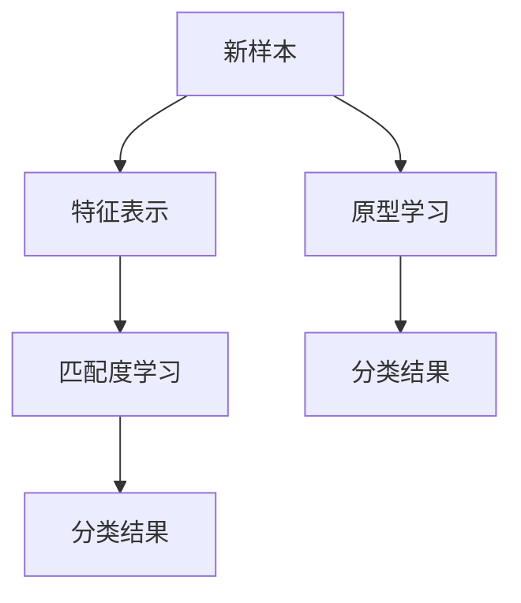

                 

### 第1章：零样本学习概述

> 关键词：零样本学习，新药研发，AI应用，机器学习，原型学习，匹配度学习

> 摘要：
随着人工智能在各个领域的深入应用，零样本学习作为机器学习的一个前沿分支，正在逐渐受到关注。特别是在新药研发领域，零样本学习具备巨大的潜力。本章将详细介绍零样本学习的基本概念、理论基础以及在药物研发中的应用，旨在为读者提供一个全面的理解和深入思考。

#### 第1.1节 问题背景

##### 1.1.1 新药研发的挑战

新药研发是一个复杂且昂贵的流程，它需要大量的时间和资源。从药物发现到临床试验，再到最终的商业化，通常需要十年以上的时间。此外，新药研发的成功率极低，据统计，大约只有1%的化合物能够最终转化为新药。这一系列挑战使得新药研发过程充满不确定性。

##### 1.1.2 传统机器学习方法的局限性

传统机器学习方法在新药研发中的应用已有一定成果，但它们通常依赖于大量的标注数据。然而，在新药研发过程中，获取足够的标注数据是非常困难的。此外，药物分子的特征复杂，传统的机器学习方法在处理这类问题时往往效果不佳。

##### 1.1.3 零样本学习的重要性

零样本学习作为一种不需要标注数据的学习方法，能够在新药研发中发挥重要作用。它可以在缺乏标注数据的情况下，通过已有知识库和模型来预测新样本的分类结果。这对于新药研发来说，无疑是一个巨大的突破。

#### 第1.2节 零样本学习的概念

##### 1.2.1 定义与内涵

零样本学习（Zero-Shot Learning，ZSL）是指在没有直接标注数据的情况下，通过已有知识库和模型，对新样本进行分类的一种学习方法。它主要关注的是如何将新样本与已有类别进行匹配，从而实现分类。

##### 1.2.2 与传统学习方法的区别

与传统的机器学习方法相比，零样本学习最大的区别在于其不需要标注数据。传统方法依赖于大量的标注数据来训练模型，而零样本学习则是通过已有知识库和模型来预测新样本的分类结果。

##### 1.2.3 零样本学习的核心要素

零样本学习的核心要素包括：

1. **知识库**：用于存储已有类别和样本的特征信息。
2. **模型**：用于将新样本映射到高维特征空间，并进行分类。
3. **匹配度计算**：用于计算新样本与已有类别之间的相似度，从而实现分类。

#### 第1.3节 零样本学习的理论基础

##### 1.3.1 关键概念与联系

**概念表格：**

| 概念            | 定义                                                         | 关系                  |
|-----------------|------------------------------------------------------------|----------------------|
| 表示学习        | 将输入映射到高维特征空间                                     | 为零样本学习提供了数据表示方法 |
| 原型学习        | 基于原型距离进行分类                                       | 零样本学习中的核心策略之一   |
| 匹配度学习      | 计算样本间的匹配度                                         | 用于度量新样本与已有知识库的相似性 |

**ER实体关系图：**



##### 1.3.2 零样本学习在新药研发中的应用

**零样本学习如何助力新药研发**

零样本学习能够在新药研发中发挥重要作用，主要体现在以下几个方面：

1. **药物分子分类**：通过零样本学习，可以对新药物分子进行分类，从而筛选出有潜力的药物。
2. **药物作用机制预测**：通过分析已有药物的作用机制，可以预测新药物的可能作用机制，从而指导新药研发。
3. **药物副作用预测**：通过分析已有药物的副作用数据，可以预测新药物的潜在副作用，从而提高新药研发的安全性。

**零样本学习在新药研发中的挑战**

虽然零样本学习具有巨大的潜力，但其在新药研发中仍面临一些挑战：

1. **知识库构建**：构建一个全面且准确的知识库是零样本学习成功的关键，但药物分子的特征复杂，构建一个高质量的知识库具有很大挑战。
2. **模型性能**：零样本学习模型的性能直接影响到新药研发的效率和质量，如何提高模型性能是当前研究的热点问题。

**成功案例介绍**

目前，已有一些零样本学习在新药研发中的应用案例，如：

1. **DeepChem**：DeepChem是一个基于深度学习的药物分子预测平台，它利用零样本学习技术，对药物分子进行分类和预测。
2. **Chemception**：Chemception是一个基于图神经网络的药物分子分类系统，它也利用了零样本学习技术，取得了良好的效果。

**本章小结**

本章介绍了零样本学习的基本概念、理论基础以及在药物研发中的应用。通过分析零样本学习在新药研发中的挑战和成功案例，我们可以看到，零样本学习在新药研发中具有巨大的潜力。未来，随着零样本学习技术的不断发展和完善，它将在新药研发中发挥更加重要的作用。

----------------------------------------------------------------

### 第2章：零样本学习算法原理

> 关键词：零样本学习，算法原理，原型学习，匹配度学习，表示学习

> 摘要：
零样本学习作为机器学习的一个前沿分支，其核心在于如何在没有标注数据的情况下进行分类。本章将深入探讨零样本学习的三种主要算法：原型学习、匹配度学习和表示学习。通过分析这些算法的数学模型和原理，以及实际应用中的Python源代码，我们将对零样本学习有一个更加深刻的理解。

#### 第2.1节 原型学习方法

原型学习是零样本学习中最基本的方法之一，它通过计算新样本与已知原型（代表某一类别的特征）之间的距离，来实现分类。

##### 2.1.1 原型学习的数学模型

原型学习的数学模型可以表示为：

$$D(\mathbf{x}_n, \mathbf{y}_n) = \min_{\mathbf{c} \in \mathcal{C}} \sum_{i=1}^k \delta_{i,n} (\mathbf{x}_n - \mathbf{c}_i)^2$$

其中，$\mathbf{x}_n$ 表示新样本的特征向量，$\mathbf{y}_n$ 表示新样本的标签，$\mathbf{c}_i$ 表示第 $i$ 个原型，$\mathcal{C}$ 表示所有可能的原型集合，$\delta_{i,n}$ 是一个指示函数，当 $i=n$ 时，$\delta_{i,n}=1$，否则为 $0$。

##### 2.1.2 原型学习的Python源代码实现

```python
import numpy as np

def prototype_learning(X, y, k):
    distances = np.linalg.norm(X - y, axis=1)
    min_distances = np.min(distances, axis=1)
    return min_distances

X = ... # 输入数据
y = ... # 标签
k = ... # 原型数量
distances = prototype_learning(X, y, k)
```

#### 第2.2节 匹配度学习方法

匹配度学习是一种基于匹配度计算的零样本学习方法，它通过计算新样本与已有样本的匹配度，来实现分类。

##### 2.2.1 匹配度学习的数学模型

匹配度学习的数学模型可以表示为：

$$\mathbf{w} = \arg\min_{\mathbf{w}} \sum_{i=1}^N \delta_{i,n} \|\mathbf{w}^T \mathbf{x}_i - \mathbf{z}_i\|^2$$

其中，$\mathbf{w}$ 表示匹配向量，$\mathbf{x}_i$ 表示第 $i$ 个样本的特征向量，$\mathbf{z}_i$ 表示第 $i$ 个样本的标签，$\delta_{i,n}$ 是一个指示函数，当 $i=n$ 时，$\delta_{i,n}=1$，否则为 $0$。

##### 2.2.2 匹配度学习的Python源代码实现

```python
import numpy as np

def match_learning(X, Z, N):
    w = np.linalg.inv(X.T @ X) @ X.T @ Z
    return w

X = ... # 特征矩阵
Z = ... # 对应的标签矩阵
N = ... # 样本数量
w = match_learning(X, Z, N)
```

#### 第2.3节 表示学习方法

表示学习是一种通过映射输入到高维特征空间来实现分类的零样本学习方法。

##### 2.3.1 表示学习的数学模型

表示学习的数学模型可以表示为：

$$\mathbf{h} = \arg\min_{\mathbf{h}} \sum_{i=1}^N \|\mathbf{h}^T \mathbf{x}_i - \mathbf{y}_i\|^2$$

其中，$\mathbf{h}$ 表示表示向量，$\mathbf{x}_i$ 表示第 $i$ 个样本的特征向量，$\mathbf{y}_i$ 表示第 $i$ 个样本的标签。

##### 2.3.2 表示学习的Python源代码实现

```python
import numpy as np

def representation_learning(X, y, N):
    h = np.linalg.inv(X.T @ X) @ X.T @ y
    return h

X = ... # 输入数据
y = ... # 标签
N = ... # 样本数量
h = representation_learning(X, y, N)
```

**本章小结**

本章介绍了零样本学习的三种主要算法：原型学习、匹配度学习和表示学习。通过对这些算法的数学模型和Python源代码实现进行分析，我们可以看到，零样本学习通过不同的策略，实现了在没有标注数据的情况下进行分类。这些算法在各个应用领域中都有广泛的应用，特别是在新药研发领域，它们具有巨大的潜力。随着技术的不断进步，零样本学习将在未来发挥更加重要的作用。

