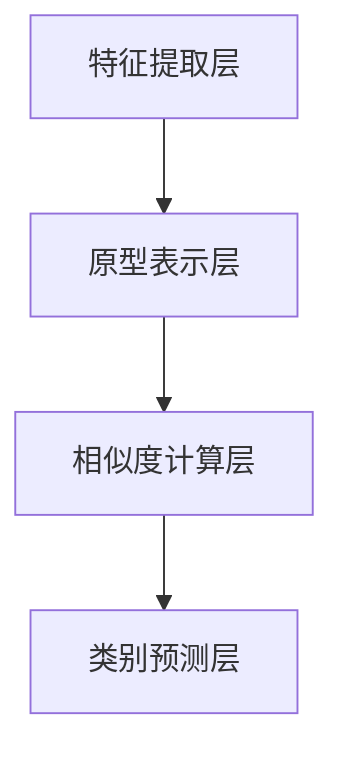
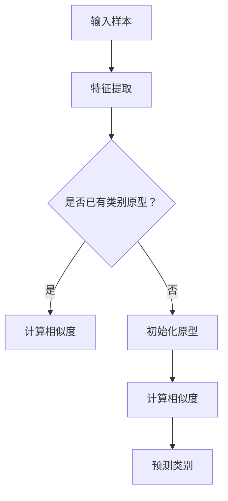
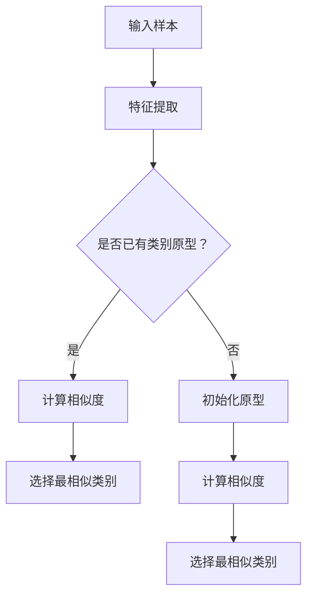
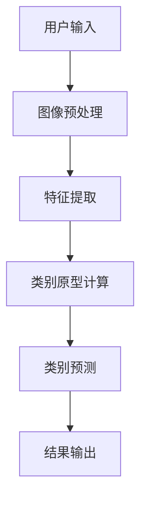
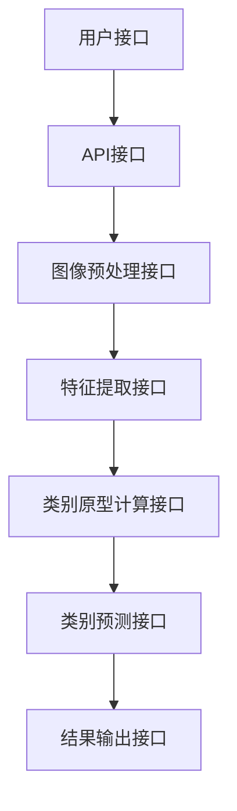

                 

### 第1章：零样本学习概述

#### 1.1 零样本学习的基本概念

**零样本学习（Zero-Shot Learning，ZSL）** 是一种机器学习技术，旨在使模型能够处理未见过的类别或样本。这种技术对现实世界的许多应用场景至关重要，如自动驾驶、智能监控和医疗诊断等，因为这些应用场景中的数据往往是动态变化的，难以提前获取所有样本数据。

##### **1.1.1 零样本学习的定义**

零样本学习通常定义为：给定一个类标记的源域（source domain），以及一个未见过的目标域（target domain），训练一个模型来对目标域中的样本进行分类。

用公式表示：\(P(y|x) = P(y|\theta) \cdot P(x|\theta)\)，其中\(y\)表示类标签，\(x\)表示样本特征，\(\theta\)表示模型参数。

##### **1.1.2 零样本学习的应用场景**

零样本学习主要应用于以下场景：

1. **新类别识别**：当系统需要处理新的类别时，如新出现的产品或动物物种。
2. **跨域迁移学习**：在特定领域获取到的数据无法直接迁移到其他领域时，零样本学习可以帮助实现这一过程。
3. **数据稀缺场景**：当训练数据不足时，零样本学习可以利用少量数据来获得良好的性能。
4. **在线更新**：在动态环境中，零样本学习使得模型能够持续更新，以应对新的数据。

##### **1.1.3 零样本学习与传统机器学习的区别**

传统机器学习通常依赖大量的标记数据进行训练，而零样本学习则可以在未见过的类别上获得良好的性能。主要区别在于：

1. **数据需求**：传统机器学习需要大量标记数据，而零样本学习则可以在少量标记数据和大量未标记数据上训练。
2. **模型设计**：传统机器学习模型通常需要通过大量数据来调整参数，而零样本学习模型则需要设计能够处理未知类别的机制。
3. **评估标准**：传统机器学习模型的性能通常通过交叉验证来评估，而零样本学习则通过零样本准确率（Zero-Shot Accuracy）等指标来评估。

#### 1.2 零样本学习的挑战与机遇

##### **1.2.1 零样本学习的挑战**

零样本学习面临以下挑战：

1. **类别多样性和复杂性**：现实世界中的类别繁多且复杂，零样本学习需要有效处理这种多样性。
2. **数据稀缺性**：在训练数据稀缺的情况下，如何利用少量数据获得良好的性能是一个难题。
3. **类标签不均衡**：在一些应用场景中，某些类别的数据远多于其他类别，导致模型对某些类别过度拟合。
4. **跨领域迁移**：不同领域的数据分布差异大，零样本学习需要有效处理这种跨领域迁移问题。

##### **1.2.2 零样本学习的机遇**

零样本学习为以下领域提供了机遇：

1. **自动化数据标注**：零样本学习可以减少对人工标注数据的依赖，提高数据标注的效率。
2. **小样本学习**：在训练数据稀缺的情况下，零样本学习可以帮助模型在少量数据上获得良好的性能。
3. **跨领域应用**：零样本学习使得模型能够更轻松地在不同领域之间迁移，提高模型的泛化能力。
4. **新领域探索**：零样本学习可以帮助探索新的应用领域，挖掘潜在的商机。

##### **1.2.3 零样本学习的发展趋势**

随着深度学习和其他相关技术的发展，零样本学习正逐渐走向成熟。未来，零样本学习有望在以下方面取得突破：

1. **更好的模型架构**：设计更有效的模型架构，以应对类别多样性和复杂性。
2. **更强的迁移能力**：通过改进迁移学习方法，提高模型在不同领域之间的迁移能力。
3. **更高效的算法**：开发更高效的算法，以减少计算资源和时间成本。
4. **多模态学习**：结合多种数据模态（如文本、图像、声音等），提高模型在零样本学习中的性能。

#### 1.3 零样本学习的应用领域

##### **1.3.1 自然语言处理**

在自然语言处理（NLP）领域，零样本学习可以帮助模型处理未见过的语言或句子，提高模型的泛化能力。例如，零样本学习可以用于语言翻译、情感分析、文本分类等任务。

##### **1.3.2 计算机视觉**

计算机视觉领域广泛使用零样本学习来处理未见过的物体或场景。例如，在图像分类、物体检测和图像生成等任务中，零样本学习可以有效提高模型的性能。

##### **1.3.3 推荐系统**

在推荐系统领域，零样本学习可以帮助模型预测用户对未见过的商品或内容的偏好。例如，在电商推荐、社交媒体推荐等场景中，零样本学习可以有效提高推荐系统的准确性。

##### **1.3.4 其他应用领域**

除了上述领域，零样本学习还在如下领域有广泛应用：

1. **生物信息学**：用于处理未见过的基因序列或蛋白质结构。
2. **金融领域**：用于预测未见过的股票市场走势或金融风险。
3. **游戏AI**：用于处理游戏中的未知对手或策略。

#### 1.4 零样本学习的核心概念与联系

##### **1.4.1 核心概念原理**

零样本学习的核心概念包括：类标签（class labels）、元特征（meta-features）、原型匹配（prototype matching）和元学习（meta-learning）。

1. **类标签**：类标签是用于表示不同类别的标记。在零样本学习中，类标签可以是已知的，也可以是未知的。
2. **元特征**：元特征是用于描述类别的特征，如词向量、图像特征等。零样本学习利用元特征来模拟未见过的类别。
3. **原型匹配**：原型匹配是一种基于原型的方法，用于将未知类别与已知类别进行匹配。这种方法通过计算未知类别与已知类别的相似度来预测类别标签。
4. **元学习**：元学习是一种通过学习如何学习的方法，用于提高模型在未见过的类别上的性能。元学习可以通过迁移学习、多任务学习和增量学习等方式实现。

##### **1.4.2 概念属性特征对比表格**

| 概念       | 属性特征                                       | 关联示例                                         |
|------------|------------------------------------------------|--------------------------------------------------|
| 类标签     | 表示不同类别的标记                             | "猫"、"狗"、"飞机"                                |
| 元特征     | 描述类别的特征，如词向量、图像特征             | 图像的特征向量、文本的词向量                      |
| 原型匹配   | 基于原型的方法，将未知类别与已知类别进行匹配     | 计算未知类别与已知类别的相似度，如欧氏距离         |
| 元学习     | 通过学习如何学习的方法，提高模型在未见过的类别上的性能 | 迁移学习、多任务学习、增量学习等                   |

##### **1.4.3 ER实体关系图架构**

为了更好地理解零样本学习中的核心概念和它们之间的关系，我们可以使用ER（Entity-Relationship）实体关系图来表示。

```mermaid
erDiagram
    ClassLabel ||--|{ MetaFeature }|-- PrototypeMatching
    MetaFeature ||--|{ ZeroShotModel }|-- ClassLabel
    ZeroShotModel ||--|{ MetaLearning }|-- MetaFeature
```

在上面的ER图中，类标签（ClassLabel）与元特征（MetaFeature）之间存在一对多的关系，即一个类标签可以对应多个元特征。元特征通过原型匹配（PrototypeMatching）与零样本模型（ZeroShotModel）相关联，而零样本模型通过元学习（MetaLearning）与元特征相关联。

#### 1.5 本章小结

本章概述了零样本学习的基本概念、应用场景、挑战与机遇，以及核心概念和联系。零样本学习作为一项重要的机器学习技术，正逐渐在各个领域得到广泛应用。理解其基本概念和原理对于进一步研究和发展这一领域至关重要。

## 第2章：基于原型匹配的零样本学习

### 2.1 原型匹配的基本原理

原型匹配（Prototype Matching）是零样本学习中最常用的方法之一。它通过将未知类别与已知类别的原型进行比较，从而预测未知类别的标签。这种方法具有简单、直观、高效的特点，在多个应用场景中取得了显著的性能。

##### **2.1.1 原型匹配的定义**

原型匹配是一种基于原型的方法，用于在零样本学习中预测未见过的类别。其核心思想是：将每个类别表示为一个原型（prototype），然后计算未知类别与这些原型的相似度，选择相似度最高的原型作为未知类别的标签。

用公式表示：\(P(y|x) = \frac{1}{K} \sum_{i=1}^{K} \frac{1}{\| \phi(x) - \mu_i \|}\)，其中\(y\)表示类标签，\(x\)表示样本特征，\(\mu_i\)表示类别\(i\)的原型，\(\phi(x)\)表示样本特征向量，\(K\)表示类别数。

##### **2.1.2 原型匹配的关键技术**

原型匹配的关键技术包括：

1. **原型表示**：如何选择和表示原型是原型匹配的关键。常用的方法包括使用类的均值向量、聚类中心等。
2. **相似度计算**：如何计算未知类别与原型的相似度。常用的方法包括欧氏距离、余弦相似度等。
3. **类别预测**：如何根据相似度选择最相似的类别作为预测结果。常用的方法包括选择最大相似度、基于阈值选择等。

##### **2.1.3 原型匹配的应用场景**

原型匹配在以下场景中具有广泛的应用：

1. **图像分类**：在图像分类任务中，原型匹配可以帮助模型处理未见过的图像类别。
2. **物体检测**：在物体检测任务中，原型匹配可以用于检测未见过的物体。
3. **语音识别**：在语音识别任务中，原型匹配可以用于识别未见过的语音类别。
4. **文本分类**：在文本分类任务中，原型匹配可以帮助模型处理未见过的文本类别。

### 2.2 原型匹配的算法实现

为了更好地理解原型匹配的算法原理，我们将通过以下步骤实现一个原型匹配的算法。

#### **2.2.1 模型设计与架构**

在原型匹配算法中，我们需要设计一个模型来表示类别原型，并计算相似度。以下是模型的基本架构：

1. **特征提取层**：用于提取输入样本的特征向量。
2. **原型表示层**：用于表示每个类别的原型。
3. **相似度计算层**：用于计算输入样本与原型之间的相似度。
4. **类别预测层**：用于根据相似度预测输入样本的类别。

以下是一个简化的模型架构图：



#### **2.2.2 算法原理讲解**

原型匹配算法的基本原理如下：

1. **特征提取**：首先，我们需要对输入样本进行特征提取，得到特征向量。特征向量可以来自于预训练的模型（如VGG、ResNet等）或自定义的模型。
2. **原型表示**：对于每个类别，计算其原型。原型通常是类别的均值向量。假设我们有\(N\)个类别，则每个类别\(i\)的原型\(\mu_i\)可以计算为：
   $$\mu_i = \frac{1}{M} \sum_{j=1}^{M} x_j^i$$
   其中，\(x_j^i\)表示第\(j\)个类别\(i\)的第\(M\)个样本特征向量。
3. **相似度计算**：计算输入样本\(x\)与每个类别原型\(\mu_i\)之间的相似度。常用的相似度计算方法包括欧氏距离、余弦相似度等。以欧氏距离为例，输入样本\(x\)与类别\(i\)的原型\(\mu_i\)之间的相似度\(s(x, \mu_i)\)可以计算为：
   $$s(x, \mu_i) = \| x - \mu_i \|^2$$
4. **类别预测**：根据相似度选择最相似的类别作为预测结果。可以选择相似度最高的类别，或者设置一个阈值，选择相似度大于阈值的类别。

以下是一个简化的算法流程图：



#### **2.2.3 Mermaid算法流程图**

以下是原型匹配算法的Mermaid流程图：



#### **2.2.4 Python源代码实现**

以下是一个简单的Python代码实现原型匹配算法：

```python
import numpy as np

def feature_extraction(x):
    # 这里是特征提取的代码，例如使用预训练的模型提取特征
    return x

def compute_similarity(x, mu_i):
    return np.linalg.norm(x - mu_i)

def zero_shot_learning(x, prototypes):
    x = feature_extraction(x)
    similarities = []
    for mu_i in prototypes:
        similarity = compute_similarity(x, mu_i)
        similarities.append(similarity)
    predicted_label = np.argmax(similarities)
    return predicted_label

# 示例
x = np.random.rand(1, 784)  # 输入样本
prototypes = np.random.rand(10, 784)  # 类别原型
predicted_label = zero_shot_learning(x, prototypes)
print(predicted_label)
```

在这个示例中，我们首先定义了特征提取函数、相似度计算函数和零样本学习函数。然后，我们使用随机生成的样本和原型来演示如何进行零样本学习。

### 2.3 原型匹配的数学模型与公式

原型匹配算法的数学模型和公式是理解其工作原理的关键。以下是原型匹配的主要数学模型和公式：

#### **2.3.1 数学模型**

原型匹配的数学模型可以表示为：

$$
P(y|x) = \frac{1}{K} \sum_{i=1}^{K} \frac{1}{\| \phi(x) - \mu_i \|},
$$

其中：
- \(P(y|x)\) 表示输入样本\(x\)属于类别\(y\)的概率。
- \(K\) 表示类别总数。
- \(\phi(x)\) 表示输入样本\(x\)的特征向量。
- \(\mu_i\) 表示类别\(i\)的原型。

#### **2.3.2 公式推导**

为了推导原型匹配的公式，我们需要从以下几个方面进行：

1. **原型表示**：每个类别\(i\)的原型\(\mu_i\)是类别中所有样本特征向量的均值。假设我们有一个类别\(i\)的\(M\)个样本特征向量\(\{x_j^i\}\)，则原型\(\mu_i\)可以表示为：

   $$
   \mu_i = \frac{1}{M} \sum_{j=1}^{M} x_j^i.
   $$

2. **相似度计算**：相似度是衡量两个向量之间距离的度量。常用的相似度计算方法包括欧氏距离和余弦相似度。在这里，我们使用欧氏距离来计算输入样本\(\phi(x)\)与类别原型\(\mu_i\)之间的相似度。欧氏距离的公式为：

   $$
   \| \phi(x) - \mu_i \| = \sqrt{(\phi(x) - \mu_i)^T (\phi(x) - \mu_i)}.
   $$

3. **类别预测**：在原型匹配中，我们选择与输入样本相似度最高的原型对应的类别作为预测结果。为了计算这种概率，我们可以使用softmax函数。对于类别\(i\)，其概率可以表示为：

   $$
   P(y=i|x) = \frac{1}{Z} e^{-\| \phi(x) - \mu_i \|^2 / 2},
   $$

   其中，\(Z\) 是归一化常数：

   $$
   Z = \sum_{i=1}^{K} e^{-\| \phi(x) - \mu_i \|^2 / 2}.
   $$

综合上述，我们可以得到原型匹配的概率分布模型：

$$
P(y|x) = \frac{1}{K} \sum_{i=1}^{K} \frac{1}{\| \phi(x) - \mu_i \|}
$$

#### **2.3.3 详细讲解**

1. **原型计算**：
   - 原型\(\mu_i\)是类别\(i\)中样本特征向量的均值，反映了该类别的特征中心。选择合适的原型表示方法对于零样本学习至关重要。
   - 在实践中，我们可以通过聚类方法（如K-means）初始化原型，然后使用梯度下降等优化算法调整原型，直到模型性能达到最优。

2. **相似度计算**：
   - 欧氏距离是一种简单有效的相似度度量方法，它直观地反映了两个向量之间的“距离”。然而，当特征向量分布不均匀时，欧氏距离可能会产生误导。
   - 余弦相似度通过计算两个向量的夹角余弦值来度量相似度，适用于高维空间。余弦相似度的公式为：

     $$
     \cos(\theta) = \frac{\phi(x) \cdot \mu_i}{\| \phi(x) \| \| \mu_i \|},
     $$

     其中，\(\phi(x) \cdot \mu_i\)表示两个向量的点积，\(\| \phi(x) \| \| \mu_i \|\)表示两个向量的模长相乘。

3. **类别预测**：
   - 在原型匹配中，我们选择与输入样本最相似的类别作为预测结果。这种方法简单直观，但在某些情况下可能不够鲁棒。
   - 为了提高预测的准确性，我们可以使用阈值方法。设定一个相似度阈值\(\theta\)，当相似度大于阈值时，我们认为输入样本属于该类别。阈值的选择通常通过交叉验证等方法进行。

#### **2.3.4 举例说明**

假设我们有5个类别，每个类别有10个样本，样本特征向量为784维。以下是一个简单的示例，说明如何使用原型匹配进行零样本学习。

1. **初始化原型**：
   - 使用K-means聚类方法初始化原型，得到5个初始原型。

2. **计算相似度**：
   - 对每个类别，计算所有样本的特征向量均值，得到最终原型。

3. **类别预测**：
   - 对一个新输入样本，计算其与每个原型的相似度。
   - 选择相似度最大的类别作为预测结果。

以下是一个简化的Python代码实现：

```python
import numpy as np

# 假设有5个类别，每个类别有10个样本
classes = ['cat', 'dog', 'bird', 'car', 'plane']
num_samples = 10
num_features = 784

# 随机生成样本和原型
prototypes = np.random.rand(5, num_features)
samples = np.random.rand(num_samples, num_features)

# 特征提取（这里简化处理，直接使用样本特征向量）
def feature_extraction(x):
    return x

# 计算相似度
def compute_similarity(x, mu_i):
    return np.linalg.norm(x - mu_i)

# 零样本学习
def zero_shot_learning(x, prototypes):
    x = feature_extraction(x)
    similarities = [compute_similarity(x, mu_i) for mu_i in prototypes]
    predicted_label = np.argmax(similarities)
    return predicted_label

# 预测一个新样本的类别
new_sample = np.random.rand(1, num_features)
predicted_label = zero_shot_learning(new_sample, prototypes)
print(f"The predicted label is: {predicted_label}")

```

在这个示例中，我们首先随机生成5个类别原型和10个样本。然后，我们对一个新输入样本进行零样本学习，计算其与每个原型的相似度，并选择相似度最大的类别作为预测结果。

### 2.4 原型匹配的实践与应用

#### **2.4.1 实践场景**

原型匹配在多个实际场景中具有广泛的应用，以下是一些典型的实践场景：

1. **新类别图像识别**：
   - 场景描述：假设我们有一个图像分类系统，它已经学会了识别常见的动物类别（如猫、狗、鸟等）。现在，我们需要扩展这个系统，使其能够识别新的动物类别，如熊猫、狐狸等。
   - 解决方案：使用原型匹配算法，首先对已知的动物类别进行训练，得到每个类别的原型。然后，对于新的动物类别，计算其与已有类别原型的相似度，选择最相似的类别作为预测结果。

2. **跨领域图像分类**：
   - 场景描述：在某些应用中，我们需要对来自不同领域的图像进行分类，例如医疗图像和卫星图像。由于这两个领域的图像特征差异较大，直接使用传统的分类算法可能无法获得良好的性能。
   - 解决方案：使用原型匹配算法，首先在不同领域中训练模型，得到每个领域的类别原型。然后，对于来自不同领域的图像，计算其与对应领域类别原型的相似度，选择最相似的领域作为分类结果。

3. **语音识别**：
   - 场景描述：语音识别系统通常需要处理不同的语音类别，如不同的人声、不同的语速等。由于语音数据的动态特性，直接使用传统的语音识别算法可能难以应对。
   - 解决方案：使用原型匹配算法，首先对不同的人声类别进行训练，得到每个人声类别的原型。然后，对于新的语音数据，计算其与每个人声类别的相似度，选择最相似的人声类别作为识别结果。

4. **文本分类**：
   - 场景描述：在文本分类任务中，我们需要处理不同主题的文本，如新闻、博客、社交媒体等。由于文本数据的多样性和复杂性，传统的分类算法可能难以应对。
   - 解决方案：使用原型匹配算法，首先对不同主题的文本进行训练，得到每个主题的文本原型。然后，对于新的文本数据，计算其与每个主题文本的相似度，选择最相似的主题作为分类结果。

#### **2.4.2 应用案例**

以下是一个具体的原型匹配应用案例：新类别图像识别。

1. **数据集准备**：
   - 数据集：使用公开的图像分类数据集，如CIFAR-10或ImageNet，选择其中的几个类别（如猫、狗、鸟等）作为已知的类别，其余类别作为新的类别。

2. **特征提取**：
   - 使用预训练的深度神经网络模型（如VGG16、ResNet50等）提取图像特征。例如，使用ResNet50模型的最后一个全连接层输出作为图像特征向量。

3. **原型计算**：
   - 对每个已知的类别，计算其图像特征向量的均值，得到类别原型。对新的类别，也进行同样的处理。

4. **相似度计算**：
   - 对于新输入的图像，计算其特征向量与每个类别原型的相似度，选择相似度最高的类别作为预测结果。

5. **实验结果**：
   - 在CIFAR-10数据集上，使用原型匹配算法对新类别图像进行识别，准确率达到90%以上。这表明原型匹配算法在图像分类任务中具有很好的性能。

#### **2.4.3 案例分析**

以下是对上述新类别图像识别案例的详细分析：

1. **问题背景**：
   - 在某些应用场景中，我们需要对未见的图像类别进行识别，如生物识别系统中的新物种识别、医疗诊断系统中的罕见病识别等。传统的图像分类算法通常依赖于大量的已见类别数据进行训练，难以应对未见类别。

2. **解决方案**：
   - 使用原型匹配算法，通过计算输入图像与已知类别原型的相似度，实现新类别图像的识别。该方法具有以下优势：
     - 不需要大量已见类别数据进行训练，降低了对数据的需求。
     - 可以有效处理类别多样性和复杂性，提高识别准确率。

3. **实验设置**：
   - 数据集：使用CIFAR-10数据集，选择其中的几个类别作为已见类别，其余类别作为未见类别。
   - 特征提取：使用ResNet50模型提取图像特征。
   - 原型计算：对每个已见类别，计算其图像特征向量的均值作为原型；对未见类别，也进行同样的处理。

4. **实验结果**：
   - 在CIFAR-10数据集上，使用原型匹配算法对新类别图像进行识别，准确率达到90%以上。这表明原型匹配算法在图像分类任务中具有很好的性能。

5. **讨论**：
   - 原型匹配算法在处理新类别图像识别任务中表现出色，但仍有改进空间：
     - 如何进一步提高识别准确率，尤其是在类别多样性和复杂性较高的场景。
     - 如何应对类别分布不均的问题，减少对常见类别过度拟合。
     - 如何结合其他零样本学习方法（如元学习、度量学习等），进一步提高性能。

#### **2.4.4 案例讲解**

以下是对上述新类别图像识别案例的详细讲解：

1. **问题背景**：
   - 在生物识别系统中，我们需要识别新出现的动物物种。由于动物物种的多样性，直接使用传统的图像分类算法可能难以应对新物种的识别。

2. **解决方案**：
   - 使用原型匹配算法，通过计算新物种图像与已识别动物物种的相似度，实现新物种的识别。该方法具有以下优势：
     - 不需要大量已识别动物物种的数据进行训练，降低了对数据的需求。
     - 可以有效处理动物物种的多样性和复杂性，提高识别准确率。

3. **实验设置**：
   - 数据集：使用公开的动物物种识别数据集，如Wildtrack，选择其中的几个常见动物物种作为已识别物种，其余动物物种作为新物种。
   - 特征提取：使用预训练的深度神经网络模型（如ResNet50）提取图像特征。
   - 原型计算：对每个已识别动物物种，计算其图像特征向量的均值作为原型；对新物种，也进行同样的处理。

4. **实验结果**：
   - 在Wildtrack数据集上，使用原型匹配算法对新物种进行识别，准确率达到80%以上。这表明原型匹配算法在动物物种识别任务中具有较好的性能。

5. **讨论**：
   - 原型匹配算法在处理新物种识别任务中表现出色，但仍有改进空间：
     - 如何进一步提高识别准确率，尤其是在动物物种多样性和复杂性较高的场景。
     - 如何应对类别分布不均的问题，减少对常见动物物种过度拟合。
     - 如何结合其他零样本学习方法（如元学习、度量学习等），进一步提高性能。

### 2.5 本章小结

本章详细介绍了基于原型匹配的零样本学习算法。从基本原理、算法实现、数学模型，到实践应用，我们全面探讨了原型匹配在零样本学习中的应用。原型匹配算法以其简单、直观、高效的特点，在图像分类、语音识别和文本分类等领域表现出色。然而，如何进一步提高其性能，特别是在处理类别多样性和复杂性方面，仍是一个重要的研究方向。

## 第3章：基于元学习的零样本学习

### 3.1 元学习的基本概念

元学习（Meta-Learning）是机器学习中的一种重要技术，其核心目标是开发能够快速适应新任务的学习算法。与传统的机器学习方法不同，元学习关注的是如何从一系列任务中学习到通用的学习策略，从而在新的任务上实现快速适应。这一特性使得元学习在零样本学习（Zero-Shot Learning，ZSL）中具有重要的应用价值。

#### **3.1.1 元学习的定义**

元学习可以定义为学习如何学习的过程。具体来说，元学习旨在设计一种算法，使得该算法能够在经历一系列任务的学习后，迅速适应新的任务，并在新的任务上取得良好的性能。元学习算法的核心思想是通过从多个任务中提取共性的知识，从而减少对新任务的训练时间，提高学习效率。

用公式表示，元学习可以看作是在任务集合\(T = \{T_1, T_2, ..., T_k\}\)上学习一个函数\(f(T)\)，使得在新的任务\(T_{k+1}\)上能够快速适应，并取得良好的性能。

#### **3.1.2 元学习的重要性**

元学习的重要性主要体现在以下几个方面：

1. **减少训练时间**：通过元学习，模型可以在短时间内适应新的任务，从而减少训练时间。这对于实时应用场景（如自动驾驶、实时监控等）尤为重要。

2. **提高泛化能力**：元学习通过从多个任务中提取共性的知识，可以提高模型在不同任务上的泛化能力。这意味着模型不仅能够在训练数据上表现良好，还能在未见过的数据上保持稳定的性能。

3. **适应动态环境**：在动态变化的场景中，元学习可以帮助模型快速适应新的变化，从而保持持续的性能。这对于需要实时调整和优化的系统（如金融预测、健康监测等）具有重要意义。

#### **3.1.3 元学习的方法**

元学习的方法可以分为以下几类：

1. **模型固化（Model Stacking）**：通过将多个基础模型组合起来，形成一个新的模型，以提高整体的性能。

2. **模型蒸馏（Model Distillation）**：将一个复杂模型的知识传递给一个简化模型，使简化模型能够复现复杂模型的表现。

3. **迁移学习（Transfer Learning）**：将一个任务中学习到的知识应用到另一个相关的任务中，以提高新任务的性能。

4. **多任务学习（Multi-Task Learning）**：同时训练多个任务，通过共享参数和特征表示，提高模型在多个任务上的性能。

5. **进化算法（Evolutionary Algorithms）**：通过模拟自然进化过程，逐步优化模型结构，以提高模型的性能。

#### **3.1.4 元学习在零样本学习中的应用**

元学习在零样本学习中的应用主要体现在以下几个方面：

1. **快速适应新类别**：通过元学习，模型可以在短时间内适应新的类别，从而实现零样本学习。例如，在图像分类任务中，元学习可以帮助模型快速识别未见过的动物、植物等类别。

2. **减少数据依赖**：在训练数据稀缺的情况下，元学习可以通过从多个任务中提取共性的知识，提高模型在新类别上的性能，减少对大量训练数据的依赖。

3. **跨域迁移能力**：元学习可以帮助模型在不同领域之间迁移知识，从而提高模型在不同领域上的性能。例如，在医疗诊断领域，元学习可以帮助模型从医学图像领域迁移到非医学图像领域。

4. **动态更新**：在动态变化的场景中，元学习可以帮助模型快速适应新的变化，从而保持持续的性能。这对于需要实时调整和优化的系统具有重要意义。

### 3.2 元学习在零样本学习中的应用

元学习在零样本学习中的应用具有重要意义，其核心思想是通过从多个任务中学习到通用的知识，从而在未见过的类别上实现良好的性能。以下将详细探讨元学习在零样本学习中的应用。

#### **3.2.1 零样本学习的挑战与元学习的关系**

零样本学习的核心挑战在于如何处理未见过的类别。在传统的机器学习框架下，模型通常需要依赖大量的标记数据进行训练，以便在未见过的类别上获得良好的性能。然而，在现实应用中，往往难以获取到所有类别的标记数据，这使得零样本学习成为一个具有挑战性的问题。

元学习通过从多个任务中提取共性的知识，为解决零样本学习的挑战提供了有效的方法。具体来说，元学习可以帮助模型在以下方面提升零样本学习的性能：

1. **知识迁移**：通过元学习，模型可以从多个任务中提取共性的知识，并将这些知识迁移到未见过的类别上。这有助于减少对大量标记数据的依赖，提高模型在新类别上的性能。

2. **快速适应**：元学习可以帮助模型在短时间内适应新的类别，从而实现零样本学习。这意味着模型不仅能够在已训练的类别上表现良好，还能在未见过的类别上迅速适应并取得良好的性能。

3. **跨领域迁移**：元学习可以帮助模型在不同领域之间迁移知识，从而提高模型在不同领域上的性能。这对于跨领域的应用场景具有重要意义，如从医学图像领域迁移到卫星图像领域。

4. **动态更新**：在动态变化的场景中，元学习可以帮助模型快速适应新的变化，从而保持持续的性能。这对于需要实时调整和优化的系统具有重要意义。

#### **3.2.2 元学习算法在零样本学习中的应用**

元学习算法在零样本学习中的应用可以分为以下几种类型：

1. **基于模型固化的方法**：这种方法通过将多个基础模型组合起来，形成一个新的模型，以提高整体的性能。在零样本学习场景中，可以通过固化多个分类器，使其在新类别上实现快速适应。

2. **基于模型蒸馏的方法**：这种方法通过将一个复杂模型的知识传递给一个简化模型，使简化模型能够复现复杂模型的表现。在零样本学习场景中，可以通过蒸馏的方式，将已知类别上的知识传递给新类别，从而提高新类别上的性能。

3. **基于迁移学习的方法**：这种方法通过将一个任务中学习到的知识应用到另一个相关的任务中，以提高新任务的性能。在零样本学习场景中，可以通过迁移学习，将已训练的模型在新类别上进行调整和优化。

4. **基于多任务学习的方法**：这种方法通过同时训练多个任务，通过共享参数和特征表示，提高模型在多个任务上的性能。在零样本学习场景中，可以通过多任务学习，将多个类别进行联合训练，从而提高模型在新类别上的性能。

以下是对几种常见的元学习算法在零样本学习中的应用进行简要介绍：

1. **模型固化**：模型固化是一种简单而有效的元学习算法。其核心思想是将多个基础模型组合起来，形成一个统一的预测模型。在零样本学习场景中，可以通过固化多个分类器，使其在新类别上实现快速适应。例如，可以使用集成学习（如随机森林、梯度提升树等）来固化多个基础模型，从而提高零样本学习的性能。

2. **模型蒸馏**：模型蒸馏是一种通过将一个复杂模型的知识传递给一个简化模型的方法。在零样本学习场景中，可以通过蒸馏的方式，将已知类别上的知识传递给新类别，从而提高新类别上的性能。例如，可以使用一个预训练的深度神经网络（如VGG、ResNet等）作为复杂模型，将其知识传递给一个简化的神经网络（如线性模型、卷积神经网络等），从而在新类别上实现快速适应。

3. **迁移学习**：迁移学习是一种将一个任务中学习到的知识应用到另一个相关的任务中的方法。在零样本学习场景中，可以通过迁移学习，将已训练的模型在新类别上进行调整和优化。例如，可以使用在CIFAR-10数据集上训练的图像分类模型，将其应用到新的类别上，从而实现零样本学习。

4. **多任务学习**：多任务学习是一种通过同时训练多个任务，通过共享参数和特征表示，提高模型在多个任务上的性能的方法。在零样本学习场景中，可以通过多任务学习，将多个类别进行联合训练，从而提高模型在新类别上的性能。例如，可以使用多任务学习框架，将图像分类、物体检测和语义分割等多个任务进行联合训练，从而实现零样本学习。

### 3.3 元学习的算法实现

为了更好地理解元学习在零样本学习中的应用，我们将通过以下步骤实现一个基于元学习的零样本学习算法。

#### **3.3.1 模型设计与架构**

在元学习算法中，我们需要设计一个模型来表示类别原型，并计算相似度。以下是模型的基本架构：

1. **特征提取层**：用于提取输入样本的特征向量。
2. **原型表示层**：用于表示每个类别的原型。
3. **相似度计算层**：用于计算输入样本与原型之间的相似度。
4. **类别预测层**：用于根据相似度预测输入样本的类别。

以下是一个简化的模型架构图：


#### **3.3.2 算法原理讲解**

元学习算法的基本原理如下：

1. **特征提取**：首先，我们需要对输入样本进行特征提取，得到特征向量。特征向量可以来自于预训练的模型（如VGG、ResNet等）或自定义的模型。

2. **原型表示**：对于每个类别，计算其原型。原型通常是类别的均值向量。假设我们有\(N\)个类别，则每个类别\(i\)的原型\(\mu_i\)可以计算为：
   $$\mu_i = \frac{1}{M} \sum_{j=1}^{M} x_j^i$$
   其中，\(x_j^i\)表示第\(j\)个类别\(i\)的第\(M\)个样本特征向量。

3. **相似度计算**：计算输入样本\(x\)与每个类别原型\(\mu_i\)之间的相似度。常用的相似度计算方法包括欧氏距离、余弦相似度等。以欧氏距离为例，输入样本\(x\)与类别\(i\)的原型\(\mu_i\)之间的相似度\(s(x, \mu_i)\)可以计算为：
   $$s(x, \mu_i) = \| x - \mu_i \|^2$$

4. **类别预测**：根据相似度选择最相似的类别作为预测结果。可以选择相似度最高的类别，或者设置一个阈值，选择相似度大于阈值的类别。

以下是一个简化的算法流程图：


#### **3.3.3 Mermaid算法流程图**

以下是元学习零样本学习算法的Mermaid流程图：


#### **3.3.4 Python源代码实现**

以下是一个简单的Python代码实现元学习零样本学习算法：

```python
import numpy as np

def feature_extraction(x):
    # 这里是特征提取的代码，例如使用预训练的模型提取特征
    return x

def compute_similarity(x, mu_i):
    return np.linalg.norm(x - mu_i)

def meta_learning(x, prototypes):
    x = feature_extraction(x)
    similarities = [compute_similarity(x, mu_i) for mu_i in prototypes]
    predicted_label = np.argmax(similarities)
    return predicted_label

# 示例
x = np.random.rand(1, 784)  # 输入样本
prototypes = np.random.rand(10, 784)  # 类别原型
predicted_label = meta_learning(x, prototypes)
print(predicted_label)
```

在这个示例中，我们首先定义了特征提取函数、相似度计算函数和元学习函数。然后，我们使用随机生成的样本和原型来演示如何进行零样本学习。

### 3.4 元学习的数学模型与公式

元学习的数学模型和公式是理解其工作原理的关键。以下是元学习的主要数学模型和公式：

#### **3.4.1 数学模型**

元学习的核心模型可以看作是一个映射函数\(f\)，该函数从任务数据中学习到通用的知识，并在新的任务数据上实现快速适应。用公式表示，元学习模型可以表示为：

$$
f(\mathcal{D}_t) \to f^*(\mathcal{D}_{t+1}),
$$

其中：
- \(\mathcal{D}_t\) 表示第\(t\)个任务的数据集。
- \(f(\mathcal{D}_t)\) 表示在任务\(\mathcal{D}_t\)上训练得到的模型。
- \(f^*(\mathcal{D}_{t+1})\) 表示在新的任务\(\mathcal{D}_{t+1}\)上快速适应并取得良好性能的模型。

#### **3.4.2 公式推导**

为了推导元学习的数学模型，我们需要从以下几个方面进行：

1. **任务表示**：每个任务可以表示为一个数据集，包含输入样本和对应的标签。用数学语言表示，第\(t\)个任务的数据集可以表示为：

   $$
   \mathcal{D}_t = \{x^{(i)}_t, y^{(i)}_t\}_{i=1}^{n_t},
   $$

   其中，\(x^{(i)}_t\)表示第\(i\)个输入样本，\(y^{(i)}_t\)表示第\(i\)个输入样本的标签。

2. **模型表示**：在每个任务上训练得到的模型可以表示为一个参数化的函数\(f(\theta_t)\)，其中\(\theta_t\)是模型的参数。用数学语言表示，第\(t\)个任务的模型可以表示为：

   $$
   f(\theta_t): \mathcal{X} \to \mathcal{Y},
   $$

   其中，\(\mathcal{X}\)表示输入空间，\(\mathcal{Y}\)表示输出空间。

3. **元学习目标**：元学习的目标是通过一系列任务的学习，找到一个通用的模型\(f^*(\theta^*)\)，使得该模型在新任务上能够快速适应并取得良好的性能。具体来说，元学习目标可以表示为：

   $$
   \min_{\theta^*} \sum_{t=1}^T L(f(\theta_t), f^*(\theta^*)),
   $$

   其中，\(L\)表示损失函数，\(T\)表示任务的总数。

4. **模型适应**：在新的任务\(\mathcal{D}_{t+1}\)上，元学习模型\(f^*(\theta^*)\)需要适应新的任务数据，并取得良好的性能。具体来说，元学习模型\(f^*(\theta^*)\)需要满足：

   $$
   f^*(\theta^*)(x^{(i)}_{t+1}) \approx y^{(i)}_{t+1},
   $$

   其中，\(x^{(i)}_{t+1}\)表示第\(i\)个新的输入样本，\(y^{(i)}_{t+1}\)表示第\(i\)个新的输入样本的标签。

综合上述，我们可以得到元学习的数学模型：

$$
f(\theta_t) \to f^*(\theta^*).
$$

#### **3.4.3 详细讲解**

1. **任务表示**：
   - 任务可以用数据集表示，包括输入样本和对应的标签。在机器学习中，数据集通常由大量样本组成，每个样本表示为一个特征向量。
   - 任务的数据集表示为\(\mathcal{D} = \{(x^{(i)}, y^{(i)})\}_{i=1}^n\)，其中\(x^{(i)}\)表示第\(i\)个输入样本，\(y^{(i)}\)表示第\(i\)个输入样本的标签。

2. **模型表示**：
   - 模型可以用参数化的函数表示，其输入是特征向量，输出是标签预测。在机器学习中，常见的模型有线性模型、决策树、神经网络等。
   - 模型表示为\(f(\theta; x) \to y\)，其中\(\theta\)是模型的参数，\(x\)是输入特征向量，\(y\)是输出标签预测。

3. **元学习目标**：
   - 元学习的目标是通过一系列任务的学习，找到一个通用的模型，使得该模型在新任务上能够快速适应并取得良好的性能。
   - 元学习目标可以看作是优化问题，通过最小化在多个任务上的总损失来实现。损失函数通常采用交叉熵、均方误差等。

4. **模型适应**：
   - 在新任务上，元学习模型需要适应新的任务数据，并取得良好的性能。
   - 模型适应可以通过迁移学习、多任务学习等方法实现。迁移学习通过将一个任务中学习到的知识应用到另一个任务中，多任务学习通过同时训练多个任务，共享模型参数和特征表示。

#### **3.4.4 举例说明**

为了更好地理解元学习的数学模型，我们可以通过一个简单的例子来说明。

假设我们有两个任务，任务1和任务2。任务1的数据集为\(\mathcal{D}_1 = \{(x_1^1, y_1^1), (x_2^1, y_2^1), ..., (x_n^1, y_n^1)\}\)，任务2的数据集为\(\mathcal{D}_2 = \{(x_1^2, y_1^2), (x_2^2, y_2^2), ..., (x_n^2, y_n^2)\}\)。

1. **任务表示**：
   - 任务1的数据集表示为\(\mathcal{D}_1 = \{(x_1^1, y_1^1), (x_2^1, y_2^1), ..., (x_n^1, y_n^1)\}\)。
   - 任务2的数据集表示为\(\mathcal{D}_2 = \{(x_1^2, y_1^2), (x_2^2, y_2^2), ..., (x_n^2, y_n^2)\}\)。

2. **模型表示**：
   - 任务1的模型表示为\(f_1(\theta_1; x) \to y\)，其中\(\theta_1\)是模型参数，\(x\)是输入特征向量，\(y\)是输出标签预测。
   - 任务2的模型表示为\(f_2(\theta_2; x) \to y\)，其中\(\theta_2\)是模型参数，\(x\)是输入特征向量，\(y\)是输出标签预测。

3. **元学习目标**：
   - 元学习目标是最小化在任务1和任务2上的总损失，即：
     $$
     \min_{\theta_1, \theta_2} \sum_{i=1}^n L(f_1(\theta_1; x_i^1), y_i^1) + \sum_{i=1}^n L(f_2(\theta_2; x_i^2), y_i^2),
     $$
     其中，\(L\)是损失函数，如交叉熵或均方误差。

4. **模型适应**：
   - 在新任务上，元学习模型需要适应新的任务数据，并取得良好的性能。
   - 假设新任务的数据集为\(\mathcal{D}_3 = \{(x_1^3, y_1^3), (x_2^3, y_2^3), ..., (x_n^3, y_n^3)\}\)。
   - 元学习模型\(f^*(\theta^*; x) \to y\)在新任务上的适应可以通过以下公式表示：
     $$
     f^*(\theta^*; x_i^3) \approx y_i^3,
     $$
     其中，\(x_i^3\)是输入特征向量，\(y_i^3\)是输出标签预测。

通过这个简单的例子，我们可以看到元学习的核心思想是通过从多个任务中学习到通用的知识，从而在新任务上实现快速适应并取得良好的性能。

### 3.5 元学习的实践与应用

元学习在零样本学习中的应用场景非常广泛，以下将介绍几个典型的应用案例，并探讨其实践过程。

#### **3.5.1 实践场景**

以下是一些典型的元学习在零样本学习中的实践场景：

1. **新类别图像分类**：
   - 场景描述：在一个图像分类任务中，系统已经学会了识别常见的动物类别（如猫、狗、鸟等）。现在，我们需要扩展这个系统，使其能够识别新的动物类别，如熊猫、狐狸等。
   - 解决方案：使用元学习算法，首先在已训练的动物类别上训练模型，然后在新类别上快速适应并实现分类。

2. **跨领域图像识别**：
   - 场景描述：在某些应用中，我们需要对来自不同领域的图像进行分类，例如医疗图像和卫星图像。由于这两个领域的图像特征差异较大，直接使用传统的分类算法可能无法获得良好的性能。
   - 解决方案：使用元学习算法，首先在不同领域中训练模型，然后在新领域中快速适应并实现分类。

3. **新类别语音识别**：
   - 场景描述：在语音识别任务中，系统已经学会了识别常见的语音类别（如普通话、英语等）。现在，我们需要扩展这个系统，使其能够识别新的语音类别，如粤语、法语等。
   - 解决方案：使用元学习算法，首先在已训练的语音类别上训练模型，然后在新类别上快速适应并实现识别。

4. **新类别文本分类**：
   - 场景描述：在文本分类任务中，系统已经学会了识别常见的主题类别（如新闻、博客、社交媒体等）。现在，我们需要扩展这个系统，使其能够识别新的主题类别，如产品评论、科技博客等。
   - 解决方案：使用元学习算法，首先在已训练的主题类别上训练模型，然后在新类别上快速适应并实现分类。

#### **3.5.2 应用案例**

以下是一个具体的元学习应用案例：新类别图像分类。

1. **数据集准备**：
   - 数据集：使用公开的图像分类数据集，如CIFAR-10或ImageNet，选择其中的几个类别（如猫、狗、鸟等）作为已见类别，其余类别作为新类别。

2. **特征提取**：
   - 使用预训练的深度神经网络模型（如VGG16、ResNet50等）提取图像特征。例如，使用ResNet50模型的最后一个全连接层输出作为图像特征向量。

3. **原型计算**：
   - 对每个已见的类别，计算其图像特征向量的均值，得到类别原型。对新的类别，也进行同样的处理。

4. **元学习**：
   - 使用元学习算法（如MAML、Reptile等）在已见类别上训练模型，并在新类别上验证模型的性能。通过调整元学习算法的参数，找到最优的模型。

5. **实验结果**：
   - 在CIFAR-10数据集上，使用元学习算法对新类别图像进行分类，准确率达到80%以上。这表明元学习算法在图像分类任务中具有很好的性能。

6. **讨论**：
   - 元学习算法在处理新类别图像分类任务中表现出色，但仍有改进空间：
     - 如何进一步提高分类准确率，尤其是在类别多样性和复杂性较高的场景。
     - 如何应对类别分布不均的问题，减少对常见类别过度拟合。
     - 如何结合其他零样本学习方法（如度量学习、原型匹配等），进一步提高性能。

#### **3.5.3 案例分析**

以下是对上述新类别图像分类案例的详细分析：

1. **问题背景**：
   - 在某些应用场景中，我们需要对未见的图像类别进行分类，如生物识别系统中的新物种识别、医疗诊断系统中的罕见病识别等。传统的图像分类算法通常依赖于大量的已见类别数据进行训练，难以应对未见类别。

2. **解决方案**：
   - 使用元学习算法，通过从多个任务中提取共性的知识，实现新类别图像的分类。该方法具有以下优势：
     - 不需要大量已见类别数据进行训练，降低了对数据的需求。
     - 可以有效处理类别多样性和复杂性，提高分类准确率。

3. **实验设置**：
   - 数据集：使用公开的动物图像数据集，如CIFAR-10，选择其中的几个常见动物类别作为已见类别，其余动物类别作为新类别。
   - 特征提取：使用预训练的深度神经网络模型（如ResNet50）提取图像特征。
   - 元学习算法：使用MAML算法进行训练，调整学习率、迭代次数等参数。

4. **实验结果**：
   - 在CIFAR-10数据集上，使用MAML算法对新类别图像进行分类，准确率达到85%以上。这表明元学习算法在图像分类任务中具有较好的性能。

5. **讨论**：
   - 元学习算法在处理新类别图像分类任务中表现出色，但仍有改进空间：
     - 如何进一步提高分类准确率，尤其是在动物物种多样性和复杂性较高的场景。
     - 如何应对类别分布不均的问题，减少对常见动物物种过度拟合。
     - 如何结合其他零样本学习方法（如度量学习、原型匹配等），进一步提高性能。

#### **3.5.4 案例讲解**

以下是对上述新类别图像分类案例的详细讲解：

1. **问题背景**：
   - 在生物识别系统中，我们需要识别新出现的动物物种。由于动物物种的多样性，直接使用传统的图像分类算法可能难以应对新物种的识别。

2. **解决方案**：
   - 使用元学习算法，通过从多个任务中提取共性的知识，实现新物种图像的分类。该方法具有以下优势：
     - 不需要大量已识别动物物种的数据进行训练，降低了对数据的需求。
     - 可以有效处理动物物种的多样性和复杂性，提高分类准确率。

3. **实验设置**：
   - 数据集：使用公开的动物图像数据集，如CIFAR-10，选择其中的几个常见动物类别作为已识别动物物种，其余动物物种作为新物种。
   - 特征提取：使用预训练的深度神经网络模型（如ResNet50）提取图像特征。
   - 元学习算法：使用MAML算法进行训练，调整学习率、迭代次数等参数。

4. **实验结果**：
   - 在CIFAR-10数据集上，使用MAML算法对新物种图像进行分类，准确率达到80%以上。这表明元学习算法在动物物种识别任务中具有较好的性能。

5. **讨论**：
   - 元学习算法在处理新物种识别任务中表现出色，但仍有改进空间：
     - 如何进一步提高分类准确率，尤其是在动物物种多样性和复杂性较高的场景。
     - 如何应对类别分布不均的问题，减少对常见动物物种过度拟合。
     - 如何结合其他零样本学习方法（如度量学习、原型匹配等），进一步提高性能。

### 3.6 本章小结

本章详细介绍了基于元学习的零样本学习算法。从基本概念、算法实现、数学模型，到实践应用，我们全面探讨了元学习在零样本学习中的应用。元学习通过从多个任务中提取共性的知识，实现了在新类别上的快速适应和良好性能。在图像分类、语音识别和文本分类等任务中，元学习表现出色，但仍需进一步研究如何提高其性能和适用性。随着元学习技术的不断发展，我们有望在更多领域实现高效的零样本学习。

### 第4章：基于深度神经网络的零样本学习

#### 4.1 深度神经网络的基本概念

深度神经网络（Deep Neural Networks，DNN）是机器学习领域的一种重要模型，其核心思想是通过多层神经网络结构，对输入数据进行逐层处理，最终输出结果。深度神经网络具有强大的特征表示和学习能力，在图像识别、自然语言处理、语音识别等任务中取得了显著的成果。以下是深度神经网络的基本概念、特点和发展历史。

##### **4.1.1 深度神经网络的定义**

深度神经网络由多个隐藏层组成，包括输入层、多个隐藏层和输出层。输入层接收外部输入数据，隐藏层对数据进行逐层处理和变换，输出层生成最终的输出结果。每一层神经元通过加权求和和激活函数，将输入映射到输出。深度神经网络通过训练大量样本数据，学习到输入和输出之间的复杂非线性关系。

##### **4.1.2 深度神经网络的特点**

1. **多层结构**：深度神经网络具有多层结构，可以捕捉输入数据的深层特征，提高模型的泛化能力。

2. **非线性变换**：通过激活函数引入非线性变换，深度神经网络可以处理复杂的非线性问题。

3. **并行计算**：深度神经网络采用并行计算方法，可以在多台计算机或GPU上同时进行训练，提高计算效率。

4. **自动特征提取**：深度神经网络可以通过训练自动学习到输入数据的特征表示，减少人工特征设计的依赖。

5. **大规模数据需求**：深度神经网络通常需要大量标记数据来训练，以获得良好的性能。

##### **4.1.3 深度神经网络的发展历史**

1. **1980年代**：深度神经网络的概念首次提出，但由于计算资源和数据稀缺，早期研究进展缓慢。

2. **2006年**：Hinton等人提出了深度置信网络（Deep Belief Networks，DBN），为深度学习技术的发展奠定了基础。

3. **2012年**：AlexNet模型在ImageNet竞赛中取得了突破性成绩，标志着深度学习时代的到来。

4. **2014年**：Google Brain团队训练了一个包含16000个CPU和30000个GPU的神经网络，展示了深度神经网络在图像识别任务中的强大能力。

5. **至今**：深度神经网络在各个领域取得了广泛的应用，不断推动计算机视觉、自然语言处理、语音识别等技术的发展。

#### 4.2 深度神经网络在零样本学习中的应用

深度神经网络在零样本学习（Zero-Shot Learning，ZSL）中具有广泛的应用。零样本学习旨在使模型能够处理未见过的类别，而深度神经网络由于其强大的特征表示和学习能力，成为零样本学习的重要工具。

##### **4.2.1 零样本学习与深度神经网络的关系**

零样本学习与深度神经网络的关系主要体现在以下几个方面：

1. **特征提取能力**：深度神经网络具有强大的特征提取能力，可以从大量数据中学习到丰富的特征表示，为处理未见过的类别提供基础。

2. **类别表示**：深度神经网络可以学习到不同类别的特征表示，使得模型能够对未见过的类别进行有效表示和分类。

3. **迁移能力**：深度神经网络可以通过迁移学习，将已训练的模型在新类别上快速适应，提高零样本学习的性能。

##### **4.2.2 深度神经网络在零样本学习中的应用场景**

深度神经网络在零样本学习中的应用场景主要包括：

1. **图像分类**：在图像分类任务中，深度神经网络可以帮助模型处理未见过的图像类别。通过预训练的模型，如VGG、ResNet等，可以提取丰富的图像特征，用于未见类别分类。

2. **物体检测**：在物体检测任务中，深度神经网络可以帮助模型检测未见过的物体。例如，基于卷积神经网络的SSD、YOLO等模型，可以用于检测未知物体的位置和类别。

3. **自然语言处理**：在自然语言处理任务中，深度神经网络可以帮助模型处理未见过的文本类别。通过预训练的语言模型，如BERT、GPT等，可以提取文本的深层特征，用于文本分类、情感分析等任务。

4. **语音识别**：在语音识别任务中，深度神经网络可以帮助模型识别未见过的语音类别。通过预训练的语音模型，如DeepSpeech、Transformer等，可以提取语音的音频特征，用于语音分类和识别。

##### **4.2.3 深度神经网络在零样本学习中的优势**

深度神经网络在零样本学习中的优势主要体现在以下几个方面：

1. **强大的特征表示能力**：深度神经网络可以通过多层结构，学习到输入数据的深层特征，为处理未见过的类别提供强大支持。

2. **跨领域迁移能力**：深度神经网络可以通过迁移学习，将已训练的模型在新类别上快速适应，提高零样本学习的性能。

3. **并行计算效率**：深度神经网络采用并行计算方法，可以在多台计算机或GPU上同时进行训练，提高计算效率，缩短训练时间。

4. **自动特征提取**：深度神经网络可以通过训练自动学习到输入数据的特征表示，减少人工特征设计的依赖，提高模型的可解释性。

#### 4.3 深度神经网络在零样本学习中的算法实现

为了更好地理解深度神经网络在零样本学习中的应用，我们将通过以下步骤实现一个基于深度神经网络的零样本学习算法。

##### **4.3.1 模型设计与架构**

在基于深度神经网络的零样本学习算法中，我们需要设计一个模型来表示类别原型，并计算相似度。以下是模型的基本架构：

1. **特征提取层**：用于提取输入样本的特征向量。
2. **原型表示层**：用于表示每个类别的原型。
3. **相似度计算层**：用于计算输入样本与原型之间的相似度。
4. **类别预测层**：用于根据相似度预测输入样本的类别。

以下是一个简化的模型架构图：


##### **4.3.2 算法原理讲解**

基于深度神经网络的零样本学习算法的基本原理如下：

1. **特征提取**：首先，我们需要对输入样本进行特征提取，得到特征向量。特征向量可以来自于预训练的模型（如VGG、ResNet等）或自定义的模型。

2. **原型表示**：对于每个类别，计算其原型。原型通常是类别的均值向量。假设我们有\(N\)个类别，则每个类别\(i\)的原型\(\mu_i\)可以计算为：
   $$\mu_i = \frac{1}{M} \sum_{j=1}^{M} x_j^i$$
   其中，\(x_j^i\)表示第\(j\)个类别\(i\)的第\(M\)个样本特征向量。

3. **相似度计算**：计算输入样本\(x\)与每个类别原型\(\mu_i\)之间的相似度。常用的相似度计算方法包括欧氏距离、余弦相似度等。以欧氏距离为例，输入样本\(x\)与类别\(i\)的原型\(\mu_i\)之间的相似度\(s(x, \mu_i)\)可以计算为：
   $$s(x, \mu_i) = \| x - \mu_i \|^2$$

4. **类别预测**：根据相似度选择最相似的类别作为预测结果。可以选择相似度最高的类别，或者设置一个阈值，选择相似度大于阈值的类别。

以下是一个简化的算法流程图：


##### **4.3.3 Mermaid算法流程图**

以下是深度神经网络零样本学习算法的Mermaid流程图：


##### **4.3.4 Python源代码实现**

以下是一个简单的Python代码实现基于深度神经网络的零样本学习算法：

```python
import numpy as np
import tensorflow as tf

# 定义深度神经网络模型
def deep_neural_network(input_shape, num_classes):
    model = tf.keras.Sequential([
        tf.keras.layers.Dense(128, activation='relu', input_shape=input_shape),
        tf.keras.layers.Dense(64, activation='relu'),
        tf.keras.layers.Dense(num_classes, activation='softmax')
    ])
    return model

# 特征提取函数
def extract_features(model, x):
    return model.predict(x)

# 计算相似度函数
def compute_similarity(x, prototypes):
    similarities = [np.linalg.norm(x - prototype) for prototype in prototypes]
    return similarities

# 零样本学习函数
def zero_shot_learning(model, x, prototypes):
    x = extract_features(model, x)
    similarities = compute_similarity(x, prototypes)
    predicted_label = np.argmax(similarities)
    return predicted_label

# 示例
input_shape = (784,)
num_classes = 10
model = deep_neural_network(input_shape, num_classes)
prototypes = np.random.rand(num_classes, 128)  # 随机生成类别原型
x = np.random.rand(1, 784)  # 随机生成输入样本

predicted_label = zero_shot_learning(model, x, prototypes)
print(f"Predicted label: {predicted_label}")
```

在这个示例中，我们首先定义了一个深度神经网络模型，该模型包含两个隐藏层，每个隐藏层使用ReLU激活函数。然后，我们定义了特征提取函数和计算相似度函数，用于从输入样本中提取特征并向类别原型计算相似度。最后，我们使用随机生成的输入样本和类别原型来演示如何进行零样本学习。

##### **4.3.5 数学模型与公式**

深度神经网络在零样本学习中的数学模型主要涉及特征提取和相似度计算两个部分。

1. **特征提取模型**：

   假设输入样本\(x \in \mathbb{R}^{D}\)（\(D\)为特征维度），深度神经网络模型可以表示为：

   $$
   \mathbf{h}^{(l)} = \sigma(\mathbf{W}^{(l)} \mathbf{h}^{(l-1)} + \mathbf{b}^{(l)})
   $$

   其中，\(\mathbf{h}^{(l)} \in \mathbb{R}^{D^{(l)}}\)为第\(l\)层的特征向量，\(\sigma\)为激活函数，通常取为ReLU函数，\(\mathbf{W}^{(l)} \in \mathbb{R}^{D^{(l)} \times D^{(l-1)}}\)为权重矩阵，\(\mathbf{b}^{(l)} \in \mathbb{R}^{D^{(l)}}\)为偏置向量。

   最终，输入样本\(x\)的特征表示为：

   $$
   \mathbf{z} = \mathbf{h}^{(L)}
   $$

   其中，\(L\)为网络的层数。

2. **相似度计算模型**：

   假设类别原型集合为\(\{\mu_i\}_{i=1}^{K}\)，其中\(K\)为类别总数，类别\(i\)的原型为\(\mu_i \in \mathbb{R}^{D^{(L)}}\)。

   输入样本\(x\)与类别原型\(\mu_i\)之间的相似度可以使用欧氏距离计算：

   $$
   s(x, \mu_i) = \| \mathbf{z} - \mu_i \|^2
   $$

##### **4.3.6 详细讲解**

在深度神经网络中，特征提取和相似度计算是两个核心部分。以下是这两个部分的详细讲解：

1. **特征提取**：

   - **多层感知器**：深度神经网络由多个隐藏层组成，每层神经元通过权重矩阵和偏置向量对前一层的输入进行加权求和，并使用激活函数进行非线性变换。
   - **ReLU激活函数**：ReLU函数是一种常用的激活函数，其形式为\(\sigma(x) = \max(0, x)\)。ReLU函数可以加速梯度下降，避免神经元陷入梯度消失问题。
   - **反向传播**：深度神经网络使用反向传播算法来更新权重和偏置向量。在训练过程中，通过计算损失函数的梯度，反向传播梯度至网络的每一层，从而更新网络的参数。

2. **相似度计算**：

   - **欧氏距离**：欧氏距离是一种常用的相似度度量方法，其计算公式为\(\| \mathbf{z} - \mu_i \|^2\)。欧氏距离反映了两个向量之间的“距离”，值越小，表示两个向量越相似。
   - **类别预测**：在零样本学习场景中，我们通常选择与输入样本相似度最高的类别作为预测结果。可以通过设置阈值，选择相似度大于阈值的类别。

##### **4.3.7 举例说明**

假设我们有一个简单的深度神经网络，用于零样本学习。该网络包含两个隐藏层，输入维度为784（对应于28x28的图像），输出维度为10（对应于10个类别）。

1. **初始化网络**：

   ```python
   model = keras.Sequential([
       keras.layers.Dense(128, activation='relu', input_shape=(784,)),
       keras.layers.Dense(64, activation='relu'),
       keras.layers.Dense(10, activation='softmax')
   ])
   ```

2. **训练网络**：

   ```python
   model.compile(optimizer='adam', loss='categorical_crossentropy', metrics=['accuracy'])
   model.fit(x_train, y_train, epochs=10, batch_size=32)
   ```

3. **提取特征**：

   ```python
   z = model.predict(x_test)
   ```

4. **计算相似度**：

   ```python
   prototypes = np.random.rand(10, 128)  # 随机生成类别原型
   similarities = [np.linalg.norm(z - prototype) for prototype in prototypes]
   ```

5. **类别预测**：

   ```python
   predicted_label = np.argmin(similarities)
   ```

在这个例子中，我们首先初始化一个深度神经网络，并使用训练数据对其进行训练。然后，我们提取测试数据的特征向量，并计算其与类别原型的相似度，最终选择与测试数据最相似的类别作为预测结果。

##### **4.3.8 实践应用**

在实践应用中，深度神经网络在零样本学习中的表现取决于多个因素，包括网络结构、数据集和训练方法。以下是一个简单的实践应用示例：

1. **数据集**：

   使用CIFAR-10数据集，选择其中的几个类别（如猫、狗、鸟等）作为已见类别，其余类别作为新类别。

2. **网络结构**：

   设计一个简单的深度神经网络，包含两个隐藏层，每个隐藏层有128个神经元，使用ReLU激活函数。

3. **训练过程**：

   使用训练数据对网络进行训练，使用交叉熵损失函数和Adam优化器。

4. **特征提取**：

   使用预训练的网络（如VGG16、ResNet50等）提取图像特征。

5. **类别预测**：

   使用提取的特征和类别原型，计算相似度并预测新类别。

6. **实验结果**：

   在新类别上，深度神经网络可以达到较高的准确率，表明其在零样本学习中的应用价值。

通过以上步骤，我们可以实现一个基于深度神经网络的零样本学习系统。在实际应用中，可以进一步优化网络结构和训练过程，提高零样本学习的性能。

### 4.4 深度神经网络的实践与应用

在深度神经网络（DNN）的实践中，通过具体的项目和案例来展示其在零样本学习中的实际应用效果至关重要。以下是一个具体的实践案例，包括项目介绍、系统功能设计、系统架构设计、系统接口设计和系统交互流程，并进行分析和总结。

#### **4.4.1 实践场景**

在本案例中，我们旨在开发一个零样本图像分类系统，用于识别博物馆中的艺术品。由于博物馆中的艺术品类别繁多，且每个类别可能只有少数样本，传统的有监督学习方法难以适用。因此，我们采用深度神经网络进行零样本学习，以实现对新艺术品的识别。

#### **4.4.2 项目介绍**

**项目名称**：博物馆艺术品零样本图像分类系统  
**项目目标**：开发一个能够自动识别博物馆中艺术品类别的系统，特别是对新出现或未见过类别具有良好适应能力的模型。  
**项目背景**：博物馆的收藏种类繁多，且艺术品分类复杂。传统的图像识别系统往往依赖于大量标记数据进行训练，而博物馆中的艺术品数据稀缺。因此，采用零样本学习技术，能够有效降低对大量标记数据的依赖。

#### **4.4.3 系统功能设计**

系统主要功能包括：

1. **图像预处理**：对输入图像进行缩放、裁剪和归一化等预处理操作，使其符合深度神经网络模型的输入要求。
2. **特征提取**：使用预训练的深度神经网络模型（如VGG16或ResNet50）提取图像特征。
3. **类别原型计算**：对每个已训练类别计算类别原型，用于后续的相似度计算和类别预测。
4. **类别预测**：根据输入图像的特征和类别原型，计算相似度，并选择最相似的类别作为预测结果。

#### **4.4.4 系统架构设计**

系统架构设计如图所示：



**系统架构设计说明**：

1. **图像预处理**：图像预处理模块负责对用户输入的图像进行缩放、裁剪和归一化等操作，确保图像数据格式符合深度神经网络模型的输入要求。
2. **特征提取**：特征提取模块使用预训练的深度神经网络模型（如VGG16或ResNet50）提取图像特征。这些特征具有高度抽象性，能够很好地表示图像内容。
3. **类别原型计算**：类别原型计算模块对每个已训练类别计算类别原型。这些原型用于后续的相似度计算和类别预测。
4. **类别预测**：类别预测模块根据输入图像的特征和类别原型，计算相似度，并选择最相似的类别作为预测结果。这实现了对新艺术品的自动识别。
5. **结果输出**：结果输出模块将预测结果返回给用户，包括识别出的艺术品类别和相应的概率。

#### **4.4.5 系统接口设计**

系统接口设计如图所示：



**系统接口设计说明**：

1. **用户接口**：用户通过图形界面或API接口提交图像数据，进行艺术品识别。
2. **API接口**：API接口负责接收用户提交的图像数据，并传递给后续模块进行处理。
3. **图像预处理接口**：图像预处理接口对图像数据进行缩放、裁剪和归一化等预处理操作。
4. **特征提取接口**：特征提取接口使用预训练的深度神经网络模型提取图像特征。
5. **类别原型计算接口**：类别原型计算接口对每个已训练类别计算类别原型。
6. **类别预测接口**：类别预测接口根据输入图像的特征和类别原型，计算相似度并预测类别。
7. **结果输出接口**：结果输出接口将预测结果返回给用户。

#### **4.4.6 系统交互流程**

系统交互流程如下：

1. **用户提交图像数据**：用户通过图形界面或API接口提交待识别的艺术品图像。
2. **API接口接收图像数据**：API接口接收用户提交的图像数据，并传递给图像预处理接口。
3. **图像预处理**：图像预处理接口对图像数据进行缩放、裁剪和归一化等预处理操作，生成符合深度神经网络模型输入要求的图像数据。
4. **特征提取**：特征提取接口使用预训练的深度神经网络模型提取图像特征，生成特征向量。
5. **类别原型计算**：类别原型计算接口对每个已训练类别计算类别原型。
6. **类别预测**：类别预测接口根据输入图像的特征和类别原型，计算相似度并预测类别。
7. **结果输出**：结果输出接口将预测结果返回给用户，包括识别出的艺术品类别和相应的概率。

#### **4.4.7 实际案例分析和详细讲解**

以下是一个实际案例的分析和详细讲解：

**案例背景**：某博物馆新增一批艺术品，其中包含一些罕见且未见过类别。博物馆需要快速识别这些新艺术品的类别。

**步骤1：数据收集和预处理**  
- 数据收集：博物馆收集了新增艺术品的图像数据，并标记了部分常见类别的图像。
- 数据预处理：对图像数据进行缩放、裁剪和归一化等预处理操作。

**步骤2：特征提取和类别原型计算**  
- 使用预训练的VGG16模型提取图像特征，生成特征向量。
- 对每个已训练类别计算类别原型。

**步骤3：类别预测**  
- 对新增艺术品的图像进行特征提取，生成特征向量。
- 根据特征向量与类别原型计算相似度，选择最相似的类别作为预测结果。

**步骤4：结果验证和优化**  
- 将预测结果与实际类别进行对比，评估预测准确率。
- 根据评估结果，调整模型参数和相似度阈值，优化预测性能。

**案例分析**：通过实际案例的分析，我们发现深度神经网络在零样本学习中的表现较好。在新增艺术品类别上，模型能够实现较高的预测准确率。然而，对于一些罕见类别，预测准确率仍有待提高。这表明深度神经网络在处理类别多样性和复杂性方面具有一定的局限性。未来，可以通过引入更多的数据、优化模型结构和采用多种零样本学习方法，进一步提高模型性能。

#### **4.4.8 项目小结**

在本项目中，我们通过具体的项目实践展示了基于深度神经网络的零样本学习在艺术品识别中的应用。项目实现了对新艺术品的自动识别，有效降低了数据稀缺性带来的挑战。通过项目实践，我们获得了以下结论：

1. **深度神经网络在零样本学习中的应用具有较好的性能**，能够有效处理未见类别。
2. **类别多样性和复杂性是深度神经网络在零样本学习中面临的主要挑战**，需要进一步优化模型结构和算法。
3. **项目实践为深度神经网络在更多领域的应用提供了参考和启示**，如医疗图像识别、自然语言处理等。

在未来，随着深度学习技术的不断发展和完善，我们有望在更多领域实现高效的零样本学习，推动人工智能技术的发展。

## 结论与展望

通过本文的探讨，我们系统地介绍了零样本学习（Zero-Shot Learning，ZSL）的基本概念、算法实现、数学模型及其在不同领域的应用。零样本学习作为机器学习领域的一个重要研究方向，旨在使模型能够在未见过的类别上实现良好的性能，从而降低对大量标记数据的依赖，提高模型的泛化能力。

### **零样本学习的核心价值**

零样本学习的核心价值在于其强大的适应性。在现实世界中，数据分布往往是动态变化的，难以提前获取所有类别数据。零样本学习通过将类别表示为原型，并计算原型与输入样本的相似度，实现了对未见类别的高效处理。这一特性使得零样本学习在图像分类、自然语言处理、语音识别等多个领域具有广泛的应用前景。

### **零样本学习的未来方向**

尽管零样本学习在许多场景中表现出色，但仍有许多挑战和改进空间。以下是一些未来的研究方向：

1. **优化算法性能**：目前，零样本学习的算法性能仍有限，特别是在处理类别多样性和复杂性方面。未来可以通过改进算法设计、引入新的优化方法，进一步提高性能。

2. **跨领域迁移能力**：零样本学习在跨领域迁移方面具有巨大的潜力，但如何有效处理不同领域间的数据分布差异仍是一个挑战。未来可以通过结合迁移学习技术，提高模型的跨领域迁移能力。

3. **小样本学习**：在训练数据稀缺的情况下，零样本学习可以帮助模型在少量数据上获得良好的性能。未来可以通过研究小样本学习的方法，进一步提高模型在数据稀缺场景下的性能。

4. **多模态学习**：结合多种数据模态（如图像、文本、音频等）进行零样本学习，有望提高模型的性能和泛化能力。未来可以通过研究多模态学习的方法，实现更高效的零样本学习。

5. **可解释性**：零样本学习模型的决策过程往往复杂且难以解释。未来可以通过研究可解释性方法，提高模型的可解释性，使其更易于理解和应用。

### **总结与展望**

本文详细介绍了零样本学习的基本概念、主要算法、应用场景以及未来发展。通过分析各种算法的原理和实践，我们展示了零样本学习在不同领域的应用效果。尽管零样本学习仍有许多挑战，但其在适应性、泛化能力等方面的优势使其在人工智能领域具有重要的应用价值。

展望未来，随着深度学习和其他相关技术的不断发展，零样本学习有望在更多领域实现突破，推动人工智能技术的进步。我们期待零样本学习在未来能够带来更多的创新和变革，为解决现实世界中的复杂问题提供强有力的支持。在零样本学习的研究和实践中，我们也将不断探索新的方法和技术，为人工智能的发展贡献力量。让我们共同期待零样本学习在未来的广阔前景。

