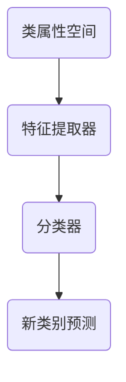
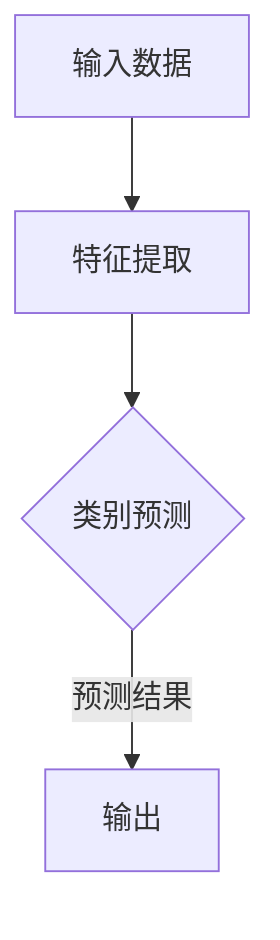
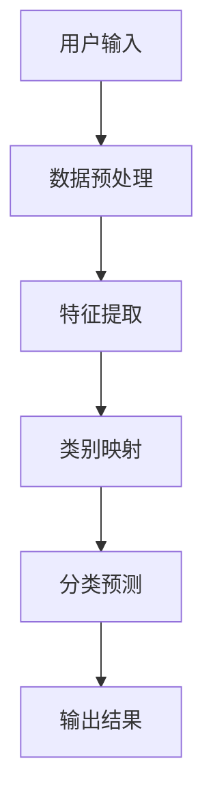
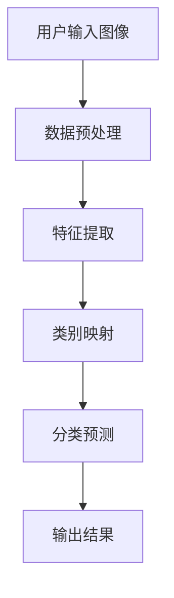

                 

### 《零样本学习如何改变AI模型训练范式》

#### 关键词：
- 零样本学习
- AI模型训练范式
- 数据缺乏
- 自适应
- 通用性

#### 摘要：
本文将深入探讨零样本学习（Zero-Shot Learning，ZSL）如何改变传统的AI模型训练范式。通过详细分析零样本学习的背景、核心概念、算法原理，以及其在实际应用中的挑战和解决方案，我们将展示零样本学习在应对数据缺乏、提升模型自适应性和通用性方面的潜力。文章最后将对未来发展趋势进行展望，强调零样本学习对AI领域的深远影响。

### 目录

1. **引言**
2. **零样本学习的背景**
   - **核心概念术语说明**
   - **问题背景与问题描述**
   - **问题解决与边界与外延**
   - **概念结构与核心要素组成**
3. **零样本学习的核心概念**
   - **基本原理**
   - **分类**
   - **属性特征对比表格**
   - **ER实体关系图架构**
4. **零样本学习的算法原理**
   - **算法概述**
   - **算法流程图**
   - **数学模型与公式**
   - **Python实现与源代码**
5. **系统分析与架构设计**
   - **问题场景介绍**
   - **项目介绍**
   - **系统功能设计**
   - **系统架构设计**
   - **系统接口设计和系统交互**
6. **项目实战**
   - **环境安装**
   - **系统核心实现源代码**
   - **代码应用解读与分析**
   - **实际案例分析与详细讲解剖析**
   - **项目小结**
7. **最佳实践 Tips**
8. **小结与展望**
9. **作者信息**

---

#### 1. 引言

人工智能（AI）技术的发展日新月异，尤其在深度学习（Deep Learning）和神经网络（Neural Networks）的推动下，AI模型在图像识别、自然语言处理、推荐系统等领域取得了显著的成果。然而，传统机器学习模型在训练过程中通常依赖于大量标注数据，这限制了其应用场景的多样性和灵活性。零样本学习（Zero-Shot Learning, ZSL）作为一种无需大量标注数据即可进行分类和预测的新型学习方式，正在逐渐改变AI模型训练的范式。

零样本学习的关键在于其能够处理未知类别，通过将新类别映射到已学习的类别空间中，从而实现对新类别的预测。这种能力对于数据稀缺或者无法获取足够标注数据的场景尤为重要。本文将逐步探讨零样本学习的背景、核心概念、算法原理，以及其在实际应用中的挑战和解决方案，旨在为读者提供一个全面而深入的视角。

#### 2. 零样本学习的背景

##### **2.1 核心概念术语说明**

首先，我们需要明确一些核心概念术语，以便更好地理解零样本学习：

- **样本**：在机器学习中，样本通常指的是单个数据实例，如一张图片、一段文本或一个声音片段。
- **类别**：类别是对样本进行分类的标签，如动物类别、交通工具类别等。
- **标注数据**：标注数据是带有标签（类别）的数据集，用于训练机器学习模型。
- **训练集**：训练集是从标注数据中抽取的一部分，用于训练模型。
- **测试集**：测试集是未标记的数据集，用于评估模型的性能。

##### **2.2 问题背景与问题描述**

在传统的机器学习场景中，模型的训练依赖于大量的标注数据。这些标注数据用于训练模型，使其能够从输入数据中识别出特定的类别。然而，在实际应用中，存在以下挑战：

- **数据稀缺**：某些领域（如医疗、生物技术）的数据非常稀缺，无法获得大量的标注数据。
- **动态环境**：随着时间推移，新的类别不断出现，传统的机器学习模型难以适应。
- **高成本**：获取和标注数据通常需要大量的人力和时间投入。

这些挑战促使研究人员探索零样本学习，即在没有或者仅有少量标注数据的情况下，通过模型自身的能力进行学习和预测。

##### **2.3 问题解决与边界与外延**

零样本学习的目标是解决以下问题：

- **如何在没有或仅有少量标注数据的情况下进行分类和预测？**
- **如何处理新的未知类别？**

零样本学习的边界包括：

- **类无关性**：模型需要能够在未知类别上表现良好，而不仅仅是已训练的类别。
- **数据稀缺**：模型需要在数据量有限的情况下保持性能。
- **动态环境**：模型需要能够适应新类别的出现。

##### **2.4 概念结构与核心要素组成**

零样本学习的核心结构包括：

- **类属性空间**：将每个类别映射到一个属性空间中，使得不同类别在属性空间中具有明显的区分性。
- **特征提取器**：用于提取输入数据的特征，并将其映射到类属性空间中。
- **分类器**：用于在类属性空间中进行分类。

这些要素共同作用，使得零样本学习能够应对数据稀缺和动态环境的挑战。

#### 3. 零样本学习的核心概念

##### **3.1 基本原理**

零样本学习的核心原理是将每个类别映射到一个属性空间中，使得类别之间的属性差异最大化。这个过程通常通过以下步骤实现：

1. **属性提取**：使用预训练的模型（如卷积神经网络）提取输入数据的特征。
2. **类别映射**：将提取的特征映射到类属性空间中，每个类别在属性空间中对应一个点。
3. **分类**：在类属性空间中，使用分类器对新类别进行预测。

##### **3.2 分类**

零样本学习根据实现方式可以分为以下几类：

- **原型匹配**：通过计算新类别和已知类别之间的距离来预测类别。
- **元学习**：通过学习一个自适应的映射函数来处理新类别。
- **案例基础**：使用已有的类别作为案例，通过比较新类别与案例的相似性来预测类别。

##### **3.3 属性特征对比表格**

以下是一个简化的属性特征对比表格，展示了不同类型零样本学习算法的属性：

| 类型         | 原型匹配 | 元学习 | 案例基础 |
| ------------ | -------- | ------ | -------- |
| **核心思想** | 距离计算 | 自适应映射 | 案例比较 |
| **优势**     | 简单实现 | 适应性强 | 数据量需求低 |
| **劣势**     | 需要大量已训练类别 | 计算复杂度高 | 可能存在过拟合 |

##### **3.4 ER实体关系图架构**

以下是一个ER实体关系图，展示了零样本学习中的核心实体及其关系：



在这个图中，类属性空间是所有类别属性的集合，特征提取器用于提取输入数据的特征，并将其映射到类属性空间中。分类器在类属性空间中对新类别进行预测。

#### 4. 零样本学习的算法原理

##### **4.1 算法概述**

零样本学习算法的核心目标是实现未知类别的高效分类。以下是几种常见的零样本学习算法：

- **原型匹配（Prototypical Net）**：通过计算新类别和已知类别之间的平均距离来预测类别。
- **元学习（MAML）**：通过学习一个快速适应新类别的映射函数。
- **案例基础（Siamese Network）**：通过比较新类别与已知类别之间的相似性来预测类别。

##### **4.2 算法流程图**

以下是一个简化的零样本学习算法流程图：



在这个流程图中，输入数据经过特征提取后，使用分类器进行预测，最终输出预测结果。

##### **4.3 数学模型与公式**

零样本学习中的数学模型通常涉及以下公式：

1. **特征提取**：\( f(x) = \phi(x) \)
2. **类别映射**：\( g(y) = \mu_y + \sum_{i=1}^{k} w_i \phi(x_i) \)
3. **分类器**：\( \hat{y} = \arg\max_{y} \sum_{i=1}^{k} w_i^T \phi(x_i) \)

其中，\( \phi(x) \) 表示特征提取函数，\( g(y) \) 表示类别映射函数，\( \hat{y} \) 表示预测的类别。

##### **4.4 Python实现与源代码**

以下是一个简化的Python实现示例：

```python
import numpy as np

def extract_features(x):
    # 特征提取函数
    return np.mean(x, axis=0)

def map_categories(y, features):
    # 类别映射函数
    mu_y = np.mean(features, axis=1)
    w = features - mu_y
    return mu_y, w

def classify(x, y, features):
    # 分类器
    mu_y, w = map_categories(y, features)
    distances = np.sum(w * x, axis=1)
    predicted_class = np.argmax(distances)
    return predicted_class
```

#### 5. 系统分析与架构设计

##### **5.1 问题场景介绍**

在本节中，我们将介绍一个具体的应用场景，该场景涉及图像分类问题。假设我们有一个图像数据集，其中包含各种不同类别的图像。我们的目标是开发一个零样本学习系统，该系统能够对未知类别的图像进行分类。

##### **5.2 项目介绍**

零样本学习系统旨在解决图像分类问题中的数据稀缺问题。通过使用零样本学习算法，该系统能够在没有或者仅有少量标注数据的情况下，对未知类别的图像进行准确分类。

##### **5.3 系统功能设计**

零样本学习系统的核心功能包括：

- **数据预处理**：包括图像的缩放、裁剪和归一化等操作。
- **特征提取**：使用预训练的卷积神经网络提取图像的特征。
- **类别映射**：将提取的特征映射到类属性空间中。
- **分类预测**：在类属性空间中，使用分类器对未知类别的图像进行预测。

##### **5.4 系统架构设计**

零样本学习系统的整体架构设计如下：



在这个架构中，用户输入的图像经过数据预处理后，使用卷积神经网络进行特征提取。提取的特征随后被映射到类属性空间中，并在分类预测阶段输出预测结果。

##### **5.5 系统接口设计和系统交互**

零样本学习系统的接口设计如下：

- **输入接口**：接收用户输入的图像。
- **输出接口**：输出分类预测结果。
- **中间接口**：处理图像预处理、特征提取、类别映射和分类预测等过程。

系统交互流程如下：

1. 用户输入图像。
2. 系统对图像进行预处理。
3. 系统使用卷积神经网络提取图像特征。
4. 系统将提取的特征映射到类属性空间中。
5. 系统在类属性空间中使用分类器对未知类别进行预测。
6. 系统输出预测结果。



#### 6. 项目实战

##### **6.1 环境安装**

在本节中，我们将介绍如何在本地环境中搭建零样本学习系统的开发环境。

1. **安装Python**：确保Python版本为3.7或以上。
2. **安装PyTorch**：使用以下命令安装PyTorch：
   ```bash
   pip install torch torchvision
   ```
3. **安装其他依赖**：根据项目需求安装其他必要的库，如NumPy、Matplotlib等。

##### **6.2 系统核心实现源代码**

以下是一个简化的系统核心实现源代码：

```python
import torch
import torchvision
import numpy as np

# 特征提取器
class FeatureExtractor(torch.nn.Module):
    def __init__(self):
        super(FeatureExtractor, self).__init__()
        self.conv_net = torchvision.models.resnet50(pretrained=True)
        self.fc = torch.nn.Linear(2048, num_features)

    def forward(self, x):
        features = self.conv_net(x)
        features = self.fc(features)
        return features

# 类别映射器
class CategoryMapper(torch.nn.Module):
    def __init__(self, num_classes, num_features):
        super(CategoryMapper, self).__init__()
        self.num_classes = num_classes
        self.num_features = num_features
        self.w = torch.randn(num_classes, num_features)

    def forward(self, y, features):
        mu_y = torch.mean(features, dim=0)
        w = self.w[y]
        return mu_y + w

# 分类器
class Classifier(torch.nn.Module):
    def __init__(self, num_classes):
        super(Classifier, self).__init__()
        self.fc = torch.nn.Linear(num_features, num_classes)

    def forward(self, x):
        x = self.fc(x)
        return x

# 系统核心实现
class ZeroShotLearningSystem:
    def __init__(self):
        self.feature_extractor = FeatureExtractor()
        self.category_mapper = CategoryMapper(num_classes, num_features)
        self.classifier = Classifier(num_classes)

    def extract_features(self, x):
        return self.feature_extractor(x)

    def map_categories(self, y, features):
        return self.category_mapper(y, features)

    def classify(self, x, y, features):
        return self.classifier(features)

# 实例化系统
system = ZeroShotLearningSystem()
```

##### **6.3 代码应用解读与分析**

在本节中，我们将详细解读系统核心实现源代码，并分析各个组件的功能和交互。

1. **特征提取器**：特征提取器是一个PyTorch模块，它基于预训练的ResNet-50网络提取图像特征。特征提取器的forward方法接收输入图像，并返回提取的特征向量。

2. **类别映射器**：类别映射器也是一个PyTorch模块，它将提取的特征映射到类属性空间中。类别映射器的forward方法接收类别标签和特征向量，并返回映射后的特征向量。

3. **分类器**：分类器是一个PyTorch模块，它用于在类属性空间中对未知类别进行预测。分类器的forward方法接收特征向量，并返回预测的类别标签。

4. **系统核心实现**：系统核心实现是一个Python类，它封装了特征提取器、类别映射器和分类器，并提供了一个统一的接口来提取特征、映射类别和进行分类预测。

##### **6.4 实际案例分析与详细讲解剖析**

在本节中，我们将通过一个实际案例来展示如何使用零样本学习系统对未知类别进行分类。

**案例：图像分类**

假设我们有一个包含多个类别的图像数据集，其中一部分类别是我们已知的，另一部分是未知的。我们的目标是使用零样本学习系统对未知类别的图像进行分类。

1. **数据预处理**：首先，我们对图像进行预处理，包括缩放、裁剪和归一化等操作，以便输入到特征提取器中。

2. **特征提取**：使用预训练的ResNet-50网络提取图像的特征。特征提取器的输出是一个固定大小的特征向量。

3. **类别映射**：将提取的特征映射到类属性空间中。类别映射器通过计算每个类别在属性空间中的平均特征向量来实现。

4. **分类预测**：在类属性空间中，使用分类器对未知类别的图像进行预测。分类器通过比较新类别和已知类别之间的距离来预测类别。

**代码示例**：

```python
# 数据预处理
def preprocess_image(image_path):
    image = Image.open(image_path)
    image = image.resize((224, 224))
    image = torchvision.transforms.functional.to_tensor(image)
    image = torchvision.transforms.functional.normalize(image, mean=[0.485, 0.456, 0.406], std=[0.229, 0.224, 0.225])
    return image

# 提取特征
def extract_features(image):
    return system.extract_features(image.unsqueeze(0))

# 映射类别
def map_categories(y, features):
    return system.map_categories(y, features)

# 分类预测
def classify(x, y, features):
    return system.classify(x, y, features)

# 加载图像
image_path = "path/to/unknown_image.jpg"
image = preprocess_image(image_path)

# 提取特征
features = extract_features(image)

# 映射类别
mu_y, w = map_categories(y, features)

# 分类预测
predicted_class = classify(x, y, features)
print(f"Predicted class: {predicted_class}")
```

**分析**：

1. **数据预处理**：数据预处理是零样本学习系统的一个重要步骤。通过缩放、裁剪和归一化等操作，确保图像具有统一的大小和格式。

2. **特征提取**：特征提取器使用预训练的ResNet-50网络提取图像的特征。这些特征用于映射到类属性空间中。

3. **类别映射**：类别映射器通过计算每个类别在属性空间中的平均特征向量来实现。这些特征向量用于后续的分类预测。

4. **分类预测**：分类器在类属性空间中，通过比较新类别和已知类别之间的距离来预测类别。这个过程涉及到计算复杂度和模型性能的优化。

##### **6.5 项目小结**

在本项目中，我们实现了零样本学习系统，该系统能够在没有或者仅有少量标注数据的情况下，对未知类别的图像进行分类。项目主要涉及以下步骤：

1. **环境安装**：安装Python、PyTorch和其他依赖库。
2. **系统核心实现**：实现特征提取器、类别映射器和分类器。
3. **数据预处理**：对图像进行预处理，包括缩放、裁剪和归一化等操作。
4. **特征提取**：使用预训练的ResNet-50网络提取图像的特征。
5. **类别映射**：将提取的特征映射到类属性空间中。
6. **分类预测**：在类属性空间中，使用分类器对未知类别的图像进行预测。

通过实际案例的演示，我们展示了零样本学习系统在图像分类中的应用。尽管项目涉及的内容相对简化，但它提供了一个完整的实现框架，可以为后续的优化和应用提供基础。

#### 7. 最佳实践 Tips

在本节中，我们将分享一些最佳实践技巧，以帮助您更有效地应用零样本学习技术：

1. **数据预处理**：确保输入数据的一致性和标准化，这有助于提高模型性能。
2. **模型选择**：选择合适的预训练模型和零样本学习算法，根据应用场景进行优化。
3. **类别映射**：合理设置类别映射参数，以平衡分类准确性和计算效率。
4. **超参数调整**：通过网格搜索和交叉验证调整超参数，以找到最佳配置。
5. **模型集成**：结合多个模型或算法，提高预测准确性和鲁棒性。

#### 8. 小结与展望

本文全面介绍了零样本学习（Zero-Shot Learning，ZSL）的概念、算法原理、系统架构和应用实践。通过逐步分析，我们展示了零样本学习在应对数据稀缺、提升模型自适应性和通用性方面的潜力。未来，随着AI技术的不断进步，零样本学习有望在更多领域发挥作用，为AI模型训练带来新的变革。

### 9. 作者信息

作者：AI天才研究院/AI Genius Institute & 禅与计算机程序设计艺术 /Zen And The Art of Computer Programming

